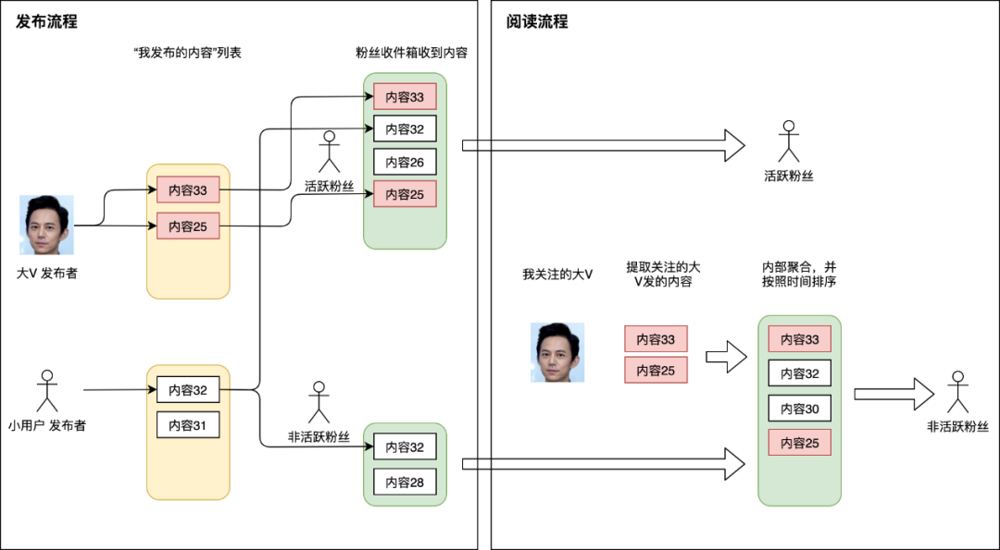

# content

* 现在有了太多的信息，因此更关键的是选择正确的信息。并不是反对社交媒体，但是它太浪费时间了。而且它有点儿非黑即白，生活远比它要复杂得多
* 美国 Verizon 公司宣布，将以前收购的两个网站---- AOL 和 Yahoo ----一起打包卖掉，一共50亿美元.内容渠道的贬值，是一个全世界的普遍现象,一个直接后果就是，内容生产者也在贬值。

## 采访控制

* 流程
    - 内容大纲
* 自由发挥
* 记录

## Feed 流

* 读扩散|拉模式:粉丝阅读时，系统首先需要拿到粉丝关注的所有人，然后遍历所有发布者的发件箱，取出他们所发布的帖子，然后依据发布时间排序，展示给阅读者
    - 读一次 Feed 流，后台会扩散为 N 次读操作（N 等于关注的人数）以及一次聚合操作
    - 好处是底层存储简单，没有空间浪费
    - 坏处
        + 每次读操作会非常重，操作非常多
        + 分页不方便:只采用实时聚合的方式，下滑到比较靠后的页码时会非常麻烦
    - 适用系统中阅读者关注的人没那么多，并且刷 Feed 流并不频繁的场景
    - 每个阅读者所能关注的人数也要设置上限
* 写扩散|推模式
    - 大多数 Feed 流产品的读写比大概在 100:1，也就是说大部分情况都是刷 Feed 流看别人发的.宁愿让发帖的过程复杂一些，也不愿影响用户读 Feed 流的体验
    - 当发布者发表一篇帖子的时候，除了往自己发件箱记录一下之外，还会遍历发布者的所有粉丝，往这些粉丝的收件箱也投放一份相同内容。这样阅读者来读 Feed 流时，直接从自己的收件箱读取即可
    - 每次发表帖子，另外起一个异步任务扩散为 M 次写操作（M 等于自己的粉丝数)
    - 好处在于通过数据冗余（一篇帖子会被存储 M 份副本），提升了阅读者的用户体验
* 读写混合模式
    - 大 V:将粉丝量作为一个判断指标
        + 粉丝量超大的人发帖时，将帖子写入何炅的发件箱，另外提取出来何炅粉丝当中比较活跃的那一批（这已经可以筛掉大部分了），将帖子写入他们的收件箱
        + 粉丝量很小的路人甲发帖时，采用写扩散方式，遍历他的所有粉丝并将帖子写入粉丝收件箱
    - 活跃粉丝:最近一次登录时间
        + 活跃用户登录刷 Feed 流时，直接从自己的收件箱读取帖子即可，保证了活跃用户的体验。
        + 非活跃的用户突然登录刷 Feed 流时，一方面需要读他的收件箱，另一方面需要遍历他所关注的大 V 用户的发件箱提取帖子，并且做一下聚合展示
* 分页问题
    - 分页入参:使用 last_id 来记录上一页最后一条内容的 id,往后偏移 page_size 条数据，返回
    - last_id 方案有一个重要条件：last_id 本身这条数据不可以被硬删除

## 生活手帖

* 日本国民杂志
	* 最初要做这本杂志的其实是一位女士——大桥镇子。这本杂志诞生的年代在战后，战败的日本处于非常贫困的状态，大桥女士的父亲很早过世，母亲把三个女儿拉扯大，很不容易，她希望为母亲尽孝心，所以她想自己创业，为同一时代的女性做这样一本杂志。
	* 作为《日本读书新闻》的记者，她去找了当时报社的社长，社长说你去找花森安治。花森安治当时也在报社帮忙，画一些插图，他有一些插画上的天赋。
	* 大桥镇子就去找他，说我想办这样的杂志。花森安治的母亲在他读高中的时候就过世了，他没有尽到孝心，所以他觉得我可以帮你，但有一个条件：**我希望这本杂志能够切实地让战争不再发生，如果我们每个人对自己的生活、我们的日常能够真正关照好，就不会再有战争。**
	* 最开始的时候，这个杂志其实是叫_Style Book_，它主要是讲时尚、服装相关的内容，**到1948年才有正式名更名为《美好生活手帖》（后改名为《生活手帖》）**
* 花森安治
	* 作为日本国民杂志《生活手帖》的第一任主编，他用三十年的时间，形塑现代日本生活美学，以一介编辑，助力日本制造走向全球。
	* 被征兵到中国，被迫参与了战争，但他一直有自己曾经也是加害者的意识，内心反战的意识非常强烈，所以他当时决定帮忙做这个杂志的**最大初衷就是希望让大家的生活真正提升，不要让战争再次发生。**
	* 从1号到100号，每一号我都亲自参与采访、拍照、撰稿、排版、插画、校对，这是我作为编辑最大的存在价值，也是无上的喜悦和荣耀。不管什么时代，做杂志，归根结底都是“手作”。我认为除此之外，别无他法。所以编辑最需要的是“手艺人”的才能。我到死那一刻，都希望自己是一个编辑。希望到那一刻为止，依然能采访、拍照、撰稿，让校对的红笔弄脏自己的手，始终做一个前线的编辑。
	* 编辑不仅仅要会编辑、写文章，还要会拍照
	* **实用文史讯。**如果菜市场卖菜的人看不懂你的文章，你的文章就不合格。**
		* 用词通俗易懂
		* 避免外来用语
		* 表达要有画面感
		* 简洁
		* 留有余韵
		* 重要的事情重复说
		* 不要用脑，要用心传达
		* 不要试图说服
		* 不要自我满足
		* 为一个人而写
	* 因为杂志每一页他都亲自确认。花森安治的编辑室其实叫**“生活手帖社研究室”**，编辑们每天要轮岗给大家烧水、做饭，晚上甚至要一起吃饭，要打扫卫生，是一个家庭式的工作环境，跟传统手工艺人的方式非常接近——弟子跟师傅一家吃在一起，师傅不像学校里那样教你，而是你看着他做，你一上来就是从打扫卫生开始做起，自己慢慢学，观察。
	* 但凡认真思考过自己的生活，想必谁都希望活的更愉快、美好，为了最求美好的品质、更美的东西痛下功夫，这就是我们认为的真正意义上的时尚
	* 《编辑部的故事》
	* 《花森安治的手艺》
	* 《改变日本生活的男人——花森安治传》
* 产品测评
	* 17年前的第20号第一次刊登“商品测评”起，就认定测评本身绝不能成为“商品”
	* **不是为了消费者，是为了厂家做的**
		* 人人都想成为“聪明的消费者”。但事实是，我们几乎被这股凶猛的商品洪流淹没。
		* 一件商品的生产和销售，既非一桩慈善事业，也非趣味使然。坦白说，其目的就是为了盈利。
		* 在“商品测评”中，须清楚地标明商品名，公布其优劣。如果测评值得信赖，那么好商品一定能卖，不被推荐的则会滞销。
		* 厂家只会生产好卖的东西。“商品测评”，其实是为生产者而存在的。这是为了让生产者专注于制作好东西的最有效的方法。
	* **任何附带的条件都会扭曲商品测评的本意**
	* **对测评人，同样也不能受到任何外力的干涉，对任何一个品牌必须要做到完全的公正。**
	* 任何时候，“商品测评”都须在“实际使用”的状态下开展
	* 在比较各种商品时，保持“同一条件”比其他任何要求都更重要。
	* 产品测评的基础，是对日常生活的深度着眼，对时代动向的发散思考，因而既是对社会的评判，也是对文化的评判。
	* **做法提升了整个社会商品的质量，商品测评不仅仅是一个杂志的内容，它也是一个社会运动。**

## 信息茧房

* 在信息传播中，公众所接触的信息是有限的，会选择自己愉悦的信息，久而久之，会将自身桎梏于像蚕茧一般的“茧房”中
* 世界之大，信息无穷，考虑到处理信息的成本与风险，人们倾向于待在认知的舒适区。这是一种自我编织的茧房。这种茧房并不可怕，因为自由竞争的压力会迫使人们走出舒适区，懒惰者、安逸者被惩罚、被淘汰
* 真正需要警惕的是他人编织的信息茧房。
    - 将古代村落沦为信息茧房的并非野兽而是君王
    - 随着文字、纸张、印刷、电报电视的问世，知识精英逐渐掌握了信息茧房的控制权。世纪之交，互联网打破信息孤岛，“逆袭”知识精英。如今，技术精英借助算法悄无声息地夺权，给每一个人都量身订做了一个信息茧房。
    - 在算法时代，以为自己拥抱了知识的海洋，其实看到的信息只是你想看到的，技术精英想给你看到的。我们每天都生活在回音壁中反复地收听那悦耳的音符。
    - 这种舒适可能引发灾难性后果——认知黑洞。信息、方法论与智慧存在关联关系。信息是方法论的原材料，方法论很重要，但不是决定性的。在信息茧房中，人们即便可以获得很多想要的信息，经过科学方法加工，也很难输出真正的智慧。
* 所谓真正的智慧，是指自然规律、人的行为规律以及思辨哲学.掌握规律靠抽象逻辑
    - 大多数人都没有能力通过数学方法来建立抽象逻辑
    - 普通人只能使用经验归纳法来认识事物。这是一种成本最低的方法,经验归纳法容易犯错
        + 信息是必要条件，但不是充分条件。不管是定量分析还是定性分析，都不可能获得充分的信息。形式逻辑的错误更多源自信息源被控制，即信息茧房
        + 比如，从小到大看到的天鹅是白天鹅，那么容易将白天鹅等同于天鹅。这就是形式逻辑。如果哪天看到了一只黑天鹅，那么你的思想可能要遭遇一场“黑天鹅”。当黑白天鹅都看过了，才不容易陷入“颜色”的形式逻辑，从更本质的角度认识天鹅。但是，很不幸的是，黑天鹅全被我宰了。这就人为地制造了“幸存者偏差”
    - 只要信息是自然流动的，即使存在信息不对称，人也可以在经验基础上建立抽象逻辑。这就是德国哲学家康德的“先验”认识论。经济学家米塞斯用先验来解释奥派的方法论。先验，其实是在经验基础上的抽象逻辑
    - 无法建立抽象逻辑的关键，不是信息不充分，而是人为设置的信息茧房。在信息茧房中，人即便可以获得特定的丰富的知识，也难以建立抽象逻辑。有些人纵然满腹经纶、博闻强识，也只是个愚不可及的老朽
    - 在信息茧房中，形式逻辑占据统治地位，偏见盛行，盲目自信
    - 帕累托探索的是经济的一般规律，而德国施穆勒领导的历史学派是典型的形式逻辑学说，它建立在德国特殊论之上，最终导向了希特勒领导的纳粹运动。
    - 信息茧房促使逻辑形式化，思维简单化，认知标签化，理论特殊化，导致人愈加封闭、自我、无知、偏执、傲慢、群氓。
* 撕裂与群氓
    - 在信息茧房中，形式逻辑战胜抽象逻辑，标签替代思考，偏执引起群氓。(动物庄园)腿的数量，就是一种形式逻辑。这种形式逻辑成为了好与坏的标准。两腿的就是坏蛋，这就是贴标签、扣帽子。
    - 缺乏抽象逻辑的人容易服从于一种哲学。米塞斯在《人的行为》中揭示了这种哲学的逻辑问题。它认为主观服从于客观，真理源自现实而非逻辑，进而推导出生产力决定论、劳动价值论、身份决定论、立场决定论、动机决定论、历史决定论
        + 服从于这种哲学的人，谈历史，使用的是盖棺定论；谈现实，强调“存在即合理”；谈国家，但不思考何为国家。他们不问是非，用折中主义掩盖错误；不知对错，用屁股决定脑袋。在公正面前，将妥协视为艺术，将守正视为愚蠢，将标签视为标准，将立场视为正义。总之，“大即原罪”，资本家等于罪犯，反对我的人一律是卖国贼、汉奸和资本家的狗腿子。
    - 信息茧房就像一个劫匪，里面的人容易患上斯德哥尔摩症。人在茧房的时间越长，沉没成本就越大。即便哪天三观受到“暴击”，也不愿意承认和醒来。因为醒来的成本太高、代价太大，心理上接受不了。“你永远叫不醒一个装睡的人”就是这个道理。相反，他们会劝你好好配合劫匪才是唯一的生路。
    - 德国大众传媒学家伊丽莎白·诺埃尔·诺伊曼提出一种理论叫“沉默的螺旋理论”。她指出，人们越沉默，特定的看法就会得到强化，越多的人屈于群体压力而加入其中，从而形成一股向下的洪流。
        + 这股股洪流可能引发一场场群氓运动。他们跟风、盲从、焦虑、易怒、狂热、纵欲，拒绝思考及放纵暴力，缺乏独立意识与思辨能力，在追求“集体灵魂”中迷失，在追逐公共利益中窃取私利。群体心理学的创始人古斯塔夫·勒庞在《群氓心理学》中指出：“深谙其道的演说家在面对群氓的演说中常常利用这些特征。
        + 桑斯坦警示：“一些国家就由于这个原因走向灾难。对于生活在信息茧房的领导人和其他人而言，这是一个温暖、友好的地方。但是，重大的错误就是舒适的代价。对于私人和公共机构而言，茧房可能变成公众一种可怕的梦魇。
* 逻辑与生意
    - 主观思想缔造了人类文明，主观价值开启了自由市场。哈耶克说：“经济理论的每一次重大进步，都是主观主义的贯彻运用又向前迈进了一步。”这句话扩大来说就是，人类社会的每一次重大进步，都是主观思想的进步。这与物质、规律的客观性不矛盾。
    - 第一步是用制度打破信息茧房
        + 在约束人的言行上，生意比道德教化更有效。因为代价与利益，我们不得不包容对方，硬着头皮去了解、理解对方。这就打破了自己的信息茧房，增进信息交流与情感融合
        + 英国古典政治经济学最后一位大师约翰·穆勒在其《政治经济学原理》有如下表述：“商业首次教育各个民族满怀善意地看待彼此的富强与繁荣。过去的爱国者，除去其中富有教养的能够将世界视为自己国家的人之外，无不希望本国以外的一切国家都贫弱而且管理不善。现在，他们将其他国家的富裕和进步视为本国富裕和进步的直接源泉。正是商业贸易通过巩固并增加与战争天然对立的个人的利益，使战争迅速遭到废弃。可以毫不夸张地讲，作为世界和平基本安全屏障的国际贸易的全面开拓和迅速发展，已经成为人类种族的思想、制度和素质不断进步的伟大的而且永久的保证。
        + 自由市场，每个人评估自己的成本与收益而行动。固步自封者、歧视者、不合作者逐渐被淘汰，而开放、自由、协作的精神得以保留与弘扬。这并不是说为自己牟利的人、生意人的道德更高尚，而是自由市场的竞争呈现了这样一种结果。
    - 第二步是建立抽象逻辑

## 内容

* [Wikipedia](https://en.wikipedia.org/wiki/Main_Page)
* [Medium](https://medium.com/)
* [Quora](https://www.quora.com/)
* [Reddit](https://www.reddit.com/)
* [BuzzFeed](https://www.buzzfeed.com/)
* [Pinterest](https://www.pinterest.com/)
* [tumblr](https://www.tumblr.com/)
* Imgur
* 掘金
* 开发者头条
* 码农头条
* 伯乐在线
* [网站 任意门](https://gate.ofo.moe/)
* 36氪
* 知乎
* [字里行间](https://zi.com/):中文写作 APP，开发者的设计功力非常强
* [简书](http://www.jianshu.com/)
* [Byword](https://metaclassy.com/):简洁，优美，专注于文字。非常棒的写作工具。

* 得到
* [极客时间](https://github.com/shawjia/geektime-desktop)

* [hackernews-daily](https://github.com/headllines/hackernews-daily)
* [weekly](https://github.com/ruanyf/weekly):技术分享周刊，每周五发布
* [zenany](https://github.com/zenany/weekly):汇总平时看到的好文章，技术、产品、管理均有，尽量保证一周汇总一篇
* [thepracticaldev](https://github.com/thepracticaldev/dev.to):Where programmers share ideas and help each other grow <https://dev.to>
* [Trending](https://github.com/trending):See what the GitHub community is most excited about today.
* [HelloGitHub](https://github.com/521xueweihan/HelloGitHub):octocat: Find pearls on open-source seashore 分享 GitHub 上有趣、入门级的开源项目 <https://hellogithub.com/>
* [awesome](https://github.com/sindresorhus/awesome) Curated list of awesome lists
* [Aggregated Awesome](https://aggregatedawesome.com/):There are several awesome lists on GitHub that collect and curate the best resources for a specific programming language, framework, platform, etc.
* [Awesome-Lists](https://github.com/wx-chevalier/Awesome-Lists):📚 Guide to Galaxy, curated, worthy and up-to-date links/reading list for ITCS-Coding/Algorithm/SoftwareArchitecture/AI. 💫 ITCS-编程/算法/软件架构/人工智能等领域的文章/书籍/资料/项目链接精选，岁月沉淀的美好
* [Developer-Zero-To-Mastery](https://github.com/wx-chevalier/Developer-Zero-To-Mastery):📚 To Be Professional Developer From Zero To Mastery, Interactive MindMap, RoadMap(Learning Path/Interview Questions), xCompass, Weekly for Developer, to Learn Everything in ITCS 💫 程序员的技术视野、知识管理与职业规划，提高个人与团队的研发效能
* [goodies](https://github.com/rsapkf/goodies):Collection of GitHub repos, blogs and websites to learn cool things <https://goodies.gitbook.io/goodies/>
* [lists](https://github.com/jnv/lists):The definitive list of lists (of lists) curated on GitHub and elsewhere

## 看理想

* 1998～2018，慢慢听别哭啊
* 做了不等于做到
* 洗白自己，干掉坏习惯
* 《圆桌派》
    - 大学：谁的青春不迷茫
        + 人这一生如果能有幸进入大学，你的生命里边有这么一段时光，在大学里把一切问题把它讲好它，解决好它，各种疑问解决好它，你回到社会上，你才是一个人格健全的人。
* 徐贲 《西方的起源：古希腊经典选读》
    - 第一，幸福是一个难以把握的观念，因为不同时代的人会有不一样的看法，即使是同一个时代的人，对幸福是什么也会有不同的理解。每个人都有追求他认为的幸福的权利，只要不伤害到别人，就不应该被禁止或者阻挠。第二，每个人都需要好好把握自己的幸福，因为，就算是别人出于好心给你安排的幸福，也有可能让你变得不幸。
* 陈迪 《观念辞典：你身边的政治学》
    - 种子是要长大的，污名是会扩散的；激进还是温和，区别只是参照系而已。只要政治正确的污名化帽子越变越大、越变越宽，它早晚会将任何带有多元、包容、性别友好、种族平权价值线索的主张，都给通通包裹进去。
* 周濂 《惊奇之旅：简明西方哲学史》
    - 此外，抽签制看似强调平等，其实却是在伤害平等。就像亚里士多德所说的那样，以不平等的方式对待平等之人是为不平等，以平等的方式对待不平等的人同样也是不平等。
    - 哲学是一个动词而不是一个名词，哲学的本质不在于掌握真理而在于寻找真理。
* 刘瑜 《可能性的艺术：比较政治学30讲》
    - 自由从不降临于人类，人类必须上升至其高度。
    - 政治复杂到让人绝望，却也让思考充满乐趣
        + 虽然人类已经能够上天入地、呼风唤雨，但仍然会为能不能退出一个宗教打得头破血流，为一句刺耳的言论付出沉重代价，为一句口号沦为无法退出的实验品，为一场选举而反目为仇。
        + 没有常识未必是一件坏事。为什么？因为如果知识是确切的，专制就是必要的。
        + 恰恰是知识的不确定性，让我们需要在每一个时代、每一个情境中不断重返基本的道德问题和历史经验，用我们自己的头脑思考，并以这种思考成就人之为人的尊严。
        + 如果说自然科学的知识是在建造一座层层累加的高塔，社会科学的知识则更像是西西弗斯在推石头，推上去，掉下来，再推上去，再掉下来。或许有人认为西西弗斯的努力是一种徒劳，殊不知原地踏步或许正是对自由落体的抵抗。
        + 政治复杂到令人绝望，但也正是这种复杂，让思考充满乐趣，让自由成为必要，让未来涌现无穷无尽的惊奇。
* 鞠白玉 《祛魅：当代艺术入门》
    - 女性主义不是为了消除性别差异，而是在反思被男权界定的女性身份。卢卡斯是在嘲讽，那种男性规定下所想象、所期待的女性美，谁说女性就应该是精巧和美丽的呢？她在告诉人们，“女性”一词无法定义。
* 王瑞芸 《10件作品里的西方艺术史》
    - 当代艺术后来变成了脏乱差，你什么手段都可以拿出来，因为它要紧的不在这，要紧的在一个观念的表达。这也是为什么西方当代艺术这么多样、这么没法归纳。
* 詹青云 《正义与现实：像律师一样思考》
    - 法律不是黑白分明的，而是利益博弈和斗争的结果。我觉得有可能，我们用黑白这两个字去描述法律的时候，本身就会带着一些小小的偏见跟误导。因为，法律没有那么单纯，没有那么分明。很多时候法律不是一套确定无疑的标准答案，它是许许多多的利益博弈和斗争的结果。
* 严飞 《像社会学家一样思考
    - 所谓阶级，就是这样一些集团，由于它们在一定社会经济结构中所处的地位不同，生产资料的关系不同，在社会劳动组织中所起的作用不同，其中一个集团可以占有另一个集团的劳动。
* 杨照 《曾经江湖：重读金庸》
    - 金庸之所以了不起，因为他写了很多的配角，而且这些配角在个性上很多都跟主角同等的精彩。更重要的是你不要忘了金庸不只是写男主角，这是金庸的武侠小说跟整个庞大的武侠小说传统上面最大不同的地方，那就是他擅长写女性，而且他写了好多女性角色，我们不能忘掉他所写的女性角色。
* 白先勇 《白先勇细说红楼梦》
    - 所谓social order，整个社会秩序，是要有理性地来规划，但很多时候，人的感情很复杂，不一定受得了理的约束。像宝玉、黛玉都是很奇特的，他们个人的个性不一定为它所拘，所以当然就产生了很多悲剧，痛苦。
* 廖伟棠 《诗意：关于新诗的三十种注脚》
    - 余秀华的大多数的诗里并不存在这种廉价的安慰，尤其是在她成名之前写的诗，无论是关于爱情，还是物质的生活，她都处于一种贫乏状态。她如何去直面这种现实，和它进行一种近乎残酷的搏斗，这种搏斗不但出现在她人生里，也出现在她的诗歌语言里。
* 梁文道 《一千零一夜》
    - 那既是美国最繁华的年代，也是贫富差距最大的年代。它是整个现代文明的隐喻，是一个铜币的两面，一边看起来非常亮丽，但另一边翻过去，就是人心的虚无与空洞。
* 陶朗歌 《漫画实验室：打开你的思维次元》
    - 谎言的代价是什么？如今当我们回望那段历史时，会发现整个切尔诺贝利事件，从始至终都被包裹在一层层的谎言之中，苏联政府的噤声和欺瞒为整起事件包裹上了更为悲剧的色彩，无数平民被裹挟在谎言的漩涡之中，有的英年早逝，有的终身残疾，有的甚至危及他们的下一代。
* 阿郎 《21世纪伟大电影》
    - 爱情是人类叙事最永恒的母题，迷人之处在于其简单与复杂的一体两面。爱情最简单，这世界上所有爱情的起伏曲线都是一样的。爱情又最复杂，所有人都知晓它大致的轮廓和走向，但没有人可以猜到，每一个爱情会以什么样的方式走到那个最终会走向的尽头。

## 蔡康永的情商课

## 刘树勇 老树画画

## 新闻

* [the atlantic](https://www.theatlantic.com/world/)
* 
* [translations](https://github.com/oldratlee/translations):🐼 Chinese translations for classic IT resources <https://github.com/oldratlee/translations/blob/master/README.md>

## 翻译

* [gold-miner](https://github.com/xitu/gold-miner):🥇掘金翻译计划，可能是世界最大最好的英译中技术社区，最懂读者和译者的翻译平台： <https://juejin.im/tag/>掘金翻译计划
* [translations](https://github.com/oldratlee/translations):Chinese translations for classic IT resources
