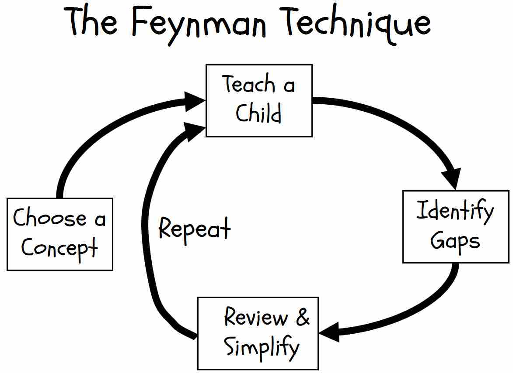

## Linus Torvalds 林纳斯·本纳第克特·托瓦兹

* Linux之父，是开源理念的发起者之一，曾经花费了两周时间写出了著名的GIT版本控制器，现在林纳斯在非营利性组织开放源代码开发实验室工作，全职开发Linux。对于Linux，林纳斯表示:一切为了好玩。支持开源主要由两个原因：第一是开源能够促进软件行业的发展，第二是开源是追求最佳技术的最好方式

## 丹尼斯·里奇

* C语言，UNIX之父

## Richard Stallman

* Emacs文本编辑器，多种语言编译器GCC的创造者。GNU项目发起人，开发出很多核心工具，例如：Emacs，GCC,GDB和GU Make Free Software公司创始人。
* 由于Emacs的成功，设立了一个基金会:自由软件基金会(Free Software Foundation，FSF)。所写作的GNU通用公共许可证（GNU GPL）是世上最广为采用的自由软件许可证
* 自由软件基金的创始人，自由软件运动的核心人物，GNU操作系统的创始人
* 反对目前的版权，版权在英文里叫Copyright，right有右边的意思，也有权利的意思。所以他提出Copyleft，left有左边的意思，有离开的意思，也有保留的意思，和Copyright成为左和右对应关系。Copyleft不是放弃版权，而是说一个程序员写出一个软件，他保有这个软件的版权，同时他在理念上赞同人们在购买也好，赠与也好，得到这个软件之后可以进行修改和重新发布。同样的，当某个人对软件修改和重新发布之后，不能把软件变成封闭项目，同样要允许其他用户进行修改和重新发布。这样一来，最大限度地保证了思想的传播和用户的自由。
* 在2019年被逐出了他自己创办的自由软件基金。为什么会这样呢？你还记得那个莫名其妙死在监狱里的美国大亨爱泼斯坦吧？他因为向世界政要和名流提供性服务而臭名昭著，这些名流中爆出了一位人工智能界的权威人物，麻省理工大学的明斯基。消息传出，麻省理工大学的学生们就开始在邮件组里进行声讨。RMS刚好在这个邮件组里，他刚好是明斯基的朋友，而明斯基在2016年已经去世，无法再为自己辩护。所以，RMS就在邮件组里为明斯基做辩解，表示事发时女方可能是自愿的，17岁或者18岁的法律界定在各国并不一致，说明这种年龄界定细节本身就是荒谬的。这些不适当的言论迅速引起轩然大波，RMS成为了取消文化的对象。迫于巨大的外界压力，他从自由软件基金辞职，放弃了董事身份。
* 2021年3月，RMS在一次直播中宣布自己将会返回自由软件基金，并且重新领导这个机构。消息传出，在社交网络上立即激起了反对运动。上千人联名反对他的复出，RedHat等组织发表声明，宣布停止对自由软件基金的捐赠，今后将拒绝参加一切相关活动。在抗议声明中不单要求禁止RMS复出，而且应该让整个自由软件基金的董事集体下台。为此，网上分别出现了两个联署链接，一个用于签名表示反对RMS复出，一个用于签名表示支持RMS复出。
* 这个反对运动一开始在社交网络上声势浩大，由于双方都有许多程序员，所以反对RMS复出的一方还甚至做了一个Chrome插件，抓取了支持方的签名，然后在LinkedIn上把这些支持者的名字变成红色，有种当众公开吊打的感觉。但是，一周时间过去之后，支持者一方的签名数量越来越多，然后反超反对者人数，再后来达到了反对者人数的一倍以上（根据@virushuo 的观察，他可能随后会写一篇专门的文章，他的公众号叫做歪理邪说），而且还在随着时间不断上涨。事情就变得很尴尬了，有些反对者开始默默撤回签名。
* 在4月12日，自由软件基金发布声明，宣布重新迎回RMS进入董事会，同时，也表示RMS之前发表的言论是错误的，他对此也表示了遗憾。也公开承认，RMS的一系列言论对自由软件基金会造成了负面影响，对一些人造成了困扰。但最终，RMS还是成功复出，程序员们取消了他所承受的取消文化。
* 他的许多言论并不让人喜欢，有些甚至让人难以接受。比如说在乔布斯去世之后，他说的是：我并不乐于见到乔布斯的死亡，但我乐于见到他终于滚蛋。再比如说他对明斯基的辩护，实质上等于是在为强奸幼女做开脱，因为他要重新定义依照年龄判断罪行的标准。但是，让这样的人彻底消声是另外一件事情。一个对世界有巨大贡献，一个为世人提供思想武器，一个坚持开源软件理念的人，可能并不会是个完人，有时候甚至会非常恼人，这本来是个常识。但在取消文化之下，有一种整齐划一的标准，需要把每一个人都框进去，否则就要封杀掉，这是把人当做盆景来对待。

* 本贾尼·斯特劳斯特卢普：C++之父，现任摩根士丹利信息技术部门董事总经理、哥伦比亚大学计算机科学系客座教授，美国国家工程学会会员，IEEE、ACM、CHM资深会员。
* Michael “Monty” Widenius：MySQL创始人，19岁的时候，他从赫尔辛基理工大学辍学开始全职工作，因为大学已经没有什么东西可以教他了。在独自一人写完除了一个库以外的全部代码之后，33岁时，他发布了MySQL
* Marc Ewing：Red Hat 创始人
* 吉多·范罗苏姆：Python之父，1989年，他创立了Python语言。
* Mark Shuttleworth：Debian操作系统开发者，
* FabriceBellard：开发了许多著名的开源软件，其中最著名的是QEMU硬件模拟虚拟平台，FFmpeg多媒体数据处理软件，Tiny C编译器，LZEXE解压缩软件
* Rasmus Lerdorf：丹麦格陵兰的Rsamus Lerdof 以创建PHP语言闻名，他编写了最初的两个版本，Lerdorf也与Andi Gutmans and和后来创建zend的Zeev Suraski形成的开发小组，完成了PHP最后一个版本的开发。他93年毕业于Wterloo，并获得系统设计工程学士。2002年起，受聘于Yahoo！，职位基础架构师。
* 陆奇
  - 确认离开之前，与百度高级副总裁、百度搜索公司总裁向海龙之间的矛盾已经水深火热，陆奇出走、向海龙将离职的消息逐个爆出
  - 5月18日，16：30，百度高层还处在极力挽留陆奇留下的状态；17：00，陆奇给出明确答复——离开
* Andrew Moore
* 吴恩达
  - 曾领导过谷歌大脑，也在百度担任过副总裁和首席科学家。离开百度后，他开设了机器学习的网络课程——Deeplearning.ai，之后不久又开创了面向制造业的 Landing.ai。今年年初，吴恩达又宣布进军风险投资领域，斥资 1.75 亿美元成立人工智能创业投资机构 AI Fund
* Jeff Dean：谷歌搜索索引技术的幕后大脑，谷歌大规模分布式计算系统的设计师 如：站点爬行，索引与搜索，在线广告，MapReduce，BigTable以及Spanner(分布式数据库)。如：站点爬行，索引与搜索，在线广告，MapReduce，BigTable以及Spanner(分布式数据库)
* John Carmack 第一人称射击游戏经典师祖《Doom》(毁灭战士)之父，id Software公司联合创始人，制作了很多脍炙人口的游戏，如：《德军司令部》（Wolfenstein 3D，又名《刺杀希特勒》）、《Doom》(毁灭战士)、《Quake》(雷神之锤)。
* Bill Joy
  - 20岁出头，在加州大学柏克利分校读研究生，是 Unix 系统 BSD 版本的主要作者之一。因为找不到合适的编辑器，他用一个周末，在 ex 命令的基础上创造了 Vi 编辑器。Unix 系统的 TCP/IP 协议也是他实现的
  - 28岁时，他与其他人一起创建 Sun 系统公司，担任首席科学家，参与发明了 Java 语言。
  - 2003年，49岁时，他从 Sun 公司离职，改为从事风险投资。但是，他不投互联网公司，只投绿色能源，尤其是新型电池。
* 保罗·格雷厄姆（英语：Paul Graham，1964年11月13日－），哈佛大学应用科学（计算机方向）博士学位，美国著名程序员、风险投资家、博客和技术作家
  - 公司：他是著名的创业投资公司 Y Combinator 的创始人，这个公司有个新闻网站叫 Hacker News。
  - 书：他还写了本书《Hackers & Painters》（黑客与画家）
  - 钱：最早的 Web 应用 Viaweb 的创办者之一，1998 年被雅虎以近 5 千万美元价格收购，后成为 Yahoo! Store。
* 周筠
* 陈为
* 翁恺
* [陈皓](https://www.ituring.com.cn/article/9174)
  - 98年大学毕业，找到了一份令旁人羡慕的银行工作，后来离开
    + 银行正值扩张电子信息化业务的时候，其实应该有很多事可做，但是当时的主要工作都是由厂商来干。比如说IBM或Cisco拿下单子来，会把工作外包给系统集成商。作为一位技术人员，其实可以发挥的空间并不大，多数时间只是出了问题打电话的角色。没有人会教你任何事，出了问题，就是打电话，然后按照他们的指导来完成工作
    + 当时的辞职书是这么写的：“本人对现有工作毫无兴趣，申请辞职。”处长说，“你可以这么写，但是要加上‘经调解无效’，另外，分给你的房就不能要了。
  - 第一次去面试
    + 问了我半个小时，我一个问题都答不上来。我一直低着头，好像被审问的犯罪分子一样。我从大学毕业出来就没经历过什么面试，再加上自己内向的性格，所以，整个过程我都在低着头，不敢看别人一眼
    + 面试官问了我一个问题是“有不懂的问题你会怎么办”，这样的问题我都不敢回答
    + 最后面试官对我说：“你出来干什么，象你这种性格根本不适合
  - 决定经常出去面试，基本上每周都要去，不管懂不懂，也不管是什么公司，也不管别人鄙不鄙视我，反正一有机会就去面试
  - 散乱地学习两年后，才慢慢确定了要走C/C++/Unix/Windows系统底层的路子。这样扑天盖地学习的结果有一个好处就是，成长的速度相当之快。我自己摸索到了适合我的学习方法（从基础和原理上学习），从而不再害怕各种新的技术
  - 等到一年半之后，用句赵本山的台词说，我在面试中学会抢答了。面试官的问题没问完，我就能说出答案了。其实，基本上是面一个公司过一个,感到技术能力不行就去学技术，交往能力不行我就去面试
  - 没什么技术含量的工作,想尽一切方法提高交作业的效率.有更多的时间，去研究公司里外那些更为核心更为有技术含量的技术
    + 要去经历大多数人经历不到的，要把学习时间花在那些比较难的地方
    + 要写文章就要写没有人写过的，或是别人写过，但我能写得更好的
    + 更重要的是，技术和知识完全是可以变现的.只要能帮上大忙，就一定会赢得别人的尊重
    + 培训公司的投入产出比明显高很多后
  - 25~35 岁是每个人最宝贵的时光，应该用在刀刃上,把我的时间投在一些主流、高级和比较有挑战性的技术上，这可以让我保持两件事儿：一个是技术和技能的领先，二是对技术本质和趋势的敏感度
  - 从亚马逊到阿里巴巴是我在互联网行业的工作经历，这两段经历让我对这两家看似类似但内部完全不同的成功大公司，有了更为全面的了解和看法.两种完全不一样甚至有些矛盾的玩法
  - 新技术态度
    + 会去了解，但不会把很大的精力放在这。这些技术尚不成熟，只需要跟得住就可以了
    + 成熟的技术，比如Unix，40多年，C，40多年，C++，30多年，Java也有将近20年了……，所以，技术并不多啊。还有很多技术比如ruby,lisp这样的，它们没有进入主流的原因主要是缺少企业级的应用背景
    + 一个脉络下来，70年代Unix的出现，是软件发展方面的一个里程碑，那个时期的C语言，也是语言方面的里程碑。（当时）所有的项目都在Unix/C上，全世界人都在用这两样东西写软件。Linux跟随的是Unix, Windows下的开发也是 C。这时候出现的C++很自然就被大家接受了，企业级的系统很自然就会迁移到这上面，C++虽然接过了C的接力棒，但是它的问题是它没有一个企业方面的架构，否则也不会有今天的Java。C++和C非常接近，它只不过是C的一个扩展，长年没有一个企业架构的框架。而Java出现之后，IBM把企业架构这部分的需求接了过来，J2EE的出现让C/C++捉襟见肘了，后面还有了.NET，但可惜的是这只局限在Windows平台上
    + 另外一条脉络就是互联网方面的（HTML/CSS/JS/LAMP…）。这条脉络和上述的那条C/C++/Java的我都没有放，作为一个有技术忧虑症的人，这两条软件开发的主线一定不能放弃。无论是应用还是学术，我都会看，知识不愁多。何必搞应用的和搞学术的分开阵营，互相看不起呢？都是知识，学就好了
    + 技术的发展要根植于历史，而不是未来。不要和我描述这个技术的未来会多么美好，用这个技术可以实现什么花哨的东西。很多常青的技术都是承前的。所以说“某某（技术）要火”这样的话是没有意义的，等它火了、应用多了咱们再说嘛（笑）。有些人说不学C/C++也是没有问题的，我对此的回应是:如果连主干都可以不学的话，还有什么其他的好学呢？极端一点，我要这么说：这些是计算机发展的根、脉络、祖师爷，这样的东西怎么可以不学呢
  - 真正的高手都来自知识密集型的学院派。他们更强的是，可以把那些理论的基础知识应用到现在的业务上来。但很可惜，我们国内今天的教育并没有很好地把那些学院派的理论知识和现实的业务问题很好地接合起来.
  - 教育和现实脱节太严重了，教的东西无论是在技术还是在实践上都严重落后和脱节，没有通过实际的业务或技术问题来教学生那些理论知识，这是一个失败
  - 早上7:30起床，会浏览一下国外的新闻，hacker news, tech church, reddit, highavailability之类的站点,9点上班。晚上6、7点钟下班，开始带孩子。十点钟孩子睡了觉，我会开始重新细读一下这一天都发生了些什么事情。这个时间也有可能会用来看书。学习的过程（我）是不喜欢被打断的，所以从十点到十二点，家人都睡了，这正是我连续学习的好时间。可能从晚上11:30开始，我会做点笔记或者写博客。我现在对酷壳文章的质量要求比较高一些，所以大概积累一个星期的时间才可以生成一篇文章。每天我大概都在一两点钟才会睡觉。没办法，我有技术焦虑症
  - 前端后端都是编程，Javascript是编程，C++也是编程。编程不在于你用什么语言去coding，而是你组织程序、设计软件的能力，只要你上升到脑力劳动上来，用什么都一样，技术无贵贱就是这个意思
  - 入世和出世要分开，不要让世俗的东西打扰到你的内心世界，你的情绪不应该为别人所控，也不应该被世俗所污染，活得真实，你才会快乐。第二点就是要有热情，有了热情，你的心情就会很好，加班都可以是快乐的，想一想我们整个通宵用来打游戏的时光

## [Richard P. Feynman](https://www.feynmanlectures.caltech.edu/)

* 不顾父母和朋友们的反对，坚持与当时已患有肺结核的亚琳结婚。费曼回忆说：“我把自己的观点和理性跟她分享，因而改变了她。她也改变了我，对我帮助很大。她教我，人有时也要不理性。这并不代表愚蠢，而是说在一些场合或情况中，你要思考，但有时你不应该思考。女人向来对我有很大的影响，是她们让我成为今天这个比较好的人。她们代表生活中的情感层面，我知道情感层面也非常重要... 我娶她的时候，就已经知道她有肺结核。我的朋友都说既然她有肺结核，我就不该娶她。但我娶她不是出于责任感，而是因为我爱她。

-  别闹了，费曼先生 Surely You're Joking, Mr. Feynman!": Adventures of a Curious Character
- 你干嘛在乎别人怎么想
- 费曼传
- **费曼的彩虹**
- **发现的乐趣**
- 费曼物理学讲义 The Feynman Lectures on Physics
- 物理定律的本性

### 费曼技巧|费曼学习法 Feynman Technique

* 爱因斯坦曾说过：If you can’t explain it simple, you don’t understand it well enough。其实把这句话进行倒推，也就成为费曼学习法的关键：如果想弄明白一个概念，那就把它简明扼要地解释清楚。
* There’s no miracle people. It just happens they got interested in this thing and they learned all this stuff. There’s just people.
* 两种知识
	* Know the name of something 集中在知道某物的名字
	* Know something 专注于真正了解某件事，也就是理解某件事。
* 教是最好的学习方式
	* “The person who says he knows what he thinks but cannot express it usually does not know what he thinks.” — Mortimer Adler
	* 根据学习金字塔原则（The Learning Pyramid or The Cone of Learning）：教别人(Teach Others)的学习内容平均留存率为90%，一般包括：说给别人听、教授给他人、输出自己的知识和见解。
		* 被动学习 	阅读 (Reading) 	~10%
		* 被动学习 	听讲 (Lecture) 	~5%
		* 被动学习 	阅读 (Reading) 	~10%
		* 被动学习 	视听 (Audiovisual) 	~20%
		* 被动学习 	演示 (Demonstration) 	~30%
		* 主动学习 	讨论 (Discussion) 	~50%
		* 主动学习 	实践 (Practice Doing) 	~75%
		* 主动学习 	教授给他人 (Teach Others) 	~90%
	* 真正重视学习的人，他们热爱阅读、听讲与上课，并且把握机会参与讨论、观摩与传述分享，在生活休闲与工作上更是刻意地从实务经验中反思学习，换句话说，学习金字塔上所有的学习活动他们都乐于参与且主动学习。
* 步骤
	1. Choose a concept you want to learn about 在空白纸的顶部写下概念的名称
		1. 选择主题的时候要注意不能太大，同时要尽量的具体。太大的主题，让人无从下手。比如：心理学，就不是一个好主题。更进一步，可以写下一个更具体的条目，比如：「心理学里的范式」。这让我们减少犯拖延症的机会，更有效的学习。
	2. Pretend you are teaching it to a student in grade 6：使用简单的语言在空白纸页面上写下概念的解释。假装自己正在向其他人（例如，新学生）教书，这应该突出显示自己了解的内容，但更重要的是查明自己不太了解的内容
		1. 在自我解释那些你理解或不理解的只是过程中，你会理解的更好，而原先不明白的地方也得以理清
		2. 检验是不是真正理解了一个问题的试金石,不过是 know the name of it. 知其然而不知其所以然
		3. 遇到的问题就是在尝试和试错中的宝贵经验，应该通过各种方式搞清楚。通过查漏补缺，学习过程成为了一个动态的循环过程，而不是被动的接受。
		4. In preparing for his oral qualifying examination, a rite of passage for every graduate student, he chose not to study the outlines of known physics. Instead he went up to MIT, where he could be alone, and opened a fresh notebook. On the title page he wrote: Notebook Of Things I Don’t Know About. For the first but not the last time he reorganized his knowledge. He worked for weeks at disassembling each branch of physics, oiling the parts, and putting them back together, looking all the while for the raw edges and inconsistencies. He tried to find the essential kernels of each subject. When he was done he had a notebook of which he was especially proud.
	3. Identify gaps in your explanation; Go back to the source material, to better understand it. 感到疑惑时, 查看自己不知道的内容，回过头来，重新阅读参考材料、听讲座或找老师解答，直到你搞懂为止，然后把解释记到纸上 
	4. Review & Simplify: 如果自己使用的语言过于冗长或令人困惑（或者只是对源材料进行了措辞），尽量用简单直白的语言重新表述它，或者找到一个恰当的比喻以更好的理解它
		1. 做无论什么数学的东西，我都会找到一些实际例子来说明他有什么用处。
* 进化
		1. 高亮那些关键概念,写下笔记
		2. 将高光出来的资料，按层级、重要程度、逻辑思维等规则，提炼核心知识点，整理成思维导图。
		3. 输出：写作、演讲



## 科学

* 斯坦福人工智能实验室（SAIL）
	* 全球顶级的人工智能研究机构之一 SAIL 由人工智能之父、Lisp 语言发明者约翰·麦肯锡于 1962 年创立。该实验室拥有多个领域的专家，涉及机器人技术、计算机视觉、机器学习、图像处理、自然语言处理等多个领域。
* 李飞飞
	* 谷歌云人工智能与机器学习团队首席科学家
	* 重回斯坦福任教，同时仍担任谷歌云的 AI/ML 顾问，而她原本的职位则由 CMU 计算机学院院长 Andrew Moore 接任，后者将于今年底离任 CMU 计算机学院院长一职，全职加入谷歌。外界的传言虽然得到了证实，但作为少有的人工智能华人女科学家，李飞飞本身就颇具话题度，关于她重返斯坦福之后的动作，大家纷纷拭目以待。
	* 将不再担任 SAIL 负责人，这一职位将由 Manning 负责，李飞飞担任新项目——「以人为中心的 AI 计划」的联合负责人。正如其名，「以人为中心的 AI 计划」旨在把人置于人工智能的中心。它将致力于支持跨学科研究的广度，促进学界、业界、政府和群众之间的对话，也就是一种以人为中心的人工智能。它创立的初衷在于，人工智能带来的回报和风险是等同的，AI 需要有人负责去引导，也要是人文主义的。而李飞飞即将全身心投入去做这件事，不再对 SAIL 负责。这不由令人想起一件事，在她宣布「以人为中心的 AI 计划」之后，李开复对她评价道：李飞飞是 AI 的良心。
* 杨振宁
  - 杜致礼（1927年12月—2003年10月）
    + 陕西米脂县人，国民党高级将领杜聿明的长女。
    + 出生 军人家庭，从小受到严格教育，酷爱文学和音乐，深得蒋介石夫人宋美龄的喜爱
    + 青少年时期适逢抗日战争，就读于西南联合大学附中。1944年，在国立西南联合大学附属中学读高中的杜致礼认识了她的数学教师杨振宁
    + 1947年，杜致礼只身前往美国留学，进入宋美龄为她安排的美国著名女子学院“卫斯里学院”攻读英国文学
    + 不久她父亲杜聿明在淮海战役中被俘，家道中落，为了节省开支，杜致礼转到纽约圣文森学院
    + 1949年圣诞节，杜致礼在普林斯顿中餐馆“茶园餐厅”邂逅了5年没见的杨振宁。
    + 1950年8月26日，28岁杨振宁和23岁杜致礼在普林斯顿举行了婚礼。
    + 1952年返回台湾，在花莲中学当了一名英文教员。之后，移居美国随丈夫杨振宁生活在一起。
    + 杜致礼一直在美国纽约州立大学石溪分校担任中文教师，她和杨振宁在普林斯顿度过了大部分时光
  - 1942-1944年间，黄昆、杨振宁和张守廉三人是西南联大研究院的同班同学，分别师从吴大猷、王竹溪和周培源先生。他们三人都极有物理天赋；每天一起上课，下课后一起泡茶馆讨论各种问题，晚上又住在同一间宿舍，整天形影不离；三人还分享一个中学教师的工作，被称为“三剑客”
  - 得到物理学硕士学位后，杨振宁考取庚款留美公费生，去芝加哥大学攻读博士学位；黄昆被庚款留英公费录取，去布里斯托尔大学师从莫特（N. F. Mott，1977年诺贝尔物理奖获得者）；张守廉则去了普渡大学电子工程系。出国以后，黄昆与杨振宁不常通信，一写则洋洋数千言。刚去美国时，杨振宁在Allison实验室工作，实验不顺利，同事间流传“哪里有爆炸，哪里就有杨振宁”的玩笑话。
  - 1947年初，杨振宁给黄昆写了一封长信，信上用了disillusionment（幻灭）这个词来形容自己的心情。4月1日黄昆回了一封长信，这封信一直保存在杨振宁的来往信件档案中。
* 钱学森
  - 家世显赫，父亲是浙江省教育厅厅长；聪明过人，从小被称为神童
  - 24岁出国留学
  - 刚刚成为麻省理工的终身教授——这是别人要花几十年才能奋斗得到的，而这位单身汉当时不过36岁
  - 蒋百里和钱学森的父亲钱均甫是挚友，早年还一起赴日本留学，蒋家与钱家早已是世交
  - 钱学森的妈妈只有钱学森一个，一直想有个女儿，于是提出，是否能从蒋家妈妈那里要一个女儿过继,蒋家妈妈问：你要哪一个呢？钱家妈妈说：我要小三子。小三子，就是蒋英。蒋英变成了钱学英，到了钱家。但只待了几个月，就吵着闹着要回家，原因很简单:他有很多玩意儿，口风琴、球什么的，但他不会跟小妹妹玩，他就看着我，逗我，所以我不喜欢这个哥哥，我要回家。
  - 1947年从美国回上海，是应父亲的要求。父亲的意图很明显，应该成家了,其中一场饭局的组织者，是钱学森的干妹妹蒋英。
  - 蒋英的闺蜜立刻看上了钱学森，蒋英后来回忆，这位“贵族出身”的小姐当即邀请钱学森第二天上午去她家观赏名画，因为钱学森在饭局中提及自己喜欢艺术。然而，钱学森回答：真不好意思，我明天上午那个时间没有空。蒋英觉得钱学森很不给她面子，但更让人尴尬的是，所有人都发觉，这位单身汉在吃饭的时候，只聚焦在干妹妹身上，“左看看右看看，反正一直在盯着我看。”
  - 之后，蒋英去上海交通大学听了一次钱学森的学术演讲，讲座结束之后，钱学森提出要送蒋英回家。回到蒋家，钱学森坐着不走，也不说话。蒋英出于客气，就对钱学森说，我这里有很多唱片，我给你挑一张放放听听好不好？钱学森说：不好。气氛又尴尬了。这样坐了一会儿，钱学森笑呵呵地，开口了：咱们什么时候一起去美国啊！ 很多年之后，蒋英回忆起这个细节，脱口而出：我心说，怎么就咱们了？什么时候咱们了？一起去美国，这意思再明确不过，是求婚。方寸大乱的蒋英选择了拒绝，她对钱学森说：我有男朋友了。钱学森回答：我也有女朋友，但从现在开始，你的男朋友不算，我的女朋友也不算。从回国第一次见面，到最终结婚，蒋英和钱学森只用了六个星期。
  - 1947年9月17日下午6点，钱学森和蒋英的婚礼在上海和平饭店举办，伴郎是钱学森的好基友范绪箕，他还帮钱学森租了结婚礼服，并且帮忙保管戒指。据说，别的新娘子都是小碎步走进礼堂，只有蒋英，“大踏步的就走进来了”。当时结婚流行弹《婚礼进行曲》，新娘子没办法弹，弹钢琴的是蒋英的邻居、后来成为著名钢琴家的周广仁先生——当时她才17岁，蒋英专门嘱咐：我不要瓦格纳版本的，要门德尔松版本的。
  - 到达波士顿的第二天，这对新婚夫妇愉快地在一起吃早饭，钱学森泡了一杯茶，喝完，站起来，笑眯眯地对蒋英说：再见再见。蒋英手里拿着一片面包，惊呆了，用她自己的话说，“这叫结婚啊？我第一天来呀！”
  - 完全不会做饭的蒋英傻愣愣地坐了一天，等到傍晚五六点钟，钱学森回来了。他客气地对蒋英说，你想吃点什么啊！两个人到外面吃了一点快餐，钱学森给蒋英讲了一些美国的生活，懵圈儿的蒋英刚刚开始觉得有趣，钱学森再次让她大吃一惊——他就说回见、回见。我还没反应过来，他就拿了一杯茶到小书房里去了，门一关不见人了。
  - 之后的六十多年，他们的每一个夜晚，都是如此，“他天天晚上都是吃完晚饭，自己倒一杯茶，躲到小书房里去看书，从来没有跟我聊天，更没有找朋友来玩。”
  - 被软禁的日子里，蒋英买了一把吉他，在孩子睡着之后，弹吉他给钱学森听，也邀请钱学森用竹笛与她合奏。钱学森建议她带着孩子先行回国，但她说：不，我们到哪里都在一起。
  - 在被软禁的那五年，出于对钱学森安全的考虑，蒋英没有请保姆，所有的家务活都是她自己一手完成。她一个人带两个孩子，一个人出门买菜，一个人打扫屋子，半夜十二点，她经常接到莫名其妙的电话，问钱学森在哪里，问她们有没有出门……她从来不把这些电话告诉钱学森。钱学森在那五年中完成的专著，开头赫然写着“献给英”三个字。蒋英说：“这是给我的报酬。”
  - 最终回到中国。钱学森因为工作的关系，经常不在家，也从不告诉蒋英自己在做什么。蒋英对钱学森说，自己想要重新开始音乐教育工作：“你搞你的，我搞我的，我不打搅你，你不打搅我。”钱学森鼓励太太的决定，蒋英成为中国声乐教育事业上的一面旗帜，她一生桃李满天下，不少学生在国内外声乐大赛获奖。
  - 钱学森晚年获得了很多奖，他曾诙谐地对蒋英说：“钱归你，奖（蒋）归我。”1991年，在“国家杰出贡献科学家”颁奖仪式上，获奖的钱学森对大家说：我干什么的，大家都知道，但是我老伴干什么的，我向大家解释一下，我老伴主要是从事古典艺术歌曲的教学。我今天获奖，不会忘记老伴几十年来给予我的理解和支持。
  - 2012年2月5日（五年前的今天），蒋英去世，走的时候很安静，儿女陪伴着她。她曾经承诺要走在钱学森后面，九十年代，蒋英曾经动过一次大手术，手术之前，她很焦虑地对医生说：“我不能走在他的前面。”她终于如愿以偿，钱学森在2009年去世，大家都说，这对神仙眷侣去天堂合唱他们小时候唱过的那首《燕双飞》去了。
  - 退出来后，足不出户
* 蒋英
  - 从小就喜欢音乐
  - 十七八岁时，跟随父亲蒋百里游历意大利、奥地利等国家，进入德国柏林音乐大学学习，后来在大戏院献唱还同德国一个留音片公司“德律风根”签订合同唱片，后来蒋英还参与了万国音乐年会的女高音比赛的第一名，在欧洲获得极大的赞誉。
  - 蒋英后来去德国留学，学习声乐，两个人也毫无联系。钱学森回国的时候，蒋英刚刚在上海举行了自己第一场独唱音乐会，我的一位忘年交曾经在兰心现场听了那场音乐会，说：“柔柔弱弱如仙子一般的美人上台，一开口气吞山河，大家都吓了一跳！”
  - 归国后在上海举行第一次演唱会，也收获不错的成绩。
  - 1955年归国定居的蒋英长期在中央音乐学院任教，对我国的声乐教育做出了很多贡献，培养了众多优秀的音乐家，是一名优秀的艺术教育家。
* 黄昆
  - 2004年，为庆祝黄昆先生85岁寿辰，中国科学院半导体所、北大物理学院和清华物理系一起编了一本《黄昆文集》
  - 在20世纪50年代的中国具体环境里，黄昆为我国固体物理、半导体物理学科做出了开创性的贡献，培养了整整几代人
* 诺伯特·维纳（Norbert Wiener，1894–1964）
  - 1894 年，诺伯特·维纳出生于美国密苏里州的一个犹太人家庭，父亲 Leo Wiener 和母亲 Bertha Kahn 均有犹太血统。维纳出生时，他的父亲 Leo 已经是著名的历史和语言学学者。Leo 1880 年进入华沙大学学习，后就读于柏林洪堡大学（原名为腓特烈·威廉大学），通晓多国语言。维纳在其自传《昔日神童》中叙述道「在父亲那个年代，通晓多门语言是一种惯例.德语是他的家庭语言，俄语是国家官方语言……法语是学校语言。在东欧（尤其是波兰），一些人仍保持着文艺复兴传统，使用意大利语作为另一种礼貌交谈的语言。
  - 维纳的父亲 Leo 将这一惯例发挥到了极致，据说 Leo 十岁时就会说多门语言。在其一生中，Leo 掌握了 34 种语言，包括盖尔语、多种美洲印第安语，以及撒哈拉以南非洲地区班图人使用的语言
  - Leo 在堪萨斯市做教师时认识了维纳的母亲 Bertha，并于 1893 年结婚。Bertha 是「一位娇小可爱的女人」，据二人后来定居小镇的居民讲述，她是「一位讲求实际、『朴实』、善交际的家庭主妇」。二人于 1893 年成婚，一年后维纳出生。维纳的名字来源于 Robert Browning 作品《In a Balcony》中的主角
  - 维纳 18 个月大时，有一天他的保姆在海边沙子上写字母来自娱自乐。她注意到维纳很专注地看她，便开始教他字母表。两天后，她惊讶地告诉我维纳学会了字母表
  - 维纳的母亲 Bertha 在他很小时就给他读书。不过在维纳三岁时二人的角色互换了，维纳开始给母亲读书。时任哈佛大学教授的父亲 Leo 也在书房地板上教导维纳。小维纳喜欢科学书籍，三岁生日时他收到了《Wood's Natural History》复印本，并狼吞虎咽地读完。父亲 Leo 开始训练维纳时，他还不到学龄
  - 当时他的课业主要包括父亲在其专业领域（语言和文学）方面提供的非正式课程，包括希腊和拉丁经典，然后是 Leo 最喜欢的德语诗歌和哲学家，以及达尔文和赫胥黎的学说。当时维纳还不到六岁.对我而言代数并不难，不过父亲教授代数的方式远远谈不上平和。每次一犯错就会被立刻纠正。他会用轻松的对话式语调开始讨论，直到我犯了第一个数学错误。然后温和慈爱的父亲突然变成了报血仇者
  - 七岁时，父亲 Leo 将他送入马萨诸塞州剑桥市的 Peabody School。尽管年龄很小，但维纳一入学就读三年级，并很快升入四年级，而他对此并无任何不适应
  - 维纳的阅读技能很优秀，但令人意想不到的是，他似乎欠缺数学天赋。在知晓其原因是维纳厌倦「常规的记忆练习」后，父亲 Leo 让维纳离开学校，在接下来三年中继续「家庭教育的激进实验」(Conway and Siegelman, 2005)
  - 1906 年 10 月 7 日，世界首次知道了诺伯特·维纳的名字。当时维纳的照片出现在《纽约世界报》的头版，标题是《全世界最杰出的男孩》（The Most Remarkable Boy in the World）
  - 尽管维纳慢慢长大，并试图摆脱在塔夫茨和哈佛的神童称号，但 Leo 在多份报纸和通俗杂志上宣传维纳的成绩，这令状况变得愈发糟糕。」 ——弗里曼·戴森
  - 我认为，父亲在采访中没有抵挡住诱惑，对我和我所接受的训练进行了修饰。在这些采访中，他强调我本质上是一个普通的男孩，只不过受益于卓越的训练才能取得如此成绩。
  - 九岁的维纳于 1903 年进入 Ayer 高中，并很快升级： 我很快发现，我的大部分知识属于高中第三年，因此这一年结束后我进入了高级班
  - 1906 年高中毕业后，维纳的父亲「决定将他送入塔夫茨大学，而不是经受哈佛大学入学考试的压力和风险」。当时，维纳年仅 12 岁，他继续勤奋地努力着
  - 1906 年，年轻的维纳进入马萨诸塞州塔夫茨大学。在那里，他学习了希腊语和德语、物理学和数学，以及生物学： 尽管对生物学很感兴趣，但我毕业时拿到的是数学学士学位。在大学的每一年中，我都学习数学……我发现微积分和微分方程很简单，过去我常和父亲探讨大学数学的内容
  - 大学毕业后，维纳进入哈佛大学研究生院研究动物学。这遭到了父亲 Leo 的反对，他「极不愿同意，他认为我应该去医学院」(Wiener, 1953)。但是，动物学强调实验室工作，而维纳的眼疾使他难以做实验，动物学对他而言有些吃力。最终，他的叛逆没有持续多长时间。不久，维纳决定听从父亲的建议改修哲学
  - 维纳获得了康奈尔大学哲学院的奖学金，并于 1910 年转到康奈尔大学。但是，在经历了缺乏安全感和格格不入的「黑色之年」(Wiener, 1953) 后，维纳于 1911 年回到了哈佛大学研究生院
  - 最初他计划与哲学家 Josiah Royce (1855–1916) 合作完成数理逻辑方向的博士学位。但由于 Josiah 生病，维纳不得不和之前在塔夫茨大学的教授 Karl Schmidt 一道完成这项任务。哲学博士论文与数学高度相关，属于形式逻辑学范畴。第二年（1914 年），这篇论文的结果被写入论文《A simplification in the logic of relations》，并发表在《剑桥哲学学会会刊》上。毕业后的这个秋季，维纳前往欧洲游学并进行博士后研究，希望能够最终拿到美国知名大学的终身教职职位
  - 在结束哈佛大学博士论文、答辩和毕业流程后，18 岁的维纳获得学校提供的一年旅行奖学金。他选择的目的地是英国剑桥大学.1913 年 9 月，诺伯特·维纳抵达剑桥大学三一学院。他的家人和他一起旅行，父亲 Leo 从哈佛大学申请了为期一年的学术休假，随儿子一同前往欧洲。正如 Conway & Siegelman (2005) 描述的那样，「年轻的诺伯特·维纳跨过剑桥大学三一学院的大门，进入现代哲学和新数理逻辑的圣地，而他的父亲紧紧跟随」。
  - 维纳在剑桥大学继续哲学研究，师从《数学原理》作者之一罗素（《数学原理》正是维纳博士论文的关注重点）。罗素 (1872–1970) 当时四十出头，是英裔美国人心中最顶尖的哲学家.罗素与 Alfred North Whitehead 合著的三卷本《数学原理》（分别出版于 1910、1912 和 1913 年）得到了大量赞赏。《数学原理》是当时最完备、连贯的数学哲学书籍。这本书以严谨著称，例如用 300 多页的篇幅证明 1+1 = 2，从而为加法逻辑理论（theory of addition to logic）奠定了基础
  - 罗素的态度似乎是冷漠掺杂着轻蔑，我觉得自己应该满足于在课堂上看到的他。罗素在私人文章中夸奖了这个男孩，在阅读维纳的博士论文后，罗素给出了这样的评价：这是「一份不错的技术研究」。他还将《数学原理》第三卷的复印本作为礼物送给维纳 (Conway & Siegelman, 2005)
  - 罗素建议维纳阅读物理学家阿尔伯特·爱因斯坦自 1905 年发表的四篇论文，并加以利用。当时的维纳认为哈代 (1877–1947) 对自己的影响最大 (Wiener, 1953)： 哈代的课程及其严谨性启发了我。在我学习数学课程的那么多年里，我从未见过像哈代这样思维清晰、兴趣盎然、智力超群的人。如果让我选一个人作为数理思维的导师，我一定会选哈代
  - 维纳于 1914 年继续前往哥廷根大学访学。在前往慕尼黑短暂地探访家人之后，维纳在这个春天到达哥廷根大学。尽管他只在这里待了一个学期，但这段时间对他未来作为数学家的职业发展起到关键作用。维纳在戴维·希尔伯特 (1862–1943) 的指导下研究微分方程。希尔伯特或许是那个时代最重要的数学家，维纳称赞他是「真正的数学全才」
  - 在被 MIT 聘用之前（维纳后来一直在 MIT 任教），维纳在美国多个行业和城市做了很多奇怪的工作。1915 年他正式返回美国，并在纽约市做短暂停留，当时他在哥伦比亚大学跟随哲学家约翰·杜威 (1859–1952) 继续研究哲学。之后，他前往哈佛大学教授哲学课程，后又担任通用电气公司的工程师学徒。后经父亲介绍，维纳加入位于纽约州奥尔巴尼市的美国百科全书团队担任特约作者。据维纳描述，他「认为自己比较笨拙，因此不擅长工程」(Wiener, 1953)。他还在《波士顿先驱报》短暂地待过一段时间
  - 1916 年他参加了军官训练营，但最终并未得到职位。1917 年，他再次尝试参军，但由于视力原因被拒。1918 年，维纳接受数学家 Oswald Veblen (1880–1960) 的邀请，前往马里兰州研究弹道学，用这种方式为战争做贡献：
  - 我收到 Oswald Veblen 教授的急电，邀请我加入位于马里兰州的阿伯丁试验场。这是我投身真正战争工作的机会，于是我将前往纽约的下一班火车改成了去阿伯丁
  - 在 MIT 任职的前五年，维纳发表了 29 篇独自撰写的期刊论文、短文和通讯文章，涉及不同的数学子领域
  - 1924 年夏季返回哥廷根，并待到 1926 年（1926 年维纳获得古根海姆奖）。在量子物理的黄金时代，维纳与在哥廷根访学的冯诺依曼和 J. Robert Oppenheimer 相遇，并与冯诺依曼建立了私人联系
  - 对防空火力控制问题的研究促使他创造了一种滤波器。该滤波器过滤输入以生成输出的估计值，从而计算未知信号的统计估计值。该滤波器基于维纳之前关于积分和傅里叶变换的研究成果。尽管该研究在 MIT 辐射实验室内完成，但研究成果以机密文件形式发表
  - 科学著作《控制论（或关于在动物和机器中控制和通信的科学）》（Cybernetics: Or Control and Communication in the Animal and the Machine）
  - 作家 Sylvia Nasar 如此评价他： 「美国的冯洛伊曼，博学且具备强大的创造力，为纯粹数学做出了巨大贡献，在应用数学领域也成就了同样优秀的事业。
  - 出了控制论（探索调节系统的研究），从而赋予「feedback」以现代含义。控制论衍生出多个变革性子领域，如人工智能、计算机视觉、机器人学、神经科学等
  - 1964 年 3 月 18 日，诺伯特·维纳因心脏病于瑞典斯德哥尔摩去世，终年 69 岁

```
# 4月1日黄昆回了杨振宁一封长信
振宁：

不用我说，你也会猜到，隔了一年之久，接你长信有多高兴！

正和我一向猜想相合，你早晚加入第一二流物理家的队伍。自来英后，我这信心自然只有增加。你我可以说在研究上是在上下两层发展，可是我对你所形容的感觉和disillusionment却完全不觉得隔膜。你的烦恼不正是我的烦恼，因为我们「处境」不同。可是我知道如果我在你地位，感想大概差不多，几乎无疑的，disillusion要更深一点。凡是我能达到的，没有不是立刻失去其意味，变得平淡之极。一来这是人之本性，二来在我们中国落后情形中，有梦想的人自然把精力都放在「向上」，而忘记了人生的路本应该是平的。在翻着眼睛向上看造成我们人格的阶段中，我们也未能培养成欣赏这世界所能给予的calmer的享受。这更使得没有excitement的生命索然无味。物理对我大概将永远是敲得半开半闭的门。不得登堂入室，总剩个挣扎之地。不能说它平淡无奇，也就不觉得其意味之“flat”。

最和你感想相同的是，我也发现做研究多多一半的时间是做Routine。我在有一天似乎忽然觉悟，理论物理和实验物理原来如此之平行。以前总以为作实验的，自然许多时间都是安这样，装那样。但是理论物理则全倚绝顶聪明。那天才忽然体会作理论工作一样的得把大半时间用在work out detail上。许多思想还是靠在一面work out detail时慢慢ripen起来。因为我的要求比较humble，这觉悟并未使我失望，反而让我感觉，虽然聪明人作研究的多，还因这缘故给比较平常的人留下一点作研究的余地。

我的习惯是最不善于「下笔」。在没有相当系统的想法前，总不知如何动手才好。也许就是organize这些问题时，得到challenge，等到需要作detail时，也因为回复了这challenge，还有兴致。也许如我再高明些，就会以为问题分两套，一套是用已有方法，只要头脑清楚，方法运用纯熟就可以自然解决的，和另外一套不可解的问题。前者是routine，是drudgery，后者是frustration。你的感想也许和这相近。自然像我这样，已经养成习惯，觉得一切问题都只在illustrate物理原则，一切都更容易变得trivial了。

和你相比，我也许应该惭愧。自从来此以后，对所谓“high-brow”的general theories几乎就没有沾手。不过，我并不算后悔。因为以我的能力，我循的路线大概更有实益。我把整个时间都用在作目前的研究，和别人讨论他们的问题，和看些零星和solid有关的theories和data。物理好像由天上掉下了地，用高度和堂皇换得一点实在的感觉。

和别人讨论有两宗好处，一來我的自信心多少增加些。这里虽然是现在英国最兴盛的theoretical school，我相信我还得算是年青人中优秀之一。只要一般所作的研究是值得去做的话，也还该有我作研究的地位。二来和他们很仔细地讨论他们的问题，也真等于增加了自己的研究经验。似乎使我觉得回国后也不该走上绝路。这种趋向都是来得很自然：Solid的问题就是很琐碎，英国人的方法、性格都又着重commonsense，而逃避玄深。Mott自己Mathematical ability虽极高，但最喜欢简单化的model和方法。提起Group theory，虽有一Junior staff member开过一课，但是奇泄气无比，他自己都弄不大清楚。我听课还是在昆明那份气慨。上课时一来就失了头绪，下来又不理。所以还是一点没懂。

前些时买了本Einstein, Minkowsky, Lorentz Collected paper on relativity。因为我早已决定，相对论不干我事，只偶然无聊时翻了Einstein的几篇看，真是简单清楚。General theory只看了初期，用special theory treat accelerated system，而predict red shift和light ray bending的那篇，也无玄虚之感。奇怪的是，以前好像在国内也试着看过，并没有觉得这么直接了当似的。

前些天在tea时好多人提出一个关于Fitz-contraction的paradox，虽然也吵了半天，结果由我解决。所以似乎在说理这些时，思想也自动多少成熟一点。一般讲來，我也不无自危的感觉，因为我似乎只是借最近得获的一点思想的integrity从以前基本知识中提用学问。基本知识增加很有限。这种基本上的停滞，和conscious的「向上」心冲突而使我觉得恐慌。

虽说我普遍的长进很有限，但是论作的研究由我内心审断更是不足道。我一共写了(2+1/3)篇文章。其中两篇至少在主题上，在上次给你信时就已经大半固定。可是不记得有没有说过。在合金中两种原子大小不同时，lattice一定被曲扭。其中一篇就是用elastic analogy相当arbitrary的假设一个simple distortion，以后superpose去predict对X ray reflection的影响。

另一篇是用一个很simplified的model算合金的Heat of formation。虽然去年初就着手，一直未得合理结果。最近才发现electron cloud的polarisation一定得计算进去。我用的Thomas-Fermi method得的结果尚可。可是究竟多可靠就可怀疑。

1/3是无意之作，几乎纯是计算。Fröhlich和另一学生用Møller Rosenfeld theory的force算light nuclei的binding。他在lecture中讲起，因为否则很困难，所以在H-3中他们假设，wave function is a product of functions of diff kinds of coordinates。我就正正经经把这symmetry加入算了一番，很trivial。结果在他们文中加上了一section。（也许你不明白，那(2+1/3)夹七夹八凑在一起也许就可充论文，虽然还未太定。Mott很随便，说论文根本就是Damned Nuisance！）

这文章整个都很乏味，和我的Li calculation不相上下。一般说来，我作的自然比在国内弄的高明些，可是我 [][] 还是不免觉得是废纸和废印刷而已。我倒不太为此心烦。一来我以为和他们比，我们太critical。我们既是后追者，更不应如此。二来我总想，我的研究大概会要在质上进步，不必为己过担心。假如我来得及，四月底前可以准备好，也许可以算在暑假前就交论文，否则就得等寒假了。因为刚来S [][][] 给我的「下马威」是三年最少，所以我现在倒也不亟亟多早得degree了。

我倒是真曾有过暑假后来美的心。起首是因为这里论文之事还很渺茫，不愿乱作准备。最近又因为向会中请路费，请美金和去办visas交通......都使我头痛。而且我又未积钱，行动之下，恐怕都难宽裕。很typical我遇事偷懒的心，我就又决定放弃此行的打算，决定改去爱丁堡Max Born那里去作一两季的客。这次你的来信又有点使我意志动摇。尤其因为我如来美，最自然是来芝加哥的金属研究所作客。Zener是Mott很熟识的，而我想也最好就stick to solid。那么我们大家相会一番，岂非大痛快之事！听你们三人游美之计，自然更是十分羡慕。可是如果我现在作打算，最早大概也要冬天才能来。我还得好好想想！

在这里和我最投机的中国同学是庚款教育的曹日昌。去年两次暑假出游都是和他。今年他曾要我六月和他去瑞士。因为我恐怕六月可能得考试，不能决定。因为这是加入一便宜的旅行团，不早定就没希望，所以我等于已经放弃。另外同室的一个女研究生（相当intellectual，毫无feminine attraction）暑假和她哥哥和一个朋友去巴黎，因为她和我同时来Bristol，十分熟，又知道我去瑞士不成的事，所以约我是否愿加入，我也是还没有全决定。好处是他们还可以说法文，坏处是和他们大概还是不能和中国好友同去一样自在尽兴。使我犹疑的是，如果我不去，也许就再没有适当去的机会，所以暂为悬案。

你说可能受了个人主义影响的话，使我想起B.C.地质的王洪桢來Bristol时和我说的话。他说我们中国的top intellectuals越来越和中国的根脱了连系，慢慢变成了一种国际人，正和印度和犹太的intellectual走上了同一路径。这说法不能否认的正确，很给我一个深刻的印象。同时他又說，他所最不能原谅的是，intellectual在国外打起长久算盘的。他人很有正义感，见识也地道，所以他这样说是衷心之语。但是事实却也不容否认，在英能久留的可能和在美国比自然小得多。因此，他可以在场外说话，格外容易。但是我听之下很有警惕之心。以我所知的，在美国停下来的真不少。这事也真自然，看国内如今糟乱的情形，回去研究自然受影响，一介书生又显然不足有挽于政局，吃苦不讨好，似乎又何必！不过我们如果相信我们intellectuals不只是一种高級technician，同时还应该多少有一般维持思想的力量，我们不得不目之为危机。

我和你这样argue，原因是想你的基本思想和在这上面所遇的矛盾必然和我相同。把这题目清楚的说出來，也许可以助我坚定意志。比方说我看在这里来了两个巴西人，他们也作研究生，可是声明以后如可能，就settle在此，我自然不免生羨慕之心。同时当我有时告诉人我一两年后回中国，他们常有疑讶的表现，似乎奇怪为甚么我不想在这orderly，secure的地方住下来而要跳入火坑。虽然我难以想象我们一handful的儒生怎样能影响多少国运，事实上还不免觉得我们在外面似乎很独立的人回去几乎是像几颗米放入了石臼，一定被砸碎无余。可是我仍旧觉得巴西人要呆下来，没有和良心打交代的必要，因为巴西仍是巴西，有他俩和没有不生差别。我们如果在国外拖延目的只在逃避，就似乎有违良心。我们衷心还是觉得，中国有我们和没有我们，makes a difference。

我是否已经告诉过你，我来英国后的一个发现就是Bernard Shaw。他许多play的preface真是精彩之极，其简练清楚和看Einstein文章一样的感觉。我的思想也多少受一点影响。第一是他积极的精神令人难忘。第二是他似乎给人生命加上了一重超出个人pettiness的Grandeur，我不能仔细说明。我只能猜想，他不过是给以往的哲学加了一个个人的synthesis。换句话说，我们所缺少的正是哲学（人生哲学）。可是我想如果我们真去翻哲学，一定看有东有西，结果不知所是非，不能得益。但是经过Shaw的天才肯定的说出來，我们就可以接受。我们无须去论他意见的正误，只要我们能接受一点就多一点实益。因为我们要哲学，不是为academic interest，是为practical value。我们要a way of life，不管它是不是the way of life。而且我觉得intuitively我们就知道不会有the way of life，并且凡是实际的way（忽然想莫非正（是）中国所谓的“道”，human struggle ever the same！）都是arbitrary的，能consistently行得通的就是高明的。

我要说的一点是，Shaw对人的一个一贯的意见就是，人类永远循着命定的方向走。A real woman很恰切的遵着延续人种的路走。年青时effort at attraction，着意嫁某人后的subtle tactics，以及婚后的对待子女。而A real man最大的目标永远是工作，fulfillment of self-achievement。越是有能力，这倾向愈强。在中国环境中养成seeking higher and higher education的人格，我觉得正是这一个衷心的倾向。也正是因为中国是在「直追」的潮流中，一面固然造成格外强你所谓不能兑现的期望，但同时也的确给这种期望留下较大的scope。

我每看见Mott一个人所有的influence，就有感想。真是所谓“万人敌”的人，他由早到晚没有一刻不是充分利用。作自己研究，帮助许多人作研究，organize各种不同和Lab内Lab外的专门讨论，参加国家各种technical committee，款待各种各式工业inspection以捐钱；处理系内各事，还时时出国去演讲..... 也就是像他这样的少数几个人就支住了整个英国的科学研究。

假如你对科学研究本身还有faith的话，能比build up一个中国物理研究中心再富于adventure和excitement的还有什么呢！？我相信你一定多少存有这样的雄图，那么什么事又该能使你disillusion呢？我觉得只要人能把雄心放在超出自己以外的Abstraction上，人格的力量立刻就增加，沒有disillusion只有fresh challenge。把interest重心一旦倾于个人身上，几乎早晚会觉得这目的太trivial，一切的effort都太不值得。宗教者，革命者生命的丰富不是也在跳出了个人的圈子。你说吴太太挣扎之heroic和romantic，但是生命仍不得丰富，岂不是因为这挣扎都只寄在区区的一人，所以连她自己回想，恐怕也只能有一掬pathetic的眼泪，而不能有satisfaction。

这种看法我相信你一定以为正确，你的地位岂不是恰好可以接受这个positive solution。Consistently的发展这想法，比方说，successfully组织一个真正独立的物理中心在你的重要性应该比得一个Nobel Prize还高。同时在这步骤中，devotion to the cause的心也一定要驾于achieve自己地位之上。因为你说到disillusion，所以我说我对你的看法和希望不justify它。想你一定和我会同意吧！

没想到把信拉得这么长，好多都是泛论，盼望未使你太腻了。也许用不着声明，凡是我preach的意见都imply我自己未能达到或是保持住的，也就是因为自己fail于此，才反复想念，谈论之间就不由脱口而出。我们觉得weak，就觉得需要declare来坚强自己。积极和不self interest是我唯一的salvation。我达不到，所以就要喊给人听。

快乐！

昆
四月一日
```

## 经济

## 产品

* 梁宁
  - 1995年，我进入联想，经历了电脑在中国普及、联想崛起的阶段
  - 之后参与了一个国家重点项目，做中国的芯片和操作系统，经历了一场刻骨铭心的失败
  - 后来又创业做旅游网站，2011年把公司全资卖给腾讯。2012年过完春节，编辑部的员工辞职一半。把公司卖给腾讯。
  - 没经过九九八十一难，给你经书也无用
    + 第一个阶段，是从出生直到离开联想的“傻白甜”阶段；
    + 第二个阶段，是我离开联想，意气风发地去闯荡江湖，然后被现实碾成渣渣，我把这个阶段称为我的“入妄”阶段，我在这个妄境里足足10年；
    + 第三个阶段，就是从我开始写文章到现在，姑且称它为我的“平常心”阶段吧。
    + 西游记的故事
      * 当唐僧到达西天的时候，他突然发现，其实一直以来，就只有他孤身一人走在取经路上，没有孙悟空、没有猪八戒、没有沙和尚，所有的角色，都是他幻想出来陪伴自己的另一个自己。
      * 孙悟空，是那个无所畏惧、永不服输，上天下海也要找到问题解决办法的自己；
      * 猪八戒，是自己真实的人性，会害怕、会退缩、会想放松一点的自己；
      * 沙和尚，更有意思，在创业的漫漫长路上，你内心觉得自己是孙悟空，但在别人眼中你就是沙和尚：一个没有什么特别资质，只会闷着头、扛着自己的重担、一步一步向前走的笨家伙。
      * 自己的能力等级就只是个沙和尚，但内心偏想证明自己是孙悟空，所以完全不管客观条件，老想干孙悟空的事，这就是入妄。
      * 入妄，就是拒绝承认客观现实，失了平常心。
      * 黎和生（著名投资人）指点过我。他看我实在太爱面子了，又太想成功，就向我传授了一个的秘诀： “做一件让你自己觉得羞愧的事，坚持5年，就能成功。” 他解释说：“像我们这种自命不凡的人，辛苦和挫败都可以忍，最难忍的就是羞愧。你要想能力升级，就去面对自己最害怕的事。”
      * 那时我刚开始创业，所有的动作，都是为了得到别人的认同和赞美；我还有各种各样的观念洁癖，有很多看不惯的人和事。
      * 少年的我，最共情的是孙悟空，那个一身本领、心比天高，却无处安放的家伙；
      * 今天的我，更认同唐僧，一个连沙和尚都打不过的凡人，但是他有使命，有一念执着。
      * 他说：我是取经人。一路上，他哭过、绝望过、软弱过、哀求过，但从来没有说过一句“我们放弃吧，这事我不干了”。
  - 成功不是干出来的，是活出来的
    + 终于诚实地接纳现实：我就是个普通人，我所有的同伴和我一样，都是普通人；我不需要包装自己是什么精英，来给自己壮胆；
    + 我做的事，是因为别人恰好有某个种需求，但是经验没我多，所以我用自己的积累认真地帮人家把事办好，就这么简单。
    + 我没什么要证明的，如果真的能帮到你，我就很开心；今天帮到你，明天有更多的人来找我帮忙，我的专业度就能进一步积累，我可以再帮更多人——这就是我的增长飞轮。
    + 我的人生，本来就是这样，在与世界的互动里，去循环、去生长。 觉得自己不是凡人，一定要干出点什么，来证明自己，这当然错了。因为人生根本不是一道证明题。
    + 让你真实感知世界的，不是书本上的知识，而是你与真实世界碰撞而产生的伤口，这是你的真经。 让你强大到可以召唤神佛、让你可以脱胎换骨的，不是某项技能，而是你的使命。
  - 怎么使用自己的命？使命这两个字，就是你怎么使用你这条命。
    + 如果你是憋着劲儿打一仗，你就会希望这场战争早点结束，好回归生活； 但如果，这就是你的生活本身，你就愿意日复一日地这样过，你永远不会失去战斗的意志。
    + 短期努一把劲儿，也许大家都可以，但成功者的不同在于，你心甘情愿日复一日地过努力的生活。北京十一学校联盟总校校长李希贵的生日被同学们得知，当天收到了400多条生日祝福，他一一回复，直到凌晨一点，这是他的活法。
    + 一个人的信仰，不是他说出来的，而是他活出来的；一个人的成功，不是他干出来的，而是他用自己的一辈子活出来的。
    + 我的使命就是：讲好中国的创新故事。合理的部分是理性，不合理的部分是人性。因为你在教材里学到的是理性，但是做事情时要处理的全是人性，也包括要安放好自己的人性。
    + 同一个位置，同样的机会，甚至是相同的关键逻辑，但决定成败的，不仅是你怎么抓住理性，还有你怎么安放人性。
  - 《产品思维》
  - 《增长思维》
    + 伤口是后天的器官。 一个人最敏感的地方，就是伤口。如果一个人看到一样事物会觉得痛，那一定是因为他在那样事物上有伤。
    + “人际容纳度”。当我的人际容纳度就是这么薄，使我只能和很少的人合作，办企业也像是抱着一个小花盆，种几株我喜欢的花。这样做是不可能有规模的，没有规模又怎么对得起每个相信我的人？所以我痛苦得要死，开始在做的事情中感觉到羞愧。
    + 左边是我的观念洁癖，对世界的排斥；右边是做不出规模，对大家的羞愧。我被挤压在中间，内心的一道道伤口，大概都是这样的碰撞留下来的。我完全不怀念那个傻白甜的、干干净净没有伤口的自己。正因为这些伤口，才成为了今天的我。
    + 孙悟空明明一个跟斗云就可以到西天，却为什么要唐僧以自己的肉身，一步一步、九九八十一难地走过去？ 因为，经书的经，就是经过的“经”。 没经过九九八十一难，给你经书、给你思考框架，你也无感。 所以，我的伤口，就是我领到的真经。
    + 战争，以一方失去战斗意志为结束。

## 设计

* 山本耀司

## 其它

* 围棋
  - 近现代围棋史是中日韩争霸史，三国此消彼长，藤泽秀行、小林光一、聂卫平、马晓春、曹薰铉、李昌镐、古力、常昊、李世石、柯洁，每个耀眼的名字都曾在一段时间内创下辉煌，推动了围棋的发展，并为其背后的国家增添一份荣誉。
  - 1909年，本因坊门下四段棋手高部道平访华，横扫中国棋界，我们的顶尖高手悉数被打到降级，清末棋手李子干在诗中悲叹：“十万长平骨，误在读父书”。
    + 击败我们的仅仅是个四段，在他之上还有不知多少个高手
  - 1960年，爱好围棋的陈毅元帅邀请日本围棋代表团访问中国，团长就是吴清源的老师濑越宪作，双方下了35局棋，日本棋手赢了32局。陈毅对中国的棋手们说，国运盛，则棋运盛，反之亦然
  - 三年后，19岁的青年棋手陈祖德战胜日本九段杉内雅男，实现了中国对战日本九段零的突破
  - 当时的中国棋界，全国冠军并不是最高荣誉，能下赢日本的九段才是。在将近十年的中日友谊赛里，聂卫平战胜了数位日本九段高手，日本棋院终于在1984年向中国围棋协会提出建议，变友谊赛为对抗赛，采用擂台决战的方式分出高下。
  - 1984年10月，第一届中日围棋擂台赛正式开幕，吴清源夫妇和七十余位日本围棋界人士前来祝贺。日方派出包括小林光一、加藤正夫等超一流高手在内的强大阵容，扬言只出三个人就可战而胜之，中方则由青年棋手领军，主将是聂卫平。
    + 第一盘是汪见虹六段对依田纪基五段，下到中盘，形势不利的汪见虹喷出鼻血，手绢上一片殷红，在对局室观战的聂卫平马上想起了吴清源和木谷实的镰仓十番棋，脑海中想象了无数次的画面就在眼前发生。
    + 中方第二个出场的江铸久出乎所有人的意料，他连赢五场，以一人之力就打破了日本人的预言，直接请出了日方三将小林光一。
    + 小林光一用一波六连胜杀到了聂卫平的帐下。退无可退的聂卫平把心一横，跟乒乓球队的耿丽娟借了一身绣着“中国”两个字的运动服穿在身上，在危急关头吸着氧气以两目半战胜了小林光一，然后又在东京以四目半的优势力克加藤正夫九段，让日方把早就准备好的闭幕式换成了联欢会。
    + 1985年11月，打了一年的擂台赛下到了最后一局，双方主将的决战，聂卫平九段对藤泽秀行九段。这时候，中日围棋擂台赛已经成了全国人民都关心的比赛，新闻联播给对阵的每一局都作了讲解，最后一场还要现场直播。
    + 曾经空空荡荡的北京体育馆人山人海，面对年过花甲的日本名誉棋圣藤泽秀行，聂卫平带上了氧气罐。鏖战七个小时，藤泽在读秒声中下出昏招，致胜一手就在眼前，聂卫平脑子里走马灯般闪回了眼前这位老人为中国围棋所作的种种善举，心中一声轻叹，然后落下一子，擒主将，中国胜
    + 闭幕式上，藤泽说他曾立下誓言，如果擂台赛输了就剃光头，聂卫平忙说，先生大可不必，您过去是我的老师，今后还是，结果藤泽回去之后还是“剃头明志”了。
    + 比赛之初，日方本打算擂台赛只办一届，这下改成了每年都要办一届。在随后的第二、三届擂台赛上，中国队有如神助，不仅有聂卫平五连胜终结比赛的“神迹”，也有年轻的“妖刀”马晓春挑落日本超一流棋手的突破。
  - 三届中日围棋擂台赛，横空出世的聂卫平战胜了日本四位不可一世的棋手，一举改变了世界围棋的格局，撼动日本的同时，也让一直在暗处卧薪尝胆的韩国棋界看到了分庭抗礼的希望。从聂卫平被封为棋圣的那天起，围棋这项起源中国风行日本的智力游戏，进入了中日韩三国争霸的时代。
  - 1985年，中国围棋代表团赴美交流，聂卫平他们在“赌城”拉斯维加斯遇到了一个叫车敏洙的韩国旅美棋手，虽然只有四段，但我们的人下不过他，最后聂卫平亲自跟他下了几盘，都赢了。
    + 车敏洙不服，问聂卫平敢不敢和韩国围棋第一人比试比试，因为当时中韩还没建交，多次请示大使馆后才获得批准，这位从韩国赶来的“第一人”就是后来的“围棋皇帝”曹薰铉
    + 日后的一生宿敌聂卫平和曹薰铉就这么在美国相见了，当地的华人和韩国人还开了盘口，结果两人各胜一盘，打了平手，拉开了中韩围棋较量的帷幕
  - 1988年，第一届围棋世界杯富士通杯在日本举办。比赛间隙，韩国棋手张斗轸突然来到中国棋手的酒店房间，鞠躬说了声“谢谢”就转身离去，留下一脸茫然的聂卫平和马晓春。
  - 1989年，台湾实业家应昌期效仿奥运会，创办四年一届的应氏杯世界围棋职业锦标赛，冠军奖金高达40万美金，至今仍为棋界最高。第一届比赛前，应昌期对聂卫平说，“这个比赛就是为你办的”。
    + 中日两国高手尽出，而无人看好的韩国只获得了一个名额，来的人是时年34岁的曹薰铉。
    + 决赛是五番棋，前三局聂卫平以二比一领先，第四局曹薰铉背水一战，两人力战到300手，聂卫平功亏一篑。
    + 决胜局中，有燕子之称的曹薰铉没给聂卫平一点儿机会，下到中盘就胜负已分，聂投子认负的时候，韩国棋院欢声雷动，解说员把嗓子都喊哑了，徒弟李昌镐也激动得站了起来
    + 那天，聂卫平的好友沈君山特意从台湾赶来，原本想给爱打桥牌的老聂搞个庆功赛，没想到会是输棋的结果。看到老友，在酒吧喝闷酒的聂卫平想起了吴清源对自己的告诫
    + 沈君山问聂卫平，输给曹薰铉有什么感想，聂卫平说，我就一个想法，从楼上跳下去，沉默不语的俩人一直喝到深夜
    + 颁奖仪式结束之后，一直跟踪采访的韩国记者走进曹薰铉的房间，看到曹九段像力尽的马拉松运动员一样颓然地坐在地上，巨大的奖杯放在角落，装有40万美金的白色信封随意地摊在桌上
    + 看到相熟的记者，曹薰铉脱口而出了一句话：“今后，该是我们昌镐的时代了吧。”记者很意外，“昌镐能行吗？”曹薰铉用力点头，“能行！”
  - 2004年4月，第五届应氏杯如约而至，创始人应昌期老先生已经在七年前离世，没有看到中国棋手夺冠成为他心中最大的遗憾。这届比赛风云际会，除了常昊和李昌镐，中韩另一对一生之敌古力和李世石初次亮相，但两人都在首轮就被淘汰。
    + 带着涅槃重生觉悟的常昊再次进入决赛，对手是韩国棋手“毒蛇”崔哲翰。前两局，双方在汉城打成一比一，后三局回到北京，常昊先下一城。在第五局棋开始前，常昊用香皂洗了两遍手，他在恍惚间想起了十番棋时代的吴清源，那个在中日擂台赛时指导过自己的耄耋老人。
    + 下到167手，常昊的黑棋杀到敌军阵中，一下连通了周围的棋，讲棋室内一片惊呼，“能赢！”此时，两人的时间都已用尽，裁判开始读秒，崔哲翰知道常昊有关键时刻下缓手的弱点，落子如飞地施加压力，常昊紧跟对方节奏，丝毫不乱。
    + 下午六时整，裁判宣布常昊以3点优势击败崔哲翰，无数记者涌入对局室，应昌期的儿子应明皓拉着中国棋院院长王汝南的手，只说了半句“十七个年头了……”就无语凝噎。
    + 一生没有得过世界冠军的聂卫平挥着扇子对常昊说：“从这里开始狂奔吧！去夺取你能夺取的一切，很多冠军在等着你拿呢！”常昊先给大家鞠了一躬，轻声说道：“这个冠军来得晚了一些，但毕竟还是来了，我为应老先生了了心愿，为师父报了十六年前的一箭之仇。”
    + 庆功宴上，应明皓请常昊为决赛的棋谱签字，然后带回了台北，在父亲的墓前焚烧祭奠。北定中原日，无忘告乃翁。
    + 应氏杯之后，常昊脱胎换骨，在之后的两次决赛中零封李昌镐夺冠，统治棋坛十年的李昌镐带着17个世界冠军的纪录走下神坛。
  - 吴清源的师兄桥本宇太郎说过，冒险于围棋世界的人，无一人一帆风顺过。
  - 下到晚年仍有幸从胜负世界“全身而退”的棋手确实不多，很多天才都半路夭折了，比如让聂卫平扼腕叹息的天才棋手钱宇平。
  - 在1991年的中日天元对抗赛中，聂卫平对阵林海峰下了一手惊呆观战众人的棋，被评价为“鬼神之手”，有人说这是一手“不是人下的妖棋”。26年后，在野狐围棋网的一盘对局中，聂卫平明白了什么是“妖棋”，他的对手“Master”连斩包括他在内的60位中日韩顶尖高手，并在对局后打出一行字：“谢谢聂老师，我是AlphaGo的黄博士。”
  - 对于人类棋手来说，AlphaGo就是“神”的化身。
    + 在李世石对阵AlphaGo的第二局中，执黑的人工智能下了一手超出所有职业棋手想象的棋，在现场观战的江铸久心里咯噔了一下，他感觉吴清源又回来了，通过AlphaGo继续下自己的六合之棋。
    + 李世石之后，柯洁也跟AlphaGo下了三盘，最后一局下到中盘的时候，他冲出了对局室，抱住闻声前来的人大声痛哭：“我赢不了，我做不到！”
    + 如果吴先生真回来了，他会拍拍柯洁的肩膀，然后坐在AlphaGo的对面，轻快地落下一子，无关胜负，只为黑白。
  - 2020年7月2日，患有抑郁症的围棋国手范蕴若八段在家中坠楼身故，年仅24岁。好友柯洁发了一张全黑图片，配文“跨过生死寒冬，记得多添置衣物，保重……”
* 濑越
  - 一生最出色的徒弟有三，日本人桥本宇太郎，中国人吴清源，
  - 决心为韩国围棋培养一个人才，76岁收下了年仅11岁的韩国人曹薰铉
  - 曹薰铉成了韩国围棋的领军人物，27岁就包揽了国内所有围棋头衔。曹支持芮、江来韩国下棋，并曾发文，「如果韩国棋手担心他们太强，我们正好可以向他们学习；如果他们实力很弱，那就更不成问题了。
* 吴清源
  - 段祺瑞喜爱下棋，执政期间府上养了不少棋士，听说吴清源不到10岁就赢了一众北京高手，决定每月给他100赏钱，让他定期来下棋
  - 吴清源在北京与日本人下棋的对局被山崎有民看到，他写信给围棋大师濑越宪作，说北京有位天才少年。之后，濑越在中日间不停游说，试图让吴清源东渡学棋。濑越向日本政客陈述吴清源的才华，并请求帮助，政客反问道，「北京的天才少年来了日本，将来夺取了名人位该怎么办呢？」濑越回答，这正是我的宿愿。
  - 1933年，吴清源打败师兄桥本宇太郎，获得向当世围棋第一人 本因坊秀哉 挑战的机会。本因坊一门绵延三百年，是日本围棋四大家族之首
  - 吴清源挑战秀哉的那局棋轰动了整个日本，时年十九岁的吴清源以“三三、星、天元”开局，每一手棋都是在向围棋的传统禁忌宣战。由于秀哉拥有随时暂停的权力，这局棋下了整整三个月，吴清源在一次休息途中路过侧室，看见本因坊的弟子人手一本棋谱，研究从收官到终局的全部可能。惊魂未定的吴清源问老师濑越宪作怎么办，濑越回道：“打下去。”。最终，吴清源以两目败北，秀哉虽然赢了，但他也知道新时代已经到来，于是把本因坊的名号转让给日本棋院，并在几年后举办引退赛，应战并击败他的就是当时青年棋手的代表木谷实。
  - 秀哉引退，谁将是新的霸主，日本大报《读卖新闻》请来吴清源和木谷实，以江户时代最残酷的升降十番棋为赛制，让两人决一高下。十番棋相当于剑客互刺，棋战中净胜四局的一方就能把对手降级，并终生不可逆转。
  - 1939年9月，日军集结10万兵力分三路攻向长沙，目标“在最短时间内，歼灭国军第九战区主力”。同月28日，日本镰仓建长寺，25岁的吴清源与30岁的木谷实摆下擂争十番棋，遵古法，以命搏。在此之前，吴清源对木谷实负多胜少，军部的人希望木谷胜出，以配合战场上日军的攻势。第一局在镰仓建长寺的禅院里进行，采用“同馆食宿、闭门封棋”的方式，共耗时三天。
    + 木谷执黑先行，一改往日“新布局”的棋风，牢固占地后在中盘直接杀入吴清源的阵中，以轻灵著称的吴清源且退且战，身陷劣势仍顽强抵抗。激战到第三天深夜时，木谷在下完第157手后鲜血从鼻孔流出，被抬到走廊用毛巾冷敷额头。
    + 绞尽脑汁的吴清源根本没有注意到对面的情形，重压之下他感觉自己的鲜血都要从天灵盖喷出了。但是，现场实录见报后，吴清源被日本棋迷痛骂：“为什么不马上休息一下，你这个惨无人道的赌棍！”
    + 下到193手时，木谷出现失着，吴清源抓住最后的胜机挑起劫争，白棋实现逆转以两目胜出，这是吴清源一生近百局擂争十番棋的第一局。
  - 和木谷下完第六局时已经是第二年的10月份，吴清源用五胜一败把木谷实打到降级，而中国战场的第九战区司令长官薛岳也用天炉战法把日军的进攻挡在长沙城外，抗战就此进入相持阶段。
  - 1941年，镰仓十番棋结束，获胜的吴清源让日本棋界感到尴尬，他也从此被架到了擂台之上，迎接一个又一个日本高手的十番棋挑战，解脱的路只有一条——棋败名裂
  - 此后十五年间，吴清源和十位日本顶尖棋手下了十次擂争十番棋，无一败绩，把对方全部打至降级。
  - 1961年，吴清源在赶路途中被一辆着急送货的摩托车撞飞，当场失去了意识。车祸造成右腿骨关节脱位，腰骨还有两处断裂，无法再坐着比赛，头部的剧痛也让他无法进行计算和思考，甚至有时还会出现精神错乱。那之后，他在名人战中曾遭遇七连败，围棋生涯几乎等于终结了
  - 1984年，70岁的吴清源举办引退仪式，曾和他在十番棋里生死较量过的对手们悉数到场，以每人一手的联棋向他致敬，与日本棋界恩怨友敌数十年后，这位无法被定义的棋手赢得了客居之地举国的敬意
  - 引退后的吴清源仍坚持每天摆棋6个小时
  - 71岁的桥本师兄把第一手棋下在了天元，吴清源笑了，还以师兄的名手飞挂天元，会场里的八百多人掌声雷动，桥本身后的九位棋手低头垂泪，此局再也无关胜负了。
  - 导演田壮壮拍吴清源的传记片时，两人对谈了几十回，田壮壮说他一回都没听懂过。临别前，田壮壮祝老人长寿，活到一百多岁，吴清源摇了摇头，伸出一个指头，“我就活到一百岁，那边还有很多事等着我呢”。
  - 2014年百岁生日过后五个月，吴清源在睡梦中安详离去。大病初愈的聂卫平特意到日本参加大师的追思会，之后还拉着儿子孔令文到恩师藤泽秀行家里上香，他托着病体伏在榻榻米艰难一拜，师母拿出一张照片，说你看，藤泽先生笑得多开心。
* 陈祖德
  - 生于上海，7岁拜围棋高手顾水如为师，顾水如是民国至解放前国内的代表棋手，曾指导过吴清源，陈祖德9岁时在受让5子的对局中赢了顾水如，棋谱寄到日本后引发棋界讨论，“九龄少年有此奇迹，当为吴清源第二”。
  - 年少成名的陈祖德在和日本棋手的交锋中首次感到了屈辱，在1961年的友谊赛上，日本一个业余棋手取得优势后，竟然自己站起来到院子里赏花，完全不把坐在对面的陈祖德当回事儿，自尊被深深刺伤的他发誓要“报仇雪恨”。
  - 1963年，日本围棋代表团再度访华，创造了“中国流”布局的陈祖德五战五胜，其中苦战10小时战胜日方团长杉内九段的那盘棋最引人注目，收官读秒时，陈祖德瘫倒在椅背轻声说了句“一目”，凝视棋盘许久的杉内说，“我输了”。
  - 自传里写道：“当我有可能得到冠军时我得不到，而当我刚刚有可能被人击败时桂冠便马上失去了。命运对我实在不太公平。”
  - 1975年，中断了十几年的全运会恢复，31岁的“老将”陈祖德杀入四强，决赛阶段的对手是小他八岁的聂卫平。比赛当天，陈祖德感到小聂神态自若、落子轻快，而他自己却冥思苦想依旧打不开局面，终于在一番长考之后，按停了时钟，相当于投子认输。其实，聂卫平比他更紧张，前一天晚上都没敢和别人一样出去逛街，心中一直忌惮他在棋盘上那种咄咄逼人的气势
  - 据聂卫平回忆，当他看到陈祖德按停时钟的时候，觉得有一股热流瞬间涌遍全身，虽然看起来很镇定，但在裁判递过来的对局纪录上签字时，他的手抖得几乎写不了字。十四连胜，聂卫平拿下了自己的第一个全国冠军，也在棋坛刮起了一股聂旋风。
* 聂卫平
  - 1988年，他和沈君山在日本拿了一个桥牌比赛的冠军，赛后晚宴上，聂卫平正吹嘘自己的战绩，吴清源在旁边冷不丁说了句：“搏二兔，不得一兔。”意思是批评他分散精力，说到兴头上的老聂怔在当场，尴尬至极。
* 常昊
  - 1986年，中国棋院成立了国少队，最先确定的两个队员是第一届棋童杯的冠亚军，10岁的常昊和9岁的罗洗河，去北京报到之前，两个人被送到华东师范大学心理系测智商，测试结果常昊138，罗洗河164。
  - 记者问他们俩，长大后的志向是什么？ 罗洗河答：“打败赵治勋！” 常昊答：“打败全世界！”
  - 七年后，常昊拜聂卫平为师，罗洗河拜马晓春为师，少年长成，出征擂台。
  - 在1996年的最后一届中日围棋擂台赛上，常昊第三个出场，以石破天惊的六连胜结束了比赛，实现了22年前第一届时日本未能完成的“豪言”——只用三人战而胜之。
  - 赛后，日方主将大竹英雄感叹：“日本围棋不能再指望我这样的老将了，年轻棋手们该从安逸里走出来了。”
  - 擂台扬名一年后，常昊在中韩天元对抗赛上，遇到了自己一生的对手，已有六个世界冠军在握的“石佛”李昌镐。
  - 1997年到2004年，作为聂马之后的中国围棋第一人，常昊六次杀入世界大赛的决赛，无一胜出。
  - 1998年8月1日，富士通杯决赛，常昊对阵李昌镐，收官阶段常九段已经胜券在握，在中央五解说的聂卫平甚至提前宣布：“感谢常昊给建军节献上大礼……”
  - 谁知道话音刚落，常昊下了一个缓手，号称官子无敌的李昌镐没有放过，硬是把必输的棋救了回来，电视机前的无数棋迷捶胸顿足，常昊也在日后被称为“千年老二”。
* 钱宇平
  - 生于1966年的钱宇平6岁学棋，19岁出战中日擂台赛惜败小林光一，21岁升为九段，1991年夺得全国冠军，三年后打入富士通杯决赛，本来有望成为中国的第一个围棋世界冠军。
  - 可是到了决赛之前，钱宇平突然找到围棋队总教练聂卫平，说他头疼，决赛弃权。聂卫平懵了，说绝对不行，从来没有一个棋手因为头疼放弃这么重要的一盘棋。出发那天，聂卫平拿着护照敲门，屋里的钱宇平还是那句“我头疼”，老聂急了，说你今天不去，以后可能永远都没有机会了，钱宇平以沉默回应。
  - 决赛当天，钱宇平的对手赵治勋不敢相信自己不战而胜，5年前遭遇车祸的他缠着绑带也要赶去比赛，他说“作为一个棋手，我爬也会爬到赛场”。聂卫平在自传写道，“他是怕赵治勋，而且是非常怕”。
  - 就像巴顿不相信精神崩溃的士兵一样，当时也很少有人能理解不敢面对胜负的钱宇平，患上神经压抑症的他已经无法重返赛场了。2018年，52岁的钱宇平在家中突发脑溢血，医生全力救治才把他从鬼门关拉了回来，康复出院后又摸上了棋子，“每天在网上下两盘”，眼神中终于有了劫后余生的淡然。
* 曹薰铉
  - 10岁赴日学棋，拜濑越宪作为师，算是吴清源的忘年师弟。1972年3月，曹薰铉回国服兵役，成为一名驾驶轰炸机的上等兵。在军营服役的他听说同龄棋手赵治勋已经登上棋坛，斩获各种冠军的消息时，棋瘾难忍、叹苍天不公的曹薰铉恨不得开着轰炸机就往日本飞。
  - 几个月后，日本棋界泰斗濑越宪作自杀，有人说是因为好友川端康成先走一步，也有人说因为失去了人生最后的爱徒曹薰铉，濑越在遗嘱里写道：“我不能下棋了，即使再多活几年，也无法为社会效力。”
  - 兵役结束后，曹薰铉计划返回日本，可是却遭到本国棋手徐奉洙的强烈反对，此人从小自学成才，棋风不拘定式，虽然不受主流棋界认可，但异常顽强，所以外号野草，意为野火烧过，枯荣不死。
  - 在韩国名人挑战赛里徐奉洙三比一赢了曹薰铉，听说曹要走，徐奉洙态度强硬，“输了就想跑，难怪韩国围棋被日本和中国瞧不起！”曹薰铉思虑再三，竟然留了下来，并在接下来的几年拿遍韩国国内棋赛的冠军，每当遇到徐奉洙的时候，两人不打招呼也不复盘。有人说，曹徐是一生的对手，可曹薰铉从没承认过。
  - 1984年，一位相熟的围棋老师找到曹薰铉，说有个全州的小孩天资不错，你想不想收为弟子。当时正处巅峰的曹薰铉摆摆手，说我才三十出头，收徒的事再等等吧。那位老师叹了口气说，那只能让他去日本找赵治勋了。闻听此言，曹薰铉咳嗽了一声，“孩子叫什么，带过来我看看”。老师赶忙回答：“李昌镐，今年九岁。”
  - 李昌镐成为韩国围棋史上第一个内弟子，而且收徒的还是年纪轻轻的曹薰铉，围棋记者们都很意外，看到他就开玩笑：“曹国手，你担不担心养虎为患啊。”曹薰铉假装被说中，捂着胸口说：“输给弟子多幸福啊，不过得等到十年之后吧。”
  - 在31岁的巅峰期收李昌镐为徒，像濑越对他一样，把家里的一间小屋子给李昌镐住，照顾他的饮食起居，将自己对人生和围棋的态度完完全全地展示给了徒弟
  - 四年后，曹薰铉带着整个韩国围棋界的期望征战应氏杯，并在一路冷眼中闯入决赛，对手是如日中天的聂卫平。
  - 从9岁入段起，曹薰铉全力争胜了二十多年，在韩国棋手心里，日本和中国的围棋曾经像天那么高，现在，他终于把天给捅破了。
  - 拼杀一生的曹薰铉当选国会议员时有人问他：“是否怀念胜负的世界？”曹议员回道：“我再也不怀念了。”
* 李昌镐
  - 没有让师父等十年。在曹薰铉应氏杯夺冠成为韩国民族英雄一年后，李昌镐就在国内棋赛的决赛中以三比二战胜恩师，世界围棋也在两年后，如曹薰铉所言进入了李昌镐时代。
  - 1986年，11岁的李昌镐入段，正式成为职业棋手
* 芮乃伟
  - 11岁正式学棋，每周上3次课，听老师讲解棋谱，和别人下棋，赢了就是赢了，「不怎么说话也能找到快乐」。15岁，在少体校的她收到市围棋队的邀请，同意就代表着成为职业棋手。尽管并不确定是否喜欢围棋，但她知道自己恐惧学校，「好像不在棋的世界里，我跟人家就没有办法交往。」17岁，她坐上前往北京的火车，进了国家队
  - 将近9年的国家队时光在她身上打下了很多烙印。俞斌记得，他们都曾深受三毛影响，并许下宏愿，要到陌生的地方去探险，爬山不到顶峰誓不罢休。芮乃伟和朋友们一起学骑车，每天早上沿着龙潭湖晨跑，男棋手们在踢球，她被拉过去当守门员，瘦小的身躯还挡住过几个球。
  - 冒险精神至今仍是老队友们的谈资。被取消国手战本赛资格后，她心情不好，冲动之下决定骑车从秦皇岛回北京，第一天，斗志满满，第二天，摇摇晃晃，第三天夜里，筋疲力尽的她终于骑到了宿舍，双手肿得解不开夹在车后的包。
  - 1987年的中日对抗赛中，由于违反队内规定，到日本男棋手的房间下快棋，她被取消了当年参加国手战本赛资格。两年后，她离开了国家队，随后近10年的时光里，她无法作为职业棋手参加比赛，她和丈夫、同为九段的江铸久所著传记的副标题是「我们漂泊的围棋生活」——在日本，棋院拒绝接收她，去了美国，则是进入了围棋的荒漠，她一直抵抗着放弃围棋的选择，常年如一日孤独地打谱。
  - 1986年开始，她连续4年在女子全国个人赛上夺得冠军。在允许女子报名的男子比赛中，她经常能打进6强，也曾战胜过聂卫平、马晓春那样的超一流男棋手。1988年，她成为世界第一个女子九段
  - 1992年，彼时已引退8年的吴清源出现了。同意以录像带的形式推广自己「21世纪的围棋」理念，条件只有一个，让芮乃伟做他的助手。对于当年的选择，在为芮乃伟和江铸久的自传《天涯棋客》撰写的序言中，吴清源回忆，他听说芮乃伟在日本无法参加正式比赛，为她感到担忧。
  - 1992年，在被称为围棋「奥林匹克」的第二届应氏杯上，她杀入四强，是女棋手迄今为止在世界男子比赛中取得的最好成绩。闯进半决赛后，输了。想到前路再也没有棋下，而这盘棋可能是人生的最后一盘棋，接受记者采访时，她哭了。再度回忆起当时的心情，她有些呆住了，回答，「那就跟死了一样，就死在那了。」
  - 能去韩国下棋，很大程度上仰赖现任韩国棋士会长车敏洙的帮助。进行了长达4年的努力，争取了一流男棋手和所有女棋手（共75%）的赞成票。可以去韩国下棋的消息，是车敏洙通过电话告诉了芮乃伟和江铸久。在车敏洙的记忆里，「他们只是抓着电话机无止境地哭，大概因为这是给漫长等待画上句号的瞬间。
  - 2000年，加入韩国棋院8个月后，10年没棋下的她爆发出一股「洪荒之力」，在第43届国手战上接连击败韩国知名棋手李昌镐、曹薰铉，成为唯一一个获得韩国国手称号的女棋手。她是「棋圣」吴清源的关门弟子，取得过8个女子世界冠军。在韩国的12年里，芮乃伟几乎包揽了世界和韩国女子比赛的冠军，被称为「女版李昌镐」的赵惠连在二者15次的决赛交战中仅赢下两次，但她从没后悔自己当初投下赞成票的决定。给了我们可以和男棋手一决高下的自信，她给了我和崔精在内的后辈棋手巨大的勇气和希望。
  - 因为芮乃伟，赵惠连获得了13次左右的亚军。但她依然认为遇见这样的对手是极大的幸运。「经过了数次激烈的决赛舞台，我学会了芮乃伟的取胜方法、与众不同的胜负直觉和对待围棋的谦逊态度。如果没有她，我可能就是井底之蛙。也许因为她的存在，我没能赢得更多的冠军，但没有她，我不会成为长久存活下来的棋手。我也绝对不会放弃围棋，即使到了30岁中期，我也不会气馁，而是努力向后辈展示自己的胜负。」
  - 师叔曹薰铉对芮乃伟的诸多照顾，是同门情谊，更是强者间的惺惺相惜。他帮芮乃伟复盘摆棋，批评起来毫不留情。芮乃伟家的泡菜没断过，全是曹夫人腌好了送过来的。
  - 江铸久也曾有机会请吴清源指导自己的棋，他发现，吴老师会夸他，「这步还不错」，而对芮乃伟和林海峰，总是批评。江铸久敏感地意识到，自己的棋怕是不行了。之后每看到吴清源夸谁，他就在心中感慨，「又一个江铸久」
  - 芮乃伟国手战上击败曹薰铉后，他们都参加了当年在日本举办的富士通杯。吴清源也来了，他握住曹薰铉的手，不停地说，「我知道你很照顾乃伟，谢谢你，你下得真好。」等见到芮乃伟，他激动得双眼亮闪闪，握着徒弟的手一直不放，「真好，太好了。
  - 2012年初，她重回中国棋院下棋
  - 2017年，52岁的她在全运会上夺冠，成为全运会史上夺冠年纪最大的运动员。
  - 年都57岁的人了，应该是被逆转，偏偏就形成一个这么奇特的风景，一个年近60岁的女棋手逆转00后
  - 芮乃伟拥有如此之长的围棋寿命，除了她自身强大的意志，他人的帮助和保护外，另外一个原因是，她还能赢。换句话说，新生代的女棋手还没有强大到把她挤出队列。一个人的强大背后是女棋手的断层。与她同时代的60后女棋手们经历了好时光，她们可以和男棋手自由地讨论，靠着奋力一搏，也能站上擂台赛的舞台。那之后，对70后女棋手的培养基本被放弃了，80后也鲜少有知名的女棋手，这是被韩国女棋手压制的一代。
  - 很多女棋手在男棋手面前，总是以一种「请教」而非「讨论」的姿态。芮乃伟回国后，在这方面起到了榜样作用——「毫不迟疑地把手伸向强者的棋盘」已经深深地刻在了她的基因里——「芮老放得开啊，不管跟谁，说摆的时候『咔』就开始了。」

```
丏尊居士文席：朽人已于九月初四日迁化，曾赋二偈，附录于后：

君子之交，其淡如水。执象而求，咫尺千里。
问余何适，廓尔忘言。华枝春满，天心月圆。
```

## 水利

* 黄万里
  - 父亲，前人大副委员长（这是非共产党人士所能得到的最高位置）黄炎培。他不但没有就势攀缘，1950年代只短短一段与共产党共事（39岁的他被委任为东北水利总局顾问），就赶忙抽身退步回到学校
  - 1935年，黄万里获得美国康乃尔大学水文科学硕士，1937年，获美国伊利诺依大学工程博士（该校第七名、中国人中第一名该学位获得者），并在田纳西工程实习，任TVA诺利斯坝工务员，比国民政府派员前往见习要早10年
  - 26岁学成回国后，他历任国民政府全国经委水利技正、水利工程师、涪江航道工程处长、水利部视察工程师，甘肃省水利局长兼总工程师；1949年，任东北水利总局顾问1953至今清华大学水利系教授
  - 1957年鸣放中一篇小说（《花丛小语》），把他推到“伟大领袖”钦定的深渊。当年七月，人民日报为“右派恶毒攻击”专辟的一栏的题头“什么话”，就取自毛泽东对他小说的批语“这是什么话？”
  - 在1957年说， 对于“造床质为泥沙”的黄河，是万不可在三门峡筑坝的——没有人听。不到两年，所有他预警的灾难（潼关淤积、西安水患、移民灾难）一一兑现
  - 在他警告的“黄河潼关以上将大淤”已经出现，他做不到冷眼旁观，而是“顶着右冠，在工地劳动的业余时间”，完成《论治理黄河方略》等论文
  - 清华最后获得改正的“右派”，时年已经届古稀。他没有任何要求，只希望尽快投入工作：教书、著述，并有机会为筹备上马的三峡工程贡献意见。他一心想的是中国的水资源，是河流、是土地和黎民
  - 78年开始要求，20年过去，到了1998年大洪水，到了他已经89岁，才终于获准给研究生授课。他换了一身白西装，打上红领结，庄重地走进教室
  - 1994年1月25日，黄万里以举报人的身份致信“中纪委、监察部合署举报中心”，“举报国务院在长江三峡高坝修建问题上，置本检举人劝阻说理于不顾，违背宪法 ‘对于公民的申诉、控告或者检举，有关国家机关必须查清事实，负责处理’的规定。虽此坝业经人大通过由国务院定期动工修建，但国务院不能卸却核定该坝修建可行性成立的责任。请监察部举报中心查明处理。”
  - 2000年4月，黄河问题越来越突出，他又把自己治理黄河和长江的意见，寄给国务院的总理和副总理。依旧没有理他。这年他已年届89岁，且处于癌症晚期
  - 治江原是国家大事，“蓄”、“拦”、“疏”及“抗”四策中，各段仍应以堤防“拦”为主。长江汉口段力求堤固，堤面临水面，宜打钢板钢桩，背面宜石砌，以策万全。盼注意注意  万里遗嘱 2001-8-8 手笔候存
  - 预警了蓄水后卵石淤塞重庆、四川水患、浩大的工程开销和必将酿成祸患的移民安置
  - 去世前七天，抢着为他做了九十大寿。赢得最长时间掌声的，则是子女贺词中“他是一个诚实的人。他只说真话，不说假话；只会说真话，不会说假话。”
  - 2001年8月26日下午3时05分，黄万里先生在他任教50年的清华大学校医院一间简朴的病房悄然离去

```
黄万里三次致书江泽民
　　第一封信
　　中国共产党政治局常务委员会江泽民总书记，诸位委员：

　　敬祝十四大胜利成功，预祝诸位胜利领导我国社会主义建设。在此，作为一个无党派科技工作者，愿竭诚地，负责地，郑重地向诸位提出下列有关水利方面的意见，请予批复。

　　一．长江三峡高坝是根本不可修的，不是甚么早修晚修的问题，国家财政的问题；不单是生态的问题，防洪效果的问题，或能源开发程序的问题，国防的问题；而主要是自然地理环境中河床演变的问题和经济价值的问题中存在的客观条件根本不许可一个尊重科学民主的政府举办这一祸国殃民的工程。它若修成，迫炸掉。公布的论证报告中存在的问题很多，还待从根本上重新审查。建议先用书面和集会方式对专题公开讨论，得出可靠的结论，使大家明白；并即停止筹备各种工作，请先向人大备案。
　　附送《长江三峡高坝永不可修的原由简释》，内容如次:
　　1．长江上游影响河床演变作为关键的造床质是砾乱卵石，不是泥沙。修坝后原来年年逐出夔门的砾卵石将一粒也排不出去，可能十年内就堵塞重庆港，并向上游逐年延伸，汛期淹没江津河川一带。
　　2．中国水资源最为丰富，在全球为第一，不是某些人说的第六。中国所缺的是有水处的耕田。水库完成后淹地五十万亩，将来更多，用来换取电力，实不可取。详见《论降水川流与水资源的关系》。
　　3．三峡电站经济可行性考虑到卵石沉积是不成立的，它比山区大中型电站要贵两三倍。报告中的经济核算是错误的。十八年内只有支付，没有产出，也无以解决当前缺电的问题。
　　4．三峡水库对于长江中游防洪虽有帮助，但作用不大，而其代价是使守堤防洪时期加长，和利用的电能减少，实不可取。长江中游防洪当今迫在眉睫，除应加强堤防外，必须在堤身内建穴分流，长年送沙流向两岸，以淤高其洼地，并疏浚江槽。
　　二．长江中下游迫切需要汛期防洪，建议治理策略如下:
　　1．中游除堤防外要加强疏浚，床沙排向两岸洼地，任其淤高，不禁止围湖造地。各大支流筑坝拦洪蓄水，亦以防旱。
　　2．在扬州开一分流道，近路出海，加陡坡降一倍，以刷深中游江槽。同时在下游束水攻沙，增补田亩。分流道逐渐加大，江北清水增多，南通七县变成江南。
　　3．下游加多分流量，太湖区域全面疏浚，挖泥肥田；洪水宜导出吴淞江及浏河，勿入太浦河，免淹上海市区。
　　三．黄河乃是全世界最好的利河，今人把它看成害河，实为我水利学者的耻辱。它水少沙多，历史上南北漫流形成25万平方公里的黄淮海平原，全球最大的三角洲。我祖先修了两堤，逐步加高成为悬河。今人恐惧洪水，不敢修闸分流，不知它正是一条自流淤灌的总干渠，足以解决华北平原缺水缺肥，恢复南北大运河。低设分流闸槛，可以刷深河槽，大增过洪能O，于是河治。大堤不再需加高，改成高速公路。黄淮海平原得以整体开发，可增加支持半亿人口，详见《论黄淮海河的治理与淮北平原的整体开发》，其主要措施如下：
　　1．打开南北大堤约二十道闸口，低槛分流刷深河槽，北岸分流年200亿方水，南岸100亿方。首先打开人民胜利渠闸，引水天津；随后再开运河南北闸。各派取复式断面，固定住低水岸边。
　　2．停止小浪底坝工，改修三门峡坝，恢复其设计功能，并刷深黄渭河槽，确保上游农田。
　　3．停止南水北调东线工程，江水只可抽到里下河地区。该工程抽水70米水头，经济上不可行；将来恢复大运河，黄水南北分流，该工程将大部拆除。该工程是错误的。
　　4．整治南北大运河，今线下移到黑龙港。
　　5．整修南北大堤及原运河高地成为三条高速公路。
　　附三文。
　　顺致敬意。
　　黄万里 清华大学1992年11月14日

　　第二封信
　　中国共产党政治局常务委员会江泽民总书记，诸位委员：

　　1992年11月14日曾函陈长江三峡大坝决不可修等水利方面的意见，附文简释有关技术问题，未见批复。而总理已赴汉口开始筹备施工。在此我愿再度郑重地负责地警告：修建此坝是祸国殃民的，请速决策停工，否则坝成蓄水后定将酿成大祸。

　　此坝蓄水后不出十年，卵石夹沙随水而下将堵塞重庆港；江津北碚随着惨遭洪灾，其害将几十倍于1983 年安康汉水骤涨21米，淹毙全城人民的洪灾。最终被??#22365;，而两岸直壁百米，石渣连同历年沉积的卵石还须船运出峡，向下游开旷之地倾倒。航运将中断一两年。不知将如何向人民交代。

　　论经济效益，此坝每千瓦造价三四倍于一般大中型坝，其经济可行性并不成立。对比五年工期的大中型坝，设此坝施工期1995年至2010年，连续15年，按1986年物价，每年20亿元中浪费达13亿元，等于每年抛扔大海400万吨粮食。此举远比美国胡佛总统1931年只一次沉粮于海以示众，还要壮烈。完工后十年内陆续回收发电效益781亿元，未必能抵偿炸坝运渣，断航，及淹没损失。

　　详情请阅前送的《简释》。拒说三峡问题规定不准公开争辩。此事关系重大，愿向诸公当面解说。单谈卵石塞港问题只需一小时。若再谈经济问题，则外加半小时，质询时间在外。担保讲得诸公都明白。

　　原来流域水利规划必须具备治河（包括防洪），航道，灌溉，发电，供水等各种工程知识；并曾亲历其勘测，设计，施工，运行的经验；此外还需要气象，地貌，地质，水文以及工程经济的知识；还须能对数学，力学方法和概率统计方法运算自如。这些要比一般土木工程的知识广阔和深邃的多了。概括地说，水利规划要求工程和自然地理学术兼备于一身，前贤有言在先。

　　技术人员中最早提出修建三峡大坝的美国专家萨凡奇只是专长于造坝和略晓坝址地质的土木工程师。但是1932年美国罗斯福总统创立田纳西流域专区TVA时就未聘用他，而专任具有流域规划经验的Author E. Morgan领导和Sherman M. Woodward教授为顾问。这些外国专家我所熟知，曾在其下层工作过。一个甲子60年过去了，我国涌现出成千上万位水利专家，但仍未闻有兼通工程和水文地理者在水利机关领导规划。于是出现了这个截断长江的高坝计划，实际上不作可行性研究就该被否定。

　　希望党的经济建设科学化民主化要确实贯彻下去。切勿规定经济建设可行性由行政当局事先决定。例如黄委主任王化云曾对总工程师交代：“这个坝（小浪底坝）你先按6亿元设计请款 ”；又如万里副总理带了张某某视察引黄济青导水工程后，就由计委批准施工，结果耗资10 亿元，每年还须大量费用抽水，其费大于在青岛煮海取水年一亿立方米。对于与众不同意见的建议从不答复，甚至控制学术刊物不准刊登合理的建议，附送两案件请审阅后转交中央纪委。

　　顺致 敬意
　　黄万里 1993年2月14日 清华大学九公寓35号

　　第三封信
　　中国共产党政治局常务委员会江泽民总书记，诸位委员：
　　前曾两次劝告切勿修建长江三峡高坝，首次1991年11月14日，附送两文，第二次1993年2月1 4日，附文请阅后转交中纪委。现在另再送上《长江三峡高坝永不可修》河床演变问题论证一文，请予审批，并请连同前文发交有关机关，安排会议公开讨论。

　　凡峡谷河流若原不通航，支流两岸又少田地，象大渡河龚咀那样，是可以拦河筑坝，利用水力发电的。尽管16年来这水库已积满卵石夹沙，失掉了调节洪水的能力，仍能利用自然水流的落差发电。但长江三峡却不是这样，这是黄金水道的上段，四条巨川排泄着侵蚀性盆地上的大量卵石进入峡谷，在水库蓄水后，这些卵石和泥沙就会堵塞住重庆港，上延抬高洪水位，淹没田地。那里水源丰富，生活着一亿多人口，缺少的正是耕地。凡是这样的地貌，决不可拦河筑坝。所以长江三峡根本不可修高坝，永远不可修高坝。当年孙中山提出这一设想后，可惜没有一个学者能做出科学的解释，至今也只我一人，说明这是不可行的。随后也就不会有美国萨凡奇的建议，也不会有一群工程师涌向美国学习筑坝的经验，其实这些技术还停留在幼稚可笑的阶段。更不会向加拿大乞取可行性研究经费，更不会有党代会人代会和半个世纪的讨论。这些都是科技低落的后果，虽不单是我国，但今准备施工了，领头的“专家” 应负刑事之责。

　　论经济效益，此坝每千瓦实际造价之高，可以打破世界纪录。且不论摊派到发电的静态经济成本按1986年物价300亿元是否属实，并缩短工期为15年，投资逐年平均分配，到完工时实际投入为666.45亿元（见《简释》文）。但是审核的报告竟按开工时的成本计算，若也按15年工期，则仅159.54亿元。这样，缩小了造价成为1/4，即隐瞒了实价的3/4。这样，经济可行性自然就成立了。这一错误，凡建设领导都该懂得而负责。

　　所以长江三峡高坝不仅因其破坏航运和农业环境而不可修建，而且其本身价值也不成立。三峡电站20年内只有工费支出，没有电费收入，国家财力不堪负担。理应从速修江西湖南山区所有大中型电站，以供应东南各省电能燃眉之需。

　　作为共和国的一个公民，由国家培养成的，从事了60年水利工作者，眼看着国家和以百万头颅换来的坚强党组织误入陷阱，自觉有责任忠告，也应依宪法“对于任何国家机关和国家工作人员有提出批评和建议的权利，对于任何国家机关和国家工作人员的违法失职行为有向有关国家机关提出申诉，控告或者检举的权利”。凡对技术复杂的问题例应公开讨论，岂可即下结论，申称“一定要上”，犯有欺国之罪，向监察部举报外，也对总书记等对我两次警告未予批答，深为诧异。未知曾否考虑按宪法“对于公民的申诉控告或者检举，有关国家机关必须查清事实，负责处理”这一条，发交有关机关处理。当年黄河三门峡修筑前争辩，只我一人反对修筑。现在虽有许多人反对修建长江三峡霸，但又只我一人从根本上彻底反对，申称是对国家经济不利。可能诸公相信群众多数，我个人仍希望公开争辩。

　　未见批答，工程已准备进行，难望轮台有悔诏，只得将此案披露中外，或可免这一灾难于万一。

　　顺祝 进步健康
　　附文
　　黄万里 1993年6月14日 清华大学九公寓35号
```

* 李小牧
  - 一直是我很感兴趣的一个人，在日本生活的华人几乎都听说过他，作为一个华人能在帮派势力林立的歌舞伎町站稳脚，还能出来竞选议员，这人必然有过人的处世方式，能够八面玲珑

## 参考

* [为什么周迅能当《乐队2》的大乐迷，因为她有五个搞摇滚的前男友](https://mp.weixin.qq.com/s/T8WNu5qggKc55wasYkah6g)
