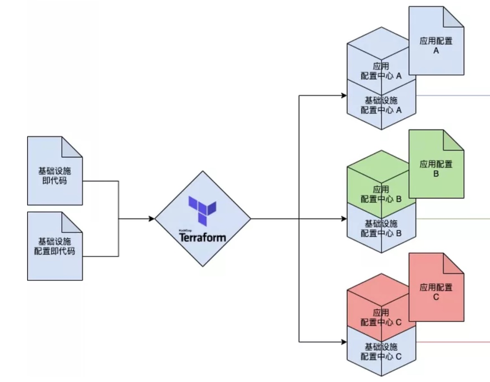

# 基础设施即服务 IaaS

使用基础设施即代码的理念。操控流水线完全自动化构建和部署新应用

## [配置即代码](https://mp.weixin.qq.com/s/dKI3RZYc2-O-gc0SBJw8mA)

* 参数被各地区在基础设施构建后，以手动复写配置文件的方式独立管理，问题
  - 配置分散：自动化构建生成的基础设施相关配置（如数据库连接串）由基础设施脚本管理，而地域性配置由当地环境线上部署文件管理，总部不可控。
  - 配置不可见：一个地域的配置需要下载这个地域线上的配置文件才能知道这个地域环境的配置是什么。
  - 配置无唯一可信源：自动化构建生成的配置可被区域性配置复写，省级配置可被市级配置复写。最终环境上一项配置是由谁配的，被谁复写过，为什么最终是这个配置无法溯源。
  - 配置修改门槛高：因为修改或增加配置需要复写线上部署文件，需要了解底层部署原理才能进行操作。这个任务往往最终转变成DevOps的任务，给DevOps带来了不必要的负担。而且人为错误可能性大幅提升。
* 在基础设施构建过程中引入使用配置即代码的配种（配置）中心来解决上述问题，集中并自动化管理配置
  - 配置中心管理所有配置并独立于基础设施及代码之上存在
    + 实现
      * 在原有基础设施即代码之外新增一个配置中心。可以是在运行构建之前手动创建的，或由另一套基础设施及代码脚本独立构建的。
      * 配置中心里保存基础设施及代码的所有通用配置（包含基础设施参数和业务配置），各区域管理人员统一在总部这个唯一的配置中心里添加自己区域的特殊配置（包含特殊的基础设施参数和业务配置）
      * 在构建基础设施时由配置中心中所有带有基础设施标签的配置生成配置文件用于构建
      * 直接连接配置中心（或连接中央配置中心的只读副本）并获得所有适用于改地域的业务配置。
    + 优势
      * 基础设施配置与业务配置在同一地点集中管理。
      * 利用配置中心UI展示配置，所见即所得。标签区分基础设施 vs. 业务，通用 vs. 地域等。至多一次复写。
      * 配置中心即为唯一可信源，方便公司可以统一管理。
      * 利用配置中心UI维护配置简单方便。
    + 劣势
      * 配置中心成为基础设施构建部署整套流程的单点故障。
      * 配置中心引入与基础设施生命周期不同的基础设施，破坏基础设施即代码的完整性。
  - 配置中心只管理所有业务配置，并由基础设施及代码（配置即代码）管理
    + 实现
      * 在原有基础设施即代码中加入一个配置中心的构建模块。
      * 集中为每一个地域管理一套配置即代码（包括基础设施的参数与业务配置），并在这个地域的基础设施构建时将业务配置写入为这个地域构建的配置中心中。
      * 直接连接配置中心获取业务配置。
      * 引入“业务修改配置后应相应修改配套配置即代码”规则。
    + 优势
      * 基础设施配置与业务配置在同一地点集中管理，并原生遵循配置即代码。
      * 利用配置中心UI展示业务配置，所见即所得。没有复写。基础设施参数与业务配置相隔离，可以只由DevOps管理。
      * 配置即代码为唯一可信源，方便公司统一管理。
      * 修改配置即代码相对与修改线上部署降低了修改配置的门槛。
    + 劣势
      * 引入规则导致配置新增或修改后需要修改配置即代码，相比方案一维护门槛上升。
      * 如果规则执行力度不够，也会直接破环可信度。
      * 引入规则导致配置中心不能直接用来管理配置，UI只用做配置展示，配置中心成为鸡肋。
  - 分离基础设施配置和应用配置：分治 基础设施配置和应用（业务）配置。应用配置使用方案一，基础设施配置使用方案二
    + 实现
     * 在原有基础设施即代码中加入两个配置中心的构建模块。
     * 公司集中为每一个地域管理一套配置即代码（只包括基础设施的参数）和一套含有默认业务配置的脚本。在这个地域的基础设施构建时，将基础设施配置的实际值和业务配置的默认值分别写入为这个地域构建的两个配置中心中。
     * 地域管理者在基础设施构建完成后自行修改并确认业务配置后开始运作。
     * 连接基础设施配置中心获得如数据库连接串等在基础设施构建时生成的配置，并连接应用配置中心获得如缓存时间等业务配置。
    + 优势
     * 基础设施配置与业务配置各自在同一地点集中管理，基础设施配置原生遵循配置即代码。
     * 利用配置中心UI展示业务配置，所见即所得。没有复写。
     * 基础设施配置即代码即为唯一可信源，方便公司可以统一管理。
     * 基础设施参数与业务配置完全隔离。
     * 区域业务配置中心为该区域唯一可信源，方便该区域统一管理。
     * 区域业务配置可以直接利用配置中心UI维护配置简单方便。
    + 劣势
     * 业务配置不遵循配置即代码，要求上线前由区域业务人员手工确认配置。
     * 公司无法集中管理业务配置，仅限管理业务配置的默认值。
     * 两套配置中心，增加成本和维护复杂度。

## 服务发现、流量控制、监控与可观测性、访问控制、网络控制、存储层抽象
