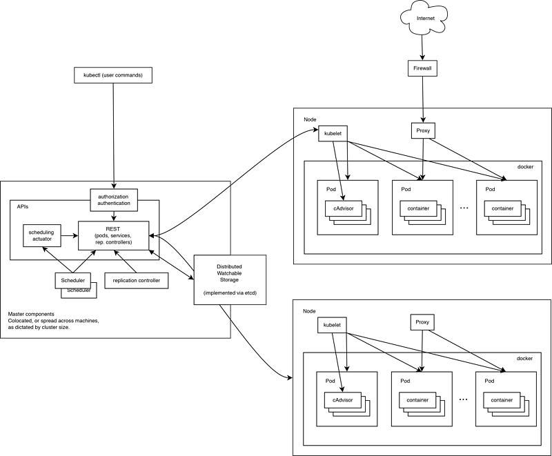
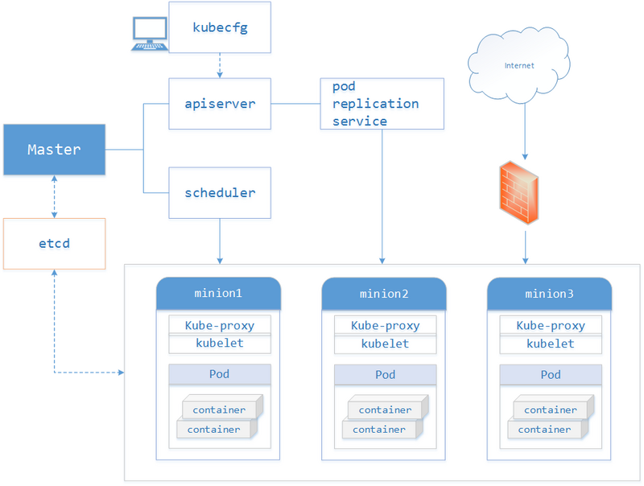
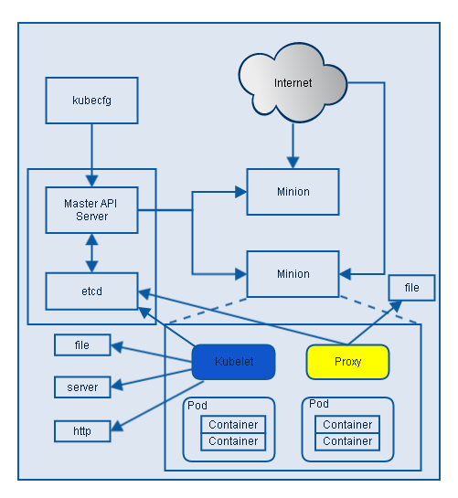
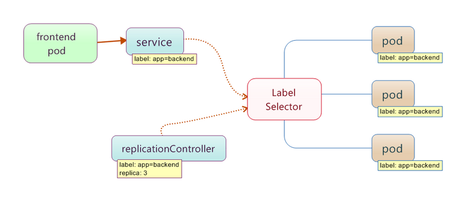
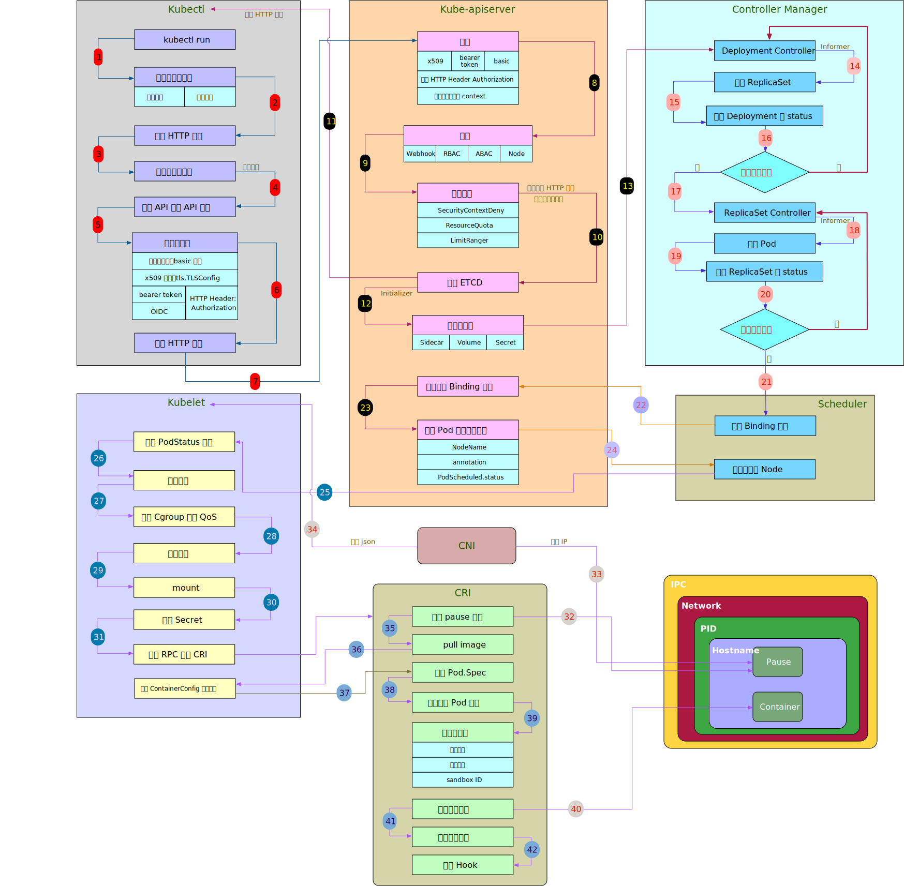
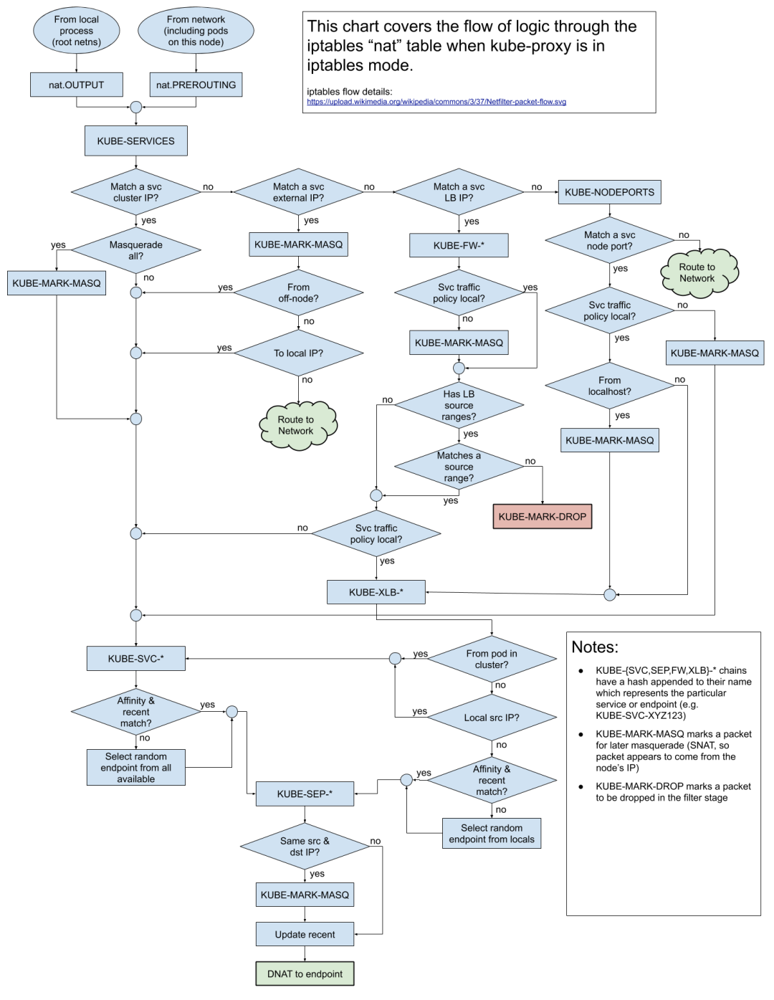

# [kubernetes/kubernetes](https://github.com/kubernetes/kubernetes)

Production-Grade Container Scheduling and Management http://kubernetes.io

* 2014年6月，IT基础设施领域的领先者Google发布了Kubernetes[14]（简写为K8S）。编排概念并不是由Kubernetes第一个提出的，Kubernetes这个单词来自于希腊语，含义是舵手或领航员
* 作为Docker生态圈中重要一员，是Google多年大规模容器管理技术的开源版本，是产线实践经验的最佳表现。如Urs Hölzle所说，无论是公有云还是私有云甚至混合云，Kubernetes将作为一个为任何应用，任何环境的容器管理框架无处不在
* 在单机上运行容器，无法发挥它的最大效能，只有形成集群，才能最大程度发挥容器的良好隔离、资源分配与编排管理的优势。所以企业需要一套管理系统，对Docker及容器进行更高级更灵活的管理，按照用户的意愿和整个系统的规则，完全自动化的处理好容器之间的各种关系，这叫做编排（Orchestration）
    - Orchestration这个词来自于音乐领域，是指一种将不同乐器、音色加以合理的编排等手法营造出一个听感交融、平衡的艺术，完美地描述了容器编排的含义：为单个应用程序（乐队中的每种乐器）提供协同工作的模式
* Kubernetes是基于Docker的开源容器集群管理系统，为容器化的应用提供资源调度、部署运行、服务发现、扩容缩容等整一套功能，因为容器本身可移植，所以Kubernetes容器集群能跑在私有云、公有云或者混合云上。
* 自动化编排容器应用的开源平台，包括部署、调度和节点集群间扩展、服务发现和配置服务等架构支持的基础能力
* 服务治理范围覆盖了服务的整个生命周期，从服务建模开始，到开发、测试、审批、发布、运行时管理，以及最后的下线。通常说的服务治理主要是指服务运行时的治理，一个好的服务治理框架要遵循"在线治理，实时生效"原则，只有这样才能真正保障服务整体质量
    - 服务越来越多，配置项越来越多，利用统一注册中心解决服务发现和配置管P理问题
    - 服务之间存在多级依赖，靠人工已经无法理清，还要避免潜在的循环依赖问题，需要依赖管理机制，支持导出依赖关系图
    - 服务的性能数据和健康状态数据是服务治理的重要依据，比如访问量、响应时间、并发数等，因此需要有监控、健康检查和统计服务
    - 当一个服务的访问量越来越大，需要对服务进行扩容，然后在客户端进行流量引导和优先级调度
    - 面对突发流量，已经无法通过扩容解决问题时，要启用流量控制，甚至服务降级
    - 随着业务持续发展，要提前进行容量规划，结合服务监控数据，以确认当前系统容量能否支撑更高水位的压力
    - 通过一系列的服务治理策略，最终通过数据证明系统对外承诺的 SLA
* 使用Golang开发，其提供应用部署、维护、扩展机制等功能，利用Kubernetes能方便地管理跨机器运行容器化的应用，主要功能
    - 资源调度：资源调度是一套分布式系统最基本的核心指标
    - 资源管理：控制Pod对计算资源、网络资源、存储资源的使用
    - 服务发现：管理外在的程序或者内部的程序如何访问Kubernetes里面的某个Pod
    - 健康检查：监控检测服务是否正常运行非常重要
    - 自动伸缩：因为涉及到环境的快速迁移和复制，虚拟机时代之前都非常难实现。容器化时代很自然的解决了这个问题，Kubernetes保证了资源的按需扩容
    - 更新升级：Kubernetes为服务的滚动和平滑升级提供了很好的机制

    - 使用Docker对应用程序包装(package)、实例化(instantiate)、运行(run)
    - 以集群的方式运行、管理跨机器的容器
    - 解决Docker跨机器容器之间的通讯问题
    - 服务发现和负载均衡：使用 DNS 名称或自己的 IP 地址公开容器，如果到容器的流量很大，Kubernetes 可以负载均衡并分配网络流量，从而使部署稳定
    - 存储编排：允许自动挂载选择的存储系统，例如本地存储、公共云提供商等
    - 自动部署和回滚：可以使用 Kubernetes 描述已部署容器的所需状态，可以以受控的速率将实际状态更改为所需状态。例如，可以自动化 Kubernetes 来为您的部署创建新容器，删除现有容器并将它们的所有资源用于新容器
    - 容器资源配额：允许指定每个容器所需 CPU 和内存（RAM）。当容器指定了资源请求时，Kubernetes 可以做出更好的决策来管理容器的资源
    - 自我修复：重新启动失败的容器、替换容器、杀死不响应用户定义的运行状况检查的容器，并且在准备好服务之前不将其通告给客户端
    - 密钥与配置管理：存储和管理敏感信息，例如密码、OAuth 令牌和 ssh 密钥。可以在不重建容器镜像的情况下部署和更新密钥和应用程序配置，也无需在堆栈配置中暴露密钥
    - 配置文件：可以通过 ConfigMap 来存储配置
* 方便
    - 快速部署应用
    - 容易实现 水平伸缩 或 垂直伸缩
    - 无缝发布新应用版本
    - 资源使用最大化
    - 应用停止自动重启
* 特点
    - 可移植：支持公有云(GCE、vShpere、CoreOS、OpenShift、Azure)、私有云、混合云、多重云（multi-cloud）
    - 可扩展：模块化、插件化、可挂载、可组合
    - 自动化：自动部署、自动重启、自动复制、自动伸缩/扩展
* K8s很多的抽象概念非常契合分布式调度系统，可以做到描述集群架构，定义服务状态，并维持，实现了分布式集群的配置管理和维护包括动态伸缩及故障迁移
* 基于负载均衡的应用弹性伸缩方案，只要将应用系统设计成无状态，在需要伸缩的时候修改负载均衡代理配置，就可以方便地水平扩容应用系统，提高系统承载能力
* 一切皆为资源，一切即可描述，一切皆可管理

* 源自Google内部大规模集群管理系统——Borg，也是CNCF（Cloud Native Computing Foundation，今属Linux基金会）最重要的解决方案之一，旨在让部署容器化的应用简单并且高效
* 用于管理容器化应用程序集群的工具,自动执行应用程序部署的系统。在计算机领域中，此过程通常称为编排
* 具备完善的集群管理能力，包括多层次的安全防护和准入机制、多租户应用支撑能力、透明的服务注册和服务发现机制、内建负载均衡器、故障发现和自我修复能力、服务滚动升级和线上扩容、可扩充套件的资源自动调度机制、多粒度的资源配额管理能力。还提供完善的管理工具，涵盖开发、部署测试、运维监控等各个环节
* 将虚拟机和物理机转换为统一的API切面。然后，开发人员可以使用Kubernetes API来部署，扩展和管理容器化的应用程序

## 结构

* Kubernetes集群架构
    - Kubernetes集群架构概述
    - Master及各组件
    - Node及相关组件
    - 核心附件CoreDNS、HeapSter（Prometheus）、Dashboard及Ingress Controller概述
    - 核心资源类型：Pod、Deployment、Service
* Kubernetes快速入门
    - Kubernetes集群的部署方法及部署要点
    - 部署Kubernetes分布式集群
    - kubectl使用基础
    - 命令式应用部署、扩缩容、服务暴露
* 资源配置清单及Pod资源
    - Kubernetes API中的资源配置格式
    - 资源类型 API群组及其版本介绍
    - Pod资源及其配置格式
    - 使用配置清单创建自主式Pod资源
    - 标签及标签选择器
    - Pod的节点选择器
    - 容器存活状态探测及就绪状态探测
* Pod控制器
    - Pod控制器及其功用
    - 通过配置清单管理ReplicaSet控制器，包括扩缩容及更新机制
    - Deployment控制器基础应用及滚动更新：灰度部署、金丝雀部署、蓝绿部署的实现；
    - DaemonSet控制器基础应用及使用案例
* Service资源对象
    - Service及其实现模型
    - Service的类型及其功用
    - 各Service类型的创建及应用方式
    - Headless Service
    - 基于DNS的服务发现简介
    - Ingress类型及实现方式
    - Ingress Controller及部署
    - Ingress使用案例：发布http及https的tomcat服务
* K8S-存储卷
    - 存储卷及其功用
    - 常见的存储卷类型及应用：emptyDir、hostPath、nfs、glusterfs等
    - PV及PVC
    - StorageClass及PV的动态供给
    - ConfigMap
    - Secret
* StatefulSet
    - 有状态及无状态应用对比
    - 有状态应用的容器难题
    - StatefulSet及其应用
*  网络模型及网络策略
    - flannel工作原理及host-gw等实现方式
    - calico及其应用
    - 网络策略及其工作机制
    - 基于calico的网络策略的实现
* 认证、授权及准入控制
    - Kubernetes的认证、授权及准入控制机制
    - ServiceAccount
    - 令牌认证及证书认证
    - RBAC及其实现机制
    - Role和RoleBinding
    - ClusterRole和ClusterRoleBinding
* 调度器
    - 资源需求、资源限额及其应用
    - Pod优选级类别
    - Pod调度器工作原理
    - 预选及预选策略
    - 优选及优选算法
    - 高级调度方法
* 资源监控及HPA
    - HeapSter、InfluxDB及Grafana实现资源监控
    - HPA v1
    - Prometheus及Grafana实现资源监控
    - Metrics-Server
    - HPA v2

## 架构

* 属于主从的分布式集群架构，包含Master和Nodes
    - Master作为控制节点，调度管理整个系统
    - Nodes是运行节点，负责运行应用
        + Pod是Kubernetes创建或部署的最小单位
        + 一个Pod封装一个或多个容器（Container）、存储资源（Volume）、一个独立的网络IP以及管理控制容器运行方式的策略选项
* 集群采用Master/Node 结构,可以通过命令列或者Web页面的方式来操作集群
* Master（主节点）控制整个集群
    - etcd： 由CoreOS开发，是一个高可用、强一致性的服务发现储存仓库，为Kubernetes集群提供储存服务.用来备份所有集群数据的数据库。它存储集群的整个配置和状态。主节点查询etcd以检索节点，容器和容器的状态参数
    - API Server： 控制程序的前端，也是用户唯一可以直接进行交互的Kubernetes组件，内部系统组件以及外部用户组件均通过相同的API进行通信.提供资源操作的唯一入口（其他模组通过API Server查询或修改资料，只有API Server才能直接操作etcd），并提供认证、授权、访问控制、API注册和发现等机制
    - Scheduler： 负责资源的调度，按照预定的调度策略将Pod（k8s中调度的基本单位）调度到相应的Node上.会监视来自API Server的新请求，并将其分配给运行状况良好的节点。对节点的质量进行排名，并将Pod部署到最适合的节点。如果没有合适的节点，则将Pod置于挂起状态，直到出现合适的节点
    - Controller： 从API Server获得所需状态。检查要控制的节点的当前状态，确定是否与所需状态存在任何差异，确保集群处于预期的工作状态，比如故障检测、自动扩充套件、滚动更新等
* Node（从节点）为集群提供计算能力.可以是物理机也可以是虚拟机器。监听API Server发送过来的新的工作分配；他们会执行分配给他们的工作，然后将结果报告给Kubernetes主节点
    - kubelet： 维护容器的生命周期，同时也负责Volume（CVI）和网络（CNI）的管理。每个节点上都会执行一个kubelet服务程序，接收并执行Master发来的指令，管理Pod及Pod中的容器。每个kubelet程序会在API Server上注册节点自身的信息，定期向Master节点汇报自身节点的资源使用情况，并通过cAdvisor监控节点和容器的资源
        + 在群集中的每个节点上运行。是Kubernetes内部的主要代理。
        + 通过安装kubelet，节点的CPU，RAM和存储成为所处集群的一部分。
        + 监视从API  Server发送来的任务，执行任务，并报告给主节点。
        + 会监视Pod，如果Pod不能完全正常运行，则会向控制程序报告。然后，基于该信息，主服务器可以决定如何分配任务和资源以达到所需状态
    - kube-proxy： 为Service提供集群内部的服务发现和负载均衡，监听API Server中service和endpoint的变化情况，确保每个节点都获得其IP地址，实现本地iptables和规则以处理路由和流量负载均衡
    - Container Runtime:从容器镜像库中拉取镜像，然后启动和停止容器。容器运行时由第三方软件或插件（例如Docker）担当

* 6 层抽象
    - Deployment:创建和管理 ReplicaSet
        + 无缝升级运行中的应用
        + 指定了 Pod 死掉后重启的策略
        + 通过命令行|配置文件 创建
    - ReplicaSet:确保 APP 具有指定数量的 Pod,根据 Deployment 中设定的指标来创建和扩展
    - Pod:运行于 Node 中，一个 Node 中通常会运行多个 Pod
        + K8s 中基本构建单元
        + 一个 Pod 中可以包含多个 Container，通常是包含一个
        + 一个 Pod 就是一个最小单元，其中的内容绝对不会被分割在2个Node上，一个 Pod 中的内容始终作为一个整体
        + 负责处理容器的数据卷、密钥、配置
        + 生命周期是不确定
        + 生存在 Worker Node 上
    - Node 中有 Container 运行时环境，并运行放置在 Docker 镜像中的应用程序
    - Node Cluster
    - Node Processes
    - Docker Container
* Master Node 组件:提供集群的管理控制中心，通常在一台VM/机器上启动所有Master组件，并且不会在此VM/机器上运行用户容器  kubecfg、Minion(Host)以及Proxy,子进程组件
    - API server：K8s 的 API 接口
    - etcd：分布式 key-value 存储，保存集群的状态数据。
    - scheduler：为新的 Pod 选择合适的 Node。
    - kube-controller-manager：集群的控制器，处理集群的后台任务。
    - cloud-controller-manager：与云环境提供商交互的接口
    - 负责做调度决策、响应事件、实现变更、监控集群
    - 定义了 Kubernetes 集群 Master/API Server的主要声明  RESTStorage以及Client
    - client(Kubecfg)调用Kubernetes API，管理Kubernetes主要构件Pods、Services、Minions、容器的入口
    - Etcd
        + 存储所有Kubernetes集群状态
        + 事件监听和订阅：其他组件各个通信并不是互相调用API来完成的，而是把状态写入Etcd（相当于写入一个消息），其他组件通过监听Etcd的状态的的变化（相当于订阅消息），然后做后续的处理，然后再一次把更新的数据写入Etcd
        + Leader选举：其它一些组件比如 Scheduler，为了做实现高可用，通过Etcd从多个（通常是3个）实例里面选举出来一个做Master，其他都是Standby
    - API Server: 所有组件之间通信都需要通过Etcd。组件并不是直接访问Etcd，而是访问 API Server 这个代理，通过标准的RESTFul API（重新封装了对Etcd接口调用），除此之外，这个代理还实现了一些附加功能，比如身份的认证、缓存等
        + 根据请求的类型，比如创建Pod时storage类型是pods，然后依此选择何种 REST Storage API 对请求作出处理
        + 提供了k8s各类资源对象（pod,RC,Service等）的增删改查及watch等HTTP Rest接口，是整个系统的数据总线和数据中心
        + 只有API Server与存储通信，其他模块通过API Server访问集群状态
        + 为了隔离集群状态访问的方式和后端存储实现的方式：API Server是状态访问的方式，不会因为后端存储技术etcd的改变而改变
        + 作为kubernetes系统的入口，封装了核心对象的增删改查操作，以RESTFul接口方式提供给外部客户和内部组件调用。对相关的资源数据"全量查询"+"变化监听"，实时完成相关的业务功能
            * 提供了集群管理的REST API接口(包括认证授权、数据校验以及集群状态变更)
            * 提供其他模块之间的数据交互和通信的枢纽（其他模块通过API Server查询或修改数据，只有API Server才直接操作etcd）
            * 是资源配额控制的入口
            * 拥有完备的集群安全机制
    - Controller manager:负责任务调度，简单说直接请求Kubernetes做调度的都是任务，例如Deployment 、DeamonSet、Pod等等
        + 每一个任务请求发送给Kubernetes之后，都是由Controller Manager来处理的，每一种任务类型对应一个Controller Manager，比如Deployment对应一个叫做Deployment Controller，DaemonSet对应一个DaemonSet Controller
        + 实现集群故障检测和恢复的自动化工作，负责执行各种控制器，主要有： endpoint-controller：定期关联service和pod(关联信息由endpoint对象维护)，保证service到pod的映射总是最新的
        + replication-controller：定期关联replicationController和pod，保证replicationController定义的复制数量与实际运行pod的数量总是一致的
    - Scheduler:负责资源调度
        + Controller Manager 会把Pod对资源要求写入到Etcd里面，Scheduler监听到有新的Pod需要调度，就会根据整个集群的状态，把Pod分配到具体的worker节点上
        + 由于一旦Minion节点的资源被分配给Pod，那这些资源就不能再分配给其他Pod， 除非这些Pod被删除或者退出， 因此，Kubernetes需要分析集群中所有Minion的资源使用情况，保证分发的工作负载不会超出当前该Minion节点的可用资源范围
        + 收集和分析当前Kubernetes集群中所有Minion节点的资源(内存、CPU)负载情况，然后依此分发新建的Pod到Kubernetes集群中可用的节点
        + 实时监测Kubernetes集群中所有运行的Pod，Scheduler需要根据这些Pod的资源状况安全地将未分发的Pod分发到指定的Minion节点上
        + 实时监测Kubernetes集群中未分发和已分发的所有运行的Pod
        + 监测Minion节点信息，由于会频繁查找Minion节点，Scheduler会缓存一份最新的信息在本地
        + 在分发Pod到指定的Minion节点后，会把Pod相关的信息Binding写回API Server
        + 在API Server响应Kubecfg的请求后，Scheduler会根据Kubernetes Client获取集群中运行Pod及Minion信息
        + 依据从Kubernetes Client获取的信息，Scheduler将未分发的Pod分发到可用的Minion节点上
    - Kubectl: 一个命令行工具，调用 API Server 发送请求写入状态到Etcd，或者查询Etcd状态
    - Minion Registry 负责跟踪Kubernetes 集群中有多少Minion(Host)。Kubernetes封装Minion Registry成实现Kubernetes API Server的RESTful API接口REST，通过这些API，我们可以对Minion Registry做Create、Get、List、Delete操作，由于Minon只能被创建或删除，所以不支持Update操作，并把Minion的相关配置信息存储到etcd。除此之外，Scheduler算法根据Minion的资源容量来确定是否将新建Pod分发到该Minion节点。可以通过`curl http://{master-apiserver-ip}:4001/v2/keys/registry/minions/`来验证etcd中存储的内容。
    - Pod Registry 负责跟踪Kubernetes集群中有多少Pod在运行，以及这些Pod跟Minion是如何的映射关系。将Pod Registry和Cloud Provider信息及其他相关信息封装成实现Kubernetes API Server的RESTful API接口REST。通过这些API，我们可以对Pod进行Create、Get、List、Update、Delete操作，并将Pod的信息存储到etcd中，而且可以通过Watch接口监视Pod的变化情况，比如一个Pod被新建、删除或者更新。
    - Service Registry 负责跟踪Kubernetes集群中运行的所有服务。根据提供的Cloud Provider及Minion Registry信息把Service Registry封装成实现Kubernetes API Server需要的RESTful API接口REST。利用这些接口，我们可以对Service进行Create、Get、List、Update、Delete操作，以及监视Service变化情况的watch操作，并把Service信息存储到etcd。
    - Controller Registry 负责跟踪Kubernetes集群中所有的Replication Controller，Replication Controller维护着指定数量的pod 副本(replicas)拷贝，如果其中的一个容器死掉，Replication Controller会自动启动一个新的容器，如果死掉的容器恢复，其会杀死多出的容器以保证指定的拷贝不变。通过封装Controller Registry为实现Kubernetes API Server的RESTful API接口REST， 利用这些接口，我们可以对Replication Controller进行Create、Get、List、Update、Delete操作，以及监视Replication Controller变化情况的watch操作，并把Replication Controller信息存储到etcd。
    - Endpoints Registry 负责收集Service的endpoint，比如Name："mysql"，Endpoints: ["10.10.1.1:1909"，"10.10.2.2:8834"]，同Pod Registry，Controller Registry也实现了Kubernetes API Server的RESTful API接口，可以做Create、Get、List、Update、Delete以及watch操作。
    - Binding Registry 包括一个需要绑定Pod的ID和Pod被绑定的Host，Scheduler写Binding Registry后，需绑定的Pod被绑定到一个host。也实现了Kubernetes API Server的RESTful API接口，但Binding Registry是一个write-only对象，所有只有Create操作可以使用， 否则会引起错误。

        + Kubecfg将特定的请求，比如创建Pod，发送给Kubernetes Client
        + Kubernetes Client将请求发送给API server

* Worker Node 组件：运行在每个k8s Node上，提供K8s运行时环境，以及管理Pod和容器的生命周期,称为 Node
    - 一个 Node 表示一台机器,N 个 Pod 跑在一个 Node 上
    - kubelet：负责管理 Node 上的一切事物，与 Master 的 API server 沟通，可以说是 Worker Node 的大脑
    - kube-proxy：把连接路由到正确的 Pod，负责负载均衡的工作，就像一个交通警察。
    - Container Runtime：下载镜像、运行容器，例如，Docker 就是一个 Container Runtime，所以为了方便记忆，可以把 Container Runtime 理解为就是 Docker
    - [Kubelet](https://github.com/kubernetes/kubelet): 运行在每一个worker节点上的Agent，监听Etcd中的Pod信息，运行分配给它所在节点的Pod，并把状态更新回Etcd。通过docker部署
        + Kubelet 集群中每个Minion和Master API Server的连接点，运行在每个Minion上，接收Master API Server分配给它的commands和work，与持久性键值存储etcd、file、server和http进行交互，读取配置信息
        + 包括Docker Client、Root Directory、Pod Workers、Etcd Client、Cadvisor Client以及Health Checker组件
        + 具体工作
            * 通过Worker给Pod异步运行特定的Action
            * 设置容器的环境变量
            * 给容器绑定Volume
            * 给容器绑定Port
            * 根据指定的Pod运行一个单一容器
            * 杀死容器
            * 给指定的Pod创建network 容器
            * 删除Pod的所有容器
            * 同步Pod的状态
            * 从cAdvisor获取container info、 pod info、 root info、 machine info
            * 检测Pod的容器健康状态信息
            * 在容器中运行命令
    - Kube-proxy: 负责为Service提供cluster内部的服务发现和负载均衡。通过k8s部署。为了解决外部网络能够访问跨机器集群中容器提供的应用服务而设计的，运行在每个Minion上
        + Proxy提供TCP/UDP sockets的proxy，每创建一种Service，Proxy主要从etcd获取Services和Endpoints的配置信息（也可以从file获取），然后根据配置信息在Minion上启动一个Proxy的进程并监听相应的服务端口，当外部请求发生时，Proxy会根据Load Balancer将请求分发到后端正确的容器处理
        + 解决了同一主宿机相同服务端口冲突的问题
        + 提供了Service转发服务端口对外提供服务的能力，Proxy后端使用了随机、轮循负载均衡算法 [kube-proxy 的内容 KUBERNETES代码走读之MINION NODE 组件 KUBE-PROXY](http://www.sel.zju.edu.cn/?spm=5176.100239.blogcont47308.8.2bn7P0&p=484)
    - Container: 负责镜像管理以及Pod和容器的真正运行（CRI） Docker引擎，负责容器运行
* 实践
    - 创建一个nginx_deployment.yaml配置文件
    - 通过kubectl命令行创建一个包含Nginx的Deployment对象，kubectl会调用API Server往Etcd里面写入一个Deployment对象。
    - Deployment Controller监听到有新的Deployment对象被写入，获取到Deployment对象信息然后根据对象信息来做任务调度，创建对应的Replica Set对象。
    - Replica Set Controller监听到有新的对象被创建，获取到Replica Set对象信息然后根据对象信息来做任务调度，创建对应的Pod对象。
    - Scheduler监听到有新的Pod被创建，获取到Pod对象信息，根据集群状态将Pod调度到某一个worker节点上，然后更新Pod。
    - Kubelet监听到当前的节点被指定了的Pod，就根据对象信息运行Pod。






## 核心概念

* 对象：负责管理和运行用于创建和运行容器的 Pod
    - ReplicaSet 创建和管理 Pod。 如果一个 Pod 因为 Node 故障而关闭，ReplicaSet 会自动在其他 Node 中启动这个 Pod。 ReplicaSet 由 Deployment 创建，可以通过 Deployment 非常方便的升级应用
    - StatefulSet 就助跟踪应用状态,据规范管理一组 Pod 的部署和缩放
        + StatefulSet 的 Pod 都有一个唯一的、持久的标识，控制器在进行任何重新调度时都会维护该标识。对于数据库等有状态的持久化后端服务非常有用。 Pod 中的状态信息就是保存在与 StatefulSet 关联的数据卷中
    - DaemonSet 用于持续的进程，每当一个 Node 加入到集群中时，DaemonSet 都会在其中自动启动一个 Pod。适用于一直运行的后台任务，例如监控、日志收集。
    - StatefulSet 和 DaemonSet 虽然与 ReplicaSet 在一个层级中，但不受 Deployment 控制
    - Job 负责监督管理那些运行批处理作业的 Pod
        + 会创建 Pod，并通过跟踪 Pod 成功完成的数量来确保他们完成任务
        + 一旦容器内部的作业成功完成，容器就不会重新启动.
        + 一次性的做一个任务的时候
    - CronJob:在指定的时间运行作业.计划以固定的时间间隔或固定的时间重复执行
    - Service 为一组 Pod 创建单个访问点, 提供一致的 IP 地址和端口，以访问其中的 Pod
        + 外部用户和内部 Pod 都使用服务与其他 Pod 通信
    - Volume 是一个可以保存数据的目录
        + 一个 Pod 的组件，在 Pod 中创建，不能单独删除
        + Pod 中的容器都可以访问 Volume，只要这些容器都挂载了这 Volume 即可
        + 生命周期是独立于容器的，与 Pod 相关
* Cluster 集群：由K8s使用一序列的物理机、虚拟机和其它基础资源来运行你的应用程序
* NameSpaces 命名空间：在集群中可以使用namespace创建多个“虚拟集群”，namespace之间可以完全隔离，也可以通过某种方式，让一个namespace中的service可以访问到其他的namespace中的服务
    - 一组资源和对象的抽象集合，比如可以用来将系统内部的对象划分为不同的项目组或用户组
    - 常见的Pods，Services，Replication Controllers和Deployments等都属于某一个Namespace，默认是default。而Node，PresistentVolumes等则不属于任何Namespace
    - Namespace常用于隔离不同的用户，比如K8s自带的服务一般运行在Kube-system Namespace中
    - 操作
        + 查询namespace `kubectl get namespaces` namespace包含两种状态Active和Terminating，删除namespace的过程中namespace状态被设置为Terminating
        + 创建namespace `kubectl create namespace new-namespace` namespace名称满足正则表达式[a-z0-9]([-a-z0-9]*[a-z0-9])?,最大长度为63位
        + 删除namespace `kubectl delete namespaces new-namespace`
            * 删除一个namespace会自动删除所有属于该namespace的资源
            * default和kube-system命名空间不可删除
* Deployment 为 Pod 和 ReplicaSet 提供了一个声明式定义(declarative)方法，用来替代以前的 ReplicationController 来方便的管理应用，应用场景
    - 定义Deployment来创建Pod和ReplicaSet
    - 滚动升级和回滚应用
    - 扩容和缩容
    - 暂停和继续Deployment
    - 状态
        + 无效的引用
        + 不可读的probe failure
        + 镜像拉取错误
        + 权限不够
        + 范围限制
        + 程序运行时配置错误
        + Deployment可用的Replica个数等于或者超过Deployment策略中期望的个数
        + 所有与该Deployment相关的Replica都更新完成
        + Deployment正在创建新的ReplicaSet
        + Deployment正在扩容一个已有的ReplicaSet
        + Deployment正在缩容一个已有的ReplicaSet
        + Progressing: 进行中
        + Complete: 完成
        + Failed: 失败
    - 使用
        + 查询: `kubectl get deployments -o wide`
        + 扩容: `kubectl scale deployment nginx-deployment –replicas 10`
        + 更新镜像: `kubectl set image deployment/nginx-deployment nginx=nginx:1.9.1`
        + 回滚: `kubectl rollout undo deployment/nginx-deployment`
* Ingress：从集群外部访问集群内部服务的入口。比如官方维护的 Ingress Nginx。ingress traefik、ingress haproxy等
* Node（节点）
    - K8s中的工作节点，可以是虚拟机或物理机。每个Node由K8s Master管理，Node上可以有多个Pod，K8s Master会自动处理Node的Pod调度，同时Master的自动调度会考虑每个Node上的可用资源，为了管理Pod，每个Node上至少要运行Docker、kubelet和kube-proxy
    - Node管理
        + 维护Node状态
        + 与Cloud Provider同步Node
        + 给Node分配容器CIDR
        + 删除带有NoExecute taint的Node上的Pods
        + Node本质不是由K8s来创建的，K8s只是管理Node上的资源，默认情况下kubelet在启动的时候会向master注册自己，并创建Node资源
        + Node Controller
    - Node状态信息
        + 基本信息: 包括内核版本、容器引擎版本、OS类型
        + 地址：包括hostname、内网IP和外网IP 或者Node ID
        + 运行状态
            * Pending
            * Running
            * Terminated
        + Condition（条件）：描述Running状态Node的运行条件
            * OutOfDisk
            * MemoryPressure
            * DiskPressure
            * Ready表示Node处于健康状态，可以接收从Master发来的创建Pod的指令
        + 容量：Node可用系统资源，包括CPU、内存数量、最大可调度Pod数量等
    - 管理：Node通常是物理机、虚拟机或者云服务商提供的资源，并不是由Kubernetes创建的。Kubernetes创建一个Node，仅仅表示Kubernetes在系统内部创建了一个Node对象
        + 创建后即会对其进行一系列健康检查，包括是否可以连通、服务是否正确启动、是否可以创建Pod等。如果检查未能通过，则该Node将会在集群中被标记为不可用（Not Ready）
        + Node Controller是Kubernetes Master中的一个组件，用于管理Node对象。两个主要功能包括
            * 集群范围内的Node信息同步，可以通过kube-controller-manager的启动参数--node-sync-period设置同步的时间周期
            * 单个Node的生命周期管理
    - 自注册:当Kubelet的--register-node参数被设置为true（默认值即为true）时，Kubelet会向apiserver注册自己。这也是Kubernetes推荐的Node管理方式。 Kubelet进行自注册的启动参数如下：
        + --apiservers=: apiserver地址；
        + --kubeconfig=: 登录apiserver所需凭据/证书的目录；
        + --cloud_provider=: 云服务商地址，用于获取自身的metadata；
        + --register-node=: 设置为true表示自动注册到apiserver。
    - 手动管理Node:将Kubelet启动参数中的--register-node参数的值设置为false
* Secret 存储了敏感数据,解决了密码、token、密钥等敏感数据的配置问题，而不需要把这些敏感数据暴露到镜像或者Pod Spec中。Secret 可以以Volume或者环境变量的方式使用。 Secret有三种类型：
    - Service Account ：用来访问Kubernetes API，由Kubernetes自动创建，并且会自动挂载到Pod的/run/secrets/kubernetes.io/serviceaccount目录中
    - Opaque ：base64编码格式的Secret，用来存储密码、密钥等
    - kubernetes.io/dockerconfigjson ：用来存储私有docker registry的认证信息
* PV 和 PVC 用于数据持续存储，Pod中，容器销毁，所有数据都会被销毁，如果需要保留数据，这里就需要用到 PV存储卷，PVC存储卷申明
    - PVC 常用于 Deployment 做数据持久存储。实现持久化存储还需要理解 Volume 概念
* Volume
    - 构建在Docker Volumes之上，并且支持添加和配置Volume目录或者其他存储设备
    - 问题
        + 容器磁盘上的文件的生命周期是短暂的，容器崩溃时，kubelet 会重启，但是容器中文件将丢失——容器以干净的状态（镜像最初的状态）重新启动
        + 在 Pod 中同时运行多个容器时，这些容器之间通常需要共享文件
    - 特点
        + 一个Volume拥有明确的生命周期，与所在的Pod的生命周期相同，因此Volume的生命周期比Pod中运行的任何容器都要持久
        + Volume与Pod相关和容器无关，因此容器重启的时候数据还会保留，如果Pod被删除那么数据也会被删除
        + 内部实现中一个Volume就是一个目录，可能包含一些数据，这些数据对Pod中的容器都是可用的
        + 想要使用一个Volume，Pod必须指明Pod提供了哪些磁盘，并且说明如何挂载到容器中
    - 支持类型
       + emptyDir:当Pod分配到Node上时将会创建emptyDir，并且只要Node上的Pod一直运行，Volume就会一直存在。当Pod从Node上被删除时，emptyDir也同时会删除，存储的数据也将永久删除，删除容器不影响emptyDir
       + hostPath: hostPath允许挂载Node上的文件系统到Pod里面去。如果Pod需要使用Node上的文件，可以使用hostPath。
       + gcePersistentDisk
       + awsElasticBlockStore
       + nfs
       + iscsi
       + fc (fibre channel)
       + flocker
       + glusterfs
       + rbd
       + cephfs
       + gitRepo
       + secret
       + persistentVolumeClaim
       + downwardAPI
       + projected
       + azureFileVolume
       + azureDisk
       + vsphereVolume
       + Quobyte
       + PortworxVolume
       + ScaleIO
       + StorageOS
       + ilocal
* Label 标签
    - 一对key/value被关联到对象上比如Pod，标签的使用倾向于能够标识对象的特点，并且对用户而言是有意义的，但对内核系统是没有直接意义
    - 可以用来划分特定组的对象，标签可以在创建一个对象的时候直接给与 也可以在后期随时修改，每一个对象可以拥有多个标签，但是key值必须是唯一的
    - service和replicationController只是建立在pod之上的抽象,通过label来与pod关联
    - 可以被应用来组织和选择子网中的资源
    - 语法和字符集
        + label是一对key/value，有效的key=一个可选的前缀 + 名称组成，通过/来区分
        + 名称部分是必须的，最多63个字符，开始和结束的字符必须是字母或者数字，中间是字母或数字以及特殊的字符_,-,.，前缀是可有可无
        + 如果指定了前缀，必须是一个DNS子域，一序列的DNS label通过.来划分，长度不超过253个字符，/结尾
        + label的值必须小于或等于63个字符，允许为空。如果值不为空，那么首位字符必须为字母数字，中间必须是数字字母以及特殊字符-,_,.
    - Label Selector：通过匹配labels来定义资源之间关系的表达式，各个控制器通过 Selector 匹配容器并管理。比如 Deployment 或 Service 都是通过这种方式匹配相应的 Pod
        + 基于set的条件：in, notin 和 exists(仅针对key)
            * environment in (production, qa) (选择environment等于production或者qa的资源)
            * tier notin (frontend, backend) (选择tier不等于frontend和backend的资源)
            * partition (选择key为partition的资源，不care value是什么)
        - 基于运算符：=,==和!=，=和==是同一种意思
            * !partition (选择key不是partition的资源，不care value是什么)
            * environment = production （选择environment等于production的资源)
            * tier != frontend (选择tier不等于frontend的资源)
* Replication Controllers:确保任何时候集群中有指定数量的pod副本(replicas)在运行，如果少于指定数量的pod副本(replicas)，Replication Controller会启动新的Container，反之会杀死多余的以保证数量不变
    - 使用预先定义的pod模板创建pods，一旦创建成功，pod 模板和创建的pods没有任何关联，可以修改 pod 模板而不会对已创建pods有任何影响，也可以直接更新通过Replication Controller创建的pods
    - 为了保证Pod一定数量的复制品在任何时间都能正常工作，不仅允许复制的系统易于扩展，还会处理当Pod在机器重启或发生故障的时候再创建一个
    - Replication Controller使用labels来管理通过 pod 模板创建的一组容器可以更加容易，方便地管理多个容器
    - 创建Replication Controller时，需要指定两个东西：
        + Pod模板：用来创建Pod副本的模板
        + Label：Replication Controller需要监控的Pod的标签
    - 对于利用 pod 模板创建的pods，Replication Controller根据 label selector 来关联，通过修改pods的label可以删除对应的pods
    - 用法：
        + Rescheduling:保证足够数量的Pod运行，即使节点Node失败或者挂掉的情况
        + Scaling:通过修改Replication Controller的副本(replicas)数量来水平扩展或者缩小运行的pods
        + Rolling updates:可以一个一个地替换pods来滚动更新（rolling updates）服务
        + Multiple release tracks:如果需要在系统中运行multiple release的服务，Replication Controller使用labels来区分multiple release tracks
    - 以上三个概念便是用户可操作的REST对象。Kubernetes以RESTfull API形式开放的接口来处理
* 如下图所示，有三个pod都有label为"app=backend"，创建service和replicationController时可以指定同样的label:"app=backend"，再通过label selector机制，就将它们与这三个pod关联起来了。例如，当有其他frontend pod访问该service时，自动会转发到其中的一个backend pod

* Horizontal Pod Autoscaler （HPA）组件专门设计用于应用弹性扩容的控制器，通过定期轮询 Pod 的状态（CPU、内存、磁盘、网络，或者自定义的应用指标），当 Pod 的状态连续达到提前设置的阈值时，就会触发副本控制器，修改其应用副本数量，使得 Pod 的负载重新回归到正常范围之内

* annotate命令：更新一个或多个资源的Annotations信息。也就是注解信息，可以方便的查看做了哪些操作
    - 相对于label来说可以容纳更大的键值对，它对我们来说是不可读的数据，只是为了存储不可识别的辅助数据，尤其是一些被工具或系统扩展用来操作的数据
    - 由key/value组成
    - 目的是存储辅助数据，特别是通过工具和系统扩展操作的数据
    - --overwrite为true，现有的annotations可以被覆盖，否则试图覆盖annotations将会报错
    - --resource-version，则更新将使用此resource version，否则将使用原有的resource version

* PodPreset 里定义的内容，只会在 Pod API 对象被创建之前追加在这个对象本身上，而不会影响任何 Pod 的控制器的定义
    - 多个 PodPreset:合并（Merge）这两个 PodPreset 要做的修改。而如果它们要做的修改有冲突的话，这些冲突字段就不会被修改
* StatefulSet
    - 一种特殊的 Deployment，而其独特之处在于，它的每个 Pod 都被编号了。而且，这个编号会体现在 Pod 的名字和 hostname 等标识信息上，这不仅代表了 Pod 的创建顺序，也是 Pod 的重要网络标识（即：在整个集群里唯一的、可被访问的身份
* PV 持久化存储数据卷
    -  Volume，其实就是将一个宿主机上的目录，跟一个容器里的目录绑定挂载在了一起
    -  持久化 Volume”，指的就是这个宿主机上的目录，具备“持久性”
    - PVC: Pod 所希望使用的持久化存储属性
    - PVC 和 PV 的设计，实际上类似于“接口”和“实现”的思想。开发者只要知道并会使用“接口”，即：PVC；而运维人员则负责给“接口”绑定具体的实现，即：PV
    - PVC 其实就是一种特殊的 Volume。只不过一个 PVC 具体是什么类型的 Volume，要在跟某个 PV 绑定之后才知道
    - 用户创建的 PVC 要真正被容器使用起来，就必须先和某个符合条件的 PV 进行绑定。这里要检查的条件，包括两部分
        + PV 和 PVC 的 spec 字段。比如，PV 的存储（storage）大小，就必须满足 PVC 的要求
        + PV 和 PVC 的 storageClassName 字段必须一样
    - 过程
        + Attach：虚拟机挂载远程磁盘的操作。由 Volume Controller 负责维护的，这个控制循环的名字叫作：AttachDetachController。而它的作用，就是不断地检查每一个 Pod 对应的 PV，和这个 Pod 所在宿主机之间挂载情况。从而决定，是否需要对这个 PV 进行 Attach（或者 Dettach）操作
        + Mount：格式化这个磁盘设备，然后将它挂载到宿主机指定的挂载点上，挂载点，正是提到的 Volume 的宿主机目录。必须发生在 Pod 对应的宿主机上，所以它必须是 kubelet 组件的一部分。这个控制循环的名字，叫作：VolumeManagerReconciler，它运行起来之后，是一个独立于 kubelet 主循环的 Goroutine
        + 对于“第一阶段”（Attach），Kubernetes 提供的可用参数是 nodeName，即宿主机的名字
        + 对于“第二阶段”（Mount），Kubernetes 提供的可用参数是 dir，即 Volume 的宿主机目录
    - kubelet 只要把这个 Volume 目录通过 CRI 里的 Mounts 参数，传递给 Docker，然后就可以为 Pod 里的容器挂载这个“持久化”的 Volume 了
    -  PV 的“两阶段处理”流程，是靠独立于 kubelet 主控制循环（Kubelet Sync Loop）之外的两个控制循环来实现的
    -  自动创建 PV 的机制，即：Dynamic Provisioning，核心，在于一个名叫 StorageClass 的 API 对象。作用，其实就是创建 PV 的模板
        +  StorageClass 对象会定义如下两个部分内容
            *  PV 的属性。比如，存储类型、Volume 的大小等等
            *  创建这种 PV 需要用到的存储插件。比如，Ceph 等等
    -   StorageClass 的作用，则是充当 PV 的模板。并且，只有同属于一个 StorageClass 的 PV 和 PVC，才可以绑定在一起
    -   StorageClass 的另一个重要作用，是指定 PV 的 Provisioner（存储插件）。这时候，如果存储插件支持 Dynamic Provisioning 的话，Kubernetes 就可以自动为你创建 PV 了
* DaemonSet
    - 在 Kubernetes 集群里，运行一个 Daemon Pod。这个 Pod 有如下三个特征：
        + 这个 Pod 运行在 Kubernetes 集群里的每一个节点（Node）上
        + 每个节点上只有一个这样的 Pod 实例
        + 当有新的节点加入 Kubernetes 集群后，该 Pod 会自动地在新节点上被创建出来；而当旧节点被删除后，它上面的 Pod 也相应地会被回收掉
    - 实例：网络插件、存储插件 监控组件和日志组件
    - 保证每个 Node 上有且只有一个被管理的 Pod
    - DaemonSet Controller 会在创建 Pod 的时候，自动在这个 Pod 的 API 对象里，加上这样一个 nodeAffinity 定义
    - 并不需要修改用户提交的 YAML 文件里的 Pod 模板，而是在向 Kubernetes 发起请求之前，直接修改根据模板生成的 Pod 对象
    - 会给这个 Pod 自动加上另外一个与调度相关的字段，叫作 tolerations。这个字段意味着这个 Pod，会“容忍”（Toleration）某些 Node 的“污点”（Taint）
* Job
    - 对象在创建后，Pod 模板，被自动加上了一个 controller-uid=< 一个随机字符串 > 这样的 Label。而这个 Job 对象本身，则被自动加上了这个 Label 对应的 Selector，从而 保证了 Job 与它所管理的 Pod 之间的匹配关系
    - 定义的 restartPolicy=OnFailure，那么离线作业失败后，Job Controller 就不会去尝试创建新的 Pod。但是，会不断地尝试重启 Pod 里的容器
    - spec.backoffLimit 字段里定义了重试次数为 4，而这个字段的默认值是 6,重新创建 Pod 的间隔是呈指数增加的，即下一次重新创建 Pod 的动作会分别发生在 10 s、20 s、40 s …后
    - spec.activeDeadlineSeconds 字段可以设置最长运行时间
    - spec.parallelism，定义的是一个 Job 在任意时间最多可以启动多少个 Pod 同时运行
    - spec.completions，定义的是 Job 至少要完成的 Pod 数目，即 Job 的最小完成数
    - 用法
        + 外部管理器 +Job 模板
        + 拥有固定任务数目的并行 Job
        + 指定并行度（parallelism），但不设置固定的 completions 的值

```sh
kubectl get rs
echo "source <(kubectl completion bash)" >> ~/.bash_profile
```



```yaml
# 创建一个Service
apiVersion: extensions/v1beta1
kind: Deployment
metadata:
  name: hostnames
spec:
  selector:
    app: hostnames
  replicas: 3
  template:
    metadata:
      labels:
        app: hostnames
    spec:
      containers:
      - name: hostnames
        image: k8s.gcr.io/serve_hostname
        ports:
        - containerPort: 9376
          protocol: TCP
```
```sh
# 环境变量
REDIS_MASTER_SERVICE_HOST=10.0.0.11
REDIS_MASTER_SERVICE_PORT=6379
REDIS_MASTER_PORT=tcp://10.0.0.11:6379
REDIS_MASTER_PORT_6379_TCP=tcp://10.0.0.11:6379
REDIS_MASTER_PORT_6379_TCP_PROTO=tcp
REDIS_MASTER_PORT_6379_TCP_PORT=6379
REDIS_MASTER_PORT_6379_TCP_ADDR=10.0.0.11

kubectl apply -f deployment.yaml

# 等效
kubectl run hostnames --image=k8s.gcr.io/serve_hostname \
--labels=app=hostnames \
--port=9376 \
--replicas=3

# 确认Pod是否都是Running状态
kubectl get pods -l app=hostnames

# 曝露 Service
kubectl expose deployment myservice --port=80 --target-port=9376

# 确认Service是否存在
kubectl get svc myservice

# 测试DNS是否能够解析myservice
kubectl run curl --image=radial/busyboxplus:curl -i —tty
nslookup myservice

kubectl get pods -l environment=production,tier=frontend
kubectl get pods -l ‘environment in (production),tier in (frontend)’
```

## 过程

* 管理员创建应用程序的所需状态并将其放入清单文件manifest.yml中
* 使用CLI或提供的用户界面将清单文件提供给Kubernetes API Server。Kubernetes的默认命令行工具为kubectl
* Kubernetes将清单文件（描述了应用程序的期望状态）存储在称为键值存储（etcd）的数据库中
* Kubernetes随后在集群内的所有相关应用程序上实现所需的状态
* Kubernetes持续监控集群的元素，以确保应用程序的当前状态不会与所需状态有所不同
* 参考
    - [kubectl 创建 Pod 背后到底发生了什么？](https://fuckcloudnative.io/posts/what-happens-when-k8s/)



## [对象](https://kubernetes.io/docs/concepts/overview/working-with-objects/kubernetes-objects/)

* Kubernetes 包含若干用来表示系统状态的抽象层，包括：已部署的容器化应用和负载、与它们相关的网络和磁盘资源以及有关集群正在运行的其他操作的信息。这些抽象使用 Kubernetes API 对象来表示
* 基本对象
    - Pod
    - Service
    - Volume
    - Namespace
*  Controller 高级抽象:基于基本对象构建并提供额外的功能和方便使用的特性
    - Deployment
    - DaemonSet
    - StatefulSet
    - ReplicaSet
    - Job

```sh
kubrctl get namespaces
kubectl create|delete namespace xxx

kubectl get pods --all-namespaces
kubectl get service|pod|secret|namespace|node|csr
kubectl describe service|pod|secret|namespace|nodes|csr rs_name -n namespace_name

kubectl edit service service_name

kubectl apply -f https://k8s.io/examples/application/deployment.yaml --record

kubectl get nodes
kubectl describe node maste

kubectl get pods -n kube-system
kubectl exec -it pod_name -c container_name bash -n namespace_name
kubectl delete pod pod_name -n namespace_name

kubectl run nginx --image nginx
kubectl create deployment nginx --image nginx
kubectl explain deployment
kubectl get deployment -n namespace_name

kubectl create -f nginx.yaml
kubectl delete -f nginx.yaml -f redis.yaml
kubectl replace -f nginx.yaml
kubectl delete deployment deployment_name -n namespace_name

kubectl diff -R -f configs/
kubectl apply -R -f configs/

kubectl logs -f pod_name

kubectl create serviceaccount user_name -n namespace_name
kubectl get serviceaccount -A
kubectl get role -n namespace_name

kubectl exec -it pod_name bash -n namespace_name

kubectl get secret -A     #查看k8s集群所有的秘钥
kubectl describe secret token_name -n namespace_name #查看指定namespace里的指定token的详细信息

kubectl describe service service_name   #查看指定service的详细信息

kubectl get ep -n namespace_name #列出指定namespace中所有service与endpoint的对应关系

kubectl get hpa -n namespace_name #查看指定namespace中的hpa控制器

kubectl get pv                     #查看pv状态

kubectl get pvc -n namespace_name
```

## kubelet

* 职责
    - 向kube-apiserver注册节点
    - watch kube-apiserver中已经调度完成的Pod，并在Pod被调度完成之后告诉容器运行时（例如Docker）启动容器
    - 监视运行中容器并将其状态报告给kube-apiserver
    - 执行活动性探针并在容器失败后重新启动容器
    - 运行由kubelet直接管理的静态Pod
    - 与Core Metrics Pipeline和容器运行时进行交互以收集容器和节点metrcis
* [资源回收](https://mp.weixin.qq.com/s/BhxgEPk3vrnlrxEz5Ev81Q):节点资源（磁盘，RAM或CPU）耗尽时，“agent”具有将Pods逐出的功能
* 确定资源不足:根据收回信号和收回阈值确定何时回收资源
    - 驱逐信号是系统资源（如内存或存储器）的当前容量。驱逐阈值是kubelet应该维护的此资源的最小值。每个驱逐信号都与某个驱逐阈值相关联，该阈值告诉kubelet何时开始回收资源。目前，支持以下驱逐信号：
    - memory.available — 描述集群内存状态的信号。内存的默认逐出阈值为100M
    - nodefs.available — nodefs是kubelet用于卷，守护程序日志等的文件系统。默认逐出阈值为10％
    - nodefs.inodesFree — 描述nodefs索引节点内存状态的信号。默认逐出阈值为5％
    - imagefs.available:imagefs文件系统是容器运行时使用的可选文件系统，用于存储容器镜像和容器可写层。默认逐出阈值为15％
    - imagefs.inodesFree — imagefs索引节点内存的状态。它没有默认驱逐阈值。
    -　硬驱逐阈值，则kubelet将立即开始回收资源，而没有任何宽限期 `kubelet --eviction-hard = memory.available <1Gi`
    -　软驱逐阈值包括用户定义的宽限期，该宽限期应在kubelet开始回收任何资源之前到期 `kubelet --eviction-soft=memory.available<2Gi` `kubelet --eviction-soft-grace-period=1m30s`
* 如何回收用,以下规则对驱逐候选人进行排名
    - Pod是否超出其资源请求。在Kubernetes中，Pod是根据其请求而不是限制进行调度的。因此，保证所有容器和Pod都具有它们所请求的RAM / CPU数量。但是，如果没有设置限制，并且Pod超出了其资源请求，则在保证Pod或某些系统任务需要受限资源的情况下，可以终止或限制该Pod。在某些情况下，甚至那些消耗少于要求量的Pod也会被杀死。例如，当系统任务内存严重不足并且没有较低优先级的Pod被杀死时。
    - 按Pod优先级排列。如果没有Pod超出其请求，则kubelet会检查Pod Priority。它将尝试先驱逐优先级较低的Pod。注意：在Kubernetes 1.14中，Pod的优先级和抢占式迁移到了GA。从1.11开始默认启用它们。您可以在本文中了解有关Pod Priority的更多信息。根据这些规则，kubelet会按以下顺序驱逐用户Pod：
    - 驱逐的第一个候选对象是Best-Effort 和/或 Burstable的Pod，其受限资源的使用超出了请求。如果有多个此类Pod，则kubelet会按优先级对它们进行排序，然后将资源消耗按指定的请求进行排序。
    - 最后驱逐了资源使用量低于请求的Guaranteed 和 Burstable Pods的Pod。但是，如果某些系统任务（如kubelet或Docker）需要更大的资源，并且节点上没有Best-EffortPod，则kubelet可以驱逐消耗量低于其请求量的Guaranteed Pod。在这种情况下，它将首先以最低优先级驱逐Guaranteed 和 Burstable Pods。
* 最低驱逐收回:如果kubelet回收的资源量很小，则系统可以反复达到驱逐阈值,eviction-minimum-reclaim标志设置每个资源的最小回收级别 `--eviction-hard=memory.available<1Gi,nodefs.available<2Gi,imagefs.available<200Gi --eviction-minimum-reclaim=memory.available=0Mi,nodefs.available=1Gi,imagefs.available=2Gi`

## Pod

- 一个可以被创建、销毁、调度、管理的最小的部署单元（调度最小颗粒）,对应一个由相关容器和卷组成的容器组,通常Pod里的容器运行相同应用。对应用程序抽象的逻辑概念
- 运行在同一个Minion(Host)上，看作一个统一管理单元
- 本身不具备自愈能力，一般情况下使用Deployment、ReplicaSet、Replication Controller等来创建和管理Pod，保证有足够的Pod副本在运行
- 重启Pod中的容器和重启Pod不是一回事，Pod只提供容器的运行环境并保持容器的运行状态，重启容器不会造成Pod重启
- 重启策略 restartPolicy:Pod 的Spec部分的一个标准字段（pod.spec.restartPolicy），适用于Pod中的所有容器，restartPolicy仅指通过同一节点上的kubelet重新启动容器
    + Always（默认）：在任何情况下，只要容器不在运行状态，就自动重启容器，失败的容器由kubelet以五分钟为上限的指数退避延迟（10秒，20秒，40秒…）重新启动，并在成功执行十分钟后重置
    + OnFailure: 只在容器 异常时才自动重启容器
    + Never: 从来不重启容器
- 一种相对短暂而不是持久存在的。每个Pod将被绑定调度到Node节点上，当一个Node节点销毁或挂掉之后，上面的所有Pod都会被删除
- 类型
    + 单容器模型。由于Pod是Kubernetes可识别的最小对象，Kubernetes管理调度Pod而不是直接管理容器，所以即使只有一个容器也需要封装到Pod里。
    + 多容器模型：Pod可以容纳多个紧密关联的容器以共享Pod里的资源。这些容器作为单一的，凝聚在一起的服务单元工作。可以形成单一的内部Service
- 共享资源
    + 网络资源:每个Pod被分配一个独立的IP地址，Pod中的每个容器共享网络命名空间，包括IP地址和网络端口
        * Pod内的容器可以使用localhost相互通信
        * 与Pod外部通信时，必须协调如何使用共享网络资源
        * 相同的IP
    + 存储: Pod可以指定一组共享存储Volumes，Pod中的所有容器都可以访问共享Volumes允许这些容器共享数据。Volumes还用于Pod中的数据持久化，以防其中一个容器需要重新启动而丢失数据
    + 应用到Pod上的自定义配置
- 创建
    + 因为Pod不会自愈，如果Node节点有故障这个Pod就会被删除，或者Node节点缺少资源情况下Pod也会被删除
    + 建议采用相关Controller来创建Pod而不是直接创建Pod，因为单独的Pod没有办法自愈，而Controller却可以，可用Controller
        * Job: 使用Job运行预期会结束的Pod，例如批量计算，Job仅适用于重启策略为OnFailure或Never的Pod。
        * Deployment、ReplicaSet、Replication Controller:预期不会终止的Pod使用这3个Controller来创建，Replication Controller仅适用于具有restartPolicy为Always的Pod。
        * DaemonSet: 提供特定于机器的系统服务，DaemonSet为每台机器运行一个Pod
- Pod本身不具有调度功能。如果所在的节点发生故障或者你要维护节点，则Pod是不会自动调度到其他节点了。Kubernetes用一系列控制器来解决Pod的调度问题，Deployment就是最基础的控制器。通常都是在定义的控制器的配置里通过PodTemplate定义要控制的Pod，让控制器和所管控的Pod一起被创建出来
- spec.initContainers定义容器，都会比spec.containers定义的用户容器先启动。并且，Init容器会按顺序逐一启动，直到它们都启动并且退出了，用户容器才会启动

* 一个抽象化概念，由一个或多个容器组合在一起的共享资源。根据资源的可用性，主节点会把Pod调度到特定工作节点上，并与容器运行时协调以启动容器
* Pod:最小编排单位,里的所有容器，共享的是同一个 Network Namespace，并且可以声明共享同一个 Volume
    - 应用，哪怕再简单，也是被管理在 systemd 或者 supervisord 之下的一组进程，而不是一个进程
    - 一个容器，就是一个进程
    - Pod，实际上是在扮演传统基础设施里“虚拟机”的角色；容器，则是这个虚拟机里运行的用户程序
        + 让它里面的容器尽可能多地共享 Linux Namespace，仅保留必要的隔离和限制能力
        + 凡是调度、网络、存储，以及安全相关的属性，基本上是 Pod 级别
        + 凡是 Pod 中的容器要共享宿主机的 Namespace，也一定是 Pod 级别的定
    - 在一个容器里跑多个功能并不相关的应用时，应该优先考虑它们是不是更应该被描述成一个 Pod 里的多个容器
    - sidecar:可以在一个 Pod 中，启动一个辅助容器，来完成一些独立于主进程（主容器）之外的工作
    - 有顺序关系的容器，定义为 Init Container
    - 属性
        + NodeSelector：是一个供用户将 Pod 与 Node 进行绑定的字段
        + NodeName：一旦 Pod 的这个字段被赋值，Kubernetes 项目就会被认为这个 Pod 已经经过了调度，调度的结果就是赋值的节点名字
        + HostAliases：定义了 Pod 的 hosts 文件（比如 /etc/hosts）里的内容
* 实现自我修复:放在Pod里的健康检查处理程序叫做探针（Probe）
    - Liveness：活性检查，kubelet使用活性探针（livenessProbe）的返回状态作为重新启动容器的依据。一个Liveness探针用于在应用运行时检测容器的问题。容器进入此状态后，Pod所在节点的kubelet可以通过Pod策略来重启容器。
    - Readiness：就绪检查，这种类型的探测（readinessProbe）用于检测容器是否准备好接受流量。可以使用这种探针来管理哪些Pod会被用作服务的后端。如果Pod尚未准备就绪，则将其从服务的后端列表中删除。
* 探针处理程序:kubernetes会周期性地调用探针，并根据就绪探针的结果采取行动。如果某个pod报告它尚未准备就绪，则会从该服务中删除该pod。如果pod再次准备就绪，则重新添加pod；
    - Exec：在容器内执行命令。执行进程的地方，容器的状态由进程的退出状态代码确认
    - TCPSocket：对指定端口上，容器的IP地址执行TCP检查。如果连接己建立，则认为容器己准备就绪
    - HTTPGet：在容器的IP上执行HTTP GET请求,通过响应的HTTP状态代码判断容器是否准备好
* 生命周期
    - Pending: 挂起,Pod已经被K8s系统接受，但有一个或者多个容器镜像尚未创建，等待时间包括下载镜像时间和Pod调度时间
    - Running: 运行中，该Pod已经绑定到一个Node上，Pod中所有容器都已被创建，至少有一个容器正在运行，或者正处于启动或重启状态
    - Succeed: 成功，Pod中所有容器都被成功结束，并且不会再重启
    - Failed: 失败，Pod中所有容器都终止了，并且至少有一个容器因为失败而终止
    - Unknown: 未知，因为某些原因无法取得Pod的状态，通常是因为Pod与所在Node通信失败
* 业务型别可以分为长期伺服型（long-running）、批处理型（batch）、节点后台支撑型（node-daemon）和有状态应用型（stateful application）四种类型，由不同类别的Pod控制器来完成
    - Deployment: 复制控制器（Replication Controller，RC）是集群中最早的保证Pod高可用的API物件，副本集（Replica Set，RS）是它的升级，能支援更多种类的匹配模式。部署(Deployment)又是比RS应用模式更广的API物件，以Kubernetes的发展方向，未来对所有长期伺服型的的业务的管理，都会通过Deployment来管理。
        + Service： Deployment保证了Pod的数量，但是没有解决如何访问Pod的问题，一个Pod只是一个执行服务的选项，随时可能在一个节点上停止，在另一个节点以一个新的IP启动一个新的Pod ，因此不能以确定的IP和端口号提供服务。要稳定地提供服务需要服务发现和负载均衡能力，Service可以稳定为使用者提供服务。
    - Job：用来控制批处理型任务，Job管理的Pod根据使用者的设定把任务成功完成就自动退出了。
    - DaemonSet：后台支撑型服务的核心关注点在集群中的Node，要保证每个Node上都有一个此类Pod在运行。比如用来收集日志的Pod
    - StatefulSet： 提供有状态的服务，StatefulSet中Pod的名字都是事先确定的，不能更改，每个Pod挂载自己独立的储存，如果一个Pod出现故障，从其他节点启动一个同样名字的Pod，要挂载上原来Pod的储存继续以它的状态提供服务。比如数据库服务MySQL，不希望一个Pod故障后，MySQL中的数据即丢失
* Qos
    - Guaranteed : 在Pod的所有容器中都为CPU和RAM设置资源限制和请求，并且它们的值相等。
    - Burstable Pod中一个或多个容器的资源（例如，CPU，RAM）设置了请求和限制的容器，它们不相等。
    - Best-Effort Pod中的容器未设置资源限制。

```yaml
apiVersion: v1
kind: Pod
metadata:
  name: web-2
spec:
  initContainers:
  - image: kevinyan/front-app:v2
    name: front
    command: ["cp", "/www/application/*", "/app"]
    volumeMounts:
    - mountPath: /app
      name: app-volume
  containers:

    name: container-writing-dates # 第一个容器的名称
    image: alpine # 容器的镜像
    command: ["/bin/sh"]
    args: ["-c", "while true; do date >> /var/log/output.txt; sleep 10;done"] # 每10秒写入当前时间
    volumeMounts:
    - name: shared-date-logs
      mountPath: /var/log # 将数据卷挂在到容器的/var/log目录

-   name: container-serving-dates
  - image: nginx:1.7.9
    name: nginx
    ports:
      - containerPort: 80 # 定义容器提供服务的端口
    volumeMounts:
    - mountPath: /usr/share/nginx/html
      name: app-volume
  volumes:
  - name: app-volume
    emptyDir: {}

    livenessProbe:
      exec:
        command:
        - cat
        - /tmp/healthy
      initialDelaySeconds: 5
      periodSeconds: 5

     livenessProbe:
      httpGet:
        path: /healthz
        port: 8080
        httpHeaders:
        - name: Custom-Header
          value: Awesome
      initialDelaySeconds: 3
      periodSeconds: 3

     livenessProbe:
      tcpSocket:
        port: 8080
      initialDelaySeconds: 15
      periodSeconds: 20

    readinessProbe:
       httpGet:
         path: /
         port: 8080
       timeoutSeconds: 2

kubectl get pods
kubectl describe pod podName

kubectl exec first-pod -- service nginx status
kubectl delete pod first-pod
kubectl exec -it multi-container-pod -c container-serving-dates -- bash
```

## Job

* 用于Pod对象运行一次性任务，容器中的进程在正常运行结束后不会对其进行重启，而是将Pod对象置于"Completed"(完成)状态
* 若容器中的进程因错误而终止，则需要按照重启策略配置确定是否重启，未运行完成的Pod对象因其所在的节点故障而意外终止后会被调度
* 有的作业可能需要运行不止一次，用户可以配置它们以串行或者并行的方式运行。
    - 单工作队列(work queue)：串行式Job，N个作业需要串行运行N次，直至满足期望的次数。如下图所示，这次Job也可以理解为并行度为1的作业执行方式，在某个时刻仅存在一个Pod资源对象。
    - 多工作队列：并行式Job，这种方式可以设置工作队列数量，即为一次可以执行多个工作队列，每个队列负责一个运行作业，如下图所示，有五个作业，我们就启动五个工作队列去并行执行，当然五个作业，我们也可以只启动两个工作队列去串行执行，两个队列每次各执行一个作业，则一个队列需要执行三次，另一个执行两次。
* backoffLimit：将作业标记为失败状态之前的重试次数，默认值为6
* activeDeadlineSeconds：Job的deadline，用于为其指定最大活动时间长度，超出此时长的作业将被终止。

```sh
kubectl get job -o wide
kubectl describe job -busybox-job
```

## ReplicaSet (RS):下一代Replication Controller

* ReplicaSet和Replication Controller唯一区别是现在选择器支持不同，官方推荐ReplicaSet,大多数kubectl支持Replication Controller的命令也支持ReplicaSet
* 保证系统当前正在运行Pod数等于期望状态里指定Pod数目
* 主要是被Deployment做为协调Pod创建、删除和更新的机制，建议使用Deployment控制器而不是直接使用ReplicaSet
* 管理Pod:通过标签选择器（Label-Selector）管理所有带有与选择器匹配的标签的容器
    - 如果使用相同的标签选择器创建另一个ReplicaSet，则之前的ReplicaSet会认为是它创建了这些Pod，会触发控制循环里的逻辑删掉多余的Pod，新的ReplicSet又会再次创建Pod。双方的当前状态始终不等于期望状态，这就会引发问题，因此**确保ReplicaSet标签选择器的唯一性**这一点很重要
    - 在.spec.selector中定义的标签选择器必须能够匹配到spec.template.metadata.labels里定义的Pod标签，否则Kubernetes将不允许创建ReplicaSet
* 一个 ReplicaSet 对象，由副本数目定义和一个 Pod 模板组成
    - 滚动更新
    - template :PodTemplate（Pod 模板）
    - 怎么多版本共存

```
apiVersion: apps/v1
kind: ReplicaSet
metadata:
  name: some-name
  labels:
    app: some-App
    tier: some-Tier
spec:
  replicas: 3 # 告诉k8s需要多少副本
  Selector: # 用于匹配Pod的标签选择器
    matchLabels:
      tier: someTier
  template:
    metadata:
      labels:
        app: some-App
        tier: someTier
    spec: # 与Pod对象的spec定义类似
      Containers:

kubectl create -f replica.yaml
kubectl get replicaset
kubectl get pod
kubectl describe replicaset myapp-replicas
```

## [Deployment](https://mp.weixin.qq.com/s/XRp13zkoo94q31RO5zIfaA)

* 功能
    - 轻松部署RS（副本集）
    - 清理不再需要的旧版RS
    - 扩展/缩小RS里的Pod数量
    - 动态更新Pod（根据Pod模板定义的更新用新Pod替换旧Pod）
    - 回滚到以前的Deployment版本
    - 保证服务的连续性
* 原理：
    - Deployment 控制器从 Etcd 中获取到所有携带了"app: nginx"标签 Pod，然后统计它们数量，这就是实际状态
    - Deployment 对象的 Replicas 字段值就是期望状态，Deployment 控制器将两个状态做比较
    - 根据比较结果，Deployment确定是创建 Pod，还是删除已有的 Pod，还是什么不干
* 一个管理ReplicaSet并提供Pod声明式更新、应用的版本管理以及许多其他功能的更高级的控制器
* 虚拟化部署:允许在单个物理服务器上创建隔离的虚拟环境，即虚拟机（VM）。该解决方案隔离了VM中的应用程序，限制了资源的使用并提高了安全性。一个应用程序不能再自由访问另一个应用程序处理的信息.快速扩展并分散单个物理服务器的资源，随意更新并控制硬件成本。每个VM都有其操作系统，并且可以在虚拟化硬件之上运行所有必要的系统
* 容器化部署:多个应用程序可以共享相同的基础操作系统
* Deployment控制器不直接管理Pod对象，而是由 Deployment 管理ReplicaSet，再由ReplicaSet负责管理Pod对象
    - 通过 ReplicaSet 的个数来描述应用的版本
    - 通过 ReplicaSet 的属性（比如 replicas 的值），来保证 Pod 的副本数量
* Deployment是一个更高层次的概念，管理ReplicaSet，并提供对pod的声明性更新以及许多其他的功能。因此，建议使用Deployment而不是直接使用ReplicaSet。这实际上意味着可能永远不需要操作ReplicaSet对象，而是直接使用Deployment并在规范部分定义应用程序
* Deployment 通过"控制器模式"，来操作ReplicaSet 的个数和属性，进而实现"水平扩展 / 收缩" 和 "滚动更新" 这两个编排动作
* 水平扩展/收缩
    - 是不会创建新的ReplicaSet的，但是涉及到Pod模板的更新后，比如更改容器的镜像，那么Deployment会用创建一个新版本的ReplicaSet用来替换旧版本
* 滚动更新
    - 更新deployment.yaml里的镜像名称，然后执行 kubectl apply -f deployment.yaml。一般公司里的Jenkins等持续继承工具用的就是这种方式
    - 使用kubectl set image 命令
        + 用新版本的ReplicaSet对象替换旧版本对象
    - 修改了Deployment里的Pod定义之后，Deployment 会使用这个修改后的 Pod 模板，创建一个新的 ReplicaSet（hash=6749dbc697），这个新的ReplicaSet 的初始Pod副本数是：0。然后Deployment 开始将这个新的ReplicaSet所控制的Pod 副本数从 0 个变成 1 个，即："水平扩展"出一个副本。
    - 紧接着Deployment又将旧的 ReplicaSet（hash=864496b67b）所控制的旧 Pod 副本数减少一个，即："水平收缩"成两个副本。如此交替进行就完成了这一组Pod 的版本升级过程。像这样，将一个集群中正在运行的多个 Pod 版本，交替地逐一升级的过程，就是 "滚动更新"
* 为了保证服务的连续性，Deployment 还会确保，在任何时间窗口内，只有指定比例的Pod 处于离线状态。同时，它也会确保，在任何时间窗口内，只有指定比例的新 Pod 被创建出来。这两个比例的值都是可以配置的，默认都是期望状态里spec.relicas值的 25%。所以，在上面这个 Deployment 的例子中，它有 3 个 Pod 副本，那么控制器在“滚动更新”的过程中永远都会确保至少有 2 个Pod 处于可用状态，至多只有 4 个 Pod 同时存在于集群中。这个策略可以通过Deployment 对象的一个字段，RollingUpdateStrategy来设置
* 回滚
    - 执行变更命令的时候都使用了--record 参数，这个参数能让Kubernetes在这个Deployment的变更记录里记录上产生变更当时执行的命令
    - 以前那个版本的ReplicaSet(hash=864496b67b)的Pod的数又变回了3，新ReplicaSet(hash=6749dbc697)的Pod数变成了0
    - Deployment在上次滚动更新后并不会把旧版本的ReplicaSet删掉，而是留着回滚的时候用，所以ReplicaSet相当于一个基础设施层面的应用的版本管理
    - 回滚后在看变更记录，发现已经没有修订号1的内容了，而是多了修订号为3的内容，这个版本的变更内容其实就是回滚前修订号1里的变更内容
* 控制ReplicaSet的版本数量
    - 对 Deployment 的多次更新操作，最后只生成一个ReplicaSet对象
        + `kubectl rollout pause`这个Deployment进入了一个"暂停"状态。由于此时Deployment正处于“暂停”状态，所以对Deployment的所有修改，都不会触发新的“滚动更新”，也不会创建新的ReplicaSet。
        + 等到对 Deployment 修改操作都完成之后，只需要再执行一条 kubectl rollout resume 指令，就可以把这个它恢复回来
    - Deployment 对象有一个字段，叫作 spec.revisionHistoryLimit，就是 Kubernetes 为 Deployment 保留的"历史版本"个数。如果把它设置为 0，就再也不能做回滚操作了
* Deployment 的设计，代替完成了对应用的抽象，可以用一个Deployment 对象来描述应用，使用 kubectl rollout 命令控制应用的版本
* 会保证服务的连续性，确保滚动更新时在任何时间窗口内，只有指定比例的Pod 处于离线状态，同时也只有指定比例的新 Pod 被创建出来，这样就保证了服务能平滑更新

```sh
kubectl rollout status deployment my-go-app
kubectl get deployment my-go-app
kubectl get replicaset
kubectl get pod

kubectl scale --replicas=3 deployment my-go-app --record

kubectl set image deployment my-go-app go-app-container=kevinyan001/kube-go-app:v0.1 --record

kubectl rollout history deployment my-go-app
kubectl rollout undo  deployment my-go-app --to-revision=1

kubectl rollout pause deployment my-go-app
```

## Service

* 四层调度器,将稳定的IP地址和DNS名称引入到不稳定的Pod世界中,提供可靠的网络连接
    - 通过控制进出Pod的流量，Service提供了稳定的网络终结点-固定的IP，DNS和端口
    - 有了Service，可以添加或删除任何Pod，而不必担心基本网络信息会改变
* 一个抽象概念，定义了Pod的逻辑分组和一种可以访问策略，这组Pod能被Service访问，使用YAML或JSON 来定义Service
    - 创建一个Service的时候每个Service被分配一个唯一的IP地址，这个IP地址与一个Service的生命周期绑定在一起，当Service存在的时候不会改变
    - 可以指定IP地址，将spec.clusterIP的值设置为想要的IP地址即可
    - Pod通过标签（Label）和选择器（Selector）的键值对与Service相关联。Service会自动发现带有与选择器匹配的标签的新Pod
    - 真实应用服务的抽象，每一个服务后面都有很多对应的容器来支持,可以把Service加上一组Pod称作是一个微服务
    - 通过Proxy的port和服务selector决定服务请求传递给后端提供服务的容器
    - 对外表现为一个单一访问地址，外部不需要了解后端如何运行，给扩展或维护后端带来很大的好处
    - 方便实现服务发现与负载均衡
* 默认情况Pod只能通过K8s集群内部IP访问，要使Pod允许从K8s虚拟网络外部访问，使用Service暴露Pod,客户端向Service进行请求，而非目标Pod对象
    - VIP（Virtual IP，即：虚拟 IP）方式:使用 iptables（Linux 中的数据包处理逻辑）来定义一个虚拟IP地址（VIP），可以根据需要透明地进行重定向.当客户端连接到 VIP 时，它们的流量会自动地传输到一个合适的 Endpoint
    - 以 Service 的 DNS 方式
        + Normal Servic：访问“my-svc.my-namespace.svc.cluster.local”解析到是 my-svc 这个 Service 的 VIP，后面的流程跟 VIP 方式一致
        + Headless Service：访问“my-svc.my-namespace.svc.cluster.local”解析到的，直接就是 my-svc 代理的某一个 Pod 的 IP 地址。不需要分配一个 VIP，而是可以直接以 DNS 记录的方式解析出被代理 Pod 的 IP 地址,代理所有 Pod 的 IP 地址，都会被绑定一个格式 `<pod-name>.<svc-name>.<namespace>.svc.cluster.local>` DNS
* 每个节点都运行了一个kube-proxy，kube-proxy监控着K8s增加和删除Service,代理模式
    - 用户空间:对于每个Service，kube-proxy会随机开启一个本机端口，任何向这个端口的请求都会被转发到一个后台的Pod中，如何选择哪一个后台Pod是基于SessionAffnity进行分配
        + 当一个客户端连接到一个 VIP，iptables 规则开始起作用，它会重定向该数据包到 Service代理 的端口。Service代理 选择一个 backend，并将客户端的流量代理到 backend 上。
    - iptables代理模式:对于每个Service对象，kube-proxy会创建iptables规则直接捕获到达cluster ip和Port流量，并将其重定向至当前Service对象的后端Pod资源，对于每个Endpoint对象，Service资源会为其创建iptables规则并关联,从 VIP 重定向到 per-Service 规则。该 per-Service 规则连接到 per-Endpoint 规则，该 per-Endpoint 规则会重定向（目标 NAT）到 backend。
        + 当一个客户端连接到一个 VIP，iptables 规则开始起作用。一个 backend 会被选择（或者根据会话亲和性，或者随机），数据包被重定向到这个 backend。不像 userspace 代理，数据包从来不拷贝到用户空间，kube-proxy 不是必须为该 VIP 工作而运行，并且客户端 IP 是不可更改的。当流量打到 Node 的端口上，或通过负载均衡器，会执行相同的基本流程，但是在那些案例中客户端 IP 是可以更改的。
    - ipvs代理模式:kube-proxy 跟踪 API server上 Service 和 Endpoints(ip+port) 对象变动，调用 netlink 接口创建ipvs规则，并确保于API server中变动同步
        + 在大规模集群（例如10,000个服务）中，iptables 操作会显着降低速度。IPVS 专为负载平衡而设计，并基于内核内哈希表。
        + 可以通过基于 IPVS 的 kube-proxy 在大量服务中实现性能一致性。同时，基于 IPVS 的 kube-proxy 具有更复杂的负载平衡算法（最小连接，局部性，加权，持久性）
        + 与iptables规则不同之处仅在处于其请求流量的调度功能有ipvs实现，余下的其他功仍然由iptables完成

    - ClusterIP:其实就一个VIP。具体实现原理依靠kubeproxy组件，通过iptables或是ipvs实现。

    - 当Service资源变动时，有kube-proxy控制器将规则应用至本机iptables或者ipvs规则
    - 为 DaemonSet 控制器将会在集群中每个节点运行一个Pod或者守护进程如果需要转换ipvs规则，则需要手动加载ipvs模块进入内核
* `kubectl get svc`
    - clusterIP：为一个svc分配一个当前集群内的动态地址，客户端pod对象访问服务的Pod对象时不会进行源地址转换，且不会被外部地址访问，只能在集群内部被访问。
    - NodePort：对于某svc来说会在每个节点生成一个ipvs规则打开节点端口，映射至svc ip的端口上。
    - 手动创建endpoints资源将ip地址指向外部： 在线修改configmap文件 `kubectl edit cm kube-proxy -n kube-system`
- 例子：有2个后台Pod，定义后台Service的名称为‘backend-service’，lable选择器为（tier=backend, app=myapp）。backend-service 的Service会完成如下两件重要的事情：
    + 会为Service创建一个本地集群的DNS入口，因此前端Pod只需要DNS查找主机名为 ‘backend-service’，就能够解析出后端应用程序可用的IP地址
    + 前端得到了后台服务的IP地址访问2个后台Pod的哪一个呢？Service在这2个后台Pod之间提供透明的负载均衡，会将请求分发给其中的任意一个。通过每个Node上运行的代理（kube-proxy）完成

* 服务暴露给外部客户端
    - NodePort服务:创建一个服务并将其类型设置为NodePort，通过创建NodePort服务，可以让kubernetes在其所有节点上保留一个端口（所有节点上都使用相同的端口号），然后将传入的连接转发给pod
    - LoadBalance服务：拥有独一无二的可公开访问的IP地址；可以实现集群外部访问服务的另外一种解决方案。不过并不是所有的k8s集群都会支持，大多是在公有云托管集群中会支持该类型。负载均衡器是异步创建的，关于被提供的负载均衡器的信息将会通过Service的status.loadBalancer字段被发布出去。
    - Ingress资源方式:7层代理|调度：标准的api对象，管理外部请求到内部流量。
        + 协议为http，仅用定义流量转发和调度的通用格式的配置信息，需要转换为特定的具有http协议转发和调度功能的应用程序的配置文件，并由相应的应用程序生效，相应的配置后完成流量转发
        + 只需要一个公网IP就能为许多服务提供访问；当客户端向Ingress发送HTTP请求时，Ingress会根据请求的主机名和路径转发到对应的服务；
        + ules和paths是数组，可以配置多个
* 服务发现
    + service:当一个Pod在一个Node上运行的时候，Kubelet会针对运行的Service增加一序列的环境变量，支持Docker links compatible和普通环境变量
    + 通过环境变量发现服务：pod开始运行的时候，Kubernets会初始化一系列的环境变量指向现在存在的服务；如果**创建的服务早于客户端pod的创建**（删除pod），pod上的进程可以根据环境变量获得服务的IP地址和端口号 `kubectl exec kubia-599v9 env`
    + 通过DNS发现服务：插件，DNS服务器监控着API Server，当有Service被创建的时候，DNS服务器会为之创建相应记录
        * 命名空间kube-system下有一个默认的服务kube-dns，其后端是一个coredns的pod `kubectl get svc --namespace kube-system`
        * `kubectl get po -o wide --namespace kube-system`
        * 运行在pod上的进程DNS查询都会被Kubernets自身的DNS服务器响应，该服务器知道系统中运行的所有服务；客户端的pod在知道服务名称的情况下可以通过全限定域名(FQDN)来访问
        * `kubectl exec kubia-599v9 -- curl -s http://kubia.default.svc.cluster.local`
            - kubia对应服务名称，default为服务所在的命名空间，svc.cluster.local是在所有集群本地服务名称中使用的可配置集群域后缀；如果两个pod在同一个命名空间下，可以省略svc.cluster.local和default，使用服务名即可
            - `kubectl exec kubia-599v9 -- curl -s http://kubia.default`
* 连接集群外部服务
    - 通过Endpoint方式:服务并不是和pod直接相连的；有一种资源介于两者之间：Endpoint资源 `kubectl describe svc kubia`
    - 手动配置服务的endpoint（内部）:如果创建了不包含pod选择器的服务，Kubernetes将不会创建Endpoint资源；这样就需要创建Endpoint资源来指定该服务的Endpoint列表
    - 手动配置服务的endpoint（外部）:可以配置外部的ip端口,访问外部 `kubectl exec kubia-599v9 -- curl -s http://external-service`
    - 创建外部服务别名

```yaml
# svc.yml
apiVersion: v1
kind: Service
metadata:
  name: myapp
  namespace: prod
spec:
  ports: #ports字段定义svc端口与后端哪个端口相关连
  - name: http #ports字段名称
    port: 80 #svc端口
    targetPort: 80#目标后端端口
    nodePort: 30080 #自定义nodePort端口
  selector:#标签选择器
    app: myapp
    rel: stable
   type: NodePort#NodePort可以定义一个端口给外部范围

kubectl get svc
kubectl get svc -n prod

## https
penssl genrsa -out myapp.key 2048 ##生成私钥
openssl req -new -x509 -key myapp.key -out myapp.crt -subj /C=CN/ST=Beijing/L=Beijing/O=ops/CN=www.node.com -days 365 #自签名
kubectl create secret tls ilinux-cert -n myns --cert=myapp.crt --key=myapp.key
secret/ilinux-cert created #在集群中创建证书。

kubectl get ingress -n myns
```

## [ConfigMap API 资源](https://mp.weixin.qq.com/s/vj9_DXM2hXWEkbunv5P6uQ)

* 向容器提供配置信息
    - 通过命令行参数进行配置 pods.spec.containers.command和pods.spec.containers.args
    - 将配置文件载入镜像文件
    - 通过环境变量向容器注入配置信息
    - 通过存储卷向容器注入配置信息
    - 借助Docker config进行容器配置
* Kubernetes基于ConfigMap对象实现了将**配置文件从容器镜像中解耦**，从而增强了容器应用的可移植性。简单来说，一个ConfigMap对象就是一系列配置数据的集合，这些数据可“注入”到Pod对象中，并为容器应用所使用
* ConfigMap对象将配置数据以键值对的形式进行存储，这些数据可以在Pod对象中使用或者为系统组件提供配置.可以通过在不同的环境中创建名称相同但内容不同的ConfigMap对象，从而为不同环境中同一功能的Pod资源提供不同的配置信息，实现应用与配置的灵活勾兑
* 创建
    - kubectl create configmap 命令直接创建.用户可以根据目录、文件或者直接创建ConfigMap对象`kubectl create configmap <map-name> <data-source>`
        + --from-literal 通过键值创建
        + --from-file 通过文件或者目录创建
    - 通过资源配置清单创建
* 注入方式
    - 挂载为存储卷
        + 可以引用部分 key
    - 传递为环境变量:键值来源于较长的文件内容，那么使用环境变量将其导入会使得变量值占据过多的内存空间而不易清理.
        + 传递ConfigMap中的单个Key
        + 传递ConfigMap中的所有Key
    - 上面的两种方式中，无论是装载所有文件还是部分文件，挂载点目录下原有的文件都会被隐藏或者称为覆盖
        + 在没有挂载的时候，/etc/nginx/conf.d目录下有default.conf文件，当挂载之后default.conf就被隐藏或者说覆盖掉了
        + 挂载进的文件不覆盖相应目录下的其它文件，可以通过volumeMounts属性中的subPath字段来解决，它可以支持用户从存储卷挂载单个文件或者单个目录而非整个存储卷
* 注意
    - 以存储卷访问引用的ConfigMap必须在Pod启动前存在，除非在Pod中将他们全部标记为optional，否则会导致Pod无法正常启动的错误，同样即使存在ConfigMap，在引用ConfigMap中的键不存在时，也会导致一样的错误。
    - 以环境变量注入的ConfigMap中的键不存在时会被忽略，Pod可以正常启动，但错误引用的信息会以InvalidVariableNames事件记录于日志中。
    - ConfigMap是名称空间级的资源，因此引用它的Pod必须处于同一名称空间中。
    - kubelet不支持引用Kubernetes API Server上不存在的ConfigMap，这包括那些通过kubelet的--manifest-url或--config选项，以及 kubelet REST API 创建的Pod。
* ConfigMap 跟 Secrets 类似，但是ConfigMap更方便的处理不含敏感信息的字符串

```sh
kubectl create configmap configmap_name --from-literal=key-name01=value-1 --from-literal=mysql_ip=172.16.0.3 --from-literal=mysql_port=3306
kubectl get configmap
kubectl describe configmap/special-config

kubectl create configmap elastic-configmap --from-file=./elasticsearch.yaml
# 指定键名称
kubectl create configmap elastic-configmap --from-file=elastic=./elasticsearch.yaml
# 以yaml格式显示configmap信息
kubectl get configmap elastic-configmap -o yaml

kubectl create configmap nginx-config-files --from-file=/data/configs/nginx/conf.d/

kubectl create configmap nginx-config-files --from-file=./data/nginx/conf.d/
kubectl get pods -o wide | grep configmap-volume-pod
kubectl describe pods/configmap-volume-pod | grep -A 2  Mounts
kubectl exec pods/configmap-volume-pod -- ls /etc/nginx/conf.d
kubectl exec pods/configmap-volume-pod -- nginx -T
kubectl exec pods/configmap-volume-pod -- curl 2>/dev/null  http://127.0.0.1/ngx_status

kubectl create configmap nginx-config-files --from-file=./data/nginx/conf.d/
kubectl create configmap nginx-html-files --from-file=./data/nginx/html/configmap.html
```

## API 对象

* 基于声明性模型运行并实现"所需状态"的概念
* API物件是Kubernetes集群中的管理操作单元。集群中的众多技术概念分别对应着API物件，每个API物件都有3大类属性：
    - metadata（元资料）：用来标识API物件，包含namespace、name、uid等
    - spec（规范）：描述使用者期望达到的理想状态，所有的操作都是宣告式（Declarative）的而不是命令式（Imperative），在分布式系统中的好处是稳定，不怕丢操作或执行多次。比如设定期望3个执行Nginx的Pod，执行多次也还是一个结果，而给副本数加1的操作就不是宣告式的，执行多次结果就错了。
    - status（状态）：描述系统当前实际达到的状态，比如期望3个Pod，现在实际建立好了2个。
* 声明式 API
    - 所谓“声明式”，指的就是只需要提交一个定义好的 API 对象来“声明”，所期望的状态是什么样子
    - “声明式 API”允许有多个 API 写端，以 PATCH 的方式对 API 对象进行修改，而无需关心本地原始 YAML 文件的内容
    - 最重要的，有了上述两个能力，Kubernetes 项目才可以基于对 API 对象的增、删、改、查，在完全无需外界干预的情况下，完成对“实际状态”和“期望状态”的调谐（Reconcile）过程。
    - controller通过解读结构化的resource数据，获得期望状态，从而不断的调协期望状态和实际状态
* kubectl replace 的执行过程，是使用新的 YAML 文件中的 API 对象，替换原有的 API 对象
    - kube-apiserver 在响应命令式请求（比如，kubectl replace）的时候，一次只能处理一个写请求，否则会有产生冲突的可能
* kubectl apply，则是执行了一个对原有 API 对象的 PATCH 操作
    - 一次能处理多个写操作，并且具备 Merge 能力
* 在 Etcd 里的完整资源路径，是由：Group（API 组）、Version（API 版本）和 Resource（API 资源类型）三个部分组成
    -  会匹配 API 对象的组
        +  对于 Kubernetes 里的核心 API 对象，比如：Pod、Node 等，是不需要 Group 的（即：它们的 Group 是“”）。所以，对于这些 API 对象来说，Kubernetes 会直接在 /api 这个层级进行下一步的匹配过程
        +  对于 CronJob 等非核心 API 对象来说，Kubernetes 就必须在 /apis 这个层级里查找它对应的 Group，进而根据“batch”这个 Group 的名字，找到 /apis/batch
    -  进一步匹配到 API 对象的版本号
    -  会匹配 API 对象的资源类型
*  创建 CronJob 对象
    -  发起了创建 CronJob 的 POST 请求之后，编写的 YAML 的信息就被提交给了 APIServer。而 APIServer 的第一个功能，就是过滤这个请求，并完成一些前置性的工作，比如授权、超时处理、审计等
    -  请求会进入 MUX 和 Routes 流程。如果你编写过 Web Server 的话就会知道，MUX 和 Routes 是 APIServer 完成 URL 和 Handler 绑定的场所。而 APIServer 的 Handler 要做的事情，就是按照我刚刚介绍的匹配过程，找到对应的 CronJob 类型定义
    -  根据这个 CronJob 类型定义，使用用户提交的 YAML 文件里的字段，创建一个 CronJob 对象.进行一个 Convert 工作，即：把用户提交的 YAML 文件，转换成一个叫作 Super Version 的对象，它正是该 API 资源类型所有版本的字段全集。这样用户提交的不同版本的 YAML 文件，就都可以用这个 Super Version 对象来进行处理了
    -  APIServer 会先后进行 Admission() 和 Validation() 操作.Validation，则负责验证这个对象里的各个字段是否合法。这个被验证过的 API 对象，都保存在了 APIServer 里一个叫作 Registry 的数据结构中。也就是说，只要一个 API 对象的定义能在 Registry 里查到，它就是一个有效的 Kubernetes API 对象
    -  APIServer 会把验证过的 API 对象转换成用户最初提交的版本，进行序列化操作，并调用 Etcd 的 API 把它保存起来

## 网络

* 模型
    - IP-per-Pod，每个 Pod 都拥有一个独立 IP 地址，Pod 内所有容器共享一个网络命名空间
    - 集群内所有 Pod 都在一个直接连通的扁平网络中，可通过 IP 直接访问
    - Service cluster IP 仅可在集群内部访问，外部请求需要通过 NodePort、LoadBalance 或者 Ingress 来访问
    - 除此之外，Pod 的网络都是通过 CNI 网络插件和一系列的网络扩展来配置的，比如 Calico、Flannel 等网络插件，CoreDNS 扩展，Nginx ingress 控制器扩展，Ambassador API 网关，还有 Linkerd、Istio 等服务网格等。所有这些服务组合起来，构成了一个强大的容器网络，当然同时也增加了网络的复杂度
* 服务发现,为了实现服务发现和负载均衡就需要一下几个组件协同：
    - 用户通过 API 创建一个 Service
    - kube-controller-manager 通过 Label 绑定 Pod 并创建同名 Endpoints 对象
    - 每个 Node 上面的 kube-proxy 为 Service 和 Endpoints 创建 iptables 规则，实现负载均衡和 DNAT
    - kube-proxy 如何实现了服务发现和负载均衡。默认 iptables 模式的工作流程如下图所示，掌握这个流程是理解 Kubernetes 网络的工作原理以及日常网络排错的关键
* 排错
    - Pod 访问容器外部网络
    - 从容器外部访问 Pod 网络
    - Pod 之间相互访问
    - 常见的网络问题有
        + CNI 网络插件配置错误；
        + Pod 网络路由丢失；
        + Service 端口冲突、NetworkPolicy 策略配置错误；
        + 主机或云平台安全组、防火墙或安全策略阻止了容器网络。



## CRD Custom Resource Definition。

* 允许用户在 Kubernetes 中添加一个跟 Pod、Node 类似的、新的 API 资源类型，即：自定义 API 资源
* 通过创建CRDs, 主API server可以处理 CRDs 的 REST 请求（CRUD）和持久性存储。简单，不需要其他的编程。更适用于声明式的API，和kubernetes高度集成统一。
* API Aggregation, 一个独立的API server。主API server委托此独立的API server处理自定义resource。 需要编程，但能够更加灵活的控制API的行为，更加灵活的自定义存储，以及与API不同版本之间的转换。一般更适用于命令模式，或者复用已经存在REST API代码，不直接支持kubectl 和 k8s UI, 不支持scope resource in a cluster/namespace.
* 自定义控制器工作原理
    - 控制器要做的第一件事，是从 Kubernetes 的 APIServer 里获取它所关心的对象，也就是我定义的 Network 对象.依靠的是一个叫作 Informer（可以翻译为：通知器）的代码库完成的。Informer 与 API 对象是一一对应的，所以传递给自定义控制器的，正是一个 Network 对象的 Informer（Network Informer）
    - Network Informer 正是使用这个 networkClient，跟 APIServer 建立了连接。不过，真正负责维护这个连接的，则是 Informer 所使用的 Reflector 包.Reflector 使用的是一种叫作 ListAndWatch 的方法，来“获取”并“监听”这些 Network 对象实例的变化
    - 在 ListAndWatch 机制下，一旦 APIServer 端有新的 Network 实例被创建、删除或者更新，Reflector 都会收到“事件通知”。这时，该事件及它对应的 API 对象这个组合，就被称为增量（Delta），它会被放进一个 Delta FIFO Queue（即：增量先进先出队列）中
    - Informe 会不断地从这个 Delta FIFO Queue 里读取（Pop）增量。每拿到一个增量，Informer 就会判断这个增量里的事件类型，然后创建或者更新本地对象的缓存。这个缓存，在 Kubernetes 里一般被叫作 Store
    - Informer 的第二个职责，则是根据这些事件的类型，触发事先注册好的 ResourceEventHandler
*  Informer，其实就是一个带有本地缓存和索引机制的、可以注册 EventHandler 的 client。通过一种叫作 ListAndWatch 的方法，把 APIServer 中的 API 对象缓存在了本地，并负责更新和维护这个缓存
    -  通过 APIServer 的 LIST API“获取”所有最新版本的 API 对象；然后，再通过 WATCH API 来“监听”所有这些 API 对象的变化
    -  通过监听到的事件变化，Informer 就可以实时地更新本地缓存，并且调用这些事件对应的 EventHandler 了
    -  每经过 resyncPeriod 指定的时间，Informer 维护的本地缓存，都会使用最近一次 LIST 返回的结果强制更新一次，从而保证缓存的有效性。在 Kubernetes 中，这个缓存强制更新的操作就叫作：resync
    -  这个定时 resync 操作，也会触发 Informer 注册的“更新”事件。但此时，这个“更新”事件对应的 Network 对象实际上并没有发生变化，即：新、旧两个 Network 对象的 ResourceVersion 是一样的。在这种情况下，Informer 就不需要对这个更新事件再做进一步的处理了
* 参考
    - [](https://github.com/resouer/k8s-controller-custom-resource)；Base sample for a custom controller in Kubernetes working with custom resources

```
# 代码生成的工作目录，也就是我们的项目路径
$ ROOT_PACKAGE="github.com/resouer/k8s-controller-custom-resource"
# API Group
$ CUSTOM_RESOURCE_NAME="samplecrd"
# API Version
$ CUSTOM_RESOURCE_VERSION="v1"

# 安装k8s.io/code-generator
$ go get -u k8s.io/code-generator/...
$ cd $GOPATH/src/k8s.io/code-generator

# 执行代码自动生成，其中pkg/client是生成目标目录，pkg/apis是类型定义目录
$ ./generate-groups.sh all "$ROOT_PACKAGE/pkg/client" "$ROOT_PACKAGE/pkg/apis" "$CUSTOM_RESOURCE_NAME:$CUSTOM_RESOURCE_VERSION"
```

## 有状态应用”（Stateful Application)

* 痛点
    - 拓扑状态
        + 必须按照某些顺序启动
        + 网络标识
    - 存储状态：多个实例分别绑定了不同的存储数据
* StatefulSet 的核心功能，就是通过某种方式记录这些状态，然后在 Pod 被重新创建时，能够为新 Pod 恢复这些状态
* 滚动更新”（rolling update): kubectl patch 会按照与 Pod 编号相反的顺序，从最后一个 Pod 开始，逐一更新这个 StatefulSet 管理的每个 Pod

## 创建与修改

* 用 Kubernetes API 对象 来描述集群的 预期状态（desired state）：包括需要运行的应用或者负载，使用的镜像、副本数，以及所需网络和磁盘资源等等
* 用命令行工具 kubectl 来调用 Kubernetes API 创建对象，通过所创建的这些对象来配置预期状态
* 直接调用 Kubernetes API 和集群进行交互，设置或者修改预期状态

## 原理

* 一旦设置了所需目标状态,Kubernetes 控制面（control plane） 会通过 Pod 生命周期事件生成器(PLEG)，促成集群的当前状态符合其预期状态.Kubernetes 会自动执行各类任务，比如运行或者重启容器、调整给定应用的副本数等等.Kubernetes 控制面由一组运行在集群上的进程组成
* Kubernetes 控制平面
    - 管理着 Kubernetes 如何与集群进行通信
    - 维护着系统中所有的 Kubernetes 对象的状态记录，并且通过连续的控制循环来管理这些对象的状态
    - 在任意的给定时间点，控制面的控制环都能响应集群中的变化，并且让系统中所有对象的实际状态与提供的预期状态相匹配
* Kubernetes master 节点:负责维护集群目标状态。当要与 Kubernetes 通信时，使用如 kubectl 的命令行工具，就可以直接与 Kubernetes master 节点进行通信
    - 包含以下三个进程,都运行在集群中的某个节点上，主控组件所在节点通常被称为 master 节点
        + kube-apiserver
        + kube-controller-manager:`kubernetes/pkg/controller/`每一个控制器，都以独有的方式负责某种编排功能,控制循环（control loop）
        + kube-scheduler
* Kubernetes Node 节点 :集群中的 node 节点（虚拟机、物理机等等）都是用来运行应用和云工作流的机器。Kubernetes master 节点控制所有 node 节点
    - 集群中每个非 master 节点都运行两个进程：
        + kubelet，和 master 节点进行通信
        + kube-proxy：一种网络代理，将 Kubernetes 的网络服务代理到每个节点上

## Dynamic Admission Control （Initializer）

* 流程
    - Initializer 的控制器，不断获取到的“实际状态”，就是用户新创建的 Pod。而它的“期望状态”，则是：这个 Pod 里被添加了 Envoy 容器的定义
    - 如果这个 Pod 里面已经添加过 Envoy 容器，那么就“放过”这个 Pod，进入下一个检查周期。
    - 如果还没有添加过 Envoy 容器的话，就要进行 Initialize 操作了，即：修改该 Pod 的 API 对象
* 允许通过配置，来指定要对什么样的资源进行这个 Initialize 操作


##  Operator

* 利用了 Kubernetes 的自定义 API 资源（CRD），来描述我们想要部署的“有状态应用”；然后在自定义控制器里，根据自定义 API 对象的变化，来完成具体的部署和运维工作
* Etcd Operator 部署 Etcd 集群，采用的是静态集群（Static）的方式
    - 静态集群的好处是，不必依赖于一个额外的服务发现机制来组建集群，非常适合本地容器化部署
    - 难点，则在于必须在部署的时候，就规划好这个集群的拓扑结构，并且能够知道这些节点固定的 IP 地址
    - 节点启动参数里的–initial-cluster 参数，非常值得关注。含义，正是当前节点启动时集群的拓扑结构。说得更详细一点，就是当前这个节点启动时，需要跟哪些节点通信来组成集群
    - 集群具体的组建过程，是逐个节点动态添加的方式
        + Etcd Operator 会创建一个“种子节点”
        + Etcd Operator 会不断创建新的 Etcd 节点，然后将它们逐一加入到这个集群当中，直到集群的节点数等于 size。
    - 种子节点与普通节点不同之处，就在于一个名叫–initial-cluster-state 的启动参数
        + 当这个参数值设为 new 时，就代表了该节点是种子节点。种子节点还必须通过–initial-cluster-token 声明一个独一无二的 Token
        + 如果这个参数值设为 existing，那就是说明这个节点是一个普通节点，Etcd Operator 需要把它加入到已有集群里。
    - 只在该 Cluster 对象第一次被创建的时候才会执行。就是我 Bootstrap，即：创建一个单节点的种子集群
        + 每个 Cluster 对象，都会事先创建一个与该 EtcdCluster 同名的 Headless Service。这样，Etcd Operator 在接下来的所有创建 Pod 的步骤里，就都可以使用 Pod 的 DNS 记录来代替它的 IP 地址
    - 启动该集群所对应的控制循环
        + 控制循环要获取到所有正在运行的、属于这个 Cluster 的 Pod 数量，也就是该 Etcd 集群的“实际状态
        + 期望状态”，正是用户在 EtcdCluster 对象里定义的 size,对比这两个状态的差异

## Local Persistent Volume

* 适用范围非常固定
    - 高优先级的系统应用，需要在多个不同节点上存储数据，并且对 I/O 较为敏感
    - 典型的应用包括：分布式数据存储比如 MongoDB、Cassandra 等，分布式文件系统比如 GlusterFS、Ceph 等，以及需要在本地磁盘上进行大量数据缓存的分布式应用
* 相比于正常的 PV，一旦这些节点宕机且不能恢复时，Local Persistent Volume 的数据就可能丢失。这就要求使用 Local Persistent Volume 的应用必须具备数据备份和恢复的能力，允许把这些数据定时备份在其他位置
* 如何把本地磁盘抽象成 PV
    - 绝不应该把一个宿主机上的目录当作 PV 使用。这是因为，这种本地目录的存储行为完全不可控，它所在的磁盘随时都可能被应用写满，甚至造成整个宿主机宕机。而且，不同的本地目录之间也缺乏哪怕最基础的 I/O 隔离机制
    - 一个 Local Persistent Volume 对应的存储介质，一定是一块额外挂载在宿主机的磁盘或者块设备（“额外”的意思是，它不应该是宿主机根目录所使用的主硬盘）。这个原则，可以称为“一个 PV 一块盘”
* 调度器如何保证 Pod 始终能被正确地调度到它所请求的 Local Persistent Volume 所在的节点上呢
    -  Local PV 来说，节点上可供使用的磁盘（或者块设备），必须是运维人员提前准备好的。它们在不同节点上的挂载情况可以完全不同，甚至有的节点可以没这种磁盘
    -  在调度的时候考虑 Volume 分布”。在 Kubernetes 的调度器里，有一个叫作 VolumeBindingChecker 的过滤条件专门负责这个事情。在 Kubernetes v1.11 中，这个过滤条件已经默认开启了
*  延迟绑定:到调度的时候
*  手动创建 PV 的方式，即 Static 的 PV 管理方式，在删除 PV 时需要按如下流程执行操作
    -  删除使用这个 PV 的 Pod
    -  从宿主机移除本地磁盘（比如，umount 它）
    -  删除 PVC
    -  删除 PV。
*  Container Storage Interface（CSI） 插件体系的设计思想，就是把这个 Provision 阶段，以及 Kubernetes 里的一部分存储管理功能，从主干代码里剥离出来，做成了几个单独的组件。
    -  会以 gRPC 的方式对外提供三个服务（gRPC Service）
        +  CSI Identity
        +  CSI Controller
        +  CSI Nod

```sh
# 在node-1上执行
mkdir /mnt/disks
for vol in vol1 vol2 vol3; do
    mkdir /mnt/disks/$vol
    mount -t tmpfs $vol /mnt/disks/$vol
done
```
```
# The connection to the server localhost:8080 was refused - did you specify the right host or port?

sudo mkdir ~/.kube
sudo cp /etc/kubernetes/admin.conf ~/.kube/
cd ~/.kube
sudo mv admin.conf config
sudo service kubelet restart
```

### kubectl（kubelet client）集群管理命令行工具集

通过客户端的kubectl命令集操作，API Server响应对应的命令结果，从而达到对kubernetes集群的管理

* 前提
    - 禁用防火墙
    - 禁用swap分区
    - 禁用SELinux
    - sysctl net.bridge.bridge-nf-call-iptables=1
* 通过~/.kube/config文件完成其自身的配置，比如默认操作的cluster，context，namespace等
* Cluster表示一个k8s集群，最重要的配置是集群中API server的URL，另外通常需要通过certificate-authority-data配置CA证书。
* Users表示用户，先配置顶层用户，再将用户与cluster进行关联。user可以的认证信息可以配置username/password，authentication token或者client key等。
* Context用于将cluster与user进行关联，多个context可以指向相同的user或者cluster，另外，context需要配置在cluster下的默认namespace。
* Current context配置项用于指定当前操作的context，进而指定当前是由谁操作的是哪个cluster。
* ~/.kube/config文件中有4个顶级配置项：clusters，users，contexts和current-context，需要注意的是users并不位于clusters之下。cluster和user关联行程context。可以直接对该文件进行修改，也可以通过kubectl config命令进行修改。
* master机器也需要安装kubelet，因为master机器上的kubelet会根据/etc/kubernetes/manifests文件内容启动control plane的各个组件，比如api server，scheduler等。
* master上的/etc/kubernetes/admin.conf文件可以直接拷贝成~/.kube/config文件以供kubectl使用
* 可以在~/.kube目录下创建多个config文件，而不用将所有cluster都糅合在一起，然后通过KUBECONFIG环境变量指定kubectl使用的配置文件：`export KUBECONFIG=~/.kube/config2`
* 默认使用default的namespace，也可以在命令行中通过--namespace指定.永久地修改namespace，可以通过context，context位于kubectl的配置文件中，通常位于$HOME/.kube/config文件中，该文件中也包含向cluster认证的信息

```sh
curl -LO https://storage.googleapis.com/kubernetes-release/release/`curl -s https://storage.googleapis.com/kubernetes-release/release/stable.txt`/bin/linux/amd64/kubectl
curl -LO https://storage.googleapis.com/kubernetes-release/release/v1.17.0/bin/linux/amd64/kubectl # download a specific version
chmod +x ./kubectl
sudo mv ./kubectl /usr/local/bin/kubectl

snap install kubectl --classic
brew install kubectl

# ubuntu
sudo apt-get update && sudo apt-get install -y apt-transport-https curl
curl -s https://packages.cloud.google.com/apt/doc/apt-key.gpg | sudo apt-key add -
cat <<EOF | sudo tee /etc/apt/sources.list.d/kubernetes.list
deb https://apt.kubernetes.io/ kubernetes-xenial main
EOF

curl https://mirrors.aliyun.com/kubernetes/apt/doc/apt-key.gpg | apt-key add -
cat <<EOF >/etc/apt/sources.list.d/kubernetes.list
deb https://mirrors.aliyun.com/kubernetes/apt/ kubernetes-xenial main
EOF

sudo apt-get update
sudo apt-get install -y kubelet kubeadm kubectl

# install centos
cat <<EOF > /etc/yum.repos.d/kubernetes.repo
[kubernetes]
name=Kubernetes
baseurl=https://packages.cloud.google.com/yum/repos/kubernetes-el7-x86_64
enabled=1
gpgcheck=1
repo_gpgcheck=1
gpgkey=https://packages.cloud.google.com/yum/doc/yum-key.gpg https://packages.cloud.google.com/yum/doc/rpm-package-key.gpg
EOF

yum install -y kubectl

sudo swapoff -a

# 在 bash 中设置当前 shell 的自动补全，要先安装 bash-completion 包
source <(kubectl completion bash)
echo"source <(kubectl completion bash)" >> ~/.bashrc # 在您的 bash shell 中永久的添加自动补全

# 在 zsh 中设置当前 shell 的自动补全
source <(kubectl completion zsh)
echo"if [ $commands[kubectl] ]; then source <(kubectl completion zsh); fi" >> ~/.zshrc # 在您的 zsh shell 中永久的添加自动补全

kubectl version|cluster-info

kubectl config view
kubectl config set-context my-context --namespace=mystuff --users xxx --clusters xxx
kubectl config set-cluster my-other-cluster --server=https://k8s.example.com:6443 --certificate-authority=path/to/the/cafile # 创建cluster
kubectl config set-credentials foo --username=foo --password=pass # 创建用户
kubectl config set-context some-context --cluster=my-other-cluster --user=foo --namespace=bar # 创建context
kubectl config current-context # 获取current context
kubectl config set-context --current --namespace [new namespace] # 切换namespace
kubectl config use-context my-other-context # 切换current context
kubectl config set-context minikube --namespace=another-namespace # 为context更改默认的namespace
kubectl config get-clusters # 获取所有cluster
kubectl config get-contexts # 查看所有context
kubectl config use-context my-context # 使用

KUBECONFIG=~/.kube/config:~/.kube/kubconfig2 kubectl config view # 同时使用多个 kubeconfig 文件并查看合并的配置


kubectl config view -o jsonpath='{.users[?(@.name == "e2e")].user.password}' # 获取 e2e 用户的密码
kubectl config current-context # 展示当前所处的上下文
kubectl config use-context my-cluster-name # 设置默认的上下文为 my-cluster-name
kubectl config set-credentials kubeuser/foo.kubernetes.com --username=kubeuser --password=kubepassword # 添加新的集群配置到 kubeconf 中，使用 basic auth 进行鉴权
kubectl config set-context gce --user=cluster-admin --namespace=foo \
  && kubectl config use-context gce # 使用特定的用户名和命名空间设置上下文。

kubectl get objecttyp # 获取某种obejct的列表
kubectl get objecttype object-name # 获取某个object详情
kubectl get all # 查看所有的资源信息
kubectl get --all-namespaces
kubectl get node # 查看node节点列表
kubectl get node --show-labels # 显示node节点的标签信息
kubectl get svc # 查看服务的详细信息，显示了服务名称，类型，集群ip，端口，时间等信息
kubectl get svc -n kube-system
kubectl get ns # 查看命名空间
kubectl get namespaces
kubectl get rs # 查看目前所有的replica set，显示了所有的pod的副本数，以及他们的可用数量以及状态等信息
kubectl get deploy -o wide # 查看已经部署了的所有应用，可以看到容器，以及容器所用的镜像，标签等信息
kubectl get deployments -o wide
kubectl get pods -A
kubectl get pod  # 查看pod列表
kubectl get pod --show-labels # 显示pod节点的标签信息
kubectl get pods -l app=example # 根据指定标签匹配到具体的pod
kubectl get pod -o wide # 查看pod详细信息，也就是可以查看pod具体运行在哪个节点上（ip地址信息）
kubectl get pod --all-namespaces # 查看所有pod所属的命名空间
kubectl get pod --all-namespaces  -o wide # 查看所有pod所属的命名空间并且查看都在哪些节点上运行
kubectl get deployments|events|services

# 设置资源的一些范围限制
kubectl set resources deployment nginx -c=nginx --limits=cpu=200m,memory=512Mi #  将deployment的nginx容器cpu限制为“200m”，将内存设置为“512Mi”
kubectl set resources deployment nginx --limits=cpu=200m,memory=512Mi --requests=cpu=100m,memory=256Mi # 设置所有nginx容器中 Requests和Limits
kubectl set resources deployment nginx --limits=cpu=0,memory=0 --requests=cpu=0,memory=0 # 删除nginx中容器的计算资源值

# 更新现有资源的容器镜像
kubectl set image deployment/nginx busybox=busybox nginx=nginx:1.9.1 # 将deployment中的nginx容器镜像设置为“nginx：1.9.1”
kubectl set image deployments,rc nginx=nginx:1.9.1 --all # 所有deployment和rc的nginx容器镜像更新为“nginx：1.9.1”
kubectl set image daemonset abc *=nginx:1.9.1 # 将daemonset abc的所有容器镜像更新为“nginx：1.9.1”
kubectl set image -f path/to/file.yaml nginx=nginx:1.9.1 --local -o yaml # 从本地文件中更新nginx容器镜像

kubeadm init --pod-network-cidr=10.244.0.0/16 --apiserver-advertise-address=172.28.128.228 # 创建

# create 命令：根据文件或者输入来创建资源
kubectl create -f single-config-file.yaml
kubectl run nginx --replicas=3 --labels="app=example" --image=nginx:1.10 --port=80
kubectl expose deployment nginx --port=88 --type=NodePort --target-port=80 --name=nginx-service
# Expose the Pod to the public internet
kubectl create deployment hello-minikube --image=k8s.gcr.io/echoserver:1.10
kubectl expose deployment hello-minikube --type=NodePort --port=8080
kubectl describe pod kubernetes-dashboard -n kube-system

# 更新（增加、修改或删除）资源上的 label
kubectl label pods foo unhealthy=true # 给名为foo的Pod添加label unhealthy=true
kubectl label --overwrite pods foo status=unhealthy # 给名为foo的Pod修改label 为 'status' / value 'unhealthy'，且覆盖现有的value
kubectl label pods --all status=unhealthy # 给 namespace 中的所有 pod 添加 label
kubectl label pods foo status=unhealthy --resource-version=1 # 仅当resource-version=1时才更新 名为foo的Pod上的label
kubectl label pods foo bar- # 删除名为“bar”的label 。（使用“ - ”减号相连）

kubectl annotate pods foo description='my frontend' # 更新Pod“foo”，设置annotation “description”的value “my frontend”，如果同一个annotation多次设置，则只使用最后设置的value值
kubectl annotate -f pod.json description='my frontend' # 根据“pod.json”中的type和name更新pod的annotation
kubectl annotate --overwrite pods foo description='my frontend running nginx' # 更新Pod"foo"，设置annotation“description”的value“my frontend running nginx”，覆盖现有的值
kubectl annotate pods --all description='my frontend running nginx' # 更新 namespace中的所有pod
kubectl annotate pods foo description='my frontend running nginx' --resource-version=1 # 只有当resource-version为1时，才更新pod 'foo'
kubectl annotate pods foo description- # 通过删除名为“description”的annotations来更新pod 'foo'。 不需要 -overwrite flag。

# apply命令：通过文件名或者标准输入对资源应用配置
# 部署weave网络
sysctl net.bridge.bridge-nf-call-iptables=1 -w
kubectl apply -f "https://cloud.weave.works/k8s/net?k8s-version=$(kubectl version | base64 | tr -d '\n')"

# 删除资源
kubectl delete services hello-minikube
kubectl delete deployment hello-minikube
kubectl delete -f demo-deployment.yaml

# patch命令：使用补丁修改，更新资源的字段，也就是修改资源的部分内容 语法：kubectl patch (-f FILENAME | TYPE NAME) -p PATCH
kubectl patch node k8s-node-1 -p '{"spec":{"unschedulable":true}}' # Partially update a node using strategic merge patch
kubectl patch pod valid-pod -p '{"spec":{"containers":[{"name":"kubernetes-serve-hostname","image":"new image"}]}}' # Update a container's image; spec.containers[*].name is required because it's a merge key
# replace命令：通过文件或者标准输入替换原有资源
kubectl replace -f ./pod.json # Replace a pod using the data in pod.json.
cat pod.json | kubectl replace -f - # Replace a pod based on the JSON passed into stdin.
kubectl get pod mypod -o yaml | sed 's/\(image: myimage\):.*$/\1:v4/' | kubectl replace -f - # Update a single-container pod's image version (tag) to v4
kubectl replace --force -f ./pod.json # Force replace, delete and then re-create the resource

kubectl convert -f pod.yaml # Convert 'pod.yaml' to latest version and print to stdout.
kubectl convert -f pod.yaml --local -o json # Convert the live state of the resource specified by 'pod.yaml' to the latest version and print to stdout in json format.
kubectl convert -f . | kubectl create -f - # Convert all files under current directory to latest version and create them all.

alias kcd='kubectl config set-context $(kubectl config current-context) --namespace ' # # To easily switch between namespaces, define an alias like this

kubectl exec -it [pod-name] -- /bin/bash # 登录到pod中(pod只有一个container的情况)
kubectl exec -it [pod-name] --container [container-name] -- /bin/bash # 登录到pod中的某个container中（pod包含多个container）
kubectl exec first-pod -- service nginx status
kubectl exec -it multi-container-pod -c container-serving-dates -- bash # 进入到pod 中指定容器

## rollout 命令: 用于对资源进行管理
kubectl rollout undo deployment/abc # 回滚到之前的deployment
kubectl rollout status daemonset/foo # 查看daemonet的状态

# rolling-update命令: 执行指定ReplicationController的滚动更新
kubectl rolling-update frontend-v1 -f frontend-v2.json # 使用frontend-v2.json中的新RC数据更新frontend-v1的pod
cat frontend-v2.json | kubectl rolling-update frontend-v1 -f - # 使用JSON数据更新frontend-v1的pod
kubectl rolling-update frontend-v1 frontend-v2 --image=image:v2
kubectl rolling-update frontend --image=image:v2
kubectl rolling-update frontend-v1 frontend-v2 --rollback

# scale命令：扩容或缩容 Deployment、ReplicaSet、Replication Controller或 Job 中Pod数量

kubectl scale --replicas=3 rs/foo #  将名为foo中的pod副本数设置为3。
kubectl scale deploy/nginx --replicas=30
kubectl scale --replicas=3 -f foo.yaml # 将由“foo.yaml”配置文件中指定的资源对象和名称标识的Pod资源副本设为3
kubectl scale --current-replicas=2 --replicas=3 deployment/mysql # 如果当前副本数为2，则将其扩展至3。
kubectl scale --replicas=5 rc/foo rc/bar rc/baz # 设置多个RC中Pod副本数量

# autoscale命令：弹性伸缩策略 ，它是根据流量的多少来自动进行扩展或者缩容。
kubectl autoscale deployment foo --min=2 --max=10 # 使用 Deployment “foo”设定，使用默认的自动伸缩策略，指定目标CPU使用率，使其Pod数量在2到10之间
kubectl autoscale rc foo --max=5 --cpu-percent=80 # 使用RC“foo”设定，使其Pod的数量介于1和5之间，CPU使用率维持在80％

### 集群管理
# certificate命令：用于证书资源管理，授权等
kubectl certificate approve node-csr-81F5uBehyEyLWco5qavBsxc1GzFcZk3aFM3XW5rT3mw node-csr-Ed0kbFhc_q7qx14H3QpqLIUs0uKo036O2SnFpIheM18 # 例如，当有node节点要向master请求，那么是需要master节点授权的
kubectl cluster-info # cluster-info 命令：显示集群信息

# 以前需要heapster，后替换为metrics-server
kubectl top pod --all-namespaces # top 命令：用于查看资源的cpu，内存磁盘等资源的使用率
cordon命令：用于标记某个节点不可调度
uncordon命令：用于标签节点可以调度
drain命令：用于在维护期间排除节点。
taint命令：用于给某个Node节点设置污点


kubectl logs nginx # 返回仅包含一个容器的pod nginx的日志快照
kubectl logs -p -c ruby web-1 # 返回pod ruby中已经停止的容器web-1的日志快照
kubectl logs -f -c ruby web-1 # 持续输出pod ruby中的容器web-1的日志
kubectl logs --tail=20 nginx # 仅输出pod nginx中最近的20条日志
kubectl logs --since=1h nginx # 输出pod nginx中最近一小时内产生的所有日志

kubectl exec -it nginx-deployment-58d6d6ccb8-lc5fp bash # 进入nginx容器，执行一些命令操作
kubectl attach 123456-7890 #  获取正在运行中的pod 123456-7890的输出，默认连接到第一个容器
kubectl attach 123456-7890 -c ruby-container # 获取pod 123456-7890中ruby-container的输出
kubectl attach 123456-7890 -c ruby-container -i -t # 切换到终端模式，将控制台输入发送到pod 123456-7890的ruby-container的“bash”命令，并将其输出到控制台/

kubectl api-versions

sudo kubeadm reset
```

```sh
kubectl apply -f https://raw.githubusercontent.com/coreos/flannel/master/Documentation/kube-flannel.yml

# 用 kubeadm 部署一个单节点集群，默认情况下无法使用，请执行以下命令解除限制
kubectl taint nodes --all node-role.kubernetes.io/master-
# 恢复默认值
kubectl taint nodes NODE_NAME node-role.kubernetes.io/master=true:NoSchedule
```

## cluster

```sh
kubectl top #查看集群运行状态；可以指定node、pod等对象进行指标收集；需要安装好 Metrics 服务才能收集node节点的指标数据
kubectl top pod -n namespace_name #查看指定namespace下的pod的资源使用情况；需要k8s集群提前安装好metrics-server
kubectl top node #查看k8s集群中每个node节点的内存、CPU使用情况；需要k8s集群提前安装好metrics-server

kubectl version #查看kubectl命令版本，也可以看到 go 的版本
kubectl cluster-info #查看k8s集群中服务的访问方式

kubectl cordon node_name #创建pod时，被指定的节点将不会被scheduler进行调度
kubectl uncordon node_name #取消警戒标记为cordon的node

kubectl drain node_name #驱逐node上的pod(驱逐的是无状态服务，核心pod是不会被驱逐的)到其他节点上,用户node下线等场景
kubectl taint node_name #给node标记污点，实现pod与node反亲和性，pod不创建在有这个label标记的node节点上

kubectl api-resources #查看k8s的API的所有资源对象
kubectl api-versions #查看各个api分组的api版本
```

## [k8s](https://rollout.io/blog/getting-started-with-kubernetes/)

```sh
curl https://get.k8s.io > kubernetes_install.sh
bash kubernetes_install.sh

kubectl
export KUBECONFIG=~/.kube/config
```

## [kubernetes/dashboard](https://github.com/kubernetes/dashboard)

General-purpose web UI for Kubernetes clusters

* 访问 `http://localhost:8001/api/v1/namespaces/kube-system/services/https:kubernetes-dashboard:/proxy/`
* 需要使用Kubeconfig
* Token登录
    - 创建一个admin-role.yaml文件
    - 创建serviceaccount和角色绑定 `kubectl create -f admin-role.yaml`
    - 获取secret中的token `kubectl -n kube-system get secret |grep admin-token` `kubectl -n kube-system describe secret admin-token-2s8jh | grep token`

```sh
kubectl apply -f https://raw.githubusercontent.com/kubernetes/dashboard/master/aio/deploy/recommended.yaml

kubectl proxy # 启动proxy

# token create
kubectl create sa dashboard-admin -n kube-system
kubectl create clusterrolebinding dashboard-admin --clusterrole=cluster-admin --serviceaccount=kube-system:dashboard-admin
ADMIN_SECRET=$(kubectl get secrets -n kube-system | grep dashboard-admin | awk '{print $1}')
DASHBOARD_LOGIN_TOKEN=$(kubectl describe secret -n kube-system {ADMIN_SECRET} | grep -E '^token' | awk '{print $2}')
echo ${DASHBOARD_LOGIN_TOKEN}

kubectl delete deployment kubernetes-dashboard --namespace=kube-system
kubectl delete service kubernetes-dashboard --namespace=kube-system
```

## kubeadm

* weave

```sh
curl -s https://packages.cloud.google.com/apt/doc/apt-key.gpg | apt-key add -
cat <<EOF > /etc/apt/sources.list.d/kubernetes.list
deb http://apt.kubernetes.io/ kubernetes-xenial main
EOF
apt-get update
apt-get install -y docker.io kubeadm

sudo swapoff -a
sudo sed -i.bak '/swap/s/^/#/' /etc/fstab # forver

sudo kubeadm init --config kubeadm.yaml

mkdir -p $HOME/.kube
sudo cp -i /etc/kubernetes/admin.conf $HOME/.kube/config
sudo chown $(id -u):$(id -g) $HOME/.kube/config


kubeadm config view
echo "export KUBECONFIG=/etc/kubernetes/admin.conf" >> ~/.bash_profile

kubectl apply -n kube-system -f "https://cloud.weave.works/k8s/net?k8s-version=$(kubectl version | base64 | tr -d '\n')"

kubectl get nodes -n kue-system
kubectl describe node henry-honor

# NotReady message:docker: network plugin is not ready: cni config uninitialized
kubeadm token list

kubeadm token create    #重新生成token
kubeadm token list  | awk -F" " '{print $1}' |tail -n 1
openssl x509 -pubkey -in /etc/kubernetes/pki/ca.crt | openssl rsa -pubin -outform der 2>/dev/null | openssl dgst -sha256 -hex | sed  's/^ .* //'

sudo kubeadm join 10.0.2.2:6443 --token iz45th.luzmgaiqz636dvpy   --discovery-token-ca-cert-hash sha256:6867dbd035d9ec227fec026d0e4c0dd492395efc741545d6965ec288203a1a1c
kubeadm join 192.168.0.103:6443 --token a6352o.h1j1pxf1kgdkyrie \
    --discovery-token-ca-cert-hash sha256:11a0f44f1989acd9cbb5f6124f623b3b7cdd5580c45063d12b83088918ec9358

kubectl taint nodes node1 foo=bar:NoSchedule
kubectl taint nodes --all node-role.kubernetes.io/master-

scp -P 2222  vagrant@10.0.2.15:/etc/kubernetes /etc/kubernetes/admin.conf
scp 10.0.2.2:/etc/kubernetes/admin.conf /etc/kubernetes/
kubeadm reset
```

## [ kubernetes / dashboard ](https://github.com/kubernetes/dashboard)

General-purpose web UI for Kubernetes clusters

```sh
kubectl apply -f https://raw.githubusercontent.com/kubernetes/dashboard/v2.0.3/aio/deploy/recommended.yaml
kubectl get pods -n kubernetes-dashboard
kubectl proxy
```

## [ rook / rook ](https://github.com/rook/rook)

Storage Orchestration for Kubernetes  https://rook.io

# Rook 项目是一个基于 Ceph 的 Kubernetes 存储插件  加入了水平扩展、迁移、灾难备份、监控等大量的企业级功能，使得这个项目变成了一个完整的、生产级别可用的容器存储插件

```sh

kubectl apply -f https://raw.githubusercontent.com/rook/rook/master/cluster/examples/kubernetes/ceph/common.yaml
kubectl apply -f https://raw.githubusercontent.com/rook/rook/master/cluster/examples/kubernetes/ceph/operator.yaml
kubectl apply -f https://raw.githubusercontent.com/rook/rook/master/cluster/examples/kubernetes/ceph/cluster.yaml
kubectl get pods -n rook-ceph-system
kubectl get pods -n rook-ceph
```

### etcd

* 并不是kubernetes的一部分，是 CoreOS 团队发起的一个管理配置信息和服务发现（service discovery）项目，目标是构建一个高可用的分布式键值（key-value）数据库
* 与kubernetes和docker一样还是在快速迭代开发中的产品，没有ZooKeeper那样成熟

### 熔断机制

* 微服务架构中，各服务通过服务发现的方式互相依赖，虽然从单个服务看来能获得非常好的隔离性，不会因为某个进程或者服务宕掉对其他服务造成直接影响，但是从业务角度来看，单个服务实例故障还是可能造成业务访问出现问题，轻则影响服务调用方出现延迟和负载上升，重则造成业务整体异常。微服务调用中很容易出现的级联失败。断路器是一个开关，本意是指电路系统上的一种保护线路电流过载的一种装置，当线路中电流太大或者发生短路时，断路器开关打开，电路切断，防止引起更加严重的后果。引申到微服务治理策略中，断路器的作用就是避免故障或者异常在微服务调用链中蔓延。
* 服务调用方在尝试调用远端服务时，同时提供一个 fallback 方法，就是当远端服务出现故障时，调用 fallback 方法，快速返回结果，避免级联效应，使故障隔离。同时，断路器应该需要提供一个阈值开关，当远端服务的调用连续失败次数超过某个阈值时，服务调用方直接调用 fallback 方法，不再请求远端服务。等远端服务恢复后，再恢复正常调用流程。

### 服务降级

服务治理策略中重要的一环。当业务出现流量峰值，或者系统中某个组成部分出现故障，保证系统整体功能仍然可用，可能需要停掉一些不太重要的周边系统，从而保证核心服务的 SLA。比如电商系统在进行大促时，往往会弃车保帅，优先选择停止"猜你喜欢"、"评论"等不那么重要的系统，保障购物车、支付系统可用。在微服务架构里，每个服务无论是服务提供方还是服务调用方，都应该围绕 SLA 制定不同的降级策略。按降级粒度粗细可以制定接口降级、功能降级、服务降级。

* 接口降级：对于非核心接口，设置为直接返回空或异常，可以在高峰期有效减少接口逻辑对资源（CPU、内存、网络 I/O、磁盘 I/O 等）的占用和消耗。
* 功能降级：对于非核心功能，可以设置该功能直接执行本地逻辑，不做跨服务、跨网络访问。也可以设置降级开关，一键关闭指定功能，保全系统稳定运行。
* 服务降级：对于非核心服务，可以通过服务治理框架根据错误率或者响应时间自动触发降级策略。
* 功能降级和服务降级可以通过熔断机制和断路器实现
    - 自动化容器的部署与复制
    - 服务与命名发现
    - 集群调度
    - 自动扩展及收缩服务器规模
    - 容器编排，负载均衡
    - 应用升级部署
    - 弹性容器及故障迁移
    - 集群监控

## Ingress Controller

* 一个统称，并不是只有一个，有如下：
    - Ingress NGINX: Kubernetes 官方维护的方案，也是本次安装使用的 Controller
    - F5 BIG-IP Controller: F5 所开发的 Controller，它能够让管理员通过 CLI 或 API 让 Kubernetes 与 OpenShift 管理 F5 BIG-IP 设备
    - Ingress Kong: 著名的开源 API Gateway 方案所维护的 Kubernetes Ingress Controller
    - Traefik: 是一套开源的 HTTP 反向代理与负载均衡器，而它也支援了 Ingress
    - Voyager: 一套以 HAProxy 为底的 Ingress Controller
* 使用service或者pod的网络将它暴露在集群外，然后它反向代理集群内的七层服务，通过vhost子域名那样路由到后端的服务
* 流量从入口到Ingress Controller的pod有下面几种方式：
    - type为LoadBalancer的时候手写externalIPs很鸡肋，后面会再写文章去讲它
    - type为LoadBalancer的时候只有云厂商支持分配公网ip来负载均衡，LoadBalancer 公开的每项服务都将获得自己的 IP 地址，但是需要收费，且自己建立集群无法使用
    - 不创建service，pod直接用hostport，效率等同于hostNetwork，如果不代理四层端口还好，代理了需要修改pod的template来滚动更新来让nginx bind的四层端口能映射到宿主机上
    - Nodeport，端口不是web端口（但是可以修改Nodeport的范围改成web端口），如果进来流量负载到Nodeport上可能某个流量路线到某个node上的时候因为Ingress Controller的pod不在这个node上，会走这个node的kube-proxy转发到Ingress Controller的pod上，多走一趟路
    - 不创建service，效率最高，也能四层负载的时候不修改pod的template，唯一要注意的是hostNetwork下pod会继承宿主机的网络协议，也就是使用了主机的dns，会导致svc的请求直接走宿主机的上到公网的dns服务器而非集群里的dns server，需要设置pod的dnsPolicy: ClusterFirstWithHostNet即可解决

```sh
kubectl apply -f https://raw.githubusercontent.com/kubernetes/ingress-nginx/master/deploy/mandatory.yaml

kubectl get nodes
kubectl get pods -n kube-system | grep coredns

kubectl apply -f  kube-flannel.yml

kubectl create secret generic user --from-file=./username.txt
kubectl get secrets

kubectl describe pod test-liveness-exec

kubectl get pod test-liveness-exec -o yaml

kubectl get deployments
kubectl rollout status deployment/nginx-deployment
kubectl rollout history deployment/nginx-deployment
kubectl rollout undo deployment/nginx-deployment --to-revision=2
kubectl rollout pause deployment/nginx-deployment
kubectl rollout resume deploy/nginx-deployment

# 查看一下这个 Deployment 所控制的 ReplicaSet
kubectl get rs

kubectl edit deployment/nginx-deployment
kubectl set image deployment/nginx-deployment nginx=nginx:1.91

kubectl get service nginx

kubectl get statefulset web
kubectl get pods -w -l app=nginx
```

## [ coreos / flannel ](https://github.com/coreos/flannel)

flannel is a network fabric for containers, designed for Kubernetes

## CI/CD

* 本地开发:需要能在开发环境中构建、部署和调试就可以了.有三个工具可以简化这个过程：Skaffold、Tilt 和 Draft。这些工具都支持自动化本地镜像构建、推送镜像并部署新的应用到Kubernetes集群中
    - Tilt的功能最为丰富，既有 UI 支持，还可以管理多个微服务，使用起来也稍微有些麻烦，需要编写 Tiltfile 文件描述应用程序
    - Skaffold和Draft的功能特性基本相同，但Draft已经很长时间都不维护了，所以这二者 Skaffold 是个不错的选择。

## 问题

```
The connection to the server localhost:8080 was refused - did you specify the right host or port?

# kubectl命令需要使用kubernetes-admin来运行
echo “export KUBECONFIG=/etc/kubernetes/admin.conf” >> ~/.bash_profile

source ~/.bash_profile
```

## 图书

* 《[Kubernetes权威指南 : 从Docker到Kubernetes实践全接触（第2版）](https://book.douban.com/subject/26902153/)》
* Kubernetes Handbook
* Kubernetes 指南
* Kubernates in action

## 课程

* [kube.academy](https://kube.academy):Your Kubernetes Journey Starts Here

## 实例

* [rootsongjc/kubernetes-vagrant-centos-cluster](https://github.com/rootsongjc/kubernetes-vagrant-centos-cluster):Setting up a distributed Kubernetes cluster along with Istio service mesh locally with Vagrant and VirtualBox, only PoC or Demo use. https://jimmysong.io
* [opsnull/follow-me-install-kubernetes-cluster](https://github.com/opsnull/follow-me-install-kubernetes-cluster)

## 工具

* 配置
    - [kubernetes-sigs/kustomize](https://github.com/kubernetes-sigs/kustomize):Customization of kubernetes YAML configurations
    - [AliyunContainerService / k8s-for-docker-desktop](https://github.com/AliyunContainerService/k8s-for-docker-desktop):为Docker Desktop for Mac/Windows开启Kubernetes和Istio - Enable Kubernetes/Istio on Docker Desktop in China https://yq.aliyun.com/articles/672675
* 部署
    - [kubernetes-incubator/kubespray](https://github.com/kubernetes-incubator/kubespray):Deploy a Production Ready Kubernetes Cluster
    - [kubernetes-sigs / kind](https://github.com/kubernetes-sigs/kind/):Kubernetes IN Docker - local clusters for testing Kubernetes https://kind.sigs.k8s.io/
    -  [fanux / sealos](https://github.com/fanux/sealos):只能用丝滑一词形容的kubernetes高可用安装（kubernetes install）工具，一条命令，离线安装，包含所有依赖，内核负载不依赖haproxy keepalived,纯golang开发,99年证书,支持v1.16.8 v1.15.11 v1.17.4 v1.18.0! https://sealyun.com
    -  [Apollo](https://github.com/logzio/apollo/wiki/Getting-Started-with-Apollo):提供自助UI，用于部署和创建Kubernetes服务，Apollo允许管理员单击一下即可查看日志并且可以将部署恢复到任何时间点
* UI
    - [Qihoo360/wayne](https://github.com/Qihoo360/wayne):Web UI for Kubernetes multi-clusters
    - [K9s](https://github.com/derailed/k9s)
    - [Tubectl](https://github.com/reconquest/tubekit)
    - [Web Kubectl](https://github.com/KubeOperator/webkubectl) `docker run --name='webkubectl' -p 8080:8080 -d --privileged kubeoperator/webkubectl`
    - [kube-prompt](https://github.com/c-bata/kube-prompt)
    - [kubectl-tree](https://github.com/ahmetb/kubectl-tree)
    - [Octant](https://github.com/vmware/octant):VMware 开源的一款 Kubernetes 可视化工具
        + 支持对象资源的创建修改和删除
        + Service 端口转发
        + 多集群切换
    - [gotok8s / k8s-docker-desktop-for-mac](https://github.com/gotok8s/k8s-docker-desktop-for-mac):Docker Desktop for Mac 开启并使用 Kubernetes https://github.com/gotok8s/gotok8s
* Chaos
    -  [ChaosBlade](https://github.com/chaosblade-io/chaosblade)
* 监控
    -  [cAdvisor](https://github.com/google/cadvisor):开源的Kubernetes监控工具，由Google维护。主要用于监视资源使用情况和性能
* 安全
    -  [Twistlock](https://www.twistlock.com/):全生命周期的容器安全解决方案。它具有VMS，可持续扫描Kubernetes以及任何易受攻击的区域
    -  [Falco](https://falco.org/):行为活动监视器，用于检测应用程序异常。它源自Sysdig项目，目前已经成为一款商业产品。Falco通过跟踪内核系统调用来监控容器性能。Falco允许使用一组规则持续监视和检测容器、应用程序、主机和网络活动
    -  [Aqua Security](https://www.aquasec.com/):在部署之前扫描镜像，会把镜像设置成只读，这样一来镜像不容易受到威胁
* Cli
    -  [Kubectl](https://kubernetes.io/docs/tasks/tools/install-kubectl/)
    -  [kubectx](https://github.com/ahmetb/kubectx)
    -  [Kube-shell](https://github.com/cloudnativelabs/kube-shell)
    -  [k9s](https://github.com/derailed/k9s):dog Kubernetes CLI To Manage Your Clusters In Style! https://k9scli.io/
*  Serverless
    -  [Kubeless](https://kubeless.io/):用于部署小型应用程序的本地Kubernetes工具。它使用Kubernetes资源来执行许多任务，这有利于自动扩容、路由API、监控以及故障排查
    -  [IronFunction：](https://open.iron.io/):用Golang编写的开源Serverless工具。它支持任何编程语言。支持AWS Lambda函数
* IDE
    -  [lensapp / lens ](https://github.com/lensapp/lens):Lens - The Kubernetes IDE https://k8slens.dev/
        +  `sudo snap install kontena-lens --classic`
    - [Kubernetic](https://kubernetic.com/)The Kubernetes Desktop Client
* [](https://github.com/sighupio/permission-manager)
* [kubesphere/kubesphere](https://github.com/kubesphere/kubesphere):Easy-to-use Production Ready Container Platform https://kubesphere.io  <https://fuckcloudnative.io/posts/kubesphere/>
* [openshift/origin](https://github.com/openshift/origin):Enterprise Kubernetes for Developers http://www.openshift.org
* [kubernetes/kops](https://github.com/kubernetes/kops):Kubernetes Operations (kops) - Production Grade K8s Installation, Upgrades, and Management
* [datawire/telepresence](https://github.com/datawire/telepresence):Local development against a remote Kubernetes or OpenShift cluster http://www.telepresence.io
* [runconduit/conduit](https://github.com/runconduit/conduit):Ultralight service mesh for Kubernetes https://conduit.io
* [kubernetes-sigs/kustomize](https://github.com/kubernetes-sigs/kustomize):Customization of kubernetes YAML configurations
* [weaveworks/flux](https://github.com/weaveworks/flux):The GitOps Kubernetes operator
* [kubernetes-client/javascript](https://github.com/kubernetes-client/javascript):Javascript client
* [coreos/flannel](https://github.com/coreos/flannel):flannel is a network fabric for containers, designed for Kubernetes
* [argoproj/argo](https://github.com/argoproj/argo):Container-native workflows for Kubernetes. https://argoproj.github.io
* [datawire/ambassador](https://github.com/datawire/ambassador):open source Kubernetes-native API gateway for microservices built on the Envoy Proxy https://www.getambassador.ios
* [virtual-kubelet/virtual-kubelet](https://github.com/virtual-kubelet/virtual-kubelet):Virtual Kubelet is an open source Kubernetes kubelet implementation.
* [operator-framework/operator-sdk](https://github.com/operator-framework/operator-sdk):SDK for building Kubernetes applications. Provides high level APIs, useful abstractions, and project scaffolding. https://coreos.com/operators
* [kubeflow/kubeflow](https://github.com/kubeflow/kubeflow):Machine Learning Toolkit for Kubernetes
* [genuinetools/binctr](https://github.com/genuinetools/binctr):Fully static, unprivileged, self-contained, containers as executable binaries. https://blog.jessfraz.com/post/getting-towards-real-sandbox-containers/
* [kubernetes/kompose](https://github.com/kubernetes/kompose):Go from Docker Compose to Kubernetes http://kompose.io
* [kubeless/kubeless](https://github.com/kubeless/kubeless):Kubernetes Native Serverless Framework https://kubeless.io
* [windmilleng/tilt](https://github.com/windmilleng/tilt):Local Kubernetes development with no stress https://tilt.build/
* [jetstack/cert-manager](https://github.com/jetstack/cert-manager):Automatically provision and manage TLS certificates in Kubernetes https://jetstack.io
* [appscode/voyager](https://github.com/appscode/voyager):🚀 Secure HAProxy Ingress Controller for Kubernetes https://appscode.com/products/voyager
* [openshift/origin](https://github.com/openshift/origin):The self-managing, auto-upgrading, Kubernetes distribution for everyone http://www.openshift.org
* [OpenKruise](https://github.com/openkruise/kruise):从不同维度解决 Kubernetes 之上应用的自动化问题，包括部署，升级，弹性扩缩容，Qos 调节，健康检查，迁移修复等
* [Kube-ops-view](link)
* [AHAS](https://www.aliyun.com/product/ahas): 为 K8s 等容器环境提供了架构可视化的功能，同时，具有故障注入式高可用能力评测和一键流控降级等功能，可以快速低成本的提升应用可用性
* [eon01/kubernetes-workshop](https://github.com/eon01/kubernetes-workshop): A Gentle introduction to Kubernetes with more than just the basics.
* [okd](https://docs.okd.io/)
* [ubuntu/microk8s](https://github.com/ubuntu/microk8s):MicroK8s is a small, fast, single-package Kubernetes for developers, IoT and edge. https://microk8s.io
* [kubernetes/ingress-nginx](https://github.com/kubernetes/ingress-nginx):NGINX Ingress Controller for Kubernetes  https://kubernetes.github.io/ingress-nginx/
* cabin:一个Kubernetes 的原生的手机App仪表盘
* Kubectx:Kubectx与kubens捆绑在一起，当你使用kubectl的时候，允许你在Kubernetes集群和命名空间之间切换
* Kube-shell:个和Kubernetes CLI集成的 Shell，它有一些非常漂亮的特性
* Kube-prompt
* Kail是一个 Kubernetes tail。作为一个Kubernetes日志查看器，kail允许使用选择器从匹配的pods流式的查看日志
* Weave Scope 是一个Docker 和 Kubernetes的排错&监控工具
* PowerfulSeal 的灵感来源于 Chaos Monkey，由 Bloomberg 工程师团队开发。它可以给你的Kubernetes集群添加混乱，如杀掉目标的pods或者是节点。它以两个模式操作：交互式和自治的。
    - 交互式模式被设计为允许你发现你的集群组件，并且人工的停止一些事情看会发生什么。它操作在节点，pods，部署，和命名空间上。
    - 自治模式读取一个策略文件，可以包含任意
* Marmot是一个来自于谷歌的工作流执行引擎，用于处理SRE和Ops需要的工作流。它被设计为处理基础架构变更的工具，但它可以和Kubernetes一起使用
* Ark 是一个用于管理从你的Kubernetes资源和卷做灾难恢复的工具。Ark提供一个简单并且鲁棒的方式来备份和从系列的检查点恢复Kubernetes资源和持久化的卷。备份文件被存储在一个对象存储服务
* Sysdig是一个容器排错工具，它可以捕获系统调用和来自于Linux内核的事件。简单的说，对于整个集群，Sysdig就是strace + tcpdump + htop + iftop + lsof + wireshark。
* [rancher / k3s](https://github.com/rancher/k3s):Lightweight Kubernetes https://k3s.io/
    - `curl -sfL https://get.k3s.io | sh -`
* [ crossplane / crossplane ](https://github.com/crossplane/crossplane):Manage any infrastructure your applications need directly from Kubernetes https://crossplane.io

## 参考

* [Tutorials](https://kubernetes.io/docs/tutorials/)
* [Kubernetes 中文社区](https://www.kubernetes.org.cn)
* [Kubernetes中文文档](http://docs.kubernetes.org.cn/)
* [kubernetes / examples ](https://github.com/kubernetes/examples):Kubernetes application example tutorials
* [容器编排和部署](https://developer.ibm.com/cn/solutions/container-orchestration-and-deployment/)
* [hobby-kube/guide](https://github.com/hobby-kube/guide):Kubernetes clusters for the hobbyist
* [kelseyhightower/kubernetes-the-hard-way](https://github.com/kelseyhightower/kubernetes-the-hard-way):Bootstrap Kubernetes the hard way on Google Cloud Platform. No scripts
* [feiskyer/kubernetes-handbook](https://github.com/feiskyer/kubernetes-handbook):Kubernetes Handbook （Kubernetes指南） https://kubernetes.feisky.xyzs
* [rootsongjc/kubernetes-handbook](https://github.com/rootsongjc/kubernetes-handbook):Kubernetes中文指南/云原生应用架构实践手册 - https://jimmysong.io/kubernetes-handbook
* [opsnull/follow-me-install-kubernetes-cluster](https://github.com/opsnull/follow-me-install-kubernetes-cluster):和我一步步部署 kubernetes 集群
* [jamiehannaford/what-happens-when-k8s](https://github.com/jamiehannaford/what-happens-when-k8s):🤔 What happens when I type kubectl run?
* [ramitsurana/awesome-kubernetes](https://github.com/ramitsurana/awesome-kubernetes):A curated list for awesome kubernetes sources 🚢🎉 https://ramitsurana.github.io/awesome-kubernetes/
* [gjmzj/kubeasz](https://github.com/gjmzj/kubeasz):使用Ansible脚本安装K8S集群，介绍组件交互原理，方便直接，不受国内网络环境影响 https://github.com/gjmzj/kubeasz
* [kubernetes/community](https://github.com/kubernetes/community):Kubernetes community content
* [hjacobs/kubernetes-failure-stories](https://github.com/hjacobs/kubernetes-failure-stories):Compilation of public failure/horror stories related to Kubernetes https://k8s.af
* [ContainerSolutions/k8s-deployment-strategies](https://github.com/ContainerSolutions/k8s-deployment-strategies):Kubernetes deployment strategies explained https://blog.container-solutions.com/kubernetes-deployment-strategies
* [Kuboard for K8S](https://kuboard.cn/learning/)
* [opsnull / follow-me-install-kubernetes-cluster](https://github.com/opsnull/follow-me-install-kubernetes-cluster):和我一步步部署 kubernetes 集群

* [手动一步步搭建k8s(Kubernetes)高可用集群](https://www.centos.bz/2017/07/k8s-kubernetes-ha-cluster/)
* [开源容器集群管理系统Kubernetes架构及组件介绍](https://yq.aliyun.com/articles/47308)
* [Kubernetes总架构图](http://blog.csdn.net/huwh_/article/details/71308171)
* [Kubernetes核心原理（一）之API Server](http://blog.csdn.net/huwh_/article/details/75675706)
* [Kubernetes核心原理（二）之Controller Manager](http://blog.csdn.net/huwh_/article/details/75675761)
* [Kubernetes核心原理（三）之Scheduler](http://blog.csdn.net/huwh_/article/details/77017353)
* [Kubernetes核心原理（四）之Kubelet](http://blog.csdn.net/huwh_/article/details/77922293)

<http://violetgo.com/blogs/>
<http://www.winseliu.com/>
<http://blog.csdn.net/qq1010885678/article/details/48832067>
[网易云原生架构实践w之服务治理](https://mp.weixin.qq.com/s/ixkFLfbr3kY8AF_3x-KfSA)
https://www.centos.bz/2017/07/kubernetes-pod-schedule-intro/
