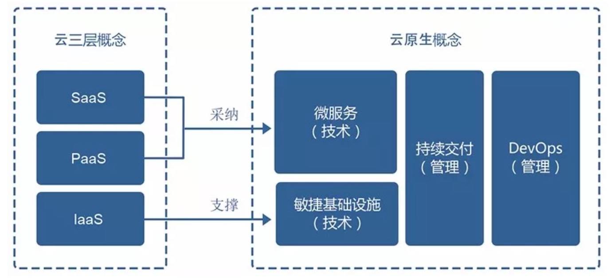
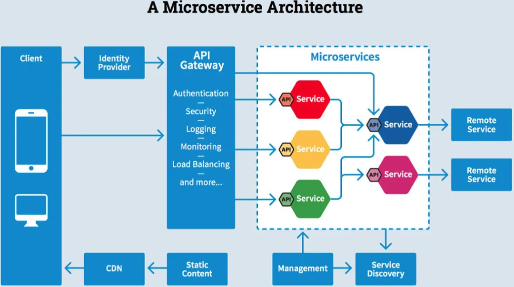
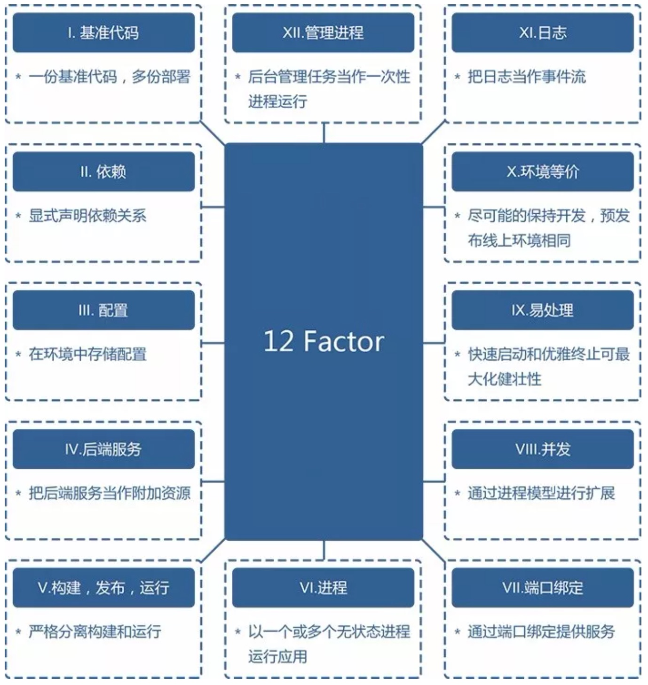

# Cloud Native 云原生

* 来自Pivotal的MattStine于2013年首次提出，根据其多年的架构和咨询经验总结出来的一个思想集合，并得到了社区的不断完善，内容非常多
  - DevOps
  - 持续交付（Continuous Delivery）
  - Container
  - Orchestration
  - Microservices 微服务
* 不但包括根据业务能力对公司进行文化、组织架构的重组与建设，也包括方法论与原则，还有具体的操作工具.采用基于云原生的技术和管理方法，可以更好地把业务生于“云”或迁移到云平台，从而享受“云”的高效和持续的服务能力。
* 面向“云”而设计的应用，因此技术部分依赖于在传统云计算的3层概念
  - 基础设施即服务（IaaS）
  - 平台即服务（PaaS）
  - 软件即服务（SaaS）
  - 例如，敏捷的不可变基础设施交付类似于IaaS，用来提供计算网络存储等基础资源，这些资源是可编程且不可变的，直接通过API可以对外提供服务；有些应用通过PaaS服务本来就能组合成不同的业务能力，不一定需要从头开始建设；还有一些软件只需要“云”的资源就能直接运行起来为云用户提供服务，即SaaS能力，用户直接面对的就是原生的应用。
* 应用基于云服务进行架构设计，对技术人员的要求更高，除了对业务场景的考虑外，对隔离故障、容错、自动恢复等非功能需求会考虑更多。借助云服务提供的能力也能实现更优雅的设计，比如弹性资源的需求、跨机房的高可用、11个9（99.999999999%）的数据可靠性等特性，基本是云计算服务本身就提供的能力，开发者直接选择对应的服务即可，一般不需要过多考虑本身机房的问题。如果架构设计本身又能支持多云的设计，可用性会进一步提高，比如Netflix能处理在AWS的某个机房无法正常工作的情况，还能为用户提供服务，这就是“云”带来的魔力，当然，云也会带来更多的隔离等问题
* 核心价值
  - 通过统一的标准实现在任何基础设施上提供和云上一致的功能和体验

```
Cloud native technologies empower organizations to build and run scalable applications in modern, dynamic environments such as public, private, and hybrid clouds. Containers, service meshes, microservices, immutable infrastructure, and declarative APIs exemplify this approach.These techniques enable loosely coupled systems that are resilient, manageable, and observable. Combined with robust automation, they allow engineers to make high-impact changes frequently and predictably with minimal toil.”

云原生技术有利于各组织在公有云、私有云和混合云等新型动态环境中，构建和运行可弹性扩展的应用。云原生的代表技术包括容器、服务网格、微服务、不可变基础设施和声明式API。这些技术能够构建容错性好、易于管理和便于观察的松耦合系统。结合可靠的自动化手段，云原生技术使工程师能够轻松地对系统作出频繁和可预测的重大变更。
```



## [云原生计算基金会 Cloud Native Computing Foundation CNCF](https://www.cncf.io)

* Sustaining and Integrating Open Source Technologies
* [云原生社区](https://cloudnative.to)
* 由Pivotal的Matt Stine于2013年首次提出，在2015年出版了《Migrating to Cloud-Native Application Architectures（迁移到云原生应用架构）》一书
* 云计算的3层划分，即基础设施即服务(IaaS)、平台即服务(PaaS)、软件即服务(SaaS)为云原生提供了技术基础和方向指引，真正的云化不仅仅是基础设施和平台的变化，应用也需要做出改变，摈弃传统的土方法，在架构设计、开发方式、部署维护等各个阶段和方面都基于云的特点，重新设计，从而建设全新的云化的应用，即云原生应用。
* 云原生技术有利于各组织在公有云、私有云和混合云等新型动态环境中，构建和运行可弹性扩展的应用。云原生的代表技术包括容器、服务网格（Service Mesh）、微服务、不可变基础设施和声明式API。这些技术能够构建容错性好、易于管理和便于观察的松耦合系统。结合可靠的自动化手段，云原生技术使工程师能够轻松地对系统作出频繁和可预测的重大变更
* 截止2020年4月，CNCF 基金会共托管49个云原生项目，每个CNCF项目都对应一个成熟度等级，申请成为CNCF项目的时候需要确定项目的成熟度级别，Kubernetes和 Envoy等项目基于生产可用和高稳定性首先成为毕业项目（9个），其他项目则根据其成熟度分别位于孵化（17个）和沙箱（23个）阶段。CNCF目前托管的项目共同构成了云原生生态的基石
* 使命
  - 容器化包装
  - 通过中心编排系统的动态资源管理
  - 面向微服务
* 价值主张
  - 隔离性：把应用程序打包在容器中加快了代码和组件的重用，并且简化了操作；
  - 无锁定：开源软件栈支持在任何公共或私有云上或以组合方式进行部署；
  - 无限扩展：为能够扩展到数万个自修复多租户节点的现代分布式系统环境而优化；
  - 灵活性和可维护性：将应用程序拆分为具有明确描述的依赖关系的微服务；
  - 提高效率和资源利用率：动态管理和调度微服务的中央编排流程降低了与维护和操作相关的成本；
  - 应用的弹性：以应对单个容器甚至数据中心的故障，以及不同级别的需求
* 技术范畴
  - 云应用定义与开发
  - 云应用的编排与管理
  - 监控与可观测性
  - 云原生的底层技术
    + 容器运行时
    + 云原生存储技术
    + 云原生网络技术
  - 云原生工具集
  - Serverless
* 项目成熟度等级划分:CNCF给出了路线图（Trail Map）用于对用户在整体上给出指导建议，共分成十个步骤进行实施，而在不同的步骤都可以结合CNCF全景图（Landscape）中列出的产品或服务进行选择
  - 容器化；CI/CD
  - 应用定义及编排
  - 监控及分析
  - 服务代理、发现和网格
  - 网络、策略及安全
  - 分布式数据库及存储
  - 流与消息
  - 镜像库与运行时
  - 软件分发
* [CNCF 全景图](https://github.com/cncf/landscape):Static Cloud Native Landscapes and Interactive Landscape that filters and sorts hundreds of cloud native projects and products, and shows details including GitHub stars, funding or market cap, first and last commits, contributor counts, headquarters location, and recent tweets. <https://landscape.cncf.io/>

## 特质

* 模块化 Modularity
* 可观测性 Observability
* 可部署性 Deployability
* 可测试性 Testability
* 可处理性 Disposability
* 可替换性 Replaceability

## 关键技术

* 微服务架构：服务与服务之间通过高内聚低耦合的方式交互
* 容器：作为微服务的最佳载体，提供了一个自包含的打包方式
* 容器编排：解决了微服务在生产环境的部署问题
* 服务网络 Service Mesh：作为基础设施，解决了服务之间的通信
* 不可变基础：设施提升发布效率，方便快速扩展
* 声明式 API:让系统更加健壮
  - 命令式 API：可以直接发出让服务器执行的命令，例如：“运行容器”、”停止容器”等
  - 声明式 API：可以声明期望的状态，系统将不断地调整实际状态，直到与期望状态保持一致
* DevOps：缩短研发周期，增加部署频率，更安全地方便：
  - Culture ：达成共识
  - Automation：基础设施自动化
  - Measurement：可度量
  - Sharing：你中有我，我中有你

## 微服务 Microservice

* 一种用于构建应用的架构方案。将一个复杂的应用拆分成多个独立自治的服务，服务与服务间通过“高内聚低耦合”的形式交互。
* 先了解单体（Monolithic）应用
  - 作为一整个单元构建的应用程序。企业应用由三个重要部分组成：客户端界面（由HTML、Javascript组成，使用浏览器访问）、数据库、服务端程序。服务端程序处理HTTP请求、执行业务逻辑、检索并更新数据库中的数据、选择和填充HTML视图发送给客户端。这个服务端程序是一个单一结构也即一个整体，系统中的任何修改都将导致服务端重新编译和布署一个新版本。
  - 业务中所有请求都要在单一的进程中处理完成
  - 应用程序被发布到云的时候，变更周期被捆绑在一起-对应用程序一小部分所做的变更，都需要重新编译和部署整个应用。随着时间的推移，软件开发者很难保持一个好的模块架构，使得单个模块的变更不会影响到其它模块，而且扩展时也只能进行整体扩展，而不能根据需求进行部分扩展。”-- Martin Fowler
  - 单体应用局限性：
    + 复杂性高：业务规模和团队规模发展的一定阶段，模块耦合严重，代码难以理解，质量变差
    + 交付效率低：构建和部署耗时长，难以定位问题，开发效率低，全量部署耗时长、影响范围广、风险大，发布频次低
    + 伸缩性差：单体只能按整体横向扩展，无法分模块垂直扩展
    + 可靠性差：一个bug有可能引起整个应用的崩溃
    + 阻碍技术创新：受技术栈限制，团队成员使用同一框架和语言
  - 问题
    + 单体架构在需求越来越多的时候无法满足其变更要求，开发人员对大量代码的变更会越来越困难，同时也无法很好地评估风险，所以迭代速度慢
    + 系统经常会因为某处业务的瓶颈导致整个业务瘫痪，架构无法扩展，木桶效应严重，无法满足业务的可用性要求
    + 整体组织效率低下，无法很好地利用资源，存在大量的浪费
* 最有代表性的是Netflix公司，它是国外最早基于云进行服务化架构改造的公司，2008年因为全站瘫痪被迫停业3天后，它痛下决心改造，经过将近10年的努力，实现了从单架构到微服务全球化的变迁，满足了业务的千倍增长，并产生了一系列的最佳实践
* 概念最早出现于2012年，2015年以后受到越来越多的关注，并且逐渐开始流行开来。其中著名技术大神Martin Fowler功不可没，他于2014年发表的一篇博客《Microservices: a definition of this new architectural term》（微服务：新技术架构的定义）清晰的定义和阐述了微服务概念。
* 2013年，Martin Flower 于2014年发表的一篇博客《Microservices: a definition of this new architectural term》（微服务：新技术架构的定义）清晰的定义和阐述了微服务概念.对微服务概念进行了比较系统的理论阐述，总结了相关的技术特征
  - 微服务是一种架构风格，也是一种服务
  - 微服务的颗粒比较小，一个大型复杂软件应用由多个微服务组成，比如Netflix目前由500多个的微服务组成
  - 它采用UNIX设计的哲学，每种服务只做一件事，是一种松耦合的能够被独立开发和部署的无状态化服务（独立扩展、升级和可替换）
  - 微服务架构是一种架构模式，提倡将单一应用程序划分成一组小的服务，服务之间相互协调、互相配合，为用户提供最终价值。每个服务运行在其独立的进程中，服务和服务之间采用轻量级的通信机制相互沟通（通常是基于HTTP的Restful API)。这些服务要基于业务场景，并使用自动化布署工具进行独立的发布。可以有一个非常轻量级的集中式管理来协调这些服务，可以使用不同的语言来编写服务，也可以使用不同的数据存储。”-- Martin Fowler
* 微服务架构将单体应用，按照业务领域拆分为多个高内聚低耦合的小型服务，每个服务运行在独立进程，由不同的团队开发和维护，服务间采用轻量级通信机制，如HTTP RESTful API，独立自动部署，可以采用不同的语言及存储方式。微服务体现去中心化、天然分布式，是中台战略落地到IT系统的具体实现方式的技术架构，用来解决企业业务快速发展与创新时面临的系统弹性可扩展、敏捷迭代、技术驱动业务创新等难题。
* 由微服务的定义分析可知，一个微服务基本是一个能独立发布的应用服务，因此可以作为独立组件升级、灰度或复用等，对整个大应用的影响也较小，每个服务可以由专门的组织来单独完成，依赖方只要定好输入和输出口即可完全开发，甚至整个团队的组织架构也会更精简，因此沟通成本低、效率高。根据业务的需求，不同的服务可以根据业务特性进行不同的技术选型，是计算密集型还是I/O密集型应用都可以依赖不同的语言编程模型，各团队可以根据本身的特色独自运作。服务在压力较大时，也可以有更多容错或限流服务。
* 单体应用 vs 微服务:一个比较形象的例子是装配式建筑
  - 传统建筑（单体应用）的施工周期（开发时间）很长，往往依赖于建筑公司（开发团队）的能力和水平，修建完成后难以搬迁和复用
  - 装配式建筑（微服务）的梁、板、柱、墙等构件（单个服务）可以事先批量化的在工厂（容器）生产，而在建造过程中，可以把构件想象成一块块乐高积木，在施工现场只需把它们拼合在一起，大大提升了施工进度和建筑质量。
* 特征：
  - 小：粒度小，专注于一件事
  - 独：单独的进程。微服务不等于组件，服务是可以直接使用的商品，组件是待加工的原材料
  - 轻：轻量级通信机制，通常是HTTP Restful的接口。此处区别于传统的SOA（面向服务的架构）
  - 松：松耦合，可以独立部署。每个微服务可以独立编译、独立部署、独立运行
* 微服务采用独立的数据库服务，数据去中心化.微服务运行在独立的进程中，部署去中心化
* 好处：
  - 易于开发与维护：微服务相对小，易于理解
  - 独立部署：一个微服务的修改不需要协调其它服务
  - 伸缩性强：每个服务都可按硬件资源的需求进行独立扩容
  - 与组织结构相匹配：微服务架构可以更好将架构和组织相匹配，每个团队独立负责某些服务，获得更高的生产力
  - 技术异构性：使用最适合该服务的技术，降低尝试新技术的成本
  - 企业环境下的特殊要求：去中心化和集中管控/治理的平衡，分布式数据库和企业闭环数据模型的平衡
* 微服务基础设施及案例
  - 最常见、最广泛使用的框架是基于Java的Spring Cloud（集成了Netflix OSS技术栈），提供了服务发现、负载均衡、故障转移、动态扩展和数据分区等功能，已经成为微服务的最佳实践
  - Spring Cloud构建在Java虚拟机之上，不能满足高并发下的性能要求，所以许多开源产品层出不穷，其中也包括中国互联网企业所贡献的微服务框架，例如华为的ServiceComb、阿里的Dubbo等等
* 微服务的团队间应该是inter-operate，not integrate（互操作、不集成）。inter-operate是定义好系统的边界和接口，在一个团队内全栈，让团队自治，原因就是因为如果团队按照这样的方式组建，将沟通的成本维持在系统内部，每个子系统就会更加内聚，彼此的依赖耦合变弱，跨系统的沟通成本也就能减低。
* 微服务架构确实有很多吸引人的地方，然而它的引入也是有成本的，它并不是银弹，使用它会引入更多技术挑战，比如性能延迟、分布式事务、集成测试、故障诊断等方面，企业需要根据业务的不同的阶段进行合理的引入，不能完全为了微服务而“微服务”
* 蜂群理论
  - 凯文·凯利在《失控》中提出了著名的“蜂群理论”，利用蜂巢思维比喻人类的协作带来的群体智慧：依靠成千上万个发条一起驱动一个并行的系统，进行生产，进行自维持。蜂巢思维就是“群体思维”（Collective consciousness）。作为“超级有机体”的蜂群，被称为“分布式系统”，是以生物逻辑建立起来的群集模型。由此形成的蜂巢思维这四个理念至关重要：
  - 去中心化。几乎所有的团队都直接接触用户与市场，因此所有的团队都将围绕市场格局而变，充分重视第一线的敏感度与直觉，从而做到真正的应时而动；
  - 分布式。与垂直型集团组织不同，这个形态打破单一的行业垂直细分格局。在这种多维度矩阵式结构中，拥有更加专注的功能型团队，可建立起一个紧密围绕具体客户与市场的服务体系；
  - 强化合作。从控制权、所有权的角度来说，这些组织单元是分离的，因而要建立起一种横向合作的文化，打破物理团队，提倡交流、合作，整体核心竞争力的提升；
  - 适应变化。市场在不断变化，但因所有的团队都直接接触用户与市场，因此无论个人还是团队，都将不断的学习和进化。
  - 微服务理念对应的组织模式包括蜂巢型组织，它具有突出的稳定性和抗弯曲能力，特点是：
    + 跨组织：它不一定是一个独立的法人实体，而是为了特定目标或项目形成的联盟
    + 相对统一：蜂巢组织不是一成不变的，当市场需求或组织目标发生变化时立即变化
    + 分享性：它改变了传统的等级分明的金字塔结构，允许信息横向传递与交流，使信息利用更为充分及时
  - 在这样一个以蜂巢为理念搭建的企业圈层里面，各个独立团队能够得到更好的协助与支撑，不断扩大视野，提高眼界，掌握话语权，团队成员也会更有归属感。这样的团队乃至蜂巢本身，也一定会更有活力和变革力，更加能适应市场的变化。蜂巢型组织有四个突出特点，所谓活系统的特质也正是由此而来：没有强制性的中心控制；次级单位具有自治的特质；次级单位之间彼此高度连接；点对点间的影响通过网络形成了非线性因果关系。
  - 蜂巢型组织的典型案例之一是华为。除了组织架构去中心化的管理模式之外，华为的著名的轮值CEO制度正是由此而来，华为有三位轮值CEO，每六个月轮换一次，这体现了依靠集体民主决策而非一人独裁的理念。
  - 国美蜂巢式组织变革的实践是将由四个大区管辖54个分公司，调整为七个大区直接管辖200家分公司的结构，即将原来二级市场里的146家分公司独立出来，直接划归大区管辖，而原来四个大区变成七个大区。实践证明，组织扁平化是国美提升供应链效率，提升消费者消费体验的重要战略。
  - 国外著名的代表案例是微服务先驱Netflix。Netflix是一家技术强大的互联网公司，但是它却没有CTO职位，产品团队和技术团队(包括UI前端工程团队、Discovery搜索工程团队和Platform平台团队等)全部汇报首席产品CPO，产品驱动是该公司的核心文化要素之一，Netflix称其为BusDevOps组织架构。

* 有支撑微服务的平台
* 有符合微服务平台规范的APP
* 如何引入微服务
* 微服务核心技术点
* 典型架构
  - 服务重构：单体改造成符合业务的微服务架构；
  - 服务注册与发现：微服务模块间的服务生命周期管理；
  - 服务网关：身份认证、路由服务、限流防刷、日志统计；
  - 服务通信：通信技术方案如，RPC vs REST vs 异步消息；
  - 可靠性：服务优雅降级，容灾，熔断，多副本。



### 微服务与中台

* 中台架构:简单地说就是企业级能力的复用，一种方法论，企业治理思想。微服务，是可独立开发、维护、部署的小型业务单元，是一种技术架构方式。
* 中台并不是微服务，中台是一种企业治理思想和方法论，偏向于宏观，微服务是技术架构方式，偏向于微观。而中台化的落地，离不开使用微服务架构。
* 中台强调核心基础能力的建设，基础能力以原子服务的形式来建设，并通过将原子服务产品化，支撑业务端各种场景的快速迭代和创新；原子服务和微服务所倡导的服务自闭环思想不谋而合，使得微服务成为实现原子服务的合适架构。
* 支撑业务场景的应用也是通过服务来实现，其生命周期随业务变化需要非常灵活的调整，这也和微服务强调的快速迭代高度一致，所以业务应用服务也适合通过微服务来实现。
* 微服务 vs 宏服务：新的抉择
  - Uber支付体验平台的工程经理Gergely Orosz发布推文表示他们的架构方向已经发生了变化。“声明一下，在Uber，我们正将许多微服务转移到@copyconstruct所称的Macroservices宏服务（大小适中的服务）。 确切地说，B/C测试和维护成千上万的微服务不仅很难——它可能会带来更多的长期麻烦，而不是解决短期问题。微服务确实可以帮助团队在早期快速推进。 等你意识到服务越少越好时，已为时已晚。你需要解决很多服务的“困难”部分。我们在不断增加更多的服务，但也在停止使用服务，并且会更慎重的思考新的服务。“
  - 有一篇英文文献中这样描述Macroservices宏服务：宏服务应该定义为运行2-20个单独服务的应用程序体系结构，每个服务代表一个中等大小的代码库，可处理业务中定义明确的部分。宏服务的关键是拆分服务，最大程度地从拆分中获得收益，同时最大程度地降低运行多个服务的开销。通俗点讲，宏服务介于单体服务到微服务之间，关注的不再是某一个细节点，而是一个业务点。

## 容器

* 在容器技术之前，业界网红是虚拟机。虚拟机技术的代表是VMware和OpenStack，很多人都用过虚拟机，就是在操作系统里安装一个软件，然后通过这个软件，再模拟一台甚至多台“子电脑”出来。在“子电脑”里，可以和正常电脑一样运行程序，例如微信、Word。“子电脑”和“子电脑”之间，相互隔离互不影响。
* 虚拟机虽然可以隔离出很多“子电脑”，但占用空间大，启动慢，虚拟机软件可能还要花钱（例如VMware）。而容器技术恰好没有这些缺点，它不需要虚拟出整个操作系统，只需要虚拟一个小规模的环境（类似“沙箱”），启动时间很快，几秒钟就能完成。而且，它对资源的利用率很高（一台主机可以同时运行几千个Docker容器）。此外它占的空间很小，虚拟机一般要几GB到几十GB的空间，而容器只需要MB级甚至KB级。虚拟机和以Docker为代表的容器都是虚拟化技术，不过容器属于轻量级的虚拟化
* 优势：
  - 更高效的利用资源
  - 更快速的启动时间
  - 一致性的运行环境
* Docker
  - Docker本身并不是容器，它是创建容器的工具，是应用容器引擎。虽然Docker 把容器技术推向了巅峰，但容器技术却不是Docker发明的。实际上，容器技术连新技术都算不上，因为它的诞生和使用有些年头了，像最早的容器LXC发布于2008年
  - Docker本来是做PaaS的公司，原来叫做DotCloud，成立于2010年。但比起Pivotal、Red Hat等著名企业，DotCloud运营并不成功。眼看就要失败的时候，2013年DotCloud决定开源自己的容器项目Docker。但是短短几个月，Docker迅速崛起，吸引大量的开发者使用。随着Docker在开发者中越来越流行，2013年10月，DotCloud公司正式更名为Docker，2014年8月，Docker 宣布把PaaS业务出售，开始专心致志做Docke
  - Docker一词意为码头工人，而它的logo则是一个托着许多集装箱的鲸鱼，非常形象：Docker是鲸鱼，而集装箱则是一个个的容器。在Docker的官网上，对于容器有一个一句话的解释“A standardized unit of software”，即“软件的一个标准化单元”
  - 容器是在操作系统层面上实现虚拟化，而传统方式是在硬件层面实现，所以导致两者的特性有很大区别，Docker更小更轻
  - Docker与传统的Linux容器也并不完全一致。Docker技术最初是建立在LXC技术之上的，大多数人都把LXC技术与传统的Linux容器联系在一起，尽管后来它已经摆脱了这种依赖性。LXC作为轻量级虚拟化很有用，但它没有很好的开发人员或用户体验。Docker技术带来的不仅仅是运行容器的能力，它还简化了创建和构建容器、加载镜像和镜像版本控制等过程。传统的Linux容器使用可以管理多个进程的init系统，这意味着整个应用可以作为一个整体运行。Docker鼓励将应用程序分解为它们各自的进程，并提供了实现这一点的工具，这种粒度有不少优点
  - 解决问题
    + Linux上不愉快的经历之一就是安装软件。因为系统硬件、操作系统环境不一样，软件包有不同的依赖性，所以必须要安装完软件依赖路径上的所有包，这个链条之长，往往要耗费几小时甚至几天的时间
    + 如果所有服务器环境统一、标准化，还能保留上面的配置、安装的软件和应用，对于我们来讲就更加有用。Docker正是在操作系统之上实现了这个标准化、统一化的运行环境，并且把各种不同的配置和应用存储成镜像，供未来使用
* 容器是微服务和云原生架构的最佳实现载体。微服务与容器几乎是完美的搭配。单体式架构（Monolithic）变成微服务架构（Microservices），相当于一个全能型变成N个专能型，每个专能型分配一个隔离的容器，赋予了最大程度的灵活.所以容器化是云计算的终极形态

## 容器编排

* 自动化管理和协调容器的系统，专注于容器的生命周期管理和调度。
* 功能：
  - 容器调度：依据策略完成容器与母机绑定；
  - 资源管理：CPU、MEM、GPU、Ports、Device；
  - 服务管理：负载均衡、健康检查。

* Kubernetes使用:
  - 滚动发布/滚动更新（Rolling Update Deployment）是指每次只升级一个或多个服务，升级完成后加入生产环境，不断执行这个过程，直到集群中的全部旧版本升级成为新版本。在整个滚动发布期间，保证始终有可用的副本在运行，从而平滑的发布新版本，实现零停机、用户零感知，是云原生时代非常主流的发布方式。
    + 滚动发布开始后（Step 2），负载均衡器将服务器A从集群里摘除，服务器A进行新版本的发布，由服务器B和服务器C对外提供版本1.0的服务；
    + Step 3，服务器A更新完毕，部署验证成功，负载均衡器将其加入集群，开始和服务器C一起对外提供不同版本的服务，同时服务器B开始发布；直至服务器ABC全部发布完成（Step 5），服务都更新到最新的2.0版本。
  - 滚动发布优点是用户无感知，平滑过渡，同时不需要冗余服务器，节省资源。不足是部署时间慢，取决于每阶段的更新时间；发布策略较复杂；同时涉及自动化的更新策略、部署验证、回滚机制等等，自动化程度比较高，通常需要复杂的发布工具支撑，而Kubernetes正好可以完美的支持这个任务。
  - Kubernetes 集群本身状态就是实际状态，而期望状态来自于用户提交的配置文件。滚动发布的时候，Kubernetes将会根据这个控制循环，使用一个叫做Deployment的控制器，通过创建新的集群（下图中的v2版本ReplicaSet复制集）将其控制的Pod副本从0个逐渐变成3个，与此同时旧的集群（下图中v1版本的ReplicaSet）管理的Pod副本数则从3个逐渐变成0个，以此将一个集群中正在运行的多个Pod交替的逐一升级，实现滚动发布的效果。
  - 传统IT架构好比传统工厂，容器化好比现代化工厂，而Kubernetes则是智能化的无人工厂，让容器和应用能够高效自动、井然有序的被控制和管理；Kubernetes还实现了服务的抽象、解耦、高扩展、统一调度与集中化管理.
  - kubernetes不仅解决了容器的编排问题，让容器应用进入大规模工业生产，更进一步对云原生应用提供了定义规范，CNCF整个技术栈都是围绕Kubernetes建立，所以Kubernetes是云原生生态最重要的基石，可以说“Kubernetes是云原生时代的Linux”，即云原生应用的操作系统

## 服务网格 Service Mesh

* 致力于解决服务间通讯的基础设施层
  - Service Mesh 应对云原生应用的复杂服务拓扑，提供可靠的通信传递；
  - 通过一组轻量级网络代理（Sidecar proxy），与应用程序代码部署在一起来实现，且对应用程序透明。
* 特点：
  - 应用程序间通讯的中间层
  - 轻量级网络代理，应用程序无感知
  - 解耦应用的重试、监控、追踪、服务发现
* 主流组件：Istio、MOSN（Modular Open Smart Network）Linkerd。

## 不可变基础设施 Immutable Infrastructure

* 任何基础设施实例（服务器、容器等各种软硬件）一旦创建之后便成为一种只读状态，不可对其进行任何更改；
* 如果需要修改或升级实例，唯一方式是创建一批新实例以替换。
* 优势
  - 提升发布应用效率
  - 没有雪花服务器
  - 快速水平扩展

## 声明式 API

* 命令式 API：可直接发出让服务器执行的命令，例如：“运行容器”、“停止容器”等；
* 声明式 API：可声明期望的状态，系统将不断地调整实际状态，直到与期望状态保持一致。
* 为什么声明式使系统更加健壮？类比理解成自动化工程学的闭环自适应模型。

## Development & Operations DevOps 开发和运维

* 目标 ：缩短开发周期，增加部署频率，更可靠地发布。从历史上开发和运维相对孤立到开发和运维之间建立合作，可以增加信任，更快速地发布新版本。
* 2009年提出来的概念，一直没有太火。直到14年，容器与微服务架构的提出，DevOps才得到了快速的发展,内容也非常丰富，有理论也有实践，包括组织文化、自动化、精益、反馈和分享等不同方面
* 一组过程、方法与系统的统称，用于促进开发（应用程序/软件工程）、运维和质量保障（QA）部门之间的沟通、协作与整合。它的出现是由于软件行业日益清晰地认识到：为了按时交付软件产品 和服务，开发和运维必须紧密合作。
* 偏向于一种对于文化氛围的构建,即是促使开发人员与运维人员之间相互协作的文化。在DevOps文化指导下，团队中将包含了具有不同技能的人员（开发、测试等），并通过自动化测试与发布的手段，更快、更高质量的生产软件

* DevOps 不单是一个实现自动化的工具链，而是组织、流程与技术的结合。
  - 组织上强调全栈团队、团队特性专一、团队自治
  - 技术上打通开发与运维；流程上强调端到端、可视化、灰度升级、A/B测试等
* 组织架构、企业文化与理念等，需要自上而下设计，用于促进开发部门、运维部门和质量保障部门之间的沟通、协作与整合，简单而言组织形式类似于系统分层设计
* 自动化是指所有的操作都不需要人工参与，全部依赖系统自动完成，比如上述的持续交付过程必须自动化才有可能完成快速迭代
* DevOps的出现是由于软件行业日益清晰地认识到，为了按时交付软件产品和服务，开发部门和运维部门必须紧密合作
* DevOps的概念似乎与持续交付的概念有些类似，两者均旨在促进开发与运维之间的协作，但是实际上两者差别很大
* 强调的是高效组织团队之间如何通过自动化的工具协作和沟通来完成软件的生命周期管理，从而更快、更频繁地交付更稳定的软件。
* 对于DevOps，微服务不是必须的，但微服务为DevOps提供了最好的架构支撑，对于组织和流程的要求也是一致的
  - 配合微服务的理念组织构建团队协作的方式，各团队可以独立开发，测试、发布和迭代各自的微服务，互不干扰，沟通协调成本小。
  - 全部业务、研发和运维围绕产品开展工作，统一目标，大家都是产品驱动，分别服务于内外不同客户，避免技术驱动 vs 业务驱动的陷阱。
* 推行DevOps文化：在公司层面推行DevOps文化，倡导开放、合作的组织文化，打破“部门墙”

* DevOps 是一组过程，方法和系统的统称包括：
  - Culture：
    + 文化是 DevOps 中的第一成功要素。由于目标不同，开发和运维形成一堵墙，DevOps 通过建立开发和运维之间合作和沟通的文化来消除墙。
  - Automation：
    + 自动化软件的开发和交付，通常包含持续集成，持续交付和持续部署，云原生时代还包括基础架构的自动化，即 IaC(Infrastructureas code)。
  - Measurement：
    + 度量尤其重要，通过客观的测量来确定正在发生的事情的真实性，验证是否按预期进行改变。并为不同职能部门达成一致建立客观基础。
  - Sharing：
    + 开发和运维团队之间长期存在摩擦的主要原因是缺乏共同的基础。
    + 开发参与运维值班，参与软件的部署和发布，运维参与架构设计。

## 敏捷基础设施 Agile Infrastructure

* 提供弹性、按需的计算、存储、网络资源能力。可以通过Openstack、KVM、Ceph、OVS等技术手段实现
* 基于云计算的开发模式要考虑如何保证基础资源的提供能够根据代码自动实现需求，并实现记录变更，保证环境的一致性。
* 使用软件工程中的原则、实践和工具来提供基础资源的生命周期管理，这意味着工作人员可以更频繁地构建更强可控或更稳定的基础设施，开发人员可以随时拉取一套基础设施来服务于开发、测试、联调和灰度上线等需求
* 当然，同时要求业务开发具有较好的架构设计，不需要依赖本地数据进行持久化，所有的资源都是可以随时拉起，随时释放，同时以API的方式提供弹性、按需的计算、存储能力。
* 技术人员部署服务器、管理服务器模板、更新服务器和定义基础设施的模式都是通过代码来完成的，并且是自动化的，不能通过手工安装或克隆的方式来管理服务器资源，运维人员和开发人员一起以资源配置的应用代码为中心，不再是一台台机器。基础设施通过代码来进行更改、测试，在每次变更后执行测试的自动化流程中，确保能维护稳定的基础设施服务。
* 基础设施的范围也会更加广泛，不仅包括机器，还包括不同的机柜或交换机、同城多机房、异地多机房等，这些内容也会在后续章节中逐一进行部分讨论。

## 康威定律 Conway's law

* 组织挑战
  - 微服务理念不仅反映了技术架构的变化，也反映了组织内部沟通结构为了应对更加灵活、快速、碎片化的需求和环境而变化的结果
  - 职能型组织模式:“当希望把一个大型应用拆分成多个部分时，管理层通常将重点放在技术层面。而如果组织架构还按UI团队、服务端逻辑团队和数据库团队的标准设立，甚至一个非常简单的变更都将导致跨团队间的项目协作，从而耗费时间和预算审批。一个高效的团队会针对这种情况进行优化，关注它们所涉及的应用逻辑，并从中做出更好的选择。换句话说，逻辑无处不在。这是康威定律的一个实例。”-- Martin Fowler
  - 设计系统的架构受制于产生这些设计的组织的沟通结构（Organizations which design systems are constrained to produce designs which are copies of the communication structures of these organizations）-- Melvyn Conway, 1967
* 业务云化推行，从某种意义上讲也是一种变革.组织决定系统架构！一个云系统最终长成什么样子，则完全是企业的组织结构决定的，是组织内部、组织之间的沟通结构
康威定律可谓软件架构设计中的第一定律，本质是对商业世界的规律总结，但是因为投稿到编程相关的杂志，后经过《人月神话》这本软件界圣经的引用，并命名为康威定律（Conway's law），因此得以推广
* 总结
  - 第一定律 组织沟通方式会通过系统设计表达出来（Communication dictates design）
  - 第二定律 时间再多一件事情也不可能做的完美，但总有时间做完一件事情（There is never enough time to do something right, but there is always enough time to do it over）
  - 第三定律 线型系统和线型组织架构间有潜在的异质同态特性（There is a homomorphism from the linear graph of a system to the linear graph of its design organization）
  - 第四定律 大的系统组织总是比小系统更倾向于分解（The structures of large systems tend to disintegrate during development, qualitatively more so than with small systems）
* 组织变革：根据康威定律，如果要达到比较理想的云化效果，必须进行组织变革。一个合理的组织架构，将会极大提高云化的推行

## 持续交付 CONTINUOUS DELIVERY CD

* 一系列的开发实践方法，用来确保让代码能够快速、安全的部署到产品环境中，它通过将每一次改动都提交到一个模拟产品环境中，使用严格的自动化测试，确保业务应用和服务能符合预期。
* 因为使用完全的自动化过程来把每个变更自动的提交到测试环境中，所以当业务开发完成时，有信心只需要按一次按钮就能将应用安全的部署到产品环境中。
* 采用：CI（持续集成）、代码检查、UT（单元测试），持续部署等方式，打通开发、测试、生产的各个环节，持续的增量的交付产品。
* 侧重点在于交付，其核心对象不在于代码，而在于可交付的产物。由于持续集成仅仅针对于新旧代码的集成过程执行了一定的测试，其变动到持续交付后还需要一些额外的流程。
* 与持续集成相比较，持续交付添加了测试Test->模拟Staging->生产Production的流程，也就是为新增的代码添加了一个保证：确保新增的代码在生产环境中是可用的。
* 好处：
  - 繁琐的部署工作没有了。团队不再需要花费几天的时间去准备一个发布
  - 可以更快的进行交付，这样就加快了与客户之间的反馈环
  - 轻松应对小变更，加速迭代
* 为了满足业务需求频繁变动，通过快速迭代，产品能做到随时都能发布的能力，是一系列的开发实践方法。
* 分为持续集成、持续部署、持续发布等阶段，用来确保从需求的提出到设计开发和测试，再到让代码快速、安全地部署到产品环境中。
* 持续集成 CONTINUOUS INTEGRATION CI:代码合并，构建，部署，测试都在一起，不断地执行这个过程，并对结果反馈
  - 每当开发人员提交了一次改动，就立刻进行构建、自动化测试，确保业务应用和服务能符合预期，从而可以确定新代码和原有代码能否正确地集成在一起。持续交付是软件发布的能力，在持续集成完成之后，能够提供到预发布之类系统上，达到生产环境的条件
  - 开发人员频繁的（一天多次的）将所有开发者的工作合并到主干上。这些新提交在最终合并到主线之前，都需要通过编译和自动化测试流进行验证，以保障所有的提交在合并主干之后的质量问题，对可能出现的一些问题进行预警。
  - 持续集成的核心在于确保新增的代码能够与原先代码正确的集成。
  - 好处：
    + 易于定位错误
    + 易于控制开发流程
    + 易于Code Review
    + 易于减少不必要的工作
* 持续部署 CONTINUOUS DEPLOYMENT:部署到测试环境、预生产环境、生成环境
  - 使用完全的自动化过程来把每个变更自动提交到测试环境中，然后将应用安全地部署到产品环境中，打通开发、测试、生产的各个环节，自动持续、增量地交付产品，也是大量产品追求的最终目的，当然，在实际运行的过程中，有些产品会增加灰度发布等环境。总之，它更多是代表一种软件交付的能力
  - 通过自动化部署的手段将软件功能频繁的进行交付。
  - 与持续交付以及持续集成相比，持续部署强调了通过自动部署的手段，对新的软件功能进行集成。
  - 同持续交付相比持续集成的区别体现在对生产的自动化。从开发人员提交代码到编译、测试、部署的全流程不需要人工的干预，完全通过自动化的方式执行。
  - 这一策略加快了代码提交到功能上线的速度，保证新的功能能够第一时间部署到生产环境并被使用。
  - 好处：
    + 发布频率更快，因为不需要停下来等待发布。每一处提交都会自动触发发布流
    + 在小批量发布的时候，风险降低了，发现问题可以很轻松的修复
    + 客户每天都可以看到持续改进和提升，而不是每个月或者每季度，或者每年
* 持续交付(Continuous Delivery, CD):  将最终产品发布到生成环境、给用户使用。
* 容器化CI/CD
  - 有一个docker harbor 的镜像仓库，通常会把你的环境打包为一个镜像，通过镜像的方式来部署
* Jenkins 中 Pipeline 有诸多优点，例如：
  - 项目发布可视化，明确阶段，方便处理问题
  - 一个Jenkins File文件管理整个项目生命周期
  - Jenkins File可以放到项目代码中版本管理
* Jenkins与kubernetes搭建CI/CD流水线有诸多好处：
  - Jenkins高可用
  - 自动伸缩
  - 环境隔离
  - 易维护
* 推行：联合开发、质量、运维各个环节，打通代码提交、代码检查、UT、开发环境部署、staging环境部署、线上环境部署等流水线。

## [十二要素 The Twelve-Factor App](https://12factor.net/)

* 最初由Heroku的工程师整理起步，是集体贡献总结的智慧，如图所示。根据基于云的软件开发模式
* 12要素比较贴切地描述了软件应用的原型，并诠释了使用原生云应用架构的原因。
  - 比如，一个优雅的互联网应用在设计过程中，需要遵循的一些基本原则和云原生有异曲同工之处。
  - 通过强化详细配置和规范，类似Rails的基于“约定优于配置”（convention over configuration）的原则，特别在大规模的软件生产实践中，这些约定非常重要，从无状态共享到水平扩展的过程，从松耦合架构关系到部署环境。
  - 基于12要素的上下文关联，软件生产就变成了一个个单一的部署单元；多个联合部署的单元组成一个应用，多个应用之间的关系就可以组成一个复杂的分布式系统应用。
* 基准代码Codebase：一份基准代码，多份部署 One codebase tracked in revision control, many deploys
  - 每一个部署的应用都在版本控制代码库中被追踪。在多个部署环境中，会有多种部署实例，单个应用只有一份代码库，多份部署相当于运行了该应用的多个实例，比如开发环境一个实例，测试环境、生产环境都有一个实例。
  - 实际上，在云计算架构中，所有的基础设施都是代码配置，即Infrastructure as Code（IaC），整个应用通过配置文件就可以编排出来，而不再需要手工的干预，做到基础服务也是可以追踪的。
* 依赖Dependencies：Explicitly declare and isolate dependencies 显式声明依赖关系
  - 应用程序不会隐式依赖系统级的类库，通过依赖清单声明所有依赖项，通过依赖隔离工具确保程序不会调用系统中存在，但清单中未声明依赖项，并统一应用到生产和开发环境。比如通过合适的工具（例如Maven、Bundler、NPM），应用可以很清晰地对部署环境公开和隔绝依赖性，而不是模糊地对部署环境产生依赖性。
  - 在容器应用中，所有应用的依赖和安装都是通过DockerFile来完成声明的，通过配置能明确把依赖关系，包括版本都明确地图形化展示出来，不存在黑盒。
* 配置Config：Store config in the environment在环境中存储配置 Configmap
  - 环境变量是一种清楚、容易理解和标准化的配置方法，将应用的配置存储于环境变量中，保证配置排除在代码之外，或者其他可能在部署环境（例如研发、展示、生产）之间区别的任何代码，可以通过操作系统级的环境变量来注入。
  - 实例根据不同的环境配置运行在不同的环境中，此外，实现配置即代码，在云环境中，无论是统一的配置中心还是分布式的配置中心都有好的实践方式，比如Docker的环境变量使用。
* 后端服务Backing services：Treat backing services as attached resources把后端服务当作附加资源
  - 不用区别对待本地或第三方服务，统一把依赖的后端作为一种服务来对待，例如数据库或者消息代理，作为附加资源，同等地在各种环境中被消耗。比如在云架构的基础服务中，计算、网络、存储资源都可以看作是一种服务去对待使用即可，不用区分是远程还是本地的。
* 构建，发布，运行Build, release, run：Strictly separate build and run stages严格分离构建和运行
  - 应用严格区分构建、发布、运行这3个阶段。3个阶段是严格分开的，一个阶段对应做一件事情，每个阶段有很明确的实现功能。云原生应用的构建流程可以把发布配置挪到开发阶段，包括实际的代码构建和运行应用所需的生产环境配置。在云原生应用中，基于容器的Build-Ship-Run和这3个阶段完全吻合，也是Docker对本原则的最佳实践。
* 进程Processes：Execute the app as one or more stateless processes以一个或多个无状态进程运行应用 Deployment
  - 进程必须无状态且无共享，即云应用以一个或多个无状态不共享的程序运行。任何必要状态都被服务化到后端服务中（缓存、对象存储等）。
  - 所有的应用在设计时就认为随时随地会失败，面向失败而设计，因此进程可能会被随时拉起或消失，特别是在弹性扩容的阶段。
* 端口绑定Port binding：Export services via port binding通过端口绑定提供服务 - Service
  - 不依赖于任何网络服务器就可以创建一个面向网络的服务，每个应用的功能都很齐全，通过端口绑定对外提供所有服务，比如Web应用通过端口绑定（Port binding）来提供服务，并监听发送至该端口的请求（包括HTTP）。
  - 在容器应用中，应用统一通过暴露端口来服务，尽量避免通过本地文件或进程来通信，每种服务通过服务发现而服务。
* 并发Concurrency：Scale out via the process model：通过进程模型进行扩展 - HPA/CA
  - 进程可以看作一等公民，并发性即可以依靠水平扩展应用程序来实现，通过进程模型进行扩展，并且具备无共享、水平分区的特性。
  - 在互联网的服务中，业务的爆发性随时可能发生，因此不太可能通过硬件扩容来随时提供扩容服务，需要依赖横向扩展能力进行扩容。
* 易处理Disposability：Maximize robustness with fast startup and graceful shutdown 快速启动和优雅终止可最大化健壮性 - Health Check/Signal
  - 所有应用的架构设计都需要支持能随时销毁的特点，和状态的无关性保持一致，允许系统快速弹性扩展、改变部署及故障恢复等。
  - 在云环境中，由于业务的高低峰值经常需要能实现快速灵活、弹性的伸缩应用，以及不可控的硬件因素等，应用可能随时会发生故障，因此应用在架构设计上需要尽可能无状态，应用能随时随地拉起，也能随时随地销毁，同时保证进程最小启动时间和架构的可弃性，也可以提供更敏捷的发布及扩展过程。
* 开发环境与线上环境等价Dev/prod parity:Keep development, staging, and production as similar as possible - AKS
  - 必须缩小本地与线上差异，确保环境的一致性，保持研发、测试和生产环境尽可能相似，这样可以提供应用的持续交付和部署服务。
  - 在容器化应用中，通过文件构建的环境运行能做到版本化，因此保证各个不同环境的差异性，同时还能大大减少环境不同带来的排错等成本沟通问题。
* 日志Logs：Treat logs as event streams把日志当作事件流 - Container Insight
  - 每一个运行的进程都会直接标准输出（stdout）和错误输出（stderr）事件流，还可以将日志当作事件流作为数据源，通过集中服务，执行环境收集、聚合、索引和分析这些事件。
  - 日志是系统运行状态的部分体现，无论在系统诊断、业务跟踪还是后续大数据服务的必要条件中，Docker提供标准的日志服务，用户可以根据需求做自定义的插件开发来处理日志。
* 管理进程 Admin processes：Run admin/management tasks as one-off processes后台管理任务当作一次性进程运行 - CronJob
  - 管理或维护应用的运行状态是软件维护的基础部分，比如数据库迁移、健康检查、安全巡检等，在与应用长期运行的程序相同环境中，作为一次性程序运行。



## 云原生和边缘基础设施

* 在云计算真正普及之前，获取基础设施能力（比如服务发现、流量控制、监控与可观测性、访问控制、网络控制、存储层抽象等）需要应用通过某种抽象或接口方式，使得两者之间是非常紧密的耦合关系，应用本身的能力和演进需要强依赖基础设施
* 在云原生时代，类似kubernetes这样的标准化资源抽象、编排、整合平台促进基础设施能力正在不断下沉，云能力和应用之间的隔阂也正在云原生技术体系下被不断瓦解。
* 随着互联网智能终端设备数量的急剧增加和数据、业务下沉的诉求增多，边缘计算规模和业务复杂度已经发生了翻天覆地的变化，边缘智能、边缘实时计算、边缘分析等新型业务不断涌现。是否能将云计算的能力下沉到边缘侧、设备侧，并通过中心进行统一交付、运维、管控，通过粘合云计算核心能力和边缘算力，构筑在边缘基础设施之上的云计算平台？
* 挑战：
  - 云边端协同：缺少统一的交付、运维、管控标准。
  - 安全：边缘服务和边缘数据的安全风险控制难度较高。
  - 网络：边缘网络的可靠性和带宽限制。
  - 异构资源：对不同硬件架构、硬件规格、通信协议的支持，以及基于异构资源、网络、规模等差异化提供标准统一的服务能力的挑战。

## 层次

* 高可用设计（Design for Availability），依据应用业务需求，高可用分为不同级别，比如不同区域、不同机房（跨城或同城）、不同机柜、不同服务器和不同进程的高可用，云原生应用应该根据业务的可用性要求设计不同级别的架构支持。
* 可扩展设计（Design for Scale），所有应用的设计是无状态的，使得业务天生具有扩展性，在业务流量高峰和低峰时期，依赖云的特性自动弹性扩容，满足业务需求。
* 快速失败设计（Design for Failure），即包括系统间依赖的调用随时可能会失败，也包括硬件基础设施服务随时可能宕机，还有后端有状态服务的系统能力可能有瓶颈，总之在发生异常时能够快速失败，然后快速恢复，以保证业务永远在线，不能让业务半死不活地僵持着。

## 性能优化

* 服务间依赖复杂
  - 适度微服务拆分
    + 按职责划分微服务，把相同职责的模块或相同业务的模块划分到同一个微服务中（业务微服务）。对于通用痛点，下沉成为基础微服务。
    + 模块解耦，每个模块使用独立的数据存储，禁止相互之间直接通过数据库进行交互。
    + 独立发布，每个微服务独立打包、独立发布，避免影响其他模块。
    + 独立依赖，针对公共依赖冲突的问题，可以将模块的依赖独立开来，比如使用独立的代码仓库。
  - 规范API接口
    + 统一服务注册和发现
    + 统一认证鉴权
    + RESTful API
    + 幂等（请求执行的结果不依赖于执行次数）
  - 统一配置管理
    + 功能：
      * 配置中心
      * 监控告警
      * 动态降级
      * 流量切换
* 应用性能下降
  - 过早优化是万恶之源
    + 复杂性提升
    + 降低可维护性
    + 阻碍新功能特性
  - 性能评估 - 性能度量和监控
    + 性能度量:不要局限在单一维度的指标上，至少要从应用程序和系统资源这两个维度，分别选择不同的指标
    + 关注整体:性能优化并非没有成本
    + “二八原则”:80% 的问题都是由 20% 的代码导致的。只要找出这 20% 的位置，就可以优化 80% 的性能
  - 性能优化 - 提升应用性能
    + USE 法: 从系统资源瓶颈的角度来说，从使用率、饱和度以及错误数这三个方面，来优化 CPU、内存、磁盘和文件系统 I/O、网络以及内核资源限制等各类软硬件资源。
    + RED 法：请求量（Request rate）、错误（Error）、响应时间（Duration）。
    + 异常优化：避免雪崩，一方面保护自己只接收可处理的请求，另一方面不要给其他服务DDOS。
    + 在具体设计微服务时，可以参考著名的微服务十二要素原则。
* 服务治理困难
  - 所有服务都会碰到的通用痛点，理应下沉成为基础服务，作为容器平台的基础能力，提供给所有应用。常见的服务治理策略包括服务发现、请求认证、容错限流、链路跟踪等。
  - 实现频繁变更、独立部署、故障自动处理等必备的基础能力。一个 Devops 平台至少要提供持续集成、持续部署、监控平台、日志处理等几个基础功能。

## Ezmeral

* HP Enterprise (HPE) 宣布推出了专为加速企业数字化转型的软件组合品牌
* 包含了多项产品，包括容器调度与管理平台、AI 和数据分析、跨云成本管控、IT 自动化和网络安全等，基本上是以 HPE 收购的 MapR、Scytale 等产品为核心提供的 IaaS 和 PaaS 产品.是 Ezmeral 的底层基础架构，包含了 HPE 最近收购的 BlueData 和 MapR 的创新成果，以及用于容器编排的开源产品 Kubernetes，支持在各种基础架构（私有云、公有云、边缘节点）上大量部署及管理容器应用
* HPE 软件部门主管 Kumar Sreekani 直接放话要挑战 VMware Tanzu 和 Red Hat OpenShift，表示 Ezmeral 的最大优势是可以通过 MapR 的文件系统为容器应用提供数据持久化的能力，以及通过 BlueData 提供强大的 AI 能力

## [火山引擎](https://www.volcengine.cn/)

* 字节跳动旗下的数字服务与智能科技品牌，基于公司服务数亿用户的大数据、人工智能和基础服务等能力，以业界领先的超大容器集群规模支撑着今日头条、抖音、西瓜视频等产品线,为企业客户提供系统化全链路解决方案，助力企业务实地创新，实现业务持续快速的增长

## Networks

* [Project Calico](https://www.projectcalico.org/):Secure networking for the cloud native era

## 路由

* [traefik](https://github.com/containous/traefik):The Cloud Native Edge Router <https://traefik.io>

## 注册

* [harbor](./harbor.md):An open source trusted cloud native registry project that stores, signs, and scans content. <https://goharbor.io/>

## Trace

* [jaeger](https://github.com/jaegertracing/jaeger):CNCF Jaeger, a Distributed Tracing System <https://jaegertracing.io/>

## Monitor

* [netdata](https://github.com/netdata/netdata):Real-time performance monitoring, done right! <https://my-netdata.io/>

## 图书

* 云计算架构设计模式

## 工具

* [SimianArmy](https://github.com/Netflix/SimianArmy):Tools for keeping your cloud operating in top form. Chaos Monkey is a resiliency tool that helps applications tolerate random instance failures.
* [sealer](https://github.com/alibaba/sealer)

## 参考
