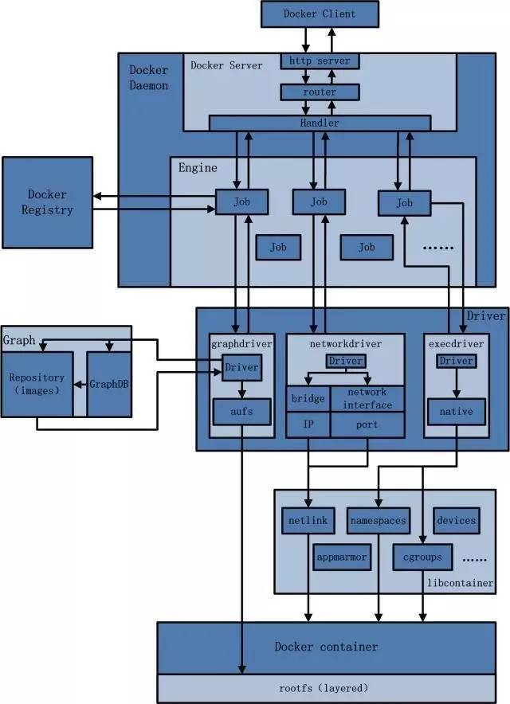
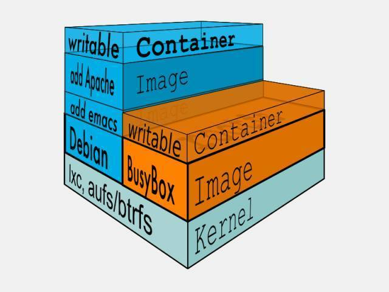

# [moby](https://github.com/moby/moby)

Moby Project - a collaborative project for the container ecosystem to assemble container-based systems <https://mobyproject.org/>

* 基于 Go 语言并遵从Apache2.0协议开源的应用容器引擎
* 基于LXC技术之上构建的container容器引擎，通过内核虚拟化技术（namespace及cgroups）来提供容器的资源隔离与安全保障，KVM是通过硬件实现的虚拟化技术，它是通过系统来实现资源隔离与安全保障，占用系统资源比较小
* 让开发者打包应用以及依赖包到一个轻量级、可移植的容器中，然后发布到任何流行的 Linux 机器上，也可以实现虚拟化
* 完全使用沙箱机制，保证不同服务之间环境隔离,提高了安全性,更重要的是容器性能开销极低
* 借鉴传统的虚拟及镜像机制，提供artifact集装箱能力，从而助力云计算，尤其是类似于提供了Web, Hadoop集群，消息队列等
* 镜像装箱机制：类似一个只读模版的文件结构，可以自定义及扩展，用来创建Docker容器
* 一种虚拟化技术解决开发环境和生产环境环境一致的问题，通过 Docker 可以将程序运行的环境也纳入到版本控制中，排除因为环境造成不同运行结果的可能
* 高效虚拟化
  - 借助LXC并进行革新提供了高效运行环境，而非类似VM的虚拟OS，GuestOS的弊端在于看起来够虚拟，隔离，然而使用起来又浪费资源，又难于管理
  - 基于LXC的核心Linux Namespace,对cgroups/namespace机制及网络过封装，把隔离性，灵活性（资源分配），便携，安全性，最重要是其性能做到了极致
  - 复用Host主机的OS, 抽象出Docker Engine层面实现调度与隔离，大大降低其负重级别
  - Docker是在操作系统层面进行虚拟化，而传统VM则直接在硬件层面虚拟化
  - 底层实现则借助了LXC, 管理利用了namespace做全县控制和隔离，cgroup来进行资源配置，aufs（类似git的思想，把文件系统的修改当作一次代码commit进行叠加从而节省存储）提高文件系统资源利用率
  - 提供了简洁易用的命令行和API
  - 基于联合文件系统的镜像分层技术，加上在线Docker Hub服务，容器迁移方便快捷
* 功能
  - 工作区隔离（进程，网络）
  - 资源隔离（CPU，内存）
  - 文件系统隔离（联合文件系统）
* 优点
  - 更高效的利用系统资源，不需要等待虚拟系统启动所以启动快速资源占用低，启动速度快
  - 不需要打包系统进镜像所以体积非常小,性能开销小
  - Dockerfile 镜像构建机制让镜像打包部署自动化
  - 灵活：即使是最复杂的应用也可以集装箱化
  - 轻量级：共享主机内核
  - 可互换：保证环境一致性,提升复用性
  - 便携式：本地构建，部署到云，并在任何地方运行
  - 可扩展：增加并自动分发容器副本,持续交付和部署更新升级
  - 可堆叠：垂直和即时堆叠服务,降低耦合性，维护和扩展更轻松 轻松迁移
* 场景
  - Automating the packaging and deployment of applications
  - Creation of lightweight, private PAAS environment
  - Automated testing and continuous integration/deployment
  - Deploying and scaling web apps, databases and backend services
  - 统一、优化和加速本地开发和构建流程
  - 保证不同的环境中可以得到相同的运行结果
  - 创建隔离环境用于测试
* 历史
  - 2010年，在美国旧金山成立了一家名叫“dotCloud”的公司,主要提供基于PaaS的云计算技术服务。具体来说，是和LXC有关的容器技术
  - dotCloud公司将自己的容器技术进行了简化和标准化，并命名为——Docker
  - 2013年3月，dotCloud公司的创始人之一，Docker之父，28岁的Solomon Hykes正式决定，将Docker项目开源.当月，Docker 0.1 版本发布。此后的每一个月，Docker都会发布一个版本。到2014年6月9日，Docker 1.0 版本正式发布
  - Docker火了之后，dotCloud公司干脆把公司名字也改成了Docker Inc.




## 版本

* Docker Community Edition（CE）社区版
  - 可以使用WSL 2
* Enterprise Edition(EE) 商业版

## Install

* 支持 Windows/Linux/Mac/AWS/Azure 多种平台的安装，其中 Windows 需要 Win10+，Mac 需要 EI Captain+

```sh
# MAC [docker-ce-desktop-mac](https://store.docker.com/editions/community/docker-ce-desktop-mac)
brew install docker
brew install boot2docker
brew cask install docker-toolbox

## centos
sudo wget -O /etc/yum.repos.d/CentOS-Base.repo http://mirrors.aliyun.com/repo/Centos-7.repo
yum install docker

#/usr/lib/systemd/system/docker.service
[Unit]
Description=Docker Application Container Engine
Documentation=http://docs.docker.com
After=network.target
Wants=docker-storage-setup.service
Requires=docker-cleanup.timer

[Service]
Type=notify
NotifyAccess=main
EnvironmentFile=-/run/containers/registries.conf
EnvironmentFile=-/etc/sysconfig/docker
EnvironmentFile=-/etc/sysconfig/docker-storage
EnvironmentFile=-/etc/sysconfig/docker-network
Environment=GOTRACEBACK=crash
Environment=DOCKER_HTTP_HOST_COMPAT=1
Environment=PATH=/usr/libexec/docker:/usr/bin:/usr/sbin
ExecStart=/usr/bin/dockerd-current --registry-mirror=https://rfcod7oz.mirror.aliyuncs.com \ #这个值可以登陆阿里云账号请参考下图
          --add-runtime docker-runc=/usr/libexec/docker/docker-runc-current \
          --default-runtime=docker-runc \
          --exec-opt native.cgroupdriver=systemd \
          --userland-proxy-path=/usr/libexec/docker/docker-proxy-current \
          --init-path=/usr/libexec/docker/docker-init-current \
          --seccomp-profile=/etc/docker/seccomp.json \
          $OPTIONS \
          $DOCKER_STORAGE_OPTIONS \
          $DOCKER_NETWORK_OPTIONS \
          $ADD_REGISTRY \
          $BLOCK_REGISTRY \
          $INSECURE_REGISTRY \
          $REGISTRIES
ExecReload=/bin/kill -s HUP $MAINPID
LimitNOFILE=1048576
LimitNPROC=1048576
LimitCORE=infinity
TimeoutStartSec=0
Restart=on-abnormal
KillMode=process

[Install]
WantedBy=multi-user.target

# Ubuntu
sudo apt-get remove docker docker-engine docker.io containerd runc

sudo apt-get update && sudo apt-get upgrade -y
sudo apt-get install apt-transport-https ca-certificates curl gnupg-agent software-properties-common

# Add Docker's official GPG key
curl -fsSL https://download.docker.com/linux/ubuntu/gpg | sudo apt-key add -
sudo add-apt-repository "deb [arch=amd64] https://download.docker.com/linux/ubuntu $(lsb_release -cs)   stable"

curl -fsSL https://mirrors.ustc.edu.cn/docker-ce/linux/ubuntu/gpg | sudo apt-key add -
sudo apt-key fingerprint 0EBFCD88
sudo add-apt-repository "deb [arch=amd64] https://mirrors.ustc.edu.cn/docker-ce/linux/ubuntu $(lsb_release -cs) stable"
sudo add-apt-repository "deb [arch=amd64] https://mirrors.aliyun.com/docker-ce/linux/ubuntu $(lsb_release -cs) stable"

sudo apt-get install docker-ce docker-ce-cli containerd.io
sudo apt-get update && apt-get install -y \
  containerd.io=1.2.10-3 \
  docker-ce=5:19.03.4~3-0~ubuntu-$(lsb_release -cs) \
  docker-ce-cli=5:19.03.4~3-0~ubuntu-$(lsb_release -cs)

# /etc/default/docker
DOCKER_OPTS="--registry-mirror=https://registry.docker-cn.com"
# Setup daemon
cat > /etc/docker/daemon.json <<EOF
{
  "exec-opts": ["native.cgroupdriver=systemd"],
  "registry-mirrors": ["https://usydjf4t.mirror.aliyuncs.com",
"https://registry.docker-cn.com"]
  "log-driver": "json-file",
  "log-opts": {
    "max-size": "100m"
  },
  "storage-driver": "overlay2"
}
EOF

mkdir -p /etc/systemd/system/docker.service.d
systemctl daemon-reload
systemctl restart docker

### avoid sudo, need relogin system
sudo groupadd docker
sudo gpasswd -a ${USER} docker
sudo service docker restart

sudo usermod -aG docker ${USER}|(whoami)

sudo systemctl enable docker # 开机启动

sudo chown "$USER":"$USER" /home/"$USER"/.docker -R
sudo chmod g+rwx "$HOME/.docker" -R

docker version|info # docker 服务状态查看
docker system df # 镜像、容器、数据卷所占用空间

docker events # 得到docker服务器的实时的事件
docker port # 显示容器的端口映射
docker top # 显示容器的进程信息
docker diff # 显示容器文件系统的前后变化
docker cp # 从容器里向外拷贝文件或目录
```

## 配置

* `/etc/docker/daemon.json`
* centos:`/usr/lib/systemd/system/docker.service`

```sh
docker build  --no-cache --build-arg HTTP_PROXY=http://xx.xx.xx.xx:xx --build-arg HTTPS_PROXY=http://xx.xx.xx.xx:xx -t elasticsearch-curator:5.4 .

# Discover the address of your DNS server
nmcli dev show | grep 'IP4.DNS'

ENV http_proxy http://proxy-chain.xxx.com:911/ 528
ENV https_proxy http://proxy-chain.xxx.com:912/ 1
{
    "authorization-plugins": [],
    "data-root": "",
     #Docker运行时使用的根路径,根路径下的内容稍后介绍，默认/var/lib/docker
    # Update the Docker daemon /etc/docker/daemon.json
    "dns": ["192.168.210.2", "8.8.8.8"]
     #设定容器DNS的地址，在容器的 /etc/resolv.conf文件中可查看
    "dns-opts": [],
     #容器 /etc/resolv.conf 文件，其他设置
    "dns-search": [],
     #设定容器的搜索域，当设定搜索域为 .example.com 时，在搜索一个名为 host 的 主机时，DNS不仅搜索host，还会搜索host.example.com。注意：如果不设置，Docker 会默认用主机上的 /etc/resolv.conf来配置容器。
    "exec-opts": [],
    "exec-root": "",
    "experimental": false,
    "features": {},
    "storage-driver": "",
    "storage-opts": [],
    "labels": [],
     #docker主机的标签，很实用的功能,例如定义：–label nodeName=host-121
    "live-restore": true,
    "log-driver": "",
    "log-opts": {},
    "mtu": 0,
    "pidfile": "",
     #Docker守护进程的PID文件
    "cluster-store": "",
    "cluster-store-opts": {},
    "cluster-advertise": "",
    "max-concurrent-downloads": 3,
    "max-concurrent-uploads": 5,
    "default-shm-size": "64M",
    "shutdown-timeout": 15,
    "debug": true,
     #启用debug的模式，启用后，可以看到很多的启动信息。默认false
    "hosts": [],
    #设置容器hosts
    "log-level": "",
    "tls": true,
     #默认 false, 启动TLS认证开关
    "tlscacert": "",
     #默认 ~/.docker/ca.pem，通过CA认证过的的certificate文件路径
    "tlscert": "",
     #默认 ~/.docker/cert.pem ，TLS的certificate文件路径
    "tlskey": "",
     #默认~/.docker/key.pem，TLS的key文件路径
    "tlsverify": true,
     #默认false，使用TLS并做后台进程与客户端通讯的验证
    "tls": true,
    "tlsverify": true,
    "tlscacert": "",
    "tlscert": "",
    "tlskey": "",
    "swarm-default-advertise-addr": "",
    "api-cors-header": "",
    "selinux-enabled": false,
     #默认 false，启用selinux支持
    "userns-remap": "",
    "group": "",
     #Unix套接字的属组,仅指/var/run/docker.sock
    "cgroup-parent": "",
    "default-ulimits": {
        "nofile": {
            "Name": "nofile",
            "Hard": 64000,
            "Soft": 64000
        }
    },
    "init": false,
    "init-path": "/usr/libexec/docker-init",
    "ipv6": false,
    "iptables": false,
    "ip-forward": false,
    #默认true, 启用 net.ipv4.ip_forward ,进入容器后使用sysctl -a|grepnet.ipv4.ip_forward查看
    "ip-masq": false,
    "userland-proxy": false,
    "userland-proxy-path": "/usr/libexec/docker-proxy",
    "ip": "0.0.0.0",
    "bridge": "",
    "bip": "",
    "fixed-cidr": "",
    "fixed-cidr-v6": "",
    "default-gateway": "",
    "default-gateway-v6": "",
    "icc": false,
    "raw-logs": false,
    "allow-nondistributable-artifacts": [],
    "registry-mirrors": [
      "https://docker.mirrors.ustc.edu.cn",
      "https://dockerhub.azk8s.cn",
      "https://hub-mirror.c.163.com",
      "https://registry.docker-cn.com",
      "https://mirrors.ustc.edu.cn/docker-ce/",
      "https://dockerhub.mirrors.nwafu.edu.cn/"
    ],
     #镜像加速的地址，增加后在 docker info中可查看。
    "seccomp-profile": "",
    "insecure-registries": [],
     #配置docker的私库地址
    "no-new-privileges": false,
    "default-runtime": "runc",
    "oom-score-adjust": -500,
    "node-generic-resources": ["NVIDIA-GPU=UUID1", "NVIDIA-GPU=UUID2"],
    "runtimes": {
        "cc-runtime": {
            "path": "/usr/bin/cc-runtime"
        },
        "custom": {
            "path": "/usr/local/bin/my-runc-replacement",
            "runtimeArgs": [
                "--debug"
            ]
        }
    },
    "default-address-pools":[{"base":"172.80.0.0/16","size":24},
    {"base":"172.90.0.0/16","size":24}]
}

sudo systemctl daemon-reload
sudo systemctl restart docker
```

### 核心技术

* 本质就是宿主机的一个进程
* 概念
  - Docker Engine：整个Docker的核心与基础，平时使用的docker命令，以及提供Docker核心功能的Docker守护进程（Docker Deamon）——包括管理Image、运行Contrainer等
  - Boot2Docker：Docker基于Linux内核特性，因此只能运行于Linux之上，为了能在Mac/Windows系统上运行，有了Boot2Docker。Boot2Docker会先启动一个VirtualBox虚拟机，然后在该虚拟机中运行一个Linux系统，再在Linux中运行Docker
* LXC Linux Container
  - 可以提供轻量级虚拟化，以便隔离进程和资源，而且不需要提供指令解释机制以及全虚拟化的其他复杂性
  - 容器有效地将由单个操作系统管理的资源划分到孤立组中，以更好地在孤立的组之间平衡有冲突的资源使用需求
  - 与传统虚拟化技术相比优势：
    + 与宿主机使用同一个内核，性能损耗小
    + 不需要指令级模拟
    + 不需要即时(Just-in-time)编译
    + 容器可以在CPU核心的本地运行指令，不需要任何专门的解释机制
    + 避免了准虚拟化和系统调用替换中的复杂性
    + 轻量级隔离，在隔离的同时还提供共享机制，以实现容器与宿主机的资源共享
    + 提供了在单一可控主机节点上支持多个相互隔离的server container同时执行的机制。Linux Container有点像chroot，提供了一个拥有自己进程和网络空间的虚拟环境，但又有别于虚拟机，因为lxc是一种操作系统层次上的资源的虚拟化
  - 与docker关系:docker并不是LXC替代品，docker底层使用了LXC来实现，LXC将linux进程沙盒化，使得进程之间相互隔离，并且能够配置各进程的资源分配。在LXC的基础之上，docker提供了一系列更强大的功能
* 通过namespace实现资源隔离:用于分离进程树、网络接口、挂载点以及进程间通信等资源的方法
  - 文件系统隔离 rootfs：每个容器都有自己的 root 文件系统
  - 资源隔离和分组 namespace: CLONENEWNS 每个容器都有单独的名字空间，运行在其中的应用都像是在独立的操作系统中运行一样。保证了容器之间彼此互不影响
  - pid namespace 进程隔离：CLONENEWPID 每个容器都运行在自己进程环境中,不同用户的进程就是通过pid隔离开，且不同的namespace中可以有相同pid。所有LXC进程在Docker中的父进程为Docker进程，同时允许嵌套，实现Docker in Docker
    + 使用 clone 创建新进程时传入 CLONE_NEWPID 实现，使用 Linux 的命名空间实现进程的隔离，Docker 容器内部任意进程都对宿主机器进程一无所知
  - net namespace:网络隔离 CLONENEWNET,容器间的虚拟网络接口和 IP 地址都是分开的.则通过net namespace实现，每个net namspace有独立的network device， IP, IP routing table， /proc/net目录等。默认采用 veth 的方式，将容器中的虚拟网卡同 host 上的一 个Docker 网桥 docker0 连接在一起
  - ipc namespace: CLONENEWIPC Container中进程交互采用linux的进程间交互方法， Interprocess Communicaiton - IPC，包括信号量，消息队列，共享内存等。容器的进程间交互实际上还是 host 上具有相同 pid 名字空间中的进程间交互，因此需要在 IPC 资源申请时加入名字空间信息，每个 IPC 资源有一个唯一的 32 位 id
  - mnt namespace:允许不同namespace的进程看到的文件结构不同，即隔离文件系统
  - uts namesapce UTS(Unix Time-Sharing System) namespace CLONE_NEWUTS 允许每个Container拥有独立的hostname和domain name，使其在网络上可以独立的节点而非 主机上的一个进程
  - user namespace：CLONENEWUSER 每个Container拥有不同 user 和group id，可以在容器内用容器内部的用户执行程序而非主机上的用户
  - 每次运行 docker run 或者 docker start 时
    + 都会在createSpec 方法中创建一个用于设置进程间隔离的 Spec
    + 在 setNamespaces 方法中不仅会设置进程相关的命名空间，还会设置与用户、网络、IPC 以及 UTS 相关的命名空间
    + 所有命名空间相关的设置 Spec 最后都会作为 Create 函数的入参在创建新的容器时进行设置
* 可配额/可度量 Control Groups (cgroups) 实现资源限制
  - Linux的控制组 cgroups（Control Groups）限制一个进程组能够使用的资源上限，包括 CPU、内存、磁盘、网络带宽等等,实现了对资源配额和度量,容器资源统计和隔离。可以限制、记录、隔离进程组（process groups）所使用的物理资源（如：cpu,memory, io 等等）的机制
  - 将 CPU 和内存之类的资源独立分配给每个 Docker 容器,确保各个容器可以公平地分享主机的内存、CPU、磁盘 IO 等资源；当然，更重要的是，控制组确保了当容器内的资源使用产生压力时不会连累主机系统
  - 每一个 CGroup 都是一组被相同的标准和参数限制的进程，不同的 CGroup 之间是有层级关系的，也就是说它们之间可以从父类继承一些用于限制资源使用的标准和参数
  - 在 CGroup 这种机制中，所有的资源控制都是以 CGroup 作为单位实现的，每一个进程都可以随时加入一个 CGroup 也可以随时退出一个 CGroup
  - 使用文件系统来实现 CGroup，使用`lssubsys -m`命令查看当前的 CGroup 中有哪些子系统
    + 有序列表 blkio 这个子系统设置限制每个块设备的输入输出控制。例如：磁盘，光盘以及 usb 等等。
    + cpu 这个子系统使用调度程序为 cgroup 任务提供 cpu 的访问。
    + cpuacct 产生 cgroup 任务的 cpu 资源报告。
    + cpuset 如果是多核心的 cpu，这个子系统会为 cgroup 任务分配单独的 cpu 和内存。
    + devices 允许或拒绝 cgroup 任务对设备的访问。
    + freezer 暂停和恢复 cgroup 任务。
    + memory 设置每个 cgroup 的内存限制以及产生内存资源报告。
    + net_cls 标记每个网络包以供 cgroup 方便使用。
    + ns 名称空间子系统。
  - 想要创建一个新的 cgroup 只需要在想要分配或者限制资源的子系统下面创建一个新文件夹，然后这个文件夹下就会自动出现很多的内容
  - 启动容器时，Docker 会为这个容器创建一个与容器标识符相同的 CGroup，在当前的主机上 CGroup 就会层级关系
    + 每一个 CGroup 下面都有一个 tasks 文件，其中存储着属于当前控制组的所有进程的 pid，作为负责 cpu 的子系统，cpu.cfsquotaus 文件中的内容能够对 CPU 的使用作出限制，如果当前文件的内容为 50000，那么当前控制组中的全部进程的 CPU 占用率不能超过 50%
    + 想要控制 Docker 某个容器的资源使用率就可以在 Docker 这个父控制组下面找到对应的子控制组并且改变它们对应文件的内容
    + 也可以直接在程序运行时就使用参数，让 Docker 进程去改变相应文件中的内容
  - 功能
    + 资源限制：可以对任务使用的资源总额进行限制
    + 优先级分配：通过分配的cpu时间片数量以及磁盘IO带宽大小，实际上相当于控制了任务运行优先级
    + 资源统计：可以统计系统的资源使用量，如cpu时长，内存用量等
    + 任务控制：cgroup可以对任务执行挂起、恢复等操作
  - 特点
    + cgroup的api以一个伪文件系统的实现方式，用户的程序可以通过文件系统实现cgroup的组件管理
    + cgroup的组件管理操作单元可以细粒度到线程级别，另外用户可以创建和销毁cgroup，从而实现资源载分配和再利用
    + 所有资源管理的功能都以子系统的方式实现，接口统一子任务创建之初与其父任务处于同一个cgroup的控制组
  - 可配额/可度量
    + –cpu-period和–cpu-quota组合使用来限制容器使用的CPU时间。表示在–cpu-period的一段时间内，容器只能被分配到总量为 --cpu-quota 的 CPU 时间
    + -m选项则限制了容器使用宿主机内存的上限
  - cgroups类似文件的接口，在/cgroups目录下新建一个group，在此文件夹新建task，并将pid写入即可实现对改进程的资源控制
  - 关闭掉正在运行的容器时，Docker 的子控制组对应的文件夹也会被 Docker 进程移除，Docker 在使用 CGroup 时其实也只是做了一些创建文件夹改变文件内容的文件操作，不过 CGroup 的使用也确实解决了限制子容器资源占用的问题，系统管理员能够为多个容器合理的分配资源并且不会出现多个容器互相抢占资源的问题
* 存储驱动
  - Docker 使用了一系列不同的存储驱动管理镜像内的文件系统并运行容器，这些存储驱动与 Docker 卷（volume）有些不同，存储引擎管理着能够在多个容器之间共享的存储
  - AUFS 只是 Docker 使用的存储驱动的一种,最新的 Docker 中，overlay2 取代了 aufs 成为了推荐的存储驱动，但是在没有 overlay2 驱动的机器上仍然会使用 aufs 作为 Docker 的默认驱动
  - 不同的存储驱动在存储镜像和容器文件时也有着完全不同的实现
  - 查看当前系统的 Docker 上使用了哪种存储驱动 `docker info | grep Storage`
* 写时复制技术（copy-on-write）实现了高效的文件操作
* 便携性
  - AUFS（AnotherUnionFS）是一种 Union FS，简单来说就是支持将不同目录挂载到同一个虚拟文件系统下（unite several directories into a single virtual filesystem）的文件系统
    + 作为联合文件系统，它能够将不同文件夹中的层联合（Union）到了同一个文件夹中，这些文件夹在 AUFS 中称作分支，整个『联合』的过程被称为联合挂载（Union Mount）
    + AUFS 支持为每一个成员目录（类似Git Branch）设定 readonly、readwrite 和 whiteout-able 权限。同时 AUFS 里有一个类似分层的概念，对 readonly 权限的 branch 可以逻辑上进行修改（增量地，不影响 readonly 部分的）
  - 每一个镜像层或者容器层都是 /var/lib/docker/ 目录下的一个子文件夹
  - 在 Docker 中，所有镜像层和容器层的内容都存储在 /var/lib/docker/aufs/diff/ 目录中
  - /var/lib/docker/aufs/layers/ 中存储着镜像层的元数据，每一个文件都保存着镜像层的元数据，最后的 /var/lib/docker/aufs/mnt/ 包含镜像或者容器层的挂载点，最终会被 Docker 通过联合的方式进行组装
  - 通常 Union FS 有两个用途
    + 可以实现不借助 LVM、RAID 将多个 disk 挂到同一个目录下
    + 更常用的就是将一个 readonly 的 branch 和一个 writeable 的 branch 联合在一起，Live CD 正是基于此方法可以允许在 OS image 不变的基础上允许用户在其上进行一些写操作。Docker 在 AUFS 上构建的 container image 也正是如此，接下来我们从启动 container 中的 linux 为例来介绍 Docker 对 AUFS 特性的运用。
  - 典型的启动Linux运行需要两个FS：bootfs + rootfs
    + bootfs（boot file system）主要包含 bootloader 和 kernel，bootloader 主要是引导加载 kernel，当 boot 成功后 kernel 被加载到内存中后 bootfs 就被 umount 了。 rootfs（root file system）包含的就是典型 Linux 系统中的/dev，/proc，/bin，/etc 等标准目录和文件。对于不同的 linux 发行版，bootfs 基本是一致的。但 rootfs 会有差别，因此不同的发行版可以公用 bootfs
    + 典型的 Linux 在启动后，首先将 rootfs 设置为 readonly，进行一系列检查，然后将其切换为 “readwrite”供用户使用。在 Docker 中，初始化时也是将 rootfs 以 readonly 方式加载并检查，然而接下来利用 union mount 的方式将一个 readwrite 文件系统挂载在 readonly 的 rootfs 之上，并且允许再次将下层的 FS（file system）设定为 readonly，并且向上叠加，这样一组 readonly 和一个 writeable 的结构构成一个 container 的运行时态，每一个 FS 被称作一个 FS 层
  - 得益于 AUFS 的特性，每一个对 readonly 层文件/目录的修改都只会存在于上层的 writeable 层中。这样由于不存在竞争，多个 container 可以共享 readonly 的 FS 层。所以 Docker 将 readonly 的 FS 层称作“image”-——对于 container 而言整个 rootfs 都是 read-write 的，但事实上所有的修改都写入最上层的 writeable 层中，image 不保存用户状态，只用于模板、新建和复制使用。
  - 上层的 image 依赖下层的 image，因此 Docker 中把下层的 image 称作父 image，没有父 image 的 image 称作 base image。因此想要从一个 image 启动一个 container，Docker 会先加载这个 image 和依赖的父 images 以及 base image，用户的进程运行在 writeable 的 layer 中。所有 parent image 中的数据信息以及 ID、网络和 lxc 管理的资源限制等具体 container 的配置，构成一个 Docker 概念上的 container
  - AUFX（Another UnionFS），做到了支持将不同目录挂在到同一个虚拟文件系统下，AUFX支持为每一个成员目录设定权限readonly，readwrite等，同时引入分层概念，对于readonly的权限branch可以逻辑进行增量修改
    + 典型：aufs/overlayfs，分层镜像实现的基础
  - Docker的初始化是将rootfs以readonly加载，之后利用union mount将一个readwrite文件系统挂载在readonly的rootfs之上，并向上叠加，这一系列的结构构成了container运行时。
* 安全性
  - 由 kernel namespaces 和 cgroups 实现的 Linux 系统固有的安全标准
  - Docker Deamon 的安全接口
  - Linux 本身的安全加固解决方案，例如 AppArmor，SELinux

## 架构

* docker Client：通过命令行或者其他工具使用 [Docker API](https://docs.docker.com/reference/api/docker_remote_api) 与 Docker 的守护进程通信
  - docker架构中用户用来和docker daemon建立通信的客户端，用户使用的可执行文件为docker，通过docker命令行工具可以发起众多管理container的请求
  - 方式
    + tcp://host:port
    + unix:path_to_socket
    + fd://socketfd
  - 可以通过设置命令行flag参数的形式设置安全传输层协议(TLS)的有关参数，保证传输的安全性
  - docker client发送容器管理请求后，由docker daemon接受并处理请求，当docker client 接收到返回的请求相应并简单处理后，docker client 一次完整的生命周期就结束了
  - 通过rest api进行通信
* Docker daemon
  - 常驻后台系统进程,create a server that can be interacted with via a REST API.
  - 功能：接收处理docker client发送的请求。该守护进程在后台启动一个server，server负载接受docker client发送的请求；接受请求后，server通过路由与分发调度，找到相应的handler来执行请求
  - 启动所使用的可执行文件也为docker，与docker client启动所使用的可执行文件docker相同，在docker命令执行时，通过传入的参数来判别docker daemon与docker client
  - 架构
    + docker server
    + engine：扮演Docker container存储仓库的角色，并且通过执行job的方式来操纵管理这些容器
    + job：最基本的工作执行单元。Docker可以做的每一项工作，都可以抽象为一个job
  - 流程
    + Engine执行Docker内部的一系列工作，每一项工作都是以一个Job的形式的存在
    + 需要容器镜像时，则从Docker Registry中下载镜像，并通过镜像管理驱动graphdriver将下载镜像以Graph的形式存储
    + 需要为Docker创建网络环境时，通过网络管理驱动networkdriver创建并配置Docker容器网络环境
    + 需要限制Docker容器运行资源或执行用户指令等操作时，则通过execdriver来完成
  - docker Server：一个物理或者虚拟的机器用于执行 Docker 守护进程和管理所有容器
    + 服务于docker client的server，该server的功能是：接受并调度分发docker client发送的请求
    + 确保只有可信的用户才可以访问 Docker 服务。Docker 允许用户在主机和容器间共享文件夹，同时不需要限制容器的访问权限，这就容易让容器突破资源限制
    + 在Docker的启动过程中，通过包gorilla/mux（golang的类库解析），创建了一个mux.Router，提供请求的路由功能
    + Docker 的 REST API（客户端用来跟服务端通信）在 0.5.2 之后使用本地的 Unix 套接字机制替代了原先绑定在 127.0.0.1 上的 TCP 套接字，因为后者容易遭受跨站脚本攻击。现在用户使用 Unix 权限检查来加强套接字的访问安全
    + 若Docker Client通过HTTP的形式访问Docker Daemon，创建完mux.Router之后，Docker将Server的监听地址以及mux.Router作为参数，创建一个httpSrv=http.Server{}，最终执行httpSrv.Serve()为请求服务
    + 在Server的服务过程中，Server在listener上接受Docker Client的访问请求，并创建一个全新的goroutine来服务该请求。在goroutine中，首先读取请求内容，然后做解析工作，接着找到相应的路由项，随后调用相应的Handler来处理该请求，最后Handler处理完请求之后回复该请求。
    + image management
      * distribution:负责与docker registry交互
      * registry:负责docker registry有关的身份认证、镜像查找、镜像验证以及管理registry mirror等交互操作
      * image 负责与镜像源数据有关的存储、查找，镜像层的索引、查找以及镜像tar包有关的导入、导出操作
      * reference负责存储本地所有镜像的repository和tag名，并维护与镜像id之间的映射关系
      * layer模块负责与镜像层和容器层源数据有关的增删改查，并负责将镜像层的增删改查映射到实际存储镜像层文件的graphdriver模块
      * graghdriver是所有与容器镜像相关操作的执行者
  - Engine:扮演Docker container存储仓库的角色，并且通过执行job的方式来操纵管理这些容器
    + 在Engine数据结构的设计与实现过程中，有一个handler对象。该handler对象存储的都是关于众多特定job的handler处理访问。举例说明，Engine的handler对象中有一项为：{“create”: daemon.ContainerCreate,}，则说明当名为”create”的job在运行时，执行的是daemon.ContainerCreate的handler
  - Job
    + 是Docker架构中Engine内部最基本的工作执行单元
    + 当需要容器镜像时，则从Docker Registry中下载镜像，并通过镜像管理驱动graphdriver将下载镜像以Graph的形式存储
    + 当需要为Docker创建网络环境时，通过网络管理驱动networkdriver创建并配置Docker容器网络环境
    + 当需要限制Docker容器运行资源或执行用户指令等操作时，则通过execdriver来完成
* Docker Registry 存储容器镜像仓库。镜像在容器被创建时被加载用来初始化容器的文件架构与目录
  - 在Docker的运行过程中，Docker Daemon会与Docker Registry通信，并实现搜索镜像、下载镜像、上传镜像三个功能，这三个功能对应的job名称分别为”search”，”pull” 与 “push”
* Graph 在Docker架构中扮演已下载容器镜像的保管者，以及已下载容器镜像之间关系的记录者
  - GraphDB 一个构建在SQLite之上的小型图数据库，实现了节点的命名以及节点之间关联关系的记录。它仅仅实现了大多数图数据库所拥有的一个小的子集，但是提供了简单的接口表示节点之间的关系，通过 GraphDB 记录着所有文件系统镜像彼此之间的关系
  - Graph 存储着本地具有版本信息的文件系统镜像
  - Graph 本地目录中，关于每一个的容器镜像，具体存储的信息有：该容器镜像的元数据，容器镜像的大小信息，以及该容器镜像所代表的具体rootfs
* Driver 架构中驱动模块。通过Driver驱动，Docker可以实现对Docker容器执行环境的定制
  - 由于Docker运行的生命周期中，并非用户所有的操作都是针对Docker容器的管理，另外还有关于Docker运行信息的获取，Graph的存储与记录等。因此，为了将Docker容器的管理从Docker Daemon内部业务逻辑中区分开来，设计了Driver层驱动来接管所有这部分请求
  - graphdriver:用于完成容器镜像的管理，包括存储与获取
    + 在graphdriver的初始化过程之前，有4种文件系统或类文件系统在其内部注册，分别是aufs、btrfs、vfs和devmapper。而Docker在初始化之时，通过获取系统环境变量”DOCKER_DRIVER”来提取所使用driver的指定类型。而之后所有的graph操作，都使用该driver来执行
    + 当用户需要下载指定的容器镜像时，graphdriver将容器镜像存储在本地的指定目录
    + 当用户需要使用指定的容器镜像来创建容器的rootfs时，graphdriver从本地镜像存储目录中获取指定的容器镜像
  - networkdriver:完成Docker容器网络环境的配置
    + Docker启动时为Docker环境创建网桥
    + Docker容器创建时为其创建专属虚拟网卡设备
    + 为Docker容器分配IP、端口并与宿主机做端口映射，设置容器防火墙策略等
  - execdriver:作为Docker容器的执行驱动，负责创建容器运行命名空间，负责容器资源使用的统计与限制，负责容器内部进程的真正运行等
    + 现在execdriver默认使用native驱动，不依赖于LXC。具体体现在Daemon启动过程中加载的ExecDriverflag参数，该参数在配置文件已经被设为”native”。这可以认为是Docker在1.2版本上一个很大的改变，或者说Docker实现跨平台的一个先兆
* libcontainer
  - Docker架构中一个使用Go语言设计实现的库，设计初衷是希望该库可以不依靠任何依赖，直接访问内核中与容器相关的API
  - Docker可以直接调用libcontainer，而最终操纵容器的namespace、cgroups、apparmor、网络设备以及防火墙规则等。这一系列操作的完成都不需要依赖LXC或者其他包
  - 提供了一整套标准的接口来满足上层对容器管理的需求。或者说，libcontainer屏蔽了Docker上层对容器的直接管理
  - 由于libcontainer使用Go这种跨平台的语言开发实现，且本身又可以被上层多种不同的编程语言访问，因此很难说，未来的Docker就一定会紧紧地和Linux捆绑在一起
  - 一项独立的容器管理包，networkdriver以及execdriver都是通过libcontainer来实现具体对容器进行的操作。当执行完运行容器的命令后，一个实际的Docker容器就处于运行状态，该容器拥有独立的文件系统，独立并且安全的运行环境等




## 镜像 Image

* 一个只读模版，用来创建容器
* 一个特殊的文件系统，提供容器运行时所需的程序、库、资源、配置等文件外，还包含了一些为运行时准备的一些配置参数（如匿名卷、环境变量、用户等）
* 镜像包含操作系统完整root文件系统，其体积往往是庞大的，因此在Docker设计时，充分利用[Union FS]的技术，将其设计为分层存储架构
  - 镜像构建时，会一层层构建，前一层是后一层的基础。每一层构建完就不会再发生改变，后一层上的任何改变只发生在自己这一层
* Graph在Docker架构中扮演已下载容器镜像的保管者，以及已下载容器镜像之间关系的记录者。一方面，Graph存储着本地具有版本信息的文件系统镜像，另一方面也通过GraphDB记录着所有文件系统镜像彼此之间的关系
  - GraphDB是一个构建在SQLite之上的小型图数据库，实现了节点的命名以及节点之间关联关系的记录。它仅仅实现了大多数图数据库所拥有的一个小的子集，但是提供了简单的接口表示节点之间的关系。
  - 在Graph的本地目录中，关于每一个的容器镜像，具体存储的信息有：该容器镜像的元数据，容器镜像的大小信息，以及该容器镜像所代表的具体rootfs。
* Dockerfile中的命令都会在文件系统中创建一个新层次结构，镜像则构建与这些文件系统之上.一层层叠加，前一层是后一层的基础。每一层构建完就不会再发生改变，后一层上的任何改变只发生在自己这一层.这些叠加的最后一层就是container，所以在container里面改了文件，其实不会进image
* 构建并且存储
  - 每一个镜像都是由一系列只读层组成的
  - Dockerfile 中每一个命令都会在已有的只读层上创建一个新的层
  - 当镜像被 docker run 命令创建时就会在镜像的最上层添加一个可写的层，也就是容器层，所有对于运行时容器的修改其实都是对这个容器读写层的修改
* 一种UnionFS（联合文件系统），是一种分层、轻量级并且高性能的文件系统，支持对文件系统的修改作为一次提交来一层层的叠加，同时可以将不同目录挂载到同一个虚拟文件系统下(unite several directories into a single virtual filesystem),Union FS 有两个用途
  - 可以实现不借助 LVM、RAID 将多个 disk 挂到同一个目录下
  - 将一个只读的分支和一个可写的分支联合在一起，Live CD 正是基于此方法可以允许在镜像不变的基础上允许用户在其上进行一些写操作
* `docker pull [选项] [Docker Registry地址]  <仓库名>:<标签名>`
  - Docker 镜像仓库地址：地址的格式 `<域名/IP>[:端口号]`,默认地址是 Docker Hub
  - 仓库名：两段式名称，即 <用户名>/<软件名>。对于 Docker Hub，如果不给出用户名，则默认为 library，也就是官方镜像
  - 标签名：默认 latest
* 虚悬镜像（dangling image）:既没有仓库名，也没有标签，均为<none>。原本是有镜像名和标签的，随着官方镜像维护，发布了新版本后，重新 docker pull 时，旧的镜像名被转移到了新下载的镜像身上，而旧的镜像上的这个名称则被取消，从而成为了 <none>
  - 除了 docker pull 可能导致这种情况，docker build 也同样可以导致这种现象。由于新旧镜像同名，旧镜像名称被取消，从而出现仓库名、标签均为 <none> 的镜像
* 中间层镜像:为了加速镜像构建、重复利用资源，Docker 会利用中间层镜像.`docker image ls` 列表中只会显示顶层镜像，如果希望显示包括中间层镜像在内的所有镜像的话，需要加 -a 参数
  - 看到很多无标签的镜像,这些无标签镜像不应该删除，否则会导致上层镜像因为依赖丢失而出错
* 删除行为分为Untagged和Delete两类
  - 只有某个镜像的所有标签都被取消，该镜像才可能会被Delete
  - 有可能某个其它镜像或容器正依赖于当前镜像的某一层。在这样的情况下，该镜像所有标签都被取消该镜像也不会被删除
* 容器和镜像的区别就在于，所有的镜像都是只读的，而每一个容器其实等于镜像加上一个可读写的层，也就是同一个镜像可以对应多个容器
* 可以基于容器制作Docker镜像
* 推送Docker镜像至Registry

```sh
# 镜像查看
docker image ls ubuntu:18.04 # 列出所有镜像(images)
docker image ls --format "table {{.ID}}\t{{.Repository}}\t{{.Tag}}" # 自定义格式
docker image ls -f dangling=true
docker image ls -f since=mongo:3.2
docker image ls -q # 列出 ID
docker image ls --digests # 列出 摘要
docker images

docker search httpd  # 搜索镜像

docker pull [选项] [Docker Registry 地址[:端口号]/]仓库名[:标签]
docker pull learn/tutorial # 默认 lastest
docker pull ubuntu:18.04 # 获取镜像
docker pull username/repository:tag # 从Docker Hub中获取某个用户下的image
docker pull registry-host:5000/respository:tag # 私有registry中获取image
docker pull gcr.azk8s.cn/google_containers/hyperkube-amd64:v1.9.2

docker push <hub-user>/<repo-name>:<tag>

docker rmi [IMAGE ID]|[Image name]  # 镜像的image ID或者REPOSITORY名
docker [image] rm image_id｜image_name # 新方式 镜像短 ID、镜像长 ID、镜像名 或者 镜像摘要
docker rmi $(docker images -q) # 删除所有镜像，小心
docker rmi $(docker images -q -f "dangling=true")
docker image rm $(docker image ls -q redis)

docker inspect zookeeper # 获取镜像基本信息

docker save centos > /data/iso/centos.tar.gz
docker save --output|-o my-app.tar my-app:1.0
docker export 7691a814370e > ubuntu.tar

cat ubuntu.tar | docker import - test/ubuntu:v1.0
docker load < /data/iso/centos.tar.gz
docker load --input wdx-local-whale.tar

# 删除 因为更新镜像而没有标签的镜像
docker image prune -a # 删除所有没用到的image
docker history # 显示生成一个镜像的历史命令

# 容器运行后，保存新镜像
docker commit -m "Added json gem" -a "Docker Newbee" 0b2616b0e5a8 ouruser/sinatra:v2

docker tag image-id|image-name mynewtag # 会默认使用image-name:latest所指向的image
docker tag image-name:tag newname:newtag
docker tag f2a91732366c myregistry:5000/username/repository:tag # 私有Registry打tag

docker push username/repository:tag
docker push registry-host:5000/username/repository

docker build --tag my-app:1.0 .
docker tag my-app:1.0 robertcooper/my-app:1.0

docker rmi $(docker images -a -q)  # remove all images
docker rmi $(docker images -a -q) -f  # same as above, but forces the images associated with running containers to also be removed
```

## 容器 Container

* 由镜像创建的实例,启动时候创建一层可写层作为最上层（因为镜像是只读的）.使用Copy-On-Write的方式完成对文件系统的修改，这样对文件系统的修改将会作为一个新的层添加到既有层之上，而不是直接修改既有的层
* 实质是进程，但与直接在宿主执行的进程不同，容器进程运行于属于自己的独立的『命名空间』，因此容器可以拥有自己的root文件系统、自己的网络配置、自己的进程空间，甚至自己的用户ID空间。容器内的进程是运行在一个隔离的环境里，使用起来，就好像是在一个独立于宿主的系统下操作一样
* 容器时在linux上本机运行，并与其他容器共享主机的内核，它运行的一个独立的进程，不占用其他任何可执行文件的内存，非常轻量
  - 虚拟机运行的是一个完成的操作系统，通过虚拟机管理程序对主机资源进行虚拟访问，相比之下需要的资源更多
* 连接：会创建一个父子关系，其中父容器可以看到子容器的信息
* 配置
  - 指定容器镜像，使得Docker容器可以自定义rootfs等文件系统
  - 指定计算资源的配额，使得Docker容器使用指定的计算资源
  - 配置网络及其安全策略，使得Docker容器拥有独立且安全的网络环境
  - 指定运行命令，使得Docker容器执行指定的工作
* run 启动一个容器时，在后台 Docker 为容器创建了一个独立的名字空间和控制组集合
  - 名字空间提供了最基础也是最直接的隔离，在容器中运行的进程不会被运行在主机上的进程和其它容器发现和作用
  - 每个容器都有自己独有的网络栈，意味着它们不能访问其他容器的 sockets 或接口
  - 如果主机系统上做了相应的设置，容器可以像跟主机交互一样的和其他容器交互
  - 当指定公共端口或使用 links 来连接 2 个容器时，容器就可以相互通信了（可以根据配置来限制通信的策略）
* 流程
  - 检查本地是否存在指定的镜像，不存在就从公有仓库下载
  - 利用镜像创建并启动一个容器
  - 分配一个文件系统，并在只读的镜像层外面挂在一层可读写层
  - 从宿主主机配置的网桥接口中桥接一个虚拟接口到容器中去
  - 从地址池配置一个ip地址给容器
  - 执行用户指定的应用程序
  - 执行完毕后容器被终止
* 启动：基于镜像新建一个容器并启动或者将在终止状态（stopped）的容器重新启动
  - --name 标识命名容器，名称是唯一的
  - -p容器内部端口绑定到指定主机端口 8000:3000 容器 3000 端口映射到本机 8000 端口
  - -it：容器 Shell 映射到当前 Shell，在本机窗口输入的命令，就会传入容器
    + -i:允许对容器内标准输入 (STDIN) 进行交互
    + -t:让Docker分配一个伪终端并绑定到容器的标准输入上
  - -d 后台运行container 参数启动后会返回一个唯一的 id，也可以通过 docker ps 命令来查看容器信息
  - /bin/bash:在容器里执行/bin/bash命令
  - exit 退出这个 ubuntu 容器。退出之后这个容器依然存在，可以用 docker ps -l 来看
  - --rm 容器终止后会立刻删除
* 挂载点
  - 新的进程中创建隔离的挂载点命名空间需要在 clone 函数中传入 CLONE_NEWNS，这样子进程就能得到父进程挂载点的拷贝
  - 如果不传入这个参数子进程对文件系统的读写都会同步回父进程以及整个主机的文件系统
  - 容器启动需要提供一个根文件系统（rootfs），来创建一个新进程，所有二进制的执行都必须在这个根文件系统中
    + 正常启动一个容器就需要在 rootfs 中挂载几个特定的目录
    + 需要建立一些符号链接保证系统 IO 不会出现问题
  - 为了保证当前容器进程没有办法访问宿主机器上其他目录，需要通过 libcotainer 提供的 pivor_root 或者 chroot 函数改变进程能够访问个文件目录的根节点。将容器需要的目录挂载到了容器中，同时也禁止当前的容器进程访问宿主机器上的其他目录，保证了不同文件系统的隔离
  - chroot（change root）：在 Linux 系统中，系统默认的目录就都是以 / 也就是根目录开头的，chroot 的使用能够改变当前的系统根目录结构，通过改变当前系统的根目录，能够限制用户的权利，在新的根目录下并不能够访问旧系统根目录的结构个文件，也就建立了一个与原系统完全隔离的目录结构
* docker stop 终止一个运行中容器
  - 通过 exit 命令或 Ctrl+d 来退出终端时，所创建的容器立刻终止
* 交互
  - 短暂方式
    + 启动命令中带有执行语句
    + exit 后 container就终止了，不过并没有消失，可以用 `sudo docker ps -a`，可以启动：`sudo docker start container_id`
    + 用logs命令： `sudo docker logs container_id`
  - 交互方式：`docker run -i -t image_name /bin/bash`
  - `docker attach mynginx`
  - `docker exec -it mynginx sh`
* 从已经创建容器中更新镜像，并且提交这个镜像
  - `docker run -i -t ubuntu:15.10 /bin/bash` # 在新容器内建立一个伪终端或终端
  - -p 3306:3306   表示在这个容器中使用3306端口(第二个)映射到本机的端口号也为3306(第一个)
  - 在运行的容器内使用 apt-get update 命令进行更新,exit退出容器
  - 提交容器`docker commit -m="has update" -a="runoob" e218edb10161 runoob/ubuntu:v2`
  - 使用新镜像 runoob/ubuntu 来启动一个容器 `docker run -t -i runoob/ubuntu:v2 /bin/bash`
* container not running:remove container and recreate

```sh
CONTAINER_ID=$(sudo docker run -d ubuntu /bin/sh -c "while true; do echo hello world; sleep 1; done")
docker run -d -p 127.0.0.1:5000:5000/udp training/webapp python app.py

# // pivor_root
put_old = mkdir(...);
pivot_root(rootfs, put_old);
chdir("/");
unmount(put_old, MS_DETACH);
rmdir(put_old);
# // chroot
mount(rootfs, "/", NULL, MS_MOVE, NULL);
chroot(".");
chdir("/");

# 查看端口
docker port adoring_stonebraker 5002

# 查看
docker [container] ps # 列出正在运行容器(containers)
docker ps -a # 列出所有容器
docker ps -l   # 查看最后一次创建容器
docker container ls --format "table\t\t"

# 创建
docker create ubuntu:14.04 #  创建容器
docker create --name mymysql -v /data/mysql-data:/var/lib/mysql -p 3306:3306 -e MYSQL_ROOT_PASSWORD=root
docker create -v /dbdata --name dbstore training/postgres /bin/true

docker run [组织名称]/<镜像名称>:[镜像标签]
docker run learn/tutorial echo "hello word"   # 一次性命令：镜像名（从本地主机上查找镜像是否存在，如果不存在，Docker 就会从镜像仓库 Docker Hub 下载公共镜像），一个是要在镜像中运行的命令
docker run -it ubuntu:15.10 /bin/bash # 在新容器内建立一个伪终端或终端
docker run --rm alpine # 退出container之后，自动删除container
docker run -d -P training/webapp python app.py   #  -P :是容器内部端口随机映射到主机的端口
docker run -d -p 127.0.0.1:5001:5002  --name runoob training/webapp python app.py   # -p : 是容器内部端口绑定到指定的主机端口。  使用--name标识来命名容器
docker run -d -p 127.0.0.1:5000:5000/udp training/webapp python app.py
docker run -d --volumes-from dbstore --name db1 training/postgres
docker run -d --add-host=SERVER_NAME:127.0.0.1 bat/spark
docker run -v /path-on-host:/path-in-container alpine # 文件夹映射
docker run -e MY_ENV=some_value alpine # 指定环境变量
docker run -it -w /home alpine sh # 设置container工作路径
docker run -it --link source-container:alias alpine sh # link两个container

docker attach $CONTAINER_ID # 退出容器会终止容器
docker top determined_swanson    # 查看容器内部运行进程

docker inspect CONTAINER_ID|name # Shows all the info of a container. 退出容器终端，不会导致容器的停止
docker inspect id | grep IPAddress | cut -d '"' -f 4 # 获取Container IP地址
docker inspect -f '{{range $p, $conf := .NetworkSettings.Ports}} {{$p}} -> {{(index $conf 0).HostPort}} {{end}}' id # 获取端口映射
docker inspect name  ||  docker ps -l(ast)/-a(ll)     # 查看Docker的底层信息。它会返回一个 JSON 文件记录着 Docker 容器的配置和状态信息
docker inspect -f "{{ .Name }}" aed84ee21bde # 查看容器的名字
docker inspect <container id> | grep "IPAddress"
docker inspect -f '{{range .NetworkSettings.Networks}}{{.IPAddress}}{{end}}' container_name_or_id
docker inspect [CONTAINER ID] | grep -wm1 IPAddress | cut -d '"' -f 4 # Get IP address of running container

docker stats my-app

docker [container] logs -f [containerID]

docker exec [CONTAINER ID] touch /tmp/exec_works # Execute a command inside a running container.
docker exec -i 69d1 bash
docker exec -it [id]|[name] /bin/bash  #i是交互式操作，t是一个终端，d指的是在后台运行
docker exec container_id env # 获取环境变量
docker exec -it 260d7645dac3 /bin/sh # Mac /bin/zsh 报错 OCI runtime exec failed: exec failed: container_linux.go:344: starting container process caused "exec: \"/bin/zsh\": stat /bin/zsh: no such file or directory": unknow

docker container cp [containID]:[/path/to/file] . # 从正在运行的 Docker 容器里面，将文件拷贝到本机

docker container start|stop|restart $CONTAINER_ID

docker wait # 阻塞到一个容器，直到容器停止运行

docker [container] rm -f container_id|name # 删除一个运行中的容器，可以添加 -f 参数
docker rmi $(docker images | grep '^<none>' | awk '{print $3}') # Delete all untagged containers
# 删除老的(一周前创建)容器
docker ps -a | grep 'weeks ago' | awk '{print $1}' | xargs docker rm

docker kill $(docker ps -q) #Kill all running containers

docker system prune  # cleans images, containers, volumes, and networks that are not associated with a container
docker system prune -a  # same as above, but includes stopped containers and unused images
docker container prune --force
docker system prune --volumes # 会清除volume，如果要同时清除无用的volume
docker container prune  # 删除所有停止掉的container

docker rm $(docker ps -a -q)  # removes all containers
docker rm $(docker ps -a -q) -f  # same as above, but forces running containers to also be removed
```

## 网络 Network

* 使用
  - -P 随机映射一个宿主机 49000~49900 端口到内部容器开放的网络端口
  - -p 指定要映射的端口，在一个指定端口上只可以绑定一个容器
    + ip:hostPort:containerPort
    + ip::containerPort 绑定 localhost 的任意端口到容器的 5000 端口，本地主机会自动分配一个端口
    + hostPort:containerPort
  - 查看容器端口映射本地端口 `docker port`
* 利用了Network Namespace特性，实现不同容器间网络隔离
  - 为了支持网络协议栈多个实gpg例，Linux在网络栈引入了Network Namespace，这些独立的协议栈被隔离到不同的Namespace中，处于不同Namespace中的网络栈是完全隔离的，彼此无法通信
  - 相关全局变量修改为协议栈私有。Linux实现Network Namespace的核心就是让这些全局变量称为Network Namespace变量的成员，然后为协议栈的函数调用加入一个Namespace参数
  - 为了保证已开发程序及内核代码的兼容性，内核代码隐式地使用了Namespace空间内的变量。应用程序如果没有对Namespace有特殊需求，那么不需要额外的代码，Network Namespace对应用程序而言是透明的
  - 建立新Network Namespace，将某个进程关联到这个网络命名空间后.所有网络栈变量放入了Network Namespace的数据结构中，这个Network Namespace是属于进程组私有的，与其他进程组不冲突
  - 如果一个容器声明使用宿主机的网络栈（-net = host），即不开启Network Namespace `docker run –d –net=host --name c_name i_name`
    + 容器启动之后监听的是宿主机的80端口。像这样直接使用宿主机网络栈的方式，虽然可以为容器提供良好的网络性能，但也不可避免的造成端口冲突等网络资源冲突的问题
    + 一般情况下都希望程序引入Network Namespace里的网络栈，即这个容器拥有自己的IP和端口
* Libnetwork 是 docker 容器网络库，提供了一个连接不同容器的实现，同时也能够为应用给出一个能够提供一致的编程接口和网络层抽象的容器网络模型。最核心内容是其定义的 Container Network Model (CNM)，这个模型对容器网络进行了抽象，由以下三类组件组成：
  - Sandbox
    + 每一个容器内部都包含一个 Sandbox，其中存储着当前容器的网络栈配置，包括容器的接口、路由表和 DNS 设置
    + Linux Network Namespace 是 Sandbox 的标准实现
    + 可以包含来自不同 Network 的 Endpoint。也就是说Sandbox将一个容器与另一个容器通过Namespace进行隔离，一个容器包含一个sandbox，每一个sandbox可以有多个Endpoint隶属于不同的网络
    + 通过 Endpoint 加入到对应的网络中
  - Endpoint
    + 作用：将 Sandbox 接入 Network
    + 在 Linux 上就是一个虚拟的网卡 veth
    + 典型实现：veth pair。一个 Endpoint 只能属于一个网络，也只能属于一个 Sandbox
  - Network 包含一组 Endpoint，同一 Network 的 Endpoint 可以直接通信。Network 的实现可以是 Linux Bridge、VLAN 等
* 网络模型及工作原理
  - 要实现网络通信，机器需要至少一个网络接口（物理接口或虚拟接口）来收发数据包；此外，如果不同子网之间要进行通信，需要路由机制
  - Docker 中的网络接口默认都是虚拟的接口。虚拟接口的优势之一是转发效率较高。 Linux 通过在内核中进行数据复制来实现虚拟接口之间的数据转发，发送接口的发送缓存中的数据包被直接复制到接收接口的接收缓存中。对于本地系统和容器内系统看来就像是一个正常的以太网卡，只是它不需要真正同外部网络设备通信，速度要快很多
  - 访问外部网络，需要本地系统的转发支持
  - 默认情况下，所有容器都会被连接到 docker0 网桥上
    + 内核层连通了其他的物理或虚拟网卡，将所有容器和本地主机都放到同一个物理网络
    + 主机和容器之间可以通过网桥相互通信，还给出了 MTU（接口允许接收的最大传输单元），通常是 1500 Bytes
  - 通过本地主机的网桥接口相互通信，就像物理机器通过物理交换机通信一样
  - 创建一对虚拟接口，分别放到本地主机和新容器中
    + 本地主机一端桥接到默认的 docker0 或指定网桥上，并具有一个唯一名字，如 veth65f9
    + 一端放到新容器中，并修改名字作为 eth0，这个接口只在容器名字空间可用
    + 从网桥可用地址段中获取一个空闲地址分配给容器的 eth0，并配置默认路由到桥接网卡 veth65f9
  - docker run 的时候通过 --net 参数来指定容器的网络配置
    + --net=bridge（默认)，连接到默认的网桥,独立container之间的通信
    + --net=host 告诉 Docker 不要将容器网络放到隔离的名字空间中，即不要容器化容器内的网络。直接使用宿主机的网络，端口也使用宿主机的,容器进程可以跟主机其它 root 进程一样可以打开低范围的端口，可以访问本地网络服务比如 D-bus，还可以让容器做一些影响整个主机系统的事情，比如重启主机。因此使用这个选项的时候要非常小心
      * 如果进一步的使用 --privileged=true，容器会被允许直接配置主机的网络堆栈
    + --net=container:NAME_or_ID 让 Docker 将新建容器的进程放到一个已存在容器的网络栈中，新容器进程有自己的文件系统、进程列表和资源限制，但会和已存在的容器共享 IP 地址和端口等网络资源，两者进程可以直接通过 lo 环回接口通信
    + --net=none 禁用网络 让 Docker 将新容器放到隔离的网络栈中，但是不进行网络配置。之后，用户可以自己进行配置
    + overlay：当有多个docker主机时，跨主机的container通信
    + macvlan：每个container都有一个虚拟的MAC地址
* 默认情况下，分别会建立一个bridge、一个host和一个none的网络.都是使用的这个bridge的网络，可以访问外网和其他container的（需要通过IP地址）
  - bridge(默认)
    + 默认bridge有很多限制，可以自行创建bridge类型网络
    + 参数
      * -b BRIDGE or –bridge=BRIDGE –指定容器挂载的网桥 # 只有在 Docker 服务启动的时候才能配置，而且不能马上生效
      * –bip=CIDR –定制 docker0 的掩码
      * -H SOCKET… or –host=SOCKET… –Docker 服务端接收命令的通道
      * –icc=true|false –是否支持容器之间进行通信
      * –ip-forward=true|false –请看下文容器之间的通信
      * –iptables=true|false –禁止 Docker 添加 iptables 规则
      * –mtu=BYTES –容器网络中的 MTU
      * –dns=IP_ADDRESS… –使用指定的DNS服务器    # 在启动服务时指定，也可以 Docker 容器启动（docker run）时候指定
      * –dns-search=DOMAIN… –指定DNS搜索域
      * -h HOSTNAME or –hostname=HOSTNAME –配置容器主机名
      * –link=CONTAINER_NAME:ALIAS –添加到另一个容器的连接
      * –net=bridge|none|container:NAME_or_ID|host –配置容器的桥接模式
      * -p SPEC or –publish=SPEC –映射容器端口到宿主主机
      * -P or –publish-all=true|false –映射容器所有端口到宿主主机
    + 当 Docker 服务器在主机上启动之后会创建新的虚拟网桥 docker0，随后在该主机上启动的全部服务在默认情况下都与该网桥相连，所谓网桥相当于一个虚拟交换机,容器都会挂到docker0上
    + 默认情况下，每一个容器在创建时都会创建一对虚拟网卡 Veth Pair ，两个虚拟网卡组成数据通道
      * 容器中一张叫eth0的网卡，正是一个Veth Pair设备在容器一端，通过 route 查看该容器的路由表，看到这个eth0是容器默认路由设备
      * 另一端在宿主机上，容器对应的Veth Pair设备是一张虚拟网卡，用brctl show命令查看网桥，清楚的看到Veth Pair的一端 vethd08be47 就插在 docker0 上
    + 设置容器 IP 地址
      * 为每一个容器分配一个新 IP 地址并将 docker0 的 IP 地址设置为默认的网关
      * 同时向 iptables 中追加一条新的规则:所有符合条件请求都会通过 iptables 转发到 docker0 并由网桥分发给对应的机器
      * 网桥 docker0 通过 iptables 中的配置与宿主机器网卡相连
      * 宿主机器的命令行中访问 127.0.0.1:6379 地址时，经过 iptables 的 NAT PREROUTING 将 ip 地址定向到了 192.168.0.4
      * 重定向过的数据包就可以通过 iptables 中的 FILTER 配置
      * 在 NAT POSTROUTING 阶段将 ip 地址伪装成 127.0.0.1
    + 默认bridge网络与自建bridge网络区别：
      * 端口不会自行发布，必须使用-p参数才能为外界访问，而使用自建的bridge网络时，container的端口可直接被相同网络下的其他container访问
      * container之间的如果需要通过名字访问，需要--link参数，而如果使用自建的bridge网络，container之间可以通过名字互访
    + 主机通信：在一个容器内部ping另外一个容器的ip，是可以ping通的。也就意味着，这两个容器是可以互相通信的
      * 当在容器1里访问容器2的地址，目的IP地址会匹配到容器1的第二条路由规则，这条路由规则的Gateway是0.0.0.0，意味着这是一条直连规则，也就是说凡是匹配到这个路由规则的请求，会直接通过eth0网卡，通过二层网络发往目的主机。
      * 要通过二层网络到达容器2，就需要172.17.0.3对应的MAC地址。所以，容器1的网络协议栈就需要通过eth0网卡来发送一个ARP广播，通过IP找到MAC地址。
      * 所谓ARP（Address Resolution Protocol），就是通过三层IP地址找到二层的MAC地址的协议。这里说到的eth0，就是Veth Pair的一端，另一端则插在了宿主机的docker0网桥上。eth0这样的虚拟网卡插在docker0上，也就意味着eth0变成docker0网桥的“从设备”。从设备会降级成docker0设备的端口，而调用网络协议栈处理数据包的资格全部交给docker0网桥。
      * 在收到ARP请求之后，docker0就会扮演二层交换机的角色，把ARP广播发给其它插在docker0网桥的虚拟网卡上，这样，172.17.0.3就会收到这个广播，并把其MAC地址返回给容器1。有了这个MAC地址，容器1的eth0的网卡就可以把数据包发送出去。这个数据包会经过Veth Pair在宿主机的另一端veth26cf2cc，直接交给docker0。
      * docker0转发过程，就是继续扮演二层交换机，docker0根据数据包的目标MAC地址，在CAM表查到对应的端口为veth8762ad2，然后把数据包发往这个端口。而这个端口，就是容器2的Veth Pair在宿主机的另一端，这样，数据包就进入了容器2的Network Namespace，最终容器2将响应（Ping）返回给容器1
  - none:挂在这个网络下的容器除了lo，没有其他任何网卡。容器run时，可以通过添加--network=none参数来指定该容器使用none网络
    + Containers that don't need to be connected to a network can use no network. This means that input and output would be done through STDIN and STDOUT or through files mirrored in a Docker volume
  - host:共享Docker宿主机的网络栈，即容器的网络配置与host宿主机完全一样。可以通过添加--network=host参数来指定该容器使用host网络
    + 直接使用Docker host的网络最大的好处就是性能，如果容器对网络传输效率有较高要求，则可以选择host网络
    + 不便之处就是牺牲一些灵活性,端口冲突
    + The host driver is the network that the Docker host uses. It may be desirable to have a container using the Docker's host network if the number of available ports while using bridge networks are too limited.
  - overlay: Used to connect Docker containers that are on different Docker hosts. This is most often used when running Docker in swarm mode.
  - maclan: Used to assign a MAC address to a container.
* 跨主机网络方案：节点与节点通信通过NAT方式
  - 自定义容器网络
    + bridge
    + overlay：创建跨主机的网络。需要一个 key-value 数据库用于保存网络状态信息，包括 Network、Endpoint、IP 等。Consul、Etcd 和 ZooKeeper 都是 Docker 支持的 key-vlaue 软件
      * 每创建一个网络类型为overlay的容器，则docker_gwbridge下都会挂载一个vethxxx，这说明确实overlay容器是通过此网桥进行对外连接的
      * 还是从 bridge 网络docker_gwbridge出去的，但是由于consul的作用（记录了overlay网络的endpoint、sandbox、network等信息），使得docker知道了此网络是 overlay 类型的，这样此overlay网络下的不同主机之间就能够相互访问，但其实出口还是在docker_gwbridge网桥
    + macvlan：创建跨主机的网络
  - 第三方方案：常用的包括 flannel、weave 和 calico
* 网络模型验正
* Veth Pair 为了在不同 Network Namespace之间进行通信，利用它，可以将两个Network Namespace连接起来
  - 设备特点：被创建出来后，总是以两张虚拟网卡（Veth Peer）的形式出现。其中一个网卡发出数据包，可以直接出现在另一张“网卡”上，哪怕这两张网卡在不同的Network Namespace中
* 容器互联
  - 端口映射
  - --link name:alias，其中 name 是要链接的容器的名称，alias 是这个连接的别名
  - 在两个互联的容器之间创建了一个安全隧道，而且不用映射它们的端口到宿主主机上。在启动 db 容器的时候并没有使用 -p 和 -P 标记，从而避免了暴露数据库端口到外部网络上
  - 为容器公开连接信息
    + 环境变量
    + 更新 /etc/hosts 文件
* 配置DNS
  - -h HOSTNAME or --hostname=HOSTNAME 设定容器的主机名，它会被写到容器内的 /etc/hostname 和/etc/hosts。但它在容器外部看不到，既不会在 docker ps 中显示，也不会在其他的容器的 /etc/hosts 看到。
  - --link=CONTAINER_NAME:ALIAS 选项会在创建容器的时候，添加一个其他容器的主机名到 /etc/hosts 文件中，让新容器的进程可以使用主机名 ALIAS 就可以连接它。
  - --dns=IP_ADDRESS 添加 DNS 服务器到容器的 /etc/resolv.conf 中，让容器用这个服务器来解析所有不在/etc/hosts 中的主机名。
  - --dns-search=DOMAIN 设定容器的搜索域，当设定搜索域为 .example.com 时，在搜索一个名为 host 的主机时，DNS 不仅搜索host，还会搜索 host.example.com。 注意：如果没有上述最后 2 个选项，Docker 会默认用主机上的 /etc/resolv.conf 来配置容器
* 不同网络之间docker通信
  - 不同网络之间容器由于网络独立性是无法ping通的。原因是iptables-save DROP掉了docker之间网络
  - 方法
    + 为其中一个容器添加另外一个容器网络
    + Docker DNS Server：docker daemon 实现了一个内嵌 DNS server，使容器可以直接通过“容器名”通信
      * 有个限制，只能在user-defined网络中使用。默认的bridge网络无法使用
    + joined 容器：可以使两个或多个容器共享一个网络栈，共享网卡和配置信息
      * 适合场景：
        - 不同容器中的程序希望通过loopback高效快速地通信，比如web server与app server
        - 希望监控其他容器的网络流量，比如运行在独立容器中的网络监控程序

* The bridged network is the default choice unless otherwise specified. In this mode, the container has its own networking namespace and is then bridged via virtual interfaces to the host (or node in the case of K8s) network.
* In a default Linux installation, the client talks to the daemon via a local IPC/Unix socket at /var/run/docker.sock.
* runc is the reference implementation of the OCI container- runtime-spec,runc is a small, lightweight CLI wrapper for libcontainer
* In the Docker engine stack, containerd sits between the daemon and runc at the OCI layer. Kubernetes can also use containerd via cri-containerd.
* Containerd's sole purpose in life was to manage container lifecycle operations — start | stop | pause | rm....
* The daemon communicates with containerd via a CRUD-style API over gRPC18.
* Despite its name, containerd cannot actually create containers. It uses runc to do that. It converts the required Docker image into an OCI bundle and tells runc to use this to create a new container.
* If you are building Linux images, and using the apt package manager, you should use the no-install-recommends flag with the apt-get install command.
* In terms of Docker constructs, a Pod is modelled as a group of Docker containers with shared namespaces and shared filesystem volumes.
* If that Pod is deleted for any reason, even if an identical replacement is created, the related thing (e.g. volume) is also destroyed and created anew.
* Containers within the Pod see the system hostname as being the same as the configured name for the Pod.

```sh
docker run -d -P training/webapp python app.py

docker run -d -p 5000:5000 training/webapp python app.py
docker run -d -p 5000:5000  -p 3000:80 training/webapp python app.py
docker run -d -p 127.0.0.1:5000:5000 training/webapp python app.py
docker run -d -p 127.0.0.1::5000/udp training/webapp python app.py
docker run -d -p 127.0.0.1:5000:5000/udp training/webapp python app.py

docker port nostalgic_morse 5000
docker port 7a38a1ad55c6|determined_swanson # 查看指定 （ID或者名字）容器的某个确定端口映射到宿主机的端口号

# 创建一个新的 web 容器，并将它连接到 db 容器
docker run -d --name db training/postgres
docker rm -f web
docker run -d -P --name web --link db:db training/webapp python app.py
docker run --rm --name web2 --link db:db training/webapp env # 查看环境变量
docker run -t -i --rm --link db:db training/webapp /bin/bash
cat /etc/hosts # 父容器 web 的 hosts 文件

docker network create --driver bridge my-network # 创建bridge网络
docker network create -d bridge --subnet 172.10.0.0/24 --gateway 172.10.0.1 my_net # 创建
docker network ls
docker network inspect bridge # 查看网络详情
docker run -it --network my_net --ip 172.10.0.3 busybox # 使用

docker run -dit --name alpine1 --network my-network alpine # 启动两个container，同时加入my-network:
docker run -dit --name alpine2 --network my-network alpine # 进入容器2 可以 ping alpine1 的通

-A DOCKER-ISOLATION -i docker0 -o br-ac4fe2d72b18 -j DROP
-A DOCKER-ISOLATION -i br-ac4fe2d72b18 -o docker0 -j DROP
-A DOCKER-ISOLATION -i br-62f17c363f02 -o br-ac4fe2d72b18 -j DROP
-A DOCKER-ISOLATION -i br-ac4fe2d72b18 -o br-62f17c363f02 -j DROP
-A DOCKER-ISOLATION -i br-62f17c363f02 -o docker0 -j DROP
-A DOCKER-ISOLATION -i docker0 -o br-62f17c363f02 -j DROP

docker network connect my_net httpd # 为httpd容器再添加一个my_net网络（假设httpd原来只有默认的bridge网络）

docker run -it --network=my_net --name=bbox1 busybox
docker run -it --network=my_net --name=bbox2 busybox # bbox2就可以直接ping到bbox1

docker run -d -it --name=web1 httpd
docker run -it --network=container:web1 busybox #

docker run -d -p 8500:8500 -h consul --name consul progrium/consul -server -bootstrap
# 为了 consul 发现各个 docker 主机节点，需要在各个节点上进行配置。修改各个节点 docker daemon 的配置文件/etc/systemd/system/docker.service
--cluster-store=consul://<consul_ip>:8500 --cluster-advertise=ens3:2376 # <consul_ip> 表示运行 consul 容器的节点IP。ens3为当前节点的ip地址对应的网卡，也可以直接填写ip地址

docker network create -d overlay ov_net2 # 在一个节点中进行上述创建过程，其他节点自动会识别到该网络，原因正是在于consul的服务发现功能
docker network create -d overlay ov_net3 --subnet 172.19.0.0/24 --gateway 172.19.0.1

docker run --network ov_net2 busybox # 之后创建容器的时候只需要指定--network参数为ov_net2即可

# 新增一个网桥
brctl addbr xxxxx
# 在新增网桥的基础上增加网口，在linux中，一个网口其实就是一个物理网卡。将物理网卡和网桥连接起来
brctl addif xxxx ethx

## Veth Pair
# 创建Veth Pair：
ip link add veth0 type veth peer name veth1

# 创建后查看Veth Pair的信息：
ip link show

# 将其中一个Veth Peer设置到另一个Namespace：
ip link set veth1 netns netns1

# 在netns1中查看veth1设备：
ip netns exec netns1 ip link show

# 在docker里面，除了将Veth放入容器，还改名为eth0。想要通信必须先分配IP地址：
ip netns exec netns1 ip addr add 10.1.1.1/24 dev veth1
ip addr add 10.1.1.2/24 dev veth0

# 启动它们：
ip netns exec netns1 ip link set dev veth1 up
ip link set dev veth0 up

# 测试通信:
ip netns exec netns1 ping 10.1.1.2

# 查看端对端 使用ethtool便于操作
# 在一个Namespace中查看Veth Pair接口在设备列表中的序列号：
ip netns exec netns1 ethtool -S veth1

# 如果得知另一端的接口设备序列号，假如序列号为6，则可以继续查看6代表了什么设备：
ip netns exec netns2 ip link | grep 6
```

## 持久化 Volume

* bind mount:将host机器的目录mount到container中
  - host机器的目录路径必须为全路径(准确的说需要以/或~/开始的路径)，不然docker会将其当做volume而不是volume处理
  - 如果host机器上的目录不存在，docker会自动创建该目录
  - 如果container中的目录不存在，docker会自动创建该目录
  - 如果container中的目录已经有内容，那么docker会使用host上的目录将其覆盖掉
* 容器一旦被杀死，容器对该文件夹所做的每个更改都将被保留
* 容器将有权访问您的系统资源（共享文件夹）
* 存储卷:绕过container的文件系统，直接将数据写到host机器上，只是volume是被docker管理的，docker下所有的volume都在host机器上的指定目录下/var/lib/docker/volumes
  - -v "$PWD/workspace":/var/www/hello.world 将本地的$PWD/workspace文件夹映射到镜像实例里的/var/www/hello.world文件夹
  - 数据卷是一个可供一个或多个容器使用的特殊目录，绕过 UFS，可以提供很多有用的特性：
    + 数据卷可以在容器之间共享和重用
    + 对数据卷的修改会立马生效
    + 对数据卷的更新，不会影响镜像
    + 卷会一直存在，直到没有容器使用
  - 规则
    + 如果volume是空的而container中的目录有内容，那么docker会将container目录中的内容拷贝到volume中
    + 如果volume中已经有内容，则会将container中的目录覆盖
  - 数据卷的使用，类似于 Linux 下对目录或文件进行 mount
  - 有一些持续更新的数据需要在容器之间共享，最好创建数据卷容器
    + 数据卷容器，其实就是一个正常的容器，专门用来提供数据卷供其它容器挂载的
    + 在其他容器中使用 --volumes-from 来挂载 dbdata 容器中的数据卷
    + 用多个 --volumes-from 参数来从多个容器挂载多个数据卷
    + 可以从其他已经挂载了数据卷的容器来挂载数据卷
    + 使用 --volumes-from 参数所挂载数据卷的容器自己并不需要保持在运行状态
    + 如果删除了挂载的容器（包括 dbdata、db1 和 db2），数据卷并不会被自动删除。如果要删除一个数据卷，必须在删除最后一个还挂载着它的容器时使用 docker rm -v 命令来指定同时删除关联的容器。
    + 备份：使用 --volumes-from 标记来创建一个加载 dbdata 容器卷的容器，并从本地主机挂载当前到容器的 /backup 目录
    + 恢复
      * 创建一个带有数据卷的容器 dbdata2
      * 创建另一个容器，挂载 dbdata2 的容器，并使用 untar 解压备份文件到挂载的容器卷中
    + 参数
      * shared  原始mount的次级mount会显示在重复mount中, 且重复mount的次级mount的内容也会在原始mount中显示
      * slave 与shared mount相似，只是内容单方向可见，重复mount的内容不会在原始mount中显示。
      * private 次级mount在原始mount和重复mount之间互不可见
      * rshared 与shared mount一样，只是传播范围扩展至嵌套的重复mount和原始mount
      * rslave  与slave mount一样,只是传播范围扩展至嵌套的重复mount和原始mount
      * rprivate  默认值，与private mount一样，即原始mount和重复mount之间都不会传播内容。
  - 存储卷类型及功能
  - 存储卷应用
  - 存储卷共享
* SELinux[3]默认策略将禁止任何主机上的读写操作，以防止黑客在容器外执行操作，SELinux通过在内核级上的安全规则来保护您.要将文件夹安装在支持SELinux的机器中，您需要指定z参数，这将更改SELinux上下文，并允许容器执行挂载动作  `docker run -it -v "$(pwd)":/app:z busybox /bin/sh`

```sh
# 加载主机的 /src/webapp 目录到容器的 /opt/webapp 目录，ro 只读属性
docker run -d -P --name web -v /src/webapp:/opt/webapp:ro training/webapp python app.py

docker run -d -v /dbdata --name dbdata training/postgres echo Data-only container for postgres
docker run -d --volumes-from dbdata --name db2 training/postgres

# 备份
docker run --volumes-from dbdata -v $(pwd):/backup ubuntu tar cvf /backup/backup.tar /dbdata

# 恢复
docker run -v /dbdata --name dbdata2 ubuntu /bin/bash
docker run --volumes-from dbdata2 -v $(pwd):/backup busybox tar xvf

docker volume ls # 查看已建立的volume
docker volume create my-volume-2 # 创建
docker volume inspect my-volume # 查看
docker run -it -v my-volume:/mydata alpine sh # 挂载
docker run -d -it --name devtest --volume "$(pwd)"/target:/app:ro nginx:latest
docker run -d --name devtest --mount source=myvol,target=/app nginx:latest
docker run -d -it --name devtest --mount type=bind,source="$(pwd)"/target,target=/app,readonly nginx:latest
docker run -d -it --name devtest --mount type=bind,source="$(pwd)"/target,target=/app --mount type=bind,source="$(pwd)"/target,target=/app2,readonly,bind-propagation=rslave   nginx:latest
docker volume rm my-vol # 删除已建立的volume

# 创建一个匿名的volume，并将此volume绑定到container的/foo目录中
# Dockerfile
VOLUME /foo

docker volume prune  # removes volumes that are not connected to containers (aka "dangling" volumes)
```

## Dockerfile

* 读取Dockerfile指令生成 Image
  - 重复利用中间镜像文件加速构建
* Dockerfile 语法
  - 使用#来注释
  - 每一个指令都会在镜像上创建一个新的层
  - 每一个指令的前缀都必须是大写的
  - INSTRUCTION arguments
  - FROM 设置基础的image
  - MAINTAINER 维护人信息
  - RUN 在构建image的时候运行的命令
    + `RUN ["可执行文件", "参数1", "参数2"]`
  - `ADD <src> <dest>`: 将本地目录中的文件添加到docker镜像中 `ADD unicorn.rb /app/config/unicorn.rb`  <src> 可以是Dockerfile所在目录的一个相对路径；也可以是一个 URL
  - `COPY <src> <dest>` 拷贝宿主机上文件复制进镜像中
  - ENV: 添加环境变量  `ENV RAILS_ENV staging`
  - USER daemon：指定运行容器时的用户名或 UID，后续的 RUN 也会使用指定用户
  - VOLUME ["/data"]：创建一个可以从本地主机或其他容器挂载的挂载点，一般用来存放数据库和需要保持的数据等
  - WORKDIR 声明工作路径
  - EXPOSE 向外暴露的网络端口
    + 不使用EXPOSE，那么container中的端口只能通过-p向外发布(但是使用非默认bridge网络的container除外)
    + 如果使用了EXPOSE，那么可以通过docker run时使用-P将所有EXPOSE的端口映射到宿主机的随机端口
    + 如果使用了EXPOSE，那么也可以通过-p向外发布
  - CMD 运行容器时的操作命令,只有一条。如果有多条，只有最后一条执行，如果用户启动容器时候指定了运行的命令，则会覆盖掉 CMD 指定的命令
    + CMD ["executable","param1","param2"] 使用 exec 执行，推荐方式
    + CMD command param1 param2 在 /bin/sh 中执行，提供给需要交互的应用
    + CMD ["param1","param2"] 提供给 ENTRYPOINT 的默认参数
  - ENTRYPOINT：在启动container的时候运行命令，覆盖CMD
    + ENTRYPOINT ["executable", "param1", "param2"]
    + 启动后执行的命令，并且不可被 docker run 提供的参数覆盖
    + 每个 Dockerfile 中只能有一个 ENTRYPOINT，当指定多个时，只有最后一个起效
  - CMD和ENTRYPOINT都有shell模式和exec模式
    + 在shell模式下，container的主进程通过sh为入口，在sh中再执行CMD/ENTRYPOINT所指定的命令.ENTRYPOINT会覆盖CMD
    + 在exec模式下，container直接就执行CMD/ENTRYPOINT所指定的命令. CMD所设置的参数会成为ENTRYPOINT的参数
  - HEALTHCHECK 健康检查：`HEALTHCHECK --interval=5m --timeout=3s CMD curl -f http://localhost/ || exit 1`
* 指令
  - docker build [OPTIONS] PATH | URL
    + The PATH is a directory on your local filesystem. The URL is a Git repository location.
    + -f :指定 Dockerfile 文件路径
    + -t ：指定要创建的目标镜像名
* 多阶段构建:由多个 FROM 指令识别，每一个 FROM 语句表示一个新的构建阶段，阶段名称可以用 AS 参数指定
  - 在声明构建阶段时，可以不必使用关键词 AS，最终阶段拷贝文件时可以直接使用序号表示之前的构建阶段（从零开始）
  - 如果 Dockerfile 内容不是很复杂，构建阶段也不是很多，可以直接使用序号表示构建阶段。一旦 Dockerfile 变复杂了，构建阶段增多了，最好还是通过关键词 AS 为每个阶段命名，这样也便于后期维护
  - 构建的第一阶段使用经典的基础镜像，经典的镜像指的是 CentOS，Debian，Fedora 和 Ubuntu 之类的镜像。可能还听说过 Alpine 镜像，不要用它！至少暂时不要用
  - COPY --from 使用绝对路径:从上一个构建阶段拷贝文件时，使用的路径是相对于上一阶段的根目录的
    + 如果后面基础镜像改变了 WORKDIR:在第一阶段指定 WORKDIR，在第二阶段使用绝对路径拷贝文件，这样即使基础镜像修改了 WORKDIR，也不会影响到镜像的构建
  - 镜像缩减:将多阶段构建的第二阶段的基础镜像改为 scratch 就好了。scratch 是一个虚拟镜像，不能被 pull，也不能运行，因为它表示空、nothing！这就意味着新镜像的构建是从零开始，不存在其他的镜像层
    + 使用 scratch 作为基础镜像时会带来很多的不便
      * 没有 shell:使用 JSON 语法取代字符串语法。 例如，将 CMD ./hello 替换为 CMD ["./hello"]
      * 缺少调试工具:选择 busybox 或 alpine 镜像来替代 scratch，虽然它们多了那么几 MB，但从整体来看，这只是牺牲了少量的空间来换取调试的便利性，还是很值得的
      * 缺少 libc:
* 最佳实践
  - 尽量将一些常用不变的指令放到前面
  - CMD和ENTRYPOINT尽量使用json数组方式
* 案例：自定义entrypoint脚本，接收变量进行容器化应用配置
* [Dockerfile reference](https://docs.docker.com/engine/reference/builder/)

```sh
# syntax=docker/dockerfile
# syntax=docker/dockerfile:1.0
# syntax=docker.io/docker/dockerfile:1
# syntax=docker/dockerfile:1.0.0-experimental
# syntax=example.com/user/repo:tag@sha256:abcdef...

# 基础镜像
FROM ubuntu
# 维护者信息
MAINTAINER Fisher "fisher@sudops.com"
# 设置环境变量
ENV TEST 1
# 非交互式运行shell命令
RUN apt-get -y update
RUN apt-get -y install nginx
# 将外部文件拷贝到镜像里,src可以为url
ADD http://nicescale.com/  /data/nicescale.tgz
# 设置工作目录
WORKDIR /var/www
# USER , 设置用户ID
USER nginx
# VULUME <#dir>, 设置volume
VOLUME [‘/data’]
RUN /bin/echo -e "LANG=\"en_US.UTF-8\"" >/etc/default/local

RUN buildDeps='gcc libc6-dev make' \
    && apt-get update \
    && apt-get install -y $buildDeps \
    && wget -O redis.tar.gz "http://download.redis.io/releases/redis-3.2.5.tar.gz" \
    && mkdir -p /usr/src/redis \
    && tar -xzf redis.tar.gz -C /usr/src/redis --strip-components=1 \
    && make -C /usr/src/redis \
    && make -C /usr/src/redis install \
    && rm -rf /var/lib/apt/lists/* \
    && rm redis.tar.gz \
    && rm -r /usr/src/redis \
    && apt-get purge -y --auto-remove $buildDeps

# EXPOSE 暴露哪些端口
EXPOSE 22 80 443
## 容器启动时执行指令
# ENTRYPOINT [‘executable’, ‘param1’,’param2’] 执行命令
ENTRYPOINT ["/usr/sbin/nginx"]
# CMD [“param1”,”param2”]
CMD ["start"]

# 构建镜像
docker build -t runoob/centos:6.7 -t runoob/centos:latest .
docker build [DOCKERFILE PATH] # Build an image from a Dockerfile
docker build -t repository:tag . #  从Dockerfile构建image
docker build -t my-org:my-image -f /tmp/Dockerfile # Build an image tagged my-org/my-image where the Dockerfile can be found at /tmp/Dockerfile.

docker commit 698 learn/ping # 版本号 alias 提交，获取新的版本号
docker push learn/ping
docker commit -m "Added json gem" -a "Docker Newbee" 0b2616b0e5a8 ouruser/sinatra:v2

# 根据imageid添加|修改标签
docker tag 860c279d2fec runoob/centos:dev

# example
// COPY <源路径>... <目标路径>，支持正则匹配
COPY hom* /mydir/
COPY hom?.txt /mydir/

// ADD和COPY类似，能够自动将gzip, bzip2 以及 xz压缩格式自动解压，
// 无需自动解压时，使用COPY
ADD ubuntu-xenial-core-cloudimg-amd64-root.tar.gz /

// CMD 容器启动命令，用于指定默认的容器主进程的启动命令，类似RUN
// 使用该格式'CMD ["可执行文件", "参数1", "参数2"...]'
// 注：CMD是注进程，退出后整个容器退出，因此不能后台执行
CMD service nginx start //后台执行nginx，执行完立刻退出
CMD ["nginx", "-g", "daemon off;"] //前台执行，正确

// ENTRYPOINT和CMD类似，不过可以继续加参数(如docker run myip -i)
// 或者执行脚本
ENTRYPOINT [ "curl", "-s", "http://ip.cn" ]
ENTRYPOINT ["docker-entrypoint.sh"]

// ENV <key> <value>
ENV NODE_VERSION 7.2.0
RUN curl -SLO https://nodejs.org/dist/v$NODE_VERSION/node-v$NODE_VERSION-linux-x64.tar.xz

// VOLUME 定义匿名卷
// '/data'目录就会在运行时自动挂载为匿名卷，任何向'/data'中写入的信息都不会记录进容器存储层，从而保证了容器存储层的无状态化。
VOLUME /data

// WORKDIR 指定工作目录
WORKDIR <工作目录路径>

// USER 指定当前用户
USER <用户名>

// ONBUILD 当内容与该项目相关时，前面加上ONBUILD即可重用
FROM node:slim
RUN mkdir /app
WORKDIR /app
ONBUILD COPY ./package.json /app
ONBUILD RUN [ "npm", "install" ]
ONBUILD COPY . /app/
CMD [ "npm", "start" ]
```

## 仓库 Repository

* doker registry
  - 一个存储容器镜像的仓库。而容器镜像是在容器被创建时，被加载用来初始化容器的文件架构与目录
  - Docker Daemon会与Docker Registry通信，并实现搜索镜像、下载镜像、上传镜像三个功能，这三个功能对应的job名称分别为”search”，”pull” 与 “push”
* 创建了自己的image后可用 push 上传到公有或者私有仓库，这样其他开发人员可以 pull 用来开发或者部署
* 支持tag标签
* 仓库
  - [aliyun 容器镜像服务](https://cr.console.aliyun.com/cn-hangzhou/instances/repositories)
  - [daocloud](https://www.daocloud.io)
  - [七牛云镜像](https://hub.qiniu.com/portal/home)
  - [Docker Hub](https://hub.docker.com)
  - [The Docker Store](https://store.docker.com/)
  - [docker cloud](https://cloud.docker.com/)
* Mirror 是一种代理中转服务，提供的 Mirror 服务，直接对接 Docker Hub 的官方 Registry
  - 类似CDN，本质是官方的cache
  - 修改国内镜像配置 registry-mirror
  - 在 Docker 守护进程（Daemon）的配置文件中加入 Mirror 参数，即可在全局范围内透明的访问官方的 Docker Hub，避免了对 Dockerfile 镜像引用来源的修改
  - 切换后原来的images查看不到
* Private Registry 是开发者或者企业自建的镜像存储库，通常用来保存企业内部的 Docker 镜像，用于内部开发流程和产品的发布、版本控制
  - 类似私服
  - 在 Docker Pull 或 Dockerfile 中直接键入 Private Registry 的地址，通常这样会导致与 Private Registry 的绑定，缺乏灵活性
  - Registry的组织格式
  - 利用docker-registry构建简单的私有Registry
  - 使用VMWare Harbor构建企业级私有Registry

```sh
# Ubuntu 14.04、Debian 7 Wheezy /etc/default/docker
DOCKER_OPTS="--registry-mirror=https://docker.mirrors.ustc.edu.cn/"
sudo service docker restart
# Ubuntu 16.04+、Debian 8+、CentOS 7 /etc/docker/daemon.json
{
  "registry-mirrors": ["https://docker.mirrors.ustc.edu.cn/"]
}

# ~/.docker.json
{
    "auths": {
        "registry.cn-beijing.aliyuncs.com": {
            "auth": "ZGFvbG9uZy5xaXVAdG1vZ3JvdXA6dG1vNjU0MzIx"
        }
    }
}

sudo systemctl restart docker

# login
docker login # 登录到Docker Hub
docker login docker.io
docker login host:port # 登录到私有Docker Registry
docker login --username|-u robertcooper -p {密码} reg.qiniu.com
docker login --username=liboming88@yeah.net registry.cn-hangzhou.aliyuncs.com # # aliyun 子账户名为subaccount，企业别名为misaka-network 个人帐户 或者 AIM Username: subaccount@misaka-network

docker pull reg.qiniu.com/{命名空间}/{镜像名}:{标签}
docker pull reg.qiniu.com/{命名空间}/{镜像名}:{标签}
docker pull registry.cn-hangzhou.aliyuncs.com/bluebird89/myubuntu:[镜像版本号]

docker tag {镜像名或id} reg.qiniu.com/{命名空间}/{镜像名}:{标签}
docker tag nginx:latest reg.qiniu.com/mynamespace/mynginx:mytag
docker tag [ImageId] registry.cn-hangzhou.aliyuncs.com/bluebird89/myubuntu:[镜像版本号]

docker push reg.qiniu.com/{命名空间}/{镜像名}:{标签}
docker push reg.qiniu.com/mynamespace/mynginx:mytag
docker push registry.cn-hangzhou.aliyuncs.com/bluebird89/myubuntu:[镜像版本号]

## 部署私有 registry
mkdir /registry
docker run  -p 80:5000  -e STORAGE_PATH=/registry  -v /registry:/registry  registry:2.0

# 推送镜像保存到仓库 假设192.168.1.2是registry仓库的地址：
docker tag  csphere/nginx:1.7 192.168.1.2/csphere/nginx:1.7
docker push 192.168.1.2/csphere/nginx:1.7
```

## [docker-compose](https://github.com/docker/compose)

Define and run multi-container applications with Docker <https://docs.docker.com/compose/>

* Docker 官方编排（Orchestration）项目之一，负责快速在集群中部署分布式应用
* 来源于之前的Fig项目，使用python代码编写
* 一款容器编排程序，使用 YAML 配置的形式将需要启动的容器管理起来
* 能够处理容器的依赖关系，在每个容器中会将容器的 IP 和服务的名称使用 hosts 的方式绑定，这样就能在容器中直接使用服务名称来接入对应的容器了
* 步骤：
  - 使用 Dockerfile 定义应用程序的环境。
  - 使用 docker-compose.yml 定义构成应用程序的服务，这样它们可以在隔离环境中一起运行
  - 执行 docker-compose up 命令来启动并运行整个应用程序
* 允许用户在一个模板（YAML 格式）中定义一组相关联的应用容器（被称为一个 project，即项目），部署流程中各个动作的执行顺序，部署过程所需要依赖文件和被部署文件的存储位置和获取方式，以及如何验证部署成功。例如一个 Web 服务容器再加上后端的数据库服务容器等。
* 概念
  - 工程（project）:运行目录下的所有文件（docker-compose.yml，extends文件或环境变量文件等）组成一个工程，若无特殊指定工程名即为当前目录名
    + 一个工程当中可包含多个服务，每个服务中定义了容器运行的镜像，参数，依赖。
    + 工程配置文件默认为docker-compose.yml，可通过环境变量COMPOSE_FILE或-f参数自定义配置文件，其定义了多个有依赖关系的服务及每个服务运行的容器
  - 服务（service）：一个应用容器，实际上可以运行多个镜像的实例
    + 可以基于指定的镜像，还可以基于一份Dockerfile
  - 项目(project)：由一组关联的应用容器组成的一个完整业务单元。
* 指令
  - 参数
    + -f|file FILE 指定Compose模板文件，默认为docker-compose.yml，可以多次指定
    + -p|project-name NAME 指定项目名称，默认将使用所在目录名称作为项目名
    + -x-network-driver 使用Docker的可拔插网络后端特性（需要Docker 1.9+版本）
    + -x-network-driver DRIVER 指定网络后端的驱动，默认为bridge（需要Docker 1.9+版本）
    + -verbose输出更多调试信息
    + -v|version打印版本并退出
  - build  Build or rebuild services
    + –compress 通过gzip压缩构建上下环境
    + –force-rm 删除构建过程中的临时容器
    + –no-cache 构建镜像过程中不使用缓存
    + –pull 始终尝试通过拉取操作来获取更新版本的镜像
    + -m, –memory MEM为构建的容器设置内存大小
    + –build-arg key=val为服务设置build-time变量
  - bundle：Generate a Docker bundle from the Compose file
  - config：Validate and view the Compose file
    + –resolve-image-digests 将镜像标签标记为摘要
    + -q, –quiet 只验证配置，不输出。 当配置正确时，不输出任何内容，当文件配置错误，输出错误信息
    + –services 打印服务名，一行一个
    + –volumes 打印数据卷名，一行一个
  - create：Create services
    + –force-recreate：重新创建容器，即使配置和镜像没有改变，不兼容–no-recreate参数
    + –no-recreate：如果容器已经存在，不需要重新创建，不兼容–force-recreate参数
    + –no-build：不创建镜像，即使缺失
    + –build：创建容器前，生成镜像
  - down:Stop and remove containers, networks, images, and volumes
    + –rmi type，删除镜像，类型必须是：all，删除compose文件中定义的所有镜像；local，删除镜像名为空的镜像
    + -v, –volumes，删除已经在compose文件中定义的和匿名的附在容器上的数据卷
    + –remove-orphans，删除服务中没有在compose中定义的容器
  - events:Receive real time events from containers
  - exec:Execute a command in a running container
    + -d 分离模式，后台运行命令。
    + –privileged 获取特权。
    + –user USER 指定运行的用户。
    + -T 禁用分配TTY，默认docker-compose exec分配TTY。
    + –index=index，当一个服务拥有多个容器时，可通过该参数登陆到该服务下的任何服务，例如：docker-compose exec –index=1 web /bin/bash ，web服务中包含多个容器
  - help|h:Get help on a command
  - images:List images
  - kill:Kill containers
    + `docker-compose kill -s SIGIN` 通过发送SIGKILL信号来强制停止服务容器。 支持通过-s参数来指定发送的信号
  - logs               View output from containers
  - pause              Pause services
  - port               Print the public port for a port binding
    + –protocol=proto，指定端口协议，TCP（默认值）或者UDP
    + –index=index，如果同意服务存在多个容器，指定命令对象容器的序号（默认为1）
  - ps                 List containers
  - pull               Pull service images
    + –ignore-pull-failures，忽略拉取镜像过程中的错误
    + –parallel，多个镜像同时拉取
    + –quiet，拉取镜像过程中不打印进度信息
  - push               Push service images
  - restart            Restart services
    + -t, –timeout TIMEOUT，指定重启前停止容器的超时（默认为10秒）
  - rm                 Remove stopped containers
    + –f, –force，强制直接删除，包括非停止状态的容器
    + -v，删除容器所挂载的数据卷
  - run                Run a one-off command
    + `docker-compose run ubuntu ping www.baidu.com`
  - scale              Set number of containers for a service
    + `docker-compose scale web=3 db=2` 设置指定服务运行的容器个数。通过service=num的参数来设置数量
  - start              Start services
  - stop [options] [SERVICE...]             Stop services
  - top                Display the running processes
  - unpause            Unpause services
  - up                 Create and start containers
    + -d 在后台运行服务容器
    + -f 指定使用的Compose模板文件，默认为docker-compose.yml，可以多次指定
    + –no-color 不使用颜色来区分不同的服务的控制输出
    + –no-deps 不启动服务所链接的容器
    + –force-recreate 强制重新创建容器，不能与–no-recreate同时使用
    + –no-recreate 如果容器已经存在，则不重新创建，不能与–force-recreate同时使用
    + –no-build 不自动构建缺失的服务镜像
    + –build 在启动容器前构建服务镜像
    + –abort-on-container-exit 停止所有容器，如果任何一个容器被停止，不能与-d同时使用
    + -t, –timeout TIMEOUT 停止容器时候的超时（默认为10秒）
    + –remove-orphans 删除服务中没有在compose文件中定义的容器
    + –scale SERVICE=NUM 设置服务运行容器的个数，将覆盖在compose中通过scale指定的参数
  - version            Show the Docker-Compose version information
* 模版文件
  - 目前有三个版本分别为Version 1，Version 2，Version 3
  - depends_on：设置依赖关系，解决容器的依赖、启动先后的问题
    + docker-compose up ：以依赖性顺序启动服务,被依赖项先启动
    + docker-compose up SERVICE ：自动包含 SERVICE 的依赖项
    + docker-compose stop ：按依赖关系顺序停止服务
  - expose:暴露端口，但不映射到宿主机，只允许能被连接的服务访问。仅可以指定内部端口为参数
  - ports用于映射端口的标签，使用HOST:CONTAINER格式或者只是指定容器的端口，宿主机会随机映射端口
  - extra_hosts：添加主机名的标签，会在/etc/hosts文件中添加一些记录
  - tmpfs：在容器内安装一个临时文件系统，挂载临时目录到容器内部，与 run 的参数一样效果
  - build
    + 指定为构建镜像上下文路径
    + 作为具有在上下文指定的路径的对象,以及可选的 Dockerfile 和 arg
  - volumes：将主机的数据卷或着文件挂载到容器里
    + 使用 [HOST:CONTAINER]格式
    + 使用[HOST:CONTAINER:ro]格式，后者对于容器来说，数据卷是只读的，可以有效保护宿主机的文件系统
    + Compose的数据卷指定路径可以是相对路径，使用 . 或者 .. 来指定相对目录
  - volumes_from：从另一个服务或容器挂载其数据卷
  - dns：自定义DNS服务器。可以是一个值，也可以是一个列表
  - entrypoint:定义接入点，覆盖Dockerfile中的定义：`entrypoint: /code/entrypoint.sh`
  - PID模式设置为主机PID模式，跟主机系统共享进程命名空间。容器使用这个标签将能够访问和操纵其他容器和宿主机的名称空间
  - env_file:定义一个专门存放变量的文件,也可以列表 `env_file: .env`
    + 如果通过docker-compose -f FILE指定配置文件，则env_file中路径会使用配置文件路径
    + 如果有变量名称与environment指令冲突，则以后者为准
    + 如果在配置文件中有build操作，变量并不会进入构建过程中
  - environment：设置镜像变量，可以保存变量到镜像里面，也就是说启动的容器也会包含这些变量设置，这是与 arg 最大的不同
    + 一般 arg 标签的变量仅用在构建过程中。而 environment 和 Dockerfile 中的 ENV 指令一样会把变量一直保存在镜像、容器中，类似 docker run -e 的效果
  - 环境变量可以用来配置Docker-Compose的行为
    + COMPOSE_PROJECT_NAME 设置通过Compose启动的每一个容器前添加的项目名称，默认是当前工作目录的名字
    + COMPOSE_FILE 设置docker-compose.yml模板文件的路径。默认路径是当前工作目录。
    + DOCKER_HOST 设置Docker daemon的地址。默认使用`unix:///var/run/docker.sock`
    + DOCKER_TLS_VERIFY 如果设置不为空，则与Docker daemon交互通过TLS进行。
    + DOCKER_CERT_PATH 配置TLS通信所需要的验证(ca.pem、cert.pem 和 key.pem)文件的路径，默认是 ~/.docker 。
  - cap_add:增加指定容器的内核能力（capacity）
  - cap_drop:去掉指定容器的内核能力（capacity）
  - cgroup_parent:为容器指定父 cgroup 组，意味着将继承该组的资源限制
  - command 覆盖容器启动的默认命令 `command: ["bundle", "exec", "thin", "-p", "3000"]`
  - devices:指定设备映射列表
  - container_name 指定自定义容器名称，而不是生成的默认名称
  - extends:基于其它模板文件进行扩展
    + A、要避免出现循环依赖
    + B、extends不会继承links和volumes_from中定义的容器和数据卷资源
  - external_links:链接到docker-compose.yml外部的容器，可以是非Compose管理的外部容器
  - labels:为容器添加Docker元数据（metadata）信息
  - links:链接到其它服务中的容器。使用服务名称（同时作为别名），或者“服务名称:服务别名”（如 SERVICE:ALIAS）
    + 使用别名将会自动在服务容器中的/etc/hosts里创建
  - log_driver:定服务容器的日志记录驱动程序，默认值为json-file `driver: "json-file"`
  - log_opt:日志驱动的相关参数
  - network_mode 设置网络模式
  - secrets：存储敏感数据
  - restart
    + no：是默认的重启策略，在任何情况下都不会重启容器。
    + always：容器总是重新启动。
    + on-failure：在容器非正常退出时（退出状态非0），才会重启容器。
    + unless-stopped：在容器退出时总是重启容器，但是不考虑在Docker守护进程启动时就已经停止了的容器
  - security_opt:指定容器模板标签（label）机制的默认属性（用户、角色、类型、级别等）
* 参考
  - [yeasy/docker-compose-files](https://github.com/yeasy/docker-compose-files):Some typical docker compose templates.

```sh
sudo curl -L https://github.com/docker/compose/releases/download/1.23.0-rc3/docker-compose-`uname -s`-`uname -m` -o /usr/local/bin/docker-compose
sudo chmod +x /usr/local/bin/docker-compose
sudo sh -c 'curl -L https://raw.githubusercontent.com/docker/compose/1.8.0/contrib/completion/bash/docker-compose > /etc/bash_completion.d/docker-compose' # 命令补全

yum -y install epel-release
yum -y install python-pip
pip install --upgrade pip
pip install docker-compose

# 卸载
sudo rm /usr/local/bin/docker-compose
sudo pip uninstall docker-compose

# docker-compose.yml
version: '2'
services:
  web:
    image: dockercloud/hello-world
    ports:
      - 8080
    container_name: "hello-world"
    networks:
      - front-tier
      - back-tier

  redis:
    image: redis
    links:
      - web
    networks:
      - back-tier

  lb:
    image: dockercloud/haproxy
    ports:
      - 80:80
    links:
      - web
    networks:
      - front-tier
      - back-tier
    volumes:
      - /var/run/docker.sock:/var/run/docker.sock

  app2:
      build: ./dir //指定Dockerfile所在目录，通过Dockerfile构建镜像
    app3:
      build:
        context: ./dir //指定Dockerfile所在目录
        dockerfile: Dockerfile-alternate //指定Dockerfile文件名
        args:
          buildno: 1 //指定参数
    app4:
        build:
            context: .
            cache_from: //指定缓存
              - alpine:latest
              - corp/web_app:3.14

version: "3.1"
services:

mysql:
  image: mysql
  environment:
    MYSQL_ROOT_PASSWORD_FILE: /run/secrets/my_secret
  secrets:
    - my_secret

secrets:
  my_secret:
    file: ./my_secret.txt

networks:
  front-tier:
    driver: bridge
  back-tier:
    driver: bridge

security-opt：
  - label:user:USER   # 设置容器的用户标签
  - label:role:ROLE   # 设置容器的角色标签
  - label:type:TYPE   # 设置容器的安全策略标签
  - label:level:LEVEL  # 设置容器的安全等级标签

build:
  # 可以是Dockerfile的文件路径，也可以是到链接到git仓库的url，当提供的值是相对路径时，被解析为相对于撰写文件的路径，此目录也是发送到Docker守护进程的context
  context: ../
  # 使用dockerfile文件来构建，必须指定构建路径
  dockerfile: path/of/Dockerfile

services:
  web:
    build: .
    depends_on:
      - db
      - redis
  redis:
    image: redis
  db:
    image: postgres

# 此服务的内部容器中 /etc/hosts 创建一个具有 ip 地址和主机名的映射关系
extra_hosts:
 - "somehost:162.242.195.82"
 - "otherhost:50.31.209.229"

entrypoint: /code/entrypoint.sh # 指定服务容器启动后执行的入口文件
user: nginx # 指定容器中运行应用的用户名

working_dir: /code # 指定容器中工作目录

domainname: your_website.com # 指定容器中搜索域名、主机名、mac 地址等
hostname: test
mac_address: 08-00-27-00-0C-0A

volumes:
  - /var/lib/mysql   // 只是指定一个路径，Docker 会自动在创建一个数据卷（这个路径是容器内部的）
  - /opt/data:/var/lib/mysql   // 使用绝对路径挂载数据卷
  - ./cache:/tmp/cache   // 以 Compose 配置文件为中心的相对路径作为数据卷挂载到容器
  - ~/configs:/etc/configs/:ro   // 使用用户的相对路径（~/ 表示的目录是 /home/<用户目录>/ 或者 /root/）
  - datavolume:/var/lib/mysql   // 已经存在的命名的数据卷

volumes_from:
   - service_name
     - container_name

secrets:
  my_secret:
    file: ./my_secret.txt
  my_other_secret:
    external: true

tmpfs: /run
tmpfs:
  - /run
  - /tmp

dns: 8.8.8.8
dns:
  - 8.8.8.8
  - 114.114.114.114

dns_search：example.com
dns_search：
    - domain1.example.com
    - domain2.example.com

pid: "host"

env_file: .env
env_file:
  - ./common.env
  - ./apps/web.env
  - /opt/secrets.env

environment:
  RACK_ENV: development
  SHOW: 'true'
  SESSION_SECRET:
environment:
  - RACK_ENV=development
  - SHOW=true
  - SESSION_SECRET

ports:
 - "3000"
 - "8000:8000"
 - "49100:22"
 - "127.0.0.1:8001:8001"

# 让容器具有所有能力可以指定：
cap_add:
    - ALL
# 去掉NET_ADMIN能力可以指定：
cap_drop:
    - NET_ADMIN
# 创建了一个cgroup组名称为cgroups_1:
cgroup_parent: cgroups_1

devices:
    - "/dev/ttyUSB1:/dev/ttyUSB0"
expose:
    - "3000"
    - "8000"
# 对于webapp服务定义了一个基础模板文件为common.yml
# common.yml
webapp:
    build: ./webapp
    environment:
        - DEBUG=false
        - SEND_EMAILS=false
#再编写一个新的development.yml文件，使用common.yml中的webapp服务进行扩展：会自动继承common.yml中的webapp服务及环境变量定义
# development.yml
web:
    extends:
        file: common.yml
        service: webapp
    ports:
        - "8000:8000"
    links:
        - db
    environment:
        - DEBUG=true
db:
    image: mysql

external_links:
    - redis_1
    - project_db_1:mysql
    - project_db_1:postgresql

labels：
    com.startupteam.description: "webapp for a strtup team"

links:
    - db
    - db:database
    - redis

log_driver: "json-file"|"syslog"|"none"
log_opt:
    syslog-address: "tcp://192.168.0.42:123"
services:
  some-service:
    networks:
      some-network:
        aliases:
         - alias1
         - alias3
      other-network:
        aliases:
         - alias2

network_mode: "bridge"|"none"|"host"
network_mode: "service:[service name]"
network_mode: "container:[container name/id]"

services:
  some-service:
    networks:
      some-network:
        aliases:
         - alias1
      other-network:
        aliases:
         - alias2
networks:
  some-network:
    # Use a custom driver
    driver: custom-driver-1
  other-network:
    # Use a custom driver which takes special options
    driver: custom-driver-2

security_opt:
    - label:user:USER
    - label:role:ROLE
healthcheck:
  test: ["CMD", "curl", "-f", "http://localhost"]
  interval: 1m30s
  timeout: 10s
  retries: 3

deploy:
      resources:
        limits:
          cpus: '0.25'
          memory: 150M

# 启动所有容器，必须使用--compatibility参数，否则CPU内存限制无效
docker-compose --compatibility up

docker build -t my-image .
docker run my-image

docker-compose build api
docker-compose up -d --force-recreate
docker-compose up  # 启动所有容器
docker-compose up -d   # 后台启动并运行所有容器
docker-compose up --no-recreate -d   # 不重新创建已经停止的容器
docker-compose up -d test2   # 只启动test2这个容器
docker-compose ps # 查看当前项目容器
docker-compose logs

docker-compose stop  # 停止容器
docker-compose start   # 启动容器
docker-compose down  # 停止并销毁容器
docker-compose --env-file .env.dev up

docker-compose exec {container-name} bash
docker-compose kill -s SIGINT

docker stats --format "table {{.Name}}\t{{.CPUPerc}}\t{{.MemUsage}}"
```

## [docker-machine](https://github.com/docker/machine)

Machine management for a container-centric world 创建运行Docker的宿主机的，比如AWS、Azure上的虚拟机，也可以用来在本地创建VirtualBox等虚拟机.直接把Boot2Docker的功能也取代了，于是Boot2Docker成为了历史

* config：查看当前激活状态 Docker 主机的连接信息
* creat：创建 Docker 主机
  - 需要 Boot2Docker ISO 支持
* env：显示连接到某个主机需要的环境变量
* inspect： 以 json 格式输出指定Docker的详细信息
* ip： 获取指定 Docker 主机的地址
* kill： 直接杀死指定的 Docker 主机
* ls： 列出所有的管理主机
* provision： 重新配置指定主机
* regenerate-certs： 为某个主机重新生成 TLS 信息
* restart： 重启指定的主机
* rm： 删除某台 Docker 主机，对应的虚拟机也会被删除
* ssh： 通过 SSH 连接到主机上，执行命令
* scp： 在 Docker 主机之间以及 Docker 主机和本地主机之间通过 scp 远程复制数据
* mount： 使用 SSHFS 从计算机装载或卸载目录
* start： 启动一个指定的 Docker 主机，如果对象是个虚拟机，该虚拟机将被启动
* status： 获取指定 Docker 主机的状态(包括：Running、Paused、Saved、Stopped、Stopping、Starting、Error)等
* stop： 停止一个指定的 Docker 主机
* upgrade： 将一个指定主机的 Docker 版本更新为最新
* url： 获取指定 Docker 主机的监听 URL

```sh
base=https://github.com/docker/machine/releases/download/v0.16.0 &&
curl -L $base/docker-machine-$(uname -s)-$(uname -m) >/tmp/docker-machine &&
sudo mv /tmp/docker-machine /usr/local/bin/docker-machine &&
chmod +x /usr/local/bin/docker-machine

docker-machine ls
docker-machine create --driver virtualbox test
docker-machine ip test

docker-machine start|stop test # Start virtual machine for docker
docker-machine ssh test

docker-machine active # 查看当前激活状态的 Docker 主机

docker-machine env  test
eval "$(docker-machine env default)" # Set environment variables
```

## 容器资源限制

* 拉取或新建服务，挂载目录与运行.应用一般包括三种文件：
  + 应用文件或数据文件（htdocs/data）
  + 配置文件（conf）
  + 日志文件
* 资源限制模型
* CPU资源限制及三种形式及其应用
* 内存及Swap资源限制及其应用
* 案例：使用stress-ng镜像验正资源限制效果

```
version: "2"
services:
 // 服务名称
    nginx:
        depends_on:
          - "php"
        // 指定服务的镜像名称或镜像 ID
        image: "nginx:latest"
        volumes:
          - "$PWD/src/docker/conf:/etc/nginx/conf.d"
          - "$PWD:/home/q/system/m_look_360_cn"
        ports:
          - "8082:80"
        container_name: "m.look.360.cn-nginx"
    php:
        image: "lizheming/php-fpm-yaf"
        volumes:
            - "$PWD:/home/q/system/m_look_360_cn"
        container_name: "m.look.360.cn-php"
```

## [portainer/portainer](https://github.com/portainer/portainer)

Simple management UI for Docker <http://portainer.io>

```sh
docker volume create portainer_data
# Deploy Portainer Server on a standalone LINUX
docker run -d -p 9000:9000 -v /var/run/docker.sock:/var/run/docker.sock -v portainer_data:/data portainer/portainer

# Deploy Portainer Server on a standalone windows
docker run -d -p 9000:9000 --name portainer --restart always -v \\.\pipe\docker_engine:\\.\pipe\docker_engine -v portainer_data:C:\data portainer/portainer

# Manage a LINUX Swarm cluster
curl -L https://downloads.portainer.io/portainer-agent-stack.yml -o portainer-agent-stack.yml
docker stack deploy --compose-file=portainer-agent-stack.yml portainer

# Deploy Portainer Agent on a remote LINUX Swarm Cluster as a Swarm Service, run this command on a manger node in the remote cluster.
docker service create --name portainer_agent --network portainer_agent_network --publish mode=host,target=9001,published=9001 -e AGENT_CLUSTER_ADDR=tasks.portainer_agent --mode global --mount type=bind,src=//var/run/docker.sock,dst=/var/run/docker.sock --mount type=bind,src=//var/lib/docker/volumes,dst=/var/lib/docker/volumes –-mount type=bind,src=/,dst=/host portainer/agent

# Deploy Portainer Agent on a standalone Windows Server 2016 Docker Host
docker run -d -p 9001:9001 --name portainer_agent --restart=always -v \\.\pipe\docker_engine:\\.\pipe\docker_engine portainer/agent
```

## 容器诊断工具

* netshoot 自我定位就是容器网络诊断的瑞士军刀，其实就是一个装满了各种工具的镜像
* docker-debug 不仅可以进入目标容器的网络命名空间，还可以进入 pid,user,filesystem,ipc 的命名空间
* kubectl-debug 在 某个 Pod 的节点上起一个容器，并将这个容器加入到目标容器的pid,network,user,icp 的命名空间
  - 客户端：kubectl-debug 二进制文件 客户端通过控制 node 上的 agent 服务端与容器运行时通信，从而启动一个容器并进入到指定 Pod 的命名空间，可以说 agent 就是一个 debug 容器与客户端之间的中继。而从 kubectl-debug 的工作模式来看，可以分为两种模式：
    + 非常驻服务端：agentless 只有在每次 kubectl-debug 进行调试 Pod 的时候才会启动一个 agent 服务端，调试完成后自动清理 agent 优点是不那么占用 kubernetes 集群资源
    + 常驻服务端： DaemonSet 在每个节点上都会常驻一个 DaemonSet 的 agent， 好处就是启动快
  - 服务端：agent 容器

```sh
docker run -it --net container:<container_name|container_id> nicolaka/netshoot

kubectl run test-lab --generator=run-pod/v1 --rm -i --tty --overrides='{"spec": {"hostNetwork": true}}' --image nicolaka/netshoot -- /bin/bash

docker-debug  wget docker-debug https://github.com/zeromake/docker-debug/releases/download/0.6.2/docker-debug-linux-amd64 -O docker-debug
docker-debug  chmod +x docker-debug
docker-debug  mv docker-debug /usr/bin
docker-debug  docker-debug info

docker-debug <CONTAINER_ID|CONTAINER_NAME> COMMAND

# 客户端
wget https://github.com/aylei/kubectl-debug/releases/download/v0.1.0/kubectl-debug_0.1.0_linux_amd64.tar.gz -O kubectl-debug.tar.gz
tar -zxvf kubectl-debug.tar.gz kubectl-debug

#  agent 服务端
wget -f https://raw.githubusercontent.com/aylei/kubectl-debug/master/scripts/agent_daemonset.yml

hostNetwork: true  # 需要加上 hostNetwork: true，hostPort：10027 才会生效
hostPID: true
tolerations:
  - key: node-role.kubernetes.io/master
    effect: NoSchedule
containers:
  - name: debug-agent
    image: aylei/debug-agent:v0.1.1 # 老版本镜像有问题，使用 v0.1.1新版本

    ports:
      - containerPort: 10027
        hostPort: 10027

# 创建 DaemonSet
kubectl apply -f agent_daemonset.yaml # 可以看到每个节点上都创建了 debug-agent 的 DaemonSet，并且宿主机上都监听了10027端口
kubectl-debug <POD_NAME>
```

### 迁移docker

* 分解：通过设计和部署把这些服务拆分成为它们自己的容器。如果一个应用程序能够被拆分成为越多的分布式组件，那么应用程序扩展的选择则越多。但是，分布式组件越多也意味着管理的复杂性越高。
* 选择基础映像：搜索Docker注册库找到一个基本的Docker映像并将其作为应用程序的基础来使用。
* 安全管理：安全性和管理应当是一个高优先级的考虑因素；企业用户不应再把它们当作应用程序迁移至容器的最后一步。反之，企业必须从一开始就做好安全性和管理的规划，把它们的功能纳入应用程序的开发过程中，并在应用程序运行过程中积极主动地关注这些方面。基于容器的应用程序是分布式应用程序。企业应当更新较老的应用程序以支持联合身份管理方法，这将非常有利于确保分布式应用程序的安全性。为了做到这一点，应为每一个应用程序组件和数据提供一个唯一的标识符，这个标识符可允许企业在一个细粒度的级别上进行安全性管理。企业用户还应当增加一个日志记录的方法。
* 配置Dockerfile，添加到Docker Hub

## 容器编排之战

* Docker在2014年发布了Docker Swarm（Swarm是蜂群的意思），以一个整体来对外提供集群管理功能，最大的亮点就是全部使用Docker项目原来的容器管理API来完成集群管理。
* 从2014年底开始，Docker收购了最先提出容器编排概念的Fig项目，并改名为Compose（Compose是作曲的意思），它可以用来组装多容器的应用，并在Swarm集群中部署分布式应用。2014年Kubernetes发布之后，为了与Swarm竞争，在容器编排地位取得绝对的优势，Google、RedHat等开源基础设施公司共同发起了CNCF基金会，希望以Kubernetes为基础，建立一个由开源基础设施领域厂商主导、按照独立基金会方式运营的平台社区，来对抗以Docker公司为核心的容器商业生态。
  - 一方面Kubernetes脱胎于Google内部久负盛名的大规模集群管理系统Borg，是Google在容器化基础设施领域十余年实践经验的沉淀和升华，Google利用Kubernetes的架构和设计思想成功将其所有应用（搜索、地图、视频、金融、社交、人工智能）运行在超过100万台服务器、超过80个数据中心，每周的20亿个容器上，所以Kubernetes是唯一具有超过10年以上大规模容器生产使用的技术经验和积淀的开源项目。并且Kubernetes采用了非常优雅的软件工程设计和开源开放的态度，使得用户可以根据自己的使用场景、通过灵活插拔的方式，采用自定义的网络、存储、调度、监控、日志等模块，所以在Github上的各项指标一路飙升，将较为简单、并且生态自闭的Swarm项目远远地甩在了后边。CNCF社区也迅速增加了一系列容器生态的知名工具和项目，大量的公司和初创团队将注意力投向CNCF社区而不再是Docker，CNCF本质上成为了以Kubernetes为核心的生态系统。
  - 企业服务大厂也纷纷加入Kubernetes平台战局，在公有云或者私有PaaS平台上来发展自己的Kubernetes产品。像微软直接找来Kubernetes联合创始人Brendan Burns负责领导Azure容器服务团队，自身的混合云产品Azure Stack也大力支持Kubernetes。IBM同样也靠以Kubernetes为核心的PaaS软件IBM Cloud Private来抢占企业私有云容器平台市场，尤其是微服务的管理需求。很早就支持Kubernetes的Redhat，在2015年推出的OpenShift 3.0版中，不惜放弃自己的容器调度工具，开始支持Kubernetes，现在更成为了支持跨多云、混合云架构，以及裸机、容器和虚拟机的企业级通用应用管理平台。而虚拟化龙头VMware也改为力推主打通吃多家IaaS和Kubernetes集群管理的容器服务软件，甲骨文也在旗下云端服务支持Kubernetes。在用户、社区和大厂的支持中，Kubernetes逐步成为企业基础架构的部署标准和新一代的应用服务层。
* 2016年，面对CNCF的竞争优势，Docker公司宣布放弃现有的Swarm项目，将容器编排和集群管理功能转到Docker项目当中。然而这种改变带来的技术复杂度和维护难度，给Docker项目造成了非常不利的局面。不同于Docker，Kubernetes推进的民主化架构从API到容器运行的每一层，都给开发者暴露出了可扩展的插件机制，鼓励用户通过代码的方式介入每一个阶段。Kubernetes的变革非常有效，很快在整个容器社区中催生出了大量的、基于Kubernetes API和扩展接口的二次创新产品，例如前文提到的Istio等等。Docker公司在Kubernetes社区崛起和壮大后，败下阵来。
* 2017年，Docker公司将容器运行时部分Containerd捐献给CNCF社区，并在自己主打产品Docker企业版中内置Kubernetes项目，持续了两年的容器编排之争终于落下帷幕，Kubernetes成为了最后的胜利者，而Docker输掉了最关键的一仗，失去了成为云原生时代操作系统的机会。Docker在最重要的容器编排之战中失败，带给我们的教训包括：
  - 开源不等于免费，开源是一种商业模式，一个开源组织和开源项目要想生存下去，最重要的基础就是普遍被使用，不然很快就会被竞争者替代
  - 开源技术终将走向商业，包括Docker，必然面临企业市场的挑战
  - Docker进入企业级市场，有优势也有劣势，优势是挟Docker的大量开发者，劣势是没有做过企业级市场，开发者市场和企业级市场的做法完全不同
  - Docker在竞争中失利，看起来是时机和生态构建的问题，但归根结底是基因和能力问题

## 问题

> COPY failed: stat /var/lib/docker/tmp/docker-builder773763859/requirements.txt: no such file or directory

## 准则

* 容器座右铭： “容器属于临时性（一次性）系统。”
* 不要在容器（container）中存储数据: 容器可能会被中断、被替换或遭到破坏。请存储在卷 (volume) 中。请确保应用程序适用于写入共享的数据存储
* 监控容器 Docker：推荐 Cloudinsight
* 不要依赖 IP 地址：每个容器都有自己的内部 IP 地址，如果启动然后停止容器，内部 IP 地址可能会发生变化。请使用环境变量在容器之间传递相应的主机名和端口。
* 不要以 root 权限运行进程：应使用 USER 指令来为容器的运行指定非 root 用户
* 不要在镜像中存储证书及使用环境变量。 不要在镜像中对任何用户名/密码进行硬编码操作。请使用环境变量从容器外部检索信息
* 不要在单个容器中运行一个以上进程 容器只运行一个进程（HTTP 守护进程、应用程序服务器、数据库）时效果最佳
* 不要只使用“最新版”标签：因为无法跟踪当前运行的镜像版本
* 不要从正在运行的容器中创建镜像 换句话说，不要使用"docker commit"命令来创建镜像。这一镜像创建方法不可复制，因此应完全避免使用。请始终使用 Dockerfile 或其他任何可完全复制的 S21（从源代码到镜像）方法
* 不要使用单层镜像 为了有效利用多层文件系统，请始终为操作系统创建属于自己的基本镜像层，然后为用户名定义创建一个层，为运行时安装创建一个层，为配置创建一个层，最后再为应用程序创建一个层。这样，重新创建、管理和分配镜像就会容易些
* 不要创建大尺寸镜像 大尺寸的镜像难以分配。请确保仅使用必需文件和库来运行应用程序。
* 不要分两部分传送应用程序:有些人把容器当作虚拟机，所以他们大多会认为，应该将应用程序部署到现有正在运行的容器中。在需要不断部署和调试的开发阶段，可能确实如此；但对于 QA 和生产的持续交付 (CD) 渠道，应用程序应当是镜像的一部分。切记：容器转瞬即逝

## [swarm](https://github.com/docker/swarm)

Swarm: a Docker-native clustering system

## 图书

* [Docker — 从入门到实践](https://yeasy.gitbooks.io/docker_practice/content/)
  - [docker_practice](https://github.com/yeasy/docker_practice) Learn and understand Docker technologies, with real DevOps practice!
* [Docker——容器与容器云（第2版）](https://book.douban.com/subject/26894736/)

## 工具

* [photon](https://github.com/vmware/photon):Minimal Linux container host <https://vmware.github.io/photon>
* [official-images](https://github.com/docker-library/official-images):<https://github.com/docker-library/official-images>
* [vagrant-libvirt](https://github.com/vagrant-libvirt/vagrant-libvirt):Vagrant provider for libvirt.
* [docker-elk](https://github.com/deviantony/docker-elk):The ELK stack powered by Docker and Compose.
* [dockerfiles](https://github.com/jessfraz/dockerfiles):Various Dockerfiles I use on the desktop and on servers. <https://blog.jessfraz.com/post/docker-containers-on-the-desktop/>
* [dnmp](https://github.com/yeszao/dnmp):Docker LNMP (Nginx, PHP7/PHP5, MySQL, Redis) <https://www.awaimai.com/2120.html>
* GUI
  - [shipyard](https://github.com/shipyard/shipyard) Composable Docker Management <http://shipyard-project.com>
    + [shipyard](https://shipyard-project.com/):Built on Docker Swarm, Shipyard gives you the ability to manage Docker resources including containers, images, private registries and more.
  - [kitematic](https://github.com/docker/kitematic) Visual Docker Container Management on Mac & Windows <https://kitematic.com/>
  - [Dockstation](https://dockstation.io/)
  - [Rancher](https://rancher.com/)Rancher is an open source software platform that enables organizations to run and manage Docker and Kubernetes in production.
  - [Portainer](https://www.portainer.io/) `docker run -d -p 9000:9000 -v /var/run/docker.sock:/var/run/docker.sock portainer/portainer`
  - [lazydocker](https://github.com/jesseduffield/lazydocker):The lazier way to manage everything docker
* [Docker-OSX](https://github.com/sickcodes/Docker-OSX):Mac in Docker! Run near native OSX-KVM in Docker! X11 Forwarding!
* [Derrick](https://mp.weixin.qq.com/s/Wq-wxnLBHdOtV9S4rj62xg):帮助开发者快速完成应用容器化的工具
* [faas](https://github.com/openfaas/faas):OpenFaaS - Serverless Functions Made Simple for Docker & Kubernetes <https://docs.openfaas.com/>
* [clair](https://github.com/coreos/clair):Vulnerability Static Analysis for Containers
* [seagull](https://github.com/tobegit3hub/seagull):Friendly Web UI to manage and monitor docker
* [watchtower](https://github.com/v2tec/watchtower):Automatically update running Docker containers
* [cli](https://github.com/docker/cli):The Docker CLI
* [dive](https://github.com/wagoodman/dive):A tool for exploring each layer in a docker image
* [docker-gc](https://github.com/spotify/docker-gc):Docker garbage collection of containers and images
* [gvisor](https://github.com/google/gvisor):Container Runtime Sandbox <https://gvisor.dev>
* [annotations](https://github.com/doctrine/annotations):Annotations Docblock Parser
* [dockerize](https://github.com/jwilder/dockerize):Utility to simplify running applications in docker containers
* [distroless](https://github.com/GoogleContainerTools/distroless):🥑 Language focused docker images, minus the operating system.
* [docker-swarm-visualizer](https://github.com/dockersamples/docker-swarm-visualizer):A visualizer for Docker Swarm Mode using the Docker Remote API, Node.JS, and D3

## 参考

* [官网](https://www.docker.com/) <http://www.docker.org.cn>
* [中文文档](https://docker-doc.readthedocs.io/zh_CN/latest/index.html)
* [中文文档](http://www.dockerinfo.net)
* [manuals](https://docs.docker.com/manuals/)
* [awesome-docker](https://github.com/veggiemonk/awesome-docker):A curated list of Docker resources and projects
* [docker-guide](https://www.robertcooper.me/docker-guide)

* [LXC](https://stgraber.org/2013/12/20/lxc-1-0-blog-post-series/)
* [每天5分钟玩转Docker容器技术](https://mp.weixin.qq.com/s/7o8QxGydMTUe4Q7Tz46Diw)
* <https://confluence.atlassian.com/bamboo/getting-started-with-docker-and-bamboo-687213473.html>
* [Docker](http://blog.csdn.net/erixhao/article/details/72762851)
* [Docker 架构原理及简单使用](https://www.cnblogs.com/zhangxingeng/p/11236968.html)
