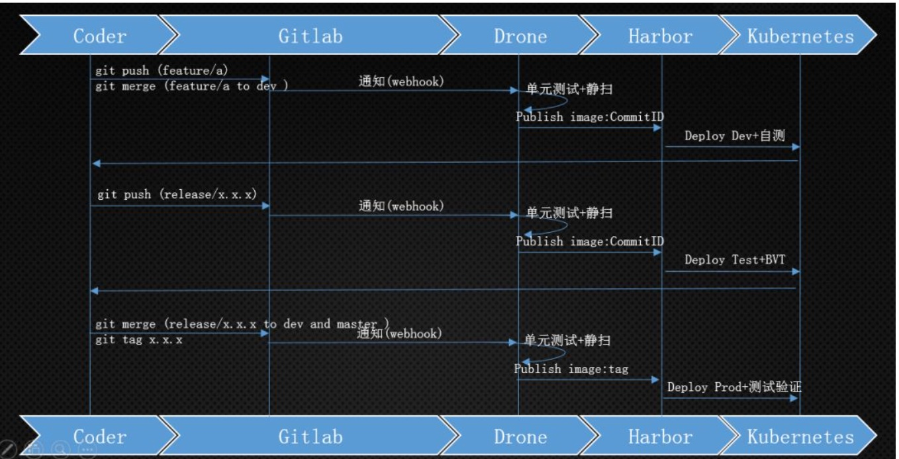

# [drone](https://github.com/drone/drone)

Drone is a Container-Native, Continuous Delivery Platform <https://drone.io>

## 规范发布

* 代码的下载构建及编译
* 静态扫描
* 运行单元测试，生成单元测试报告及覆盖率报告等
* 在测试环境对当前版本进行测试
* 为待发布的代码打上版本号
* 编写 ChangeLog 说明当前版本所涉及的修改
* 构建 Docker 镜像
* 将 Docker 镜像推送到镜像仓库
* 在预发布环境测试当前版本
* 正式发布到生产环境



## 插件

drone中提供了三个kube-helm插件，用来配合drone，实现k8s的cicd

* [rone-kube](http://plugins.drone.io/vallard/drone-kube/)
* [drone-kubernetes](http://plugins.drone.io/mactynow/drone-kubernetes/)
* [helm](http://plugins.drone.io/ipedrazas/drone-helm/)

### 流程

* 编写.drone.yaml,放置到项目根目录下
  - 主要就是引用各种pipeline插件，例如默认添加的git拉取代码的插件，项目编译环境的插件，此处针对不同语言，可以定制不同的镜像，例如之前的项目会把common这种基础库也做到docker镜像里，可以提高构建速度。以及telegram，line，mail等通知插件。
* 在drone里配置sonarqube秘钥对
* 提交代码到github或是gogs等版本控制工具里，触发webhook钩子，通知drone执行整个设计的构建流程，需要另外两个插件
  - docker镜像，用于将编译好的程序做成镜像，并推到自己的docker registry中。所以需要在根目录下，编写自己的DockerFile文件。
    + docker hub由于墙原因，一般是使用harbor，vmware中国团队基于docker registry做出来的私有镜像仓库。
    + 新的镜像推到harbor之后，helm插件就可以执行部署步骤了。
  - 另外一个是helm插件
  - helm可以选用k8s官方的公共仓库(<https://github.com/kubernetes/charts>)，一般都会搭建一个自己私仓，结合起来使用
* 最后一般都会引用通知插件，将构建结果通知部署人员。

```sh
# dev
git checkout -b feature/a dev
git push -u origin feature/a

## 自测没问题后，合并feature/a分支到dev
git checkout dev
git pull origin dev
git merge --no-ff feature/a
git push origin dev
git branch –d feature/a
git push origin –delete feature/a

#  新建release分支， webhook触发drone
git checkout -b release/0.0.1 dev
git push –u origin release/0.1.0

# 验证无问题，合并release/0.1.0 to master/dev,语义化版本自动生成CHANGLOG和版本提交到运维部署，即进行生产环境的部署
git checkout master
git merge --no-ff release-0.1.0
git push

git checkout dev
git merge --no-ff release-0.1.0
git push

git branch -d release-0.1.0
git push origin --delete release-0.1.0
```

## 选择

* Travis CI 和 CircleCI 是目前占有率最高的两个公有云 CI，易用性上相差无几，只是收费方式有差异。由于不支持私有部署，如果并行的任务量一大，按进程收费其实并不划算；而且由于服务器位置的原因，如果推送镜像到国内，速度很不理想。
* Gitlab CI 虽然好用，但和 Gitlab 是深度绑定的
* Jenkins 作为老牌劲旅，也是目前市场占有率最高的 CI，几乎可以覆盖所有 CI 的使用场景，由于使用 Java 编写，配置文件使用 Groovy 语法，非常适合 Java 为主语言的团队
* Drone 即开源，又可以私有化部署，同时作为云原生应用，官方提供了针对 Docker、Docker Swarm、K8s 等多种容器场景下的部署方案，针对不同容器场景还有特别优化，比如在 Docker Swarm 下 Drone 是以 agent 方式运行 CI 任务的，而在 K8s 下则通过创建 K8s Job 来实现，显然充分利用了容器的优势所在，这也是 Drone 优于其他 CI 应用之处。Drone 的语法是所有 CI 中最容易理解和掌握的，由于 Drone 每一个步骤都是运行一个 Docker 容器，本地模拟或调试也非常容易。
