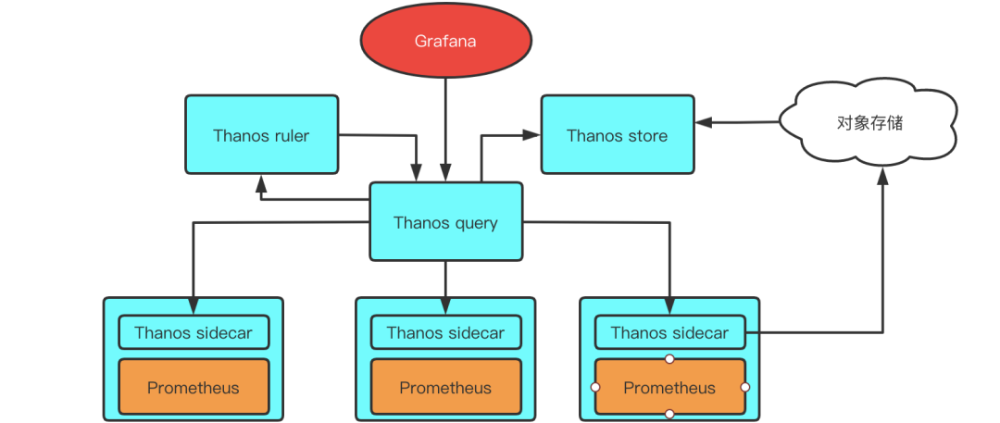

# [thanos](https://github.com/thanos-io/thanos)

Highly available Prometheus setup with long term storage capabilities. CNCF Sandbox project. <https://thanos.io/>

* 开源 Prometheus 高可用解决方案，其支持从多个Prometheus中查询数据并进行汇总和去重，并支持将Prometheus本地数据传送到云上对象存储进行长期存储
* 相比联邦优势
    - 由于数据不再存储在单个Prometheus中，所以整体能承载的数据规模比联邦大。
    - 数据不再有不必要的冗余。
    - 由于Thanos有去重能力，实际上可以每个集群中部署两个Prometheus来做数据多副本。
    - 可以将数据存储到对象存储中，相比存储在本地，能支持更长久的存储。

## 组件

* Query：Query代理Prometheus作为查询入口，它会去所有Prometheus，Store以及Ruler查询数据，汇总并去重。
* Sidecar：将数据上传到对象存储，也负责接收Thanos Query的查询请求。
* Ruler：进行数据的预聚合及告警。
* Store：负责从对象存储中查询数据。

## 大集群场景

* 特点:那就是数据规模大，无论是target的规模，还是数据量，都是一个Prometheus无法采集的，得分片
* hasmod:Prometheus支持在配置文件中加入hashmod，通过某个label的值来进行hash，让每个Prometheus只采集部分target，例如按target的地址进行hashmod，让target采集任务分散到3个Prometheus中。这样每个Prometheus就只会采集部分target，从而达到分片效果。由于每个分片的hashmod取值不一样，所以每个分片需要使用单独的配置文件
    - 配置管理复杂：由于每个分片都要有单独的配置文件，需要维护多份配置文件
    - 配置项有侵入：需要为每个Job考虑hashmod的方式，而且需要清楚所采集数据根据那个label来hash才可能平均，对使用者相当不友好。
    - 可能出现热点：hashmod是不保证负载一定均衡的，因为如果多个数据规模较大的target被hashmod到一个分片，这个分片就有可能OOM。
