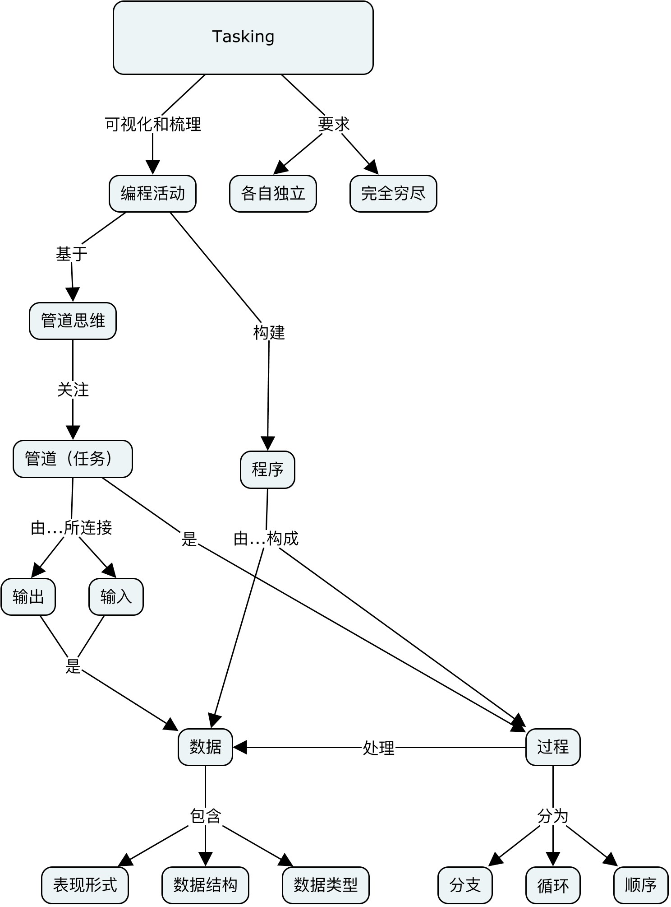
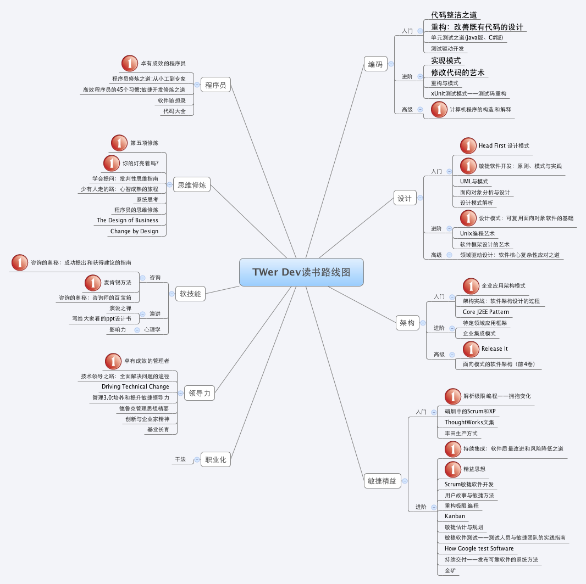
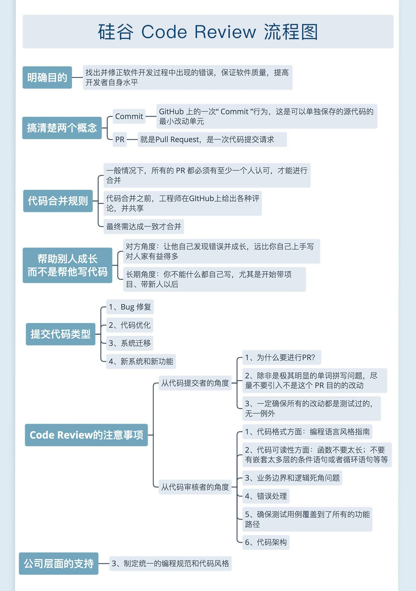

# Code

* 把大块需求拆解成小块任务
* 把小块的任务实现成代码
* 程序员的基本功:做得又好又快
* 核心:通过各种各样的算法去实现具体的业务逻辑，把繁杂的过程抽象化、可计算化。从纯粹软件的角度讲，甚至可以说：算法 + 数据 == 计算机程序
* 学习编程最大的悲剧:就是明明自己的目的是模仿逐步形成自己的技能，而误以为自己要去创造新事物。所以学习编程之前需要搞懂
  - 做创造性的工作；还是做模仿性的工作。模仿类型的工作时不需要从理论开始的，而是从练习开始的。一开始就模仿写代码
* 理论与实践：不去实际写代码有些问题是发现不了的,学了几年的游泳理论还是不会游泳的。实践中需要注意的东西，不动手是学习不到的
* 程序员工作本质其实是对事物或者问题进行抽象，只有抽象后才能进行深度思考，才能建模，建好模型后，才能用编程语言写成程序。一旦抽象久了，就很难了解事情的真相，不能一直处在一个虚拟的环境里，需要对事物进行还原，需要走到真实的环境中与人接触，到真实的场景中去讨论需求，去做软件定价，销售等，这些工作比我们想象中的要复杂

## 高质量代码

* 特点
  - 可读性高
  - 结构清晰
  - 可扩展（方便维护）
  - 代码风格统一
  - 低复杂性
  - 简练
* 遵循
  - 代码规范
    + 好处
      * 促进团队合作
      * 降低维护成本
      * 有助于代码审查
      * 养成代码规范习惯，有助于程序员自身的成长
      * 能够认识到规范的重要性，并坚持规范的开发习惯
    + 前端代码规范推荐
      * 百度前端代码规范
      * feross/standard · GitHub
      * Airbnb JavaScript Style Guide
  - 提前设计
    + 阅读文档，分析需求
    + 画原型图或草图（方便理解整体架构）
    + 写大纲或伪代码（如果项目比较大还要细分模块）
    + 实现细节
  - 重构：在不改变软件系统外部行为的前提下，改善它的内部结构
    + 可以使软件更容易地被修改和被理解。通过不断地改进软件设计以达到简单设计的目标，减少由于设计与业务的不匹配带来的架构与设计腐化
    + 重构能改善软件设计
    + 重构使软件更易理解
    + 重构有助于找到Bug
    + 重构有助于提高自我编程能力
    + 重构有助于加深理解代码
    + 重构能适应需求变更
  - 代码要求
    + 不要编写大段代码
    + 重复代码封装成函数
    + 在编写代码的过程中养成不断重构的习惯
    + 添加必要的注释
    + 留下可扩展的空间
  - 测试：目的都是为了找出尽可能多的BUG，保证产品的质量
    + 测试的过程本身就是一个自我 code review 的过程，在这个过程中，可以发现一些设计上的问题(比如代码设计的不可测试)，代码编写方面的问题(比如一些边界条件的处理不当)等，做到及时发现及时修正，不需要等到测试阶段甚至上线之后再发现再修改
  - 自我要求
    + 先从代码规范开始，熟悉代码规范，遵循规范写代码，直到成为习惯
* 三要素
  - 可读性强：
    + 不要编写大段代码
    + 将段落封装成一个又一个函数
    + 在编写代码的工程中养成不断重构的习惯
    + 函数设计遵循的原则：职责驱动设计
    + 从上往下的编写：每个被分出去的程序，可以暂时只写一个空程序而不去具体实现功能，当主程序完成以后，再一个个实它的所有子程序。
    + 当一个函数的代码行数达到15-20行，开始考虑是否需要重构代码。
    + 一个类不应当有太多的函数，函数过多要考虑分为多个类，一个包也不应该有太多的类
    + 释义名称：new/add , edit/mod , del , find/query
    + 释义名称：get开头的函数仅仅用于获取类属性
    + 注释：职责驱动设计，首先描述该类的职责
    + 注释：编写的是一个借口 or抽象类，在@author后添加@see，将该接口的抽象类的所有实现类列出来
  - 可维护性：适应软件在部署和使用中的各种情况
    + 代码不能写死（路径为相对路径 or 通过属性文件修改 ）
    + 预测可能发生的变化
    + 将某些条件设置为可配置的，需要必要的注释
  - 可变更性：因需求变化而对代码进行修改
    + 提高代码的可复用性
    + 对模型进行分析，用例模型，领域模型，分析模型，正向工程，逆向工程
    + 利用设计模式提高可变更性：经典的32个模式
      * if...else : （重构一下，保证不修改原有代码，仅仅增加新的代码就能应付选项的增加）:写成父类方法
      * 选项较多，并且增加选项的可能性很大的情况下可以使用工厂模式
      * 策略模式：解决继承出现的问题，减少类的继承，在类中增加某些方法的策略来代替继承，可以无限制的增加策略
      * 适配器模式：设计的系统要与其他系统/模块交互，可能调用接口或交换数据。我方的接口按照某个协议编写，保持固定不变，在于真正对方接口时，在前段设计一个适配器类，对方协议变更，可以更换适配器。（启发：类似于rank中的service层，传的参数也同样尽量不要限制，而是传递数组）（通过适配器接受数据or传输数据）
      * 模板模式：通常有一个抽象类，在抽象类中有一个主函数，按顺序调用其他函数（启发：类似于JdbController extends Controller），比较个性的步骤由其继承类完成。父类的主函数应当是final，其中的函数可以是可选步骤，称为【hood】，在编写时，抽象类中并不是抽象函数，而是一个空函数，继承类可以重载，也可以什么也不写，为空执行。
    + 职责驱动设计（RDD） & 领域驱动设计（DDD）
    + 根据职责分配行为和函数
    + 根据需求进行用例分析，根据用例绘制领域模型和分析模型
    + 《UML和模式应用》：RDD以职责为中心分配行为，软件对象与现实世界尽量保持一致（低表示差异）
    + 《领域驱动设计》：领域模型，需求分析阶段建立领域模型
* 代码质量评价：低耦合，高内聚（功能，元素除了职责任务，没有其他工作）
* 其他概念：
  - 高内聚低耦合
  - 领域模型
  - 工厂模式 based on 多态
  - 用例模型

## 方法

* 缓存
* 预处理和延后处理
* 池化
  - 内存池难点:
    + 如何快速分配内存
    + 降低内存碎片率
    + 维护内存池所需的额外空间尽量少
  - 线程池
    + 管理器（Manager）: 用于创建并管理线程池。
    + 工作线程（Worker）: 执行任务的线程。
    + 任务接口（Task）: 每个具体的任务必须实现任务接口，工作线程将调用该接口来完成具体的任务。
    + 任务队列（TaskQueue）: 存放还未执行的任务。
* 同步变异步
* 消息队列
* 批量处理

## 资深

* 没有书本会教解决以前没人碰到过的问题。成年人可以直接去学习编码，孩子们则需要发掘他们的好奇心
* 经验
  - 代码能够工作
  - 使代码清晰、可重用和整洁
  - 艺术家的敏感融入抽象逻辑中，相信代码的美感对编程来说，和所有的算法或编码模式一样重要。
  - 在过程中你教教他们如何把事情做好，你让他们知道这世界充满了有趣的事情等待他们去发现，向他们展示如何充满激情地在他们所做的每件事中寻找那种瞬间的质量感
* 由于开发程序变得容易了，一个人可以在知道很少的情况下完成小型程序。但这也意味着，这个人可能永远也不会写大程序。这个行业里面，只要学会5％的东西，可以完成简单的工作，就可以谋生了。
* 想做一个什么样的程序员，完全取决于你真正想做的事情。如果您想制作网站，那么你不需要计算机科学学位。甚至不需要学位。如果你想制作一些前所未有的令人兴奋的精彩内容，如果你想在行业中做出微小的改变并稍微改变世界，那么你确实需要那个学位。
* 或者换一种方式看待它：如果想建造狗屋，只需用锤子和钉子。如果想成为一名设计和建造摩天大楼的建筑师，那么首先要获得建筑学位。但请不要明明在建造狗屋，却称呼自己为建筑师

## 习惯

* 花10，000小时练习编码
* 不断构建项目（代码，代码，代码）
* 阅读有关技术和产品的书籍
* 在压力和截止日期前能够准确交付
* 透彻阅读其他人的代码
* 选择新语言（每年一种新语言规则）和技术（一旦发布就拿起新东西）
* 结对编程，与不同类型的人合作
* 编写高质量的代码，即具有国际标准的工程级代码
* 积极参与开源项目
* 想清楚，再动手写代码
* 不交流，就会头破血流：需求理解清楚
* 文档没人看，但还是要写：用来做记录
* 一定要写注释
* 别指望需求会稳定
* 业务高于技术
* 不要心存侥幸：你隐约感觉会出bug的地方，就一定会出bug。
* 自己先测几遍
* 尽可能自己解决问题
* 专注技术栈，莫多尔不精
* 打印日志
* 不断重构反思
* 依然觉得写代码很快乐
* 远离一会儿，有助于找出盲点
* 使用一个新语言，编写另外一个语言的解析器

## 建议

* 开发过程
  - 代码不仅仅是用来运行的。代码也是跨团队交流的一种方式，是向他人描述问题解决方案的一种方式。良好的代码可读性不是那么容易做到的，但它是编写代码最基础的部分之一。良好的代码可读性包括清晰地分解代码，选择恰当的自解释变量名，添加注释来描述所有隐含的内容。
  - 不要渴望你的 pull request 能为你赢得多少名声，而要多关注你的 pull request 能为你的用户和社区做些什么。要不惜一切代价避免“功利性的贡献”。如果你提交的功能对于这个产品想要达到的目的没有明显的帮助，就不要添加任何功能。
  - 品味也适用于代码。品味是一种受约束的满足过程，这种满足是由对简单的渴望所约束的。保持对简单性的偏爱。
  - 要学会说“不”——仅仅因为有人要求做某个特性，并不意味着你就应该这么做。每个特性都有一个超出初始实现的成本：维护成本、文档成本和用户的认知成本。我们要时刻提醒自己：我们真的应该这样做吗? 通常，答案是否定的。
  - 当你准备答应实现一个新的使用场景时，请记住，仅从字面意思理解实现用户的需求通常不是最佳选择。用户关注的仅仅是他们自己的特定使用场景，你必须从整个项目的角度出发，兼顾整体性和原则性。通常，正确的做法是在现有特性的基础上做扩展。
  - 不断进行持续集成，并以完整的单元测试覆盖为目标。确保你处在一个可以自信地编写代码的环境中；如果不是这样，那么你需要从构建正确的基础设施开始。
  - 可以不事先计划好一切。先试一下，看看结果如何。尽早对错误的选择进行回退。当然，前提是确保你的开发环境可以做到这一点。
  - 好的软件使困难的事情变得简单。问题一开始看起来很困难，并不意味着解决方案必须很复杂或者很难操作。在很多情况下，工程师给出的解决方案都是未经思考的，这就可能在有更简单的解决方案（虽然可能不那么明显）的情况下，带来不必要的复杂性（我们可以使用 ML！我们可以尝试构建一个应用程序！我们可以使用区块链！）。在编写任何代码之前，请确保你所选择的解决方案已经简单到不能再简单。做任何事情都要有本源思维。
  - 避免隐式规则。应该明确说明你自己开发的隐式规则，并与他人共享。当你发现自己提出了一个重复的、准算法的工作流时，你应该设法将它标准化到一个文档中，以便其他团队成员能够从此经验中获益。此外，你应该在软件中尝试自动化任何可以自动化的工作流 (例如，正确性检查)。
  - 在设计过程中应该考虑你选择方案的总体影响，而不仅仅是你希望关注的那些方面——比如收入或增长。除了你正在监控的那些指标之外，你的软件对其用户、对整个世界还会带来哪些影响? 是否存在超过价值主张的不良副作用? 在保持软件可用性的同时，你能做些什么来解决这些问题呢?
  - **设计伦理，把你的价值观融入你的作品中**
* API 设计
  - API 是有用户的，因此它事关用户体验。在你做的每一个决定中，都要考虑到用户。要站在用户的角度思考问题，无论他们是初学者还是有经验的开发人员。
  - 总是想着让你的用户在使用 API 的过程中尽量减少认知负荷。自动化可以自动化的东西，最小化用户需要做的操作和选择，不显示不重要的选项，设计简单一致的工作流，反映简单一致的思维模型。
  - 简单的事情要简单处理，复杂的事情应该尽量简单化。不要为了少量特殊的使用场景而增加普通使用场景的认知负荷，即使是最低限度的
  - 如果工作流的认知负荷足够低，那么用户在使用一到两次之后，应该可以凭记忆完成工作了 (无需查找教程或文档)。
  - 寻求与领域专家和实践者的心智模型相匹配的 API。有领域经验但没有 API 经验的人应该能够使用最少的文档直观地理解你的 API，主要是通过查看一些代码示例，看看哪些对象可用，以及它们的特征是什么。
  - 一个参数的含义应该是容易理解的，而不需要任何关于底层实现的上下文。必须由用户指定的参数应该与用户关于问题的心理模型相关，而不是与代码中的实现细节相关。API 只与它所要解决的问题有关，与软件在后台如何工作无关。
  - 最强大的心智模型是模块化和层次化的：在高层次上很简单，但在细节上很精确。同样地，一个好的 API 也应该是模块化和层次化的：易于使用，但具有表现力。在更少的对象上有复杂的特性和具有更简单特性的对象之间有一个平衡。一个好的 API 要有合理数量的对象，并具有相当简单的特性
  - 你的 API 不可避免地反映了你选择的实现方式，特别是你选择的数据结构。要实现直观的API，你必须选择自然适合其领域的数据结构——与领域专家的心智模型相匹配。
  - 有意识地设计端到端工作流，而不是一组原子特性。大多数开发人员在设计 API 时都会问：我们应该提供哪些功能?让我们为这些功能提供配置选项吧。恰恰相反，开发人员应该这样问：这个工具有哪些使用场景?对于每个使用场景，用户操作的最佳顺序是什么? 支持这个工作流的最简单的API是什么?你的API中的原子选项应该能够满足在高级工作流中出现的明显需求——不要“因为有人可能需要它”而添加某个功能。
  - 错误消息，以及在与 API 交互过程中向用户提供的任何反馈，都是API的一部分。交互性和反馈是用户体验的一部分。需要谨慎的设计 API 的错误消息。
  - 因为代码是一种交流方式，所以命名很重要——无论是命名项目还是变量。名字反映了你对问题的看法。避免使用过于通用的名称（ x, variable, parameter），避免使用过于冗长和特定的命名模式，避免使用可能造成不必要误解的术语 (主、从)，并确保你的命名选择方式是一致的。命名一致性意味着内部命名一致性 (不要在其他地方将“dim”称为“axis”) 和与问题域的既定约定的一致性。在确定名称之前，请确保查找领域专家 (或其他 API) 使用的现有名称。
  - 文档是影响 API 用户体验的关键。它不是一个附加产品。着力产出高质量的文档，你将看到比开发更多功能带来的更高回报。
  - Show, don 't tell：你的文档不应该讨论软件是如何工作的，它应该展示如何使用这个软件。显示端到端工作流的代码示例；为 API 的每个常见使用场景和关键特性展示代码示例。
  - **生产力可以归结为快速决策和偏好行动**
* 软件职业生涯
  - 事业的进步不在于管理了多少人，而在于你产生了多大的影响：一个有你的工作的世界和一个没有你的工作的世界之间的差别。
  - 软件开发是团队合作 ; 它不仅关乎技术能力，也关乎人际关系。做一个好队友。当你开始做事情的时候，要和别人保持沟通。
  - 技术从来都不是中立的。如果你的工作可能对世界产生任何影响，那么这种影响是有道德导向的。我们在软件产品中做出的看似无害的技术选择有可能会影响获得技术的条件、使用动机、谁将受益、谁将受害。技术选择也是伦理选择。因此，对于你希望自己的选择支持的价值，一定要慎重和明确。基于道德准则来做设计，把你的价值观融入你的作品中。永远不要想，我只是在开发一种能力，这个能力本身是中性的。并不是因为你的开发方式决定了它将如何被使用。
  - 自我指导——掌控你的工作和环境——是获得生活满足感的关键。确保你给你周围的人足够的自我导向，确保你的职业选择为你自己带来更大的回报
  - 创造世界所需要的，而不仅仅是你希望拥有的。技术人员往往过着精细化的生活，专注于满足自己特定需求的产品。寻找机会拓宽你的生活经验，这将使你更好地看到世界需要什么
  - 当做出任何具有长期影响的选择时，将你的价值观置于短期的自我利益和短暂的情绪之上——比如贪婪或恐惧。知道你的价值观是什么，让它们来引导你。
  - 当我们发现自己陷入矛盾中时，应该停下来寻找我们共同的价值观和共同的目标，并提醒自己，我们几乎肯定站在同一条战线上。
  - 生产力可以归结为快速决策和偏好行动。这需要 a) 来自经验的良好直觉，以便在给出部分信息的情况下做出普遍正确的决定 ; b)对何时要小心地前进或等待更多信息要有敏锐的意识，因为一个错误的决定的代价将大于等待的代价。在不同的环境中，最佳速度 / 质量决策权衡可能会有很大的差异
  - 快速做决定意味着在你的职业生涯中你能做出更多的决定，这会让你对哪一个备选项才是正确的选择产生更强的直觉。经验是生产力的关键，更高的生产力将为你提供更多的经验：这是一个良性循环。
  - 在你意识到自己缺乏直觉的情况下，坚持抽象原则。在你的职业生涯中建立一个可靠的原则清单。原则是形式化的直觉，比原始模式识别适用于更广泛的情况 (这需要对类似情况有直接且广泛的经验)
* 本质上做技术的都是手艺人，但代码不会传承，代码只会更新—程序员都是不吃老本的手艺人
* 工作越久越发现，靠谱和情商慢慢比技术能力还要重要一些
* 程序员的收入相对可观，但把「月薪」变成「时薪」，你会发现所谓赚得多其实是个笑话。这行吃的是青春饭，30岁后的一段日子里，从业者就能感受到了前所未有的压力
* 于是开始强迫自己研究投资理财—我发现我们在理财方面是有优势的！比如流水不低，花钱又不多，结余率很高，每个月都有比较可观的钱可以拿去理财
* 对新事物的接受程度高，更容易抓住新物种的早期红利；「执行力」比普通人强，而执行力在投资中太重要了
* 最好的理财方式，是构建一个「赚钱系统」。搭建好框架后，我们只需花少量的时间做后期维护。这个系统会源源不断地赚取「睡后收入」

## GOOD

* The only “best practice” you should be using all the time is “Use Your Brain”.
* Programmers who don’t code in their spare time for fun will never become as good as those that do.
* Most comments in code are in fact a pernicious form of code duplication.
* XML is highly overrated
* Not all programmers are created equal
* ”Googling it” is okay!
* If you only know one language, no matter how well you know it, you’re not a great programmer.
* Your job is to put yourself out of work.
* Design patterns are hurting good design more than they’re helping it.
* Unit Testing won’t help you write good code
* 过早的优化是万恶之源。Premature optimization is the root of all evil! – Donald Knuth
* 在水里行走和以一个需求规格进行软件开发，有一点是相同的，那就是如果水或需求都被冻住不了，那么行走和软件开发都会变得容易。Walking on water and developing software from a specification are easy if both are frozen – Edward V Berard
* Hofstadter 定理：“一件事情总是会花费比你预期更多的时间，就算是你已经考虑过本条Hofstadter 定理”。It always takes longer than you expect, even when you take into account Hofstadter’s Law. – Hofstadter’s Law
* 有些遇到问题的人总是会说“我知道，我会使用正则表达式”，那么，你现在有两个问题了。（意思是：你本想用正则表达式来解决你已有问题，但实际上你又引入了“正则表达式”的一个新问题）Some people, when confronted with a problem, think “I know, I’ll use regular expressions.” Now they have two problems – Jamie Zawinski
* 调试程序的难度是写代码的两倍。因此，只要你的代码写的尽可能的清楚，那么你在调试代码时就不需要那么地有技巧。Debugging is twice as hard as writing the code in the first place. Therefore, if you write the code as cleverly as possible, you are, by definition, not smart enough to debug it. – Brian Kernighan
* 用代码行来衡量开发进度，无异于用重量来衡量制造飞机的进度。Measuring programming progress by lines of code is like measuring aircraft building progress by weight.  – Bill Gates
* PHP被一些不合格的业余人员造就成了一个小恶魔；而Perl则是被一些熟练的但不正当的专业人员造就成了一个超级大恶魔。PHP is a minor evil perpetrated and created by incompetent amateurs, whereas Perl is a great and insidious evil, perpetrated by skilled but perverted professionals.  – Jon Ribbens
* 在两个场合我被问到：“请你告诉我，如果你给机器输入了错误的数字，那么，是否还能得到正确的答案？”我并不能正确领会这类想法。（注意，本引言的作者姓Babbage，这个名字和神父同名，意思是，作者在反问提问的人，你是问我还是向神父祈祷？）On two occasions I have been asked, ‘Pray, Mr. Babbage, if you put into the machine wrong figures, will the right answers come out?’ I am not able rightly to apprehend the kind of confusion of ideas that could provoke such a question.”  – Charles Babbage
* 在编程的时候，我们一定要想像一下，以后维护我们自己的代码的那个人会成为一个有暴力倾向的疯子，并且，他还知道我们住在哪里？Always code as if the guy who ends up maintaining your code will be a violent psychopath who knows where you live. – Rick Osborne
* 现代的编程是“程序员努力建一个更大更傻的程序”和“世界正在尝试创造更多更傻的人”之间的一种竞赛，目前为止，后者是赢家。Programming today is a race between software engineers striving to build bigger and better idiot-proof programs, and the Universe trying to produce bigger and better idiots. So far, the Universe is winning. – Rich Cook
* 我才不关于我的代码是否能在你的机器上工作！我们不会给你提供机器。I don’t care if it works on your machine! We are not shipping your machine! – Ovidiu Platon
* 我总是希望我的电脑能够像电话一样容易使用；我的这个希望正在变成现实，因为我现在已经不知道怎么去使用我的电话了。I have always wished for my computer to be as easy to use as my telephone; my wish has come true because I can no longer figure out how to use my telephone. – Bjarne Stroustrup
* 计算机是一种在人类历史上所有发明中，可以让你比以前更快地犯更多的错误的发明，同样，其也包括了“手枪”和“龙舌兰酒”这两种发明的缺陷。A computer lets you make more mistakes faster than any other invention in human history, with the possible exceptions of handguns and tequila. – Mitch Ratcliffe
* 如果调试程序是一种标准的可以铲除BUG的流程，那么，编程就是把他们放进来的流程。If debugging is the process of removing software bugs, then programming must be the process of putting them in. – E. W. Dijkstra
* 教一群被BASIC先入为主的学生，什么是好的编程风格简直是一件不可能的事。对于一些有潜力的程序员，他们所受到的智力上的伤害远远超过了重建他们的信心。It is practically impossible to teach good programming style to students that have had prior exposure to BASIC. As potential programmers, they are mentally mutilated beyond hope of regeneration. – E. W. Dijkstra
* 理论上来说，理论和实际是一样的。但实际上来说，他们则不是。In theory, theory and practice are the same. In practice, they’re not. – Unknown
* 只有两个事情是无穷尽的：宇宙和人类的愚蠢。当然，我现在还不能确定宇宙是无穷尽的。Two things are infinite: the universe and human stupidity; and I’m not sure about the universe. – Albert Einstein
* Perl这种语言就好像是被RSA加密算法加密过的一样。Perl – The only language that looks the same before and after RSA encryption. – Keith Bostic
* 我爱“最终期限”，我喜欢“嗖嗖嗖”的声音就像他们在飞一样。I love deadlines. I like the whooshing sound they make as they fly by. – Douglas Adams
* 说Java好的是因为它跨平台就像好像说肛交好是因为其可以适用于一切性别。Saying that Java is good because it works on all platforms is like saying anal sex is good because it works on all genders – Unknown
* XML就像是一种强暴——如果它不能解决你的问题，那只能说明你没有用好它。XML is like violence – if it doesn’t solve your problems, you are not using enough of it. – Unknown
* 爱因期坦说，自然界中的一切一定会有一个简单的解释，因为上帝并不是反复无常和独裁的。当然，不会有什么信仰能程序员像爱因期坦那样感到舒服。Einstein argued that there must be simplified explanations of nature, because God is not capricious or arbitrary. No such faith comforts the software engineer. – Fred Brooks
* 函数不要超过50行。
* 不要一次性写太多来不及测的代码，而是要写一段调试一段
* UT和编码要同步做
* 多写注释方便的往往是自己
* 碰到一堆问题时，一次只尝试解决一个问题
* 没把握一眼看出问题症结的时候，老老实实单步调试
* 设计模式是个好东西，但不要强行使用
* 没造成可观的损失前不要尝试做性能优化
* 没事别重复造轮子
* 大多数情况下Boss不关心技术含量，而且往往简单的解决方案更快更有效果
* 不要害怕接触新知识，因为害怕也没用，不管你愿意不愿意，你现在会的东西5年后就会过时
* 重构是程序员的主力技能
* 工作日志能提升脑容量
* 先用profiler调查，才有脸谈优化
* 漫山遍野的注释实际背景噪音
* 普通程序员+google=超级程序员
* 写单元测试总是合算的
* 不要先写框架再写实现。最好反过来，从原型中提炼框架
* 代码结构清晰，其它问题都不算事儿
* 管理行不行，就看工作流
* 编码不要畏惧变化，要拥抱变化
* 常充电。程序员只有一种死法：土死的。

## BAD

* 情绪化的思维
* 怀疑别人
* 过多关注实现，陷入问题细节
* 使用并不熟悉的代码
* 拼命工作而不是聪明的工作
* 总是在等待、找借口以及抱怨
* 滋生办公室政治
* 说得多做得少
* 顽固
* 写“聪明”的代码
* 面向对象编程因为其具有丰富的特性（封装、抽象、继承、多态），可以实现很多复杂的设计思路，是很多设计原则、设计模式等编码实现的基础
* 设计原则是指导我们代码设计的一些经验总结，对于某些场景下，是否应该应用某种设计模式，具有指导意义。比如，“开闭原则”是很多设计模式（策略、模板等）的指导原则
* 设计模式是针对软件开发中经常遇到的一些设计问题，总结出来的一套解决方案或者设计思路。应用设计模式的主要目的是提高代码的可扩展性。从抽象程度上来讲，设计原则比设计模式更抽象。设计模式更加具体、更加可执行
* 编程规范主要解决的是代码的可读性问题。编码规范相对于设计原则、设计模式，更加具体、更加偏重代码细节、更加能落地。持续的小重构依赖的理论基础主要就是编程规范
* 重构作为保持代码质量不下降的有效手段，利用的就是面向对象、设计原则、设计模式、编码规范这些理论

## 编程范式

* 面向对象编程 Object Oriented Programming OOP
* 过程式编程 procedural programming

## 任务分解

* 将复杂问题拆解为可验证的、相互独立的、简单任务；当所有简单任务都完成时，复杂问题也就解决了
  - 复杂问题：不能清楚的在脑海里浮现出每行代码该怎么写的问题
  - 简单任务：清楚的知道每行代码该怎么写，naming
    + **输入输出**对于小任务而言很重要
    + 确定每个小任务的输入与输出，描述需要包含两个东西：
      * 类型
      * 业务含义：通过变量名
  - 可验证：当给定输入的时候，明确的知道输出是什么
  - 相互独立：当明确知道该小任务输入输出是什么的时候，小任务就可以被完成
    + 特点：乱序，即可以先完成”找出最大值“，再完成”判断是否大于十“，最后完成”找出所有偶数“。每个任务之间相互不影响
  - 完成：当所有简单任务完成后，可以满足复杂问题的所有需求，即在拆分任务的时候不能遗漏功能
* 步骤
  - 理解需求:确认问题域
  - 拆分 **划分上下文**
  - 实现
  - 验证
  - 优化

## 知识结构

要了解技术就一定需要了解整个计算机的技术历史发展和进化路线。因为，你要朝着球运动的轨迹去，而不是朝着球的位置去，要知道球的运动轨迹，你就需要知道它历史上是怎么跑的。

* 横向的知识架构
* 纵向深化
* 源码的分析
* 知识不断进行生态进化

## 流程

* 需求：文档
* 产品设计：设计原型
* 架构：
* 实现
* 反馈实现

## 实现

* 网站web 手机应用app
* 支付系统、图像集群、广告平台

## 后端

* SOA，微服务架构
* Go 的微服务架构
* 对缓存，消息队列，微服务，websocket等都有深刻的认识和应用经验
* 有分布式处理，SAAS服务有一定的工作经验优

## 数据库

* MySQL数据库、事务及SQL优化
* Redis及常用队列中间件

## 数据

* 数据结构和算法
* Spark，Hadoop，Hive和 MapReduce
* R
* 精通数据仓库建模技术，能够处理数据瑕疵，交互式及可视化数据；
* 擅长高效设计和ETL workflows；
* 熟悉机器学习如自然语言处理或预测建模。
* 数据驱动 数据设计与构建

## 测试

## 构建工具

## 持续交付

## 敏捷开发

## 软技能

* 面向对象的设计和编程理念
* Git，代码版本开发、构建与发布的管理
* UX (User Experience)
* 架构设计能力和良好代码规范
* 高性能大容量系统架构设计和推进实施经验
* 能有效协调各方资源
* 工具集的使用与配置

## 意识

* 概念的理解与场景的确定

## 方向

* 深度与复杂性：算法
* 结构性：设计模式

### 系统设计

能够完成小型系统的基本设计，包括简单的数据库设计，能够完成基本的浏览器 -< Nginx+PHP -< 数据库 架构的设计开发工作；
能够支撑每天几十万到数百万流量网站的开发维护工作；

## 第二阶段：提高阶段

重点：提高针对LNMP的技能，能够更全面的对LNMP有熟练的应用。
目标：能够随时随地搭建好LNMP环境，快速完成常规配置；能够追查解决大部分遇到的开发和线上环境的问题；能够独立承担中型系统的构架和开发工作；能够在大型系统中承担某个中型模块的开发工作；

### Linux

在第一阶段的基础上面，能够流畅的使用Shell脚本来完成很多自动化的工作；
awk/sed/perl 也操作的不错，能够完成很多文本处理和数据统计等工作；
基本能够安装大部分非特殊的Linux程序（包括各种库、包、第三方依赖等等，比如MongoDB/Redis/Sphinx/Luncene/SVN之类的）；
了解基本的Linux服务，知道如何查看Linux的性能指标数据，知道基本的Linux下面的问题跟踪等。

### Nginx

在第一阶段的基础上面，了解复杂一些的Nginx配置；
包括 多核配置、events、proxy_pass，sendfile/tcp_*配置，知道超时等相关配置和性能影响；
知道nginx除了web server，还能够承担代理服务器、反向静态服务器等配置；
知道基本的nginx配置调优；
知道如何配置权限、编译一个nginx扩展到nginx；
知道基本的nginx运行原理（master/worker机制，epoll），知道为什么nginx性能比apache性能好等知识；

### MySQL/MongoDB

在第一阶段的基础上面，在MySQL开发方面，掌握很多小技巧，包括常规SQL优化（group by/order by/rand优化等）；
除了能够搭建MySQL，还能够冷热备份MySQL数据，还知道影响innodb/myisam性能的配置选项（比如key_buffer/query_cache/sort_buffer/innodb_buffer_pool_size/innodb_flush_log_at_trx_commit等），也知道这些选项配置成为多少值合适；
另外也了解一些特殊的配置选项，比如 知道如何搭建mysql主从同步的环境，知道各个binlog_format的区别；
知道MySQL的性能追查，包括slow_log/explain等，还能够知道基本的索引建立处理等知识；
原理方面了解基本的MySQL的架构（Server+存储引擎），知道基本的InnoDB/MyISAM索引存储结构和不同（聚簇索引，B树）；
知道基本的InnoDB事务处理机制；
了解大部分MySQL异常情况的处理方案（或者知道哪儿找到处理方案）；
条件允许的情况，建议了解一下NoSQL的代表MongoDB数据库，顺便对比跟MySQL的差别，同时能够在合适的应用场景安全谨慎的使用MongoDB，知道基本的PHP与MongoDB的结合开发。

### Redis/Memcached

在大部分中型系统里面一定会涉及到缓存处理，所以一定要了解基本的缓存；
知道Memcached和Redis的异同和应用场景，能够独立安装 Redis/Memcached，了解Memcahed的一些基本特性和限制，比如最大的value值，知道PHP跟他们的使用结合；
Redis了解基本工作原理和使用，了解常规的数据类型，知道什么场景应用什么类型，了解Redis的事务等等;
原理部分，能够大概了解Memcached的内存结构（slab机制），redis就了解常用数据类型底层实现存储结构（SDS/链表/SkipList/HashTable）等等，顺便了解一下Redis的事务、RDB、AOF等机制更好

### PHP

除了第一阶段的能力，安装配置方面能够随意安装PHP和各种第三方扩展的编译安装配置；
了解php-fpm的大部分配置选项和含义（如max_requests/max_children/request_terminate_timeout之类的影响性能的配置），知道mod_php/fastcgi的区别；
在PHP方面已经能够熟练各种基础技术，还包括各种深入些的PHP，包括对PHP面向对象的深入理解/SPL/语法层面的特殊特性比如反射之类的；
在框架方面已经阅读过最少一个以上常规PHP MVC框架的代码了，知道基本PHP框架内部实现机制和设计思想；在PHP开发中已经能够熟练使用常规的设计模式来应用开发（抽象工厂/单例/观察者/命令链/策略/适配器 等模式）；
建议开发自己的PHP MVC框架来充分让开发自由化，让自己深入理解MVC模式，也让自己能够在业务项目开发里快速升级；
熟悉PHP的各种代码优化方法，熟悉大部分PHP安全方面问题的解决处理；熟悉基本的PHP执行的机制原理（Zend引擎/扩展基本工作机制）；

### C/C++

开始涉猎一定的C/C++语言，能够写基本的C/C++代码，对基本的C/C++语法熟悉（指针、数组操作、字符串、常规标准API）和数据结构（链表、树、哈希、队列）有一定的熟悉下；
对Linux下面的C语言开发有基本的了解概念，会简单的makefile文件编写，能够使用简单的GCC/GDB的程序编译简单调试工作；
对基本的网络编程有大概了解。（本项是为了向更高层次打下基础）

### 前端

在第一阶段的基础上面，熟悉基本的HTTP协议（协议代码200/300/400/500，基本的HTTP交互头）；
条件允许，可以在深入写出稍微优雅的HTML+CSS+JavaScript，或者能够大致简单使用某些前端框架（jQuery/YUI/ExtJS/RequireJS/BootStrap之类）；
如果条件允许，可以深入学习JavaScript编程，比如闭包机制、DOM处理；再深入些可以读读jQuery源码做深入学习。（本项不做重点学习，除非对前端有兴趣）

### 系统设计

能够设计大部分中型系统的网站架构、数据库、基本PHP框架选型；性能测试排查处理等；
能够完成类似：浏览器 -< CDN(Squid) -< Nginx+PHP -< 缓存 -< 数据库 结构网站的基本设计开发维护；
能够支撑每天数百万到千万流量基本网站的开发维护工作；

## 第三阶段：高级阶段 （高级PHP程序员）

重点：除了基本的LNMP程序，还能够在某个方向或领域有深入学习。（纵深维度发展）

目标：除了能够完成基本的PHP业务开发，还能够解决大部分深入复杂的技术问题，并且可以独立设计完成中大型的系统设计和开发工作；自己能够独立hold深入某个技术方向，在这块比较专业。（比如在MySQL、Nginx、PHP、Redis等等任一方向深入研究）

### Linux

除了第二阶段的能力，在Linux下面除了常规的操作和性能监控跟踪，还能够使用很多高级复杂的命令完成工作（watch/tcpdump/starce/ldd/ar等)；
在shell脚本方面，已经能够编写比较复杂的shell脚本（超过500行）来协助完成很多包括备份、自动化处理、监控等工作的shell；
对awk/sed/perl 等应用已经如火纯青，能够随意操作控制处理文本统计分析各种复杂格式的数据；
对Linux内部机制有一些了解，对内核模块加载，启动错误处理等等有个基本的处理；
同时对一些其他相关的东西也了解，比如NFS、磁盘管理等等；

## Nginx

在第二阶段的基础上面，已经能够把Nginx操作的很熟练，能够对Nginx进行更深入的运维工作，比如监控、性能优化，复杂问题处理等等；
看个人兴趣，更多方面可以考虑侧重在关于Nginx工作原理部分的深入学习，主要表现在阅读源码开始，比如具体的master/worker工作机制，Nginx内部的事件处理，内存管理等等；
同时可以学习Nginx扩展的开发，可以定制一些自己私有的扩展；
同时可以对Nginx+Lua有一定程度的了解，看看是否可以结合应用出更好模式；
这个阶段的要求是对Nginx原理的深入理解，可以考虑成为Nginx方向的深入专业者。

### MySQL/MongoDB

在第二阶段的基础上面，在MySQL应用方面，除了之前的基本SQL优化，还能够在完成一些复杂操作，比如大批量数据的导入导出，线上大批量数据的更改表结构或者增删索引字段等等高危操作；
除了安装配置，已经能够处理更多复杂的MySQL的问题，比如各种问题的追查，主从同步延迟问题的解决、跨机房同步数据方案、MySQL高可用架构等都有涉及了解；
对MySQL应用层面，对MySQL的核心关键技术比较熟悉，比如事务机制（隔离级别、锁等）、对触发器、分区等技术有一定了解和应用；
对MySQL性能方面，有包括磁盘优化（SAS迁移到SSD）、服务器优化（内存、服务器本身配置）、除了二阶段的其他核心性能优化选项（innodb_log_buffer_size/back_log/table_open_cache/thread_cache_size/innodb_lock_wait_timeout等）、连接池软件选择应用，对show *（show status/show profile）类的操作语句有深入了解，能够完成大部分的性能问题追查；
MySQL备份技术的深入熟悉，包括灾备还原、对Binlog的深入理解，冷热备份，多IDC备份等；在MySQL原理方面，有更多了解，比如对MySQL的工作机制开始阅读部分源码，比如对主从同步（复制）技术的源码学习，或者对某个存储引擎（MyISAM/Innodb/TokuDB）等等的源码学习理解，如果条件允许，可以参考CSV引擎开发自己简单的存储引擎来保存一些数据，增强对MySQL的理解；
在这个过程，如果自己有兴趣，也可以考虑往DBA方向发展。MongoDB层面，可以考虑比如说在写少读多的情况开始在线上应用MongoDB，或者是做一些线上的数据分析处理的操作，具体场景可以按照工作来，不过核心是要更好的深入理解RMDBS和NoSQL的不同场景下面的应用，如果条件或者兴趣允许，可以开始深入学习一下MongoDB的工作机制。

### Redis/Memcached

在第二阶段的基础上面，能够更深入的应用和学习。因为Memcached不是特别复杂，建议可以把源码进行阅读，特别是内存管理部分，方便深入理解；Redis部分，可以多做一些复杂的数据结构的应用（zset来做排行榜排序操作/事务处理用来保证原子性在秒杀类场景应用之类的使用操作）；
多涉及aof等同步机制的学习应用，设计一个高可用的Redis应用架构和集群；
建议可以深入的学习一下Redis的源码，把在第二阶段积累的知识都可以应用上，特别可以阅读一下包括核心事件管理、内存管理、内部核心数据结构等充分学习了解一下。如果兴趣允许，可以成为一个Redis方面非常专业的使用者。

### PHP

作为基础核心技能，在第二阶段的基础上面，需要有更深入的学习和应用

从基本代码应用上面来说，能够解决在PHP开发中遇到95%的问题，了解大部分PHP的技巧；
对大部分的PHP框架能够迅速在一天内上手使用，并且了解各个主流PHP框架的优缺点，能够迅速方便项目开发中做技术选型；
在配置方面，除了常规第二阶段会的知识，会了解一些比较偏门的配置选项（php auto_prepend_file/auto_append_file），包括扩展中的一些复杂高级配置和原理（比如memcached扩展配置中的memcache.hash_strategy、apc扩展配置中的apc.mmap_file_mask/apc.slam_defense/apc.file_update_protection之类的）；
对php的工作机制比较了解，包括php-fpm工作机制（比如php-fpm在不同配置机器下面开启进程数量计算以及原理），对zend引擎有基本熟悉（vm/gc/stream处理），阅读过基本的PHP内核源码（或者阅读过相关文章），对PHP内部机制的大部分核心数据结构（基础类型/Array/Object）实现有了解，对于核心基础结构（zval/hashtable/gc）有深入学习了解；
能够进行基本的PHP扩展开发，了解一些扩展开发的中高级知识（minit/rinit等），熟悉php跟apache/nginx不同的通信交互方式细节（mod_php/fastcgi）；
除了开发PHP扩展，可以考虑学习开发Zend扩展，从更底层去了解PHP。

### C/C++

在第二阶段基础上面，能够在C/C++语言方面有更深入的学习了解，能够完成中小型C/C++系统的开发工作；
除了基本第二阶段的基础C/C++语法和数据结构，也能够学习一些特殊数据结构（b-tree/rb-tree/skiplist/lsm-tree/trie-tree等）方便在特殊工作中需求；
在系统编程方面，熟悉多进程、多线程编程；多进程情况下面了解大部分多进程之间的通信方式，能够灵活选择通信方式（共享内存/信号量/管道等）；
多线程编程能够良好的解决锁冲突问题，并且能够进行多线程程序的开发调试工作；同时对网络编程比较熟悉，了解多进程模型/多线程模型/异步网络IO模型的差别和选型，熟悉不同异步网络IO模型的原理和差异（select/poll/epoll/iocp等），并且熟悉常见的异步框架（ACE/ICE/libev/libevent/libuv/Boost.ASIO等）和使用，如果闲暇也可以看看一些国产自己开发的库（比如muduo）；
同时能够设计好的高并发程序架构（leader-follow/master-worker等）；
了解大部分C/C++后端Server开发中的问题（内存管理、日志打印、高并发、前后端通信协议、服务监控），知道各个后端服务RPC通信问题（struct/http/thirft/protobuf等）；
能够更熟络的使用GCC和GDB来开发编译调试程序，在线上程序core掉后能够迅速追查跟踪解决问题；
通用模块开发方面，可以积累或者开发一些通用的工具或库（比如异步网络框架、日志库、内存池、线程池等），不过开发后是否应用要谨慎，省的埋坑去追bug；

### 前端

深入了解HTTP协议（包括各个细致协议特殊协议代码和背后原因，比如302静态文件缓存了，502是nginx后面php挂了之类的）；
除了之前的前端方面的各种框架应用整合能力，前端方面的学习如果有兴趣可以更深入，表现形式是，可以自己开发一些类似jQuery的前端框架，或者开发一个富文本编辑器之类的比较琐碎考验JavaScript功力；

### 其他领域语言学习

在基础的PHP/C/C++语言方面有基本积累，建议在当前阶段可以尝试学习不同的编程语言，看个人兴趣爱好，脚本类语言可以学学 Python/Ruby 之类的，函数式编程语言可以试试 Lisp/Haskell/Scala/Erlang 之类的，静态语言可以试试 Java/Golang，数据统计分析可以了解了解R语言，如果想换个视角做后端业务，可以试试 Node.js还有前面提到的跟Nginx结合的Nginx_Lua等。学习不同的语言主要是提升自己的视野和解决问题手段的差异，比如会了解除了进程/线程，还有轻量级协程；
比如在跨机器通信场景下面，Erlang的解决方案简单的惊人；比如在不想选择C/C++的情况下，还有类似高效的Erlang/Golang可用等等；
主要是提升视野。

### 系统设计

* 能够应用掌握的经验技能，设计出比较复杂的中大型系统，能够解决大部分线上的各种复杂系统的问题，完成类似 浏览器 -< CDN -< 负载均衡 -<接入层 -< Nginx+PHP -< 业务缓存 -< 数据库 -< 各路复杂后端RPC交互（存储后端、逻辑后端、反作弊后端、外部服务） -< 更多后端 酱紫的复杂业务
* 能够支撑每天数千万到数亿流量网站的正常开发维护工作。

## Tasking

* 能像机器一样思考的人就适合做程序员.所有的计算机都是“冯・诺伊曼体系” 模型.所有的问题都从输入和输出的角度去思考，这就是计算机这台机器的思考方式
* 语义分析的方法论
* 输入，输出是些什么呢？机器在加工什么？SICP 中又说了，非形式的讲，只在处理两种东西，数据和过程，他们还不是严格区分的
  - 中间处理部分是过程
  - 输入和输出是数据
* 步骤,需要 Analytical Thinking
  - 分解问题
  - 找到子问题之间关联（通过输入输出关联起来）
  - 找到问题边界，明确假设与结果
* 问题
  - what：过程描述
  - How:怎么实现
  - why:设计
* Practice
  - 试着做FizzBuzzWhizz的Tasking
  - 计算一个文本文件 words.txt 中每个单词出现的频率
    + 只包含小写字母和空格
    + 每个单词只包含小写字母
    + 单词之间由一个或多个空格分开
* 特征
  - 独立
    + 意味着可拆分，职责单一。返例是多重循环 无法做到拆分彼此
    + 所谓各自独立（Exclusive），说的就是在划分任务的过程中，每一个任务都对应一个代码块或一个函数，这些代码块和函数，是互相不包含的
  - 穷尽
    + 每一个任务的输出都能被下一个任务输入使用
    + 最终保证所有任务的配合完成可以完成这个目标
* 输入类型
  - 参数
  - 读取全局变量
  - 调用全局函数后得到的返回值
  - 读取局部作用域变量（比如this）
  - 调用局部函数后得到的返回值
  - hard code的数据
* 输出类型
  - 返回值
  - 修改全局变量
  - 调用全局函数时传的参数
  - 修改局部作用域变量（比如this）
  - 调用局部函数时传的参数
* Evaluate task
  - 语文问题:用词精确，前后一致
  - 接口问题:完全穷尽
  - 每个函数之间互相不知道对方的内在实现,各自独立

## [Technology Radar](https://www.thoughtworks.com/radar)

* ThoughtWorks每半年发布一次的技术趋势报告，它持续追踪有趣的技术是如何发展的，我们将其称之为条目。技术雷达使用象限和环对其进行分类，不同象限代表不同种类的技术，而环则代表我们对其作出的成熟度评估
* [ThoughtWorks(中国)程序员读书雷达](http://agiledon.github.io/blog/2013/04/17/thoughtworks-developer-reading-radar/)

  - Coding Practice | 编程实践
    + 基础篇
      * Clean Code《代码整洁之道》
      * Pragmatic Unit Testing《单元测试之道》
      * The Productive Programmer《卓有成效的程序员》
      * Test-Driven Development By Example《测试驱动开发》
      * Clean Coder《程序员的职业修养》
      * The Art of Readable Code《编写可读代码的艺术》
    + 进阶篇
      * Refactoring To Patterns《重构与模式》
      * Implementation Patterns《实现模式》
      * Code Complete《代码大全》
      * The Pragmatic Programmer《程序员修炼之道》
    + 高级篇
      * Structure and Interpretation of Computer Programs《计算机程序的构造和解释》
      * Working Effectively with Legacy Code《修改代码的艺术》
  - Architecture & Design | 架构与设计
    + 基础篇
      * Agile Software Development 《敏捷软件开发：原则、实践与模式》
      * Head First Design Patterns《深入浅出设计模式》
      * Design Patterns 《设计模式》
    + 进阶篇
      * The Art of UNIX Programming 《Unix编程艺术》
      * Practical API Design 《框架设计的艺术》
      * Domain Specific Languages 《领域特定语言》
      * Patterns of Enterprise Application Architecture 《企业应用架构模式》
    + 高级篇
      * Release It
      * Domain-Driven Design 《领域驱动设计》
      * Enterprise Integration Patterns《企业集成模式》
      * Beautiful Architecture《架构之美》
      * Pattern-Oriented Software Architecture《面向模式的软件架构》
  - Methodology | 方法学
    + 基础篇
      * User Stories Applied《用户故事与敏捷方法》
      * The Gold Mine《金矿》
      * Scrum and XP From the Trenches《硝烟中的Scrum和XP》
      * Continuous Integration《持续集成》
      * Extreme Programming Explained《解析极限编程》
    + 进阶篇
      * Lean Thinking《精益思想》
      * Continuous Delivery《持续交付》
      * How Google Tests Software
      * Agile Testing
      * Extreme Programming Refactored《重构极限编程》
    + 高级篇
      * Specification By Example
  - Thought & Leadership | 思想与领导力
    + 基础篇
      * The Effective Executive《卓有成效的管理者》
      * Are Your Lights On?《你的灯亮着吗》
      * Becoming A Technical Leader《成为技术领导者》
    + 进阶篇
      * The Fifth Discipline《第五项修炼》
      * The Design Of Business
      * Management 3.0《管理3.0：培养和提升敏捷领导力》
      * Presentation To Win
      * The McKinsey Way《麦肯锡方法》
    + 高级篇
      * Thinking, Fast and Slow《思考快与慢》
* [ThoughtWorks读书雷达（2016）](https://insights.thoughtworks.cn/reading-radar-2016/)
  - 编程与实践
    + 基础篇
      * 白帽子讲Web安全:互联网时代，每个人都需要知道的安全知识必备书籍。
      * 敏捷软件开发：原则、实践和模式
      * 重构 代码坏味道和相应代码的最佳实践。
      * 编写可读代码的艺术
      * 程序员的职业素养 The Clean Coder：A Code of Conduct for Professional Programmers
      * 软件开发践行录:ThoughtWorks聚集了很多爱思考爱分享的人。本书可以说就是这样一群极有天分的软件精英的思想和观点的汇聚，是他们多年的宝贵实践经验的凝结。涉猎广泛，通俗易懂，相信你读完肯定会有收获。
    + 进阶篇
      * 实现模式
      * 领域特定语言
      * Building Microservices:微服务是支持可演化性的一些一起协同工作的小而自治的服务。许多组织发现这种细粒度的架构让系统更具弹性，扩展，也能增加团队的自治。但是，大量的服务会导致很多令人头疼的问题必须处理。这本书作为一个一站式商店包含微服务涉及的各种主题，并且通过在ThoughtWorks，Amazon，Netflix和其他公司的具体实践，帮助大家了解微服务。
    + 高级篇
      * 计算机程序的构造和解释
      * 修改代码的艺术
  - 提升与修炼
    + 基础篇
      * 程序员思维修炼
      * 金字塔原理
      * 暗时间:为什么我每天都看书学习进步却并不明显？为什么有些人玩得时间不比我少学的时间不比我多，但却越来越牛？也许刘未鹏会给你答案。
      * 黑客：计算机革命的英雄 每门专业都有其灵魂，或者说启蒙思想。黑客精神伦理及其独特的价值观在很多方面都深刻地影响了今天软件业的形态。这本书对“黑客”的起源及发展做了详尽的阐释。对于一位以计算机，尤其是软件为职业的人来说，这本书将带你“寻根访祖”，探寻日常工作背后的哲思
    + 进阶篇
      * 系统思考
      * 咨询的奥秘
      * The Trusted Advisor:这本书初看有点儿像中文版的“厚黑学”，但是它内容并不是教读者取得个人功利的最大化，而是如何与他人合作，达到“win-win”。它的内容虽然涉及作为顾问如何有效地为客户提供价值，不过书中的建议操作性很强，完全可以应用在更广泛的范畴——我们每天与他人的交流很多都是向别人提建议或者接受别人建议的过程。最初我担心这本书的内容不适合“国情”，但后来的经历告诉我，在沟通与协作上，全人类都面临相同的挑战。
      * Unix编程艺术:UNIX作为一款软件，绝对是人类的工程史上的奇迹，今天最重要的系统几乎全部运行在UNIX或其变体之上。它诞生于软件工程方法论的“创世纪”。得益于数位天才的努力，UNIX将他们的智慧全部包容进来，比如我们耳熟能详的KISS，YAGNI原则。不过这些智慧大多以源代码的形式保留在磁盘上了。所幸Eric Raymond的妙笔让这些睿智跃然纸上，触手可得，也让后人可以不断地从中汲取智慧和精神动力。
    + 高级篇
      * 分析模式
      * 实现领域驱动设计:本书适合于那些已经具备面向对象编程基础并想进一步提升的开发人员，它告诉我们：好的软件不只是用好设计模式这么简单，而是要能够准确地表达业务意图，达到“代码本身即是设计”
  - 流程与交付
    + 基础篇
      * 硝烟中的Scrum和XP
      * 用户故事与敏捷方法
    + 进阶篇
      * 持续交付
      * Google软件测试之道
      * 敏捷软件测试
      * 精益软件度量:软件度量是当今软件开发行业的热点话题，但同时也是推广实施过程中的难题。一方面软件企业管理存在度量的迫切需求，另一方面，企业在推行软件度量的实践上问题颇多、效果不佳。人们迫切需要破解度量难题，找到切实可行的软件度量的实践方法。而这本书从精益理念的角度，尝试重新梳理在中等规模到大规模软件开发中度量体系设计和实施的思路。
    + 高级篇
      * 发布！软件的设计与部署
      * 看板方法
      * 实例化需求：团队如何交付正确的软件
      * 精益和敏捷开发大型应用指南:精益和敏捷在很多人眼里只是那些小而美的团队才能玩的转的工具，在大团队大项目中会出现各种各样的阻碍，源于和已有组织结构，沟通结构甚至绩效考核制度的不匹配。而大团体如何运用精益思想和敏捷的原则与实践开发？相信看完本书你会找到答案。
  - 思想与领导力
    + 基础篇
      * 门后的秘密
      * 部落的力量
        - 如果你幸运的话，在你的一生中，会有一些经历让你难忘，每当你遇到困难的时候，你都会不自觉的想起那个时候是什么样的，从中寻找答案，你在努力让自己身边的环境回到“当年”的那个状态，虽然已经物是人非。如果你不能，你会痛苦、无力、抱怨世事不如以前了。
        - 然而“当年”那个状态到底是什么状态？所谓伟大的团队到底有什么样的特点？他们中的每一个人心里想的是什么，他们之间又是如何交互的？所谓团队建设究竟应该怎么做？你又如何领导你的团队到达这样的状态？
        - 作为一个软件工程师，你一定会多多少少的遇到这些困惑，强烈建议你读读这本书，因为，毕竟，软件是一个协作的游戏。
    + 进阶篇
      * 精益思想
      * 第五项修炼
      * 影响力:为什么有些人极具说服力？同样的观点为什么不同人说出来的大家的反应是不一样的甚至截然相反的？这就是影响力这个武器的威力所在。影响力的打造和经营，无论对于个人还是企业，都可以让我们做到事半功倍，节省更多的成本，创造更多的价值
    + 高级篇
      * Agile IT Organization Design
      * 管理3.0：培养和提升敏捷领导力
      * 精益企业:“精益”的概念源自于二十世纪末期美国人对丰田制造方法的研究，总结出的可以同是提高质量并降低成本的秘密。“精益创业”将这种方法用于初创企业，并随着很多硅谷的明星公司以及国内很多创业奇迹故事而流行开来。于是很多人开始认为只有小型的初创企业才能谈及“精益”。本书的三位作者以他们自身丰富的经历告诉我们，同样的原则、方法、实践也适用于“恐龙”般的大型企业，从而保持它们与“初创公司”的竞争力。

## 硅谷

* 如何做好 Code Review
  - 在软件开发的过程中，对源代码进行同级评审，其目的是找出并修正软件开发过程中出现的错误，保证软件质量，提高开发者自身水平。
  - 发现国内公司做代码评审的比例并不算高，这可能和各公司的工程师文化有关系
  - 不过硅谷稍具规模的公司，代码评审的流程都是比较规范的，模式也差不多
* 开发流程
  - OKR 的设立
  - 主项目及其子项目的确立
  - 每个子项目的生命周期
  - 主项目的生命周期
  - 收尾、维护、复盘。
* 从 1 到 N 都需要进行的业务拆分，需要综合考虑各种因素，找到平衡点
  - 你的业务量是否足够大，逻辑是否足够复杂以至于必须进行系统拆分。水平扩展是不是已经不起作用了？代码的相互影响、部署时间过长真的是系统的切肤之痛么？如果答案都是肯定的，那么你就应该进行系统拆分了。
  - 对于服务化的架构，你的开发人员多少经验，能否正确驾驭而不是让本文中提到的问题成为拦路虎么？
  - 系统拆分是一个“从一到多容易，从多到一困难”的过程，这个过程几乎是不可逆的。在做拆分计划的时候，一定要慎之又慎。
* 要有 7 至 8 轮面试，招人需谨慎，要对面试者和公司负责
  - 算法编程：考察编程的硬功夫
  - 系统设计：给候选人一个系统设计的场景，根据自己的能力和经验去架构整个系统
  - 工作经验面试：与候选人聊他做过的项目，深入了解和挖掘候选人的技能树

## PDCA 刻意练习

## 课程

* [freeCodeCamp](https://github.com/freeCodeCamp/freeCodeCamp): freeCodeCamp.org's open source codebase and curriculum. Learn to code at home. <https://www.freecodecamp.org/>
* [斯坦福大学公开课：编程方法学28集全](https://www.bilibili.com/video/av8048664)

## 项目

* [realworld](https://github.com/gothinkster/realworld):"The mother of all demo apps" — Exemplary fullstack Medium.com clone powered by React, Angular, Node, Django, and many more 🏅 <https://realworld.io/>

## 图书

* 《发布！软件的设计与部署》：现实世界中充满了恶意用户，无论是主观的恶意，还是那种当点击页面上的按钮无响应后又多点击了100次的并非故意的恶意。这本书交给你如何为失败而做准备，并将这些恶意的影响降低到最低。欢迎来到现实世界。
* 《正见：佛陀的证悟》：一本直指内心的书，用极为平白的语言描述了原始佛教的四圣谛，没有任何的高深莫测或者故弄玄虚，作者用现实世界中的例子来阐述最为幽深的佛法，每个字都值得玩味。可以让你在纷乱的现世中找到内心的平静。
* 《[CODE: The Hidden Language of Computer Hardware and Software 编码：隐匿在计算机软硬件背后的语言](https://www.amazon.cn/gp/product/B009RSXIB4)》
* 《[编程原本](https://www.amazon.cn/gp/product/B006P7V73G)》
* 《[代码大全2(Code Complete)](https://www.amazon.cn/gp/product/B0061XKRXA)》
* 《[代码整洁之道(Clean Code)](https://www.amazon.cn/gp/product/B0031M9GHC)》
* 《[编程语言实现模式](https://www.amazon.cn/gp/product/B007HYMPBY)》
* 《[编写可读代码的艺术](https://www.amazon.cn/gp/product/B008B4DTG4)》
* 《[程序员修炼之道：从小工到专家《The Pragmatic Programmer》](https://www.amazon.cn/gp/product/B004GV08CY)》
  - [pragmatic-programmer-zh](https://github.com/caicaishmily/pragmatic-programmer-zh)
* 计算机编程艺术
* 《计算机程序设计艺术(The Art of Computer Programming)》
* 《[修改代码的艺术（Working Effectively with Legacy Code）](https://www.amazon.cn/gp/product/B00KMJ2Q1U)》
* [optimization](https://www.agner.org/optimize/)
  - Optimizing subroutines in assembly language: An optimization guide for x86 platforms
  - The microarchitecture of Intel, AMD and VIA CPUs: An optimization guide for assembly programmers and compiler makers
  - Instruction tables: Lists of instruction latencies, throughputs and micro-operation breakdowns for Intel, AMD and VIA CPUs
  - Calling conventions for different C++ compilers and operating systems

* [经典编程书籍大全](https://github.com/jobbole/awesome-programming-books):100+ 经典技术书籍，涵盖：计算机系统与网络、系统架构、算法与数据结构、前端开发、后端开发、移动开发、数据库、测试、项目与团队、程序员职业修炼、求职面试 和 编程相关的经典书籍。
* [每个程序员都应该要读的书](https://stackoverflow.com/questions/1711/what-is-the-single-most-influential-book-every-programmer-should-read)
* [free-programming-books](https://github.com/EbookFoundation/free-programming-books)Freely available programming books
  - [free-programming-books-zh_CN](https://github.com/justjavac/free-programming-books-zh_CN)
* [practical-programming-books](https://github.com/EZLippi/practical-programming-books)这里收录比较实用的计算机相关技术书籍，可以在短期之内入门的简单实用教程、一些技术网站以及一些写的比较好的博文
* [books-collection](https://github.com/waylau/books-collection):To the programmer's open source and free books collection 给程序员的开源、免费书籍收集，图书集合
* [Best-Books](https://www.best-books.dev/)
* [book](https://github.com/KeKe-Li/book):📚 All programming languages books <https://github.com/KeKe-Li/book>
* [programthink/books](https://github.com/programthink/books):【编程随想】收藏的电子书清单

## 工具

* [free-for-dev](https://github.com/ripienaar/free-for-dev):A list of SaaS, PaaS and IaaS offerings that have free tiers of interest to devops and infradev <https://free-for.dev/>
* [carbon](https://github.com/dawnlabs/carbon):🎨 Create and share beautiful images of your source code <https://dawnlabs.io/carbon>
* [learnxinyminutes-docs](https://github.com/adambard/learnxinyminutes-docs):Code documentation written as code! How novel and totally my idea! <http://learnxinyminutes.com/>
* [Programming-Alpha-To-Omega](https://github.com/justjavac/Programming-Alpha-To-Omega):从零开始学编程 系列汇总（从 α 到 Ω）
* [codelf](https://github.com/unbug/codelf):Best GitHub stars, repositories tagger and organizer. Search over projects from Github, Bitbucket, Google Code, Codeplex, Sourceforge, Fedora Project, GitLab to find real-world usage variable names <https://unbug.github.io/codelf/>
* [prettier](https://github.com/prettier/prettier):Prettier is an opinionated code formatter. <https://prettier.io>
* [the_silver_searcher](https://github.com/ggreer/the_silver_searcher):A code-searching tool similar to ack, but faster. <http://geoff.greer.fm/ag/>
* [codimd](https://github.com/hackmdio/codimd):CodiMD - Realtime collaborative markdown notes on all platforms.
* cheatsheet
  - [cheatsheets](https://github.com/rstacruz/cheatsheets):My cheatsheets <https://devhints.io>
  - [cheat.sh](https://github.com/chubin/cheat.sh):the only cheat sheet you need <https://cheat.sh/>
  * [Rico's cheatsheets](https://devhints.io/)
  - [awesome-cheatsheet](https://github.com/detailyang/awesome-cheatsheet)🍻 awesome cheatsheet

## 参考

* [DZone](http://www.dzone.com)
* [Stackoverflow](http://stackoverflow.com/)
* [30-seconds-of-code](https://github.com/30-seconds/30-seconds-of-code)：Curated collection of useful Javascript snippets that you can understand in 30 seconds or less. <https://30secondsofcode.org/>
* [be-a-professional-programmer](https://github.com/stanzhai/be-a-professional-programmer):成为专业程序员路上用到的各种优秀资料、神器及框架 <http://tools.stanzhai.site>
* [how to be a Programmer](https://github.com/braydie/HowToBeAProgrammer) <https://braydie.gitbooks.io/how-to-be-a-programmer/content/zh/>
* [Qix](https://github.com/ty4z2008/Qix)Machine Learning、Deep Learning、PostgreSQL、Distributed System、Node.Js、Golang ty4z2008.github.io/qix
* [professional-programming](https://github.com/charlax/professional-programming):A collection of full-stack resources for programmers.
* [todomvc](https://github.com/tastejs/todomvc)Helping you select an MV* framework - Todo apps for React.js, Ember.js, Angular, and many more <http://todomvc.com/>
* [tech](https://github.com/hedengcheng/tech):programming, database, distributed systemee
* [What every computer science major should know](http://matt.might.net/articles/what-cs-majors-should-know/)
  - 个人来说，作品集（Portfolio）会比简历（Resume）更有参考意义
  - 计算机专业工作者也要学会与人交流的技巧，包括如何写演示文稿，以及面对质疑时如何与人辩论的能力
  - 所需要的硬技能：工程类数学、Unix 哲学和实践、系统管理、程序设计语言、离散数学、数据结构与算法、计算机体系结构、操作系统、网络、安全、密码学、软件测试、用户体验、可视化、并行计算、软件工程、形式化方法、图形学、机器人、人工智能、机器学习、数据库等等
  - [every-programmer-should-know](https://github.com/mr-mig/every-programmer-should-know):A collection of (mostly) technical things every software developer should know
* [Teach Yourself Programming in Ten Years](http://norvig.com/21-days.html)
* [97 Things Every Programmer Should Know](https://97-things-every-x-should-know.gitbooks.io/97-things-every-programmer-should-know)
* [learn-anything](https://github.com/learn-anything/learn-anything):Search Interactive Maps to Learn Anything <https://learn-anything.xyz>
* [easy-tips](https://github.com/TIGERB/easy-tips):A little Tips in my Code Career with PHP&Go 🐘 <http://easy-tips.tigerb.cn>
* [Tutorials & training to grow your development skills](https://www.ibm.com/developerworks/learn/)
* [Best-websites-a-programmer-should-visit](https://github.com/sdmg15/Best-websites-a-programmer-should-visit)

## 编程：Google: github awesome talks

* [programming-talks](https://github.com/hellerve/programming-talks):Awesome & interesting talks about programming
* [Inventing on Principle (2012)](https://vimeo.com/36579366):用真正的「幻灯片」，讨论未来
* [The future of programming (2013)](https://vimeo.com/71278954):优秀的工具是如何能够帮助人们思考和创造
* Rich Hickey:clojure 的创始人，十多年来他为社区贡献了很多经典的演讲
  - Are we there yet? (2009)：包含后面两个主题（simplicity, value）的讲座，醍醐灌顶。
  - Simple made easy（2011）：大道至简。Rich 介绍了简约和简单的区别 —— do one thing and do it well。我们很容易设计出复杂的系统，却很难剥茧抽丝，设计出简约富有美感的系统。
  - the value of values（2012）：醍醐灌顶的讲座。Rich 喜好从事物的本源和基本属性出发，来探究那些我们自以为懂却没弄懂的内容。什么是 value？value 和 place 如何 decouple，如果我们在代码中都能使用 value，我们有何收益等。
  - The language of the system (2013)：提到了 machine 的概念，以及 transform，move，route 等让人赏心悦目的函数式编程的思想。如果对做 system 感兴趣，这个讲座一定不要错过。
  - Transducers（2014）：哈，transform，map/reduce 就听过，transducer 是什么鬼？这个讲座可以主要关注其产生 transducer 的思想。
  - Persistent Data Structures and Managed References（2019）：immutable 背后的数据结构。来源于 Chris Okasaki 的 “Purely Functional Data Structures”。其实好多人讲过这个，比如 2017 CppCon 的 Postmodern immutable data structures，还有早期 react 的作者。
* Joe Armstrong
  - the mess we’re in（2014）：介绍了一些有趣的 history，讲了 name，causality，simultanuity 和 entropy。
  - The Forgotten Ideas in Computer Science (2018)：这个视频有些琐碎，不感兴趣的地方可以高倍速播放
* [Forget Velocity, Let’s Talk Acceleration（2017）](https://www.youtube.com/watch?v=Lbcyyu8XB_Y)
* [Railway oriented programming（2014）](https://vimeo.com/113707214)
* [Functional Design Patterns (2017)](https://www.youtube.com/watch?v=srQt1NAHYC0)
* [Architecture the Lost Years（2011）](https://www.youtube.com/watch?v=WpkDN78P884)
* [The Future of Programming（2016）](https://www.youtube.com/watch?v=ecIWPzGEbFc)
