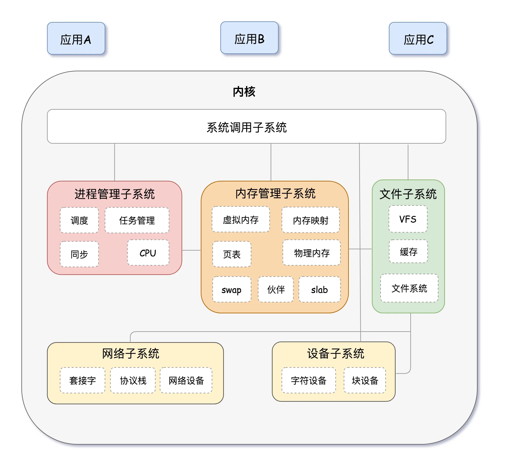
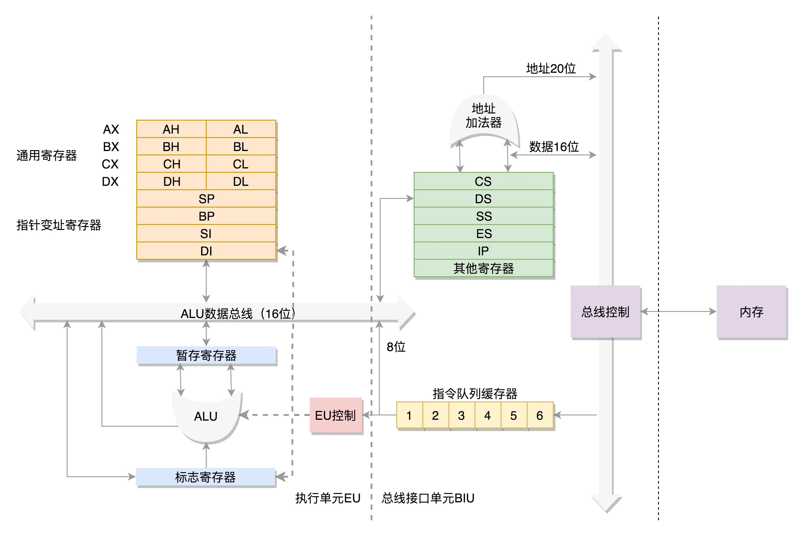
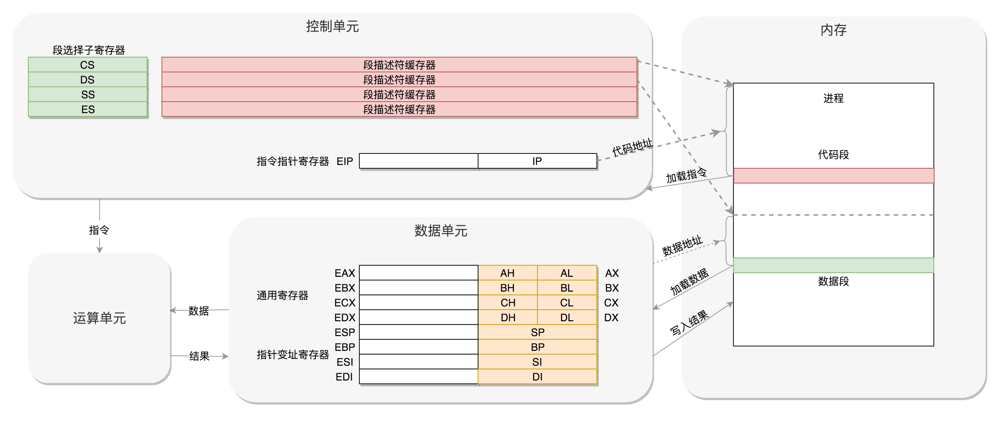
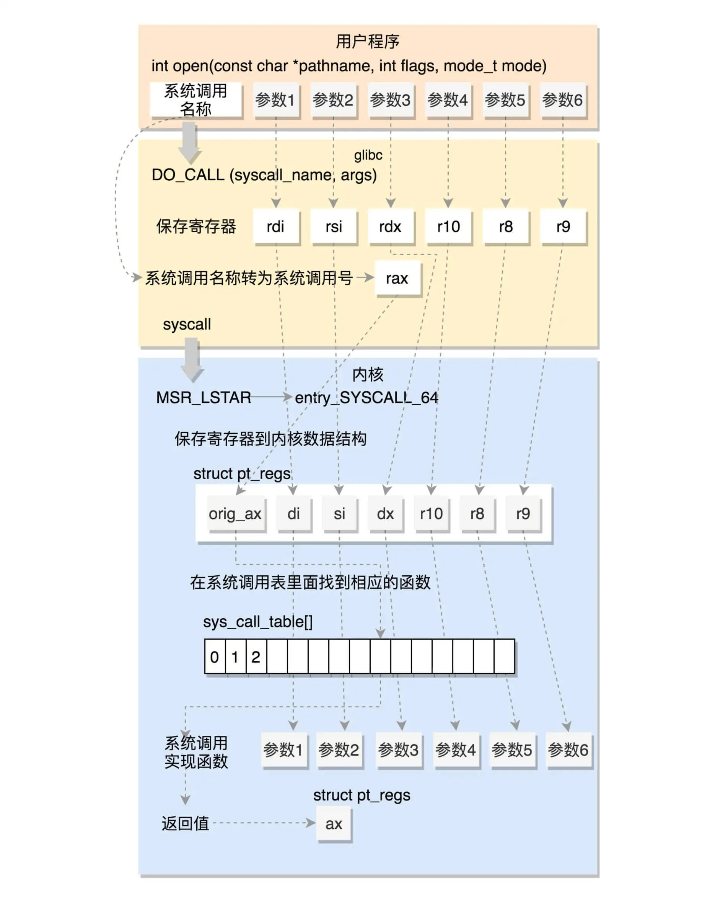
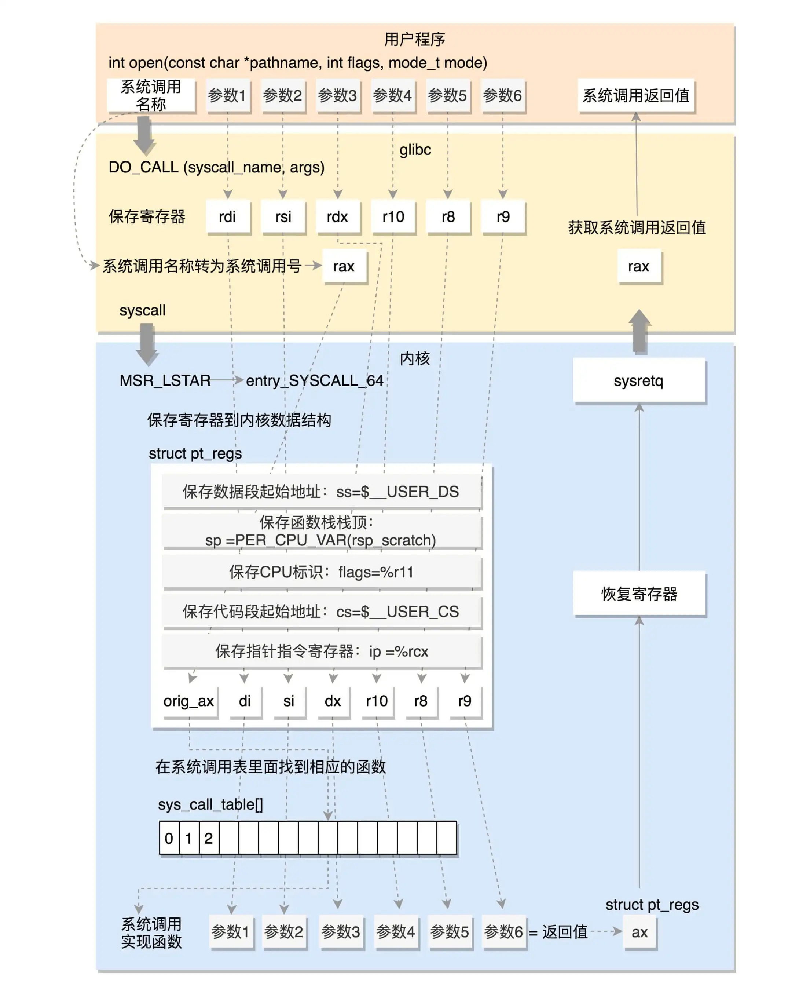
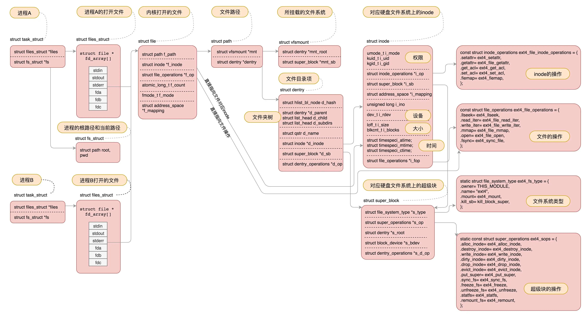
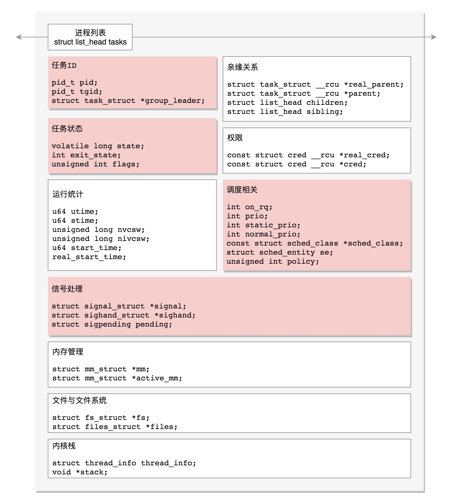
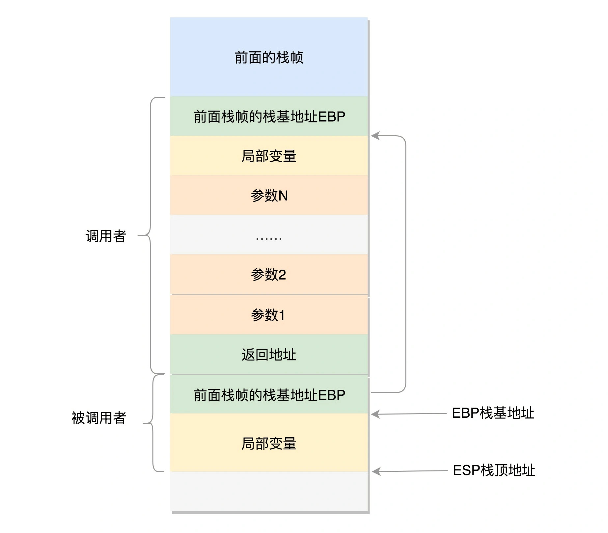
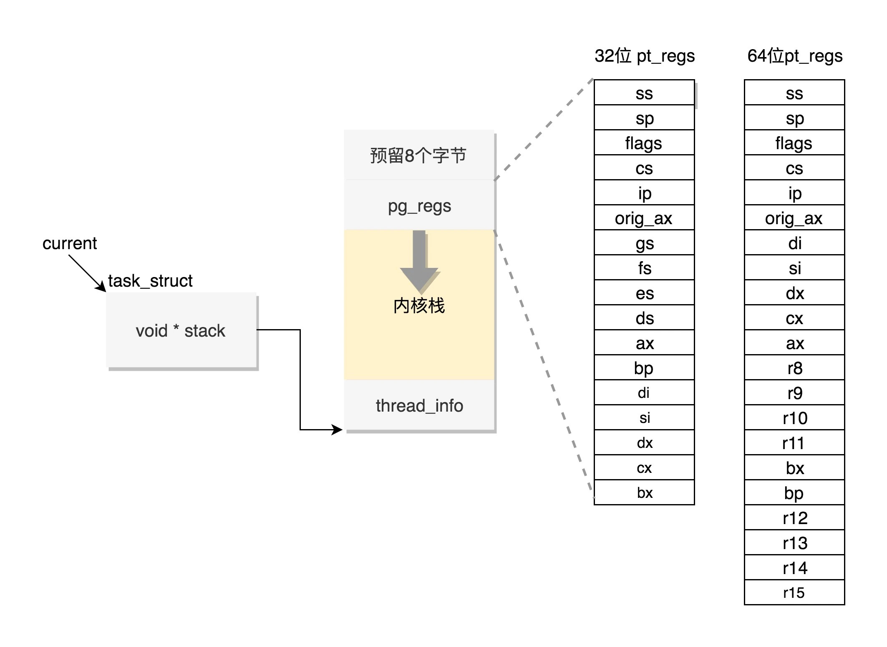

# [趣谈Linux操作系统](https://time.geekbang.org/column/intro/164)

* 核心原理
	* 综述
		*  Linux 内核结构
		* 上手 linux 命令
		* 学习系统调用
	* 系统初始化
		* 8086->x86 架构演化
		* BIOS->bootloader
		* 内核初始化
			* 子系统创建
			* 用户态祖先进程创建
			* 内核态祖先进程创建
	* 进程管理
		* 进程创建：编译、连接：.so
		* 创建线程，线程都有哪些数据，如何对线程数据进行保护
* 实战

## 基础

* C语言
* 计算机组成与结构

## 结构发展

### 初创期:x86 体系结->系统的启动->实模式

* 角色切换成软件外包公司的老板，设身处地地去理解操作系统是如何协调各种资源，帮客户做成事情的。“用户”：指操作系统的用户，“客户”：外包公司的客户
* 输入设备驱动|客户对接员
	* 客户发送的需求就被称为中断事件（Interrupt Event）。
* 项目执行计划书：说明这个项目打算怎么做，一步一步如何执行，遇到什么情况应该怎么办等等，都已经作为程序逻辑写在程序里面，并且编译成为二进制
	* 文件管理子系统（File Management Subsystem
	* 程序（Program）二进制文件是静态的
	* 进程（Process）运行起来的 QQ，是不断进行的
	* 打印机的直接操作是放在操作系统内核里面的，进程不能随便操作。但是操作系统也提供一个办事大厅|系统调用（System Call）
		* 任何一个程序要想运行起来，就需要调用系统调用，创建进程。
	* 进程管理子系统（Process Management Subsystem）
		* 进程执行需要分配 CPU 进行执行，也就是按照程序里面的二进制代码一行一行地执行
		* 如果运行进程很多，则一个 CPU 会并发运行多个进程，也就需要 CPU 的调度能力了
	* 内存管理子系统（Memory Management Subsystem）
		* 统一的管理和分配：不同的进程有不同的内存空间
* 交付人员|输出设备驱动：显卡驱动



#### 计算机构成

* 组成
	* CPU Central Processing Unit，中央处理器
		* 运算单元
			* 只管算，例如做加法、做位移等等。但是，它不知道应该算哪些数据，运算结果应该放在哪里。
			* 运算单元计算的数据如果每次都要经过总线，到内存里面现拿，这样就太慢了，所以就有了数据单元。
		* 数据单元包括 CPU 内部的缓存和寄存器组，空间很小，但是速度飞快，可以暂时存放数据和运算结果。有了放数据的地方，也有了算的地方，还需要有个指挥到底做什么运算的地方，这就是控制单元。
		* 控制单元是一个统一的指挥中心，可以获得下一条指令，然后执行这条指令。这个指令会指导运算单元取出数据单元中的某几个数据，计算出个结果，然后放在数据单元的某个地方。
	* 总线（Bus）CPU 和其他设备连接，就是主板上密密麻麻的集成电路，这些东西组成了 CPU 和其他设备的高速通道
		* 地址总线（Address Bus） 地址数据，也就是想拿内存中哪个位置的数据
		* 数据总线（Data Bus）真正的数据
		* 地址总线的位数，决定了能访问的地址范围到底有多广
		* 显卡会连接显示器、磁盘控制器会连接硬盘、USB 控制器会连接键盘和鼠标
	* 内存就相当于办公室，要看看方不方便租到办公室，有没有什么创新科技园之类的。有了共享的、便宜的办公位，公司就有注册地了
* CPU 和内存是完成计算任务的核心组件，重点介绍一下 CPU 和内存是如何配合工作的。
	* 每个进程都有一个程序放在硬盘上，是二进制的，再里面就是一行行的指令，会操作一些数据。
	* 运行进程 A 和 B，会有独立的内存空间，互相隔离，程序会分别加载到进程 A 和进程 B 的内存空间里面，形成各自的代码段。进程的内存虽然隔离但不连续，除了简单的区分代码段和数据段，还会分得更细。
	* 程序运行的过程中要操作的数据和产生的计算结果，都会放在数据段里面.
		* 控制单元里面，有一个指令指针寄存器，里面存放的是下一条指令在内存中的地址。控制单元会不停地将代码段的指令拿进来，先放入指令寄存器。指令分两部分，一部分是做什么操作，例如是加法还是位移；一部分是操作哪些数据。
		* 执行这条指:把第一部分交给运算单元，第二部分交给数据单元。
		* 数据单元根据数据的地址，从数据段里读到数据寄存器里，就可以参与运算了。
		* 运算单元做完运算，产生的结果会暂存在数据单元的数据寄存器里。最终，会有指令将数据写回内存中的数据段。
	* 进程切换（Process Switch）:两个寄存器，专门保存当前处理进程的代码段的起始地址，以及数据段的起始地址。这里面写的都是进程 A，那当前执行的就是进程 A 的指令，等切换成进程 B，就会执行 B 的指令了
	* CPU 和内存来来回回传数据，靠的都是总线

#### x86架构

* IBM 开始做 IBM PC 时，一开始并没有让最牛的华生实验室去研发，而是交给另一个团队。一年时间，软硬件全部自研根本不可能完成，于是他们采用了英特尔的 8088 芯片作为 CPU，使用微软的 MS-DOS 做操作系统。
* IBM PC 卖得超级好，好到因为垄断市场而被起诉。IBM 就在被逼的情况下公开了一些技术，使得后来无数 IBM-PC 兼容机公司的出现，也就有了后来占据市场的惠普、康柏、戴尔等等。
* 开放自己的技术是一件了不起的事。从技术和发展的层面来讲，使得一项技术大面积铺开，形成行业标准。就比如现在常用的 Android 手机，如果没有开放的 Android 系统，也没办法享受到这么多不同类型的手机。
* 英特尔的技术因此成为了行业的开放事实标准。由于这个系列开端于 8086，因此称为 x86 架构。
* 后来英特尔的 CPU 数据总线和地址总线越来越宽，处理能力越来越强。但是一直不能忘记三点，一是标准，二是开放，三是兼容。
* 8086 处理器|实模式（Real Pattern）
	* 8 个 16 位的通用寄存器|数据单元: AX、BX、CX、DX、SP、BP、SI、DI。这些寄存器主要用于在计算过程中暂存数据。
	* IP 寄存器|指令指针寄存器（Instruction Pointer Register):指向代码段中下一条指令的位置。CPU 会根据它来不断地将指令从内存的代码段中，加载到 CPU 的指令队列中，然后交给运算单元去执行。
	* 切换进程:每个进程都分代码段和数据段，为了指向不同进程的地址空间，有四个 16 位的段寄存器
		* CS |代码段寄存器（Code Segment Register），通过它可以找到代码在内存中的位置
		* DS |数据段寄存器，通过它可以找到数据在内存中的位置。
		* SS |栈寄存器（Stack Register）。栈是程序运行中一个特殊的数据结构，数据的存取只能从一端进行，秉承后进先出的原则，push 就是入栈，pop 就是出栈。
			* 凡是与函数调用相关的操作，都与栈紧密相关
		* 加载到通用寄存器:对于一个段，有一个起始的地址，而段内的具体位置，称为偏移量（Offset）
		* 在 CS 和 DS 中都存放着一个段的起始地址。代码段偏移量在 IP 寄存器中，数据段的偏移量会放在通用寄存器中
	* CS 和 DS 都是 16 位的，起始地址都是 16 位的，IP 寄存器和通用寄存器都是 16 位的，偏移量也是 16 位的，但是 8086 的地址总线地址是 20 位
		* 偏移量 16 位的，所以一个段最大的大小是 2^16=64k。
		* 最多只能访问 1M 的内存空间，还要分成多个段，每个段最多 64K。
		* 每次都要左移四位，也就意味着段的起始地址不能是任何一个地方，只是能整除 16 的地方。
* 32 位处理器|保护模式（Protected Pattern）
	* 有 32 根地址总线，可以访问 2^32=4G 的内存
	* 在开放架构的基础上，如何保持兼容
		* 通用寄存器有扩展，可以将 8 个 16 位的扩展到 8 个 32 位的，但是依然可以保留 16 位的和 8 位的使用方式。你可能会问，为什么高 16 位不分成两个 8 位使用呢？因为这样就不兼容了呀！
		* 指令指针寄存器 IP，就会扩展成 32 位的，同样也兼容 16 位的
		* 改动比较大，有点不兼容的就是段寄存器（Segment Register）
			* CS、SS、DS、ES 仍然是 16 位的，但是不再是段的起始地址。
			* 段的起始地址放在内存的某个地方。这个地方是一个表格，表格中的一项一项是段描述符（Segment Descriptor）。这里面才是真正的段的起始地址。而段寄存器里面保存的是在这个表格中的哪一项，称为选择子（Selector）。
			* 将一个从段寄存器直接拿到的段起始地址，就变成了先间接地从段寄存器找到表格中的一项，再从表格中的一项中拿到段起始地址。
			* 为了快速拿到段起始地址，段寄存器会从内存中拿到 CPU 的描述符高速缓存器中。
*  刚开机为实模式, 需要更多内存切换到保护模式
	



#### 汇编语言

* 《汇编从零开始到C语言》

```
move a b :把b值赋给a,使a=b  
add a b : 加法,a=a+b  
inc: 加1  
dec: 减1  
sub a b : a=a-b  
cmp: 减法比较，修改标志位

call和ret :call调用子程序，子程序以ret结尾 
jmp :无条件跳  
int :中断指令  

or :或运算  
xor :异或运算  
shl :算术左移  
ahr :算术右移  

push xxx :压xxx入栈  
pop xxx: xxx出栈  
```

### 发展期：保护模式、多进程->进程管理、内存管理、文件系统、输入输出设备管理

####  从BIOS到bootloader

* BIOS 时期
	* 主板上电
		* 做一些重置的工作，将 CS 设置为 0xFFFF，将 IP 设置为 0x0000，所以第一条指令就会指向 0xFFFF0（CS要左移四位），正是在 ROM 的范围内。
		* 有一个 JMP 命令会跳到 ROM 中做初始化工作的代码，于是，BIOS 开始进行初始化的工作
	* 主板 ROM（Read Only Memory，只读存储器）固化一些初始化的程序 BIOS（Basic Input and Output System，基本输入输出系统）
		* 在 x86 系统中，将 1M 空间最上面的 0xF0000 到 0xFFFFF 这 64K 映射给 ROM
	* 要检查系统硬件是不是都好着呢
		* 要建立一个中断向量表和中断服务程序，因为现在还要用键盘和鼠标，这些都要通过中断进行的
		* 在内存空间映射显存的空间，在显示器上显示一些字符。
* bootloader 时期
	* 操作系统一般都会在安装在硬盘上，在 BIOS 的界面上会看到一个启动盘的选项。
		* 启动盘：一般在第一个扇区，占 512 字节，而且以 0xAA55 结束。这是一个约定，当满足这个条件的时候，就说明这是一个启动盘，在 512 字节以内会启动相关的代码。
	* Grub2 Grand Unified Bootloader Version 2 搞系统启动的
		* `grub2-install /dev/sda` 将启动程序安装到相应位置
		* 第一个安装 boot.img。由 boot.S 编译而成，一共 512 字节，正式安装到启动盘的第一个扇区。这个扇区通常称为 MBR（Master Boot Record，主引导记录 / 扇区）。
	* BIOS 完成任务后，会将 boot.img 从硬盘加载到内存中的 0x7c00 来运行
		* 由于 512 个字节实在有限，boot.img 做不了太多的事情。能做的最重要的一个事情就是加载 grub2 的另一个镜像 core.img。
		* core.img 由 lzma_decompress.img、diskboot.img、kernel.img 和一系列的模块组成
		* boot.img 先加载的是 core.img 的第一个扇区。如果从硬盘启动的话，这个扇区里面是 diskboot.img，对应的代码是 diskboot.S
		* boot.img 将控制权交给 diskboot.img 后，diskboot.img 的任务就是将 core.img 的其他部分加载进来，先是解压缩程序 lzma_decompress.img，再往下是 kernel.img，最后是各个模块 module 对应的映像。这里需要注意，它不是 Linux 的内核，而是 grub 的内核。
			* lzma_decompress.img 对应的代码是 startup_raw.S
			* 本来 kernel.img 是压缩过的，现在执行的时候，需要解压缩。
			* 真正的解压缩之前，lzma_decompress.img 做了一个重要的决定，就是调用 real_to_prot，切换到保护模式，这样就能在更大的寻址空间里面，加载更多的东西。
		* kernel.img 解压缩后，然后跳转到 kernel.img 开始运行。
			* kernel.img 对应的代码是 startup.S 以及一堆 c 文件，在 startup.S 中会调用 grub_main，这是 grub kernel 的主函数。这个函数里面，grub_load_config() 开始解析  grub.conf 文件里的配置信息。
			* 正常启动，grub_main 最后会调用 grub_command_execute (“normal”, 0, 0)，最终会调用 grub_normal_execute() 函数。在这个函数里面，grub_show_menu() 会显示出让选择的那个操作系统的列表。
			* 选定启动某个操作系统，就要开始调用 grub_menu_execute_entry() ，开始解析并执行选择的那一项
			* grub_cmd_linux() 函数会被调用，会首先读取 Linux 内核镜像头部的一些数据结构，放到内存中的数据结构来，进行检查。如果检查通过，则会读取整个 Linux 内核镜像到内存
			* 有 initrd 命令，用于为即将启动的内核传递 init ramdisk 路径。于是 grub_cmd_initrd() 函数会被调用，将 initramfs 加载到内存中来。
			* 当这些事情做完之后，grub_command_execute (“boot”, 0, 0) 才开始真正地启动内核。
* 从实模式切换到保护模式
	* 启用分段:在内存里面建立段描述符表，将寄存器里面的段寄存器变成段选择子，指向某个段描述符，这样就能实现不同进程的切换了
	* 启动分页:能够管理的内存变大了，就需要将内存分成相等大小的块
	* 打开 Gate A20 第 21 根地址线的控制线:切换保护模式的函数 DATA32 call real_to_prot 会打开 Gate A20

```sh
# 配置系统启动的选项
grub2-mkconfig -o /boot/grub2/grub.cfg

menuentry 'CentOS Linux (3.10.0-862.el7.x86_64) 7 (Core)' --class centos --class gnu-linux --class gnu --class os --unrestricted $menuentry_id_option 'gnulinux-3.10.0-862.el7.x86_64-advanced-b1aceb95-6b9e-464a-a589-bed66220ebee' {
  load_video
  set gfxpayload=keep
  insmod gzio
  insmod part_msdos
  insmod ext2
  set root='hd0,msdos1'
  if [ x$feature_platform_search_hint = xy ]; then
    search --no-floppy --fs-uuid --set=root --hint='hd0,msdos1'  b1aceb95-6b9e-464a-a589-bed66220ebee
  else
    search --no-floppy --fs-uuid --set=root b1aceb95-6b9e-464a-a589-bed66220ebee
  fi
  linux16 /boot/vmlinuz-3.10.0-862.el7.x86_64 root=UUID=b1aceb95-6b9e-464a-a589-bed66220ebee ro console=tty0 console=ttyS0,115200 crashkernel=auto net.ifnames=0 biosdevname=0 rhgb quiet 
  initrd16 /boot/initramfs-3.10.0-862.el7.x86_64.img
}

```

#### 内核启动

* 《庖丁解牛Linux内核分析》

##### 子系统创建

* 从入口函数 start_kernel() 开始。在 init/main.c 文件中，start_kernel 相当于内核的 main 函数。里面是各种各样初始化函数 XXXX_init
* 进程管理
	* 0 号进程：先要有个创始进程，有一行指令 set_task_stack_end_magic(&init_task)
		* 参数 init_task，定义 struct task_struct init_task = INIT_TASK(init_task)
		* 系统创建的第一个进程，唯一一个没有通过 fork 或者 kernel_thread 产生的进程，是进程列表的第一个。
	* 进程列表（Process List）：列着所有运行进程
* 中断管理：对应函数 trap_init()，里面设置了很多中断门（Interrupt Gate），用于处理各种中断
	* 系统调用的中断门 set_system_intr_gate(IA32_SYSCALL_VECTOR, entry_INT80_32)
	* 系统调用也是通过发送中断的方式进行
* 内存管理
	* mm_init() 初始化内存管理模块
	* sched_init() 初始化调度模块
	* vfs_caches_init() 初始化基于内存的文件系统 rootfs
		* 调用 mnt_init()->init_rootfs()。
		* register_filesystem(&rootfs_fs_type)。在 VFS 虚拟文件系统里面注册了一种类型，定义为 struct file_system_type rootfs_fs_type。
* 文件系统 
	* VFS（Virtual File System），虚拟文件系统：为兼容各种各样的文件系统，将文件的相关数据结构和操作抽象出来，形成一个对上提供统一的接口的抽象层
* 调用 rest_init()，用来做其他方面的初始化

##### 初始化 1 号进程 ：形成用户态所有进程祖先

* rest_init 第一大工作 用 kernel_thread(kernel_init, NULL, CLONE_FS) 创建第二个进程  1 号进程。
* 1 号进程对于操作系统来讲，有“划时代”的意义。因为它将运行一个用户进程，这意味着这个公司把一个老板独立完成的制度，变成了可以交付他人完成的制度。这个 1 号进程就相当于老板带了一个大徒弟，有了第一个，就有第二个，后面大徒弟开枝散叶，带了很多徒弟，形成一棵进程树。
	* 1 号进程是 /sbin/init。在 centOS 7 里面，这个进程是被软链接到 systemd
	* init 进程会启动很多的 daemon 进程，为系统运行提供服务，然后启动 getty，让用户登录，登录后运行 shell，用户启动的进程都是通过 shell 运行的，从而形成了一棵进程树。
	* ps -ef 命令查看当前系统启动的进程
		* 用户态的不带中括号，内核态的带中括号
		* 内核态进程祖先是 2 号进程
		* 用户态进程祖先是 1 号进程
		* tty 那一列带问号的，说明不是前台启动的，一般都是后台的服务。
* 一旦有了用户进程，公司的运行模式就要发生一定的变化。因为原来你是老板，没有雇佣其他人，所有东西都是你的，无论多么关键的资源，第一，不会有人给你抢，第二，不会有人恶意破坏、恶意使用。有了其他人，就要开始做一定的区分，用户权限
* x86 提供了分层的权限机制，把区域分成了四个 Ring，越往里权限越高，越往外权限越低：Ring 0 内核->Ring 1 设备驱动->Ring 2设备驱动->Ring 3 应用
* 操作系统很好地利用这个机制，将能够访问关键资源的代码放在 Ring0，称为内核态（Kernel Mode）；将普通的程序代码放在 Ring3，称为用户态（User Mode）.保护模式中，处于用户态代码想要执行更高权限的指令行为是被禁止的，要防止他们为所欲为
* 从内核态到用户态
	* kernel_thread 在内核态，到用户态去运行一个程序
		* 参数 函数 kernel_init，1号进程会运行 kernel_init 函数（回调）
		* 在 kernel_init 里面，会调用 kernel_init_freeable()
	* run_init_process()->do_execve()（execve 系统调用实现）
		* 尝试运行 **ramdisk 的“/init”**，或者普通文件系统上的“/sbin/init”“/etc/init”“/bin/init”“/bin/sh”。不同版本的 Linux 会选择不同的文件启动，但是只要有一个起来了就可以
	* do_execve->do_execveat_common->exec_binprm->search_binary_handler
		* 要运行一个程序，需要加载二进制文件，它是有一定格式的。Linux 下常用格式 ELF（Executable and Linkable Format，可执行与可链接格式）
		* 先调用 load_elf_binary，最后调用 start_thread
	* start_thread
		* 保存寄存器：struct pt_regs 系统调用的时候，内核中保存用户态运行上下文
		* 最后的 iret：用于从系统调用中返回。恢复寄存器。从哪里恢复呢？按说是从进入系统调用的时候，保存的寄存器里面拿出。好在上面的函数补上了寄存器。CS 和指令指针寄存器 IP 恢复了，指向用户态下一个要执行的语句。DS 和函数栈指针 SP 也被恢复了，指向用户态函数栈的栈顶。所以，下一条指令，就从用户态开始运行了。
* ramdisk 作用
	* init 终于从内核到用户态了。一开始到用户态的是 ramdisk 的 init，后来会启动真正根文件系统上的 init，成为所有用户态进程的祖先
	* `initrd16 /boot/initramfs-3.10.0-862.el7.x86_64.img` 基于内存的文件系统
		* 上面 的 init 程序是在文件系统上的，文件系统一定是在一个存储设备上的，例如硬盘。Linux 访问存储设备，要有驱动才能访问。如果存储系统数目很有限，那驱动可以直接放到内核里面，前面加载过内核到内存里了，可以直接对存储系统进行访问。
		* 但是存储系统越来越多了，如果所有市面上的存储系统的驱动都默认放进内核，内核就太大了
		* 先弄一个基于内存的文件系统。内存访问是不需要驱动的，这个就是 ramdisk。这个时候，ramdisk 是根文件系统。
	* 运行 ramdisk 上的 /init。等它运行完就已经在用户态了。/init 这个程序会先根据存储系统的类型加载驱动，有了驱动就可以设置真正的根文件系统了。有了真正的根文件系统，ramdisk 上的 /init 会启动文件系统上的 init。

```c
# kernel_init
  if (ramdisk_execute_command) {
    ret = run_init_process(ramdisk_execute_command);
......
  }
......
  if (!try_to_run_init_process("/sbin/init") ||
      !try_to_run_init_process("/etc/init") ||
      !try_to_run_init_process("/bin/init") ||
      !try_to_run_init_process("/bin/sh"))
    return 0;

# kernel_init_freeable
if (!ramdisk_execute_command)
    ramdisk_execute_command = "/init";
	

static int run_init_process(const char *init_filename)
{
  argv_init[0] = init_filename;
  return do_execve(getname_kernel(init_filename),
    (const char __user *const __user *)argv_init,
    (const char __user *const __user *)envp_init);
}


int search_binary_handler(struct linux_binprm *bprm)
{
  ......
  struct linux_binfmt *fmt;
  ......
  retval = fmt->load_binary(bprm);
  ......
}


static struct linux_binfmt elf_format = {
.module  = THIS_MODULE,
.load_binary  = load_elf_binary,
.load_shlib  = load_elf_library,
.core_dump  = elf_core_dump,
.min_coredump  = ELF_EXEC_PAGESIZE,
};


void
start_thread(struct pt_regs *regs, unsigned long new_ip, unsigned long new_sp)
{
set_user_gs(regs, 0);
# 保存用户态寄存器
regs->fs  = 0;
regs->ds  = __USER_DS;
regs->es  = __USER_DS;
regs->ss  = __USER_DS;
regs->cs  = __USER_CS;
regs->ip  = new_ip;
regs->sp  = new_sp;
regs->flags  = X86_EFLAGS_IF;

force_iret();
}
EXPORT_SYMBOL_GPL(start_thread);
```

##### 创建 2 号进程

* rest_init 第二大事情就是第三个进程，就是 2 号进程
* kernel_thread(kthreadd, NULL, CLONE_FS | CLONE_FILES) 又一次使用 kernel_thread 函数创建进程。
	- 函数名 thread 可以翻译成“线程”
	- 从内核态来看，无论是进程，还是线程，可以统称为任务（Task），都使用相同的数据结构，平放在同一个链表中
	- kthreadd，负责所有内核态的线程的调度和管理，是内核态所有线程运行的祖先。

### 壮大期：进程间通信->网络通信

### 集团化：虚拟化->容器化->Linux 集群->从单机操作系统到数据中心操作系统


## 能力发展

### 熟练使用 Linux 命令行 Command Line

* 用户 `/etc/passwd` 
	* 主目录:用户登录进去后默认的路径
	* /bin/bash 位置:配置登录后默认交互命令行
	* `passwd [username]`
	* `useradd -h`
* 组 `/etc/groups`
* 图书
	* 《鸟哥的Linux私房菜》
	* 《Linux 系统管理技术手册》

### 使用 Linux 进行程序设计

* 直接使用 Linux 系统调用，也可以使用 glibc 的库
* 图书
	* 补充：优先《Unix/Linux编程实践教程》
	* 《UNIX环境高级编程》

### 了解 Linux 内核机制

* 了解一下 Linux 内核机制，知道基本的原理和流程
* 图书
	* 补充：《庖丁解牛Linux内核分析》
	* 《深入理解Linux内核》


### 阅读 Linux 内核代码，聚焦核心逻辑和场景

* 一开始阅读代码不要纠结一城一池的得失，不要每一行都一定要搞清楚它是干嘛的，而要聚焦于核心逻辑和使用场景。
* 图书
	* 《Linux内核源代码情景分析》


### 实验定制 Linux 组件

* 一旦代码有一个细微的 bug，都有可能导致实验失败。

### 生产实践

## 组件

### [系统调用](https://www.kernel.org)

* 系统调用的定义 unistd_64.h

#### Glibc

* Glibc 是 Linux 下使用的开源的标准 C 库，它是 GNU 发布的 libc 库。Glibc 为程序员提供丰富的 API，除了例如字符串处理、数学运算等用户态服务之外，最重要的是封装了操作系统提供的系统服务，即系统调用的封装。
	* 每个特定的系统调用对应了至少一个 Glibc 封装的库函数
	* 有时候，Glibc 一个单独的 API 可能调用多个系统调用，比如说，Glibc 提供的 printf 函数就会调用如 sys_open、sys_mmap、sys_write、sys_close 等等系统调用。
	* 也有时候，多个 API 也可能只对应同一个系统调用，如 Glibc 下实现的 malloc、calloc、free 等函数用来分配和释放内存，都利用了内核的 sys_brk 的系统调用。
* syscalls.lis 列着所有 glibc 的函数对应的系统调用
* 脚本 make-syscall.sh 可以根据上面的配置文件，对于每一个封装好的系统调用，生成一个文件。这个文件里面定义了一些宏，例如 `#define SYSCALL_NAME open`
* syscall-template.S，使用上面这个宏，定义了这个系统调用的调用方式。
* PSEUDO 也一个宏,对于任何一个系统调用，会调用 DO_CALL。
* DO_CALL也是一个宏，这个宏 32 位和 64 位的定义是不一样的。

##### 32 位系统调用

* ENTER_KERNEL:int $0x80 就是触发一个软中断，通过它就可以陷入（trap）内核
* 触发内核启动时 `set_system_intr_gate(IA32_SYSCALL_VECTOR, entry_INT80_32);`进入系统调用
* do_syscall_32_irqs_on
	* 将系统调用号从 eax 里面取出来，然后根据系统调用号，在系统调用表中找到相应的函数进行调用，并将寄存器中保存的参数取出来，作为函数参数。
	* 如果仔细比对，发现这些参数所对应的寄存器，和 Linux 的注释是一样的。
	* 根据宏定义，#define ia32_sys_call_table sys_call_table，系统调用就是放在这个表里面。
* 当系统调用结束之后，在 entry_INT80_32 之后，紧接着调用的是 INTERRUPT_RETURN，能够找到它的定义，也就是 iret
* iret 指令将原来用户态保存的现场恢复回来，包含代码段、指令指针寄存器等。这时候用户态进程恢复执行。



```
# i386/sysdep.h
/* Linux takes system call arguments in registers:
  syscall number  %eax       call-clobbered
  arg 1    %ebx       call-saved
  arg 2    %ecx       call-clobbered
  arg 3    %edx       call-clobbered
  arg 4    %esi       call-saved
  arg 5    %edi       call-saved
  arg 6    %ebp       call-saved
......
*/
#define DO_CALL(syscall_name, args)                           \
    PUSHARGS_##args                               \
    DOARGS_##args                                 \
    movl $SYS_ify (syscall_name), %eax;                          \
    ENTER_KERNEL                                  \
    POPARGS_##args

# define ENTER_KERNEL int $0x80

# 内核启动的时候 trap_init()，软中断的陷入门。当接收到一个系统调用的时候，entry_INT80_32 就被调用了
set_system_intr_gate(IA32_SYSCALL_VECTOR, entry_INT80_32);


ENTRY(entry_INT80_32)
        ASM_CLAC
		# 将当前用户态的寄存器，保存在 pt_regs 结构里面
        pushl   %eax                    /* pt_regs->orig_ax */
        SAVE_ALL pt_regs_ax=$-ENOSYS    /* save rest */
        movl    %esp, %eax
        call    do_syscall_32_irqs_on
.Lsyscall_32_done:
......
.Lirq_return:
  INTERRUPT_RETURN
 

static __always_inline void do_syscall_32_irqs_on(struct pt_regs *regs)
{
  struct thread_info *ti = current_thread_info();
  unsigned int nr = (unsigned int)regs->orig_ax;
......
  if (likely(nr < IA32_NR_syscalls)) {
    regs->ax = ia32_sys_call_table[nr](
      (unsigned int)regs->bx, (unsigned int)regs->cx,
      (unsigned int)regs->dx, (unsigned int)regs->si,
      (unsigned int)regs->di, (unsigned int)regs->bp);
  }
  syscall_return_slowpath(regs);
}


#define INTERRUPT_RETURN                iret
```

##### 64 位系统调用

* 系统调用名称转换为系统调用号，放到寄存器 rax。这里不是用中断了，而是改用 syscall 指令真正进行调用
* 特殊模块寄存器（Model Specific Registers，简称 MSR）:CPU 为完成某些特殊控制功能为目的的寄存器.syscall 指令使用了这种特殊的寄存器.
* 系统初始化的时候，trap_init 除了初始化上面的中断模式，还会调用 cpu_init->syscall_init。`wrmsrl(MSR_LSTAR, (unsigned long)entry_SYSCALL_64);`
	* rdmsr 和 wrmsr 用来读写特殊模块寄存器的
	* MSR_LSTAR 就是这样一个特殊的寄存器，当 syscall 指令调用的时候，会从这个寄存器里面拿出函数地址来调用，就是调用 entry_SYSCALL_64。
		* 保存很多寄存器到 pt_regs 结构
		* 调用 entry_SYSCALL64_slow_pat->do_syscall_64
		* do_syscall_64 里面，从 rax 里面拿出系统调用号，然后根据系统调用号，在系统调用表 sys_call_table 中找到相应的函数进行调用，并将寄存器中保存的参数取出来，作为函数参数。如果仔细比对就能发现，这些参数所对应的寄存器，和 Linux 的注释又是一样的。
	* 系统调用返回的时候，执行的是 USERGS_SYSRET64
* 无论是 32 位，还是 64 位，都会到系统调用表 sys_call_table 这里来
	* 32 位系统调用表 arch/x86/entry/syscalls/syscall_32.tbl  
	* 64 位系统调用表  arch/x86/entry/syscalls/syscall_64.tbl
	* 声明 系统调用在内核中的实现函数 include/linux/syscalls.h
	* 实现系统调用，一般在一个.c 文件里面，例如 sys_open 的实现在 fs/open.c 里面
		* SYSCALL_DEFINE3 是一个宏系统调用最多六个参数，根据参数的数目选择宏。
		* 相当于模板函数
	* 编译 根据 syscall_32.tbl 和 syscall_64.tbl 生成自己的 unistd_32.h 和 unistd_64.h。生成方式在 arch/x86/entry/syscalls/Makefile 中，使用两个脚本
		* arch/x86/entry/syscalls/syscallhdr.sh，会在文件中生成 `#define __NR_open`
		* arch/x86/entry/syscalls/syscalltbl.sh，会在文件中生成` __SYSCALL(__NR_open, sys_open)`
	* unistd_32.h 和 unistd_64.h 是对应的系统调用号和系统调用实现函数之间的对应关系。
	* arch/x86/entry/syscall_32.c，定义了这样一个表，里面 include 这个头文件，从而所有的 sys_ 系统调用都在这个表里面了
	* 在文件 arch/x86/entry/syscall_64.c，定义了这样一个表，里面 include 了这个头文件，这样所有的 sys_ 系统调用就都在这个表里面了



```c
# x86_64/sysdep.h 
/* The Linux/x86-64 kernel expects the system call parameters in
   registers according to the following table:
    syscall number  rax
    arg 1    rdi
    arg 2    rsi
    arg 3    rdx
    arg 4    r10
    arg 5    r8
    arg 6    r9
......
*/
#define DO_CALL(syscall_name, args)                \
  lea SYS_ify (syscall_name), %rax;                \
  syscall

wrmsrl(MSR_LSTAR, (unsigned long)entry_SYSCALL_64);

# arch/x86/entry/entry_64.S
ENTRY(entry_SYSCALL_64)
        /* Construct struct pt_regs on stack */
        pushq   $__USER_DS                      /* pt_regs->ss */
        pushq   PER_CPU_VAR(rsp_scratch)        /* pt_regs->sp */
        pushq   %r11                            /* pt_regs->flags */
        pushq   $__USER_CS                      /* pt_regs->cs */
        pushq   %rcx                            /* pt_regs->ip */
        pushq   %rax                            /* pt_regs->orig_ax */
        pushq   %rdi                            /* pt_regs->di */
        pushq   %rsi                            /* pt_regs->si */
        pushq   %rdx                            /* pt_regs->dx */
        pushq   %rcx                            /* pt_regs->cx */
        pushq   $-ENOSYS                        /* pt_regs->ax */
        pushq   %r8                             /* pt_regs->r8 */
        pushq   %r9                             /* pt_regs->r9 */
        pushq   %r10                            /* pt_regs->r10 */
        pushq   %r11                            /* pt_regs->r11 */
        sub     $(6*8), %rsp                    /* pt_regs->bp, bx, r12-15 not saved */
        movq    PER_CPU_VAR(current_task), %r11
        testl   $_TIF_WORK_SYSCALL_ENTRY|_TIF_ALLWORK_MASK, TASK_TI_flags(%r11)
        jnz     entry_SYSCALL64_slow_path
......
entry_SYSCALL64_slow_path:
        /* IRQs are off. */
        SAVE_EXTRA_REGS
        movq    %rsp, %rdi
        call    do_syscall_64           /* returns with IRQs disabled */
return_from_SYSCALL_64:
  RESTORE_EXTRA_REGS
  TRACE_IRQS_IRETQ
  movq  RCX(%rsp), %rcx
  movq  RIP(%rsp), %r11
    movq  R11(%rsp), %r11
......
syscall_return_via_sysret:
  /* rcx and r11 are already restored (see code above) */
  RESTORE_C_REGS_EXCEPT_RCX_R11
  movq  RSP(%rsp), %rsp
  USERGS_SYSRET64 
  

__visible void do_syscall_64(struct pt_regs *regs)
{
        struct thread_info *ti = current_thread_info();
        unsigned long nr = regs->orig_ax;
......
        if (likely((nr & __SYSCALL_MASK) < NR_syscalls)) {
                regs->ax = sys_call_table[nr & __SYSCALL_MASK](
                        regs->di, regs->si, regs->dx,
                        regs->r10, regs->r8, regs->r9);
        }
        syscall_return_slowpath(regs);
}
 
#define USERGS_SYSRET64        \
  swapgs;          \
  sysretq;
  
## 系统调用表
# 系统调用表定义 arch/x86/entry/syscalls/syscall_64.tbl
2 common open sys_open

# 系统调用在内核中的实现函数 声明 include/linux/syscalls.h
asmlinkage long sys_open(const char __user *filename,
                                int flags, umode_t mode);

# 系统调用 实现 fs/open.c
SYSCALL_DEFINE3(open, const char __user *, filename, int, flags, umode_t, mode)
{
        if (force_o_largefile())
                flags |= O_LARGEFILE;
        return do_sys_open(AT_FDCWD, filename, flags, mode);
}


#define SYSCALL_DEFINE1(name, ...) SYSCALL_DEFINEx(1, _##name, __VA_ARGS__)
#define SYSCALL_DEFINE2(name, ...) SYSCALL_DEFINEx(2, _##name, __VA_ARGS__)
#define SYSCALL_DEFINE3(name, ...) SYSCALL_DEFINEx(3, _##name, __VA_ARGS__)
#define SYSCALL_DEFINE4(name, ...) SYSCALL_DEFINEx(4, _##name, __VA_ARGS__)
#define SYSCALL_DEFINE5(name, ...) SYSCALL_DEFINEx(5, _##name, __VA_ARGS__)
#define SYSCALL_DEFINE6(name, ...) SYSCALL_DEFINEx(6, _##name, __VA_ARGS__)


#define SYSCALL_DEFINEx(x, sname, ...)                          \
        SYSCALL_METADATA(sname, x, __VA_ARGS__)                 \
        __SYSCALL_DEFINEx(x, sname, __VA_ARGS__)


#define __PROTECT(...) asmlinkage_protect(__VA_ARGS__)
#define __SYSCALL_DEFINEx(x, name, ...)                                 \
        asmlinkage long sys##name(__MAP(x,__SC_DECL,__VA_ARGS__))       \
                __attribute__((alias(__stringify(SyS##name))));         \
        static inline long SYSC##name(__MAP(x,__SC_DECL,__VA_ARGS__));  \
        asmlinkage long SyS##name(__MAP(x,__SC_LONG,__VA_ARGS__));      \
        asmlinkage long SyS##name(__MAP(x,__SC_LONG,__VA_ARGS__))       \
        {                                                               \
                long ret = SYSC##name(__MAP(x,__SC_CAST,__VA_ARGS__));  \
                __MAP(x,__SC_TEST,__VA_ARGS__);                         \
                __PROTECT(x, ret,__MAP(x,__SC_ARGS,__VA_ARGS__));       \
                return ret;                                             \
        }                                                               \
        static inline long SYSC##name(__MAP(x,__SC_DECL,__VA_ARGS__)


## arch/x86/entry/syscall_32.c
__visible const sys_call_ptr_t ia32_sys_call_table[__NR_syscall_compat_max+1] = {
        /*
         * Smells like a compiler bug -- it doesn't work
         * when the & below is removed.
         */
        [0 ... __NR_syscall_compat_max] = &sys_ni_syscall,
#include <asm/syscalls_32.h>
};

## arch/x86/entry/syscall_64.c
/* System call table for x86-64. */
asmlinkage const sys_call_ptr_t sys_call_table[__NR_syscall_max+1] = {
  /*
   * Smells like a compiler bug -- it doesn't work
   * when the & below is removed.
   */
  [0 ... __NR_syscall_max] = &sys_ni_syscall,
#include <asm/syscalls_64.h>
};
```

#### 进程

* fork 创建进程
	* 需要一个老的进程调用 fork 来实现，其中老进程叫作父进程（Parent Process），新进程叫作子进程（Child Process）
	* 子进程将各个子系统为父进程创建的数据结构全部拷贝了一份，甚至连程序代码也是拷贝过来的
	* 返回值
		* 如果当前进程是子进程，返回 0
		* 如果当前进程是父进程，返回子进程的进程号
		* 通过返回值做区分，使用 if-else 语句判断
			* 如果是父进程，接着做原来应该做的事情
			* 如果是子进程，请求另一个系统调用execve来执行另一个程序（运行一个执行文件），这个时候，子进程和父进程就彻底分道扬镳了，也就产生了一个分支（fork）了。
* exec 最终调用的 load_elf_binary，是一组函数
	* 含 p 函数（execvp, execlp）会在 PATH 路径下面寻找程序
	* 不含 p 函数需要输入程序的全路径
	* 含 v 函数（execv, execvp, execve）以数组形式接收参数
	* 含 l 函数（execl, execlp, execle）以列表形式接收参数
	* 含 e 函数（execve, execle）以数组形式接收环境变量
* waitpid 父进程调用，将子进程的进程号作为参数传给它，这样父进程就知道子进程运行完了没有，成功与否

#### 内存

*  堆里面分配内存的系统调用
* brk：当分配的内存数量比较小的时候使用，会和原来的堆的数据连在一起，这就像多分配两三个工位，在原来的区域旁边搬两把椅子就行了
* mmap：当分配的内存数量比较大的时候使用，会重新划分一块区域，也就是说，当办公空间需要太多的时候，索性来个一整块。

#### 文件操作

* 不存在文件 create 创建
* 已存在文件 open 打开，close关闭
* 打开文件后 lseek 跳到文件某个位置
* 读写内容:读 read，写 write

### 文件系统

* 属性
	* 第一个字段
		* 第一个字符：类型
			* “-” 表示普通文件
			* d 表示目录
		* 剩下的9 个字符 模式|权限位（access permission bits）
			- 3 个一组，每一组 rwx 表示“读（read）”“写（write）”“执行（execute）”
			- 如果是字母，就说明有这个权限
			- 如果是横线，就是没有这个权限
	- 第二个字段:硬链接（hard link）数目
	- 第三个字段是所属用户
	- 第四个字段是所属组
	- 第五个字段是文件的大小
	- 第六个字段是文件被修改的日期
	- 最后是文件名
* 一切皆文件
	* 二进制文件：启动一个进程，需要一个程序文件
	* 文本文件：启动的时候，要加载一些配置文件，例如 yml、properties 等，这是
	* 启动之后会打印一些日志，如果写到硬盘上，也是文本文件。但是如果想把日志打印到交互控制台上，在命令行上唰唰地打印出来，这其实也是一个文件，是标准输出 stdout 文件。
	* 管道:进程的输出可以作为另一个进程的输入，管道也是一个文件。
	* 进程可以通过网络和其他进程进行通信，建立的 Socket，也是一个文件。
	* 进程需要访问外部设备，设备也是一个文件。
	* 文件都被存储在文件夹里面，其实文件夹也是一个文件。
	* 进程运行起来，要想看到进程运行的情况，会在 /proc 下面有对应的进程号，还是一系列文件
* 每个文件，Linux 都会分配一个文件描述符（File Descriptor），这是一个整数。有了这个文件描述符，可以使用系统调用，查看或者干预进程运行的方方面面。
	* 文件操作是贯穿始终的，这也是“一切皆文件”的优势，就是统一了操作的入口，提供了极大的便利

#### 操作

* cd change directory 切换目录
	- cd .. 表示切换到上一级目录
* dir，可以列出当前目录下的文件
* ls list 列出当前目录下的文件 ``



```sh
# ls -l
drwxr-xr-x 6 root root 4096 Oct 20 2017 apt
-rw-r--r-- 1 root root 211 Oct 20 2017 hosts
```

#### 软件

* 流程
	* 主执行文件 /usr/bin| /usr/sbin
	* 其他库文件 /var
	* 配置文件 /etc
* 安装
	* 软件包
		* CentOS 体系 .rpm
		* Ubuntu 体系 .deb
	* 软件管家
		* CentOS  yum
			* `/etc/yum.repos.d/CentOS-Base.repo`
		* Ubuntu  apt-get
			* `/etc/apt/sources.list`
	* 二进制文件
		* `wget 链接`
		* 通过 tar 解压缩
		* 配置环境变量
			* 可以通过 export 命令来配置:仅在当前命令行的会话中管用，一旦退出重新登录进来，就不管用了
			* 默认工作目录 .bashrc 文件,每次登录的时候，这个文件都会运行，因而把它放在这里
			* 也可以通过 source .bashrc 手动执行
* 执行
	* Linux 不是根据后缀名来执行的。执行条件是这样的：只要文件有 x 执行权限，都能到文件所在的目录下，通过./filename运行这个程序。
	* 如果放在 PATH 里设置的路径下面，就不用./ 了，直接输入文件名就可以运行了，Linux 会帮你找
	* 通过 shell 在交互命令行里面运行
	* 后台运行 nohup no hang up
		* 最后加一个 &，就表示后台运行
	* 以服务方式运行
		* enable 开机启动:在 /lib/systemd/system 目录下会创建一个 XXX.service 的配置文件，里面定义了如何启动、如何关闭
	* 输出
		* “1”表示文件描述符 1，表示标准输出
		* “2”表示文件描述符 2，意思是标准错误输出
* awk '{print $2}'是指第二列的内容，是运行的程序 ID
* 通过 xargs 传递给 kill -9，也就是发给这个运行的程序一个信号，让它关闭

```sh
# centos
rpm -qa
rpm -i jdk-XXX_linux-x64_bin.rpm
rpm -e # erase

yum install java-11-openjdk.x86_64
yum erase java-11-openjdk.x86_64

# ubunut
dpkg -l
dpkg -i jdk-XXX_linux-x64_bin.deb
dpkg -r # remove

apt-get install openjdk-9-jdk
apt-get purge openjdk-9-jdk

# 标准输出和错误输出合并
nohup command >out.file 2>&1 &

# 关闭进程
ps -ef |grep 关键字 |awk '{print $2}'|xargs kill -9

systemctl start|enable mysql

shutdown -h now # 现在关机
reboot # 重启
```

### 内存管理

#### 进程内存空间

*  每个进程都有自己的内存，互相之间不干扰，有独立的进程内存空间
*  代码段 Code Segment 程序代码
*  数据段 Data Segment 进程运行中产生数据
	*  局部变量：在当前函数执行的时候起作用，当进入另一个函数时，变量就释放
	*  动态分配：会较长时间保存，指明才销毁的，这部分称为堆（Heap）
*  进程的内存空间 32 位的是 4G，不可能有这么多物理内存
	*  进程不用部分就不用管，只有进程要去使用部分内存的时候，才会使用内存管理的系统调用来登记，说自己马上就要用了，希望分配一部分内存给它，但是这还不代表真的就对应到了物理内存。
	*  只有真的写入数据的时候，发现没有对应物理内存，才会触发一个中断，现分配物理内存

### 进程管理

#### 进程间通信

* 消息队列（Message Queue） 在内核里
	* 通过msgget创建一个新的队列
	* msgsnd将消息发送到消息队列
	* 消息接收方可以使用msgrcv从队列中取消息
* 共享内存
	* shmget 创建一个共享内存块
	* shmat 将共享内存映射到自己的内存空间，然后就可以读写
	* 存在“竞争”问题：如果大家同时修改同一块数据咋办？
	* 信号量机制 Semaphore：让不同的人能够排他地访问
		* 对于只允许一个人访问的需求，将信号量设为 1
		* 当一个人要访问的时候，先调用sem_wait。如果这时候没有人访问，则占用这个信号量，就可以开始访问了。
		* 如果这个时候另一个人要访问，也会调用 sem_wait。由于前一个人已经在访问了，所以后面这个人就必须等待上一个人访问完之后才能访问。
		* 当上一个人访问完毕后，会调用sem_post将信号量释放，于是下一个人等待结束，可以访问这个资源了。

#### 用户态代码执行

* 用户态代码访问核心资源：用户态 - 系统调用 - 保存寄存器 - 内核态执行系统调用 - 恢复寄存器 - 返回用户态，例如 访问网卡发一个网络包
	* 暂停当前的运行，通过中断请求发起系统调用
		* 暂停的那一刻，要把当时 CPU 的寄存器的值全部暂存到一个地方，这个地方可以放在进程管理系统很容易获取的地方。当系统调用完毕，返回的时候，再从这个地方将寄存器的值恢复回去，就能接着运行了。
	* 内核将从系统调用传过来的包，在网卡上排队，轮到的时候就发送。
	* 发送完了，系统调用结束，返回用户态，让暂停运行的程序接着运行。

#### 线程

* 从用户态来看，创建进程就是立项|启动一个项目。项目包含很多资源，例如会议室、资料库等。这些东西都属于这个项目，但是项目需要人去执行。
* 多线程（Multithreading）：有多个人并行执行不同的部分
* 进程默认有一个主线程
* 创建
* 线程并行
	* 访问数据
		* 整个进程里共享全局数据。例如全局变量，虽然在不同进程中是隔离的，但是在一个进程中是共享的
		* 线程栈上的本地数据：每个线程都有自己的栈空间
			* 主线程在内存中有一个栈空间，其他线程栈也拥有独立的栈空间。为了避免线程之间的栈空间踩踏，线程栈之间还会有小块区域，用来隔离保护各自的栈空间。一旦另一个线程踏入到这个隔离区，就会引发段错误。
			* 栈的大小  ulimit -a
			* 栈修改 ulimit -s 
			* 修改线程栈的大小 `int pthread_attr_setstacksize(pthread_attr_t *attr, size_t stacksize);`
		* 线程私有数据 Thread Specific Data 
			* 创建 `int pthread_key_create(pthread_key_t *key, void (*destructor)(void*))` 创建一个 key，伴随着一个析构函数。key 一旦被创建，所有线程都可以访问它，但各线程可根据自己的需要往 key 中填入不同的值，这就相当于提供了一个同名而不同值的全局变量。
			* 获取 `void *pthread_getspecific(pthread_key_t key)`
			* 设置 key 对应的 value `int pthread_setspecific(pthread_key_t key, const void *value)`
	* 数据保护
		* 共享数据
			* Mutex  Mutual Exclusion 互斥 访问的时候，去申请加把锁，谁先拿到锁，谁就拿到了访问权限，其他人就只好在门外等着，等这个人访问结束，把锁打开，其他人再去争夺，还是遵循谁先拿到谁访问。
				* 使用 pthread_mutex_init 函数初始化这个 mutex，初始化后，就可以用它来保护共享变量了。
				* pthread_mutex_lock() 去抢那把锁的函数，抢到就可以执行下一行程序，对共享变量进行访问；没抢到就被阻塞在那里等待。
				* 如果不想被阻塞，可以使用 pthread_mutex_trylock 去抢那把锁，如果抢到了，就可以执行下一行程序，对共享变量进行访问；如果没抢到，不会被阻塞，而是返回一个错误码。
				* 当共享数据访问结束，用 pthread_mutex_unlock 释放锁，给其他人使用，最终调用 pthread_mutex_destroy 销毁锁。
				* 问题：pthread_mutex_lock()，那就需要一直在那里等着。如果是 pthread_mutex_trylock()，就可以不用等着，去干点儿别的
			* 条件变量和互斥锁配合使用
				* 主线程维护的数据结构
				* 通知其它工作线程
* 图书
	* Programming with POSIX

```c
# mutex.c
gcc mutex.c -lpthread
```

#### 进程数据结构 task_struct

* 链表将所有 task_struct 串起来
* 任务ID
	* pid process id，tgid  thread group ID
		* 只有主线程，pid 是自己，tgid 是自己，group_leader 指向的还是自己(指针)
		* 进程创建其他线程，线程自己 pid，tgid 是进程的主线程的 pid，group_leader 指向的就是进程的主线程
		* 信号处理字段
			* 哪些信号被阻塞暂不处理（blocked）
			- 哪些信号尚等待处理（pending）
			- 哪些信号正在通过信号处理函数进行处理（sighand）
			- 处理的结果可以是忽略
			- 可以是结束进程
			- `struct sigpending pending` 进入 `struct signal_struct *signal` 去看的话，还有一个 `struct sigpending shared_pending` 一个是本任务的，一个是线程组共享的。
- 任务状态
	- state（状态）可以取的值定义在 include/linux/sched.h 头文件中
		- 通过 bitset 方式设置，当前是什么状态，哪一位就置一
		- TASK_RUNNING 并不是说进程正在运行，而是表示进程在时刻准备运行的状态。处于这个状态的进程获得时间片的时候，就是在运行中；如果没有获得时间片，就说明它被其他进程抢占了，在等待再次分配时间片。
		- 在运行中的进程，一旦要进行一些 I/O 操作，需要等待 I/O 完毕，这个时候会释放 CPU，进入睡眠状态。
			- TASK_INTERRUPTIBLE，可中断的睡眠状态。这是一种浅睡眠的状态，虽然在睡眠，等待 I/O 完成，但是这个时候一个信号来的时候，进程还是要被唤醒。只不过唤醒后，不是继续刚才的操作，而是进行信号处理。当然程序员可以根据自己的意愿，来写信号处理函数，例如收到某些信号，就放弃等待这个 I/O 操作完成，直接退出；或者收到某些信息，继续等待。
			- 另一种睡眠是 TASK_UNINTERRUPTIBLE，不可中断的睡眠状态。这是一种深度睡眠状态，不可被信号唤醒，只能死等 I/O 操作完成。一旦 I/O 操作因为特殊原因不能完成，这个时候，谁也叫不醒这个进程了。kill 它呢？别忘了，kill 本身也是一个信号，既然这个状态不可被信号唤醒，kill 信号也被忽略了。除非重启电脑，没有其他办法。是一个比较危险的事情，除非程序员极其有把握，不然还是不要设置成 TASK_UNINTERRUPTIBLE。
		- TASK_KILLABLE，可以终止的新睡眠状态。进程处于这种状态中，运行原理类似 TASK_UNINTERRUPTIBLE，只不过可以响应致命信号。
		- TASK_WAKEKILL 用于在接收到致命信号时唤醒进程，而 TASK_KILLABLE 相当于这两位都设置了。
		- TASK_STOPPED 是在进程接收到 SIGSTOP、SIGTTIN、SIGTSTP 或者 SIGTTOU 信号之后进入该状态。
		- TASK_TRACED 表示进程被 debugger 等进程监视，进程执行被调试程序所停止。当一个进程被另外的进程所监视，每一个信号都会让进程进入该状态。
		- 一旦一个进程要结束，先进入的是 EXIT_ZOMBIE 状态，但是这个时候它的父进程还没有使用 wait() 等系统调用来获知它的终止信息，此时进程就成了僵尸进程。
		- EXIT_DEAD 是进程的最终状态。EXIT_ZOMBIE 和 EXIT_DEAD 也可以用于 exit_state。
	- 标志  flags 这些字段都被定义成为宏，以 PF 开头
		- PF_EXITING 表示正在退出。当有这个 flag 的时候，在函数 find_alive_thread 中，找活着的线程，遇到有这个 flag 的，就直接跳过。
		- PF_VCPU 表示进程运行在虚拟 CPU 上。在函数 account_system_time 中，统计进程的系统运行时间，如果有这个 flag，就调用 account_guest_time，按照客户机的时间进行统计。
		- PF_FORKNOEXEC 表示 fork 完了，还没有 exec。在 `_do_fork` 函数里面调用 copy_process，这个时候把 flag 设置为 PF_FORKNOEXEC。当 exec 中调用了 load_elf_binary 的时候，又把这个 flag 去掉。
- 运行统计信息
- 进程亲缘关系：整个进程其实就是一棵进程树。而拥有同一父进程的所有进程都具有兄弟关系
	- parent 指向其父进程。当它终止时，必须向它的父进程发送信号。
		- real_parent 和 parent 是一样的，但是也会有另外的情况存在。例如，bash 创建一个进程，那进程的 parent 和 real_parent 就都是 bash。
		- 如果在 bash 上使用 GDB 来 debug 一个进程，这个时候 GDB 是 parent，bash 是这个进程的 real_parent。
	- children 表示链表的头部。链表中的所有元素都是它的子进程。
	- sibling 用于把当前进程插入到兄弟链表中。
- 进程权限 一个对象对另一个对象进行某些动作。当动作要实施的时候，就要审核权限，当两边的权限匹配上了，就可以实施操作
	- real_cred 就是说明谁能操作我这个进程 “谁能操作我” 我是 Objective
	- cred 就是说明我这个进程能够操作谁  “我能操作谁” Subjective
	- RCU(Read-Copy Update)，是 Linux 中比较重要的一种同步机制。顾名思义就是“读，拷贝更新”，再直白点是“随意读，但更新数据的时候，需要先复制一份副本，在副本上完成修改，再一次性地替换旧数据”。这是 Linux 内核实现的一种针对“读多写少”的共享数据的同步机制。
	- cred 结构
		- uid 和 gid，注释是 real user/group id。一般情况下，谁启动的进程，就是谁的 ID。但是权限审核的时候，往往不比较这两个，也就是说不大起作用
		- euid 和 egid，注释是 effective user/group id。一看这个名字，就知道这个是起“作用”的。当这个进程要操作消息队列、共享内存、信号量等对象的时候，其实就是在比较这个用户和组是否有权限
		- fsuid 和 fsgid，也就是 filesystem user/group id。这个是对文件操作会审核的权限。
		- fsuid、euid，和 uid 是一样的，fsgid、egid，和 gid 也是一样的。因为谁启动的进程，就应该审核启动的用户到底有没有这个权限。
			- `chmod u+s program` 设置 set-user-ID 的标识位，把文件权限变成 rwsr-xr-x。euid 和 fsuid 就不是使用用户  了，因为看到 set-user-id 标识，就改为文件的所有者的 ID
		- 一个进程可以随时通过 setuid 设置用户 ID，用户 ID 还会保存在一个地方，这就是 suid 和 sgid，也就是 saved uid 和 save gid。这样就可以很方便地使用 setuid，通过设置 uid 或者 suid 来改变权限
	- capabilities 用位图表示权限，在 capability.h 可以找到定义的权限,用于扩展用户权限太小，不用只能赋予 root 权限产生安全问题
		- cap_permitted 表示进程能够使用的权限。但是真正起作用的是 cap_effective。
		- cap_permitted 中可以包含 cap_effective 中没有的权限。一个进程可以在必要的时候，放弃自己的某些权限，这样更加安全。假设自己因为代码漏洞被攻破了，但是如果啥也干不了，就没办法进一步突破。
		- cap_inheritable 表示当可执行文件的扩展属性设置了 inheritable 位时，调用 exec 执行该程序会继承调用者的 inheritable 集合，并将其加入到 permitted 集合。但在非 root 用户下执行 exec 时，通常不会保留 inheritable 集合，但是往往又是非 root 用户，才想保留权限，所以非常鸡肋。
		- cap_bset capability bounding set，是系统中所有进程允许保留的权限。如果这个集合中不存在某个权限，那么系统中的所有进程都没有这个权限。即使以超级用户权限执行的进程，也是一样的。这样有很多好处。例如，系统启动以后，将加载内核模块的权限去掉，那所有进程都不能加载内核模块。这样，即便这台机器被攻破，也做不了太多有害的事情。
		- cap_ambient 是比较新加入内核的，就是为了解决 cap_inheritable 鸡肋的状况，也就是，非 root 用户进程使用 exec 执行一个程序的时候，如何保留权限的问题。当执行 exec 的时候，cap_ambient 会被添加到 cap_permitted 中，同时设置到 cap_effective 中。
- 内存管理
	- 每个进程都有自己独立的虚拟内存空间，数据结构 mm_struct
- 文件与文件系统
	- 一个文件系统的数据结构
	- 一个打开文件的数据结构
- Tips
	- 进程亲缘关系维护的数据结构，是一种很有参考价值的实现方式，在内核中会多个地方出现类似的结构
	- 进程权限中 setuid 的原理，这一点比较难理解，但是很重要，面试经常会考。
- 进程相关信息可以通过ps 获取， 依赖关系通过pstree获取，文件相关通过lsof， fuser，capabilities相关通过capsh，getcap获取
- 用户态函数栈：在用户态中，程序的执行往往是一个函数调用另一个函数。函数调用都是通过栈来进行的
	- 在进程的内存空间里面，栈是一个从高地址到低地址，往下增长的结构，也就是上面是栈底，下面是栈顶，入栈和出栈的操作都是从下面的栈顶开始的。
	- 32 位操作系统中，CPU 里，ESP（Extended Stack Pointer）是栈顶指针寄存器，
		- 入栈操作 Push 和出栈操作 Pop 指令，会自动调整 ESP 的值。
		- 寄存器 EBP（Extended Base Pointer），是栈基地址指针寄存器，指向当前栈帧的最底部。返回的时候，返回值会保存在 EAX 寄存器中，从栈中弹出返回地址，将指令跳转回去，参数也从栈中弹出，然后继续执行调用函数
	- 64 位操作系统，rax 用于保存函数调用的返回结果。栈顶指针寄存器变成了 rsp，指向栈顶位置。
		- 堆栈的 Pop 和 Push 操作会自动调整 rsp，栈基指针寄存器变成了 rbp，指向当前栈帧的起始位置。
		- 改变比较多的是参数传递。rdi、rsi、rdx、rcx、r8、r9 这 6 个寄存器，用于传递存储函数调用时的 6 个参数。如果超过 6 的时候，还是需要放到栈里面。
		- 前 6 个参数有时候需要进行寻址，但是如果在寄存器里面，是没有地址的，因而还是会放到栈里面，只不过放到栈里面的操作是被调用函数做的
- 内核态函数栈
	- Linux 给每个 task 都分配了内核栈,成员变量 stack，
		- 32 位系统 `arch/x86/include/asm/page_32_types.h`，定义：一个 PAGE_SIZE 是 4K，左移一位就是乘以 2，也就是 8K
		- 64 位系统 `arch/x86/include/asm/page_64_types.h`，定义：在 PAGE_SIZE 的基础上左移两位，也即 16K，并且要求起始地址必须是 8192 的整数倍






```c
struct list_head    tasks;

pid_t pid;
pid_t tgid;
struct task_struct *group_leader; 


/* Signal handlers: */
struct signal_struct    *signal;
struct sighand_struct    *sighand;
sigset_t      blocked;
sigset_t      real_blocked;
sigset_t      saved_sigmask;
struct sigpending    pending;
unsigned long      sas_ss_sp;
size_t        sas_ss_size;
unsigned int      sas_ss_flags;


volatile long state;    /* -1 unrunnable, 0 runnable, >0 stopped */
int exit_state;
unsigned int flags;


//是否在运行队列上
int        on_rq;
//优先级
int        prio;
int        static_prio;
int        normal_prio;
unsigned int      rt_priority;
//调度器类
const struct sched_class  *sched_class;
//调度实体
struct sched_entity    se;
struct sched_rt_entity    rt;
struct sched_dl_entity    dl;
//调度策略
unsigned int      policy;
//可以使用哪些CPU
int        nr_cpus_allowed;
cpumask_t      cpus_allowed;
struct sched_info    sched_info;

u64        utime;//用户态消耗的CPU时间
u64        stime;//内核态消耗的CPU时间
unsigned long      nvcsw;//自愿(voluntary)上下文切换计数
unsigned long      nivcsw;//非自愿(involuntary)上下文切换计数
u64        start_time;//进程启动时间，不包含睡眠时间
u64        real_start_time;//进程启动时间，包含睡眠时间


struct task_struct __rcu *real_parent; /* real parent process */
struct task_struct __rcu *parent; /* recipient of SIGCHLD, wait4() reports */
struct list_head children;      /* list of my children */
struct list_head sibling;       /* linkage in my parent's children list */


/* Objective and real subjective task credentials (COW): */
const struct cred __rcu         *real_cred;
/* Effective (overridable) subjective task credentials (COW): */
const struct cred __rcu         *cred;

/* Filesystem information: */
struct fs_struct                *fs;
/* Open file information: */
struct files_struct             *files;


struct thread_info    thread_info;
void  *stack;

# capability.h
#define CAP_CHOWN            0
#define CAP_KILL             5
#define CAP_NET_BIND_SERVICE 10
#define CAP_NET_RAW          13
#define CAP_SYS_MODULE       16
#define CAP_SYS_RAWIO        17
#define CAP_SYS_BOOT         22
#define CAP_SYS_TIME         25
#define CAP_AUDIT_READ          37
#define CAP_LAST_CAP         CAP_AUDIT_READ

# 32 bit 内核栈
#define THREAD_SIZE_ORDER  1
#define THREAD_SIZE    (PAGE_SIZE << THREAD_SIZE_ORDER)

# 64 Bit 内核栈
#ifdef CONFIG_KASAN
#define KASAN_STACK_ORDER 1
#else
#define KASAN_STACK_ORDER 0
#endif


#define THREAD_SIZE_ORDER  (2 + KASAN_STACK_ORDER)
#define THREAD_SIZE  (PAGE_SIZE << THREAD_SIZE_ORDER)
```

```
struct cred {
......
        kuid_t          uid;            /* real UID of the task */
        kgid_t          gid;            /* real GID of the task */
        kuid_t          suid;           /* saved UID of the task */
        kgid_t          sgid;           /* saved GID of the task */
        kuid_t          euid;           /* effective UID of the task */
        kgid_t          egid;           /* effective GID of the task */
        kuid_t          fsuid;          /* UID for VFS ops */
        kgid_t          fsgid;          /* GID for VFS ops */
......
        kernel_cap_t    cap_inheritable; /* caps our children can inherit */
        kernel_cap_t    cap_permitted;  /* caps we're permitted */
        kernel_cap_t    cap_effective;  /* caps we can actually use */
        kernel_cap_t    cap_bset;       /* capability bounding set */
        kernel_cap_t    cap_ambient;    /* Ambient capability set */
......
} __randomize_layout;
```

####  信号 Signal

* 对于一些不严重的信号，可以忽略，该干啥干啥，但是像 SIGKILL（用于终止一个进程的信号）和 SIGSTOP（用于中止一个进程的信号）是不能忽略的，可以执行对于该信号的默认动作。
* 每种信号都定义了默认的动作，例如硬件故障，默认终止；也可以提供信号处理函数，可以通过sigaction系统调用，注册一个信号处理函数。

### 网络服务

* 不同机器的通过网络相互通信，要遵循相同的网络协议，也即 TCP/IP 网络协议栈。Linux 内核里有对于网络协议栈的实现
* 网络服务是通过套接字 Socket 来提供服务的
	* Socket “插口”|“插槽
* 在通信之前，双方都要建立一个 Socket。

## 资料

* OSTEP(Operating System Three Easy Picies)
* 《一个64位操作系统的设计与实现》
* 《从实模式到保护模式》
* https://github.com/chyyuu/ucore_os_lab