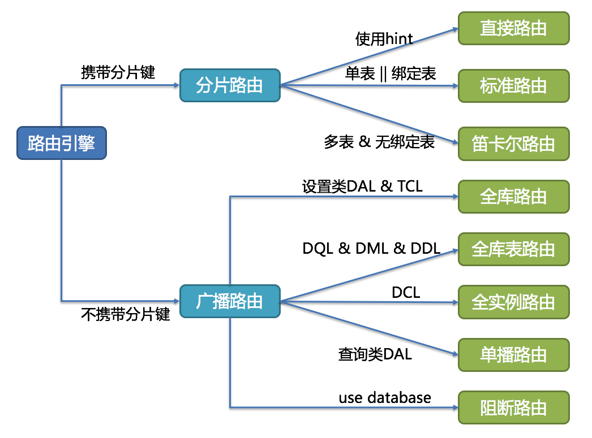

# [ShardingSphere](link)

* Sharding-JDBC 最早是当当网内部使用的一款分库分表框架
* 2017年的时候才开始对外开源，在大量社区贡献者的不断迭代下，功能也逐渐完善，现已更名为 ShardingSphere
* 2020年4⽉16⽇正式成为 Apache 软件基⾦会的顶级项⽬

## 版本

* Sharding-JDBC 1.0 只有数据分片
* Sharding-JDBC 2.0 支持数据库治理（注册中心、配置中心等等）
* Sharding-JDBC 3.0 分布式事务 （支持 Atomikos、Narayana、Bitronix、Seata）
* Sharding-JDBC 4.0

## Sharding-JDBC

* 分片算法
  - 精确分片算法（PreciseShardingAlgorithm）用于单个字段作为分片键，SQL中有 = 与 IN 等条件的分片，需要在标准分片策略（StandardShardingStrategy ）下使用
  - 范围分片算法（RangeShardingAlgorithm）用于单个字段作为分片键，SQL中有 BETWEEN AND、>、<、>=、<=  等条件的分片，需要在标准分片策略（StandardShardingStrategy ）下使用
  - 复合分片算法（ComplexKeysShardingAlgorithm）用于多个字段作为分片键的分片操作，同时获取到多个分片健的值，根据多个字段处理业务逻辑。需要在复合分片策略（ComplexShardingStrategy ）下使用
  - Hint分片算法（HintShardingAlgorithm）稍有不同，上边的算法中我们都是解析SQL 语句提取分片键，并设置分片策略进行分片。但有些时候我们并没有使用任何的分片键和分片策略，可还想将 SQL 路由到目标数据库和表，就需要通过手动干预指定SQL的目标数据库和表信息，这也叫强制路由
* 分片策略
  - 标准分片策略适用于单分片键，此策略支持 PreciseShardingAlgorithm 和 RangeShardingAlgorithm 两个分片算法
    + PreciseShardingAlgorithm 是必选的，用于处理 = 和 IN 的分片
    + RangeShardingAlgorithm 是可选的，用于处理BETWEEN AND， >， <，>=，<= 条件分片
    + 如果不配置RangeShardingAlgorithm，SQL中的条件等将按照全库路由处理
  - 复合分片策略，同样支持对 SQL语句中的 =，>， <， >=， <=，IN和 BETWEEN AND 的分片操作。不同的是它支持多分片键，具体分配片细节完全由应用开发者实现
  - 行表达式分片策略，支持对 SQL语句中的 = 和 IN 的分片操作，但只支持单分片键。这种策略通常用于简单的分片，不需要自定义分片算法，可以直接在配置文件中接着写规则
  - Hint分片策略，对应上边的Hint分片算法，通过指定分片健而非从 SQL中提取分片健的方式进行分片的策略
* 分布式主键
  - 可通过设置⾃增主键 初始值 和 步⻓ 的⽅式避免ID碰撞，但这样会使维护成本加大，乏完整性和可扩展性。如果后去需要增加分片表的数量，要逐一修改分片表的步长，运维成本非常高，所以不建议这种方式
  - 内置了UUID、SNOWFLAKE 两种分布式主键⽣成器，默认使⽤雪花算法（snowflake）⽣成64bit的⻓整型数据。不仅如此它还抽离出分布式主键⽣成器的接口，⽅便实现⾃定义的⾃增主键⽣成算法
* 广播表：存在于所有的分片数据源中的表，表结构和表中的数据在每个数据库中均完全一致。一般是为字典表或者配置表 t_config，某个表一旦被配置为广播表，只要修改某个数据库的广播表，所有数据源中广播表的数据都会跟着同步
* 绑定表：那些分片规则一致的主表和子表。比如：t_order 订单表和 t_order_item 订单服务项目表，都是按 order_id 字段分片，因此两张表互为绑定表关系
  - 通常在我们的业务中都会使用 t_order 和 t_order_item 等表进行多表联合查询，但由于分库分表以后这些表被拆分成N多个子表。如果不配置绑定表关系，会出现笛卡尔积关联查询，将产生如下四条SQL
  - 配置绑定表关系后再进行关联查询时，只要对应表分片规则一致产生的数据就会落到同一个库中，那么只需 t_order_0 和 t_order_item_0 表关联即可
* 和JDBC关系
  - JDBC 是一种 Java 语言访问关系型数据库的规范，其设计初衷就是要提供一套用于各种数据库的统一标准，不同厂家共同遵守这套标准，并提供各自的实现方案供应用程序调用
  - 想在 JDBC 层面实现数据分片就必须对现有的 API 进行功能拓展，而 Sharding-JDBC 正是基于这种思想，重写了 JDBC 规范并完全兼容了 JDBC 规范
  - 对原有的 DataSource、Connection 等接口扩展成 ShardingDataSource、ShardingConnection，而对外暴露的分片操作接口与 JDBC 规范中所提供的接口完全一致
* Sharding-JDBC 就必须对 SQL进行一些改造才能正常执行，流程
  - SQL 解析
    + 词法解析：将SQL拆解成不可再分的原子单元，根据不同数据库方言所提供的字典，将这些单元归类为关键字，表达式，变量或者操作符等类型
    + 语法解析：将拆分后的SQL转换为抽象语法树，通过对抽象语法树遍历，提炼出分片所需的上下文，上下文包含查询字段信息（Field）、表信息（Table）、查询条件（Condition）、排序信息（Order By）、分组信息（Group By）以及分页信息（Limit）等，并标记出 SQL中有可能需要改写的位置
  - 执⾏器优化：对SQL分片条件进行优化，处理像关键字 OR这种影响性能的坏味道
  - SQL 路由：通过解析分片上下文，匹配到用户配置的分片策略，并生成路由路径
    + 分片路由:有分⽚键的路由
      * 标准路由:最推荐也是最为常⽤的分⽚⽅式，它的适⽤范围是不包含关联查询或仅包含绑定表之间关联查询的SQL
        - 分片键运算符为 = 时，路由结果将落⼊单库（表）
        - 分⽚运算符是BETWEEN 或IN 等范围时，路由结果则不⼀定落⼊唯⼀的库（表），因此⼀条逻辑SQL最终可能被拆分为多条⽤于执⾏的真实SQL
      * 直接路由是通过使用 HintAPI 直接将 SQL路由到指定⾄库表的一种分⽚方式，而且直接路由可以⽤于分⽚键不在SQL中的场景，还可以执⾏包括⼦查询、⾃定义函数等复杂情况的任意SQL
      * 笛卡尔路由是由⾮绑定表之间的关联查询产生的，查询性能较低尽量避免走此路由模式
    + 广播路由:无分⽚键的路由
      * 全库表路由针对的是数据库 DQL和 DML，以及 DDL等操作,在所有分片库中对应的真实表内逐一执行
      * 全库路由主要是对数据库层面的操作,比如数据库 SET 类型的数据库管理命令，以及 TCL 这样的事务控制语句。对逻辑库设置 autocommit 属性后，所有对应的真实库中都执行该命令
      * 全实例路由是针对数据库实例的 DCL 操作（设置或更改数据库用户或角色权限）
      * 单播路由用来获取某一真实表信息，比如获得表的描述信息
      * 阻断路由:⽤来屏蔽SQL对数据库的操作,比如 `USE order_db;`不会在真实数据库中执⾏，因为 ShardingSphere 采⽤的是逻辑 Schema（数据库的组织和结构） ⽅式，所以无需将切换数据库的命令发送⾄真实数据库中
  - SQL 改写:将基于逻辑表开发的SQL改写成可以在真实数据库中可以正确执行的语句
    + 将分表配置中的逻辑表名称改写为路由之后所获取的真实表名称
  - SQL 执⾏:将路由和改写后的真实 SQL 安全且高效发送到底层数据源执行。但这个过程并不是简单的将 SQL 通过JDBC 直接发送至数据源执行，而是平衡数据源连接创建以及内存占用所产生的消耗，会自动化的平衡资源控制与执行效率
  - 结果归并:将从各个数据节点获取的多数据结果集，合并成一个大的结果集并正确的返回至请求客户端

## Sharding-Proxy

## Sharding-Sidecar

## 参考

* [快速入门分库分表中间件 Sharding-JDBC](https://mp.weixin.qq.com/s/-kulZVbzCYiiqV16yTP_0w)
