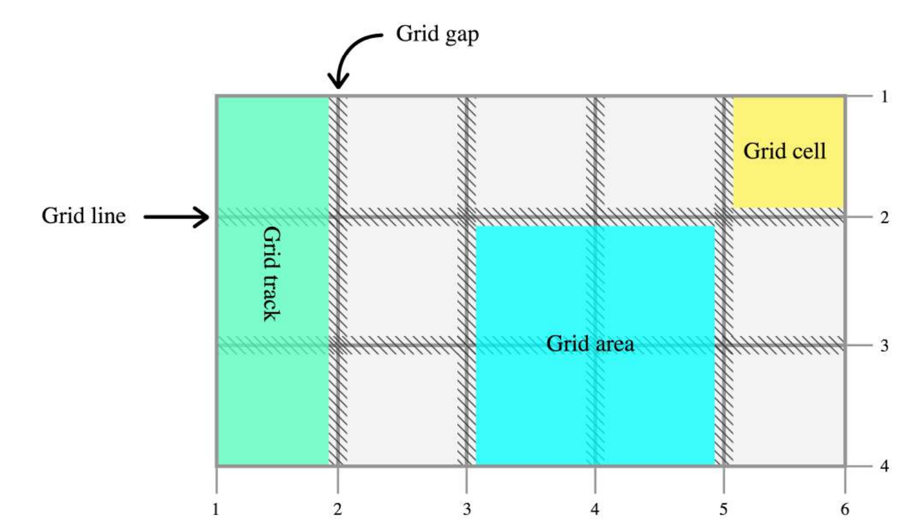

# Grid

将网页划分成一个个网格，可以任意组合不同的网格，做出各种各样布局

## 概念

* container：采用网格布局区域
* item：容器内部采用网格定位子元素，只能是容器的顶层子元素，不包含项目的子元素
* 水平区域称为"行"（row），垂直区域称为"列"（column）
* cell:行和列交叉区域
* grid line：划分网格的线，n行有n + 1根水平网格线，m列有m + 1根垂直网格线



## container 属性

* display:指定容器采用的网格布局，容器float、display: inline-block、display: table-cell、vertical-align和column等设置都将失效
  - grid：容器元素为块级元素
  - inline-grid：容器元素为行内元素
* grid-template-columns：定义每一列列宽，grid-template-rows：定义每一行行高
  - 绝对单位
  - 百分比
  - fr：（fraction）两列的宽度分别为1fr和2fr，表示后者是前者的两倍
  - minmax()函数产生一个长度范围，表示长度就在这个范围之中接受两个参数，分别为最小值和最大值
  - auto关键字表示由浏览器决定长度
  * 指定每一根网格线的名字，方便以后的引用,允许同一根线有多个名字
  * repeat()接受两个参数，第一个参数是重复次数，第二个参数是所要重复值
    + auto-fill：单元格的大小是固定的，但是容器大小不确定。如果希望每一行（或每一列）容纳尽可能多的单元格，可以使用auto-fill关键字表示自动填充
* grid-row-gap属性设置行与行的间隔（行间距）
* grid-column-gap属性设置列与列的间隔（列间距）
* grid-gap属性是grid-column-gap和grid-row-gap的合并简写形式,省略了第二个值，浏览器认为第二个值等于第一个值
* grid-template-areas:一个区域由单个或多个单元格组成,定义区域
  - 多个单元格合并成一个区域
  - 如果某些区域不需要利用，则使用"点"（.）表示
  - 每个区域的起始网格线，会自动命名为区域名-start，终止网格线自动命名为区域名-end
* grid-template属性是grid-template-columns、grid-template-rows和grid-template-areas这三个属性的合并简写
* grid-auto-flow:子元素会按照顺序，自动放置在每一个网格。默认的放置顺序是"先行后列"
  - row:默认值
  - column:先列后行
  - row dense:尽可能紧密填满，尽量不出现空格
  - column dense:尽可能紧密填满，尽量不出现空格
* justify-items属性设置单元格内容水平位置（左中右），align-items属性设置单元格内容垂直位置
  - start：对齐单元格起始边缘
  - end：对齐单元格的结束边缘
  - center：单元格内部居中
  - stretch：拉伸，占满单元格的整个宽度（默认值）
* place-items属性是align-items属性和justify-items属性的合并简写
* justify-content属性是整个内容区域在容器里面的水平位置（左中右），align-content属性是整个内容区域的垂直位置（上中下）
  - start - 对齐容器的起始边框
  - end - 对齐容器的结束边框
  - center - 容器内部居中
  - stretch - 项目大小没有指定时，拉伸占据整个网格容器
  - space-around - 每个项目两侧的间隔相等。所以，项目之间的间隔比项目与容器边框的间隔大一倍
  - space-between - 项目与项目的间隔相等，项目与容器边框之间没有间隔
  - space-evenly - 项目与项目的间隔相等，项目与容器边框之间也是同样长度的间隔
* place-content属性是align-content属性和justify-content属性的合并简写
* 在现有网格外部定项目指位置:grid-auto-columns属性和grid-auto-rows属性用来设置，浏览器自动创建多余网格的列宽和行高
* grid属性是grid-template-rows、grid-template-columns、grid-template-areas、 grid-auto-rows、grid-auto-columns、grid-auto-flow这六个属性的合并简写形式

## 项目属性

* 项目位置是可以指定项目四个边框
  - grid-column-start属性：左边框所在垂直网格线
  - grid-column-end属性：右边框所在垂直网格线
  - grid-column属性：grid-column-start和grid-column-end合并简写
  - grid-row-start属性：上边框所在的水平网格线
  - grid-row-end属性：下边框所在的水平网格线
  - grid-row属性：grid-row-start属性和grid-row-end合并简写
  - 值：在哪根网格线｜网格线名字
  - span：左右边框（上下边框）之间跨越多少个网格
  - 产生项目重叠，则使用z-index属性指定项目的重叠顺序
* 项目都没有指定位置，浏览器自动布局，这时它们的位置由容器的grid-auto-flow属性决定，这个属性的默认值是row，因此会“先行后列”进行排列
* grid-area:指定项目放在哪一个区域
* grid-area属性还可用作grid-row-start、grid-column-start、grid-row-end、grid-column-end的合并简写形式，直接指定项目的位置
* justify-self属性设置单元格内容的水平位置（左中右），跟justify-items属性的用法完全一致，但只作用于单个项目。
* align-self属性设置单元格内容垂直位置（上中下），跟align-items属性的用法完全一致，也是只作用于单个项目。
* place-self属性是align-self属性和justify-self属性的合并

```css
.item-1 {
  grid-column: 1 / 3;
  grid-row: 1 / 2;
}
```

## 参考

* [learncssgrid](https://learncssgrid.com/)
* [Grid 布局教程](http://www.ruanyifeng.com/blog/2019/03/grid-layout-tutorial.html)
