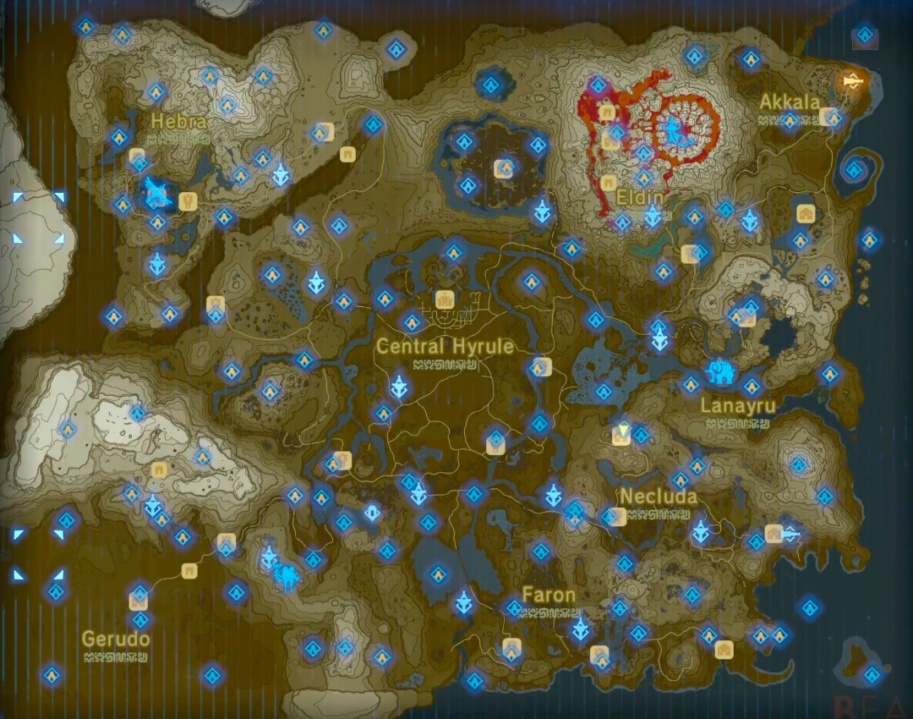
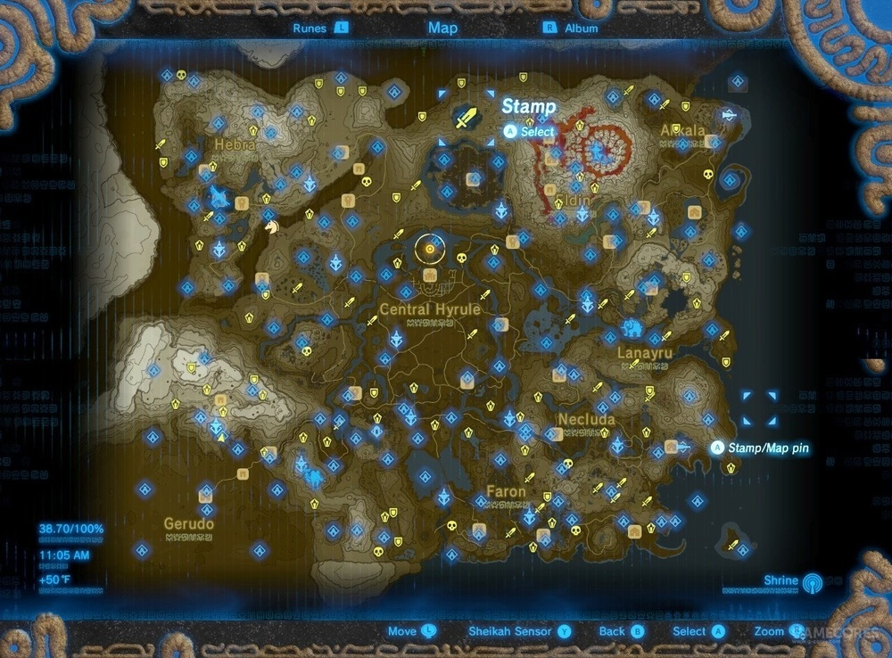
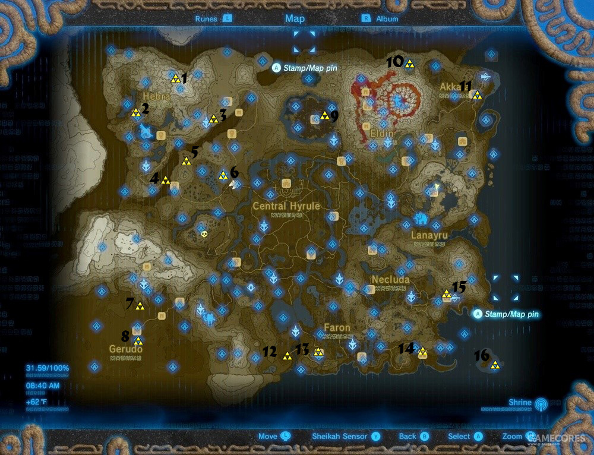

## 任天堂 Nintendo Switch

* 北京时间2016年10月20日晚10时，任天堂正式公布了它的第八代家用主机——Nintendo Switch
* 触屏和体感，是最符合人类直觉的操控方式，任何人都能最快上手，是游戏人群扩大化的关键
    - Joy-Con的绝妙之处:允许玩家在任何地点用任何姿势来玩游戏，既满足了最沉迷游戏的玩家的需求，又可以分享一个Joy-Con给任何会玩或者不会玩游戏的人一起享受游戏的乐趣
        + 分开来是两个功能完整的经典手柄，又是拥有HD震动和IR摄像头的升级体感棒
        + 合在一起是按键繁多的专业手柄，又是双手体感控制器
        + 插在主体上变成掌机的按键，拔下来变成手柄的两半
* 不锁区，香港能够成为首发地区，而且首发还有中文游戏
* 游戏
    - 堡垒之夜
    - 超级马里奥：奥德赛
    - 马力欧网球 ACE
    - 马里奥赛车
    - 乌贼2
    - 怪物猎人XX
    - DQ
    - 雪之刹那
    - 魔界战记
    - FIFA
    - NBA
    - 我的世界
    - 喷射战士2 Splatoon2
    - 莱莎的炼金工房
    - 异度之刃2（Xenoblade 2）
    - 星之卡比
    - 超级炸弹人R
    - 《上古卷轴5：天际 The Elder Scrolls V : Skyrim》：PC、PS4、Xbox One，2017年11月18日登陆Nintendo Switch
    - 任天堂明星大乱斗：特别版
    - 最终幻想Ⅻ：黄道年代
    - 最终幻想15
    - 最终幻想10/10-2
    - 精灵宝可梦 皮卡丘/伊布
    - Atelier Lydie & Suelle - The Alchemists and the Mysterious Paintings
    - Fitness Boxing
    - Arms：格斗游戏爱好者，体感游戏爱好者
    - 1-2 Switch：Party 游戏爱好者，体感游戏爱好者，用 Joy-con 体感进行两人游戏，有数十个小游戏组成，比如转盘子，拔枪，挤牛奶等等。
    - JUST DANCE（舞力全开）
    - 薄暮传说：终极版
    - 战场女武神4
    - 国王之心
    - 勇者斗恶龙
    - 火焰之纹章：风花雪月
    - 八方旅人（OCTOPATH TRAVELER）
    - 噗呦噗呦VS俄罗斯方块
    - oxenfree
    - 巫师3·狂猎
    - 煮糊了/分手厨房 Overcooked
    - 星际战甲
    - 猎天使魔女
    - 晶体管
    - 苍翼默示录
    - 耀西的手工世界
    - 生化危机启示录2
    - 铲子骑士—死神
    - 猎天使魔女1+2
    - Island Saver
    - 空洞骑士
    - 火炬之光 2
    - 《龙珠斗士Z》：联网需会员
    - 文明6
    	+ 控制一个文明，然后不断发展、扩张的过程。在游戏里玩家可以控制任一地球上知名的文明，流程上模拟真实世界的发展。游戏中既可以在情景模式下于特定的场景和过关条件下挑战自己，也可以自定义地图规模、所参与的文明和所处时代后逐步发展自己的文明。由于一代代的积累进步，很多地方已经相当拟真，对历史一些奇观、文明的见解也很独到，使得代入感很强。
    - 集合啦！动物森友会
        + 典型的箱庭探索游戏:飞机来到这个无人岛，马上就会发现岛上有果树、石头，花丛里有昆虫，水里有鱼，地下还有化石。水果可以吃，木材和石头可以造成家具，昆虫和鱼可以放进博物馆。还有动物朋友每天跟你打招呼，互赠礼物
        + 经济系统:岛上的物产全都可以卖钱，探索小岛的过程还可以积攒里程。钱和里程可以用来扩大房子规模，还可以兑换各种各样的奖励，包括衣服、家具、各种装饰。以及还有大头菜“期货交易”系统，你可以周日低价收购大头菜，之后价格不断波动，你可以找到一个相对的价格高点，抛售赚钱。
        + 彩蛋设计
        + 游戏里的日期和时间与现实完全同步，有同样的日夜和四季交替
        + 创作系统:通过像素画的方式设计图案，然后将这些图案以画作的形式摆在画架上、挂在墙上，还可以印在地上、做成墙纸、设计成衣服、帽子……你还要自己写一首曲子作为你们的“岛歌”，自己设计你们的“岛旗”。
* 配件
    - 买单机标配，不要买套餐
    - 保护包
    - 钢化膜
    -128g的内存卡
    - 多人玩可买多一副joy手柄，自己玩买多副pro手柄
    - Pro手柄支持 steam

```
# errorcode
2155-8007

# dns
203.080.096.010
218.102.023.228

114.114.114.114或者8.8.8.8
```

###  塞尔达传说：荒野之息

* 有哪个公主，要逼着自己在母亲的葬礼上都不能哭泣？
* 有哪个公主，从幼年开始就要被迫在没有指引的条件下学习她一无所知的本领？
* 有哪个公主，17岁生日时的庆祝方式是跑去拉聂耳山泡冰水修行？
* 有哪个公主，连自己喜欢的事情都不能去做，十年如一日承载着可怕的压力苦修苦练却一无所获，还要被下人嘲讽成花瓶？
* 有哪个公主，在经历了这一切后，在出于一腔热忱的研究产物最后害死了父亲、国民和自己召集而来的战友们后，在终于扑进近卫骑士怀里嚎啕大哭之后，只身一人，提着驱魔之剑从狼藉的战场走到克洛格森林，然后独自前往城堡，对抗灾厄百年？
* 所以她会在开始时对林克那样疏远，一个承载了太多期待、却如何努力也不能回应这份期待的一国公主，连亲生父亲都在无休止地给她施加压力，身边却突然出现了一个同年龄的不世出天才，不难理解，这种感觉既讽刺又让人窝火。长久的压力，甚至在她最后感受到预兆（日记最后一页）时，都没有勇气告诉其他人，因为她是一个“无能”的公主。
* 这样的一个少女，维持了百年的脆弱和平，我操纵着林克游山玩水爬树摸鱼的每一分每一秒，她都在用历代最强的三角力量与盖侬斗争，甚至没办法像林克一样获得失去记忆的这份仁慈，她一直、一直在战斗，也一直、一直注视着林克，并且无法忘记任何事情。
* 习惯
    - 一开始就找克克洛
    - 开启怪物商店
* 耐热服密码：GSC◆
* 东部格鲁德遗址: 逗号 V O 两个点 半个影风车 中间挖了个圈的水滴 暂停
* 石块加一个金属块：两块拼图造型一样
* 完成率计算
* 四个主线迷宫 = 0.08% x 4 = 0.32%
* 克洛格的果实（Korok Seeds） = 0.08% x 900 = 72%
* 神庙（Shrine）= 0.08% x 120 = 9.60%
    - 神庙挑战Shrine Quests（42个） 以“序号. 任务名称：接任务地点 - 任务发布NPC，备注” 的方式按游戏内任务列表顺序一条条列出来
        - The skull's eye - akkala ancient tech lab - Jerrin
        - Into the vortex - rist peninsula – Stone Tablet，地图最东边漩涡形陆地
        - Trial of the labyrinth - lomei labrinth island - ???， 大地图三大迷宫之一，最东北海岛
        - The spring of power - east akkala stable - Nobo
        - The gut check challenge - gut check rock - Bayge， 火山正北，很明显的地标
        - A brothers roast - goron city - Bladon
        - A landscape of a stable - foothill stable - Mayro
        - The perfect drink - east barrens - Pokki， 沙漠东南，神庙门口接任务
        - Test of will - mount nabooru - Bayge，Gerudo Highlands最东边，Gerudo峡谷北侧
        - Sign of the shadow - gerudo tower - Kass
        - The silent swordswoman - gerudo town - Laine
        - The desert labyrinth - south lomei labyrinth - ???，大地图三大迷宫之一，沙漠东南
        - The seven heroines - gerudo town – Rotana
        - The eye of the sandstorm - kara kara bazaar - Nobiro，沙漠绿洲小镇
        - Secret of the snowy peaks - mount granajh – Mountain Peak Log，Gerudo地区东南雪山顶，调查小屋废墟中笔记触发
        - The undefeated champ - sand seal rally - Tali，沙漠主线完成后，Gerudo Town正南
        - Watch out for the flowers - hylia river - Magda
        - The three giant brothers - mount taran – Stone Tablet，East Necluda山地地区
        - Secret of the cedars - hateno village - Clavia
        - The cursed statue - fort hateno - Calip，Fort hateno城墙东边小屋内
        - A fragmented monument - palmorae ruins - Garini，大陆东南角，Lurelin Village东边
        - The stolen heirloom - kakariko village – Paya, 完成kakariko village所有支线任务触发
        - Guardian slideshow - puffer beach - Loone，Faron地区南边海岸
        - A song of storms - calora lake - Kass，Faron地区
        - The serpent's jaws - pagos woods - Kass，Faron地区，Highland Stable沿路往东北走，在路边可以遇到Kass
        - Stranded on eventide - eventide island - ???，地图东南的孤岛
        - The bird in the mountains - rito village - Molli
        - Recital at warbler's nest - rito village - Kheel，支线任务28中触发
        - The ancient rito song - rito village - Bedoli
        - Trial on the cliff - north lomei labyrinth - ???，大地图三大迷宫之一，Hebra东北
        - The spring of wisdom - hateno village - Medda
        - The ceremonial song - zor'as domain - Laruta
        - The crowned beast - rabia plain - Kass，Lanayru Tower东南，河对岸
        - Master of the wind - horon lagoon - Kass，Lanayru地区最东侧
        - The lost pilgrimage - korok forest - Tasho
        - The two rings - west hyrule plains – Kass，Ridgeland南部平原，Jeddo Bridge桥北
        - Shrouded shrine - typhlo ruins - ???，Korok Forst北边森林，地图上很明显
        - Under a red moon - hyrule ridge - Kass，Tabantha Bridge Stable南部山地上
        - Cliffside etchings - tabantha bridge stable - Geggle
        - Trial of second sight - korok forest - Zooki
        - The test of wood - korok forest - Damia
        - Trial of thunder - thundra plateau - ???，Ridgeland Tower西边一直下雨的地方

        - 骷髅的左眼——阿卡莱古代研究所——洁琳
        - 前往漩涡状中心——马秋兹半岛——古老的石版
        - 孤岛的试炼——洛美岛——奇异的声音
        - 力量之泉的传说——东阿卡莱驿站——诺波坦
        - 鼓隆的毅力崖挑战——毅力崖——巴恺忒
        - 弟弟在何方？——鼓隆城——布莱顿
        - 驿站的风景画——山麓驿站——桑伏
        - 寻求玉液琼浆......——东格鲁德——帕可忒
        - 比耐力——娜波露山——巴恺忒
        - 去影子指示的地方——格鲁徳之塔——卡西瓦
        - 不会说话的剑士——格鲁徳小镇——拉亦娜
        - 沙漠的试炼——南洛美城堡遗迹——奇异的声音
        - 七位英雄——格鲁徳小镇——罗汀
        - 消失的沙尘暴——卡拉卡拉集市——诺比尔
        - 雪山的日志——摩尔迦娜山——雪山的日志
        - 不败的女王——沙海象拉力赛报名处——帕弗宇
        - 不要践踏花儿——海利亚河——奥可芭
        - 巨人三兄弟的秘密——泰尔美山——古老的石板
        - 三棵杉树的秘密——哈特诺村——可莱维亚
        - 被诅咒的石像——哈特诺堡垒——卡里尤
        - 寻找石碑碎块——雅西诺遗迹——利迦尼
        - 被盗的宝珠——卡卡利科村——帕雅
        - 想见见守护者！——帕发海岸——柳奈
        - 闪电开启的试炼——克拉尔湖——卡西瓦
        - 吞食巨蛇的龙——思古兰特树海——卡西瓦
        - 野外的试炼——塞哈特诺岛——奇异的声音
        - 高耸入云的山上有棵参天大树——利特村——桃虹
        - 利特的兄弟岩——利特村——奇尔
        - 利特的诗谜——利特村——蓓拉
        - 断崖的试炼——北洛美城堡遗迹——奇异的声音
        - 探索拉聂尔山的宝贝！——哈特诺村——西默茨凯
        - 英杰祭祀诗——卓拉领地——鲁拉曲
        - 两杆枪野兽——阿拉布平原——卡西瓦
        - 御风拓路者——荷隆湾——卡西瓦
        - 最初的试炼——克洛格森林——泰奇奥
        - 两个环——西还拉鲁平原——卡西瓦
        - 黑暗的试炼——德依布朗遗迹——奇异的声音
        - 红月之夜——海拉鲁丘陵——卡西瓦
        - 绝壁花纹——塔邦挞大桥驿站——果戈
        - 操控力的试炼——克洛格森林——阿兹基
        - 不燃烧的试炼——克洛格森林——达秘达米
        - 雷鸣的试炼——雷之台地——奇异的声音
    - 全支线任务
        * Robbie’s Research：Hateno Ancient Tech Lab - Purah 主线自动触发
        * From the Ground Up：Hateno Village - Hudson 支线任务7接受后获得
        * A Parent’s Love：Tarrey Town - Ruli 支线任务2完成后解锁，夜晚触发
        * Hobbies of the Rich：Tarrey Town - Hagie 支线任务2完成后解锁
        * A Shady Customer：East Akkala Stable - Hoz 解锁怪物商店
        * Little Sister’s Big Request：South Akkala Stable - Jana
        * Hylian Homeowner：Hateno Village - Bolson 神庙西南方过桥后的空房后面
        * The Statue’s Bargain：Hateno Village - Horned Statue 和一个恶魔石像对话，解锁血和体力重新分配
        * A Gift for My Beloved：Hateno Village - Manny
        * The Weapon Connoisseur：Heteno Village - Nebb，雨天不在，跑来跑去的小男孩
        * The Sheep Rustlers：Hateno Village - Koyin
        * Sunshroom Sensing：Hateno Ancient Tech Lab - Symin 任务13完成后解锁
        * Slated for Upgrades：Hateno Ancient Tech Lab- Purah 主线自动触发
        * Sunken Treasure：Lurelin Village - Rozel
        * What’s For Dinner?：Lurelin Village - Kiana
        * Take back the sea：Lurelin Village - Sebasto
        * Koko’s Kitchen：Kakariko Village - Koko
        * Cooking with Koko：Kakariko Village - Koko 任务17后续任务
        * Koko Cuisine：Kakariko Village - Koko 任务18后续任务
        * Koko’s Speciality：Kakariko Village - Koko 任务19后续任务
        * Playtime with Cottla：Kakariko Village - Cottla
        * By Firefly’s Light：Kakariko Village - Lasli 武器店门口招揽生意的女孩，夜晚去她家
        * Flown the Coop：Kakariko Village - Cado
        * The Priceless Maracas：West Necluda - Hestu，Kakariko Village东南方路边
        * Arrows of Burning Heat：Kakariko Village - Rola
        * Stalhorse: Pictured!：Snowfield Stable - Junnelle, Hebra Tower东北马厩
        * A Curry for What Ails You：Rito Stable - Lester, Rito Village东部村口马厩
        * Find Kheel：Rito Village - Amali 开启一个神庙任务
        * Face the Frost Talus：Rito Village - Gesane 村口巡逻守卫
        * The Apple of My Eye：Rito Village - Juney
        * The Spark of Romance：Rito Village - Jogo
        * The Jewel Trade：Goron City - Ramella
        * Death Mountian’s Secret：Goron Hot Springs - Dugby，Goron City东南
        * The Road to Respect：Goron City - Fugo
        * Fireproof Lizard Roundup：Southern Mine - Kima, Goron City南面, 奖励破炎者胸甲
        * Balloon Flight：Woodland Stable - Shamae, Woodland Tower 南面
        * The Thunder Helm：Gerudo Town - Riju，本城主线完成后解锁，调查王座旁头盔
        * The Search for Barta：Gerudo Town - Liana，完成任务37的必要支线
        * Medicinal Molduga：Gerudo Town - Malena，完成任务37的必要支线
        * The Eighth Heroine：Gerudo Desert - Bozai，Gerudo Town门口，需女装触发
        * The Mystery Polluter：Gerudo Town - Dalia，完成任务37的必要支线
        * The Secret Club’s Secret：Gerudo Town - Greta，服装店后门，可购买新服装
        * Tools of the Trade：Gerudo Town - Isha，珠宝店开启任务
        * The Forgotten Sword：Gerudo Desert - Bozai，支线40后续任务，仍须女装
        * Missing in Action：Gerudo Canyon Stable - Sesami，Gerudo Town东北马厩
        * Rushroom Rush!：Gerudo Canyon Stable - Pirou
        * Good-Sized Horse：Gerudo Canyon - Zyle，Gerudo Canyon Stable东北，路边
        * An Ice Guy：Kara Kara Bazaar - Guy，Gerudo Town东北绿洲
        * A Freezing Rod：Great Hyrule Forest，Kula，Korok森林
        * The Korok Trials：Great Hyrule Forest，Chio，Korok森林，解锁三个神庙
        * Riddles of Hyrule：Great Hyrule Forest - Walton, 大树顶部
        * Legendary Rabbit Trial：Great Hyrule Forest - Peeks
        * Special Delivery：Bank of Wishes - Finley, Zora's domain西南岸边
        * Lynel Safari：Zora's Domain - Laflat, 完成Zora's domain主线后解锁，奖励Zora腿甲
        * The Giant of Ralis Pond：Zora's domain - Torfeau
        * Frog Catching：Zora's domain - Tumbo
        * Zora Stone Monuments：Zora's domain - Jiahto
        * Diving is Beauty!：Zora's domain - Tumbo
        * Luminous Stone Gathering：Zora's domain - Ledo
        * A Wife Washed Away：Zora's domain - Fronk
        * A Gift from the Monks：Ancient Shrine - Monk，全神庙完成后自动触发
        * The Hero’s Cache：Kitano Bay - Kass，Hateno Village南边海岸
        * Misko, the Great Bandit：Dueling Peaks Stable - Domidak，双子峰东边马厩
        * Wild Horses：Dueling Peaks Stable - Rensa
        * A gift of Nightshade：Yambi Lake- Wabbin, Lurelin Village西南的山顶
        * Hunt for the Giant Horse：Mounted Archery Camp - Straia，Lake Tower南部
        * The horseback Hoodlums：Highland Stable - Perosa
        * Thunder Magnet：Lakeside Stable - Cima，奖励橡胶腿甲
        * A Gift for the Great Fairy：Tabantha Bridge Stable - Toren , Tabantha Tower东南马厩，不需要这个任务也可以去开启那个Fairy Fountain
        * Leviathan Bones：Serenne Stable - Akrah，Ridgeland Tower北边马厩
        * The Royal Guard’s Gear：Riverside Sable - Parcy，Central Hyrule东南马厩
        * A Royal Recipe：Riverside Sable - Gotter
        * Riverbed Reward：Wetland Stable - Izra，Central Hyrule东部马厩
        * My Hero：Outskirt Stable - Aliza，Central Hyrule西南马厩
        * A Rare Find：Outskirt Stable - Trott
        * The Royal White Stallion Outskirt Stable：OutSkirt Stable - Toffa
* 地点探索 = 0.08% x 226 = 18.08%
* 全服装
    - Hylian套装：Kakariko Village/Hateno Village防具店购买
    - Stealth套装：Kakariko Village防具店购买，潜行加成
    - Soldier's 套装：Kakariko Village防具店购买
    - Gerudo套装：Gerudo Town主线剧情获得，抗热加强
    - Climbling套装：分别在Ree Dahee Shrine(双峰山之间，北山山脚下), Chaas Qeta Shrine（Necluda Sea小岛上）,Tahno O’ah Shrine（Mount Lanayru东坡），爬山速度加强
    - Zora套装：胸甲主线获得，头在Toto Lake水底，腿甲在Zora domain主线之后，完成新给出的Lynel Safari支线任务，奖励获得（支线任务54）
    - Snowquill套装：Rita Village防具店购买
    - Desert Voe套装：Gerudo Town Secret club购买（支线任务42）或者Tarrey防具店购买（完成村子建造支线任务）
    - Flamebreaker套装：Goran City防具店购买，防火加强（胸甲完成Southern Mine抓防火蜥蜴的支线任务也会作为奖励获得，支线任务35）
    - Radiant套装：Gerudo Town Secret club购买（支线任务42），夜晚会有荧光效果
    - Ancient套装：完成Akkala Ancient Tech Lab相关支线后可以购买
    - Rubber套装：完成三个雷电相关支线任务和神庙后获得，分别是Thundra Plateau（RidgeLand Tower西边）的 Trial of Thunder神庙任务，Calora Lake（Faron Tower东边）附近Kass给的A Song of Storms神庙任务和Lakeside Stable（Faron Towe南边）的Thunder Magnet任务（支线任务68）。电抗性增强
    - Barbarian套装：完成三个大地图迷宫试炼（地图上非常显眼），在各自的神庙里作为奖励获得，攻击上升
    - Wild套装：经典套装，完成120个神庙之后获得
    - Dark套装：黑暗林克套装，夜晚在Fang and Bone商店购买（支线任务5完成解锁），夜晚速度增强，NPC会提防你
    - Snow boots & Sand boots：完成Gerudo Town正门眼镜男相关任务（支线任务40，44）
    - Champion's Tunic：主线找到一个记忆后回到Kakariko Village与Impa对话获得
    - Thunder Helm：完成Gerudo Town主线，帮助Gerudo Town所有需要帮助的市民（支线任务37），之后去宫殿检查女王手边的Thunder Helm，女王会“借”给你，免疫打雷
    - 另外Gerudo Town珠宝店完成相关支线之后可以买各种抗性的耳坠和头饰，夜晚在Fang and Bone可以买各种伪装的面具
* 马匹
    - White horse：Central Tower西南的Outskirt Stable任务The Royal White Stallion
    - Giant Horse：Lake Tower南部Mounted Archey Camp任务Hunt for the Giant Horse
    - Stalhorse：Hebra Tower东北Snowfield stable完成相关任务Stalhorse:pictured！
    - Lord of the Mountain：夜间Satori Mointain山顶湖边出现
    - 另外其实野外很多生物都能乘骑，但是只要不是马类都无法在stable注册
    - 获得个体值高的马匹：自己测试并没有抓到过个体值555的马匹（但无法证明是否存在满个体的马， 可能只是自己RP不好），但是13颗星个体值的马匹非常容易获得。具体就是在上述任务中Giant Horse的位置，那群马里至少有一匹13星的马，请挨个找纯色马试一下，体力5 的一定是13星的。你可以直接从那个位置右上的神庙反复传送来刷想要的颜色。
* 马具收集：
    - Royal Bridle and Saddle：完成上面提到的The Royal White Stallion任务后获得
    - Monster Bridle and Saddle：夜晚在Fang and Bone买到
    - Extravagant Bridle and Saddle：完成Lake Tower东南部Highland Stable障碍挑战
    - Knight's Bridle and Saddle: 完成Lake Tower南部Mounted Archey Camp骑射挑战
* 马神：用来复活马匹（是的，你的马是会死的），从上面提到的Highland Stable和Mounted Archery Camp 之间的岔路沿路往东南走到头就是。
* boss:在Fang and Bone询问关于怪兽的情况，可以明确得知地图中一共有40只Hinox，40只Talus和4只Moduga(均包含亚种)，并且也可以知道自己目前讨伐的数量。Lynel虽然比他们都强，但没有长血条不属于Boss范畴。另外讨伐全部三种boss之后回到Fang and Bone对话会得到相应的三个奖章，属于关键道具
* 全图鉴:收集全图鉴后会得到一个关键道具“绝密信封”，描述为“漂亮女子照片”！但是！但是并没有真正方法看这张照片.可以在Hateno Ancient Tech Lab找Symin买照片
* 全小游戏
    - 盾牌滑雪
    - 滑翔翼射箭
    - 雪球保龄
    - 高尔夫
    - 赛跑
    - 滑翔翼（距离）
    - 送冰块
    - Sand-Seal比赛
    - Korok试炼
    - 攀岩
    - 传火
    - 骑射
    - 赛马 跳杆
    - 赌博
    - 猎鹿
    - 滑翔翼（钻圈）
* 刷Star Fragment
    - 建议刷法是等满月时站在高处（比如双子峰顶）望向月亮，每晚9：00pm-3:00am会从月亮大致方向落下一颗流星，非常明亮，标记掉落位置过去收集即可。建议满月当晚存档，如果没看见的话重启游戏读档即可。另外每8天一个满月，想快速刷的话在山顶点个篝火连续睡八个晚上就行
* 刷龙鳞、龙爪、龙角、龙牙
    - 每天睡到早晨，在下列地点守株待兔，一是离传送点近，二是不用等太久，三是位置好。三条龙基本都是在早上6点左右到达下述位置。
    - Farosh：Faron地区，Lakeside Stable东北Floria Bridge上等候。
    - Dinraal：Hebra南部，Tabantha Bridge Stable西侧Tabantha Great Bridge上等候。
    - Naydra：Lanayru地区，传送到Hateno Tower正北Lanayru Promenade的Dow Na'eh Shrine，游到神庙前瀑布顶端峭壁上等候
* 后期想打强怪的话建议先把战士装升上去，因为素材容易获得而且防御很高。同等防御等级的还有古代套装和荒野套装，但是两套都不太好获取/升级。另外防御最高的单件是Champion's Tunic，获得容易，升级也还不算困难，特殊效果也不错。其他装备能升就升，但是基本都是有需求了再换出来






## [星露谷物语 Stardew Valley](https://www.stardewvalley.net/)

* 版本
    - Switch：可开启会员进行在线合作
    - Stream
* 主线
    - 种植
        + 前期10点前浇完地，下雨天去挖矿
        + 每周五可以在那里找一个黑精灵买铱制洒水器，一个可以浇24格
        + 远古种子：随机在种子制造机中放入任何种子都有小概率磨出的特殊种子。28天后出远古果子，之后每8天会收获一次，将收获得来的远古果实直接丢进种子制造机换取更多的远古种子。拿去酿酒 古代种子（蓝色袋子样子）种温室里，长成后，果实扔种子生产机，制作出古代种子，直接种，很快就可以种满温室。下矿挖出来不能直接种，要制作成可以种的
        + 稀有种子(Wild Seeds)：稀有种子只有旅行商人会出售，24天后长成宝石甜莓（Sweet Gem Berry），送给秘密森林的老坎诺利大师以获得星之果实，将宝石甜莓放入种子生产器也可以获得稀有种子
        + 老师傅香炸奶酪卷，追求最甜的味道：老师傅雕像需要用宝石甜莓献祭，获得星之果实，提高生命力上限制
        + 温室:星星果\酒花 远古果 蓝莓
    - 建设：建筑。获取木头 石头 杂草
    - 养殖
    - 钓鱼:
        + 菜种上就钓，有体力就一直钓， 金星钓
        + 鲟鱼 夏天 矿石湖
    - 挖掘：升级装备
        + 矿洞开启就可以去了
        + 优先升级铜水壶（一次性给多个作物浇水），再钢斧头，斧头尽快三级，去神秘森林拿硬木。需要矿洞40层拿铁矿
        + 安装洒水器：自动浇水，游戏中的洒水器分铜铁铱三种，最高级的铱洒水器可以给24格植物浇水
        + 建设水井：物资很少，游戏前期就能做。最神奇的是，水井建设完毕后还找木匠移动
        + 挖的矿能攒就攒攒，后期有个宝石复制机用的上
        + 沙漠矿洞，准备好多好多组梯子，直接下到100—200层，直接拿炸弹炸，会出五彩碎片和很多铱矿石
    - 送礼物不能停，获取好感：看商店公告，最近谁生日，尤其生日送
        + 威利好感度达到九心后会给龙虾浓汤配方，能加3钓鱼，而且持续时间长，制造简单，简直就是钓鱼神器
        + 纳斯三心好感会给生鱼片配方
    - 动物早晚开关门（（冬季雨天除外）
    - 每季最后一天把地整理出来
    - 酿造
        + 啤酒是一天一瓶，一瓶300金。啤酒的收益是全游戏最高的收益，不过要每天收，很累。后面可以慢慢换成上古水果
        + 酒桶　放在牛棚里面
* 策略
    - 优先生产物资
    - 不要全卖，合成箱子，存储
    - 每季种子可以合成，不用购买
    - 有块其他人种的自留地，可以一直薅羊毛
    - 要想富，先砍树。没事砍树先把海边上那个桥修了先，需要300木。修完捡点珊瑚啥的
    - 优先升级铜水壶，再钢斧头，斧头尽快三级，去神秘森林拿硬木。需要矿洞40层拿铁矿
    - 优先建马厩 ，需要100硬木。跑得快节省很多时间
    - 前期没体力可以吃鱼，买鱼汤喝。没事捡点水果给莱纳斯流浪汉，三星给生鱼片，能回75血，很不错的。还可以泡温泉 ，最好每天回去睡觉的时候都是没体力的，剩下的砍树啊啊啊啊啊啊啊…前期累点是为了后期的美好生活
    - 周五和周日可以去猪车，买点献祭需要的东西，稀有种子买一个，种出宝石甜莓，好了去给神秘森林雕像可以增加体力上限。钓鱼会钓到远古种子，28天成熟，7天结一次果，看情况种
    - 多种点npc喜欢的作物，刷好感，有事没事（就是冬天）送礼去。因为第二年爷爷回魂时，雕像需要点蜡烛，好感度高可以加分
    - 社区中心收集自己看季节安排，首要温室，其次巴士，其它别鸟，后期松松搞定。最好第一年冬天就有温室，冬天可赚钱，本答主夏天的时候金星甜瓜都交了却忘了普通甜瓜，猪车奸商也不卖，只好第二年夏天交，很糟心～
    - 第二年春复活节买120减去6个铱洒的位置=114个草莓种，种温室，七天一结，做27个酒桶放温室上方铺好地板的蝙蝠洞里，后期可在其它地方故更多，把酿酒剩下的草莓卖了，直接赚翻，没完，远古种子挖出来后结的果放种子机复制种子，替掉温室草莓，越替越快，替完，远古酿酒流成立，坐享清福。
    - 草莓和远古种温室赚钱最快，其它的不是特殊情况就在温室外边呆着吧，别占地方～
    - 除了酒流，还有猪流，鸡舍牧舍，如果你不是很想养动物，白白，做完收集包直接卖掉，买猪！只盖大牧舍，只买猪！放养，捡松露(莉亚最爱)，做松露油(我夫最爱！)卖掉，直接赚翻(除了冬天)
    - 关于矿洞，前期别刷史莱姆，等沙漠紫剑，刷死它们。前期一定把钓鱼等级拉满前期不要大幅度装饰农场，后期富了你会考虑全面翻修，麻烦
    - 法师塔有换装魔法，4心解锁，不过最好一开始就认真换装
    - 浇水，澡堂，矿洞三点一线日程，第一年很实用
    - 放冰箱里一个彩虹贝壳(夏天沙滩)和十个甜菜(沙漠买种子)，有用
    - 成就只是为了能买更多帽子，不是特别想要的帽子就别鸟成就
    - 春雨天早上起来就去河边钓鲶鱼，秋雨天晚上12点别回家，去河边钓大眼鱼，别问为什么。
    - 前期烧金条卖掉，赚钱！
    - 结婚后别送其它单身狗礼物
    - 前期就是升级，赚钱！有等级钱来得快，有钱一切轻松坐享清福，恩爱永远，和家欢乐！
    - 如果不打算养孩子别给房子二次升级，空的婴儿房看起来扎眼。
    - 铱矿没啥用，不值钱，不用搞太多
    - 镇长挺可怜的，多坑坑他，他的紫色短裤秋日会展上可循环利用。
    - 新手别选河边农场，好看的像个花瓶，但花瓶装不下钱。
    - 爷爷第三年会回来(带你走)，评定，详情自行百科
    - 酒流和猪流并不占多大空间，农场剩下的空间自己分配，种花种草都可以，不用关心赚钱与否，毕竟财源已经稳定
    - 冬天夜巿可以别去钓鱼，第二年有钱再去也行，坑你的。
    - 如上形成两流，钱基本无忧，所以，可以确定的是，这个游戏最实在最简单的目标就是赚钱！
    - 你的生产范围是农场和所有室内，但装饰范围是所有地方！还有，放东西别挡住村民走路，会没掉，不是掉落，而是直接没！
    - 花舞节中可看出，十个人两人一对刚好，你脱单意味着有另一个人永远单身！不过我不在乎，哈维就是我的，玛鲁自生自灭吧哈哈！
    - 玛鲁造出了一个高智能机器人，目测智能程度可申请价值上亿的专利，所以罗宾一家最富！
    - 有些家具家具目录做不来的，别扔农场下方的地图叫煤矿森林
    - 经常下去砍树，全砍完，别问为什么
    - 猪车奸商很有用，周五周日看看有什么好货
    - 任何季节都行，28日中午12:00-1:00去摸公园滑梯后面的草从
    - 那个破超市不用进，没用
    - 阿比盖尔是法师的女儿，所以像个魔女，镇长(呜呜呜真可怜)和玛尼有恋情，潘姆的房车可以用你的钱来换成别墅，不过你房子要满级
    - 海莉是富家千金和高中校花兼大姐头又和姐姐艾米莉有矛盾，乔治战场上受伤残疾，自暴自弃，谢恩正在饱受生计和前途之苦，同样自暴自弃，所以他们都表现的很傲慢，往里面走，你会看到真实的他们。
    - 矿洞别没血，你可能会哭。前期多提取树液，后期有用。
    - 前期不用急于收集食谱和宝石文物，首先没太大用，其次，这些后期也不一定能集齐
    - 冒险协会前期你只用买一把黑曜石颜色的长剑，那个有暴击的，能用到沙漠开启，直接去拿大紫剑，其他不用买，浪费钱。
    - 星露谷这个游戏由作者一人制成
    - 树种子别扔，全存着，后期有用而且钱买不来
    - 用斧子攒硬木，攒到100个，然后攒到一万块钱，去把马厩建好
* 星之果实(stardrop)：玩家体力的最大值提升
    - 用Token.png2,000在星露谷集市购买。
    - 当你与伴侣的友谊达到13/14心时（只有结婚的对象会解锁14心友谊）。
    - 矿洞一百层奖励获得。
    - 科罗布斯以Coin Icon20,000g出售。
    - 给秘密森林的老师傅香炸奶酪卷（石像）一个宝石甜莓
    - 完成成就垂钓大师（钓上所有品种的鱼）后，从威利的信中获得
    - 完成成就完整收藏（向博物馆捐出全部95种收藏）
* 养殖好友度
    - 影响因素：
        +　爱抚（加15点，如果玩家选择牧羊人或制品生产家专精的话相应动物的爱抚友好值会增加30点）
        +　挤奶或剪毛（加5点，如果没有挤奶或剪毛不会扣分）
        +　去外面吃草（加8点）
        +　没有喂食（减20点，当日结束后计算）
        +　困在外面过夜（减20点，当日结束后计算）
        +　没有抚摸/没有对话（减5至10，当日结束后计算，分值公式为：（10-（现有友好值/200）））
* 地下室木桶
* 史莱姆屋：养的史莱姆可以击杀，当总数达到1000只后可以去冒险者公会领取免疫史莱姆伤害的戒指，紫色史莱姆可以刷铱矿，同时屋中的史莱姆软泥点击可以获得20史莱姆
* 结婚
    -　好感度高了之后，去老皮那买花接着送直到心心满了
    -　老水手正常只会在雨天出现(春夏秋)，冬天只有在成功使用雨水图腾求雨后，才可在老水手处购得吊坠最后在下雨天水手那买个美人鱼项链，第二天就可以结婚了
    -　增加第二天的降雨几率。当玩家的觅食等级达到9级时可以获得雨水图腾的打造配方
* 人物
    - 亚历克斯 🎂 夏季 13 🎂
        + Complete Breakfast.png 完美早餐
        + Salmon Dinner.png 鲑鱼晚餐
        + 所有蛋类物品（除了虚空蛋）
        + 所有宝石类矿物（除了五彩碎片、石英）
        + 所有烹饪美食（除了完美早餐、鲑鱼晚餐、蒜油、奇怪的小面包、荷包蛋、面包）
        + 所有工匠物品（除了虚空蛋黄酱） 所有菜类作物（除了小麦、啤酒花）
        + 所有花（除了虞美人）
        + Coffee.png 咖啡
        + Apple.png 苹果
        + Apricot.png 杏子
        + Orange.png 橙子
        + Peach.png 桃子
        + Pomegranate.png 石榴
        + Cherry.png 樱桃
        + Maple Syrup.png 枫糖浆
    - Elliott.png 艾利欧特 🎂 秋季 5 🎂
        + Crab Cakes.png 蟹黄糕
        + Duck Feather.png 鸭毛
        + Lobster.png 龙虾
        + Pomegranate.png 石榴
        + Tom Kha Soup.png 椰汁汤
        + 所有水果（除了石榴、美洲大树莓）
        + 所有宝石类矿物（除了五彩碎片、石英）
        + 所有烹饪美食（除了蟹黄糕、椰汁汤、蒜油、奇怪的小面包、披萨、荷包蛋、面包）
        + 所有工匠物品（除了虚空蛋黄酱）
        + 所有菜类作物（除了苋菜、小麦、啤酒花）
        + 所有花（除了虞美人）
        + Octopus.png 章鱼
        + Squid.png 鱿鱼
        + Coffee.png 咖啡
        + Maple Syrup.png 枫糖浆
    - Harvey.png 哈维 🎂 冬季 14 🎂
        + Coffee.png 咖啡
        + Pickles.png 腌菜
        + Super Meal.png 巨无霸餐
        + Truffle Oil.png 松露油
        + Wine.png 果酒
        + 所有水果（除了美洲大树莓 & 香料果）
        + 所有蘑菇（除了红蘑菇）
        + Daffodil.png 水仙花
        + Dandelion.png 蒲公英
        + Duck Egg.png 鸭蛋
        + Duck Feather.png 鸭毛
        + Goat Milk.png 山羊奶
        + Hazelnut.png 榛子
        + Holly.png 冬青树
        + Large Goat Milk.png 大瓶羊奶
        + Leek.png 韭葱
        + Quartz.png 石英
        + Snow Yam.png 雪山药
        + Spring Onion.png 大葱
        + Wild Horseradish.png 野山葵
        + Winter Root.png 冬根
    - Sam.png 山姆 🎂 夏季 17 🎂
        + Cactus Fruit.png 仙人掌果子
        + Maple Bar.png 枫糖棒
        + Pizza.png 披萨
        + Tigerseye.png 虎眼石
        + 所有鸡蛋（除了虚空鸡蛋）
        + Joja Cola.png Joja可乐
    - Sebastian.png 塞巴斯蒂安 🎂 冬季 10 🎂
        + Frozen Tear.png 泪晶
        + Obsidian.png 黑曜石
        + Pumpkin Soup.png 南瓜汤ma
        + Sashimi.png 生鱼片
        + Void Egg.png 虚空鸡蛋
        + Quartz.png 石英
    - Shane.png 谢恩 🎂 春季 20 🎂
        + Beer.png 啤酒
        + Hot Pepper.png 辣椒
        + Pepper Poppers.png 爆炒青椒
        + Pizza.png 披萨
        + 所有鸡蛋（除了虚空鸡蛋）
        + 所有水果（除了辣椒）
    - Abigail.png 阿比盖尔 🎂 秋季 13 🎂
        + Amethyst.png 紫水晶
        + Blackberry Cobbler.png 黑莓脆皮饼
        + Chocolate Cake.png 巧克力蛋糕
        + Pufferfish.png 河豚
        + Pumpkin.png 南瓜
        + Spicy Eel.png 香辣鳗鱼
        + Quartz.png 石英
        + - Emily.png 艾米丽 🎂 春季 27 🎂
        + Amethyst.png 紫水晶
        + Aquamarine.png 海蓝宝石
        + Cloth.png 布料
        + Emerald.png 绿宝石
        + Jade.png 翡翠
        + Ruby.png 红宝石
        + Survival Burger.png 救生汉堡
        + Topaz.png 黄水晶
        + Wool.png 动物毛
        + Daffodil.png 水仙花
        + Quartz.png 石英
    - Haley.png 海莉 🎂 春季 14 🎂
        +　Coconut.png 椰子
        +　Fruit Salad.png 水果沙拉
        +　Pink Cake.png 粉红蛋糕
        +　Sunflower.png 向日葵
        +　Daffodil.png 水仙花
    - Leah.png 莉亚 🎂 冬季 23 🎂
        + Goat Cheese.png 山羊奶酪
        + Poppyseed Muffin.png 虞美人籽松糕
        + Salad.png 沙拉
        + Stir Fry.png 蔬菜什锦盖饭
        + Truffle.png 松露
        + Vegetable Medley.png 蔬菜杂烩
        + Wine.png 果酒
    - Maru.png 玛鲁 🎂 夏季 10 🎂
        + Battery Pack.png 电池组
        + Cauliflower.png 花椰菜
        + Cheese Cauliflower.png 乳酪花椰菜
        + Diamond.png 钻石
        + Gold Bar.png 金锭
        + Iridium Bar.png 铱锭
        + Miner's Treat.png 矿工特供
        + Pepper Poppers.png 爆炒青椒
        + Rhubarb Pie.png 大黄派
        + Strawberry.png 草莓
    - Penny.png 潘妮 🎂 秋季 2 🎂
        +　Diamond.png 钻石
        +　Emerald.png 绿宝石
        +　Melon.png 甜瓜
        +　Poppy.png 虞美人
        +　Poppyseed Muffin.png 虞美人籽松糕
        +　Red Plate.png 红之盛宴
        +　Roots Platter.png 块茎拼盘
        +　Sandfish.png 沙鱼
        +　Tom Kha Soup.png 椰汁汤
    - Caroline.png 卡洛琳 🎂 冬季 7 🎂
        + Fish Taco.png 鱼肉卷
        + Summer Spangle.png 夏季亮片
        + Daffodil.png 水仙花
    - Clint.png 克林特 🎂 冬季 26 🎂
        + Amethyst.png 紫水晶
        + Aquamarine.png 海蓝宝石
        + Artichoke Dip.png 水煮洋蓟
        + Emerald.png 绿宝石
        + Fiddlehead Risotto.png 意式蕨菜炖饭
        + Gold Bar.png 金锭
        + Iridium Bar.png 铱锭
        + Jade.png 翡翠
        + Omni Geode.png 万象晶球
        + Ruby.png 红宝石
        + Topaz.png 黄水晶
    - Demetrius.png 德米特里厄斯 🎂 夏季 19 🎂
        + Bean Hotpot.png 豆类火锅
        + Ice Cream.png 冰淇淋
        + Rice Pudding.png 大米布丁
        + Strawberry.png 草莓
        + 所有鸡蛋（除了虚空鸡蛋）
        + 所有水果（除了草莓）
        + Purple Mushroom.png 紫蘑菇
    - Dwarf.png 矮人 🎂 夏季 22 🎂
        + Amethyst.png 紫水晶
        + Aquamarine.png 海蓝宝石
        + Emerald.png 绿宝石
        + Jade.png 翡翠
        + Omni Geode.png 万象晶球
        + Ruby.png 红宝石
        + Topaz.png 黄水晶
        + Dwarvish Helm.png 矮人头盔
    - Evelyn.png 艾芙琳 🎂 冬季 20 🎂
        + Beet.png 甜菜
        + Chocolate Cake.png 巧克力蛋糕
        + Diamond.png 钻石
        + Fairy Rose.png 玫瑰仙子
        + Stuffing.png 塞料面包
        + Tulip.png 郁金香
    - George.png 乔治 🎂 秋季 24 🎂
        + Fried Mushroom.png 炒蘑菇
        + Leek.png 韭葱
        + Daffodil.png 水仙花
    - Gus.png 格斯 🎂 夏季 8 🎂
        + Diamond.png 钻石
        + Escargot.png 法式田螺
        + Fish Taco.png 鱼肉卷
        + Orange.png 橙子
    - Jas.png 贾斯 🎂 夏季 4 🎂
        + Fairy Rose.png 玫瑰仙子
        + Pink Cake.png 粉红蛋糕
        + Plum Pudding.png 葡萄干布丁
        + Coconut.png 椰子
        + Daffodil.png 水仙花
    - Jodi.png 乔迪 🎂 秋季 11 🎂
        + Chocolate Cake.png 巧克力蛋糕
        + Crispy Bass.png 香酥鲈鱼
        + Diamond.png 钻石
        + Eggplant Parmesan.png 帕尔玛奶酪茄子
        + Fried Eel.png 炒鳗鱼
        + Pancakes.png 薄煎饼
        + Rhubarb Pie.png 大黄派
        + Vegetable Medley.png 蔬菜杂烩
    - Kent.png 肯特 🎂 春季 4 🎂
        + Fiddlehead Risotto.png 意式蕨菜炖饭
        + Roasted Hazelnuts.png 烤榛子
        + 所有鸡蛋（除了虚空鸡蛋）
        + 所有水果
        + Daffodil.png 水仙花
    - Krobus.png 科罗布斯 🎂 冬季 1 🎂
        + Diamond.png 钻石
        + Iridium Bar.png 铱锭
        + Pumpkin.png 南瓜
        + Void Egg.png 虚空鸡蛋
        + Void Mayonnaise.png 虚空蛋黄酱
        + Wild Horseradish.png 野山葵
    - Lewis.png 刘易斯 🎂 春季 7 🎂
        + Autumn's Bounty.png 秋日恩赐
        + Glazed Yams.png 琉璃山药
        + Hot Pepper.png 辣椒
        + Vegetable Medley.png 蔬菜杂烩
        + Blueberry.png 蓝莓
        + Cactus Fruit.png 仙人掌果子
        + Coconut.png 椰子
    - Linus.png 莱纳斯 🎂 冬季 3 🎂
        + Blueberry Tart.png 蓝莓千层酥
        + Cactus Fruit.png 仙人掌果子
        + Coconut.png 椰子
        + Dish o' The Sea.png 海之菜肴
        + Yam.png 山药
    - Marnie.png 玛妮 🎂 秋季 18 🎂
        + Diamond.png 钻石
        + Farmer's Lunch.png 农夫午餐
        + Pink Cake.png 粉红蛋糕
        + Pumpkin Pie.png 南瓜派
    - Pam.png 潘姆 🎂 春季 18 🎂
        + Beer.png 啤酒
        + Cactus Fruit.png 仙人掌果子
        + Glazed Yams.png 琉璃山药
        + Mead.png 蜂蜜酒
        + Pale Ale.png 淡啤酒
        + Parsnip.png 防风草
        + Parsnip Soup.png 防风草汤
    - Pierre.png 皮埃尔 🎂 春季 26 🎂
        + Fried Calamari.png 炸鱿鱼
        + 所有鸡蛋（除了虚空鸡蛋）
        + 所有奶类
        + Daffodil.png 水仙花
        + Dandelion.png 蒲公英
    - Robin.png 罗宾 🎂 秋季 21 🎂
        + Goat Cheese.png 山羊奶酪
        + Peach.png 桃子
        + Spaghetti.png 意大利面
    - Sandy.png 桑迪 🎂 秋季 15 🎂
        + Crocus.png 番红花
        + Daffodil.png 水仙花
        + Sweet Pea.png 甜豌豆
    - Vincent.png 文森特 🎂 春季 10 🎂
        - Cranberry Candy.png 蔓越莓糖果
        - Grape.png 葡萄
        - Pink Cake.png 粉红蛋糕
    - Willy.png 威利 🎂 夏季 24 🎂
        + Catfish.png 鲶鱼
        + Diamond.png 钻石
        + Iridium Bar.png 铱锭
        + Mead.png 蜂蜜酒
        + Octopus.png 章鱼
        + Pumpkin.png 南瓜
        + Sea Cucumber.png 海参
        + Sturgeon.png 鲟鱼
    - Wizard.png 法师 🎂 冬季 17 🎂
        + Purple Mushroom.png 紫蘑菇
        + Solar Essence.png 日光精华
        + Super Cucumber.png 大海参
        + Void Essence.png 虚空精华
* 频道
    - 酱料女皇：从春季第七天开始，前两年的每周日都会播出一个新食谱。每周三则会随机重播
* bug
    - 已修复：买动物时把动物的起名字为相应代码，比如： [163][645][499]（分别是：传说鱼王、铱制洒水器、远古种子，最多只能写三个代码而且要加方括号），名字起好后，店主会说「好的，现在就把 [163][645][499] 送到新家」
* 任务
    - 罗宾的斧子在玛尼牧场的南边树林里的悬崖边上
    - 触发社区：在第十四天才有触发条件：从家里右方的小路切换到城镇的时候，萌新玩家就会触发进一个村长刘易斯带着你的剧情
        + 初级作品有多少收多少
        + 高级只收一个
    - 杀史莱姆：用镰刀
    - 村长的内裤:玛妮阿姨的房间
    - 拿到超市会员卡，才可以进入沙漠商店内的二楼赌场
    - 沿着公交车的路往左边一直走，两个路灯中间有一个配电箱，需要一个电池组放进去。把收集到的电池组x1放进去，下一个任务的提示就出来了
    - 带一个彩虹贝壳放在火车站台的箱子里边彩虹贝壳只有在夏季的海滩捡到
    - 在镇长的冰箱里边放置10个甜菜
    - 给沙之巨龙最后一餐,坐车去沙漠。最后一餐原型x1，放进巨龙的嘴里就可以，任务已经完成，回家检查家旁边的木材堆，里边会有一张会员卡了
* 时间段
    - 春：种防风草，还有一些春季作物，卖出来的钱推荐留着等节日买草莓种子。其余时间就是钓鱼，尤其是下雨的时候记得去小河钓鲶鱼，至于鱼王，老手可以钓 新手就不推荐了。钓鱼推荐三级鱼竿，就是能上鱼饵的那个，没体力就去买鱼汤喝。钓鱼可以带来钱，还有宝箱会给各种东西。（我就出过海王剑，下矿不愁了）
    - 夏：夏季也是种献祭所需的农作物，其余全种蓝莓。推荐升级蝙蝠洞，捡到各种水果，献祭所需。没有升级的话就要花10000G买个苹果和石榴树苗，这样秋天就可以拿去献祭了。还有二级鸡舍，二级牛棚都要安排上，晚点也行，最晚在秋天中期。这样有鸡蛋，鸭蛋，大牛奶，大羊奶，奶酪，山羊奶酪。其余时间推荐下矿洞，尽快下到80层，拿到金矿 ，这样就能在秋季做出洒水器，实现自动化。钓鱼去海边钓大海参，能卖点小钱，还能放在那个海滩节那个汤里面（金星大海参）。
    - 秋：因为前面两个季节的铺垫，就可以种秋季作物，完成茶水间献祭，其余种蔓越莓，温室开了之后可以先种杨桃，上古水果后面第二年可以慢慢攒。其余时间就是挖矿120层，升级工具，升级三级鸡舍，三级牛棚，钓钓鱼补贴家用
    - 冬：像挖人参一样在地面找东西，合成种子

## 任天堂

* 宫本茂
    - 妻度计：是否能让对游戏毫无兴趣的妻子也感兴趣
    - 背后的视线：交给一个不怎么玩游戏的人，反思出现的问题
* 横井军平
    - 枯萎技术的水平发展：无论多好的画面，人们也不会惊奇，毕竟都是司空见惯的东西。而一种全新的，立体的世界会给人们带来无限乐趣。所以横井摒弃了技术至上的理念，最终回归到了「趣味性」和「惊喜」
* 山内溥
    - 娱乐不是生活的必须，所以当人们不满意的时候，可以很轻易地丢弃不再使用，或者从其他企业寻找替代品。技术、性能、价格不应该是娱乐产业的核心，服务、产品的娱乐性和趣味性才是至关重要的。
    - 一个人的思想如果不是来自于自身的经验，就不具备任何指导价值。
* 岩田聪
    - 在我的名片上，我是任天堂的社长，在我的脑海里，我是一名游戏开发者，而在我内心深处，我是一名玩家。
    - 电子游戏应该带给更多人快乐，而不是制作技术上的比拼

## 设置

* 美服免税邮编为：99613
* DNS:218.102.023.228
* Switch自带的读卡器支持最快为UHS-1规格的SD卡，理论速度为104MB/秒，这就是上限。最起码 高速classic10 U1

## 账号/主机被 ban

## 问题

* 摇杆漂移
    - wd40 黑的 清洗
    - 拆卸清洗

## 工具

* [yuzu-emu/yuzu](https://github.com/yuzu-emu/yuzu):Nintendo Switch Emulator https://yuzu-emu.org/
* [价格比对](https://eshop-prices.com/)
