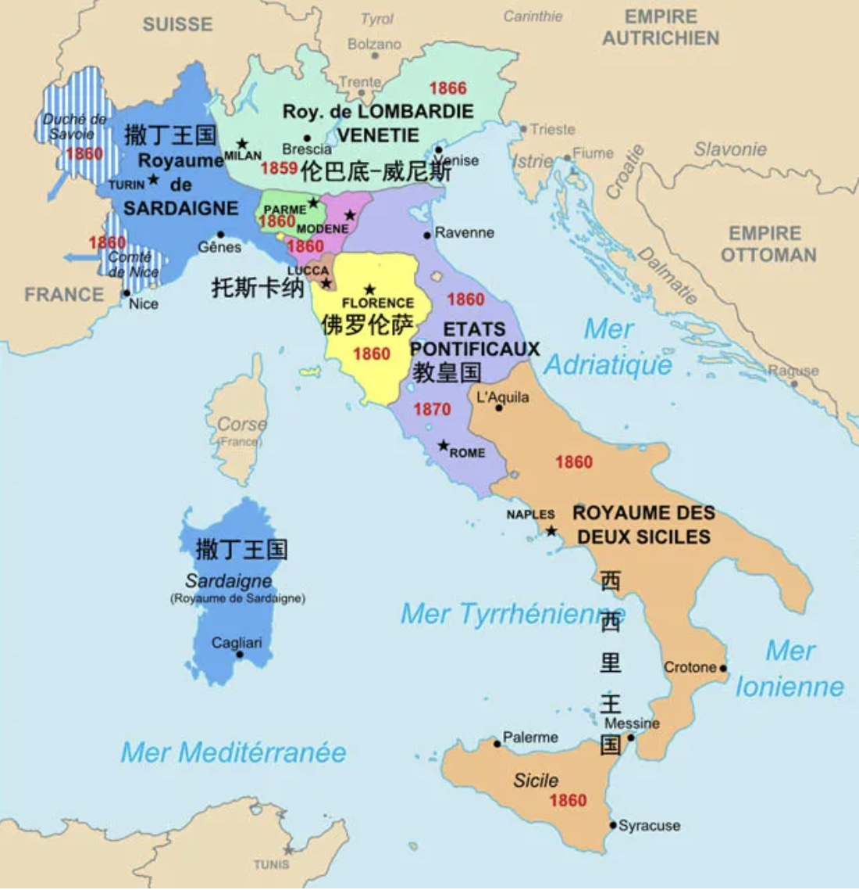

# Italy

## 亚平宁半岛

* 位于欧洲南部，像一只长筒靴从阿尔卑斯山南麓一直延伸至地中海深处，三面临海，总面积约25万平方公里。
* 亚平宁山脉贯穿整个半岛，北部是平原，山脉中的河流两岸也有一些小型平原和谷地
* 隔海相望的希腊半岛密布山地，开发到极限后，古希腊人便渡海来到亚平宁半岛南部，建立起很多殖民城市，并称他们为“Víteliú”，当地居民在实际使用中简化掉字母V，然后慢慢衍生出“Italia”一词，也就是现在的“意大利”。
* 坚韧的罗马人不愿意局限于自己的城市，在公元前3世纪左右先后征服半岛的南北两部分，首次实现了亚平宁半岛的统一。罗马人开始把“意大利”这个称呼扩展至整个亚平宁半岛。
* 公元前122年，罗马人将罗马公民权赋予其他意大利城市，意味着罗马人已经和意大利人混为一体，或者说，“罗马人”这个概念扩大到了意大利地区。
* 公元前27年，屋大维称帝后，将帝国分成若干个行省，亚平宁半岛成为意大利行省，这是“意大利”首次成为该地区的官方名称
* 公元392年，基督教被定为帝国的国教，罗马城自然又成为了基督教的中心。随着基督教的广泛传播，罗马教皇在宗教上的影响力甚至超出了帝国的疆域范围，深入到蛮族地区

## 各自为政

* 公元 4 世纪罗马帝国灭亡后，亚平宁半岛便陷入了长期的争夺。哥特人在意大利建立起松散的王国—东哥特王国。
* 百年之后，定都君士坦丁堡的东罗马帝国，在查士丁尼的领导下重新强大起来。为了重振罗马帝国的荣耀，查士丁尼在554年通过战争，灭掉了东哥特王国，收复了意大利。
* 北部是平缓的波河平原长期以来都是帝国与日耳曼人的边境，因此它成为了交锋的主战场。在东罗马时期，就建立了如米兰等城市要塞，派兵驻扎保护。
* 在东罗马控制亚平宁半岛不久，日耳曼人的另一支—伦巴底人从北欧一路向南，经过几个世纪迁移到了东罗马帝国的防区。查士丁尼在位时期向西征服亚平宁，又向东与波斯进行了长期的战争，长期征战的损耗，加上查士丁尼死后继任者无能，因而无力对抗伦巴底人的入侵。东罗马的势力只能退守到半岛的南部。
* 伦巴底人在意大利西北部建立了一个松散的由若干公国组成的伦巴第王国。伦巴第王国北部的割据势力强大，王国只是名义上的共主。而东罗马在半岛的中南部控制地区设置了“拉文纳总督区”。此后近二百年间，东罗马与伦巴底人一直分治意大利，互不统属。
* 在东罗马的统治腹地，以希腊文化为主，所以对外推崇希腊文化；而伦巴底人因自身的落后特别推崇罗马的拉丁文化，两者的分治使意大利的西北部地区与东罗马控制的中南部地区日渐形成文化差异。
* 内外交困的东罗马无暇顾及意大利，伦巴第人在751年打败了东罗马军队，东罗马仅剩下意大利南部的部分领土，而半岛东北部的威尼斯趁东罗马衰退的时机独立了出来。
* 法兰克王国大力推广基督教，并在公元754年把罗马城及周围的一些城市和地区献给教皇，使教皇对这片土地上拥有了真正的主权.在意大利中部形成了一个教皇国，其北部是法兰克王国，南部是名义上臣服教皇、实则半独立的希腊人邦国。罗马城不再是意大利的中心，只能算是教皇国的首都而已
* 得益于亚平宁半岛地处中西欧与亚洲、北非贸易通道的枢纽位置，意大利北部慢慢脱离法兰克王国，形成了以威尼斯、米兰、佛罗伦萨为核心的多个城市国家，繁荣程度一度超过教皇国统治下的罗马城。
* 伦巴第国王不满足既得的土地，向南入侵了罗马教宗的辖区，教宗为了自身的安危，只能向法兰克国王求援。国王查理曼为了谋求教皇的支持，派兵打败了伦巴第王国，将意大利的北部地区纳入了法兰克王国的版图。
* 到了9世纪末，掌控德意志的东法兰克王国又兼并了意大利北部地区。但是因为德意志的四分五裂以及阿尔卑斯山的阻碍，所以查理曼的继任者们难以对意大利北部进行真正有效的控制。这个时候意大利的北部是国家林立，四分五裂。其中伦巴底控制了西北部地区，威尼斯则是控制了东北部地区。
* 南部地区一直处于一个统一的状态。东罗马尽管自身衰落，但是考虑到意大利南部地区在地中海贸易的中转地位，一直派重兵守护。
* 9世纪阿拉伯帝国以北非为跳板，入侵了西西里岛。穆斯林控制西西里岛（西西里酋长国）后多次侵扰东罗马控制的意大利南部，但最终只能是无功而返
* 在意大利南北政权更替的过程中，北方不论是哥特人、伦巴底人还是法兰克人，他们都是日耳曼人的一支。蛮族由于自身文化的落后，所以积极学习并推广古罗马文化，因而意大利的北部地区这段时间主要受古罗马文化的影响。
* 控制意大利南部长达5个世纪的东罗马帝国以希腊文化为主，这就使得意大利南部地区深受希腊文化的影响。同时南部作为当时东西欧的海上交通要道以及伊斯兰文化入侵的前线，文化成分复杂。
* 南北方的不同发展历程，导致现在的意大利南北部逐渐形成了不同的文化和民族特性。
* 阿拉伯帝国在与东罗马的战争中屡获胜利，逐步占领了西亚、北非以及伊比利亚半岛。扩张的阿拉伯帝国封锁了地中海的出海口直布罗陀海峡，这就破坏了从君士坦丁堡途经地中海的海上航路。原有的航路被破坏，从君士坦丁堡的货物只能经意大利北部，而后翻越阿尔卑斯山运到欧洲的西部和北路。在航路的转变过程中，意大利北部成为了货物必经的要道。
* 趁此机会，意大利北部的一些城镇逐渐兴起，如热那亚、比萨、米兰等。这些城市依靠自己靠海以及位于欧洲和君士坦丁堡中间的优势，组建了自己的船队，大力发展商业和转口贸易。随着人口的增加、规模的扩大以及城市工商业的发展，这些城市及周围的地区建立了城邦国家。这些城邦国家特别崇尚自治，因而被冠以共和国的称号，当时就有威尼斯、热那亚等十几个共和国。意大利城邦的富庶引来了北方邻国神圣罗马帝国（东法兰克王国）的觊觎，神圣罗马帝国多次入侵意大利城邦。
* 为了保证自身的独立，这些城邦组成了著名的“伦巴第同盟”，经过战争迫使神圣罗马帝国签订了《康斯坦茨和约》，该条约承认意大利北部城邦可以自行选举城市的执政官，从事实上承认了这些城市国家的自治权。这些独立的城邦国家特别重视商业的发展和财富的积累，他们还凭借着自己强大的海军积极对外扩张自己的势力，成为了地中海地区的一方霸主。
    - 伦巴第同盟与神圣罗马帝国之间的决定性战役—来尼亚诺战役
* 意大利北方各城邦城市在欧洲各国纵横捭阖的时候，南部则是继续处在外族的统一之下。12世纪，来自于法国北部的一些参加十字军东征的诺曼人，中途留在了意大利半岛，他们先后打败了驻守意大利的东罗马军队和西西里岛的伊斯兰军队，建立了“西西里王国”。其后由于联姻以及战争，西西里王国先后被西班牙哈布斯堡王朝、神圣罗马帝国纳入了统治之下。
* 15世纪末，随着基督徒收复伊比利亚半岛，西班牙和葡萄牙开始了大航海时代。新航线开辟使得欧洲的商业中心从地中海转移到大西洋沿岸，意大利北部地区各个城邦国家实力逐渐被削弱，但北部的这种独立自治的状态一直保持到了法国大革命。
* 法国大革命时期，法国同奥地利等干涉国家为了争夺意大利北部爆发了战争，存在了一千多年的威尼斯共和国被兼并，宣告了意大利北部邦国独立的状态结束。
* 直到 19 世纪初，意大利依然保持着四分五裂的状态。境内多个公国、王国林立，还一度被外国势力占据。罗马所在地为教皇国的领地，意大利东北部被奥地利占领
* 随着欧洲工业革命的展开，意大利地区的生产力得到巨大提升，但政治上的分裂成了经济发展的桎梏，也带动了民族主义的兴起。要求意大利结束分裂，实现国家统一的声音日益高涨。
* 没有任何一个外来政权能在此占据主导地位
    - 中西欧的政治格局比较破碎，任何一方想要征服意大利，都会遭到其他势力的反对和干涉。而教皇国作为意大利的主要政权之一，也不希望该地区出现过于强大的势力，以免削弱自己对意大利的影响力
    - 有能力插手意大利的法国、西班牙、德意志、奥地利等基督教国家，又需要争取罗马教皇的支持，因此这些国家都不愿意直接对抗教皇国。于是整个意大利地区被完全碎片化。出于同样的原因，教皇国将在未来成为反对意大利统一的最顽固势力

## 文艺复兴

* 从14世纪开始的文艺复兴运动，之所以能够诞生在意大利并不是一个偶然。分裂的政治现实使意大利能够包容各种思想和文化，再加上东罗马帝国在15世纪衰落及灭亡后，大批人才逃到意大利，带来了东罗马（希腊）文化，使这里的多元文化得到进一步融合
* 包括但丁《神曲》在内的一系列新时代文艺作品，在唤醒欧洲人文意识的同时，也促进了现代意大利语和文字的形成。但丁等作家用的是意大利方言，与教皇国继承下来的古典拉丁语相互揉合，最终形成现代的意大利语与文字
* 在文艺复兴和现代意大利语形成的过程中，罗马城反而落在了其他城市的后面。因为这座城市被教皇国牢牢控制着，尤其是在思想上受到基督教的钳制，成为意大利最为保守的区域
* 法国大革命唤醒了意大利民族意识,拿破仑一度征服几乎整个意大利地区，成立了依附于法国的意大利王国。随着拿破仑的失败，意大利地区重新又恢复到四分五裂的状态，同时存在8个邦国，其中7个都受到奥地利帝国控制，驻有奥地利军队，只有撒丁王国除外。
* 法国大革命和拿破仑战争带来的自由平等思想和民族独立意识，已经深深扎根于意大利人民心中。无论是亚平宁半岛的南方还是北方，都开始意识到自己是意大利人，讲的都是意大利语，意大利觉醒了。

## 统一战争

* 1848 年，一场轰轰烈烈的统一运动在西西里岛展开，即第一次意大利统一战争
    - 趁着奥地利帝国自顾不暇，意大利各邦国开始武装反抗奥地利驻军，打响了意大利独立战争。撒丁王国由于实力最强而被各邦国推举为领导者
    - 在军事上其实并不顺利，但各邦国拥有强烈的统一愿望，一有机会便坚决展开反对奥地利的斗争。撒丁王国的首相加富尔充分利用奥地利与法国、普鲁士之间的矛盾，争取法普两国对意大利独立的支持
    - 半岛北方首先宣布与撒丁王国合并，而半岛南方的情况相对较为复杂，这里融合了包括伊斯兰在内的多种文化，起义军因而没有把南方定为第一步的统一目标。
    - 追求统一的人民面临着来自各王国和公国的压力以及外部势力干涉的被动局面。在奥地利军队和意大利各反动势力的联合绞杀下，第一次统一战争以失败告终
* 在西北部的撒丁王国带领下，1859 年第二次统一战争展开。吸取第一次的失利教训，撒丁王国采取了各个击破的方式，并联合法国同奥地利作战，完成了北方的统一.与奥地利交战，就意味着北方长期成为了作战的前沿阵地。为躲避战乱和外国势力的迫害，部分意大利人逃离故土，来到了新大陆,阿根廷人口较少，当地在独立之初迫切需要劳动力进行大规模开发。阿根廷成为了众多意大利北方人逃避战乱和压迫的首选
* 随后借助普奥和普法战争之机，将奥地利和法国势力彻底赶出亚平宁半岛
* 在民族英雄加里波第的领导下，起义军趁着大好形势一鼓作气解放了半岛南方，取得了超出预期的独立成果。到1861年，除了教皇国外，其他意大利邦国都已经与撒丁王国合并，然后成立了全新的“意大利王国”。
* 随着意大利逐步完成统一，奥地利势力退出意大利，法国从一开始的支持反奥，转为牵制和拖延统一进程，因此向教皇国派出军队，名义上保护教皇，实则想阻止意大利的最终统一。
* 普法战争在1870年爆发，法国由于惨败而完全失去了教皇国的保护能力，意大利王国决定利用这个机会收复罗马城。9月20日，意大利军队兵不血刃地进入罗马城，教皇只保留自己居住办公的教堂作为教皇国领地，即“梵蒂冈”。至此，意大利彻底完成了统一。
* 最终在 1870 年，意大利完成了统一。
* 统一的意大利面临着严峻的发展困境.面临着资源匮乏的困境，反过来又制约了工业的发展.将全国划分为了20个大区，其中以威尼斯为中心的威尼托、以米兰为中心的伦巴第、以都灵为中心的皮埃蒙特和以热那亚为中心的利古里亚大区都位于北部的波河平原上。
* 国土以山地丘陵地形为主，这对于农业的展开极其不利。尤其是南方地区，不仅平原面积狭小，且该地区自中世纪以来就形成了封建庄园经济，土地是王公贵族的私有财富。统一之后，封建庄园经济得到了最大程度的保留，不少农民依旧没有分配到土地
* 南北经济的差异就已经极为显著。北部地区土地平坦肥沃、人口多，并且又有煤铁等资源，而南方多山地丘陵并且缺乏矿产及基础设施，所以北部地区的经济越来越好。1861年意大利北方的工业发达地区，如威尼托、利古里亚、伦巴第三个大区，以全国三分之一的人口创造了高达全国四分之三的国民收入。在意大利独立之前，其北方的撒丁王国已经成为半岛最发达的地区。
* 直到 19 世纪 80 年代末才在东非占得少部分殖民地。国内资源有限和殖民地匮乏的双重作用下，意大利很难获取市场和原料产地.南方地区贫困问题更加严重。外出移民寻找工作机会成为了当时很多意大利南方人改善生活的重要途径.
* 19 世纪 80 年代开始，大批意大利人，尤其是贫困的南方人选择了离开故乡，前往世界各地寻找新的工作机会。在当时，蒸蒸日上的美国和潜力巨大的阿根廷，成为了意大利人移民的重要选择
* 面积广阔、资源丰富、经济发达的阿根廷对于当时生活在底层的众多意大利人来说简直是天堂。因此当时很多意大利人（尤其是南方人）愿意移民阿根廷谋生甚至寻求财富
* 等到二战时期，北方因为工业基础好，国家战争的需要，大力扶持了北方工业的发展；而盟军在意大利南方登陆使得南方成为战争的主战场。到战后南北方的差距进一步加大。1938年到1952年间，北方人均收入同比增加了22%，而南方则降低了10%
* 在南北经济差距越来越大的现实下，北方认为南方拉了整个国家的后腿。北方对自己上缴的大量税收都被用在了救助落后的南方身上深感不满，如威尼斯政府每年上缴中央的税金约710亿欧元，但罗马政府却只返还了210亿欧元。

## 北方独立倾向

* 共设置20个区，作为一级行政区。根据地理位置，以罗马为界分为北部和南部
* 北部以威尼斯为中心的威尼托大区和以米兰为中心的伦巴第大区有独立倾向
* 伦巴第和威尼托两大区的经济总量占意大利的30%，人均收入也高于全国其他地区。作为意大利最富裕的大区，两区在2017年10月为了追求财政和税收等方面的自治权举行全民公投，最终超过90%的民众赞同本区成为一个有高度自治权的自治区。
* 进入到20世纪80年代后，随着欧洲整体经济发展的放缓，特别是近些年世界债务危机的影响，北方地区越来越认为自己在这个国家中被严重拖累。在欧洲一些地区独立公投的影响下，北方也出现了要求自治的倾向。
* 1989年成立的北方联盟，主张北部大区独立，甚至主张最富裕的皮埃蒙特、伦巴第和威尼托三大区独立为“波河共和国”。
* 威尼斯因自己的悠久历史，使得部分人对意大利的认同感不高。威尼斯部分人发起了威尼斯独立运动，主张建立一个包括威尼托、伦巴第四省以及部分的特伦托自治省在内的“威尼托共和国”，以重拾昔日威尼斯共和国的荣耀。

## 当代

* 教皇国在名义上一直维持到1929年，后来改为了梵蒂冈
* 1946年，意大利废除君主制，成立意大利共和国
