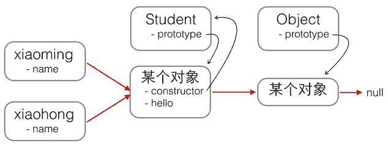
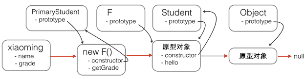
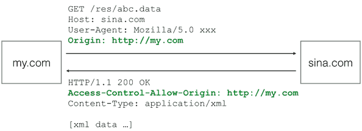

# [JavaScript｜ecma262](https://github.com/tc39/ecma262)

Status, process, and documents for ECMA262 <https://tc39.github.io/ecma262/>

* JavaScript是世界上最流行脚本语言。运行在浏览器中的解释型的编程语言
* 1995年，网景公司正凭借其Navigator浏览器成为Web时代开启时最著名的第一代互联网公司
* 网景公司希望能在静态HTML页面上添加一些动态效果，Brendan Eich 两周之内设计出了JavaScript语言，语法有多个来源
  - 基本语法：借鉴 C 语言和 Java 语言
  - 数据结构：借鉴 Java 语言，包括将值分成原始值和对象两大类
  - 函数的用法：借鉴 Scheme 语言和 Awk 语言，将函数当作第一等公民，并引入闭包
  - 原型继承模型：借鉴 Self 语言（Smalltalk 的一种变种）
  - 正则表达式：借鉴 Perl 语言
  - 字符串和数组处理：借鉴 Python 语言
* 最初名字叫做 Mocha，1995年9月改为 LiveScript。12月，Netscape 公司与 Sun 公司（Java 语言的发明者和所有者）达成协议，后者允许将这种语言叫做 JavaScript。这样一来，Netscape 公司可以借助 Java 语言的声势，而 Sun 公司则将自己的影响力扩展到了浏览器
* 1995年12月4日，Netscape 公司与 Sun 公司联合发布了 JavaScript 语言，对外宣传 JavaScript 是 Java 的补充，属于轻量级的 Java，专门用来操作网页
* 1996年3月，Navigator 2.0 浏览器正式内置了 JavaScript 脚本语言
* 1996年8月，微软模仿 JavaScript 开发了一种相近的语言，取名为JScript（JavaScript 是 Netscape 的注册商标，微软不能用），首先内置于IE 3.0
* 1996年11月，Netscape 公司决定将 JavaScript 提交给国际标准化组织 ECMA（European Computer Manufacturers Association），希望 JavaScript 能够成为国际标准，以此抵抗微软。ECMA 的39号技术委员会（Technical Committee 39）负责制定和审核这个标准，成员由业内的大公司派出的工程师组成，目前共25个人。该委员会定期开会，所有的邮件讨论和会议记录，都是公开的。
* 1997年7月，ECMA 组织发布262号标准文件（ECMA-262）的第一版，规定了浏览器脚本语言的标准，并将这种语言称为 ECMAScript。这个版本就是 ECMAScript 1.0 版。之所以不叫 JavaScript，一方面是由于商标的关系，Java 是 Sun 公司的商标，根据一份授权协议，只有 Netscape 公司可以合法地使用 JavaScript 这个名字，且 JavaScript 已经被 Netscape 公司注册为商标，另一方面也是想体现这门语言的制定者是 ECMA，不是 Netscape，这样有利于保证这门语言的开放性和中立性。因此，ECMAScript 和 JavaScript 的关系是，前者是后者的规格，后者是前者的一种实现
* ECMAScript 只用来标准化 JavaScript 这种语言的基本语法结构，与部署环境相关的标准都由其他标准规定，比如 DOM 的标准就是由 W3C组织（World Wide Web Consortium）制定的
* ECMA-262 标准后来也被另一个国际标准化组织 ISO（International Organization for Standardization）批准，标准号是 ISO-1626
* 生态
  - TypeScript 对战 ES6
    + 深入理解 ES6 中的基础语法非常重要
    + 了解 JavaScript 的解释方式以及各种浏览器的局限性也很重要
    + PWA 和服务工作者的崛起也值得关注
  - React 对战 Angular Vue
  - Jest 对战 Mocha
  - GraphQL,Apollo（GraphQL 的客户端）REST API 将会下降
  - Parcel 和 Webpack
  - TypeScript 可能超过 ECMAScript
  - GraphQL + TypeScript 占据了 2020 年所需技能的列表
  - 预测像 Next.js、Nuxt.js 和 Gatsby.js 这样的混合框架将占据很大一部分项目，因此 JavaScript 开发人员必须了解这些工具
  - Agile（敏捷）这个术语，但它比 Git 或 Redux 被提及的频率更高，这说明 JS 开发者们除了要获得开发岗位必须的硬技能，软技能同样不可忽视。UX 也是如此
  - 作为一个前端开发者，需要知道如何在技术层面为用户提供更流畅的体验，而不是在设计层面
* 强大性能
  - 灵活的语法，表达力强
    + 既支持类似 C 语言清晰的过程式编程，也支持灵活的函数式编程，可以用来写并发处理（concurrent）。这些语法特性已经被证明非常强大，可以用于许多场合，尤其适用异步编程。
    + JavaScript 的所有值都是对象，这为程序员提供了灵活性和便利性
  - 支持编译运行
    + 在现代浏览器中，JavaScript 都是编译后运行。程序会被高度优化，运行效率接近二进制程序
    + 有一种 WebAssembly 格式，是 JavaScript 引擎的中间码格式，全部都是二进制代码。由于跳过了编译步骤，可以达到接近原生二进制代码的运行速度。各种语言（主要是 C 和 C++）通过编译成 WebAssembly，就可以在浏览器里面运行
  - 事件驱动和非阻塞式设计
    + 可以采用事件驱动（event-driven）和非阻塞式（non-blocking）设计，在服务器端适合高并发环境，普通的硬件就可以承受很大的访问量
  - 对于 JavaScript，常常需要学习各种解决问题的模式。而且由于来源多样，从一开始就注定，JavaScript 的编程风格是函数式编程和面向对象编程的一种混合体
* 从语法角度看，JavaScript 语言是一种“对象模型”语言。各种宿主环境通过这个模型，描述自己的功能和操作接口，从而通过 JavaScript 控制这些功能
* JavaScript 并不是纯粹的“面向对象语言”，还支持其他编程范式（比如函数式编程）
* JavaScript 的使用范围，慢慢超越了浏览器，正在向通用的系统语言发展
* JavaScript 也是一种嵌入式（embedded）语言。本身提供的核心语法不算很多，只能用来做一些数学和逻辑运算。JavaScript 本身不提供任何与 I/O（输入/输出）相关的 API，都要靠宿主环境（host）提供，所以 JavaScript 只合适嵌入更大型的应用程序环境，去调用宿主环境提供的底层 API

## 版本

* [ES6](https://github.com/lukehoban/es6features) ES2015 2015年6月，ECMAScript 6 正式发布，并且更名为“ECMAScript 2015”。这是因为 TC39 委员会计划，以后每年发布一个 ECMAScript 的版本
  - Arrows and Lexical This
  - let, const（变量类型）：解决变量作用域泄露的问题
  - Classes, extends, super（类、继承）：让对象原型的写法更加清晰、更像面向对象编程的语法，也更加通俗易懂
  - Arrow functions（箭头函数）：简洁，解决this绑定的问题（继承外面的this）
  - Template string（模板字符串）：解决传统写法非常麻烦的问题
  - Enhanced Object Literals
  - Destructuring（解构）：避免让API使用者记住多个参数的使用顺序
  - Iterators + For..Of
  - Default, rest（默认值、参数）, Spread：简化，替代arguments，使代码更易于阅读
  - Generators
  - Unicode
  - Modules
  - Module Loaders
  - Map + Set + WeakMap + WeakSet
  - Proxies
  - Symbols
  - Subclassable Built-ins
  - Math + Number + String + Object APIs
  - Binary and Octal Literals
  - Promises
  - Reflect API
  - Tail Calls
  - 参考
    + [Learn ES2015](https://babeljs.io/docs/en/learn)
* ECMAScript 2016
  - Array.prototype.includes
* ECMAScript 2017
  - Object.values():返回 Object 所有属性的值
  - Object.entries():与 Object.keys 相关，不仅返回键，而是以数组的方式返回键和值。这使得在循环中使用对象或将对象转换为 Map 等操作变得非常简单
  - String.prototype.padStart 和 String.prototype.padEnd——允许将空字符串或其他字符串追加或前置到原始字符串的尾部或开头
  - Object.getOwnPropertyDescriptors:返回给定对象所有属性的详细信息（包括 get 和 set 方法）。添加它的主要动机是允许将一个对象浅复制 / 克隆到另一个对象，同时也复制 getter 和 setter 函数而不是 Object.assign
  - Object.assign 将浅复制除原始源对象的 getter 和 setter 函数之外的所有东西
  - 函数参数中添加尾逗号（trailing comma）
  - async/await:async 关键字告诉 JavaScript 编译器要以不同的方式处理这个函数。在遇到函数中的 await 关键字时，编译器就会暂停。假定 await 之后的表达式会返回一个 promise 并等待，直到 promise 完成或被拒绝
* ECMAScript 2018
* ES2019
  - toString()方法返回函数代码本身，以前会省略注释和空格
  - 允许catch语句省略参数

## 环境

* 浏览器环境
  - JavaScript 的发明目的，就是作为浏览器的内置脚本语言，为网页开发者提供操控浏览器的能力。它是目前唯一一种通用的浏览器脚本语言，所有浏览器都支持。它可以让网页呈现各种特殊效果，为用户提供良好的互动体验
  - 浏览器的平台化：随着 HTML5 的出现，浏览器本身的功能越来越强，不再仅仅能浏览网页，而是越来越像一个平台，JavaScript 因此得以调用许多系统功能，比如操作本地文件、操作图片、调用摄像头和麦克风等等。这使得 JavaScript 可以完成许多以前无法想象的事情
  - 提供的额外 API
    + 浏览器控制类：操作浏览器
    + DOM 类：操作网页的各种元素
    + Web 类：实现互联网的各种功能
* 服务器环境 Node
  - Node 项目使得 JavaScript 可以用于开发服务器端的大型项目，网站的前后端都用 JavaScript 开发已经成为了现实。有些嵌入式平台（Raspberry Pi）能够安装 Node，于是 JavaScript 就能为这些平台开发应用程序
  - 提供各种操作系统 API
    + 文件操作 API
    + 网络通信 API

## 数据库操作

* NoSQL 数据库这个概念，本身就是在 JSON（JavaScript Object Notation）格式的基础上诞生的，大部分 NoSQL 数据库允许 JavaScript 直接操作。基于 SQL 语言的开源数据库 PostgreSQL 支持 JavaScript 作为操作语言，可以部分取代 SQL 查询语言。

## 移动平台开发

* PhoneGap 项目就是将 JavaScript 和 HTML5 打包在一个容器之中，使得它能同时在 iOS 和安卓上运行。Facebook 公司的 React Native 项目则是将 JavaScript 写的组件，编译成原生组件，从而使它们具备优秀的性能。

## 引入

* 默认的type就是JavaScript，所以不必显式地把type指定为JavaScript
* 由`<script>...</script>`包含的代码就是JavaScript代码，将直接被浏览器执行。JavaScript代码可以直接嵌在网页的任何地方，不过通常我们都把JavaScript代码放到`<body>`后
* 把JavaScript代码放到一个单独的.js文件，然后在HTML中通过`<script src="..."></script>`引入这个文件
  - 更利于维护/复用
  - 在同一个页面中引入多个.js文件
  - 在页面中多次编写`<script> js代码... </script>`，浏览器按照顺序依次执行

```html
<head>
  <script>
    alert('Hello, world');
  </script>
</head>
<body>
 <!-- JavaScript 会在页面加载时向 HTML 的 <body> 写文本.如果在文档加载后使用该方法，会覆盖整个文档 -->
<script>
document.write("<h1>This is a heading</h1>");
document.write("<p>This is a paragraph</p>");
</script>
</body>
<script src="/static/js/abc.js"></script>
```

## 输出

* window.alert() 弹出警告框
* 使用 document.write() 方法将内容写到 HTML 文档中
* 使用 innerHTML 写入到 HTML 元素
* 使用 console.log() 写入到浏览器的控制台
* Template literals:`${myString1} ${myString2}!`

## 基础语法

* 每个语句以`;`结束，浏览器中负责执行JavaScript代码的引擎会自动在每个语句的结尾补上
* 语句块用 `{...}`
* 以`//`开头直到行末的字符被视为行注释
* 块注释是用`/*...*/`把多行字符包裹起来
* 区分大小写
* 常量：在ES6之前是不行的，通常用全部大写的变量来表示“这是一个常量，不要修改它的值”

```javascript
var PI = 3.14;

const PI = 3.14;
PI = 3; // 某些浏览器不报错，但是无效果！
PI; // 3.14
```

### 变量

用于存储信息的"容器"，变量不仅可以是数字，还可以是任意数据类型

* 大小写英文、数字、$和_的组合
  - 不能用数字开头
  - 变量名也不能是JavaScript的关键字，如if、while等
  - 申明一个变量用var语句。变量名也可以用中文，但是，请不要给自己找麻烦。
* 使用等号=对变量进行赋值
  - 可以把任意数据类型赋值给变量，同一个变量可以反复赋值，而且可以是不同类型的变量，但是要注意只能用var声明一次
* 变量本身类型不固定的语言称之为动态语言
  - 静态语言在定义变量时必须指定变量类型，如果赋值的时候类型不匹配，就会报错。例如Java是静态语言
* ECMA在后续规范中推出了strict模式
  - 强制通过var申明变量，未使用var申明变量就使用的，将导致运行错误。在JavaScript代码的第一行写上：`'use strict';`
  - 同一个页面的不同的JavaScript文件中，如果都不用var申明，恰好都使用了变量i，将造成变量i互相影响，产生难以调试的错误结果
  - 使用var申明的变量则不是全局变量，它的范围被限制在该变量被申明的函数体内（函数的概念将稍后讲解），同名变量在不同的函数体内互不冲突
* 如果重新声明 JavaScript 变量，该变量的值不会丢失
* 生命周期：在声明时初始化，局部变量在函数执行完毕后销毁，全局变量在页面关闭后销毁
* 变量作用域
  - 全局作用域：JavaScript默认有一个全局对象window，全局作用域的变量实际上被绑定到window的一个属性
  - 局部作用域：如果一个变量在函数体内部申明，则该变量的作用域为整个函数体，在函数体外不可引用该变量
  - 不同函数内部的同名变量互相独立，互不影响
  - 函数可以嵌套，此时，内部函数可以访问外部函数定义的变量，反过来则不行：函数在查找变量时从自身函数定义开始，从“内”向“外”查找。如果内部函数定义了与外部函数重名的变量，则内部函数的变量将“屏蔽”外部函数的变量

```js
var carname; // 声明变量，值为undefined
var answer='Yes I am!'; // 声明变量并赋值
var name="Gates", age=56, job="CEO";

function foo() {
    alert('foo');
}

foo(); // 直接调用foo()
window.foo(); // 通过window.foo()调用

window.alert('调用window.alert()');
// 把alert保存到另一个变量:
var old_alert = window.alert;
// 给alert赋一个新函数:
window.alert = function () {

}
alert('无法用alert()显示了!');
window.alert = old_alert;
alert('又可以用alert()了!');

// 测试:
var i, args = [];
for (i=1; i<=100; i++) {
    args.push(i);
}
if (sum() !== 0) {
    alert('测试失败: sum() = ' + sum());
} else if (sum(1) !== 1) {
    alert('测试失败: sum(1) = ' + sum(1));
} else if (sum(2, 3) !== 5) {
    alert('测试失败: sum(2, 3) = ' + sum(2, 3));
} else if (sum.apply(null, args) !== 5050) {
    alert('测试失败: sum(1, 2, 3, ..., 100) = ' + sum.apply(null, args));
} else {
    alert('测试通过!');
}
```

### 数据类型

* 所有事物都为对象,JavaScript 本地对象和内置对象
* 类型:all non-primitive types are “objects”
  - 原始数据类型 Primitive data types (基本类型 不可变类型)：固定值称为字面量
    + 字符串（String）
    + 数字(Number)
    + 布尔(Boolean)
    + 空（Null）
    + 未定义（Undefined）
    + Symbol
    + BigInt
  - 对象类型 Object types 引用数据类型（可变类型），都是引用
    + 对象(Object)
    + 数组(Array)
    + 函数(Function)
    + 比较都是引用的比较，当且仅当它们引用同一个对象时才相等
    + 赋值是浅拷贝，仅仅是赋值的引用值，而不是对象本身，这样如果涉及到嵌套对象（对象属性值是也是对象），在修改一个对象时，会影响到引用的对象
* 标准对象
  - 在JavaScript的世界里，一切都是对象，用typeof操作符获取对象的类型.用typeof将无法区分出null、Array和通常意义上的object
  - 包装对象：包装对象用new创建。看上去和原来的值一模一样，显示出来也是一模一样，但类型已经变为object了！所以，包装对象和原始值用===比较会返回false
  - 不写new情况下，Number()、Boolean和String()被当做普通函数，把任何类型的数据转换为number、boolean和string类型
  - 不要使用new Number()、new Boolean()、new String()创建包装对象
  - 用parseInt()或parseFloat()来转换任意类型到number
  - 用String()来转换任意类型到string，或者直接调用某个对象的toString()方法
  - 通常不必把任意类型转换为boolean再判断，因为可以直接写if (myVar) {...}；
  - typeof操作符可以判断出number、boolean、string、function和undefined
  - 判断Array要使用Array.isArray(arr)
  - 判断null请使用myVar === null
  - 判断某个全局变量是否存在用typeof window.myVar === 'undefined'
  - 函数内部判断某个变量是否存在用typeof myVar === 'undefined'
  - null和undefined就没有toString()
* Boolean:布尔值和布尔代数的表示完全一致，一个布尔值只有true、false两种值.常用在条件判断中
  - `&&` 与运算 `||`和运算 `!`非运算
  - null、undefined、0、NaN和空字符串''视为false，其他值一概视为true
* String字符串：以单引号`'`或双引号`"`括起来的任意文本
  - 只要引用了字符串的属性，JavaScript 会将字符串值通过 new String(s) 的方式将其转换成对象，这个对象继承了字符串的方法，并被用来处理属性的引用
    - 如果`'`本身也是一个字符，那就可以用""括起来，比如`"I'm OK"`包含的字符是I，`'`，m，空格，O，K这6个字符。
    - `'I\'m \"OK\"!';` 转义字符`\`可以转义很多字符
      - `\n`表示换行
      - `\t`表示制表符
      - 字符`\`本身也要转义，所以`\\`表示的字符就是`\`
    - ASCII字符可以以`\x##`形式的十六进制表示 `'\x41'; // 完全等同于 'A'`
    - 用`\u####`表示一个Unicode字符:`'\u4e2d\u6587'; // 完全等同于 '中文'`
    - 多行字符串,串用`\n`写起来比较费事，所以最新的ES6标准新增了一种多行字符串的表示方法，用反引号 ` ... ` 表示
    - String 对象属性
      + constructor 对创建该对象的函数的引用
      + length  字符串的长度
      + prototype 允许您向对象添加属性和方法
    - 字符串操作
      + charAt()  返回指定索引位置的字符
      * charCodeAt()  返回指定索引位置字符的 Unicode 值
      * concat()  连接两个或多个字符串，返回连接后的字符串 string.concat(string1, string2, ..., stringX)
      * fromCharCode()  将 Unicode 转换为字符串
      * indexOf() 返回字符串中检索指定字符第一次出现的位置
      * lastIndexOf() 返回字符串中检索指定字符最后一次出现的位置
      * localeCompare() 用本地特定的顺序来比较两个字符串
      * match() 找到一个或多个正则表达式的匹配
      * replace() 替换与正则表达式匹配的子串
      * search()  检索与正则表达式相匹配的值
      * slice() 提取字符串的片断，并在新的字符串中返回被提取的部分
      * split() 把字符串分割为子字符串数组
      * substr()  从起始索引号提取字符串中指定数目的字符
      * substring() 提取字符串中两个指定的索引号之间的字符
      * toLocaleLowerCase() 根据主机的语言环境把字符串转换为小写，只有几种语言（如土耳其语）具有地方特有的大小写映射
      * toLocaleUpperCase() 根据主机的语言环境把字符串转换为大写，只有几种语言（如土耳其语）具有地方特有的大小写映射
      * toLowerCase() 把字符串转换为小写
      * toString()  返回字符串对象值
      * toUpperCase() 把字符串转换为大写
      * trim()  移除字符串首尾空白
      * valueOf() 返回某个字符串对象的原始值
      * parseInt() 解析整数
      * arseFloat() 解析整数和浮点数
* Number:不区分整数和浮点数，统一用Number表示.有时候用十六进制表示整数比较方便，十六进制用0x前缀和0-9，a-f表示,以及运算符
  - NaN这个特殊的Number与所有其他值都不相等，包括它自己.唯一能判断NaN的方法是通过isNaN()函数.注意浮点数的相等比较(浮点数在运算过程中会产生误差，因为计算机无法精确表示无限循环小数。要比较两个浮点数是否相等，只能计算它们之差的绝对值，看是否小于某个阈值)
  - 上溢返回 Infinity
  - 下溢返回 -Infinity
  - 被零整除返回 Infinity 或 -Infinity，零除零则返回 NaN
  - 属性
    + MAX VALUE
    + MIN VALUE
    + NEGATIVE INFINITIVE
    + POSITIVE INFINITIVE
    + NaN
    + prototype
    + constructor
  - 方法
    + toExponential()
    + toFixed()
    + toPrecision()
    + toString()
    + valueOf()
      - toFixed() 用于指定小数点位数
      - toExponential() 用于指定使用指数计数法
      - toPrecision() 用于指定有效位数（有效位数小于整数位数则转换为指数形式）
* Null 表示一个“空”的值，它和0以及空字符串`''`不同
  - 0是一个数值
  - `''`表示长度为0的字符串
  - null表示“空”
  - 可以通过将变量的值设置为 null 来清空变量
  - 执行 typeof 计算返回「object」
  - 可以表示数字、字符串、对象是「无值」的
* Undefined 表示值未定义,仅仅在判断函数参数是否传递的情况下有用
* 类型转化
  - 值转化为另一个值并不意味着两个值是等价
  - 自动类型转换
  - 显式类型转化

```javascript
typeof 123; // 'number'
typeof NaN; // 'number'
typeof 'str'; // 'string'
typeof true; // 'boolean'
typeof undefined; // 'undefined'
typeof Math.abs; // 'function'
typeof null; // 'object'
typeof []; // 'object'
typeof {}; // 'object'

typeof new Number(123); // 'object'
new Number(123) === 123; // false
typeof new Boolean(true); // 'object'
new Boolean(true) === true; // false
typeof new String('str'); // 'object'
new String('str') === 'str'; // false

123..toString(); // '123', 注意是两个点！
(123).toString(); // '123'
```

### 数组

一组按顺序排列的集合，集合的每个值称为元素

* 数组下标是基于零的
* 用`[]`表示，元素之间用`,`分隔
* 通过索引来访问每个元素。
* 取得Array的长度，直接访问length属性
* 改变长度填充undefined或者删除多余元素
* 通过索引修改值
* 方法
  - indexOf()来搜索一个指定的元素的位置
  - lastIndexOf()
  - slice截取Array的部分元素，然后返回一个新的Array. slice()的起止参数包括开始索引，不包括结束索引。如果不给slice()传递任何参数，它就会从头到尾截取所有元素
  - push()在数组的尾部添加一个或多个元素，并返回数组的长度
  - pop()删除数组的最后一个元素，减小数组长度并返回它删除的值
  - unshift()往Array的**头部**添加若干元素
  - shift()方法则把Array的第一个元素删掉
  - sort()对当前Array进行排序，它会直接修改当前Array的元素位置，直接调用时，按照默认顺序排序。
  - reverse()把整个Array的元素给掉个个，也就是反转
  - splice()方法是修改Array的“万能方法”，它可以从指定的索引开始删除若干元素，然后再从该位置添加若干元素
  - concat()方法把当前的Array和另一个Array连接起来，并返回一个新的Array。并没有修改当前Array，而是返回了一个新的Array。可以接收任意个元素和Array，并且自动把Array拆开，然后全部添加到新的Array里
  - join()当前Array的每个元素都用指定的字符串连接起来，然后返回连接后的字符串
* 空位
  - forEach(), filter(), reduce(), every() 和some()都会跳过空位。
  - map()将调用的数组的每个元素传递给指定的函数，并返回一个包含函数返回值的数组
  - filter() 该方法返回的数组元素是调用的数组的一个子集，传递的函数是用来逻辑判定的，该函数通过返回 true 或 false 来判定留下哪些元素，排除哪些元素（
  - join()和toString()会将空位视为undefined，而undefined和null会被处理成空字符串

### 对象

一组由键-值组成的无序集合.对象的键都是字符串类型，值可以是任意数据类型。用于描述现实世界中的某个对象.视为其他语言中的Map或Dictionary的数据结构

* 创建
  - 使用对象字面量
  - 通过 new 创建对象
  - 原型
    + 每个 JavaScript 对象（null除外）都和另一个对象关联，「另一个对象」就是原型，每个对象都从原型继承属性
    + 所有通过对象直接量创建的对象都有同一个原型对象，该对象的引用可以通过 Object.prototype 获取。通过 new 关键字创建的对象的原型是构造函数的 prototype 属性的值，比如 new Object() 创建对象的原型自 Object.prototype，new Array() 创建对象的原型是 Array.prototype
    + 没有原型的对象不多，Object.prototype 就是其中之一，它不继承任何属性，而其它原型对象都是普通对象，普通对象都有原型，所有内置构造函数都具有一个继承自 Object.prototype 的原型
    + `var o2 = Object.create(Object.prototype);`
* 用一个{...}表示一个对象，键值对以xxx: xxx形式申明，用,隔开。注意，最后一个键值对不需要在末尾加,
* 属性是与对象相关的值
  - 访问属性是通过.操作符完成的，但这要求属性名必须是一个有效的变量名。如果属性名包含特殊字符，就必须用''括起来.访问这个属性也无法使用.操作符，必须用['xxx']来访问
  - 自由地给一个对象添加或删除属性
  - 检测x是否拥有某一属性，可以用in操作符
  - for...in 语句循环遍历对象的属性
  - hasOwnProperty()：要判断一个属性是否是xiaoming自身拥有的，而不是继承得到的，可以用方法
  - 数据属性包含四个特性：值、可读性、可枚举性、可配置性，属性有：value、writable、enumerable、configurable
    + 设置属性的特性或者想要新建属性具有某种特性，需要调用 Object.defineProperty() 方法，传入要修改的对象、要创建或修改的属性名以及属性描述符对象
* 方法：在一个对象中绑定函数，称为这个对象的方法
  - 在一个方法内部，this是一个特殊变量，始终指向当前对象，**要保证this指向正确，必须用obj.xxx()的形式调用**,一个巨大的设计错误，要想纠正可没那么简单。ECMA决定，在strict模式下让函数的this指向undefined，因此，在strict模式下，会得到一个错误
  - 修复方法：用一个that变量首先捕获this,要指定函数的this指向哪个对象，可以用函数本身的apply方法，它接收两个参数，第一个参数就是需要绑定的this变量，第二个参数是Array，表示函数本身的参数
  - 与apply()类似的方法是call()，普通函数调用，通常把this绑定为null
  - apply()把参数打包成Array再传入
  - call()把参数按顺序传入
  - 装饰器：动态改变函数的行为
  - delete 只是断开属性和宿主对象的联系，而不会去操作属性中的属性
    + 只能删除自有属性，不能删除继承属性
    + 除成功或没有任何副作用（比如删除不存在的属性）时返回true
  - 判断属性属性是否存在与对象中：
    + in：可用于检测自有属性和继承属性
    + hasOwnProperty()：用于检测自有属性
    + propertyIsEnumerable()：只有检测到是自有属性且属性是可枚举时才返回true
  - 通过.或[]获取对象属性值
  - bind() 方法:将函数绑定到某个对象
    + 传入 bind() 的实参也会绑定至 this，这是一种常见的函数式编程技术，有时也称作「柯里化」
    * 对象还拥有三个相关的对象特性：
  - 对象的原型（prototype），指向另外一个对象，本对象的属性继承自它的原型对象
  - 对象的类（class），标识对象类型的字符串
  - 对象的扩展标记（extensible flag），标识是否可以向该对象添加新属性（ECMAScript 5）

### Map Set iterable ES6标准新增的数据类型

* map:一组键值对的结构，具有极快的查找速度.根据同学的名字查找对应的成绩,用Map实现，只需要一个“名字”-“成绩”的对照表，直接根据名字查找成绩，无论这个表有多大，查找速度都不会变慢。一个key只能对应一个value，所以，多次对一个key放入value，后面的值会把前面的值冲掉
* set:一组key的集合，但不存储value。由于key不能重复，所以，在Set中，没有重复的key.重复元素在Set中自动被过滤
* 为了统一集合类型,ES6标准引入了新的iterable类型，Array、Map和Set都属于iterable类型,具有iterable类型的集合可以通过新的for ... of循环来遍历.for ... in循环由于历史遗留问题，它遍历的实际上是对象的属性名称。一个Array数组实际上也是一个对象，它的每个元素的索引被视为一个属性。给数组添加`a.name = 'Hello';`后，`for ... in`可以遍历出来name，而length却没有。`for ... of`循环则完全修复了这些问题，它只循环集合本身的元素

## 标准库

* Array
* Date
* Math

## 运算符

* 赋值运算符：= += -= *= /= %=
* 计算运算符：+ - * / %
* 连接运算符：用于字符串连接 +
  - 如果把数字与字符串相加，结果将成为字符串
* 比较运算符：> = >= < <= == !=
  - ===：值与类型比较，它不会自动转换数据类型，如果数据类型不一致，返回false，如果一致，再比较
  - `==`比较，它会自动转换数据类型再比较
* 逻辑运算符
  - &&
  - ！
  - ||:或赋值
* 条件运算符：variablename=(condition)?value1:value2
* in 运算符通常用于判断属性或元素是否存在与对象/数组中，它的左操作数是一个字符串或者可以转换为字符串，右操作数是一个对象
* instanceof 用于判断对象是否某个类（含父类）的实例，它的左操作数是一个对象，右操作数是标识对象的类

```js
1 + 2; // 3
(1 + 2) * 5 / 2; // 7.5
2 / 0; // Infinity
0 / 0; // NaN
10 % 3; // 1
10.5 % 3; // 1.5

++
--

NaN === NaN; // false
isNaN(NaN); // true
1 / 3 === (1 - 2 / 3); // false
Math.abs(1 / 3 - (1 - 2 / 3)) < 0.0000001; // true

2 > 1; // 这是一个true值
2 >= 3; // 这是一个false值

true && true; // 这个&&语句计算结果为true
true && false; // 这个&&语句计算结果为false
false && true && false; // 这个&&语句计算结果为false

false || false; // 这个||语句计算结果为false
true || false; // 这个||语句计算结果为true
false || true || false; // 这个||语句计算结果为true

! true; // 结果为false
! false; // 结果为true
! (2 > 5); // 结果为true

greeting=(visitor=="PRES")?"Dear President ":"Dear ";
```

## 函数 Function

* 事件驱动的或者当被调用时执行的可重复使用的代码块
* 函数是“头等公民”，而且可以像变量一样使用，具有非常强大的抽象能力。
* 最基本的一种代码抽象的方式。能不关心底层的具体计算过程，而直接在更高的层次上思考问题
* 括号内列出函数的参数，多个参数以,分隔
* { ... }之间的代码是函数体，可以包含若干语句，甚至可以没有任何语句
* 先扫描整个函数体的语句，把所有申明的变量（而非赋值）“提升”到函数顶部.严格遵守“在函数内部首先申明所有变量”这一规则
* 一旦执行到return时，函数就执行完毕，并将结果返回,如果没有return语句，返回 undefined
* 由于JavaScript的函数也是一个对象，定义的abs()函数实际上是一个函数对象，而函数名abs可以视为指向该函数的变量。
* 调用函数：顺序传入参数即可；允许传入任意个参数而不影响调用，因此传入的参数比定义的参数多也没有问题
* 使用 Function() 构造函数的注意事项：
  - 可以通过 Function() 构造函数在运行时动态定义并编译函数
  - 每次调用 Function() 都会解析函数体并创建新的函数对象，在循环中使用会影响效率
  - 由 Function() 创建的函数并不使用词法作用域，相反，函数体代码的编译总是会在顶层函数执行
* 参数检测：类型判断
* 关键字arguments，它只在函数内部起作用，并且永远指向当前函数的调用者传入的所有参数。arguments类似Array但它不是一个Array。利用arguments，你可以获得调用者传入的所有参数。也就是说，即使函数不定义任何参数，还是可以拿到参数的值。实际上arguments最常用于判断传入参数的个数
* ES6标准引入了rest参数:rest参数只能写在最后，前面用...标识，从运行结果可知，传入的参数先绑定已声明参数，多余的参数以数组形式交给变量rest，所以，不再需要arguments我们就获取了全部参数
* 作用域
  - 局部变量：只能在函数内部访问它
  - 全局变量：网页上的所有脚本和函数都能访问它
* Function.prototype.bind():keep the context of this within another function

```js
Function.prototype.bind = function (scope) {
    var fn = this;
    return function () {
        return fn.apply(scope);
    };
}

  // provides a rock-solid alternative if the browser hasn’t implemented the native .bind() method
if (!Function.prototype.bind) {
  Function.prototype.bind = function (oThis) {
    if (typeof this !== "function") {
      // closest thing possible to the ECMAScript 5 internal IsCallable function
      throw new TypeError("Function.prototype.bind - what is trying to be bound is not callable");
    }

    var aArgs = Array.prototype.slice.call(arguments, 1),
        fToBind = this,
        fNOP = function () {},
        fBound = function () {
          return fToBind.apply(this instanceof fNOP && oThis
                                 ? this
                                 : oThis,
                               aArgs.concat(Array.prototype.slice.call(arguments)));
        };

    fNOP.prototype = this.prototype;
    fBound.prototype = new fNOP();

    return fBound;
  };
}
```

### 控制语句

* 条件语句
  - 使用`if () { ... } else { ... }`来进行条件判断 其中else语句是可选的。
  - 如果语句块只包含一条语句，那么可以省略`{}`.
  - 在多个if...else...语句中，如果某个条件成立，则后续就不再继续判断了(注意先后顺序)
  - switch 语句来选择要执行的多个代码块之一
* 循环语句：重复运算.务必小心编写初始条件和判断条件，尤其是边界值。特别注意i < 100和i <= 100是不同的判断逻辑。
  * for循环最常用的地方是利用索引来遍历数组；for循环的3个条件都是可以省略的，如果没有退出循环的判断条件，就必须使用break语句退出循环，否则就是死循环；
    - 初始化循环中所用的变量
    - 评估初始变量的条件:返回 true，则循环再次开始，如果返回 false，则循环将结束
    - 增加初始变量的值
  * `for ... in`循环，它可以把一个对象的所有属性依次循环出来
  * while循环只有一个判断条件，条件满足，就不断循环，条件不满足时则退出循环
  * `do { ... } while()`和while循环的唯一区别在于，不是在每次循环开始的时候判断条件，而是在每次循环完成的时候判断条件
* break 语句可用于跳出循环
* continue 语句中断循环中的迭代，如果出现了指定的条件，然后继续循环中的下一个迭代
* try 语句允许我们定义在执行时进行错误测试的代码块。catch 语句允许我们定义当 try 代码块发生错误时，所执行的代码块。

### 名字空间

* 不同的JavaScript文件如果使用了相同的全局变量，或者定义了相同名字的顶层函数，都会造成命名冲突。
* 把自己的代码全部放入唯一的名字空间MYAPP中，会大大减少全局变量冲突的可能。许多著名的JavaScript库都是这么干的：jQuery，YUI，underscore等等
* JavaScript的变量作用域实际上是函数内部，我们在for循环等语句块中是无法定义具有局部作用域的变量的。为了解决块级作用域，ES6引入了新的关键字let，用let替代var可以申明一个块级作用域的变量

```javascript
function foo() {
    for (var i=0; i<100; i++) {
        //
    }
    i += 100; // 仍然可以引用变量i
}

function foo() {
    var sum = 0;
    for (let i=0; i<100; i++) {
        sum += i;
    }
    i += 1; // SyntaxError
}
```

## 高阶函数 Higher-order function

函数其实都指向某个变量。既然变量可以指向函数，函数的参数能接收变量，那么一个函数就可以接收另一个函数作为参数，这种函数就称之为高阶函数

* arr.map(functionName):传入函数名字，array每一个元素经过函数处理
  - 返回一个新Array
* arr.reduce(function(x,y){})
  - 必须接收两个参数
  - 把当前结果继续第一个参数和序列的下一个元素传入方法
  - [x1, x2, x3, x4].reduce(f) = f(f(f(x1, x2), x3), x4)
* arr.filter(function (element, index, self){}):根据规则过滤元素，然后返回剩下的元素
  - element:值
  - index:索引
  - self:数据本身
  - 接收一个函数.把传入的函数依次作用于每个元素
  - 然后根据返回值是true（保留）还是false（丢弃）
  - 返回一个新数组
* sort(function(x){}):排序
  - 1 换位 -1 不换位
  * 默认把所有元素先转换为String再排序
  * 数字要自定义方法
  * 返回当前array
+ 可以把函数作为结果值返回

## 闭包 Closure

* 函数体内部的变量都可以保存在函数作用域内.函数定义时的作用域链在函数执行时依然有效
* 函数`lazy_sum中`中定义了函数sum，内部函数sum可以引用外部函数`lazy_sum`的参数和局部变量，当lazy_sum返回函数sum时，**相关参数和变量都保存在返回的函数中**
* 把内部函数暴漏出来
* 作用域链描述为一个对象列表，每次调用函数时，都会为之创建一个新的对象用来保存局部变量，并把这个对象保存到作用域链中，当函数返回的时候，就从作用域链中将这个绑定变量的对象删除
  - 如果不存在嵌套函数，也没有其他引用值指向这个绑定对象，它就会被当做垃圾回收掉
  - 如果定义了嵌套函数，每个嵌套的函数都各自对应一个作用域链，并且这个作用域链指向一个变量绑定对象，如果这些嵌套的函数对象在外部函数中保存下来，那么它们也会和所指向的变量绑定对象一样当做垃圾回收；
  - 如果嵌套函数作为返回值返回或者存储在某处的属性里，这时就会有一个外部引用指向这个嵌套的函数，它就不会被当做垃圾回收，并且它所指向的变量绑定对象也不会被当做垃圾回收，这种情况下就行成了闭包
* 当调用lazy_sum()时，每次调用都会返回一个新的函数，即使传入相同的参数。f1()和f2()的调用结果互不影响。
* 注意到返回函数在其定义内部引用了局部变量arr，所以，当一个函数返回了一个函数后，其内部的局部变量还被新函数引用，所以，闭包用起来简单，实现起来可不容易
* 返回函数并没有立刻执行，直到调用了f()才执行
* 返回闭包时牢记的一点
  - 返回函数不要引用任何循环变量，或者后续会发生变化的变量
  - 方法是再创建一个函数，用该函数的参数绑定循环变量当前的值，无论该循环变量后续如何更改，已绑定到函数参数的值不变。立即执行的匿名函数
* 在没有class机制，只有函数的语言里，借助闭包，同样可以封装一个私有变量
* 闭包就是携带状态的函数，并且状态可以完全对外隐藏起来
* 可以把多参数的函数变成单参数的函数

### 箭头函数

ES6标准新增了一种新的函数：Arrow Function（箭头函数）相当于匿名函数，并且简化了函数定义。箭头函数有两种格式:

* 一种只包含一个表达式，连{ ... }和return都省略掉了
* 一种可以包含多条语句，这时候就不能省略{ ... }和return：
* 参数不是一个，就需要用括号()括起来
* 箭头函数和匿名函数有个明显的区别：箭头函数内部的this是词法作用域，由上下文确定。箭头函数完全修复了this的指向，this总是指向词法作用域，也就是外层调用者obj.由于this在箭头函数中已经按照词法作用域绑定了，所以，用call()或者apply()调用箭头函数时，无法对this进行绑定，即传入的第一个参数被忽略

### generator

ES6标准引入的新的数据类型。一个generator看上去像一个函数，但可以返回多次.一个可以记住执行状态的函数，利用这一点，写一个generator就可以实现需要用面向对象才能实现的功能

* 由function*定义（注意多出的*号）
* 除了return语句，还可以用yield返回多次
* 创建了一个generator对象，并没有去执行它
  - 不断地调用generator对象的next()方法：会执行generator的代码，然后，每次遇到yield x;就返回一个对象{value: x, done: true/false}，然后“暂停”。返回的value就是yield的返回值，done表示这个generator是否已经执行结束了。如果done为true，则value就是return的返回值
  - 直接用for ... of循环迭代generator对象，这种方式不需要我们自己判断done
* 巨大的好处，就是把异步回调代码变成“同步”代码。这个好处要等到后面学了AJAX以后才能体会到。

### Date

* 要获取系统当前时间,浏览器从本机操作系统获取的时间，所以不一定准确
* 因为用户可以把当前时间设定为任何值,月份为0-11
* 既可以显示本地时间，也可以显示调整后的UTC时间，只要我们传递的是一个number类型的时间戳，我们就不用关心时区转换。任何浏览器都可以把一个时间戳正确转换为本地时间。
* 时间戳是一个自增的整数，它表示从1970年1月1日零时整的GMT时区开始的那一刻，到现在的毫秒数。假设浏览器所在电脑的时间是准确的，那么世界上无论哪个时区的电脑，它们此刻产生的时间戳数字都是一样的，所以，时间戳可以精确地表示一个时刻，并且与时区无关。我们只需要传递时间戳，或者把时间戳从数据库里读出来，再让JavaScript自动转换为当地时间就可以了

### RegExp 正则表达式

一种用来匹配字符串的强有力的武器。它的设计思想是用一种描述性的语言来给字符串定义一个规则，凡是符合规则的字符串，就认为它“匹配”了。RegExp 对象用于存储检索模式

* `\d`可以匹配一个数字，
* `\w`可以匹配一个字母或数字
* `.`可以匹配任意字符
* `*`表示任意个字符（包括0个），
* 用`+`表示至少一个字符，
* 用`?`表示0个或1个字符，
* 用`{n}`表示n个字符，
* 用`{n,m}`表示n-m个字符
* `A|B`可以匹配A或B
* `^`表示行的开头，`^\d`表示必须以数字开头。
* `$`表示行的结束，`\d$`表示必须以数字结束。
* 直接通过/正则表达式/写出来
* 通过new RegExp('正则表达式')创建一个RegExp对象
* 用正则表达式切分字符串比用固定的字符更灵活
* 提取子串的强大功能:用()表示的就是要提取的分组（Group）.在RegExp对象上用exec()方法提取出子串来。exec()方法在匹配成功后，会返回一个Array，第一个元素是正则表达式匹配到的整个字符串，后面的字符串表示匹配成功的子串。exec()方法在匹配失败时返回null。
* 正则匹配默认是贪婪匹配，也就是匹配尽可能多的字符。举例，匹配出数字后面的0：由于\d+采用贪婪匹配，直接把后面的0全部匹配了，结果0*只能匹配空字符串了。必须让\d+采用非贪婪匹配（也就是尽可能少匹配），才能把后面的0匹配出来，加个?就可以让\d+采用非贪婪匹配
* 全局匹配：RegExp 对象添加第二个参数`g`:可以多次执行exec()方法来搜索一个匹配的字符串。当我们指定g标志后，每次运行exec()，正则表达式本身会更新lastIndex属性，表示上次匹配到的最后索引.全局匹配类似搜索，因此不能使用/^...$/，那样只会最多匹配一次
* 指定i标志，表示忽略大小写
* m标志，表示执行多行匹配
* 属性
  - source：包含正则表达式文本的只读字段
  - global：用于说明这个正则表达式是否带有修饰符g
  - ignoreCase：用于说明这个正则表达式是否带有修饰符i
  - multiline：用于说明这个正则表达式是否带有修饰符m
  - lastIndex：在整个字符串中下一次检索的开始位置

### Math

执行常见的算数任务

### JSON JavaScript Object Notation

* 一种数据交换格式,一共就这么几种数据类型：
  - number：和JavaScript的number完全一致；
  - boolean：就是JavaScript的true或false；
  - string：就是JavaScript的string；
  - null：就是JavaScript的null；
  - array：就是JavaScript的Array表示方式——[]；
  - object：就是JavaScript的{ ... }表示方式。
* 字符集必须是UTF-8
* 字符串规定必须用双引号""，Object的键也必须用双引号""
* 在JavaScript中，可以直接使用JSON，因为JavaScript内置了JSON的解析。
* 序列化：把这个对象序列化成一个JSON格式的字符串，这样才能够通过网络传递给其他计算机:`JSON.stringify(obj, null, '   '); ` 第一个参数是对象；第二个参数用于控制如何筛选对象的键值，如果我们只想输出指定的属性，可以传入Array或者处理函数；第三个参数是输出缩进。要精确控制如何序列化小明，可以给xiaoming定义一个toJSON()的方法，直接返回JSON应该序列化的数据
* 反序列化：收到一个JSON格式的字符串，只需要把它反序列化成一个JavaScript对象，就可以在JavaScript中直接使用这个对象了

## 面向对象编程

* 类：类是对象的类型模板，例如，定义Student类来表示学生，类本身是一种类型，Student表示学生类型，但不表示任何具体的某个学生；
* 实例：实例是根据类创建的对象，例如，根据Student类可以创建出xiaoming、xiaohong、xiaojun等多个实例，每个实例表示一个具体的学生，他们全都属于Student类型
* JavaScript不区分类和实例的概念，而是通过原型（prototype）来实现面向对象编程。
* 对象模型是基于原型实现的，特点是简单，缺点是理解起来比传统的类－实例模型要困难，
* 最大的缺点是继承的实现需要编写大量代码，并且需要正确实现原型链
* JavaScript最重要的概念可能在于原型链。基于原型链的委托机制就是原型继承的本质。
  - 所有的数据都是对象，JS的根对象是Object.prototype对象，它是一个空对象
  - 要得到一个对象，不是通过实例化类而是找到一个对象作为原型来克隆它
  - 对象会记住它的原型；就JS而言，对象的原型其实是其构造器的原型（new），包含在其隐藏属性_proto_中
  - 如果对象无法响应某个请求，它会把这个请求委托给自己的原型
  - JavaScript的原型最初都是由Object.prototype对象克隆而来；
  - 对象构造器的原型并不限于Object.prototype,可以动态的指向其他对象； A.prototype=obj
  - 原型链并非无限长，到顶（Object.prototype）以后，如果没有找到就会返回undefined；

```javascript
var Bird = {
    fly: function () {
        console.log(this.name + ' is flying...');
    }
};

xiaoming.__proto__ = Bird;

// 原型对象:
var Student = {
    name: 'Robot',
    height: 1.2,
    run: function () {
        console.log(this.name + ' is running...');
    }
};

function createStudent(name) {
    // 基于Student原型创建一个新对象:
    var s = Object.create(Student);
    // 初始化新对象:
    s.name = name;
    return s;
}

var xiaoming = createStudent('小明');
xiaoming.run(); // 小明 is running...
xiaoming.__proto__ === Student; // true
```

### 创建对象

JavaScript对每个创建的对象都会设置一个原型，指向它的原型对象。

* 当我们用obj.xxx访问一个对象的属性时，JavaScript引擎先在当前对象上查找该属性，如果没有找到，就到其原型对象上找，如果还没有找到，就一直上溯到Object.prototype对象，最后，如果还没有找到，就只能返回undefined。原型链比如：`arr ----> Array.prototype ----> Object.prototype ----> null`
* 访问一个对象的属性就会因为花更多的时间查找而变得更慢，因此要注意不要把原型链搞得太长。
* 声明函数，通过关键字new来调用这个函数（写了new，它就变成了一个构造函数，它绑定的this指向新创建的对象，并默认返回this，也就是说，不需要在最后写return this;），并返回一个对象
* 用new Student()创建的对象还从原型上获得了一个constructor属性，它指向函数Student本身。通过构造函数提升对象
* 对象的hello函数实际上只需要共享同一个函数就可以了，这样可以节省很多内存。只要把hello函数移动到xiaoming、xiaohong这些对象共同的原型上就可以了，也就是Student.prototype
* 调用构造函数千万不要忘记写new。为了区分普通函数和构造函数，按照约定，构造函数首字母应当大写，而普通函数首字母应当小写
* 一是不需要new来调用，二是参数非常灵活，可以不传，也可以这么传。如果创建的对象有很多属性，我们只需要传递需要的某些属性，剩下的属性可以用默认值。由于参数是一个Object，我们无需记忆参数的顺序。如果恰好从JSON拿到了一个对象，就可以直接创建出xiaoming。



### 原型继承

* 要基于Student扩展出PrimaryStudent，可以先定义出PrimaryStudent
* 原型链目标：`new PrimaryStudent() ----> PrimaryStudent.prototype ----> Student.prototype ----> Object.prototype ----> null`
* 函数F仅用于桥接，我们仅创建了一个new F()实例，而且，没有改变原有的Student定义的原型链。如果把继承这个动作用一个inherits()函数封装起来，还可以隐藏F的定义，并简化代码
* 定义新的构造函数，并在内部用call()调用希望“继承”的构造函数，并绑定this； 新的简化方法思路不一样，inherits中的构造与父类一级
* 借助中间函数F实现原型链继承，最好通过封装的inherits函数完成；
* 继续在新的构造函数的原型上定义新方法。



### class继承

* 关键字class从ES6开始正式被引入到JavaScript中。class的目的就是让定义类更简单。
* class的作用就是让JavaScript引擎去实现原来需要我们自己编写的原型链代码。简而言之，用class的好处就是极大地简化了原型链代码
* class的定义包含了构造函数constructor与定义在原型对象上的函数hello()
* 继承 extends更方便。需要通过super(name)来调用父类的构造函数，否则父类的name属性无法正常初始化。
* 不是所有的主流浏览器都支持ES6的class。如果一定要现在就用上，就需要一个工具把class代码转换为传统的prototype代码，可以试试Babel这个工具
* 原型继承的语法糖，使类声明和继承书写变的容易
* 和对象的写法十分相似，花括号前面只多了 class Name,类方法我们将采用方法名简写的形式。contrustor 是构造函数，可在里面初始化我们想初始化的东西。
* 类静态方法
* 继承：当子类想要实现特有的构造函数 constructor 时，首行必须使用 super(...)调用父类的构造函数，先得到父类的this作为自己的 this

## BOM Browser Object Model 浏览器对象模型

* JavaScript可以获取浏览器提供的很多对象，并进行操作 的接口
* window：不但充当全局作用域（所有 JavaScript 全局对象、函数以及变量均自动成为 window 对象的成员），而且表示浏览器窗口：
  - `window.innerWidth`
  - `window.innerHeight`
  - `window.outerWidth`
  - `window.outerHeight`
  - window.open() - 打开新窗口
  - window.close() - 关闭当前窗口
  - window.moveTo() - 移动当前窗口
  - window.resizeTo() - 调整当前窗口的尺寸
  - window.alert() 弹出警告框
* navigator：表示浏览器的信息.navigator的信息可以很容易地被用户修改，所以JavaScript读取的值不一定是正确的
  - `navigator.appName`：浏览器名称
  - `navigator.appVersion`：浏览器版本
  - `navigator.language`：浏览器设置的语言
  - `navigator.platform`：操作系统类型
  - `navigator.userAgent`：浏览器设定的User-Agent字符串
  - navigator.cookieEnabled
  - navigator.appCodeName
  - navigator.systemLanguage
* screen：表示屏幕的信息
  - screen.width：屏幕宽度，以像素为单位
  - screen.height：屏幕高度，以像素为单位
  - screen.colorDepth：返回颜色位数，如8、16、24
  - screen.availWidth - 可用的屏幕宽度
  - screen.availHeight - 可用的屏幕高度
* location：表示当前页面的URL信息
  - location.href: http://www.example.com:8080/path/index.html?a=1&b=2#TOP
  - location.protocol: 'http'
  - location.host:'www.example.com'
  - location.port:'8080'
  - location.pathname:'/path/index.html'
  - location.search:'?a=1&b=2'
  - location.hash:'TOP'
  - location.assign('/discuss'):要加载一个新页面
  - location.reload():如果要重新加载当前页面
* document：表示当前页面。由于HTML在浏览器中以DOM形式表示为树形结构，document对象就是整个DOM树的根节点。
  - document.write() 方法将内容写到 HTML 文档中
  - title赋值：document.title = '努力学习JavaScript!';
  - 要查找DOM树的某个节点，需要从document对象开始查找。最常用的查找是根据ID和Tag Name
  - document.getElementById('drink-menu')
  - document.getElementsByTagName('dt')
  - menu.tagName;
  - `<script src="http://www.foo.com/jquery.js"></script>`  引入的第三方的JavaScript中存在恶意代码，则www.foo.com网站将直接获取到www.example.com网站的用户登录信息.服务器在设置Cookie时可以使用httpOnly，`设定了httpOnly的Cookie将不能被JavaScript读取`
* history：保存了浏览器的历史记录
  - history.back()
  - history.forward()
* 消息框
  - alert("文本")
  - confirm("文本")
  - prompt("文本","默认值")
* timing
  - var t=setTimeout("alert('5 秒！')",5000)
  - clearTimeout(t)

```javascript
// 折行
document.write("你好 \
世界!");
```

## DOM Document Object Model 文档对象模型

* HTML 看做一个对象树（DOM树), DOM 看成节点
* 针对 HTML 和 XML 提供的一个API,操作 HTML 中的元素
* Javascript 不能够真正改变 DOM，仅仅是改变呈现内容，当刷新的时候就会发现都还原
* 可以把这些改变传递给服务器，用户的交互没必要让服务器掺和，因为交互只是暂时
* 所有 HTML 元素、属性
  - 获取
  - 修改
  - 新增
  - 删除
* CSS 样式
* 对象
  - document
    + 当浏览器下载到一个网页，通常是 HTML，这个 HTML 就叫 document
    + 通常是整个 DOM 树的根节点
    + 包含了标题（document.title）、URL（document.URL）等属性，可以直接在 JS 中访问到
    + 可以通过 document 访问任何节点
    + 功能
      * 写入 HTML 输出流
        - document.write
      * 事件响应
        - onclick
      * 改变 HTML 内容
        - document.getElementById("demo").innerHTML
      * 改变属性
        - document.getElementById('myimage').src
        - document.getElementById('myimage').style.color

  - classname：getElementByClassName
  - id:
  - tagName
  - querySelector
  - querySelectorAll
由于HTML文档被浏览器解析后就是一棵文档对象模型（Document Object Model），要改变HTML的结构，就需要通过JavaScript来操作DOM.DOM节点是指Element，但是DOM节点实际上是Node，在HTML中，Node包括Element、Comment、CDATA_SECTION等很多种，以及根节点Document类型，但是，绝大多数时候我们只关心Element，也就是实际控制页面结构的Node，其他类型的Node忽略即可。根节点Document已经自动绑定为全局变量document
* document.getElementById() 可以直接定位唯一的一个DOM节点
* document.getElementsByTagName() 总是返回一组DOM节点
* CSS选择器document.getElementsByClassName() 返回一组DOM节点
* 使用querySelector()和querySelectorAll()
- 更新：更新该DOM节点的内容，相当于更新了该DOM节点表示的HTML的内容
  + innerText不返回隐藏元素的文本，而textContent返回所有文本
  + 如果这个DOM节点是空的，例如，<div></div>，那么，直接使用innerHTML = '<span>child</span>'就可以修改DOM节点的内容，相当于“插入”了新的DOM节点。如果这个DOM节点不是空的，那就不能这么做，因为innerHTML会直接替换掉原来的所有子节点。
- 遍历：遍历该DOM节点下的子节点，以便进行进一步操作；
- 添加：在该DOM节点下新增一个子节点，相当于动态增加了一个HTML节点；
  + 使用appendChild，把一个子节点添加到父节点的最后一个子节点.插入的js节点已经存在于当前的文档树，因此这个节点首先会从原先的位置删除，再插入到新的位置。
  + 动态创建一个节点然后添加到DOM树中:从零创建一个新的节点，然后插入到指定位置
  + parentElement.insertBefore(newElement, referenceElement);，子节点会插入到referenceElement之前。
- 删除：将该节点从HTML中删除，相当于删掉了该DOM节点的内容以及它包含的所有子节点。
  + 要删除一个节点，首先要获得该节点本身以及它的父节点，然后，调用父节点的removeChild把自己删掉
  + 当<p>First</p>节点被删除后，parent.children的节点数量已经从2变为了1，索引[1]已经不存在了。
* 加载顺序
  - 解析 HTML 结构。
  - 加载外部脚本和样式表文件。
  - 解析并执行脚本代码。
  - 构造 HTML DOM 模型。
  - 加载图片等外部文件。
  - 页面加载完毕

### 操作表单

* 应用于text、password、hidden以及select,获取value的值
* 对于单选框和复选框，value属性返回的永远是HTML预设的值，而我们需要获得的实际是用户是否“勾上了”选项，所以应该用checked判断
* 通过<form>元素的submit()方法提交一个表单,响应一个<button>的click事件，在JavaScript代码中提交表单,这种方式的缺点是扰乱了浏览器对form的正常提交
* 响应<form>本身的onsubmit事件，在提交form时作修改,要return true来告诉浏览器继续提交，如果return false，浏览器将不会继续提交form，这种情况通常对应用户输入有误，提示用户错误信息后终止提交form。
* 没有name属性的<input>的数据不会被提交。

```html
<input type="text" id="email">
<label><input type="radio" name="weekday" id="tuesday" value="2"> Tuesday</label>
```

```javascript
var input = document.getElementById('email');
input.value; // '用户输入的值'
input.value = 'test@example.com'; // 文本框的内容已更新

var tue = document.getElementById('tuesday');
tue.value; // '2'
tue.checked; // true或者false
```

```html
<form id="test-form">
    <input type="text" name="test">
    <button type="button" onclick="doSubmitForm()">Submit</button>
</form>

<script>
function doSubmitForm() {
    var form = document.getElementById('test-form');
    // 可以在此修改form的input...
    // 提交form:
    form.submit();
}
</script>

<!-- HTML -->
<form id="test-form" onsubmit="return checkForm()">
    <input type="text" name="test">
    <button type="submit">Submit</button>
</form>

<script>
function checkForm() {
    var form = document.getElementById('test-form');
    // 可以在此修改form的input...
    // 继续下一步:
    return true;
}
</script>

<!-- HTML -->
<form id="login-form" method="post" onsubmit="return checkForm()">
    <input type="text" id="username" name="username">
    <input type="password" id="input-password">
    <input type="hidden" id="md5-password" name="password">
    <button type="submit">Submit</button>
</form>

<script>
function checkForm() {
    var input_pwd = document.getElementById('input-password');
    var md5_pwd = document.getElementById('md5-password');
    // 把用户输入的明文变为MD5:
    md5_pwd.value = toMD5(input_pwd.value);
    // 继续下一步:
    return true;
}
</script>
```

### 操作文件

* 以上传文件的唯一控件就是`<input type="file">`
* 当一个表单包含<input type="file">时，表单的enctype必须指定为multipart/form-data，method必须指定为post，浏览器才能正确编码并以multipart/form-data格式发送表单的数据。
* 只允许用户点击<input type="file">来选择本地文件，用JavaScript对<input type="file">的value赋值是没有任何效果的。当用户选择了上传某个文件后，JavaScript也无法获得该文件的真实路径
* HTML5的普及，新增的File API允许JavaScript读取文件内容，获得更多的文件信息.提供了File和FileReader两个主要对象，可以获得文件信息并读取文件。
* 通过HTML5的File API读取文件内容。以DataURL的形式读取到的文件是一个字符串，类似于data:image/jpeg;base64,/9j/4AAQSk...(base64编码)...，常用于设置图像。如果需要服务器端处理，把字符串base64,后面的字符发送给服务器并用Base64解码就可以得到原始文件的二进制内容。
* 在JavaScript中，浏览器的JavaScript执行引擎在执行JavaScript代码时，总是以单线程模式执行，也就是说，任何时候，JavaScript代码都不可能同时有多于1个线程在执行。
* `reader.readAsDataURL(file);`就会发起一个异步操作来读取文件内容。因为是异步操作，所以我们在JavaScript代码中就不知道什么时候操作结束，因此需要先设置一个回调函数：`reader.onload = function(e) { // 当文件读取完成后，自动调用此函数:};`.当文件读取完成后，JavaScript引擎将自动调用我们设置的回调函数。执行回调函数时，文件已经读取完毕，所以我们可以在回调函数内部安全地获得文件内容。

```javascript
var f = document.getElementById('test-file-upload');
var filename = f.value; // 'C:\fakepath\test.png'
if (!filename || !(filename.endsWith('.jpg') || filename.endsWith('.png') || filename.endsWith('.gif'))) {
    alert('Can only upload image file.');
    return false;
}
```

```html
<form method="post" action="http://localhost/test" enctype="multipart/form-data">
    <p>图片预览：</p>
    <p><div id="test-image-preview" style="border: 1px solid #ccc; width: 100%; height: 200px; background-size: contain; background-repeat: no-repeat; background-position: center center;"></div></p>
    <p>
        <input type="file" id="test-image-file" name="test">
    </p>
    <p id="test-file-info"></p>
</form>
<script>
//
var
    fileInput = document.getElementById('test-image-file'),
    info = document.getElementById('test-file-info'),
    preview = document.getElementById('test-image-preview');
// 监听change事件:
fileInput.addEventListener('change', function () {
    // 清除背景图片:
    preview.style.backgroundImage = '';
    // 检查文件是否选择:
    if (!fileInput.value) {
        info.innerHTML = '没有选择文件';
        return;
    }
    // 获取File引用:
    var file = fileInput.files[0];
    // 获取File信息:
    info.innerHTML = '文件: ' + file.name + '<br>' +
                     '大小: ' + file.size + '<br>' +
                     '修改: ' + file.lastModifiedDate;
    if (file.type !== 'image/jpeg' && file.type !== 'image/png' && file.type !== 'image/gif') {
        alert('不是有效的图片文件!');
        return;
    }
    // 读取文件:
    var reader = new FileReader();
    reader.onload = function(e) {
        var
            data = e.target.result; // 'data:image/jpeg;base64,/9j/4AAQSk...(base64编码)...'
        preview.style.backgroundImage = 'url(' + data + ')';
    };
    // 以DataURL的形式读取文件:
    reader.readAsDataURL(file);
});
</script>
```

## event

* 窗口事件 (Window Events) 仅在 body 和 frameset 元素中有效
  - onload:当文档被载入时执行脚本
    + 可用于检测访问者的浏览器类型和浏览器版本，并基于这些信息来加载网页的正确版本。可用于处理 cookie
  - onunload:当文档被卸下时执行脚本
* 表单元素事件 (Form Element Events) 仅在表单元素中有效。
  - onchange:当输入字段被改变时
    + 对输入字段的验证来使用
  - onsubmit:当表单被提交时执行脚本
  - onreset:当表单被重置时执行脚本
  - onselect:当元素被选取时执行脚本
  - onblur:当元素失去焦点时执行脚本
  - onfocus:当元素获得焦点时执行脚本
* 图像事件 (Image Events) 该属性可用于 img 元素：
  - onabort:当图像加载中断时执行脚本
* 键盘事件 (Keyboard Events):在下列元素中无效：base、bdo、br、frame、frameset、head、html、iframe、meta、param、script、style 以及 title 元素。
  - onkeydown:当键盘被按下时执行脚本
  - onkeypress:当键盘被按下后又松开时执行脚本
  - onkeyup:当键盘被松开时执行脚本
* 鼠标事件 (Mouse Events):在下列元素中无效：base、bdo、br、frame、frameset、head、html、iframe、meta、param、script、style 以及 title 元素。
  - onclick:当鼠标被单击时执行脚本
  - ondblclick:当鼠标被双击时执行脚本
  - onmousedown:当鼠标按钮被按下时执行脚本
  - onmousemove:当鼠标指针移动时执行脚本
  - onmouseout:当鼠标指针移出某元素时执行脚本
  - onmouseover:当鼠标指针悬停于某元素之上时执行脚本
  - onmouseup:当鼠标按钮被松开时执行脚本
* 监听事件
  - window.onpopstate
* Event对象

### AJAX Asynchronous JavaScript and XML

用JavaScript执行异步网络请求。AJAX请求是异步执行的，也就是说，要通过回调函数获得响应。早大规模使用AJAX的就是Gmail，Gmail的页面在首次加载后，剩下的所有数据都依赖于AJAX来更新

* 一种可以有效利用 JavaScript 与 DOM 操作，实现 Web 页面局部刷新，而不用重新加载页面的异步通信技术
* 核心技术是一个名为 XMLHttpRequest 的 API， 通过 JavaScript 的调用就可以实现与服务器的通信，以便在已加载成功的页面发起请求，再通过 DOM 操作实现页面的局部刷新，在早期返回的数据格式是 XML，但是随着更加轻量级的 JSON 出现，现在 Ajax 调用多返回 JSON 格式数据，与返回完整 HTML 文档不同，局部刷新返回的数据体量更小
* 一次HTTP请求对应一个页面
* 如果要让用户留在当前页面中，同时发出新的HTTP请求，就必须用JavaScript发送这个新请求，接收到数据后，再用JavaScript更新页面，这样一来，用户就感觉自己仍然停留在当前页面，但是数据却可以不断地更新
* 通过检测window对象是否有XMLHttpRequest属性来确定浏览器是否支持标准的XMLHttpRequest。注意，不要根据浏览器的navigator.userAgent来检测浏览器是否支持某个JavaScript特性，一是因为这个字符串本身可以伪造，二是通过IE版本判断JavaScript特性将非常复杂。
* 当创建了XMLHttpRequest对象后，要先设置onreadystatechange的回调函数。在回调函数中，通常我们只需通过readyState === 4判断请求是否完成，如果已完成，再根据status === 200判断是否是一个成功的响应。
* XMLHttpRequest对象的open()方法有3个参数，第一个参数指定是GET还是POST，第二个参数指定URL地址，第三个参数指定是否使用异步，默认是true，所以不用写。
* 注意，千万不要把第三个参数指定为false，否则浏览器将停止响应，直到AJAX请求完成。如果这个请求耗时10秒，那么10秒内你会发现浏览器处于“假死”状态。最后调用send()方法才真正发送请求。GET请求不需要参数，POST请求需要把body部分以字符串或者FormData对象传进去。
* 默认情况下，JavaScript在发送AJAX请求时，URL的域名必须和当前页面完全一致。域名要相同（www.example.com和example.com不同），协议要相同（http和https不同），端口号要相同（默认是:80端口，它和:8080就不同）
* 用JavaScript请求外域（就是其他网站）的URL
  - 通过在同源域名下架设一个代理服务器来转发，JavaScript负责把请求发送到代理服务器：'/proxy?url=http://www.sina.com.cn',代理服务器再把结果返回，这样就遵守了浏览器的同源策略。这种方式麻烦之处在于需要服务器端额外做开发。
  - JSONP:它有个限制，只能用GET请求，并且要求返回JavaScript。这种方式跨域实际上是利用了浏览器允许跨域引用JavaScript资源.常以函数调用的形式返回,实例：`http://api.money.126.net/data/feed/0000001,1399001?callback=refreshPrice`，返回`refreshPrice({"0000001":{"code": "0000001", ... });`,在页面中准备好好回调函数refreshPrice。
  - CORS全称Cross-Origin Resource Sharing：HTML5规范定义的如何跨域访问资源。Origin表示本域，也就是浏览器当前页面的域。当JavaScript向外域（如sina.com）发起请求后，浏览器收到响应后，首先检查Access-Control-Allow-Origin是否包含本域，如果是，则此次跨域请求成功，如果不是，则请求失败，JavaScript将无法获取到响应的任何数据。
  - 只要响应头Access-Control-Allow-Origin为http://my.com，或者是*，本次请求就可以成功。跨域能否成功，取决于对方服务器是否愿意给你设置一个正确的Access-Control-Allow-Origin，决定权始终在对方手中。上面这种跨域请求，称之为“简单请求”。简单请求包括GET、HEAD和POST（POST的Content-Type类型仅限application/x-www-form-urlencoded、multipart/form-data和text/plain），并且不能出现任何自定义头（例如，X-Custom: 12345），通常能满足90%的需求。
  - 最新的浏览器全面支持HTML5。在引用外域资源时，除了JavaScript和CSS外，都要验证CORS。例如，当你引用了某个第三方CDN上的字体文件时,如果该CDN服务商未正确设置Access-Control-Allow-Origin，那么浏览器无法加载字体资源。
  - 对于PUT、DELETE以及其他类型如application/json的POST请求，在发送AJAX请求之前，浏览器会先发送一个OPTIONS请求（称为preflighted请求）到这个URL上，询问目标服务器是否接受
  - 服务器必须响应并明确指出允许的Method：
  - 浏览器确认服务器响应的Access-Control-Allow-Methods头确实包含将要发送的AJAX请求的Method，才会继续发送AJAX，否则，抛出一个错误。由于以POST、PUT方式传送JSON格式的数据在REST中很常见，所以要跨域正确处理POST和PUT请求，服务器端必须正确响应OPTIONS请求。



```javascript
function success(text) {
    var textarea = document.getElementById('test-response-text');
    textarea.value = text;
}

function fail(code) {
    var textarea = document.getElementById('test-response-text');
    textarea.value = 'Error code: ' + code;
}

var request;
if (window.XMLHttpRequest) {
    request = new XMLHttpRequest();
} else {
    request = new ActiveXObject('Microsoft.XMLHTTP');
}

request.onreadystatechange = function () { // 状态发生变化时，函数被回调
    if (request.readyState === 4) { // 成功完成
        // 判断响应结果:
        if (request.status === 200) {
            // 成功，通过responseText拿到响应的文本:
            return success(request.responseText);
        } else {
            // 失败，根据响应码判断失败原因:
            return fail(request.status);
        }
    } else {
        // HTTP请求还在继续...
    }
}

// 发送请求:
request.open('GET', '/api/categories');
request.send();

alert('请求已发送，请等待响应...');

http://api.money.126.net/data/feed/0000001,1399001?callback=refreshPrice
function refreshPrice(data) {
    var p = document.getElementById('test-jsonp');
    p.innerHTML = '当前价格：' +
        data['0000001'].name +': ' +
        data['0000001'].price + '；' +
        data['1399001'].name + ': ' +
        data['1399001'].price;
}
function getPrice() {
    var
        js = document.createElement('script'),
        head = document.getElementsByTagName('head')[0];
    js.src = 'http://api.money.126.net/data/feed/0000001,1399001?callback=refreshPrice';
    head.appendChild(js);
}
```

## 客户端 JavaScript

* 由 Web 页面中所包含的所有 JavaScript 代码以及引入的外部 JavaScript 文件所组成，这些代码共用同一个 Window 对象和 Document 对象，可以共享相同的全局函数和变量，如果一个脚本定义了新的全局变量和函数，那个这个变量和函数在脚本执行之后对任意 JavaScript 代码可见
* 如果 Web 页面包含一个嵌入的窗体（使用<iframe>元素引入），嵌入文档中的 JavaScript 代码和被嵌入文档里的 JavaScript 代码会有不同的全局对象，它可以当做一个单独的 JavaScript 程序
* 执行有两个阶段
  - 载入文档内容，并执行<script>标签里的代码（包括内联和外部脚本），当文档载入完成，并且所有脚本执行完成后
  - 这个阶段是异步的，而且由事件驱动，在事件驱动阶段，Web 浏览器调用事件处理程序函数来响应异步发生的事件。事件驱动阶段里发生的第一个事件是 load 事件，指示文档已经全部载入，并可以操作
* 脚本的执行默认是同步阻塞的，<script> 标签可以有 defer （延迟）和 async （异步）属性，这可以改变脚本的执行方式
  - defer 属性使得浏览器延迟脚本的执行，直到文档的载入和解析完成，并可以操作
  - async 属性使得浏览器可以尽快执行脚本，而不用在下载脚本时阻塞文档解析

### promise

## 异步

* 在JavaScript的世界中，所有代码都是单线程（single thread）执行的。一个浏览器进程中只有一个JS的执行线程，同一时刻内只会有一段代码在执行。
* 异步机制是浏览器的两个或以上常驻线程共同完成的，例如异步请求是由两个常驻线程：JS执行线程和事件触发线程共同完成的，JS的执行线程发起异步请求（这时浏览器会开一条新的HTTP请求线程来执行请求，这时JS的任务已完成，继续执行线程队列中剩下的其他任务），然后在未来的某一时刻事件触发线程监视到之前的发起的HTTP请求已完成，它就会把完成事件插入到JS执行队列的尾部等待JS处理。又例如定时触发（settimeout和setinterval）是由浏览器的定时器线程执行的定时计数，然后在定时时间把定时处理函数的执行请求插入到JS执行队列的尾端（所以用这两个函数的时候，实际的执行时间是大于或等于指定时间的，不保证能准确定时的）。
* 所谓的单线程就是一次只能完成一个任务，其任务的调度方式就是排队，这就和火车站洗手间门口的等待一样，前面的那个人没有搞定，你就只能站在后面排队等着.这种模式的好处是实现起来比较简单，执行环境相对单纯；坏处是只要有一个任务耗时很长，后面的任务都必须排队等着，会拖延整个程序的执行。常见的浏览器无响应（假死），往往就是因为某一段Javascript代码长时间运行（比如死循环），导致整个页面卡在这个地方，其他任务无法执行。
* 由于这个“缺陷”，导致JavaScript的所有网络操作，浏览器事件，都必须是异步执行
* 将任务的执行模式分成两种：同步（Synchronous）和异步（Asynchronous）
  * "同步模式"就是后一个任务等待前一个任务结束，然后再执行，程序的执行顺序与任务的排列顺序是一致的、同步的；
  * "异步模式"则完全不同，每一个任务有一个或多个回调函数（callback），前一个任务结束后，不是执行后一个任务，而是执行回调函数；后一个任务则是不等前一个任务结束就执行，所以程序的执行顺序与任务的排列顺序是不一致的、异步的。
* "异步模式"非常重要。在浏览器端，耗时很长的操作都应该异步执行，避免浏览器失去响应，最好的例子就是Ajax操作。在服务器端，"异步模式"甚至是唯一的模式，因为执行环境是单线程的，如果允许同步执行所有http请求，服务器性能会急剧下降，很快就会失去响应。异步代码会被放入一个事件队列，等到所有其他代码执行后才进行，而不会阻塞线程。异步编程的方法：
  - 回调函数:假定有两个函数f1和f2，后者等待前者的执行结果。f1()和f2().被压入了称之为Event Loop的队列。
    - 回调函数的优点是简单、容易理解和部署，
    - 缺点是不利于代码的阅读和维护，各个部分之间高度耦合（Coupling），流程会很混乱，而且每个任务只能指定一个回调函数
    - 这个API不能保证计时会如期准确地运行。由于CPU负载、其他任务等所导致的延迟是可以预料到的
  - 事件监听：采用事件驱动模式。任务的执行不取决于代码的顺序，而取决于某个事件是否发生.
    + 优点是比较容易理解，可以绑定多个事件，每个事件可以指定多个回调函数，而且可以"去耦合"（Decoupling），有利于实现模块化。
    + 缺点是整个程序都要变成事件驱动型，运行流程会变得很不清晰。
  - 发布/订阅（publish-subscribe pattern）：又称"观察者模式"（observer pattern）存在一个"信号中心"，某个任务执行完成，就向信号中心"发布"（publish）一个信号，其他任务可以向信号中心"订阅"（subscribe）这个信号，从而知道什么时候自己可以开始执行。
  - Promises对象:每一个异步任务返回一个Promise对象，该对象有一个then方法，允许指定回调函数.回调函数变成了链式写法，程序的流程可以看得很清楚.好处把执行代码和处理结果的代码清晰地分离了
    + 串行执行若干异步任务外
    + 并行执行异步任务：需要从两个不同的URL分别获得用户的个人信息和好友列表，这两个任务是可以并行执行的，用Promise.all()，多个异步任务是为了容错。比如，同时向两个URL读取用户的个人信息，只需要获得先返回的结果即可
    + 可以把很多异步任务以并行和串行的方式组合起来执行
* 同步 VS 异步
  - 同步：占对象，会降低并发，顺序执行
  - 异步：响应好，并发高，并行

```javascript
// 异步测试
function callback() {
    console.log('Done');
}
console.log('before setTimeout()');
setTimeout(callback, 1000); // 1秒钟后调用callback函数
console.log('after setTimeout()');

// f2等待f1的结果
// 方法一 回调函数
function f1(callback){
　　setTimeout(function () {
　　　　// f1的任务代码
　　　　callback();
　　}, 1000);
}
f1(f2); // 采用这种方式，把同步操作变成了异步操作，f1不会堵塞程序运行，相当于先执行程序的主要逻辑，将耗时的操作推迟执行。

// 方法二  事件监听 f1.trigger('done')表示，执行完成后，立即触发done事件，从而开始执行f2。
f1.on('done', f2);
function f1(){
    setTimeout(function () {
　　　　// f1的任务代码
　　　　f1.trigger('done');
　　　}, 1000);
}

//  方法三：发布/订阅模式
jQuery.subscribe("done", f2);
function f1(){
　　setTimeout(function () {
　　　　// f1的任务代码
　　　　jQuery.publish("done");
　　}, 1000);
}
// f2完成执行后，也可以取消订阅 jQuery.unsubscribe("done", f2);

// 方法四：promise
f1().then(f2);
function f1(){
　　　var dfd = $.Deferred();
　　　setTimeout(function () {
　　　　　// f1的任务代码
　　　　　dfd.resolve();
　　　}, 500);
　　　return dfd.promise;
}

job1.then(job2).then(job3).catch(handleError); // job1、job2和job3都是Promise对象。
f1().then(f2).fail(f3);

 // <p id="test-promise-log"></p>
var logging = document.getElementById('test-promise-log');
while (logging.children.length > 1) {
    logging.removeChild(logging.children[logging.children.length - 1]);
}
// 输出log到页面:
function log(s) {
    var p = document.createElement('p');
    p.innerHTML = s;
    logging.appendChild(p);
}
new Promise(function (resolve, reject) {
    log('start new Promise...');
    var timeOut = Math.random() * 2;
    log('set timeout to: ' + timeOut + ' seconds.');
    setTimeout(function () {
        if (timeOut < 1) {
            log('call resolve()...');
            resolve('200 OK');
        }
        else {
            log('call reject()...');
            reject('timeout in ' + timeOut + ' seconds.');
        }
    }, timeOut * 1000);
}).then(function (r) {
    log('Done: ' + r);
}).catch(function (reason) {
    log('Failed: ' + reason);
});

var logging = document.getElementById('test-promise2-log');
while (logging.children.length > 1) {
    logging.removeChild(logging.children[logging.children.length - 1]);
}

function log(s) {
    var p = document.createElement('p');
    p.innerHTML = s;
    logging.appendChild(p);
}
function multiply(input) {
    return new Promise(function (resolve, reject) {
        log('calculating ' + input + ' x ' + input + '...');
        setTimeout(resolve, 500, input * input);
    });
}

// 0.5秒后返回input+input的计算结果:
function add(input) {
    return new Promise(function (resolve, reject) {
        log('calculating ' + input + ' + ' + input + '...');
        setTimeout(resolve, 500, input + input);
    });
}

var p = new Promise(function (resolve, reject) {
    log('start new Promise...');
    resolve(123);
});

p.then(multiply)
 .then(add)
 .then(multiply)
 .then(add)
 .then(function (result) {
    log('Got value: ' + result);
});

function ajax(method, url, data) {
    var request = new XMLHttpRequest();
    return new Promise(function (resolve, reject) {
        request.onreadystatechange = function () {
            if (request.readyState === 4) {
                if (request.status === 200) {
                    resolve(request.responseText);
                } else {
                    reject(request.status);
                }
            }
        };
        request.open(method, url);
        request.send(data);
    });
}
var log = document.getElementById('test-promise-ajax-result');
var p = ajax('GET', '/api/categories');
p.then(function (text) { // 如果AJAX成功，获得响应内容
    log.innerText = text;
}).catch(function (status) { // 如果AJAX失败，获得响应代码
    log.innerText = 'ERROR: ' + status;
});

var p1 = new Promise(function (resolve, reject) {
    setTimeout(resolve, 500, 'P1');
});
var p2 = new Promise(function (resolve, reject) {
    setTimeout(resolve, 600, 'P2');
});
// 同时执行p1和p2，并在它们都完成后执行then:
Promise.all([p1, p2]).then(function (results) {
    console.log(results); // 获得一个Array: ['P1', 'P2']
});

Promise.race([p1, p2]).then(function (result) {
    console.log(result); // 'P1'
}); // 由于p1执行较快，Promise的then()将获得结果'P1'。p2仍在继续执行，但执行结果将被丢弃。

var geocode = function( address ) {
    var dfd = new $.Deferred();
    GMaps.geocode({
        address: address,
        callback: function( response, status ) {
            return dfd.resolve( response );
        }
    });
    return dfd.promise();
};
var getRoute = function( fromLatLng, toLatLng ) {
    var dfd = new $.Deferred();
    map.getRoutes({
        origin: [ fromLatLng.lat(), fromLatLng.lng() ],
        destination: [ toLatLng.lat(), toLatLng.lng() ],
        travelMode: "driving",
        unitSystem: "imperial",
        callback: function( e ) {
            return dfd.resolve( e );
        }
    });
    return dfd.promise();
};
var doSomethingCoolWithDirections = function( route ) {
    // do something with route
};
$.when( geocode( fromAddress ), geocode( toAddress ) ).
then(function( fromLatLng, toLatLng ) {
    getRoute( fromLatLng, toLatLng ).then( doSomethingCoolWithDirections );
});
```

## callback

* [callbag/callbag](https://github.com/callbag/callbag):👜 A standard for JS callbacks that enables lightweight observables and iterables

### 错误处理

遇见异常情况给用户反馈或者通过错误代码

* 当代码块被try { ... }包裹的时候，就表示这部分代码执行过程中可能会发生错误，一旦发生错误，就不再继续执行后续代码，转而跳到catch块。
* catch (e) { ... }包裹的代码就是错误处理代码，变量e表示捕获到的错误，编写错误处理语句。如果没有出错，catch (e) { ... }代码不会被执行；
* 最后，无论有没有错误，finally一定会被执行。
* catch和finally可以不必都出现
* 程序也可以主动抛出一个错误，让执行流程直接跳转到catch块。抛出错误使用throw语句
* 错误类型：有一个标准的Error对象表示错误，还有从Error派生的TypeError、ReferenceError等错误对象。我们在处理错误时，可以通过catch(e)捕获的变量e访问错误对象
* 错误传播：如果在一个函数内部发生了错误，它自身没有捕获，错误就会被抛到外层调用函数，如果外层函数也没有捕获，该错误会一直沿着函数调用链向上抛出，直到被JavaScript引擎捕获，代码终止执行。
* 不必在每一个函数内部捕获错误，只需要在合适的地方来个统一捕获，一网打尽：在最终的调用捕获
* 异步错误处理：JavaScript引擎是一个事件驱动的执行引擎，代码总是以单线程执行，而回调函数的执行需要等到下一个满足条件的事件出现后，才会被执行。
  - 原因就在于调用setTimeout()函数时，传入的printTime函数并未立刻执行！紧接着，JavaScript引擎会继续执行console.log('done');语句，而此时并没有错误发生。直到1秒钟后，执行printTime函数时才发生错误，但此时除了在printTime函数内部捕获错误外，外层代码并无法捕获。

## 客户端存储

* cookie:Cookie是由服务器发送的key-value标示符。因为HTTP协议是无状态的，但是服务器要区分到底是哪个用户发过来的请求，就可以用Cookie来区分。当一个用户成功登录后，服务器发送一个Cookie给浏览器，例如user=ABC123XYZ(加密的字符串)...，此后，浏览器访问该网站时，会在请求头附上这个Cookie，服务器根据Cookie即可区分出用户。 `document.cookie`
  * cookie：cookie 是存储于访问者的计算机中的变量。每当同一台计算机通过浏览器请求某个页面时，就会发送这个 cookie。你可以使用 JavaScript 来创建和取回 cookie 的值。
* Web存储
* Web数据库
* sessionStorage

## console

console.log() 写入到浏览器的控制台：能看到结构化的东西；不会打断页面的操作

## indexedDB

## [localForage/localForage](https://github.com/localForage/localForage)

💾 Offline storage, improved. Wraps IndexedDB, WebSQL, or localStorage using a simple but powerful API.https://localforage.github.io/localForage/

## 模块

* .mjs文件总是以 ES6 模块加载，.cjs文件总是以 CommonJS 模块加载，.js文件的加载取决于package.json里面type字段的设置
* ES6 模块，简称 ESM
  - 使用import和export
  - import命令则是异步加载，或者更准确地说，ES6 模块有一个独立的静态解析阶段，依赖关系的分析是在那个阶段完成的，最底层的模块第一个执行
  - ES6 模块加载 CommonJS 模块:import命令可以加载 CommonJS 模块，但是只能整体加载，不能只加载单一的输出项：因为 ES6 模块需要支持静态代码分析
* Node.js 专用的 CommonJS 模块，简称 CJS
  - 使用require()加载和module.exports输出
  - require()是同步加载，后面的代码必须等待这个命令执行完，才会执行
  - CommonJS 模块的输出接口是module.exports，是一个对象，无法被静态分析，所以只能整体加载
  - 要求 ES6 模块采用.mjs后缀文件名。只要脚本文件里面使用import或者export命令，那么就必须采用.mjs后缀名
  - Node.js 遇到.mjs文件，就认为它是 ES6 模块，默认启用严格模式，不必在每个模块文件顶部指定"use strict"
  - 如果不希望将后缀名改成.mjs，可以在项目的package.json文件中，指定type字段为module。一旦设置了以后，该目录里面的 JS 脚本，就被解释用 ES6 模块。
    + 如果这时还要使用 CommonJS 模块，那么需要将 CommonJS 脚本的后缀名都改成.cjs。如果没有type字段，或者type字段为commonjs，则.js脚本会被解释成 CommonJS 模块
  - CommonJS 模块加载 ES6 模块:require()命令不能加载 ES6 模块，会报错，只能使用import()这个方法加载
    + require()不支持 ES6 模块的一个原因:它是同步加载，而 ES6 模块内部可以使用顶层await命令，导致无法被同步加载
* 同时支持两种格式的模块
  - 如果原始模块是 ES6 格式，那么需要给出一个整体输出接口，比如export default obj，使得 CommonJS 可以用import()进行加载
  - 如果原始模块是 CommonJS 格式，那么可以加一个包装层
* AMD

```js
// CommonJS 模块加载 ES6 模块
(async () => {
  await import('./my-app.mjs');
})();
// ES6 模块加载 CommonJS 模块
import packageMain from 'commonjs-package';

// 原始模块是 CommonJS 格式,支持两种格式的模块
import cjsModule from '../index.js';
export const foo = cjsModule.foo;
```

## Modules

* Node.JS首先采用了js模块化的概念
* ES2016中的Module机制借鉴自CommonJS，同时又提供了更优雅的关键字及语法
* CommonJS
  - Node.js服务器端通过exports、module.exports来输出模块，并使用require同步载入模块
  - 浏览器端的可以使用Browserify实现
* AMD规范 用于异步加载模块，主要用于浏览器端，当然也支持其他js环境，主要应用有requireJS
* ImmutableJS:知道在JavaScript中有两种数据类型：基础数据类型和引用类型。在JavaScript中的对象数据是可以变的，由于使用了引用，所以修改了复制的值也会相应地修改原始值。通常用deepCopy来避免修改，但这样做法会产生资源浪费。而ImmutableJS的出现很好的解决了这一问题
* ES6 Module
  - ES6标准定义了JS模块化方式，目的是取代CommonJS、AMD、CMD等规范，一统江湖，成为通用的模块化解决方案
  - 浏览器和Node端对ES6的支持度还不是很高，需要用Babel进行转译（Babel编译器可以将ES6、JSX等代码转换成浏览器可以看得懂的语法）
* 优点
  - 将代码分割成功能独立的更小的文件
  - 有助于消除命名冲突
  - 不再需要对象作为命名空间（比如Math对象），不会污染全局变量
  - ES6 模块在编译时就能确定模块的依赖关系，以及输入和输出的变量，从而可以进行静态优化

## 基本用法

* export用于规定输出模块的对外接口
  - default用于指定模块输出的默认接口
* as用于重命名输出和输入接口
* import用于输入模块提供的接口
  - 表示输入模块的所有接口
  - 多次重复执行同一句import语句，只会执行一次
  - 输入变量都是只读的，加载后不能修改接口

```js
// export 四种常规用法
// 用法1：直接输出一个变量声明、函数声明或者类声明
export var m = 1;
export function m() {};
export class M {};
// 用法2：输出内容为大括号包裹的一组变量，
// 注意不要被迷惑，export不能直接输出常规的对象，下面会给出错误示例。
var m1 = 1;
var m2 = 2;
export {m1, m2};
// 用法3：输出指定变量，并重命名，则外部引入时得到的是as后的名称。
var n = 1;
export {n as m};
// 用法4：使用default输出默认接口，default后可跟值或变量
export default 1;
var m = 1
export default m;

// 错误用法
// 用法1 必须输出一个接口，不能输出一个值（哪怕是对象也不行）或者一个已赋值的变量，已赋值的变量对应的也是一个值
export 1;
export {m: '1'};
// 用法2 必须输出一个接口，不能输出一个值（哪怕是对象也不行）或者一个已赋值的变量，已赋值的变量对应的也是一个值
var m = 1;
export m;
// 用法3 因为export只能出现在模块的顶层作用域，不能存在块级作用域中。如果出现在块级作用域的话，就没法做静态优化了
function foo() {
  export default 'bar' // SyntaxError
}

// 用法1：仅执行 my_module 模块，不输入任何值（可能没啥用，但是是合法的）
import 'my_module';
// 用法2：输入 my_module 的默认接口, 默认接口重命名为 m
import m from 'my_module';
// 用法3：输入 my_module 的 m 接口
import { m } from 'my_module';
// 用法4：输入 my_module 的 m 接口，使用as重命名m接口
import { m as my_m} from 'my_module';
// 用法5：导入所有接口
import * as all from 'my_module';

// 用法1：不能使用表达式
import { 'm' + '1' } from 'my_module';
// 用法2：不能使用变量
let module = 'my_module';
import { m } from module;
// 用法3：不能用于条件表达式
if (x === 1) {
  import { m } from 'module1';
} else {
  import { m } from 'module2';
}
```

#### 使用问题

* 在浏览器中下快速使用import

```js
// myModule.js 在script标签上添加一个type="module"的属性来表示这个文件是以module的方式来运行
export default {
  name: 'my-module'
}
// script脚本引入
<script type="module">
  import myModule from './myModule.js'
  console.log(myModule.name) // my-module
</script>

// 在不支持的浏览器下，我们需要一些回退方案，可以通过nomodule属性来指定某脚本为回退方案.当浏览器支持type=module时，会忽略带有nomodule的script；如果不支持，则忽略带有type=module的脚本，执行带有nomodule的脚本
<script type="module">
  import myModule from './myModule.js'
</script>
<script nomodule>
  alert('你的浏览器不支持ES模块，请先升级！')
</script>
```

* 在Node下快速使用export/import:Node还没有原生支持ES模块
  - Node从9.0版本开始支持ES模块，可以在flag模式下使用ES模块，不过这还处于试验阶段（Stability: 1 - Experimental）。其用法也比较简单，执行脚本或者启动时加上--experimental-modules即可。不过这一用法要求import/export的文件后缀名必须为*.mjs。
* 借助babel-node执行包含ES模块代码的文件
  - 安装babel-cli和babel-preset-env，并将其保存为开发依赖。
  - 在根目录创建.babelrc文件，在其中添加如下配置。

```js
node --experimental-modules test-my-module.mjs

// test-my-module.mjs
import myModule from './myModule.mjs'
console.log(myModule.name) // my-module

// .babelrc
{
     "presets": ["env"]
}
./node_modules/.bin/babel-node index.js
npx babel-node index.js
```

#### 不要修改export输出的对象

* export输出的值是动态绑定的，如果我们修改了其中的值，就会导致其他地方再次引入该值时会发生变化，此时的默认配置就不是我们所设想的默认配置了
* 有需求对输入的对象接口进行改变时，可以先对其进行深度复制，然后在进行修改

```js
// use-options.js

import _ from "./lodash.js";
import options from "./options.js";

const myOptions = _.cloneDeep(options);
console.log(myOptions); // { style: { color: 'green', fontSize: 14 } }
myOptions.style.color = "red";
```

## 全局变量

* 在最外层定义的变量
* 全局对象的属性
* 隐式定义的变量（未定义直接赋值的变量）

## 解构

## 箭头函数

* 注意点
  - 函数体内this对象是定义时所在的对象，而不是使用时所在对象
  - 不可以当作构造函数，也就是说，不可以使用new命令，否则会抛出一个错误
  - 不可以使用arguments对象，该对象在函数体内不存在。如果要用，可以用 rest 参数代替
  - 不可以使用yield命令，因此箭头函数不能用作 Generator 函数
* this指向固定化，并不是因为箭头函数内部有绑定this的机制，实际原因是箭头函数根本没有自己的this，导致内部的this就是外层代码块的this。正是因为它没有this，所以也就不能用作构造函数
* the this keyword always represents the object that defined the arrow function
* 不应该使用箭头函数
  - 定义对象的方法，且该方法内部包括this
  - 需要动态this的时候，也不应使用箭头函数
* 箭头函数 vs 普通函数
  - 普通函数是原型方法的定义
  - 箭头函数使得this从正常情况下的动态作用域(根据运行位置确定值)变成了静态作用域

## 尾调用优化 Tail call optimization

* 尾调用（Tail Call）是函数式编程的一个重要概念，指某个函数的最后一步是调用另一个函数
* 调用被调函数后，调用函数就结束了，执行到最后一步，完全可以删除调用函数的调用帧，只保留被调函数的调用帧
* 只保留内层函数的调用帧。如果所有函数都是尾调用，那么完全可以做到每次执行时，调用帧只有一项，这将大大节省内存
* 只有不再用到外层函数的内部变量，内层函数的调用帧才会取代外层函数的调用帧，否则就无法进行“尾调用优化”
* 函数调用自身，称为递归。如果尾调用自身，就称为尾递归。
* 递归非常耗费内存，因为需要同时保存成千上百个调用帧，很容易发生“栈溢出”错误（stack overflow）
* 对于尾递归来说，由于只存在一个调用帧，所以永远不会发生“栈溢出”错误
* 实现:需要改写递归函数，确保最后一步只调用自身。把所有用到的内部变量改写成函数的参数
  - 在尾递归函数之外，再提供一个正常形式的函数
  - 柯里化（currying）:将多参数的函数转换成单参数的形式
* 尾调用优化只在严格模式下开启，正常模式是无效的。这是因为在正常模式下，函数内部有两个变量，可以跟踪函数的调用栈。
  - func.arguments：返回调用时函数的参数。
  - func.caller：返回调用当前函数的那个函数
* 蹦床函数（trampoline）可以将递归执行转为循环执行

## Array

* 复合数据类型，直接复制的话，只是复制了指向底层数据结构的指针，而不是克隆一个全新的数组
* 数组的空位指，数组的某一个位置没有任何值.空位不是undefined，一个位置的值等于undefined，依然是有值的。空位是没有任何值。ES6 则是明确将空位转为undefined
* 扩展运算符（spread）是三个点（...）:好比 rest 参数的逆运算，将一个数组转为用逗号分隔的参数序列
  - 只有函数调用时，扩展运算符才可以放在圆括号中，否则会报错
  - 不再需要apply方法，将数组转为函数的参数了
  - 背后调用的是遍历器接口（Symbol.iterator），如果一个对象没有部署这个接口，就无法转换
  - 用于数组赋值，只能放在参数的最后一位，否则会报错
  - 任何定义了遍历器（Iterator）接口的对象，都可以用扩展运算符转为真正的数组
    + Map 结构
* Array.from方法用于将两类对象转为真正的数组
  - 类似数组的对象（array-like object）:本质特征只有一点，即必须有length属性
  - 可遍历（iterable）的对象（包括 ES6 新增的数据结构 Set 和 Map）
  - 可以接受第二个参数，作用类似于数组的map方法，用来对每个元素进行处理，将处理后的值放入返回的数组
* Array.of方法用于将一组值，转换为数组
  - 弥补数组构造函数Array()的不足。因为参数个数的不同，会导致Array()的行为有差异.只有当参数个数不少于 2 个时，Array()才会返回由参数组成的新数组。参数个数只有一个时，实际上是指定数组的长度。
* copyWithin():在当前数组内部，将指定位置的成员复制到其他位置（会覆盖原有成员），然后返回当前数组。也就是说，使用这个方法，会修改当前数组
* find方法，用于找出第一个符合条件的数组成员。参数是一个回调函数，所有数组成员依次执行该回调函数，直到找出第一个返回值为true的成员，然后返回该成员。如果没有符合条件的成员，则返回undefined
* findIndex方法的用法与find方法非常类似，返回第一个符合条件的数组成员的位置，如果所有成员都不符合条件，则返回-1
* fill:使用给定值，填充一个数组
* entries()，keys()和values()——用于遍历数组。都返回一个遍历器对象，可以用for...of循环进行遍历，唯一的区别是keys()是对键名的遍历、values()是对键值的遍历，entries()是对键值对的遍历
* includes 表示某个数组是否包含给定的值
  - 第二个参数表示搜索的起始位置，默认为0。如果第二个参数为负数，则表示倒数的位置，如果这时它大于数组长度（比如第二个参数为-4，但数组长度为3），则会重置为从0开始
  - indexOf方法有两个缺点
    + 不够语义化，它的含义是找到参数值的第一个出现位置，所以要去比较是否不等于-1，表达起来不够直观
    + 内部使用严格相等运算符（===）进行判断，这会导致对NaN的误判
* Array.prototype.flat()用于将嵌套的数组“拉平”，变成一维的数组。该方法返回一个新数组，对原数据没有影响
  - flat()默认只会“拉平”一层，如果想要“拉平”多层的嵌套数组，可以将flat()方法的参数写成一个整数，表示想要拉平的层数，默认为1
* flatMap()只能展开一层数组,然后对返回值组成的数组执行flat()方法。该方法返回一个新数组，不改变原数组
  - 可以接受三个参数，分别是当前数组成员、当前数组成员的位置（从零开始）、原数组
* Array.prototype.sort() 的排序稳定性
  - 排序稳定性（stable sorting）是排序算法的重要属性，指的是排序关键字相同的项目，排序前后的顺序不变
  - ES2019 明确规定，Array.prototype.sort()的默认排序算法必须稳定

## object

* 属性简洁表示法：在大括号里面，直接写入变量和函数，作为对象的属性和方法
  - 用于函数的返回值，将会非常方便，CommonJS 模块输出一组变量，就非常合适使用简洁写法
  - 属性的赋值器（setter）和取值器（getter），事实上也是采用这种写法
  - 不能用作构造函数
* 定义对象属性
  - 直接用标识符作为属性名
  - 用表达式作为属性名，这时要将表达式放在方括号之内，还可以用于定义方法名
  - 属性名表达式与简洁表示法，不能同时使用，会报错
  - 属性名表达式如果是一个对象，默认情况下会自动将对象转为字符串[object Object]
* 方法 name 属性：返回函数名
  - 如果对象的方法使用了取值函数（getter）和存值函数（setter），则name属性不是在该方法上面，而是该方法的属性的描述对象的get和set属性上面，返回值是方法名前加上get和set
  - bind方法创造的函数，name属性返回bound加上原函数的名字
  - Function构造函数创造的函数，name属性返回anonymous
* 可枚举性:对象的每个属性都有一个描述对象（Descriptor），用来控制该属性的行为。Object.getOwnPropertyDescriptor方法可以获取该属性的描述对象
  - 引入“可枚举”（enumerable）概念的最初目的:让某些属性可以规避掉for...in操作，不然所有内部属性和方法都会被遍历到
  - 描述对象的enumerable属性，称为“可枚举性”，如果该属性为false，就表示某些操作会忽略当前属性.有四个操作会忽略enumerable为false的属性
    + for...in循环：只遍历对象自身的和继承的可枚举的属性。
    + Object.keys()：返回对象自身的所有可枚举的属性的键名。
    + JSON.stringify()：只串行化对象自身的可枚举的属性。
    + Object.assign()： 忽略enumerable为false的属性，只拷贝对象自身的可枚举的属性
  - ES6 规定，所有 Class 的原型的方法都是不可枚举的
  - 尽量不要用for...in循环，而用Object.keys()代替
* 遍历对象属性
  - for...in循环遍历对象自身的和继承的可枚举属性（不含 Symbol 属性）。
  - Object.keys(obj):Object.keys返回一个数组，包括对象自身的（不含继承的）所有可枚举属性（不含 Symbol 属性）的键名。
  - Object.getOwnPropertyNames(obj):Object.getOwnPropertyNames返回一个数组，包含对象自身的所有属性（不含 Symbol 属性，但是包括不可枚举属性）的键名。
  - Object.getOwnPropertySymbols(obj):Object.getOwnPropertySymbols返回一个数组，包含对象自身的所有 Symbol 属性的键名。
  - Reflect.ownKeys(obj):Reflect.ownKeys返回一个数组，包含对象自身的（不含继承的）所有键名，不管键名是 Symbol 或字符串，也不管是否可枚举。
* 遍历的次序规则
  - 遍历所有数值键，按照数值升序排列。
  - 遍历所有字符串键，按照加入时间升序排列。
  - 遍历所有 Symbol 键，按照加入时间升序排列。
* 新增了另一个类似的关键字super，指向当前对象的原型对象
  - super关键字表示原型对象时，只能用在对象的方法之中，用在其他地方都会报错
* 对象的扩展运算符（...）用于取出参数对象的所有可遍历属性，拷贝到当前对象之中
* Object.is()：比较两个值是否严格相等，与严格比较运算符（===）的行为基本一致
  - 一是+0不等于-0
  - NaN等于自身
* Object.assign()方法用于对象的合并，将源对象（source）的所有可枚举属性，复制到目标对象（target）
  - 如果目标对象与源对象有同名属性，或多个源对象有同名属性，则后面的属性会覆盖前面的属性
  - 实行的是浅拷贝，而不是深拷贝。也就是说，如果源对象某个属性的值是对象，那么目标对象拷贝得到的是这个对象的引用
* Object.getOwnPropertyDescriptors()方法，返回指定对象所有自身属性（非继承属性）的描述对象

## Symbol

* 对象的属性名通过Symbol函数生成.属于 Symbol 类型，就都是独一无二的，可以保证不会与其他属性名产生冲突
* 参数只是表示对当前 Symbol 值的描述，因此相同参数的Symbol函数的返回值是不相等
* Symbol.prototype.description:创建 Symbol 的时候，可以添加一个描述
* 定义属性时，Symbol 值必须放在方括号之
  - 作为对象属性名时，不能用点运算符
* 可以用于定义一组常量，保证这组常量的值都是不相等
* Symbol.for():接受一个字符串作为参数，然后搜索有没有以该参数作为名称的 Symbol 值。如果有，就返回这个 Symbol 值，否则就新建一个以该字符串为名称的 Symbol 值，并将其注册到全局

## Map

* 类似于对象，也是键值对的集合，但是“键”的范围不限于字符串，各种类型的值（包括对象）都可以当作键
* Object 结构提供了“字符串—值”的对应，Map 结构提供了“值—值”的对应，是一种更完善的 Hash 结构实现
* 任何具有 Iterator 接口、且每个成员都是一个双元素的数组的数据结构都可以当作Map构造函数的参数
* 键实际上是跟内存地址绑定的，只要内存地址不一样，就视为两个键
* has:查找键名

## Set

* 类似于数组，成员的值都是唯一的，没有重复的值
* has:查找值
* keys方法和values方法的行为完全一致
* WeakSet 的成员只能是对象，而不能是其他类型的值

## proxy

* 用于修改某些操作的默认行为，等同于在语言层面做出修改，所以属于一种“元编程”（meta programming），即对编程语言进行编程
* 在目标对象之前架设一层“拦截”，外界对该对象的访问，都必须先通过这层拦截，因此提供了一种机制，可以对外界的访问进行过滤和改写
* 专术名词：
  - target是指代理的原对象，它是需要拦截访问的原始对象，它总是作为Proxy构造器的第一个方法，也可以传递到每个trap中。
  - handler是一个包含要进行拦截和处理的对象，也就是拦截了原始对象以后想干什么？主要的代理内容在这里，是作为Proxy构造器的第二个方法参数传统，它是实现Proxy API
  - trap用来规定对于指定什么方法进行拦截处理，如果想拦截get方法的调用，那么要定义一个get trap。
* 支持拦截操作
  - get(target, propKey, receiver)：拦截对象属性的读取，比如proxy.foo和proxy['foo']
  - set(target, propKey, value, receiver)：拦截对象属性的设置，比如proxy.foo = v或proxy['foo'] = v，返回一个布尔值
  - has(target, propKey)：拦截propKey in proxy的操作，返回一个布尔值。
  - deleteProperty(target, propKey)：拦截delete proxy[propKey]的操作，返回一个布尔值。
  - ownKeys(target)：拦截Object.getOwnPropertyNames(proxy)、Object.getOwnPropertySymbols(proxy)、Object.keys(proxy)、for...in循环，返回一个数组。该方法返回目标对象所有自身的属性的属性名，而Object.keys()的返回结果仅包括目标对象自身的可遍历属性。
  - getOwnPropertyDescriptor(target, propKey)：拦截Object.getOwnPropertyDescriptor(proxy, propKey)，返回属性的描述对象。
  - defineProperty(target, propKey, propDesc)：拦截Object.defineProperty(proxy, propKey, propDesc）、Object.defineProperties(proxy, propDescs)，返回一个布尔值。
  - preventExtensions(target)：拦截Object.preventExtensions(proxy)，返回一个布尔值。
  - getPrototypeOf(target)：拦截Object.getPrototypeOf(proxy)，返回一个对象。
  - isExtensible(target)：拦截Object.isExtensible(proxy)，返回一个布尔值。
  - setPrototypeOf(target, proto)：拦截Object.setPrototypeOf(proxy, proto)，返回一个布尔值。如果目标对象是函数，那么还有两种额外操作可以拦截。
  - apply(target, object, args)：拦截 Proxy 实例作为函数调用的操作，比如proxy(...args)、proxy.call(object, ...args)、proxy.apply(...)。
  - construct(target, args)：拦截 Proxy 实例作为构造函数调用的操作，比如new proxy(...args)
* 用法模式
  - 剥离校验代码

## Reflect

* 目的
  - 将Object对象的一些明显属于语言内部的方法（比如Object.defineProperty），放到Reflect对象上。现阶段，某些方法同时在Object和Reflect对象上部署，未来的新方法将只部署在Reflect对象上。也就是说，从Reflect对象上可以拿到语言内部的方法
  - 修改某些Object方法的返回结果，让其变得更合理。比如，Object.defineProperty(obj, name, desc)在无法定义属性时，会抛出一个错误，而Reflect.defineProperty(obj, name, desc)则会返回false
  - 让Object操作都变成函数行为。某些Object操作是命令式，比如name in obj和delete obj[name]，而Reflect.has(obj, name)和Reflect.deleteProperty(obj, name)让它们变成了函数行为
  - Reflect对象的方法与Proxy对象的方法一一对应，只要是Proxy对象的方法，就能在Reflect对象上找到对应的方法。这就让Proxy对象可以方便地调用对应的Reflect方法，完成默认行为，作为修改行为的基础。也就是说，不管Proxy怎么修改默认行为，你总可以在Reflect上获取默认行为
* 静态方法
  - Reflect.apply(target, thisArg, args)
  - Reflect.construct(target, args)
  - Reflect.get(target, name, receiver)
  - Reflect.set(target, name, value, receiver)
  - Reflect.defineProperty(target, name, desc)
  - Reflect.deleteProperty(target, name)
  - Reflect.has(target, name)
  - Reflect.ownKeys(target)
  - Reflect.isExtensible(target)
  - Reflect.preventExtensions(target)
  - Reflect.getOwnPropertyDescriptor(target, name)
  - Reflect.getPrototypeOf(target)
  - Reflect.setPrototypeOf(target, prototype)

## Promise

* 异步编程的一种解决方案
* 简单说就是一个容器，里面保存着某个未来才会结束的事件（通常是一个异步操作）的结果。从语法上说，Promise 是一个对象，从它可以获取异步操作的消息
* 提供统一的 API，各种异步操作都可以用同样的方法进行处理
* 构造函数接受一个函数作为参数，该函数的两个参数分别是resolve和reject函数
  - resolve函数的作用是，将Promise对象的状态从“未完成”变为“成功”（即从 pending 变为 resolved），在异步操作成功时调用，并将异步操作的结果，作为参数传递出去
  - reject函数的作用是，将Promise对象的状态从“未完成”变为“失败”（即从 pending 变为 rejected），在异步操作失败时调用，并将异步操作报出的错误，作为参数传递出去
* 特点
  - 对象的状态不受外界影响。Promise对象代表一个异步操作，有三种状态：pending（进行中）、fulfilled（已成功）和rejected（已失败）。只有异步操作的结果，可以决定当前是哪一种状态，任何其他操作都无法改变这个状态。这也是Promise这个名字的由来，它的英语意思就是“承诺”，表示其他手段无法改变。
  - 一旦状态改变，就不会再变，任何时候都可以得到这个结果。Promise对象的状态改变，只有两种可能：从pending变为fulfilled和从pending变为rejected。只要这两种情况发生，状态就凝固了，不会再变了，会一直保持这个结果，这时就称为 resolved（已定型）
    + 如果改变已经发生了，再对Promise对象添加回调函数，也会立即得到这个结果。
    + 与事件（Event）完全不同，事件的特点是，如果错过了它，再去监听，是得不到结果的
* 缺点
  - 无法取消Promise，一旦新建它就会立即执行，无法中途取消
  - 如果不设置回调函数，Promise内部抛出的错误，不会反应到外部
  - 当处于pending状态时，无法得知目前进展到哪一个阶段
* 实例生成以后，可以用then方法分别指定resolved状态和rejected状态的回调函数
  - 第一个回调函数是Promise对象的状态变为resolved时调用，第二个回调函数是Promise对象的状态变为rejected时调用。其中，第二个函数是可选的，不一定要提供。这两个函数都接受Promise对象传出的值作为参数
* 采用链式的then，可以指定一组按照次序调用的回调函数。这时，前一个回调函数，有可能返回的还是一个Promise对象（即有异步操作），这时后一个回调函数，就会等待该Promise对象的状态发生变化，才会被调用
* catch()方法是.then(null, rejection)或.then(undefined, rejection)的别名，用于指定发生错误时的回调函数
* Promise.all()方法用于将多个 Promise 实例，包装成一个新的 Promise 实例
  - 参数可以不是数组，但必须具有 Iterator 接口，且返回的每个成员都是 Promise 实例

## 遍历器 Iterator

* 一种接口，为各种不同的数据结构提供统一的访问机制。任何数据结构只要部署 Iterator 接口，就可以完成遍历操作（即依次处理该数据结构的所有成员）
* 作用
  - 为各种数据结构提供一个统一的、简便的访问接口
  - 使得数据结构的成员能够按某种次序排列
  - ES6 创造了一种新的遍历命令for...of循环，Iterator 接口主要供for...of消费
* 遍历过程
  - 创建一个指针对象，指向当前数据结构的起始位置。也就是说，遍历器对象本质上，就是一个指针对象。
  - 第一次调用指针对象的next方法，可以将指针指向数据结构的第一个成员。
  - 第二次调用指针对象的next方法，指针就指向数据结构的第二个成员。
  - 不断调用指针对象的next方法，直到它指向数据结构的结束位置
* 调用next方法，都会返回数据结构的当前成员的信息。具体来说，就是返回一个包含value和done两个属性的对象。其中，value属性是当前成员的值，done属性是一个布尔值，表示遍历是否结束
* 原生具备 Iterator 接口的数据结构
  - Array
  - Map
  - Set
  - String
  - TypedArray
  - 函数的 arguments 对象
  - NodeList 对象

## Generator

* ES6 提供的一种异步编程解决方案,协程在 ES6 的实现，最大特点就是可以交出函数的执行权（即暂停执行）
* 执行 Generator 函数
  - 状态机,封装了多个内部状态
  - 返回一个遍历器对象,可以遍历 Generator 函数内部的每一个状态
* 特征
  - function关键字与函数名之间有一个星号
  - 函数体内部使用yield表达式，定义不同的内部状态
* next方法
  - 可以带一个参数，该参数就会被当作上一个yield表达式的返回值
  - 从上次yield表达式停下的地方，一直执行到下一个yield表达式
  - 返回的对象的value属性就是当前yield表达式的值world，done属性的值false，表示遍历还没有结束
* yield
  - 遇到yield表达式，暂停执行后面的操作，并将紧跟在yield后面的那个表达式的值，作为返回的对象的value属性值
  - 下一次调用next方法时，再继续往下执行，直到遇到下一个yield表达式

### async await

* 对Promise的上层封装，几乎同步的写法写异步比Promise更优雅更简单
* 异步:一个任务不是连续完成的，可以理解成该任务被人为分成两段，先执行第一段，然后转而执行其他任务，等做好了准备，再回过头执行第二段
* 回调函数
  - 把任务的第二段单独写在一个函数里面，等到重新执行这个任务的时候，就直接调用这个函数。回调函数的英语名字callback
* 事件监听
* 发布/订阅
* Promise 对象
* Generator 函数的语法糖

## [rome](https://github.com/facebookexperimental/rome)

The Rome Frontend Toolchain. A linter, compiler, bundler, and more for JavaScript, TypeScript, HTML, Markdown, and CSS. https://romejs.dev

```sh
npm install rome
rome init
rome check
```

## [prettier](link)

* IDE->file watchers

```sh
yarn add --dev prettier

{
  "tabWidth": 2,
  "semi": false,
  "singleQuote": true,
  "trailingComma": "es5",
  "printWidth": 80,
  "arrowParens": "always"
}
```

## sentry

```js
import { init } from '@sentry/node'
function startSentry() {
  init({
    environment: config.app.env,
    dsn: config.sentry.dsn,
    enabled: config.app.env === 'production',
  })
  logger.info(`Sentry configured: ${config.sentry.dsn}`)
}
// For known errors:
import { captureException } from '@sentry/node'
try {
  knownError();
} catch (err) {
  captureException(err);
}
```

## 教程

* [complete-javascript-course](https://github.com/jonasschmedtmann/complete-javascript-course):Starter files, final projects and FAQ for my Complete JavaScript course https://www.udemy.com/the-complete-javascript-course/?couponCode=C3GITHUB10
* [MDN JavaScript 教程](https://developer.mozilla.org/zh-CN/docs/Web/JavaScript)
* [js-stack-from-scratch](https://github.com/verekia/js-stack-from-scratch):🛠️⚡ Step-by-step tutorial to build a modern JavaScript stack.
* [JavaScript全栈教程](https://www.liaoxuefeng.com/wiki/1022910821149312)
  - [learn-javascript](https://github.com/michaelliao/learn-javascript):JavaScript全栈教程参考源码
* [javascript-tutorial](https://github.com/wangdoc/javascript-tutorial):JavaScript 教程 https://wangdoc.com/javascript
  - [JavaScript 教程](https://wangdoc.com/javascript/index.html)
  - [jstutorial](https://github.com/ruanyf/jstutorial):Javascript tutorial book http://javascript.ruanyifeng.com
* [阮一峰 ECMAScript 6](http://es6.ruanyifeng.com/)
  - [ES6Learning](https://github.com/songjinzhong/ES6Learning):阮一峰老师的 ES6 入门教程笔记
* [mqyqingfeng/Blog](https://github.com/mqyqingfeng/Blog):冴羽写博客的地方，预计写四个系列：JavaScript深入系列、JavaScript专题系列、ES6系列、React系列
* [N-blog](https://maninboat.gitbooks.io/n-blog/content/):使用 Express + MongoDB 搭建多人博客
* [33-js-concepts](https://github.com/leonardomso/33-js-concepts):📜 33 concepts every JavaScript developer should know.
  - [33-js-concepts](https://github.com/stephentian/33-js-concepts):📜 每个 JavaScript 工程师都应懂的33个概念 @leonardomso
* [javascript-tutorial-en](https://github.com/iliakan/javascript-tutorial-en):Modern JavaScript Tutorial https://javascript.info
* [mostly-adequate-guide-chinese](https://github.com/llh911001/mostly-adequate-guide-chinese):JS 函数式编程指南中文版 https://legacy.gitbook.com/book/llh911001/mostly-adequate-guide-chinese/details
* [bit](https://github.com/teambit/bit): Build, distribute and collaborate on components. https://bit.dev/  Get your enterprise-grade component cloud
* [terser](https://github.com/terser/terser) 🗜 JavaScript parser, mangler and compressor toolkit for ES6+ https://terser.org/
* [functional-javascript-workshop](https://github.com/timoxley/functional-javascript-workshop):A functional javascript workshop. No libraries required (i.e. no underscore), just ES5.
* [jstraining](https://github.com/ruanyf/jstraining)

## 项目

* [node-elm](https://github.com/bailicangdu/node-elm):基于 node.js + Mongodb 构建的后台系统
* [todomvc](https://github.com/tastejs/todomvc):Helping you select an MV* framework - Todo apps for React.js, Ember.js, Angular, and many more http://todomvc.com

## 图书

* [You Don't Know JS](https://github.com/getify/You-Dont-Know-JS):A book series on JavaScript. @YDKJS on twitter
* 你不知道的javascript
* 《Javascript高级编程》
* 《[JavaScript 权威指南](https://www.amazon.cn/gp/product/B007VISQ1Y)》
* 《ES6 标准入门(第3版)》
* 《深入理解ES6》
* 《JavaScript开发框架权威指南》
* JavaScript函数式编程
* 《JavaScript 框架设计》
* 《单页 Web 应用: JavaScript 从前端到后端》
* 《基于 MVC 的 JavaScript Web 富应用开发》
* 《[JavaScript 忍者秘籍](https://www.amazon.cn/gp/product/B016DWSEWO)》（感谢[@joker-danta](https://github.com/jobbole/awesome-programming-books/issues?q=is%3Aissue+is%3Aopen+author%3Ajoker-danta) 补充推荐）
* 《[编写可维护的 JavaScript](https://www.amazon.cn/gp/product/B00BQ7RMW0)》
* 《[JavaScript 语言精粹](https://www.amazon.cn/gp/product/B0097CON2S)》
* JavaScript 语言精髓与编程实践
* 《[JavaScript DOM编程艺术](https://www.amazon.cn/gp/product/B004VJM5KE)》
* 《[JavaScript 高级程序设计](https://www.amazon.cn/gp/product/B007OQQVMY)》
* 《[JavaScript 异步编程：设计快速响应的网络应用](https://www.amazon.cn/gp/product/B00JVLEYY2)》
* 《[Effective JavaScript：编写高质量JavaScript代码的68个有效方法](https://www.amazon.cn/gp/product/B00GMXI1QY)》
* 《[高性能 JavaScript](https://www.amazon.cn/gp/product/B013SGB2AO)》
* 《JavaScript设计模式》
* 《JavaScript设计模式与开发实践》
* [Eloquent JavaScript](<http://eloquentjavascript.net/): Marijin Haverbeke

## 资源

* [Marionette](https://marionettejs.com/)
* [escodegen](https://github.com/estools/escodegen):ECMAScript code generator
* [es6-tools](https://github.com/addyosmani/es6-tools):An aggregation of tooling for using ES6 today
* 框架
  - [wiki](https://github.com/Requarks/wiki):Wiki.js | A modern, lightweight and powerful wiki app built on NodeJS, Git and Markdown https://wiki.js.org
  - [should.js](https://github.com/tj/should.js):BDD style assertions for node.js -- test framework agnostic
  - [fastify](https://github.com/fastify/fastify):Fast and low overhead web framework, for Node.js https://www.fastify.io
  - [rete](https://github.com/retejs/rete):JavaScript framework for visual programming and creating node editor https://rete.js.org
  - https://github.com/knockout/knockout
  - [Foundation](https://get.foundation/): The most advanced responsive front-end framework in the world. <http://foundation.zurb.com/>
* 包管理
  - [classnames](https://github.com/JedWatson/classnames):A simple javascript utility for conditionally joining classNames together
  - [prepack](https://github.com/facebook/prepack):A JavaScript bundle optimizer. http://prepack.io
  - [lerna](https://github.com/lerna/lerna):🐉 A tool for managing JavaScript projects with multiple packages. https://lernajs.io
  - [core-js](https://github.com/zloirock/core-js):Standard Library
  - [tink](https://github.com/npm/tink):a dependency unwinder for javascript
* lightbox
  - [baguetteBox.js](https://github.com/feimosi/baguetteBox.js):⚡️ Simple and easy to use lightbox script written in pure JavaScript
  - [lightgallery.js](https://github.com/sachinchoolur/lightgallery.js):Full featured JavaScript image & video gallery. No dependencies
* 图片
  - [jimp](https://github.com/oliver-moran/jimp):An image processing library written entirely in JavaScript for Node, with zero external or native dependencies.
  - [Croppie](https://github.com/Foliotek/Croppie):A Javascript Image Cropper http://foliotek.github.io/Croppie
  - [rough](https://github.com/pshihn/rough):Create graphics with a hand-drawn, sketchy, appearance http://roughjs.com
  - [raphael](https://github.com/DmitryBaranovskiy/raphael):JavaScript Vector Library http://www.raphaeljs.com/
  - [cropperjs](https://github.com/fengyuanchen/cropperjs):JavaScript image cropper. https://fengyuanchen.github.io/cropperjs
  - [lazyestload.js](https://github.com/Paul-Browne/lazyestload.js):load images only when they are in (and remain in) the viewport
* 编辑器
  - [CodeMirror](https://github.com/codemirror/CodeMirror):In-browser code editor http://codemirror.net/
  - [ace](https://github.com/ajaxorg/ace):Ace (Ajax.org Cloud9 Editor) https://ace.c9.io
  - [slate](https://github.com/ianstormtaylor/slate):A completely customizable framework for building rich text editors. http://slatejs.org
  - [trix](https://github.com/basecamp/trix):A rich text editor for everyday writing https://trix-editor.org/
  - [ueditor](https://github.com/fex-team/ueditor):rich text 富文本编辑器 http://ueditor.baidu.com
  - [mavonEditor](https://github.com/hinesboy/mavonEditor):mavonEditor - A markdown editor based on Vue that supports a variety of personalized features https://md.zhystar.com/
  - [pen](https://github.com/sofish/pen):enjoy live editing (+markdown) https://sofish.github.io/pen
  - [turndown](https://github.com/domchristie/turndown):🛏 An HTML to Markdown converter written in JavaScript http://domchristie.github.io/turndown
* Highlight
  - [mark.js](https://github.com/julmot/mark.js):JavaScript keyword highlighting. Mark text with with options that fit every application. Also available as jQuery plugin. https://markjs.io/
  - [highlight.js](https://github.com/highlightjs/highlight.js):Javascript syntax highlighter https://highlightjs.org/
  - [prism](https://github.com/PrismJS/prism):Lightweight, robust, elegant syntax highlighting. http://prismjs.com
* [Fuse](https://github.com/krisk/Fuse):Lightweight fuzzy-search, in JavaScript http://fusejs.io/
* 日期
  - [date-fns](https://github.com/date-fns/date-fns):⏳ Modern JavaScript date utility library ⌛️ https://date-fns.org
  - [daterangepicker](https://github.com/dangrossman/daterangepicker):JavaScript Date Range, Date and Time Picker Component http://www.daterangepicker.com
  - [DateJS](https://github.com/datejs/Datejs)
  - [dayjs](https://github.com/iamkun/dayjs):⏰ Day.js 2KB immutable date library alternative to Moment.js with the same modern API https://github.com/iamkun/dayjs
  - [moment](https://github.com/moment/moment):Parse, validate, manipulate, and display dates in javascript. http://momentjs.com
  - [moment-timezone](https://github.com/moment/moment-timezone):Timezone support for moment.js http://momentjs.com/timezone
* 图表 Data Visualization
  - [plotly.js](https://github.com/plotly/plotly.js):The open source JavaScript graphing library that powers plotly https://plot.ly/javascript/
  - [apexcharts.js](https://github.com/apexcharts/apexcharts.js):A JavaScript Chart Library
  - [joint](https://github.com/clientIO/joint):JavaScript diagramming library http://www.jointjs.com
  - [kepler.gl](https://github.com/uber/kepler.gl):https://uber.github.io/kepler.gl
  - [f2](https://github.com/antvis/f2):📱📈An elegant, interactive and flexible charting library for mobile. https://antv.alipay.com/zh-cn/f2/3.x/index.html
  - [zeu](https://github.com/shzlw/zeu):A JavaScript library for real-time visualization
  - [g2](https://github.com/antvis/g2):The Grammar of Graphics in JavaScript https://antv.alipay.com/zh-cn/g2/3.x/index.html
  - [charts](https://github.com/frappe/charts):Simple, responsive, modern SVG Charts with zero dependencies https://frappe.io/charts
  - [handsontable](https://github.com/handsontable/handsontable):handsontable/handsontable
  - [GoJS](https://github.com/NorthwoodsSoftware/GoJS):JavaScript diagramming library for interactive flowcharts, org charts, design tools, planning tools, visual languages. http://gojs.net
  - [roughViz](https://github.com/jwilber/roughViz#Scatter):Reusable JavaScript library for creating sketchy/hand-drawn styled charts in the browser.
  - [flowy](https://github.com/alyssaxuu/flowy):The minimal javascript library to create flowcharts sparkles
* [fingerprintjs2](https://github.com/Valve/fingerprintjs2):Modern & flexible browser fingerprinting library http://valve.github.io/fingerprintjs2/
* Animations
  - [anime](https://github.com/juliangarnier/anime):JavaScript Animation Engine http://animejs.com
  - [popmotion](https://github.com/Popmotion/popmotion):Simple animation libraries for delightful user interfaces https://popmotion.io
* Canvas
  - [spritejs](https://github.com/spritejs/spritejs):A cross-platform lightweight 2D render object model. http://spritejs.org
  - [JavaScript-Canvas-to-Blob](https://github.com/blueimp/JavaScript-Canvas-to-Blob):JavaScript Canvas to Blob is a function to convert canvas elements into Blob objects.
* [rmodal.js](https://github.com/zewish/rmodal.js):A simple 1.2 KB modal dialog with no dependencies https://rmodal.js.org/
* [stacktrace.js](https://github.com/stacktracejs/stacktrace.js):Generate, parse, and enhance JavaScript stack traces in all web browsers https://www.stacktracejs.com/
* [v86](https://github.com/copy/v86):x86 virtualization in JavaScript, running in your browser and NodeJS
* 代码格式化
  - [javascript](https://github.com/airbnb/javascript):JavaScript Style Guide
  - [standard](https://github.com/standard/standard):🌟 JavaScript Style Guide, with linter & automatic code fixer https://standardjs.com
  - JSHint
  - JSLint
  - [odometer](https://github.com/HubSpot/odometer):Smoothly transitions numbers with ease. #hubspot-open-source
* 压缩
  - [UglifyJS](https://github.com/mishoo/UglifyJS):JavaScript parser / mangler / compressor / beautifier library for NodeJS http://marijn.haverbeke.nl/uglifyjs
  - [UglifyJS2](https://github.com/mishoo/UglifyJS2):JavaScript parser / mangler / compressor / beautifier toolkit http://lisperator.net/uglifyjs/
  - [html-minifier](https://github.com/kangax/html-minifier):Javascript-based HTML compressor/minifier (with Node.js support) http://kangax.github.com/html-minifier/
* 调试Debug
  - [ndb](https://github.com/GoogleChromeLabs/ndb):ndb is an improved debugging experience for Node.js, enabled by Chrome DevTools
  - [dumper.js](https://github.com/zeeshanu/dumper.js):A better and pretty variable inspector for your Node.js applications
  - [chancejs](https://github.com/chancejs/chancejs):Chance - Random generator helper for JavaScript http://chancejs.com
* [natural](https://github.com/NaturalNode/natural):general natural language facilities for node
* Cli
  - [nexe](https://github.com/nexe/nexe):🎉 create a single executable out of your node.js apps
  - [chalk](https://github.com/chalk/chalk):🖍 Terminal string styling done right
  - [Inquirer.js](https://github.com/SBoudrias/Inquirer.js):A collection of common interactive command line user interfaces.
* HTTP
  - [superagent](https://github.com/visionmedia/superagent):Ajax with less suck - (and node.js HTTP client to match) http://visionmedia.github.io/superagent/
  - [anyproxy](https://github.com/alibaba/anyproxy):A fully configurable http/https proxy in NodeJS http://anyproxy.io
* promise
  - [bluebird](https://github.com/petkaantonov/bluebird):🐦 ⚡️ Bluebird is a full featured promise library with unmatched performance. http://bluebirdjs.com
  - [eventproxy](https://github.com/JacksonTian/eventproxy):An implementation of task/event based asynchronous pattern. http://html5ify.com/eventproxy
  - [fly](https://github.com/wendux/fly):🚀 Supporting request forwarding and Promise based HTTP client for all JavaScript runtimes. https://wendux.github.io/dist/#/language
* 状态
  - [immer](https://github.com/mweststrate/immer):Create the next immutable state by mutating the current one
* [history.js](https://github.com/browserstate/history.js):History.js gracefully supports the HTML5 History/State APIs (pushState, replaceState, onPopState) in all browsers. Including continued support for data, titles, replaceState. Supports jQuery, MooTools and Prototype. For HTML5 browsers this means that you can modify the URL directly, without needing to use hashes anymore
* [hotkeys](https://github.com/jaywcjlove/hotkeys):➷ A robust Javascript library for capturing keyboard input. It has no dependencies. https://git.io/hotkeys.js
* 验证
  - [validator.js](https://github.com/jaywcjlove/validator.js):⁉️轻量级的JavaScript表单验证，字符串验证。没有依赖，支持UMD，~3kb。 https://git.io/validatorjs
  - [async-validator](https://github.com/yiminghe/async-validator):validate form asynchronous
  - [v8n](https://github.com/imbrn/v8n):☑️ JavaScript fluent validation library.
  - [ow](https://github.com/sindresorhus/ow):Function argument validation for humans
* 网页
  - [nativefier](https://github.com/jiahaog/nativefier):Make any web page a desktop application
  - [the-platform](https://github.com/palmerhq/the-platform):Web. Components.
* [jsnes](https://github.com/bfirsh/jsnes):A JavaScript NES emulator. https://jsnes.org
* 播放器
  - [jwplayer](https://github.com/jwplayer/jwplayer):JW Player is the world's most popular embeddable media player. https://developer.jwplayer.com/
  - [video.js](https://github.com/videojs/video.js):Video.js - open source HTML5 & Flash video player http://www.videojs.com
* 写作
  - [alex](https://github.com/get-alex/alex):Catch insensitive, inconsiderate writing https://alexjs.com
  - [pdf.js](https://github.com/mozilla/pdf.js):PDF Reader in JavaScript
* [chroma.js](https://github.com/gka/chroma.js):JavaScript library for all kinds of color manipulations http://gka.github.io/chroma.js
* [dagre](https://github.com/dagrejs/dagre):Directed graph layout for JavaScript
* [js-xss](https://github.com/leizongmin/js-xss):Sanitize untrusted HTML (to prevent XSS) with a configuration specified by a Whitelist http://jsxss.com
* [carbon](https://github.com/dawnlabs/carbon):🎨 Create and share beautiful images of your source code https://dawnlabs.io/carbon
* SVG
  - [svg.js](https://github.com/svgdotjs/svg.js):The lightweight library for manipulating and animating SVG http://svgjs.com/
  - [textures](https://github.com/riccardoscalco/textures):Textures.js is a JavaScript library for creating SVG patterns
* [matter-js](https://github.com/liabru/matter-js):a 2D rigid body physics engine for the web ▲● ■
  - [EaselJS](https://github.com/CreateJS/EaselJS):The Easel Javascript library provides a full, hierarchical display list, a core interaction model, and helper classes to make working with the HTML5 Canvas element much easier. http://createjs.com/
  - [konva](https://github.com/konvajs/konva):Konva.js is an HTML5 Canvas JavaScript framework that extends the 2d context by enabling canvas interactivity for desktop and mobile applications. http://konvajs.github.io/
* [three.js](https://github.com/mrdoob/three.js)：JavaScript 3D library. https://threejs.org/
* xml
  - [node-xml2js](https://github.com/Leonidas-from-XIV/node-xml2js):XML to JavaScript object converter.
  - [js-yaml](https://github.com/nodeca/js-yaml):JavaScript YAML parser and dumper. Very fast. http://nodeca.github.com/js-yaml/
* [jsdom](https://github.com/jsdom/jsdom):A JavaScript implementation of the WHATWG DOM and HTML standards, for use with node.js
* [PapaParse](https://github.com/mholt/PapaParse):Fast and powerful CSV (delimited text) parser that gracefully handles large files and malformed input http://PapaParse.com
* [qart.js](https://github.com/kciter/qart.js):Generate artistic QR code. 🎨 https://kciter.github.io/qart.js/
* [regexr](https://github.com/gskinner/regexr):RegExr is a HTML/JS based tool for creating, testing, and learning about Regular Expressions. http://regexr.com/
* logger
  - [signale](https://github.com/klauscfhq/signale):👋 Hackable console logger
  - [winston](https://github.com/winstonjs/winston):A logger for just about everything. http://github.com/winstonjs/winston
* [acorn](https://github.com/acornjs/acorn):A small, fast, JavaScript-based JavaScript parser
* [throttle-debounce](https://github.com/niksy/throttle-debounce)：Throttle and debounce functions.
* [passport-jwt](https://github.com/themikenicholson/passport-jwt):Passport authentication using JSON Web Tokens
* 代码在线分享工具
  - JS Fiddle
  - .NET Fiddle
  - SQL Fiddle
  - jdoodle
  - RunJS
  - [CodePen](https://codepen.io)
* [folktale](https://github.com/origamitower/folktale):A standard library for functional programming in JavaScript https://folktale.origamitower.com/
* [isomorphic-git](https://github.com/isomorphic-git/isomorphic-git):A pure JavaScript implementation of git for node and browsers! https://isomorphic-git.org/
* [forgJs](https://github.com/oussamahamdaoui/forgJs):ForgJs is a javascript lightweight object validator. Go check the Quick start section and start coding with love
* validate
  - [chriso/validator.js](https://github.com/chriso/validator.js):String validation
  - [hapijs/joi](https://github.com/hapijs/joi): The most powerful data validation library for JS
* [Magic-Grid](https://github.com/e-oj/Magic-Grid):A simple, lightweight Javascript library for dynamic grid layouts. https://www.npmjs.com/package/magic-grid
* [rollup](https://github.com/rollup/rollup):Next-generation ES module bundler https://rollupjs.org
* i18n
  - [facebookincubator/fbt](https://github.com/facebookincubator/fbt):A JavaScript Internationalization Framework https://facebookincubator.github.io/fbt
  - [lingui/js-lingui](https://github.com/lingui/js-lingui):🌍📖 A readable, automated, and optimized (5 kb) internationalization for JavaScript https://lingui.js.org/
* [lit-html](https://github.com/Polymer/lit-html):An efficient, expressive, extensible HTML templating library for JavaScript. https://lit-html.polymer-project.org/
* [js-cookie](https://github.com/js-cookie/js-cookie):A simple, lightweight JavaScript API for handling browser cookies
* spreadsheet
  - [x-spreadsheet](https://github.com/myliang/x-spreadsheet):a javascript spreadsheet for web
  - [handsontable](https://github.com/handsontable/handsontable):Handsontable is a JavaScript/HTML5 data grid with spreadsheet look & feel. Available for React, Vue and Angular. https://handsontable.com
* [dinero.js](https://github.com/sarahdayan/dinero.js):💸 An immutable library to create, calculate and format money. https://sarahdayan.github.io/dinero.js
* [clipboard.js](https://github.com/zenorocha/clipboard.js):✂️ Modern copy to clipboard. No Flash. Just 3kb gzipped 📋 https://clipboardjs.com
* [uppy](https://github.com/transloadit/uppy):The next open source file uploader for web browsers 🐶 https://uppy.io
* [url-to-pdf-api](https://github.com/alvarcarto/url-to-pdf-api):Web page PDF/PNG rendering done right. Self-hosted service for rendering receipts, invoices, or any content.
* [es](https://github.com/zhangkaitao/es):JavaEE项目开发脚手架 https://github.com/zhangkaitao/es
* [flow](https://github.com/facebook/flow):Adds static typing to JavaScript to improve developer productivity and code quality. https://flow.org/
* db
  - [rxdb](https://github.com/pubkey/rxdb):💻 📱 A realtime Database for JavaScript Applications https://rxdb.info/
  - [dataloader](https://github.com/facebook/dataloader):DataLoader is a generic utility to be used as part of your application's data fetching layer to provide a consistent API over various backends and reduce requests to those backends via batching and caching.
  - [node-mysql2](https://github.com/sidorares/node-mysql2):⚡️ fast node-mysql compatible mysql driver for node.js
  - [sequelize](https://github.com/sequelize/sequelize)An easy-to-use multi SQL dialect ORM for Node.js <http://docs.sequelizejs.com>
  - [knex](https://github.com/tgriesser/knex):A query builder for PostgreSQL, MySQL and SQLite3, designed to be flexible, portable, and fun to use. http://knexjs.org
  - [typeorm](https://github.com/typeorm/typeorm):ORM for TypeScript and JavaScript (ES7, ES6, ES5). Supports MySQL, PostgreSQL, MariaDB, SQLite, MS SQL Server, Oracle, WebSQL databases. Works in NodeJS, Browser, Ionic, Cordova and Electron platforms. http://typeorm.io
* test
  - [ava](https://github.com/avajs/ava) 🚀 Testing can be a drag. AVA helps you get it done.
  - [karate](https://github.com/intuit/karate):Web-Services Testing Made Simple
  - [big-list-of-naughty-strings](https://github.com/minimaxir/big-list-of-naughty-strings):The Big List of Naughty Strings is a list of strings which have a high probability of causing issues when used as user-input data.
* 机器学习
  - [neurojs](https://github.com/janhuenermann/neurojs):A javascript deep learning and reinforcement learning library. https://janhuenermann.com/projects/learning-to-drive
  - [thing-translator](https://github.com/dmotz/thing-translator):Point your camera at things to hear how to say them in a different language https://thing-translator.appspot.com/
  - [convnetjs](https://github.com/karpathy/convnetjs):Deep Learning in Javascript. Train Convolutional Neural Networks (or ordinary ones) in your browser.
  - [synaptic](https://github.com/cazala/synaptic):architecture-free neural network library for node.js and the browser http://caza.la/synaptic
  - [brain.js](https://github.com/BrainJS/brain.js):🤖 Neural networks in JavaScript http://brain.js.org
  - [FlappyLearning](https://github.com/xviniette/FlappyLearning):Program learning to play Flappy Bird by machine learning (Neuroevolution)http://xviniette.github.io/FlappyLearning/
  - [playground](https://github.com/tensorflow/playground):Play with neural networks! http://playground.tensorflow.org
  - [deepforge](https://github.com/deepforge-dev/deepforge):A modern development environment for deep learning http://deepforge.org
* [screenfull.js](https://github.com/sindresorhus/screenfull.js):Simple wrapper for cross-browser usage of the JavaScript Fullscreen API https://sindresorhus.com/screenfull.js/
* [async](https://github.com/caolan/async):Async utilities for node and the browser <http://caolan.github.io/async/>
* [dox](https://github.com/tj/dox):JavaScript documentation generator for node using markdown and jsdoc
* [should.js](https://github.com/tj/should.js):BDD style assertions for node.js -- test framework agnostic
* [hypernova](https://github.com/airbnb/hypernova):A service for server-side rendering your JavaScript views
* [flamebearer](https://github.com/mapbox/flamebearer):Blazing fast flame graph tool for V8 and Node 🔥
* [spin.js](https://github.com/fgnass/spin.js):A spinning activity indicator http://spin.js.org
* [systemjs](https://github.com/systemjs/systemjs):Dynamic ES module loader
* [fetch](https://github.com/github/fetch):A window.fetch JavaScript polyfill. http://github.github.io/fetch/
* [popper.js](https://github.com/FezVrasta/popper.js):A kickass library to manage your poppers https://popper.js.org
* [jsdiff](https://github.com/kpdecker/jsdiff):A javascript text differencing implementation.
* [sweetalert](https://github.com/t4t5/sweetalert):A beautiful replacement for JavaScript's "alert" https://sweetalert.js.org
* [Modernizr](https://github.com/Modernizr/Modernizr):Modernizr is a JavaScript library that detects HTML5 and CSS3 features in the user’s browser. https://modernizr.com
* [neutrino-dev](https://github.com/mozilla-neutrino/neutrino-dev):Create and build modern JavaScript applications with zero initial configuration. https://neutrino.js.org
* [immutable-js](https://github.com/facebook/immutable-js):Immutable persistent data collections for Javascript which increase efficiency and simplicity. http://facebook.github.io/immutable-js/
* [g6](https://github.com/antvis/g6):A Graph Visualization Framework in JavaScript https://antv.alipay.com/zh-cn/g6/1.x/index.html
* [optimize-js](https://github.com/nolanlawson/optimize-js):Optimize a JavaScript file for faster initial load by wrapping eagerly-invoked functions
* [hypernova](https://github.com/airbnb/hypernova):A service for server-side rendering your JavaScript views
* [prepack](https://github.com/facebook/prepack):A JavaScript bundle optimizer. http://prepack.io
* [plato](https://github.com/es-analysis/plato):JavaScript source code visualization, static analysis, and complexity tool
* [shave](https://github.com/dollarshaveclub/shave/):💈 Shave is a 0 dep JS plugin that truncates text to fit within an element based on a set max-height ✁ https://dollarshaveclub.github.io/shave/
* [intro.js](https://github.com/usablica/intro.js):A better way for new feature introduction and step-by-step users guide for your website and project. http://introjs.com
* [download](https://github.com/rndme/download):file downloading using client-side javascript
* [draggable](https://github.com/Shopify/draggable)：The JavaScript Drag & Drop library your grandparents warned you about. https://shopify.github.io/draggable
* [smooth-scroll](https://github.com/cferdinandi/smooth-scroll):A lightweight script to animate scrolling to anchor links.
* [conversational-form](https://github.com/space10-community/conversational-form):Turning web forms into conversations https://space10-community.github.io/conversational-form/landingpage/
* [recast](https://github.com/benjamn/recast):JavaScript syntax tree transformer, nondestructive pretty-printer, and automatic source map generator
* [swc-project/swc](https://github.com/swc-project/swc):Super-fast javascript to javascript compiler written in rust https://swc-project.github.io
* [greenlet](https://github.com/developit/greenlet):🦎 Move an async function into its own thread. https://npm.im/greenlet
* [Underscore](https://github.com/jashkenas/underscore):为 JavaScript 中的常见任务提供实用的函数
* [Ramda](https://github.com/ramda/ramda):为函数式编程而设计，可以轻松创建不改变用户数据状态的函数式管道。Ramda 的核心设计理念是创建具有不变性和无副作用的函数。所有的函数会被自动柯里化，并根据易用性安排参数的顺序。
* [MathJS](https://github.com/josdejong/mathjs):JavaScript 和 Node.js 的数学扩展库，与 JavaScript 内置的 Math 库兼容。该库包含一个灵活的表达式解析器，能够运行符号计算，并提供了一系列内置函数和常量。
* [you-dont-need/You-Dont-Need-Momentjs](https://github.com/you-dont-need/You-Dont-Need-Momentjs#string--date-format):List of date-fns or native functions which you can use to replace moment.js + ESLint Plugin
* [Sugar](https://github.com/andrewplummer/Sugar):主要用于处理本地对象。这个库支持自定义构建，还提供了模块化的 npm 包，因此可以只使用其中必要的部分模块（也可以与 Bit 结合使用），用户还可以通过自定义方法或使用插件来应对特定的使用场景。
* [Lazy](https://github.com/dtao/lazy.js):Like Underscore, but lazier http://danieltao.com/lazy.js/
* [CollectJS](https://github.com/ecrmnn/collect.js):一个简单的随机对象生成器，用于生成随机的字符串、数字等。在编写自动化测试代码或任何需要随机对象的地方，可以用它来减少单调的工作。
* [ChartJS](https://github.com/chartjs/Chart.js):提供了 8 种不同类型的数据可视化，每种类型都支持动画和定制。借助 Chart.js，可以使用canvas 标签创建简单的 HTML5 图表，而且在所有现代浏览器中都具有出色的渲染性能。
* [Polished](https://github.com/styled-components/polishedBit ):支持使用 JavaScript 编写具有 SASS 风格辅助函数和 mixin 的样式。该库与 styled-components、Aphrodite、Radium 或简单的内联样式兼容。
* [Mout](https://github.com/mout/mout):Modular JavaScript Utilities http://moutjs.com/
* [Bit utils](https://bitsrc.io/bit/utils):一个模块化和高性能的库，已经被用在 Bit 的 web hub 中。这些函数可使用 NPM/Yarn 进行单独安装，用户也可以创建自己的集合，并从不同的库和项目中收集有用的功能。
* [Voca](https://github.com/panzerdp/voca):一个用于操作字符串的 JavaScript 库。它提供的功能包括大小写转换、trim、pad、slugify、latinise、sprintf、truncate、escape 等。用户可以加载单个函数，以便最小化应用程序的构建。
* [licia](https://github.com/liriliri/licia):Useful utility collection with zero dependencies https://eustia.liriliri.io/module.html
* [plotly.js](https://github.com/plotly/plotly.js):The open source JavaScript graphing library that powers plotly https://plot.ly/javascript/
* [locutus](https://github.com/kvz/locutus):All your standard libraries will be assimilated into our JavaScript collective. Resistance is futile. http://locutus.io
* [voca](https://github.com/panzerdp/voca):The ultimate JavaScript string library https://vocajs.com
* [emscripten](https://github.com/kripken/emscripten):Emscripten: An LLVM-to-JavaScript Compiler
* [expect](https://github.com/mjackson/expect):Write better assertions
* [napajs](https://github.com/Microsoft/napajs):Napa.js: a multi-threaded JavaScript runtime
* [cheerio](https://github.com/cheeriojs/cheerio):Fast, flexible, and lean implementation of core jQuery designed specifically for the server. https://cheerio.js.org/
* [Leaflet](https://leafletjs.com)
* [fullPage.js]()
* [anime.js]()
* [Hammer.js]
* [Masonry]
* [slick]

## 参考

* [JavaScript-Garden](https://github.com/BonsaiDen/JavaScript-Garden):A collection of documentation about the most quirky parts of the JavaScript language. http://bonsaiden.github.io/JavaScript-Garden
* [javascript-questions](https://github.com/lydiahallie/javascript-questions):A long list of (advanced) JavaScript questions, and their explanations ✨ Updated weekly!
* [javascript](https://github.com/airbnb/javascript):JavaScript Style Guide
* [chrome dev tools](http://www.css88.com/archives/8175)
* [devtools-snippets](https://github.com/bgrins/devtools-snippets):A collection of helpful snippets to use inside of browser devtools
* [javascript-algorithms](https://github.com/trekhleb/javascript-algorithms)📝 Algorithms and data structures implemented in JavaScript with explanations and links to further readings
* [javascript-datastructures-algorithms](https://github.com/loiane/javascript-datastructures-algorithms/tree/second-edition):source code bundle of JavaScript algorithms and data structures book https://goo.gl/hrb00r
* [awesome-javascript](https://github.com/sorrycc/awesome-javascript):🐢 A collection of awesome browser-side JavaScript libraries, resources and shiny things.
  - [awesome-javascript-cn](https://github.com/jobbole/awesome-javascript-cn):JavaScript 资源大全中文版，内容包括：包管理器、加载器、测试框架、运行器、QA、MVC框架和库、模板引擎等
* [ava](https://github.com/avajs/ava)Futuristic JavaScript test runner
* [JavaScript文档](https://developer.mozilla.org/en-US/docs/Web/JavaScript)
* [modern-js-cheatsheet](https://github.com/mbeaudru/modern-js-cheatsheet):Cheatsheet for the JavaScript knowledge you will frequently encounter in modern projects. https://mbeaudru.github.io/modern-js-…
* [driver.js](https://github.com/kamranahmedse/driver.js):A light-weight, no-dependency, vanilla JavaScript engine to drive the user's focus across the page http://kamranahmed.info/driver
* [staticfile](https://github.com/staticfile/static):开放静态文件 - 为开源库提供稳定、快速的免费 CDN 服务 https://staticfile.org
* [essential-js-design-patterns](https://github.com/addyosmani/essential-js-design-patterns):Repo for my 'Learning JavaScript Design Patterns' book https://addyosmani.com/resources/essentialjsdesignpatterns/book/
* [comparing-javascript-test-runners](https://github.com/scraggo/comparing-javascript-test-runners/blob/master/README.md):Comparing AVA, Jest, Mocha, and mocha-parallel-tests testing frameworks

* [esm](https://github.com/standard-things/esm)：Tomorrow's ECMAScript modules today!
* [proposals](https://github.com/tc39/proposals):Tracking ECMAScript Proposals <https://tc39.github.io/process-document/>
* ES6
  - [es6features](https://github.com/lukehoban/es6features):Overview of ECMAScript 6 features
  - [es6](https://github.com/bevacqua/es6):🌟 ES6 Overview in 350 Bullet Points <https://ponyfoo.com/articles/es6>
  - [ES6-Learning](https://github.com/ericdouglas/ES6-Learning):📋 List of resources to learn ECMAScript 6!
  - [ES6-for-humans](https://github.com/metagrover/ES6-for-humans):A kickstarter guide to writing ES6
  - [es6-cheatsheet](https://github.com/DrkSephy/es6-cheatsheet):ES2015 [ES6] cheatsheet containing tips, tricks, best practices and code snippets <http://slides.com/drksephy/ecmascript-2015>

* [原生JS(上)](https://juejin.im/post/5cab0c45f265da2513734390)
* [6周学习计划，攻克JavaScript难关(React/Redux/ES6 etc.)](https://zhuanlan.zhihu.com/p/23412169)
* [九个Console命令，让js调试更简单 ](https://github.com/dwqs/blog/issues/32)
* [Javascript异步编程的4种方法](http://www.ruanyifeng.com/blog/2012/12/asynchronous%EF%BC%BFjavascript.html)
* [JavaScript异步编程](http://www.cnblogs.com/hustskyking/p/javascript-asynchronous-programming.html)
* [JavaScript深入系列15篇](https://juejin.im/post/59278e312f301e006c2e1510)
* [ECMAScript 6 扫盲](http://www.cnblogs.com/hustskyking/p/a-kickstarter-guide-to-writing-es6.html)
* [JavaScript异步编程原理](http://www.cnblogs.com/hustskyking/p/javascript-asynchronous-programming.html)

## 问题

```sh
npm rebuild node-sass # ERROR in Node Sass does not yet support  your current environmen
```
