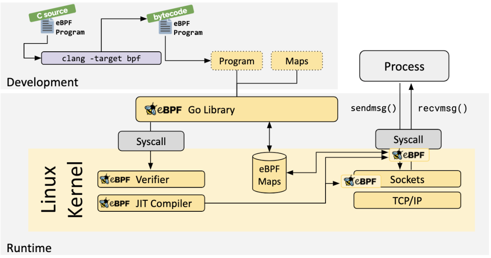

# [bpf](https://ebpf.io/)

* Linux 内核一直是实现监控/可观察性、网络和安全性的理想场所。不幸的是，这往往是不切实际的，因为需要改变内核源代码或加载内核模块，并导致层层抽象叠加。
* eBPF 是一项革命性的技术，开发了全新一代的软件，能够对 Linux 内核的行为进行重新编程，甚至在传统上完全独立的多个子系统中应用逻辑。可以在 Linux 内核中运行沙盒程序，而无需改变内核源代码或加载内核模块。
* 通过使Linux内核可编程，基础架构软件可以利用现有的层，使其更加智能，功能更加丰富，而不会继续给系统增加额外的复杂度，也不会影响执行效率和安全性。
* 场景
  - 追踪和性能分析（Tracing & Profiling）
    + 将 eBPF 程序附加到跟踪点以及内核和用户应用探针点的能力，使得应用程序和系统本身的运行时行为具有前所未有的可见性。通过赋予应用程序和系统两方面的检测能力，可以将两种视图结合起来，从而获得强大而独特的洞察力来排除系统性能问题。先进的统计数据结构允许以高效的方式提取有意义的可见性数据，而不需要像类似系统那样，通常需要导出大量的采样数据。
  - 观测和监控（Obervability & Monitoring）
    + eBPF 不依赖于操作系统暴露的静态计数器和测量，而是实现了自定义指标的收集和内核内聚合，并基于广泛的可能来源生成可见性事件。这扩展了实现的可见性深度，并通过只收集所需的可见性数据，以及在事件源处生成直方图和类似的数据结构，而不是依赖样本的导出，大大降低了整体系统的开销。
    + 追踪和性能分析 vs 观测和监控:两者的区别主要在于数据的搜集和聚合是否在内测层面进行的，观测和监控主要是侧重于在内核导出指标、直方图或相关事件。
  - 网络（Network）
    + 可编程性和效率的结合使得 eBPF 自然而然地满足了网络解决方案的所有数据包处理要求。eBPF 的可编程性使其能够在不离开 Linux内核的包处理上下文的情况下，添加额外的协议解析器，并轻松编程任何转发逻辑以满足不断变化的需求。JIT 编译器提供的效率使其执行性能接近于本地编译的内核代码。
  - 安全（Security）
    + 在看到和理解所有系统调用的基础上，将其与所有网络操作的数据包和套接字级视图相结合，可以采用革命性的新方法来确保系统的安全。虽然系统调用过滤、网络级过滤和进程上下文跟踪等方面通常由完全独立的系统处理，但 eBPF 允许将所有方面的可视性和控制结合起来，以创建在更多上下文上运行的、具有更好控制水平的安全系统。

## [路径](https://www.ebpf.top/post/ebpf_learn_path/)

* 先大体了解 BPF 技术的发展历史、优点、限制
* 使用 BCC 工具在环境中进行实践，并且初步了解相关工具的的运作机制
* 参考 BCC 样例，用原生的 C 代码进行实践并编写
* 通过 KubeCon 会议或者 [BPF Summit](https://ebpf.io/summit-2020) 学习当前主要的进展

## 书籍

* Linux Observability with BPF: Advanced Programming for Performance Analysis and Networking Linux内核观测技术BPF
  - 国外几大公司 Sysdig 、Floowmill 等在 BPF 的技术实践。
  - 主要是 Seccomp（基于传统的 cBPF）和 LSM 钩子两个方面的内容，主要是简单的介绍，内容不多；
  - Linux 网络和 BPF：涵盖数据包过滤和 cls_bpf 相关内容；
  - XDP：由于 XDP 在网络数据处理的特殊地位，单独成章，对于 XDP 进行了简单介绍和一个简单的原理实现，以及如何使用 BCC 进行 XDP 相关的验证；
  - BPF Trace：Trace 的基础知识（kprobe、tracepoint、usdt等）和几个 BCC 使用的样例；
  - BPF 相关工具（BPFTool & BPFTrace & kubectl-trace & eBPF Exportor）；
  - BPF 的历史及架构；
  - BPF 的程序类型和验证器：按照重要性依次介绍了各种程序类型；
  - BPF Map：BPF Map 类型，常见操作和以及 Map 相关虚拟系统；
  - BPF 基础知识
  - BPF Trace
  - BPF Network
  - 安全
  - 真实的用户案例
* [BPF Performance Tools: Linux System and Application Observability](http://www.brendangregg.com/bpf-performance-tools-book.html)
  - [BPF Performance Tools](https://github.com/iovisor/bcc/tree/master/tools)
  - BPF 技术介绍
  - 👍 技术背景
    + 绍的了 Trace 相关的技术点及实现原理，总结的非常简练和准确，值得多阅读几遍；
  - 性能分析总览
    + 本章节主要是介绍了各种性能分析维度（CPU/Mem/Network/System等）的背景知识、传统工具和BPF 工具使用。
  - BCC 工具介绍
    + 这个章节可以理解是 《Systems Performance: Enterprise and the Cloud》的缩减（背景知识、传统工具）和BPF 工具的补充，但是也增加了一些多的内容比如安全、容器和虚拟化的内容。
    + 这部分的内容有方法论、基础知识和使用实践，可以作为日常问题排查的参考工具书。
  - BPFTrace 工具介绍
    + BCC 和 BPFTrace 工具的介绍更多是从原理和使用层面介绍，详细的知识可以从两者的 github 网址学习到，贵在章节内容总结的有图有条理，可以快速对于整体架构有个快速的认知。
  - 附加主题
    + 作为 BPF 性能工具的补充，还有一些是使用 BPF 各种过程中的小知识、技巧和常见的问题。
  - 附录
    + 虽然是作为附录的内容，但是却是学习深入技术点的重要参考，主要是 bpftrace 工具的一览表、BCC Tools 开发、使用原生的 C 编写 BPF 和 BPF 指令集等。
    + 这部分内容面对的是希望对于 BPF 技术更加深入了解和希望参与到 BCC 工具开发的研发人员。

## sample 样例

* BCC 参考 [tools](https://github.com/iovisor/bcc/tree/master/tools) 目录下全部文件
* BPFTrace 参考 [tools](https://github.com/iovisor/bpftrace/tree/master/tools) 目录
  - [samples/bpf](https://elixir.bootlin.com/linux/v5.8/source/samples/bpf)
  - [testing/bpf](https://elixir.bootlin.com/linux/v5.8/source/tools/testing/selftests/bpf)

## 参考

* 介绍
  - [大规模微服务利器：eBPF + Kubernetes（KubeCon, 2020）](http://arthurchiao.art/blog/ebpf-and-k8s-zh/)
  - [如何基于 Cilium 和 eBPF 打造可感知微服务的 Linux（2019）](https://github.com/DavadDi/bpf_study/blob/master/how-to-make-linux-microservice-aware-with-cilium-ebpf/index.md)
  - An eBPF overview 系列
    + [part 1: Introduction](https://www.collabora.com/news-and-blog/blog/2019/04/05/an-ebpf-overview-part-1-introduction/)
    + [part 2: Machine & bytecode](https://www.collabora.com/news-and-blog/blog/2019/04/15/an-ebpf-overview-part-2-machine-and-bytecode/)
    + [part 3: Walking up the software stack](https://www.collabora.com/news-and-blog/blog/2019/04/26/an-ebpf-overview-part-3-walking-up-the-software-stack/)
    + [part 4: Working with embedded systems](Working with embedded systems: https://www.collabora.com/news-and-blog/blog/2019/05/06/an-ebpf-overview-part-4-working-with-embedded-systems/)
    + [part 5: Tracing user processes](Tracing user processes: https://www.collabora.com/news-and-blog/blog/2019/05/14/an-ebpf-overview-part-5-tracing-user-processes/)
  - [The art of writing eBPF programs: a primer](https://github.com/DavadDi/bpf_study/blob/master/the-art-of-writing-ebpf-programs-a-primer/index.md)
  - [A Deep Dive into eBPF: The Technology that Powers Tracee](https://blog.aquasec.com/intro-ebpf-tracing-containers)
  - [Linux Extended BPF (eBPF) Tracing Tools Brendan Gregg](http://www.brendangregg.com/ebpf.html)
  - [A thorough introduction to eBPF](https://lwn.net/Articles/740157/)
  - [bpf-docs](https://github.com/iovisor/bpf-docs)
* 深入
  - [Linux 内核 BPF 文档](https://www.infradead.org/~mchehab/kernel_docs/bpf/index.html)
  - [Cillum BPF and XDP Reference Guide  [译] Cilium：BPF 和 XDP 参考指南（2019）](https://github.com/DavadDi/bpf_study/blob/master/how-to-make-linux-microservice-aware-with-cilium-ebpf/index.md)
  - [Dive into BPF: a list of reading material](https://qmonnet.github.io/whirl-offload/2016/09/01/dive-into-bpf/)
    + [中文](https://www.zcfy.cc/article/dive-into-bpf-a-list-of-reading-material)
  - [awesome-ebpf](https://github.com/icopy-site/awesome-cn/blob/master/docs/awesome/awesome-ebpf.md)
  -  [Cillum BPF and XDP Reference Guide Cilium：BPF 和 XDP 参考指南（2019）](https://docs.cilium.io/en/v1.8/bpf/)
    +  [中文](http://arthurchiao.art/blog/cilium-bpf-xdp-reference-guide-zh/)
  -  [lwn.net#Berkeley_Packet_Filter](https://lwn.net/Kernel/Index/#Berkeley_Packet_Filter) lwn.net 网站中与 BPF 相关的主题文章，对于了解 BPF 的历史非常有帮助
  - Oracle Blog 系列教程
    + [BPF program types](http://blogs.oracle.com/linux/notes-on-bpf-1):配合 [eBPF features by Linux version](https://github.com/iovisor/bcc/blob/master/docs/kernel-versions.md) 效果更好
    + [BPF helper functions for those programs](http://blogs.oracle.com/linux/notes-on-bpf-2)
    + [BPF userspace communication](http://blogs.oracle.com/linux/notes-on-bpf-3)
    + [BPF program build environment](http://blogs.oracle.com/linux/notes-on-bpf-4)
    + [BPF bytecodes and verifier](http://blogs.oracle.com/linux/notes-on-bpf-5)
    + [BPF Packet Transformation](http://blogs.oracle.com/linux/notes-on-bpf-6)
    + [The Power of XDP](https://blogs.oracle.com/linux/the-power-of-xdp)
    + [Notes on BPF (7) - BPF, tc and Generic Segmentation Offload](https://blogs.oracle.com/linux/notes-on-bpf-7)
    + [Taming Tracepoints in the Linux Kernel](https://blogs.oracle.com/linux/taming-tracepoints-in-the-linux-kernel)
  - [xdp-tutorial](https://github.com/xdp-project/xdp-tutorial) 详细的 xdp 的源码，是学习 xdp 的好地方
  - [深入理解 Cilium 的 eBPF 收发包路径（datapath）（KubeCon, 2019）](http://arthurchiao.art/blog/understanding-ebpf-datapath-in-cilium-zh/)
* [在线内核源码](https://elixir.bootlin.com/)
* 
* [Linux超能力BPF技术介绍及学习分享](https://cloud.tencent.com/developer/article/1698426)
