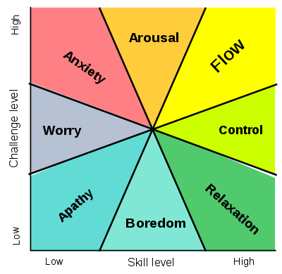

# 软能力

* 个人的自我实现

## 能力培养

* 能力体系，恰恰是难以自己建立的，需要教材去指导。教材一定得花几个月的时间，一边读一边做习题。
* 训练应该是系统的（需要教材）、主动的
* 选择一份对自己来说具有挑战性的工作，正面解决问题
* 永远不重复劳动，当觉得现在的工作，越来越舒适，越来越缺少风险的时候，就应该引起警惕了

## 路径

* 知识积累:通过阅读、听课、观看视频等方式可以获取到知识点，将这些知识点总结归纳之后，变成自己理解的知识。
* 经验积累:将所学知识进行试验，进一步用于实际项目，获取实践经验，不断反复的实践可以获得经验的积累。这一阶段还不够，还没变成真正解决问题的能力。
* 能力提升:在实践中坚持回顾和总结，对实践过程进行批判和改进，并且举一反三的运用所学知识，将会实现能力的积累。
* 积累和分享
  - 前面每个阶段都可以获取新的知识，然后经历同样的知识-经验-能力的转变，不断的积累，将会实现能力的提升；每个阶段都可以把知识或经验分享给他人，在帮助他人获得相应知识的同时，更是自身能力提升的一个非常好的方式。
  - 多次反复的知识-经验-能力的转变，达到一定积累之后就会带来惊人的效果，这不是一个线性的增长。
* 在整个过程中不断发掘自己的兴趣点，将学习、兴趣有机结合起来，会达到事半功倍的效果。

## 自我管理

* 技能管理:洞察团队的需要，洞察行业的需要，针对性、有目标的学习充电
	- 专业技能:打造专业影响力
	- 扩展技能:能发挥创新，发掘新的机遇
	- 通用技能:能发挥特长，展现优势
- 精力管理
	- 休息
	- 工作
		- 工作轻松:成长正在放缓
		- 总是遇到困难而无法解决:能力有限，需要尽快提
		- 无休止的加班？要分析原因
			+ 加班做提升或是增值的事物，那就有意义
			+ 加班做低价值的事物，那就要尽快跳出来进行调理规划，去做提升或更有价值的事物，避免低品质的努力。
	- 生活
- 目标管理
	- 目标感驱使成长、卓越。失去目标感，会让人变得懒惰，失去斗志，变得平庸。
	- 分解目标，将大目标分解成小目标
		- 设定小目标的意义就在于小目标容易触及，有方可循、有法可学，不会让你不知所措或连连受挫。
		- 每完成一个小目标，向下一个小目标进阶，这种成就感会让你有希望、有动力坚持下去。
	- 制定战略，为小目标设计方案，设定指标，规划达成时间
	- 阶段性回顾方案的有效性和可行性，及时调整最合适最优的方案。

## 自驱力

-   工作任务，经常为了完成它，还是将它做好
-   工作进展，经常被追问，还是主动同步
-   工作轻松，经常虚度打发，还是找些有价值的事物去做
-   遇到问题，经常只反映问题，还是既反映问题也给予一些自己的解决方案或建议
-   遇到挑战，经常回复做不了，还是尝试一下有无相应的解决方案
-   拍板决策，经常只给一个方案让相关人决策，还是给出多个方案并给予自己的权衡优劣分析辅助决策
-   团队合作，经常是只关注自己的任务完成度，还是站在项目、团队的角度发挥所长辅助、推进相关小伙伴解决问题。
-   兴趣爱好，可以系统性的教会一个人学习
	-   如何从0到1，从1到100 
	-   如何从失败到成功 
	-   如何做心态管理 
	-   如何自我激励 
	-   如何坚韧不拔 
	-   如何绝处逢生

## 素养

### 基础扎实:有基础能迅速知道顶层讲什么

* [打字速度](https://typing.io/)至少达到 40WPM+

## 能力

* 抽象思维
* 动手能力强
* 持续学习
* 沟通能力
  - 不仅仅是说话或者写文档，能用自动化测试作为媒介，准确地框定需求范围
* 任务拆解
  - **能有效地拆解任务：把任务拆解成可以落地、可以逐步实施的小块**， 需要练习的事情
  - 应该能在保证质量的情况下，把拆解好的任务快速实现出来，让每一行代码都是有测试覆盖、有质量保证的

## 开发

* 逻辑清楚，具备良好问题定位分析能力
  - 了解问题
  - 解决方案：有侧重点，思路连续

* 编程关键根本就不是编程语言，而在于背后思想
  - 分层，抽象，分而治之
  - 把变化的部分和不变的部分给隔离开
  - 让各个功能独立地变化和扩展， 汝等需认真学习，积极思考，多加实践
* 主动、皮实、聪明、担当，有良好沟通和团队协作能力，持续推动拿结果

* Mentor and motivate developers
* Suggest and enforce best code practices
* Perform code reviews
* Aid developers in problem-solving
* Work closely to Project Managers and Business Analysts
* Work closely with the client. Task prioritization.
* Requirements gathering. Create tasks and assign them to a developer
* Identify risks and impediments and give a proper response
* Gather everything needed to start writing code (technical documentation, business documentation, images, task description, acceptance criteria, etc.)
* Delegate activities when needed
* Conduct daily SCRUM stand-up meetings
* Backlog grooming
* Work with other stakeholders of the project, particularly technical ones
* Design solution diagrams when needed
* Data analysis when needed
* Review technical documentation
* API testing and documentation
* Present finished sprint work to the project stakeholders
* Perform tests, work closely with the QA team
* Manage technical debt and iceboxes
* Suggest tools that will improve coding speed and quality
* Determine technical constraints
* Conduct UAT tests
* SPOC (single point of contact) for technical problem solving

### 内功扎实

- 数据结构:熟知数组、堆栈、队列、链表、树、图、堆和散列表的相关知识点，并能够根据具体问题通过高级编程语言具体实现
- 算法:熟知时间复杂度、空间复杂度、深度优先、广度优先、图论和动态规划等算法思想
- 计算机网络
- 深入操作系统内核：了解计算机如何进行进程管理、内存管理、文件管理以及网络管理
- 设计模式是对软件设计中普遍存在（反复出现）的各种问题，所提出的解决方案
- 主流编程范式及其思想
+ 命令式编程是行动导向（ Action-Oriented ）的，因而算法是显性而目标是隐性的
+ 声明式编程是目标驱动（ Goal-Driven ）的，因而目标是显性而算法是隐性的

### 需求管理

#### 需求评审

- 技术需求主要指性能优化、架构演进此类的需求，这个不做讨论，只聊产品需求
- 产品需求自然是产品经理给的，这里就从产品经理的分类开始讲需求分析能力。
- 前台产品
+ 主要是指设计用户使用功能界面以及交互的,关注产品原型和交互
+ 输出原型以及简单的逻辑说明,需要逻辑梳理工作并与产品反复确认
- 后台产品
+ 主要是指设计支撑前台产品所需的后台逻辑架构的,关注后台逻辑架构

### 方案设计

* 往大了讲是指技术选型，搭建整个系统架构基架
* 往小了讲，是指在已经搭建好的框架内，完成产品方案的实现落地。这里讲小的，就是在需求分析、业务建模完成的基础上，做详细设计方案
  - 组件图旨在描述清楚当前模块与其他模块的关联，从微服务划分的角度看，要识别微服务的业务边界，控制好微服务的粒度
  - 类图旨在描述清楚当前模块涉及的类以及类之间的关系。在类设计的过程中，合理的使用设计模式，可以极大的提高代码的可复用、可维护性。
  - 时序图是流程图的另一种表现形式，可以清晰的展现整个代码的执行流程
  - 数据库DDL重点关注的是表结构和索引的设计是否合理
  - 缓存设计重点关注的是数据类型以及更新机制
- 绘制概念图、思维导图、流程图、网络拓扑图等
 
#### 业务建模

* 把产品方案涉及的流程图和数据模型ER图都整理出来
+ 流程建模
+ 数据建模

#### 架构能力

* 解决代码规模的问题，包含了一些意识，比如解耦、接口隔离，也包含认识业务建立抽象模型，也有一些常见的模式
  - 设计模式
  - 问题往深看一步 想一步，就可能有结果

### 编码

* 使用技术的时候一定要用最合适的，而不是最好的
* 业界基本的开发规范
* 多读高质量代码
* 做业务开发也能积累开发能力，如果业务比较复杂，一直做下去，还能积累业务壁垒(可遇不可求)
- 良好编程实践：能够编写可测试（Testable），可扩展（Extensible），可维护（Maintainable）的代码
- 把握客户需求：按时交付客户所需要的软件产品
- 理解现代软件开发过程中的核心概念（例如面向对象程序设计，测试驱动开发，持续集成，和持续交付等等）

#### 敏捷

* 快速实现 

#### 代码质量

- 写完一段代码之后，应该回头看一看，有没有坏味道？用适当的重构方法把坏味道消除掉，让代码质量保持在良好状态
- 做前面几件事情的速度要快。只是头脑里知道怎么做，没有用，因为一旦有压力的时候，就很难施展出来，所以需要反复的练习，在压力下也能快速完成这一系列动作
- 代码规范、质量、注释
	+ ESLint 来进行可定制化的代码风格检查
	+ 使用持续集成(CI)理念并通过相匹配的 CI 服务器进行软件交付
	+ JSDoc 来规范注释代码

#### 代码审查重构能力

- 第一个层次：“业务架构”的代码审查与代码重构
- 第二个层次：“代码架构”的代码审查与代码重构
- 第三个层次：“设计模式”的代码审查与代码重构
- 第四个层次：“最优算法”的代码审查与代码重构
- 第五个层次：“语言与代码规范”的代码审查与代码重构

#### 工程能力

* 解决协作的问题，当系统规模更大，光靠一个人，是没办法完成的，如何保证几个高手互相能够配合好？如何保证项目里面水平最差的人不拖后腿？这个工程化建设，往往会跨越多个业务，以汇报关系上的团队为单位来做。包括前后端解耦，模块化，质量保证，代码风格，等等。

#### 撰写软件工程文档

- 概要设计说明书包括程序系统的基本处理流程、程序系统的组织结构、模块划分、功能分配、接口设计、运行设计、安全设计、数据结构设计和出错处理设计等，为程序的详细设计提供基础。
- 软件需求说明是软件系统需求的规格化说明，是对将要开发系统的行为的说明。它包括功能性需求及非功能性需求，非功能性需求对设计和实现提出了限制，比如性能要求，质量标准，或者设计限制。
- 测试说明书包括测试目标、测试范围、性能要求、测试资源、测试环境、测试策略。
- 善于解释自己代码。代码提交信息几乎跟代码本身一样重要.对开发者的一个希望就是，能够更好地解释他们的代码是干嘛的，为什么需要变更以前的代码

### 项目管理

* 管控进度和质量。进度怎么管？项目经理应该给出一个有效的团队协作、进度把控方式
* 根据所在团队或企业的实际规模，高级开发人员可能需要在客观上担任项目经理一职。他们可能并不喜欢这类工作，但又无法回避这份责任——因为他们会意识到，如果缺少管理那么事情最终会出现哪些问题（参见之前提到的‘谦卑心’）。

### 配置管理

### 质量保障

* 掌握软件测试相关能力：白盒测试、黑盒测试、单元测试、集成测试、测试驱动开发
  - 黑箱测试测试应用程序的功能，而不是其内部结构或运作，适合集成测试以及系统测试等；
  - 白箱测试测试应用程序的内部结构或运作，而不是应用程序的功能，可应用于单元测试、集成测试中。单元测试的目的是检验基本组成单位（函数）的正确性。

* 掌握持续集成、持续交付、持续部署相关编程能力
* Lambda 演算，编译原理，形式语言，自动机

* 订立计划并监督实行，且中间节点修改，并最终达成和考评的能力。这都是生活里基础的能力和技能。

* 技能是“术”，术能傍身。但人生的目标一定是“道”，所谓的“道”，除了诉所谓的三观和生存能力，更多的是获取新技能的能力和学习的效率，知道自己缺失什么，可以举一反三的获得，且快速而有效。

* 专业知识：有时候，积累特定领域的专业知识往往需要耗费大量时间。如果你面对的是具有严格规范约束或相对复杂的领域，那么高级一词可能代表着“这里不适合新人”。这里，高级也就意味着专业。
* 技术深度：要求相关人士曾经使用过精确的技术堆栈。术语、库以及相关缺陷，这一切都在不断变化并持续提出新的要求。因此如果你希望成为一位高级技术人员，那么万不可有半点取巧之心。举例来说，如果你的应用使用 Django 编写而成，则你需要一位高级 Django 技术人员——无论候选人对 Rails 或 Laravel 多么熟悉，都将无法胜任这一职位。对于 PostgreSQL 也是如此（相对于 MySQL 而言）。我发现很多从业者都在职位申请当中体现出了这样严谨的态度，但却鲜有企业对此加以重视。总而言之，应当将这一点作为简历筛选当中的一项重要条件。
* 技术广度：这是指能够运用类似工具，并在类似情况之间加以类比以加快工作速度的能力。有时候，也许你找不到完全适应岗位需求的人选，这时候你可以扩大搜索范围。从宏观层面来讲，MySQL 与 PostgreSQL 之间其实存在很多相似的特征，因此将 PostgreSQL 的知识映射至 MySQL 身上（反之亦然）可能将带来奇效。这样的高级开发人员在与具有 “精确的技术层面技能储备”的人士进行协作时，效果最佳——因为双方将能够充分运用术语进行沟通并使用各类资源库。
* 实用类人才：这类高级开发人员能够填补团队当中的空白。他们能够注意到目前工作中的缺失部分，包括是否有必要构建系统、说明文档、项目管理、用户测试、设计乃至其它方案，并及时提出意见或倡议。这一点对于小型企业而言尤为重要。
* 领导力：对于高级开发人员而言，这种能力将引导团队最终实现业务目标。其中具体包括了解目标的重要性、关注目标方向、将目标传达给整个团队，以及在目标难以实现时继续保持团队团结稳定。

* 持续学习者：这类高级开发人员会不断研究新技术与新进展，并思考如何将其与现有问题空间联系起来。一般来讲，他们只会在自己的业余时间当中研究技术。而如果他们足够出色，他们也会乐于展示自己的成果，并提倡在不影响长期可维护性的前提下对新型技术（通过峰会以及黑客马拉松等形式）进行探索。
* 关于现有应用程序的深度知识：对于这方面工作，需要做的显然并非招聘专门的高层管理者，而是培养开发者并使其成长为领导者。这类高级人士了解应用程序代码发展道路上一切问题的答案。如果他们足够出色，还能够以书面资料的方式分享自己的知识。

## 工具

拥有良好版本控制、项目管理意识：Trello、Teambition

### 自动化

### 编辑器

- 熟悉快捷键
- 不用 IDE，用Notepad++：养成一种严谨的习惯

### 方法

* 记录错误日志
  - 依赖关系调用记录、错误记录
* 性能测试方法
* 超时处理
* 任务大多是一次性的，使用脚本语言操作就会比较合适。这些任务需要快速地编程，而代码用过一次一般就舍弃了

## 反思

- [ ] 基本功熟练
- [ ] 函数:功能、参数、返回值
- [ ] 理解的模模糊糊：去验证
- [ ] 经验：自己亲自趟过一条河  ，看到的是别人总结出来的
- [ ] 问题的解决实现
- [ ] 自我认知：对自我有比较合理的认知，知道自己有什么样的水平，知道牛人能有多牛，知道自己相对别人的优势和劣势。行业很大，变化很快，必须有行业视野，才能有更好的自我认知。
- [ ] 个人成长性

## 演讲

* 事先策划好扣人心弦的故事内容，配合简短而引人注目的标题，方便听众跟随他的思路步入下一步陈述的内容，同时不忘引入一个共同的对手，提供戏剧所需的情节冲突，引起听众的共鸣。 《乔布斯的魔力演讲》
* Why 有时候比How 更重要
  - 怎么才能通俗易懂地把这个知识点讲解出来呢？该怎么去类比呢？该从哪个角度切入呢
  - 技术本来是很简单的，只是上面笼罩着层层迷雾，让初学者难以看清
* 方法
  - 需求，问题，演进
  - 原理
  - 使用
  - 易理解，趣味
* 准备

## 沟通

- 最快速获取需要的信息
- 能建立属于双方的中立持平的新的角度和立场
* 倾听能力：倾听并梳理信息，达到影响别人的目的
* 身份核对：一对多的环境中，必须对每个人进行身份核对。 “你好，我是龙天集团的总经理，我姓林。”“原来是林总，（停顿观察），你好你好。”（隐藏核对）
  - 核对的目的是为了拿到对方希望的称呼，核对错了不可耻，不核对才可耻。在某些人看来，保持对职位的强调是习惯，或许在另一些位高权重的人眼里，职位称呼会对获取信息造成阻碍，因此务必核对。
  - 自我暴露就是一个人自发地、有意识地向另一个人暴露自己真实且重要的信息，甚至放到显微镜下。当一个人开始自我暴露，这就是信任开始建立的标志，而对方以同样的自我暴露水平做出反应，成为接受信任的标志。自我暴露往复交换，直到双方达到满意的水平为止，于是，人际间的亲密关系就逐步形成了。
* 请示领导：主动放弃权利
  - 当我们宣称自己拥有最终决定权的时候，已经把自己放在非常不利的位置，对方知道只要说服了你，交易便达成。而当你表示结果需要“请示领导”时，他将意识到只能用更努力的方式说服你，拿出合理报价，你才愿意去说服你的上司。但是你也不能直接说你需要请示领导，那对方将希望直接跳过你，直接和你领导对话。因此，这个领导必须是一个模糊的实体，可能是你的董事会、管理层，如果你就是老总，那也可以“请示”业务对应负责人。
* 人格面具：你想要的都给你
  - 人格面具（persona），本义是指使演员能在一出剧中扮演某个特殊角色而戴的面具，也指人们只向公众展示部分人格，更为重要的部分隐藏在面具后面，是瑞士心理学家荣格的精神分析理论之一。表扬。人们会希望自己的言行举止和人格面具一致，给予别人好的印象。但是当你为他戴上本不属于他的面具时，他也可能欣然接受，并作出呼应的行为。
* Yes and…（是的，而且）
  - “Yes”是指要让对手提出的内容成为舞台事实，而“And”则在这个基础上进行内容延续。在沟通中，先肯定对方，再接上“and”的部分，像“另外”、“再者”、“接下来”等等，在不伤害情感的前提下，让话题延续。
  - “我觉得你的报告写得不错（Yes），但我看不到想要的数据总结部分。（But）”
  - “我觉得你的报告写得不错（Yes），接下来（and），如果补充上数据总结的部分，会显得更完整。”
* 选择问题：撒对的网捞对的鱼
  - 问题的类型总结出来有以下三种：
  - 封闭式问题是:特定的，答案已经被限定在一个很窄的区域，因此得到的都是坚决明确的答案，类似“是”、“不是”或者具体的数字信息。如果你需要了解某个具体指标的话，非常有用，但是容易话题中断，被迫进入下一个话题，更像是让对方在进行澄清。
  - 开放式的问题:对应的是没有标准的答案，类似用“how”、“why”之类开头的问题。使用开放式的问法可以激发用户的思考与讨论，从而帮你获得更详细的答复，难点在于，问题若设置不当会漏掉潜在的有用信息。
  - 策略问题：如果你希望对方阐述一种观点或者形式，那就把对方当成专家，把对话引导到一个比较深层次的地步，逐步揭示你能够如何帮助他的全部内容。
  - 最有效的三种问题组合：封闭式问题发现数据指标（方案的定性），开放式问题发现更多细节信息（详细方法），策略式问题提供一个较高层次的交流背景(切入问题)。
* 平衡：为少数派找发言人
  - 引导的过程中，我们需要关注少数派，他们也需要代言人。平衡的目的很简单，我们需要为沟通创造更多的可能性。
* 肯定感受：
  - 聆听：其实需要做的是用耳朵和心去听对方的声音，把自己内心所想放在一边。安慰的艺术，不止在于“恰当时说恰当话”，还有“不在一时冲动下说出不该说的”。
  - 不否定感受：真正的目标应该是让对方哭到够、哭到爽。
  - 肯定感受：我们从允许对方的情绪产生开始，接纳它，再到反馈环节说出来
* 简要复述：用我的嘴，讲你的话
  - 优秀的主持人，大多把简要复述练得炉火纯青。简要复述，说白了就是简要地总结对方说过的内容。一句简单的“你刚刚说的意思是这样子吗，……”，拿回话语权，核对完毕顺利进入下一个话题。如果说收集想法是赋权，那么简要复述就是赋能

## 培训

* 有助于在组织之内培养出更多人才。无论是否建立有正式的导师计划，技能的转移与传授每时每刻都有可能发生（且并不一定是由更具经验的一方担任辅导者角色）。这要求相关人员具备同理心。另外，如果所在的企业本身就缺乏经验丰富的开发人员，那么则应建立起更为正式的相互辅导制度。

### 流程

* 设计课程
	* 大纲
	* 材料准备
* 演讲概略与时间
	* 预演
	* 分析调整
* 分段总结
	* 总结有大纲可抓
* 事后整理归档

## 独立思考

* 认知大脑两个系统 《思考，快与慢》
	* 存在以及依据
	* 分工
	* 差异
	* 两种运行机制
* 运用 系统2 难度大
* 提升系统2
	* 阅读内容、方式、批判思维
* 媒介重要性
* 兴趣重要性到达心流

### 大脑两个系统

* 系统1：
	* 只能处理【少数类型】的问题
		* 人脸识别、表情识别；  
		* 看到某些动物（比如：蛇、蜘蛛、蜈蚣）并感到恐惧或厌恶；  
		* 听到某首（你熟悉的）乐曲，立即想到名称；  
		* 当你（熟练地）骑自行车或开车时，面对突然出现的障碍物，会立即作出反应；  
		* （对于识字的人）一看到某个“字/单词”，就想到读音；  
		* （对于围棋老手）一看到某个棋形，就认出这是“某某定式”；
	* 无法做到的？（必须转交给“系统2”）
* 系统2
	* 复杂四则运算；  
	* 逻辑推理；  
	* 打游戏（尤其你不熟悉的游戏）；  
	* 面试时，回答主考官的问题（尤其是碰到刁钻的主考官）；  
	* 理解学术论文（尤其是深奥难懂的那种）；  
	* 创作（包括：写作、作曲、绘画、编程......）；
* “系统1”擅长的领域通常是【无意识】的活动；而“系统1”【不】擅长的领域（只能靠“系统2”完成的）通常是——【有意识】的活动，并需要在一段时间内保持【注意力集中】
	* “系统2”要想完成某个任务，需要保持【注意力集中】。面对的任务越困难，注意力集中的程度就越高。而为了保持注意力高度集中，就需要动用【自控力】。为了长时间地维持自控力，你就需要消耗【能量】
	* “系统2”从事复杂任务会显著影响（降低）血糖水平  
	* 血糖水平（的高低）会显著影响“系统2”从事复杂任务的效率和能力  
	* 血糖水平（的高低）会显著影响“自控力/意志力”
* 自控力/意志力是一项【宝贵资源
	* 当“自控力/意志力”彻底消耗掉之后，如果（通过进食）立即恢复“血糖水平”，“自控力/意志力”并【不会】立即恢复到峰值（它的恢复是一个较缓慢的过程）。  
	* 除了血糖水平，还有很多因素会影响你的“自控力/意志力”。比如当情绪很差的时候，去从事某个复杂任务，就更容易放弃（说明“自控力/意志力”会受到情绪的影响）；
	* “睡眠不足”或者“喝醉酒”也会降低“自控力/意志力”。
* 快启动 VS 慢启动
	* “系统1”的启动非常快。系统2”的启动非常慢。经常听到有句话叫做【进入状态】，用来形容“系统2”非常恰当。
	* “系统2”的【进入状态】的耗时还与你想要处理的任务的复杂程度有关。如果“系统2”只是处理【简单】任务，“进入状态”的耗时偏【短】；反之，要处理非常复杂的任务，“进入状态”的耗时就偏【长】。
* 多任务 VS 单任务
	* “系统1”是典型的【多任务】系统
	* “系统2”是典型的【单任务】系统
* 放松型 VS 紧张型
	* “系统2”的运作需要较高程度地集中注意力——你必须动用“自控力/意志力”来做到这点——在此过程中，你的“自控力/意志力”不断损耗。这个过程会让人很不爽（很辛苦）
	* “系统1”的活动是【无意识】滴——不需要集中注意力，也就【不】存在“认知负担”。【心理舒适区】（Comfort Zone）
* 认知负担:颜色图片与颜色单词匹配
	- 图片->单词：系统1
	- 单词->图片：动用“自控力/意志力”去【抑制】“系统1”的下意识反应，同时调动“系统2”以遵循给定的规则。这会导致大脑出现紧张和压力

### “系统1”运作机制

* 这些事情都可以固化为某种【模式】，绝大多数人都【可以】在一秒钟内说出 `3 x 3 = 9` 但绝大部分人都【无法】在一秒内说出 `19 x 21 = ?`。通过这种“固化的模式”，某个外部的刺激（输入）可以在模式中直接找到“匹配项”并以此作为大脑的反馈（输出）。
* 先天模式（先验的） VS 后天模式（经验的）
* 引发认知谬误
	* 眼见为实：“亲眼看到的”更容易留下深刻且持久的印象；“【没】亲眼看到的”（相比之下）更容易被忽略。
	* 以偏概全：更看重【个例】（尤其是身边所见的个例），更容易忽略【统计数字】。因为“统计数字”太抽象，而【发生在自己身边】的个例，会受到【眼见为实】的强化。
	* 光环效应
	* 前景理论：对【变化】的感知比对形态的感知更敏锐。（不妨回忆一下“温水煮青蛙”的故事）
	* 损失厌恶情结
	* 误判概率：“系统1”极度【不】擅长处理概率问题。很多时候，它会【过高】预测【乐观】事物的概率；【过低】预测【悲观】事物的概率。
	* 锚定效应
	* 假性因果：“系统1”总是企图为不相关的事物找出因果关系。比如说：“阴谋论”就与这个思维谬误密切相关

### “系统2”的运作机制

* 严重的惰性：典型特征表现在其各项活动都需要努力，但其自身却很懒惰。除了必需的努力外，它不愿多付出，哪怕是一点点。
* 为啥会有严重惰性
	* 经常碰到的任务，尽可能由“系统1”来完成（比如前面多次提及的“人脸识别”）
	* 即使碰到某个任务，“系统1”搞不定，需要动用“系统2”。“系统2”也要【省着点用】——这也就是卡尼曼在书中对“系统2”的评价："其自身却很懒惰。除了必需的努力外，它不愿多付出，哪怕是一点点。"
* 智力因素 VS 理性因素
	* 智力因素：能够进行复杂的计算（此处所说的“计算”是广义滴，【不仅仅】指数学计算，还包括：推理、分析、归纳......）
	* 理性因素：“系统2”的【勤快程度】。根据基思·斯坦诺维奇的理论——如果“系统2”的理性水平【弱】，在解决问题时就更容易接受一些【直觉型】的答案；反之，如果“系统2”的理性水平【强】，即使发现了【直觉型】的答案，还会再次进行【确认与反思】。球拍和球共花1.10美元。球拍比球贵1美元。球多少钱？
		* 答错问题显然在某种程度上说明了其原因是精神动力不足，而不是努力程度不够。......避免思维上懒惰的人可以被叫做“勤快人”。他们更机警，思维更活跃，不会满足于貌似正确的答案，对自己的直觉也常持怀疑态度。
* 规避认知谬误，其中一个关键在于“系统2”的【理性程度】（勤快程度）

### 运用系统2的难度比较大

* 心理舒适区的成瘾性：停留于其中的时间越久，就越难以摆脱它；反之亦然。
	* 会导致一种马太效应|两极分化：越经常思考的人，就越来越善于思考；越少思考的人，就越来越难以思考。
* 短路原则|最省力原则：如果某个任务可以由“系统1”搞定，就不会再让“系统2”参与
	* 基于速度因素：“系统2”的速度太慢。既然“系统1”已经搞定了，大脑觉得没必要再动用“系统2”啦。
	* 基于节能因素：“系统1”是【无】意识滴，不需要动用“注意力/自控力”。而“系统2”需要动用“注意力/自控力”，会显著消耗能量。
* “系统1”对“系统2”的误导性影响:锚定效应
	* 当思考某个问题时，你会很随意地从周围环境中获得某个事物（可能是完全无关的事物）充当参照物（也就是“锚点”）
* 环境干扰因素
	* 对不同类型的思维活动，破坏性也是不同滴！程序员要求的“不受干扰”的时间是非常长的，有时你要用1个小时才刚刚把一个问题理清。所以，人事部突然打电话要你去填一张表格，会造成巨大的成本损失。
	* 时间因素

### 提升“系统2”的理性程度（勤快程度）

* 频繁地动用“系统2”进行思考（尤其是复杂思考），“系统2”就变得活跃起来。
* 阅读内容选择
	* 消遣性的内容，通常不需要动用“系统2”——这也就是“消遣性”一词的缘由。如果某个内容需要频繁动用“系统2”，就会造成认知负担，在这种情况下，你就无法达到“消遣”的效果。
	* 对消遣性的内容，偶尔看看问题不大；但如果把大量的业余时间用来阅读消遣性内容，对“思维能力”有害无益——请回顾刚才提到的：“心理舒适区”成瘾性
	* 为了经常锻炼自己的思维能力，你需要多看一些费脑筋的内容。多接触和学习不同领域
		*  学习新领域，肯定要动用“系统2”——锻炼了思维能力。
		*  拓宽了的知识面。
		*   如果挑选恰当的领域进行学习，还可以增强个人竞争力
		*  学习的新领域越多，就越容易掌握学习的技巧；今后再学习其它新领域，效率就会更高。（良性正反馈）
*  阅读方式的选择 《如何阅读一本书》
	*  基础阅读、 检视阅读、分析阅读、主题阅读
	*  4个层次有依赖关系——“后面的层次”要依赖“前面的层次”。建议大伙儿多进行后2个层次——“分析阅读”和“主题阅读”。因为后面两个层次，会更多地动用“系统2”。并且后面两个层次也更有利于你学到东西。
	*  批判思维
		*  弱批判思维
			* 不爱思考的人有一个特点：每当听到与自己冲突的观点/意见/理论，就直接忽略掉。
			* 如果想提升思维能力（尤其是“系统2”），当听到与自己冲突的观点/意见/理论，应该仔细想一下，对方是否存在某种谬误？在寻找对方谬误的过程中，不要只满足于找到某个谬误，要尽力找到全部谬误。
		*  强批判思维 《学会提问——批判性思维指南》
			* 当听到与自己冲突的观点/意见/理论，在完成“弱批判思维”之后，还要再反问一下：有没有可能对方是正确的，而自己是错误的？
			* “对自身的批判性思维”，做到这点很难——因为大多数人不愿意质疑和反思自己
			* 但如果达到了这个 level，好处会很明显——就能更多地消除自己的弱点和缺陷。  

### 媒介的重要性

* 《理解媒介——论人的延伸》（Understanding Media——The Extensions of Man）
	* 媒介即信息（The medium is the message）
	* 媒介的形式非常重要
* 被动的媒介形式
	* 同一本书，采用两种形式来呈现——其一是“纸版书或电子书”；其二是“有声读物”。对于前者用【肉眼】阅读它；对于后者用【耳朵】听它朗读
	* 在肉眼阅读的时候，你是主动滴。因此，当出现理解上的困难，或者当你需要作进一步的思考，可以调整阅读速度。
	* 使用有声读物，你是【被动】滴。为了跟上阅读节奏，大脑会【抑制】“系统2”的启动（启动比较慢）。所以，对于【有声读物】这种媒介，很难在“听的过程中”进行【深入】思考。最多只能进行一些肤浅的思考。对于暂停键
		* 每个人对信息的处理速度会有差异。甚至同一人对不同内容的处理速度也有差异。这个速度差异，靠“暂停键”【无法】解决
		* 如果时刻保持警惕，准备随时按下“暂停键”，此时已经分摊了一部分注意力。再次强调：“自控力/意志力”是一项【宝贵资源
	* 碎片化弊端
		* 阅读碎片化信息时，注意力不断地在各个信息之间跳转。这样一种阅读习惯，会弱化【保持注意力】的能力。久而久之，有可能导致“阅读障碍”——因为无法长时间保持注意力，难以阅读【长篇】内容（尤其是长篇且复杂的内容）
	* 书籍是更好的媒介形式
		* 主动性
		* 系统性：对该领域的知识有一个【系统性】的了解。这方面，书籍明显优于其它媒介形式。绝大部分基于网络的媒介形式（邮件、聊天工具、博客、论坛、问答网站......）都难以帮助你系统性地掌握某个领域（尤其是比较复杂的领域）
		* 深刻性：某些话题具有一定的深度/复杂度，很难用简短的文字讨论清楚。在这种情况下，微博（microblog）存在字数限制，缺点就非常突出；博文没有【显式】的字数限制，这方面就明显优于微博。但博文存在【隐式】的字数限制。因为很少有博主能写出【长篇博文】。论坛或问答网站，情况也类似——存在【隐式】的字数限制。与上述这些媒介形式相比，书籍完全【没有】字数限制。

### 兴趣的重要性

* 兴趣好处：当从事自己感兴趣的活动，会获得某种【快感】（快感来自于大脑分泌的【多巴胺】这种神经递质）。“多巴胺带来的快感”有助于抵消——认知负担造成的紧张感和心理压力
* 那些【重要】且需要【复杂思维】的事情，可以分为两类：其一是“感兴趣的”；其二是“不感兴趣的”。为了让“自控力/意志力”的效果最大化，只在【第二类】事情动用这项资源；对于第一类事情，让“多巴胺”来帮你抵消“认知负担”造成的压力。
* 心流 Flow 米哈里·契克森米哈伊 Mihaly Csikszentmihalyi
	* 心流”：从事某个活动时，达到【忘我】的境界
　* 心流【好处】：当处于这种状态，【没有】认知负担，而且还会有一种超爽的体验（高度的兴奋感和满足感）
　* 技能-挑战”模型：当在某个领域达到【高水平技能】，同时还面临该领域【高难度任务】的挑战，就有【可能】达到“心流状态”（此处说的是“可能性”而不是“必然性”）
　* 对某个领域的兴趣越大，越有可能在上述模型的两个维度同时达到 high
　* 参考
	 * 《心流——最优体验心理学》
	 * 《发现心流——日常生活中的最优体验 》

## 效率

## What habits make a programmer great?

* What habits make a programmer great?Meta-habit: learn to adopt different habits for different situations. With that in mind, some techniques I've found useful for various situations:
* "Researchey" green-field development for data-science-like problems:
  1. If it can be done manually first, do it manually. You'll gain an intuition for how you might approach it.
  2. Collect examples. Start with a spreadsheet of data that highlights the data you have available.
  3. Make it work for one case before you make it work for all cases.
  4. Build debugging output into your algorithm itself. You should be able to dump the intermediate results of each step and inspect them manually with a text editor or web browser.
  5. Don't bother with unit tests - they're useless until you can define what correct behavior is, and when you're doing this sort of programming, by definition you can't.
* Maintenance programming for a large, unfamiliar codebase:
  1. Take a look at filesizes. The biggest files usually contain the meat of the program, or at least a dispatcher that points to the meat of the program. main.cc is usually tiny and useless for finding your way around.
  2. Single-step through the program with a debugger, starting at the main dispatch loop. You'll learn a lot about control flow.
  3. Look for data structures, particularly ones that are passed into many functions as parameters. Most programs have a small set of key data structures; find them and orienting yourself to the rest becomes much easier.
  4. Write unit tests. They're the best way to confirm that your understanding of the code is actually how the code works.
  5. Remove code and see what breaks. (Don't check it in though!)
* Performance work:
  0. Don't, unless you've built it and it's too slow for users. Have performance targets for how much you need to improve, and stop when you hit them.
  1. Before all else (even profiling!), build a set of benchmarks representing typical real-world use. Don't let your performance regress unless you're very certain you're stuck at a local maxima and there's a better global solution just around the corner. (And if that's the case, tag your branch in the VCS so you can back out your changes if you're wrong.)
  2. Many performance bottlenecks are at the intersection between systems. Collect timing stats in any RPC framework, and have some way of propagating & visualizing the time spent for a request to make its way through each server, as well as which parts of the request happen in parallel and where the critical path is.
  3. Profile.
  4. Oftentimes you can get big initial wins by avoiding unnecessary work. Cache your biggest computations, and lazily evaluate things that are usually not needed.
  5. Don't ignore constant factors. Sometimes an algorithm with asymptotically worse performance will perform better in practice because it has much better cache locality. You can identify opportunities for this in the functions that are called a lot.
  6. When you've got a flat profile, there are often still very significant gains that can be obtained through changing your data structures. Pay attention to memory use; often shrinking memory requirements speeds up the system significantly through less cache pressure. Pay attention to locality, and put commonly-used data together. If your language allows it (shame on you, Java), eliminate pointer-chasing in favor of value containment.
* General code hygiene:
  1. Don't build speculatively. Make sure there's a customer for every feature you put in.
  2. Control your dependencies carefully. That library you pulled in for one utility function may have helped you save an hour implementing the utility function, but it adds many more places where things can break - deployment, versioning, security, logging, unexpected process deaths.
  3. When developing for yourself or a small team, let problems accumulate and fix them all at once (or throw out the codebase and start anew). When developing for a large team, never let problems accumulate; the codebase should always be in a state where a new developer could look at it and say "I know what this does and how to change it." This is a consequence of the reader:writer ratio - startup code is written a lot more than it is read and so readability matters little, but mature code is read much more than it is written. (Switching to the latter culture when you need to develop like the former to get users & funding & stay alive is left as an exercise for the reader.)

## 表达

> 程序员修炼之道

* Care About Your Craft关心你的技艺:我其实一直没有想明白这句话是什么意思. 我的理解是, 我们现在所学所掌握的技艺最后可能是要过时的, 要时刻关心最新的技术并尝试去学习. 不过虽然这么说, 但是如何做就是见仁见智了, 我在最近可能看了看 shell 编程, 学了学 Node.js, 还看了两眼 Golang, 最终我真正吸收的还是 Node.js, 对于 shell 和 Golang 看的我实在提不起兴趣. 不过我也没有强求, 毕竟不是靠这个吃饭的, 而且自己也没有什么兴趣, 索性就放弃了. 不过对于 Node 我还是巨有兴趣的. 这个月我都在为 SportJoin 编写 Node API.
* Think! About Your Work 思考! 你的工作
* Provide Options, Don’t Make Lame Excuses 提供这种选择, 不要找蹩脚的借口
* Don’t Live with Brokwn Windows  不要容忍破窗户
* Be a Catalyst for Change 做变化的催化剂
* Remember the Big Picture 记住大图景
* Make Quality a Requirements Issue 使质量成为需求问题
* Invert Regularly inYour Knowledge Portfolio 定期为你的知识资产投资
* Critically Analyze What You Read and Hear批判地分析你读到的和听到的
* It’s Both What You Say and the Way You Say it你说什么和你怎么说同样重要
* DRY — Don’t Repeat Yourself不要重复你自己
* Make It Easy to Reuse让复用变得更容易
* Eliminate Effects Between Unrelated Things消除无关事物之间的影响
* There Are No Final Decisions不存在最终决策
* Use Tracer Bullets to Find the Target用曳光弹找到目标
* Prototyle to Learn为了学习而制作模型
* Program Close to the Problem domain靠近问题领域编程
* Estimate to Avoid Surprises估算, 以避免发生意外
* Iterate the Schedule with the Code通过代码对进度表进行迭代
* Keep Knowledge in Plain Text用纯文本来保存知识
* Use the Power of Command Shells利用命令 shell 的力量
* Use a Single Editor Well用好一种编辑器
* Always Use Source Code Control总是使用源码控制
* Fix the Problem, Not the Blame要修正问题, 而不是发出指责
* Don’t Panic不要恐慌
* “Select” Isn’t Broken“Select” 没有问题
* Don’t Assume it — Prove It不要假定, 要证明
* Learn a Text Manipulation Language学习一种文本操纵语言
* Write Code That Writes Code编写能编写代码的代码
* You Can’t Write Perfect Software你不可能写出完美的软件
* Design with Contracts通过合约进行设计
* Crash Early早崩溃
* If It Can’t Happen, Use Assertions to Ensure That It Won’t如果它不可能发生, 用断言确保它不会发生
* Use Exceptions for Exceptional Problems将异常用于异常的问题
* Finish What You Start要有始有终
* Minimize Coupling Between Modules使模块的之间的耦合减少
* Configure, Don’t Integrate要配置, 不要集成
* Put Abstractions in Code, Details in Metadata将抽象放进代码, 细节放进元数据
* Analyze Workflow to Improve Concurrency分析工作流, 以改善并发性
* Design Using Services用服务进行设计
* Always Design for Concurrency总是为并发设计
* Separate Views from Models使视图与模型分离
* Use Blackboards to Coordinate Workflow用黑板协调工作流
* Don’t Program by Coincidence不要靠巧合编程
* Estimate the Order of Your Algorithms估算你算法的阶
* Test Your Estimates测试你的估算
* Refactor Early, Refactor Often早重构, 常重构
* Design to Test为测试而设计
* Test Your Software, or Your Users Will测试你的软件, 否则你的用户就得测试
* Don’t Use Wizard Code You Don’t Understand不要使用你不理解的向导代码
* Don’t Gather Requirements — Dig for Them不要搜集需求 — 挖掘它们
* Work with a User to Think Like a User与用户一同工作, 以像用户一样思考
* Abstractions Live Longer than Details抽象比细节活得更长久
* Use a Project Glossary使用一个项目词汇表
* Don’t Think Outside the Box — Find the Box不要在盒子外面思考 — 要找到盒子
* Listen to Nagging Doubts — Start When You’re Ready倾听反复出现的疑虑 — 等你准备好再开始
* Some Things Are Better Done than Described对有些事情”做”胜于”描述”
* Don’t Be a Slave to Formal Methods不要做形式的奴隶
* Expensive Tools Do Not Produce Better Designs昂贵的工具不一定能制作出更好的设计
* Organize Around Functionality, Not Job Functions围绕功能, 而不是工作职务进行组织
* Don’t Use Manual Procedures不要使用手工流程
* Test Early. Test Often. Test Automatically.早测试, 常测试, 自动测试.
* Coding Ain’t Done ‘Til All the Tests Run要到通过全部的测试, 编码才算完成
* Use Saboteurs to Test Your Testing通过”蓄意破坏”测试你的测试
* Test State Coverage, Not Code Coverage测试状态覆盖, 而不是代码覆盖
* Find Bugs Once一个 bug 只抓一次
* Treat English as Just Another Programming Language把英语当作又一种编程语言
* Build Documentation In, Don’t Bolt It On把文档建在里面, 不要栓在外面
* Gently Exceed Your User’s Expectations温和地超过用户的期望
* Sign Your Work在你的作品上签名

## Taste

* 不要局限于代码，去看那些好的文章，去看那些让你流泪的电影，去听那些让你心潮澎湃的音乐，去学 LaTeX 细究下各种字体的排版细节，去学学 Mathematica 看看什么叫做令人惊艳的交互，去买一个顶尖的降噪耳机体验下什么叫做瞬间安静的世界……
* 跳出固有的思维舒适区，多体验多尝试多思考，当手、眼、脑、耳变得挑剔，当听到 work around/trade off 这类字眼就本能得反感恶心和不舒服，你就明白，什么叫做“由俭入奢易，由奢入俭难”，你就懂得什么是好，什么是差，什么叫做 taste

## [工程师职级胜任力框架](https://github.com/spring2go/engineer_completency_model)

* 目标
  - 作为工程师职业开发和成长路径的对标参考
  - 作为管理者评估工程师职级/能力+目标设定的对标参考
  - 作为HR开发工作描述(JD)和评估候选人职级/能力的对标参考
  - 作为企业文化建设的一种手段，将企业的核心价值观和文化融入职级胜任力框架(codify core value and culture into engineering level & competency matrix)，通过职级框架来引导工程师的价值认同和文化行为。
* 等级：各个工程级别的最主要差异在所能hold住的工作的范围scope，或者说影响力范围，其中
  - E1 ～ E3 属于独立贡献者(individual contributor)，工作范围有限，偏任务执行(Execution of Work)
    + E1 - 助理工程师(Associate Engineer) 任务范围内
    + E2 - 工程师(Engineer) 项目范围内
    + E3 - 高级工程师(Senior Engineer)小组/团队内
  - E4 ～ E6 能够善用人力(一般要带团队)和产品等杠杆进行规模化的生产(Utilizing skills to scale and generate leverage)，职级越高越偏向战略方向、理念和文化建设
    + E4 - 资深工程师(Staff Engineer) 整个团队范围
    + E5 - 高级资深工程师(Senior Staff Engineer)几个相关团队范围
    + E6 - 首席工程师(Principal Engineer)整个技术部门甚至公司
* 评估纬度：5个关键区Key area-》15个价值Value维度-〉27个胜任力Competency纬度
* 技术技能 Technical skills
  - 质量和测试
    + 写代码
      * 写代码时能意识到代码的可测试性和可读性的重要性，能意识到边界情况和错误处理。
      * 总是能写出易于测试和易于他人理解的代码，能考虑到各种边界情况并做合理错误处理。能书写有效的代码文档。
      * 总是能写出易于测试和易于其他开发者理解的生产级的代码，能充分考虑各种边界情况和做充分的错误处理。知道在必要时写代码注释，同时尽量让代码自注释self-documenting。
      * 同E3
      * 同E3
      * 同E3
    + 测试
      * E1  知道测试金字塔。能写单元测试(有时需要高级工程师的协助)。
      * E2  理解测试金字塔原理，并能根据测试金子塔的原理来编写单元测试，能在高级别工程师指导下编写高层测试(组件、集成、e2e测试等)。不仅能测试成功路径(happy path)，同时也能充分测试边界和错误情况。
      * E3  理解测试金字塔原理，并根据其原理来编写底层单元测试和中高层测试。能写出高质量的测试用例，全面覆盖成功路径、边界和错误情况。
      * E4  理解团队所使用的测试方法，通过质量指标改进测试。能根据团队所采用的测试框架和测试金字塔原理来改进测试方法。
      * E5  理解多个团队所使用的测试方法，并通过质量指标来改进测试。和这些团队协作，根据所采用的测试框架和测试金字塔原理来改进测试方法。能对组织的测试战略施加影响。
      * E6  理解公司级的测试方法，并通过质量指标来改进测试。和所有团队合作，根据所采用的测试框架和测试金子塔原理来改进测试方法。推进公司级的测试战略。
    + 调试
      * E1  理解调试基础，知道如何使用调试工具。
      * E2  能够使用系统性方法定位和调试单个服务的问题。
      * E3  能够熟练使用系统性方法定位和调试单个服务中的所有问题。能够使用系统性方法定位和调试跨服务问题(有时需要更高级工程师协助)。
      * E4  在所负责的领域内，能熟练使用系统方法定位和调试所有问题。
      * E5  在所负责的几个领域内，能熟练使用系统方法定位和调试所有问题。
      * E6  在需要时领导跨部门的事件应急响应机制。使用系统性方法定位和调试跨部门边界的问题。
    * 可观测性(Observability)
      * E1  N/A(该级别暂无要求)
      * E2  知道组织的监控理念，并熟悉自己团队领域内的主要运维监控指标。
      * E3  知道组织的监控理念。能帮助团队改进监控。能根据团队领域内的运维监控数据，对系统的稳定性和性能改进提出合理建议。
      * E4  根据组织的监控理念推动所在团队的监控工作。清楚知道所在领域的运维监控数据，能利用这些数据来推动团队改善服务的稳定性和性能。
      * E5  在多个团队间推动可观测的DevOps文化，帮助工程师利用运维数据来提升各自领域服务的稳定性和性能。
      * E6  在多个部门间推进可观测的DevOps文化，帮助公司内不同部门的工程团队利用运维数据来提升各自领域服务的性能和稳定性。
  - 软件设计和架构
    + 理解领域(domain)
      * E1  在高级工程师的帮助下，对团队的领域上下文有初步理解。
      * E2  对团队内的某部分领域有较深入理解，能在该领域内高产出地工作。
      * E3  对团队内的某个子领域有专业级掌握，能够进行一定的抽象建模，能利用领域抽象能力高产出地工作
      * E4  对团队负责的整个领域有专家级的掌握，包括领域内的服务，它们之间的交互，系统间的数据流等。对周边领域也要有一定理解，因为它们会影响自己团队的领域。
      * E5  对若干个相关领域有专家级掌握，包括领域内的服务，它们之间的交互，系统间的数据流等。
      * E6  对组织的整体架构有专家级的掌握，包括所有的领域，领域之间的边界，以及它们之间如何交互。
    + 软件架构
      * E1  对服务化架构有总体认识，在此基础上能够设计基本的服务/模块，同时尽量避免冗余代码/功能，减少对接口的不兼容变更。
      * E2  设计的服务要和总体服务化架构对齐(align with)。
      * E3  设计的服务/系统和总体架构始终对齐。能高效地利用抽象、模块化和重用机制。
      * E4  使用行业沉淀下来的成熟的设计模式来架构服务和系统，让团队可以增量和自治的开发，并考虑未来的扩展性。考虑未来的可能用例场景，在做设计决策时，以最小化未来变更成本为主要目标(也就是架构要灵活适应未来的变化)。
      * E5  在多个团队之间宣导能支持增量和自治开发的，并且能支持未来扩展的架构文化。指导多个团队考虑未来的可能用例场景，在做设计决策时，以最小化未来的变更成本为主要目标。
      * E6  在整个组织内宣导能支持增量和自治开发的，并且能支持未来扩展的架构文化。指导组织内的所有团队考虑未来的可能用例场景，在做设计决策时，以最小化未来的变更成本为目标。
    + 安全
      * E1  理解安全的重要性。
      * E2  理解安全的重要性。在做对安全可能有影响的决策时，咨询更高级工程师的意见。
      * E3  所有工程工作都要经过“安全放大镜”的检视。在做code review和peer review时，主动留意安全漏洞。
      * E4  积极和安全团队，还有自己的团队进行合作，根据组织的安全战略改进团队的安全方法。在团队中鼓励**安全优先(security first)**的理念，并作出榜样(leading by example)。
      * E5  积极和安全团队，还有其他多个团队进行合作，保障组织安全战略的落地。在多个团队间鼓励安全优先(security first)的理念，并作出榜样。
      * E6  积极和安全团队进行合作来制定和完善组织级别的安全战略。在多部门间宣导安全优先的理念。能够识别不易被他人察觉的安全威胁。
* 交付(Delivery)
  - 增量价值交付
    + 任务分解
      * E1  理解合理地将工作分解为大小适当的任务对持续集成和增量交付的重要性。
      * E2  在开始工作之前，确保任务已经被分解到适合持续集成和增量交付的大小(通常需要团队成员和管理者的帮助)。
      * E3  带着批判性眼光评审任务分解，确保任务已经被分解到适合持续集成和增量交付的大小。
      * E4  带着批判性眼光评审项目分解，确保项目已经被分解到适当大小并排优先级，并且团队成员充分理解这种分解和优先级。
      * E5  带着批判性眼光评审跨团队的工作分解，确保工作已经被分解到适当大小并排了优先级。并且所有涉及的团队都理解这种分解和优先级。
      * E6  带着批判性眼光评审组织级的工作分解，确保工作已经被适当分解并且在多部门间排了工作优先级。
    + 优先级和依赖分析
      * E1  按照优先级执行任务。
      * E2  理解并按照优先级执行任务。关注和说明任务依赖。
      * E3  确保任务的优先级设定合理，并且能说明依赖关系。
      * E4  确保任务级别的依赖关系已经被说明，并且团队也理解这些依赖关系。在团队中宣导优先级文化：集中力量解决优先级高的任务 + 优先级的设定要和组织战略对齐。
      * E5  确保跨团队的项目依赖关系已经被说明，并且所有涉及的团队和干系人stakeholders都充分理解这些依赖关系。在多个团队间宣导优先级文化：集中力量解决优先级高的任务/项目 + 优先级的设定要和组织战略对齐。
      * E6  识别组织的多个部门间的项目依赖关系，并且和相关团队合作，在这些依赖变成实际问题之前先想办法解决它们，并设计出预防性措施以防止依赖问题的重复出现。在多个部门间宣导优先级文化：集中力量解决优先级高的项目 + 优先级的设定要和组织战略对齐。
    + 应对不确定性(Dealing with ambiguity)
      * E1  N/A(该级别暂无要求)
      * E2  在个人工作范围内，通常能够有效处理风险、变更和不确定性。在日常业务处理(甚至在高压情况)中，即使没有明确的下一步指示，也能自动自发地决策和行动。
      * E3  在个人工作范围内，能够有效处理风险、变更和不确定性。在日常业务处理(甚至在高压情况)中，即使没有明确的下一步指示，也能自动自发地决策和行动。
      * E4  在团队范围内，能够有效处理风险、变更和不确定性。在团队范围内，在日常业务处理(甚至在高压情况)中，即使没有明确的下一步指示，也能自动自发地决策和行动。
      * E5  在多个团队范围内，能够有效处理风险、变更和不确定性。在多个团队范围内，在日常业务处理(甚至在高压情况)中，即使没有全景(total picture，足够的上下文)，也能自动自发地决策和行动。
      * E6  在多个部门范围内，能够有效处理风险、变更和不确定性。在多个部门范围内，在日常业务处理(甚至在高压情况)中，即使没有全景，也能自动自发地决策和行动。
  - 自我组织(self-organization)
    + 可信赖和责任感
      * E1  能够每天和团队交流工作进度。能够履行已经承诺的交付，并且具有一定的交付紧迫感。
      * E2  承诺和自身工作能力匹配的工作量(不夸大也不低估)，和团队保持沟通，以确保他们理解你的工作的优先级和紧迫性，并按照承诺履行交付。如果有任何阻碍(blockers)、延迟和成本激增问题，则每天要及时将这些问题升级反馈到团队。和团队澄清各自对工作的预期是什么(避免last minute surprise)。
      * E3  确保理性和现实的承诺，确保团队理解你的工作的优先级和紧迫性，并按照承诺履行交付。在需要升级阻碍、延迟和成本激增等问题之前，提前预期并沟通这些潜在的问题(防患于未然)。确保在团队中，所有相关人员对各自的工作的预期都是清楚的。
      * E4  在所在团队的项目中，在需要升级阻碍、延迟和成本激增等问题之前，提前预期并沟通这些潜在的问题(防患于未然)。确保在所在团队和外部干系人中，所有相关人员对各自的工作的预期都是清楚的。
      * E5  能够成功管理多个团队的交付承诺，交付路线图和进度汇报。在多个团队的项目中，在需要升级阻碍、延迟和成本激增等问题之前，提前预期并沟通这些潜在的问题(防患于未然)。确保在多个团队和外部干系人中，所有相关人员对各自的预期都是清楚的。
      * E6  能够成功管理整个组织级的交付承诺，交付路线图和进度汇报。确保在多个部门和外部干系人中，所有相关人员对各自的预期都是清楚的。
    + 经济思维
      * E1  理解在决策中的成本 vs 价值权衡的重要性。在工作中如果碰到需要这种决策的场景时，能够向更高级的工程师求助。
      * E2  在采取具体行动方案时，能够做成本 vs 价值分析，并采用最经济的行动方案，必要时向更高级的工程师咨询。在对团队成员提供建议时，有时能采用这种经济思维。
      * E3  在采取具体行动方案时，能够做成本 vs 价值分析，并采用最经济的行动方案，必要时咨询更高级的工程师。在自己的工作中，和对团队提供建议时，经常使用这种经济思维。
      * E4  在采取具体行动方案时，能够做成本 vs 价值分析，并采用最经济的行动方案。在自己的工作中经常使用这种经济思维。在所在团队中宣导这种经济思维文化(economic thinking culture)，确保作出及时且经济的决策。
      * E5  在采取具体行动方案时，能够做成本 vs 价值分析，并采用最经济的行动方案。在自己的工作中经常使用这种经济思维。在多个团队中宣导经济思维文化，确保作出及时且经济的决策。
      * E6  在采取具体行动方案时，能够做成本 vs 价值分析，并采用最经济的行动方案。在自己的工作中经常使用这种经济思维。在整个组织中宣导经济思维文化，确保作出及时且经济的决策。
* 反馈、沟通和协作(Feedback, Communication, Collaboration)
  * 反馈
    - 提供反馈
      * E1  知道如何有效地赞扬他人，如何提出建设性反馈。
      * E2  能够对团队组员和管理者表达赞扬和提出建设性反馈。
      * E3  能够对团队组员和管理者表达赞扬和提出建设性反馈。在时机恰当时，能够对团队的业务干系人提供反馈。
      * E4  在团队和团队的业务干系人中，鼓励赞扬和提出建设性反馈的文化。自己身体力行展示这种行为。
      * E5  在多个团队和团队的业务干系人中，鼓励赞扬和提出建设性反馈的文化。身体力行展示这种行为。
      * E6  在整个组织中，鼓励赞扬和提出建设性反馈的文化。自己身体力行展示这种行为。
    * 寻求和接收反馈
      * E1  积极主动向团队组员和管理者寻求反馈，并以寻求和接收反馈作为个人成长的重要途径。
      * E2  同E1
      * E3  同E1
      * E4  在团队和相关的业务干系人中鼓励主动寻求反馈的文化，并以反馈作为成长的重要途径。身体力行展示这种行为。
      * E5  在多个团队和相关的业务干系人中鼓励主动寻求反馈的文化，并以反馈作为成长的重要途径。身体力行展示这种行为。
      * E6  在整个组织中鼓励主动寻求反馈的文化，并以反馈作为成长的重要途径。身体力行展示这种行为。
  + 沟通
    * 有效沟通(Effective communication)
      * E1  能够面向听众(in an audience-oriented way，以听众为中心而不是自顾自表达)，有效、清晰和简洁地沟通(包括书面和口头形式)。积极聆听对方的反馈，确保你真正理解对方的关切。关注肢体语言。
      * E2  在和团队成员沟通时，不管是技术还是非技术主题，通常都能够面向听众，有效、清晰和简洁地沟通(包括书面和口头形式)。积极聆听对方的反馈，确保你真正理解对方的关切。关注肢体语言。
      * E3  在和团队成员沟通时，不管是技术还是非技术主题，始终都能够面向听众，有效、清晰和简洁地沟通(包括书面和口头形式)。积极聆听对方的反馈，确保你真正理解对方的关切。关注肢体语言。
      * E4  能够在具有多样背景和性格的团队中有效沟通。在团队中，鼓励清晰、简洁、有效和面向听众的沟通文化。确保团队成员能够积极聆听对方的反馈，真正理解对方的关切。身体力行展示这种行为。关注肢体语言。
      * E5  能够在具有多样背景和性格的多个团队间有效沟通。在多个团队间，鼓励清晰、简洁、有效和面向听众的沟通文化。确保团队成员能够积极聆听对方的反馈，真正理解对方的关切。身体力行展示这种行为。关注肢体语言。
      * E6  能够在整个公司中有效沟通。在整个公司中，鼓励清晰、简洁、有效和面向听众的沟通文化。确保团队成员能够积极聆听对方的反馈，真正理解对方的关切。身体力行展示这种行为。关注肢体语言。
    * 知识分享
      * E1  理解自己的职责范围内的工作，经常和团队成员分享知识。
      * E2  理解自己的工作领域，经常和团队成员分享知识，并积极充实团队文档库。留意可以分享知识的机会。
      * E3  理解所在团队的工作领域，经常和团队成员分享知识，并积极充实团队文档库。留意可以分享知识的机会，鼓励其他人也积极分享知识。
      * E4  在所在团队和相关业务干系人中，鼓励积极分享和书写文档的分享文化。身体力行展示这种行为。
      * E5  在多个团队和各自的相关业务干系人中，鼓励积极分享和书写文档的分享文化。身体力行展示这种行为。
      * E6  在整个组织中，鼓励分享和积极书写文档的分享文化。身体力行展示这种行为。
  + 协作
    * 团队合作(Teamwork)
      * E1  在组员请求帮忙的情况下，给予力所能及的帮助。为自己积累乐于助人的信誉，在得到别人的帮助时，也要记得别人的信誉。
      * E2  在组员请求的情况下，帮助组员一起克服阻碍完成工作。为自己积累乐于助人的信誉，在得到别人帮助时，也要记得别人的信誉。
      * E3  有时能主动帮助组员一起克服阻碍完成工作。为自己积累乐于助人的信誉，在得到别人帮助时，也要记得别人的信誉。
      * E4  总是能主动帮助组员一起克服阻碍完成工作。为自己积累乐于助人的信誉，在得到别人帮助时，也要记得别人的信誉。
      * E5  在多个团队范围内，总是能主动帮助组员一起克服阻碍完成工作。为自己积累乐于助人的信誉，在得到别人帮助时，也要记得别人的信誉。
      * E6  在整个组织范围内，赋能团队互帮互助，人人乐于积累和给予信誉。
    * 关系建设(Relationship building)
      * E1  在工作中和团队成员、管理者建立密切关系。
      * E2  在工作中和团队成员、管理者，以及对口的产品团队建立密切关系。
      * E3  在工作中和团队成员，管理者，以及相关业务的干系人建立密切关系。
      * E4  在工作中和团队成员，管理者，团队相关的业务干系人，以及组织内的高级别工程师之间建立密切关系，并不断提升这种关系。在做团队定位和计划的时候，充分利用这些建立的关系。
      * E5  在多个团队范围内，和工程师、管理者，还有相关业务干系人建立密切的关系。在为这些团队做定位和计划时，充分利用这些建立的关系。
      * E6  和整个组织范围内的成员建立密切的关系。在为整个组织做定位和计划时，充分利用这些建立的关系。
    * 解决分歧(Handling disagreement)
      * E1  讨论时，能积极参与讨论，公开表达自己的观点，同时尊重他人的意见。当发生意见分歧时，能以积极健康的方式解决分歧。能够根据他人的观点输入来调整和改变自己的视角和计划。
      * E2  讨论时，能积极参与讨论，公开表达自己的观点，同时尊重他人的意见。当发生意见分歧时，能够开诚布公(而非保守固执)，在有分歧观点的基础上，进行建设性的和富有成效的对话，通过深入理解对方关切来解决分歧。能够根据他人的观点输入来调整和改变自己的视角和计划。
      * E3  鼓励团队成员在讨论时，能积极参与讨论，公开表达自己的观点，同时尊重他人的意见。当发生意见分歧时，能够开诚布公(而非保守固执)，在有分歧观点的基础上，进行建设性的和富有成效的对话，通过深入理解对方立场来解决分歧。能够根据他人的观点输入来调整和改变自己的视角和计划。
      * E4  在团队内鼓励开诚布公和就事论事文化，鼓励团队成员在讨论时，能积极参与讨论，公开表达自己的观点，同时尊重他人的意见。当发生意见分歧时，能够开诚布公(而非保守固执)，在有分歧观点的基础上，进行建设性的和富有成效的对话，通过深入理解对方立场来解决分歧。能够根据他人的观点输入来调整和改变自己的视角和计划。
      * E5  在多个团队范围内，鼓励开诚布公和就事论事文化，鼓励团队成员在讨论时，能积极参与讨论，公开表达自己的观点，同时尊重他人的意见。当发生意见分歧时，能够开诚布公(而非保守固执)，在有分歧观点的基础上，进行建设性的和富有成效的对话，通过深入理解对方立场来解决分歧。能够根据他人的观点输入来调整和改变自己的视角和计划。深入挖掘表层分歧的背后关切，并将这些关切整合到各自的视角和计划中。
      * E6  在整个组织范围内，鼓励开诚布公和就事论事文化，鼓励团队成员在讨论时，能积极参与讨论，公开表达自己的观点，同时尊重他人的意见。当发生意见分歧时，能够开诚布公(而非保守固执)，在有分歧观点的基础上，进行建设性的和富有成效的对话，通过深入理解对方立场来解决分歧。能够根据他人的观点输入来调整和改变自己的视角和计划。将整个组织的背后关切整合到各自的视角和计划中。
* 领导力 Leadership
  - 推进对齐(Driving alignment)
    + 推进对齐
      * E1  在初步了解组织战略和原则的基础上，在时机恰当时能积极参与相关内容的小组讨论。在初步理解组织目标的基础上，全力投入实现小组目标(目标导向)
      * E2  在了解组织战略和原则的基础上，在时机恰当时能发起一些相关内容的小组讨论。在初步理解组织目标的基础上，全力投入实现团队目标。
      * E3  在理解组织战略和原则的基础上，在时机恰当时能发起一些相关内容的团队讨论，确保团队目标和组织目标对齐。在理解组织目标的基础上，确保团队全力投入实现共同目标。
      * E4  在团队中鼓励目标对齐文化，在理解组织战略和原则的基础上，按需发起一些相关内容的团队讨论，确保团队目标和组织目标的对齐。在理解组织目标的基础上，确保团队全力投入实现团队目标。
      * E5  在多个团队中鼓励目标对齐文化，在理解组织战略和原则的基础上，按需发起一些相关内容的多团队讨论，确保团队目标和组织目标的对齐。在深入理解组织目标的基础上，确保多个团队全力投入实现各自的团队目标。
      * E6  在整个组织内推动目标对齐文化，在深入理解组织战略和原则的基础上，按需发起战略和目标讨论，确保团队目标和组织目标的对齐。确保在整个组织范围内，大家既理解整个组织的大目标，也清楚各自的团队目标。
  - 流程思考
    + 流程思考
      * E1  理解团队所采用的实践和流程。
      * E2  有时能思考团队所采用的实践和流程，并能和团队讨论改进办法。
      * E3  经常能思考团队所采用的实践和流程，并能和团队讨论改进办法。
      * E4  经常能思考团队所采用的实践和流程，并能和团队讨论改进办法。有时能和其他团队合作来改进组织的实践和流程。
      * E5  经常思考对多个团队会产生影响的实践和流程，和相关团队讨论改进办法，并推进落地。经常能和其他团队合作来改进组织的实践和流程。
      * E6  对组织的实践和流程的持续改进总负责。
  - 协调促进(Facilitation)
    + 协调促进
      * E1  N/A(该级别暂无要求)
      * E2  N/A(该级别暂无要求)
      * E3  在团队中协调促进讨论，确保每个人都有机会分享观点和被倾听，并且讨论的结果和会议目标议题紧密关联。鼓励那些不太愿意说话的参与者，同时防止某人全程垄断讨论。
      * E4  同E3
      * E5  在多个团队间协调促进讨论，确保每个人都有机会分享观点和被倾听，并且讨论的结果和会议目标议题紧密关联。确保相关团队都参加讨论。协调讨论向有结果产出的方向推进，协助澄清观点，对于最终讨论结果，确保大家的认同(buy-in)。
      * E6  在整个组织间协调促进讨论，确保每个人都有机会分享观点和被倾听，并且讨论的结果和会议目标议题紧密关联。确保相关团队都参加讨论。协调讨论向有结果产出的方向推进，协助澄清观点，对于最终讨论结果，确保大家的认同(buy-in)。
  - 教导(Mentoring)
    + 教导
      * E1  主动寻找能帮助自己提升工作经验的导师。
      * E2  主动寻找能帮助自己提升工作经验的导师。有时也能以开放灵活、相互尊重和富有同理心的方式去教导其他初级组员。
      * E3  能够以开放灵活、相互尊重和富有同理心的方式去教导其他初级组员。从保持团队技能适度冗余和关键岗位要有候补的角度考虑，主动寻找教导机会。
      * E4  能够以开放灵活、相互尊重和富有同理心的方式去教导其他组员。从保持团队技能适度冗余和关键岗位要有候补的角度考虑，主动寻找教导机会。必要时能够对其他团队的组员进行教导。
      * E5  在多个团队间，能够以开放灵活、相互尊重和富有同理心的方式去教导其他成员。在多个团队间鼓励教导文化，主动为自己和他人寻找教导机会，同时作为导师帮助他人成长。
      * E6  在整个组织中，能够以开放灵活、相互尊重和富有同理心的方式去教导其他成员。鼓励组织级的教导文化，主动为自己和他人寻找教导机会，同时作为导师帮助他人成长。
* 战略性影响(Strategic Impact)
  - 业务敏锐和战略
    + 业务敏锐
      * E1  基本理解团队的领域和整个公司的主营业务。
      * E2  基本理解团队的领域，并且理解团队在整体业务战略中的定位和作用。
      * E3  深入理解团队的领域，并且理解团队在整体业务战略中的定位和作用。对周边团队的业务领域有基本的理解。
      * E4  深入理解团队的领域和战略，以及如何将其映射到公司的总体战略版图。充分理解周边团队的战略，理解自己团队在其他团队战略中的定位/作用和接口点。
      * E5  深入理解多个团队的领域，理解这些团队在公司整体业务战略中的定位和作用。
      * E6  深入理解整个公司的业务，包括每一个领域，理解它们是如何拼装成公司的整体战略版图的。
    + 战略工作
      * E1  N/A(该级别不适用)
      * E2  理解公司的工程技术战略。
      * E3  理解公司的工程技术战略，经常能参与讨论该战略给团队带来的机会和影响。
      * E4  根据公司的工程技术战略，和团队成员+高级工程师协作，讨论并决定本团队的工作重点。有时能参与公司的工程技术战略制定。
      * E5  经常参与战略性的组织决策和计划。领导跨团队战略工作制定，对决策施加影响以确保多团队和公司总体战略目标的对齐。
      * E6  领导战略性的组织决策和计划。经常在战略层次思考和工作，对决策施加影响以确保组织级的战略目标对齐。
    + 产品思维
      * E1  理解团队所产出产品的基本功能。
      * E2  理解团队所专注的产品区，理解它们在总体业务中的定位和作用，有时能提出产品改进建议。
      * E3  充分理解公司的业务模式和当前团队所专注产品区的关系。有时能参与产品团队的路线图制定，并提出反馈意见。寻找机会简化产品和技术设计。
      * E4  和产品团队一起协作评估和开发新产品功能。经常参与产品路线图的制定。通过主动对话来简化产品和技术设计。
      * E5  能够识别新产品机会，以及和竞争对手产品之间的差异点。在多个团队间，经常能根据技术战略和限制来协助细化产品路线图。有时能改变技术战略或限制来定义和创造新产品。
      * E6  在整个组织范围内，和产品/业务方通力协作，积极寻找能够创造新产品或重新定义产品路线图的任何机会。
