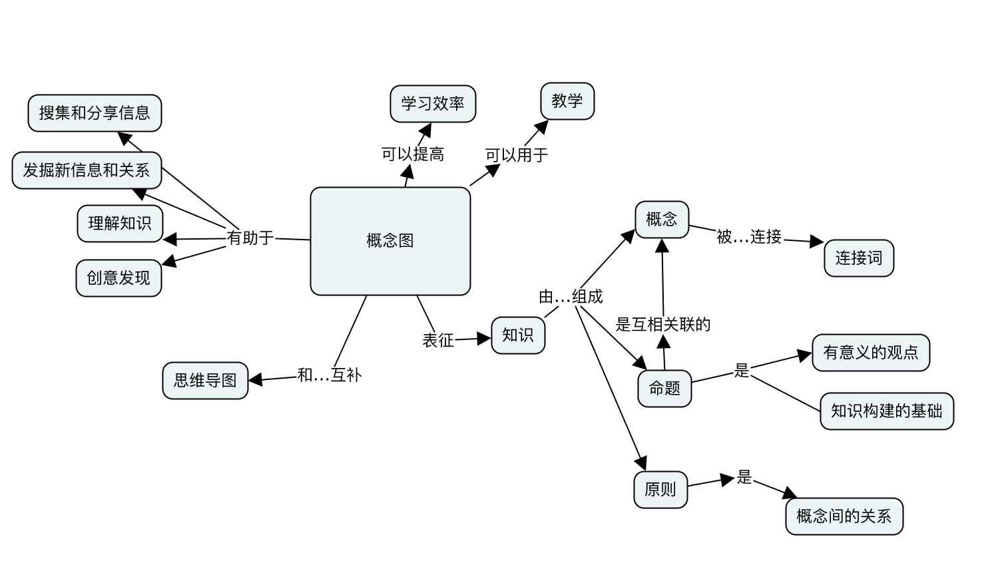

# 效率

* 长途通勤 尽可能少非生产性活动。 “如果你不得不通勤，那么就阅读或收听书籍，或者播客。”
* 分心 当需要高效的时候，关闭任何干扰。 “如果你被小事分心，你就不能做大事。”
* 个人进步的阻碍 不好的朋友？屏蔽。视频APP？屏蔽。游戏？屏蔽。当然在放松的时候，取消屏蔽。 * 读你不喜欢的东西 说真的，你不一定要完成你开始的所有书。作者不会知道。别再读不好的东西，外面有那么多的好东西。 “生活太短暂，没时间阅读坏书。”—詹姆斯·乔伊斯
* 完成无用的事情 计划好，优先级排序，做那些重要的事情。 “没什么比提高效率更有效率了。”—彼得·德鲁克
* 规划不需要规划的事情 规划很棒，但不要忘记执行。 “Just do it！”—Nike
* 肌肉记忆

## 实践

* 知行合一
* 自律,做事边界
* 效率
* 体系构建
  - 看书
  - 做思维导图
  - 回顾有个结论
* 方法+内容
* 舍弃
* 反思,修正自己方法
* 聚焦
  - 关键在于完成多少件，不在于开始了多少件
* 学习>>加班
* 视频有捷径的嫌疑，没有自己基础的搭建

## 任务四象限，决定优先级

* 紧急重要 赶紧搞定
* 重要不紧急 时刻保持关注，以免沦为「紧急重要」
* 紧急不重要 少少益善，学会拒绝
* 不紧急不重要 靠自律

## SMART specific、measurable、attainable、relevant、time-bound

* S：任务是否明确
  - 不明确的任务搞起来就是浪费生命
* M：任务是否可度量
  - 不可度量如何体现价值？
* A：任务是否可搞定
搞不定就不应该接，接就得有魄力搞定
* R：任务的相关性如何
  - 决定了任务的价值，相关性越高越能体现价值，比如这个任务搞定了能让团队获得公司、客户等更大的认可
* T：任务的时间
  - Timeline：任务时间轴，什么时间点需要搞定什么
  - Deadline：任务的最后期限，做评估时最好提前，因为总会有各种意外或拖延本性
  - Timeline上一些很关键的时间点我们可以称为里程碑，搞定每个里程碑应该庆祝下

## Rest: Why You Get More Done When You Work Less (Alex Soojung-Kim Pang; Penguin, 2018)

* 方法
  * 每天集中精力工作四小时左右对于大多数从事创造性活动的人来说已经足够，但重要的是要日复一日坚持；
  * 早起。一日之计在于晨，早起可以保证在午间休息前有足够的连贯时间来进行一段完整的工作，并且可以尽可能屏蔽干扰；
  * 散步。在获得一些户外运动的同时，可以帮助大脑深处的一些零散的想法慢慢组合成形；
  * 午睡。最佳的午睡时间是起床后 5 小时左右，即午饭后 1 小时，时间不要过长，这时的午睡会有更多的快速眼动睡眠（REM sleep），有助于激发创造性，若再迟 1 小时睡，则效果更倾向于恢复体力，但两者都是好的，因为创造性劳动对于脑力和体力的挑战性都是很大的；
  * 适时停止。不要 overwork，要留有余裕，这样大脑才能足够清醒地作出正确的判断，也不易陷入不理性的悲观和焦虑情绪；
  * 睡眠的重要性。睡眠不是浪费时间，而是给大脑必要的时间来修复自己和整理白天工作中的碎片化信息。保障睡眠的长度和质量十分重要；
  * 修复的机会。类似 5，好的修复活动有四个要素 ——relaxation, control, mastery experiences, and mental detachment from work；
  * 锻炼。体育运动与脑力劳动不是相互分割的，有异有同，体育运动在使大脑得到休息放松的同时，能够激发培养许多与工作类似的技能；
  * 深度的爱好。道理类似 8；
  * 休假。需要有机会离开习以为常的工作环境，获得放松和一些新的休息，好的休假不完全是被动的，而是一种转换和调节，能够刺激新想法的产生。
* 观念
  - 重要的是工作效率而不是投入工作的绝对时间（每日 4 小时、早起、不要 overwork）
  - 要改变“休息是懒惰，是浪掷生命”的观念，好的休息不仅是必要的，且能提高效率和创造力（散步、午睡、睡眠的重要性、修复的机会）
  - 要给大脑安排转换（shift gears）的机会，这样有助于刺激创造力（散步、锻炼、深度爱好、休假）

## 方法

* 人的行动，总是不完美的。尤其是开始。有人将之形容为开始的脏水：一个水龙头，很久没开，你想喝水，就会打开龙头，让水流一会，开始这部分水，可能是脏的，流掉了，干净的水才会出现。学习的过程很漫长，开始更不容易。太焦虑，希望速成；太完美，苛责开始，导致了学习失败。别着急，慢慢来。开始笨拙，慢慢熟练。先埋在土里，再长向天空。步子不美，速度不快，都不要紧，人生那么长，不停止，总会走非常远。
* 做判断，通常沿用三步法：1.起心，2.后果评估，3.执行。起心，是我们决定怎样做.人是否偷懒，取决于一个人对于后果的评估。
* 没有一样东西是非要拥有，也没有一件事非要经历。你们要的是人生清单，不是过清单人生。
* 有很多人对工作感到不满意，也不会尝试表达和沟通，而是用拖延的方式来完成工作，又或是直接辞职离开公司来表达自己的不满。
  - 只有当我们觉察到我们情绪背后的需要，我们才有可能去沟通去表达，而不是通过见诸行动的方式来伪装，假装自己很强大，假装自己不在乎，结果想要被爱却给关系带来了伤害。
  - 行动是一种基础功能，有些爱需要通过行动表达；语言是一种高级功能，有些伤害可以通过语言来避免。
* 百分百确定的事情很少。大多数事情是个概率。多投入时间，概率就大。业务多元化是个坑，如果不能保证一个业务有大概率成功，不要做，可能会拖垮老业务。一个环节太多的复杂业务也是坑。人也同理，人换了几个词，叫有舍有得，既要又要。

## The Off Switch: Leave work on time, relax your mind, but still get more done (Mark Cropley; London: Virgin Books, 2015)

* 工作和生活的结构感和节奏感很重要
  - 从根本上改变对工作的认知：工作是生活的一部分，而不是定义人生的根本
  - 对健康造成损害的并不是工作压力的绝对值，而是在压力来源消失后无法及时恢复；在闲暇时间思考工作相关的事情本身并不是不好的，事实证明 “解决问题导向” 的工作相关的思考不会对健康造成损害，真正不好的是以一种负面的情绪化的方式思考和工作相关的事情（对自己的工作投入和喜爱的人更常常是用 “解决问题导向” 的方法思考工作），一种情绪化的反刍
  - 感到被工作包裹得透不过气来的人比起那些懂得有节律地休息的人常常工作的时长更短、效率更低，因为没有办法从工作相关的思考中脱身，所以造成了一种自己 “一直在工作” 的错觉
  - 采取行动是解决焦虑和恐惧的最好方法，能让人慢慢看到问题的解决、积累信心，拖延往往会进一步加重焦虑和恐惧
  - hardiness: challenge 接受生活就是充满压力和挑战的，把挑战看成是成长的机会；commitment 不轻易放弃；control 关注自己可以影响和改变的方面，而不是在自己控制之外的事情
  - 完美主义者的问题：眉毛胡子一把抓，在边际效益低的事情上投入过多时间精力，很多时候反而影响对全局的把控；ddl 有助于防止工作过度侵蚀生活
  - 两种完美主义者：adaptive 的是以正面地想要做好为动力的；而 maladaptive 的是以对失败的恐惧和对自己 “不完美形象” 的抗拒为动力的，不能接受自己的错误和不完美，不能把项目的失败和自己作为人的失败分开来看。这样往往被过去的错误束缚了手脚而没有办法往前走
  - 人对自己的疲劳度的感知往往是滞后的，常常要到身体透支才会发觉，因此要防患未然
  - 爱好的重要性：用其他的生活内容填满那些本来不够高效的工作时间：爱好、家庭、朋友等
  - 像规划工作一样规划闲暇时间，认真对待，有计划（bring some structure to our free time），用丰富的业余生活来填满工作以外的时间；大的方面来说需要假期、mini breaks（晚计划不如早计划，对精神提振的效应从定计划开始就产生了），小的方面来说需要周末和工作日中的休息；要有计划，养成习惯，制定周末计划、度假计划，不要漫无目的地刷剧；周日晚上安排欢乐时光的重要性，可以延续到周一
  - 练习冥想有助于加强对自己思绪的控制力
  - 每日 unwind 的几个阶段（大部分人往往到睡前脑子还在忙碌运转，往床上一躺发现睡不着，但好睡眠的重要性再怎么强调都不为过），要有 unwind rituals：
    + 工作的结尾：把做脚注、存档等工作放到工作日的结尾；收拾办公室
    + 回家路上：不要接着处理工作信息，断掉工作联系方式，听音乐或玩游戏或找个咖啡厅坐一坐，路过公园散散步（“见缝插针” 是不太好的习惯，因为往往会发生 “缝太小针插不进去” 的情况，在所谓的空隙里面想做的任务没做完，弄得很匆忙，头脑又没有得到应有的休息）
    + 回到家：不要急着和家人配偶谈论今天工作中的事情，先给自己一些时间休息平静一下，等到状态好的时候再谈论

## 行动框架：怎么做事

* OGSM Objective（目的）、Goal（目标）、Strategy（策略）、Measurement（测量）
* 目的：明白领导意图。通常这个目的是领导层或上层给予执行层面、部门、团队的任务。通常比较含糊或者宏大，一方面不容易快速达到，另一方面这个目的，对于执行者来说，很不容易测量。
* 目标：当我们面临一项任务或目的时候，都会把目的拆分为 易执行、可量测的小目标。可以拆解成小目标、小任务，排优先、定重点、分配给下属、并制定 kpi 或 OKR 关键性指标。
* 策略：执行层面考究团队执行力，可以针对小目标或可量测指标，做很多 tip 或工作策略。例如：写代码时，对代码的测试覆盖、结对编程、code review 等。具体到不同时期，有不同方法论，这里暂不展开。
* 量测：拆解的目标必须是可量测、可量化，有指标可以衡量任务是否完成、完成度等。如果特别特别放到量测指标，其实算过度 kpi， 对我们架构创造性事情，需要更深层次考虑。毕竟，软件不是富士康计件类型工作。
* 不断迭代：通过量测指标，不断调整执行策略，甚至调整拆解目标。小步快进，达成目的，良好的完成上游给予的任务。

## 事物发展规律框架：认识万事万物发展规律，顺势而为

* 迭代思维:只有快速地对消费者需求做出反映，产品才更容易贴近消费者
* 产品生命周期理论（PLC 模型）是由美国经济学家 Raymond Vernon 提出的，即一种新产品从开始进入市场到被市场淘汰的整个过程。用户、产品、人、事都存在生命周期
* 看待用户、产品、人、事，绝对不能是静态思维，制定计划、制定目标时候，不可能是不变的
* 架构是从简单合适，通过业务需求推进，再到复杂的演进过程

## 认识分析事物框架：面临新事物时分析框架

* 5W+1H：是对选定的项目、工序或操作，都要从原因（何因 Why）、对象（何事 What）、地点（何地 Where）、时间（何时 When）、人员（何人 Who）、方法（何法 How）等六个方面提出问题进行思考
* 以 redis 为例，不一定强调内容全面或完全正确，主要体会思考学习方法：
  - What：基于内存实现的 K-V 存储系统；内存数据库；NOSQL；支持 sting、list、set、hashmap、zset 五种数据结构。
  - Why：在分布式系统中，本地缓存不能满足需求。 分布式缓存系统，类似框架 Memacache、基于 ssd 的低成本分布式缓存系统。
  - Where：相当于使用场景。如果系统按照 app->gateway->service->dao->持久层来分的话。dao 与持久层（mysql）之间使用，减少与持久化数据访问频率，提高 qps；service 层可以使用，例如：做一些业务缓存；gateway 层，也可以把鉴权 token 放到 redis 中。
  - When：性能、qps 需要提升时，缓存是第一时间想到的解决手段。当然 redis 扩展出很多其它用法，例如：分布式锁、分布式优先队列、布隆过滤器、set 交集等较为高级用法。
  - Who：通常架构师、后端工程师使用。
  - How：api 查阅文档，看看例子就能明白。
  - 类似比较学习：当我们认识新事物时候，类比法也是特别好的使用方法。假如我么使用过本地缓存 ehcache、guava，再去学习 redis 会简单很多。
* 了解了初衷后，对框架本身兴趣点会降低，而会思考生态，思考思维路径
* [伟大的领袖如何激励行动](https://v.qq.com/x/page/t0159v35804.html):绝大多数人是由外而内（What=>How=>why），但伟大的公司或领导者，思考的路径通常是由内而外（why=>How=>what），团队或者客户认可的常常是你的理念/信念即“为什么”，从而愿意接受你的产品或服务

## 决策框架：360度无死角观察，决策

* 一个人有足够的视角或多维视角观察能力，总是能认清楚要解决的问题，找准目标、确定方向，执行上如何错误，至少是在进步
* 视角：
  - 宇宙视角：宇宙视角能将禁锢已久的国与国、区域与区域、地区与地区、公司与公司、个人与个人的界限彻底打破，从而带给我们更为广博的胸怀以及更加宽阔的视野。说白了，自己能跳出利益，看清楚利益相关方的嘴脸，灵魂附体后再争取利益时，会更有优势（汗一下自己）。
  - 利益相关方视角：做商业产品或撮合交易系统，尤其需要有这方面能力。当然要站在不同利益相关方看问题，需要有同理心、换位思考等等更方面的训练。可以看一些产品方面的书籍。
  - 用户视角：产品经理需要经常用用户视角来思考。当我们做系统、架构时，必须了解是谁使用它。可以确定的是，肯定不是自己使用，所以切勿以自我为中心的思考、设计等。
  - 时间线视角：
    + 可以让自己退后一步，离开正在进行的一切，站在时间线的后面，注视它，感受它。眼前这根时间线代表的正是你的一生，它像是一条不断奔涌向前的河，不论你是否正在其中，还是已经退后一步，它的奔涌都从不止息。
      + 可以试着站在未来某一时点上看问题，它能让我们从此时此刻的纠结中抽离出去，站到更远一点的地方回望。
      + 当我们不知道自己真正想要什么、真正在乎什么的时候，可以尝试时间线临终视角。它能帮我们滤尽铅华，看清内心真实渴望，甚至是我们的核心价值观

## 概念图

* 知识是由一个相互联系的概念通过关系构成的网络。学习是为了增加对这个网络的理解，从而更好地组织这个网络，乃至促进有基础，有意义的创造
* 学习新知识时，会接触到很多概念，学习者需要梳理清楚新概念和已知概念之间的关系，才能更好地理解知识。在教学过程中，学员对知识的掌握程度如何，需要被可视化出来，这样教师才能发现学员可能理解不准确的地方
* 步骤
  - 确定焦点问题 该问题是概念图想要解决的问题或想要描述的知识领域。在焦点问题的指引下，识别并列出 10-20 个与焦点问题有关的概念。
  - 对概念进行排序 把范围最广、最具包含性的概念置于概念图的顶端。有时候找出这样的概念并不容易，回头审视焦点问题对于决定概念的顺序很有帮助。
  - 重复第 2 步，依次排序列表中的概念
  - 开始构建概念图 把最一般、最具包含性的概念放到概念图的顶端，顶端通常只有 1-3 个概念。可以用便利贴或软件来画概念图
  - 选择子概念 为每个概念选择 2-4 个子概念并放到其下。如果超过 4 个，可以找一个合适的中间概念，创建出另一个层次。
  - 用线条连接概念
  - 修订概念图的结构
  - 寻找概念图不同部分之间的交叉连接并标明连接词
  - 在概念图标签上可以附上概念的实例，比如狗是动物的实例
  - 同一组概念可以画出多种不同形式的概念图，当你对概念的理解变化的时候，概念图也要跟着变化
* 图书
  - 学习、创造和使用知识
* 工具
  - CmapTools

## 图书

* 终身成长

## 人物

* 闫丽梦

## 工具

* [anki](https://apps.ankiweb.net/):Powerful, intelligent flash cards.Remembering things just became much easier.
