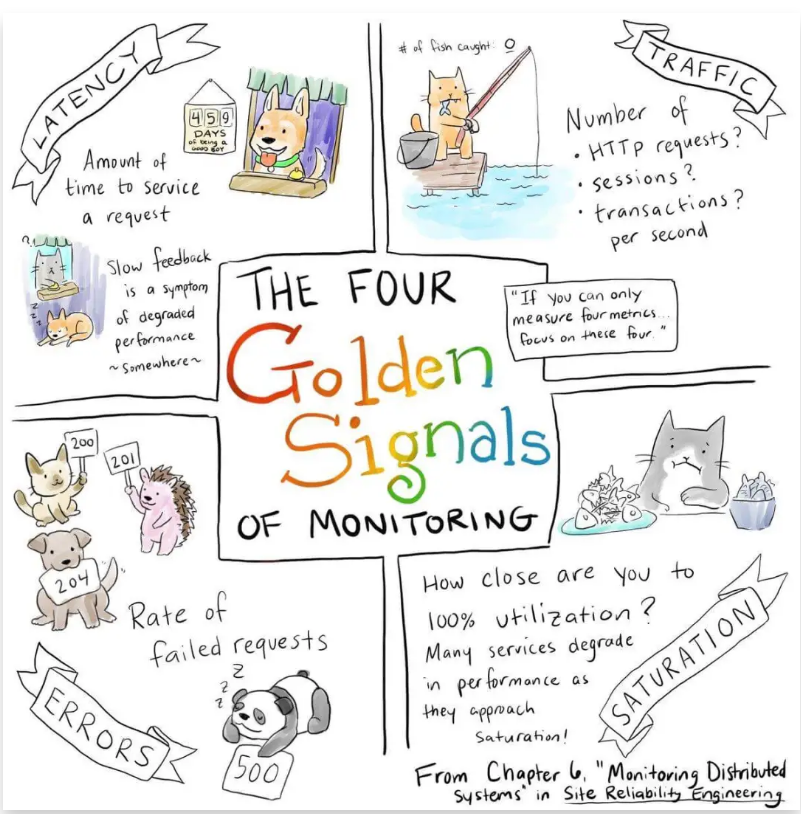

# 分布式系统

理论基础有CAP、BASE等。针对一致性，有特别多的算法，其中Raft作为易懂的新贵

* 连接管理与业务处理拆分
* 业务处理从功能角度拆分
* 场景
	- 分布式存储
	- 分布式计算
* 一批物理不相邻的计算机组合起来共同对外提供服务
* 集群化:集群中的N台机器上部署一样的程序，就像一台机器被复制多份一样
* 分布式是将一个完整的系统，按照业务功能拆分成一个个独立的子系统，这些服务之间使用更高效的通信协议比如RPC来完成调度，各个子服务就像在一台机器上一样，实现了业务解耦，同时提高了并发能力

* 数据复制与一致性
* CAP理论， BASE原则，幂等性, 2PC, TCC
* Paxos , Raft , Gossip
* 数据分片和路由
* Hash分片：Hash取模（实际中非常常见的算法）， 虚拟桶（Redis使用），一致性Hash（memcached使用）
* 范围分片

## 指标

1998年，加州大学的计算机科学家 Eric Brewer 提出，分布式系统有三个指标。Eric Brewer 说，这三个指标不可能同时做到。这个结论就叫做 CAP 定理。

* 可用性Consistency：只要收到用户的请求，服务器就必须给出回应
* 一致性Availability：写操作之后的读操作，必须返回该值
* 分区容错Partition tolerance：大多数分布式系统都分布在多个子网络。每个子网络就叫做一个区（partition）。区间通信可能失败。
* 无法同时做到一致性和可用性。系统设计时只能选择一个目标。如果追求一致性，那么无法保证所有节点的可用性；如果追求所有节点的可用性，那就没法做到一致性

## 分层

* 反向代理层（关联https连接）
	- 可以通过nginx集群实现，也可以通过lvs,f5实现。
	- 通过上层nginx实现，可以知道该层应对的是大量http或https请求。
	- 核心指标是：并发连接数、活跃连接数、出入流量、出入包数、吞吐量等。
	- 内部关于协议解析模块、压缩模块、包处理模块优化等。关键方向代理出去的请求吞吐量，也就是nginx转发到后端应用服务器的处理能力，决定整体吞吐量。
	- 静态文件都走cdn。
	- 关于https认证比较费时，建议使用http2.0，或保持连接时间长点。但这也与业务情况有关。如：每个app与后端交互是否频繁。毕竟维护太多连接，成本也很高，影响多路复用性能。
* 网关层(通用无业务的操作)：反向代理层通过http协议连接网关层，二者之间通过内网ip通信，效率高很多。我们假定网关层往下游都使用tcp长连接，java语言中dobbo等rpc框架都可以实现。
	- 网关层主要做几个事情：
	- 鉴权
	- 数据包完整性检查
	- http json 传输协议转化为java对象
	- 路由转义（转化为微服务调用）
	- 服务治理相关（限流、降级、熔断等）功能
	- 负载均衡
	- 网关层可以由：有开源的Zuul，spring cloud gateway,nodejs等实现。nginx也可以做网关需要定制开发，与反向代理层物理上合并。
* 业务逻辑层（业务层面的操作）：考虑按照业务逻辑垂直分层。例如：用户逻辑层、订单逻辑层等。如果这样拆分，可能会抽象一层通过的业务逻辑层。我们尽量保证业务逻辑层不横向调用，只上游调用下游。
	- 业务逻辑判断
	- 业务逻辑处理（组合）
	- 分布式事务实现
	- 分布式锁实现
	- 业务缓存
* 数据访问层（数据库存储相关的操作）；专注数据增删改查操作。
	- orm封装
	- 隐藏分库分表的细节。
	- 缓存设计
	- 屏蔽存储层差异
	- 数据存储幂等实现
* 网关层以下，数据库以上，RPC中间件技术选型及技术指标如下（来源dubbo官网）：
	- 核心指标是：并发量、TQps、Rt响应时间。
	- 选择协议因素：dubbo、rmi、hesssion、webservice、thrift、memached、redis、rest
	- 连接个数：长连接一般单个；短连接需要多个
	- 是否长连接：长短连接
	- 传输协议：TCP、http
	- 传输方式：：同步、NIO非阻塞
	- 序列化：二进制（hessian）
	- 使用范围：大文件、超大字符串、短字符串等

## 概念

eter Deutsch 提出的分布式系统八大谬论概括了程序员新手可能对分布式系统做出的错误假设：

* 网络是可靠的
* 延迟是零
* 带宽是无限的
* 网络是安全的
* 拓扑结构不会变
* 存在管理员这样的角色
* 传输成本是零
* 网络是同质的

## 高可用

* 拆分：目的在于“扩展”处理能力，提升性能
	- 计算任务拆分方式
		+ 相同任务平行部署：引来负载均衡路由问题；
		+ 横向水平分解：功能性解耦合，引来远程调用问题；
		+ 纵向业务分解：业务性解耦，引来业务关联业务的复杂性、分布式事务、分布式锁问题；引来更复杂的调用路由问题；
	- 存储拆分问题
		+ 相同存储冗余部署：引来数据不一致、状态同步问题。系统可用性和数据一致性如何取舍，是CAP定理的论证点。
		+ 一份数据拆分成N份：数据库分库分表、数据分区分片，带来数据分区规则、合并使用、关联使用等复杂性问题。
	- 拆分后分配问题
		+ 服务间的分配：调用关系元数据管理（如：服务注册、发现、调用关系）；通过元数据来决策；
		+ 存储间的分配：通过元数据管理数据分片、分区；元数据独立管理，通过元数据决策；
 	- 多副本数据复制同步问题：
 		+ 主从
 		+ 主备
 		+ master/slave
 		+ lead/follow
 		+ 主分片/副本分片
 		+ 代表相同数据，多份存储，如何同步这些数据呢？同步性能压力；异步性能提升，但数据不一致。
	- 故障甄别、失效转移（高可用决策）
		+ 谁来决策：决策者必须有拆分、冗余 节点的状态信息。
		+ 决策者的高可用：决策者需要冗余，防止决策者故障；
		+ 多个决策者的选举：避免多个决策者；
		+ 故障甄别：决策者通过什么来确定节点有故障；
		+ 失效故障自动解决：发现故障后，把故障停机，转移到正常节点。
* 冗余：目的在于“备用”处理单元，提升高可用

## 策略

* 随机访问：可能造成服务器负载压力不均衡
* 轮询策略：请求均匀分配，但当服务器有性能差异，无法按性能分发
* 权重轮询策略：需要静态配置，无法自动调节
* Hash取模策略： 可以保证相同请求相同机器处理，一种并行转串行的方法 `index = hash_fun(key) % N`
	- 机器动态变化(新增或者删除)会导致路由产生变化，数据产生大量迁移
	- 数据相对独立，就避免了线程间的通信和同步，实现了无锁化处理
* 普通哈希
    - 散列函数:将所需查询的数据映射到表中一个位置来访问记录，加快查找速度.散列方法
        + 直接定址法：取关键字或关键字的某个线性函数值为散列地址，这个线性函数的定义多种多样，没有标准。
        + 数字分析法：假设关键字是以r为基的数，并且哈希表中可能出现的关键字都是事先知道的，则可取关键字的若干数位组成哈希地址。
        + 平方取中法：取关键字平方后的中间几位为哈希地址。通常在选定哈希函数时不一定能知道关键字的全部情况，取其中的哪几位也不一定合适，而一个数平方后的中间几位数和数的每一位都相关，由此使随机分布的关键字得到的哈希地址也是随机的，取的位数由表长决定。
        + 折叠法：将关键字分割成位数相同的几部分（最后一部分的位数可以不同），然后取这几部分的叠加和（舍去进位）作为哈希地址。
        + 取模法：取关键字被某个不大于散列表表长 m 的数 p 除后所得的余数为散列地址。即 hash(key) = key % p（p<= M），不仅可以对关键字直接取模，也可在折叠法、平方取中法等运算之后取模。对 p 的选择很重要，一般取素数或 m，若 p 选择不好，容易产生冲突。
    - 散列表:存放记录的数组
	- 扩容数据的迁移
	- 宕机和缩容都可以归结为服务节点删除情况
* 一致性哈希 Consistent hashing
	- 1997年由麻省理工学院的Karger等人在解决分布式Cache中提出的，[论文](http://citeseerx.ist.psu.edu/viewdoc/summary?doi=10.1.1.147.1879)，设计目标是为了解决因特网中的热点(Hot spot)问题，初衷和CARP十分类似。一致性哈希修正了CARP使用的简单哈希算法带来的问题，使得DHT可以在P2P环境中真正得到应用，过程
		+ 通过构建环状的 Hash 空间代替普通的线性 Hash 空间:将N设置为2^32，形成了一个0~(2^32-1）的哈希环，也就是相当于普通Hash取模时 N=2^32
		+ 数据key进行hash计算时就落在了0~(2^32-1的哈希环上，如果总的key数量为Sum，那么单个哈希环的最小单位上的key数就是 Unit_keys = Sum/2^32
		+ 服务器节点计算 Hash 值，可以用服务器的 IP 或 主机名计算得到哈希值，计算得到的哈希值就是服务节点在 Hash 环上的位置 `con_hash(ip_key)%2^32`
		+ 数据 key 同样也计算一次哈希值，计算之后的哈希也映射到环上，数据存储的位置是沿顺时针的方向找到的环上的第一个节点
	- 新增或删除节点:实现了少量数据迁移，避免了几乎全部数据移动，解决了普通hash取模的动态调整带来的全量数据变动
	- 数据倾斜：由于服务器结点的数量相比2^32会少非常多，因此很稀疏，造成数据分布不均匀
		+ 节点雪崩：导致所有缓存数据都打到 某个节点 上面，有可能会导致 节点 不堪重负被压垮宕机，数据又都打到下一个节点不断传递,连锁反应导致的整个缓存集群不可用
		+ 虚拟节点
			* 对原来单一的物理节点在哈希环上虚拟出几个它的分身节点，这些分身节点称为「虚拟节点」。打到分身节点上的数据实际上也是映射到分身对应的物理节点上，这样一个物理节点可以通过虚拟节点的方式均匀分散在哈希环的各个部分，解决了数据倾斜问题。
			* 由于虚拟节点分散在哈希环各个部分，当某个节点宕机下线，他所存储的数据会被均匀分配给其他各个节点，避免对单一节点突发压力导致的节点雪崩问题。
			* 虚拟节点的分片都要实际归属到真实的服务节点上，因此在实际中涉及到虚拟节点和实体结点的映射问题
	- 将普通哈希取模的N进行**大量固定数量的小数据块的分片**，从而确保了相同的key必然是相同的位置，从而避免了牵一发而动全身的问题
	- 小分片的服务器归属问题：将N固定且设置很大之后，实际上就是进行数据分片Sharding，分布的小片就要和实际的机器产生关联关系，也就是哪台机器负责哪些小分片
* Redis的一致性哈希实现
	- Redis cluster 拥有固定的16384个slot，slot是虚拟的且被分布到各个master中，当客户端提交数据时，要先根据CRC16(key)&16383来计算出数据要落到某个master 负责slot时，就由对应的master为key 提供服务
	- 每个Master节点都维护着一个位序列bitmap为16384/8字节，也就是Master使用bitmap的原理来表征slot的下标，Master 节点通过 bit 来标识哪些槽自己是否拥有，比如对于编号为1的槽，Master只要判断序列的第二位是不是为1即可
	- 当客户端提交数据时，要先根据CRC16(key)&16383来计算出数据要落到哪个虚拟槽内


## CAP/BASE


## Gosslp


## [分布式事务](https://mp.weixin.qq.com/s/ek3ycMJ1qbMXtMRAvTQDZg)

* 本地事务（Local Transaction）:通常也被称之为数据库事务、传统事务（相对于分布式事务而言）。仅限于对单一数据库资源的访问控制
	- 优点就是支持严格的ACID特性，高效，可靠，状态可以只在资源管理器中维护，而且应用编程模型简单
	- 不具备分布式事务的处理能力，隔离的最小单位受限于资源管理器。
* 分布式事务:指事务的参与者、支持事务的服务器、资源服务器以及事务管理器分别位于不同的分布式系统的不同节点之上
	- 单个事件导致两个或多个不能以原子方式提交的单独数据源的突变的情况。在微服务的世界中，它变得更加复杂，因为每个服务都是一个工作单元，并且在大多数情况下，多个服务必须协同工作才能使业务成功
	- 服务进行了分布式，随着各个数据库也随着变成分布式每个数据库不一定存在相同的物理机中。追求集群的 ACID 会导致系统变得很差，就需要引入一个新的理论原则来适应这种集群的情况，就是 CAP
* 刚性事务是指完全遵循ACID规范的事务
* 柔性事务为了满足可用性、性能与降级服务的需要，降低了一致性（Consistency）与隔离性（Isolation）的要求
* CAP 定理:在一个分布式系统中,三者不可得兼
    -Consistency（一致性）：在分布式系统中的所有数据备份，在同一时刻是否同样的值。（等同于所有节点访问同一份最新的数据副本）
    - Availability（可用性）：在集群中一部分节点故障后，集群整体是否还能响应客户端的读写请求。（对数据更新具备高可用性）
    - Partition tolerance（分区容错性）：以实际效果而言，分区相当于对通信的时限要求。系统如果不能在时限内达成数据一致性，就意味着发生了分区的情况，必须就当前操作在 C 和 A 之间做出选择。
	- 在一个分布式系统中，最多能支持上面两种属性。但显然既然是分布式注定是必然要进行分区，既然分区，就无法百分百避免分区的错误。因此，只能在一致性和可用性去作出选择。往往追求的是可用性，它的重要性比一致性要高
	- ACID理论和CAP理论都有一个C区别
		+ ACID的C指的是事务中的一致性，在一系列对数据修改的操作中，保证数据的正确性。即数据在事务期间的多个操作中，数据不会凭空的消失或增加，数据的每一个增删改操作都是有因果关系的。比如用户A向用户B转了200块钱，不会出现用户A扣了款，而用户B没有收到的情况。
		+ 在分布式环境中，多服务之间的复制是异步，需要一定耗时，不会瞬间完成。在某个服务节点的数据修改之后，到同步到其它服务节点之间存在一定的时间间隔，如果在这个间隔内有并发读请求过来，而这些请求又负载均衡到多个节点，可能会出现从多个节点数据不一致的情况，因为请求有可能会落到还没完成数据同步的节点上。CAP中的C就是为了做到在分布式环境中读取的数据是一致的。
* 如何实现高可用：BASE理论，源于 ebay 在 2008 年 ACM 中发表的[论文](https://dl.acm.org/doi/10.1145/1394127.1394128)，无法做到强一致，但每个应用都可以根据自身的业务特点，采用适当的方式来使系统达到最终一致性
	- BASE 理论的基本原则有三个
    	+ Basically Available（基本可用）:分布式系统在出现不可预知故障的时候，允许损失部分可用性.响应时间上的损失 系统功能上的损失
    	+ Soft state（软状态）:允许系统中的数据存在中间状态，并认为该中间状态的存在不会影响系统的整体可用性，即允许系统在不同节点的数据副本之间进行数据同步的过程存在延时。
    	+ Eventually consistent（最终一致性）:强调的是所有的数据副本，在经过一段时间的同步之后，最终都能够达到一个一致的状态
    - 主要目的是为了提升分布式系统的可伸缩性，论文同样阐述了如何对业务进行调整以及折中的手段，BASE 理论的提出为分布式事务的发展指出了一个方向。
    - 方案
    	+ 二阶段提交协议 Two-phase Commit 2PC
    		* 是几乎所有分布式事务算法的基础，后续的分布式事务算法几乎都由此改进而来
    		* 为了使基于分布式系统架构下的所有节点在进行事务提交时保持一致性而设计的一种算法（Algorithm）。通常2PC也被称为是一种协议（Protocol）
    		* 一个事务管理器（Transaction Manager，简称 TM，也被称之为“协调者”）协调 1 个或多个资源管理器（Resource Manager，简称 RM，也被称之为“参与者”）的活动，所有资源管理器（参与者）向事务管理器（协调者）汇报自身活动状态，由事务管理器（协调者）根据各资源管理器（协调者）汇报的状态（完成准备或准备失败）来决定各资源管理器（协调者）是“提交”事务还是进行“回滚”操作
    		* 思路:参与者将操作成败通知协调者，再由协调者根据所有参与者的反馈情报决定各参与者是否要提交操作还是中止操作。
    		* 两个阶段
    			- 协调者通知各个参与者准备提交它们的事务分支。如果参与者判断自己进行的工作可以被提交，那就对工作内容进行持久化，再给协调者肯定答复；要是发生了其他情况，那给协调者的都是否定答复。在发送了否定答复并回滚了已经的工作后，参与者就可以丢弃这个事务分支信息。
    			- 协调者根据第一阶段中各个参与者 Prepare的结果，决定是提交还是回滚事务。如果所有的参与者都Prepare成功，那么协调者通知所有的参与者进行提交；如果有参与者Prepare失败的话，则协调者通知所有参与者回滚自己的事务分支。
    		* 明显的缺点：
    			- 单点故障：由于协调者的重要性，一旦协调者发生故障，参与者会一直阻塞，尤其是在第二阶段，协调者发生故障，那么所有的参与者都处于锁定事务资源的状态中，而无法继续完成事务操作。
    			- 同步阻塞：由于所有节点在执行操作时都是同步阻塞的，当参与者占有公共资源时，其他第三方节点访问公共资源不得不处于阻塞状态。
    			- 数据不一致：在第二阶段中，当协调者向参与者发送提交事务请求之后，发生了局部网络异常或者在发送提交事务请求过程中协调者发生了故障，这会导致只有一部分参与者接收到了提交事务请求。而在这部分参与者接到提交事务请求之后就会执行提交事务操作。但是其他部分未接收到提交事务请求的参与者则无法提交事务。从而导致分布式系统中的数据不一致。
        + XA 两阶段提交，这个在很多传统型公司会被使用，但不适合互联网微服务的分布式系统，锁定资源时间长，性能影响大，排除
        + MQ 消息事务：RocketMQ（4.3 版本已经正式宣布支持分布式事务）
        + TCC
        + 3PC
* 幂等性:能够以同样的方式做两次，而最终结果将保持不变，就好像它只做了一次的特性
	- 用法：在远程服务或数据源中使用幂等性，以便当它多次接收指令时，只处理一次

## 两阶段提交 2PC

严重影响性能，并不适合高并发的场景，而且其实现复杂，牺牲了一部分可用性

* PrepareCommit
	- 协调者向参与者发送指令后，参与者如果具备执行条件，则获取锁并执行动作，只不过未真正提交，可以认为参与者就差临门一脚了，还得等协调者信号
	- commit 信号
	- rollback 信号
* CoCommit
* 问题
	- 协调者单点
	- 参与者阻塞超时：协调者不给信号会长时间阻塞，不释放资源，这样别人也没法处理其他事情
	- 网络分区
	- 容错性

## 3PC Three-Phase-Commit 三阶段提交协议

* 对应于2PC，3PC有两个改动点：
	- 引入超时机制。同时在协调者和参与者中都引入超时机制。
	- 在两阶段提交的第一阶段与第二阶段之间插入了一个准备阶段，使得原先在两阶段提交中，参与者在投票之后，由于协调者发生崩溃或错误而导致参与者处于无法知晓是否提交或者中止的“不确定状态”所产生的可能相当长的延时的问题得以解决。
* CanCommit阶段(询问时候空档)
	- 先由协调者向参与者发送Commit请求，参与者如果可以提交就返回Yes响应，否则返回No响应.然后开始收集反馈，相比来说更加轻量
	- 事务询问：协调者向参与者发送CanCommit请求。询问是否可以执行事务提交操作。然后开始等待参与者的响应。
	- 响应反馈：参与者接到CanCommit请求之后，正常情况下，如果其自身认为可以顺利执行事务，则返回Yes响应，并进入预备状态。否则反馈No。
	- 参与者并不真实获取锁占用资源，只是对自身执行事务状态的检查，查看是否具备执行事务的条件，进而回复询问
	- 所有参与者均具备执行事务条件
	- 存在不具备条件的参与者
* PreCommit（本地执行，不提交）
	- 第一阶段所有参与者都 Ready，那么协调者就会向参与者发送本地执行的相关指令.参与者收到指令后进行本地事务执行，并记录日志，并且对处理结果反馈到协调者，来做决策。过程中参与者可能成功或者失败
		+ 发送预提交请求：协调者向参与者发送PreCommit请求，并进入Prepared阶段。
		+ 事务预提交：参与者接收到PreCommit请求后，会执行事务操作，并将undo和redo信息记录到事务日志中。
		+ 响应反馈：如果参与者成功的执行了事务操作，则返回ACK响应，同时开始等待最终指令。
	- 第一阶段如果存在参与者不 Ready 的情况，那么协调者就会发送信号给所有参与者，告知本次事务取消了，该干啥干啥吧
		+ 发送中断请求：协调者向所有参与者发送Abort请求。
		+ 中断事务：参与者收到来自协调者的Abort请求之后（或超时之后，仍未收到协调者的请求），执行事务的中断。
* DoCommit（本地提交并反馈）
	- PreCommit阶段一致通过:在 PreCommit 之后参与者全部完成本地事务执行但是没有提交，并且都给协调者 ACK 回复，这时协调者认为万事俱备只欠东风了，在 DoCommit 阶段协调者向参与者发送提交指令，参与者收到之后开始执行本地提交，并反馈结果，最终完成这次事务
		+ 发送提交请求：协调者接收到参与者发送的ACK响应，那么他将从预提交状态进入到提交状态。并向所有参与者发送DoCommit请求。
		+ 事务提交：参与者接收到DoCommit请求之后，执行正式的事务提交。并在完成事务提交之后释放所有事务资源。
		+ 响应反馈：事务提交完之后，向协调者发送ACK响应。
		+ 完成事务：协调者接收到所有参与者的ACK响应之后，完成事务。
	- PreCommit阶段存在分歧:发现存在部分参与者无法执行事务的情况，这时就决定告诉其他参与者本地回滚，释放资源，取消本次事务
		+ 发送中断请求：协调者向所有参与者发送Abort请求。
		+ 事务回滚：参与者接收到Abort请求之后，利用其在阶段二记录的undo信息来执行事务的回滚操作，并在完成回滚之后释放所有的事务资源。
		+ 反馈结果：参与者完成事务回滚之后，向协调者发送ACK消息。
		+ 中断事务：协调者接收到参与者反馈的ACK消息之后，执行事务的中断。
* 超时策略
	- 参与者等待 PreCommit 超时：协调者和参与者之间可能存在较大的网络延时，或者协调者出现故障，或者出现网络分区等情况，参与者并不会傻等，在超过设定时间之后，参与者就继续做之前的事情了，因为好像被大哥鸽了，只能该干啥干啥，这也是正确的决策。
	- 参与者等待 DoCommit 超时:在 CanCommit 和 PreCommit 之后，参与者认为大家都对齐了都是棒棒的，如果参与者在设定时间内并没有收到协调者的 DoCommit 指令，那么就本地执行提交完成这次事务，因为参与者揣测大哥的意思大概率也是让我们提交，干等着也不是办法，回滚可能和大家不一样，抉择之下参与者选择提交事务。
	- 协调者等待反馈超时:3PC协调者的等待超时处理和2PC基本上是一样的，无论在哪个阶段超时都认为不具备条件，进行 abort 或者 rollback 操作
* 问题
	- 不一致
		+ 新加的参与者超时机制
	-  决策状态的对齐
		+  2PC协议的决策结果初始阶段只有决策者知道，只有在它发送了决策解决才有参与者知道，这样就存在决策结果丢失的情况
		+  协调者挂掉，新协调者可以咨询所有的参与者来确定决策状态，根据所有参与者的情况来确定，但是万一真理掌握在少数人手中呢
		+  决策透明化:让所有参与者都知道决策结果，3PC的PreCommit阶段对齐了结果，只要有1台还活着，整个事务的状态就是确定的.经过CanCommit和PreCommit阶段后，参与者之间对齐并保留了决策结果，避免2PC协议极端情况决策结果的错误缺失，是个比较好的做法


## TCC

## 分片

* 对资料的切割，也就是一套主从已经装不下了.分片的逻辑可以放在客户端，比如驱动层的数据库中间件，Memcache等；也可以放在服务端，比如ES、Mongo等
* 分片的信息组成了一组元数据，存放了切割的规则。这些信息可以借助外部的存储比如KAFKA；也有的直接同步在集群每个节点的内存中，比如ES。比
* Round-Robin  资料轮流落进不同的机器，数据比较平均，适合弱相关性的数据存储。坏处是聚合查询可能会非常慢，扩容、缩容难。
* Hash 使用某些信息的Hash进行寻路，客户端依照同样的规则可以方便的找到服务端数据。问题与轮询类似，数据过于分散且扩容、缩容难。Hash同样适合弱相关的数据，并可通过一致性哈希来解决数据的迁移问题。
* Range 根据范围来分片数据，比如日期范围。可以将一类数据归档到特定的节点，以增加查询速度。此类分片会遇到热点问题，会冷落很多机器。
* 自定义 自定义一些分片规则。比如通过用户的年龄，区域等进行切分。你需要维护大量的路由表，然后自己控制数据和访问的倾斜问题。
* 嵌套 属于自定义的一种，路由规则可以嵌套。比如首先使用Range进行虚拟分片，然后再使用Hash进行实际分片。在实际操作中，这很有用，需要客户端和服务端的结合才能完成。
* 切分字段的选择非常重要，如果几个维度都很必要，解决的方式就是冗余—-按照每个切分维度，都写一份数据。

## 副本

* 副本越多，可用性越高,延迟越大
* 既要保证数据的增量迁移，又要保证集群的正确服务
* master选举通常都是投票机制，所以最小组集群的台数一般都设置成n/2+1

## Quorum/NWR

## 幂等

## 分布式事务

* 写多个分片的协调
* 并发读写某一个值
* 最终一致性
    - 采用了BASE（Basically Available（基本可用）， Soft state（软状态），Eventually consistent（最终一致性）） 的系统，选择的是弱一致性，高度依赖业务监控组件

## 分布式ID生成服务

* [leaf](https://tech.meituan.com/2017/04/21/mt-leaf.html)
	- snowflake 模式
		+ snowflake 是 Twitter 开源的分布式 ID 生成算法，被广泛应用于各种生成 ID 的场景。Leaf 中也支持这种方式去生成 ID
		+ 依赖 Zookeeper:因为 snowflake 的 ID 组成中有 10bit 的 workerId,用了 Zookeeper 来生成 wokerID。就是用了 Zookeeper 持久顺序节点的特性自动对 snowflake 节点配置 wokerID
	- segment 模式:基于数据库实现的 ID 生成方案，如果调用量不大，完全可以用 Mysql 的自增 ID 来实现 ID 的递增
		+` biz_tag` 用于区分业务类型，比如下单，支付等。如果以后有性能需求需要对数据库扩容，只需要对 biz_tag 分库分表就行,`biz_tag` 之间是相互隔离的，互不影响
		* `max_id` 表示该 biz_tag 目前所被分配的 ID 号段的最大值
		- step 表示每次分配的号段长度
		- 会在还没用完之前就去申请下一个范围段。并发量大的问题可以直接将 step 调大即可

```sh
# segment
CREATE TABLE `leaf_alloc` (
  `biz_tag` varchar(128) NOT NULL DEFAULT '',
  `max_id` bigint(20) NOT NULL DEFAULT '1',
  `step` int(11) NOT NULL,
  `description` varchar(256) DEFAULT NULL,
  `update_time` timestamp NOT NULL DEFAULT CURRENT_TIMESTAMP ON UPDATE CURRENT_TIMESTAMP,
  PRIMARY KEY (`biz_tag`)
) ENGINE=InnoDB;
```

## 高可用HA（High Availability）

通过设计减少系统不能提供服务的时间

* 客户端层：典型调用方是浏览器browser或者手机应用APP
    - 通过反向代理层的冗余实现的，常见实践是keepalived + virtual IP自动故障转移
* 反向代理层：系统入口，反向代理
    - 通过站点层的冗余实现的，常见实践是nginx与web-server之间的存活性探测与自动故障转移
* 站点应用层：实现核心应用逻辑，返回html或者json
    - 过服务层的冗余实现的，常见实践是通过service-connection-pool来保证自动故障转移，整个过程由连接池自动完成，对调用方是透明的（所以说RPC-client中的服务连接池是很重要的基础组件）
* 服务层：如果实现了服务化，就有这一层
    - 当redis主挂了的时候，sentinel能够探测到，会通知调用方访问新的redis，整个过程由sentinel和redis集群配合完成，对调用方是透明的
* 数据–缓存层：缓存加速访问存储
    - 过缓存数据的冗余实现的，常见实践是缓存客户端双读双写，或者利用缓存集群的主从数据同步与sentinel保活与自动故障转移；更多的业务场景，对缓存没有高可用要求，可以使用缓存服务化来对调用方屏蔽底层复杂性
* 数据–数据库层：数据库固化数据存储
    - 通过读库的冗余实现的，常见实践是通过db-connection-pool来保证自动故障转移
    - 通过写库的冗余实现的，常见实践是keepalived + virtual IP自动故障转移

## 分布式数据库通用的架构方式

* 高可用：通过冗余+故障甄别+失效自动转移来保证系统的高可用特性。而分布式存储一般通过副本多份存储实现冗余，唯一独立的master节点监听故障，并做失效的转移。而master都通过选举机制，自己实现或通过中间件。
* 高并发：通过垂直扩展（Scale Up）与水平扩展（Scale Out）提升系统并发能力。而分布式存储系统通过分片、sharding实现水平拆分。 拆分partition路由算法一般两种： key取模或range范围拆分。 无论哪种注意数据倾斜问题，依据业务场景选定、设定key及路由方式。
* 分布式路由分配问题：由于数据分片、主从副本机制，客户端一般需要通过询问zookeeper或master，先获取路由表（元数据），再定位到具体提供服务节点。
* 弹性扩展性：中间件扩展问题、扩容问题、自动恢复问题等，一般都是由master节点协调完成。
* 数据可靠性：存储系统都是数据可靠性为第一指标。 数据写入环节可靠性一般通过顺序写的log文件方式实现。存储也可以通过共享存储来保证，原理都是通过多个副本保存来保证。
* 高性能：存储系统高性能实现最主要机制有几个方面：与数据库业务特点相关的索引机制；自建缓存系统；尽量使用mmap机制；合并小文件（写入和查询平衡）；副本也可提供查询服务等。
* 压缩算法：数据压缩可以减少存储空间，但是增加cpu运算成本。
* 缓存机制：数据落盘成本很高；晚落盘缓存压力大；写入量大的存储系统落盘会形成小文件，合并小文件需要成本。
* 副本数据一致性问题：写完主分片，异步同步其它副本，性能好，但数据可能不一致；或顺序写完所有副本，性能差，数据可靠性好；

## 容器视角下的网络性能监控

* 特点
	- 服务之间的沟通变多了，东西向流量成为容器环境下的主体流量
	- 端到端路径的复杂
	- 业务的拓扑的动态性强
	- 容器网络规模超级大
* 分布式系统可观测性
	- Metrics Prometheus 监控的指标数据，比如说 CPU 内存、流量大小等等. 实现分布式系统可观测性的第一步。它是一个可聚合、可设置报警，面向大规模监控数据做分析和告警判断，针对 Metrics 通常会关注四个方面的指标量
		+ 时延: 它刻画的是当前的业务系统的访问是否顺畅、耗费的时间是否在增加。例如从四层网络的角度看，有三次握手、协议栈响应的时延；从应用的角度看，有 HTTP 响应、DNS 响应的时延。
		+ 流量:系统的吞吐。例如一个应用系统的 BPS、PPS 是多少？新建连接数、新建连接速率是多少？HTTP 的请求数是多少等等。
		+ 错误:错误可能发生在网络层，比如 TCP 建连失败、重置、重传等，还可能会发生在应用层，比如 HTTP 的 400、500 等错误，或者是 DNS 解析失败。
		+ 负载:一般来讲是对计算和存储资源的描绘，在虚拟网络情况下也可以描述虚拟交换机的负载。网络层面的负载主要体现在并发连接数、当前正在活跃的用户数等指标。
	- Tracing 服务调用栈的数据
	- Logging ELK 里的日志分析。二、三类数据关联度会大一些，是每一个请求或每一条日志的数据
* 通过网络流量采集可以直接获取到服务的调用栈
	- 从应用的层面无法解决问题。从日志或代码插件很难去感知到网络层面的问题
	- 网络层的信息能提供更精确的数据



## 课程

* [6.824: Distributed Systems](http://nil.csail.mit.edu/6.824/2018/)
* [brendandburns/designing-distributed-systems](https://github.com/brendandburns/designing-distributed-systems):Sample code and configuration files from the Designing Distributed Systems book.

## 工具

* [hashicorp/consul](https://github.com/hashicorp/consul):Consul is a distributed, highly available, and data center aware solution to connect and configure applications across dynamic, distributed infrastructure. https://www.consul.io/
* [dmlc/xgboost](https://github.com/dmlc/xgboost):Scalable, Portable and Distributed Gradient Boosting (GBDT, GBRT or GBM) Library, for Python, R, Java, Scala, C++ and more. Runs on single machine, Hadoop, Spark, Flink and DataFlow https://xgboost.ai/
* [firehol/netdata](https://github.com/firehol/netdata):Get control of your servers. Simple. Effective. Awesome! https://my-netdata.io/
* [facebookincubator/LogDevice](https://github.com/facebookincubator/LogDevice):Distributed storage for sequential data https://logdevice.io
* [meshbird/meshbird](https://github.com/meshbird/meshbird):Distributed private networking http://meshbird.com
* [dragonflyoss/Dragonfly](https://github.com/dragonflyoss/Dragonfly):Dragonfly is an intelligent P2P based image and file distribution system. https://d7y.io
* [etcd-io/etcd](https://github.com/etcd-io/etcd):Distributed reliable key-value store for the most critical data of a distributed system https://etcd.readthedocs.io/en/latest
* [PhxPaxos](https://github.com/Tencent/phxpaxos)腾讯公司微信后台团队自主研发的一套基于Paxos协议的多机状态拷贝类库。它以库函数的方式嵌入到开发者的代码当中， 使得一些单机状态服务可以扩展到多机器，从而获得强一致性的多副本以及自动容灾的特性。文章：<http://www.infoq.com/cn/articles/weinxin-open-source-paxos-phxpaxos>
* [busgo/forest](https://github.com/busgo/forest):分布式任务调度平台,分布式,任务调度,schedule,scheduler http://122.51.106.217:6579
* [ xuxueli / xxl-job ](https://github.com/xuxueli/xxl-job): A distributed task scheduling framework.（分布式任务调度平台XXL-JOB） http://www.xuxueli.com/xxl-job/

## 参考

* [rShetty/awesome-distributed-systems](https://github.com/rShetty/awesome-distributed-systems):Awesome list of distributed systems resources http://rajeevnb.com
* [gdamdam/awesome-decentralized-web](https://github.com/gdamdam/awesome-decentralized-web):an awesome list of decentralized services
* [wx-chevalier/Distributed-Infrastructure-Series](https://github.com/wx-chevalier/Distributed-Infrastructure-Series):📚 深入浅出分布式基础架构，Linux 与操作系统篇 | 分布式系统篇 | 分布式计算篇 | 数据库篇 | 网络篇 | 虚拟化与编排篇 | 大数据与云计算篇
* [分布式系统架构经典资料](https://www.infoq.cn/article/2018/05/distributed-system-architecture/)
* [MIT parallel and distributed Group](https://pdos.csail.mit.edu/)
* [数据布局服务与局部性管理 with Akkio](https://draveness.me//papers-akkio)
