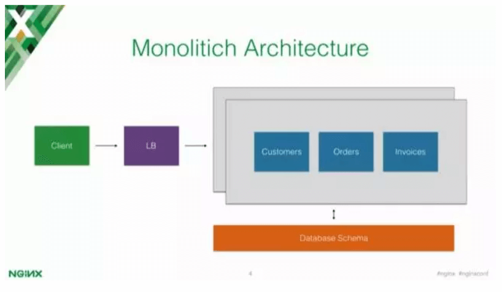
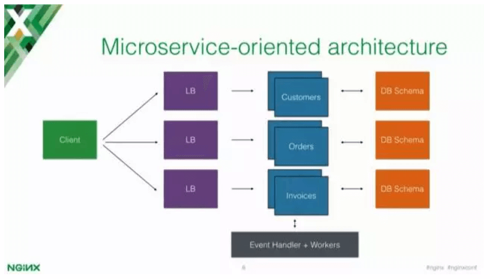
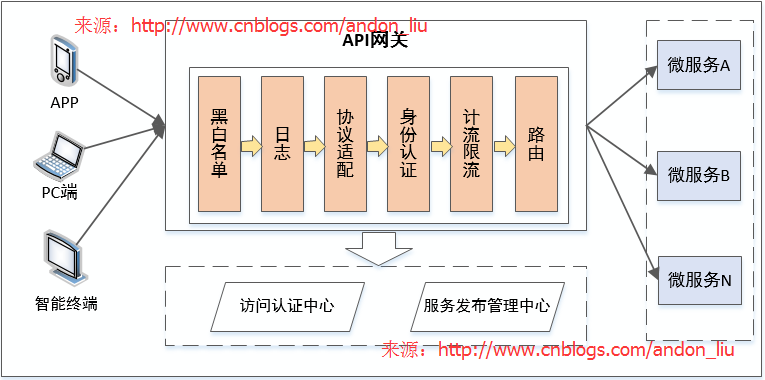

# [microservices](https://www.microservices.com/)

* 业务系统需要彻底的组件化和服务化，原有的单个业务系统会拆分为多个可以独立开发，设计，运行和运维的小应用
* 小应用之间通过服务完成交互和集成。每个小应用从前端web ui，到控制层，逻辑层，数据库访问，数据库都完全是独立的一套
* 每个小应用除了完成自身本身的业务功能外，重点就是还需要消费外部其它应用暴露的服务，同时自身也将自身的能力朝外部发布为服务
* 微服务，又名微服务架构，是一种架构风格，将应用构建为一个小型自治服务的集合，以业务领域为模型。通俗地说，就像蜜蜂通过对蜡制的等边六角形单元来构建它们的蜂巢。
* 最初从使用各种材料的小单元开始，一点点的搭建出一个大型蜂巢。
* 这些小单元组成坚固的结构，将蜂窝的特定部分固定在一起。这里，每个小单元都独立于另一个，但它也与其他小单元相关。
* 意味着对一个小单元的损害不会损害其他的单元，因此，蜜蜂可以在不影响完整蜂巢的情况下重建这些单元。
* 每个六边形都代表单独的服务组件。与蜜蜂的工作类似，每个敏捷团队都使用可用的框架和所选的技术栈构建单独的服务组件。就像在蜂巢中一样，这些服务组件形成一个强大的微服务架构，以提供更好的可扩展性。此外敏捷团队可以单独处理每个服务组件的问题，而不会对整个应用程序产生影响或使影响最小
* 特点
  - 解耦（Decoupling）  - 系统内的服务很大程度上是分离的。因此整个应用可以被轻松构建、修改和扩展
  - 组件化（Componentization）  - 微服务被视为可以被轻松替换和升级的独立组件
  - 业务能力（Business Capabilities）  - 微服务非常简单，专注于单一功能
  - 自治（Autonomy）  - 开发人员和团队可以相互独立工作，从而提高效率
  - 持续交付（ContinousDelivery）  - 允许频繁发版，通过系统自动化完成对软件的创建、测试和审核，
  - 责任（Responsibility）  - 微服务不把程序作为项目去关注。相反，他们将程序视为自己负责的产品
  - 分散治理（Decentralized Governance）  - 重点是用正确的工具去做正确的事。意味着没有任何标准化模式或着技术模式。开发人员可以自由选择最合适的工具来解决自己的问题
  - 敏捷性（Agility）  - 微服务支持敏捷开发。任何新功能都可以快速开发并被再次丢弃
* 特征
  - 围绕业务功能组织团队
    + 康威定律:“任何设计系统的组织（广泛定义）都将产生一种设计，其结构是组织通信结构的副本。” ——  Mel Conway
    + 银弹：人月神话
  - 做产品而不是做项目
  - 基本的消息传递框架
  - 去中心化治理
  - 去中心化管理数据
  - 基础设施自动化
  - 容错设计
  - 轻量级的通信
  - 有自己的数据，数据的独立性，每个微服务都有自己的数据库；
  - 技术的多样性，选用适合的技术做合适的
  - 版本控制的分布式配置中心
  - 路由与LB：每个客户端游单独LB服务
  - 容错
    + 电路熔断器（Circuit Breaker）： 该模式的原理类似于电路熔断器，如果电路发生短路，熔断器能够主动熔断电路，以避免灾难性损失
    + 正常状态下，电路处于关闭状态（Closed），调用是直接传递给依赖服务的；
      - 如果调用出错，则进入失败计数状态；
      - 失败计数达到一定阈值后，进入熔断状态（Open），这时的调用总是返回失败；
      - 累计一段时间以后，保护器会尝试进入半熔断状态（Half-Open）；
      - 处于Harf-Open状态时，调用先被传递给依赖的服务，如果成功，则重置电路状态为“Closed”，否则把电路状态置为“Open”；
    + 舱壁（Bulkheads）：该模式像舱壁一样对资源或失败单元进行隔离，如果一个船舱破了进水，只损失一个船舱，其它船舱可以不受影响 。
  - API网关/边缘服务
* 优势
  - 独立开发  所有微服务都可以根据各自的功能轻松开发
  - 独立部署    根据他们所提供的服务，可以在任何应用中单独部署
  - 故障隔离    即使应用中的一个服务不起作用，系统仍然继续运行
  - 混合技术栈   可以用不同的语言和技术来构建同一应用程序的不同服务
  - 粒度缩放    各个组件可根据需要进行扩展，无需将所有组件融合到一起
  - 强模块化边界:类->组件或类库->服务
  - 可以自由使用不同的技术 增加故障排除的难度
  - 每个微服务都专注于单一功能   由于远程调用而导致延迟增加
  - 支持单个可部署单元   增加配置和其他操作的工作量
  - 允许软件的持续发布   难以维持处理的安全性
  - 可确保每项服务的安全性 很难跟踪各种边界的数据
  - 并行开发和部署多个服务 服务之间难以编码
* 弊
  - 分布式复杂性,定位故障点非常困难
  - 最终一致性：分散式治理的，每个团队都有自己的数据源和数据拷贝 CAP原则：由于服务无状态和引入了分布式，较难解决事务一致性问题
  - 运维复杂性
    + 服务与服务之间相互协同
    + 分布式系统的资源，容量规划，监控，对整个系统的可靠性稳定性
    + 稍大项目都涉及到上100个服务节点部署，还涉及到部署后的配置，扩展和监控问题
  - 集成复杂：任何彻底的分解都将带来集成的复杂度，即模块在集成时候需要外部微服务模块更多的配合
  - 稳定性下降。服务数量变多导致其中一个服务出现故障的概率增大，并且一个服务故障可能导致整个系统挂掉。事实上，在大访问量的生产场景下，故障总是会出现的。
  - 服务数量非常多，部署、管理的工作量很大。
  - 开发方面：如何保证各个服务在持续开发的情况下仍然保持协同合作。
  - 测试方面：服务拆分后，几乎所有功能都会涉及多个服务。原本单个程序的测试变为服务间调用的测试。测试变得更加复杂。

  - 客户端需求和每个微服务暴露的细粒度 API 不匹配
  - 部分服务使用的协议对 web 并不友好，如二进制RPC或AMQP消息等
  - 会使得微服务难以重构，如服务拆分或服务组合的场景
  - 那么从传统的ESB能力来对上面三个问题进行一个说明，第一个问题即可能涉及到细粒度的API组合，类似组合服务无法做；其二是可能存在协议转换的问 题要解决；其三即服务透明的问题，即需要对客户端提供一个统一的服务目录以使底层服务透明。由于以上问题，引入了API服务网关的概念，再次强调，对于API服务网关即使微服务架构里面的轻量服务总线，解决服务管控和治理相关问题。文中对API Gateway给出如下说明： API 网关是一个服务器，也可以说是进入系统的唯一节点。这与面向对象设计模式中的 Facade 模式很像。API 网关封装内部系统的架构，并且提供 API 给各个客户端。它还可能还具备授权、监控、负载均衡、缓存、请求分片和管理、静态响应处理等功能。 API 网关负责服务请求路由、组合及协议转换。客户端的所有请求都首先经过 API 网关，然后由它将请求路由到合适的微服务。API 网关经常会通过调用多个微服务并合并结果来处理一个请求。它可以在 web 协议（如 HTTP 与 WebSocket）与内部使用的非 web 友好协议之间转换。 API 网关还能为每个客户端提供一个定制的 API。通常，它会向移动客户端暴露一个粗粒度的 API。以产品详情的场景为例，API 网关可以提供一个端点（/productdetails?productid=xxx），使移动客户端可以通过一个请求获取所有的产品详情。API 网关通过调用各个服务（产品信息、推荐、评论等等）并合并结果来处理请求。 API网关的优点和缺点 对于API网关的优点，其实是类似传统ESB企业服务总线的优点，即实现服务透明，同时对于服务运行过程中的日志，安全，路由，缓存等问题进行统一配置和处理，而不需要每个微服务API实现时都去考虑。如开源的Dubbo服务总线即可以看作是一个API网关的实现。 API网关和ESB的一些重要区别点在于API网关更加轻量和高性能，它不需要去考虑太多遗留系统和诸多协议的适配，其次也不需要考虑服务集成过程中的大 量数据转换和映射。同时为了提升服务网关的性能，一般API网关在实现过程中不会去记录详细的数据传输日志，或者类似Dubbo架构数据传输根本就不会通 过API网关。
* 服务内部是通过内网进行数据传输，也让 PC 端的业务变得比较简单
* 分层
  - 基础服务层：属于互联网平台基础性的支撑服务，都属于比较基础和原子性，下沉一个公司的基础设施的低层，向下承接存储，向上提供业务能力
  - 聚合服务层：对不同的外界 App 和 PC 的接入，需要作出不同的适配，这个时候需要有一个层去做出聚合裁剪的工作
* 一个微服务一般完成某个特定的功能，比如订单管理、客户管理等。每个微服务都是一个微型应用，有着自己六边形架构，包括商业逻辑和各种接口。有的微服务通过暴露 API 被别的微服务或者应用客户端所用；有的微服务则通过网页 UI 实现
* 在运行时，每个实例通常是一个云虚拟机或者 Docker 容器
  - 足够构成一个独立小应用（从DB到UI）
  - 微服务应用之间只能通过Service API进行交互
  - 一般运行在云虚拟机或更轻的Docker容器上
* Scale Cube的3D模型，描述的相当好，即通过微服务架构实施后扩展性的变化
  - Y轴：本质是应用的分解，即将传统的单体应用分解为多个微服务应用
  - X轴：水平弹性扩展能力，即通过负载均衡来实现水平弹性扩展，但是DB问题无法解决，引入3
  - Z轴：当单个微服务应用引入了DB弹性扩展能力要解决的时候，我们引入了对数据库进行拆分和DaaS 对于微服务架构的好处前面在讲单体应用的问题的时候已经谈到了，微服务架构正好是解决这些问题。
* 分类
  - 面向Web App：在物理形态上类似前后端分离，此时的Web App已经不是全功能的Web App，而是根据场景定制、场景化的App
  - 面向Mobile App：移动App是后端Service的使用者，此时的API GW还需要承担一部分MDM（此处是指移动设备管理，不是主数据管理）的职能
  - 面向Partner OpenAPI：主要为了满足业务形态对外开放，与企业外部合作伙伴建立生态圈，此时的API GW需要增加配额、流控、令牌等一系列安全管控功能
  - 面向Partner ExternalAPI：业界提的比较少，很多时候系统的建设，都是为了满足企业自身业务的需要，实现对企业自有业务的映射。当互联网形态逐渐影响传统企业时，很多系统都会为了导入流量或者内容，依赖外部合作伙伴的能力，一些典型的例子就是使用「合作方账号登录」、「使用第三方支付平台支付」等等，这些对于企业内部来说，都是一些外部能力。此时的API GW就需要在边界上，为企业内部Service 统一调用外部的API做统一的认证、（多租户形式的）授权、以及访问控制
  - 面向IoT SmartDevice：业界就提的更少了，但在传统企业，尤其是工业企业，传感器、物理设备从工业控制协议向IP转换，导致具备信息处理能力的「智能产品」在被客户激活使用直至报废过程中，信息的传输不能再基于VPN或者企业内部专线，导致物理链路上会存在一部分公网链路。此时的API GW所需要满足的，就是不是前三种单向的由外而内的数据流，也不是第四种由内而外的数据流，「内外兼修」的双向数据流，对于企业的系统来说终端设备很多情况下都不是直连网关，而是进过一个「客户侧」的集中网关在和企业的接入网关进行通信
* 场景
  - 微服务提供的API粒度通常与客户端的需求不同，微服务一般提供细粒度的API，也就是说客户端需要与多个服务进行交互
  - 不同的客户端需要不同的数据，不同类型客户端的网络性能不同
  - 服务的划分可能会随时间而变化，因此需要对客户端隐藏细节
* 构建API通常是构建微服务器所需的工作量的50％
* 监控分析:需要持续地监视和跟踪模块和文档的状态
* 网络通信是微服务架构痛点
  - 服务注册/发现
  - 路由,流量转移
  - 弹性能力(熔断、超时、重试)
  - 安全
  - 可观测性

## 架构师扮演角色

* 决定整个软件系统的布局。
* 有助于确定组件的分区。因此，他们确保组件相互粘合，但不紧密耦合。
* 与开发人员一起编写代码，了解日常面临的挑战。
* 为开发微服务的团队提供某些工具和技术的建议。
* 提供技术治理，以便技术开发团队遵循微服务原则。

## 组件

* Clients – 来自不同设备的不同用户发送请求
* Identity Providers – 对用户或客户端身份进行身份验证，并颁发安全令牌
* API Gateway – 处理客户端请求
* Static Content – 容纳系统的所有内容
* Management –  平衡节点上的服务压力并识别故障
* Service Discovery – 用于找到微服务之间通信路径的向导
* Content Delivery Networks – 代理服务器及其数据中心的分布式网络
* Remote Service – 启用驻留在 IT 设备网络上的远程访问信息

## 挑战

* 自动化组件：难以自动化，因为有许多较小的组件。对于每个组件，都必须采取构建、发布和监控的步骤。
* 可感知性：将大量组件维持在一起会带来难以部署、维护、监控和识别的问题。它需要在所有组件周围具有很好的感知能力。
* 配置管理：有时在各种环境中维护组件的配置会很困难。
* 调试：很难找到与产生的错误相关的每一项服务。维护一个集中式的日志和控制面板对调试问题至关重要。

Reactive Extensions 也称为Rx。这是一种设计方法，通过调用多个服务来收集结果，然后编译组合响应。这些调用可以是同步或异步，阻塞或非阻塞。Rx 是分布式系统中非常流行的工具，与传统流程相反。

## 单体应用、SOA 和微服务

* 单体应用类似于一个大容器，其中程序的所有组件都被组装在一起并紧密包装
  - 应用所有服务部署到一台机器上
    + 所有的东西都放到一块。而且通常也只有一个数据存储。通过在多个服务器上重复部署相同的巨大代码块，可以横向扩展单体应用程序
    + 每次调整应用程序时，相当于是在改动这些被放在一起的所有的模块，因为他们是一体的
    + 可以比较容易地构建，而且是以更小的代码库来开始。我们可以在同一个代码库中构建和开发所有内容，这意味着我们不用担心模块化以及如何把不同的组件放在一起来共同工作这些事情
    + 测试起来也简单。通常当我们测试一个单体应用时，我们一开始就只面对一个应用，然后测试我们集成的单元测试。Eclipse围绕着单体应用就提供了很多成熟的测试工具，包括idea
    + 随着时间的推移，越来越多的功能需要构建进去，代码越来越多，在一个地方跟踪代码将变得更加的困难。更换数据库存储方案，或者想要使用一种新的技术。在单体应用中，这样的改动通常是非常痛苦的
  - 好处
    + 部署和维护起来比较简单，也方便业务早期的快速迭代
  - 缺点
    + 系统复杂：内部多个模块紧耦合，关联依赖复杂，牵一发而动全身
    + 运维困难：变更或升级的影响分析困难，任何一个小修改都可能导致单体应用整体运行出现故障
    + 无法扩展：无法拆分部署，出现性能瓶颈后往往只能够增加服务器或增加集群节点，但是DB问题难解决
* SOA是一组相互通信的服务。通信可以涉及简单的数据传送，也可以涉及两个或多个协调某些活动的服务。
  - SOA  微服务
  - 遵循“尽可能多的共享”架构方法 遵循“尽可能少的共享”的架构方法
  - 侧重点是业务功能重用  侧重点在于“bounded context”的概念
  - 遵循共同治理并有相关的标准   专注于人的合作和其他选择的自由
  - 使用企业服务总线（ESB）进行通信   简单的消息系统
  - 支持多消息协议 使用轻量级协议，例如 HTTP/REST 等
  - 多线程，有更多的开销来处理I / O  单线程，通常使用事件循环进行非锁定 I/O 处理
  - 最大化服务的可重用性  专注于解耦
  - 使用传统关系数据库较多 使用现代关系型数据库较多
  - 系统发生变化时需要修改整体   系统发生变化是创建一项新服务
  - DevOps和持续交付正在变得流行，但尚未成为主流   专注于DevOps和持续交付
* 微服务架构是一种架构风格，将应用程序构建为以业务域为模型的小型自治服务集合
  + 微服务不再强调传统SOA架构里面比较重的ESB企业服务总线，同时SOA的思想进入到单个业务系统内部实现真正的组件化
  + 微服务可以在“自己的程序”中运行，并通过“轻量级设备与HTTP型API进行沟通”。关键在于该服务可以在自己的程序中运行
  + 在服务公开中，许多服务都可以被内部独立进程所限制。如果其中任何一个服务需要增加某种功能，那么就必须缩小进程范围。
  + 在微服务架构中，只需要在特定的某种服务中增加所需功能，而不影响整体进程。
  + 微服务不需要像普通服务那样成为一种独立的功能或者独立的资源。定义中称，微服务是需要与业务能力相匹配，这种说法完全正确。不幸的是，仍然意味着，如果能力模型粒度的设计是错误的，就必须付出很多代价。如果阅读了Fowler的整篇文章会发现，其中的指导建议是非常实用的。
  + 在决定将所有组件组合到一起时，开发人员需要非常确信这些组件都会有所改变，并且规模也会发生变化。服务粒度越粗，就越难以符合规定原则。服务粒度越细，就越能够灵活地降低变化和负载所带来的影响。然而，利弊之间的权衡过程是非常复杂的，要在配置和资金模型的基础上考虑到基础设施的成本问题。
    + 对于应用本身暴露出来的服务，是和应用一起部署的，即服务本身并不单独部署，服务本身就是业务组件已有的接口能力发布和暴露出来的。
    + 在进行单个应用组件设计的时候，本身在组件内部就会有很大接口的设计和定义，那么这些接口可以根据和外部其它组件协同的需要将其发布为微服务，而如果不需要对外协同我们完全可以走内部API接口访问模式提高效率
    + 微服务架构本身来源于互联网的思路，因此组件对外发布的服务强调了采用HTTP Rest API的方式来进行。这个也可以看到在互联网开放能力服务平台基本都采用了Http API的方式进行服务的发布和管理。从这个角度来说，组件超外部暴露的能力才需要发布为微服务，其本身也是一种封装后的粗粒度服务。而不是将组件内部的所有业务规则和逻辑，组件本身的底层数据库CRUD操作全部朝外部发布。否则将极大的增加服务的梳理而难以进行整体服务管控和治理。
  + 微服务基本思想在于考虑围绕着业务领域组件来创建应用，这些就应用可独立地进行开发、管理和加速。在分散的组件中使用微服务云架构和平台使部署、管理和服务功能交付变得更加简单。
  + 对于互联网谈到微服务架构一定会谈到Devops即开发测试和部署运维的一体化。当单体应用以及拆分为多个小应用后，虽然整体架构可以松耦合和可扩展，但是如果拆分的组件越多，这些组件之间本身的集成和部署运维就越复杂。即任何一个组件，当他依赖的外部其它应用组件越多的时候，整个集成，部署和联调测试的过程就越复杂。这些如果完全靠手工去完成一是增加工作量，一是增加出错概率。
  + 原来谈组件化开发谈的最多的是单个组件的持续集成，包括配置环境集成，自动打包部署，自动化的冒烟测试等。对于微服务架构下首先仍然是要做好单个组件本身的持续集成，其次在这个基础上增加了多个组件的打包部署和组件间的集成。里面的核心思想就是Devops的思路，希望能够实现开发设计到部署运维的一体化。
  + 由于微服务架构里面强调了单个组件本身是可以在独立的进程里面运行，各个组件之间在部署的时候就能够做到进程级别的隔离。那么一台服务器可能需要初始化几十个甚至更多的进程来进行应用组件的部署。
  + 为了保持进程的隔离性，可以用虚拟机，但是当几十个进程都完全用独立的虚拟机就不现实的，而这个问题的解决刚好就是利用PaaS平台里面的轻量Docker容器来做这个事情，每个Docker是独立的容器刚好又完全做到进程级别的隔离，资源占用率又最小，这些特点刚好满足微服务架构的开发测试和自动化部署。
  + 前面这些问题思考清楚后就是考虑所有暴露的微服务是否需要一个统一的服务管控和治理平台，按照当前微服务架构的整体思路，虽然单个服务的实现和发布仍然是在组件内部完成的，但是这些组件暴露的服务本身的调用情况，服务本身的安全，日志和流量控制等仍然需要一个统一的SOA服务管理平台来完成。
  + 由于微服务尽量都是通过HTTP API的方式暴露出去的，因此这种服务管理平台不需要像传统企业内部的ESB服务总线这么重。但是最基本的服务注册，服务代理，服务发布，服务简单的路由，安全访问和授权，服务调用消息和日志记录这些功能还是需要具备。类似淘宝的Dubbo架构，即可以做为微服务架构下的服务管控平台。
  + 对于这种服务管控平台，核心需要讨论的就是服务每次调用本身的消息传递，输入和输出日志是否需要记录
    * 不记录，管理平台只负责服务注册和目录发布，安全授权，实际的服务访问仍然是两个组件之间的点对点连接完成，这种方式下整个架构下获取更高的性能，同时服务管理平台也不容易成为大并发服务访问下的单点瓶颈
    * 完全记录，在这种方式下就需要考虑服务管理平台本身的集群化不是，高并发下的性能问题。而个人建议最好的方式还是SOA服务管理平台应该提供两种管理能力，同时仅仅对核心的需要Log日志的服务进行日志记录，而其它服务只提供服务目录和访问控制即可。

## 本地方法调用 vs 远程方法调用

* 所有服务都打包在一个应用里面，只需要通过本地方法即可调用其他的服务,一切操作都是在本地内存中完成的，不同服务之间的调用并不涉及到任何网络传输
* 远程方法调用:通过网络传输调用不同服务方法的方式
  - 如何规定远程调用的语法：客户端（这里的客户端指的是服务调用方）如何告诉服务端（这里的服务端指的是服务提供方）要调用什么方法
  - 如何传递参数：是先传两个整数，后传一个操作符「add」，还是先传操作符，再传两个整数？
  - 如何表示数据：在上面提到的加法这个简单的例子中，传递的就是一个固定长度的 int 值，这种情况还好，如果是变长的类型，比如一个类实例，应该怎么办呢？如果是 int，不同的平台上长度也不同，又该怎么办？
  - 服务发现问题：如何知道一个服务端都实现了哪些远程方法调用？从哪个端口可以访问这个远程方法调用？
  - 网络传输问题：网络传输过程中发生了错误、重传、丢包、性能等问题怎么办？

## 数据拆分

* 分布式 ID
* 新表优化
* 数据迁移与数据同步
* SQL 调用方案改造
* 切库方案
* 数据一致性

## 分布式与集群

* 把应用拆分成不同的模块（component）。于是取而代之的是多个不同的service被彼此独立的部署，彼此独立的伸缩。客户的订单和发票，这些模块将会被分别部署在他们自己的server上
* 这些service之间的通信机制可以是多种格式的，通常是HTTP 或者 RPC（以及事件发布订阅的方式）。有时候你也可为每个模块分配不同的数据存储schema。这样的话，我们就把每个模块的能力都隔离开了，而且你还让它独立于其他模块而工作
* 需要通过事件源机制来搞定一些事件触发。客户端创建一个新的订单。你就可以不用让客户端创建订单并且生成发票，取而代之的是，你可以创建一个新的订单，然后Orders这个模块push一个生成发票事件，然后其他的模块可以监听这个事件，然后来异步生成发票
* 适合大型应用。如果您有大型应用程序，则可以将此大型应用程序拆分成不同的模块，开发人员将能够独立地迭代，维护和构建这些模块
* 微服务的每个模块（component）只做一件事情，有且仅有一件事情可以做，你可以轻松基于此迭代并且尽情的完善和创新该模块，而且还不会影响到其他的模块。每个模块之间，彼此通过接口进行通信（大多数时候），比如HTTP RESTful接口。你可以改变和实验性的搞一些实现，只要接口不改变，应用就会保持正常的运转。
* 需要scale组织或团队，你可以为你的团队成员分配一些更小的，应用程序中的一些小碎片，更小的开发任务。这对于开发人员来说，有助于他们更快的理解自己要做什么，代码是如何运作的。而且迭代起来也更快。如果他们要用到其他的模块，他们可以使用接口去消费（consume）其他的模块，而不需要深入到其他模块的代码中去
* 如果出现一个问题，这个问题是被隔离在一个特定的模块中或者是某个service中。意味着整个应用程序只有那一个service处于停止状态，而其他的模块则可以照常运转。就是说我们现在有Orders和Invoices两个模块。如果由于一些原因，开发人员在周五晚上push了一个bug到Invoices模块上，然后导致了发票模块不能工作。依然可以保存了这个发票事件。一旦Invoices模块恢复了，就可以继续生成发票了
* 让这种事件驱动的风格更加的发扬光大，现有有一堆不再“固定”的零部件。现在不再是单体那样一个app在一个地方做了所有事情。现在你有多个模块和（或）service。这些模块要在同一时刻共同配合才能最终呈现给用户。
* 要有更强大的基础设施能力。现在需要有一种魔法，要能简单地部署、伸缩、以及监控和管理这些不同的模块，这些独立的模块。这也是这些年来实时的在线监控和分析技术变得如此火爆的原因之一吧。因为一旦你是面向微服务的架构，你就必须去监控每一个碎片（零部件）并且要在一个集中的地方可以看到你的模块们的运行状态。
* 可用性的问题：service们也许会go down 不可用。或者还会有一致性问题：也许你需要把这些微服务scale到多个数据中心。所以你在创建一个应用时，就要把这些问题都要考虑进去。
* 要测试一个多重依赖的那种的话可能就比较复杂了。通常的话，如果你想要测试一个构建于微服务架构之上的应用的话，前提条件就是你必须要同时启动所有的这些模块，这样可以确保彼此都可以相互通信，并且要成功地实现了集成测试。

## 服务发布

* 方式
  - RESTful API/声明式 Restful API
    + 使用 HTTP 或者 HTTPS 协议调用服务，相对来说，性能稍差
  - XML：使用私有 RPC 协议的都会选择 XML 配置的方式来描述接口，比较高效，例如 Dubbo、Motan 等
  - IDL：接口描述语言，常用于跨语言之间的调用，最常用的 IDL 包括 Thrift 协议以及 gRpc 协议。
    + gRpc 协议使用 Protobuf 来定义接口，写好一个 proto 文件后，利用语言对应的 protoc 插件生成对应 server 端与 client 端的代码，便可直接使用。
* 服务端定义接口与实现接口都是必要
* 建议
  - 不管哪种方式，在接口变更的时候都需要通知服务消费者。消费者对api的强依赖性是很难避免的，接口变更引起的各种调用失败也十分常见。
  - 如果有变更，尽量使用新增接口的方式，或者给每个接口定义好版本号吧。在使用上，大多数人的选择是对外 Restful，对内 XML，跨语言 IDL。

## 服务注册与发现

* DNS 缺陷
  - 维护麻烦，更新延迟
  - 无法在客户端做负载均衡
  - 不能做到端口级别的服务发现
* 注册中心寻址并调用过程
  - 服务启动时，向注册中心注册自身，并定期发送心跳汇报存活状态。
  - 客户端调用服务时，向注册中心订阅服务，并将节点列表缓存至本地，再与服务端建立连接(当然这儿可以 lazy load)。发起调用时，在本地缓存节点列表中，基于负载均衡算法选取一台服务端发起调用。
  - 当服务端节点发生变更，注册中心能感知到后通知到客户端。
* 自身一致性与可用性
  - CP 注册中心：比较典型的就是 Zookeeper、etcd 以及 Consul 了，牺牲可用性来保证了一致性，通过 Zab 协议或者 Raft 协议来保证一致性。
  - AP 注册中心：牺牲一致性来保证可用性，感觉只能列出 Eureka 了。Eureka 每个服务器单独保存节点列表，可能会出现不一致的情况。
* 注册方式
  - 应用内：这应该就是最常见的方式了，客户端与服务端都集成相关sdk与注册中心进行交互。例如选择 Zookeeper 作为注册中心，那么就可以使用 Curator SDK 进行服务的注册与发现。
  - 应用外：Consul 提供了应用外注册的解决方案，Consul Agent 或者第三方 Registrator 可以监听服务状态，从而负责服务提供者的注册或销毁。而 Consul Template 则可以做到定时从注册中心拉取节点列表，并刷新 LB 配置(例如通过 Nginx 的 upstream)，这样就相当于完成了服务消费者端的负载均衡。
* 存储结构
  - 一般采取目录化的层次结构，一般分为服务-接口-节点信息
  - 节点信息主要会包括节点的地址(ip 和端口号)，还有一些节点的其他信息，比如请求失败的重试次数、超时时间的设置等等。
* 服务健康监测
  - 在 Zookeeper 中，每个客户端都会与服务端保持一个长连接，并生成一个 Session。在 Session 过期周期内，通过客户端定时向服务端发送心跳包来检测链路是否正常，服务端则重置下次 Session 的过期时间。如果 Session 过期周期内都没有检测到客户端的心跳包，那么就会认为它已经不可用了，将其从节点列表中移除。
* 状态变更通知：在注册中心具备服务健康检测能力后，还需要将状态变更通知到客户端。在 Zookeeper 中，可以通过监听器 Watcher 的 Process 方法来获取服务变更。
* 跟客户端负载均衡配合使用。由于应用服务已经同步服务地址列表在本地了，所以访问微服务时，可以自己决定负载策略。甚至可以在服务注册时加入一些元数据(服务版本等信息)，客户端负载则根据这些元数据进行流量控制，实现A/B测试、蓝绿发布等功能。
* 服务组件可以选择
  - ZooKeeper
  - Eureka
  - Consul
  - etcd

## 服务远程通信

* 网络 I/O 的处理
* 传输协议
* 序列化方式
  - 性能，Protobuf 的压缩大小和压缩速度都会比 JSON 快很多，性能也更好。
  - 兼容性上，相对来说，JSON 的前后兼容性会强一些，可以用于接口经常变化的场景。

## 负载均衡

## 灰度

## 文档 & 治理

## 金丝雀发布 Canary Releasing

一种降低在生产中引入新版本软件风险的技术。通过在将更改传递给整个基础架构之前将更改缓慢地推广到一小部分用户来完成的。

## Job

## 网关 Gateways

* 出现在系统边界上的一个面向API的、串行集中式的强管控服务,协调架构如何处理请求
* 介于客户端和服务器端之间的中间层，所有的外部请求都会先经过微服务网关.统一规范平台对外服务，同时充当了平台的PaaS层
  - 内部微服务对外部访问来说位置透明，外部应用只需和网关交互
  - 统一拦截接口服务，实现安全，日志，限流熔断等需求
* 把 API 网关放到微服务最前端，并且要让 API 网关变成由应用所发起的每个请求的入口
  - 使用API网关来抽象此客户端实现的复杂性。然后，API网关可以公开一个特定的端点，在这个端点上将产生请求，然后在[网关]消费了微服务之后返回给客户端一个唯一的响应（response）
* 作用类似于传统企业内部的ESB服务总线，只是更加轻量和高性能来解决微服务的管控和治理问题。而对于负载均衡，缓存，路由，访问控制，服务代理，监控，日志等都属于基本的服务管控内容，也是API Gateway需要考虑的核心能力
  - 位置透明:需要屏蔽底层业务模块提供API接口服务地址信息，并实现多个微服务API接口的统一出口。即类似设计模式里面经常谈到的门面模式
* 客户端直接与各个微服务通信问题
  - 客户端会多次请求不同的微服务，增加了客户端复杂性
  - 存在跨域请求，在一定场景下处理相对复杂
  - 认证复杂，每个服务都需要独立认证
  - 难以重构，随着项目的迭代，可能需要重新划分微服务。例如，可能将多个服务合并成一个或者将一个服务拆分成多个。如果客户端直接与微服务通信，那么重构将会很难实施
  - 某些微服务可能使用了防火墙/浏览器不友好的协议，直接访问会有一定的困难
* 当面临是和多个外部应用集成，或者说将自己的API接口服务能力开放给外部多个合作伙伴使用的时候，这个时候对于API接口的管控治理要求自然增加.即在常规的服务代理路由基础上，需要增加类似负载均衡，安全，日志，限流熔断等各种能力，而且我们不希望这些能力在API接口开发的时候考虑，而是希望这些能力是在API接入到网关的时候统一灵活配置来实现管控
  - 实现统一服务代理和服务统一出口
    + 数据流必须通过网关，那么网关本身又成为了去中心的微服务架构中的中心化节点，那么就必须考虑网关节点的性能，可靠性和弹性扩展能力
      * 提供服务注册和服务接入的能力
      * 提供服务代理和服务路由能力，能够将服务路由到具体的原始服务上
  - 通过网关拦截能力来实现所有共性能力抽取和实现:
    + 安全
      * 访问安全，传输安全，数据安全等，其中访问安全本身又可以实现类似Token，IP，用户名密码等多种安全控制策略。包括对Auth2.0等标准规范的支持等
    + 日志
      * 实现对服务消费日志，详细的输入和输出报文的查询能力，这个在各开源网关往往并不具备这个能力，也无法面向业务系统人员去使用，因此这块能力提升往往都需要在开源网关基础上做大量扩展
    + 流控
      * 服务限流主要是实现对服务消费前线程数控制，资源分配实现消费前等待
      * 服务熔断，即直接对服务进行下线或禁用，以避免大并发服务消费调用对网关造成的影响或带来的服务雪崩等
      * 流控能力相对关键，因为网关是中心化节点，必须保证网关的高可靠运行。因此网关流控能力强弱直接影响到网关的高可靠性和性能，而判断流控能力强弱的关键则在于灵活的流量控制策略配置，只有这样才能够做到既实现流控，又不影响到关键业务和接口服务的访问。
  - 满足前后端分离需求:手机APP端一定涉及到公网访问，按业务系统内部部署安全策略也一定涉及到DMZ区的设置和硬件防火墙隔离
  - 灰度发布或金丝雀发布
  - 服务组合能力
    + 服务组合编排难点在于，上个服务的输出往往要成为下一个服务的输入，同时服务输入和输出还存在大量的数据映射操作
* 功能结构基于管道模型和支持可插拔式的设计开发，提供统一基于http协议的WebAPI访问接口，内部每个模块各自实现功能.并且依赖“访问认证中心、服务发布管理中心”分别实现API网关访问权限控制和定位目标微服务
* 功能模块
  - 黑白名单：实现通过IP地址控制禁止访问网关功能，此功能是应用层面控制实现，再往前也可以通过网络传输方面进行控制访问。
  - 日志：实现访问日志的记录，可用于分析访问、处理性能指标，同时将分析结果支持其他模块功能应用。
  - 协议适配：实现通信协议校验、适配转换的功能,服务之间的调用，需要统一的请求标准
  - 身份认证：负责网关访问身份认证验证，此模块与“访问认证中心”通信，实际认证业务逻辑交移“访问认证中心”处理。
  - 计流限流：实现微服务访问流量计算，基于流量计算分析进行限流，可以定义多种限流规则。
  - 路由：路由是API网关很核心的模块功能，此模块实现根据请求，锁定目标微服务并将请求进行转发。此模块需要与“服务发布管理中心”通信。“服务发布管理中心”实现微服务发布注册管理功能，与其通信获得目标微服务信息。
  - 保证数据的交换之外，还需要实现对接入客户端的身份认证、防报文重放与防数据篡改、功能调用的业务鉴权、响应数据的脱敏、流量与并发控制，甚至基于API调用的计量或者计费
  - 缓存 监控 熔断等，然后服务层就纯粹的做业务，也能够很好的保证业务代码的干净，不用关心安全，压力等方面的问题
  - 幂等
  - 防刷限流，可以根据不同维度比如用户、IP地址、设备ID来限制其每秒钟内对某个API的最多访问次数
* 优点
  - 封装了应用程序的内部结构。客户端不用再需要知道和关心模块的地址（address）了,只需要同网关交互，而不必调用特定的服务,减少了客户端与各个微服务之间的交互次数
  - 可以去改变实现而且还可以改变API接口。不过通常来说，改变接口后，会增加客户端出问题的风险。可以在单独的层上有效地抽象，这样就可以更改实现和接口，同时保持现有客户端的公共接口相同
  - 易于监控:可在微服务网关收集监控数据并将其推送到外部系统进行分析
  - 易于认证:可在微服务网关上进行认证，然后再将请求转发到后端的微服务，而无须在每个微服务中进行认证
* 不足
  * 开发、部署和维护的高可用组件
  * API 网关变成了开发瓶颈。
    - 期望的去中心化和全分布式架构中，网关又成了一个中心点或瓶颈点，正是由于这个原因我们在网关设计的时候必须考虑即使API Gateway宕机也不要影响到服务的调用和运行。
* 设计和实现
  - 对于大多数应用程序而言，API 网关的性能和可扩展性都非常重要。因此，将 API 网关构建在一个支持异步、I/O 非阻塞的平台上是合理的。有多种不同的技术可以实现一个可扩展的 API 网关
    + 在 JVM 上，可以使用一种基于 NIO 的框架，比如 Netty、Vertx、Spring Reactor 或 JBoss Undertow 中的一种
    + 一个非常流行的非 JVM 选项是 Node.js，它是一个基于 Chrome JavaScript 引擎构建的平台。
    + NGINX Plus。NGINX Plus 提供了一个成熟的、可扩展的、高性能 web 服务器和一个易于部署的、可配置可编程的反向代理。NGINX Plus 可以管理身份验证、访问控制、负载均衡请求、缓存响应，并提供应用程序可感知的健康检查和监控。
  - 对于API网关需要实现底层多个细粒度的API组合的场景，推荐采用响应式编程模型进行而不是传统的异步回调方法组合代码。其原因除了采用回调方式导致的代码混乱外，还有就是对于API组合本身可能存在并行或先后调用，对于采用回调方式往往很难控制。由、组合及协议转换。它为每个应用程序客户端提供一个定制的 API。API 网关还可以通过返回缓存数据或默认数据屏蔽后端服务失败。

## 进程间通信

* 基于微服务的应用程序是一个分布式系统，运行在多台机器上的；一般来说，每个服务实例都是一个进程。服务之间的交互必须通过进程间通信（IPC）来实现
  - 使用异步的、基于消息传递的机制。有些实现使用诸如 JMS 或 AMQP 那样的消息代理，而其它的实现（如 Zeromq）则没有代理，服务间直接通信
    + 为了彻底解耦，在微服务调用上更建议选择异步方式进行
  - 诸如 HTTP 或 Thrift 那样的同步机制
    + 如果服务是同步调用可以看到微服务模块之间本身是没有彻底解耦的，即如果A依赖B提供的API，如果B提供的服务不可用将直接影响到A不可用。除非同步服务调用在API网关层或客户端做了相应的缓存
* 通常，一个系统会同时使用异步和同步两种类型。甚至还可能使用同一类型的多种实现
* 同步模式：客户端请求需要服务端即时响应，甚至可能由于等待而阻塞
  - 只能是1对1，而且还需要同步等待容易引起阻塞
* 异步模式：客户端请求不会阻塞进程，服务端的响应可以是非即时的。
  - 往往采用消息机制来实现，同时配合消息中间件可以进一步实现消息的发布订阅
  - 对于EDA事件驱动架构要看到其本质也是异布消息中间件和消息的发布订阅。
* 异步消息机制可以做到最大化的解耦
  - 对于数据CUD的场景可以看到是比较容易通过异步消息机制实现的，但是会进一步引入事务一致性问题，即在采用异步消息 机制后往往通过BASE事务最终一致性来解决事务层面的问题
  - 对于查询功能可以看到是比较难通过异步消息API实现的，在引入这个之前可以看到需要考虑两方面的问题并解决
    + 服务网关需要有数据缓存能力，以解决无法从源端获取数据的场景。
    - 前端开发框架本身需要支持异步调用和数据装载模式，特别是对于数据查询功能对于用户来讲，在前端的感受仍然需要时同步的。即通过异步方式返回了查询数据后可以动态刷新前端展示界面

## 服务版本

* 问题：这是不可避免要遇到的问题，特别是对于RestAPI调用，由于Json格式本身无Schema返回更加容易忽视了对服务 版本的管理和控制。要知道对于Json数据格式变化仍然会导致RestAPI调用后处理失败。因此服务版本仍然采用大小版本管理机制比较好，对于小版本变 更则直接对原有服务进行覆盖同时对所有受影响的服务消费端进行升级；而对于大版本升级则本质是新增加了一个新服务，而对于旧版本服务逐步迁移和替代。
* 处理局部失败：文中提到了Netfilix的服务解决方案，对于失败问题的解决要注意常用的仍然是服务超时设置，断路器机制，流量控制，缓存数据或默认值返回等。不论采用哪种失败处理策略，都需要考虑应该尽量减少服务调用失败或超时对最终用户造成的影响。
* 基于请求/响应的同步 IPC 使用同步的、基于请求/响应的 IPC 机制的时候，客户端向服务端发送请求，服务端处理请求并返回响应。一些客户端会由于等待服务端响应而被阻塞，而另外一些客户端可能使用异步的、基于事件驱动的客户端代码，这些代码可能通过 Future 或者 Rx Observable 封装。然而，与使用消息机制不同，客户端需要响应及时返回。这个模式中有很多可选的协议，但最常见的两个协议是 REST 和 Thrift

* 报文转换，并且是跨语言、跨运行平台的报文转换。报文就是数据，在跨平台、跨语言的条件下，对于数据的描述——元数据——也就是类定义，挑战是巨大的：传输时，报文内不能传输类定义，跨语言的类定义转换、生成与加载。需要包含以下功能：
  - 对客户端实现身份认证
  - 通信会话的秘钥协商，报文的加密与解密
  - 日常流控与应急屏蔽
  - 内部响应报文的场景化裁剪
  - 支持「前正后反模型」的集成框架
  - 报文格式的转换
  - 业务路由的支撑
  - 客户端优先的超时机制
  - 全局流水号的生成与应用
  - 面向客户端支持HTTP DNS / Direct IP
  - 面向开发期
  - 自助的沙盒测试环境
  - 面向客户端友好的 SDK / Library以及示例
  - 能够根据后端代码直接生成客户端业务代码框架
  - 完善的报文描述能力（元数据），支撑配置型的报文裁剪
  - 面向运维与运营
  - 支持面向接入方的独立部署与快速水平扩展
  - 面向业务场景或合作伙伴的自助API开通
  - 对外接口性能与线上环境故障定位自助平台
  - NIO接入，异步接出
  - 流控与屏蔽
  - 秘钥交换
  - 客户端认证与报文加解密
  - 业务路由框架
  - 报文转换
  - HTTP DNS/ Direct IP
  - API GW 客户端 SDK / Library
  - 基本通信
  - 秘钥交换与Cache
  - 身份认证与报文加解密
  - 配套的在线自助服务平台
  - 代码生成
  - 文档生成
  - 沙盒调测
* 问题决定在多大粒度上使用：最粗粒度的方案是整个微服务一个网关，微服务外部通过网关访问微服务，微服务内部则直接调用;最细粒度则是所有调用，不管是微服务内部调用或者来自外部的调用，都必须通过网关。折中的方案是按照业务领域将微服务分成几个区，区内直接调用，区间通过网关调用。

## 监控系统

* RedisExporter和MySQLExporter，这两个组件分别提供了Redis缓存和MySQL数据库的指标接口。微服务则根据各个服务的业务逻辑实现自定义的指标接口
* 采用Prometheus作为指标采集器，Grafana配置监控界面和邮件告警
* 持续监控深入监控覆盖范围，从浏览器中的前端性能指标，到应用程序性能，再到主机虚拟化基础架构指标。
* 链路跟踪
  - 一个用户的请求往往涉及多个内部服务调用。为了方便定位问题，需要能够记录每个用户请求时，微服务内部产生了多少服务调用，及其调用关系。这个叫做链路跟踪
  - 每次服务调用会在HTTP的HEADERS中记录至少记录四项数据：
    + traceId：traceId标识一个用户请求的调用链路。具有相同traceId的调用属于同一条链路。
    + spanId：标识一次服务调用的ID，即链路跟踪的节点ID。
    + parentId：父节点的spanId。
    + requestTime & responseTime：请求时间和响应时间。
    + 另外，还需要调用日志收集与存储的组件，以及展示链路调用的UI组件
  - 用了Dapper的一个开源实现Zipkin。然后手指一抖，写了个HTTP请求的拦截器，在每次HTTP请求时生成这些数据注入到HEADERS，同时异步发送调用日志到Zipkin的日志收集器中。这里额外提一下，HTTP请求的拦截器，可以在微服务的代码中实现，也可以使用一个网络代理组件来实现
* 日志抓取与分析
  - ELK
  - 日志仍然输出到文件，每个服务里再部署个Agent扫描日志文件然后输出给Logstash

## 熔断

* 当一个服务因为各种原因停止响应时，调用方通常会等待一段时间，然后超时或者收到错误返回。
* 如果调用链路比较长，可能会导致请求堆积，整条链路占用大量资源一直在等待下游响应。
* 所以当多次访问一个服务失败时，应熔断，标记该服务已停止工作，直接返回错误。直至该服务恢复正常后再重新建立连接。

## 服务降级

* 当下游服务停止工作后，如果该服务并非核心业务，则上游服务应该降级，以保证核心业务不中断。比如网上超市下单界面有一个推荐商品凑单的功能，当推荐模块挂了后，下单功能不能一起挂掉，只需要暂时关闭推荐功能即可。

## 限流

* 一个服务挂掉后，上游服务或者用户一般会习惯性地重试访问。这导致一旦服务恢复正常，很可能因为瞬间网络流量过大又立刻挂掉，在棺材里重复着仰卧起坐。因此服务需要能够自我保护——限流。
* 限流策略有很多，最简单的比如当单位时间内请求数过多时，丢弃多余的请求。
* 也可以考虑分区限流。仅拒绝来自产生大量请求的服务的请求。例如商品服务和订单服务都需要访问促销服务，商品服务由于代码问题发起了大量请求，促销服务则只限制来自商品服务的请求，来自订单服务的请求则正常响应。

## 测试

* Mike Cohn的测试金字塔：
  - 端到端测试：覆盖整个系统，一般在用户界面机型测试
    + 实施难度较大，一般只对核心功能做端到端测试。一旦端到端测试失败，则需要将其分解到单元测试：则分析失败原因，然后编写单元测试来重现这个问题，这样未来我们便可以更快地捕获同样的错误。
    + 验证了工作流中的每个流程都正常运行。这可确保系统作为一个整体协同工作并满足所有要求。
  - 服务测试：针对服务接口进行测试。难度在于服务会经常依赖一些其他服务。这个问题可以通过Mock Server解决
  - 单元测试：针对代码单元进行测试。
* 三种测试从上到下实施的容易程度递增，但是测试效果递减。端到端测试最费时费力，但是通过测试后我们对系统最有信心。单元测试最容易实施，效率也最高，但是测试后不能保证整个系统没有问题。
* 在底层，有面向技术的测试  —— 单元测试和性能测试。这些是完全自动化的。
* 在中间层，有探测性测试，如压力测试和可用性测试。
* 在顶级，有很少的验收测试。这些验收测试有助于利益相关者理解和验证软件功能。
* PACT 是一个开源工具，允许测试服务提供者和消费者之间的交互，与契约隔离，从而提高微服务集成的可靠性。在微服务中的用法：
  - 用于在微服务中实现消费者驱动的契约。
  - 测试微服务的消费者和生产者之间的消费者驱动的契约。
* 消费者驱动契约 CDC
  - 基本上是用于开发微服务的模式，以便它们可以被外部系统使用。当我们处理微服务时，有一个特定的生产者者构建它，并且有一个或多个使用微服务的消费者。
  - 通常，生产者程序在 XML 文档中指定接口。但在消费者驱动的契约中，每个服务的消费者都传达了生产者期望的接口。
* 契约测试是在外部服务边界进行的测试，用于验证其是否符合消费者服务预期的契约。契约测试不会深入测试服务的行为。相反，它测试服务调用的输入和输出包含所需的属性和响应延迟，吞吐量在允许的限制范围内。
* 不确定性测试（NDT）基本上是不可靠的测试。因此，它们有时可能会通过，显然有时也可能会失败。当它们失败时，会重新运行以通过。 从测试中排除不确定性的一些方法如下：
  - 隔离
  - 异步
  - 远程服务
  - 分离
  - 时间
  - 资源泄漏
* Stub
  - 一个有助于运行测试的虚拟对象。
  - 在某些可以硬编码的条件下提供固定的行为。
  - 从未测试stub的所有其他行为。
  - 例如，对于空栈，你可以创建一个对于 empty() 方法只返回 true 的 stub。因此这并不关心栈中是否存在元素。
* 模拟
  - 一个虚拟对象，其中最初设置了某些属性。
  - 此对象的行为取决于设置的属性。
  - 也可以测试对象的行为。
  - 对于 Customer 对象，你可以通过设置姓名和年龄来模拟它。你可以将年龄设置为 12，然后测试isAdult()方法，该方法将在大于 18 岁时返回 true。因此你的 Mock Customer 对象适用于指定的条件。

## 稳定性

* 注册中心
  - 节点信息保障
    + 服务消费者会将节点状态保持在本机内存中：一方面由于节点状态不会变更得那么频繁，放在内存中可以减少网络开销。另一方面，当注册中心宕机后，服务消费者仍能从本机内存中找到服务节点列表从而发起调用。
    + 本地快照：那么如果服务消费者重启了呢?这时候我就需要一份本地快照了，保存一份节点状态到本地文件，每次重启之后会恢复到本机内存中。
  - 服务节点摘除
    + 注册中心摘除机制：通过注册中心来进行摘除节点。服务提供者会与注册中心保持心跳，而一旦超出一定时间收不到心跳包，注册中心就认为该节点出现了问题，会把节点从服务列表中摘除，并通知到服务消费者，这样服务消费者就不会调用到有问题的节点上。
    + 服务消费者摘除机制：在服务消费者这边拆除节点。因为服务消费者自身是最知道节点是否可用的角色，所以在服务消费者这边做判断更合理，如果服务消费者调用出现网络异常，就将该节点从内存缓存列表中摘除。
  - 服务节点是可以随便摘除/变更
    + 频繁变动：当网络抖动的时候，注册中心的节点就会不断变动。导致的后果就是变更消息会不断通知到服务消费者，服务消费者不断刷新本地缓存。在注册中心这边做一些控制，例如经过一段时间间隔后才能进行变更消息通知，或者打开开关后直接屏蔽不进行通知，或者通过一个概率计算来判断需要向哪些服务消费者通知。
    + 增量更新：同样是由于频繁变动可能引起的网络风暴问题，一个可行的方案是进行增量更新，注册中心只会推送那些变化的节点信息而不是全部，从而在频繁变动的时候避免网络风暴。服务消费者这边设置一个开关比例阈值，当注册中心通知节点摘除，但缓存列表中剩下的节点数低于一定比例后(与之前一段时间相比)，不再进行摘除，从而保证有足够的节点提供正常服务。可以设置的高一些，例如百分之 70，因为正常情况下不会有频繁的网络抖动。当然，如果开发者确实需要下线多数节点，可以关闭该开关。
* 服务消费者
  - 超时：如果调用一个接口，但迟迟没有返回响应的时候，需要设置一个超时时间，以防自己被远程调用拖死。对于同步与异步的接口也是有区分的。对于同步接口，超时设置的值不仅需要考虑到下游接口，还需要考虑上游接口。对于异步来说，由于接口已经快速返回，可以不用考虑上游接口，只需考虑自身在异步线程里的阻塞时长，所以超时时间也放得更宽一些。
  - 容错机制
    + FailTry：失败重试。就是指最常见的重试机制，当请求失败后视图再次发起请求进行重试。这样从概率上讲，失败率会呈指数下降。对于重试次数来说，也需要选择一个恰当的值，如果重试次数太多，就有可能引起服务恶化。另外，结合超时时间来说，对于性能有要求的服务，可以在超时时间到达前的一段提前量就发起重试，从而在概率上优化请求调用。当然，重试的前提是幂等操作。
    + FailOver：失败切换。和上面的策略类似，只不过 FailTry 会在当前实例上重试。而 FailOver 会重新在可用节点列表中根据负载均衡算法选择一个节点进行重试。
    + FailFast：快速失败。请求失败了就直接报一个错，或者记录在错误日志中
  - 熔断
    + 在一定时间内不再发起调用，给予服务提供者一定的恢复时间，等服务提供者恢复正常后再发起调用。这种保护机制大大降低了链式异常引起的服务雪崩的可能性
    + 熔断器往往分为三种状态，打开、半开以及关闭
      * 当请求失败达到一定阈值条件时，则打开断路器，禁止向服务提供者发起调用。
      * 当断路器打开后一段时间，会进入一个半开的状态，此状态下的请求如果调用成功了则关闭断路器，如果没有成功则重新打开断路器，等待下一次半开状态周期。
    + 比较重要的一点是失败阈值的设置。可以根据业务需求设置失败的条件为连续失败的调用次数，也可以是时间窗口内的失败比率，失败比率通过一定的滑动窗口算法进行计算。
  - 隔离
    + 往往和熔断结合在一起使用，还是以 Hystrix 为例，它提供了两种隔离方式：
      * 信号量隔离：使用信号量来控制隔离线程，你可以为不同的资源设置不同的信号量以控制并发，并相互隔离。当然实际上，使用原子计数器也没什么不一样。
      * 线程池隔离：通过提供相互隔离的线程池的方式来隔离资源，相对来说消耗资源更多，但可以更好地应对突发流量。
  - 降级
    + 当服务调用者这方断路器打开后，无法再对服务提供者发起调用了，这时候可以通过返回降级数据来避免熔断造成的影响。用于那些错误容忍度较高的业务
    + 一种方法是为每个接口预先设置好可接受的降级数据，但这种静态降级的方法适用性较窄。
    + 还有一种方法，是去线上日志系统/流量录制系统中捞取上一次正确的返回数据作为本次降级数据，但这种方法的关键是提供可供稳定抓取请求的日志系统或者流量采样录制系统。
* 服务提供者
  - 限流：限制服务请求流量，服务提供者可以根据自身情况(容量)给请求设置一个阈值，当超过这个阈值后就丢弃请求，这样就保证了自身服务的正常运行。
    + 阈值设置可以针对两个方面考虑：
      * QPS，即每秒请求数
      * 并发线程数
    + 往往会选择后者，因为 QPS 高往往是由于处理能力高，并不能反映出系统"不堪重负"。其他例如令牌桶算法以及漏桶算法，主要针对突发流量的状况做了优化。
  - 重启与回滚
    + 现场保护可以是自动的，例如：
      * 一开始就给 jvm 加上打印 gc 日志的参数 -XX:+PrintGCDetails
      * 或者输出 oom 文件 -XX:+HeapDumpOnOutOfMemoryError
      * 也可以配合 DevOps 自动脚本完成，当然手动也可以
    + 一般操作：
      * 打印堆栈信息，jstak -l 'java进程PID'
      * 打印内存镜像，jmap -dump:format=b,file=hprof 'java进程PID'
      * 保留 gc 日志，保留业务日志
  - 调度流量
    + 结合负载均衡算法迅速调整该机器的权重至 0，避免流量流入，再去机器上进行慢慢排查
    + 一个集群出现问题时，也可以通过路由算法将流量路由到正常的集群中
    + 切换流量同样可以通过微服务的路由实现，但这时候一个 IDC 对应一个微服务分组了
    + 使用 DNS 解析进行流量切换也是可以的，将对外域名的 VIP 从一个 IDC 切换到另一个 IDC

## 符合微服务平台规范的APP

APP要符合12因子（Twelve-Factor）的规范：

* 基准代码（Codebase）：代码必须纳入配置库统一管理
* 依赖（Dependencies）：显式的声明对其他服务的依赖，比如通过Maven、Bundler、NPM等
* 配置（Config）：对于不同环境（开发/staging/生产等）的参数配置，是通过环境变量的方式进行注入
* 后台服务（Backing services）：对于DB、缓存等后台服务，是作为附加资源，可以独立的Bind/Unbind
* 编译/发布/运行（Build、Release、Run）：Build、Release、Run这三个阶段要清晰的定义和分开
* 无状态进程（Processes）：App的进程是无状态的，任何状态信息都存储到Backing services（DB，缓存等）
* 端口绑定（Port binding）：App是自包含的，所有对外服务通过Port Binding暴露，比如通过Http
* 并发（Concurrency）：App可以水平的Scaling
* 快速启动终止（Disposability）：App进程可以被安全的、快速的关闭和重启
* 环境一致性（Dev/prod parity）：尽可能的保持开发、staging、线上环境的一致性
* 日志（Logs）：把日志作为事件流，不管理日志文件，通过一个集中的服务，由执行环境去收集、聚合、索引、分析日志事件

## 旧系统改造

* The Anti-Corruption Layer：反腐层，这层完成对老系统的桥接，并阻止老系统的腐烂蔓延。它包含三部分：
  - Facade：简化对老系统接口的对接。
  - Adapter：Request，Response 请求协议适配
  - Translator：领域模型适配，转换微服务模型和老系统模型。

## [zuul](https://github.com/Netflix/zuul)

* a gateway service that provides dynamic routing, monitoring, resiliency, security, and more
* Netflix开源的一个API网关,本质上是一个Web Servlet应用。也是Spring Cloud全家桶中的一员, 可以和Eureka、Ribbon、Hystrix等组件配合使用
* Netflix公司还利用Zuul的功能通过金丝雀版本实现精确路由与压力测试
* 核心是一系列的过滤器，完成以下功能：
  - 验证与安全保障: 识别面向各类资源的验证要求并拒绝那些与要求不符的请求
  - 审查与监控: 在边缘位置追踪有意义数据及统计结果，从而为我们带来准确的生产状态结论
  - 动态路由: 以动态方式根据需要将请求路由至不同后端集群处
  - 压力测试: 逐渐增加指向集群的负载流量，从而计算性能水平
  - 负载分配: 为每一种负载类型分配对应容量，并弃用超出限定值的请求
  - 静态响应处理: 在边缘位置直接建立部分响应，从而避免其流入内部集群
  - 多区域弹性: 跨越AWS区域进行请求路由，旨在实现ELB使用多样化并保证边缘位置与使用者尽可能接近
* 过滤器ZuulFilter :Zuul实现API网关功能最核心的部件，每一个进入Zuul的HTTP请求都会经过一系列的过滤器处理链得到请求响应并返回给客户端
  - 由 Groovy 语言编写的，这些过滤器起初以文件（以.groovy结尾）的形式存放在特定的目录下面
  - ZuulFilter接口中定义了4个方法：
    + filterType：过滤器的类型（Type），它决定过滤器在请求的哪个生命周期中执行，这里定义为pre，代表会在请求被理由之前执行
    + filterOrder：过滤器的执行顺序（Execution Order）。当请求在一个阶段中存在多个过滤器时，需要根据该方法返回的值来依次执行
    + shouldFilter：判断该过滤器是否需要被执行（Criteria）。直接返回了true，因此该过滤器对所有的请求都生效。实际运行中可以利用该函数
    + run：过滤器的具体执行逻辑（Action）
  - Zuul中的 FilterFileManager 会定期轮训这些目录，新加入的或者修改过的过滤器会被动态的加载进来
  - 读取完 .groovy 文件之后会使用 GroovyComplier 将其编译成为JVM Class，之后再实例化（Class.newInstance）成 ZuulFilter 对象（即过滤器），最终保存在 FilterRegistry 中
* 生命周期
  - pre:在进行请求路由之前做一些前置加工，比如权限限制等
  - routing:将外部请求转发到具体服务实例上去的过程，当服务实例请求结果都返回之后，routing阶段完成
  - post:处理时不仅可以获取到请求信息，还能获取到服务实例的返回信息，可以对处理结果进行一些加工或转换等内容，比如为响应添加标准的HTTP Header、收集统计信息和指标
  - error: 只有在上述三个阶段中发生异常的时候才会触发
  - 典型的「前正后反模型」的实现，为集成的标准化做好了框架层面的铺垫
  - 采用Cassandra作为filter repository的机制
  - 过滤器之间没有直接的相互通信，之间通过一个RequestContext（也可以看成是一个ConcurrentHashMap）来进行数据传递的。RequestContext 类中由 ThreadLocal 变量来记录每个 Request 所需要传递的数据
* 场景：Website Service, API Service, Streaming Service

## 未来

* 通过两个维度来判断，颗粒度大小和技术性bug的占比。通过这两个维度所组合而成的不同情况，可以判断当下的微服务做的如何
  - 颗粒度：分析一下当前系统中的所有功能操作，如果大部分操作都只经过三个（含）以下的服务即可完成，颗粒度算大。六个（含）以下算中等，九个（含）以上算小）
  - 如果技术原因导致的bug占总数小于等于10%，那么还不错，大于10%小于等于20%算中等，大于20%算严重

## 实践

* 为每个微服务分开数据存储
* 将代码保持在类似的成熟度等级上
* 为每个微服务进行单独的构建
* 部署到容器中
* 将服务视为无状态的

## 问题

* 后端API粒度：能和原子业务能力找到映射最好，一定要避免「万能接口」的出现
* 业务路由的实现和含报文转换的API不停机发布
  - 尽可能的在报文头里面存放业务路由所需要的信息，避免对报文体进行解析。
  - API GW上线后，面临的很大问题都是后端服务如何自助发布到外部，同时不能重启网关服务，以保障业务的连续。在此过程中，如果涉及到报文格式的转换，那对API网关实现的技术要求比较高。如果让网关完成报文转换
    + 网关需要知道报文的具体格式（也就是报文的元数据，或者是类定义），这部分要支持热更新
    + 需要客户端在报文内另外附加元数据，网关通过运行期加载元数据对报文进行解析在进行报文的转换，这种方案性能不会很好
    + 在运行期首次报文转换的时候，根据元数据生成报文转换代码并加载，这种方案对技术实现要求比较高，对网关外围平台支撑力度要求也不低。
* 客户端的秘钥管理：很多人都会把安全问题简单的用加密算法来解决，这是一个严重的误区，很多时候都存在对秘钥进行系统性管理的短板。打个比方，加密算法就好比家里的保险箱，而秘钥是保险箱的钥匙，而缺乏秘钥管理的安全方案，就好比把钥匙放在自家的客厅茶几上。更何况，安全方案里加解密也只是其中的一部分。

## 图书

* 《可伸缩服务架构：框架与中间件》
* 《Spring Cloud与Docker微服务架构实战》
* 《架构修炼之道》
* Microservices for Java Developers

## course

* [《微服务架构实战 160 讲》](https://time.geekbang.org/course/intro/84)

### 工具

* 框架
  - 基于nginx平台实现的网关有：KONG、API Umbrella
  - 自研发的网关有：apigee
* [soul](https://github.com/Dromara/soul):这是一个高性能，异步的反应式的gateway <http://dromara.org>
  - 支持各种语言,无缝集成Dubbo,SpringCloud，以及http服务。
  - 丰富的插件支持，插件与插件规则，选择器，用户可以自由定义.监控,鉴权，限流，熔断，代理,防火墙等等。
  - 网关多种规则动态配置，支持各种策略配置。
  - 插件热插拔,规则的动态配置,易扩展。
  - 支持集群部署，支持A/B Test
  - soul 是基于webflux的， 依赖rxJava ,其实高性能的，响应式的网关
* [Tars](https://github.com/tarsCloud): 高性能、多语言的微服务治理框架
* [keycloak](https://github.com/keycloak/keycloak) Open Source Identity and Access Management For Modern Applications and Services <http://www.keycloak.org>
* 服务发现
  - Zookeeper
  - Consul 在设计上把很多分布式服务治理上要用到的功能都包含在内，可以支持服务注册、健康检查、配置管理、Service Mesh 等
  - Eureka 则借着微服务概念的流行，与 SpringCloud 生态的深度结合，也获取了大量的用户
  - [Nacos](https://www.infoq.cn/article/B*6vyMIKao9vAKIsJYpE)
* 技术支撑
  - Kubernetes
  - Mesos+Docker
  - OpenShift V3
  - Machine + Swarm + Compose
  - OpenStack + Docker
  - Cloud Foundry Lattice
* 中心化中间件
  - Authentication
  - Security
  - Traffic control
  - Ops
  - logging
  - Transformation
  - Etcd
* Faas（function as a service）
  - Ops:Blue/Green Deployments:版本切换
  - Ops:金丝雀发布（Canary Releases）:允许你直接只导入指定量的流量到新的版本，API网关就可以帮你来做这件事情
  - Ops:负载均衡（ Load Balancing）：API网关就可以利用诸如Consul或etcd这些服务发现工具来负载均衡请求（request）。每次你去请求一个DNS地址，服务发现（service‑discovery）工具就会给你一个新的IP地址。一般会在DNS这一层中做一些类似round-robin等策略的负载均衡
  - Ops:断路器（Circuit Breakers）：超过了指定的阈值，API网关就会停止发送数据到那些失败的模块

## 参考

* [awesome-micro](https://github.com/amio/awesome-micro) :A collection of awesome things regarding zeit's micro.

* [微服务与API网关（上）: 为什么需要API网关？](http://blog.didispace.com/hzf-ms-apigateway-1/)
* [罗辑思维Go语言微服务改造实践](http://www.techug.com/post/luo-ji-si-wei-go-service-upgrade.html)
* [一篇文章带你了解Cloud Native](https://blog.csdn.net/u011537073/article/details/72360966)
* [B 站在微服务治理中的探索与实践](https://www.infoq.cn/article/zRuGHM_SsQ0lk7gWyBgG)
* [微服务架构体系的深度治理](https://www.infoq.cn/article/q65dDiRTdSbF*E6Ki2P4)
* [基于 DDD 的微服务设计和开发实战](https://www.infoq.cn/article/s_LFUlU6ZQODd030RbH9)
* [PHP微服务练兵](https://blog.csdn.net/donjan/article/details/103005084)
* [谷歌在微服务上的坑和教训](https://www.infoq.cn/article/L*bT1UfuVoj1I6NRNM3U)
