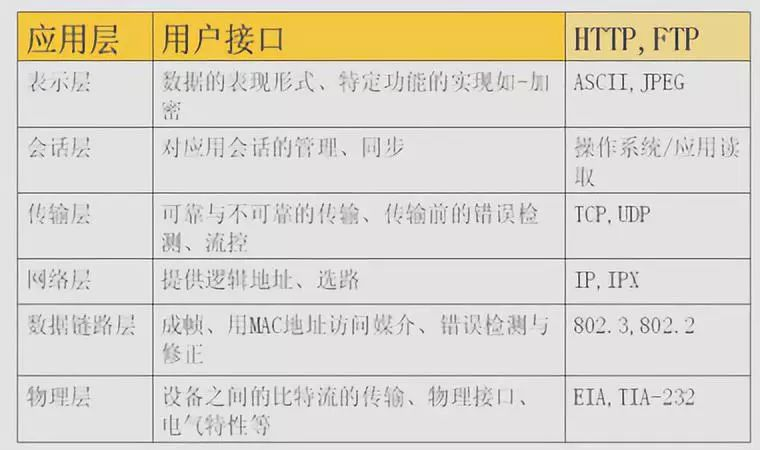
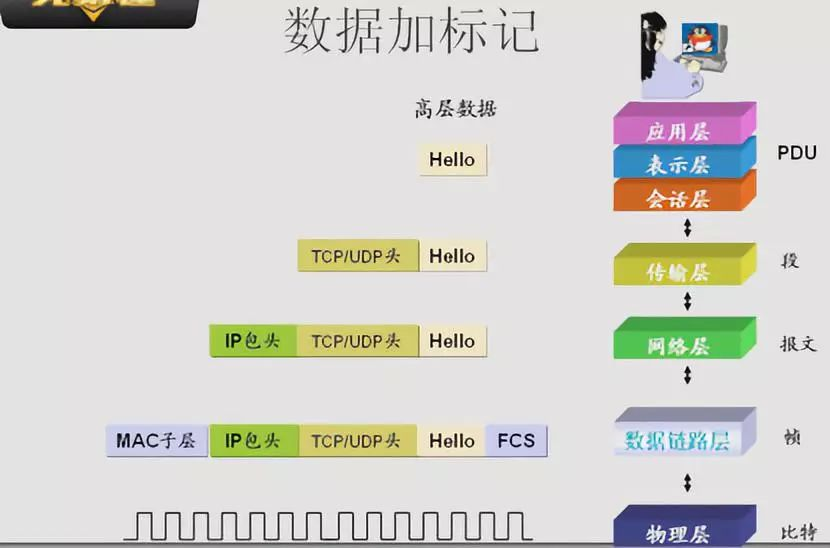
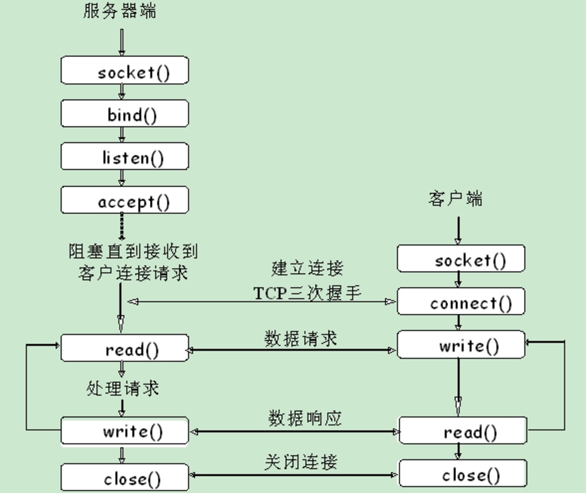
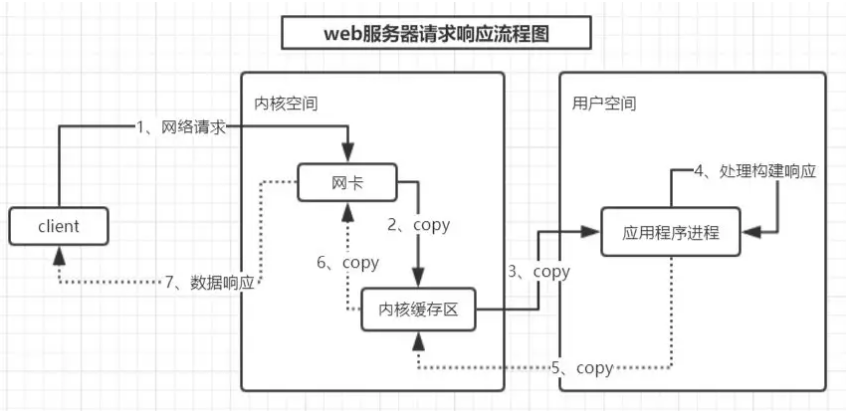

# NetWork 计算机网络


* 网络协议
    - DHCP，UDP, ARP, DNS
    - 一个客户端如何在接入网络以后，通过这些协议，跨域网络和服务器通信的
* HTTP/S
    - TCP可靠性传输原理，TCP/IP的协议细节， 三次握手，四次挥手，TCP状态转换
* 网络状态
* 长连接
* 网络握手
* 滑动窗口
* 网络参数
    - 和应用层结合非常紧密的Socket知识和网络安全（对称加密，非对称加密，Hash, 数字签名，以及集大成者Https）
* 通信模型
* 序列化
* 分组交换
* 网络层的路由选择算法，链路层的各种协议
* I/O多路复用，涉及到同步/异步，阻塞/非阻塞，select/epoll

* OSI七层模型
* TCP/IP五层模型
* TCP/IP协议总结
* TCP、UDP区别
* TCP三次握手、四次挥手
* TCP状态转换
* TCP状态中TIME_WAIT
* TCP连接建立需要为什么不是两次握手
* TCP第三次握手失败会出现什么
* TCP长连接和短链接及优缺点
* TCP拥塞控制-慢启动、拥塞避免、快重传、快启动
* TCP如何保证可靠性传输
* TCP如何解决粘包、拆包问题
* TCP为什么可靠
* UDP如何实现TCP可靠传输
* IP地址和子网掩码
* ARP解析过程
* DNS原理
* HTTP状态码
* HTTP1.0、HTTP1.1、HTTP2.0区别
* HTTP和HTTPS区别
* HTTPS加密过程
* 非对称加密和对称加密算法
* Nagle算法

## 基础

* 多进程/多线程
    - 了解Linux操作系统进程和线程概念
    - 了解Linux进程/线程切换调度基本知识
    - 了解进程间通信的基本知识，如管道、UnixSocket、消息队列、共享内存
* SOCKET
    - 了解SOCKET基本操作如accept/connect、send/recv、close、listen、bind
    - 了解SOCKET的接收缓存区、发送缓存区、阻塞/非阻塞、超时等概念
* IO复用
    - 了解select/poll/epoll
    - 了解基于select/epoll实现的事件循环，Reactor模型
    - 了解可读事件、可写事件
* 调试工具
    - 使用 gdb 调试Linux程序
    - 使用 strace 跟踪进程的系统调用
    - 使用 tcpdump 跟踪网络通信过程
    - 其他Linux系统工具，如ps、lsof、top、vmstat、netstat、sar、ss等
* 信号
    - SIGTERM: 向主进程 / 管理进程发送此信号服务器将安全终止
    - 在 PHP 代码中可以调用 $serv->shutdown() 完成此操作
    - SIGUSR1: 向主进程 / 管理进程发送 SIGUSR1 信号，将平稳地 restart 所有 Worker 进程
    - SIGUSR2: 向主进程 / 管理进程发送 SIGUSR2 信号，将平稳地重启所有 Task 进程

```sh
# 重启所有worker进程
kill -USR1 主进程PID

# 仅重启task进程
kill -USR2 主进程PID
```

## 硬件

* 硬件网卡，网线，交换机这些，用来处理数据
* 协议数据在网络中通信如何组织？如何识别？如何保证数据的正确性
* 操作系统这就是如何把计算机网络和操作系统结合起来的问题
    - 对于操作系统来说，网卡也是一种硬件资源。但是网络不单只是一种硬件，而是一种媒体入口。比如操作系统管理硬盘，当然不是简单的记一下硬盘有多大，然后一切操作都交给硬盘芯片去做，更多的需要组织硬盘的扇区，分区，记录文件和扇区/偏移的关系等等
    - 操作系统对于网络来说也是如此，要记录自身在网络的标识（ip），可被他人访问的入口（port），以及对方的信息（remote ip/port）。连接，断开，数据确认等操作也是由协议控制。传递自身消息给对方，类似访问硬盘一样把内存中的数据传递给网卡缓存，再发消息给网卡让网卡去传数据，而是否发送成功这些保证不再由硬件中断信号反馈，而是通过网络协议完成。接收对方消息，也是接收到网卡中断，再把数据从网卡缓存移动到内存中，再通过协议给予对方反馈
* 集线器（Hub）：一个将网线集结起来的作用，实现最初级的网络互通。集线器是通过网线直接传送数据的，工作在物理层
* 交换机：给这台设备加入一个指令，可以根据网口名称自动寻址传输数据。实现了任意两台电脑间的互联。工作在数据链路层
    - 保存的是每个计算机的网卡MAC地址与你所在的计算机的接口：通过学习，可以把MAC地址，端口号完善
    - 既可以连接PC机，又可以连接路由器
    - 根据Mac地址表转发数据
    - mac地址表含有Mac地址和接口
* 路由器：先在各自的操作系统上加上一套相同的协议。不同村落通信时，信息经协议加工成统一形式，再经由一个特殊的设备传送出去。这个设备就叫做路由器。每个机器都被赋予了一个IP地址。协议便是TCP/IP协议簇
    - 用来互联不同网段的设备,根据路由表转发数据
    - 理由表中含有网段和接口（！！！注意：绝对不能把路由器接在两个相同的网段上）

## OSI（Open Systems Interconnection Model）

* 从上往下的，越底层越接近硬件，越往上越接近软件，是一个标准
* 计算机与网络传输：每层进行层层解包和附加自己所要传递的信息，术语叫做报头
* 分层
    - 应用层：解决如何包装数据。各种应用软件，包括 Web 应用
    - 表示层：数据格式标识，基本压缩加密功能。上传的数据是以什么样的编码来编码，编码状态和回话方式，不是以人来自定义来完成的，而是由人在应用层操作来完成的
    - 会话层：控制应用程序之间会话能力；如不同软件数据分发给不同软件。_软件_
    - 传输层：端到端传输数据的基本功能；内嵌在IP数据包的"数据"部分 如 TCP、UDP。在原有的上层的数据外围标记两个标签：第一源端口，第二目的端口，从这个端口出去，访问另一个端口  数据被称作段（Segments）
        + TCP（Transmission Control Protocol）传输控制协议：没有长度限制，理论上可以无限长，但是为了保证网络的效率，通常TCP数据包的长度不会超过IP数据包的长度，以确保单个TCP数据包不必再分割
            * 能够确保数据不会遗失
            * 缺点是过程复杂、实现困难、消耗较多的资源。
        + UDP协议：格式几乎就只是在数据前加上发送端口和接收端口
            * 优点是比较简单，容易实现
            * 缺点是可靠性较差，一旦数据包发出，无法知道对方是否收到。
    - 网络层：定义IP编址，定义路由功能；如不同设备的数据转发。数据被称做包（Packages）地址层 在数据外围加一个原ip地址和目的ip地址
        + IP（Internet Protocol）互联网协议
            * 解决三个问题：寻址、路由、封装
            * 分为两部分：网络地址+设备地址，处于同一个子网络的电脑IP地址的网络部分必定是相同的
            * 子网掩码：TCP/IP协议使用子网掩码确定主机是在本地子网中还是在远程网络中。将Ip地址和子网掩码(subnet mask)排在一起比较，就可以分清楚改地址的网络部分和主机部分
                - A 类地址：首位以 0 开头，第 1-8 位是网络地址，后24位是主机地址，0.0.0.0~127.0.0.0 是 A 类的网络地址，可容纳 16777214（224-2） 个主机地址；
                - B 类地址：前两位以 10 开头，第 1-16 位是网络地址，后 16 位是主机地址，128.0.0.0~191.255.0.0 是 B 类的网络地址，可容纳 65534(216-2) 个主机地址；
                - C 类地址：前三位以 110 开头，第 1-24 位是网络地址，后 8 位是主机地址，192.168.0.0~239.255.255.0 是 C 类的网络地址，可容纳 254(28-2) 个主机地址；
                - D 类地址：前四位以 1110 开头，第 1-32 位是网络地址，没有主机地址，224.0.0.0~239.255.255.255 是 D 类的网络地址，常用于多播；
                - 子网掩码：就是表示子网络特征的一个参数。在形式上类似IP地址，也是一个32位二进制数字，它的网络部分全部为1，主机部分全部为0，将两个IP地址与子网掩码分别进行 AND 运算，然后比较结果是否相同，如果是的话，就表明它们在同一个子网络中，否则就不是。将 IP 地址与子网掩码做按位与运算，就可以计算出该 IP 地址的网络地址部分
                - 一种是在 IP 地址后面追加网络地址位数，并通过 / 分隔开：`192.168.31.218/24`
            * IP协议头
                - 八位的TTL字段:规定该数据包在穿过多少个路由之后才会被抛弃。某个IP数据包每穿过一个路由器，该数据包的TTL数值就会减少1，当该数据包的TTL成为零，它就会被自动抛弃。
        + ARP及RARP协议:根据IP地址获取MAC地址的一种协议
            * 一种解析协议，本来主机是完全不知道这个IP对应的是哪个主机的哪个接口，当主机要发送一个IP包的时候，会首先查一下自己的ARP高速缓存（就是一个IP-MAC地址对应表缓存）
            * 如果查询的IP－MAC值对不存在，那么主机就向网络发送一个ARP协议广播包，这个广播包里面就有待查询的IP地址，而直接收到这份广播的包的所有主机都会查询自己的IP地址，如果收到广播包的某一个主机发现自己符合条件，那么就准备好一个包含自己的MAC地址的ARP包传送给发送ARP广播的主机。
            * 广播主机拿到ARP包后会更新自己的ARP缓存（就是存放IP-MAC对应表的地方）。发送广播的主机就会用新的ARP缓存数据准备好数据链路层的的数据包发送工作
            * 代理ARP工作原理：路由器可以分割网段和广播，比如广播后只能在同一个网段接收到，而在其他的网段不会听见广播
        + 广播地址用于在同一个局域网中相互连接的主机之间发送数据。IP地址中的主机地址部分全部设置为1，就成为了广播地址。本地广播会被路由器屏蔽，不会到达外部网络。
        + 环回地址是在同一台计算机内部的程序之间进行网络通信时所使用的默认地址，一般使用一个特殊的 IP 地址 127.0.0.1 作为环回地址，该地址还有一个与之具有相同意义的主机名 localhost，使用这个 IP 地址或主机名，数据包不会流向网络。
    - 数据链路层：确定每个网络设备的 MAC 地址.定义数据的基本格式，如何传输，如何标识。将0、1序列划分为数据帧从一个节点传输到临近的另一个节点,这些节点是通过MAC来唯一标识的。数据被称为帧（Frames） _操作系统_
        + MAC：介质访问控制（Media Access Control）一个主机会有一个MAC地址，不能改变，在电脑出厂时已经刷在了网卡上了，Mac地址犹如身份证的ID是唯一的
        + 完成加封（盖个戳，加个标记）与解封、数据量层
            * 加封：盖个戳，加个标记， 数据链路层重点是在数据包外部加一个原MAC地址，目标Mac地址的标记
            * mac地址：网卡的物理地址，也是网卡的实际地址。 加原Mac地址+目的mac地址
        + 多少字节为一个包之类
        + Ethenet 和 Wifi 基本就是属于这个层次。所以 wifi 协议其实就是解决的一个链路和物理层的问题
        + 封装成帧: 把网络层数据报加头和尾，封装成帧,帧头中包括源MAC地址和目的MAC地址。
        + 透明传输:零比特填充、转义字符
        + 可靠传输: 在出错率很低的链路上很少用，但是无线链路WLAN会保证可靠传输
        + 差错检测(CRC):接收者检测错误,如果发现差错，丢弃该帧
    - 物理层：数据被称为比特流（Bits）负责0、1比特流与物理设备电压高低、光的闪灭之间的互换。通信线缆（光缆、无线），线缆的标准统统属于物理层  _物理设备_
* TCP/IP协议模型（Transmission Control Protocol/Internet Protocol）层对应关系
    - 应用层：HTTP 应用层 表示层 会话层 curl
        + 在传输数据时，可以只使用（传输层）TCP/IP协议，但是那样的话，如果没有应用层，便无法识别数据内容，如果想要使传输的数据有意义，则必须使用到应用层协议，应用层协议有很多，比如HTTP、FTP、TELNET等，也可以自己定义应用层协议。WEB使用HTTP协议作应用层协议，以封装HTTP文本信息，然后使用TCP/IP做传输层协议将它发到网络上。
    - 传输层  TCP UDP telent
    - 网络层 IP ping traceroute
    - 数据链路层 物理层
* 子网掩码决定了一个子网的计算机数目，简单的算法就是2的M次方。M表示二进制的子网掩码后面0的数目




```
10.10.27.115 # ip
255.255.255.0 # 子网掩码
10.10.27.0 # 网络
0.0.0.115 # 主机地址

arp -a
```

## 应用层

* 为了实现某种应用设计和创造的协议
* 远程登录协议
    - TELNET:基于 TCP 连接将向主机发送文字命令并在主机上执行，常用于登录路由器或高性能交换机等网络设备进行相应的设置
        + 利用 TELNET 协议实现远程登录的客户端程序，很多情况下，它的程序名就是 telnet 命令。TELNET 客户端通常与目标主机的 23 号端口连接，并与监听这个端口的服务端程序 telnetd 进行交互
        + 测试服务器指定端口是否可用
        + 过客户端 telnet 命令模拟 HTTP 请求
        + 无需任何认证即可发送内容，容易造成通信窃听和非法侵入的危险
* SSH(Secure Shell):可以加密通信内容，是加密的远程登录协议，通过在网络中建立安全隧道来实现 SSH 客户端与服务器之间的连接，可以在不安全的网络中为网络服务提供安全的传输环境
    - SSH 本身是一种协议，有多种实现，最常见的就是开源的 OpenSSH
    - 服务器上有对应的后台守护进程 sshd 响应客户端 SSH 远程连接，默认监听端口号是 22
    - 过程
        + 远程主机收到用户的登录请求，把自己的公钥发给用户
        + 用户使用这个公钥，将登录密码加密后，发送回来
        + 远程主机用自己的私钥，解密登录密码，如果密码正确，就同意用户登录
    - 威胁：中间人攻击：攻击者插在用户与远程主机之间，用伪造的公钥，获取用户的登录密码，再用这个密码登录远程主机
        + 在通过 SSH 首次进行远程登录的时候，系统会要求你比对返回的公钥是否与目标服务器上的公钥信息一致，查看公钥 `ssh-keyscan -t ECDSA -p 22 laravelacademy.org`
    - 每个用户都有自己的 `known_hosts` 文件，此外还有一个系统级的 `/etc/ssh/ssh_known_hosts `文件，用于保存对所有用户都可信赖的远程主机的公钥
    - 免密码登录远程服务器:`cat ~/.ssh/id_rsa.pub >> ~/.ssh/authorized_keys`
* FTP File Transfer Protocol 文件传输协议:在两个相连的计算机（通常是本地主机与服务器）之间进行文件传输的协议
    - 使用两个 TCP 连接实现文件传输：一个 TCP 连接用于控制，另一个 TCP 连接用于数据传输
        + 控制主要包含用户登录和验证、发送文件的名称、发送方式设置等。利用这个连接，可以通过 ASCII 码字符串发送请求和接收应答。但在这个连接上无法发送数据，只能通过另一个专门的 TCP 连接实现数据传输.使用的是 21 号端口，该端口进行文件 GET（RETR）、PUT（STOR）、以及文件预览（LIST）等操作时，每次都会建立一个用于数据传输的 TCP 连接。数据传输完毕后，传输数据的这个连接被断开，然后在控制用的连接上继续进行命令或应答的处理
        + 数据传输用的连接通常使用端口 20
    - 服务端守护进程就是 vsftpd
* SMTP（Simple Mail Transfer Protocol，简单邮件传输协议):一种会直连电源的邮件服务器，发送端和接收端通过邮件服务器进行邮件的收发。接收端从邮件服务器接收邮件使用 POP3 或 IMAP 协议
    - 完整的电子邮件机制由三部分组成
        + 邮箱地址:`用户名@邮件服务器域名` DNS 中注册了邮箱地址及其作为发送地址时对应的邮件服务器的域名，这些映射信息被称作 MX 记录，可以在域名解析里看到这个选项
        + 数据格式:已经扩展到 MIME（Multipurpose Internet Mail Extensions，多用途互联网邮件扩展类型），可以发送图片、动画、音频、视频、应用程序等各种形式的数据.首部和正文（数据）两个部分组成
            * 首部中的 Content-Type 用于指定正文的数据类型
            * MIME 首部和正文之间也是通过一个空行分隔，并且如果正文数据比较大的情况下，还可以通过指定数据类型为 multipart/mixed 将多个 MIME 消息组合为一个
        + 发送协议
            * SMTP 是发送电子邮件的协议，使用的是 TCP 的 25 号端口。SMTP 建立 TCP 连接之后，就会在这个连接上进行控制和应答以及数据的发送，客户端以文本命令方式发送请求
                - 一个不利之处在于它支持的是发送端主机的行为，而不是根据接收端的请求进行发送的行为，因此无法解决用户一开机就能接收到邮件.为了解决这个问题，引入了 POP
            * POP（Post Office Protocol，即邮局协议）协议，一种用于接收电子邮件的协议，现在用的是第三版 POP3
                - 发送端的邮件根据 SMTP 协议将被转发给一直处于插电状态的 POP 服务器，客户端再根据 POP 协议从 POP 服务器接收对方放过来的邮件。在这个过程中，为了防止他人盗窃邮件内容，还要做用户验证
                - POP 服务端监听端口是 110
            * IMAP （Internet Message Access Protocol，互联网邮件访问协议）也是接收电子邮件的协议
                - 与 POP 协议的区别在于：在 POP 中邮件由客户端管理，而在 IMAP 中邮件由服务器管理。因此，在使用 IMAP 时，可以不必从服务器下载所有邮件就可以阅读。因为 IMAP 是在服务器上处理 MIME 信息，所以可以实现一封邮件中有 10 个附件时只下载其中 7 个这样的功能，这在带宽较窄的线路上非常有用。而且 IMAP 在服务器上对「已读/未读」信息和邮件进行分类管理，因此，即使在不同的计算机上打开邮箱，也能保持同步，这样一来，人们就可以通过个人电脑、手机、公司电脑连接到 IMAP 服务器后接收邮件，并且同步状态
                - 服务端监听端口一般是 143

```sh
telnet 主机名(或IP) TCP端口号
telnet www.badu.com 80

ssh -p 2222 <用户名>@<主机名或IP地址>

yum install vsftpd -y
# 添加ftp帐号和目录 先检查一下nologin的位置，通常在/usr/sbin/nologin或者/sbin/nologin下。 使用下面的命令创建帐户，该命令指定了/www/wwwroot为用户pwftp的家目录，您可以自己定义帐户名和目录：
useradd -d /www/wwwroot -s /sbin/nologin pwftp
passwd pwftp
chown -R pwftp:pwftp /www/wwwroot
mkdir www
mkdir wwwroot
# vi /etc/vsftpd/vsftpd.conf 将配置文件中 “anonymous_enable=YES
anonymous_enable=NO
local_enable=YES
write_enable=YES
hroot_local_user=YES
# vi编辑/etc/shells，如果该文件里没有/usr/sbin/nologin或者/sbin/nologin（具体看当前系统配置）则追加进去
service vsftpd start

telnet 114.215.241.29 21
USER ftpuser   # 通过 USER 指令设置 FTP 用户名
331 Please specify the password.
PASS ********  # 通过 PASS 指令设置 FTP 用户密码
230 Login successful.   # 返回 230 表示认证成功
```

## 传输层

* 使用端口号识别在传输层上一层的应用层中所要进行处理的具体程序
* 众多协议大多以客户端/服务端的形式运行,作为服务端的程序有必要提前启动，准备接收客户端的请求
    - 这些服务端程序在 UNIX 系统中叫守护进程
* TCP Transmission Control Protocol 传输控制协议:提供面向连接的可靠性传输
    - 面向有连接的协议，只有在确认通信对端存在时才会发送数据
    - 通过检验和、序列号、确认应答、重发控制、连接管理以及窗口控制等机制实现可靠性传
        + 序列号：发送数据的位置，每发送一次数据，就累加一次该数据字节数的大小，序列号不会从0或1开始，而是在建立连接时由计算机生成的随机数作为初始值，通过 SYN 包发送给接收端主机。此外，建立连接和断开连接时虽然不传输数据，但也会作为一个字节增加对应的序列号
        + 确认应答号：下一次应该接收到的数据的序列号，实际上，它是指已经收到确认应答号减一为止的数据
        + 数据偏移：TCP 所传输的数据部分应该从 TCP 包的哪个位置开始计算，也可以将其看作 TCP 包的长度，单位为4字节
        + 控制位：字段长8位，每一位从左到右分别是CWR、ECE、URG、ACK、PSH、RST、SYN、FIN
            * CWR（Congestion Window Reduced）：与后面的ECE都是用于IP首部的ECN字段，为1时通知对方已将拥塞窗口缩小
            * ECE（ECN-Echo）：置为1时通知通信对方，从对方到这边的网络有拥堵
            * URG（Urgent Flag）：该位为1时，表示包中有需要紧急处理的数据
            * ACK（Acknowledgement Flag）：该位为1时，确认应答的字段变为有效
            * PSH（Push Flag）：该位为1时，表示需要将收到的数据立即传给上层应用协议，为0时则表示先不上传而是缓存起来
            * RST（Reset Flag）：该位为1时，表示TCP连接中出现异常必须强制断开连接
            * SYN（Synchronize Flag）：该位为1时，表示希望建立连接，并在序列号字段进行序列号初始值的设定
            * FIN（Fin Flag）：该位为1时，表示今后不会再有数据发送，希望断开连接
        + 窗口大小：用于通知从相同 TCP 首部的确认应答号所指位置开始能够接收的数据大小
    - 连接建立 三次握手:目的是为了确保对连接双方来说，链路都是通的
    - 通过肯定的确认应答（ACK）实现可靠的数据传输，当发送端将数据发出之后会等待对端的确认应答。如果确认应答，说明数据已经成功达到对端。反之，则数据有可能丢失。在一定时间内没有等到确认应答，发送端就认为数据已经丢失，并进行重发
    - 顺序控制
        + 确认应答处理、重发控制以及重复控制等功能都可以通过序列号实现，序列号是按顺序给发送数据的每一个字节都标上号码的编号
    - 重发
        + 超时时间:每次发包时都会计算往返时间（RTT）及偏差（抖动），将这个往返时间和偏差相加，重发超时的时间，就是比这个总和稍微大一点的值
        + 在 BSD Unix 和 Windows 中，超时都是按照 0.5 秒为单位进行控制，因此，重发超时都是 0.5 秒的整数倍。不过由于最初的数据包还不知道往返时间，因此其重发超时一般设置为 6 秒左右
        + 被重发之后若还是收不到确认应答，则再次发送。此时等待确认应答的时间将会以 2 倍、4 倍的指数函数增长
        + 达到一定重发次数后，如果仍没有确认应答返回，就会判断为网络或对端主机发生了异常，强制关闭连接。并且通知应用通信异常强行终止
    - 窗口：
        + 在传输大量数据时，是以 MSS 的大小将数据分割发送。重发时也是以 MSS 为单位
        + 建立 TCP 连接的同时，也可以确定发送数据包的单位，可以将其称为「最大消息长度」（MSS，Maximum Segment Size），最理想的情况下，最大消息长度正好是 IP 中不会被分片处理的最大数据长度
        + 以一个段（Segment）为单位，每发送一个段进行一次确认应答的处理，这样的传输方式有一个显著的缺点，就是包往返的时间越长通信性能就越低
        + 窗口机制确认应答不再以每个分段，而是以更大单位进行确认，也就是说，发送端主机在发送完一个段之后，不必一直等待确认应答，而是继续发送
        + 窗口的大小就是指无需等待确认应答而可以继续发送数据的最大值，这个机制实现了使用大量的缓冲区（临时保存收发数据的场所），通过对多个段同时进行确认应答的功能，而不是每个分段都返回确认应答，从而大幅度缩短发送时间。在得到确认应答之前，需要在缓冲区保存这部分发送的数据，以便于重发数据
        + 在滑动窗口以外的部分包括尚未发送的数据以及已经确认对端已经收到的数据，当数据发出后若如期收到确认应答就不再进行重发，此时数据就会从缓冲区中清除，否则丢失的数据需要进行重发（从缓冲区取）
        + 滑动窗口控制：收到确认应答的情况下，将窗口滑动到确认应答中的序列号的位置，这样就可以顺序将多个段同时发送，提高通信性能
    - 流量控制：让发送端根据接收端的实际接收能力控制发送的数据量，为了防止把接收端缓存塞满
        + 发送端会根据自己的实际情况发送数据，但是，接收端可能收到的是一个毫无关系的数据包又可能会在处理其它问题上耗费一些时间，甚至在高负荷的情况下无法接收任何数据。如此一来，如果接收端将本该接收的数据丢弃的话，就又会触发重发机制，从而导致网络流量的无端浪费
        + 接收端主机向发送端主机通知自己可以接收数据的大小，于是发送端会发送不超过这个限度的数据，该大小限制被称作窗口大小
        + TCP 首部中，专门有一个字段用来通知窗口大小，接收主机将自己可以接收的缓冲区大小放入这个字段中通知给发送端。这个字段值越大，说明网络的吞吐量越高
        + 接收端的这个缓冲区一旦面临数据溢出风险，窗口大小的值也会随之被设置为一个更小的值通知给发送端，从而控制数据发送量。也就是说，发送端会根据接收端的指示，对发送数据的量进行控制
    - 拥塞控制：为了防止把网络塞满，导致网络拥塞
        + 如果在通信一开始就发送大量数据，在网络拥堵时，如果发送一个较大量的数据，极有可能导致整个网络的瘫痪
        + 在通信一开始就会通过一个叫做慢启动的算法得出的值，对发送数据量进行控制
            * 为了在发送端调节所要发送数据的量，定义了一个叫做「拥塞窗口」的概念，于是在慢启动的时候，将这个拥塞窗口的大小设置为1个数据段（1MSS）发送数据，之后每收到一个确认应答（ACK），就将拥塞窗口的值加1，在发送数据包时，将拥塞窗口的大小与接收端主机通知的窗口大小做比较，然后按照它们当中较小的那个值，发送比它还要小的数据量
            * 为了防止超时重发时，随着包往返导致的拥塞窗口快速增长（指数增长），引入了慢启动阀值的概念，只要拥塞窗口的大小超过这个阀值，每收到一次确认应答时，只允许以下面这种方式放大拥塞窗口：1个数据段的字节数/拥堵窗口（字节数）×　１个数据段字节数
            * 拥塞窗口越大，确认应答的数目也会增加，不过每收到一个确认应答，其涨幅也会逐渐减小，甚至小过比一个数据段还要小的字节数
        + 开始通信时，并没有设置慢启动阀值，只有超时重发时才会设置该值，初始值为当时拥塞窗口的一半
* UDP User Datagram Protocol 用户数据报协议
    - 提供面向无连接的非可靠性传输
    - 不能保证消息一定会按顺序到达，传输途中如果出现丢包，UDP 不负责进行重发，包的到达顺序错乱时，UDP 也没有纠正功能
    - 出现网络拥堵，UDP 也无法进行流量控制等避免避免网络拥塞的行为
    - 景：
        + 包总量较少（DNS、DHCP）
        + 视频、音频等多媒体即时通信（少量的丢包不影响通信质量）
        + 广播通信（广播、多播）

## 网络层

* IP 地址:用来识别计算机网路中互连的主机和路由器
* 局域网内部需要数据链路层进行通信，而不同的局域网之间（互联网其实就是将多个不同的局域网连接起来实现互联）需要借助网络层才能通信，完整的计算机网络需要借助这两个分层才能最终完成通信
* 「跳」是网络中的一个区间（网段），IP 数据包正是在网络中一个个跳之间转发，因此 IP 路由也叫多跳路由，在每一个区间内决定着包在下一跳被转发的路径。
* 所有主机和路由器都维护着一张路由控制表，该表记录 IP 数据在下一步应该发给哪个路由器，IP 数据包将根据这个路由表在各个数据链路上传输。该路由控制表有两种生成方式、
    - 静态路由控制：管理员手动设置
    - 动态路由控制：路由器根据与其他路由器相互交换信息时自动刷新
    - 为了让动态路由及时刷新路由控制表，在网络上互连的路由器之间必须设置好路由协议，保证正常读取路由控制信息
* IP 数据包是在数据链路层处理的基础上对数据进行打包，不同数据链路的各自最大传输单位（MTU）不尽相同，但是 IP 协议又是可以实现多个数据链路之间通信的协议，所以，意味着它对不同的数据链路差异进行了抽象，使得上层无需关注底层网络构造细节
* IPv6 协议在设计时没有考虑与 IPv4 的兼容性问题
* IP 协议采用了对数据包进行分片处理，将较大的 IP 包分割成较小的包，到了接收端以后再根据分片序号重新组合起来传递给上一层，通过这种方式实现了对数据链路层的抽象
    - 分片会导致路由器处理负荷加重，所以只要允许，都不会让路由器进行 IP 数据包的分片处理，其次，在分片过程中，如果某个分片丢失，整个 IP 数据包都会作废。实际实现过程中，为了避免路由器对 IP 数据包进行分片，还产生了一种叫做「路径 MTU 发现」的技术，所谓路径 MTU 指的是从发送端主机到接收端主机之间路由器不需要对 IP 数据包进行分片的最大 MTU 的大小，然后发送端根据这个 MTU 的大小对数据包进行分片发送，从而避免路由器对其进行分片处理
*  DHCP 动态主机配置协议
*  网络地址转换（Network Address Translation、NAT）:在 IP 数据包通过路由器时修改网络地址的技术，它能够将当前地址空间中的 IP 地址映射到另一个地址空间.内部有一张自动生成的用来转换地址的表,将内部地址装换为公网地址。当内网机器过多时，用包含端口号一起转换的方式可以解决这个问题
    -  当切换网络或者上游的 ISP 出现改变时，NAT 技术可以避免修改网络中全部节点的 IP，我们可以将 NAT 技术理解成一个转换表，其中存储着外部地址和端口到内部地址和端口的转换关系
    -  当数据包从内部访问外部网络时，NAT 会为当前请求分配一个端口、覆写数据包中的源地址和端口并将地址和端口信息存储到本地的转换表中
    -  当数据包从外部进入网络内部时，NAT 会根据数据包的 IP 地址和端口号查找到私有网络中对应的主机和端口号并覆写数据包中的目的地址和端口。
    -  争议：
        + NAT 使用的端口号是用于进程寻址的，而不是用于主机寻址的；
        + NAT 路由器作为第三层（网络层）的设备，它应当只处理达到网络层的分组；
        + NAT 违反了主机应当直接彼此对话的原则
* 早期开发阶段，子网是通过 IP 地址最左侧的 8 位划分子网，但是因为这种方式只允许划分 256 个网络
* 在 1981 年被分类网络架构（Classful Network Architecture）迅速替代。分类网络架构中包含 A、B 和 C 三类网络
    - A 128 16,777,214
    - B   16,384  65,534
    - C   2,097,152   254
* IETF 在 1993 年提出的无类别域间路由（Classless Inter-Domain Routing、CIDR）替代了分类网络架构，CIDR 基于可变长子网掩码（Variable-length Subnet Masking、VLSM）
    - 缓解互联网中路由器中转发表的增长速度；
    - 缓解 IPv4 地址耗尽的速度
    - 使用可变长度的子网掩码来划分地址块,N 表示前缀长度，可以是从 0 到 32 的任意值 A.B.C.D/N
    - 回收不再使用的 IP 资源并投入再利用

```sh
apt-get  install bridge-utils

brctl addbr br0
sudo brctl show [br0]

brctl delbr br1

brctl addif br0 eth0
brctl delif br0 eth0
```

## 数据链路

* MAC 地址:用来识别同一链路中的不同计算机

## 网络命令

* ping:确定网络是否正确连接，以及网络连接的状况.是ICMP的最著名的应用，是TCP/IP协议的一部分。利用"ping"命令可以检查网络是否连通，可以很好地帮助我们分析和判定网络故障。原理是用类型码为0的ICMP发请 求，受到请求的主机则用类型码为8的ICMP回应
* ipconfig:用于显示当前的TCP/IP配置的设置值
    - 属于 net-tools 工具集。net-tools 起源于 BSD，自 2001 年起，Linux 社区已经停止对其进行维护
    - ip 命令归属于 iproute2 工具集，iproute2 旨在取代 net-tools，并提供了一些新功能
* ip addr
* Traceroute:是用来侦测主机到目的主机之间所经路由情况的重要工具。它收到到目的主机的IP后，首先给目的主机发送一个TTL=1的UDP数据包，而经过的第一个路由器收到这个数据包以后，就自动把TTL减1，而TTL变为0以后，路由器就把这个包给抛弃了，并同时产生 一个主机不可达的ICMP数据报给主机。主机收到这个数据报以后再发一个TTL=2的UDP数据报给目的主机，然后刺激第二个路由器给主机发ICMP数据 报。如此往复直到到达目的主机。这样，traceroute就拿到了所有的路由器IP
* 网卡
    - lo 全称是 loopback，又称环回接口，往往会被分配到 127.0.0.1 这个地址。这个地址用于本机通信，经过内核处理后直接返回，不会在任何网络中出现
    - 网络设备状态标识 <BROADCAST,MULTICAST,UP,LOWER_UP>
        + UP 表示网卡处于启动的状态
        + BROADCAST 表示这个网卡有广播地址，可以发送广播包
        + MULTICAST 表示网卡可以发送多播包
        + LOWER_UP 表示 L1 是启动的，也就是网线是插着的

```sh
ping  主机名
ping  域名
ping  IP地址

ping 127.0.0.1 # 如果测试成功，表明网卡、TCP/IP协议的安装、IP地址、子网掩码的设置正常。如果测试不成功，就表示TCP/IP的安装或设置存在有问题。
ping 本机IP地址 # 如果测试不成功，则表示本地配置或安装存在问题，应当对网络设备和通讯介质进行测试、检查并排除。
ping 局域网内其他IP #如果测试成功，表明本地网络中的网卡和载体运行正确。但如果收到0个回送应答，那么表示子网掩码不正确或网卡配置错误或电缆系统有问题。
ping 网关IP # 这个命令如果应答正确，表示局域网中的网关路由器正在运行并能够做出应答。
ping 远程IP # 如果收到正确应答，表示成功的使用了缺省网关。对于拨号上网用户则表示能够成功的访问Internet（但不排除ISP的DNS会有问题）。
ping localhost # local host是系统的网络保留名，它是127.0.0.1的别名，每台计算机都应该能够将该名字转换成该地址。否则，则表示主机文件（/Windows/host）中存在问题。
ping www.yahoo.com # 对此域名执行Ping命令，计算机必须先将域名转换成IP地址，通常是通过DNS服务器。如果这里出现故障，则表示本机DNS服务器的IP地址配置不正确，或它所访问的DNS服务器有故障如果上面所列出的所有ping命令都能正常运行，那么计算机进行本地和远程通信基本上就没有问题了。但是，这些命令的成功并不表示你所有的网络配置都没有问题，例如，某些子网掩码错误就可能无法用这些方法检测到。

ping IP -t # 连续对IP地址执行ping命令，直到被用户以Ctrl+C中断。
ping IP -l 2000 # 指定ping命令中的特定数据长度（此处为2000字节），而不是缺省的32字节。
ping IP -n 20 # 执行特定次数（此处是20）的ping命令。

ipconfig # 显示每个已经配置了的接口的IP地址、子网掩码和缺省网关值
ipconfig /all # 为DNS和WINS服务器显示它已配置且所有使用的附加信息，并且能够显示内置于本地网卡中的物理地址（MAC）

traceroute google.com

nsloop
```

## Socket 套接字

* 在同一台机器上进程间的通信（IPC）有多种方式，可以是通过消息队列、FIFO、共享内存等方式。
* 网络编程套接字是指：分布在不同机器上的程序通过系统提供的网络通信接口，跨越网络将不同机器上的进程连接起来，实现跨机器的网络通信。一般有UDP套接字、TCP套接字、Unix Domain
* 应用层的应用程序在基于 TCP 协议或 UDP 协议进行通信时，需要用到操作系统提供的类库，这种类库一般称为 API（Application Programming Interface，应用编程接口）
* 使用 TCP 或 UDP 时，又会广泛使用到 Socket（套接字）API，Socket 原本是由 BSD UNIX 开发的，但是后来被移植到 Windows 的 Winsock 以及嵌入式系统中。应用程序利用 Socket，可以设置对端的 IP 地址、端口号，并实现数据的接收和发送
* TCP
    - 服务端要先监听一个端口，一般是先调用 bind 函数，给这个 Socket 赋予一个 IP 地址和端口
    - 调用 listen 函数进行监听
    - 操作系统内核中，为每个 Socket 维护两个队列。一个是已经建立了连接的队列，这时候连接三次握手已经完毕，处于 established 状态；一个是还没有完全建立连接的队列，这个时候三次握手还没完成，处于 syn_rcv 的状态
    - 服务端等待的时候，客户端可以通过 connect 函数发起连接。在参数中指明要连接的 IP 地址和端口号，然后开始发起三次握手，操作系统会给客户端分配一个临时的端口。一旦握手成功，服务端的 accept 就会返回另一个 Socket 用于传输数据
    - 服务端调用 accept 函数，拿出一个已经完成的连接进行处理。如果还没有完成，就要等着
    - 负责监听的 Socket 和真正用来传数据的 Socket 是两个，一个叫作监听 Socket，一个叫作已连接 Socket
    - 连接建立成功之后，双方开始通过 read 和 write 函数来读写数据，就像往一个文件流里面写东西一样
* 提高并发量
    - 服务端最大并发 TCP 连接数远不能达到理论上限
        + 文件描述符限制，按照前面介绍的原理，Socket 都是文件，所以首先要通过 ulimit 配置文件描述符的数目
        + 另一个限制是内存，按上面的数据结构，每个 TCP 连接都要占用一定内存，操作系统是有限的
    - 多进程:当有新的请求进来，fork出一个子进程，让子进程处理该请求，提高并发量
    - 多线程:进程开销太大，线程则轻量级的多，所以还可以通过在进程中创建新的线程来处理请求
    - C10K:每新进来一个 TCP 连接请求，就需要分配一个进程或线程
* Socket连接是长连接，理论上客户端和服务器端一旦建立连接将不会主动断开此连接
* Socket连接属于请求-响应形式，服务端可主动将消息推送给客户端
* 网络上的两个程序通过一个双向的通信连接实现数据的交换，连接的一端称为一个socket，建立网络通信连接至少要一对端口号(socket)
* socket本质是编程接口(API)，对TCP/IP的封装，TCP/IP也要提供可供程序员做网络开发所用的接口，这就是Socket编程接口
* Socket利用网间网通信设施实现进程通信，对通信设施的细节毫不关心，只要通信设施能提供足够的通信能力
* Socket实质上提供了进程通信的端点
* 进程通信之前，双方首先必须各自创建一个端点，否则是没有办法建立联系并相互通信的
* 是网络通信过程中端点的抽象表示，包含进行网络通信必须的五种信息：连接使用的协议，本地主机的IP地址，本地进程的协议端口，远地主机的IP地址，远地进程的协议端口
* 应用层通过传输层进行数据通信时，TCP会遇到同时为多个应用程序进程提供并发服务的问题
* 多个TCP连接或多个应用程序进程可能需要通过同一个 TCP协议端口传输数据
* 为了区别不同的应用程序进程和连接，许多计算机操作系统为应用程序与TCP／IP协议交互提供了套接字(Socket)接口
* 应用层可以和传输层通过Socket接口，区分来自不同应用程序进程或网络连接的通信，实现数据传输的并发服务。
* 应用层通过传输层进行数据通信时，TCP会遇到同时为多个应用程序进程提供并发服务的问题。
* 多个TCP连接或多个应用程序进程可能需要通过同一个 TCP协议端口传输数据。
* 为了区别不同的应用程序进程和连接，许多计算机操作系统为应用程序与TCP／IP协议交互提供了套接字(Socket)接口。应 用层可以和传输层通过Socket接口，区分来自不同应用程序进程或网络连接的通信，实现数据传输的并发服务。
* Socket 可以被定义描述为两个应用通信通道的端点。一个 Socket 端点可以用 Socket 地址来描述， Socket 地址结构由 IP 地址，端口和使用协议组成（ TCP or UDP ）。http协议可以通过socket实现，socket在传输层上实现。从这个角度来说，socket介于应用层和传输层之间。但是socket作为一种进程通信机制，操作系统分配唯一一个socket号，是依赖于通信协议的，但是这个通信协议不仅仅是 tcp或udp，也可以是其它协议
* 原理
    - 域Socket：“Unix domain socket 或者 IPCsocket 是一种终端，可以使同一台操作系统上的两个或多个进程进行数据通信
    - 与管道相比，Unix domain sockets 既可以使用字节流数和数据队列，而管道通信则只能通过字节流
    - Unix domain sockets的接口和Internet socket很像，但它不使用网络底层协议来通信
    - Unix domain socket 的功能是POSIX操作系统里的一种组件
    - Unix domain sockets 使用系统文件的地址来作为自己的身份。可以被系统进程引用。所以两个进程可以同时打开一个Unix domain sockets来进行通信。不过这种通信方式是发生在系统内核里而不会在网络里传播。
    - These are secure in that they are file-based and can't be read by remote servers. We can further use linux permission to set who can read and write to this socket file.
* Unix Socket vs Tcp Socket
    - 不会走到TCP 那层，直接以文件形式，以stream socket通讯。
    - unix socket减少了不必要的tcp开销，而tcp需要经过loopback，还要申请临时端口和tcp相关资源。
    - unix socket高并发时候不稳定，连接数爆发时，会产生大量的长时缓存，在没有面向连接协议的支撑下，大数据包可能会直接出错不返回异常。
    - tcp这样的面向连接的协议，多少可以保证通信的正确性和完整性。
    - TCP socket,则需要走到IP层
* 过程:建立Socket连接至少需要一对套接字，其中一个运行于客户端，称为ClientSocket ，另一个运行于服务器端，称为ServerSocket
    - 服务器监听：是服务器端套接字并不定位具体的客户端套接字，而是处于等待连接的状态，实时监控网络状态。
    - 客户端请求：是指由客户端的套接字提出连接请求，要连接的目标是服务器端的套接字。为此，客户端的套接字必须首先描述它要连接的服务器的套接字，指出服务器端套接字的地址和端口号，然后就向服务器端套接字提出连接请求。
    - 连接确认：是指当服务器端套接字监听到或者说接收到客户端套接字的连接请求，它就响应客户端套接字的请求，建立一个新的线程，把服务器端套接字的描述发给客户端，一旦客户端确认了此描述，连接就建立好了。而服务器端套接字继续处于监听状态，继续接收其他客户端套接字的连接请求
* 创建Socket连接时，可以指定使用的传输层协议，Socket可以支持不同的传输层协议（TCP或UDP）
* socket则是对TCP/IP协议的封装和应用。也可以说，TPC/IP协议是传输层协议，主要解决数据 如何在网络中传输，而HTTP是应用层协议，主要解决如何包装数据。
* Socket编程接口在设计的时候，就希望也能适应其他的网络协议。 TCP/IP也要提供可供程序员做网络开发所用的接口，这就是Socket编程接口。

* 把一个地址族中的特定地址赋给socket
    - sockfd：即socket描述字，它是通过socket()函数创建了，唯一标识一个socket。bind()函数就是将给这个描述字绑定一个名字。
    - addr：一个const struct sockaddr *指针，指向要绑定给sockfd的协议地址。这个地址结构根据地址创建socket时的地址协议族的不同而不同




```c++
int bind(int sockfd, const struct sockaddr *addr, socklen_t addrlen);

int listen(int sockfd, int backlog);
int connect(int sockfd, const struct sockaddr *addr, socklen_t addrlen);

int accept(int sockfd, struct sockaddr *addr, socklen_t *addrlen);

#include <unistd.h>

ssize_t read(int fd, void *buf, size_t count);
ssize_t write(int fd, const void *buf, size_t count);

#include <sys/types.h>
#include <sys/socket.h>

ssize_t send(int sockfd, const void *buf, size_t len, int flags);
ssize_t recv(int sockfd, void *buf, size_t len, int flags);

ssize_t sendto(int sockfd, const void *buf, size_t len, int flags,
              const struct sockaddr *dest_addr, socklen_t addrlen);
ssize_t recvfrom(int sockfd, void *buf, size_t len, int flags,
                struct sockaddr *src_addr, socklen_t *addrlen);

ssize_t sendmsg(int sockfd, const struct msghdr *msg, int flags);
ssize_t recvmsg(int sockfd, struct msghdr *msg, int flags);

int close(int fd);
```

## IO

* 阻塞IO
    - 你去甜在心馒头店买太极馒头，阿梅说：＂暂时没，正在蒸呢，你自己看着点儿！＂．于是你就站在旁边只等馒头．此时的你，是阻塞的，是同步的．阻塞表现在你除了等馒头，别的什么都不做了．同步表现在等馒头的过程中，阿梅不提供通知服务，你不得不自己要等到＂馒头出炉＂的消息
        + 典型PHP开发，基于LNMP
    - 你去甜在心馒头店买太极馒头，阿梅说：＂暂时没，正在蒸呢，蒸好了我打电话告诉你！＂．但你依然站在旁边只等馒头，此时的你，是阻塞的，是异步的．阻塞表现在你除了等馒头，别的什么都不做了．异步表现在等馒头的过程中，阿梅提供电话通知＂馒头出炉＂的消息，你只需要等阿梅的电话．
* 非阻塞IO
    - 去甜在心馒头店买太极馒头，阿梅说：＂暂时没，正在蒸呢，你自己看着点儿！＂．于是你就站在旁边发微信，然后问一句：＂好了没？＂，然后发QQ，然后再问一句：＂好了没？＂．此时的你，是非阻塞的，是同步的．非阻塞表现在你除了等馒头，自己还干干别的时不时会主动问问馒头好没好．同步表现在等馒头的过程中，阿梅不提供通知服务，你不得不自己要等到＂馒头出炉＂的消息．
    - 你去甜在心馒头店买太极馒头，阿梅说：＂暂时没，正在蒸呢，蒸好了我打电话告诉你！＂．于是你就走了，去买了双新球鞋，看了看武馆，总之，从此不再过问馒头的事情，一心只等阿梅电话．此时的你，是非阻塞的，是异步的．非阻塞表现在你除了等馒头，自己还干干别的时不时会主动问问馒头好没好．异步表现在等馒头的过程中，阿梅提供电话通知＂馒头出炉＂的消息，你只需要等阿梅的电话．
* 阻塞和非阻塞关注的是：在等馒头的过程中，你在干啥
* 同步和异步关注的是：等馒头这件事，你是一直等到＂馒头出炉＂的结果，还是立即跑路等阿梅告诉你的＂馒头出炉＂．
* 最傻的人才会采用异步阻塞的IO方式去写程序
* IO多路复用
    - select
    - poll
    - epoll
        + 在epoll出世前，QQ用户量剧增，但是select以及select的高配版本poll都无法解决他们的问题，于是乎QQ当年的服务器就不得不用UDP协议来避规这个问题，一直到后来有了epoll，QQ开始逐步在PC客户端中的配置项中允许用户选择UDP服务器或TCP服务器
* 信号驱动IO

## 网络IO模型

整个演变的过程，就是对CPU有效性能压榨的过程

* 一个任务就是一个进程（Process）,一个进程至少有一个线程
* 线程（Thread）:一个进程内部，要同时干多件事，就需要同时运行多个“子任务”
* 进程:跑在一个cpu里面的并发都需要处理上下文切换的问题。进程就是这样抽象出来个一个概念，搭配虚拟内存、进程表之类的东西，用来管理独立的程序运行、切换。频繁的进程上下文切换导致了OS性能的降低
    - 切换页全局目录（Page Global Directory）来加载一个新的地址空间，实际上就是加载新进程的cr3寄存器值。
    - 切换内核堆栈和硬件上下文，这些包含了内核执行一个新进程的所有信息，包含了CPU寄存器。
* 线程：有的时候碰着I/O访问，阻塞了后面所有的计算。空着也是空着，内核就直接把CPU切换到其他进程，让人家先用着。当然除了I\O阻塞，还有时钟阻塞等等。后来发现不成，太慢了。为啥呀，一切换进程得反复进入内核，置换掉一大堆状态。进程数一高，大部分系统资源就被进程切换给吃掉了。
    - 后来搞出线程的概念:这个地方阻塞了，但我还有其他地方的逻辑流可以计算，这些逻辑流是共享一个地址空间的，不用特别麻烦的重新加载地址空间，页表缓冲区，只要把寄存器刷新一遍就行，能比切换进程开销少点。
    - 要先保存上一个线程的上下文，然后执行下一个线程，当条件满足时，切换回上一个线程，并恢复上下文。
* 协程：自己在进程里面写一个逻辑流调度的东西。那么即可以利用到并发优势，又可以避免反复系统调用，还有进程切换造成的开销，分分钟给你上几千个逻辑流不费力。这就是用户态线程。实现一个用户态线程有两个必须要处理的问题：
    - 碰着阻塞式I\O会导致整个进程被挂起；
    - 由于缺乏时钟阻塞，进程需要自己拥有调度线程的能力。
    - 如果一种实现使得每个线程需要自己通过调用某个方法，主动交出控制权。那么我们就称这种用户态线程是协作式的，即是协程。协程就是在用户程序中实现了协作式任务调度。
    - yield这个关键字就是用来产生中断, 并保存当前的上下文的, 比如说程序的一段代码是访问远程服务器，那这个时候CPU就是空闲的，就用yield让出CPU，接着执行下一段的代码，如果下一段代码还是访问除CPU以外的其它资源，还可以调用yield让出CPU. 继续往下执行，这样就可以用同步的方式写异步的代码了.
        + 为应用层实现多任务提供了工具;
        + 协程不允许多任务同时执行，要执行其它协程，必须使用关键字yield主动放弃cpu控制权;
        + 协程需要自己写任务管理器，以及任务调度器；
        + 减轻了OS处理零散任务和轻量级任务的负担；
* 连接：建立 Socket 连接需要一对套接字，其中一个运行于客户端，另一个运行于服务器端
* 套接字（socket）
    - 支持 TCP/IP 协议的网络通信的基本操作单元
    - 网络通信过程中端点的抽象表示，包含进行网络通信必须的五种信息：连接使用的协议，本地主机的 IP 地址，本地进程的协议端口，远地主机的 IP 地址，远地进程的协议端口
    - 建立连接：
        + 服务器监听：服务器端套接字并不定位具体的客户端套接字，而是处于等待连接的状态，实时监控网络状态
        + 客户端请求：客户端套接字提出连接请求，连接目标是服务器端套接字。客户端的套接字必须首先描述要连接的服务器套接字（指出服务器端套接字的地址和端口号），然后就向服务器端套接字提出连接请求
        + 服务器端确认：当服务器端套接字监听到或者说接收到客户端套接字的连接请求，就响应客户端
        + 把服务器端套接字的描述发给客户端，一旦客户端确认了此描述，连接就建立好了。而服务器端套接字继续处于监听状态，继续接收其他客户端套接字的连接请求
    - 通信时，一个应用程序将数据写入Socket，然后通过网卡把数据发送到另外一个应用程序的Socket中
* 阻塞与非阻塞
    - 阻塞：发出一个请求不能立刻返回响应，要等所有的逻辑全处理完才能返回响应
    - 非阻塞：发出一个请求立刻返回应答，不用等处理完所有逻辑
* 应用程序稳定性远远比不上操作系统程序。Linux区分了内核空间和用户空间，隔离了操作系统程序和应用程序，避免了应用程序影响到操作系统自身的稳定性。也是Linux系统超级稳定的主要原因

* 现在操作系统都是采用虚拟存储器，那么对32位操作系统而言，它的寻址空间（虚拟存储空间）为4G（2的32次方）
* 操作系统的核心是内核，独立于普通的应用程序，可以访问受保护的内存空间，也有访问底层硬件设备的所有权限
* 为了保证用户进程不能直接操作内核（kernel），保证内核的安全，操心系统将虚拟空间划分为两部分，一部分为内核空间，一部分为用户空间
* 针对linux操作系统而言，将最高的1G字节（从虚拟地址0xC0000000到0xFFFFFFFF），供内核使用，称为内核空间，而将较低的3G字节（从虚拟地址0x00000000到0xBFFFFFFF），供各个进程使用，称为用户空间
* 内核空间：运行操作系统程序和驱动程序
    - 所有的系统资源操作都在内核空间进行，比如读写磁盘文件，内存分配和回收，网络接口调用等
    - 只能 内核空间 控制 Socket 读写
* 用户空间：运行应用程序
* 同步阻塞IO：在Linux中，默认情况下所有socket都是阻塞模式
    - 用户线程调用系统函数read()，内核开始准备数据（从网络接收数据），内核准备数据完成后，数据从内核拷贝到用户空间的应用程序缓冲区，数据拷贝完成后，请求才返回
    - 从发起read请求到最终完成内核到应用程序的拷贝，整个过程线程都是阻塞的
    - 为了提高性能，可以为每个连接都分配一个线程。因此，在大量连接的场景下就需要大量的线程，会造成巨大的性能损耗，这也是传统阻塞IO的最大缺陷
* 同步非阻塞IO
    - 用户线程在发起Read请求后立即返回，不用等待内核准备数据的过程
    - 如果Read请求没读取到数据，用户线程会不断轮询发起Read请求，直到数据到达（内核准备好数据）后才停止轮询
    - 非阻塞IO模型虽然避免了由于线程阻塞问题带来的大量线程消耗，但是频繁的重复轮询大大增加了请求次数，对CPU消耗也比较明显。在实际应用中很少使用
* 多路复用IO模型:建立在多路事件分离函数select，poll，epoll之上
    - 发起read请求前，先更新select的socket监控列表，然后等待select函数返回（此过程是阻塞的，所以说多路复用IO也是阻塞IO模型）
    - 当某个socket有数据到达时，select函数返回。此时用户线程才正式发起read请求，读取并处理数据
    - 这种模式用一个专门的监视线程去检查多个socket，如果某个socket有数据到达就交给工作线程处理
    - 由于等待Socket数据到达过程非常耗时，所以这种方式解决了阻塞IO模型一个Socket连接就需要一个线程的问题，也不存在非阻塞IO模型忙轮询带来的CPU性能损耗的问题
    - 实际应用场景很多，比如Java NIO，Redis以及Dubbo采用的通信框架Netty
* Fork进程
* 进程池/线程池
* epoll事件驱动(Nginx、node.js反人类回调)
    - 多线程+epoll的模式下,有效的压榨CPU性能
* 协程：协程需要上下文切换，但是不会产生 CPU上下文切换和进程/线程上下文的切换,因为这些切换都是在同一个线程中，即用户态中的切换，甚至可以简单的理解为，协程上下文之间的切换，就是移动了一下你程序里面的指针，CPU资源依旧属于当前线程
    - 没有IO阻塞操作,不会发生协程切换
    - 带IO阻塞操作:基于协程的php+ swoole服务比 Java + netty服务的QPS高了6倍
    - 在进程/线程切换的时候，会产生额外的CPU资源花销，特别是在用户态和内核态之间切换的时候
* 把一个线程维护的所有 Socket 叫做文件描述符集合
* 多线程模型(IO 多路复用)
    - 一个线程维护多个 Socket（前面多进程或多线程都是一个进程或线程维护一个 Socket）,有两种实现方式
        + 轮询:调用内核的 select 函数监听文件描述符集合是否有变化，一旦有变化，就会依次查看每个文件描述符，对那些发生变化的文件描述符进行读写操作，然后再调用 select 函数监听下一轮的变化
        + 事件通知:就是某个文件描述符发生变化，调用 epoll 函数主动通知。这种方式使得监听的 Socket 数据增加的时候，效率不会大幅度降低，能够同时监听的 Socket 的数目也非常多。上限就为系统定义的、进程打开的最大文件描述符个数
    - select/poll
        + Linux很早就提供了 select 系统调用，可以在一个进程内维持1024个连接
        + 后来加入了poll系统调用，poll做了一些改进，解决了 1024 限制的问题，可以维持任意数量的连接
        + 问题:需要循环检测连接是否有事件,如果服务器有100万个连接，在某一时间只有一个连接向服务器发送了数据，select/poll需要做循环100万次，其中只有1次是命中的，剩下的99万9999次都是无效的，白白浪费了CPU资源
    - epoll
        + Linux 2.6内核提供了新的epoll系统调用，可以维持无限数量的连接，而且无需轮询，这才真正解决了 C10K 问题
        + 各种高并发异步IO的服务器程序都是基于epoll实现的，比如Nginx、Node.js、Erlang、Golang。像 Node.js，Redis 这样单进程单线程的程序，都可以维持超过1百万TCP连接，全部归功于epoll技术
        + 基于 epoll 实现的 Reactor 模型.IO复用异步非阻塞程序使用经典的Reactor模型，它本身不处理任何数据收发。只是可以监视一个socket句柄的事件变化
            * 主进程/线程往epoll内核事件中注册socket上的读就绪亊件
            * 主进程/线程调用epoll_wait等待socket上有数据可读。
            * 当socket上有数据可读时，epoll_wait通知主进程/线程。主进程/线程则将socket可读事件放入请求队列。
            * 睡眠在请求队列上的某个工作线程被唤醒，它从socket读取数据，并处理客户请求， 然后往epoll内核事件表中注册该socket上的写就绪事件。
            * 主线程调用epoll_wait等待socket可写。
            * 当socket可写时，epoll_wait通知主进程/线程主进程/线程将socket可写事件放入请求队列。
            * 睡眠在请求队列上的某个工作线程被唤醒，它往socket上写入服务器处理客户请求
* 内核实现线程与线程之间的调度，通常一个线程是无法从头到尾占用着 cpu 的，尤其是进行 i/o 操作时，许多的系统调用都是阻塞的，此时内核保存该线程的上下文，然后挂起该线程
* 当然更多时候是由于该线程的本次运行时间耗尽，只得被挂起等待 cpu 的下一次临幸
* 关键
    - 线程的上下文切换造成的开销
        + 挂起一个进程，将这个进程在 CPU 中的状态（上下文）存储于内存中的某处
        + 在内存中检索下一个进程的上下文并将其在 CPU 的寄存器中恢复
        + 跳转到程序计数器所指向的位置（即跳转到进程被中断时的代码行），以恢复该进程
    - 线程之间对资源的竞争问题
* 进程上下文：进程是由内核来管理和调度的，进程的切换只能发生在内核态，因此虚拟内存、栈、全局变量等用户空间的资源，以及内核堆栈、寄存器等内核空间的状态
* 线程的上下文：线程会共享父进程的虚拟内存和全局变量等资源，父进程的资源加上线上自己的私有数据
    - 如果是同一进程的线程，因为有资源共享，所以会比多进程间的切换消耗更少的资源
* 进程和线程的切换，会产生CPU上下文切换和进程/线程上下文的切换。而这些上下文切换,都是会消耗额外的CPU的资源的
* 典型PHP-FPM的CGI模式，每一个HTTP请求会经历如下，决定了在高并发上的灾难性表现
    - 都会读取框架的数百个php文件
    - 都会重新建立/释放一遍MYSQL/REIDS/MQ连接
    - 都会重新动态解释编译执行PHP文件
    - 都会在不同的php-fpm进程直接不停的切换切换再切换
* 线程是操作系统调度的最小单位
* 进程是资源分配的最小单位

* execve函数接收3个参数
    - 第一个是可执行文件的路径pathname
    - 第二个是参数的指针数组argv 指向一个NULL结尾的指针数组，每个元素都是一个指向参数字符串的指针。按照约定，argv[0]是可执行文件的名称
    - 第三个是环境变量的指针数组envp  数据结构类似。唯一的区别是，环境变量数组元素指向的字符串都是名-值对形式的，比如"PWD=/usr/droh"
    - 加载:找到pathname对应的可执行文件后，execve会调用操作系统永驻内存的loader代码，把可执行文件的代码和数据从磁盘复制到内存。然后，跳到其第一个指令或“入口点”开始执行该程序


```
int execve(const char *pathname, char *const argv[], char *const envp[]);
```

## 同步与异步

关注的是消息通信机制 (synchronous communication/ asynchronous communication)

* 同步:在发出一个 *调用* 时，在没有得到结果之前，该 *调用* 就不返回。但是一旦调用返回，就得到返回值了
* 异步:*调用*在发出之后，调用就直接返回了，所以没有返回结果。换句话说，当一个异步过程调用发出后，调用者不会立刻得到结果。而是在*调用*发出后，*被调用者*通过状态、通知来通知调用者，或通过回调函数处理这个调用。

## 阻塞与非阻塞

程序在等待调用结果（消息，返回值）时当前线程状态

* 阻塞调用：指调用结果返回之前，当前线程会被挂起。调用线程只有在得到结果之后才会返回
* 非阻塞调用：在不能立刻得到结果之前，该调用不会阻塞当前线程

* 子网
    - 子网划分只是一种逻辑上的划分方式，子网与广播域之间并不存在一一对应的关系。
    - 一个VLAN上也可以运行多个子网，只是通常情况下我们在实施时将子网与VLAN一一对应了。
    - VLAN通过帧的tag为标记帧是属于哪个VLAN的，广播帧不会在VLAN之间传播，泛洪也只会传播到自己所属的VLAN中。
    - 子网划分之后，所有子网对外依然是一个逻辑上的单一网络，也即外界通过一次路由便可以找到。
* 以太网
    - 以太网中一台机器发送的数据所有机器都能接收到，然后基于目的地MAC判断是否接收该数据。
    - 当以太网中计算机发现有CRC检查出错时，直接丢弃该包。数据的可靠性传输交给了TCP这样的高层协议。以太网保证最大努力交付，即不可靠交付。
    - 以太网通过CSMA/CD保证同一时刻只有一台计算机在发送数据，并且是半双工，如果发现有碰撞，则推迟一个随机时间再次发送。
    - 以太网采用曼彻斯特编码。
    - 10BASE-T双绞线以太网的出现，是局域网发展史的重要里程碑，从此以太网拓扑有总线型变为星型，而以太网在局域网中占据了统治地位。
    - 使用了集线器的以太网在逻辑上依然是个总线网，依然采用CSMA/CD协议。
    - 以太网一开始是总线型的，是因为那时的以太网交换机太昂贵了，而无源的总线结构要廉价得多。
    - 以太网各帧之间的发送有一定间隙，因此帧不需要结束定界符。
    - 虽然以太网交换机不适用CSMA/CD，但是其数据帧依然使用以太网帧，因此依然叫以太网。
* 路由器
    - 路由器隔离广播帧，路由器将丢弃广播帧
    - 家用路由器的所有LAN网口相当于其内部通过一个交换机相连接，交换机在连接到路由器的LAN端网卡上
    - 路由器每一个接口都有不同的网络号，因此一个路由器的接口就连接的一个网络。家用路由器虽然有多个接口，但是所有的LAN口其实背后是一个交换机，该交换机再连接路由器的LAN网卡接口
    - 通常来说，路由器中也有默认路由记录，当路由表中找不到目的IP的路由记录时，则使用默认路由
* MAC地址一共6个字节，前三个字节由IEEE统一分配，由商家购买，后三个字节有商家自行分配。
* 网卡在收到数据帧时通过硬件判断该帧的目的MAC地址是否发往本站，如果不是则丢弃。以下三种情况下表示帧是发往本站的：
* 单播，即帧目的MAC地址=本机MAC地址
* 多播，发送给该局域网上一部分机器
* 广播，发送给局域网上所有的机器，MAC地址全是F
* 网卡可以设置为混杂模式，即不是发往本机的帧也可以接下来，比如有些抓包软件便是以这种方式工作的。
* 同一个冲突域下的所有主机，同一时刻都只允许一台机器发送数据。
* 网桥有两个端口，通过对比目的地MAC与网桥内部的地址表来判断帧是否送往另一个端口。
* 二层交换机其实就是一个多接口的网桥，每个接口连接一台计算机或者另一个交换机，每一个接口对应一个冲突域，数据可以全双工传输。
* 二层交换机在没有查到地址表记录时，则向所有端口广播（泛洪）该帧，请注意这里的广播并不是是广播帧的一是，而只是一种动作。
* 如果交换机某端口接收到了广播帧，则不会查MAC地址表，而是直接将该帧发给所有的其他端口。
* 网络层不提供服务质量的承诺，只保证最大努力传输，不会对数据包进行编号，这样网络层设计比较简单。
* 网络层中与IP协议配套的还有：ARP协议，ICMP协议，IGMP协议，其中IP使用ARP，而ICMP和IGMP使用IP。
* IP
    - 各种异构的网络在网络层看来好像是一个统一的网络，这种网络也称为IP网，主机之间通信无需看到异构的细节，因此有了IP网之后，网络的物理异构性对通信来讲是透明的。在这种覆盖全球的IP网上再使用TCP协议，那么就成了现在的互联网。
    - 分类IP是很原始的IP划分方式，其实在1993年提出的无分类编址之后，虽然在教科书中依然可以看到分类IP，但是事实上基本不用了。
    - 一个网络表示所有IP网络号相同的主机的集合。
    - 实际上IP地址是标识一台主机（或路由器）和一条链路的接口。当一台主机同时连接两个网络是，那么这台主机就必须同时拥有两个IP，比如路由器就是典型的例子。
    - 主机为全部为0的IP地址表示本网络。
    - IP协议规定，在互联网中所有主机和路由器，必须能够接收长度不超过576字节的IP数据报，除非知道对方能够接受更大的数据量（比如通过TCP约定），即上层交来的512字节+最大60字节IP首部+4字节富余量。
    - IP包理论上可以有64K字节这么大，但是以太网数据链路的MTU为1500字节，因此对于大于1500字节的IP包都需要进行分片发送。
    - 对于IP，如果某个分片被弄丢了， 那么在最终目的地是没办法正确重组的。 整个IP包就是一个垃圾IP包， IP层也不会有重传机制。 如果上次是TCP, 那么TCP会负责重传。可以看到， 分片会带来一些问题， 所以TCP尽量避免分片， 而采用提前分段的方式。
    - ARP协议只解决* IP包中有个"总长度"的字段，为16位，表示整个IP数据包的总长度（字节），从这个16为可以算出理论上IP包的长度最大为2^16=64k字节，但是现实中极少有这种包出现。
    - IP包中的“片偏移”以8个字节为偏移单位，也就是说IP包中的数据量必须为8个字节的整数倍。
    - IP包中的“协议”字段表示该IP包中所包含数据所使用的上层协议，比如TCP、UDP等。在同一个局域网中主机和路由器的IP地址和MAC地址之间的映射问题。
    - Linux在重组IP包时，现将所有的分片放到重组队列中，如果30秒中重组队列中的包没有到齐，则重组过程失败（意味着上层，比如TCP，将无法收到该IP包），重组队列被释放，同时向发送方以ICMP协议通知失败信息
    - 一个数据包在传输过程中，目的IP和源IP是永远不变的(使用了NAT协议除外)，一直是主机和服务器的IP，而目的mac和源mac却是一直变化的，这也是arp协议存在的一个理由
    - 三层(IP)广播即IP地址中的主机号全是1的IP包，IP广播将导致二层链路层广播（MAC目的地址全是F）。另外，IP地址为255.255.255.255的也是广播，这种情况用于主机还不知道自己IP地址的时候(比如向DHCP服务器索要地址时、PPPOE拨号时等)，由于路由器不会转发广播帧，因此这种广播也不会逃出本地网络
* MTU = MSS + TCP首部长度 + IP首部长度，故在以太网中(网络层以IPv4为例)：MSS = 以太网MTU - TCP首部长度 - IPv4首部长度 = 1500 - 20 - 20 = 1460字节。未指定MSS时默认值为536字节，这是因为在Internet中标准的MTU值为576字节，576字节MTU = TCP首部长度20字节 + IPv4首部长度20字节 + 536字节MSS
* TCP
    - MSS是TCP里的一个概念（首部的选项字段中）。MSS是TCP数据包每次能够传输的最大数据分段，TCP报文段的长度大于MSS时，要进行分段传输。TCP协议在建立连接的时候通常要协商双方的MSS值，每一方都有用于通告它期望接收的MSS选项（MSS选项只出现在SYN报文段中，即TCP三次握手的前两次）。MSS的值一般为MTU值减去两个首部大小（需要减去IP数据包包头的大小20Bytes和TCP数据段的包头20Bytes）所以如果用链路层以太网，MSS的值往往为1460。而Internet上标准的MTU（最小的MTU，链路层网络为x2.5时）为576，那么如果不设置，则MSS的默认值就为536个字节。很多时候，MSS的值最好取512的倍数。TCP报文段的分段与重组是在运输层完成的。到了这里有一个问题自然就明了了，TCP分段的原因是MSS，IP分片的原因是MTU，由于一直有MSS<=MTU，很明显，分段后的每一段TCP报文段再加上IP首部后的长度不可能超过MTU，因此也就不需要在网络层进行IP分片了。因此TCP报文段很少会发生IP分片的情况。
    - TCP在通信双方之间建立起了一条基于字节流的全双工通道。
    - TCP包中的序号字段表示该包中第一个字节的序号，序号位有4个字节，也即4G大小。
    - TCP的确认号表示希望对象下一次报文段的第一个字节的序号。
    - TCP连接建立之后，所有的报文的ACK值都必须为1。
    - TCP的PSH（push）值为1时，表示发送方需要立即发送该报文而不缓存，接收方需要立即将将该该报文交付给应用程序。
    - TCP的SYN=1并ACK=0，表示发起连接请求，SYN=1并ACK=1表示接受连接请求，因此SYNC=1的包表示连接的请求或接收报文。
    - TCP的窗口字段为2字节，窗口值告诉对方：从该报文确认号算起，接收方允许对方发送的字节数。之所以有这个窗口值，是因为接收方的缓存是有限的，因此需要进行流量控制。
    - TCP的窗口值告诉对方：发送方的发送窗口不能超过接收方的接收窗口，TCP的窗口单位是字节，不是报文段。当接收方回复的窗口值为0时，发送方应立即停止发送，直到接收方重新发出一个新的窗口值为止。
    - TCP的滑动窗口以字节为单位。
    - 应用程序将数据发送到TCP发送缓存后，TCP是如何分段的事情就交给TCP了。
    - TCP延迟确认算法：通过延迟一定时间(默认40ms)，将多个ACK确认包合并在一起发送，这样减少了ACK确认包在网络中的数量，提高了网络性能。
    - TCP_CORK禁止发送小包，可以认为是Nagle算法的增强，因此TCP_CORK和TCP_NODELAY恰恰相反。
    - 默认TCP的keepalive时间为2小时。
    - Socket设置TCP_QUICKACK可以禁用延迟确认。
    - TCP_NOPUSH会设置CORK算法，表示数据包不会马上传送出去，等到数据包最大时，一次性的传输出去，这样有助于解决网络堵塞。
    - web服务器,下载服务器(ftp的发送文件服务器)，需要带宽量比较大的服务器，用TCP_CORK。涉及到交互的服务器，比如ftp的接收命令的服务器，必须使用TCP_NODELAY
* Nagle算法
    - Nagle算法用于减少TCP中小包的发送。
    - Nagle算法：如果应用程序逐个字节的将数据发送到TCP缓存(比如Telnet)，那么TCP就先把第一个字节发出去，把后面到达的自己都缓存起来，当收到第一个字节的确认后，再将缓存中的所有数据组装成一个报文发送出去。这样做可以减少TCP所用的网络带宽。
    - Nagle原本就是为诸如Telnet或rlogin这样的应用程序而创建的。
    - Nagle算法还规定：当缓存的数据已经到达发送窗口的一半或者报文段的MSS时，则立即发送。
    - 默认情况下Nagle和延迟ACK都是开启的，此时延迟确认和Nagle同时使用会大大降低网络性能，因为发送方在等待接收方的ACK，但是接收方却延迟了ACK。因此Socket提供提供了TCP_NODELAY选项来禁用Nagle算法
* Linux的sendfile系调用可以实现将服务器中的本地文件直接拷贝（通过DMA）到Socket缓存，进而发送到网络中，避免了文件数据的多次拷贝
* Nginx
    - Nginx中，当使用sendfile函数时，TCP_NOPUSH才起作用，因为在sendfile时，Nginx会要求发送某些信息来预先解释数据，这些信息其实就是报头内容，典型情况下报头很小，而且套接字上设置了TCP_NODELAY。有报头的包将被立即传输，在某些情况下（取决于内部的包计数器），因为这个包成功地被对方收到后需要请求对方确认。这样，大量数据的传输就会被推迟而且产生了不必要的网络流量交换。而通过设置TCP_NOPUSH=on，表示将所有HTTP的header一次性发出去
    - Nginx的TCP_NODELAY只有在配置长连接时才起作用，因为长连接可能引起小包的阻塞，配置TCP_NODELAY可以避免该阻塞
    - 在 nginx 中，tcp_nopush 配置和 tcp_nodelay “互斥”。
    - 默认nginx访问后端都是用的短连接(HTTP1.0)，一个请求来了，Nginx 新开一个端口和后端建立连接，后端执行完毕后主动关闭该链接）。
    - 默认情况下，nginx已经自动开启了对client连接的keep alive支持（同时client发送的HTTP请求要求keep alive）。
* Use the tcp_nopush directive together with the sendfile on;directive. This enables NGINX to send HTTP response headers in one packet right after the chunk of data has been obtained by sendfile().
* 默认路由：A default route is the route that takes effect when no other route is available for an IP destination address.If a packet is received on a routing device, the device first checks to see if the IP destination address is on one of the device’s local subnets. If the destination address is not local, the device checks its routing table. If the remote destination subnet is not listed in the routing table, the packet is forwarded to the next hop toward the destination using the default route. The default route generally has a next-hop address of another routing device, which performs the same process. The process repeats until a packet is delivered to the destination.

## Wi-Fi

* 高质量的无线 LAN.是 WECA（无线以太网兼容性联盟）为普及 IEEE802.11 的各种标准而打造的一个品牌.
* 从 02 年开始更名为 Wi-Fi Appliance，该组织向 Wi-Fi 设备厂商提供 IEEE802.11 产品的互操性测试，并对合格的产品颁发 Wi-Fi Certified认证，因此，带有 Wi-Fi 标志的无线 LAN 设备意味着该产品已经过互操性测试并通过认证

## Overlay 网络

* 组成：
    - 边缘设备：是指与虚拟机直接相连的设备
    - 控制平面：主要负责虚拟隧道的建立维护以及主机可达性信息的通告
    - 转发平面：承载 Overlay 报文的物理网络
* 采用TRILL、VxLan、GRE、NVGRE等隧道技术
    - TRILL（Transparent InterconnecTIon of Lots of Links）技术是电信设备厂商主推的新型环网技术
    - NVGRE（Network VirtualizaTIon using Generic RouTIng EncapsulaTIon）STT（Stateless Transport Tunneling Protocol）是IT厂商主推的Overlay技术；
    - 非常熟悉的VXLAN（Virtual eXtensible LAN）等基于隧道的封装技术

## 测速

* [speedtest](https://www.speedtest.net/zh-Hans/apps/cli)
* [BOCE](https://www.boce.com/):通过该工具可实时获取网站的当前响应状态，检测各种网站请求错误，记录整体响应时间

```sh
# Speedtest
sudo apt install speedtest-cli
sudo pip3 install speedtest-cli
speedtest

# fast
npm install --global fast-cli
fast -u

# iPerf
sudo apt install iperf
ip addr show | grep inet.*brd # Obtain the IP address of the server machine
iperf -s # incoming connections from clients
iperf -c 192.168.1.2 # substituting the IP address of your server machine for the sample one

yum install -y python-setuptools
easy_install pip
pip install speedtest-cli
speedtest-cli --list | grep China
```

## 高并发、高性能系统

* 网络连接
    - 浏览器/app与后端通信一般使用http、https协议，底层都是使用TCP（Transmission Control Protocol 传输控制协议），而RPC远程调用可直接使用TCP连接
        + 建立连接都是客户端主动发起，经过三次交替交互后（中间会有状态），双方状态都变为 ESTABLISHED状态，可以开始双工数据传送。
        + 断开连接双方都可以主动发起， 分别发起、回复一共四次交互（中间会有状态），关闭连接。
        + 使用netstat -an命令查看
    - 连接指标
        + 连接相关:服务端能保持，管理，处理多少客户端的连接。
            * 活跃连接数：所有ESTABLISHED状态的TCP连接，某个瞬时，这些连接正在传输数据。如果您采用的是长连接的情况，一个连接会同时传输多个请求。也可以间接考察后端服务并发处理能力，注意不同于并发量。
            * 非活跃连接数：表示除ESTABLISHED状态的其它所有状态的TCP连接数。
            * 并发连接数：所有建立的TCP连接数量。=活跃连接数+非活跃连接数。
            * 新建连接数：在统计周期内，从客户端连接到服务器端，新建立的连接请求的平均数。主要考察应对 突发流量或从正常到高峰流量的能力。如：秒杀、抢票场景。
            * 丢弃连接数：每秒丢弃的连接数。如果连接服务器做了连接熔断处理，这部分数据即熔断的连接。
            * 关于tcp连接数量，在linux下，跟文件句柄描述项有关，可以ulimit -n查看，也可修改。其它就是跟硬件资源cpu、内存、网络带宽有关。单机可以做到数十万级的并发连接数，如何实现呢？后面IO模型时讲解。
        + 流量相关:主要是网络带宽的配置。
            * 流入流量：从外部访问服务器所消耗的流量。
            * 流出流量：服务器对外响应的流量。
        + 数据包数:数据包是TCP三次握手建立连接后，传输的内容封装
            * 流入数据包数：服务器每秒接到的请求数据包数量。
            * 流出数据包数：服务器每秒发出的数据包数量。
            * 关于TCP/IP包的细节请查阅相关文档。但是有一点一定注意，我们单次请求可能会分成多个包发送，拆包、粘包问题网络中间件都会为我们处理（比如消息补齐、回车结尾、自定义消息头体、自定义协议等解决方案）。如果我们传递的用户数据较小，那么效率肯定会提升。反过来无限制的压缩传输包的大小，解压也会耗费cpu资源，需平衡处理
        + 应用传输协议:传输协议压缩率好，传输性能好，对并发性能提升高。但是也需要看调用双方的语言可以使用协议才行。可以自己定义，也可以使用成熟的传输协议。比如redis的序列化传输协议、json传输协议、Protocol Buffers传输协议、http协议等。  尤其在 rpc调用过程中，这个传输协议选择需要仔细甄别选型。
        + 长、短连接
            * 长连接是指在一个TCP连接上，可以重用多次发送数据包，在TCP连接保持期间，如果没有数据包发送，需要双方发检测包以维持此连接。
            * 半开连接的处理：当客户端与服务器建立起正常的TCP连接后，如果客户主机掉线（网线断开）、电源掉电、或系统崩溃，服务器将永远不会知道。长连接中间件，需要处理这个细节。linux默认配置2小时，可以配置修改。
            * 短连接是指通信双方有数据交互时，就建立一个TCP连接，数据发送完成后，则断开此TCP连接。但是每次建立连接需要三次握手、断开连接需要四次挥手。
            * 关闭连接最好由客户端主动发起，TIME_WAIT这个状态最好不要在服务器端，减少占用资源。
            * 建议：
                - 在客户端数量少场景一般使用长连接。后端中间件、微服务之间通信最好使用长连接。如：数据库连接，duboo默认协议等。
                - 而大型web、app应用，使用http短连接（http1.1的keep alive变相的支持长连接，但还是串行请求/响应交互）。http2.0支持真正的长连接。
                - 长连接会对服务端耗费更多的资源，上百万用户，每个用户独占一个连接，对服务端压力多大，成本多高。IM、push应用会使用长连接，但是会做很多优化工作。
                - 由于https需要加解密运算等，最好使用http2.0（强制ssl），传输性能很好。但是服务端需要维持更多的连接。
        + 并发连接与并发量
            * 并发连接数：=活跃连接数+非活跃连接数。所有建立的TCP连接数量。网络服务器能并行管理的连接数。
            * 活跃连接数：所有ESTABLISHED状态的TCP连接。
            * 并发量：瞬时通过活跃连接传输数据的量，这个量一般在处理端好评估。跟活跃连接数没有绝对的关系。网络服务器能并行处理的业务请求数。
            * rt响应时间：各类操作单机rt肯定不相同。比如：从cache中读数据和分布式事务写数据库，资源的消耗不同，操作时间本身就不同。
            * 吞吐量：QPS/TPS，每秒可以处理的查询或事务数，这个是关键指标
            * 从系统整体层面、各个服务个体、服务中某个方法都需综合考虑
                - 打开商品详情页操作，需要动静分离。后续一连串的动态服务、cache机制，整体rt本身会短，单机可以支持的qps较高。（服务间、方法间也有差别）
                - 提交订单操作需要分布式事务、分布式锁等，rt本身会长，单机可支持的qps较低。
                - 那是否我们就会针对订单提交的服务部署更多机器呢？答案是不一定。因为用户浏览商品的频度会很高，而提交订单的频度很低。如何正确的评估呢？
                - 需要服务分类：关键服务/非关键服务、高峰各服务的qps需求，来均衡考虑
        + 网络应用应该考虑平衡 处理连接能力 与 能管理连接请求（连接 请求 响应） 达到平衡：客户端请求会形成一个大队列；服务器会处理这个大队列中的任务。这个队列能有多大，看连接管理能力；如何保证进入队列任务的速率和处理移除任务的速度平衡，是关键。达到平衡是目的



## [fatedier / frp](https://github.com/fatedier/frp)

A fast reverse proxy to help you expose a local server behind a NAT or firewall to the internet. 将内网资源映射到公网

* 服务器端配置：Frps和Frps.ini
* 客户端配置：Frpc和Frpc.ini
* 隧道类型：
    - TCP 映射 基础的 TCP 映射，适用于大多数服务，例如远程桌面、SSH、Minecraft、泰拉瑞亚等
    - UDP 映射 基础的 UDP 映射，适用于域名解析、部分基于 UDP 协议的游戏等
    - HTTP 映射 搭建网站专用映射，并通过 80 端口访问。
    - HTTPS 映射 带有 SSL 加密的网站映射，通过 443 端口访问，服务器需要支持 SSL。
    - XTCP 映射 客户端之间点对点 (P2P) 连接协议，流量不经过服务器，适合大流量传输的场景，需要两台设备之间都运行一个客户端
    - STCP 映射 安全交换 TCP 连接协议，基于 TCP，访问此服务的用户也需要运行一个客户端，才能建立连接，流量由服务器转发
* 参考
    - [提供frp服务器](https://www.ioiox.com/frp.html)

```sh
# Frps.ini文件最初配置 指定了当服务器端启动Frp后监听的端口是7000端口，也就是内网和服务器进行交互的端口，可以修改为其他的端口
[common]
bind_port = 8002 # 服务器端端口
privilege_token = fxl421125 # 客户端连接凭证
max_pool_count = 5 # 最大连接数
vhost_http_port = 8003 # 客户端映射的端口
dashboard_port = 7500 # 服务器看板的访问端口
dashboard_user = admin # 服务器看板账户
dashboard_pwd = fxl123
vhost_http_port = 8003 # 以后访问web服务需要用到的端口

./frps -c frps.ini # 启动Frp服务

# Frpc.ini初始配置
[common]
server_addr = 188.45.34.21 # 公网服务器的公网IP
server_port = 8002 # 服务器端Frp监听的端口 与Frps.ini中的配置端口一致
privilege_token = fxl123 # 服务器连接凭证

[ssh]
type = tcp
local_ip = 127.0.0.1 # 内网机器的IP
local_port = 22
remote_port = 8004 # 指定的需要映射到公网服务器上的端口

[nas]
type = http
local_port = 5000
custom_domains = no1.sunnyrx.com # 域名的A记录要解析到外网主机的IP

[web]
privilege_mode = true
remote_port = 6000
type = http
local_port = 80 # 监视本地的http服务端口
use_gzip = true
custom_domains = manager.fanxl.cn # 绑定域名 域名需要配置好解析，解析到服务器

./frpc -c frpc.ini

# 通过服务器公网IP和8004端口来连接内网机器了（ssh）
ssh -p remote_port username@server_addr
```

## [inconshreveable/ngrok](https://github.com/inconshreveable/ngrok)

Introspected tunnels to localhost

## 工具集

* nc:快速构建网络链接
* ping:网路连通性探测
    - [-l] :定义所发送数据包的大小，默认为32字节
    - [-n] :定义所发数据包的次数，默认为3次
    - [-t] :表示不间断向目标IP发送数据包
* ifconfig/ipaddr:查看服务器网卡，IP等信息
    - CIDR 地址中包含标准的32位IP地址和有关网络前缀位数的信息。比如10.172.100.3/24，IP地址斜杠后面数字24，代表24位是网络号，后面八位为主机号
    - 使用IP地址和子网掩码进行AND计算得到网络号
* tcpdump:和它类似的工具在windows中是wireshark，其采用底层库winpcap/libpcap实现。采用了bpf过滤机制
* lsof 列出当前系统打开的文件描述符工具
* netstat:一个网络信息统计工具。可以得到网卡接口上全部了解，路由表信息，网卡接口信息
* dpkt定义包packet类，网络报文类型的基础类
    - IP，ICMP等继承于dpkt class，每一个子类有一个_ hdr_ 结构，此结构定义了不同报文的头部，方便取出相应的控制字段
* scapy:这个是嗅探包不是爬虫框架scrapy

```sh
# 扫描机器A端口号在30-40的服务
nc -z A 30-40
# 连接服务器A 端口号为5000
nc -C A 5000
#传送文件
MachineA:nc -v -n ip portE:\a.exe

#列出所有连接
netstat -a
#只列出TCP或者UDP
netstat -at/netstat -au
#列出监听中的连接
netstat -tnl
#获取进程名、进程号以及用户 ID
nestat  -nlpt
#打印统计信息
netstat -s
#netstat持续输出
netstat -ct
#打印active状态的连接
netstat -atnp | grep ESTA
#查看服务是否运行(npt)
netstat -aple| grep ntp

#列出所有的网络链接
lsof -i
#列出所有udp的网络链接
lsof -i udp
#列出谁在使用某个端口
lsof -i :3306
#列出谁在使用特定的tcp端口
lsof -i tcp:80
#根据文件描述范围列出文件信息
lsof -d 2-3
udp 命令
#列出谁在使用某个端口
lsof -i :3306
#列出谁在使用特定的tcp端口
lsof -i tcp:80
#根据文件描述范围列出文件信息
lsof -d 2-3
```

## 图书

* 《Unix环境高级编程》Unix Network Programming
* 《UNIX网络编程 卷1：套接字联网API（第3版）》
* 《UNIX网络编程 卷2：进程间通信（第2版）》
* 《Linux多线程服务器端编程》
* Computer Networking: A Top Down Approach 计算机网络：自顶向下方法
    - [PPT](https://gaia.cs.umass.edu/kurose_ross/ppt.htm)
* 《计算机网络自顶向下方法》教材书，可放手边查阅
* 《TCP/IP详解》重点了解TCP、IP、UDP协议实现
* 图解HTTP
* HTTP权威指南：需要理解HTTP的本质复杂度，并且避免被作者引入的非本质复杂度的干扰。

## 工具

* [localtunnel/localtunnel](https://github.com/localtunnel/localtunnel):expose yourself https://localtunnel.me
* [cisco/joy](https://github.com/cisco/joy):A package for capturing and analyzing network flow data and intraflow data, for network research, forensics, and security monitoring.
* [SolarWinds](http://www.solarwinds.com):管理大小企业网络上的网络流量。网络设备监控器可监控你网络上的任何一个设备，查找各种提示或错误
* [maxmcd/webtty](https://github.com/maxmcd/webtty):Share a terminal session over WebRTC https://maxmcd.github.io/webtty/
* [v2ray/v2ray-core](https://github.com/v2ray/v2ray-core):A platform for building proxies to bypass network restrictions. https://www.v2ray.com/
* [librenms/librenms](https://github.com/librenms/librenms):Community-based GPL-licensed network monitoring system http://www.librenms.org/
* [Zenmap](https://nmap.org/zenmap/):Nmap网络扫描器的官方前端程序
* [IPv6 连接测试](https://test-ipv6.com/)
* [henrylee2cn/teleport](https://github.com/henrylee2cn/teleport):Teleport is a versatile, high-performance and flexible socket framework. It can be used for RPC, micro services, peer-peer, push services, game services and so on. https://github.com/henrylee2cn/tpdoc
* [tailscale / tailscale](https://github.com/tailscale/tailscale):The easiest, most secure way to use WireGuard and 2FA.https://tailscale.com/
* [chiakge / Linux-NetSpeed](https://github.com/chiakge/Linux-NetSpeed):将Linux现常用的网络加速集成在一起
* [ehang-io / nps](https://github.com/ehang-io/nps):一款轻量级、高性能、功能强大的内网穿透代理服务器。支持tcp、udp、socks5、http等几乎所有流量转发，可用来访问内网网站、本地支付接口调试、ssh访问、远程桌面，内网dns解析、内网socks5代理等等……，并带有功能强大的web管理端。a lightweight, high-performance, powerful intranet penetration proxy server, with a powerful web management terminal.https://ehang.io/nps/documents

## 参考

* [SystemsApproach/book](https://github.com/SystemsApproach/book):Meta-data and Makefile needed to build the book. Main starting point.
* [Latency Numbers Every Programmer Should Know](https://colin-scott.github.io/personal_website/research/interactive_latency.html)
* [TCP/IP 视频讲解 计算机网络](https://www.bilibili.com/video/av10610680)
* http://libevent.org/

<http://blog.csdn.net/hguisu/article/details/7445768/>
<http://blog.csdn.net/hguisu/article/details/7444092>
<http://blog.csdn.net/hguisu/article/details/7448528>
<http://blog.csdn.net/tongdoudpj/article/details/1750045>
<https://www.zhihu.com/question/20215561>
<http://www.cnblogs.com/JohnTsai/p/5197646.html>
http://blog.csdn.net/dragonyangang/article/details/77937042
