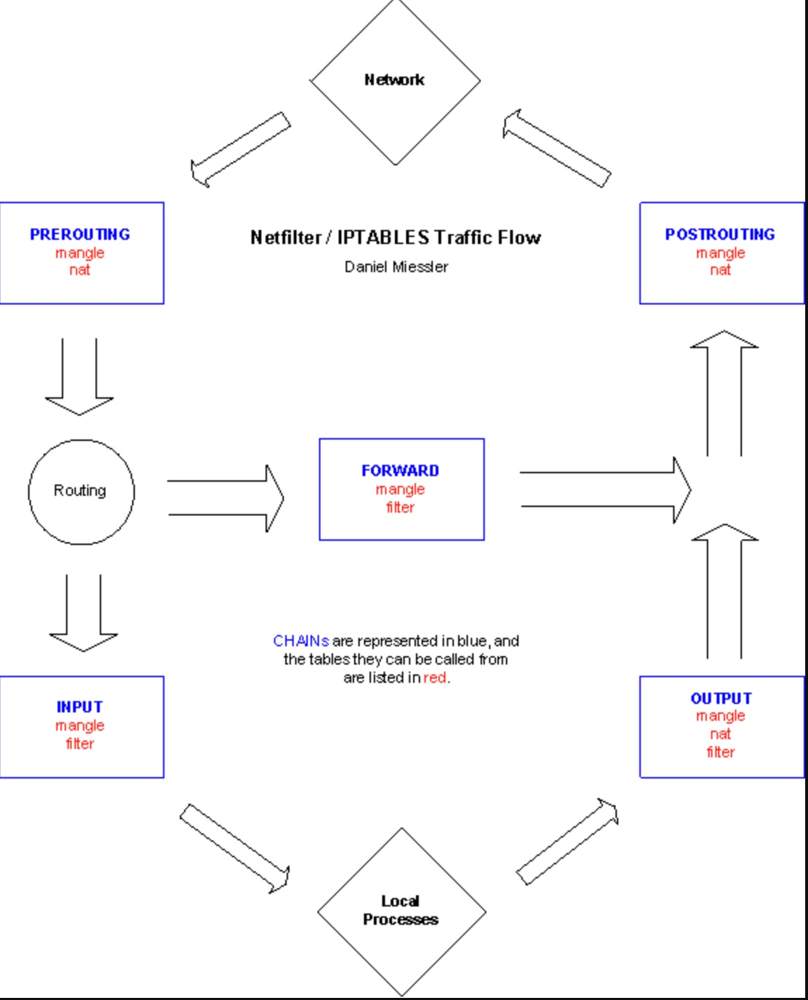
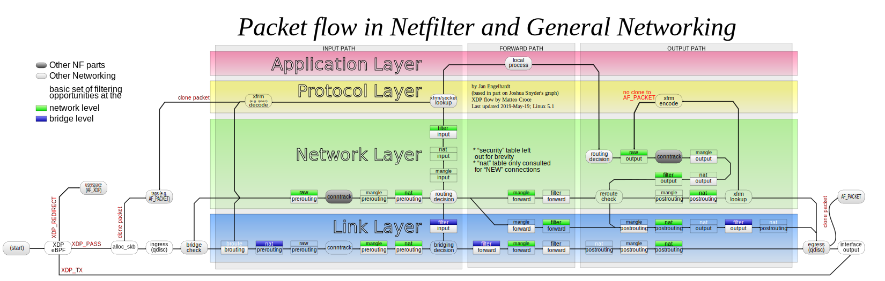
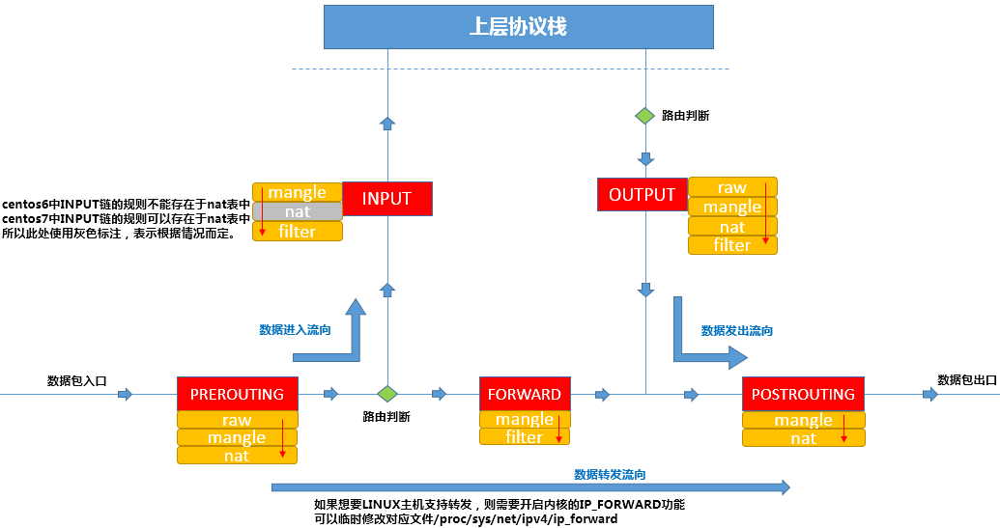
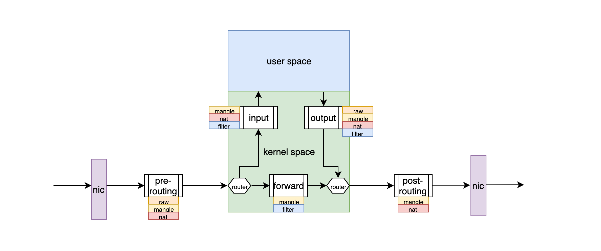

# firewall

* 一种网络隔离工具，部署于主机或者网络的边缘，目标是对于进出主机或者本地网络的网络报文根据事先定义好的规则做匹配检测，规则匹配成功则对相应的网络报文做定义好的处理（允许，拒绝，转发，丢弃等）
* 根据管理范围来分可以将其划分为主机防火墙和网络防火墙
* 根据工作机制来区分又可分为包过滤型防火墙（netfilter）和代理服务器（Proxy）

## [The Netfilter/Iptables Project](http://www.netfilter.org)

* 包过滤型防火墙主要依赖于 Linux 内核软件 netfilter，它是一个 Linux 内核“安全框架”，而 iptables 是内核软件 netfilter 的配置工具，工作于用户空间。
* iptables/netfilter 组合就是 Linux 平台下的过滤型防火墙，并且这个防火墙软件是免费的，可以用来替代商业防火墙软件，来完成网络数据包的过滤、修改、重定向以及网络地址转换（nat）等功能
* The iptables firewall works by interacting with the packet filtering hooks in the Linux kernel’s networking stack. These kernel hooks are known as the netfilter framework
* The netfilter is a set of hooks inside the Linux kernel that allows kernel modules to register callback functions with the network stack. A registered callback function is then called back for every packet that traverses the respective hook within the network stack.
  - 当主机/网络服务器网卡收到一个数据包之后进入内核空间的网络协议栈进行层层解封装
  - 刚刚进入网络层的数据包通过 PRE_ROUTING 关卡时，要进行一次路由选择，当目标地址为本机地址时，数据进入 INPUT，非本地的目标地址进入 FORWARD（需要本机内核支持 IP_FORWARD），目标地址转换通常在这个关卡进行
  - INPUT 经过路由之后送往本地的数据包经过此关卡，过滤 INPUT 包在此点关卡进行
  - FORWARD 经过路由选择之后要转发的数据包经过此关卡，网络防火墙通常在此关卡配置
  - OUTPUT 由本地用户空间应用进程产生的数据包过此关卡， OUTPUT 包过滤在此关卡进行
  - POST_ROUTING 刚刚通过 FORWARD 和 OUTPUT 关卡的数据包要通过一次路由选择由哪个接口送往网络中，经过路由之后的数据包要通过 POST_ROUTING 此关卡，源地址转换通常在此点进行
  - 到本主机某进程的报文：PreRouting -> Input -> Process -> Output -> PostRouting
  - 由本主机转发的报文：PreRouting -> Forward -> PostRouting
* the packet filtering technology that’s built into the 2.4 Linux kernel.just the command used to control netfilter, which is the real underlying technology
* This Linux based firewall is controlled by the program called iptables to handles filtering for IPv4, and ip6tables handles filtering for IPv6.
* 规则可以包括匹配数据报文的源地址、目的地址、传输层协议（TCP/UDP/ICMP/..）以及应用层协议（HTTP/FTP/SMTP/..）等
* [iptables-essentials](https://github.com/trimstray/iptables-essentials):Iptables Essentials: Common Firewall Rules and Commands.





```
IF network_pkg match rule; THEN
    handler
FI
```

### config

* `/etc/sysconfig/iptables`
* `etc/sysconfig/iptables-config`
  - `IPTABLES_MODULES="ip_conntrack_ftp"`

```
*filter
# Drop All Traffic
# :INPUT ACCEPT [0:0]
# :FORWARD ACCEPT [0:0]
# :OUTPUT ACCEPT [0:0]
:INPUT DROP [0:0]
:FORWARD DROP [0:0]

:RH-Firewall-1-INPUT - [0:0]
-A INPUT -j RH-Firewall-1-INPUT
-A FORWARD -j RH-Firewall-1-INPUT
-A RH-Firewall-1-INPUT -i lo -j ACCEPT
-A RH-Firewall-1-INPUT -p icmp --icmp-type any -j ACCEPT
-A RH-Firewall-1-INPUT -p udp --dport 5353 -d 224.0.0.251 -j ACCEPT
-A RH-Firewall-1-INPUT -p udp -m udp --dport 53 -j ACCEPT
-A RH-Firewall-1-INPUT -m state --state ESTABLISHED,RELATED -j ACCEPT
-A RH-Firewall-1-INPUT -m state --state NEW -m tcp -p tcp --dport 22 -j ACCEPT
-A RH-Firewall-1-INPUT -m state --state NEW -m tcp -p tcp --dport 53 -j ACCEPT

# Log And Drop All Traffic
# -A RH-Firewall-1-INPUT -j REJECT --reject-with icmp-host-prohibited
-A RH-Firewall-1-INPUT -j LOG
-A RH-Firewall-1-INPUT -j DROP

# Log and Drop Spoofing Source Addresses
-A INPUT -i eth0 -s 10.0.0.0/8 -j LOG --log-prefix "IP DROP SPOOF "
-A INPUT -i eth0 -s 172.16.0.0/12 -j LOG --log-prefix "IP DROP SPOOF "
-A INPUT -i eth0 -s 192.168.0.0/16 -j LOG --log-prefix "IP DROP SPOOF "
-A INPUT -i eth0 -s 224.0.0.0/4 -j LOG --log-prefix "IP DROP MULTICAST "
-A INPUT -i eth0 -s 240.0.0.0/5 -j LOG --log-prefix "IP DROP SPOOF "
-A INPUT -i eth0 -d 127.0.0.0/8 -j LOG --log-prefix "IP DROP LOOPBACK "
-A INPUT -i eth0 -s 169.254.0.0/16  -j LOG --log-prefix "IP DROP MULTICAST "
-A INPUT -i eth0 -s 0.0.0.0/8  -j LOG --log-prefix "IP DROP "
-A INPUT -i eth0 -s  240.0.0.0/4  -j LOG --log-prefix "IP DROP "
-A INPUT -i eth0 -s  255.255.255.255/32  -j LOG --log-prefix "IP DROP  "
-A INPUT -i eth0 -s 168.254.0.0/16  -j LOG --log-prefix "IP DROP "
-A INPUT -i eth0 -s 248.0.0.0/5  -j LOG --log-prefix "IP DROP "

# Open Port
-A RH-Firewall-1-INPUT -m tcp -p tcp --dport 80 -j ACCEPT
-A RH-Firewall-1-INPUT -m tcp -p tcp --dport 443 -j ACCEPT
-A RH-Firewall-1-INPUT -m tcp -p tcp --dport 53 -j ACCEPT
-A RH-Firewall-1-INPUT -m udp -p tcp --dport 53 -j ACCEPT
-A RH-Firewall-1-INPUT -m tcp -p tcp --dport 25 -j ACCEPT

# Only allow SSH traffic From 192.168.1.0/24
-A RH-Firewall-1-INPUT -s 192.168.1.0/24 -m state --state NEW -p tcp --dport 22 -j ACCEPT

COMMIT
```

### Packet Matching Rules

* Each packet starts at the first rule in the chain
  - 根据协议报文特征指定匹配条件，基本匹配条件和扩展匹配条件
* A packet proceeds until it matches a rule
* If a match found, then control will jump to the specified target (such as REJECT, ACCEPT, DROP)

### CHAINS 

* lists of rules within a table, and they are associated with “hook points” on the system
* 当报文经过某一个关卡时，关卡上的“规则”不止一条，很多条规则会按照顺序逐条匹配，将在此关卡的所有规则组织称“链”就很适合，对于经过相应关卡的网络数据包按照顺序逐条匹配“规则”。
* INPUT(入站规则): Right before being handed to a local process
  - The default chain is used for packets addressed to the system. 
  - Use this to open or close incoming ports (such as 80,25, and 110 etc) and ip addresses / subnet (such as 202.54.1.20/29).
* OUTPUT（出站规则）: Right after being created by a local process.
  - The default chain is used when packets are generating from the system. 
  - Use this open or close outgoing ports and ip addresses / subnets.
* FORWARD（转发规则）: For any packets coming in one interface and leaving out another.
  - The default chains is used when packets send through another interface. 
  - Usually used when you setup Linux as router. 
  - For example, eth0 connected to ADSL/Cable modem and eth1 is connected to local LAN. Use FORWARD chain to send and receive traffic from LAN to the Internet.
* PREROUTING（路有前规则）: Immediately after being received by an interface.
* POSTROUTING（路由后规则）: Right before leaving an interface.
* RH-Firewall-1-INPUT a user-defined custom chain. It is used by the INPUT, OUTPUT and FORWARD chains.
  - 使用 iptables 创建自定义的链，附加到 iptables 的内置的五个链
* Packet
  - Stateful Packet Inspection SPI
  - Packets move through netfilter by traversing chains
  - By default, chain policies are to jump to the ACCEPT target



### TABLES

* 为相同功能的“规则”集合属于同一个“表”
* FILTER is used for the standard processing of packets, and it’s the default table if none other is specified.负责过滤功能；与之对应的内核模块 iptables_filter
  - Input, Output, Forward
* NAT(Network Address Translation) is used to rewrite the source and/or destination of packets and/or track connections. 网络地址转换功能，典型的比如 SNAT、DNAT，与之对应的内核模块 iptables_nat
  - Prerouting, Postrouting, Output
* MANGLE is used to otherwise modify packets, i.e. modifying various portions of a TCP header, etc.解包报文、修改并封包，与之对应的内核模块 iptables_mangle
  - Prerouting, Postrouting, Input, Output, Forward
* raw 表：关闭 nat 表上启用的连接追踪机制；与之对应的内核模块 iptables_raw
  - PreRouting, Output
* 使用 iptables 配置规则时，往往是以“表”为入口制定“规则
* 数据包经过一个关卡的时候，会将“链”中所有的“规则”都按照顺序逐条匹配，，当它们处于同一条“链”的时候，执行优先级关系如下：`raw -> mangle -> nat -> filter`
* 横向是chains,纵向是tables



### TARGETS 

* determine what will happen to a packet within a chain if a match is found with one of its rules
* ACCEPT： allow packet.
* REJECT： to drop the packet and send an error message to remote host.
* DROP： drop the packet and do not send an error message to remote host or sending host.

## 规则

* 考量
  - 根据要实现哪种功能，判断添加在哪张“表”上
  - 根据报文流经的路径，判断添加在哪个“链”上
* 对于每一条“链”上其“规则”的匹配顺序，排列好检查顺序能有效的提高性能，因此隐含一定的法则：
  - 同类规则（访问同一应用），匹配范围小的放上面
  - 不同类规则（访问不同应用），匹配到报文频率大的放上面
  - 将那些可由一条规则描述的多个规则合并为一个
  - 设置默认策略
* 在远程连接主机配置防火墙时注意：
  - 不要把“链”的默认策略修改为拒绝，因为有可能配置失败或者清除所有策略后无法登陆到服务器，而是尽量使用规则条目配置默认策略
  - 为防止配置失误策略把自己也拒掉，可在配置策略时设置计划任务定时清除策略，当确定无误后，关闭该计划任务

### 语法

* `iptables -t 表名 <-A/I/D/R> 规则链名 [规则号] <-i/o 网卡名> -p 协议名 <-s 源IP/源子网> --sport 源端口 <-d 目标IP/目标子网> --dport 目标端口 -j 动作`
* commands
  - -h：显示帮助信息
  - 查看管理
    + -L, --list [chain] 列出链 chain 上面的所有规则，如果没有指定链，列出表上所有链的所有规则。
  - 通用匹配：源地址目标地址的匹配
    + -p：指定要匹配的数据包协议类型
    + -s, --source [!] address[/mask] ：把指定的一个／一组地址作为源地址，按此规则进行过滤。当后面没有 mask 时，address 是一个地址，比如：192.168.1.1；当 mask 指定时，可以表示一组范围内的地址，比如：192.168.1.0/255.255.255.0
    + -d, --destination [!] address[/mask] ：地址格式同上，但这里是指定地址为目的地址，按此进行过滤
    + -i, --in-interface [!] <网络接口name> ：指定数据包的来自来自网络接口，比如最常见的 eth0 。注意：只对 INPUT，FORWARD，PREROUTING 这三个链起作用。如果没有指定此选项， 说明可以来自任何一个网络接口。同前面类似，"!" 表示取反。
    + -o, --out-interface [!] <网络接口name> ：指定数据包出去的网络接口。只对 OUTPUT，FORWARD，POSTROUTING 三个链起作用
  - 规则管理
    + -A, --append chain rule-specification 在指定链 chain 的末尾插入指定的规则，也就是说，这条规则会被放到最后，最后才会被执行。规则是由后面的匹配来指定
    + -I, --insert chain [rulenum] rule-specification 在链 chain 中的指定位置插入一条或多条规则。如果指定的规则号是1，则在链的头部插入。这也是默认的情况，如果没有指定规则号
    + -D, --delete chain rule-specification 
    + -D, --delete chain rulenum 在指定的链 chain 中删除一个或多个指定规则
    + -R num Replays 替换/修改第几条规则
  - 链管理命令（立即生效）
    + -P, --policy chain target ：为指定的链 chain 设置策略 target。注意，只有内置的链才允许有策略，用户自定义的是不允许的
    + -F, --flush [chain] 清空指定链 chain 上面的所有规则。如果没有指定链，清空该表上所有链的所有规则
    + -N, --new-chain chain 用指定的名字创建一个新的链
    + -X, --delete-chain [chain] ：删除指定的链，这个链必须没有被其它任何规则引用，而且这条上必须没有任何规则。如果没有指定链名，则会删除该表中所有非内置的链
    + -E, --rename-chain old-chain new-chain ：用指定的新名字去重命名指定的链。这并不会对链内部照成任何影响
    + -Z, --zero [chain] ：把指定链，或者表中的所有链上的所有计数器清零    + 
    + -j, --jump target <指定目标> ：即满足某条件时该执行什么样的动作。target 可以是内置的目标，比如 ACCEPT，也可以是用户自定义的链
    + --append  -A chain    Append to chain
    + --check   -C chain    Check for the existence of a rule
    + --delete  -D chain    Delete matching rule from chain
    + --delete  -D chain rulenum   Delete rule rulenum (1 = first) from chain
    + --insert  -I chain [rulenum]  Insert in chain as rulenum (default 1=irst)
    + --replace -R chain rulenum Replace rule rulenum (1 = first) in chain
    + --list    -L [chain [rulenum]] List the rules in a chain or all chains
    + --list-rules -S [chain [rulenum]] Print the rules in a chain or all chins
    + --flush   -F [chain]    Delete all rules in  chain or all chains
    + --zero    -Z [chain [rulenum]] Zero counters in chain or all chains
    + --new     -N chain    Create a new user-defined chain
    + --delete-chain -X [chain]    Delete a user-defined chain
    + --policy  -P chain target Change policy on chain to target
    + --rename-chain -E old-chain new-chain Change chain name, (moving any reerences)
* parameters
  - -P  设置默认策略,Set the default policy (such as DROP, REJECT, or ACCEPT).:iptables -P INPUT (DROP)
  - -F  清空规则链 Deleting (flushing) all the rules.
  - -L  查看规则链 Listing the iptables rules in the table view
  - -A  在规则链的末尾加入新规则
  - -I  num 在规则链的头部加入新规则
  - `-D  num` 删除某一条规则 Delete one or more rules from the selected chain
  - -s  匹配来源地址IP/MASK，加叹号"!“表示除这个IP外
  - -d  匹配目标地址
  - -i  网卡名称 匹配从这块网卡流入的数据
  - -o  网卡名称 匹配从这块网卡流出的数据
  - -p  protocol 匹配协议,如tcp,udp,icmp
  - –dport num  匹配目标端口号
  - –sport num  匹配来源端口号
  - --line-numbers
  - -n Display IP address and port in numeric format. Do not use DNS to resolve names. This will speed up listing.
  - -S specific chain (INPUT, OUTPUT, TCP, etc.)
  - state:makes netfilter a “stateful” firewalling technology. Packets are not able to move through this rule and get back to the client unless they were created via the rule above it
  - -t table_name : Select table (called nat or mangle) and delete/flush rules.
  + -v Display detailed information. This option makes the list command show the interface name, the rule options, and the TOS masks. The packet and byte counters are also listed, with the suffix ‘K’, ‘M’ or ‘G’ for 1000, 1,000,000 and 1,000,000,000 multipliers respectively.
  - -X : Delete chain.
  - -Z Resetting Packet Counts and Aggregate Size
  - –icmp-type
    + echo request

```sh
chkconfig iptables on|off # forever
chkconfig iptables start|stop # recover with restart
service iptables stop|start|restart

# Save Firewall Rules
/etc/init.d/iptables status|save

# list out all of the active iptables rules
iptables -L -n -v --line-numbers

# 设置默认 chain 策略
iptables -P INPUT DROP 
iptables -P FORWORD DROP
iptables -P OUTPUT DROP

iptables -A INPUT -p tcp --drop 端口号 -j DROP|ACCEPT
iptables -A OUTPUT -p tcp --dport 端口号 -j DROP # 关闭端口
iptables -I 5 INPUT -p tcp --dport 80 -j ACCEPT # open port

# 用户自定义链
iptables -t nat -N CLASH
iptables -t nat -A CLASH -d 10.0.0.0/8 -j RETURN
iptables -t nat -A CLASH -d 127.0.0.0/8 -j RETURN
iptables -t nat -A CLASH -d 169.254.0.0/16 -j RETURN
iptables -t nat -A CLASH -d 172.16.0.0/12 -j RETURN
iptables -t nat -A CLASH -d 192.168.0.0/16 -j RETURN
iptables -t nat -A CLASH -d 224.0.0.0/4 -j RETURN
iptables -t nat -A CLASH -d 240.0.0.0/4 -j RETURN
iptables -t nat -A CLASH -p tcp -j REDIRECT --to-ports 7892

# Allow Outgoing (Stateful) Web Browsing
# adding (appending) a rule to the OUTPUT chain for protocol TCP and destination port 80 to be allowed
iptables -A OUTPUT -o eth0 -p TCP –dport 80 -j ACCEPT
# allows the web traffic to come back
iptables -A INPUT -i eth0 -p TCP -m state –state ESTABLISHED,RELATED –sport 80 -j ACCEPT

# Allowing Outgoing Pings
iptables -A OUTPUT -o eth0 -p icmp –icmp-type echo-request -j ACCEPT
iptables -A INPUT -i eth0 -p icmp –icmp-type echo-reply -j ACCEPT

# “Passing Ports” Into A NATd Network  pass traffic inside to hidden servers
# DNAT occurs
iptables -t nat -A PREROUTING -i eth0 -p tcp -d 1.2.3.4 –dport 25 -j DNAT –to 192.168.0.2:25
# rules portion：make it through your firewall;
iptables -A FORWARD -i eth0 -o eth1 -p tcp –dport 25 -d 192.168.0.2 -j ACCEPT

iptables-save > /etc/iptables.up.rules
/sbin/iptables-restore < /etc/iptables.up.rules

# 删除
iptables -F  
iptables -X  
iptables -t nat -F  
iptables -t nat -X  
iptables -t mangle -F  
iptables -t mangle -X  
```

### For DoS and Syn Protection

```
## /etc/sysctl.conf
net.ipv4.conf.all.log_martians = 1
net.ipv4.conf.default.accept_source_route = 0
net.ipv4.conf.default.accept_redirects = 0
net.ipv4.conf.default.secure_redirects = 0
net.ipv4.icmp_echo_ignore_broadcasts = 1
#net.ipv4.icmp_ignore_bogus_error_messages = 1
net.ipv4.tcp_syncookies = 1
net.ipv4.conf.all.rp_filter = 1
net.ipv4.conf.default.rp_filter = 1
```

## UFW uncomplicated firewall

* config:`/etc/default/ufw`
  - Enabling IPv6 `IPV6=yes`
  - log:`/var/log/ufw.log`
  - /etc/ufw/before.rules
* rule
  - allow|deny
    + in on
  - limit normally allow the connection but will deny connections if an IP address attempts to initiate six or more connections within thirty seconds
  - proto
  - from
    + ip
    + 103.13.42.13/29
  - to
    + ip
    + any
  - port
    + tcp

```sh
sudo apt-get install ufw

sudo systemctl status ufw.service
sudo ufw status [verbose]

sudo ufw enable|disable

# edit UFW' configuration file /etc/ufw/before.rules,eed to run reload
sudo ufw reload

# default policy
sudo ufw default allow outgoing
sudo ufw default deny incoming

# allow
sudo ufw allow ssh
sudo ufw allow 2375/tcp
sudo ufw allow proto tcp from 202.54.2.5 to 172.24.13.45 port 22
sudo ufw limit ssh

sudo ufw allow 25
sudo ufw allow 3000:5000/tcp
sudo ufw allow from 1.2.3.4
sudo ufw allow proto tcp from any to 10.8.0.1 port 22
sudo ufw allow proto tcp from 10.8.0.2 to 10.8.0.1 port 22
sudo ufw allow from 1.2.3.4 to any port 22 proto tcp
sudo ufw allow from 1.2.3.4 to 222.222.222.222 port 22 proto tcp

# incoming HTTP traffic (open port 80)
sudo ufw allow http comment 'Allow all to access Apache server'
sudo ufw allow 80/tcp comment 'accept Apache'
## allow only from 139.1.1.1 ##
sudo ufw allow from 139.1.1.1 to any port 80
## allow only from 203.11.11.2/29 ##
sudo ufw allow from 203.11.11.2/29 to any port 80

# allow incoming HTTPS traffic 允许访问
sudo ufw allow 443/tcp comment 'accept HTTPS connections'
sudo ufw allow https comment 'Allow all to access Nginx server'
sudo ufw allow from 139.1.1.1 to any port 443
sudo ufw allow from 203.11.11.2/29 to any port 443

sudo ufw allow from 192.168.1.0/24 to any port 3306
# Allow access to MySQL/MariaDB port 3306 Apache server only:
sudo ufw allow from 202.54.1.1 to any port 3306

# interface
sudo ufw allow in on wg0 to any port 22
sudo ufw allow in on lxdbr0 from 10.105.28.22 to any port 3306 proto tcp
# add sub/net
sudo ufw allow in on lxdbr0 from 10.105.28.0/24 to any port 3306 proto tcp

## block
sudo ufw deny from 203.5.1.43
sudo ufw deny from 103.13.42.13/29
sudo ufw deny from 1.1.1.2 to any port 22 proto tcp

## comment
ufw allow 53 comment 'open tcp and udp port 53 for dns'
sudo ufw allow proto tcp from any to any port 80,443 comment 'my cool web app ports'sudo ufw allow proto tcp from any to 10.8.0.1 port 22 'SSHD port 22 for private lan'

# delete
sudo ufw status numbered
sudo ufw delete 6
sudo ufw delete allow 443

# reset
sudo ufw reset

# log
grep 'DPT=22' /var/log/ufw.log |\
egrep -o 'SRC=([0-9]{1,3}[\.]){3}[0-9]{1,3}' |\
awk -F'=' '{ print $2 }' | sort -u

# Show the list of rules
sudo ufw show listening

# report
sudo ufw show raw
sudo ufw show added
```

```
# /etc/ufw/before.rules
-A ufw-before-input -i eth0 -j ACCEPT
-A ufw-before-output -o eth0 -j ACCEPT
```

###  Masquerading 伪装

```
## /etc/ufw/sysctl.conf
net/ipv4/ip_forward=1

## /etc/ufw/before.rules
# *filter section for 10.0.0.0/8 and wg0 interface:
 *nat
:POSTROUTING ACCEPT [0:0]
-A POSTROUTING -s 10.0.0.0/8 -o wg0 -j MASQUERADE
COMMIT

sudo ufw route allow in on eth0 out on wg0 from 10.0.0.0/8
```

### egress filtering

```
# block RFC1918 addresses going out of eth0 interfaces on your VM connected to the Internet. Add the ufw route rules to reject the traffic
sudo ufw route reject out on eth0 to 10.0.0.0/8 comment 'RFC1918 reject'
sudo ufw route reject out on eth0 to 172.16.0.0/12 comment 'RFC1918 reject'
sudo ufw route reject out on eth0 to 192.168.0.0/16 comment 'RFC1918 reject'
```

### forward

* configure ufw to forward port 80/443 to internal server hosted on LAN
* Postrouting and IP Masquerading
* configure ufw to setup a port forward

```sh
## DNAT
/sbin/iptables -t nat -A PREROUTING -i eth0 -p tcp -d {PUBLIC_IP} --dport 80 -j DNAT --to {INTERNAL_IP}:80

/sbin/iptables -t nat -A PREROUTING -i eth0 -p tcp -d {PUBLIC_IP} --dport 443 -j DNAT --to {INTERNAL_IP}:443

# To allow LAN nodes with private IP addresses to communicate with external public networks, configure the firewall for IP masquerading, which masks requests from LAN nodes with the IP address of the firewall’s external device such as eth0. The syntax is:
/sbin/iptables -t nat -A POSTROUTING -o eth0 -j MASQUERADE

/sbin/iptables -t nat -A POSTROUTING -s 192.168.1.0/24 ! -d 192.168.1.0/24 -j MASQUERADE

## edit /etc/ufw/before.rules
*nat
:PREROUTING ACCEPT [0:0]
# forward 202.54.1.1  port 80 to 192.168.1.100:80
# forward 202.54.1.1  port 443 to 192.168.1.100:443
-A PREROUTING -i eth0 -d 202.54.1.1   -p tcp --dport 80 -j  DNAT --to-destination 192.168.1.100:80
-A PREROUTING -i eth0 -d 202.54.1.1   -p tcp --dport 443 -j  DNAT --to-destination 192.168.1.100:443
# setup routing
-A POSTROUTING -s 192.168.1.0/24 ! -d 192.168.1.0/24 -j MASQUERADE
COMMIT

## sudo vi /etc/sysctl.conf
net.ipv4.ip_forward=1

sudo sysctl -p
sudo systemctl restart ufw

sudo ufw allow proto tcp from any to 202.54.1.1 port 80
sudo ufw allow proto tcp from any to 202.54.1.1 port 443

# Verify new settings:
sudo ufw status
sudo iptables -t nat -L -n -v
```
