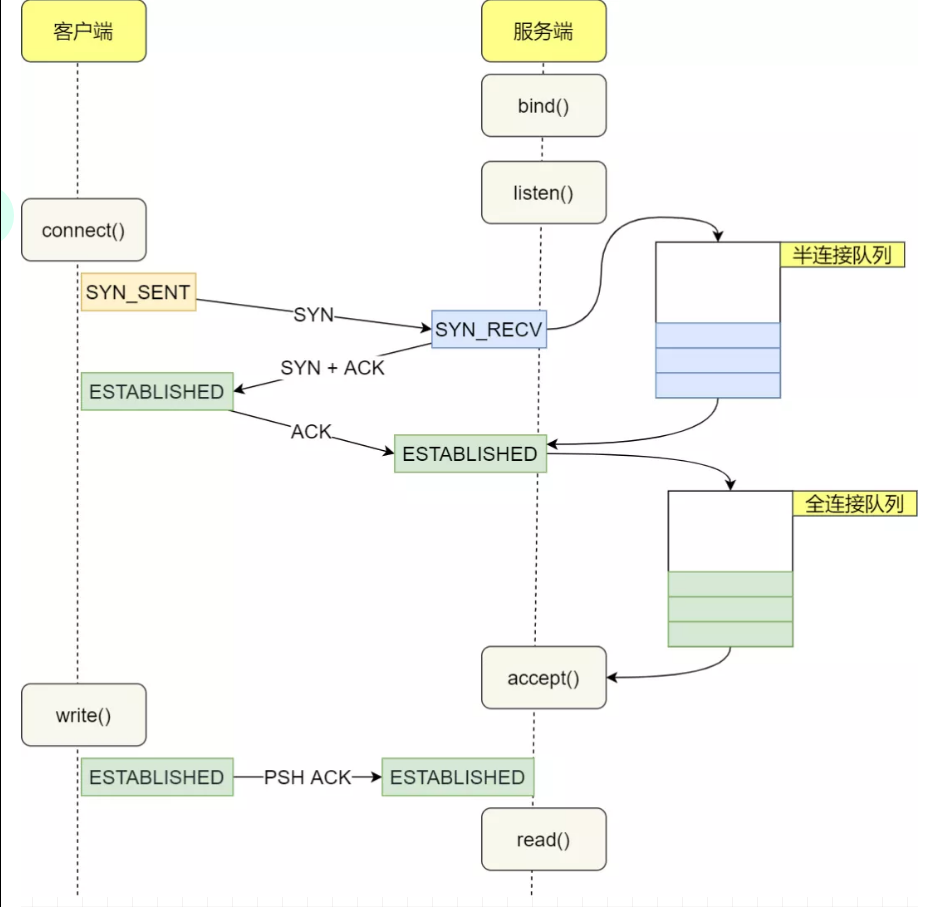
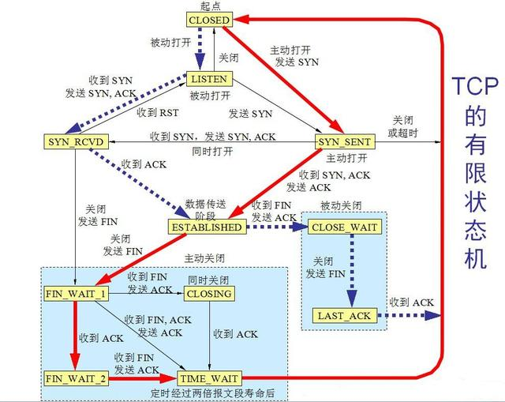

## TCP/IP 传输控制协议/网际协议 Transmission Control Protocol/Internet Protocol

* OSI七层协议体系结构，在五层协议中应用层下面加了表示层和会话层
  - 应用层：打包请求，根据传输数据加密与否分为 HTTP 请求和 HTTPS 请求，封装请求头和请求参数，应用层的包通过 Socket 编程交个下一层去完成
  - 传输层：封装客户端与服务端端口
  - 网络层：封装客户与服务IP地址
  - 数据链路层：本地客户端MAC 本地网关MAC
  - 物理层
* 通信过程其实就对应着数据入栈与出栈的过程,供已连接因特网的计算机进行通信的通信协议,定义了电子设备（比如计算机）如何连入因特网，以及数据如何在它们之间传输的标准。包含了一系列构成互联网基础的网络协议，是Internet的核心协议
  - 入栈:数据发送方每层不断地封装首部与尾部，添加一些传输的信息，确保能传输到目的地
  - 出栈:数据接收方每层不断地拆除首部与尾部，得到最终传输的数据
  - TCP 负责将数据分割并装入 IP 包，然后在到达的时候重新组合
  - IP 负责将包发送至接受者
* RTT：“We define the round-trip time, which is the time it takes for a small packet to travel from client to server and back to the client.” “The RTT includes packet-propagation delays, packet-queuing delays and packet -processing delay.” RTT=传播时延（往返）+排队时延（路由器和交换机的）+数据处理时延（应用程序的）

## 应用层

* 规定应用程序的数据格式
* `[HEAD(以太网标头) [HEAD(IP标头) [HEAD(TCP标头) DATA(应用层数据包)]]]`

## 传输层

* 连接:用于保证可靠性和流量控制维护的某些状态信息，这些信息的组合，包括Socket、序列号和窗口大小称为连接
* Socket：由 IP 地址和端口号组成
* 序列号：用来解决乱序问题等
* 窗口大小：用来做流量控制

### TCP Transmission Control Protocol 传输控制协议

* 基于连接的协议、端到端和可靠的数据包发送。应用程序之间通信,当应用程序希望通过 TCP 与另一个应用程序通信时，会发送一个通信请求。这个请求必须被送到一个确切的地址。在双方“握手”之后，TCP 将在两个应用程序之间建立一个全双工 (full-duplex) 的通信。在数据传送前分割为 IP 包，然后在到达时重组

+ 建立在不可靠的网络层 IP 协议之上，IP协议并不能提供任何可靠性机制，TCP的可靠性完全由自己实现，提供的服务包括数据流传送、可靠性、有效流控、全双工操作和多路复用
+ 特点
  * 能够确保连接的建立和数据包的发送
  * 支持错误重传机制
  * 支持拥塞控制，能够在网络拥堵的情况下延迟发送
  * 能够提供错误校验和，甄别有害的数据包
  * TCP头部：20个字节的固定首部
+ 编程步骤
  * 服务器端
    - 创建一个socket，用函数socket()；
    - 设置socket属性，用函数setsockopt(); *可选*
    - 绑定IP地址、端口等信息到socket上，用函数bind();
    - 开启监听，用函数listen()；
    - 接收客户端上来的连接，用函数accept()；
    - 收发数据，用函数send()和recv()，或者read()和write();
    - 通过函数断开连接；
    - 关闭监听；
  - 客户端：
    - 创建一个socket，用函数socket()；
    - 设置socket属性，用函数setsockopt();* 可选
    - 绑定IP地址、端口等信息到socket上，用函数bind();* 可选
    - 设置要连接的对方的IP地址和端口等属性；
    - 连接服务器，用函数connect()；
    - 收发数据，用函数send()和recv()，或者read()和write();
    - 关闭网络连接；
+ 四元组可以确定唯一一个连接:源端口和目的端口字段 socket（IP+端口号）。TCP的包是没有IP地址的，那是IP层上的事。但是有源端口和目标端口
  * 本地端口由16位组成,因此本地端口的最多数量为 2^16 = 65535个,本地的最大HTTP连接数为： 本地最大端口数65535 * 本地ip数1 = 65535 个
  * 远端端口由16位组成,因此远端端口的最多数量为 2^16 = 65535个,远端的最大HTTP连接数为：远端最大端口数65535 * 远端(客户端)ip数+∞ = 无限制
  * 源地址和目的地址的字段（32位）是在 IP 头部中，作用是通过 IP 协议发送报文给对方主机。
  * 源端口和目的端口的字段（16位）是在 TCP 头部中，作用是告诉 TCP 协议应该把报文发给哪个进程。
+ 概念
  * 同步序列编号 SYN Synchronize Sequence Numbers:TCP/IP 建立连接时使用的握手信号。在客户机和服务器之间建立 TCP 连接时，首先会发送的一个信号。客户端在接受到 SYN 消息时，就会在自己的段内生成一个随机值 X，用来初始化和建立连接
    - RFC793 中认为 ISN 要和一个假的时钟绑定在一起ISN 每四微秒加一，当超过 2 的 32 次方之后又从 0 开始，要四个半小时左右发生 ISN 回绕
    - SYN 超时:慢慢重试，Linux 中就是默认重试 5 次，并且就是阶梯性的重试，间隔就是1s、2s、4s、8s、16s，再第五次发出之后还得等 32s 才能知道这次重试的结果，所以说总共等63s 才能断开连接
      + SYN Flood 攻击: 63s 内服务端需要保持这个资源，所以不法分子就可以构造出大量的 client 向 server 发 SYN 但就是不回 server,使得 server 的 SYN 队列耗尽，无法处理正常的建连请求
      + 开启 tcp_syncookies，那就用不到 SYN 队列:SYN 队列满了之后 TCP 根据自己的 ip、端口、然后对方的 ip、端口，对方 SYN 的序号，时间戳等一波操作生成一个特殊的序号（即 cookie）发回去，如果对方是正常的 client 会把这个序号发回来，然后 server 根据这个序号建连
  * 序列号 SEQ：当前报文段的序号
  * 确认应答号 AN：期望收到对方的下一个报文段的数据的第一个字节的序号
  * SYN-ACK：服务器收到 SYN 后，打开客户端连接，发送一个 SYN-ACK 作为答复。确认号设置为比接收到的序列号多一个，即 X + 1，服务器为数据包选择的序列号是另一个随机数 Y
  * 确认字符 ACK Acknowledge character：表示发来的数据已确认接收无误。客户端将 ACK 发送给服务器。序列号被设置为所接收的确认值即 Y + 1
  * 紧急 URG：当  URG  =  1  时，表明紧急指针字段有效。它告诉系统此报文段中有紧急数据，应尽快传送(相当于高优先级的数据)
  * 推送 PSH  (PuSH)： 接收  TCP  收到  PSH  =  1  的报文段，就尽快地交付接收应用进程，而不再等到整个缓存都填满了后再向上交付
  * 复位 RST  (ReSeT)： 当  RST  =  1  时，表明  TCP  连接中出现严重差错（如由于主机崩溃或其他原因），必须释放连接，然后再重新建立传输连接；
  * 终止 FIN (Finish)： 用来释放一个连接。FIN=  1  表明发送端的数据已发送完毕，并要求释放传输连接
  * 窗口大小：占 2 字节，用来让对方设置发送窗口的依据，单位为字节。窗口值是[ 0, 216-1 ]之间的整数
    - 指 TCP传输能接受的最大字节数，这个可以进行动态调节，也就是 TCP的滑动窗口，通过动态调整窗口大小，来控制发送数据的速率
    - 图中占用 2个字节，也就是 16位，那么可以支持的最大数就是 2^16=65536，所以默认情况下 TCP头部标记能支持的最大窗口数是 65536字节，也就是 64KB
  * Len: 消息长度 就是指数据报文段，因为整个 TCP报文 = Header + packSize,所以这个消息长度就是指要传送的数据包总共长度，在本次分析中也就是 HTTP报文的大小。
  * Mss: 最大报文段长度：这个就是规定最大的能传输报文的长度，为了达到最佳的传输效能， TCP 协议在建立连接的时候通常要协商双方的 MSS 值，这个值 TCP 协议在实现的时候往往用 MTU 值代替（需要减去 IP数据包包头的大小 20Bytes和 TCP数据段的包头 20Bytes）所以一般 MSS 值 1460
  * Ws: 窗口缩放调整因子：在前面说 TCP 窗口大小中说到，默认情况下， TCP 窗口大小最大只能支持 64KB的缓冲数据，在今天这个高速上网时代，这个大小肯定不满足条件了，所以，为了能够支持更多的缓冲数据 RFC 1323中就规定了 TCP 的扩展选项，其中窗口缩放调整因子就是其中之一，这个是如何起作用的呢？首先说明，这个参数是在 [SYN] 同步阶段进行协商的，结合抓包数据分析下。看到第一次请求协商的结果是 WS=256,然后再 ACK 阶段扩展因子生效，调整了窗口大小
  * 检验和 —— 占 2 字节。检验和字段检验的范围包括首部和数据这两部分。在计算检验和时，要在TCP 报文段的前面加上 12 字节的伪部(协议字段为6，表示TCP)
  * 紧急指针字段 —— 占 16 位，指出在本报文段中紧急数据共有多少个字节(紧急数据放在本报文段数据的最前面)
  * 选项字段 —— 长度可变。① 最大报文段长度 MSS：MSS是指在TCP连接建立时，收发双发协商的通信时每一个报文段所能承载的数据字段的最大长度（并不是TCP报文段的最大长度，而是：MSS=TCP报文段长度-TCP首部长度），单位为字节（双方提供的MSS中的最小值，为本次连接的最大MSS值）；② 窗口扩大选项；③ 时间戳选项； ④ 选择确认选项

* TCP报文首部
  - 源端口和目的端口，各占2个字节，分别写入源端口和目的端口
  - 序列号:占4个字节，TCP连接中传送的字节流中的每个字节都按顺序编号。通过 SYN 包传给接收端主机，每发送一次数据，就「累加」一次该「数据字节数」的大小。用来解决网络包乱序问题
  - 确认应答号:占4个字节，是期望收到对方下一个报文的第一个数据字节的序号。例如，B收到了A发送过来的报文，其序列号字段是501，而数据长度是200字节，这表明B正确的收到了A发送的到序号700为止的数据。因此，B期望收到A的下一个数据序号是701，于是B在发送给A的确认报文段中把确认号置为701；用来解决不丢包的问题
  - 数据偏移，占4位，它指出TCP报文的数据距离TCP报文段的起始处有多远；
  - 保留，占6位，保留今后使用，但目前应都位0；
  - 紧急URG，当URG=1，表明紧急指针字段有效。告诉系统此报文段中有紧急数据；
  - 确认ACK，仅当ACK=1时，确认号字段才有效。TCP规定，在连接建立后所有报文的传输都必须把ACK置1；
  - 推送PSH，当两个应用进程进行交互式通信时，有时在一端的应用进程希望在键入一个命令后立即就能收到对方的响应，这时候就将PSH=1；
  - 复位RST，当RST=1，表明TCP连接中出现严重差错，必须释放连接，然后再重新建立连接；
  - 同步SYN，在连接建立时用来同步序号。当SYN=1，ACK=0，表明是连接请求报文，若同意连接，则响应报文中应该使SYN=1，ACK=1；
  - 终止FIN，用来释放连接。当FIN=1，表明此报文的发送方的数据已经发送完毕，并且要求释放；
  - 窗口，占2字节，指的是通知接收方，发送本报文你需要有多大的空间来接受；
  - 检验和，占2字节，校验首部和数据这两部分；
  - 紧急指针，占2字节，指出本报文段中的紧急数据的字节数；
  - 选项，长度可变，定义一些其他的可选的参数
* 三次握手 建立连接：客户端与服务端建立起可靠的双工的连接。(3个包)
  * 第一次握手：客户端向服务器发送请求报文段 SYN，其中同步位SYN=1，序号SEQ=x（表明传送数据时的第一个数据字节的序号是x），并进入SYN_SEND状态，等待服务器确认
  * 第二次握手：服务器收到客户端发来的请求，如果同意建立连接，就发回一个确认报文段 SYN-ACK，该报文段中同步位SYN=1，确认号ACK=x+1，序号SEQ=y,此时服务器进入SYN_RECV状态
  * 第三次握手：客户端收到服务器的确认报文段后，还需要向服务器给出确认 ACK，向其发送确认包ACK(ack=y+1)，客户端和服务器进入ESTABLISHED状态，完成三次握手
  + 为了保证服务端能收接受到客户端的信息并能做出正确的应答而进行前两次(第一次和第二次)握手
  + 为了保证客户端能够接收到服务端的信息并能做出正确的应答而进行后两次(第二次和第三次)握手
  - 理想状态下，TCP连接一旦建立，在通信双方中的任何一方主动关闭连接之前，TCP 连接都将被一直保持下去
  - SACK_PERM:SACK选项 默认情况下，接受端接受到一个包后，发送 ACK 确认，但是，默认只支持顺序的确认，也就是说，发送 A, B, C 个包，如果我收到了 A, C的包， B没有收到，那么对于 C，这个包我是不会确认的，需要等 B这个包收到后再确认，那么 TCP有超时重传机制，如果一个包很久没有确认，就会当它丢失了，进行重传，这样会造成很多多余的包重传，浪费传输空间。为了解决这个问题， SACK就提出了选择性确认机制，启用 SACK 后，接受端会确认所有收到的包，这样发送端就只用重传真正丢失的包了。
* 四次挥手 断开连接：服务器和客户端均可以主动发起断开TCP连接的请求，断开过程需要经过"四次挥手"（要对方关闭与对方关闭完成两次确认）,由TCP的半关闭（half-close）造成
  - 主动关闭连接的一方，调用close()；协议层发送FIN包 发起一个断开请求（该端执行“主动关闭”（active close）），进入 FIN-WAIT-1 状态
  - 被动关闭的一方收到FIN包后，协议层回复ACK；被动关闭一方进入`CLOSE_WAIT`状态,主动关闭的一方等待对方关闭，则进入`FIN_WAIT_2`状态；此时主动关闭的一方等待被动关闭一方的应用程序调用close操作
  - 被动关闭的一方在完成所有数据发送后，调用close()操作；协议层发送FIN包给主动关闭的一方，等待对方的ACK，被动关闭的一方进入LAST_ACK状态；在 RFC 2581中的 4.2 节有提到ack可以延迟确认，只要求保证在 500ms之内保证确认包到达即可。在这样的标准下，TCP确认是有可能进行合并延迟确认的
  - 主动关闭的一方收到FIN包，协议层回复ACK；此时，主动关闭连接的一方进入TIME_WAIT状态；而被动关闭一方进入CLOSED状态
    + 主动关闭的一方，等待2MSL ( Maximum Segment Lifetime 最大报文段生存时间)时间，结束TIME_WAIT，进入CLOSED状态 `netstat -a | grep TIME_WAIT | wc -l`
      * 保证TCP协议的全双工连接能够可靠关闭
      * 保证这次连接的重复数据段从网络中消失
    + 当TCP的一端发起主动关闭（收到 FIN 请求），在发出最后一个ACK 响应后，即第3次握手完成后，发送了第四次握手的ACK包后，就进入了TIME_WAIT状态
    + 必须在此状态上停留两倍的MSL时间，等待2MSL时间主要目的是怕最后一个 ACK包对方没收到，那么对方在超时后将重发第三次握手的FIN包，主动关闭端接到重发的FIN包后，可以再发一个ACK应答包。
    + 在 TIME_WAIT 状态时，两端的端口不能使用，要等到2MSL时间结束，才可继续使用。（IP 层）
    + 当连接处于2MSL等待阶段时，任何迟到的报文段都将被丢弃
  - time_wait 状态，存在的必要性：
    + 可靠的实现 TCP 全双工连接的终止：四次挥手关闭 TCP 连接过程中，最后的 ACK 是由「主动关闭连接」的一端发出的，如果这个 ACK 丢失，则，对方会重发 FIN 请求，因此，在「主动关闭连接」的一段，需要维护一个 time_wait 状态，处理对方重发的 FIN 请求；
    + 处理延迟到达的报文：由于路由器可能抖动，TCP 报文会延迟到达，为了避免「延迟到达的 TCP 报文」被误认为是「新 TCP 连接」的数据，则，需要在允许新创建 TCP 连接之前，保持一个不可用的状态，等待所有延迟报文的消失，一般设置为 2 倍的 MSL（报文的最大生存时间），解决「延迟达到的 TCP 报文」问题
  - 有一个连接没有进入CLOSED状态之前，这个连接是不能被重用的
* 状态编码：S指代服务器，C指代客户端，S&C表示两者，S/C表示两者之一
  * LISTEN S等待从任意远程TCP端口的连接请求。侦听状态
  * SYN-SENT C在发送连接请求后等待匹配的连接请求。通过connect()函数向服务器发出一个同步（SYNC）信号后进入此状态
  * SYN-RECEIVED S已经收到并发送同步（SYNC）信号之后等待确认（ACK）请求
  * ESTABLISHED S&C连接已经打开，收到的数据可以发送给用户。数据传输步骤的正常情况。此时连接两端是平等的
  * FIN-WAIT-1 S&C主动关闭端调用close（）函数发出FIN请求包，表示本方的数据发送全部结束，等待TCP连接另一端的确认包或FIN请求包
  * FIN-WAIT-2 S&C主动关闭端在FIN-WAIT-1状态下收到确认包，进入等待远程TCP的连接终止请求的半关闭状态。这时可以接收数据，但不再发送数据
  * CLOSE-WAIT S&C被动关闭端接到FIN后，就发出ACK以回应FIN请求，并进入等待本地用户的连接终止请求的半关闭状态。这时可以发送数据，但不再接收数据
  * CLOSING S&C在发出FIN后，又收到对方发来的FIN后，进入等待对方对连接终止（FIN）的确认（ACK）的状态
  * LAST-ACK S&C被动关闭端全部数据发送完成之后，向主动关闭端发送FIN，进入等待确认包的状态
  * TIME-WAIT S/C主动关闭端接收到FIN后，就发送ACK包，等待足够时间以确保被动关闭端收到了终止请求的确认包。【按照RFC 793，一个连接可以在TIME-WAIT保证最大四分钟，即最大分段寿命（maximum segment lifetime）的2倍】
  * CLOSED S&C完全没有连接
* 可靠性技术：确认与超时重传机制、流量控制机制。使一台计算机发出的字节流无差错地发往网络上的其他计算机
  * 确认：传输过程中都有一个ACK，接收方通过ack告诉发送方收到那些包了。这样发送方能知道有没有丢包，进而确定重传.一旦发生丢包，TCP会将后续包缓存起来，等前面的包重传并接收到后再继续发送，延迟会越来越大
  * 超时重传：TCP协议保证数据可靠性的一个重要机制，其原理是在发送某一个数据以后就开启一个计时器，在一定时间内如果没有得到发送的数据报的ACK报文，那么就重新发送数据，直到发送成功为止。
  * 流量控制：让发送速率不要过快，让接收方来得及接收。利用滑动窗口机制就可以实施流量控制。

+ 为了获得适当的传输速度，则需要TCP花费额外的回路链接时间（RTT）。每一次链接的建立需要这种经常性的开销，而其并不带有实际有用的数据，只是保证链接的可靠性，因此HTTP/1.1提出了可持续链接的实现方法。HTTP/1.1将只建立一次TCP的链接而重复地使用它传输一系列的请求/响应消息，因此减少了链接建立的次数和经常性的链接开销
+ 面向字节流：应用程序和TCP的交互是一次一个数据块（大小不等），但TCP把应用程序看成是一连串的无结构的字节流。TCP有一个缓冲，当应用程序传送的数据块太长，TCP就可以把它划分短一些再传送
+ TCP的协议栈中维护着两个队列。一个是半连接队列(服务端收到请求未收到客户收到响应)，一个是全链接队列(服务端收到请求且收到客户收到响应)

* 不管是半连接队列还是全连接队列，都有最大长度限制，超过限制时，内核会直接丢弃，或返回 RST 包 `cat /proc/sys/net/ipv4/tcp_abort_on_overflow`
  - 0 ：表示如果全连接队列满了，那么 server 扔掉 client  发过来的 ack,更有利于应对突发流量
    + 只要服务器没有为请求回复 ACK，请求就会被多次重发。如果服务器上的进程只是短暂的繁忙造成 accept 队列满，那么当 TCP 全连接队列有空位时，再次接收到的请求报文由于含有 ACK，仍然会触发服务器端成功建立连接.提高连接建立的成功率
  - 1 ：表示如果全连接队列满了，那么 server 发送一个 reset 包给 client，表示废掉这个握手过程和这个连接. 客户端异常中可以看到很多 `connection reset by peer` 的错误，那么就可以证明是由于服务端 TCP .全连接队列溢出的问题.只有非常肯定 TCP 全连接队列会长期溢出时，才能设置为 1 以尽快通知客户端
* 服务端收到客户端发起的 SYN 请求后，内核会把该连接存储到半连接队列，并向客户端响应 SYN+ACK，接着客户端会返回 ACK，服务端收到第三次握手的 ACK 后，内核会把连接从半连接队列移除，然后创建新的完全的连接，并将其添加到 accept 队列，等待进程调用 accept 函数时把连接取出来.不管是半连接队列还是全连接队列，都有最大长度限制，超过限制时，内核会直接丢弃，或返回 RST 包
* 全连接队列 accepet 队列：内核会把连接从半连接队列移除，然后创建新的完全的连接，并将其添加到 accept 队列，等待进程调用 accept 函数时把连接取出来
  - 使用 ss 命令，来查看 TCP 全连接队列的情况:获取的 Recv-Q/Send-Q 在「LISTEN 状态」和「非 LISTEN 状态」所表达的含义是不同的
    + -l 显示正在监听的socket
    + 在「LISTEN 状态」时，Recv-Q/Send-Q 含义如下 `ss -lnt`
      * Recv-Q：当前全连接队列大小，也就是当前已完成三次握手并等待服务端 accept() 的 TCP 连接个数
      * Send-Q：当前全连接最大队列长度，上面的输出结果说明监听 8088 端口的 TCP 服务进程，最大全连接长度为 128
      * 客户端`wrk -t 6 -c 3000 -d 60s http://192.168.3.200:8080` 服务端 `ss -lnt| grep 8088`
      * 服务端执行多次 `ss -lnt` 发现当前 TCP 全连接队列上升到了 129 大小，超过了最大 TCP 全连接队列,服务端则会丢掉后续进来的 TCP 连接
      * 如果 TCP 全连接队列过小，就容易溢出。发生 TCP 全连接队溢出的时候，后续的请求就会被丢弃，这样就会出现服务端请求数量上不去的现象
        - 丢掉 TCP 连接个数统计 date;netstat -s | grep overflowed
        - 丢弃连接只是 Linux 的默认行为，还可以选择向客户端发送 RST 复位报文，告诉客户端连接已经建立失败. cat `/proc/sys/net/ipv4/tcp_abort_on_overflow`
          + 0 ：表示如果全连接队列满了，那么 server 扔掉 client  发过来的 ack ；
          + 1 ：表示如果全连接队列满了，那么 server 发送一个 reset 包给 client，表示废掉这个握手过程和这个连接
        - 要想知道客户端连接不上服务端，是不是服务端 TCP 全连接队列满的原因，那么可以把 tcp_abort_on_overflow 设置为 1，这时如果在客户端异常中可以看到很多 connection reset by peer 的错误，那么就可以证明是由于服务端 TCP 全连接队列溢出的问题
        - 通常情况下，应当把 tcp_abort_on_overflow 设置为 0，因为这样更有利于应对突发流量
          + 当 TCP 全连接队列满导致服务器丢掉了 ACK，与此同时，客户端的连接状态却是 ESTABLISHED，进程就在建立好的连接上发送请求。只要服务器没有为请求回复 ACK，请求就会被多次重发。如果服务器上的进程只是短暂的繁忙造成 accept 队列满，那么当 TCP 全连接队列有空位时，再次接收到的请求报文由于含有 ACK，仍然会触发服务器端成功建立连接。
          + 设为 0 可以提高连接建立的成功率，只有你非常肯定 TCP 全连接队列会长期溢出时，才能设置为 1 以尽快通知客户端
    + 在「非 LISTEN 状态」时，Recv-Q/Send-Q 表示的含义如下 `ss -nt`
      * Recv-Q：已收到但未被应用进程读取的字节数
      * Send-Q：已发送但未收到确认的字节数
  - 最大值取决于 somaxconn 和 backlog 之间的最小值，也就是 min(somaxconn, backlog)
    + somaxconn 是 Linux 内核的参数，默认值是 128，可以通过 `/proc/sys/net/core/somaxconn` 来设置其值
    + backlog 是 listen(int sockfd, int backlog) 函数中的 backlog 大小，Nginx 默认值是 511，可以通过修改配置文件设置其长度
* 半连接队列 SYN 队列：服务端收到客户端发起的 SYN 请求后，内核会把该连接存储到半连接队列，并向客户端响应 SYN+ACK，接着客户端会返回 ACK，服务端收到第三次握手的 ACK
  - 查看：服务端处于 SYN_RECV 状态的 TCP 连接，就是在 TCP 半连接队列 `netstat -natp | grep SYN_RECV | wc -l`
  - 模拟 TCP 半连接溢出:对服务端一直发送 TCP SYN 包，但是不回第三次握手 ACK，这样就会使得服务端有大量的处于 SYN_RECV 状态的 TCP 连接。其实也就是所谓的 SYN 洪泛、SYN 攻击、DDos 攻击 hping
  - 机制
    + 如果半连接队列满了，并且没有开启 tcp_syncookies，则会丢弃
    + 若全连接队列满了，且没有重传 SYN+ACK 包的连接请求多于 1 个，则会丢弃
    + 如果没有开启 `tcp_syncookies`，并且 max_syn_backlog 减去 当前半连接队列长度小于 (max_syn_backlog >> 2)，则会丢弃
  - 半连接队列最大值不是单单由 max_syn_backlog 决定，还跟 somaxconn 和 backlog 有关系
    + 当 max_syn_backlog > min(somaxconn, backlog) 时， 半连接队列最大值 max_qlen_log = min(somaxconn, backlog) * 2;
    + 当 max_syn_backlog < min(somaxconn, backlog) 时， 半连接队列最大值 max_qlen_log = max_syn_backlog * 2;
  - max_qlen_log 是理论半连接队列最大值，并不一定代表服务端处于 SYN_REVC 状态的最大个数
  - 如果当前半连接队列的长度 「没有超过」理论半连接队列最大值  max_qlen_log，那么如果条件 3 成立，则依然会丢弃 SYN 包，也就会使得服务端处于 SYN_REVC 状态的最大个数不会是理论值 max_qlen_log
  - 服务端处于 SYN_RECV 状态的最大个数分为如下两种情况：
    - 如果「当前半连接队列」没超过「理论半连接队列最大值」，但是超过 max_syn_backlog - (max_syn_backlog >> 2)，那么处于 SYN_RECV 状态的最大个数就是 max_syn_backlog - (max_syn_backlog >> 2)；
    - 如果「当前半连接队列」超过「理论半连接队列最大值」，那么处于 SYN_RECV 状态的最大个数就是「理论半连接队列最大值」
  - 开启 syncookies 功能就可以在不使用 SYN 半连接队列的情况下成功建立连接
    + 0 值，表示关闭该功能；
    + 1 值，表示仅当 SYN 半连接队列放不下时，再启用它；
    + 2 值，表示无条件开启功能；
  - 防御 SYN 攻击的方法：
    + 增大半连接队列：增大 `echo 1024 > /proc/sys/net/ipv4/tcp_max_syn_backlog` 和 `echo 1024 > /proc/sys/net/core/somaxconn`, 以及nginx 中 blacklog
    + 开启 tcp_syncookies 功能 `echo 1 > /proc/sys/net/ipv4/tcp_syncookies`
    + 减少 SYN+ACK 重传次数
* 为什么建立连接是三次握手
  - 主要就是为了初始化Seq Numer，SYN 的全称是 Synchronize Sequence Numbers，这个序号是用来保证之后传输数据的顺序性.重点在于同步初始序列号
  - 建立连接的时候， 服务器在LISTEN状态下，收到建立连接请求的SYN报文后，把ACK和SYN放在一个报文里发送给客户端。
* 关闭连接确是四次挥手呢？
  - 因为 TCP 是全双工协议，也就是说双方都要关闭，每一方都向对方发送 FIN 和回应 ACK
  - 断开连接发起方在接受到接受方的 FIN 并回复 ACK 之后并没有直接进入 CLOSED 状态，而是进行了一波等待，等待时间为 2MSL
    + MSL 是 Maximum Segment Lifetime，即报文最长生存时间，RFC 793 定义的 MSL 时间是 2 分钟，Linux 实际实现是 30s，那么 2MSL 是一分钟。
    + 就是怕被动关闭方没有收到最后的 ACK，如果被动方由于网络原因没有到，那么它会再次发送 FIN， 此时如果主动关闭方已经 CLOSED 那就傻了，因此等一会儿。
    + 假设立马断开连接，但是又重用了这个连接，就是五元组完全一致，并且序号还在合适的范围内，虽然概率很低但理论上也有可能，那么新的连接会被已关闭连接链路上的一些残留数据干扰，因此给予一定的时间来处理一些残留数据。
    + 问题
      * 如果服务器主动关闭大量的连接，那么会出现大量的资源占用，需要等到 2MSL 才会释放资源。
      * 如果是客户端主动关闭大量的连接，那么在 2MSL 里面那些端口都是被占用的，端口只有 65535 个，如果端口耗尽了就无法发起送的连接了
    + 解决
      * 快速回收，即不等 2MSL 就回收， Linux 的参数是 tcp_tw_recycle，还有 tcp_timestamps 不过默认是打开的
      * 重用，即开启 tcp_tw_reuse 当然也是需要 tcp_timestamps 的
  - 关闭连接时，服务器收到对方的FIN报文时，仅仅表示对方不再发送数据了但是还能接收数据，而自己也未必全部数据都发送给对方了，所以己方可以立即关闭，也可以发送一些数据给对方后，再发送FIN报文给对方来表示同意现在关闭连接，因此，己方ACK和FIN一般都会分开发送，从而导致多了一次。
* 如果已经建立了连接，但是客户端突然出现故障了怎么办？
  - TCP还设有一个保活计时器，显然，客户端如果出现故障，服务器不能一直等下去，白白浪费资源。
  - 服务器每收到一次客户端的请求后都会重新复位这个计时器，时间通常是设置为2小时，若两小时还没有收到客户端的任何数据，服务器就会发送一个探测报文段，以后每隔75秒发送一次。若一连发送10个探测报文仍然没反应，服务器就认为客户端出了故障，接着就关闭连接。



```
# 客户端和服务端都是 CentOs 6.5 ，Linux 内核版本 2.6.32
# 服务端是 Nginx 服务 IP 192.168.3.200，端口为 8088
# 客户端 IP 192.168.3.100

wrk -t 6 -c 30000 -d 20s http://192.168.33.10
date;netstat -s | grep overflowed # 查看全连接队列溢出的次数，注意这个是累计值。可以隔几秒钟执行下，如果这个数字一直在增加的话肯定全连接队列偶尔满了

sudo apt install hping3
hping3 -S -p 80 --flood 192.168.33.10

netstat -s | grep "SYNs to LISTEN" # 查看累计
```

## 三次握手连接建立

* 开始的时候客户端和服务器都是处于CLOSED状态。主动打开连接的为客户端，被动打开连接的是服务器
* TCP服务器进程先创建传输控制块TCB，时刻准备接受客户进程的连接请求，此时服务器就进入了LISTEN（监听）状态；
* TCP客户进程也是先创建传输控制块TCB，然后向服务器发出连接请求报文，这是报文首部中的同部位SYN=1，同时选择一个初始序列号 seq=x ，此时，TCP客户端进程进入了 SYN-SENT（同步已发送状态）状态。TCP规定，SYN报文段（SYN=1的报文段）不能携带数据，但需要消耗掉一个序号。
* TCP服务器收到请求报文后，如果同意连接，则发出确认报文。确认报文中应该 ACK=1，SYN=1，确认号是ack=x+1，同时也要为自己初始化一个序列号 seq=y，此时，TCP服务器进程进入了SYN-RCVD（同步收到）状态。这个报文也不能携带数据，但是同样要消耗一个序号。
* TCP客户进程收到确认后，还要向服务器给出确认。确认报文的ACK=1，ack=y+1，自己的序列号seq=x+1，此时，TCP连接建立，客户端进入ESTABLISHED（已建立连接）状态。TCP规定，ACK报文段可以携带数据，但是如果不携带数据则不消耗序号。
* 当服务器收到客户端的确认后也进入ESTABLISHED状态，此后双方就可以开始通信了。
* TCP客户端最后还要发送一次确认
  - 防止已经失效的连接请求报文突然又传送到了服务器，从而产生错误
* 第三次握手是可以携带数据的，前两次握手是不可以携带数据的

```SH
netstat -napt
```

## 四次挥手释放连接

* 数据传输完毕后，双方都可释放连接。最开始的时候，客户端和服务器都是处于ESTABLISHED状态，然后客户端主动关闭，服务器被动关闭。
* 客户端进程发出连接释放报文，并且停止发送数据。释放数据报文首部，FIN=1，其序列号为seq=u（等于前面已经传送过来的数据的最后一个字节的序号加1），此时，客户端进入FIN-WAIT-1（终止等待1）状态。TCP规定，FIN报文段即使不携带数据，也要消耗一个序号。
* 服务器收到连接释放报文，发出确认报文，ACK=1，ack=u+1，并且带上自己的序列号seq=v，此时，服务端就进入了CLOSE-WAIT（关闭等待）状态。TCP服务器通知高层的应用进程，客户端向服务器的方向就释放了，这时候处于半关闭状态，即客户端已经没有数据要发送了，但是服务器若发送数据，客户端依然要接受。这个状态还要持续一段时间，也就是整个CLOSE-WAIT状态持续的时间。
* 客户端收到服务器的确认请求后，此时，客户端就进入FIN-WAIT-2（终止等待2）状态，等待服务器发送连接释放报文（在这之前还需要接受服务器发送的最后的数据）。
* 服务器将最后的数据发送完毕后，就向客户端发送连接释放报文，FIN=1，ack=u+1，由于在半关闭状态，服务器很可能又发送了一些数据，假定此时的序列号为seq=w，此时，服务器就进入了LAST-ACK（最后确认）状态，等待客户端的确认。
* 客户端收到服务器的连接释放报文后，必须发出确认，ACK=1，ack=w+1，而自己的序列号是seq=u+1，此时，客户端就进入了TIME-WAIT（时间等待）状态。注意此时TCP连接还没有释放，必须经过2∗*∗MSL（最长报文段寿命）的时间后，当客户端撤销相应的TCB后，才进入CLOSED状态。
* 服务器只要收到了客户端发出的确认，立即进入CLOSED状态。同样，撤销TCB后，就结束了这次的TCP连接。可以看到，服务器结束TCP连接的时间要比客户端早一些。

## TIME_WAIT

* TCP 连接中，「主动发起关闭连接」的一端，会进入 time_wait 状态
  - time_wait 状态，默认会持续 2 MSL（报文的最大生存时间），一般是 2x2 mins
  - time_wait 状态下，TCP 连接占用的端口，无法被再次使用
  - TCP 端口数量，上限是 6.5w（65535，16 bit）
  - 大量 time_wait 状态存在，会导致新建 TCP 连接会出错，address already in use : connect 异常
* 现实场景
  - 服务器端，一般设置：不允许「主动关闭连接」
  - 但 HTTP 请求中，http 头部 connection 参数，可能设置为 close，则，服务端处理完请求会主动关闭 TCP 连接
  - 现在浏览器中， HTTP 请求 connection 参数，一般都设置为 keep-alive
  - Nginx 反向代理场景中，可能出现大量短链接，服务器端，可能存在
* 高并发场景，会出现批量 TIME_WAIT 的 TCP 连接
  - 每一个 time_wait 状态，都会占用一个「本地端口」，上限为 65535(16 bit，2 Byte)
  - 当大量的连接处于 time_wait 时，新建立 TCP 连接会出错，address already in use : connect 异常
* 原因
  - 大量的短连接存在
  - 特别是 HTTP 请求中，如果 connection 头部取值被设置为 close 时，基本都由「服务端」发起主动关闭连接
  - TCP 四次挥手关闭连接机制中，为了保证 ACK 重发和丢弃延迟数据，设置 time_wait 为 2 倍的 MSL（报文最大存活时间）
* `TIME_WAIT` 状态
  - TCP 连接中，主动关闭连接的一方出现的状态；（收到 FIN 命令，进入 TIME_WAIT 状态，并返回 ACK 命令）
  - 保持 2 个 MSL 时间，即，4 分钟；（MSL 为 2 分钟）
* 解决
  - 客户端，HTTP 请求的头部，connection 设置为 keep-alive，保持存活一段时间：现在的浏览器，一般都这么进行了
  - 服务器端L允许 time_wait 状态的 socket 被重用 `net.ipv4.tcp_timestamps=1 net.ipv4.tcp_tw_reuse = 1`
  - 缩减 time_wait 时间，设置为 1 MSL（即，2 mins）

```sh
netstat -nat | grep TIME_WAIT
netstat -nat | grep -E "TIME_WAIT|Local Address"

# 统计各种连接数量
netstat -n | awk '/^tcp/ {++S[$NF]} END {for(a in S) print a, S[a]}'
```

## TCP 可靠性传输

* 重传机制
  - 超时重传:在发送数据时，设定一个定时器，当超过指定的时间后，没有收到对方的 ACK 确认应答报文，就会重发该数据.会在数据包丢失或者确认应答丢失发生超时重传
    + 超时重传时间 RTO 的值：应该略大于报文往返  RTT 的值，有一定的计算公式
    + 超时重发的数据，再次超时的时候，又需要重传的时候，TCP 的策略是超时间隔加倍
  - 快速重传（Fast Retransmit）：以数据驱动重传，当收到三个相同的 ACK 报文时，会在定时器过期之前，重传丢失的报文段
    + Seq　ｘ 因为某些原因没收到，Seqx+1 到达了，还是 Ack 回 X
    + 缺点：重传的时候，是重传之前的一个，还是重传所有的问题
  - SACK（ Selective Acknowledgment 选择性确认）：在 TCP 头部「选项」字段里加一个 SACK 的东西，可以将缓存的地图发送给发送方，发送方就可以知道哪些数据收到了，哪些数据没收到，知道了这些信息，就可以只重传丢失的数据
    + 必须双方都要支持。在 Linux 下，可以通过 net.ipv4.tcp_sack 参数打开这个功能（Linux 2.4 后默认打开）
  - D-SACK　Duplicate SACK ：使用 SACK 来告诉「发送方」有哪些数据被重复接收了
    + 可以让「发送方」知道，是发出去的包丢了，还是接收方回应的 ACK 包丢了；
    + 可以知道是不是「发送方」的数据包被网络延迟了；
    + 可以知道网络中是不是把「发送方」的数据包给复制了；
    + 通过 net.ipv4.tcp_dsack 参数开启 / 关闭这个功能（Linux 2.4 后默认打开）
* 滑动窗口：应答式交互　数据包的往返时间越长，通信的效率就越低。无需等待确认应答，而可以继续发送数据的最大值
  - 实现实际上是操作系统开辟的一个缓存空间，发送方主机在等到确认应答返回之前，必须在缓冲区中保留已发送的数据。如果按期收到确认应答，此时数据就可以从缓存区清除
  - ACK 600 确认应答报文丢失，也没关系，因为可以通话下一个确认应答进行确认，只要发送方收到了 ACK 700 确认应答，就意味着 700 之前的所有数据「接收方」都收到了
  - 窗口大小：TCP 头里有一个字段叫 Window，，接收端告诉发送端自己还有多少缓冲区可以接收数据。于是发送端就可以根据这个接收端的处理能力来发送数据，而不会导致接收端处理不过来。由接收方的决定
  - 发送方的滑动窗口
    + 缓存数据
      * 1 是已发送并收到 ACK 确认的数据
      * 2 是已发送但未收到 ACK 确认的数据
      * 3 是未发送但总大小在接收方处理范围内（接收方还有空间）
      * 4 是未发送但总大小超过接收方处理范围（接收方没有空间）
    + 滑动窗口方案使用三个指针来跟踪在四个传输类别中的每一个类别中的字节。其中两个指针是绝对指针（指特定的序列号），一个是相对指针（需要做偏移）:可用窗口大 = SND.WND -（SND.NXT - SND.UNA）
      * SND.WND：表示发送窗口的大小（大小是由接收方指定的）
      * SND.UNA：一个绝对指针，指向的是已发送但未收到确认的第一个字节的序列号，也就是 #2 的第一个字节
      * SND.NXT：一个绝对指针，指向未发送但可发送范围的第一个字节的序列号，也就是 #3 的第一个字节
      * 指向 #4 的第一个字节是个相对指针，需要 SND.UNA 指针加上 SND.WND 大小的偏移量，就可以指向 #4 的第一个字节了
  - 接收方滑动窗口
    + #1 + #2 是已成功接收并确认的数据（等待应用进程读取）；
    + #3 是未收到数据但可以接收的数据；
    + #4 未收到数据并不可以接收的数据；
  - 实现：用两个指针进行划分
    + RCV.WND：表示接收窗口的大小，会通告给发送方
    + RCV.NXT：是一个指针，指向期望从发送方发送来的下一个数据字节的序列号，也就是 #3 的第一个字节。
    + 指向 #4 的第一个字节是个相对指针，需要 RCV.NXT 指针加上 RCV.WND 大小的偏移量，就可以指向 #4 的第一个字节了
  - 接收窗口和发送窗口的大小是相等：并不是完全相等，接收窗口的大小是约等于发送窗口的大小的。滑动窗口并不是一成不变的
* Flow Control 流量控制:一种机制可以让「发送方」根据「接收方」的实际接收能力控制发送的数据量,管理两个节点之间数据传输速率的过程，以防止快速发送方压倒慢速接收方。它为接收机提供了一种控制传输速度的机制，这样接收节点就不会被来自发送节点的数据淹没
  - 窗口分为固定窗口和可变窗口，可变窗口也就是滑动窗口，简单来说就是通信双方根据接收方的接收情况动态告诉发送端可以发送的数据量，从而实现发送方和接收方的数据收发能力匹配
  - 发送窗口和接收窗口中所存放的字节数，都是放在操作系统内存缓冲区中的，而操作系统的缓冲区，会被操作系统调整
  - HostB把当前的**rwnd**值放入报文头部的接收窗口receive window字段中，以此通知HostA自己还有多少可用空间， 而HostA则将未确认的数据量控制在rwnd值的范围内，从而避免HostB的接收缓存溢出
  - 并不关心链路带宽情况，只关心通信双方的接收发送缓冲区的空间大小，可以说是个速率流量匹配策略
  - RcvBuffer是接收区总大小，buffered data是当前已经占用的数据，而free buffer space是当前剩余的空间，rwnd的就是free buffer space区域的字节数
  - 数据包丢失现象
    + 操作系统于是就把接收缓存减少，发送方还按照之前商定的窗口大小发送数据，造成发送数据大小超过了接收窗口的大小，于是就把数据包丢失
    + 客户端收到，服务端发送的确认报文和通告窗口报文，尝试减少发送窗口到 100，客户端把窗口的右端向左收缩了 ，此时可用窗口的大小就会出现诡异的负值。TCP 规定是不允许同时减少缓存又收缩窗口的，而是采用先收缩窗口，过段时间在减少缓存，这样就可以避免了丢包情况
  - 窗口关闭潜在的危险
    + 当发生窗口关闭时，接收方处理完数据后，会向发送方通告一个窗口非 0 的 ACK 报文，如果这个通告窗口的 ACK 报文在网络中丢失：导致发送方一直等待接收方的非 0 窗口通知，接收方也一直等待发送方的数据，如不不采取措施，这种相互等待的过程，会造成了死锁的现象
    + TCP 为每个连接设有一个持续定时器，只要 TCP 连接一方收到对方的零窗口通知，就启动持续计时器。超时，就会发送窗口探测 ( Window probe ) 报文，而对方在确认这个探测报文时，给出自己现在的接收窗口大小
      * 如果接收窗口仍然为 0，那么收到这个报文的一方就会重新启动持续计时器；
      * 如果接收窗口不是 0，那么死锁的局面就可以被打破了
  - 糊涂窗口综合症：如果接收方腾出几个字节并告诉发送方现在有几个字节的窗口，而发送方会义无反顾地发送这几个字节
    + TCP + IP 头有 40 个字节，为了传输那几个字节的数据，要达上这么大的开销，这太不经济（超调概念）
    + 解决方案
      * 让接收方不通告小窗口给发送方：当「窗口大小」小于 min (MSS，缓存空间 / 2) ，也就是小于 MSS 与 1/2 缓存大小中的最小值时，就会向发送方通告窗口为 0
      * 让发送方避免发送小数据：使用 Nagle  算法，该算法的思路是延时处理，它满足以下两个条件中的一条才可以发送数据：
        - 要等到窗口大小 >= MSS 或是 数据大小 >= MSS
        - 收到之前发送数据的 ack 回包
* 拥塞控制：避免「发送方」的数据填满整个网络
  - Van Jacobson范·雅各布森。这位力挽狂澜的人物入选了计算机名人堂Internet Hall of Fame，[Van Jacobson大神提出并设计实施了TCP/IP拥塞控制](https://ee.lbl.gov/papers/congavoid.pdf)
  - 如何感知拥塞:在TCP连接的发送方一般是基于丢包来判断当前网络是否发生拥塞，丢包可以由重传超时RTO和重复确认来做判断
  - 如何利用带宽:诚然拥塞影响很大，但是一直低速发包对带宽利用率很低也是很不明智的做法，因此要充分利用带宽就不能过低过高发送数据，而是保持在一个动态稳定的速率来提高带宽利用率，这个还是比较难的，就像茫茫黑夜去躲避障碍物。
  - 拥塞时如何调整: 拥塞发生时需要有一套应对措施来防止拥塞恶化并且恢复连接流量，这也是拥塞控制算法的精要所在
  - *Congestion Window (cwnd)*:在发送方维护的，cwnd和rwnd并不冲突，发送方需要结合rwnd和cwnd两个变量来发送数据
    + cwnd的大小和MSS最大数据段有直接关系，MSS是TCP报文段中的数据字段的最大长度，即MSS=TCP报文段长度-TCP首部长度
  - 在网络出现拥堵时，如果继续发送大量数据包，可能会导致数据包时延、丢失等，这时 TCP 就会重传数据，但是一重传就会导致网络的负担更重，于是会导致更大的延迟以及更多的丢包，这个情况就会进入恶性循环被不断地放大
  - 拥塞控制是一个动态的过程，它既要提高带宽利用率发送尽量多的数据又要避免网络拥堵丢包RTT增大等问题，基于这种高要求并不是单一策略可以搞定的，因此TCP的拥塞控制策略实际上是分阶段分策略的综合过程,4个策略
  - 在「发送方」调节所要发送数据的量，定义了一个叫做「拥塞窗口」的概念
  - 拥塞窗口 cwnd 是发送方维护的一个 的状态变量，会根据 网络的拥塞程度动态变化的 发送窗口 swnd = min (cwnd, 接收窗口rwnd)
  - 只要「发送方」没有在规定时间内接收到 ACK 应答报文，也就是发生了超时重传，就会认为网络出现了用拥塞
    + 慢启动：刚建立连接完成后，首先是有个慢启动的过程，发送速度不是一步到位而是试探性增长
      * 发送方在一个RTT内每收到一个ACK数据包时cwnd线性自增1，发送方每经过一个RTT时间，cwnd=cwnd*2指数增长，经过一段时间增长直到cwnd达到慢启动阈值ssthresh.很快到达一个比较高的发送速率
      * 慢启动门限  ssthresh （slow start threshold）状态变量
        - 当 cwnd < ssthresh 时，使用慢启动算法
        - 当 cwnd >= ssthresh 时，就会使用「拥塞避免算法」
    + 拥塞避免
      * 将原本慢启动算法的指数增长变成了线性增长，还是增长阶段，但是增长速度缓慢了一些
      * 本次的阈值ssthresh是上一次发生丢包时cwnd的1/2，因此这是一个承上启下的过程
      * 本次发送丢包时仍然会调整ssthresh的值，具体拥塞避免增长过程：发送方每收到一个ACK数据包时将cwnd=cwnd+1/cwnd，每经过一个RTT将cwnd自增1
      * 一直增长着后，网络就会慢慢进入了拥塞的状况了，于是就会出现丢包现象，这时就需要对丢失的数据包进行重传.进入了「拥塞发生算法」
    + 拥塞发生
      * 超时重传
        - RTO(重传超时时间)是随着复杂网络环境而动态变化的，在拥塞控制中发生超时重传将会极大拉低cwnd，如果网络状况并没有那么多糟糕，偶尔出现网络抖动造成丢包或者阻塞也非常常见，因此触发的慢启动将降低通信性能，故出现了快速重传机制
        - 将cwnd修改为最初的值，也就是慢启动的值 ssthresh 设为 cwnd/2
        - 重新开始慢启动，慢启动是会突然减少数据流的。这真是一旦「超时重传」，马上回到解放前。但是这种方式太激进了，反应也很强烈，会造成网络卡顿
      * 快速重传:相比超时重传而言的，重发等待时间会降低并且后续尽量避免慢启动，来保证性能损失在最小的程度
        - ssthresh 和 cwnd 变化： cwnd = cwnd/2  ssthresh = cwnd;
        - 进入快速恢复算法
        - 更加主动，有利于保证链路的传输性能，但是有研究表明3个ACK的机制同样存在问题
        - 基于对网络状况没有那么糟糕的假设，因此在实际网络确实还算好的时候，快速重传还是很有用的，在很差的网络环境很多算法都很难保证效率的
    + 快速恢复：在快速重传之后就会进入快速恢复阶段，此时的cwnd为上次发生拥塞时的cwnd的1/2，之后cwnd再线性增加重复之前的过程
      * 拥塞窗口 cwnd = ssthresh + 3 （ 3 的意思是确认有 3 个数据包被收到了）
      * 重传丢失的数据包
      * 如果再收到重复的 ACK，那么 cwnd 增加 1
      * 如果收到新数据的 ACK 后，设置 cwnd 为 ssthresh，接着就进入了拥塞避免算法
* [TCP BBR(Bottleneck Bandwidth and Round-trip propagation time)](https://queue.acm.org/detail.cfm?id=3022184)是旨在恢复期间提高发送数据的准确性，该算法确保恢复后的拥塞窗口大小尽可能接近慢启动阈值。在Google进行的测试中，能将平均延迟降低3~10%恢复超时减少5%，PRR算法后作为Linux内核3.2版本默认拥塞算法
  - 由Google设计于2016年发布的拥塞算法，该算法认为随着网络接口控制器逐渐进入千兆速度时，分组丢失不应该被认为是识别拥塞的主要决定因素，所以基于模型的拥塞控制算法能有更高的吞吐量和更低的延迟，可以用BBR来替代其他流行的拥塞算法。
  - Google在YouTube上应用该算法，将全球平均的YouTube网络吞吐量提高了4%，BBR之后移植入Linux内核4.9版本
  - 主动的闭环反馈系统，通俗来说就是根据带宽和RTT延时来不断动态探索寻找合适的发送速率和发送量
  - 使用网络最近出站数据分组当时的最大带宽和往返时间来创建网络的显式模型。数据包传输的每个累积或选择性确认用于生成记录在数据包传输过程和确认返回期间的时间内所传送数据量的采样率
  - 认为随着网络接口控制器逐渐进入千兆速度时，分组丢失不应该被认为是识别拥塞的主要决定因素，所以基于模型的拥塞控制算法能有更高的吞吐量和更低的延迟，可以用BBR来替代其他流行的拥塞算法例如CUBIC
  - BBR算法不再基于丢包判断并且也不再使用AIMD线性增乘性减策略来维护拥塞窗口，而是分别采样估计极大带宽和极小延时，并用二者乘积作为发送窗口，并且BBR引入了Pacing Rate限制数据发送速率，配合cwnd使用来降低冲击
  - 概念
    + BDP带宽延时积： BDP是Bandwidth-Delay Product的缩写，可以翻译为带宽延时积，我们知道带宽的单位是bps(bit per second)，延时的单位是s，这样BDP的量纲单位就是bit，从而我们知道BDP就是衡量一段时间内链路的数据量的指标。这个可以形象理解为水管灌水问题，带宽就是水管的水流速度立方米/s，延时就是灌水时间单位s，二者乘积我们就可以知道当前水管内存储的水量了，这是BBR算法的一个关键指标，来看一张陶辉大神文章中的图以及一些网络场景中的BDP计算
    + 长肥网络：把具有长RTT往返时间和高带宽的网络成为长肥网络或者长肥管道，它的带宽延时积BDP很大大，这种网络理论上吞吐量很大也是研究的重点
    + TCP Pacing机制：可以简单地理解TCP Pacing机制就是将拥塞控制中数据包的做平滑发送处理，避免数据的突发降低网络抖动
  - TCP带宽和延时的测量：采用交替采样测量带宽和延时乘积指标，取一段时间内的带宽极大值和延时极小值作为估计值
  - 发送速率和RTT曲线
    + app limit应用限制阶段：在这个阶段是应用程序开始发送数据，目前网络通畅RTT基本保持固定且很小，发送速率与RTT成反比，因此发送速率也是线性增加的，可以简单认为这个阶段有效带宽并没有达到上限，RTT是几乎固定的没有明显增长。
    + band limit带宽限制阶段： 随着发送速率提高，网络中的数据包越来越多开始占用链路Buffer，此时RTT开始增加发送速率不再上升，有效带宽开始出现瓶颈，但是此时链路中的缓存区并没有占满，因此数据还在增加，RTT也开始增加。
    + buffer limit缓冲区限制阶段：随着链路中的Buffer被占满，开始出现丢包，这也是探测到的最大带宽，这个节点BDP+BufferSize也是基于丢包的控制策略的作用点。
  - 过程
    + StartUp慢启动阶段： BBR的慢启动阶段类似于CUBIC的慢启动，同样是进行探测式加速区别在于BBR的慢启动使用2ln2的增益加速，过程中即使发生丢包也不会引起速率的降低，而是依据返回的确认数据包来判断带宽增长，直到带宽不再增长时就停止慢启动而进入下一个阶段，需要注意的是在寻找最大带宽的过程中产生了多余的2BDP的数据量，关于这块可以看下英文原文的解释： To handle Internet link bandwidths spanning 12 orders of magnitude, Startup implements a binary search for BtlBw by using a gain of 2/ln2 to double the sending rate while delivery rate is increasing. This discovers BtlBw in log2BDP RTTs but creates up to 2BDP excess queue in the process.
    + Drain排空阶段 排空阶段是为了把慢启动结束时多余的2BDP的数据量清空，此阶段发送速率开始下降，也就是单位时间发送的数据包数量在下降，直到未确认的数据包数量<BDP时认为已经排空，也可以认为是RTT不再下降为止，排空阶段结束。
    + ProbeBW带宽探测阶段 经过慢启动和排空之后，目前发送方进入稳定状态进行数据的发送，由于网络带宽的变化要比RTT更为频繁，因此ProbeBW阶段也是BBR的主要阶段，在探测期中增加发包速率如果数据包ACK并没有受影响那么就继续增加，探测到带宽降低时也进行发包速率下降。
    + ProbeRTT延时探测阶段 前面三个过程在运行时都可能进入ProbeRTT阶段，当某个设定时间内都没有更新最小延时状态下开始降低数据包发送量，试图探测到更小的MinRTT，探测完成之后再根据最新数据来确定进入慢启动还是ProbeBW阶段
* 深度包检测 DPI (Deep Packet Inspection)就是识别TCP/IP网络协议中各种各样的报文，来进行流量管控和分析，在网络安全领域应用很多，属于通信&互联网领域的交叉业务
* AIMD:线性增加乘性减少算法是一个反馈控制算法，因其在TCP拥塞控制中的使用而广为人知，AIMD将线性增加拥塞窗口和拥塞时乘性减少窗口相结合，基于AIMD的多个连接理想状态下会达到最终收敛，共享相同数量的网络带宽，与其相关的乘性增乘性减MIMD策略和增性加增性减少AIAD都无法保证稳定性
* 弱网环境下，尤其是移动互联网中之前的基于AIMD的拥塞控制策略可能会由于丢包的出现而大幅降低网络吞吐量，从而对网络带宽的利用率也大大下降，这时我们采用更加激进的控制策略，或许可以获得更好的效果和用户体验
* RTT的增大影响了比如CUBIC这类拥塞控制算法的慢启动等阶段，我们知道慢启动阶段每经过1个RTT周期拥塞窗口cwnd将加倍，但是更大的RTT就意味着发送方以很低的速率发送数据，更多的时间是空闲的，发包的加速度极大将低了，所以整个吞吐量就下降很明显
* 丢包反馈策略存在的问题
  - 丢包即拥塞 现实中网络环境很复杂会存在错误丢包，很多算法无法很好区分拥塞丢包和错误丢包，因此在存在一定错误丢包的前提下在某些网络场景中并不能充分利用带宽。
  - 缓冲区膨胀问题BufferBloat 网络连接中路由器、交换机、核心网设备等等为了平滑网络波动而存在缓冲区，这些缓存区就像输液管的膨胀部分让数据更加平稳，但是Loss-Based策略在最初就像网络中发生数据类似于灌水，此时是将Buffer全部算在内的，一旦buffer满了，就可能出现RTT增加丢包等问题，就相当于有的容量本不该算在其中，但是策略是基于包含Buffer进行预测的，特别地在深缓冲区网络就会出现一些问题。
  - 网络负载高但无丢包事件：假设网络中的负载已经很高了，只要没有丢包事件出现，算法就不会主动减窗降低发送速率，这种情况下虽然充分利用了网络带宽，同时由于一直没有丢包事件出现发送方仍然在加窗，表现出了较强的网络带宽侵略性，加重了网络负载压力。
  - 高负载丢包： 高负载无丢包情况下算法一直加窗，这样可以预测丢包事件可能很快就出现了，一旦丢包出现窗口将呈现乘性减少，由高位发送速率迅速降低会造成整个网络的瞬时抖动性，总体呈现较大的锯齿状波动。
  - 低负载高延时丢包：在某些弱网环境下RTT会增加甚至出现非拥塞引起丢包，此时基于丢包反馈的拥塞算法的窗口会比较小，对带宽的利用率很低，吞吐量下降很明显，但是实际上网络负载并不高，所以在弱网环境下效果并不是非常理想


## TCP BBR Bottleneck Bandwidth and Round-trip propagation time

* 由Google设计，于2016年发布的拥塞算法
* 以往大部分拥塞算法是基于丢包来作为降低传输速率的信号，而BBR则基于模型主动探测。该算法使用网络最近出站数据分组当时的最大带宽和往返时间来创建网络的显式模型,数据包传输的每个累积或选择性确认用于生成记录在数据包传输过程和确认返回期间的时间内所传送数据量的采样率
* 该算法认为随着网络接口控制器逐渐进入千兆速度时，分组丢失不应该被认为是识别拥塞的主要决定因素，所以基于模型的拥塞控制算法能有更高的吞吐量和更低的延迟，可以用BBR来替代其他流行的拥塞算法
* 移植入Linux内核4.9版本，并且对于QUIC可用

```sh
sudo modprobe tcp_bbr
echo "tcp_bbr" | sudo tee --append /etc/modules-load.d/modules.conf

echo "net.core.default_qdisc=fq" | sudo tee --append /etc/sysctl.conf
echo "net.ipv4.tcp_congestion_control=bbr" | sudo tee --append /etc/sysctl.conf

sudo sysctl -p # 配置生效

sysctl net.ipv4.tcp_available_congestion_control
sysctl net.ipv4.tcp_congestion_control
lsmod | grep bbr
```

## UDP User Data Protocol 用户数据报协议

+ 编程步骤
  * 服务器端：
    - 创建一个socket，用函数socket()
    - 设置socket属性，用函数setsockopt(),可选
    - 绑定IP地址、端口等信息到socket上，用函数bind()
    - 循环接收数据，用函数recvfrom()
    - 关闭网络连接
  * 客户端：
    - 创建一个socket，用函数socket()
    - 设置socket属性，用函数setsockopt() 可选
    - 绑定IP地址、端口等信息到socket上，用函数bind() 可选
    - 设置对方的IP地址和端口等属性
    - 发送数据，用函数sendto()
    - 关闭网络连接
+ 特点
  * 面向非连接的协议，不可靠的传输层协议
  * 提供了有限的差错检验功能
  * 目的是希望以最小的开销来达到网络环境中的进程通信目的
  * 能够支持容忍数据包丢失的带宽密集型应用程序
  * 具有低延迟的特点
  * 能够发送大量的数据包
  * 能够允许 DNS 查找，DNS 是建立在 UDP 之上的应用层协议
+ 面向报文：应用层交给UDP多长的报文，UDP就照样发送，即一次发送一个报文。因此，应用程序必须选择合适大小的报文。若报文太长，则IP层需要分片，降低效率。若太短，会是IP太小
+ 不为IP提供可靠性、流控或差错恢复功能,让广播和细节控制交给应用的通信传输
+ 首部开销小，只有8个字节:因为UDP不需要应答，所以来源端口是可选的，如果来源端口不用，那么置为零
+ UDP支持的应用层协议主要有：NFS（网络文件系统）、SNMP（简单网络管理协议）、DNS（主域名称系统）、TFTP（通用文件传输协议）动态主机配置协议（DHCP）路由信息协议（RIP）自举协议（BOOTP）实时游戏（自定义重传策略，能够把丢包产生的延迟降到最低，尽量减少网络问题对游戏性造成的影响）
+ 场景：对网络通讯质量要求不高，要求网络通讯速度能尽量的快。流媒体、实时游戏、物联网
  + UDP适用于一次只传送少量数据、对可靠性要求不高的应用环境。
  + 面向数据报方式
  + 网络数据大多为短消息
  + 拥有大量Client
  + 对数据安全性无特殊要求
  + 网络负担非常重，但对响应速度要求高

- 优势
  + 能够对握手过程进行精简，减少网络通信往返次数；
  + 能够对TLS加解密过程进行优化；
  + 没有拥塞控制：应用可以更好的控制发送时间和发送速率

## TCP vs UDP

* TCP是面向连接(Connection oriented)，UDP是无连接(Connection less)协议
  + TCP 是面向连接的传输层协议，传输数据前先要建立连接。
  + UDP 是不需要连接，即刻传输数据。
* 首部开销
  + TCP 首部长度较长，会有一定的开销，首部在没有使用「选项」字段时是 20 个字节，如果使用了「选项」字段则会变长的
  + UDP 首部只有 8 个字节，并且是固定不变的，开销较小
* TCP是重量级的，UDP是轻量级的；TCP要建立连接、保证可靠性和有序性，就会传输更多的信息，如TCP头部需要20字节，UDP头部只要8个字节，为什么视频流、广播电视、在线多媒体游戏等选择使用UDP
* TCP无界，UDP有界
  - TCP通过字节流传输，流模式（TCP）一连串无结构的字节流
  - UDP中每一个包都是单独的，数据报模式(UDP)
* 可靠性
  - TCP 是可靠交付数据的，数据可以无差错、不丢失、不重复、按序到达。
  - UDP 是尽最大努力交付，不保证可靠交付数据。
* TCP有序，UDP无序；消息在传输过程中可能会乱序，后发送的消息可能会先到达，TCP会对其进行重排序，UDP不会。
* 服务对象
  - TCP 是一对一的两点服务，即一条连接只有两个端点
  - UDP 支持一对一、一对多、多对多的交互通信
* 拥塞控制、流量控制
  - TCP 有拥塞控制和流量控制机制，保证数据传输的安全性。
  - UDP 则没有，即使网络非常拥堵了，也不会影响 UDP 的发送速率,网络出现拥塞不会使源主机的发送速率降低
* TCP的逻辑通信信道是全双工的可靠信道，UDP则是不可靠信道

- 场景
  + FTP 文件传输 HTTP / HTTPS
  + 包总量较少的通信，如 DNS 、SNMP 等 视频、音频等多媒体通信 广播通信
- 编程区别
  + socket()的参数不同
  + UDP Server不需要调用listen和accept
  + UDP收发数据用sendto/recvfrom函数
  + TCP：地址信息在connect/accept时确定
  + UDP：在sendto/recvfrom函数中每次均需指定地址信息
  + UDP：shutdown函数无效
- Keep-Alive:如果连接双方如果没有一方主动断开都不会断开TCP连接，减少了每次建立HTTP连接时进行TCP连接的消耗. 每隔一段时间就会发送心跳，就可以很快的知道服务端节点的情况
  + 检查死节点:主要是为了让连接快速失败被发现，可以进行重新连接
  + 防止连接由于不活跃而断开

## 网络层

- IP (网际协议)：计算机之间的通信,无连接的通信协议
  + 不会占用两个正在通信的计算机之间的通信线路。这样，IP 就降低了对网络线路的需求。
  + 每条线可以同时满足许多不同的计算机之间的通信需要。
  + 通过 IP，消息（或者其他数据）被分割为小的独立的包，并通过因特网在计算机之间传送。
  + IP 负责将每个包路由至它的目的地.责在因特网上发送和接收数据包。
  + IP协议是TCP/IP协议的核心，所有的TCP，UDP，IMCP，IGMP的数据都以IP数据格式传输。
  + IP不是可靠的协议，没有提供一种数据未传达以后的处理机制，这被认为是上层协议：TCP或UDP要做的事情
  + 数据链路层中一般通过MAC地址来识别不同的节点
  + IP地址：在IP层有一个类似的地址标识，格式：{ <Network-number>, <Host-number> }:net-id:表示ip地址所在的网络号, host-id：表示ip地址所在网络中的某个主机号码
  + 子网掩码: 网络部分都为1，主机部分都为0，目的判断ip的网络部分，如255.255.255.0(11111111.11111111.11111111.00000000)
  + 32位IP地址分为网络位和地址位，可以减少路由器中路由表记录的数目，有了网络地址，就可以限定拥有相同网络地址的终端都在同一个范围内，那么路由表只需要维护一条这个网络地址的方向，就可以找到相应的这些终端了
    * A类IP地址:网络号占1个字节，网络号的第一位固定为0   0.0.0.0~127.0.0.0 网络号个数为（27-2） 每一个A类网络中可分配的主机个数为（224-2）
    * B类IP地址:网络号占2个字节，网络号的前两位固定为10  128.0.0.1~191.255.0.0 网络号个数为（214-1） 每一个B类网络中可分配的主机个数为（216-2）
    * C类IP地址:网络号占3个字节，网络号的前三位固定位110 192.168.0.0~239.255.255.0 可指派的网络号个数为（221-1） 每一个C类网络中可分配的主机个数为（28-2）
    * D类地址： 前四位是1110，用于多播(multicast)，即一对多通信。
    * E类地址： 前四位是1111，保留为以后使用。
    * 特殊IP地址
      - {0,0}:网络号和主机号都全部为0，表示“本网络上的本主机”，只能用作源地址。
      - {0，host-id}:本网络上的某台主机。 只能用作源地址。
      - {-1,-1}： 表示网络号和主机号的所有位上都是1（二进制），用于本网络上的广播，只能用作目的地址，发到该地址的数据包不能转发到源地址所在网络之外。
      - {net-id,-1}:直接广播到指定的网络上。 只能用作目的地址。
      - {net-id,subnet-id,-1}:直接广播到指定网络的指定子网络上。 只用作目的地址。
      - {net-id,-1,-1}:直接广播到指定网络的所有子网络上。 只能用作目的地址。
      - {127，}:即网络号为127的任意ip地址。 都是内部主机回环地址(loopback),永远都不能出现在主机外部的网络中。
  + 127.0.0.1 vs 0.0.0.0
    * 属于特殊地址。 都属于A类地址。 都是IPV4地址
    * 0.0.0.0地址被用于表示一个无效的，未知的或者不可用的目标。
      + 在服务器中，0.0.0.0指的是本机上的所有IPV4地址，如果一个主机有两个IP地址，192.168.1.1 和 10.1.2.1，并且该主机上的一个服务监听的地址是0.0.0.0,那么通过两个ip地址都能够访问该服务。
      + 在路由中，0.0.0.0表示的是默认路由，即当路由表中没有找到完全匹配的路由的时候所对应的路由。
    * 所有网络号为127的地址都被称之为回环地址(所有发往该类地址的数据包都应该被loop back)
      - 回环测试,通过使用ping 127.0.0.1 测试某台机器上的网络设备，操作系统或者TCP/IP实现是否工作正常。
      - DDos攻击防御： 网站收到DDos攻击之后，将域名A记录到127.0.0.1，即让攻击者自己攻击自己。
      - 大部分Web容器测试的时候绑定的本机地址。
    * localhost:一个域名，用于指代this computer或者this host,可以用它来获取运行在本机上的网络服务
  + IP协议头：八位的TTL字段。这个字段规定该数据包在穿过多少个路由之后才会被抛弃。某个IP数据包每穿过一个路由器，该数据包的TTL数值就会减少1，当该数据包的TTL成为零，它就会被自动抛弃。这个字段的最大值也就是255，也就是说一个协议包也就在路由器里面穿行255次就会被抛弃了，根据系统的不同，这个数字也不一样，一般是32或者是64。
- ICMP (因特网消息控制协议)：针对错误和状态
- DHCP (动态主机配置协议)：针对动态寻址
- ARP(Address Resolation Protocol): 解析地址协议 根据IP地址获取MAC地址的一种解析协议
  + 本来主机是完全不知道这个IP对应的是哪个主机的哪个接口，当主机要发送一个IP包的时候，会首先查一下自己的ARP高速缓存（就是一个IP-MAC地址对应表缓存）。
  + 如果查询的IP－MAC值对不存在，那么主机就向网络发送一个ARP协议广播包，这个广播包里面就有待查询的IP地址，而直接收到这份广播的包的所有主机都会查询自己的IP地址，如果收到广播包的某一个主机发现自己符合条件，那么就准备好一个包含自己的MAC地址的ARP包传送给发送ARP广播的主机。
  + 广播主机拿到ARP包后会更新自己的ARP缓存（就是存放IP-MAC对应表的地方）。发送广播的主机就会用新的ARP缓存数据准备好数据链路层的的数据包发送工作。
- RARP协议 与 ARP 相反

## 链接层

- 定义数据包(帧Frame)
  + 标头(Head):数据包的一些说明项, 如发送者、接收者、数据类型
  + 数据(Data):数据包的具体内容
  + 数据包:[HEAD DATA]
- 定义网卡和网卡唯一的mac地址
  + 以太网规定接入网络的所有终端都应该具有网卡接口，数据包必须是从一个网卡的mac地址到另一网卡接口的mac地址
  + mac全球唯一，16位16位进制组成，前6厂商编号，后6网卡流水号
- 广播发送数据
  + 向本网络内的所有设备发送数据包，对比接收者mac地址，不是丢包，是接受

## 物理层

```sh
curl -w "TCP handshake: %{time_connect}s, SSL handshake: %{time_appconnect}s\n" -so /dev/null https://www.gemini.com
```




## 以太网 Ethernet

* 目标MAC地址(6个字节)：源MAC地址(6个字节)：类型(2个字节)：数据：FCS帧检验序列（4个字节）

## DNS Domain Name System 域名解析系统

因特网上作为域名和IP地址相互映射的一个分布式数据库，能够使用户更方便的访问互联网，而不用去记住能够被机器直接读取的IP数串。通过主机名，最终得到该主机名对应的IP地址的过程叫做域名解析（或主机名解析）

* 应用层协议，为其他应用层协议工作的，包括不限于HTTP和SMTP以及FTP，用于将用户提供的主机名解析为ip地址
* DNS服务器,存储了IP地址和域名对应关系，是一台数据库服务器
* 流程
  - 当用户在浏览器中输入网址域名时，首先就会访问系统设置的DNS域名解析服务器（通常由ISP运营商如电信、联通提供）
  - 如果该服务器内保存着该域名对应的IP信息，则直接返回该信息供用户访问网站
  - 否则，就会向上级DNS逐层查找该域名的对应数据。
  - www.baidu.com 通过dig +trace 查看域名解析过程
* 本机DNS
  - `C:\Windows\System32\drivers\etc\hosts`隐藏文件没有扩展名
  - `/etc/hosts`
* 公共DNS服务
  - 设计为分布式集群的工作方式：使用分布式的层次数据库模式以及缓存方法来解决单点集中式的问题
  - 可通过修改网络连接的DNS server 地址
* 国内用户普遍使用的是ISP运营商提供的DNS服务器，这样有着一个巨大的风险，就是DNS劫持,目前国内ISP运营商普遍采用DNS劫持的方法，干扰用户正常上网，例如，当用户访问一个不存在（或者被封）的网站，电信运营商就会把用户劫持到一个满屏都是广告的页面，以帮助自己盈利
  - 劫持广告：原来的网页被放置到一个iframe里，并注入了flash广告
  - 面地址后面是不是有后缀
* 低延迟说明全国各地（至少在省内或者附近，不会南方跨到北方）直接返回被劫持的IP
* TCP查询同样中枪，排除黑阔采用全国发UDP包方式进行劫持
* 同网段有那啥网站
* 利用DNS实现DNS的负载均衡，并且在配置运营商CDN机房时也是重要的一部分。DNS技术属于前端架构甚至更前的一部分，不难看出一个大型网站在提供好扎实的应用层和数据层服务后亟待解决的是访问的问题，访问安全问题也是伴随着要解决的问题之一。
  - 出于资源消耗和响应速度的综合考虑，一般来说从主机到本地DNS服务器是递归查询，从本地DNS到其他DNS服务器是迭代查询

* 由分层的 DNS 服务器实现的分布式数据库。运行在 UDP 上，使用 53 端口
* 互联网上几乎一切活动都以 DNS 请求开始。DNS 是 Internet 的目录,您的 ISP (Internet Service Provider) 以及在 Internet 上进行监听的其他任何人，都能够看到访问的站点以及您使用的每个应用.一些 DNS 提供商会出售个人 Internet 活动相关数据，或是利用这些数据向您发送有针对性的广告
* 域名与IP之间的对应关系，称为"记录"（record）。根据使用场景，"记录"可以分成不同的类型（type） `Domain_name Time_to_live Class Type Value`
  - Domain_name：指出这条记录适用于哪个域名
  - Time_to_live：表明记录生存周期，也就是说最多可以缓存该记录多长时间
  - Class：一般总是IN
  - Type：记录的类型
    + A：IPv4地址记录（Address），返回域名指向的IP地址
    + AAAA:IPv6地址记录
    + NS：域名服务器记录（Name Server），返回保存下一级域名信息的服务器地址。该记录只能设置为域名，不能设置为IP地址。为了服务的安全可靠，至少应该有两条NS记录
    + MX：邮件记录（Mail eXchange），返回接收电子邮件的服务器地址。
    + CNAME：规范名称记录（Canonical Name），返回另一个域名，即当前查询的域名是另一个域名的跳转。用于域名的内部跳转，为服务器配置提供灵活性，用户感知不到。一旦设置CNAME记录以后，就不能再设置其他记录了（比如A记录和MX记录），这是为了防止产生冲突
    + PTR：逆向查询记录（Pointer Record），只用于从IP地址查询域名
  - Value：记录的值，如果是A记录，则value是一个IPv4地址
* 层次
  - 根域名服务器（Root DNS Server）：保存了所有顶级区域的权威域名服务器记录。现在通过根域名服务器，我们可以找到所有的顶级区域的权威域名服务器，然后就可以往下一级一级找下去了
  - 顶级域名服务器（Top-level DNS Server）：由ICANN（互联网名称与数字地址分配机构）负责管理。目前已经有超过250个顶级域名，每个顶级域名可以进一步划为一些子域（二级域名），这些子域可被再次划分（三级域名）
  - 权威 DNS 服务器（Authoritative DNS Server
  - 本地 DNS 服务器(local DNS server)：每个 ISP(Internet Service Provider) 都有一台本地 DNS 服务器，起着代理的作用，并将该请求转发到 DNS 服务器层次系统中
* 域名空间划分为A, B, C, D, E, F, G七个DNS区域，每个DNS区域都有多个权威域名服务器，这些域名服务器里面保存了许多域名解析记录
* 查询方式
  - 递归查询(Recursive query)：如果根域名服务器无法告知本地 DNS 服务器下一步需要访问哪个顶级域名服务器
  - 迭代查询(Iteration query)：如果根域名服务器能够告知 DNS 服务器下一步需要访问的顶级域名服务器
* DNS 请求是可以被抢答 `dig www.bennythink.com +short`
* 工具
  - [ChinaDNS](https://github.com/shadowsocks/ChinaDNS):Protect yourself against DNS poisoning in China.
  - [dnsmasq-china-list](https://github.com/felixonmars/dnsmasq-china-list):Chinese-specific configuration to improve your favorite DNS server. Best partner for chnroutes.
  - [jedisct1/dnscrypt-proxy](https://github.com/jedisct1/dnscrypt-proxy):dnscrypt-proxy 2 - A flexible DNS proxy, with support for encrypted DNS protocols. <https://dnscrypt.info>
  - [googlehosts/hosts](https://github.com/googlehosts/hosts):镜像：<https://coding.net/u/scaffrey/p/hosts/git>
  - [tenta-browser/tenta-dns](https://github.com/tenta-browser/tenta-dns):Recursive and authoritative DNS server in go, including DNSSEC and DNS-over-TLS <https://tenta.com/test>
  - [Cloudflare](https://www.cloudflare.com):域名注册服务
  - [coredns/coredns](https://github.com/coredns/coredns):CoreDNS is a DNS server that chains plugins <https://coredns.io>
* 域名的NS记录（Name Server）是指处理域名解析的服务器
  - [Cloudflare](https://dash.cloudflare.com/):国外站点解析加速
  - [DNSpod](https://console.dnspod.cn/)
  - [NextDNS](https://nextdns.io/):Block ads, trackers and malicious websites on all your devices. Get in-depth analytics about your Internet traffic. Protect your privacy and bypass censorship. Shield your kids from adult content.
* DNS缓存污染，不是指域名被墙。墙，域名仍能被解析到正确的IP地址，只是客户端（指用户浏览器/服务请求端）不能与网站服务器握手，或通过技术阻断或干扰的方式阻止握手成功，以至达到超时、屏蔽、连接重置、服务中断的现象
  - [检测](https://www.checkgfw.com/)
* Dnsmasq 提供 DNS 缓存和 DHCP 服务功能。作为域名解析服务器(DNS)，dnsmasq可以通过缓存 DNS 请求来提高对访问过的网址的连接速度。作为DHCP 服务器，dnsmasq 可以用于为局域网电脑分配内网ip地址和提供路由。DNS和DHCP两个功能可以同时或分别单独实现。dnsmasq轻量且易配置，适用于个人用户或少于50台主机的网络。此外它还自带了一个 PXE 服务器
  - 将Dnsmasq作为本地DNS服务器使用，直接修改电脑的本地DNS的IP地址即可
  - 应对ISP的DNS劫持（反DNS劫持），输入一个不存在的域名，正常的情况下浏览器是显示无法连接，DNS劫持会跳转到一个广告页面。先随便nslookup 一个不存在的域名，看看ISP商劫持的IP地址
  - 智能DNS加快解析速度，打开/etc/dnsmasq.conf文件，server=后面可以添加指定的DNS，例如国内外不同的网站使用不同的DNS
  - 配置 /etc/dnsmasq.conf
    + resolv-file 定义dnsmasq从哪里获取上游DNS服务器的地址， 默认从/etc/resolv.conf获取。
    + strict-order 表示严格按照resolv-file文件中的顺序从上到下进行DNS解析，直到第一个解析成功为止。
    + listen-address 定义dnsmasq监听的地址，默认是监控本机的所有网卡上。
    + address 启用泛域名解析，即自定义解析a记录，例如：address=/long.com/192.168.115.10 访问long.com时的所有域名都会被解析成192.168.115.10
    + bogus-nxdomain 对于任何被解析到此 IP 的域名，将响应 NXDOMAIN 使其解析失效，可以多次指定,通常用于对于访问不存在的域名，禁止其跳转到运营商的广告站点
    + server 指定使用哪个DNS服务器进行解析，对于不同的网站可以使用不同的域名对应解析。例如：server=/google.com/8.8.8.8#表示对于google的服务，使用谷歌的DNS解析
  - 解析流程
    + 先去解析hosts文件， 再去解析/etc/dnsmasq.d/下的*.conf文件，并且这些文件的优先级要高于dnsmasq.conf
    + 自定义的resolv.dnsmasq.conf中的DNS也被称为上游DNS，这是最后去查询解析的
    + 不想用hosts文件做解析:在/etc/dnsmasq.conf中加入no-hosts

```
168.138.42.153

## `/etc/resolv.conf`
ns3.dnsowl.com # name silo default name server
ns3.dnsowl.com
ns3.dnsowl.com

# Google Public DNS IP addresses
8.8.8.8
8.8.4.4
2001:4860:4860::8888
2001:4860:4860::8844

# SDNS（`http://www.sdns.cn/`）
1.2.4.8
210.2.4.8

# 中科大DNS
202.38.64.1
202.112.20.131
202.141.160.95
202.141.160.99
202.141.176.95
202.141.176.99

# OneDNS:
112.124.47.27 南方首选/北方备用
114.215.126.16 北方首选/南方备用
42.236.82.22 共用

# Public DNS+
119.29.29.29
182.254.116.116

# BaiduDNS
180.76.76.76
2400:da00::6666

# 114dns
114.114.114.114
114.114.114.115
## 拦截钓鱼病毒木马网站，增强网银、证券、购物、游戏、隐私信息安全
114.114.114.119
114.114.115.119
## 学校或家长可选，拦截色情网站，保护少年儿童免受网络色情内容的毒害
114.114.114.110
114.114.115.110

# Cloudflare
1.1.1.1
1.0.0.1
2606:4700:4700::1111
2606:4700:4700::1001

# alidns
223.5.5.5
223.6.6.6
2400:3200::1
2400:3200:baba::1

# tsinghua
101.6.6.6
2001:da8:ff:305:20c:29ff:fe1f:a92a
# 清华大学 TUNA 协会 IPv6 DNS 服务器
2001:da8::666

# OpenDNS
208.67.222.222
208.67.220.220
2620:0:ccc::2
2620:0:ccd::2

#台湾中华电讯的 DNS：
168.95.192.1
168.95.192.2

# 香港宽频的 DNS：
203.80.96.9
203.80.96.10

# DNSPod DNS+
119.29.29.29
182.254.116.116

# Neustar UltraDNS IPv6
2610:a1:1018::1
2610:a1:1019::1
2610:a1:1018::5

# 北京邮电大学 IPv6 DNS 服务器
2001:da8:202:10::36
2001:da8:202:10::37

# 上海交通大学 IPv6 DNS 服务器
2001:da8:8000:1:202:120:2:100
2001:da8:8000:1:202:120:2:101

# 中科院网络信息中心 IPv6 DNS 服务器
2001:cc0:2fff:1::6666

# 北京交通大学 IPv6 DNS 服务器
2001:da8:205:2060::188

# 北京科技大学 IPv6 DNS 服务器
2001:da8:208:10::6
# 科技网 IPv6 DNS 服务器
2001:cc0:2fff:2::6

# 下一代互联网北京研究中心
240C::6666
240C::6644

# CNNIC IPv6 DNS 服务器
1.2.4.8
210.2.4.8
2001:dc7:1000::1

# Quad9 DNS IBM 发起的 Quad9 提供的公共免费 DNS 上海
9.9.9.9
149.112.112.112
```

## [NameSilo](https://www.namesilo.com/)

* 域名注册
* 二级域名解析
  - 登录后点击右上角  Manage My Domains
  - 已经购买的域名。然后点击右边的 蓝色小球 编辑 DNS
  - 点击上方的A，在hostname里填www，ipv4 address填你服务器的ip，TTL改成3600

## [Wireshark](https://www.wireshark.org)

* <https://github.com/dafang/notebook/issues/114>
* CTRL 按钮: 捕获多个网卡
* save 捕获数据

```sh
sudo apt install wireshark
# 是否允许非超级用户捕获数据包。选择“Yes”允许，选择“No”限制非超级用户捕获数据包
sudo dpkg-reconfigure wireshark-common
# 允许非超级用户捕获数据包，因此你必须将该用户添加到 wireshark 组
sudo usermod -aG wireshark $(whoami)
sudo wireshark
```

## tcpdump

```sh
tcpdump -i any tcp and host 192.168.33.10 and port 80 -w http.pcap
tcpdump -i eth0 tcp and host 192.168.33.10 and port 80 -w tcp.sys_timeout.pcap
# 捕获特定网口数据包
tcpdump -i eth0
# 捕获特定个数(1000)的包
tcpdump -c 1000 -i eth0
# 将捕获的包保存到文件
tcpdump -w a.pcap -i eth0
# 读取pcap格式的包
tcpdump -r a.pcap
# 增加捕获包的时间戳
tcpdump -n -ttt -i eth0
# 指定捕获包的协议类型
tcpdump -i eth0 arp
# 捕获指定端口
tcpdump -i eth0 post 22
# 捕获特定目标ip+port的包
tcpdump -i eth0 dst address and port 22
# 捕获DNS请求和响应
tcpdump -i eth0 -s0 port 53
# 匹配Http请求头
tcpdump -s 0 -v -n -l | egrep -i "POST /|GET /|Host:"
# 捕获特定网口数据包
tcpdump -i eth0
# 捕获特定个数(1000)的包
tcpdump -c 1000 -i eth0
# 将捕获的包保存到文件
tcpdump -w a.pcap -i eth0
# 读取pcap格式的包
tcpdump -r a.pcap
# 增加捕获包的时间戳
tcpdump -n -ttt -i eth0
# 指定捕获包的协议类型
tcpdump -i eth0 arp
# 捕获指定端口
tcpdump -i eth0 post 22
# 捕获特定目标ip+port的包
tcpdump -i eth0 dst address and port 22
# 捕获DNS请求和响应
tcpdump -i eth0 -s0 port 53
# 匹配Http请求头
tcpdump -s 0 -v -n -l | egrep -i "POST /|GET /|Host:"
```

### [cleanbrowsing/dnsperftest](https://github.com/cleanbrowsing/dnsperftest)

DNS Performance test

```sh
sudo apt-get install bc dnsutils

git clone --depth=1 https://github.com/cleanbrowsing/dnsperftest/
cd dnsperftest

bash ./dnstest.sh
bash ./dnstest.sh |sort -k 22 -n
```

## 查询过程

dig可以显示整个查询过程

* 通过DNS服务器，才能知道某个域名的IP地址到底是什么
* DNS服务器的IP地址，有可能是动态的，每次上网时由网关分配，这叫做DHCP机制
* 也有可能是事先指定的固定地址。Linux系统里面，DNS服务器的IP地址保存在/etc/resolv.conf文件
* DNS服务器通过分级查询每个域名的IP地址，域名math.stackexchange.com显示为math.stackexchange.com.。这不是疏忽，而是所有域名的尾部，实际上都有一个根域名
  - www.example.com真正的域名是www.example.com.root，简写为www.example.com.。因为，根域名.root对于所有域名都是一样的，所以平时是省略的
  - 根域名的下一级，叫做”顶级域名”（top-level domain，缩写为TLD），比如.com、.net
  - 再下一级叫做”次级域名”（second-level domain，缩写为SLD），比如www.example.com里面的.example，这一级域名是用户可以注册的
  - 再下一级是主机名（host），比如www.example.com里面的www，又称为”三级域名”，这是用户在自己的域里面为服务器分配的名称，是用户可以任意分配的
  - 每一级域名都有自己的NS记录，NS记录指向该级域名的域名服务器。这些服务器知道下一级域名的各种记录。所谓”分级查询”，就是从根域名开始，依次查询每一级域名的NS记录，直到查到最终的IP地址，过程大致如下
    + 根域名服务器”的NS记录和IP地址一般是不会变化的，所以内置在DNS服务器里面。世界上一共有十三组根域名服务器，从A.ROOT-SERVERS.NET一直到M.ROOT-SERVERS.NET
    + 从”根域名服务器”查到”顶级域名服务器”的NS记录和A记录（IP地址）
    + 从”顶级域名服务器”查到”次级域名服务器”的NS记录和A记录（IP地址）
    + 从”次级域名服务器”查出”主机名”的IP地址
* [ipaddress](https://www.ipaddress.com/)

```sh
dig math.stackexchange.com

; <<>> DiG 9.10.6 <<>> math.stackexchange.com # 查询参数和统计
;; global options: +cmd
;; Got answer:

;; flags: qr rd ra; QUERY: 1, ANSWER: 4, AUTHORITY: 0, ADDITIONAL: 0

;; QUESTION SECTION: # 查询内容：域名的A记录
;math.stackexchange.com.        IN  A
;; ->>HEADER<< - opcode: QUERY, status: NOERROR, id: 14912

;; ANSWER SECTION: # 服务器答复:有四个A记录，即四个IP地址。600是TTL值（Time to live 的缩写），表示缓存时间，即600秒之内不用重新查询。
math.stackexchange.com. 300 IN  A   151.101.65.69
math.stackexchange.com. 300 IN  A   151.101.1.69
math.stackexchange.com. 300 IN  A   151.101.193.69
math.stackexchange.com. 300 IN  A   151.101.129.69

# NS记录（Name Server的缩写），即哪些服务器负责管理stackexchange.com的DNS记录。 四个域名服务器的IP地址，这是随着前一段一起返回的。
;; Query time: 119 msec
;; SERVER: 223.5.5.5#53(223.5.5.5) # 本机的DNS服务器是223.5.5.5，查询端口是53
;; WHEN: Sun Apr 08 23:54:53 CST 2018
;; MSG SIZE  rcvd: 104

dig @4.2.2.2 math.stackexchange.com # 显示向其他DNS服务器查询的结果

# 主机名.次级域名.顶级域名.根域名，即
host.sld.tld.root

dig +trace math.stackexchange.com
# 第一段列出根域名.的所有NS记录，即所有根域名服务器 根据内置的根域名服务器IP地址，DNS服务器向所有这些IP地址发出查询请求，询问math.stackexchange.com的顶级域名服务器com.的NS记录。最先回复的根域名服务器将被缓存，以后只向这台服务器发请求。
# 第二段显示.com域名的13条NS记录，同时返回的还有每一条记录对应的IP地址。 然后，DNS服务器向这些顶级域名服务器发出查询请求，询问math.stackexchange.com的次级域名stackexchange.com的NS记录
# 显示stackexchange.com有四条NS记录，同时返回的还有每一条NS记录对应的IP地址。 然后，DNS服务器向上面这四台NS服务器查询math.stackexchange.com的主机名
# 这四个IP地址都可以访问到网站。并且还显示，最先返回结果的NS服务器

# dig ns com
# dig ns stackexchange.com

dig +short ns stackexchange.com # 显示简化的结果
dig -x 192.30.252.153 # 查询PTR记录

# 可以查看指定的记录类型
dig a github.com
dig ns github.com
dig mx github.com

host github.com # host命令可以看作dig命令的简化版本。返回当前请求域名的各种记录
host 192.30.252.153
nslookup #  命令用于互动式地查询域名记录
whois github.com # 用来查看域名的注册情况

sudo killall -HUP mDNSResponder
sudo killall mDNSResponderHelper
sudo dscacheutil -flushcache

ifconfig /flushdns # 刷新DNS
```

## 图书

* 《TCP/IP详解 卷1：协议》
* 《TCP/IP详解 卷2：实现》
* 《TCP/IP详解 卷3：TCP事务协议、HTTP、NNTP和UNIX域协议》
* 《TCP/IP高效编程：改善网络程序的44个技巧》
* The TCP/IP GUIDE
* 《TCP/IP网络编程》
  - [chankeh/net-lenrning-reference](https://github.com/chankeh/net-lenrning-reference):TCP/IP网络编程笔记

## 参考

* [TCP 半连接队列和全连接队列满了会发生什么？又该如何应对](https://mp.weixin.qq.com/s/2qN0ulyBtO2I67NB_RnJbg)
* [TCP/IP拥塞控制总结](https://mp.weixin.qq.com/s/kgCE9Qn45FomLGCd2aMW-w)
* [告诉面试官TIME_WAIT](https://mp.weixin.qq.com/s/yMa3GdA9dnI6BiyCk1hfmg)
* [近 40 张图解被问千百遍的 TCP 三次握手和四次挥手面试题](https://mp.weixin.qq.com/s?__biz=MzUxODAzNDg4NQ==&mid=2247484005&idx=1&sn=cb07ee1c891a7bdd0af3859543190202)
* [用“大白鲨”看见 TCP](https://mp.weixin.qq.com/s?__biz=MzUxODAzNDg4NQ==&mid=2247484469&idx=1&sn=55ec7f4addf10ddf25e8c8806da83921)
