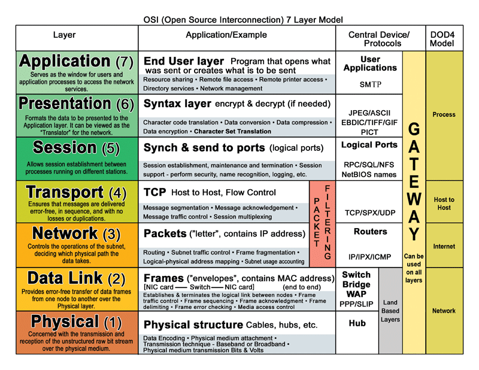
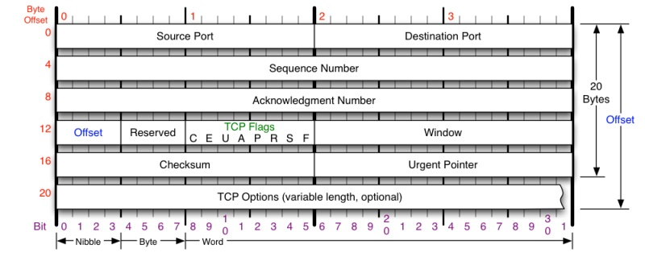
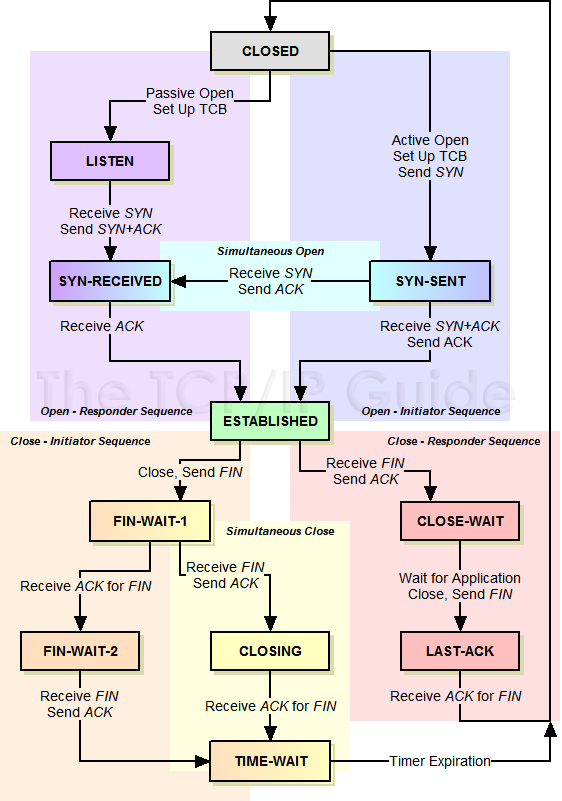
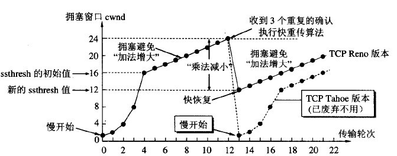
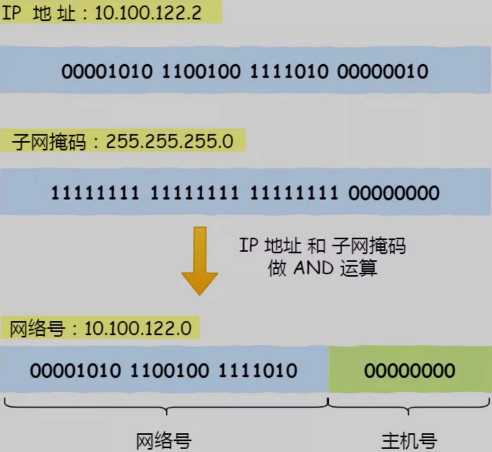
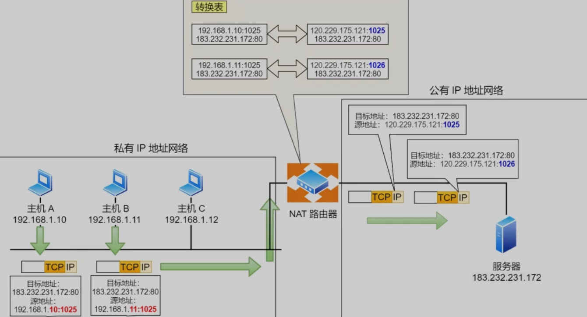

# Transmission Control Protocol/Internet Protocol TCP/IP 传输控制协议/网际协议

* 一个由FTP、SMTP、TCP、UDP、IP等协议构成的协议簇， 因为在TCP/IP协议中TCP协议和IP协议最具代表性，所以被称为TCP/IP协议
* 通信过程对应着数据入栈与出栈的过程,供已连接因特网的计算机进行通信的通信协议,定义了电子设备（比如计算机）如何连入因特网，以及数据如何在它们之间传输的标准。包含了一系列构成互联网基础的网络协议，是Internet的核心协议
  - 入栈:数据发送方每层不断地封装首部与尾部，添加一些传输的信息，确保能传输到目的地
  - 出栈:数据接收方每层不断地拆除首部与尾部，得到最终传输的数据
  - TCP 负责将数据分割并装入 IP 包，然后在到达的时候重新组合
  - IP 负责将包发送至接受者
* RTT round-trip time:which is the time it takes for a small packet to travel from client to server and back to the client.” 
	* “The RTT includes packet-propagation delays, packet-queuing delays and packet -processing delay.”  RTT=传播时延（往返）+排队时延（路由器和交换机的）+数据处理时延（应用程序的）

## 概念

* “物理信道”就是直接使用某种【物理介质】来传送信息
* “带宽”：某个信道在单位时间内最大能传输多少比特的信息
	* 1Kbps 表示“1000比特每秒”  
	* 1KiBps 表示“1024字节每秒”
* “逻辑信道”——是基于“物理信道”之上抽象出来的玩意儿
* 单工（simplex）比如“电台广播”就是典型的【单工】。“电台”可以发信号给“收音机”，但“收音机”【不能】发信号给“电台”。
* 半双工（half-duplex）比如“单条铁路轨道”，就是典型的【半双工】。火车在单条铁轨上，可以有两种运行方向；但对于同一个瞬间，只能选其中一个方向（否则就撞车了）。
* 全双工（full-duplex）比如“光纤”就是典型的【全双工】。在同一根光导纤维中，可以有多个光束【同时相向】传播，互相不会干扰对方。
* 对于多层次的协议栈。每个层次都有各自的“端点”（进行通讯的主体）。处于【同一层次】的两个端点会使用该层次的协议进行通讯
* 除了最顶层，每个层次的端点会向其【直接】上层提供“服务”；
* 除了最底层，每个层次的端点会调用【直接】下层提供的“服务”（这里所说的“服务”指某种“编程接口”，技术行话叫 API）。

## TCP/IP 协议模型

* 应用层:决定向用户提供应用服务时通信的活动 HTTP curl SSH FTP
* 传输层:提供处于网络连接中的两台计算机之间的数据传输  TCP UDP telent
  - 应用层收到数据(HTTP 请求报文)进行分割,并在各个报文上打上标记序号及端口号后转发给网络层
  - MAC地址+IP+port
* 网络层:处理在网络上流动的数据包。 IP ping traceroute
  - 数据包是网络传输的最小数据单位
  - 与对方计算机之间通过多台计算机或网络设备进行传输时,网络层所起作用就是在众多的选项内选择一条传输路线
  - 该层规定通过怎样的路径(传输路线)到达对方计算机,并把数据包传送给对方。
  - 增加作为通信目的地的 MAC 地址后转发给链路层
  - MAC地址+IP地址
* 以太网：数据链路层+物理层:用来处理连接网络的硬件部分。
	* 包括控制操作系统、硬件的设备驱动、NIC(Network Interface Card,网络适配器,即网卡),及光纤等物理可见部分(还包括连接器等一切传输媒介)


## OSI Open Systems Interconnection Model

* 从上往下的，越底层越接近硬件，越往上越接近软件，是一个标准
* 计算机与网络传输：每层进行层层解包和附加自己所要传递的信息，术语叫做报头

* Application(Layer 7) This layer supports application and end-user processes. Communication partners are identified, quality of service is identified, user authentication and privacy are considered, and any constraints on data syntax are identified. Everything at this layer is application-specific. This layer provides application services for file transfers, e-mail, and other network software services.
  - 7层应用层:为应用软件提供接口，使应用程序能够使用网络服务
  - 打包请求，根据传输数据加密与否分为 HTTP 请求和 HTTPS 请求，封装请求头和请求参数，应用层的包通过 Socket 编程交到下一层去完成
  - DHCP, DNS, FTP, HTTP, IMAP4, NNTP, POP3, SMTP, SNMP, SSH, TELNET and NTP
* Presentation(Layer 6) This layer provides independence from differences in data representation (e.g., encryption) by translating from application to network format, and vice versa. This layer formats and encrypts data to be sent across a network, providing freedom from compatibility problems. It is sometimes called the syntax layer.
  - 6层表示层：数据的解码和编码，数据的加密和解密，数据的压缩和解压缩
  - SSL, WEP, WPA, Kerberos   ASCLL、PICT、TIFF、JPEG、 MIDI、MPEG
* Session(Layer 5) This layer establishes, manages and terminates connections between applications. The session layer sets up, coordinates, and terminates conversations, exchanges, and dialogues between the applications at each end. It deals with session and connection coordination.
  - 5层会话层：通过传输层（端口号：传输端口与接收端口）建立数据传输的通路。主要在系统之间发起会话或或者接受会话请求（设备之间需要互相认识可以是IP也可以是MAC或者是主机名）
  - RPC、SQL、NFS 、X WINDOWS、ASP
* Transport(Layer 4) This layer provides transparent transfer of data between end systems, or hosts, and is responsible for end-to-end error recovery and flow control. It ensures complete data transfer.
  - 4层传输层 负责建立端到端的链接，保证保温在端到端之间的传输，数据叫做段|Segment
  - TCP, SPX and UDP
* Network(Layer 3) This layer provides switching and routing technologies, creating logical paths, known as virtual circuits, for transmitting data from node to node. Routing and forwarding are functions of this layer, as well as addressing, internetworking, error handling, congestion control and packet sequencing.
  - 3层网络层：负责将分组数据从源端传输到目的端，网络层的主要作用就是路由和寻址。数据 数据包|Packet
  - 路由器　Routers
  - IPv4, IPV6, IPX, OSPF, ICMP, IGMP and ARPMP
* Data Link(Layer 2) At this layer, data packets are encoded and decoded into bits. It furnishes transmission protocol knowledge and management and handles errors in the physical layer, flow control and frame synchronization. The data link layer is divided into two sublayers: The Media Access Control (MAC) layer and the Logical Link Control (LLC) layer. The MAC sublayer controls how a computer on the network gains access to the data and permission to transmit it. The LLC layer controls frame synchronization, flow control and error checking.
  - 2层数据链路层：在不可靠的物理链路上，提供可靠的数据传输服务。数据帧|Frame
  - 设备 交换机、网桥、网卡
  - SLIP，CSLIP，PPP，ARP，RARP，MTU
  - 802.11 (WLAN), Wi-Fi, WiMAX, ATM, Ethernet, Token Ring, Frame Relay, PPTP, L2TP and ISDN-ore
* Physical(Layer 1) This layer conveys the bit stream - electrical impulse, light or radio signal -- through the network at the electrical and mechanical level. It provides the hardware means of sending and receiving data on a carrier, including defining cables, cards and physical aspects.
  - 1层物理层： 利用传输介质为数据链路层提供物理连接，实现比特流的透明传输 。数据 比特
  -  集线器 Hubs、中继器 Repeaters, Cables, Optical Fiber, SONET/SDN,Coaxial Cable, Twisted Pair Cable and Connectors (more)
  - ISO2110，IEEE802




## application layer 应用层

* 为解决某一类应用问题而生的，每一个服务需要用不同的协议，规定应用进程在通信时所遵循的协议
* 规定应用程序的数据格式 `[HEAD(以太网标头) [HEAD(IP标头) [HEAD(TCP标头) DATA(应用层数据包)]]]`

* TELNET 远程登录协议
  - 基于 TCP 连接将向主机发送文字命令并在主机上执行，常用于登录路由器或高性能交换机等网络设备进行相应的设置
    + 利用 TELNET 协议实现远程登录的客户端程序，很多情况下，它的程序名就是 telnet 命令。TELNET 客户端通常与目标主机的 23 号端口连接，并与监听这个端口的服务端程序 telnetd 进行交互
    + 测试服务器指定端口是否可用
    + 过客户端 telnet 命令模拟 HTTP 请求
    + 无需任何认证即可发送内容，容易造成通信窃听和非法侵入的危险
* [SSH Secure Shell](./ssh.md)
  - 可以加密通信内容，是加密的远程登录协议，通过在网络中建立安全隧道来实现 SSH 客户端与服务器之间的连接，可以在不安全的网络中为网络服务提供安全的传输环境
  - SSH 本身是一种协议，有多种实现，最常见的就是开源的 OpenSSH
  - 服务器上有对应的后台守护进程 sshd 响应，客户端 SSH 远程连接，默认监听端口号是 22
  - 过程
    + 远程主机收到用户的登录请求，把自己公钥发给用户
    + 用户使用这个公钥，将登录密码加密后，发送回来
    + 远程主机用自己私钥，解密登录密码，如果密码正确，就同意用户登录
  - 威胁：中间人攻击：攻击者插在用户与远程主机之间，用伪造的公钥，获取用户的登录密码，再用这个密码登录远程主机
    + 在通过 SSH 首次进行远程登录的时候，系统会要求你比对返回的公钥是否与目标服务器上的公钥信息一致，查看公钥 `ssh-keyscan -t ECDSA -p 22 laravelacademy.org`
  - 每个用户都有自己的 `known_hosts` 文件，此外还有一个系统级的 `/etc/ssh/ssh_known_hosts`文件，用于保存对所有用户都可信赖的远程主机的公钥
  - 免密码登录远程服务器:`cat ~/.ssh/id_rsa.pub >> ~/.ssh/authorized_keys`
* FTP File Transfer Protocol 文件传输协议:在两个相连的计算机（通常是本地主机与服务器）之间进行文件传输的协议
  - 使用两个 TCP 连接实现文件传输：一个 TCP 连接用于控制，另一个 TCP 连接用于数据传输
    + 控制主要包含用户登录和验证、发送文件的名称、发送方式设置等。利用这个连接，可以通过 ASCII 码字符串发送请求和接收应答。但在这个连接上无法发送数据，只能通过另一个专门的 TCP 连接实现数据传输.使用的是 21 号端口，该端口进行文件 GET（RETR）、PUT（STOR）、以及文件预览（LIST）等操作时，每次都会建立一个用于数据传输的 TCP 连接。数据传输完毕后，传输数据的这个连接被断开，然后在控制用的连接上继续进行命令或应答的处理
    + 数据传输用的连接通常使用端口 20
  - 服务端守护进程就是 vsftpd
* SMTP（Simple Mail Transfer Protocol，简单邮件传输协议):一种会直连电源的邮件服务器，发送端和接收端通过邮件服务器进行邮件的收发。接收端从邮件服务器接收邮件使用 POP3 或 IMAP 协议
  - 完整的电子邮件机制由三部分组成
    + 邮箱地址:`用户名@邮件服务器域名` DNS 中注册了邮箱地址及其作为发送地址时对应的邮件服务器的域名，这些映射信息被称作 MX 记录，可以在域名解析里看到这个选项
    + 数据格式:已经扩展到 MIME（Multipurpose Internet Mail Extensions，多用途互联网邮件扩展类型），可以发送图片、动画、音频、视频、应用程序等各种形式的数据.首部和正文（数据）两个部分组成
      * 首部中的 Content-Type 用于指定正文的数据类型
      * MIME 首部和正文之间也是通过一个空行分隔，并且如果正文数据比较大的情况下，还可以通过指定数据类型为 multipart/mixed 将多个 MIME 消息组合为一个
    + 发送协议
      * SMTP 是发送电子邮件的协议，使用的是 TCP 的 25 号端口。SMTP 建立 TCP 连接之后，就会在这个连接上进行控制和应答以及数据的发送，客户端以文本命令方式发送请求
        - 一个不利之处在于它支持的是发送端主机的行为，而不是根据接收端的请求进行发送的行为，因此无法解决用户一开机就能接收到邮件.为了解决这个问题，引入了 POP
      * POP（Post Office Protocol，即邮局协议）协议，一种用于接收电子邮件的协议，现在用的是第三版 POP3
        - 发送端的邮件根据 SMTP 协议将被转发给一直处于插电状态的 POP 服务器，客户端再根据 POP 协议从 POP 服务器接收对方放过来的邮件。在这个过程中，为了防止他人盗窃邮件内容，还要做用户验证
        - POP 服务端监听端口是 110
      * IMAP （Internet Message Access Protocol，互联网邮件访问协议）也是接收电子邮件的协议
        - 与 POP 协议的区别在于：在 POP 中邮件由客户端管理，而在 IMAP 中邮件由服务器管理。因此，在使用 IMAP 时，可以不必从服务器下载所有邮件就可以阅读。因为 IMAP 是在服务器上处理 MIME 信息，所以可以实现一封邮件中有 10 个附件时只下载其中 7 个这样的功能，这在带宽较窄的线路上非常有用。而且 IMAP 在服务器上对「已读/未读」信息和邮件进行分类管理，因此，即使在不同的计算机上打开邮箱，也能保持同步，这样一来，人们就可以通过个人电脑、手机、公司电脑连接到 IMAP 服务器后接收邮件，并且同步状态
        - 服务端监听端口一般是 143
* [DNS](./dns.md)

```sh
telnet 主机名(或IP) TCP端口号
telnet www.badu.com 80

ssh -p 2222 <用户名>@<主机名或IP地址>

yum install vsftpd -y
# 添加ftp帐号和目录 先检查一下nologin的位置，通常在/usr/sbin/nologin或者/sbin/nologin下。 使用下面的命令创建帐户，该命令指定了/www/wwwroot为用户pwftp的家目录，您可以自己定义帐户名和目录：
useradd -d /www/wwwroot -s /sbin/nologin pwftp
passwd pwftp
chown -R pwftp:pwftp /www/wwwroot
mkdir www
mkdir wwwroot
# /etc/vsftpd/vsftpd.conf 将配置文件中 “anonymous_enable=YES
anonymous_enable=NO
local_enable=YES
write_enable=YES
hroot_local_user=YES
# vi编辑/etc/shells，如果该文件里没有/usr/sbin/nologin或者/sbin/nologin（具体看当前系统配置）则追加进去
service vsftpd start

telnet 114.215.241.29 21
USER ftpuser   # 通过 USER 指令设置 FTP 用户名
331 Please specify the password.
PASS ********  # 通过 PASS 指令设置 FTP 用户密码
230 Login successful.   # 返回 230 表示认证成功
```

* MTU = MSS + TCP首部长度 + IP首部长度，故在以太网中(网络层以IPv4为例)：MSS = 以太网MTU - TCP首部长度 - IPv4首部长度 = 1500 - 20 - 20 = 1460字节。未指定MSS时默认值为536字节，这是因为在Internet中标准的MTU值为576字节，576字节MTU = TCP首部长度20字节 + IPv4首部长度20字节 + 536字节MSS
* TCP
  - MSS是TCP里的一个概念（首部的选项字段中）。MSS是TCP数据包每次能够传输的最大数据分段，TCP报文段的长度大于MSS时，要进行分段传输。TCP协议在建立连接的时候通常要协商双方的MSS值，每一方都有用于通告它期望接收的MSS选项（MSS选项只出现在SYN报文段中，即TCP三次握手的前两次）。MSS的值一般为MTU值减去两个首部大小（需要减去IP数据包包头的大小20Bytes和TCP数据段的包头20Bytes）所以如果用链路层以太网，MSS的值往往为1460。而Internet上标准的MTU（最小的MTU，链路层网络为x2.5时）为576，那么如果不设置，则MSS的默认值就为536个字节。很多时候，MSS的值最好取512的倍数。TCP报文段的分段与重组是在运输层完成的。到了这里有一个问题自然就明了了，TCP分段的原因是MSS，IP分片的原因是MTU，由于一直有MSS<=MTU，很明显，分段后的每一段TCP报文段再加上IP首部后的长度不可能超过MTU，因此也就不需要在网络层进行IP分片了。因此TCP报文段很少会发生IP分片的情况。
  - TCP在通信双方之间建立起了一条基于字节流的全双工通道。
  - TCP包中的序号字段表示该包中第一个字节的序号，序号位有4个字节，也即4G大小。
  - TCP的确认号表示希望对象下一次报文段的第一个字节的序号。
  - TCP连接建立之后，所有的报文的ACK值都必须为1。
  - TCP的PSH（push）值为1时，表示发送方需要立即发送该报文而不缓存，接收方需要立即将将该该报文交付给应用程序。
  - TCP的SYN=1并ACK=0，表示发起连接请求，SYN=1并ACK=1表示接受连接请求，因此SYNC=1的包表示连接的请求或接收报文。
  - TCP的窗口字段为2字节，窗口值告诉对方：从该报文确认号算起，接收方允许对方发送的字节数。之所以有这个窗口值，是因为接收方的缓存是有限的，因此需要进行流量控制。
  - TCP的窗口值告诉对方：发送方的发送窗口不能超过接收方的接收窗口，TCP的窗口单位是字节，不是报文段。当接收方回复的窗口值为0时，发送方应立即停止发送，直到接收方重新发出一个新的窗口值为止。
  - TCP的滑动窗口以字节为单位。
  - 应用程序将数据发送到TCP发送缓存后，TCP是如何分段的事情就交给TCP了。
  - TCP延迟确认算法：通过延迟一定时间(默认40ms)，将多个ACK确认包合并在一起发送，这样减少了ACK确认包在网络中的数量，提高了网络性能。
  - TCP_CORK禁止发送小包，可以认为是Nagle算法的增强，因此TCP_CORK和TCP_NODELAY恰恰相反。
  - 默认TCP的keepalive时间为2小时。
  - Socket设置TCP_QUICKACK可以禁用延迟确认。
  - TCP_NOPUSH会设置CORK算法，表示数据包不会马上传送出去，等到数据包最大时，一次性的传输出去，这样有助于解决网络堵塞。
  - web服务器,下载服务器(ftp的发送文件服务器)，需要带宽量比较大的服务器，用TCP_CORK。涉及到交互的服务器，比如ftp的接收命令的服务器，必须使用TCP_NODELAY
* Nagle算法
  - Nagle算法用于减少TCP中小包的发送。
  - Nagle算法：如果应用程序逐个字节的将数据发送到TCP缓存(比如Telnet)，那么TCP就先把第一个字节发出去，把后面到达的自己都缓存起来，当收到第一个字节的确认后，再将缓存中的所有数据组装成一个报文发送出去。这样做可以减少TCP所用的网络带宽。
  - Nagle原本就是为诸如Telnet或rlogin这样的应用程序而创建的。
  - Nagle算法还规定：当缓存的数据已经到达发送窗口的一半或者报文段的MSS时，则立即发送。
  - 默认情况下Nagle和延迟ACK都是开启的，此时延迟确认和Nagle同时使用会大大降低网络性能，因为发送方在等待接收方的ACK，但是接收方却延迟了ACK。因此Socket提供提供了TCP_NODELAY选项来禁用Nagle算法

## transport layer 传输层 

* 端到端传输数据的基本功能.在原有的上层的数据外围标记两个标签：第一源端口，第二目的端口，从这个端口出去，访问另一个端口  数据 段（Segments）
* 面向进程：使用端口号识别在传输层上一层的应用层中所要进行处理的具体程序
* 众多协议大多以客户端/服务端的形式运行,作为服务端的程序有必要提前启动，准备接收客户端的请求
  - 这些服务端程序在 UNIX 系统中叫守护进程
- 协议实现通常包含在操作系统自带的网络模块中

```
10.10.27.115 # ip
255.255.255.0 # 子网掩码
10.10.27.0 # 网络
0.0.0.115 # 主机地址

arp -a
```

### Transmission Control Protocol TCP 传输控制协议

* TCP 提供面向连接的数据流支持、可靠性、流量控制、多路复用等服务
  - 通过 IP 网络的面向连接的协议。使用握手建立和断开连接。发送的所有数据包保证以原始顺序到达目的地，用以下措施保证数据包不被损坏：
    + 每个数据包的序列号和校验码。
    + 确认包和自动重传
  - 如果发送者没有收到正确的响应，它将重新发送数据包。如果多次超时，连接就会断开。TCP 实行流量控制和拥塞控制。这些确保措施会导致延迟，而且通常导致传输效率比 UDP 低。
  - 为了确保高吞吐量，Web 服务器可以保持大量的 TCP 连接，从而导致高内存使用。在 Web 服务器线程间拥有大量开放连接可能开销巨大，消耗资源过多，也就是说，一个 memcached 服务器。连接池可以帮助除了在适用的情况下切换到 UDP。
  - 对于需要高可靠性但时间紧迫的应用程序很有用。比如包括 Web 服务器，数据库信息，SMTP，FTP 和 SSH。
  - 以下情况使用 TCP 代替 UDP：
    + 需要数据完好无损
    + 想对网络吞吐量自动进行最佳评估
  - 协议
    + SMTP
    + TELNET
    + HTTP
    + FTP
* TCP Transmission Control Protocol 传输控制协议:提供面向连接的可靠性传输
  - 面向有连接的协议，只有在确认通信对端存在时才会发送数据
  - 通过检验和、序列号、确认应答、重发控制、连接管理以及窗口控制等机制实现可靠性传
    + 序列号：发送数据的位置，每发送一次数据，就累加一次该数据字节数的大小，序列号不会从0或1开始，而是在建立连接时由计算机生成的随机数作为初始值，通过 SYN 包发送给接收端主机。此外，建立连接和断开连接时虽然不传输数据，但也会作为一个字节增加对应的序列号
    + 确认应答号：下一次应该接收到的数据的序列号，实际上，它是指已经收到确认应答号减一为止的数据
    + 数据偏移：TCP 所传输的数据部分应该从 TCP 包的哪个位置开始计算，也可以将其看作 TCP 包的长度，单位为4字节
    + 控制位：字段长8位，每一位从左到右分别是CWR、ECE、URG、ACK、PSH、RST、SYN、FIN
      * CWR（Congestion Window Reduced）：与后面的ECE都是用于IP首部的ECN字段，为1时通知对方已将拥塞窗口缩小
      * ECE（ECN-Echo）：置为1时通知通信对方，从对方到这边的网络有拥堵
      * URG（Urgent Flag）：该位为1时，表示包中有需要紧急处理的数据
      * ACK（Acknowledgement Flag）：该位为1时，确认应答的字段变为有效
      * PSH（Push Flag）：该位为1时，表示需要将收到的数据立即传给上层应用协议，为0时则表示先不上传而是缓存起来
      * RST（Reset Flag）：该位为1时，表示TCP连接中出现异常必须强制断开连接
      * SYN（Synchronize Flag）：该位为1时，表示希望建立连接，并在序列号字段进行序列号初始值的设定
      * FIN（Fin Flag）：该位为1时，表示今后不会再有数据发送，希望断开连接
    + 窗口大小：用于通知从相同 TCP 首部的确认应答号所指位置开始能够接收的数据大小
  - 连接建立 三次握手:目的是为了确保对连接双方来说，链路都是通的
  - 通过肯定的确认应答（ACK）实现可靠的数据传输，当发送端将数据发出之后会等待对端的确认应答。如果确认应答，说明数据已经成功达到对端。反之，则数据有可能丢失。在一定时间内没有等到确认应答，发送端就认为数据已经丢失，并进行重发
  - 顺序控制
    + 确认应答处理、重发控制以及重复控制等功能都可以通过序列号实现，序列号是按顺序给发送数据的每一个字节都标上号码的编号
  - 重发
    + 超时时间:每次发包时都会计算往返时间（RTT）及偏差（抖动），将这个往返时间和偏差相加，重发超时的时间，就是比这个总和稍微大一点的值
    + 在 BSD Unix 和 Windows 中，超时都是按照 0.5 秒为单位进行控制，因此，重发超时都是 0.5 秒的整数倍。不过由于最初的数据包还不知道往返时间，因此其重发超时一般设置为 6 秒左右
    + 被重发之后若还是收不到确认应答，则再次发送。此时等待确认应答的时间将会以 2 倍、4 倍的指数函数增长
    + 达到一定重发次数后，如果仍没有确认应答返回，就会判断为网络或对端主机发生了异常，强制关闭连接。并且通知应用通信异常强行终止
  - 窗口：
    + 在传输大量数据时，是以 MSS 的大小将数据分割发送。重发时也是以 MSS 为单位
    + 建立 TCP 连接的同时，也可以确定发送数据包的单位，可以将其称为「最大消息长度」（MSS，Maximum Segment Size），最理想的情况下，最大消息长度正好是 IP 中不会被分片处理的最大数据长度
    + 以一个段（Segment）为单位，每发送一个段进行一次确认应答的处理，这样的传输方式有一个显著的缺点，就是包往返的时间越长通信性能就越低
    + 窗口机制确认应答不再以每个分段，而是以更大单位进行确认，也就是说，发送端主机在发送完一个段之后，不必一直等待确认应答，而是继续发送
    + 窗口的大小就是指无需等待确认应答而可以继续发送数据的最大值，这个机制实现了使用大量的缓冲区（临时保存收发数据的场所），通过对多个段同时进行确认应答的功能，而不是每个分段都返回确认应答，从而大幅度缩短发送时间。在得到确认应答之前，需要在缓冲区保存这部分发送的数据，以便于重发数据
    + 在滑动窗口以外的部分包括尚未发送的数据以及已经确认对端已经收到的数据，当数据发出后若如期收到确认应答就不再进行重发，此时数据就会从缓冲区中清除，否则丢失的数据需要进行重发（从缓冲区取）
    + 滑动窗口控制：收到确认应答的情况下，将窗口滑动到确认应答中的序列号的位置，这样就可以顺序将多个段同时发送，提高通信性能
  - 流量控制：让发送端根据接收端的实际接收能力控制发送的数据量，为了防止把接收端缓存塞满
    + 发送端会根据自己的实际情况发送数据，但是，接收端可能收到的是一个毫无关系的数据包又可能会在处理其它问题上耗费一些时间，甚至在高负荷的情况下无法接收任何数据。如此一来，如果接收端将本该接收的数据丢弃的话，就又会触发重发机制，从而导致网络流量的无端浪费
    + 接收端主机向发送端主机通知自己可以接收数据的大小，于是发送端会发送不超过这个限度的数据，该大小限制被称作窗口大小
    + TCP 首部中，专门有一个字段用来通知窗口大小，接收主机将自己可以接收的缓冲区大小放入这个字段中通知给发送端。这个字段值越大，说明网络的吞吐量越高
    + 接收端的这个缓冲区一旦面临数据溢出风险，窗口大小的值也会随之被设置为一个更小的值通知给发送端，从而控制数据发送量。也就是说，发送端会根据接收端的指示，对发送数据的量进行控制
  - 拥塞控制：为了防止把网络塞满，导致网络拥塞
    + 如果在通信一开始就发送大量数据，在网络拥堵时，如果发送一个较大量的数据，极有可能导致整个网络的瘫痪
    + 在通信一开始就会通过一个叫做慢启动的算法得出的值，对发送数据量进行控制
      * 为了在发送端调节所要发送数据的量，定义了一个叫做「拥塞窗口」的概念，于是在慢启动的时候，将这个拥塞窗口的大小设置为1个数据段（1MSS）发送数据，之后每收到一个确认应答（ACK），就将拥塞窗口的值加1，在发送数据包时，将拥塞窗口的大小与接收端主机通知的窗口大小做比较，然后按照它们当中较小的那个值，发送比它还要小的数据量
      * 为了防止超时重发时，随着包往返导致的拥塞窗口快速增长（指数增长），引入了慢启动阀值的概念，只要拥塞窗口的大小超过这个阀值，每收到一次确认应答时，只允许以下面这种方式放大拥塞窗口：1个数据段的字节数/拥堵窗口（字节数）×　１个数据段字节数
      * 拥塞窗口越大，确认应答的数目也会增加，不过每收到一个确认应答，其涨幅也会逐渐减小，甚至小过比一个数据段还要小的字节数
    + 开始通信时，并没有设置慢启动阀值，只有超时重发时才会设置该值，初始值为当时拥塞窗口的一半

* 没有长度限制，理论上可以无限长，但是为了保证网络的效率，通常TCP数据包的长度不会超过IP数据包的长度，以确保单个TCP数据包不必再分割
    + 能够确保数据不会遗失
    + 缺点是过程复杂、实现困难、消耗较多的资源。
* 基于连接的协议、端到端和可靠数据包发送
* 当应用程序希望通过 TCP 与另一个应用程序通信时，会发送一个通信请求。这个请求必须被送到一个确切的地址。在双方“握手”之后，TCP 将在两个应用程序之间建立一个全双工 (full-duplex) 的通信。在数据传送前分割为 IP 包，在到达时重组
* 建立在不可靠的网络层 IP 协议之上，IP协议并不能提供任何可靠性机制，TCP 可靠性完全由自己实现，提供的服务包括数据流传送、可靠性、有效流控、全双工操作和多路复用
* 特点
  - 提供一种面向连接的、可靠的字节流服务
  - 一个 TCP 连接中，仅有两方进行彼此通信。广播和多播不能用于 TCP
  - 使用校验和，确认和重传机制来保证可靠传输,甄别有害的数据包
  - 给数据分节进行排序，并使用累积确认保证数据的顺序不变和非重复
  - 使用滑动窗口机制来实现流量控制，通过动态改变窗口的大小进行拥塞控制
  - 能够确保连接的建立和数据包的发送
  - TCP头部：20个字节的固定首部
* 可靠性技术：确认与超时重传机制、流量控制机制。使一台计算机发出的字节流无差错地发往网络上的其他计算机
  * 确认：传输过程中都有一个ACK，接收方通过ack告诉发送方收到那些包了。这样发送方能知道有没有丢包，进而确定重传.一旦发生丢包，TCP会将后续包缓存起来，等前面的包重传并接收到后再继续发送，延迟会越来越大
  * 超时重传：TCP协议保证数据可靠性的一个重要机制，其原理是在发送某一个数据以后就开启一个计时器，在一定时间内如果没有得到发送的数据报的ACK报文，那么就重新发送数据，直到发送成功为止。
  * 流量控制：让发送速率不要过快，让接收方来得及接收。利用滑动窗口机制就可以实施流量控制。
+ 虽然是面向字节流的，但TCP传送的数据单元却是报文段。一个TCP报文段分为首部和数据两部分，而TCP的全部功能体现在它首部中的各字段的作用
* 编程步骤
  - 服务器端
    + 创建一个socket，用函数socket()；
    + 设置socket属性，用函数setsockopt(); *可选*
    + 绑定IP地址、端口等信息到socket上，用函数bind();
    + 开启监听，用函数listen()；
    + 接收客户端上来的连接，用函数accept()；
    + 收发数据，用函数send()和recv()，或者read()和write();
    + 通过函数断开连接；
    + 关闭监听；
  - 客户端
    + 创建一个socket，用函数socket()
    + 设置socket属性，用函数setsockopt();*可选
    + 绑定IP地址、端口等信息到socket上，用函数bind();* 可选
    + 设置要连接的对方的IP地址和端口等属性
    + 连接服务器，用函数connect()
    + 收发数据，用函数send()和recv()，或者read()和write()
    + 关闭网络连接
* 四元组可以确定唯一一个连接:源端口和目的端口字段 socket（IP+端口号）。TCP的包是没有IP地址的，那是IP层上的事。但是有源端口和目标端口
  * 本地端口由16位组成,因此本地端口的最多数量为 2^16 = 65535个,本地的最大HTTP连接数为： 本地最大端口数65535 * 本地ip数1 = 65535 个
  * 远端端口由16位组成,因此远端端口的最多数量为 2^16 = 65535个,远端的最大HTTP连接数为：远端最大端口数65535 * 远端(客户端)ip数+∞ = 无限制
  * 源地址和目的地址的字段（32位）是在 IP 头部中，作用是通过 IP 协议发送报文给对方主机
  * 源端口和目的端口的字段（16位）是在 TCP 头部中，作用是告诉 TCP 协议应该把报文发给哪个进程
* 面向字节流：应用程序和TCP的交互是一次一个数据块（大小不等），但TCP把应用程序看成是一连串的无结构的字节流。TCP有一个缓冲，当应用程序传送的数据块太长，TCP就可以把它划分短一些再传送
* TCP的协议栈中维护着两个队列,都有最大长度限制，超过限制时，内核会直接丢弃，或返回 RST 包 `cat /proc/sys/net/ipv4/tcp_abort_on_overflow`
  - 0 ：表示如果全连接队列满了，那么 server 扔掉 client  发过来的 ack,更有利于应对突发流量
    + 只要服务器没有为请求回复 ACK，请求就会被多次重发。如果服务器上的进程只是短暂的繁忙造成 accept 队列满，那么当 TCP 全连接队列有空位时，再次接收到的请求报文由于含有 ACK，仍然会触发服务器端成功建立连接.提高连接建立的成功率
  - 1 ：表示如果全连接队列满了，那么 server 发送一个 reset 包给 client，表示废掉这个握手过程和这个连接. 客户端异常中可以看到很多 `connection reset by peer` 的错误，那么就可以证明是由于服务端 TCP .全连接队列溢出的问题.只有非常肯定 TCP 全连接队列会长期溢出时，才能设置为 1 以尽快通知客户端
* 服务端收到客户端发起的 SYN 请求后，内核会把该连接存储到半连接队列，并向客户端响应 SYN+ACK，接着客户端会返回 ACK，服务端收到第三次握手的 ACK 后，内核会把连接从半连接队列移除，然后创建新的完全的连接，并将其添加到 accept 队列，等待进程调用 accept 函数时把连接取出来.不管是半连接队列还是全连接队列，都有最大长度限制，超过限制时，内核会直接丢弃，或返回 RST 包
* 全连接队列 accepet 队列(服务端收到请求且收到客户收到响应)：内核会把连接从半连接队列移除，然后创建新的完全的连接，并将其添加到 accept 队列，等待进程调用 accept 函数时把连接取出来
  - 使用 ss 命令，来查看 TCP 全连接队列的情况:获取的 Recv-Q/Send-Q 在「LISTEN 状态」和「非 LISTEN 状态」所表达的含义是不同的
    + -l 显示正在监听的socket
    + 在「LISTEN 状态」时，Recv-Q/Send-Q 含义如下 `ss -lnt`
      * Recv-Q：当前全连接队列大小，也就是当前已完成三次握手并等待服务端 accept() 的 TCP 连接个数
      * Send-Q：当前全连接最大队列长度，上面的输出结果说明监听 8088 端口的 TCP 服务进程，最大全连接长度为 128
      * 客户端`wrk -t 6 -c 3000 -d 60s http://192.168.3.200:8080` 服务端 `ss -lnt| grep 8088`
      * 服务端执行多次 `ss -lnt` 发现当前 TCP 全连接队列上升到了 129 大小，超过了最大 TCP 全连接队列,服务端则会丢掉后续进来的 TCP 连接
      * 如果 TCP 全连接队列过小，就容易溢出。发生 TCP 全连接队溢出的时候，后续的请求就会被丢弃，这样就会出现服务端请求数量上不去的现象
        - 丢掉 TCP 连接个数统计 date;netstat -s | grep overflowed
        - 丢弃连接只是 Linux 的默认行为，还可以选择向客户端发送 RST 复位报文，告诉客户端连接已经建立失败. cat `/proc/sys/net/ipv4/tcp_abort_on_overflow`
          + 0 ：表示如果全连接队列满了，那么 server 扔掉 client  发过来的 ack ；
          + 1 ：表示如果全连接队列满了，那么 server 发送一个 reset 包给 client，表示废掉这个握手过程和这个连接
        - 要想知道客户端连接不上服务端，是不是服务端 TCP 全连接队列满的原因，那么可以把 tcp_abort_on_overflow 设置为 1，这时如果在客户端异常中可以看到很多 connection reset by peer 的错误，那么就可以证明是由于服务端 TCP 全连接队列溢出的问题
        - 通常情况下，应当把 tcp_abort_on_overflow 设置为 0，因为这样更有利于应对突发流量
          + 当 TCP 全连接队列满导致服务器丢掉了 ACK，与此同时，客户端的连接状态却是 ESTABLISHED，进程就在建立好的连接上发送请求。只要服务器没有为请求回复 ACK，请求就会被多次重发。如果服务器上的进程只是短暂的繁忙造成 accept 队列满，那么当 TCP 全连接队列有空位时，再次接收到的请求报文由于含有 ACK，仍然会触发服务器端成功建立连接。
          + 设为 0 可以提高连接建立的成功率，只有你非常肯定 TCP 全连接队列会长期溢出时，才能设置为 1 以尽快通知客户端
    + 在「非 LISTEN 状态」时，Recv-Q/Send-Q 表示的含义如下 `ss -nt`
      * Recv-Q：已收到但未被应用进程读取的字节数
      * Send-Q：已发送但未收到确认的字节数
  - 最大值取决于 somaxconn 和 backlog 之间的最小值，也就是 min(somaxconn, backlog)
    + somaxconn 是 Linux 内核的参数，默认值是 128，可以通过 `/proc/sys/net/core/somaxconn` 来设置其值
    + backlog 是 listen(int sockfd, int backlog) 函数中的 backlog 大小，Nginx 默认值是 511，可以通过修改配置文件设置其长度
* 半连接队列 SYN 队列(服务端收到请求未收到客户收到响应)：服务端收到客户端发起的 SYN 请求后，内核会把该连接存储到半连接队列，并向客户端响应 SYN+ACK，接着客户端会返回 ACK，服务端收到第三次握手的 ACK
  - 查看：服务端处于 SYN_RECV 状态的 TCP 连接，就是在 TCP 半连接队列 `netstat -natp | grep SYN_RECV | wc -l`
  - 模拟 TCP 半连接溢出:对服务端一直发送 TCP SYN 包，但是不回第三次握手 ACK，这样就会使得服务端有大量的处于 SYN_RECV 状态的 TCP 连接。其实也就是所谓的 SYN 洪泛、SYN 攻击、DDos 攻击 hping
  - 机制
    + 如果半连接队列满了，并且没有开启 tcp_syncookies，则会丢弃
    + 若全连接队列满了，且没有重传 SYN+ACK 包的连接请求多于 1 个，则会丢弃
    + 如果没有开启 `tcp_syncookies`，并且 max_syn_backlog 减去 当前半连接队列长度小于 (max_syn_backlog >> 2)，则会丢弃
  - 半连接队列最大值不是单单由 max_syn_backlog 决定，还跟 somaxconn 和 backlog 有关系
    + 当 max_syn_backlog > min(somaxconn, backlog) 时， 半连接队列最大值 max_qlen_log = min(somaxconn, backlog) * 2;
    + 当 max_syn_backlog < min(somaxconn, backlog) 时， 半连接队列最大值 max_qlen_log = max_syn_backlog * 2;
  - max_qlen_log 是理论半连接队列最大值，并不一定代表服务端处于 SYN_REVC 状态的最大个数
  - 如果当前半连接队列的长度 「没有超过」理论半连接队列最大值  max_qlen_log，那么如果条件 3 成立，则依然会丢弃 SYN 包，也就会使得服务端处于 SYN_REVC 状态的最大个数不会是理论值 max_qlen_log
  - 服务端处于 SYN_RECV 状态的最大个数分为如下两种情况：
    - 如果「当前半连接队列」没超过「理论半连接队列最大值」，但是超过 max_syn_backlog - (max_syn_backlog >> 2)，那么处于 SYN_RECV 状态的最大个数就是 max_syn_backlog - (max_syn_backlog >> 2)；
    - 如果「当前半连接队列」超过「理论半连接队列最大值」，那么处于 SYN_RECV 状态的最大个数就是「理论半连接队列最大值」
  - 开启 syncookies 功能就可以在不使用 SYN 半连接队列的情况下成功建立连接
    + 0 值，表示关闭该功能；
    + 1 值，表示仅当 SYN 半连接队列放不下时，再启用它；
    + 2 值，表示无条件开启功能；
  - 防御 SYN 攻击方法：
    + 增大半连接队列：增大 `echo 1024 > /proc/sys/net/ipv4/tcp_max_syn_backlog` 和 `echo 1024 > /proc/sys/net/core/somaxconn`, 以及nginx 中 blacklog
    + 开启 tcp_syncookies 功能 `echo 1 > /proc/sys/net/ipv4/tcp_syncookies`
    + 减少 SYN+ACK 重传次数
* 如果已经建立连接，客户端突然出现故障了怎么办？
  - TCP设有一个保活计时器，客户端如果出现故障，服务器不能一直等下去
  - 服务器每收到一次客户端的请求后都会重新复位这个计时器，时间通常是设置为2小时，若两小时还没有收到客户端的任何数据，服务器就会发送一个探测报文段，以后每隔75秒发送一次。若一连发送10个探测报文仍然没反应，服务器就认为客户端出了故障，接着就关闭连接
* 保证传输的可靠性
  - 数据包校验：目的是检测数据在传输过程中的任何变化，若校验出包有错，则丢弃报文段并且不给出响应，这时TCP发送数据端超时后会重发数据；
  - 对失序数据包重排序：既然TCP报文段作为IP数据报来传输，而IP数据报的到达可能会失序，因此TCP报文段的到达也可能会失序。TCP将对失序数据进行重新排序，然后才交给应用层；
  - 丢弃重复数据：对于重复数据，能够丢弃重复数据；
  - 应答机制：当TCP收到发自TCP连接另一端的数据，它将发送一个确认。这个确认不是立即发送，通常将推迟几分之一秒；
  - 超时重发：当TCP发出一个段后，它启动一个定时器，等待目的端确认收到这个报文段。如果不能及时收到一个确认，将重发这个报文段；
  - 流量控制：TCP连接的每一方都有固定大小的缓冲空间。TCP的接收端只允许另一端发送接收端缓冲区所能接纳的数据，这可以防止较快主机致使较慢主机的缓冲区溢出，这就是流量控制。TCP使用的流量控制协议是可变大小的滑动窗口协议。

#### 报文首部

* 前20个字节是固定的，后面有4n字节是根据需要而增加的选项（n是整数）。因此TCP首部的最小长度是20字节
* 源端口和目的端口：各2个字节
* 序列号 Sequence Number:当前报文段序号
  - 4个字节，TCP连接中传送的字节流中的每个字节都按顺序编号，解决网络包乱序（reordering）问题。通过 SYN 包传给接收端主机，每发送一次数据，就「累加」一次该「数据字节数」的大小
* 确认应答号 Acknowledgement Number
  - 4个字节，期望收到对方下一个报文的第一个数据字节的序号，用来解决不丢包的问题
  - 例如，B收到了A发送过来的报文，其序列号字段是501，而数据长度是200字节，这表明B正确的收到了A发送的到序号700为止的数据。因此，B期望收到A的下一个数据序号是701，于是B在发送给A的确认报文段中把确认号置为701
* 数据偏移：4位，指出TCP报文的数据距离TCP报文段的起始处有多远
* 保留：占6位，保留今后使用，但目前应都位 0
* TCP Flag：也就是包的类型，主要是用于操控TCP的状态机的
  - 紧急URG：当URG=1，表明紧急指针字段有效。告诉系统此报文段中有紧急数据
  - 确认ACK：仅当ACK=1时，确认号字段才有效。TCP规定，在连接建立后所有报文的传输都必须把ACK置1
  - 推送PSH (PuSH)：当两个应用进程进行交互式通信时，有时在一端的应用进程希望在键入一个命令后立即就能收到对方的响应，这时候就将PSH=1,接收  TCP  收到  PSH  =  1  的报文段，就尽快地交付接收应用进程，而不再等到整个缓存都填满了后再向上交付
  - 复位RST (ReSeT)：当RST=1，表明TCP连接中出现严重差错，必须释放连接，然后再重新建立连接
  - 同步SYN：在连接建立时用来同步序号。当SYN=1，ACK=0，表明是连接请求报文，若同意连接，则响应报文中应该使SYN=1，ACK=1
  - 终止FIN (Finish)：用来释放连接。当FIN=1，表明此报文的发送方的数据已经发送完毕，并且要求释放
* 窗口｜滑动窗口 Window｜Advertised-Window｜Sliding Window
  - 指的是通知接收方，发送本报文需要有多大的空间来接受。用于解决流控
  - 占 2 字节，用来让对方设置发送窗口的依据，单位为字节。窗口值是[0, 2^16-1]之间的整数,默认情况支持的最大窗口数是 65536字节/64KB
  * 指 TCP传输能接受的最大字节数，这个可以进行动态调节，也就是 TCP的滑动窗口，通过动态调整窗口大小，来控制发送数据的速率
  * Ws: 窗口缩放调整因子
    - 为能够支持更多的缓冲数据 RFC 1323中就规定了 TCP 的扩展选项，其中窗口缩放调整因子就是其中之一
    - 这个参数是在 [SYN] 同步阶段进行协商的，结合抓包数据分析下。看到第一次请求协商的结果是 WS=256,然后再 ACK 阶段扩展因子生效，调整了窗口大小
* 检验和
  - 2 字节
  - 字段检验范围:首部和数据这两部分
  - 在计算检验和时，要在TCP 报文段的前面加上 12 字节的伪部(协议字段为6，表示TCP)
* 紧急指针
  - 占2字节，指出本报文段中的紧急数据的字节数
  - 指出在本报文段中紧急数据共有多少个字节(紧急数据放在本报文段数据的最前面)
* 选项：长度可变，定义一些其他可选参数
  - 最大报文段长度 MSS：MSS是指在TCP连接建立时，收发双发协商的通信时每一个报文段所能承载的数据字段的最大长度（并不是TCP报文段的最大长度，而是：MSS=TCP报文段长度-TCP首部长度），单位为字节（双方提供的MSS中的最小值，为本次连接的最大MSS值）
  - 窗口扩大选项
  - 时间戳选项
  - 选择确认选项
  * Len: 消息长度就是指数据报文段，因为整个 TCP报文 = Header + packSize,所以这个消息长度就是指要传送的数据包总共长度，在本次分析中也就是 HTTP报文的大小。
  * Mss: 最大报文段长度：规定最大的能传输报文的长度，为了达到最佳的传输效能， TCP 协议在建立连接的时候通常要协商双方的 MSS 值，这个值 TCP 协议在实现的时候往往用 MTU 值代替（需要减去 IP数据包包头的大小 20Bytes和 TCP数据段的包头 20Bytes）所以一般 MSS 值 1460



#### TCP 状态机

* 状态编码：S指代服务器，C指代客户端，S&C表示两者，S/C表示两者之一
  - LISTEN S等待从任意远程TCP端口的连接请求。侦听状态
  - SYN-SENT C在发送连接请求后等待匹配的连接请求。通过connect()函数向服务器发出一个同步（SYNC）信号后进入此状态
  - SYN-RECEIVED S已经收到并发送同步（SYNC）信号之后等待确认（ACK）请求
  - ESTABLISHED S&C连接已经打开，收到的数据可以发送给用户。数据传输步骤的正常情况。此时连接两端是平等的
  - FIN-WAIT-1 S&C主动关闭端调用close（）函数发出FIN请求包，表示本方的数据发送全部结束，等待TCP连接另一端的确认包或FIN请求包
  - FIN-WAIT-2 S&C主动关闭端在FIN-WAIT-1状态下收到确认包，进入等待远程TCP的连接终止请求的半关闭状态。这时可以接收数据，但不再发送数据
  - CLOSE-WAIT S&C被动关闭端接到FIN后，就发出ACK以回应FIN请求，并进入等待本地用户的连接终止请求的半关闭状态。这时可以发送数据，但不再接收数据
  - CLOSING S&C在发出FIN后，又收到对方发来的FIN后，进入等待对方对连接终止（FIN）的确认（ACK）的状态
  - LAST-ACK S&C被动关闭端全部数据发送完成之后，向主动关闭端发送FIN，进入等待确认包的状态
  - TIME-WAIT S/C主动关闭端接收到FIN后，就发送ACK包，等待足够时间以确保被动关闭端收到了终止请求的确认包。【按照RFC 793，一个连接可以在TIME-WAIT保证最大四分钟，即最大分段寿命（maximum segment lifetime）的2倍】
  - CLOSED S&C完全没有连接



#### 三次握手 Three-way Handshake 

- 目的:连接服务器指定端口，建立 TCP 连接，并同步连接双方的序列号和确认号，交换 TCP 窗口大小信息
* 同步序列编号 Synchronize Sequence Numbers SYN,初始化Sequence Number 初始值
	- TCP/IP 建立连接时使用的握手信号。在客户机和服务器之间建立 TCP 连接时，首先会发送的一个信号。客户端在接受到 SYN 消息时，就会在自己段内生成一个随机值 X，用来初始化和建立连接
	- 通信双方要互相通知对方自己的初始化的Sequence Number,这个号要作为以后的数据通信的序号，以保证应用层接收到的数据不会因为网络上的传输的问题而乱序
- RFC793 中认为 ISN 要和一个假的时钟绑定在一起ISN 每四微秒加一，当超过 2 的 32 次方之后又从 0 开始，要四个半小时左右发生 ISN 回绕
- SYN 超时:慢慢重试，Linux 中就是默认重试 5 次，并且就是阶梯性的重试，间隔就是1s、2s、4s、8s、16s，再第五次发出之后还得等 32s 才能知道这次重试的结果，所以说总共等63s 才能断开连接
  + SYN Flood 攻击: 63s 内服务端需要保持这个资源，所以不法分子就可以构造出大量的 client 向 server 发 SYN 但就是不回 server,使得 server 的 SYN 队列耗尽，无法处理正常的建连请求
  + 开启 tcp_syncookies，那就用不到 SYN 队列:SYN 队列满了之后 TCP 根据自己的 ip、端口、然后对方的 ip、端口，对方 SYN 的序号，时间戳等一波操作生成一个特殊的序号（即 cookie）发回去，如果对方是正常的 client 会把这个序号发回来，然后 server 根据这个序号建连
 
- 开始时客户端和服务器都是处于CLOSED状态。服务器进程先创建传输控制块TCB，时刻准备接受客户进程连接请求，进入 LISTEN 状态
- 第一次握手：客户端发送同步报文，对齐
	+ 客户进程创建传输控制块TCB，向服务器发出连接请求报文，同步位 SYN=1，序号 SEQ=x（随机产生一个 Number，表明传送数据时的第一个数据字节的序号是x），
	+ 进入SYN_SEND（同步已发送状态），等待服务器确认.
	+ TCP规定：SYN报文段（SYN=1的报文段）不能携带数据，但需要消耗掉一个序号
- 第二次握手(SYN=1, ACK=1, seq=y, ACKnum=x+1)
	+ 服务器收到请求报文后，同意连接，则发出确认报文，同步位SYN=1，ack 置 1,确认号 ACKnum=x+1，序号SEQ=y(随机值)
	+ 服务器进入 SYN_RECV （同步收到）状态。报文也不能携带数据，消耗一个序号
- 第三次握手(ACK=1，ACKnum=y+1)
	+ 客户进程收到确认后，要向服务器给出确认 ACK。确认报文 ack=y+1. TCP连接建立
	+ 客户进程收到确认后，检查 ack 状态是否为 100+1，ACK 是否为 1，如果正确则将标志位 ACK 置为 1，ack=y+1，并将该数据包发送给 Server，Server 检查 ack 是否为 y+1，ACK 是否为 1，如果正确则连接建立成功
	+ Client 和 Server 进入 ESTABLISHED 状态
	+ TCP规定:ACK报文段可以携带数据，如果不携带数据则不消耗序号
	+ 防止已经失效的连接请求报文突然又传送到了服务器，从而产生错误
- 为什么建立连接是三次握手
	+ 防止已失效连接请求报文段突然又传送到了服务端，因而产生错误。client发出的第一个连接请求报文段并没有丢失，而是在某个网络结点长时间的滞留了，以致延误到连接释放以后的某个时间才到达server
	+ 重点在于同步初始序列号:为了初始化Seq Numer，SYN Synchronize Sequence Numbers，用来保证之后传输数据的顺序性.
	+ 建立连接的时候，服务器在LISTEN状态下，收到建立连接请求的SYN报文后，把ACK和SYN放在一个报文里发送给客户端
	+ 为保证服务端能收接受到客户端的信息并能做出正确的应答而进行前两次(第一次和第二次)握手
	+ 为保证客户端能够接收到服务端的信息并能做出正确的应答而进行后两次(第二次和第三次)握手
	- 理想状态下，TCP连接一旦建立，在通信双方中的任何一方主动关闭连接之前，TCP 连接都将被一直保持下去
- SACK_PERM
	+ SACK选项默认情况下，接受端接受到一个包后，发送 ACK 确认，但是，默认只支持顺序的确认，也就是说，发送 A, B, C 个包，如果我收到了 A, C的包，B没有收到，那么对于 C，这个包是不会确认的，需要等 B这个包收到后再确认，那么 TCP有超时重传机制，如果一个包很久没有确认，就会当它丢失了，进行重传，这样会造成很多多余的包重传，浪费传输空间
	+ 为了解决这个问题， SACK就提出了选择性确认机制，启用 SACK 后，接受端会确认所有收到的包，这样发送端就只用重传真正丢失的包
- SYN 超时：server端如果在一定时间内没有收到的TCP会重发SYN-ACK。在Linux下，默认重试次数为5次，重试的间隔时间从1s开始每次都翻售，5次的重试时间间隔为1s, 2s, 4s, 8s, 16s，总共31s，第5次发出后还要等32s都知道第5次也超时了，所以，总共需要 1s + 2s + 4s+ 8s+ 16s + 32s = 2^6 -1 = 63s，TCP才会把断开这个连接

#### 四次挥手 Four-way handshake

- TCP是全双工,发送方和接收方都需要Fin和Ack
- 数据传输完毕后，双方都可释放连接。最开始的时候处于ESTABLISHED状态，然后一方主动关闭，另一方被动关闭
	- 在 socket 编程中，任何一方执行 close() 操作即可产生挥手操作，断开过程需要经过"四次挥手"（要对方关闭与对方关闭完成两次确认）,由TCP的半关闭（half-close）造成
- 第一次挥手(FIN=1，seq=x)
	+ 主动关闭连接一方，调用close(),kernel will send a FIN packet 发起一个断开请求（该端执行“主动关闭”（active close））
	+ 进入 FIN-WAIT-1 状态
- 第二次挥手(ACK=1，ACKnum=x+1)
	+ 被动关闭一方收到FIN包后，发送一个确认包，表明自己接受到了客户端关闭连接的请求，但还没有准备好关闭连接；
	+ 被动关闭一方进入`CLOSE_WAIT`状态
	+ 主动关闭一方等待对方关闭，则进入`FIN_WAIT_2`状态；此时主动关闭一方等待被动关闭一方的应用程序调用close操作
- 第三次挥手(FIN=1，seq=y)
	+ 被动关闭一方在完成所有数据发送后，调用close()操作；
	+ 准备好关闭连接时，向客户端发送结束连接请求，FIN 置为1，被动关闭一方进入LAST_ACK状态，等待对方 ACK
	+ 在 RFC 2581中的 4.2 节有提到ack可以延迟确认，只要求保证在 500ms之内保证确认包到达即可。在这样的标准下，TCP确认是有可能进行合并延迟确认的
- 第四次挥手(ACK=1，ACKnum=y+1)
	+ 主动关闭一方收到FIN包，发送一个确认包，并进入 TIME_WAIT状态，等待可能出现的要求重传的 ACK 包
	+ 服务器端接收到这个确认包之后，关闭连接，进入 CLOSED 状态
	+ 主动关闭一方等待 2MSL ( Maximum Segment Lifetime 最大报文段生存时间)时间，没有收到服务器端的 ACK ，认为服务器端已经正常关闭连接，于是自己也关闭连接，结束TIME_WAIT->CLOSED状态 `netstat -a | grep TIME_WAIT | wc -l`
  * 保证TCP协议全双工连接能够可靠关闭
  * 保证这次连接重复数据段从网络中消失
  * this socket can’t be reused for that time period to prevent any TCP state corruptions due to stray stale packets.
  * 怕最后一个 ACK包对方没收到，那么对方在超时后将重发第三次握手的FIN包，主动关闭端接到重发的FIN包后，可以再发一个ACK应答包
  * 在 TIME_WAIT 状态时，两端端口不能使用，要等到2MSL时间结束，才可继续使用。（IP 层）
  * 当连接处于2MSL等待阶段时，任何迟到的报文段都将被丢弃
- 有一个连接没有进入CLOSED状态之前，这个连接是不能被重用的

- 客户端进程发出连接释放报文，并且停止发送数据。释放数据报文首部，FIN=1，其序列号为seq=u（等于前面已经传送过来的数据的最后一个字节的序号加1），此时，客户端进入FIN-WAIT-1（终止等待1）状态。TCP规定，FIN报文段即使不携带数据，也要消耗一个序号。
- 服务器收到连接释放报文，发出确认报文，ACK=1，ack=u+1，并且带上自己的序列号seq=v，此时，服务端就进入了CLOSE-WAIT（关闭等待）状态。TCP服务器通知高层的应用进程，客户端向服务器的方向就释放了，这时候处于半关闭状态，即客户端已经没有数据要发送了，但是服务器若发送数据，客户端依然要接受。这个状态还要持续一段时间，也就是整个CLOSE-WAIT状态持续的时间。
- 客户端收到服务器的确认请求后，此时，客户端就进入FIN-WAIT-2（终止等待2）状态，等待服务器发送连接释放报文（在这之前还需要接受服务器发送的最后的数据）。
- 服务器将最后的数据发送完毕后，就向客户端发送连接释放报文，FIN=1，ack=u+1，由于在半关闭状态，服务器很可能又发送了一些数据，假定此时的序列号为seq=w，此时，服务器就进入了LAST-ACK（最后确认）状态，等待客户端的确认。
- 客户端收到服务器的连接释放报文后，必须发出确认，ACK=1，ack=w+1，而自己的序列号是seq=u+1，此时，客户端就进入了TIME-WAIT（时间等待）状态。注意此时TCP连接还没有释放，必须经过2∗*∗MSL（最长报文段寿命）的时间后，当客户端撤销相应的TCB后，才进入CLOSED状态。
- 服务器只要收到了客户端发出的确认，立即进入CLOSED状态。同样，撤销TCB后，就结束了这次的TCP连接。可以看到，服务器结束TCP连接的时间要比客户端早一些
- 关闭连接确是四次挥手呢？
+ 因为 TCP 是全双工协议，也就是说双方都要关闭，每一方都向对方发送 FIN 和回应 ACK
+ 当Server端收到FIN报文时，很可能并不会立即关闭SOCKET，所以只能先回复一个ACK报文，告诉Client端，"你发的FIN报文我收到了"。只有等到Server端所有的报文都发送完了，才能发送FIN报文，因此不能一起发送。故需要四步握手。
+ 断开连接发起方在接受到接受方的 FIN 并回复 ACK 之后并没有直接进入 CLOSED 状态，而是进行了一波等待，等待时间为 2MSL
  * MSL 是 Maximum Segment Lifetime，即报文最长生存时间，RFC 793 定义的 MSL 时间是 2 分钟，Linux 实际实现是 30s，那么 2MSL 是一分钟。
  * 就是怕被动关闭方没有收到最后的 ACK，如果被动方由于网络原因没有到，那么它会再次发送 FIN，此时如果主动关闭方已经 CLOSED 那就傻了，因此等一会儿。
  * 假设立马断开连接，但是又重用了这个连接，就是五元组完全一致，并且序号还在合适的范围内，虽然概率很低但理论上也有可能，那么新的连接会被已关闭连接链路上的一些残留数据干扰，因此给予一定的时间来处理一些残留数据。
  * 问题
	- 如果服务器主动关闭大量的连接，那么会出现大量的资源占用，需要等到 2MSL 才会释放资源。
	- 如果是客户端主动关闭大量的连接，那么在 2MSL 里面那些端口都是被占用的，端口只有 65535 个，如果端口耗尽了就无法发起送的连接了
  * 解决
	- 快速回收，即不等 2MSL 就回收， Linux 的参数是 tcp_tw_recycle，还有 tcp_timestamps 不过默认是打开的
	- 重用，即开启 tcp_tw_reuse 当然也是需要 tcp_timestamps 的
+ 关闭连接时，服务器收到对方的FIN报文时，仅仅表示对方不再发送数据了但是还能接收数据，而自己也未必全部数据都发送给对方了，所以己方可以立即关闭，也可以发送一些数据给对方后，再发送FIN报文给对方来表示同意现在关闭连接，因此，己方ACK和FIN一般都会分开发送，从而导致多了一次。


```sh
netstat -napt

tcpdump -S -i any port 80
curl www.linkedin.com
```

#### TIME_WAIT

* `TIME_WAIT` 状态
  - TCP 连接中，主动关闭连接的一方出现的状态（收到 FIN 命令，进入 TIME_WAIT 状态，并返回 ACK 命令）
  - 保持 2 个 MSL 时间，即，4 分钟；（MSL 为 2 分钟）
  - 默认会持续 2 MSL（报文的最大生存时间），一般是 2x2 mins
  - TCP 连接占用的端口，无法被再次使用,TCP 端口数量，上限是 6.5w（65535，16 bit）
  - 大量 time_wait 状态存在，会导致新建 TCP 连接会出错，address already in use : connect 异常
* TIME_WAIT 状态存在必要性：
  - 可靠实现 TCP 全双工连接终止：最后 ACK 是由「主动关闭连接」的一端发出的，如果这个 ACK 丢失，则对方会重发 FIN 请求，因此，在主动关闭连接的一段，需要维护一个 time_wait 状态，处理对方重发 FIN 请求
  - 处理延迟到达报文：由于路由器可能抖动，TCP 报文会延迟到达，为了避免「延迟到达的 TCP 报文」被误认为是「新 TCP 连接」的数据，需要在允许新创建 TCP 连接之前，保持一个不可用的状态，等待所有延迟报文的消失，一般设置为 2 倍的 MSL（报文的最大生存时间），解决「延迟达到的 TCP 报文」问题
* 现实场景
  - 服务器端，一般设置：不允许「主动关闭连接」
  - 但 HTTP 请求中，http 头部 connection 参数，可能设置为 close，则服务端处理完请求会主动关闭 TCP 连接
  - 现在浏览器中， HTTP 请求 connection 参数，一般都设置为 keep-alive
  - Nginx 反向代理场景中，可能出现大量短链接，服务器端，可能存在
* 高并发场景，会出现批量 TIME_WAIT 的 TCP 连接
  - 每一个 time_wait 状态，都会占用一个「本地端口」，上限为 65535(16 bit，2 Byte)
  - 当大量连接处于 time_wait 时，新建立 TCP 连接会出错，address already in use : connect 异常
* 原因
  - 大量的短连接存在
  - 特别是 HTTP 请求中，如果 connection 头部取值被设置为 close 时，基本都由「服务端」发起主动关闭连接
  - TCP 四次挥手关闭连接机制中，为了保证 ACK 重发和丢弃延迟数据，设置 time_wait 为 2 倍的 MSL（报文最大存活时间）
* 解决
  - 客户端，HTTP 请求的头部，connection 设置为 keep-alive，保持存活一段时间
  - 服务器端允许 time_wait 状态的 socket 被重用 `net.ipv4.tcp_timestamps=1 net.ipv4.tcp_tw_reuse = 1`
  - 缩减 time_wait 时间，设置为 1 MSL（即，2 mins）

```sh
netstat -nat | grep TIME_WAIT
netstat -nat | grep -E "TIME_WAIT|Local Address"

# 统计各种连接数量
netstat -n | awk '/^tcp/ {++S[$NF]} END {for(a in S) print a, S[a]}'
```

#### Flow Control 流量控制

* 一种机制可以让「发送方」根据「接收方」的实际接收能力控制发送的数据量,管理两个节点之间数据传输速率的过程，以防止快速发送方压倒慢速接收方。为接收机提供了一种控制传输速度的机制，这样接收节点就不会被来自发送节点的数据淹没

##### 滑动窗口|可变窗口

* 应答式交互数据包的往返时间越长，通信的效率就越低。无需等待确认应答，而可以继续发送数据的最大值
- 通信双方根据接收方的接收情况动态告诉发送端可以发送的数据量，从而实现发送方和接收方的数据收发能力匹配
- 实现实际上是操作系统开辟的一个缓存空间，发送方主机在等到确认应答返回之前，必须在缓冲区中保留已发送的数据。如果按期收到确认应答，此时数据就可以从缓存区清除
- ACK 600 确认应答报文丢失，也没关系，因为可以通话下一个确认应答进行确认，只要发送方收到了 ACK 700 确认应答，就意味着 700 之前的所有数据「接收方」都收到了
- 窗口大小：TCP 头里有一个字段叫 Window，，接收端告诉发送端自己还有多少缓冲区可以接收数据。于是发送端就可以根据这个接收端的处理能力来发送数据，而不会导致接收端处理不过来。由接收方的决定
- 发送方滑动窗口
	+ 缓存数据
      * 1 是已发送并收到 ACK 确认的数据
      * 2 是已发送但未收到 ACK 确认的数据
      * 3 是未发送但总大小在接收方处理范围内（接收方还有空间）
      * 4 是未发送但总大小超过接收方处理范围（接收方没有空间）
    + 滑动窗口方案使用三个指针来跟踪在四个传输类别中的每一个类别中的字节。其中两个指针是绝对指针（指特定的序列号），一个是相对指针（需要做偏移）:可用窗口大 = SND.WND -（SND.NXT - SND.UNA
      * SND.WND：表示发送窗口的大小（大小是由接收方指定的）
      * SND.UNA：一个绝对指针，指向的是已发送但未收到确认的第一个字节的序列号，也就是 #2 的第一个字节
      * SND.NXT：一个绝对指针，指向未发送但可发送范围的第一个字节的序列号，也就是 #3 的第一个字节
      * 指向 #4 的第一个字节是个相对指针，需要 SND.UNA 指针加上 SND.WND 大小的偏移量，就可以指向 #4 的第一个字节
    + 起到限流作用:当前滑动窗口的大小决定了当前 TCP 发送包的速率，而滑动窗口的大小取决于拥塞控制窗口和流量控制窗口的两者间的最小值。
  - 接收方滑动窗口
    + #1 + #2 是已成功接收并确认的数据（等待应用进程读取）
    + #3 是未收到数据但可以接收的数据
    + #4 未收到数据并不可以接收的数据
    + 实现：用两个指针进行划分
      * RCV.WND：表示接收窗口的大小，会通告给发送方
      * RCV.NXT：是一个指针，指向期望从发送方发送来的下一个数据字节的序列号，也就是 #3 的第一个字节。
      * 指向 #4 的第一个字节是个相对指针，需要 RCV.NXT 指针加上 RCV.WND 大小的偏移量，就可以指向 #4 的第一个字节了
  - 接收窗口和发送窗口的大小是相等：并不是完全相等，接收窗口的大小是约等于发送窗口的大小的。滑动窗口并不是一成不变的
  - 发送窗口和接收窗口中所存放的字节数，都是放在操作系统内存缓冲区中的，而操作系统的缓冲区，会被操作系统调整
  - 接收缓存，当数据来到时会先把数据放到缓存中，上层应用等缓存中有数据时就会到缓存中取数据。假如发送方没有限制地不断地向接收方发送数据，接收方的应用程序又没有及时把接收缓存中的数据读走，就会出现缓存溢出，数据丢失的现象，为了解决这个问题，我们引入流量控制窗口。
* HostB把当前的**rwnd**值放入报文头部的接收窗口receive window字段中，以此通知HostA自己还有多少可用空间，而HostA则将未确认的数据量控制在rwnd值的范围内，从而避免HostB的接收缓存溢出
* 并不关心链路带宽情况，只关心通信双方的接收发送缓冲区的空间大小，可以说是个速率流量匹配策略
* RcvBuffer是接收区总大小，buffered data是当前已经占用的数据，而free buffer space是当前剩余的空间，rwnd的就是free buffer space区域字节数
* 数据包丢失现象
  - 操作系统于是就把接收缓存减少，发送方还按照之前商定的窗口大小发送数据，造成发送数据大小超过了接收窗口的大小，于是就把数据包丢失
  - 客户端收到，服务端发送的确认报文和通告窗口报文，尝试减少发送窗口到 100，客户端把窗口的右端向左收缩了 ，此时可用窗口的大小就会出现诡异的负值。TCP 规定是不允许同时减少缓存又收缩窗口的，而是采用先收缩窗口，过段时间在减少缓存，这样就可以避免了丢包情况
* 窗口关闭潜在危险
  - 当发生窗口关闭时，接收方处理完数据后，会向发送方通告一个窗口非 0 的 ACK 报文，如果这个通告窗口的 ACK 报文在网络中丢失：导致发送方一直等待接收方的非 0 窗口通知，接收方也一直等待发送方的数据，如不不采取措施，这种相互等待的过程，会造成了死锁的现象
  - TCP 为每个连接设有一个持续定时器，只要 TCP 连接一方收到对方的零窗口通知，就启动持续计时器。超时，就会发送窗口探测 ( Window probe ) 报文，而对方在确认这个探测报文时，给出自己现在的接收窗口大小
    + 如果接收窗口仍然为 0，那么收到这个报文的一方就会重新启动持续计时器；
    + 如果接收窗口不是 0，那么死锁的局面就可以被打破了
* 糊涂窗口综合症：如果接收方腾出几个字节并告诉发送方现在有几个字节的窗口，而发送方会义无反顾地发送这几个字节
  - TCP + IP 头有 40 个字节，为了传输那几个字节的数据，要达上这么大的开销，这太不经济（超调概念）
  - 解决方案
    + 让接收方不通告小窗口给发送方：当「窗口大小」小于 min (MSS，缓存空间 / 2) ，也就是小于 MSS 与 1/2 缓存大小中的最小值时，就会向发送方通告窗口为 0
    + 让发送方避免发送小数据：使用 Nagle  算法，该算法的思路是延时处理，它满足以下两个条件中的一条才可以发送数据：
      * 要等到窗口大小 >= MSS 或是 数据大小 >= MSS
      * 收到之前发送数据的 ack 回包

##### 重传机制

  - 超时重传:在发送数据时，设定一个定时器，当超过指定的时间后，没有收到对方的 ACK 确认应答报文，就会重发该数据.会在数据包丢失或者确认应答丢失发生超时重传
    + 超时重传时间 RTO 的值：应该略大于报文往返  RTT 的值，有一定的计算公式
    + 超时重发的数据，再次超时的时候，又需要重传的时候，TCP 的策略是超时间隔加倍
  - 快速重传（Fast Retransmit）：以数据驱动重传，当收到三个相同的 ACK 报文时，会在定时器过期之前，重传丢失的报文段
    + Seq　ｘ 因为某些原因没收到，Seqx+1 到达了，还是 Ack 回 X
    + 缺点：重传的时候，是重传之前的一个，还是重传所有的问题
  - SACK（ Selective Acknowledgment 选择性确认）：在 TCP 头部「选项」字段里加一个 SACK 的东西，可以将缓存的地图发送给发送方，发送方就可以知道哪些数据收到了，哪些数据没收到，知道了这些信息，就可以只重传丢失的数据
    + 必须双方都要支持。在 Linux 下，可以通过 net.ipv4.tcp_sack 参数打开这个功能（Linux 2.4 后默认打开）
  - D-SACK　Duplicate SACK ：使用 SACK 来告诉「发送方」有哪些数据被重复接收了
    + 可以让「发送方」知道，是发出去的包丢了，还是接收方回应的 ACK 包丢了；
    + 可以知道是不是「发送方」的数据包被网络延迟了；
    + 可以知道网络中是不是把「发送方」的数据包给复制了；
    + 通过 net.ipv4.tcp_dsack 参数开启 / 关闭这个功能（Linux 2.4 后默认打开）

##### congestion control 拥塞控制：避免发送方数据填满整个网络

  - Van Jacobson范·雅各布森,入选了计算机名人堂Internet Hall of Fame，[Van Jacobson大神提出并设计实施了TCP/IP拥塞控制](https://ee.lbl.gov/papers/congavoid.pdf)
  - 拥塞控制是指发送方先设置一个小的窗口值作为发送速率，当成功发包并接收到ACK时，便以指数速率增大发送窗口的大小，直到遇到丢包（超时/三个冗余ACK），才停止并调整窗口的大小。这么做能最大限度地利用带宽，又不至于让网络环境变得太过拥挤
  - 感知拥塞:在TCP连接的发送方一般是基于丢包来判断当前网络是否发生拥塞，丢包可以由重传超时RTO和重复确认来做判断
  - 利用带宽:诚然拥塞影响很大，但是一直低速发包对带宽利用率很低也是很不明智的做法，因此要充分利用带宽就不能过低过高发送数据，而是保持在一个动态稳定的速率来提高带宽利用率
  - 拥塞时如何调整:拥塞发生时需要有一套应对措施来防止拥塞恶化并且恢复连接流量
  - Congestion Window (cwnd):在发送方维护的，cwnd和rwnd并不冲突，发送方需要结合rwnd和cwnd两个变量来发送数据
    + cwnd的大小和MSS最大数据段有直接关系，MSS是TCP报文段中的数据字段的最大长度，即MSS=TCP报文段长度-TCP首部长度
  - 在网络出现拥堵时，如果继续发送大量数据包，可能会导致数据包时延、丢失等，这时 TCP 就会重传数据，但是一重传就会导致网络的负担更重，于是会导致更大的延迟以及更多的丢包，这个情况就会进入恶性循环被不断地放大
  - 拥塞控制是一个动态的过程，它既要提高带宽利用率发送尽量多的数据又要避免网络拥堵丢包RTT增大等问题，基于这种高要求并不是单一策略可以搞定的，因此TCP的拥塞控制策略实际上是分阶段分策略的综合过程,4个策略
  - 在「发送方」调节所要发送数据的量，定义了一个叫做「拥塞窗口」的概念
  - 拥塞窗口 cwnd 是发送方维护的一个状态变量，会根据网络的拥塞程度动态变化的发送窗口 swnd = min (cwnd, 接收窗口rwnd)
  - 只要「发送方」没有在规定时间内接收到 ACK 应答报文，也就是发生了超时重传，就会认为网络出现了用拥塞
    + 慢启动：刚建立连接后,不要一开始就发送大量的数据，先探测一下网络的拥塞程度，也就是说由小到大逐渐增加拥塞窗口的大小;
      * 发送方在一个RTT内每收到一个ACK数据包时cwnd线性自增1，发送方每经过一个RTT时间，cwnd=cwnd*2指数增长，经过一段时间增长直到cwnd达到慢启动阈值ssthresh.很快到达一个比较高的发送速率
      * 慢启动门限 slow start threshold ssthresh 状态变量
        - 当 cwnd < ssthresh 时，使用慢启动算法
        - 当 cwnd >= ssthresh 时，就会使用「拥塞避免算法」
    + 拥塞避免
      * 将原本慢启动算法的指数增长变成了线性增长，还是增长阶段，但是增长速度缓慢了一些
      * 本次阈值ssthresh是上一次发生丢包时cwnd的1/2，因此这是一个承上启下的过程
      * 本次发送丢包时仍然会调整ssthresh的值，具体拥塞避免增长过程：发送方每收到一个ACK数据包时将cwnd=cwnd+1/cwnd，每经过一个RTT将cwnd自增1
      * 一直增长着后，网络就会慢慢进入了拥塞的状况了，于是就会出现丢包现象，这时就需要对丢失的数据包进行重传.进入了「拥塞发生算法」
    + 拥塞发生
      * 超时重传
        - RTO(重传超时时间)是随着复杂网络环境而动态变化的，在拥塞控制中发生超时重传将会极大拉低cwnd，如果网络状况并没有那么多糟糕，偶尔出现网络抖动造成丢包或者阻塞也非常常见，因此触发的慢启动将降低通信性能，故出现了快速重传机制
        - 将cwnd修改为最初的值，也就是慢启动的值 ssthresh 设为 cwnd/2
        - 重新开始慢启动，慢启动是会突然减少数据流的。这真是一旦「超时重传」，马上回到解放前。但是这种方式太激进了，反应也很强烈，会造成网络卡顿
      * 快速重传:相比超时重传而言的，重发等待时间会降低并且后续尽量避免慢启动，来保证性能损失在最小的程度
        - 要求接收方在收到一个失序的报文段后就立即发出重复确认（为的是使发送方及早知道有报文段没有到达对方）而不要等到自己发送数据时捎带确认。
        - 快重传算法规定:发送方只要一连收到三个重复确认就应当立即重传对方尚未收到的报文段，而不必继续等待设置的重传计时器时间到期。
        - ssthresh 和 cwnd 变化： cwnd = cwnd/2  ssthresh = cwnd;
        - 进入快速恢复算法
        - 更加主动，有利于保证链路的传输性能，但是有研究表明3个ACK的机制同样存在问题
        - 基于对网络状况没有那么糟糕的假设，因此在实际网络确实还算好的时候，快速重传还是很有用的，在很差的网络环境很多算法都很难保证效率的
    + 快速恢复：在快速重传之后就会进入快速恢复阶段，此时的cwnd为上次发生拥塞时的cwnd的1/2，之后cwnd再线性增加重复之前的过程
      * 拥塞窗口 cwnd = ssthresh + 3 （ 3 的意思是确认有 3 个数据包被收到了）
      * 重传丢失的数据包
      * 如果再收到重复的 ACK，那么 cwnd 增加 1
      * 如果收到新数据的 ACK 后，设置 cwnd 为 ssthresh，接着就进入了拥塞避免算法
* 深度包检测 DPI (Deep Packet Inspection)就是识别TCP/IP网络协议中各种各样的报文，来进行流量管控和分析，在网络安全领域应用很多，属于通信&互联网领域的交叉业务
* AIMD:线性增加乘性减少算法是一个反馈控制算法，因其在TCP拥塞控制中的使用而广为人知，AIMD将线性增加拥塞窗口和拥塞时乘性减少窗口相结合，基于AIMD的多个连接理想状态下会达到最终收敛，共享相同数量的网络带宽，与其相关的乘性增乘性减MIMD策略和增性加增性减少AIAD都无法保证稳定性
* 弱网环境下，尤其是移动互联网中之前的基于AIMD的拥塞控制策略可能会由于丢包的出现而大幅降低网络吞吐量，从而对网络带宽的利用率也大大下降，这时我们采用更加激进的控制策略，或许可以获得更好的效果和用户体验
* RTT的增大影响了比如CUBIC这类拥塞控制算法的慢启动等阶段，我们知道慢启动阶段每经过1个RTT周期拥塞窗口cwnd将加倍，但是更大的RTT就意味着发送方以很低的速率发送数据，更多的时间是空闲的，发包的加速度极大将低了，所以整个吞吐量就下降很明显
* 丢包反馈策略存在问题
  - 丢包即拥塞:现实中网络环境很复杂会存在错误丢包，很多算法无法很好区分拥塞丢包和错误丢包，因此在存在一定错误丢包的前提下在某些网络场景中并不能充分利用带宽
  - 缓冲区膨胀问题BufferBloat 网络连接中路由器、交换机、核心网设备等等为了平滑网络波动而存在缓冲区，这些缓存区就像输液管的膨胀部分让数据更加平稳，但是Loss-Based策略在最初就像网络中发生数据类似于灌水，此时是将Buffer全部算在内的，一旦buffer满了，就可能出现RTT增加丢包等问题，就相当于有的容量本不该算在其中，但是策略是基于包含Buffer进行预测的，特别地在深缓冲区网络就会出现一些问题。
  - 网络负载高但无丢包事件：假设网络中的负载已经很高了，只要没有丢包事件出现，算法就不会主动减窗降低发送速率，这种情况下虽然充分利用了网络带宽，同时由于一直没有丢包事件出现发送方仍然在加窗，表现出了较强的网络带宽侵略性，加重了网络负载压力。
  - 高负载丢包： 高负载无丢包情况下算法一直加窗，这样可以预测丢包事件可能很快就出现了，一旦丢包出现窗口将呈现乘性减少，由高位发送速率迅速降低会造成整个网络的瞬时抖动性，总体呈现较大的锯齿状波动。
  - 低负载高延时丢包：在某些弱网环境下RTT会增加甚至出现非拥塞引起丢包，此时基于丢包反馈的拥塞算法的窗口会比较小，对带宽的利用率很低，吞吐量下降很明显，但是实际上网络负载并不高，所以在弱网环境下效果并不是非常理想
* 优化
  - Sysctl variable tcp_max_syn_backlog and socket variable somax_conn determines how many connections for which the kernel can complete 3 way handshake before app calling accept syscall.Once the backlog is full, new connections stay in SYN_RCVD state (when you run netstat) till the application calls accept syscall
  - Apps can run out of file descriptors if there are too many short lived connections. Digging through tcp_reuse and tcp_recycle can help reduce time spent in the time wait state(it has its own risk). Making apps reuse a pool of connections instead of creating ad hoc connection can also help
  - too many sockets in Close_wait state is a problem on application
  - retransmissions can be a problem more on network or on OS stack than the application itself




```sh
# 客户端和服务端都是 CentOs 6.5 ，Linux 内核版本 2.6.32
# 服务端是 Nginx 服务 IP 192.168.3.200，端口为 8088
# 客户端 IP 192.168.3.100

wrk -t 6 -c 30000 -d 20s http://192.168.33.10
date;netstat -s | grep overflowed # 查看全连接队列溢出的次数，注意这个是累计值。可以隔几秒钟执行下，如果这个数字一直在增加的话肯定全连接队列偶尔满了

sudo apt install hping3
hping3 -S -p 80 --flood 192.168.33.10

netstat -s | grep "SYNs to LISTEN" # 查看累计
```

#### SYN攻击 SYN Flood

* 在三次握手过程中，服务器发送 SYN-ACK 之后，收到客户端的 ACK 之前的 TCP 连接称为半连接(half-open connect)。此时服务器处于 SYN_RCVD 状态。当收到 ACK 后，服务器才能转入 ESTABLISHED 状态.
* SYN 攻击：攻击客户端在短时间内伪造大量不存在的IP地址，向服务器不断地发送SYN包，服务器回复确认包，并等待客户的确认。由于源地址是不存在的，服务器需要不断的重发直至超时，这些伪造SYN包将长时间占用未连接队列，正常SYN请求被丢弃，导致目标系统运行缓慢，严重者会引起网络堵塞甚至系统瘫痪。
* 一种典型的 DoS/DDoS 攻击
* 检测 SYN 攻击
  - 在服务器上看到大量半连接状态时，特别是源IP地址是随机的，基本上可以断定这是一次SYN攻击。在 Linux/Unix 上可以使用系统自带的 netstats 命令来检测 SYN 攻击
* 防御：不能完全被阻止，除非将TCP协议重新设计。所做的是尽可能的减轻SYN攻击的危害
  - 当服务器接受到 SYN 报文段时，不直接为该 TCP 分配资源，而只是打开一个半开的套接字。接着会使用 SYN 报文段的源Id，目的Id，端口号以及只有服务器自己知道的一个秘密函数生成一个 cookie，并把 cookie 作为序列号响应给客户端。如果客户端是正常建立连接，将会返回一个确认字段为 cookie + 1 的报文段。接下来服务器会根据确认报文的源Id，目的Id，端口号以及秘密函数计算出一个结果，如果结果的值 + 1等于确认字段的值，则证明是刚刚请求连接的客户端，这时候才为该 TCP 分配资源
  - 缩短超时（SYN Timeout）时间
  - 增加最大半连接数
  - 过滤网关防护
  - SYN cookies技术

#### [TCP KeepAlive 长、短连接](http://www.tldp.org/HOWTO/html_single/TCP-Keepalive-HOWTO/)

* 每一次链接的建立需要这种经常性的开销，而其并不带有实际有用的数据，只是保证链接的可靠性，因此HTTP/1.1提出了可持续链接的实现方法。HTTP/1.1将只建立一次TCP的链接而重复地使用它传输一系列的请求/响应消息，因此减少了链接建立的次数和经常性的链接开销
* 长连接
  - 在一个TCP连接上，可以重用多次发送数据包
  - 存活检测：隔一段时间给连接对端发送一个探测包，如果收到对方回应的 ACK，则认为连接还是存活的，在超过一定重试次数之后还是没有收到对方的回应，则丢弃该 TCP 连接
    + 在长时间无数据交互的时间段内，交互双方都有可能出现掉电、死机、异常重启等各种意外，当这些意外发生之后，这些 TCP 连接并未来得及正常释放，在软件层面上，连接的另一方并不知道对端的情况，它会一直维护这个连接，长时间的积累会导致非常多的半打开连接，造成端系统资源的消耗和浪费.如果连接双方如果没有一方主动断开都不会断开TCP连接，减少了每次建立HTTP连接时进行TCP连接的消耗
* 半开连接
  - 当客户端与服务器建立起正常的TCP连接后，如果客户主机掉线（网线断开）、电源掉电、或系统崩溃，服务器将永远不会知道
  - 长连接中间件，需要处理这个细节。linux默认配置2小时，可以配置修改
* 短连接:通信双方有数据交互时，就建立一个TCP连接，数据发送完成后，则断开此TCP连接。但是每次建立连接需要三次握手、断开连接需要四次挥手。
* 关闭连接:最好由客户端主动发起，TIME_WAIT这个状态最好不要在服务器端，减少占用资源
* 建议：
  - 在客户端数量少场景一般使用长连接。后端中间件、微服务之间通信最好使用长连接。如：数据库连接，duboo默认协议等。
  - 大型web、app应用，使用http短连接（http1.1的keep alive变相的支持长连接，但还是串行请求/响应交互）。http2.0支持真正的长连接
  - 长连接会对服务端耗费更多的资源，上百万用户，每个用户独占一个连接，对服务端压力多大，成本多高。IM、push应用会使用长连接，但是会做很多优化工作
  - 由于https需要加解密运算等，最好使用http2.0（强制ssl），传输性能很好。但是服务端需要维持更多的连接
* 局限
  - TCP KeepAlive 监测方式是发送一个 probe 包，会给网络带来额外流量
  - TCP KeepAlive  只能在内核层级监测连接的存活与否，而连接的存活不一定代表服务的可用。例如当一个服务器 CPU 进程服务器占用达到 100%，已经卡死不能响应请求了，此时 TCP KeepAlive 依然会认为连接是存活的。因此 TCP KeepAlive 对于应用层程序的价值是相对较小的。需要做连接保活的应用层程序，例如 QQ，往往会在应用层实现自己的心跳功能。

#### [TCP BBR Bottleneck Bandwidth and Round-trip propagation time](https://github.com/google/bbr)

* 旨在恢复期间提高发送数据的准确性，该算法确保恢复后的拥塞窗口大小尽可能接近慢启动阈值。在Google进行的测试中，能将平均延迟降低3~10%恢复超时减少5%，PRR算法后作为Linux内核3.2版本默认拥塞算法
* 由Google设计于2016年发布的拥塞算法，该算法认为随着网络接口控制器逐渐进入千兆速度时，分组丢失不应该被认为是识别拥塞的主要决定因素，所以基于模型的拥塞控制算法能有更高的吞吐量和更低的延迟，可以用BBR来替代其他流行的拥塞算法。
* Google在YouTube上应用该算法，将全球平均的YouTube网络吞吐量提高了4%，BBR之后移植入Linux内核4.9版本
* 主动的闭环反馈系统，通俗来说就是根据带宽和RTT延时来不断动态探索寻找合适的发送速率和发送量
* 使用网络最近出站数据分组当时的最大带宽和往返时间来创建网络的显式模型。数据包传输的每个累积或选择性确认用于生成记录在数据包传输过程和确认返回期间的时间内所传送数据量的采样率
* 认为随着网络接口控制器逐渐进入千兆速度时，分组丢失不应该被认为是识别拥塞的主要决定因素，所以基于模型的拥塞控制算法能有更高的吞吐量和更低的延迟，可以用BBR来替代其他流行的拥塞算法例如CUBIC
* BBR算法不再基于丢包判断并且也不再使用AIMD线性增乘性减策略来维护拥塞窗口，而是分别采样估计极大带宽和极小延时，并用二者乘积作为发送窗口，并且BBR引入了Pacing Rate限制数据发送速率，配合cwnd使用来降低冲击
* 概念
  - BDP带宽延时积： BDP是Bandwidth-Delay Product的缩写，可以翻译为带宽延时积，我们知道带宽的单位是bps(bit per second)，延时的单位是s，这样BDP的量纲单位就是bit，从而我们知道BDP就是衡量一段时间内链路的数据量的指标。这个可以形象理解为水管灌水问题，带宽就是水管的水流速度立方米/s，延时就是灌水时间单位s，二者乘积我们就可以知道当前水管内存储的水量了，这是BBR算法的一个关键指标，来看一张陶辉大神文章中的图以及一些网络场景中的BDP计算
  - 长肥网络：把具有长RTT往返时间和高带宽的网络成为长肥网络或者长肥管道，它的带宽延时积BDP很大大，这种网络理论上吞吐量很大也是研究的重点
  - TCP Pacing机制：可以简单地理解TCP Pacing机制就是将拥塞控制中数据包的做平滑发送处理，避免数据的突发降低网络抖动
* TCP带宽和延时的测量：采用交替采样测量带宽和延时乘积指标，取一段时间内的带宽极大值和延时极小值作为估计值
* 发送速率和RTT曲线
  - app limit应用限制阶段：在这个阶段是应用程序开始发送数据，目前网络通畅RTT基本保持固定且很小，发送速率与RTT成反比，因此发送速率也是线性增加的，可以简单认为这个阶段有效带宽并没有达到上限，RTT是几乎固定的没有明显增长。
  - band limit带宽限制阶段： 随着发送速率提高，网络中的数据包越来越多开始占用链路Buffer，此时RTT开始增加发送速率不再上升，有效带宽开始出现瓶颈，但是此时链路中的缓存区并没有占满，因此数据还在增加，RTT也开始增加。
  - buffer limit缓冲区限制阶段：随着链路中的Buffer被占满，开始出现丢包，这也是探测到的最大带宽，这个节点BDP+BufferSize也是基于丢包的控制策略的作用点。
* 过程
  - StartUp慢启动阶段： BBR的慢启动阶段类似于CUBIC的慢启动，同样是进行探测式加速区别在于BBR的慢启动使用2ln2的增益加速，过程中即使发生丢包也不会引起速率的降低，而是依据返回的确认数据包来判断带宽增长，直到带宽不再增长时就停止慢启动而进入下一个阶段，需要注意的是在寻找最大带宽的过程中产生了多余的2BDP的数据量，关于这块可以看下英文原文的解释： To handle Internet link bandwidths spanning 12 orders of magnitude, Startup implements a binary search for BtlBw by using a gain of 2/ln2 to double the sending rate while delivery rate is increasing. This discovers BtlBw in log2BDP RTTs but creates up to 2BDP excess queue in the process.
  - Drain排空阶段:为了把慢启动结束时多余的2BDP的数据量清空，此阶段发送速率开始下降，也就是单位时间发送的数据包数量在下降，直到未确认的数据包数量<BDP时认为已经排空，也可以认为是RTT不再下降为止，排空阶段结束。
  - ProbeBW带宽探测阶段 经过慢启动和排空之后，目前发送方进入稳定状态进行数据的发送，由于网络带宽的变化要比RTT更为频繁，因此ProbeBW阶段也是BBR的主要阶段，在探测期中增加发包速率如果数据包ACK并没有受影响那么就继续增加，探测到带宽降低时也进行发包速率下降。
  - ProbeRTT延时探测阶段 前面三个过程在运行时都可能进入ProbeRTT阶段，当某个设定时间内都没有更新最小延时状态下开始降低数据包发送量，试图探测到更小的MinRTT，探测完成之后再根据最新数据来确定进入慢启动还是ProbeBW阶段
* 以往大部分拥塞算法是基于丢包来作为降低传输速率的信号，而BBR则基于模型主动探测。该算法使用网络最近出站数据分组当时的最大带宽和往返时间来创建网络的显式模型,数据包传输的每个累积或选择性确认用于生成记录在数据包传输过程和确认返回期间的时间内所传送数据量的采样率
* 该算法认为随着网络接口控制器逐渐进入千兆速度时，分组丢失不应该被认为是识别拥塞的主要决定因素，所以基于模型的拥塞控制算法能有更高的吞吐量和更低的延迟，可以用BBR来替代其他流行的拥塞算法
* 传统 TCP 拥塞控制算法，基于丢包反馈的协议（基于丢包来作为降低传输速率的信号），而BBR则基于模型主动探测
  - 基于「丢包反馈」的协议是一种 被动式 的拥塞控制机制，其依据网络中的丢包事件来做网络拥塞判断。即便网络中的负载很高时，只要没有产生拥塞丢包，协议就不会主动降低自己的发送速度。
  - 这种协议可以最大程度的利用网络剩余带宽，提高吞吐量。然而，由于基于丢包反馈协议在网络近饱和状态下所表现出来的侵略性，一方面大大提高了网络的带宽利用率；但另一方面，对于基于丢包反馈的拥塞控制协议来说，大大提高网络利用率同时意味着下一次拥塞丢包事件为期不远了，所以这些协议在提高网络带宽利用率的同时也间接加大了网络的丢包率，造成整个网络的抖动性加剧
  - 丢包并不总是拥塞导致，丢包可能原因是多方面，比如：
    + 全球最牛的防火墙 GWF 的随机丢包策略
    + 网路中由于多路径衰落（multi-path fading）所造成的信号衰减（signal degradation）
    + 通道阻塞造成的丢包（packet drop），再者损坏的封包（corrupted packets）被拒绝通过
    + 有缺陷的网路硬件、网路驱动软件发生故障
    + 信号的信噪比（SNR）的影响
* 该算法使用网络最近出站数据分组当时的最大带宽和往返时间来创建网络的显式模型。数据包传输的每个累积或选择性确认用于生成记录在数据包传输过程和确认返回期间的时间内所传送数据量的采样率
* 移植入Linux内核4.9版本，并且对于QUIC可用
* 目的是要尽量跑满带宽，并且尽量不要有排队的情况，效果并不比速锐差。Linux kernel 4.9+ 已支持 tcp_bbr。
* 安装 Hardware Enablement Stack (HWE)，自动更新内核

```sh

uname -r # 看看是不是内核 >= 4.9
lsmod | grep bbr # 查看
sudo modprobe tcp_bbr
echo "tcp_bbr" | sudo tee --append /etc/modules-load.d/modules.conf

echo "net.core.default_qdisc=fq" | sudo tee --append /etc/sysctl.conf
echo "net.ipv4.tcp_congestion_control=bbr" | sudo tee --append /etc/sysctl.conf

sudo sysctl -p # 配置生效

sysctl net.ipv4.tcp_available_congestion_control
sysctl net.ipv4.tcp_congestion_control
lsmod | grep bbr

apt install --install-recommends linux-generic-hwe-16.04
sudo apt autoremove
```

#### TCP 拆包

* 在 TCP 这种字节流协议上做应用层分包是网络编程的基本需求。分包指的是在发生一个消息(message)或一帧(frame)数据时，通过一定的处理，让接收方能从字节流中识别并截取(还原)出一个个消息
* 短连接分包: 对于短连接的 TCP 服务，分包不是一个问题，只要发送方主动关闭连接，就表示一个消息发送完毕，接收方 read() 返回0，从而知道消息的结尾
* TCP 发送机制
  - TCP 维持一个变量，它等于最大报文段长度 MSS。只要缓存中存放的数据达到 MSS 字节时，就组装成一个 TCP 报文段发送出去
  - 由发送方的应用进程指明要求发送报文段，即 TCP 支持的推送(push)操作
  - 发送方的一个计时器期限到了，这时把当前已有的缓存数据装入报文段(但长度不能超过 MSS)发送出去
* 长连接分包
  - 消息长度固定
  - 使用特殊的字符或字符串作为消息的边界，例如 HTTP 协议的 headers 以“\r\n”为字段的分隔符
  - 在每条消息的头部加一个长度字段，这恐怕是最常见的做法
  - 利用消息本身的格式来分包，例如 XML 格式的消息中 <root>...</root> 的配对，或者 JSON 格式中的 { ... } 的配对。解析这种消息格式通常会用到状态机(state machine)
* 复杂的分包
  - 假如消息格式非常简单，“消息”本身是一个字符串，每条消息有一个4字节的头部，以网络序存放字符串的长度。消息直接没有间隙，字符串也不要求以 '\0' 结尾

#### 粘包

* 长连接比较常见

### UDP User Data Protocol 用户数据报协议

* 为应用进程提供端到端的通信服务
* UDP 不提供复杂的控制机制，利用 IP 提供面向无连接的简单消息传输
  - 无连接的。数据报（类似于数据包）只在数据报级别有保证。数据报可能会无序的到达目的地，也有可能会遗失。UDP 不支持拥塞控制。虽然不如 TCP 那样有保证，但 UDP 通常效率更高。
  - 可以通过广播将数据报发送至子网内的所有设备。这对 DHCP 很有用，因为子网内的设备还没有分配 IP 地址，而 IP 对于 TCP 是必须的。
  - 可靠性更低但适合用在网络电话、视频聊天，流媒体和实时多人游戏上。
  - 以下情况使用 UDP 代替 TCP：
    + 需要低延迟
    + 相对于数据丢失更糟的是数据延迟
    + 想实现自己的错误校正方法
  - 协议
    + DNS
    + TFTP
    + SNMP
    + NFS
* 连接:用于保证可靠性和流量控制维护的某些状态信息，这些信息的组合，包括Socket、序列号和窗口大小
  - Socket：由 IP 地址和端口号组成
  - 序列号：用来解决乱序问题等
  - 窗口大小：用来做流量控制
- 提供面向无连接的非可靠性传输
- 不能保证消息一定会按顺序到达，传输途中如果出现丢包，UDP 不负责进行重发，包的到达顺序错乱时，UDP 也没有纠正功能
* 特性：
  - UDP 缺乏可靠性。本身不提供确认，序列号，超时重传等机制。UDP 数据报可能在网络中被复制，被重新排序。即 UDP 不保证数据报会到达其最终目的地，也不保证各个数据报的先后顺序，也不保证每个数据报只到达一次
  - UDP 数据报是有长度的。每个 UDP 数据报都有长度，如果一个数据报正确地到达目的地，那么该数据报的长度将随数据一起传递给接收方。而 TCP 是一个字节流协议，没有任何（协议上的）记录边界。是面向报文的，发送方的 UDP 对应用程序交下来的报文，在添加首部后就向下交付 IP 层。UDP 对应用层交下来的报文，既不合并，也不拆分，而是保留这些报文的边界
  - UDP 是无连接的。UDP 客户和服务器之前不必存在长期的关系。UDP 发送数据报之前也不需要经过握手创建连接的过程。
  - UDP 支持多播和广播。
  * 面向非连接 不可靠的传输层协议
  * 提供有限的差错检验功能
  * 目的是希望以最小的开销来达到网络环境中的进程通信目的
  * 能够支持容忍数据包丢失的带宽密集型应用程序
  * 具有低延迟特点
  * 能够发送大量数据包
  + 适用于一次只传送少量数据、对可靠性要求不高的应用环境
  + 网络数据大多为短消息
  + 拥有大量Client
  + 对数据安全性无特殊要求
  + 网络负担非常重，但对响应速度要求高
+ 编程步骤
  * 服务器端
    - 创建一个socket，用函数socket()
    - 设置socket属性，用函数setsockopt(),可选
    - 绑定IP地址、端口等信息到socket上，用函数bind()
    - 循环接收数据，用函数recvfrom()
    - 关闭网络连接
  - 客户端：
    + 创建一个socket，用函数socket()
    + 设置socket属性，用函数setsockopt() 可选
    + 绑定IP地址、端口等信息到socket上，用函数bind() 可选
    + 设置对方的IP地址和端口等属性
    + 发送数据，用函数sendto()
    + 关闭网络连接
+ 面向报文：应用层交给UDP多长的报文，UDP就照样发送，即一次发送一个报文。因此，应用程序必须选择合适大小的报文。若报文太长，则IP层需要分片，降低效率。若太短，会是IP太小
- 不为IP提供可靠性、流控或差错恢复功能,让广播和细节控制交给应用的通信传输
+ 首部开销小，只有8个字节:因为UDP不需要应答，所以来源端口是可选的，如果来源端口不用，那么置为零
+ UDP支持应用层协议
  * NFS（网络文件系统）
  * SNMP（简单网络管理协议）
  * DNS（主域名称系统）
  * TFTP（通用文件传输协议）
  * 动态主机配置协议（DHCP）
  * 路由信息协议（RIP）
  * 自举协议（BOOTP）
  * 实时游戏（自定义重传策略，能够把丢包产生的延迟降到最低，尽量减少网络问题对游戏性造成的影响）
* 场景：对网络通讯质量要求不高，要求网络通讯速度能尽量快。流媒体、实时游戏、物联网
    + 包总量较少（DNS、DHCP）
    + 视频、音频等多媒体即时通信（少量的丢包不影响通信质量）
    + 广播通信（广播、多播）
* 优势:比较简单，容易实现
  + 能够对握手过程进行精简，减少网络通信往返次数
  + 能够对TLS加解密过程进行优化
  + 没有拥塞控制：应用可以更好的控制发送时间和发送速率
+ 缺点是可靠性较差，一旦数据包发出，无法知道对方是否收到。
* Tweaking sysctl variables for rmem and wmem like we did for UDP can improve throughput of sender and receiver.
- 出现网络拥堵，UDP 也无法进行流量控制等避免避免网络拥塞的行为

### TCP vs UDP

* TCP是面向连接(Connection oriented)，UDP是无连接(Connection less)协议
  + TCP 是面向连接的传输层协议，传输数据前先要建立连接。
  + UDP 是不需要连接，即刻传输数据。
* 首部开销
  + TCP 首部长度较长，会有一定的开销，首部在没有使用「选项」字段时是 20 个字节，如果使用了「选项」字段则会变长的
  + UDP 首部只有 8 个字节，并且是固定不变的，开销较小
* TCP是重量级的，UDP是轻量级的；TCP要建立连接、保证可靠性和有序性，就会传输更多的信息，如TCP头部需要20字节，UDP头部只要8个字节，为什么视频流、广播电视、在线多媒体游戏等选择使用UDP
* TCP无界，UDP有界
  - TCP通过字节流传输，流模式（TCP）一连串无结构的字节流
  - UDP中每一个包都是单独的，数据报模式(UDP)
* 可靠性
  - TCP 是可靠交付数据的，数据可以无差错、不丢失、不重复、按序到达。
  - UDP 是尽最大努力交付，不保证可靠交付数据。
* TCP有序，UDP无序；消息在传输过程中可能会乱序，后发送的消息可能会先到达，TCP会对其进行重排序，UDP不会。
* 服务对象
  - TCP 是一对一的两点服务，即一条连接只有两个端点
  - UDP 支持一对一、一对多、多对多的交互通信
* 拥塞控制、流量控制
  - TCP 有拥塞控制和流量控制机制，保证数据传输的安全性。
  - UDP 则没有，即使网络非常拥堵了，也不会影响 UDP 的发送速率,网络出现拥塞不会使源主机的发送速率降低
* TCP的逻辑通信信道是全双工的可靠信道，UDP则是不可靠信道

- 场景
  + FTP 文件传输 HTTP / HTTPS
  + 包总量较少的通信，如 DNS 、SNMP 等 视频、音频等多媒体通信 广播通信
- 编程区别
  + socket()参数不同
  + UDP Server 不需要调用listen和accept
  + UDP 收发数据用sendto/recvfrom函数
  + UDP：在sendto/recvfrom函数中每次均需指定地址信息
  + UDP：shutdown函数无效
  + TCP：地址信息在connect/accept时确定


### BGP 边界网关协议 

* 运行于 TCP 上的一种自治系统的路由协议
* 唯一一个用来处理像因特网大小的网络的协议，也是唯一能够妥善处理好不相关路由域间的多路连接的协议
* 一种外部网关协议（Exterior Gateway Protocol，EGP），与OSPF、RIP等内部网关协议（Interior Gateway Protocol，IGP）不同，BGP不在于发现和计算路由，而在于控制路由的传播和选择最佳路由
* 使用TCP作为其传输层协议（端口号179），提高了协议的可靠性
* 既不是纯粹的矢量距离协议，也不是纯粹的链路状态协议
* 支持CIDR（Classless Inter-Domain Routing，无类别域间路由）
* 路由更新时，BGP只发送更新的路由，大大减少了BGP传播路由所占用的带宽，适用于在Internet上传播大量的路由信息
* BGP路由通过携带AS路径信息彻底解决路由环路问题
* BGP提供了丰富的路由策略，能够对路由实现灵活的过滤和选择
* BGP易于扩展，能够适应网络新的发展

### 4层交换机（Layer 4 switching）

### 状态防火墙（stateful firewall）

## Internet layer 网络层

* 路由机制（routing）:每个网卡都有自己固定的 MAC 地址，当这个网卡接入到不同的网络，每次都可以再分配不同的“网络地址”。通过“网络地址”可以看出这个网卡属于哪个网络
	* A 主机的协议栈先判断“A B 两个地址”是否在同一个子网（“子网掩码”就是用来干这事儿滴）。
		* 如果是同一个子网，直接发给对方；如果不是同一个子网，发给本子网的【默认网关】。（此处所说的“网关”指“3层网关/网络层网关”）
	* 对于“默认网关”，有可能自己就是路由器；也可能自己不是路由器，但与其它路由器相连。也就是说，“默认网关”要么自己对数据包进行路由，要么丢给能进行路由的另一台设备。（万一找不到能路由的设备，这个数据就被丢弃，于是网络通讯出错）
	* 当数据到达某个路由器之后，有如下几种可能——
		- 该路由器正好是 B 所在子网的网关（与 B 直连），那就把数据包丢给 B，路由过程就结束啦；
		- 亦或者，路由器会把数据包丢给另一个路由器（另一个路由器再丢给另一个路由器） ...... 如此循环往复，最终到达目的地 B。
		- 还存在一种可能性：始终找不到“主机 B”（有可能该主机“断线 or 关机 or 根本不存在”）。为了避免数据包长时间在网络上闲逛，还需要引入某种【数据包存活机制】（洋文叫做“Time To Live”，简称 TTL）。
	* 通常会采用某个整数（TTL 计数）表示数据包能活多久。当主机 A 发出这个数据包的时候，这个“TTL 计数”就已经设置好了。每当这个数据包被路由器转发一次，“TTL 记数”就减一。当 TTL 变为零，这个数据包就死了（被丢弃）。
* 网际互联（internetwork）
* 数据被称做包（Packages）在数据外围加一个原ip地址和目的ip地址
* 不提供服务质量的承诺，只保证最大努力传输，不会对数据包进行编号，这样网络层设计比较简单。
* 协议实现通常包含在操作系统自带的网络模块中

### IP 协议 Internet Protocol 

* 各种异构的网络在网络层看来好像是一个统一的网络，这种网络也称为IP网，主机之间通信无需看到异构的细节，因此有了IP网之后，网络的物理异构性对通信来讲是透明的。在这种覆盖全球的IP网上再使用TCP协议，那么就成了现在的互联网。

* IP 分片与重组
  - 对于IP，如果某个分片被弄丢了，那么在最终目的地是没办法正确重组的。整个IP包就是一个垃圾IP包，IP层也不会有重传机制
  - Linux在重组IP包时，现将所有的分片放到重组队列中，如果30秒中重组队列中的包没有到齐，则重组过程失败（意味着上层，比如TCP，将无法收到该IP包），重组队列被释放，同时向发送方以ICMP协议通知失败信息
  - 如果上层是TCP, 那么TCP会负责重传。可以看到， 分片会带来一些问题，所以TCP尽量避免分片，而采用提前分段的方式
  - IP不是可靠协议，没有提供一种数据未传达以后的处理机制，这被认为是上层协议TCP或UDP要做的事情
  - 每种数据链路的最大传输单元 MTU 都是不相同的，如 FDDI 数据链路 MTU 4352、以太网的 MTU 是 1500 字节等，每种数据链路的 MTU 之所以不同，是因为每个不同类型的数据链路的使用目的不同。使用目的不同，可承载的 MTU 也就不同
  - IP包理论上可以有64K字节这么大，但是以太网数据链路的MTU为1500字节，因此对于大于1500字节的IP包都需要进行分片发送,消息（或者其他数据）被分割为小的独立的包，并通过因特网在计算机之间传送
  - 当 IP 数据包大小大于 MTU 时， IP 数据包就会被分片,经过分片之后的 IP 数据报在被重组的时候，只能由目标主机进行，路由器是不会进行重组的。
  - 在分片传输中，一旦某个分片丢失，则会造成整个 IP 数据报作废，所以 TCP 引入了 MSS 也就是在 TCP 层进行分片不由 IP 层分片，那么对于 UDP 尽量不要发送一个大于 MTU 的数据报文
  - IP 数据包是在数据链路层处理的基础上对数据进行打包，不同数据链路的各自最大传输单位（MTU）不尽相同，但是 IP 协议又是可以实现多个数据链路之间通信的协议，所以，意味着它对不同的数据链路差异进行了抽象，使得上层无需关注底层网络构造细节
  - IP 协议采用了对数据包进行分片处理，将较大的 IP 包分割成较小的包，到了接收端以后再根据分片序号重新组合起来传递给上一层，通过这种方式实现了对数据链路层的抽象
    + 分片会导致路由器处理负荷加重，所以只要允许，都不会让路由器进行 IP 数据包的分片处理
    + 在分片过程中，如果某个分片丢失，整个 IP 数据包都会作废。实际实现过程中，为了避免路由器对 IP 数据包进行分片，还产生了一种叫做「路径 MTU 发现」的技术，所谓路径 MTU 指的是从发送端主机到接收端主机之间路由器不需要对 IP 数据包进行分片的最大 MTU 的大小，然后发送端根据这个 MTU 的大小对数据包进行分片发送，从而避免路由器对其进行分片处理

* 不会占用两个正在通信的计算机之间的通信线路。降低了对网络线路的需求
* 每条线可以同时满足许多不同的计算机之间的通信需要

* 协议规定，在互联网中所有主机和路由器，必须能够接收长度不超过576字节的IP数据报，除非知道对方能够接受更大的数据量（比如通过TCP约定），即上层交来的512字节+最大60字节IP首部+4字节富余量
* IP 协议头
  - 八位TTL字段
    + 规定该数据包在穿过多少个路由之后才会被抛弃。某个IP数据包每穿过一个路由器，该数据包的TTL数值就会减少1，当该数据包的TTL成为零，它就会被自动抛弃
    + 最大值 255，也就是说一个协议包也就在路由器里面穿行255次就会被抛弃了，根据系统的不同，这个数字也不一样，一般是32或者是64
  - IP包中的“片偏移”以8个字节为偏移单位，也就是说IP包中的数据量必须为8个字节的整数倍
  - IP包中的“协议”字段表示该IP包中所包含数据所使用的上层协议，比如TCP、UDP等
  - "总长度"的字段，为16位，表示整个IP数据包的总长度（字节），从这个16为可以算出理论上IP包的长度最大为2^16=64k字节，但是现实中极少有这种包出现
  - 一个数据包在传输过程中，目的IP和源IP是永远不变的(使用了NAT协议除外)，一直是主机和服务器的IP，而目的mac和源mac却是一直变化的，这也是arp协议存在的一个理由
  - 三层(IP)广播即IP地址中的主机号全是1的IP包，IP广播将导致二层链路层广播（MAC目的地址全是F）。另外，IP地址为255.255.255.255的也是广播，这种情况用于主机还不知道自己IP地址的时候(比如向DHCP服务器索要地址时、PPPOE拨号时等)，由于路由器不会转发广播帧，因此这种广播也不会逃出本地网络

#### IPv4

- 由 32 位正整数来表示，在计算机是以二进制方式处理,以每 8 位为组，共分为 4 组，每组以「.」隔开
- IP地址：在IP层有一个类似的地址标识，格式：`{ <Network-number>, <Host-number> }`，分为网络位和地址位，可以减少路由器中路由表记录的数目
+ net-number:ip 地址所在网络地址，就可以限定拥有相同网络地址的终端都在同一个范围内，那么路由表只需要维护一条这个网络地址的方向，就可以找到相应终端
+ host-number：ip 地址所在网络中主机号

* 广播:用于在同一个链路中相互连接的主机之间发送数据包
  - 广播地址:主机地址部分全部设置为1,表示该网络的广播地址
  - 本地广播:在本网络内广播。例如网络地址为 192.168.0.0/24 的情况下，广播地址是 192.168.0.255 。因为这个广播地址的 IP 包会被路由器屏蔽，所以不会到达 192.168.0.0/24 以外的其他链路上
    + 会被路由器屏蔽，不会到达外部网络
  - 直接广播:在不同网络之间的广播.例如网络地址为 192.168.0.0/24 的主机向 192.168.1.255/24 的目标地址发送 IP 包。收到这个包的路由器，将数据转发给192.168.1.0/24，从而使得所有 192.168.1.1~192.168.1.254 的主机都能收到这个包（由于直接广播有一定的安全问题，多数情况下会在路由器上设置为不转发）
  - 受限的广播地址为255.255.255.255。该地址用于主机配置过程中IP数据报的目的地址，在任何情况下，router不转发目的地址为255.255.255.255的数据报，这样的数据报仅出现在本地网络中。
  - 指向网络的广播 指向网络的广播地址是主机号为全1的地址。A类网络广播地址为netid.255.255.255，其中netid为A类网络的网络号。一个router必须转发指向网络的广播，但它也必须有一个不进行转发的选择。
  - 指向子网的广播 指向子网的广播地址为主机号为全1且有特定子网号的地址。作为子网直接广播地址的IP地址需要了解子网的掩码。例如，router收到128.1.2.255的数据报，当B类网路128.1的子网掩码为255.255.255.0时，该地址就是指向子网的广播地址；但是如果子网掩码为255.255.254.0，该地址就不是指向子网的广播地址。
  - 指向所有子网的广播 指向所有子网的广播也需要了解目的网络的子网掩码，以便与指向网络的广播地址区分开来。指向所有子网的广播地址的子网号和主机号为全1.例如，如果子网掩码为255.255.255.0，那么128.1.255.255就是一个指向所有子网的广播地址。
  - 路由器不转发广播包

* 多播|组播，使用D类地址，D类地址分配的28bit均用作多播组号而不再表示其他
  - 多播组地址包括1110的最高4bit和多播组号。它们通常可以表示为点分十进制数，范围从224.0.0.0到239.255.255.255。
  - 多播的出现减少了对应用不感兴趣主机的处理负荷。
  - 特点：
    + 允许一个或多个发送者（组播源）发送单一的数据包到多个接收者（一次的，同时的）的网络技术
    + 可以大大的节省网络带宽，因为无论有多少个目标地址，在整个网络的任何一条链路上只传送单一的数据包
    + 多播技术的核心就是针对如何节约网络资源的前提下保证服务质量
* 网络
  - 一个网络表示所有IP网络号相同的主机的集合
  - 实际上IP地址是标识一台主机（或路由器）和一条链路的接口。当一台主机同时连接两个网络是，那么这台主机就必须同时拥有两个IP，比如路由器就是典型的例子
  - 主机为全部为0的IP地址表示本网络
  - 在同一个局域网中主机和路由器的IP地址和MAC地址之间的映射问题
  - 局域网内部需要数据链路层进行通信，而不同的局域网之间（互联网其实就是将多个不同的局域网连接起来实现互联）需要借助网络层才能通信，完整的计算机网络需要借助这两个分层才能最终完成通信
* 分离网络号和主机号
  - 两台计算机要通讯，首先要判断是否处于同一个广播域内，即网络地址是否相同
  - 如果网络地址相同，表明接受方在本网络上，那么可以把数据包直接发送到目标主机
  - 路由器寻址工作中，也就是通过这样的方式来找到对应的网络号，进而把数据包转发给对应的网络内
* 子网
  - 子网划分只是一种逻辑上的划分方式，子网与广播域之间并不存在一一对应的关系
  - 一个VLAN上也可以运行多个子网，只是通常情况下在实施时将子网与VLAN一一对应了
  - VLAN通过帧的tag为标记帧是属于哪个VLAN的，广播帧不会在VLAN之间传播，泛洪也只会传播到自己所属的VLAN中
  - 子网划分之后，所有子网对外依然是一个逻辑上的单一网络，也即外界通过一次路由便可以找到
  - 子网掩码决定一个子网的计算机数目,主机个数,看主机号位数 2^n-2,有两个特殊IP
      * 主机号全为 1:指定某个网络下所有主机，用于广播
      * 主机号全为 0:指定某个网络
  - 子网掩码
    + TCP/IP协议使用子网掩码确定主机是在本地子网中还是在远程网络中。将Ip地址和子网掩码(subnet mask)排在一起比较，就可以分清楚改地址的网络部分和主机部分
    + 表示子网络特征的一个参数。在形式上类似IP地址，也是一个32位二进制数字，它的网络部分全部为1，主机部分全部为0，将两个IP地址与子网掩码分别进行 AND 运算，然后比较结果是否相同，如果是的话，就表明它们在同一个子网络中，否则就不是。
    + 将 IP 地址与子网掩码做按位与运算，就可以计算出该 IP 地址的网络地址部分
    + 网络部分都为1，主机部分都为0，目的判断ip的网络部分，如255.255.255.0(11111111.11111111.11111111.00000000)
      - 将子网掩码和 IP 地址按位计算 AND，得到网络号
    + 划分子网：将主机地址分为两个部分：子网网络地址和子网主机地址
      * 从 8 位主机号中借用 2 位作为子网号
      * 子网地址就有 4 个，分别是 00、01、10、11
* 早期开发阶段，子网是通过 IP 地址最左侧的 8 位划分子网，这种方式只允许划分 256 个网络

#### IPv6

- 128 位，每 16 位作为一组，每组用冒号 「:」 隔开，如果出现连续的 0 时还可以将这些 0 省略，并用两个冒号 「::」隔开。但是，一个 IP 地址中只允许出现一次两个连续的冒号
- 在设计时没有考虑与 IPv4 的兼容性问题
- 类型
+ 单播地址，用于一对一的通信
  * 在同一链路单播通信，不经过路由器，可以使用链路本地单播地址，IPv4 没有此类型
  * 在内网里单播通信，可以使用唯一本地地址，相当于 IPv4 的私有 IP
  * 在互联网通信，可以使用全局单播地址，相当于 IPv4 的公有 IP
+ 组播地址，用于一对多的通信
+ 任播地址，用于通信最近的节点，最近的节点是由路由协议决定
+ 没有广播地址
- IPv6 相比 IPv4 的首部改进
+ 取消了首部校验和字段。 因为在数据链路层和传输层都会校验，因此 IPv6 直接取消了 IP 的校验。
+ 取消了分片/重新组装相关字段。 分片与重组是耗时的过程，IPv6 不允许在中间路由器进行分片与重组，这种操作只能在源与目标主机，这将大大提高了路由器转发的速度。
+ 取消选项字段。 选项字段不再是标准 IP 首部的一部分了，但它并没有消失，而是可能出现在 IPv6 首部中的「下一个首部」指出的位置上。删除该选项字段是的 IPv6 的首部成为固定长度的 40 字节
- 优点
+ 可自动配置，即使没有 DHCP 服务器也可以实现自动分配IP地址，真是便捷到即插即用啊。
+ 包头包首部长度采用固定的值 40 字节，去掉了包头校验和，简化了首部结构，减轻了路由器负荷，大大提高了传输的性能。
+ 有应对伪造 IP 地址的网络安全功能以及防止线路窃听的功能，大大提升了安全性
+ [IPv6 测试聚合站](https://ipv6.stream/)

* IP vs MAC
  - MAC 的作用则是实现「直连」的两个设备之间通信，而 IP 则负责在「没有直连」的两个网络之间进行通信传输。
  - 源IP地址和目标IP地址在传输过程中是不会变化的，只有源 MAC 地址和目标 MAC 一直在变化
* 参考
  - [IP 基础知识“全家桶”](https://mp.weixin.qq.com/s/4Gwxm1DAj3nAdqHPRdEuLA)

```sh
apt-get  install bridge-utils

brctl addbr br0
sudo brctl show [br0]

brctl delbr br1

brctl addif br0 eth0
brctl delif br0 eth0
```

### 分类网络架构 Classful Network Architecture
  
  - 在 1981 年提出，很原始的IP划分方式，在1993年提出的无分类编址之后，虽然在教科书中依然可以看到分类IP，但是事实上基本不用了
  - A 类地址：首位以 0 开头，第 1-8 位是网络地址，后24位是主机地址
    * 网络地址个数（127-2）0.0.0.0~127.0.0.0
    * 可容纳主机地址 16777214（224-2）1.0.0.0~127.255.255.255
  - B 类地址：前两位以 10 开头，第 1-16 位是网络地址，后 16 位是主机地址
    * 网络地址个数（2^14-1） 128.0.0.0~191.255.0.0
    * 可容纳主机地址 65534 (2^16-2)  128.0.0.0~191.255.255.255
  - C 类地址：前三位以 110 开头，第 1-24 位是网络地址，后 8 位是主机地址
    * 网络地址个数（2^21-1） 192.168.0.0~239.255.255.0
    * 可容纳主机地址 254 (2^8-2)  192.0.0.0~223.255.255.255
  - D 类和 E 类地址是没有主机号的，所以不可用于主机 IP
  - D 类地址：前四位以 1110 开头，第 1-32 位是网络地址，没有主机地址，224.0.0.0~239.255.255.255 是 D 类的网络地址，用于多播(multicast)，即一对多通信(多播) 224.0.0.0~239.255.255.255
    + 多播（组播）:将包发送给特定组内的所有主机
    + 广播无法穿透路由，若想给其他网段发送同样的包可以使用可以穿透路由的多播
    + 224.0.0.0 ~ 224.0.0.255 为预留的组播地址，只能局域网中，路由器是不会进行转发的
    + 224.0.1.0 ~ 238.255.255.255 为用户可用的组播地址，可以用于 Internet 上
    + 239.0.0.0 ~ 239.255.255.255 为本地管理组播地址，可供内部网在内部使用，仅在特定的本地范围内有效
  - E类：前四位是1111，保留为以后使用。240.0.0.0~255.255.255.255
  - 根据头部是否为1的标志位，判断类型，找出网络地址和主机地址
  - 缺点
    + 同一网络下没有地址层次
    + A、B、C类有个尴尬处境，就是不能很好的与现实网络匹配
  - 特殊
    + {0,0}:网络号和主机号都全部为0，表示“本网络上的本主机”，只能用作源地址
    + {0，host-id}:本网络上的某台主机。 只能用作源地址
    + {-1,-1}：表示网络号和主机号的所有位上都是1（二进制），用于本网络上的广播，只能用作目的地址，发到该地址的数据包不能转发到源地址所在网络之外
    + {net-id,-1}:直接广播到指定的网络上。 只能用作目的地址
    + {net-id,subnet-id,-1}:直接广播到指定网络的指定子网络上。 只用作目的地址
    + {net-id,-1,-1}:直接广播到指定网络的所有子网络上。 只能用作目的地址
    + {127，}:即网络号为127的任意ip地址。 都是内部主机回环地址(loopback),永远都不能出现在主机外部的网络中
   
  - 环回地址
    + 在同一台计算机上的程序之间进行网络通信时所使用的一个默认地址
    + 使用一个特殊的 IP 地址 127.0.0.1 作为环回地址，与该地址具有相同意义的是一个叫做 localhost 的主机名
    + 使用这个 IP 或主机名时，数据包不会流向网络
    + 在同一台计算机内部的程序之间进行网络通信时所使用的默认地址，一般使用一个特殊的 IP 地址 127.0.0.1 作为环回地址，该地址还有一个与之具有相同意义的主机名 localhost，使用这个 IP 地址或主机名，数据包不会流向网络。
  + 127.0.0.1 vs 0.0.0.0
    + 属于特殊地址。都属于A类地址。都是IPV4地址
    + 0.0.0.0 用于表示一个无效的，未知的或者不可用的目标
      + 在服务器中，0.0.0.0指的是本机上的所有IPV4地址，如果一个主机有两个IP地址，192.168.1.1 和 10.1.2.1，并且该主机上的一个服务监听的地址是0.0.0.0,那么通过两个ip地址都能够访问该服务
      + 在路由中，0.0.0.0表示的是默认路由，即当路由表中没有找到完全匹配的路由的时候所对应的路由
    + 所有网络号为 127 地址都被称之为回环地址(所有发往该类地址的数据包都应该被 loop back)
      - 回环测试：使用 `ping 127.0.0.1` 测试某台机器上的网络设备，操作系统或者TCP/IP实现是否工作正常
      - DDos攻击防御：网站收到DDos攻击之后，将域名A记录到127.0.0.1，即让攻击者自己攻击自己
      - 大部分Web容器测试的时候绑定的本机地址
    + localhost:一个域名，用于指代this computer或者this host,可以用它来获取运行在本机上的网络服务
   
### 无类别域间路由 Classless Inter-Domain Routing CIDR

- IETF 在 1993 年提出替代分类网络架构，CIDR 基于可变长子网掩码（Variable-length Subnet Masking、VLSM）
- 缓解互联网中路由器中转发表的增长速度
- 缓解 IPv4 地址耗尽的速度
- A.B.C.D/N 32 比特的 IP 地址被划分为两部分，前面是网络号，后面是主机号，使用可变长度的子网掩码来划分地址块,N 表示网络号长度，范围 0 ~ 32
- 回收不再使用的 IP 资源并投入再利用
* 公有 IP 地址 vs 私有 IP 地址
  - 私有 IP 地址:允许组织内部的 IT 人员自己管理、自己分配，而且可以重复
  - 公有 IP 地址：有个组织统一分配,由 ICANN (互联网名称与数字地址分配机构) 组织管理,IANA 是 ICANN 的其中一个机构，它负责分配互联网 IP 地址，是按州的方式层层分配
    + ARIN 北美地区
    + LACNIC 拉丁美洲和一些加勒比群岛
    + RIPE NCC 欧洲、中东和中亚
    + AfriNIC 非洲地区
    + APNIC 亚太地区



### 路由控制

- IP 地址:用来识别计算机网路中互连的主机和路由器
- 「跳」是网络中的一个区间（网段），IP 数据包正是在网络中一个个跳之间转发，因此 IP 路由也叫多跳路由，在每一个区间内决定着包在下一跳被转发的路径。
- 网络地址用于进行路由控制
- 路由控制表：所有主机和路由器都维护着一张路由控制表，该表记录 IP 数据在下一步应该发给哪个路由器，IP 数据包将根据这个路由表在各个数据链路上传输。有两种生成方式
+ 静态路由控制：管理员手动设置
+ 动态路由控制：路由器根据与其他路由器相互交换信息时自动刷新
+ 为了让动态路由及时刷新路由控制表，在网络上互连的路由器之间必须设置好路由协议，保证正常读取路由控制信息
- 在发送 IP 包时，首先要确定 IP 包首部中的目标地址，再从路由控制表中找到与该地址具有相同网络地址的记录，根据该记录将 IP 包转发给相应的下一个路由器。如果路由控制表中存在多条相同网络地址的记录，就选择相同位数最多的网络地址，也就是最长匹配
+ 主机 A 要发送一个 IP 包，其源地址是 10.1.1.30 和目标地址是 10.1.2.10，由于没有在主机 A 的路由表找到与目标地址 10.1.2.10 的网络地址，于是把包被转发到默认路由（路由器 1 ）
+ 路由器 1 收到 IP 包后，也在路由器 1 的路由表匹配与目标地址相同的网络地址记录，发现匹配到了，于是就把 IP 数据包转发到了 10.1.0.2 这台路由器 2
+ 路由器 2 收到后，同样对比自身的路由表，发现匹配到了，于是把 IP 包从路由器 2 的 10.1.2.1 这个接口出去，最终经过交换机把 IP 数据包转发到了目标主机

### 网络地址转换 Network Address Translation NAT

* 将容器或虚拟机暴露在互联网中的一种方式
* 在 IP 数据包通过路由器时修改网络地址的技术，能够将当前地址空间中的 IP 地址映射到另一个地址空间.
  - 当数据包从内部访问外部网络时，NAT 会为当前请求分配一个端口、覆写数据包中的源地址和端口并将地址和端口信息存储到本地的转换表中
  - 当数据包从外部进入网络内部时，NAT 会根据数据包的 IP 地址和端口号查找到私有网络中对应的主机和端口号并覆写数据包中的目的地址和端口
* 网络地址与端口转换 NAPT：把 IP 地址 + 端口号一起进行转换
  - 两个私有 IP 地址都转换 IP 地址为公有地址 120.229.175.121，但是以不同的端口号作为区分
  - 生成一个 NAPT 路由器的转换表，就可以正确地转换地址跟端口的组合，令客户端 A、B 能同时与服务器之间进行通信
  - 这种转换表在 NAT 路由器上自动生成
  - 争议：
    + NAT 使用端口号是用于进程寻址的，而不是用于主机寻址的
    + NAT 路由器作为第三层（网络层）的设备，应当只处理达到网络层的分组
    + NAT 违反了主机应当直接彼此对话的原则
  - 问题
	  - 外部无法主动与 NAT 内部服务器建立连接，因为 NAPT 转换表没有转换记录。
	  - 转换表的生产与转换操作都会产生性能开销
	  - 通信过程中，如果 NAT 路由器重启了，所有的 TCP 连接都将被重置
  - 一个被称为 “conntrack” 的 netfilter 系统可以识别已有连接的回复报文。每个连接都在 conntrack 系统中有自己的 NAT 状态。反向转换是自动完成的。
	  - 允许针对某个报文检查其处理方式以及该报文匹配规则集合中的哪条规则。
	  - 为了使用这项特殊的功能，可在合适的位置插入“跟踪规则”。这些规则会选择被跟踪的报文。假设一个来自 IP 地址 C 的主机正在访问一个 IP 地址是 S 以及端口是 P 的服务。想知道报文匹配了哪条 NAT 转换规则，系统检查了哪些规则，以及报文是否在哪里被丢弃了。
	  - 要处理的是传入连接，所以将规则添加到 prerouting 钩子上。prerouting 意味着内核尚未决定将报文发往何处。修改目标地址通常会使报文被系统转发，而不是由主机自身处理。
* 解决
  - IPv6 可用范围非常大，以至于每台设备都可以配置一个公有 IP 地址
  - NAT 穿越技术拥有这样的功能，能够让网络应用程序主动发现自己位于 NAT 设备之后，并且会主动获得 NAT 设备的公有 IP，并为自己建立端口映射条目，注意这些都是 NAT设备后的应用程序自动完成的,在 NAT 穿越技术中，NAT 设备后的应用程序处于主动地位，它已经明确地知道 NAT 设备要修改它外发的数据包，于是它主动配合 NAT 设备的操作，主动地建立好映射，这样就不像以前由 NAT 设备来建立映射了



### DHCP 动态主机配置协议

* 通过 DHCP 动态获取 IP 地址，大大省去配 IP 信息繁琐的过程
* DHCP 客户端进程监听的是 68 端口号，DHCP 服务端进程监听的是 67 端口号
* 交互步骤
  - 客户端首先发起 DHCP 发现报文（DHCP DISCOVER） 的 IP 数据报，由于客户端没有 IP 地址，也不知道 DHCP 服务器的地址，所以使用的是 UDP 广播通信，其使用的广播目的地址是 255.255.255.255（端口 67） 并且使用 0.0.0.0（端口 68） 作为源 IP 地址。DHCP 客户端将该 IP 数据报传递给链路层，链路层然后将帧广播到所有的网络中设备。
  - DHCP 服务器收到 DHCP 发现报文时，用 DHCP 提供报文（DHCP OFFER） 向客户端做出响应。该报文仍然使用 IP 广播地址 255.255.255.255，该报文信息携带服务器提供可租约的 IP 地址、子网掩码、默认网关、DNS 服务器以及 IP 地址租用期。
  - 客户端收到一个或多个服务器的 DHCP 提供报文后，从中选择一个服务器，并向选中的服务器发送 DHCP 请求报文（DHCP REQUEST进行响应，回显配置的参数。
  - 服务端用 DHCP ACK 报文对 DHCP 请求报文进行响应，应答所要求的参数。
  - 一旦客户端收到 DHCP ACK 后，交互便完成了，并且客户端能够在租用期内使用 DHCP 服务器分配的 IP 地址
* 如果租约的 DHCP IP 地址快期后，客户端会向服务器发送 DHCP 请求报文：
  - 服务器如果同意继续租用，则用 DHCP ACK 报文进行应答，客户端就会延长租期。
  - 服务器如果不同意继续租用，则用 DHCP NACK 报文，客户端就要停止使用租约的 IP 地址
* DHCP 交互中，全程都是使用 UDP 广播通信，用的是广播，那如果 DHCP 服务器和客户端不是在同一个局域网内，出现了 DHCP 中继代理
  - 对不同网段的 IP 地址分配也可以由一个 DHCP 服务器统一进行管理
  - DHCP 客户端会向 DHCP 中继代理发送 DHCP 请求包，而 DHCP 中继代理在收到这个广播包以后，再以单播的形式发给 DHCP 服务器。
  - 服务器端收到该包以后再向 DHCP 中继代理返回应答，并由 DHCP 中继代理将此包转发给 DHCP 客户端

### ICMP Internet Control Message Protocol 因特网消息控制协议

* 确认 IP 包是否成功送达目标地址
* 报告发送过程中 IP 包被废弃的原因和改善网络设置等
* 在 IP 通信中如果某个 IP 包因为某种原因未能达到目标地址，那么这个具体的原因将由 ICMP 负责通知
* 分类：
  - 用于诊断的查询消息，也就是「查询报文类型」
  - 通知出错原因的错误消息，也就是「差错报文类型」
* ping 可以说是ICMP的最著名的应用，是TCP/IP协议的一部分。利用ping命令可以检查网络是否连通，可以很好地帮助分析和判定网络故障

### IGMP

* 因特网组管理协议，工作在主机（组播成员）和最后一跳路由之间
* IGMP 报文向路由器申请加入和退出组播组，默认情况下路由器是不会转发组播包到连接中的主机，除非主机通过 IGMP 加入到组播组，主机申请加入到组播组时，路由器就会记录 IGMP 路由器表，路由器后续就会转发该组播地址的数据包了。
* IGMP 报文采用 IP 封装，IP 头部的协议号为 2，而且 TTL 字段值通常 为 1，因为 IGMP 是工作在主机与连接的路由器之间
* IGMPv2
  - 路由器会周期性发送目的地址为 224.0.0.1（表示同一网段内所有主机和路由器） IGMP 常规查询报文；
  - 主机1 和 主机 3 收到这个查询，随后会启动「报告延迟计时器」，计时器的时间是随机的，通常是 0~10 秒，计时器超时后主机就会发送 IGMP 成员关系报告报文（源 IP 地址为自己主机的 IP 地址，目的 IP 地址为组播地址）。如果在定时器超时之前，收到同一个组内的其他主机发送的成员关系报告报文，则自己不再发送，这样可以减少网络中多余的 IGMP 报文数量；
  - 路由器收到主机的成员关系报告报文后，就会在 IGMP 路由表中加入该组播组，后续网络中一旦该组播地址的数据到达路由器，它会把数据包转发出去
* 离开组播组工作机制
  - 网段中仍有该组播组
    + 主机 1 要离开组 224.1.1.1，发送 IGMPv2 离组报文，报文的目的地址是 224.0.0.2（表示发向网段内的所有路由器）；
    + 路由器收到该报文后，以 1 秒为间隔连续发送 IGMP 特定组查询报文（共计发送 2 个），以便确认该网络是否还有 224.1.1.1 组的其他成员；
    + 主机 3 仍然是组 224.1.1.1 的成员，因此它立即响应这个特定组查询。路由器知道该网络中仍然存在该组播组的成员，于是继续向该网络转发 224.1.1.1 的组播数据包
  - 网段中没有该组播组
    + 主机 1 要离开组播组 224.1.1.1，发送 IGMP 离组报文；
    + 路由器收到该报文后，以 1 秒为间隔连续发送 IGMP 特定组查询报文（共计发送 2 个）。此时在该网段内，组 224.1.1.1 已经没有其他成员了，因此没有主机响应这个查询；
    + 一定时间后，路由器认为该网段中已经没有 224.1.1.1 组播组成员了，将不会再向这个网段转发该组播地址的数据包

### 路由器 Router

* 连接两个网络的硬件设备，是网络的大门，同时也承担寻路功能，因此，路由器又叫做网关设备。帮助将数据运送到互联网上，然后互联网中的无数台路由器将信息运送到目的地
* 路由器每一个端口，都有独立 MAC 地址，而且同时还能把数据包做一次转发
* 所有LAN网口相当于其内部通过一个交换机相连接，交换机再连接到路由器的LAN端网卡上
* 路由器每一个接口都有不同的网络号，因此一个路由器的接口就连接的一个网络
* 路由器隔离丢弃广播帧
* 通常来说，路由器中也有默认路由记录，当路由表中找不到目的IP的路由记录时使用默认路由
* 先在各自的操作系统上加上一套相同的协议。不同村落通信时，信息经协议加工成统一形式，再经由一个特殊的设备传送出去。这个设备就叫做路由器。每个机器都被赋予了一个IP地址。协议便是TCP/IP协议簇
  - 用来互联不同网段的设备,根据路由表转发数据
  - 理由表中含有网段和接口（！！！注意：绝对不能把路由器接在两个相同的网段上）

### 3层交换机（Layer 3 switching）

* 与路由器的差别在于——“3层交换机”链接的几个子网是【同种】网络；而路由器可以连接【异种】网络。

### AP

* 用于无线网络的交换机，用来接入无线终端，是无线网络中的核心设备

## data link 数据链路层 

* 对信息打包：把“比特流”打包成更大的一坨，以方便更上层的协议进行处理。在 OSI 模型中，链路层的一坨，称之为“帧”（frame）
	* 封装成帧: 把网络层数据报加头和尾，封装成帧,帧头中包括源MAC地址和目的MAC地址
	- 加一个原MAC地址，目标Mac地址的标记
	* 多少字节为一个包之类
* 差错控制
	- 物理介质传输，可能受到环境的影响。不仅仅体现为“噪声”，有时候会出现严重的干扰，导致物理层传输的“比特流”出错（某个比特“从0变1”或“从1变0”）
	* 可靠传输: 在出错率很低的链路上很少用，但是无线链路WLAN会保证可靠传输
	- 需要负责检查物理层的传输是否出错
	- “检错算法”只能检测出错误
		- 差错检测(CRC) 对传输的数据计算出一个【校验值】，接收方收到数据会重新计算校验和，如果算出来不对，就把收到的数据丢弃，让对方重发。
	- “纠错算法”不但能检测出错误，还能纠正错误
* 流量控制
	- 假设两个端点通过同一个物理信道进行通讯，这两个端点处理信息的速度可能不同。
	- 如果发送方输出信息的速度超过接收方处理信息的速度，通讯就会出问题。于是就需要有某种机制来协调，确保发送方的发送速度不会超出接收方的处理速度。
* 信道复用
	- 介质访问控制” Media Access Control MAC：用来确保对下层物理介质的使用，不会出现冲突
	- MAC 地址：为每一个端点引入【惟一的】标识
		  + 定义网卡和网卡唯一的mac地址，全球唯一，用来识别同一链路中的不同计算机
		  + 6个字节
			  + 前三个字节 OUI 由IEEE统一分配，由商家购买
			  + 后三个字节有商家自行分配
				  + 前6位厂商编号
				  + 后6位网卡流水号
		  + 以太网规定接入网络的所有终端都应该具有网卡接口，数据包必须是从一个网卡的mac地址到另一网卡接口的mac地址
* 透明传输:零比特填充、转义字符
* 同一个冲突域下的所有主机，同一时刻都只允许一台机器发送数据。

### 协议实现

* “网卡硬件 ＆ 网卡驱动”会包含链路层协议的实现

### ARP Address Resolution Protocol

* 根据IP地址获取MAC地址的一种解析协议
* 本来主机是完全不知道这个IP对应的是哪个主机的哪个接口，当主机要发送一个IP包的时候，会首先查一下 ARP 高速缓存（就是一个IP-MAC地址对应表缓存）
* 如果查询的IP－MAC值对不存在，借助 ARP 请求与 ARP 响应两种类型的包确定 MAC 地址
  - 主机向网络发送一个ARP协议广播包，这个广播包里面就有待查询的IP地址，而接收到这份广播的包的所有主机都会查询自己的IP地址
  - 当同个链路中的所有设备收到 ARP 请求时，会去拆开 ARP 请求包里的内容，如果 ARP 请求包中的目标 IP 地址与自己的 IP 地址一致，那么这个设备就将自己的 MAC 地址塞入 ARP 响应包返回给ARP广播的主机
* 广播主机拿到ARP包后会更新自己的ARP缓存（就是存放IP-MAC对应表的地方）。发送广播的主机就会用新的ARP缓存数据准备好数据链路层的的数据包发送工作
* 操作系统通常会把第一次通过 ARP 获取的 MAC 地址缓存起来，以便下次直接从缓存中找到对应 IP 地址的 MAC 地址
* 代理ARP工作原理：路由器可以分割网段和广播，比如广播后只能在同一个网段接收到，而在其他的网段不会听见广播

### RARP

* 已知 MAC 地址求 IP 地址
* 通常这需要架设一台 RARP 服务器，在这个服务器上注册设备的 MAC 地址及其 IP 地址。然后再将这个设备接入到网络，接着：
  - 该设备会发送一条「我的 MAC 地址是XXXX，请告诉我，我的IP地址应该是什么」的请求信息。
  - RARP 服务器接到这个消息后返回「MAC地址为 XXXX 的设备，IP地址为 XXXX」的信息给这个设备。
  - 设备就根据从 RARP 服务器所收到的应答信息设置自己的 IP 地址

### 交换机|网络交换机 network switch|2层交换机

* 工作在2层（链路层）的设备，能够理解链路层协议。当交换机从某个网线接口收到一份数据（链路层的“帧”），可以识别出“链路帧”里面包含的目标地址（接收方的 MAC 地址），然后只把这份数据转发给“目标 MAC 地址相关的网线接口”。
- 其实就是一个多接口的网桥，每个接口连接一台计算机或者另一个交换机，每一个接口对应一个冲突域，数据可以全双工传输。
- 在没有查到地址表记录时，则向所有端口广播（泛洪）该帧，请注意这里的广播并不是是广播帧的一是，而只是一种动作。
- 如果交换机某端口接收到了广播帧，则不会查MAC地址表，而是直接将该帧发给所有的其他端口。
* 用于数据转发交换的设备。通常用于路由器和各终端直接的连接，可将交换机视为路由器接口的拓展
* 交换机本职工作内网交换，在大型网络寻路中还是要通过路由器来实现；同样的，路由器的工作是不同网络之间的寻路，请不要将路由器作为交换机使用，尤其是终端较多的情况下。随着网络的发展，也出现了三层交换机来承载部分内网寻路的工作。
* 交换机内部维护一张 MAC 地址表，记录着每一个 MAC 地址的设备，连接在其哪一个端口上。到达交换机时，交换机内部通过自己维护的 MAC 地址表，发现目标机器 B 的 MAC 地址 映射到了端口 1 上，于是把数据从 1 号端口发给目标设备，通过这样传输方式而组成的小范围的网络，叫做以太网。
* MAC 地址表的建立
  - 当然最开始时候，MAC 地址表是空的
  - 根据每次接受的包，以接受包数据，记录设备与端口对应关系
  - 经过该网络中的机器不断地通信，交换机最终将 MAC 地址表建立完毕
* 随着机器数量越多，交换机的端口也不够。交换机互联
  - 一台交换机的某一个端口映射另外一台交换机的所有端口

* 给这台设备加入一个指令，可以根据网口名称自动寻址传输数据。实现了任意两台电脑间的互联
  - 保存的是每个计算机的网卡MAC地址与你所在的计算机的接口：通过学习，可以把MAC地址，端口号完善
  - 既可以连接PC机，又可以连接路由器
  - 根据Mac地址表转发数据
  - mac地址表含有Mac地址和接口

### 集线器 Hub

* 集线器将电信号转发到所有出口（广播），不做任何处理
* 由于“经典以太网”的工作模式才“10兆”，所以集线器虽然低效，还能忍受。
* “百兆以太网”发展成“交换式以太网”，用【交换机】代替“集线器”
* MAC 地址:所有的连接到集线器的设备,全局唯一的名字作为标识
* 发送数据包时，在头部拼接一个MAC 地址.目标设备根据头部的目标 MAC 地址信息，判断这个数据包的确是发给自己的收下，不是舍弃
* 一个将网线集结起来的作用，实现最初级的网络互通。集线器是通过网线直接传送数据的，工作在物理层

### 网桥/桥接器（network bridge）

* 让两台不同网络类型的电脑相连
	* 虚拟机 bridge 模式: Guest OS 的虚拟网卡，对于 Host OS 所在的外部网络是可见的
- 根据Mac地址的信息转发到网桥的不同端口上
- 二层虚拟网络设备，把若干个网络接口“连接”起来，使得网口之间报文可以转发
- 通过对比目的地MAC与网桥内部的地址表来判断帧是否送往另一个端口。
- 能够解析收发的报文，读取目标Mac地址信息，和自己Mac地址表结合，来决策报文转发的目标网口
- 会学习源Mac地址。在转发报文时，网桥只需要向特定的端口转发，从而避免不必要的网络交互
- 如果遇到了一个从未学过的地址，就无法知道这个报文应该向哪个网口转发，就将报文广播给除了报文来源之外的所有网口
- 对学习到的Mac地址表加上超时时间，默认5min。如果网桥收到了对应端口MAC地址回发的包。则重置超时时间，否则过了超时时间后，就认为哪个设备不在那个端口上了，他就会广播重发
- 定义数据包(帧Frame)
  + 标头(Head):数据包的一些说明项, 如发送者、接收者、数据类型
  + 数据(Data):数据包的具体内容
  + 数据包:[HEAD DATA]
- 广播发送数据
  + 向本网络内的所有设备发送数据包，对比接收者mac地址，不是丢包，是接受

### 以太网 Ethernet

* 目标MAC地址(6个字节)：源MAC地址(6个字节)：类型(2个字节)：数据：FCS帧检验序列（4个字节）

* Use the tcp_nopush directive together with the sendfile on;directive. This enables NGINX to send HTTP response headers in one packet right after the chunk of data has been obtained by sendfile().
* 默认路由：A default route is the route that takes effect when no other route is available for an IP destination address.If a packet is received on a routing device, the device first checks to see if the IP destination address is on one of the device’s local subnets. If the destination address is not local, the device checks its routing table. If the remote destination subnet is not listed in the routing table, the packet is forwarded to the next hop toward the destination using the default route. The default route generally has a next-hop address of another routing device, which performs the same process. The process repeats until a packet is delivered to the destination.

* 以太网中一台机器发送的数据所有机器都能接收到，然后基于目的地MAC判断是否接收该数据
* 当以太网中计算机发现有CRC检查出错时，直接丢弃该包。数据的可靠性传输交给了TCP这样的高层协议。以太网保证最大努力交付，即不可靠交付。
* 以太网通过CSMA/CD保证同一时刻只有一台计算机在发送数据，并且是半双工，如果发现有碰撞，则推迟一个随机时间再次发送。
* 以太网采用曼彻斯特编码
* 10BASE-T双绞线以太网的出现，是局域网发展史的重要里程碑，从此以太网拓扑有总线型变为星型，而以太网在局域网中占据了统治地位。
* 使用了集线器的以太网在逻辑上依然是个总线网，依然采用CSMA/CD协议。
* 以太网一开始是总线型的，是因为那时的以太网交换机太昂贵了，而无源的总线结构要廉价得多。
* 以太网各帧之间的发送有一定间隙，因此帧不需要结束定界符。
* 虽然以太网交换机不适用CSMA/CD，但是其数据帧依然使用以太网帧，因此依然叫以太网。

## 物理层 Phsycal Layer

* 数据 比特流（Bits）
* 负责0、1比特流与物理设备电压高低、光的闪灭之间的互换
* 物理介质把电脑连接起来的物理手段，决定了电信号(0和1)的传输方式，物理介质的不同决定了电信号的传输带宽、速率、传输距离以及抗干扰性等等
* 信噪比（Signal-to-noise ratio）：总是会存在某些环境干扰，称之为“噪声”（Noise）。“信道传输的有用信息”与“无用的干扰噪声”，这两者的比值
	* 单位 分贝 “decibel
* 带宽：受限于某些基本的物理学定律（比如“光速上限”）以及会有或多或少的环境干扰（噪声）
	* 由于物理层是最底下的一层，物理层之上的其它层次总是要直接或间接地依赖【物理信道】。因此，其它层次建立的“逻辑信道”，其带宽只会比“物理信道”的最大带宽更小。换句话说：“物理信道”的带宽上限也就是整个协议栈的带宽上限。
* 多路复用（Multiplexing）
	* 频分多路复用/FDM（Frequency-Division Multiplexing）根据频率拆分。不同的线路占用不同的频段，互不干扰。（电台广播用的就是这个思路）
		* 缺点
			* 要依赖足够宽的频段（频段是稀缺资源）；
			* 不同线路的流量可能会动态变化。如果某个线路空闲，其占用的频段就浪费了。
		* （注：光纤通讯中有个“波分多路复用/WDM”，本质上就是 FDM）
	* 时分多路复用/TDM（Time-Division Multiplexing）这种思路只用一个很窄的频段。为了在同一个频道发送多个信道，采用【分时机制】，把时间切割成很小的时间片，每个线路占用一个时间片。周而往复。
			* 有点像十字路口的红绿灯——每隔一段时间，其中一条路可以通行。
			* 优点：可以只使用一个很窄的频段。缺点是：线路越多，每条线路等待越久；即使某个线路空闲，依然会占用时间片（浪费了资源）
	* 码分多路复用/CDM（Code-Division Multiplexing）
			* 采用某种【编码】的技巧，使得多个端点可以在同一个时间点使用同一频段发送数据；由于他们采用不同的编码方式，不会相互干扰。
			* CDM 要依赖于“扩频技术”（spread spectrum），需占用一个比较宽的频道范围。这算是缺点
			* 优点
				* 可以支持 N 个线路（N 动态变化）；
				* 即使任何一个线路的流量动态变化，也不会浪费物理信道的资源。
			* 显然，这种思路明显优于 FDM ＆ TDM。如今在移动通讯领域大名鼎鼎的 ,CDMA（码分多址），采用的就是这个思路。

### 同轴电缆

  - 用于早期以太网，传输速度通常在 10Mbps 以内。当然粗缆是可以到 1-2Gbps 的速度，不过现在几乎被我们接下来要说到的网线给取代了。
	
### 网线｜双绞线

- 市面上网线通常为八芯双绞线，传输距离建议不超过一百米。
- 常见的网线标准有五类线、超五类线、六类线、超六类线和七类线这五种标准。不同标准传输速率不同，但是都不建议超过 100 米。
	
### 光导纤维 光纤

- 通常由玻璃或塑料制成，最外层会涂一层隔绝光线的材料。可以实现每秒万兆位的数据传送，传输距离可达数百公里
- 单模光纤传输距离长，可达 20-120 公里的距离。
- 多模光纤适用于低速短距离的场景，比如说一个局域网里的交换机之间的互联，交换机和路由器之间的互联都可以用多模光纤，传输距离在 2 公里以内。
	
### 电磁波

- 作为对有线网络的扩展，电磁波的范围很广，适合作为信号传输的只有介于 3 Hz 和约 300 GHz 之间的无线电波，无线电波又被称为射频电波
- 无线网络就是用的无线电波中超高频的一部分。国内最常用的频段是 2.4 GHz 和 5 GHz

```sh
curl -w "TCP handshake: %{time_connect}s, SSL handshake: %{time_appconnect}s\n" -so /dev/null https://www.gemini.com
```

### IEEE 802.11 （Wi-Fi）

### 网卡

* 包含了物理层的协议实现
- 在收到数据帧时通过硬件判断该帧的目的MAC地址是否发往本站，如果不是则丢弃。以下三种情况下表示帧是发往本站的：
	+ 单播，即帧目的MAC地址=本机MAC地址
	+ 多播，发送给该局域网上一部分机器
	+ 广播，发送给局域网上所有的机器，MAC地址全是F
- 网卡可以设置为混杂模式，即不是发往本机的帧也可以接下来，比如有些抓包软件便是以这种方式工作的。
  
### 调制解调器（modem）

* 把电脑要发送的“字节流”（数字信号）翻译成“模拟信号”，然后通过物理介质发送出去；当它从物理介质收到“模拟信号”，再翻译成“数字信号”，传回给电脑。

### 中继器（repeater）

### 集线器（hub）

## 课程

* [TCP/IP 视频讲解 计算机网络](https://www.bilibili.com/video/av10610680)

## 图书

* 《TCP/IP详解 卷1：协议 TCP/IP Illustrated, Volume 1: The Protocols》
* 《TCP/IP详解 卷2：实现》应用层开发的， 最多就写写socket的， 可以不用看第二部
  - 把FreeBSD中的TCP/IP实现给你用几百页讲了个通透
  - 一步一步手把手的教你写TCP/IP协议栈的实现,一个完整的C语言项目
* 《TCP/IP详解 卷3：TCP事务协议、HTTP、NNTP和UNIX域协议》
* 《TCP/IP高效编程：改善网络程序的44个技巧 Effective TCP/IP Programming 44 Tips to Improve Your Network Programs》
* The TCP/IP GUIDE
* 《TCP/IP网络编程》
  - [net-lenrning-reference](https://github.com/chankeh/net-lenrning-reference):TCP/IP网络编程笔记
* UNIX 环境高级编程 Advanced Programming in the UNIX Environment apue
* UNIX 网络编程 Unix Network Programming unp
  - Unix Network Programming, Volume 1: The Sockets Networking API
  - UNIX Network Programming, Volume 2: Interprocess Communications
* Linux/UNIX 系统编程手册 The Linux Programming Interface: A Linux and UNIX System Programming Handbook
* Unix/Linux 编程实践教程 Bruce Molay

## 参考

* [RFC793](http://tools.ietf.org/html/rfc793)

* [TCP 半连接队列和全连接队列满了会发生什么？又该如何应对](https://mp.weixin.qq.com/s/2qN0ulyBtO2I67NB_RnJbg)
* [TCP/IP拥塞控制总结](https://mp.weixin.qq.com/s/kgCE9Qn45FomLGCd2aMW-w)
* [告诉面试官TIME_WAIT](https://mp.weixin.qq.com/s/yMa3GdA9dnI6BiyCk1hfmg)
* [近 40 张图解被问千百遍的 TCP 三次握手和四次挥手面试题](https://mp.weixin.qq.com/s?__biz=MzUxODAzNDg4NQ==&mid=2247484005&idx=1&sn=cb07ee1c891a7bdd0af3859543190202)
