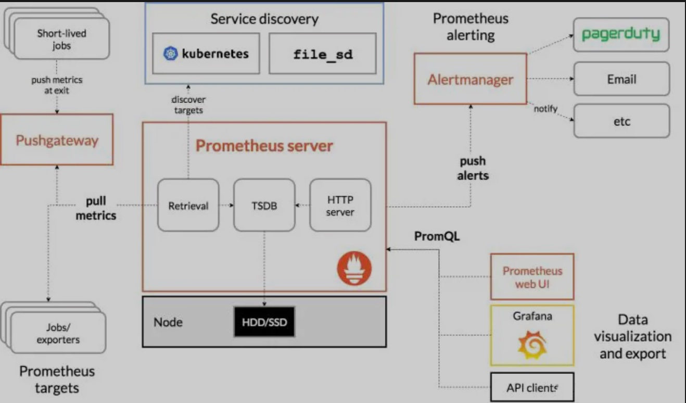

# [prometheus](https://github.com/prometheus/prometheus)

The Prometheus monitoring system and time series database. <https://prometheus.io/>

* SoundCloud 开源的监控告警系统，使用 Golang 开发。2012年开始编码，2015年在Github上开源，2016年加入CNCF成为继K8s之后第二名成员
* 一套开源的监控&报警&时间序列数据库的组合
* 多维数据模型，时序数据由Metric和多个Label组成
* 支持对云或容器的监控，其他系统主要对传统物理机监控
* PromQL灵活查询语法,数据查询语句表现力更强大，内置更强大的统计函数
* 无依赖存储，支持本地和远程存储
* 通过HTTP协议采用PULL的方式拉取数据
* 可以采用服务发现或者静态配置方式，来发现目标服务
* 优点：
  - 支持PromQL（一种查询语言），可以灵活地聚合指标数据
  - 部署简单，只需要一个二进制文件就能跑起来，不需要依赖分布式存储
  - Go语言编写，组件更方便集成在同样是Go编写项目代码中
  - 原生自带WebUI，通过PromQL渲染时间序列到面板上
  - 生态组件众多，Alertmanager，Pushgateway，Exporter

* 监控是基础设施，目的是为了解决问题，不要只朝着大而全去做，尤其是不必要的指标采集，浪费人力和存储资源（To B商业产品例外）
* 需要处理的告警才发出来，发出来的告警必须得到处理
* 简单架构就是最好架构，业务系统都挂了，监控也不能挂。Google SRE 里面也说避免使用 Magic 系统，例如机器学习报警阈值、自动修复之类
* 局限
  - 基于 Metric 的监控，不适用于日志（Logs）、事件（Event）、调用链（Tracing）
  - 默认是 Pull 模型，合理规划你的网络，尽量不要转发
  - 对于集群化和水平扩展，官方和社区都没有银弹，需要合理选择 Federate、Cortex、Thanos 等方案
  - 监控系统一般情况下可用性大于一致性，容忍部分副本数据丢失，保证查询请求成功。这个后面说 Thanos 去重的时候会提到
  - 不一定保证数据准确
    + rate、histogram_quantile 等函数会做统计和推断，产生一些反直觉的结果
    + 查询范围过长要做降采样，势必会造成数据精度丢失，不过这是时序数据的特点，也是不同于日志系统的地方

## 安装

```sh
sudo apt install prometheus

wget https://github.com/prometheus/prometheus/releases/download/v2.19.2/prometheus-2.14.0.linux-amd64.tar.gz
tar xvfz prometheus-*.tar.gz
cd prometheus-*

docker run -p 9090:9090 -v /tmp/prometheus.yml:/etc/prometheus/prometheus.yml prom/prometheus

#
FROM prom/prometheus
ADD prometheus.yml /etc/prometheus/

docker build -t my-prometheus .
docker run -p 9090:9090 my-prometheus

# prometheus.yml
# 全局设置可以被覆盖
global:
  # 默认值为15s，用于设置每次数据拉取的间隔
  scrape_interval: 15s
  # 所有时间序列和告警与外部通信时用的外部标签
  external_labels:
    monitor: 'prometheue-monitor'

# scrape配置
scrape_configs:
# The job name is added as a label `job=<job_name>` to any timeseries scraped from this config.
# jon_name一定要全局唯一
- job_name: 'prometheus'
  # 覆盖全局的 scrape_interval
  scrape_interval: 5s
  # 静态目标的配置 192.168.0.91为本地物理机IP
  static_configs:
  - targets: ['192.168.0.91:9090']

# 校验
./promtool check config prometheus.yml
./prometheus --config.file=prometheus.yml

http://localhost:9090/metrics.
http://localhost:9090/graph.

docker pull prom/prometheus

# Reload配置
kill -HUP {pid}
curl -X POST http://localhost:9090/-/reload
```

## 概念

* Job：Prometheus的采集任务由配置文件中一个个的Job组成，一个Job里包含该Job下的所有监控目标的公共配置，比如使用哪种服务发现去获取监控目标，比如抓取时使用的证书配置，请求参数配置等等。
* Target：一个监控目标就是一个Target，一个Job通过服务发现会得到多个需要监控的Target，其包含一些label用于描述Target的一些属性。
* `relabel_configs`：每个Job都可以配置一个或多个relabel_config，relabel_config会对Target的label集合进行处理，可以根据label过滤一些Target或者修改，增加，删除一些label。relabel_config过程发生在Target开始进行采集之前，针对的是通过服务发现得到的label集合。
* `metrics_relabel_configs`：每个Job还可以配置一个或者多个`metrics_relabel_config`，其配置方式和relabel_configs一模一样，但是其用于处理的是从Target采集到的数据中的label
  - relable和metrics_relable区别，前者在抓取前进行，是Target的属性
* Series：一个Series就是指标名 label集合，在面板中，表现为一条曲线
* head series：Prometheus会将近2小时的Series缓存在内测中，称为head series

## 架构

* Prometheus Server:负责采集和存储监控数据，并且对外提供PromQL实现监控数据的查询、聚合分析，以及告警规则管理
  - Retrieval: 负责定时去暴露的目标服务上去拉取监控Metrics指标数据
  - TSDB: Prometheus 2.0版本起使用的底层存储, 数据块编码使用了facebook的gorilla，具备了完整的持久化方案
  - HTTP Server: 提供HTTP API接口查询监控Metrics数据
* Service discovery: Prometheus支持多种服务发现机制，文件、DNS、Consul、Kubernetes、OpenStack、EC2等等。前提是这些服务需要开放/metrics接口提供数据查询
* Prometheus targets: Prometheus监控目标服务，Prometheus通过轮询这些目标服务拉取监控Metrics数据
  - Job/Exporter属于Prometheus target，是Prometheus监控的对象,分为长时间执行和短时间执行两种。对于长时间执行的Job，可以使用Prometheus Client集成进行监控；对于短时间执行的Job，可以将监控数据推送到Pushgateway中缓存
  - Exporter的机制是将第三方系统的监控数据按照Prometheus的格式暴露出来，没有Exporter的第三方系统可以自己定制Exporter
* Push gateway: 某些场景Prometheus无法直接拉取监控数据，Pushgateway的作用在于提供了中间代理
  - Prometheus是拉模式为主的监控系统，它的推模式就是通过Pushgateway组件实现的
  - 可以在应用程序中定时将监控Metrics数据提交到Pushgateway，Prometheus Server定时从Pushgateway的/metrics接口采集数据
  - Pushgateway是支持临时性Job主动推送指标的中间网关，它本质上是一种用于监控Prometheus服务器无法抓取的资源的解决方案
  - Pushgateway作为一个独立的服务，位于被采集监控指标的应用程序和Prometheus服务器之间。应用程序主动推送指标到Pushgateway，Pushgateway接收指标，然后Pushgateway也作为target被Prometheus服务器抓取
* Prometheus alerting: Prometheus告警，Alertmanager用于管理告警，支持告警通知
* Data visualization:数据可视化展示，通过PromQL对时间序列数据进行查询、聚合以及逻辑运算
  - 除了Prometheus自带的UI，Grafana对Prometheus也提供了非常好的支持
* Alertmanager，简单说Alertmanager是与Prometheus分离的告警组件，主要接收Promethues发送过来的告警事件，然后对告警进行去重，分组，抑制和发送，在实际中可以搭配webhook把告警通知发送到企业微信或钉钉上
* 生产环境中，应用和服务实例数量众多
  - 较好做法是部署多个Prometheus实例，每个实例通过分区只拉取一部分指标，例如Prometheus Relabel配置中的hashmod功能，可以对拉取目标的地址进行hashmod，再将结果匹配自身ID的目标保留
  - 让每个Prometheus拉取一个集群的指标，一样可以用Relabel来完成
* 联邦集群 federation:每个Prometheus都有各自的数据关联起来，建立一个全局的视图
  - 单点问题依然存在，根节点挂了的话查询将会变得不可用，如果配置多个父节点的话又会造成数据冗余和抓取时机导致数据不一致等问题，而且叶子节点目标数量太多时，更加会容易使父节点压力增大以至打满宕机，除此之外规则配置管理也是个大麻烦。
  - [Thanos](../cncf/thanos.md):提供了全局查询视图，可以从多台Prometheus查询和聚合数据，因为所有这些数据均可以从单个端点获取



```yaml
# 每个实例通过分区只拉取一部分指标
relabel_configs:
- source_labels: [__address__]
  modulus:       3
  target_label:  __tmp_hash
  action:        hashmod
- source_labels: [__tmp_hash]
  regex:         $(PROM_ID)
  action:        keep

# 让每个Prometheus拉取一个集群的指标
relabel_configs:
- source_labels:  ["__meta_consul_dc"]
  regex: "dc1"
  action: keep
```

## 原理

* 服务发现
  - 声明配置文件中的scrape_configs来指定Prometheus在运行时需要拉取监控指标目标（Target）
  - 目标实例需要实现一个可以被Prometheus进行轮询的端点
  - 实现一个这样的接口，可以用来给Prometheus提供监控样本数据的独立程序一般被称作为Exporter，比如用来拉取操作系统指标的Node Exporter，会从操作系统上收集硬件指标，供Prometheus来拉取。
  - 在生产环境中，服务实例的IP通常不是固定的，这时候用静态配置就没办法对目标节点进行有效管理，这时候Prometheus提供的服务发现功能便可以有效解决监控节点状态变化的问题，在这种模式下，Prometheus会到注册中心监听查询节点列表，定期对节点进行指标的拉取。
  - 如果对服务发现有更灵活的需求，Prometheus也支持基于文件的服务发现功能，这时候可以从多个注册中心中获取节点列表，再通过自己的需求进行过滤，最终写入到文件，这时候Prometheus检测到文件变化后便能动态地替换监控节点，再去拉取目标了。
  - Pushgateway
    + 用来接收来自服务的主动上报，它适用于那些短暂存活的批量任务来将指标推送并暂存到自身上，借着再由Prometheus来拉取自身，以防止指标还没来得及被Prometheus拉取便退出
    + 也适用于在Prometheus与应用节点运行在异构网络或被防火墙隔绝时，无法主动拉取节点的问题，在这种情况下应用节点可以通过使用Pushgateway的域名将指标推送到Pushgateway实例上，Prometheus就可以拉取同网络下的Pushgateway节点了
    + 注意：Prometheus会把每个指标赋予job和instance标签，当Prometheus拉取Pushgateway时，job和instance则可能分别是Pushgateway和Pushgateway主机的IP，当pushgateway上报的指标中也包含job和instance标签时，Prometheus会把冲突的标签重命名为exported_job和exported_instance，如果需要覆盖这两个标签的话，需要在Prometheus中配置honor_labels: true。
    + 负面影响：
      * Pushgateway被设计为一个监控指标的缓存，这意味着它不会主动过期服务上报的指标，这种情况在服务一直运行的时候不会有问题，但当服务被重新调度或销毁时，Pushgateway依然会保留着之前节点上报的指标。而且，假如多个Pushgateway运行在LB下，会造成一个监控指标有可能出现在多个Pushgateway的实例上，造成数据重复多份，需要在代理层加入一致性哈希路由来解决
      * 在拉模式下，Prometheus可以更容易的查看监控目标实例的健康状态，并且可以快速定位故障，但在推模式下，由于不会对客户端进行主动探测，因此对目标实例的健康状态也变得一无所知
* 采集
  - 周期性得从要拉取的目标（应用容器和Pushgateway）发起HTTP请求到特定的端点（Metric Path）
  - 为这些target创建采集循环，按配置文件里配置的采集间隔进行周期性拉取，采集到数据根据Job中的metrics_relabel_configs进行relabel，然后再加入上边得到的target最终label集合，综合后得到最终的数据
  - 定期通过PromQL计算设置好的告警规则，决定是否生成告警到Alertmanager，后者接收到告警后会负责把通知发送到邮件或企业内部群聊中。
* 存储
  - relabel：当服务发现得到所有target后，Prometheus会根据job中的relabel_configs配置对target进行relabel操作，得到target最终的label集合
  - 将采集的样本放到内存中，默认每隔2小时将数据压缩成一个block，持久化到硬盘中，样本的数量越多，Prometheus占用的内存就越高
  - 不建议用区分度（cardinality）太高的标签，比如：用户IP，ID，URL地址等等，否则结果会造成时间序列数以指数级别增长（label数量相乘）
  - 除了控制样本数量和大小合理之外，还可以通过降低storage.tsdb.min-block-duration来加快数据落盘时间和增加scrape interval的值提高拉取间隔来控制Prometheus的占用内存
* 查询高可用：通过水平扩展+统一查询视图的方式解决
* 存储高可用
  - 提供了Remote Read和Remote Write功能，支持把Prometheus的时间序列远程写入到远端存储中，查询时可以从远端存储中读取数据
  - M3DB是一个分布式的时间序列数据库，它提供了Prometheus的远程读写接口，当一个时间序列写入到M3DB集群后会按照分片（Shard）和复制（Replication Factor）参数把数据复制到集群的其他节点上，实现存储高可用
  - 支持InfluxDB、OpenTSDB等作为远程写的端点

## 配置

* 配置文件是YAML格式，启动的时候可以加载运行参数-config.file指定配置文件，默认为prometheus.yml
* 不同占位符含义
  - <boolean>: 布尔值，值为true或false
  - <duration>: 时间字段，必须匹配正则表达式[0-9]+(ms|[smhdwy])
  - <labelname>: 标签名称，值为字符串必须匹配正则表达式[a-zA-Z_][a-zA-Z0-9_]*
  - <labelvalue>: 标签值，值为Unicode字符串
  - <filename>: 文件路径
  - <host>: 主机名
  - <path>: URL路径
  - <scheme>: HTTP或HTTPS
  - <string>: 常规字符串值
  - <secret>: 密码字符串
  - <tmpl_string>: template扩展的字符串
* 属性
  - global用于Prometheus全局默认配置，它主要包含以下4个配置项
    + scrape_interval: 拉取目标服务Metrics监控数据时间间隔
    + scrape_timeout: 拉取目标服务Metrics监控数据超时时间
    + evaluation_interval: 执行rules时间间隔。
    + external_labels: 额外的labels，会被添加到每条时序数据上
  - rule_files用于配置Alert Rules文件列表，支持配置多个文件以及文件目录
  - scrape_configs用于配置拉取目标服务Metrics监控数据，每一个拉取配置包含以下配置项
    + job_name: 拉取任务名称
    + scrape_interval: 拉取时间间隔，没有配置使用global scrape_interval配置
    + scrape_timeout: 拉取超时时间，没有配置使用global scrape_timeout配置
    + metrics_path: 拉取目标服务Metrics数据的path，默认为/metrics
    + honor_labels: 是否要解决labels冲突问题，设置为true以拉取数据为准，否则以配置为准
    + scheme: 请求协议，默认为HTTP
    + params: 拉取Metrics数据请求参数
    + basic_auth: 请求鉴权配置
    + kubernetes_sd_configs: K8s服务发现配置
    + static_configs: 静态配置目标服务
    + metric_relabel_configs: 重置Metrics标签
  - alerting用于告警配置，主要有以下2个配置项
    + alert_relabel_configs: 动态修改alert的配置规则
    + alertmanagers: 动态发现Alertmanager的配置

```yaml
global:
   # How frequently to scrape targets by default.
   [ scrape_interval: <duration> | default = 1m ]
   # How long until a scrape request times out.
   [ scrape_timeout: <duration> | default = 10s ]
   # How frequently to evaluate rules.
   [ evaluation_interval: <duration> | default = 1m ]
   # The labels to add to any time series or alerts when communicating with
   # external systems (federation, remote storage, Alertmanager).
   external_labels:
     [ <labelname>: <labelvalue> ... ]

# Rule files specifies a list of globs. Rules and alerts are read from
# all matching files.
rule_files:
   [ - <filepath_glob> ... ]

# A list of scrape configurations.
scrape_configs:
# The job name assigned to scraped metrics by default.
- job_name: <job_name>
  # How frequently to scrape targets from this job.
  [ scrape_interval: <duration> | default = <global_config.scrape_interval> ]

  # Per-scrape timeout when scraping this job.
  [ scrape_timeout: <duration> | default = <global_config.scrape_timeout> ]

  # The HTTP resource path on which to fetch metrics from targets.
  [ metrics_path: <path> | default = /metrics ]

  # honor_labels controls how Prometheus handles conflicts between labels that are
  # already present in scraped data and labels that Prometheus would attach
  # server-side ("job" and "instance" labels, manually configured target
  # labels, and labels generated by service discovery implementations).

  # If honor_labels is set to "true", label conflicts are resolved by keeping label
  # values from the scraped data and ignoring the conflicting server-side labels.

  # If honor_labels is set to "false", label conflicts are resolved by renaming
  # conflicting labels in the scraped data to "exported_<original-label>" (for
  # example "exported_instance", "exported_job") and then attaching server-side
  # labels. This is useful for use cases such as federation, where all labels
  # specified in the target should be preserved.

  # Note that any globally configured "external_labels" are unaffected by this
  # setting. In communication with external systems, they are always applied only
  # when a time series does not have a given label yet and are ignored otherwise.
    [ honor_labels: <boolean> | default = false ]

  # Configures the protocol scheme used for requests.
  [ scheme: <scheme> | default = http ]

  # Optional HTTP URL parameters.
  params:
    [ <string>: [<string>, ...] ]

  # Sets the `Authorization` header on every scrape request with the
  # configured username and password.
  basic_auth:
    [ username: <string> ]
    [ password: <string> ]

  # Sets the `Authorization` header on every scrape request with
  # the configured bearer token. It is mutually exclusive with `bearer_token_file`.
  [ bearer_token: <string> ]

  # Sets the `Authorization` header on every scrape request with the bearer token
  # read from the configured file. It is mutually exclusive with `bearer_token`.
  [ bearer_token_file: /path/to/bearer/token/file ]

  # Configures the scrape request's TLS settings.
  tls_config:
    [ <tls_config> ]

  # Optional proxy URL.
  [ proxy_url: <string> ]

  # List of Kubernetes service discovery configurations.
  # you can set oterh sd configs
  kubernetes_sd_configs:
    [ - <kubernetes_sd_config> ... ]

  # List of labeled statically configured targets for this job.
  static_configs:
    [ - <static_config> ... ]

  # List of target relabel configurations.
  relabel_configs:
    [ - <relabel_config> ... ]

  # List of metric relabel configurations.
  metric_relabel_configs:
    [ - <relabel_config> ... ]

  # Per-scrape limit on number of scraped samples that will be accepted.
  # If more than this number of samples are present after metric relabelling
  # the entire scrape will be treated as failed. 0 means no limit.
  [ sample_limit: <int> | default = 0 ]

# Alerting specifies settings related to the Alertmanager.
alerting:
   alert_relabel_configs:
      [ - <relabel_config> ... ]
   alertmanagers:
      [ - <alertmanager_config> ... ]

# Settings related to the experimental remote write feature.
remote_write:
   [ - <remote_write> ... ]

# Settings related to the experimental remote read feature.
remote_read:
   [ - <remote_read> ... ]
```

```yaml
# 实例
global:
   scrape_interval:     15s
   evaluation_interval: 30s
   # scrape_timeout is set to the global default (10s).

   external_labels:
     monitor: codelab
     foo:     bar

rule_files:
    - "rules/node.rules"
    - "rules2/*.rules"

scrape_configs:
    - job_name: 'prometheus'
      scrape_interval: 5s
      static_configs:
      - targets: ['127.0.0.1:9090']

    - job_name: 'node'
      scrape_interval: 8s
      static_configs:
      - targets: ['127.0.0.1:9100', '127.0.0.12:9100']

    - job_name: 'mysqld'
      static_configs:
      - targets: ['127.0.0.1:9104']

    - job_name: 'memcached'
      static_configs:
      - targets: ['127.0.0.1:9150']
alerting:
  alertmanagers:
  - scheme: https
    static_configs:
    - targets:
      - "1.2.3.4:9093"
      - "1.2.3.5:9093"
      - "1.2.3.6:9093"
```

## TSDB

* 作为 Prometheus 的存储引擎完美契合了监控数据的应用场景
  - 存储的数据量级十分庞大
  - 大部分时间都是写入操作
  - 写入操作几乎是顺序添加，大多数时候数据到达后都以时间排序
  - 写操作很少写入很久之前的数据，也很少更新数据。大多数情况在数据被采集到数秒或者数分钟后就会被写入数据库
  - 删除操作一般为区块删除，选定开始的历史时间并指定后续的区块。很少单独删除某个时间或者分开的随机时间的数据
  - 基本数据大，一般超过内存大小。一般选取的只是其一小部分且没有规律，缓存几乎不起任何作用
  - 读操作是十分典型的升序或者降序的顺序读
  - 高并发的读操作十分常见
* 索引
  - Series
    + 一部分是按照字典序的排列的所有标签键值对序列（series）
    + 时间线到数据文件的索引，按照时间窗口切割存储数据块记录的具体位置信息，因此在查询时可以快速跳过大量非查询窗口的记录数据
  - Label Index:每对 label 会以 index:label: 为 key，存储该标签所有值的列表，并通过引用指向 Series 该值的起始位置
  - Time Index:数据会以 index:timeseries:: 为 key，指向对应时间段的数据文件

* 时间序列:以时间维度存储连续的数据集合,格式类似于（timestamp，value）这种格式，即一个时间点拥有一个对应值,`<metric name>{<label name>=<label value>, ...}`,每一个点称之为样本，由三部分组成：
  - 指标：由指标名称和描述指标的级别组成的
    + 底层实现中以__name__=<metric name>的形式保存在数据库中的
    + 拥有唯一的标签集的metric
  - 时间戳：一个精确到毫秒级别的时间戳
  - 值：一个float64位的值
+ Metric name: 统计指标名称，名称应该具有语义化
  - 必须满足正则表达式 `[a-zA-Z_:][a-zA-Z0-9_:]*`
  - 使用前缀表示特定服务，例如prometheus_notifications_total表示Prometheus服务，http_request_duration_seconds表示HTTP服务
  - 使用后缀来表示监控数值的单位，例如http_request_duration_seconds和node_memory_usage_bytes，http_requests_total
  - 使用基本单位，例如seconds，bytes，meters
  - 最好使用单个单位，不要使用多个单位，例如不要混淆seconds 和 bytes
  - 不应该把label名称放在metrics名称上
  - 使用基础Unit（如seconds而非milliseconds）
  - 指标名以application namespace作为前缀，如：
    + process_cpu_seconds_total
    + http_request_duration_seconds
  - 用后缀来描述Unit，如：
    + http_request_duration_seconds
    + node_memory_usage_bytes
    + http_requests_total
    + process_cpu_seconds_total
    + foobar_build_info
+ Metrics 类型
  * Counter 计数器指标:一个只能递增的数值（服务重启的时候会被reset为0）。用于统计服务的请求数、任务完成数、错误出现的次数等
  * Gauge 仪表盘指标:表示一个既可以递增,又可以递减的值。主要用于统计类似于温度、当前内存使用量等会上下浮动的指标
  * histogram 柱状图:系统会自动生成三个对应指标
    - 对每个采样点进行统计，打到各个分类桶中(bucket)
    - 对每个采样点值累计和(sum)
    - 对采样点的次数累计和(count)
  * summary:采样点分位图统计(通常的使用场景：请求持续时间和响应大小)，Prometheus系统会自动生成三个对应的指标
    - 对于每个采样点进行统计，并形成分位图
    - 统计所有采样点的和
    - 统计所有采样点总数
  - Labels: 标签是一组Key-Value，labels让Prometheus数据具有多个维度。例如可以用{hostname=”…”,type=”…“}这个标签来区分不同的时序数据
    + 标签的命名应该具有语义化
    + 满足正则表达式[a-zA-Z_][a-zA-Z0-9_]*
    + 所有_开头的标签名被Prometheus内部保留使用。
  - Value: 实际的时序数据值，包括一个float64值和一个毫秒级时间戳
* 拉取每一个目标服务实例称为instance，所有相同服务实例称为Job，Prometheus拉取目标服务监控Metric数据的时候，会自动添加job和instance两个标签
  - job: 值为prometheus.yml配置的job名称
  - instance: 值为服务实例的host:port
  - 自动生成以下4个Metrics数据
    + `up{job="{job-name}", instance="{host:port}"}`: 用来反馈目标服务监控状态，值为1表示服务健康，否则表示服务不通。
    + `scrape_duration_seconds{job="{job-name}", instance="{host:port}"}`: 拉取监控Metrics数据时间开销。
    + `scrape_samples_post_metric_relabeling{job="{job-name}", instance="{host:port}"}`:labels变化后，仍然剩余的监控数据条数
    + `scrape_samples_scraped{job="{job-name}", instance="{host:port}"}`: 拉取监控Metrics数据的条数。
* 内置PromQL，用户可以实时的查询和聚合时序数据，计算结果可以通过Expression Browser、Grafana展示，也可以通过HTTP API请求获取
* 结果类型
  - 向量 vector:按照时间戳和值存放的序列
  - 每一组唯一的标签集合对应着一个唯一向量（vector），也可叫做一个时间序列（Time Serie）
  - Instant vector: 即时向量，一时间点的一组时序数据
    + 当在某一个时间点来看它时是一个瞬时向量（Instant Vector），瞬时向量的时序只有一个时间点以及它对于的一个值
  - Range vector: 范围向量，一个时间段内的一组时序数据
    + 在一个时间段来看它时，它是一个范围向量（Range Vector），范围向量对于着一组时序数据
  - Scalar: 标量，一个浮点数值
  - String: 一个字符串，目前未使用
* [PromQL](https://mp.weixin.qq.com/s/ESzq9_wtO-ezxnRp1HAtnw)
  - 查询http_requests_total所有数据: http_requests_total
  - 条件查询
    + =: 等于条件，例如 http_requests_total{environment="test",method="Get"}
    + !=: 不等于条件，例如 http_requests_total{environment!=”test”}
  - 模糊查询
    + 查询http_requests_total environment label值匹配`t.*`正则的时序数据  http_requests_total{environment=~"t.*"}
    + 查询http_requests_total environment label值不匹配`t.*`正则的时序数据 http_requests_total{environment!~"t.*"}
  - 区间查询
    + http_requests_total{environment="test", method="Get"}[10s]
    + s: 秒 m: 分 h: 时 d: 天 w: 周 y: 年
    + 时间位移：选择一个参考点，上面的范围查询都是使用的是当前的时间值，位移操作的关键字为offset http_request_total{}[1d] offset 1d
  * 瞬时数据:返回最近的一条http_request_total{}
  - 运算符 + - * / % ^
    + 如果是瞬时向量与瞬时向量之间进行数学运算时，左边向量元素匹配（标签完全一致）右边向量元素，如果没找到匹配元素，则直接抛弃
    + `{device="sda",instance="localhost:9100",job="node_exporter"}=>1634967552@1518146427.807 + 864551424@1518146427.807`
    + `{device="sdb",instance="localhost:9100",job="node_exporter"}=>0@1518146427.807 + 1744384@1518146427.807`
  - 瞬时向量与标量进行布尔运算时，PromQL依次比较向量中的所有时间序列样本的值，如果比较结果为true则保留，反之丢弃
  - 集合运行
    + vector1 and vector2 会产生一个由vector1的元素组成的新的向量。该向量包含vector1中完全匹配vector2中的元素组成
    + vector1 or vector2 会产生一个新的向量，该向量包含vector1中所有的样本数据，以及vector2中没有与vector1匹配到的样本数据
    + vector1 unless vector2 会产生一个新的向量，新向量中的元素由vector1中没有与vector2匹配的元素组成
  - 聚合查询：用于即时向量聚合操作 <aggr-op>([parameter,] <vector expression>) [without|by (<label list>)]
    + sum: 求和 sum(http_requests_total){environment="test"}
    + min: 求最小值
    + max: 求最大值
    + avg: 求平均值
    + stddev: 求标准差
    + stdvar: 求标准差异
    + count: 计数 count(http_requests_total{environment="test"})
    + count_values: 相同数据值计数 count_values("total_request",http_requests_total{environment="test"})
    + bottomk: 最小k个数
    + topk: 最大k个数 topk(3, http_requests_total)
    + quantile: 分布统计
  * 向量匹配模式
    - 向量与向量之间运算时会基于默认的匹配规则，依次找到右边边向量元素和左边向量元素匹配(标签完全一致)的进行运算，不匹配则丢弃
    - 一对一（one to one） 会从操作符两边获取瞬时向量依次比较并找到唯一匹配的样本值 `vector1 <operator> vector2`,作符两边表达式标签不一致的情况下
      + on(label list) 将匹配行为限定在某些便签之内 method_code:http_errors:rate5m{code="500"} / ignoring(code) method:http_requests:rate5m
      + ignoring(label list）在匹配时忽略某些便签
    - 多对一和一对多:“一”侧的每一个向量元素可以与”多”侧的多个元素匹配的情况,必须使用group修饰符：group_left或者group_right来确定哪一个向量具有更高的基数（充当“多”的角色）
      + method_code:http_errors:rate5m / ignoring(code) group_left method:http_requests:rate5m
      + <vector expr> <bin-op> ignoring(<label list>) group_right(<label list>) <vector expr>
      + <vector expr> <bin-op> on(<label list>) group_left(<label list>) <vector expr>
      + <vector expr> <bin-op> on(<label list>) group_right(<label list>) <vector expr>
  - 函数计算
    + 计算Counter类型的指标增长率
      * rate(range vector):用于计算过去一段时间每秒平均值，取指定时间范围内所有数据点，算出一组速率，然后取平均值作为结果。仅适用于counter类型数据，适合缓慢变化的数据分析。`sum(rate(http_requests_total{environment="release"}[2m]))`
      * increase(v range-vector)函数：获取区间向量的增长量
      * irate(range vector):用于计算过去一段时间每秒平均值，取指定时间范围内最近两个数据点来算速率，然后作为结果。仅适用于counter类型数据，适合快速变化的数据分析。`sum(rate(http_requests_total{environment="release"}[2m])) by (method)`
    + 预测Gauge指标变化趋势
      * predict_linear(v range-vector, t scalar)函数：基于简单的线性回归的方式进行t秒后的v值的预测
    + 过去10分钟内第90个百分位数:`histogram_quantile(0.9, rate(employee_age_bucket_bucket[10m]))`

```
<!-- 瞬时向量 -->
http_requests{host="host1",service="web",code="200",env="test"}
<!-- 范围向量 -->
http_requests{host="host1",service="web",code="200",env="test"}[:5m]

<--------------- metric="" ---------------------=""><-timestamp -=""><-value->
http_request_total{status=”200”, method=”GET”}@1434417560938 => 94355

# 总请求
sum(http_requests_total{label1=value1, label2=value2 ...})
# 每秒请求量
sum(rate(http_requests_total{label1=value1, label2=value2 ...}[5m]))
# 请求量Top 10的URI
topk(10, sum(http_requests_total{label1=value1, label2=value2 ...}) by (path))

# 总的buffer
sum(buffer_total_bytes{label1=value1, label2=value2 ...})
# buffer按label分类
sum(buffer_total_bytes{label1=value1, label2=value2 ...}) by (label)

# 总次数
http_requests_latency_seconds_histogram_count{label1=value1, label2=value2 ...}
# 总和
http_requests_latency_seconds_histogram_sum{label1=value1, label2=value2 ...}

# http请求响应时间 <=0.005 秒的请求次数
http_requests_latency_seconds_histogram_bucket{le="0.005", label1=value1, label2=value2 ...}
# http请求响应时间 <=0.01 秒的请求次数
http_requests_latency_seconds_histogram_bucket{le="0.01", label1=value1, label2=value2 ...}

job: api-server
  instance 1：1.2.3.4:5670
  instance 2：1.2.3.4:5671
  instance 3：5.6.7.8:5670
  instance 4：5.6.7.8:5671
```

## 数据计算

## Storage

* 支持把时序数据存储在本地存储和远程存储介质
* 本地存储:每2个小时数据放在同一个block，一个block包含一个或多个chunk文件，当前block数据是在内存里面 这里存在一个问题: 如果当前2个小时数据很多，会导致Prometheus server服务性能变差，在Grafana上查询的时候会很慢很卡

## 监控 K8S

* Prometheus和Kubernets都属于CNCF成员项目，推荐使用Prometheus来监控Kubernets集群。传统的监控系统需要集群所有服务器将监控数据发往监控系统，Prometheus则可以通过服务发现来发现K8s集群内部已经暴露的监控点，然后主动拉取数据。
* 只需要在K8s集群中部署一份Prometheus实例，它就可以通过向Apiserver查询集群状态，然后向所有已经支持Prometheus metrics的kubelet 获取所有Pod的运行数据。这种动态发现的架构，非常适合服务器和程序都不固定的K8s集群环境。
* Prometheus和K8s集成目前支持5种服务发现的模式
  - Node 从K8s集群各节点kubelet组件，获取节点kubelet的基本运行状态的监控指标 从K8s集群各节点kubelet内置的cAdvisor，获取节点中运行的容器的监控指标 从K8s集群各节点Node Exporter，获取节点运行资源相关的监控指标
  - Pod 从Pod实例中采集业务应用自定义监控指标
  - Endpoints 从K8s集群API Server组件，获取K8s集群相关的运行监控指标
  - Service 从K8s集群Service的访问地址，通过Blackbox Exporter获取网络探测指标
  - Ingress 从K8s集群Ingress的访问信息，通过Blackbox Exporter获取网络探测指标
* 配置
  - __address__ label将会被设置为instance
  - __meta__开头的label是由Prometheus服务发现设置的，在relabel过程都可以使用
  - relabel结束后__开头的所有label都会被删除
  - role: 服务发现的模式
  - ca_file: CA证书路径
  - tls_config: SSL/TLS配置
  - bearer_token_file: token文件路径
  - kubernetes_sd_configs: 服务发现配置
  - relabel_configs: labels重写配置，比较重要的配置
* 部署K8s prometheus configmap
  - 创建kube-prometheus ns:`kubectl create namespace kube-prometheus`
  - 创建configmap:`kubectl apply -f prometheus-configmap-v1.0.0.yml`
  - 查看configmap:`kubectl get cm -n kube-prometheus`
* 把Prometheus Deployment相关的Pod抽象成Service，方便其它Pod访问，同时为了外网也能够访问Prometheus服务我们在Service之上加一层Ingress。
  - Service配置文件详解
    + metadata.name: service名称为prometheus-service
    + spec.selector: 选择label为app=prometheus-deployment相关的Pod
    + spec.ports.port: 开放9090端口，默认和targetPort一样
    + spec.ports.targetPort: 后端Prometheus Pod对应的端口为9090
  - Ingress配置文件详解
    + metadata.name: ingress名称为prometheus-ingress
    + spec.rules.host: k8s.prometheus.com 配置访问域名 (需要本地配置hosts绑定到nginx-ingress-controller任一节点上)
    + spec.rules.http.paths.backend.serviceName: 后端对应的service名称
    + spec.rules.http.paths.backend.servicePort: 后端对应的service端口
  - 部署Service和Ingress
    + kubectl apply -f prometheus-service-v1.0.0.yml
  - 直接访问<http://k8s.prometheus.com/graph即可访问Prometheus> web UI界面

```yaml
# prometheus-kubernetes.yml
apiVersion: v1
kind: ConfigMap
metadata:
  name: prometheus-config-v1.0.0
  namespace: kube-prometheus
  labels:
    k8s-app: prometheus-config
data:
  prometheus.yml: |
    global:
      # 数据拉取时间间隔，默认15s
      scrape_interval: 15s
      # 数据拉取超时时间，默认15s
      scrape_timeout: 15s

    scrape_configs:
    # Scrape config for prometheus
    - job_name: 'prometheus'
      static_configs:
        - targets: ['localhost:9090']

    # Scrape config for API servers
    - job_name: 'kubernetes-apiservers'
      scheme: https
      tls_config:
        ca_file: /var/run/secrets/kubernetes.io/serviceaccount/ca.crt
      bearer_token_file: /var/run/secrets/kubernetes.io/serviceaccount/token
      kubernetes_sd_configs:
      - role: endpoints
      relabel_configs:
      - source_labels: [__meta_kubernetes_namespace, __meta_kubernetes_service_name, __meta_kubernetes_endpoint_port_name]
        action: keep
        regex: default;kubernetes;https

    # Scrape config for nodes (kubelet)
    - job_name: 'kubernetes-nodes'
      scrape_interval: 30s
      scrape_timeout: 10s
      metrics_path: /metrics
      scheme: https
      tls_config:
        ca_file: /var/run/secrets/kubernetes.io/serviceaccount/ca.crt
      bearer_token_file: /var/run/secrets/kubernetes.io/serviceaccount/token
      kubernetes_sd_configs:
      - api_server: https://localhost:6443
        role: node
        tls_config:
          cert_file: /etc/kubernetes/ssl/xxxx.pem   #根据实际做替换
          key_file: /etc/kubernetes/ssl/xxxx.pem    #根据实际做替换
          insecure_skip_verify: true
      relabel_configs:
      - separator: ;
        regex: __meta_kubernetes_node_label_(.+)
        replacement: $1
        action: labelmap
      - separator: ;
        regex: (.*)
        target_label: __address__
        replacement: pre.kubernetes.m.com:6443
        action: replace
      - source_labels: [__meta_kubernetes_node_name]
        separator: ;
        regex: (.+)
        target_label: __metrics_path__
        replacement: /api/v1/nodes/${1}/proxy/metrics
        action: replace

    # Scrape config for Kubelet cAdvisor
    - job_name: kubernetes-cadvisor
      scrape_interval: 30s
      scrape_timeout: 10s
      metrics_path: /metrics
      scheme: http
      kubernetes_sd_configs:
      - api_server: https://localhost:6443
        role: node
        tls_config:
          cert_file: /etc/kubernetes/ssl/xxxx.pem     #根据实际做替换
          key_file: /etc/kubernetes/ssl/xxxx-key.pem  #根据实际做替换
          insecure_skip_verify: true
      tls_config:
        cert_file: /etc/kubernetes/ssl/xxxx.pem   #根据实际做替换
        key_file: /etc/kubernetes/ssl/xxxx.pem    #根据实际做替换
        insecure_skip_verify: true
      relabel_configs:
      - source_labels: [__address__]
        separator: ;
        regex: (.*):10250
        target_label: __address__
        replacement: ${1}:4194
        action: replace
      - source_labels: [__meta_kubernetes_node_address_InternalIP]
        separator: ;
        regex: (.*)
        target_label: ip
        replacement: $1
        action: replace

    # Scrape config for service endpoints
    - job_name: kubernetes-service-endpoints
      scrape_interval: 30s
      scrape_timeout: 10s
      metrics_path: /metrics
      scheme: http
      kubernetes_sd_configs:
      - api_server: https://localhost:6443
        role: endpoints
        tls_config:
          cert_file: /etc/kubernetes/ssl/xxxx.pem     #根据实际做替换
          key_file: /etc/kubernetes/ssl/xxxx.pem      #根据实际做替换
          insecure_skip_verify: true
      tls_config:
        cert_file: /etc/kubernetes/ssl/xxxx.pem     #根据实际做替换
        key_file: /etc/kubernetes/ssl/xxxx.pem      #根据实际做替换
        insecure_skip_verify: true
      relabel_configs:
      - source_labels: [__meta_kubernetes_service_annotation_prometheus_io_scrape]
        separator: ;
        regex: "true"
        replacement: $1
        action: keep
      - source_labels: [__meta_kubernetes_service_annotation_prometheus_io_scheme]
        separator: ;
        regex: (https?)
        target_label: __scheme__
        replacement: $1
        action: replace
      - source_labels: [__meta_kubernetes_service_annotation_prometheus_io_path]
        separator: ;
        regex: (.+)
        target_label: __metrics_path__
        replacement: $1
        action: replace
      - source_labels: [__address__, __meta_kubernetes_service_annotation_prometheus_io_port]
        separator: ;
        regex: ([^:]+)(?::\d+)?;(\d+)
        target_label: __address__
        replacement: $1:$2
        action: replace
      - separator: ;
        regex: __meta_kubernetes_service_label_prometheus_(.+)
        replacement: $1
        action: labelmap
      - separator: ;
        regex: prometheus_(.+)
        replacement: $1
        action: labelmap
      - source_labels: [__meta_kubernetes_namespace]
        separator: ;
        regex: (.*)
        target_label: namespace
        replacement: $1
        action: replace

    # Scrape config for probing services via the Blackbox Exporter
    - job_name: 'kubernetes-services'
      metrics_path: /probe
      params:
        module: [http_2xx]
      kubernetes_sd_configs:
      - role: service
      relabel_configs:
      - source_labels: [__meta_kubernetes_service_annotation_prometheus_io_probe]
        action: keep
        regex: true
      - source_labels: [__address__]
        target_label: __param_target
      - target_label: __address__
        replacement: blackbox
      - source_labels: [__param_target]
        target_label: instance
      - action: labelmap
        regex: __meta_kubernetes_service_label_(.+)
      - source_labels: [__meta_kubernetes_service_namespace]
        target_label: kubernetes_namespace
      - source_labels: [__meta_kubernetes_service_name]
        target_label: kubernetes_name

    # Scrape config for Pod
    - job_name: kubernetes-pods
      scrape_interval: 30s
      scrape_timeout: 10s
      metrics_path: /metrics
      scheme: http
      kubernetes_sd_configs:
      - api_server: https://localhost:6443
        role: pod
        tls_config:
          cert_file: /etc/kubernetes/ssl/xxxx.pem
          key_file: /etc/kubernetes/ssl/xxxx.pem
          insecure_skip_verify: true
      tls_config:
        cert_file: /etc/kubernetes/ssl/xxxx.pem
        key_file: /etc/kubernetes/ssl/xxxx.pem
        insecure_skip_verify: true
      relabel_configs:
      - source_labels: [__meta_kubernetes_pod_annotation_prometheus_io_scrape]
        separator: ;
        regex: "true"
        replacement: $1
        action: keep
      - source_labels: [__meta_kubernetes_pod_annotation_prometheus_io_scheme]
        separator: ;
        regex: (https?)
        target_label: __scheme__
        replacement: $1
        action: replace
      - source_labels: [__meta_kubernetes_pod_annotation_prometheus_io_path]
        separator: ;
        regex: (.+)
        target_label: __metrics_path__
        replacement: $1
        action: replace
      - source_labels: [__address__, __meta_kubernetes_pod_annotation_prometheus_io_port]
        separator: ;
        regex: ([^:]+)(?::\d+)?;(\d+)
        target_label: __address__
        replacement: $1:$2
        action: replace
      - separator: ;
        regex: __meta_kubernetes_pod_label_(.+)
        replacement: $1
        action: labelmap
      - source_labels: [__meta_kubernetes_namespace]
        separator: ;
        regex: (.*)
        target_label: kubernetes_namespace
        replacement: $1
        action: replace
      - source_labels: [__meta_kubernetes_pod_name]
        separator: ;
        regex: (.*)
        target_label: kubernetes_pod_name
        replacement: $1
        action: replace
      - separator: ;
        regex: prometheus_(.+)
        replacement: $1
        action: labelmap

# prometheus-service-v1.0.0.yml
apiVersion: v1
kind: Service
metadata:
  name: prometheus-service
  namespace: kube-prometheus
  labels:
    k8s-app: prometheus-service
spec:
  selector:
    app: prometheus-deployment
  ports:
    - protocol: TCP
      port: 9090
      targetPort: 9090

---
apiVersion: extensions/v1beta1
kind: Ingress
metadata:
  name: prometheus-ingress
  namespace: kube-prometheus
  labels:
    k8s-app: prometheus-ingress
spec:
  rules:
  - host: k8s.prometheus.com
    http:
      paths:
      - path: /
        backend:
          serviceName: prometheus-service
          servicePort: 9090
```

## 单集群监控方案

* 指标

## Exporter

* Kubernetes 生态的组件都会提供 /metric 接口以提供自监控，这里列下：
  - cAdvisor：集成在 Kubelet 中。
  - kubelet：10255 为非认证端口，10250 为认证端口。
  - apiserver：6443 端口，关心请求数、延迟等。
  - scheduler：10251 端口。
  - controller-manager：10252 端口。
  - etcd：如 etcd 写入读取延迟、存储容量等。
  - Docker：需要开启 experimental 实验特性，配置 metrics-addr，如容器创建耗时等指标。
  - kube-proxy：默认 127 暴露，10249 端口。外部采集时可以修改为 0.0.0.0 监听，会暴露：写入 iptables规则的耗时等指标

* Kube-state-metrics：采集 Pod、Deployment 等资源的元信息。监控Kubernetes资源的状态，比如Pod的状态。原理是将Kubernetes中的资源，转换成Prometheus的指标，让Prometheus来采集。比如Pod的基本信息，Serivce的基本信息
* Node-exporter：监控Kubernetes节点的基本状态，这个组件以DeamonSet的方式部署，每个节点一个，用于提供节点相关的指标，比如节点的cpu使用率，内存使用率、磁盘等等
* cAdvisor：这个组件目前已经整合到kubelet中了，它提供的是每个容器的运行时指标，比如一个容器的CPU使用率，内存使用率等等
* blackbox_exporter：网络探测，DNS、ping、http 监控。
* process-exporter：采集进程指标。
* NVIDIA Exporter：有 GPU 任务，需要 GPU 数据监控。
* node-problem-detector NPD:准确的说不是 Exporter，但也会监测机器状态，上报节点异常打 taint。
* [mysqld_exporter](https://mp.weixin.qq.com/s?__biz=MzA4MzIwNTc4NQ==&mid=2247484416&idx=1&sn=d50181385ea816fe660af861e15674f6&chksm=9ffb4ff6a88cc6e0ecddcd1ee0108b283ee06ff376ba5d0acd11010232832e62fc8902024787)

* 服务状态：Status->Targets

```sh
wget https://github.com/prometheus/node_exporter/releases/download/v0.14.0/node_exporter-0.14.0.linux-amd64.tar.gz
tar xvf node_exporter-0.14.0.linux-amd64.tar.gz /usr/local/
nohup /usr/local/node_exporter-0.14.0.linux-amd64/node_exporter &

wget https://github.com/prometheus/mysqld_exporter/releases/download/v0.10.0/mysqld_exporter-0.10.0.linux-amd64.tar.gz
tar xvf mysqld_exporter-0.10.0.linux-amd64.tar.gz /usr/local/

GRANT REPLICATION CLIENT,PROCESS ON *.* TO 'mysql_monitor'@'localhost' identified by 'mysql_monitor';
GRANT SELECT ON *.* TO 'mysql_monitor'@'localhost';

# /usr/local/mysqld_exporter-0.10.0.linux-amd64/.my.cnf
[client]
user=mysql_monitor
password=mysql_monitor

nohup /usr/local/mysqld_exporter-0.10.0.linux-amd64/mysqld_exporter --config.my-cnf="/usr/local/mysqld_exporter-0.10.0.linux-amd64/.my.cnf" &
./mysqld_exporter --config.my-cnf=/usr/local/prometheus-2.17.2.linux-amd64/exporters/mysqld_exporter-0.12.1.linux-amd64/.my.conf

# /etc/systemd/system/mysql_exporter.service
[Unit]
Description=mysql Monitoring System
Documentation=mysql Monitoring System

[Service]
ExecStart=/opt/mysqld_exporter-0.10.0.linux-amd64/mysqld_exporter \
         -collect.info_schema.processlist \
         -collect.info_schema.innodb_tablespaces \
         -collect.info_schema.innodb_metrics  \
         -collect.perf_schema.tableiowaits \
         -collect.perf_schema.indexiowaits \
         -collect.perf_schema.tablelocks \
         -collect.engine_innodb_status \
         -collect.perf_schema.file_events \
         -collect.info_schema.processlist \
         -collect.binlog_size \
         -collect.info_schema.clientstats \
         -collect.perf_schema.eventswaits \
         -config.my-cnf=/opt/mysqld_exporter-0.10.0.linux-amd64/.my.cnf

[Install]
WantedBy=multi-user.target
```

* Kubernetes 集群运行中需要关注核心组件的状态、性能。如 kubelet、apiserver 等，基于上面提到的 Exporter 的指标，可以在 Grafana 中绘制图表 Grafana Dashboards for Kubernetes Administrators
* 采集组件 All in One： Prometheus 体系中 Exporter 都是独立的，每个组件各司其职，如机器资源用 Node-Exporter，GPU 有Nvidia Exporter等等。但是 Exporter 越多，运维压力越大，尤其是对 Agent 做资源控制、版本升级。我们尝试对一些 Exporter 进行组合，方案有二：
  - 通过主进程拉起 N 个 Exporter 进程，仍然可以跟着社区版本做更新、bug fix。
  - 用Telegraf来支持各种类型的 Input，N 合 1。
  - 另外，Node-Exporter 不支持进程监控，可以加一个 Process-Exporter，也可以用上边提到的 Telegraf，使用 procstat 的 input 来采集进程指标。
* 合理选择黄金指标： 采集的指标有很多，我们应该关注哪些？Google 在“SRE Handbook”中提出了“四个黄金信号”：延迟、流量、错误数、饱和度。实际操作中可以使用 Use 或 Red 方法作为指导，Use 用于资源，Red 用于服务。
  - Use 方法：Utilization、Saturation、Errors。如 Cadvisor 数据
  - Red 方法：Rate、Errors、Duration。如 Apiserver 性能指标
* 常见的服务分三种：
  - 在线服务：如 Web 服务、数据库等，一般关心请求速率，延迟和错误率即 RED 方法
  - 离线服务：如日志处理、消息队列等，一般关注队列数量、进行中的数量，处理速度以及发生的错误即 Use 方法
  - 批处理任务：和离线任务很像，但是离线任务是长期运行的，批处理任务是按计划运行的，如持续集成就是批处理任务，对应 Kubernetes 中的 Job 或 CronJob，一般关注所花的时间、错误数等，因为运行周期短，很可能还没采集到就运行结束了，所以一般使用 Pushgateway，改拉为推。

## 多集群

* Prometheus支持拉取其他Prometheus的数据到本地，称为联邦机制。这样我们就可以在每个集群内部署一个Prometheus，再在他们之上部署一个Top Prometheus，用于拉取各个集群内部的Prometheus数据进行汇总。
* 联邦的问题
  - Top Prometheus压力大
  - 数据有无意义冗余
* [Thanos](../cncf/thanos.md)

## 插件

* [nginx-lua-prometheus](https://github.com/knyar/nginx-lua-prometheus):Prometheus metric library for Nginx written in Lua

## 工具

* [prometheus-operator](https://github.com/coreos/prometheus-operator):Prometheus Operator creates/configures/manages Prometheus clusters atop Kubernetes
* [cortex](https://github.com/cortexproject/cortex):A horizontally scalable, highly available, multi-tenant, long term Prometheus. <https://cortexmetrics.io/>
* [doraemon](link)

## 参考

* [prometheus-book](https://github.com/yunlzheng/prometheus-book):Prometheus操作指南  <https://yunlzheng.gitbook.io/prometheus-book/>
* [Prometheus 中文文档](https://fuckcloudnative.io/prometheus/)
* [Prometheus 入门与实践](https://www.ibm.com/developerworks/cn/cloud/library/cl-lo-prometheus-getting-started-and-practice/index.html)
