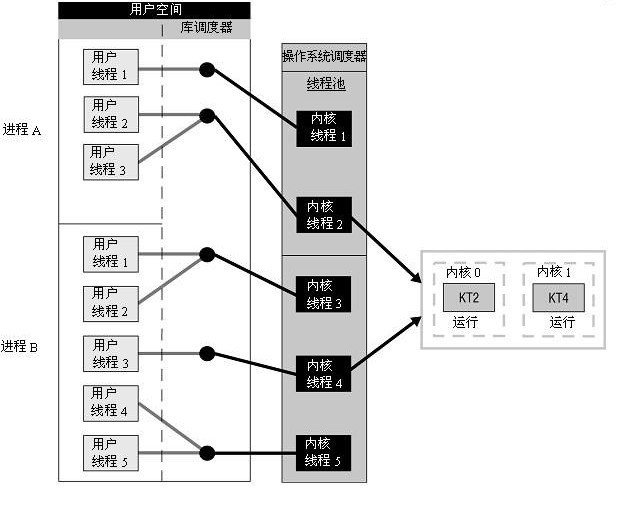
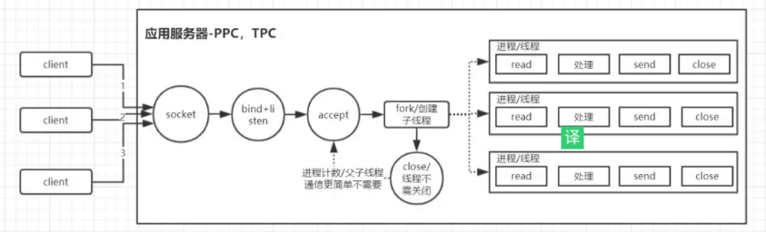
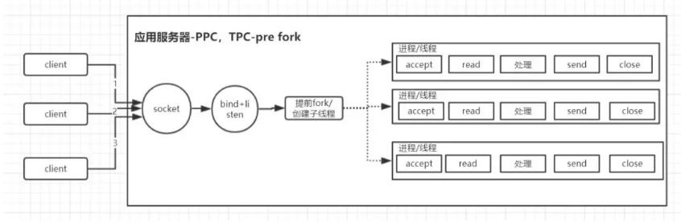
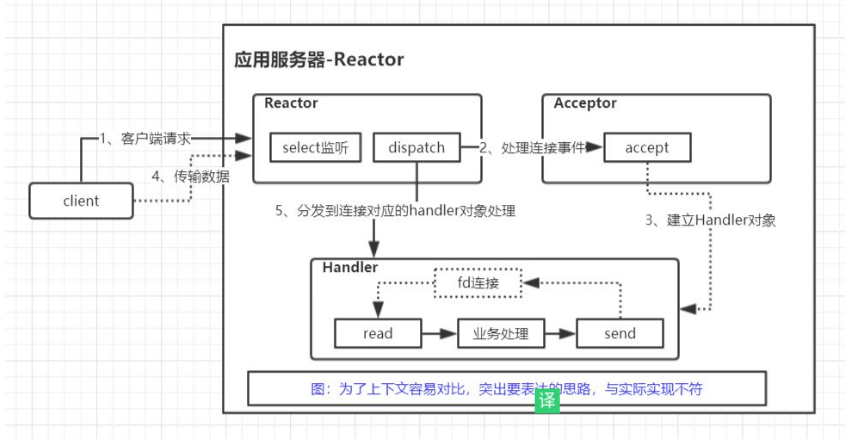

# OS Operating System

* 掌握操作系统对外提供的抽象，包括进程、线程，文件，虚拟内存，以及进程间通信
* 虚拟内存和物理内存直接的关系，分段和分页，文件系统的基本原理
* 缓存IO和直接IO
* 作业调度算法

* 线程和进程
  - 进程是资源分配的最小单位，线程是调度的最小单位
* 进程
  - 进程间通信
  - 互斥锁和信号量
* 进程和线程调度
* 线程
  - 线程的创建和结束
  - 线程都有哪些实现方式
  - 线程状态
  - 多线程并发编程
  - 线程间通信与线程同步机制
  - 线程池
* 消费者和生产者
* 并发和并行
* 锁和死锁
* 对于进程的调度，页面分配/置换算法，磁盘的调度算法，I/O系统
* 搞清楚CPU、内存、网络、I/O设备之间的交互和速度差别
  - 对于计算密集型应用，就需要关注程序执行的效率
  - 对于I/O密集型，要关注进程（线程）之间的切换以及I/O设备的优化以及调度

## 概念

* 守护进程(Daemon)：在计算机中，守护程序是作为后台进程运行的计算机程序，而不是在交互式用户的直接控制下运行的程序。
* 逻辑块寻址(logical block addressing, LBA)：逻辑块寻址是一种通用方案，用于指定存储在计算机存储设备上的数据块的位置。

* FCFS (First-Come, First-Served)：先进先出的调度算法，也就是说，首先到达  CPU 的进程首先进行服务。
* SSF (Shortest Seek First) 最短路径优先算法，这是对先进先出算法的改进，这种算法因为减少了总的磁臂运动，从而缩短了平均响应时间。
* 稳定存储(stable storage)：它是计算机存储技术的一种分类，该技术可确保任何给定的写操作都具有原子性。
* 时钟(Clocks)：也被称为 timers。通常，时钟是指调节所有计算机功能的时序和速度的微芯片。芯片中是一个晶体，当通电时，晶体会以特定的频率振动。任何一台计算机能够执行的最短时间是一个时钟或时钟芯片的一次振动。

## 多任务

* Multiprogramming：一个监控程序，如果发现某个程序暂时无须使用 CPU 时，监控程序就把另外的正在等待 CPU 资源的程序启动起来，以充分利用 CPU 资源
  - 最大问题是程序之间不区分轻重缓急
* 分时系统（Time-Sharing System）：每个程序运行一段时间之后，都主动让出 CPU 资源，这样每个程序在一段时间内都有机会运行一小段时间
* 多任务（Multi-tasking）系统：操作系统从最底层接管了所有硬件资源。所有的应用程序在操作系统之上以 进程（Process） 的方式运行，每个进程都有自己独立的地址空间，相互隔离。CPU 由操作系统统一进行分配。
  - 每个进程都有机会得到 CPU，同时在操作系统控制之下，如果一个进程运行超过了一定时间，就会被暂停掉，失去 CPU 资源。
  - 避免了一个程序的错误导致整个系统死机。如果操作系统分配给各个进程的运行时间都很短，CPU 可以在多个进程间快速切换，就像很多进程都同时在运行的样子

* 计算密集型任务：进行大量计算，消耗CPU资源，如视频解码等，启用与CPU核心数相同的并行任务数可最大化利用CPU资源和加快任务的执行；
* IO密集型任务：如网络、磁盘IO等，CPU消耗很少，任务的大部分时间都在等待IO操作完成(因为IO的速度远远低于CPU和内存的速度)，任务数适当增多，CPU效率将提高。

* 在支持多线程的系统中，进程是系统资源分配的基本单位，线程是系统独立调度的基本单位；
* 无论系统支持什么样的线程模型，操作系统调度器指派到处理器内核进行处理的对象是内核线程；
* 用户级线程在用户空间调度灵活高效，内核级线程在内核空间调度成本更高；
  - 用户级线程在本进程内竞争CPU处理资源，内核级线程在全系统内竞争CPU处理资源，因此后者才能发挥SMP、MPP、NUMA并行处理的优势；
* 进程的创建、撤消、切换成本都高于线程，故使用多个线程比使用多个进程更有管理维持上的性能优势；
* 由于多线程共享进程资源会导致任何一个线程挂掉都可能造成整个进程崩溃，多进程应用程序在出现进程池内的进程崩溃或被攻击的情况下表现更加健壮，一个子进程崩溃不会影响主进程和其他子进程。因此Chrome浏览器为每一个标签页运行一个进程，Apache最早也是采用多进程模式。在Windows下，多线程的效率比多进程要高，所以微软的IIS服务器默认采用多线程模式。由于多线程存在稳定性问题，IIS的稳定性就不如Apache。为了缓解这个问题，IIS和Apache现在又有多进程+多线程的混合模式；
* 协程切换快，不存在锁安全问题，异步编码结构同步化，要充分利用多核CPU的计算能力，还要以多进程或多线程为载体。

## 中断

* 在计算机执行程序过程中，由于出现了某些特殊事情，使得CPU暂停对程序的执行，转而去执行处理这一事件的程序。等这些特殊事情处理完之后再回去执行之前的程序
  - 内部异常中断:由计算机硬件异常或故障引起的中断
  - 软中断（这也是和我们将要说明的系统调用相关的中断）由程序中执行了引起中断的指令而造成的中断
  - 外部中断 由外部设备请求引起的中断，称为外部中断
* 中断处理程序:当中断发生的时候，系统需要去对中断进行处理，对这些中断的处理是由操作系统内核中的特定函数进行的
* 中断优先级
  - 说明的是当一个中断正在被处理的时候，处理器能接受的中断的级别。
  - 也表明了中断需要被处理的紧急程度。每个中断都有一个对应的优先级，当处理器在处理某一中断的时候，只有比这个中断优先级高的中断可以被处理器接受并且被处理。优先级比这个当前正在被处理的中断优先级要低的中断将会被忽略
  - `机器错误 > 时钟 > 磁盘 > 网络设备 >  终端 > 软件中断`

## 系统调用

* 进程执行在系统上级别：用户级和核心级，也称为用户态和系统态(user mode and kernel mode)。用户态和核心态之间区别（以下区别摘至《UNIX操作系统设计》）
  - 用户态进程能存取它们自己的指令和数据，但不能存取内核指令和数据（或其他进程的指令和数据）。然而，核心态下的进程能够存取内核和用户地址
  - 某些机器指令是特权指令，在用户态下执行特权指令会引起错误
* 程序执行一般是在用户态下执行的，但当程序需要使用操作系统提供的服务时，比如说打开某一设备、创建文件、读写文件等，就需要向操作系统发出调用服务的请求，这就是系统调用。
* Linux系统有专门的函数库来提供这些请求操作系统服务的入口，这个函数库中包含了操作系统所提供的对外服务的接口。当进程发出系统调用之后，它所处的运行状态就会由用户态变成核心态。但这个时候，进程本身其实并没有做什么事情，这个时候是由内核在做相应的操作，去完成进程所提出的这些请求。
* 系统调用和中断的关系就在于，当进程发出系统调用申请的时候，会产生一个软件中断。产生这个软件中断以后，系统会去对这个软中断进行处理，这个时候进程就处于核心态了。
* 在系统中内核并不是作为一个与用户进程平行的估计的进程的集合，内核是为用户进程运行的。

## 内核空间

## 用户空间

## 作业管理

## 文件管理

## 存储管理

## 输入输出设备管理

## 进程及处理机管理

## 栈

* 栈是用于存放本地变量，内部临时变量以及有关上下文的内存区域。程序在调用函数时，操作系统会自动通过压栈和弹栈完成保存函数现场等操作，不需要程序员手动干预。
* 栈是一块连续的内存区域，栈顶的地址和栈的最大容量是系统预先规定好的。能从栈获得的空间较小。如果申请的空间超过栈的剩余空间时，例如递归深度过深，将提示stackoverflow。
* 栈是机器系统提供的数据结构，计算机会在底层对栈提供支持：分配专门的寄存器存放栈的地址，压栈出栈都有专门的指令执行，这就决定了栈的效率比较高。

## 堆

* 堆是用于存放除了栈里的东西之外所有其他东西的内存区域，当使用malloc和free时就是在操作堆中的内存。对于堆来说，释放工作由程序员控制，容易产生memory leak。
* 堆是向高地址扩展的数据结构，是不连续的内存区域。这是由于系统是用链表来存储的空闲内存地址的，自然是不连续的，而链表的遍历方向是由低地址向高地址。堆的大小受限于计算机系统中有效的虚拟内存。由此可见，堆获得的空间比较灵活，也比较大。
* 对于堆来讲，频繁的new/delete势必会造成内存空间的不连续，从而造成大量的碎片，使程序效率降低。对于栈来讲，则不会存在这个问题，因为栈是先进后出的队列，永远都不可能有一个内存块从栈中间弹出。
* 堆都是动态分配的，没有静态分配的堆。栈有2种分配方式：静态分配和动态分配。静态分配是编译器完成的，比如局部变量的分配。动态分配由alloca函数进行分配，但是栈的动态分配和堆是不同的，他的动态分配是由编译器进行释放，无需我们手工实现。
* 计算机底层并没有对堆的支持，堆则是C/C++函数库提供的，同时由于上面提到的碎片问题，都会导致堆的效率比栈要低。

## [内存管理](https://mp.weixin.qq.com/s/EVQEkgMtjan1sK4RbjbI3Q)

* 程序可执行文件结构
  - 只读部分包括程序代码（.text）和程序中的常量（.rodata）
  - 可读写部分（也就是变量）
    + .data： 初始化了的全局变量和静态变量
    + .bss： 即 Block Started by Symbol， 未初始化的全局变量和静态变量
    + heap： 堆，使用 malloc, realloc, 和 free 函数控制的变量，堆在所有的线程，共享库，和动态加载的模块中被共享使用
    + stack： 栈，函数调用时使用栈来保存函数现场，自动变量（即生命周期限制在某个 scope 的变量）也存放在栈中。
  - 静态变量： 指使用 static 关键字修饰的变量，static 关键字对变量的作用域进行了限制，具体的限制如下：
    + 在函数外定义：全局变量，但是只在当前文件中可见（叫做 internal linkage）
    + 在函数内定义：全局变量，但是只在此函数内可见（同时，在多次函数调用中，变量的值不会丢失）
（C++）在类中定义：全局变量，但是只在此类中可见
* 内存模型
  - 语言级别内存模型，C/C++属于weak memory model，简单的说就是编译器在进行编译优化的时候，可以对指令进行重排，只需要保证在单线程的环境下，优化前和优化后执行结果一致即可，执行中间过程不保证跟代码的语义顺序一致。所以在多线程的环境下，如果依赖代码中间过程的执行顺序，程序就会出现问题。
  - 硬件级别内存模型，常用的cpu，也属于弱内存模型，即cpu在执行指令的时候，为了提升执行效率，也会对某些执行进行乱序执行（按照wiki提供的资料，在x86 64环境下，只会发生读写乱序，即读操作可能会被乱序到写操作之前），如果在编程的时候不做一些措施，同样容易造成错误。
* 内存屏障:为了解决弱内存模型造成的问题，需要一种能控制指令重排或者乱序执行程序的手段.程序员只需要在代码中插入特定的函数，就能控制弱内存模型带来的负面影响，当然，由于影响了乱序和重排这类的优化，对代码的执行效率有一定的影响。具体实现上，内存屏障技术分三种
  - ECC(Error-Correcting Code)：指能够实现错误检查和纠正错误技术的内存
  - I/O port: 也被称为输入/输出端口，由软件用来与计算机上的硬件进行通信的内存地址
  - 内存映射I/O(memory mapped I/O，MMIO): 内存映射的 I/O 使用相同的地址空间来寻址内存和 I/O 设备，也就是说，内存映射I/O 设备共享同一内存地址
  - 端口映射I/O(Port-mapped I/O ,PMIO)：在 PMIO中，内存和I/O设备有各自的地址空间。端口映射I/O通常使用一种特殊的CPU指令，专门执行I/O操作
  - DMA (Direct Memory Access)：直接内存访问，它是计算机系统的一项功能，它允许某些硬件系统能够独立于 CPU 访问内存。如果没有 DMA，当 CPU 执行输入/输出指令时，它通常在读取或写入操作的整个过程中都被完全占用，因此无法执行其他工作。使用 DMA 后，CPU 首先启动传输信号，然后在进行传输时执行其他操作，最后在完成操作后从 DMA 控制器（DMAC）接收中断。完成执行
* 虚拟地址：用户编程时将代码（或数据）分成若干个段，每条代码或每个数据的地址由段名称 + 段内相对地址构成，这样的程序地址称为虚拟地址
* 逻辑地址：虚拟地址中，段内相对地址部分称为逻辑地址
* 物理地址：实际物理内存中所看到的存储地址称为物理地址
* 逻辑地址空间：在实际应用中，将虚拟地址和逻辑地址经常不加区分，通称为逻辑地址。逻辑地址的集合称为逻辑地址空间
* 线性地址空间：CPU地址总线可以访问的所有地址集合称为线性地址空间
* 物理地址空间：实际存在的可访问的物理内存地址集合称为物理地址空间
* MMU(Memery Management Unit内存管理单元)：实现将用户程序的虚拟地址（逻辑地址） → 物理地址映射的CPU中的硬件电路
* 基地址：在进行地址映射时，经常以段或页为单位并以其最小地址（即起始地址）为基值来进行计算
* 偏移量：在以段或页为单位进行地址映射时，相对于基地址的地址值
* 虚拟地址先经过分段机制映射到线性地址，然后线性地址通过分页机制映射到物理地址
* 虚拟内存:进程持有的虚拟地址会通过 CPU 芯片中的内存管理单元（MMU）的映射关系，来转换变成物理地址，然后再通过物理地址访问内存
  - 单片机的 CPU 是直接操作内存的「物理地址」,想在内存中同时运行两个程序是不可能的
  - 把进程所使用地址「隔离」开来，即让操作系统为每个进程分配独立的一套「虚拟地址」，都有，玩自己的地址就行，互不干涉。但是有个前提每个进程都不能访问物理地址，至于虚拟地址最终怎么落到物理内存里，对进程来说是透明的
  - 操作系统会提供一种机制，将不同进程的虚拟地址和不同内存的物理地址映射起来
    + 程序使用的内存地址：虚拟内存地址 Virtual Memory Address
    + 硬件里面的空间地址：物理内存地址 Physical Memory Address
  - 请求调页｜按需调页，即对不在内存中的“页”，当进程执行时要用时才调入，否则有可能到程序结束时也不会调入
* 内存分段：程序是由若干个逻辑分段组成的，如可由代码分段、数据分段、栈段、堆段组成。不同的段是有不同的属性的，所以就用分段（Segmentation）的形式把这些段分离出来
  - 用户空间内存，从低到高分别是 7 种不同的内存段
    * 程序文件段|代码段:用来存放可执行文件的操作指令，可执行程序在内存中的镜像。代码段需要防止在运行时被非法修改，所以只准许读取操作，它是不可写的
    * 已初始化数据段|全局变量：存放程序静态分配的变量和全局变量静态常量
    * 未初始化数据段|BSS段：包括未初始化的静态变量，在内存中 bss 段全部置零。
    + 堆 heap：用于存放进程运行中被动态分配的内存段，大小并不固定，可动态扩张或缩减。从低地址开始向上增长
      * 当进程调用malloc等函数分配内存时，新分配的内存就被动态添加到堆上（堆被扩张）
      * 当利用free等函数释放内存时，被释放的内存从堆中被剔除（堆被缩减）
    + 文件映射段：包括动态库、共享内存等，从低地址开始向上增长（跟硬件和内核版本有关）
    + 栈 stack：包括局部变量和函数调用的上下文等。栈的大小是固定的，一般是 8 MB。当然系统也提供了参数，以便自定义大小。用户存放程序临时创建的局部变量，也就是函数中定义的变量（但不包括 static 声明的变量，static意味着在数据段中存放变量）
      * 除此以外，在函数被调用时，其参数也会被压入发起调用的进程栈中，并且待到调用结束后，函数的返回值也会被存放回栈中
      * 由于栈的先进后出特点，所以栈特别方便用来保存/恢复调用现场。从这个意义上讲，可以把堆栈看成一个寄存、交换临时数据的内存区。
    + 数据段、BSS 段、堆通常是被连续存储在内存中，在位置上是连续的，而代码段和栈往往会被独立存放。堆和文件映射段的内存是动态分配的。比如说，使用 C 标准库的 malloc() 或者 mmap() ，就可以分别在堆和文件映射段动态分配内存
  - 分段机制下的虚拟地址由两部分组成，段选择子和段内偏移量
  - 段选择子保存在段寄存器里面。里面最重要的是段号，用作段表的索引。段表里面保存的是这个段的基地址、段的界限和特权等级等
  - 虚拟地址中的段内偏移量应该位于 0 和段界限之间，如果段内偏移量是合法的，就将段基地址加上段内偏移量得到物理内存地址
  - 不足：
    + 内存碎片的问题：段的基地址是固定的，不能合并分散的内存空间
    + 内存交换效率低：通过swap进行内存空间整理。用于内存与硬盘的空间交换
      * 分段的方式，内存碎片是很容易产生的，产生了内存碎片，那不得不重新 Swap 内存区域
      * 每一次内存交换，我们都需要把一大段连续的内存数据写到硬盘上
      * 如果内存交换的时候，交换的是一个占内存空间很大的程序，这样整个机器都会显得卡顿
* 内存分页（Paging）:把整个物理内存空间切成一段段固定尺寸的大小。这样一个连续并且尺寸固定的内存空间,叫页（Page）。在 Linux 下，每一页的大小为 4KB
  - 虚拟地址与物理地址之间通过页表来映射,页表实际上存储在 CPU 的 MMU：Memory Manage Unit 内存管理单元中，CPU 可以直接通过 MMU，找出访问物理地址
    + MMU是一种硬件电路，其速度很快，主要工作是进行内存管理，地址转换只承接的业务之一
    + 每个进程都会有自己页表Page Table，页表存储了进程中虚拟地址到物理地址的映射关系，所以就相当于一张地图，MMU收到CPU的虚拟地址之后开始查询页表，确定是否存在映射以及读写权限是否正常
  - 内存惰性(延时)分配机制:只有程序运行时用到了才去内存中寻找虚拟地址对应的页帧，找不到才可能进行分配
* 当进程访问的虚拟地址在页表中查不到时，系统会产生一个**PageFault 缺页异常**，进入系统内核空间分配物理内存、更新进程页表，最后再返回用户空间，恢复进程的运行
  + 一个由硬件中断触发的可以由软件逻辑纠正的错误
  + CPU给MMU的虚拟地址在TLB和Page Table都没有找到对应的物理页帧或者权限不对，就会报告一个缺页错误
  - 缺页异常处理
    + Hard Page Fault 也被称为Major Page Fault，翻译为硬缺页错误/主要缺页错误，这时物理内存中没有对应的页帧，需要CPU打开磁盘设备读取到物理内存中，再让MMU建立VA和PA的映射。
    + Soft Page Fault 也被称为Minor Page Fault，翻译为软缺页错误/次要缺页错误，这时物理内存中是存在对应页帧的，只不过可能是其他进程调入的，发出缺页异常的进程不知道而已，此时MMU只需要建立映射即可，无需从磁盘读取写入内存，一般出现在多进程共享内存区域。
    + Invalid Page Fault 翻译为无效缺页错误，比如进程访问的内存地址越界访问，又比如对空指针解引用内核就会报segment fault错误中断进程直接挂掉。
  - 缺页异常原因
    + 非法操作访问越界 这种情况产生的影响也是最大的，也是Coredump的重要来源，比如空指针解引用或者权限问题等都会出现缺页错误。
    + 使用malloc新申请内存 malloc机制是延时分配内存，当使用malloc申请内存时并未真实分配物理内存，等到真正开始使用malloc申请的物理内存时发现没有才会启动申请，期间就会出现Page Fault。
    + 访问数据被swap换出 物理内存是有限资源，当运行很多进程时并不是每个进程都活跃，对此OS会启动内存页面置换将长时间未使用的物理内存页帧放到swap分区来腾空资源给其他进程，当存在于swap分区的页面被访问时就会触发Page Fault从而再置换回物理内存
* 解决分段内存碎片、内存交换效率低
  + 采用了分页，那么释放的内存都是以页为单位释放的，也就不会产生无法给进程使用的小内存
  + 如果内存空间不够，操作系统会把其他正在运行的进程中的「最近没被使用」的内存页面给释放掉，也就是暂时写在硬盘上，称为换出（Swap Out）。一旦需要的时候，再加载进来，称为换入（Swap In）。所以，一次性写入磁盘的也只有少数的一个页或者几个页，不会花太多时间，内存交换的效率就相对比较高。
  - 在加载程序的时候，不再需要一次性都把程序加载到物理内存中。完全可以在进行虚拟内存和物理内存的页之间的映射之后，并不真的把页加载到物理内存里，而是只有在程序运行中，需要用到对应虚拟内存页里面的指令和数据时，再加载到物理内存里面去
  - VA：Virtual Address 虚拟地址 和 PA：Physical Address 物理地址
    + 虚拟地址分为两部分，页号和页内偏移。页号作为页表的索引，页表包含物理页每页所在物理内存的基地址，这个基地址与页内偏移的组合就形成了物理内存地址
  - 缺陷
    + 空间缺陷：在 32 位的环境下，虚拟地址空间共有 4GB，假设一个页的大小是 4KB（2^12），那么就需要大约 100 万 （2^20） 个页，每个「页表项」需要 4 个字节大小来存储，那么整个 4GB 空间的映射就需要有 4MB 的内存来存储页表
    + 4MB 大小的页表，看起来也不是很大。但是要知道每个进程都是有自己的虚拟地址空间的，也就说都有自己的页表
  - 多级页表（Multi-Level Page Table）：将页表（一级页表）分为 1024 个页表（二级页表），每个表（二级页表）中包含 1024 个「页表项」，形成二级分页
    + 每个进程都有 4GB 的虚拟地址空间，而显然对于大多数程序来说，其使用到的空间远未达到 4GB，因为会存在部分对应的页表项都是空的，根本没有分配，对于已分配的页表项，如果存在最近一定时间未访问的页表，在物理内存紧张的情况下，操作系统会将页面换出到硬盘，也就是说不会占用物理内存。
    + 如果某个一级页表的页表项没有被用到，也就不需要创建这个页表项对应的二级页表了，即可以在需要时才创建二级页表。做个简单的计算，假设只有 20% 的一级页表项被用到了，那么页表占用的内存空间就只有 4KB（一级页表） + 20% * 4MB（二级页表）= 0.804MB
    + 保存在内存中的页表承担的职责是将虚拟地址翻译成物理地址。假如虚拟地址在页表中找不到对应的页表项，计算机系统就不能工作了。页表一定要覆盖全部虚拟地址空间，不分级的页表就需要有 100 多万个页表项来映射，而二级分页则只需要 1024 个页表项（此时一级页表覆盖到了全部虚拟地址空间，二级页表在需要时创建）
    + 多级页表同时也带来了查询效率问题
  - 64 位的系统，变成了四级目录
    + 全局页目录项 PGD（Page Global Directory
    + 上层页目录项 PUD（Page Upper Directory）
    + 中间页目录项 PMD（Page Middle Directory）
    + 分页表项 PTE（Page Table Entry）
  - 多级页表虽然解决了空间上的问题，但是虚拟地址到物理地址的转换就多了几道转换的工序，这显然就降低了这俩地址转换的速度，也就是带来了时间上的开销
  - 程序是有局部性的，即在一段时间内，整个程序的执行仅限于程序中的某一部分。执行所访问的存储空间也局限于某个内存区域。
  - 把最常访问的几个页表项存储到访问速度更快的硬件，于是计算机科学家们，就在 CPU 芯片中，加入了一个专门存放程序最常访问的页表项的 Cache，这个 Cache 就是 TLB（Translation Lookaside Buffer） ，通常称为页表缓存、转址旁路缓存、快表等
  - CPU 芯片里面，封装了内存管理单元（Memory Management Unit）芯片，它用来完成地址转换和 TLB 的访问与交互。有了 TLB 后，那么 CPU 在寻址时，会先查 TLB，如果没找到，才会继续查常规的页表
  - TLB：Translation Lookaside Buffer 旁路快表缓存/地址变换高速缓存 的命中率其实是很高的，因为程序最常访问的页就那么几个
* 段页式内存管理：内存分段和内存分页并不是对立的，是可以组合起来在同一个系统中使用
  - 实现方式：地址结构就由段号、段内页号和页内位移
    + 先将程序划分为多个有逻辑意义的段，也就是前面提到的分段机制
    + 接着再把每个段划分为多个页，也就是对分段划分出来的连续空间，再划分固定大小的页
  - 段页式地址变换的数据结构是每一个程序一张段表，每个段又建立一张页表，段表中的地址是页表的起始地址，而页表中的地址则为某页的物理页号。要得到物理地址须经过三次内存访问
    + 第一次访问段表，得到页表起始地址；
    + 第二次访问页表，得到物理页号；
    + 第三次将物理页号与页内位移组合，得到物理地址
* TLB
  - 当CPU给MMU传新虚拟地址之后，MMU先去问TLB那边有没有，如果有就直接拿到物理地址发到总线给内存
  - TLB容量比较小，难免发生Cache Miss，这时候MMU还有保底的老武器页表 Page Table，在页表中找到之后MMU除了把地址发到总线传给内存，还把这条映射关系给到TLB，让它记录一下刷新缓存
  - 容量不满的时候就直接把新记录存储了，当满了的时候就开启了淘汰大法把旧记录清除掉，来保存新记录
* Linux 内存管理
  - 80286 开始使用段式内存管理。很快发现光有段式内存管理而没有页式内存管理是不够的
  - 80386 除了完成并完善从 80286 开始的段式内存管理的同时还实现了页式内存管理。没有绕开段式内存管理，而是建立在段式内存管理的基础上，意味着，页式内存管理的作用是在由段式内存管理所映射而成的的地址上再加上一层地址映射。段式内存管理先将逻辑地址映射成线性地址，然后再由页式内存管理将线性地址映射成物理地址
    + 程序所使用的地址，通常是没被段式内存管理映射的地址，称为逻辑地址
    + 通过段式内存管理映射的地址，称为线性地址，也叫虚拟地址
  - Linux 内存主要采用的是页式内存管理，但同时也不可避免地涉及了段机制
  - 主要是上面 Intel 处理器发展历史导致的，因为 Intel X86 CPU 一律对程序中使用的地址先进行段式映射，然后才能进行页式映射。既然 CPU 的硬件结构是这样，Linux 内核也只好服从 Intel 的选择
  - 事实上，Linux 内核所采取的办法是使段式映射的过程实际上不起什么作用
  - Linux 系统中的每个段都是从 0 地址开始的整个 4GB 虚拟空间（32 位环境下），也就是所有的段的起始地址都是一样的。这意味着，Linux 系统中的代码，包括操作系统本身的代码和应用程序代码，所面对的地址空间都是线性地址空间（虚拟地址），这种做法相当于屏蔽了处理器中的逻辑地址概念，段只被用于访问控制和内存保护
  - 虚拟地址空间内部又被分为内核空间和用户空间两部分
    + 32 位系统的内核空间占用 1G（0xC0000000～0xFFFFFFFF），位于最高处，包括了内核镜像、物理页面表、驱动程序等运行在内核空间，剩下的 3G 是用户空间
    + 64 位系统的内核空间和用户空间都是 128T，分别占据整个内存空间的最高和最低处，剩下的中间部分是未定义的
    + 区别：
      * 进程在用户态时，只能访问用户空间内存
      * 只有进入内核态后，才可以访问内核空间的内存
  - 每个进程都各自有独立的虚拟内存，但是每个虚拟内存中的内核地址，其实关联的都是相同的物理内存。这样，进程切换到内核态后，就可以很方便地访问内核空间内存
* mmap 文件内存映射
  - 如果日志的索引或者日志本身既有读者又有写者，且它们分别在不同的进程，两者其实可以共享同一片物理内存（如果使用 MAP_SHARED），这样即节省了内存开销，读者还可以直接获得写者的更新
  - 页缓存属于内核空间，用户空间访问不了，因此数据还需要拷贝到用户空间缓冲区
  - 文件映射就是将程序虚拟页面直接映射到页缓存上，无需有内核态再往用户态的拷贝，而且也避免了重复数据的产生
  - 不必再通过调用read或write方法对文件进行读写，可以通过映射地址加偏移量的方式直接操作
  - 如果写者扩展了映射的内存区域（比如日志文件写满，需要扩容，做了 resize，然后又 remap），读者是不知道的，这个时候需要写者和读者同步一下。
* 页面置换算法
  - FIFO算法 先入先出，即淘汰最早调入的页面。
  - OPT(MIN)算法 选未来最远将使用的页淘汰，是一种最优的方案，可以证明缺页数最小。 可惜，MIN需要知道将来发生的事，只能在理论中存在，实际不可应用。
  - LRU(Least-Recently-Used)算法 用过去的历史预测将来，选最近最长时间没有使用的页淘汰(也称最近最少使用)。
  - LRU准确实现：计数器法，页码栈法。 由于代价较高，通常不使用准确实现，而是采用近似实现，例如Clock算法。
* 内存抖动现象：页面的频繁更换，导致整个系统效率急剧下降，这个现象称为内存抖动（或颠簸）。抖动一般是内存分配算法不好，内存太小引或者程序的算法不佳引起的。
* Belady现象：对有的页面置换算法，页错误率可能会随着分配帧数增加而增加。FIFO会产生Belady异常。栈式算法无Belady异常，LRU，LFU（最不经常使用），OPT都属于栈式算法。

```sh
# 查看编译后程序的各个内存区域大小
size /usr/local/sbin/sshd
```

## 磁盘调度

* 磁盘访问延迟 = 队列时间 + 控制器时间 + 寻道时间 + 旋转时间 + 传输时间
* 磁盘调度的目的是减小延迟，其中前两项可以忽略，寻道时间是主要矛盾。
* 算法
  - FCFS 先进先出的调度策略，这个策略具有公平的优点，因为每个请求都会得到处理，并且是按照接收到的顺序进行处理。
  - SSTF(Shortest-seek-time First 最短寻道时间优先)
    + 选择使磁头从当前位置开始移动最少的磁盘I/O请求，所以 SSTF 总是选择导致最小寻道时间的请求。
    + 总是选择最小寻找时间并不能保证平均寻找时间最小，但是能提供比 FCFS 算法更好的性能，会存在饥饿现象。
 - SCAN
    + SSTF+中途不回折，每个请求都有处理机会。
    + 由于磁头移动规律与电梯运行相似，SCAN 也被称为电梯算法。
    + SCAN 算法对最近扫描过的区域不公平，因此，它在访问局部性方面不如 FCFS 算法和 SSTF 算法好。
 - C-SCAN
    + SCAN+直接移到另一端，两端请求都能很快处理。
    + 把扫描限定在一个方向，当访问到某个方向的最后一个磁道时，磁道返回磁盘相反方向磁道的末端，并再次开始扫描。
    + 其中“C”是Circular（环）的意思。
 - LOOK 和 C-LOOK
    + 釆用SCAN算法和C-SCAN算法时磁头总是严格地遵循从盘面的一端到另一端，显然，在实际使用时还可以改进，即磁头移动只需要到达最远端的一个请求即可返回，不需要到达磁盘端点。这种形式的SCAN算法和C-SCAN算法称为LOOK和C-LOOK调度。这是因为它们在朝一个给定方向移动前会查看是否有请求。

## 文件系统

* 分区表
  - MBR：支持最大卷为2 TB（Terabytes）并且每个磁盘最多有4个主分区（或3个主分区，1个扩展分区和无限制的逻辑驱动器）
  - GPT：支持最大卷为18EB（Exabytes）并且每磁盘的分区数没有上限，只受到操作系统限制（由于分区表本身需要占用一定空间，最初规划硬盘分区时，留给分区表的空间决定了最多可以有多少个分区，IA-64版Windows限制最多有128个分区，这也是EFI标准规定的分区表的最小尺寸。另外，GPT分区磁盘有备份分区表来提高分区数据结构的完整性。
* 磁盘阵列（Redundant Arrays of Independent Disks，RAID），独立冗余磁盘阵列之。原理是利用数组方式来作磁盘组，配合数据分散排列的设计，提升数据的安全性。
  - RAID 0
    + RAID 0是最早出现的RAID模式，需要2块以上的硬盘，可以提高整个磁盘的性能和吞吐量。
    + RAID 0没有提供冗余或错误修复能力，其中一块硬盘损坏，所有数据将遗失。
  - RAID 1
    + RAID 1就是镜像，其原理为在主硬盘上存放数据的同时也在镜像硬盘上写一样的数据。
    + 当主硬盘（物理）损坏时，镜像硬盘则代替主硬盘的工作。因为有镜像硬盘做数据备份，所以RAID 1的数据安全性在所有的RAID级别上来说是最好的。
    + 但无论用多少磁盘做RAID 1，仅算一个磁盘的容量，是所有RAID中磁盘利用率最低的。
  - RAID 2
    + 这是RAID 0的改良版，以汉明码（Hamming Code）的方式将数据进行编码后分区为独立的比特，并将数据分别写入硬盘中。因为在数据中加入了错误修正码（ECC，Error Correction Code），所以数据整体的容量会比原始数据大一些，RAID2最少要三台磁盘驱动器方能运作。
  - RAID 3 采用Bit－interleaving（数据交错存储）技术，它需要通过编码再将数据比特分割后分别存在硬盘中，而将同比特检查后单独存在一个硬盘中，但由于数据内的比特分散在不同的硬盘上，因此就算要读取一小段数据资料都可能需要所有的硬盘进行工作，所以这种规格比较适于读取大量数据时使用。
  - RAID 4
    + 它与RAID 3不同的是它在分区时是以区块为单位分别存在硬盘中，但每次的数据访问都必须从同比特检查的那个硬盘中取出对应的同比特数据进行核对，由于过于频繁的使用，所以对硬盘的损耗可能会提高。（块交织技术，Block interleaving）
    + RAID 2/3/4 在实际应用中很少使用
  - RAID 5
    + RAID Level 5是一种储存性能、数据安全和存储成本兼顾的存储解决方案。它使用的是Disk Striping（硬盘分区）技术。
    + RAID 5至少需要三块硬盘，RAID 5不是对存储的数据进行备份，而是把数据和相对应的奇偶校验信息存储到组成RAID5的各个磁盘上，并且奇偶校验信息和相对应的数据分别存储于不同的磁盘上。
    + RAID 5 允许一块硬盘损坏。
    + 实际容量 Size = (N-1) * min(S1, S2, S3 ... SN)
  - RAID 6
    + 与RAID 5相比，RAID 6增加第二个独立的奇偶校验信息块。两个独立的奇偶系统使用不同的算法，数据的可靠性非常高，即使两块磁盘同时失效也不会影响数据的使用。
    + RAID 6 至少需要4块硬盘。
    + 实际容量 Size = (N-2) * min(S1, S2, S3 ... SN)
  - RAID 10/01（RAID 1+0，RAID 0+1）
    + RAID 10是先镜射再分区数据，再将所有硬盘分为两组，视为是RAID 0的最低组合，然后将这两组各自视为RAID 1运作。
    + RAID 01则是跟RAID 10的程序相反，是先分区再将数据镜射到两组硬盘。它将所有的硬盘分为两组，变成RAID 1的最低组合，而将两组硬盘各自视为RAID 0运作。
    + 当RAID 10有一个硬盘受损，其余硬盘会继续运作。RAID 01只要有一个硬盘受损，同组RAID 0的所有硬盘都会停止运作，只剩下其他组的硬盘运作，可靠性较低。如果以六个硬盘建RAID 01，镜射再用三个建RAID 0，那么坏一个硬盘便会有三个硬盘脱机。因此，RAID 10远较RAID 01常用，零售主板绝大部份支持RAID 0/1/5/10，但不支持RAID 01。
    + RAID 10 至少需要4块硬盘，且硬盘数量必须为偶数。

## 进程 Process

* 具有独立功能的程序关于某个数据集合的一次运行活动，计算机中程序关于某数据集合上的一次执行过程，包括了动态创建、调度和消亡的整个过程，是系统资源分配的最小单位
* 可以申请和拥有系统资源，是一个动态的概念，是一个活动的实体。不只是程序的代码，还包括当前的活动，通过程序计数器的值和处理寄存器的内容来表示。
* 进程是一个实体。每一个进程都有它自己的地址空间，一般情况下，包括文本区域（text region）、数据区域（data region）和堆栈（stack region）。文本区域存储处理器执行的代码；数据区域存储变量和进程执行期间使用的动态分配的内存；堆栈区域存储着活动过程调用的指令和本地变量
* 进程是一个“执行中的程序”。程序是一个没有生命的实体，只有处理器赋予程序生命时，它才能成为一个活动的实体，称其为进程。
* 状态
  - 等待态：等待某个事件的完成；
  - 就绪态：等待系统分配处理器以便运行；
  - 运行态：占有处理器正在运行
  - 运行态→等待态 往往是由于等待外设，等待主存等资源分配或等待人工干预而引起的。
  - 等待态→就绪态 则是等待的条件已满足，只需分配到处理器后就能运行。
  - 运行态→就绪态 不是由于自身原因，而是由外界原因使运行状态的进程让出处理器，这时候就变成就绪态。例如时间片用完，或有更高优先级的进程来抢占处理器等。
  - 就绪态→运行态 系统按某种策略选中就绪队列中的一个进程占用处理器，此时就变成了运行态
* 资源管理
  - 包括内存资源、IO资源、信号处理等部分
  - 与每个进程相关的是地址空间(address space)，这是从某个最小值的存储位置(通常是零)到某个最大值的存储位置的列表。在这个地址空间中，进程可以进行读写操作
  - 地址空间中存放有可执行程序，程序所需要的数据和它的栈
  - 与每个进程相关的还有资源集，通常包括寄存器(registers)（寄存器一般包括程序计数器(program counter)和堆栈指针(stack pointer)）、打开文件的清单、突发的报警、有关的进程清单和其他需要执行程序的信息
  - 对进程建立一种直观感觉的方式是考虑建立一种多程序的系统。考虑下面这种情况： 用户启动一个视频编辑程序，指示它按照某种格式转换视频，然后再去浏览网页。同时，一个检查电子邮件的后台进程被唤醒并开始运行
  - 操作系统周期性的挂起一个进程然后启动运行另一个进程，这可能是由于过去一两秒钟程序用完了 CPU 分配的时间片，而 CPU 转而运行另外的程序。 像这样暂时中断进程后，下次应用程序在此启动时，必须要恢复到与中断时刻相同的状态，这在用户看起来是习以为常的事情，但是操作系统内部却做了巨大的事情
  - 挂起时该进程的所有信息都要被保存下来。例如，进程可能打开了多个文件进行读取。与每个文件相关联的是提供当前位置的指针（即下一个需要读取的字节或记录的编号）必须要保存这些指针，以便在重新启动进程后执行的 read调用将能够正确的读取数据
  - 与一个进程有关的所有信息，除了该进程自身地址空间的内容以外，均存放在操作系统的一张表中，称为 进程表(process table)，进程表是数组或者链表结构，当前存在每个进程都要占据其中的一项
  - 一个挂起的进程包括：进程的地址空间（往往称作磁芯映像， core image，纪念过去的磁芯存储器），以及对应的进程表项（其中包括寄存器以及稍后启动该进程所需要的许多其他信息）
  - 与进程管理有关的最关键的系统调用往往是决定着进程的创建和终止的系统调用
  - 一个进程能够创建一个或多个进程（称为子进程），而且这些进程又可以创建子进程
  - 进程间通信(interprocess communication)：合作完成某些作业的相关进程经常需要彼此通信来完成作业
  - 系统管理器授权每个进程使用一个给定的 UID(User IDentification)。每个启动的进程都会有一个操作系统赋予的 UID，子进程拥有与父进程一样的 UID。用户可以是某个组的成员，每个组也有一个 GID(Group IDentification)
  - 在 UNIX 操作系统中，有一个 UID 是 超级用户(superuser)，或者 Windows 中的管理员(administrator)，它具有特殊的权利，可以违背一些保护规则
* 上下文切换:任务从保存到再加载的过程。包含了程序正确运行所需的状态。包括程序的代码、数据、栈、通用寄存器的内容、程序计数器、环境变量及打开的文件描述符等等
* 多进程
  - 好处
    + 对CPU轮流使用
    + 对CPU计算和IO操作重叠利用。这里的IO主要是指磁盘IO和网络IO，相对CPU而言，大多数进程的时间主要消耗在I/O操作上
    + 现代计算机的DMA技术可以让CPU不参与I/O操作的全过程，比如进程通过系统调用，使得CPU向网卡或者磁盘等I/O设备发出指令，然后进程被挂起，释放出CPU资源，等待I/O设备完成工作后通过中断来通知进程重新就绪
    + 提高CPU的并发度
    + 独立的内存地址空间和生命周期所带来的稳定性和健壮性，其中一个进程崩溃不会影响到另一个进程
  - 缺点
    + fork()系统调用开销很大: prefork
    + 进程间调度和上下文切换成本: 减少进程数量
    + 庞大内存重复：共享内存
    + IPC编程相对比较麻烦

## 进程调度

* 从提交开始直到完成，往往要经历下述三级调度
  - 高级调度：(High-Level Scheduling)又称为作业调度，它决定把后备作业调入内存运行；
  - 中级调度：(Intermediate-Level Scheduling)又称为在虚拟存储器中引入，在内、外存对换区进行进程对换。
  - 低级调度：(Low-Level Scheduling)又称为进程调度，它决定把就绪队列的某进程获得CPU；
* 非抢占式: 分派程序一旦把处理机分配给某进程后便让它一直运行下去，直到进程完成或发生进程调度进程调度某事件而阻塞时，才把处理机分配给另一个进程。
* 抢占式:操作系统将正在运行的进程强行暂停，由调度程序将CPU分配给其他就绪进程的调度方式。
* 调度策略设计
  - 响应时间: 从用户输入到产生反应的时间
  - 周转时间: 从任务开始到任务结束的时间
  - CPU任务可以分为交互式任务和批处理任务，调度最终的目标是合理使用CPU，使得交互式任务的响应时间尽可能短，用户不至于感到延迟，同时使得批处理任务的周转时间尽可能短，减少用户等待的时间。
* 调度算法
  - FIFO或First Come, First Served (FCFS)
    + 调度的顺序就是任务到达就绪队列的顺序。
    + 公平、简单(FIFO队列)、非抢占、不适合交互式。未考虑任务特性，平均等待时间可以缩短
  - Shortest Job First (SJF)
    + 最短的作业(CPU区间长度最小)最先调度。
    + 可以证明，SJF可以保证最小的平均等待时间。
  - Shortest Remaining Job First (SRJF)
    + SJF的可抢占版本，比SJF更有优势。
    + SJF(SRJF): 如何知道下一CPU区间大小？根据历史进行预测: 指数平均法。
  - 优先权调度
    + 每个任务关联一个优先权，调度优先权最高的任务。
    + 注意：优先权太低的任务一直就绪，得不到运行，出现“饥饿”现象。
    + FCFS是RR的特例，SJF是优先权调度的特例。这些调度算法都不适合于交互式系统。
  - Round-Robin(RR)
    + 设置一个时间片，按时间片来轮转调度（“轮叫”算法）
    + 优点: 定时有响应，等待时间较短；缺点: 上下文切换次数较多；
    + 如何确定时间片？时间片太大，响应时间太长；吞吐量变小，周转时间变长；当时间片过长时，退化为FCFS。
  - 多级队列调度
    + 按照一定的规则建立多个进程队列
    + 不同的队列有固定的优先级（高优先级有抢占权）
    + 不同的队列可以给不同的时间片和采用不同的调度方法
    + 存在问题1：没法区分I/O bound和CPU bound；
    + 存在问题2：也存在一定程度的“饥饿”现象；
  - 多级反馈队列
    + 在多级队列的基础上，任务可以在队列之间移动，更细致的区分任务。
    + 可以根据“享用”CPU时间多少来移动队列，阻止“饥饿”。
    + 最通用的调度算法，多数OS都使用该方法或其变形，如UNIX、Windows等。

### 进程同步

* 进程是占有资源的最小单位（线程可以访问其所在进程内的所有资源，但线程本身并不占有资源或仅仅占有一点必须资源）
* 临界资源:一次只能被一个进程所占用的资源,典型的临界资源比如物理上的打印机，或是存在硬盘或内存中被多个进程所共享的一些变量和数据等
  - 对于临界资源的访问，必须是互斥进行。也就是当临界资源被占用时，另一个申请临界资源的进程会被阻塞，直到其所申请的临界资源被释放
* 临界区:进程内访问临界资源的代码
  - 进入区:查看临界区是否可访问，如果可以访问，则转到步骤二，否则进程会被阻塞
  - 临界区:在临界区做操作
  - 退出区:清除临界区被占用的标志
  - 剩余区：进程与临界区不相关部分的代码
* 解决临界区问题
  - 一般软件方法
  - 关中断方法
  - 硬件原子指令方法
  - 信号量方法
* 信号量
  - 一个确定的二元组（s，q），其中s是一个具有非负初值的整形变量，q是一个初始状态为空的队列，整形变量s表示系统中某类资源的数目：
    + 当其值 ≥ 0 时，表示系统中当前可用资源的数目
    + 当其值 ＜ 0 时，其绝对值表示系统中因请求该类资源而被阻塞的进程数目
  - 信号量的值仅能由P操作和V操作更改，操作系统利用它的状态对进程和资源进行管理
  - P操作记为P(s)，其中s为一信号量，它执行时主要完成以下动作 `s.value = s.value - 1；` 理解为占用1个资源，若原来就没有则记帐“欠”1个
    + 若s.value ≥ 0，则进程继续执行，否则（即s.value < 0），则进程被阻塞，并将该进程插入到信号量s的等待队列s.queue中
    + 理解为分配资源的计数器，或是使进程处于等待状态的控制指令
  - V操作记为V(s)，其中s为一信号量 `s.value = s.value + 1` 理解为归还1个资源，若原来就没有则意义是用此资源还1个欠帐
    + 若s.value > 0，则进程继续执行，否则（即s.value ≤ 0）,则从信号量s的等待队s.queue中移出第一个进程，使其变为就绪状态，然后返回原进程继续执行
    + 可以理解为归还资源的计数器，或是唤醒进程使其处于就绪状态的控制指令

### 死锁

* 多个进程因循环等待资源而造成无法执行的现象。
* 造成进程无法执行，同时会造成系统资源的极大浪费(资源无法释放)
* 产生的4个必要条件：
   - 互斥使用(Mutual exclusion)指进程对所分配到的资源进行排它性使用，即在一段时间内某资源只由一个进程占用。如果此时还有其它进程请求资源，则请求者只能等待，直至占有资源的进程用毕释放。
   - 不可抢占(No preemption) 指进程已获得的资源，在未使用完之前，不能被剥夺，只能在使用完时由自己释放。
   - 请求和保持(Hold and wait) 指进程已经保持至少一个资源，但又提出了新的资源请求，而该资源已被其它进程占有，此时请求进程阻塞，但又对自己已获得的其它资源保持不放。
   - 循环等待(Circular wait) 指在发生死锁时，必然存在一个进程——资源的环形链，即进程集合{P0，P1，P2，···，Pn}中的P0正在等待一个P1占用的资源；P1正在等待P2占用的资源，……，Pn正在等待已被P0占用的资源。

## 进程间通信 IPC InterProcess Communication

* 不方便：多进程地址空间不同，数据不能共享，一个进程内创建的变量在另一个进程是无法访问
* 消息传递
  - 匿名管道 Pipe:一个内核缓冲区，进程以先进先出 FIFO 方式从缓冲区存取数据。一种半双工的通信方式，数据只能单向流动，而且只能在具有亲缘关系（父子进程间）的进程间通信
    + 管道一端进程顺序的将数据写入缓冲区，另一端进程则顺序的读出数据
    + 缓冲区可以看做是一个循环队列，一个数据只能被读一次，读出来后在缓冲区就不复存在了
    + 当缓冲区为读空或写满，读数据进程或写数据进程进入等待队列
    + 空的缓冲区有新数据写入，或者满的缓冲区有数据读出时，唤醒等待队列中的进程继续读写
    + 只能用于亲缘关系的进程间通信
  - 命名管道
    + 提供了一个路径名与之关联，以文件形式存在于文件系统中，这样即使不存在亲缘关系的进程，只要可以访问该路径也能相互通信
    + 支持同一台计算机的不同进程之间，可靠的单向或双向数据通信
  - FIFO
  - 消息队列 Message Queue
    + 存放在内核中的消息链表，每个消息队列由消息队列标识符表示，只有在内核重启或主动删除时，该消息队列才会被删除
    + 克服了信号传递信息少、管道只能承载无格式字节流以及缓冲区大小受限等缺点
    + 异步：某个进程往一个消息队列写入消息之前，并不需要另外读进程在该队列上等待消息的到达
* 同步
  - 互斥量
  - 条件变量
  - 读写锁
  - 文件和写记录锁
  - 信号量
* 信号 Signal
  - 可以在任何时候发给某一进程，无需知道该进程状态。如果该进程当前不是执行态，内核会暂时保存信号，当进程恢复执行后传递给它
  - 如果一个信号被进程设置为阻塞，则该信号的传递被延迟，直到其阻塞被取消时才被传递给进程
  - 信号在用户空间进程和内核之间直接交互，内核可以利用信号来通知用户空间的进程发生了哪些系统事件，信号事件主要有两个来源：
    + 硬件：用户按键输入Ctrl+C退出、硬件异常如无效的存储访问等
    + 软件：终止进程信号、其他进程调用 kill 函数、软件异常产生信号
* 共享内存 Shared memory
  - 一个进程把地址空间的一段映射到能被其他进程所访问的内存
  - 一个进程创建、多个进程直接读写这一块内存而不需要进行数据拷贝，从而大大提高效率
  - 最快的可用 IPC 形式，是针对其他通信机制运行效率较低而设计的。往往与其他通信机制，如信号量配合使用，来实现进程间的同步和互斥通信
* 远程过程调用（Solaris门和Sun RPC）

* 轻量进程(Lightweight Process，LWP)：每一个轻量进程都与一个特定的内核线程关联，是对用户级线程、内核级线程二者部分特性的抽象、融合和模拟
  - 轻量进程有自己的进程标识符、优先级、状态以及栈和局部存储区，并和其他进程有着父子关系，这和类Unix操作系统调用vfork()生成的进程类似；
  - 轻量进程即使在I/O中阻塞，也不会影响所属进程的其他轻量进程的执行。
  - LWP由clone()系统调用创建，参数是CLONE_VM，与父进程是共享进程地址空间和系统资源的。在大多数系统中，LWP与普通进程的区别也在于它只有一个最小的执行上下文和调度所需的统计信息，这也是它被称为轻量级的原因。
* 进程切换 process switch｜task switch｜content switch
  - 为了控制进程的执行，内核必须有能力挂起正在CPU上运行的进程，并恢复以前挂起的某个进程的执行
  - 尽管每个进程都有自己地址空间，但所有进程必须共享CPU寄存器。因此，在恢复一个进程的执行之前，内核必须确保每个寄存器装载了挂起进程时所需要的值
  - 进程恢复执行前必须装入寄存器的一组数据成为硬件上下文（hardware context）
    + 硬件上下文是进程可执行上下文的一个自己，因为可执行上下文包含进程执行时所需要的所有信息
    + 在Linux中，进程硬件上下文的一部分存放在TSS段，而剩余部分存放在内核态堆栈中
  - 流程
    + 保存处理机上下文，包括程序计数器和其他寄存器
    + 更新PCB信息
    + 把进程的PCB移入相应的队列，如就绪、在某事件阻塞等队列
    + 选择另一个进程执行，并更新其PCB
    + 更新内存管理的数据结构
    + 恢复处理机上下文
  - 阻塞
    + 正在执行的进程，由于期待的某些事件未发生，如请求系统资源失败、等待某种操作的完成、新数据尚未到达或无新工作做等，则由系统自动执行阻塞原语(Block)，使自己由运行状态变为阻塞状态。
    + 进程自身的一种主动行为，也因此只有处于运行态的进程（获得CPU），才可能将其转为阻塞状态
    + 当进程进入阻塞状态，是不占用CPU资源的
  - 文件描述符fd：用于表述指向文件的引用的抽象化概念
    + 形式上是一个非负整数。实际上，它是一个索引值，指向内核为每一个进程所维护的该进程打开文件的记录表
    + 当程序打开一个现有文件或者创建一个新文件时，内核向进程返回一个文件描述符
  - 缓存 I/O
    + 又被称作标准 I/O，大多数文件系统的默认 I/O 操作都是缓存 I/O
    + 在 Linux 的缓存 I/O 机制中，操作系统会将 I/O 的数据缓存在文件系统的页缓存（ page cache ）中，也就是说，数据会先被拷贝到操作系统内核的缓冲区中，然后才会从操作系统内核的缓冲区拷贝到应用程序的地址空间
    + 缺点
      * 数据在传输过程中需要在应用程序地址空间和内核进行多次数据拷贝操作，这些数据拷贝操作所带来的 CPU 以及内存开销是非常大的
  - IO模式
    + 一个read操作发生时，经历两个阶段：
      * 等待内核数据准备 (Waiting for the data to be ready)
      * 将数据从内核拷贝到进程中 (Copying the data from the kernel to the process)
* SMP(Symmetric Multi-Processor)系统中有多个处理器(核心)，每个处理器都有自己的控制单元、算术逻辑单元和寄存器，都可以通过某种互联机制(通常是系统总线)访问一个共享的主存和I/O设备，还可以通过存储器中共享地址空间中的消息和状态信息相互通信
  - SMP广泛应用于PC和移动设备领域，并行度很高，能够显著提升性能。在SMP系统中，只运行操作系统的一个拷贝，不同处理器被授权均匀访问(Uniform Memory Access，UMA亦称作统一寻址技术或统一内存存取)存储器的不同部分，但同一时间只能有一个处理器访问存储器。
* 在SMP、MPP、NUMA系统上同时运行多个线程并行执行更为合适

## 线程 轻量级进程 thread|Lightweight Process，LWP

* 程序执行流的最小单元。一个标准的线程由线程ID，当前指令指针(PC），寄存器集合和堆栈组成。
* 进程中的一个执行任务（控制单元），一个进程可以同时并发运行多个线程。资源调度的最小单位
  - 同一进程中的线程共享该进程中全部系统资源，如虚拟地址空间，文件描述符文件描述符和信号处理等等
  - 同一进程中的线程有各自的调用栈、寄存器环境、线程本地存储等信息
  - 线程创建开销：线程堆栈的建立，分配内存的开销。这些开销并不大，最大开销发生在线程上下文切换的时候
* 轻型实体 线程中实体基本上不拥有系统资源，只是有一点必不可少的、能保证独立运行的资源。线程的实体包括程序、数据和TCB。线程是动态概念，它的动态特性由线程控制块TCB（Thread Control Block）描述
  - 当线程不运行时，被保存的现场资源
  - 一组执行堆栈
  - 存放每个线程的局部变量主存
  - 访问同一个进程中的主存和其它资源
* 独立调度和分派的基本单位
  - 在多线程OS中，线程是能独立运行的基本单位，因而也是独立调度和分派的基本单位。
  - 由于线程很“轻”，故线程的切换非常迅速且开销小（在同一进程中的）
* 可并发执行。 在一个进程中的多个线程之间，可以并发执行，甚至允许在一个进程中所有线程都能并发执行；同样，不同进程中的线程也能并发执行，充分利用和发挥了处理机与外围设备并行工作的能力。
* 共享进程资源
  - 在同一进程中的各个线程，都可以共享该进程所拥有的资源，这首先表现在：所有线程都具有相同的地址空间（进程的地址空间），这意味着，线程可以访问该地址空间的每一个虚地址；此外，还可以访问进程所拥有的已打开文件、定时器、信号量等。由于同一个进程内的线程共享内存和文件，所以线程之间互相通信不必调用内核。 线程共享的环境包括：进程代码段、进程的公有数据(利用这些共享的数据，线程很容易的实现相互之间的通讯)、进程打开的文件描述符、信号的处理器、进程的当前目录和进程用户ID与进程组ID。
* 状态
  - 就绪
  - 阻塞
  - 运行
* 单核CPU上运行多线程
  - 锁问题：线程在被阻塞或睡眠状态下，其已经持有的资源访问权不能释放才能保证并发访问资源的最终一致性。因此，多个并发线程访问多个不同对象时，有可能导致各自同时获得一部分资源访问权，而等待对方释放另一部分资源访问权被阻死，于是死锁发生
  - 效率问题：在CPU密集型作业条件下，多线程的确不能提高性能，甚至更浪费时间；但是，在IO密集型作业条件下，多线程则可以提升性能
* 分类
  - 内核级线程 Kernel-Level Thread:建立和销毁都是由操作系统负责、通过系统调用完成，内核维护进程及线程的上下文信息以及线程切换
    + 驻留在内核空间，由操作系统调度器管理、调度和分派
    + 内核级线程在其生命期内都将被映射到一个内核线程，一旦终止，两个线程都将离开系统
    + 不受用户态上下文的拖累，资源同步和数据共享比进程要低一些
    + 特点
      * 内核级线级能参与全局的多核处理器资源分配，充分利用多核 CPU 优势。
      * 每个内核线程都可被内核调度，因为线程的创建、撤销和切换都是由内核管理的。
      * 一个内核线程阻塞与他同属一个进程的线程仍然能继续运行。
    + 缺点
      * 内核级线程调度开销较大。调度内核线程的代价可能和调度进程差不多昂贵，代价要比用户级线程大很多。
      * 线程表是存放在操作系统固定的表格空间或者堆栈空间里，所以内核级线程的数量是有限的。
  - 用户级线程 User-Level Thread:实现在用户空间的线程称为用户级线程。用户线程是完全建立在用户空间的线程库，用户线程的创建、调度、同步和销毁全由用户空间的库函数完成，不需要内核的参与，因此这种线程的系统资源消耗非常低，且非常的高效
    + 创建、调度、同步和销毁是通过库函数在用户空间完成的，对内核都是不可见的，因此无法被调度到处理器内核
    + 在任意给定时刻进程都只能运行一个用户级线程，在整个程序执行过程中是进程而非其用户级线程与一个内核线程关联起来。
    + 创建、销毁、切换代价比内核级线程小得多，允许每个进程定制自己的调度算法，线程管理比较灵活，还能在不支持线程的操作系统中实现
    + 优点
      * 用户线级线程只能参与竞争该进程的处理器资源，不能参与全局处理器资源的竞争
      * 用户级线程切换都在用户空间进行，开销极低
      * 用户级线程调度器在用户空间的线程库实现，内核的调度对象是进程本身，内核并不知道用户线程的存在。
    + 缺点
      * 如果触发了引起阻塞的系统调用的调用，会立即阻塞该线程所属的整个进程。
      * 系统只看到进程看不到用户线程，所以只有一个处理器内核会被分配给该进程 ，也就不能发挥多核 CPU 的优势
  - 混合模型：在支持多线程的操作系统中，不同系统实现的线程模型并不相同，有的实现了用户级线程模型，有的实现了内核级线程模型
* 线程安全
  - 在并发的情况之下，该代码经过多线程使用，线程的调度顺序不影响任何结果。这个时候使用多线程，只需要关注系统的内存，cpu是不是够用即可。反过来，线程不安全就意味着线程的调度顺序会影响最终结果
  - 多个执行线程共享一个资源的情景：因为没有任何操作来限制线程来获取相同的资源并操作
* 线程同步：通过人为的控制和调度，保证共享资源的多线程访问成为线程安全，来保证结果的准确
  - 临界区：用以访问共享资源的代码块，在同一时间内只允许一个线程执行。当一个线程试图访问一个临界区时，它将使用一种同步机制来查看是不是已经有其他线程进入临界区。如果没有其他线程进入临界区，他就可以进入临界区。如果已经有线程进入了临界区，它就被同步机制挂起，直到进入的线程离开这个临界区。如果在等待进入临界区的线程不止一个，JVM 会选择其中的一个，其余的将继续等待
  - 如果一个对象已用 synchronized 关键字声明，那么只有一个执行线程被允许访问它。使用 synchronized 的好处显而易见：保证了多线程并发访问时的同步操作，避免线程的安全性问题。但是坏处是：使用 synchronized 的方法/代码块的性能比不用要低一些。所以好的做法是：尽量减小 synchronized 的作用域。
  - 同步锁 Lock：线程在Running的过程中可能会遇到阻塞(Blocked)情况:对Running状态的线程加同步锁(Synchronized)使其进入(lock blocked pool ),同步锁被释放进入可运行状态(Runnable)。从jdk源码注释来看，blocked指的是对monitor的等待（可以参考下文的图）即该线程位于等待区。
  - 考虑
    + 数据单线程可见：线程局部变量，它存储在独立虚拟机栈帧的局部变量表中
    + 只读对象：使用 final 关键字修饰类，避免被继承； 使用 private final 关键字避免属性被中途修改； 没有任何更新方法； 返回值不能为可变对象。
    + 某些线程安全类的内部有非常明确的线程安全机制。比如 StringBuffer 就是一个线程安全类，它采用 synchronized 关键字来修饰相关方法
* 多线程模型
  - 一个进程内的多个线程可以共享进程的全部系统资源，可以访问进程内的全局变量
  - 多线程同步是线程之间的一种直接制约关系，一个线程的执行依赖另一个线程的通知，当没有得到另一个线程的通知时必须等待，直到消息到达时才被唤醒，即有很强的执行先后关系
  - 互斥：多线程对资源访问的排他性
    + 排他性：当有多个线程都要使用某一共享资源时，任何时刻最多只允许一个线程获得对这个共享资源的使用权，当共享资源被其中一个线程占有时，其他未获得资源的线程必须等待，直到占用资源的线程释放资源
  - 多线程访公共资源带来的同步与互斥问题：不同线程访问资源的先后顺序会相互影响，如果不做好同步和互斥会产生预期之外的结果，甚至死锁，解决方法
    + 互斥锁：对临界区加以保护，以使任意时刻只有一个线程能够执行临界区的代码，实现了多线程对临界资源的互斥访问
      * 要么是加锁状态，要么是不加锁状态，而且一次只有一个线程对其进行加锁
      * 得不到锁时，立刻放弃cpu时间片，把cpu留给其他线程，线程会进入休眠，引发任务上下文切换，任务切换涉及一系列耗时的操作，因此用互斥锁一旦遇到阻塞切换代价是十分昂贵的。当系统压力大的时候，频繁的上下文切换会导致sys值过高
      * 有两层语义
        - 排他性（即只允许一个线程同时访问）外
        - 一层内存屏障（full memory barrier）的语义，即保证临界区的操作不会被乱序到临界区外
        - Pthread库里面常用的mutex，conditional variable等操作都自带内存屏障这层语义。此外，使用pthread库，每次调用都需要应用程序从用户态陷入到内核态中查看当前环境，在锁冲突不是很严重的情况下，效率相对比较低。
    + 条件变量:用来等待而不是用来上锁的
      * 用来自动阻塞一个线程，直到某特殊情况发生为止
      * 适合多个线程等待某个条件的发生，不使用条件变量，那么每个线程就不断尝试互斥锁并检测条件是否发生，浪费系统资源
      * 条件变量和互斥锁同时使用。条件检测是在互斥锁的保护下进行的。如果一个条件为假，一个线程自动阻塞，并释放等待状态改变的互斥锁。如果另一个线程改变了条件，它发信号给关联的条件变量，唤醒一个或多个等待它的线程，重新获得互斥锁，重新评价条件，可以用来实现线程间的同步
    + 自旋锁:循环等待.阻塞后不会引发上下文切换，当锁被其他线程占有时，获取锁的线程便会进入自旋，不断检测自旋锁的状态，直到得到锁
      * 在用户态使用的比较少，在内核使用的比较多。自旋锁适用于临界区代码比较短，锁的持有时间比较短的场景，否则会让其他线程一直等待造成饥饿现象
      * 在检测到锁不可用的时候，首先cpu忙等一小会儿，如果还是发现不可用，再放弃cpu，进行切换。互斥锁消耗cpu sys值，自旋锁消耗cpu usr值
    + 读写锁
      * 3种状态：读加锁状态、写加锁状态和不加锁状态
      * 适合于对数据结构的读次数比写次数多得多的情况，比互斥量具有更高的并行性
      * 锁规则
        - 如果某线程申请了读锁，其它线程可以再申请读锁，但不能申请写锁
        - 如果某线程申请了写锁，其它线程不能申请读锁，也不能申请写锁
    + 信号量 Semaphore：本质上是一个非负的整数计数器，用来控制对公共资源的访问
      * 一个特殊类型的变量，可以被增加或者减少。可根据操作信号量值的结果判断是否对公共资源具有访问的权限，当信号量值大于 0 时，则可以访问，否则将阻塞。但对其的访问被保证是原子操作，即使在一个多线程程序中也是如此
      * 类型：
        - 二进制信号量，它只有0和1两种取值。适用于临界代码每次只能被一个执行线程运行，就要用到二进制信号量。
        - 计数信号量。它可以有更大的取值范围，适用于临界代码允许有限数目的线程执行，就需要用到计数信号量。
      * 保证多个线程不会互相冲突
      * 在门口挂n把钥匙。进去的人就取一把钥匙，出来时再把钥匙挂回原处。后到的人发现钥匙架空了，就知道必须在门口排队等着了
* 线程在Running的过程中可能会遇到等待（Waiting）情况:线程可以主动调用object.wait或者sleep，或者join（join内部调用的是sleep，所以可看成sleep的一种）进入。从jdk源码注释来看，waiting是等待另一个线程完成某一个操作，如join等待另一个完成执行，object.wait()等待object.notify()方法执行。
* 现场模型:IO线程与工作线程通过任务队列解耦
  - 大部分Web-Server与服务框架都是使用这样的一种“IO线程与Worker线程通过队列解耦”类线程模型.这个线程模型的特点是，工作线程内部是同步阻塞执行任务的,因此可以通过增加Worker线程数来增加并发能力.:
    + 有少数几个IO线程监听上游发过来的请求，并进行收发包（生产者）
    + 有一个或者多个任务队列，作为IO线程与Worker线程异步解耦的数据传输通道（临界资源）
    + 有多个工作线程执行正真的任务（消费者）
  - 纯异步线程模型:没有阻塞，这种线程模型只需要设置很少的线程数就能够做到很高的吞吐量，该模型的缺点是：
    + 如果使用单线程模式，难以利用多CPU多核的优势
    + 程序员更习惯写同步代码，callback的方式对代码的可读性有冲击，对程序员的要求也更高
    + 框架更复杂，往往需要server端收发组件，server端队列，client端收发组件，client端队列，上下文管理组件，有限状态机组件，超时管理组件的支持
* 线程数设计
  - 服务器CPU核数有限，能够同时并发的线程数有限，单核CPU设置10000个工作线程没有意义(工作线程数是不是设置的越大越好)
  - 线程切换是有开销的，如果线程切换过于频繁，反而会使性能降低
  - 调用sleep()函数的时候，线程不占用一直占用CPU，等待时会把CPU让出来，给其他需要CPU资源的线程使用。
    * 阻塞accept()，等待客户端连接都不占用CPU资源
    * 阻塞recv()，等待下游回包都不占用CPU资源
  - 即使是单核，使用多线程也是有意义的，大多数情况也能提高并发
    * 多线程编码可以让代码更加清晰，还能提高吞吐量。例如：IO线程收发包，Worker线程进行任务处理，Timeout线程进行超时检测
    * 如果有一个任务一直占用CPU资源在进行计算，此时增加线程并不能增加并发，例如以下代码会一直占用CPU，并使得CPU占用率达到100%：`while(1){ i++; }`
    * 通常来说，Worker线程一般不会一直占用CPU进行计算，此时即使CPU是单核，增加Worker线程也能够提高并发，因为这个线程在休息的时候，其他的线程可以继续工作
  - 线程数:Worker线程在执行的过程中，有一部计算时间需要占用CPU，另一部分等待时间不需要占用CPU，通过量化分析，例如打日志进行统计，可以统计出整个Worker线程执行过程中这两部分时间的比例，例如：执行计算，占用CPU的时间（粉色时间轴）是100ms，等待时间，不占用CPU的时间（橙色时间轴）也是100ms
  - 结论：这个线程计算和等待的时间是1：1，即有50%的时间在计算（占用CPU），50%的时间在等待（不占用CPU）
  - 假设此时是单核，则设置为2个工作线程就可以把CPU充分利用起来，让CPU跑到100%
  - 假设此时是N核，则设置为2N个工作现场就可以把CPU充分利用起来，让CPU跑到`N*100%`，N核服务器，通过执行业务的单线程分析出本地计算时间为x，等待时间为y，则工作线程数（线程池线程数）设置为 N*(x+y)/x，能让CPU的利用率最大化。
  - 一般来说，非CPU密集型的业务（加解密、压缩解压缩、搜索排序等业务是CPU密集型的业务），瓶颈都在后端数据库访问或者RPC调用，本地CPU计算的时间很少，所以设置几十或者几百个工作线程是能够提升吞吐量的
* 优点
  + 使用线程可以把占据时间长的程序中的任务放到后台去处理
  + 用户界面可以更加吸引人，这样比如用户点击了一个按钮去触发某些事件的处理，可以弹出一个进度条来显示处理的进度
  + 程序的运行速度可能加快
  + 在一些等待的任务实现上如用户输入、文件读写和网络收发数据等，线程就比较有用了。在这种情况下可以释放一5.些珍贵的资源如内存占用等等。
  + 多线程技术在IOS软件开发中也有举足轻重的位置
* 缺点
  - 如果有大量的线程,会影响性能,因为操作系统需要在它们之间切换
  - 更多的线程需要更多的内存空间
  - 线程可能会给程序带来更多“bug”，因此要小心使用
  - 线程的中止需要考虑其对程序运行的影响
  - 通常块模型数据是在多个线程间共享的，需要防止线程死锁情况的发生
* 线程池
  - 线程池管理器（ThreadPoolManager）:用于创建并管理线程池
  - 工作线程（WorkThread）: 线程池中线程
  - 任务接口（Task）:每个任务必须实现的接口，以供工作线程调度任务的执行
  - 任务队列:用于存放没有处理的任务。提供一种缓冲机制
* 工作线程
  - 从工作队列里拿出任务，进行一些本地初始化计算，例如http协议分析、参数解析、参数校验等
  - 访问cache拿一些数据
  - 拿到cache里的数据后，再进行一些本地计算，这些计算和业务逻辑相关
  - 通过RPC调用下游service再拿一些数据，或者让下游service去处理一些相关的任务
  - RPC调用结束后，再进行一些本地计算，怎么计算和业务逻辑相关
  - 访问DB进行一些数据操作
  - 操作完数据库之后做一些收尾工作，同样这些收尾工作也是本地计算，和业务逻辑相关
  - 详细流程
    + 请求在网络上传输到下游的cache、service、DB
    + 下游cache、service、DB进行任务处理
    + cache、service、DB将报文在网络上传回工作线程




## 锁

* 递归锁 如果在同一个线程中，对同一个互斥锁连续加锁两次，即第一次加锁后，没有释放，继续进行对这个锁进行加锁，那么如果这个互斥锁不是递归锁，将导致死锁。可以把递归锁理解为一种特殊的互斥锁。
* 死锁(deadlock)：常用于并发情况下，死锁是一种状态，死锁中的每个成员都在等待另一个成员（包括其自身）采取行动。
  - 构成死锁有四大条件，其中有一个就是加锁顺序不一致，如果能保证不同类型的锁按照某个特定的顺序加锁，就能大大降低死锁发生的概率，之所以不能完全消除，是因为同一种类型的锁依然可能发生死锁。另外，对同一个锁连续加锁两次，如果是非递归锁，也将导致死锁
* 活锁(Livelock)：活锁类似于死锁，不同之处在于，活锁中仅涉及进程的状态彼此之间不断变化，没有进展。举一个现实世界的例子，当两个人在狭窄的走廊里相遇时，就会发生活锁，每个人都试图通过移动到一边让对方通过而礼貌，但最终却没有任何进展就左右摇摆，因为他们总是同时移动相同的方式。
* 饥饿(starvation)：在死锁或者活锁的状态中，在任何时刻都可能请求资源，虽然一些调度策略能够决定一些进程在某一时刻获得资源，但是有一些进程永远无法获得资源。永远无法获得资源的进程很容易产生饥饿。
* 两阶段加锁(two-phase locking, 2PL)：经常用于数据库的并发控制，以保证可串行化 这种方法使用数据库锁在两个阶段：
  - 扩张阶段：不断上锁，没有锁被释放
  - 收缩阶段：锁被陆续释放，没有新的加锁
* 资源是否是独占（独占锁 - 共享锁）
  - 当一个共享资源只有一份的时候，通常使用独占锁，常见的即各个语言当中的 Mutex。当共享资源有多份时，可以使用前面提到的 Semaphere
* 抢占不到资源怎么办（互斥锁 - 自旋锁）
  - 如果一个线程已经锁定了一个互斥锁，第二个线程又试图去获得这个互斥锁，则第二个线程将被挂起（即休眠，不占用 CPU 资源）
  - 当一个线程在获取锁的时候，如果锁已经被其它线程获取，那么该线程将循环等待，然后不断的判断锁是否能够被成功获取，直到获取到锁才会退出循环。
  - 当资源等待的时间较长，用互斥锁让线程休眠，会消耗更少的资源。当资源等待的时间较短时，使用自旋锁将减少线程的切换，获得更高的性能。
  - 较新版本的 Java 中的 synchornized 和 .NET 中的 lock（Monitor） 的实现，是结合了两种锁的特点。简单说，它们在发现资源被抢占之后，会先试着自旋等待一段时间，如果等待时间太长，则会进入挂起状态。通过这样的实现，可以较大程度上挖掘出锁的性能。
* 自己能不能重复抢（重入锁 - 不可重入锁）
  - 可重入锁（ReetrantLock），也叫做递归锁，指的是在同一线程内，外层函数获得锁之后，内层递归函数仍然可以获取到该锁。换一种说法：同一个线程再次进入同步代码时，可以使用自己已获取到的锁。
  - 使用可重入锁时，在同一线程中多次获取锁，不会导致死锁。使用不可重入锁，则会导致死锁发生。
  - Java 中的 synchornized 和 .NET 中的 lock（Monitor） 都是可重入的。
* 竞争读的情况比较多，读可不可以不加锁（读写锁）
  - 允许同一时刻被多个读线程访问，但是在写线程访问时，所有的读线程和其他的写线程都会被阻塞

### 进程 vs 线程

* 模式
  - 多进程模式：在多核CPU上运行多个进程(数量与CPU核心数相同)可充分利用多核CPU计算能力。由于系统同时运行的进程数少，因此系统调度也非常高效。但每个系统允许同时运行的最大进程数量是有限的；
  - 多线程模式
  - 多进程 + 多线程模式
  - 多进程或多线程+ 多协程模式
  - 单进程或单线程 + 异步IO复用模式：异步IO也称事件驱动模型。Nginx就是支持异步IO复用的Web服务器，在单核CPU上采用单进程就可以高效地支持多任务。用异步IO复用来实现多任务也是一个主要的应用趋势，但是无法充分利用多核CPU的计算能力
* 进程是资源分配最小单位，线程是CPU调度最小单位
* 进程有独立地址空间，线程没有
  - 进程: 有独立的内存空间，进程中的数据存放空间（堆空间和栈空间）是独立的，至少有一个线程
  - 线程：堆空间是共享的，栈空间是独立的，线程消耗的资源也比进程小，相互之间可以影响的
    + 多线程并发取决于 CPU 调度器(JVM 来调度)
    + 线程会存在线程上下文切换，会导致程序执行速度变慢
* 一个进程挂掉了不会影响其他进程，而线程挂掉了会影响其他线程
* 区别
  - 地址空间和其它资源（如打开文件）：进程间相互独立，同一进程的各线程间共享。某进程内的线程在其它进程不可见
  - 通信：进程间通信IPC，线程间可以直接读写进程数据段（如全局变量）来进行通信——需要进程同步和互斥手段的辅助，以保证数据的一致性
  - 调度和切换：线程上下文切换比进程上下文切换要快得多
  - 在多线程OS中，进程不是一个可执行的实体

## 协程 Coroutine

* 可以理解为用户级线程，协程和线程的区别是：线程是抢占式的调度，而协程是协同式的调度，协程避免了无意义的调度，由此可以提高性能，但也因此，程序员必须自己承担调度的责任，同时，协程也失去了标准线程使用多CPU的能力
* 又称微线程，一个线程可以包含一个或多个协程，特性：
  - 运行在用户态，是系统内核不可感知的，有自己的目态栈，相当于用户级线程
  - 异步编码结构同步化
  - 从内部挂起主动释放CPU而非线程的抢占式调度切换，共享资源不加锁
  - 多个协程在同一个线程上下文中执行，同一时间只有一个是处于激活态，其他都是暂停态(suspended)，无法充分利用多核CPU的计算能力
  - 目态栈数据量小，切换更快
  - 协程先于抢占式调度切换的线程出现用来模拟多任务并发，但由于其主动释放CPU而非抢占式(Non-Preempt)调度切换导致多任务时间片不均衡，而后线程出现了
  - 协程近年来又开始出现流行的趋势。win32中称协程为纤程(Fiber)，主要用于旧的Unix应用的移植，创建新应用还是建议优先使用线程
  - 协程 Coroutines 是一种比线程更加轻量级的微线程，一个线程也可以拥有多个协程.可以理解为纯用户态的线程，其通过协作而不是抢占来进行切换
  - 协程所有的操作都可以在用户态完成，创建和切换的消耗更低
* 优势
  - 由于协程在线程内实现，因此始终都是一个线程操作共享资源，所以不存在多线程抢占资源和资源同步问题
  - 生产者协程和消费者协程，互相配合协作完成工作，而不是相互抢占，而且协程创建和切换的开销比线程小得多
  - 用户态线程，遇到 IO 主动让出
  - PHP 代码依然是串行执行的，无需加锁
  - 开销极低，仅占用内存，不存在进程/线程切换开销
  - 并发量大，单个进程可开启 50W 个协程
  - 随时随地，只要你想并发，就调用 go 创建新协程

## IO模型

* 在服务器端由文件描述项 fd、socket编程中socket连接、java语言api中channel等体现。而IO模型，可以理解为管理fd，并通过fd从客户端read获取数据（客户端请求）和通过fd往客户端write数据（响应客户端）的机制
* 概念
  - 同步/异步：访问数据的方式，同步需主动读写数据，要求被调用方IO返回最终的结果。而异步发出请求后，只需等待IO操作完成的通知，并不主动读写数据，由系统内核完成。**结果返回方式**
    + 如果返回的结果是最终结果，就是同步调用，如：调用数据查询sql。
    + 如果返回的结果是个中间通知，那么是异步：如：发送消息给mq，只会返回ack信息。对于发消息来说，是同步；如果从系统架构层面看，算异步，因为处理结果由消息消费者来处理产生。如果发送成功，但是突然断网没有收到ack，这是属于故障，不在讨论范围内。
    + 同步调用，参数中可以传递一个回调函数的方式：需要语言或中间件引擎执行。如jvm支持，node v8引擎支持。（需要回调函数的执行，跟调用端在一个context内，共享栈变量等）
  - 阻塞和非租塞区别：进程或线程要访问的数据是否就绪，**进程或线程是否需要等待**；等待就是阻塞，不需要等待就是非阻塞
* BIO 同步阻塞I/O blocking IO ：进程卡在recvfrom调用
  + 数据被拷贝到操作系统内核缓冲区中是需要一个过程，整个进程会被阻塞
  + 等到数据准备好，会将数据从kernel中拷贝到用户内存，然后kernel返回结果，用户进程才解除block的状态，重新运行起来
  + 两阶段都阻塞
  + 每个进程/线程处理一个连接:瓶颈是能够管理的连接数少。本来多线程处理业务能力够，这下与fd绑定了，线程生命周期与fd一样了，限定了线程处理能力
    * PPC Process Per Connection
    * TPC Thread Per Conection
    * close特指主进程对连接的计数，连接实际在子进程中关闭。而多线程实现中，主线程不需要close操作，因为父子线程共享存储。如：java中jmm
  + pre-fork:申请线程或进程会占用很多系统资源,操作系统cpu、内存有限度，能同时管理的线程有限，处理连接的线程不能太多。虽然可以提前建立好进程或线程来处理数据（prefork/prethead）或通过线程池来减少线程建立压力。但是线程池的大小是个天花板。另外父子进程通信也比较复杂
    * apache MPM prefork（ppc），可支持256的并发连接，tomcat 同步IO（tpc）采用阻塞IO方式工作，可支持500个并发连接。java可以创建线程池来降低一定创建线程资源开销来处理
  + 网络连接fd可以支持上万个，但是每个线程需要占有系统内存，线程同时存在的总数有限。linux下用命令ulimit -s可以查看栈内存分配。线程多了对cup的资源调度开销
* NIO 同步非阻塞 I/O nonblocking IO：进程反复轮训调用recvfrom，直到最终结果数据返回。同步调用，但是IO内核处理时非阻塞的
  + 如果kernel中的数据还没有准备好，那么它并不会block用户进程，而是立刻返回一个error
  + 当kernel中数据准备好的时候，recvfrom会将数据从kernel拷贝到用户内存中，这个时候进程是被block了，在这段时间内，进程是被block的
  + 特点：用户进程需要不断的主动询问kernel数据好了没有

- 信号驱动 I/O signal driven IO ：同步，只有unix实现
- 异步 I/O asynchronous IO ：底层操作系统只有window实现
  + 用户进程发起read操作之后，立刻就可以开始去做其它的事
  + 而另一方面，从kernel的角度，当它受到一个asynchronous read之后，首先它会立刻返回，所以不会对用户进程产生任何block
  + 然后，kernel会等待数据准备完成，然后将数据拷贝到用户内存，当这一切都完成之后，kernel会给用户进程发送一个signal，告诉它read操作完成了

### I/O 多路复用 IO multiplexing|event driven IO

* 每个进程/线程同时处理多个连接.进程卡在select、epoll调用上，不会卡在recvfrom上，直到最终结果返回
* 场景
  - 当客户处理多个描述字时（一般是交互式输入和网络套接口），必须使用I/O复用。
  - 当一个客户同时处理多个套接口时，而这种情况是可能的，但很少出现。
  - 如果一个TCP服务器既要处理监听套接口，又要处理已连接套接口，一般也要用到I/O复用。
  - 如果一个服务器即要处理TCP，又要处理UDP，一般要使用I/O复用。
  - 如果一个服务器要处理多个服务或多个协议，一般要使用I/O复用。
* 好处：单个process可以同时处理多个网络连接的IO，系统开销小，系统不必创建进程/线程，也不必维护这些进程/线程，从而大大减小了系统的开销
* 基本原理：select，poll，epoll这个function会不断轮询所负责的所有socket，当某个socket有数据到达了，就通知用户进程
  - 用户进程调用了select，那么整个进程会被block，而同时，kernel会“监视”所有select负责的socket，当任何一个socket中的数据准备好了，select就会返回
  - 用户进程再调用read操作，将数据从kernel拷贝到用户进程
  - 通过一种机制一个进程能同时等待多个文件描述符，而这些文件描述符（套接字描述符）其中的任意一个进入读就绪状态，select()函数就可以返回
* select/epoll的优势并不是对于单个连接能处理得更快(和blocking IO 对比，需要使用两个system call )，而是在于能处理更多的连接
* select：在一个进程内维持1024个连接,把要管理的fd放到一个数组里，循环这个数组。数组大小1024，可管理连接有限
  + 函数监视文件描述符分3类，分别是writefds、readfds、和exceptfds
  + 调用后select函数会阻塞，直到有描述副就绪（有数据 可读、可写、或者有except），或者超时（timeout指定等待时间，如果立即返回设为null即可），函数返回
  + 当select函数返回后，通过遍历fdset，来找到就绪的描述符
  + 优点：几乎在所有的平台上支持，良好跨平台支持也是它的一个优点
  + 缺点
    * 单个进程能够监视的文件描述符的数量存在最大限制，在Linux上一般为1024，可以通过修改宏定义甚至重新编译内核的方式提升这一限制，但是这样也会造成效率的降低
    * 每次调用select，都需要把fd集合从用户态拷贝到内核态、在内核中遍历传递进来的所有fd，这个开销在fd很多时也很大
    * select返回的是含有整个句柄的数组，应用程序需要遍历整个数组才能发现哪些句柄发生了事件
    * 对socket扫描时是线性扫描，采用轮询的方法，效率较低
    * 触发方式是水平触发，应用程序如果没有完成对一个已经就绪的文件描述符进行IO操作，那么之后每次select调用还是会将这些文件描述符通知进程
* poll：与select类似，只是把数组类型改为链表，解决了 1024 限制的问题，可以维持任意数量的连接
  + 使用一个 pollfd的指针(链表)实现
    * 要监视的event和发生的event，不再使用select“参数-值”传递的方式
  + pollfd并没有最大数量限制（但是数量过大后性能也是会下降）
  + 和select函数一样，poll返回后，需要轮询pollfd来获取就绪的描述符
* select和poll：在返回后，通过遍历文件描述符来获取已经就绪的socket。事实上，同时连接的大量客户端在一时刻可能只有很少的处于就绪状态，因此随着监视的描述符数量的增长，其效率也会线性下降
* epoll（event poll）：只会管理有事件发生的 fd，也就是只会处理活跃的连接。通过内核和用户空间共享一块mmap()文件映射内存来实现的消息传递
  + 使用一个文件描述符管理多个描述符，将用户关系的文件描述符的事件存放到内核的一个事件表中，这样在用户空间和内核空间的copy只需一次.操作过程需要三个接口
  + int epoll_create(int size);
    * 创建一个epoll的句柄，size用来告诉内核这个监听的数目一共有多大，这个参数不同于select()中的第一个参数，给出最大监听的fd+1的值，参数size并不是限制了epoll所能监听的描述符最大个数，只是对内核初始分配内部数据结构的一个建议。
    * 当创建好epoll句柄后，它就会占用一个fd值，在linux下如果查看/proc/进程id/fd/，是能够看到这个fd的，所以在使用完epoll后，必须调用close()关闭，否则可能导致fd被耗尽。
  + int epoll_ctl(int epfd, int op, int fd, struct epoll_event *event)； 函数是对指定描述符fd执行op操作。
    - epfd：是epoll_create()的返回值。
    - op：表示op操作，用三个宏来表示：添加EPOLL_CTL_ADD，删除EPOLL_CTL_DEL，修改EPOLL_CTL_MOD。分别添加、删除和修改对fd的监听事件。
    - fd：是需要监听的fd（文件描述符）
    - epoll_event：是告诉内核需要监听什么事
  * int epoll_wait(int epfd, struct epoll_event * events, int maxevents, int timeout); 等待epfd上的io事件，最多返回maxevents个事件。
    - 参数events用来从内核得到事件的集合，maxevents告之内核这个events有多大，这个maxevents的值不能大于创建epoll_create()时的size，参数timeout是超时时间（毫秒，0会立即返回，-1将不确定，也有说法说是永久阻塞）。该函数返回需要处理的事件数目，如返回0表示已超时
  * events可以是以下几个宏的集合：
    - EPOLLIN ：表示对应的文件描述符可以读（包括对端SOCKET正常关闭）；
    - EPOLLOUT：表示对应的文件描述符可以写；
    - EPOLLPRI：表示对应的文件描述符有紧急的数据可读（这里应该表示有带外数据到来）；
    - EPOLLERR：表示对应的文件描述符发生错误；
    - EPOLLHUP：表示对应的文件描述符被挂断；
    - EPOLLET： 将EPOLL设为边缘触发(Edge Triggered)模式，这是相对于水平触发(Level Triggered)来说的。
    - EPOLLONESHOT：只监听一次事件，当监听完这次事件之后，如果还需要继续监听这个socket的话，需要再次把这个socket加入到EPOLL队列里
  * 工作模式
    - LT（level trigger）:当`epoll_wait`检测到描述符事件发生并将此事件通知应用程序，应用程序可以不立即处理该事件。下次调用`epoll_wait`时，会再次响应应用程序并通知此事件。
    - ET（edge trigger）:当`epoll_wait`检测到描述符事件发生并将此事件通知应用程序，应用程序必须立即处理该事件。如果不处理，下次调用`epoll_wait`时，不会再次响应应用程序并通知此事件。
      + 很大程度上减少了epoll事件被重复触发的次数，因此效率要比LT模式高。epoll工作在ET模式的时候，必须使用非阻塞套接口，以避免由于一个文件句柄的阻塞读/阻塞写操作把处理多个文件描述符的任务饿死
  * 各个操作系统对多路复用实现机制不同，epoll、kqueue、IOCP接口都有自己的特点，第三方库的封装了这些差异，提供统一的API，如Libevent。另外如java语言，netty提供更高层面的封装，javaNIO和netty使用保留了select方法
+ 在 select/poll 中，进程只有在调用一定的方法后，内核才对所有监视的文件描述符进行扫描
+ epoll事先通过`epoll_ctl()`来注册一个文件描述符，一旦基于某个文件描述符就绪时，内核会采用类似callback的回调机制，迅速激活这个文件描述符，当进程调用`epoll_wait()` 时便得到通知。(此处去掉了遍历文件描述符，而是通过监听回调的的机制。这正是epoll的魅力所在)

```c
int select (int n, fd_set *readfds, fd_set *writefds, fd_set *exceptfds, struct timeval *timeout);

int poll (struct pollfd *fds, unsigned int nfds, int timeout);
struct pollfd {
    int fd; /* file descriptor */
    short events; /* requested events to watch */
    short revents; /* returned events witnessed */
};

int epoll_create(int size)；//创建一个epoll的句柄，size用来告诉内核这个监听的数目一共有多大
int epoll_ctl(int epfd, int op, int fd, struct epoll_event *event)；
int epoll_wait(int epfd, struct epoll_event * events, int maxevents, int timeout);

struct epoll_event {
  __uint32_t events;  /* Epoll events */
  epoll_data_t data;  /* User data variable */
};
```





## reator 实现

* Reactor 模式
  - 基于 epoll 实现的 Reactor 模型，IO复用异步非阻塞程序使用经典的Reactor模型
  - 多个连接共用一个阻塞对象，应用程序只需要在一个阻塞对象上等待，无需阻塞等待所有连接。当某条连接有新的数据可以处理时，操作系统通知应用程序，线程从阻塞状态返回（还有更好优化，见下小节），开始进行业务处理
  - 通过一个或多个输入同时传递给服务处理器的服务请求的事件驱动处理模式。服务端程序处理客户端传入的多路请求，并将它们同步分派给请求对应的处理线程，Reactor 模式也叫 Dispatcher 模式
  - 组成：
    + Reactor：Reactor在一个单独的线程运行，负责监听fd事件，分发给适当的处理程序对IO事件做出反应。建立连接事件分发给Acceptor；分发read/write处理事件给Handler。
    + Acceptor：负责处理建立连接事件，并建立对应的Handler对象。
    + Handlers：负责处理read和write事件。从fd中获取请求数据；处理数据得到相应数据；send相应数据。处理程序执行IO事件要完成的实际事情
  - 对于IO密集型（IO bound）场景，可以使用Reactor场景，但是ThreadLocal将不能使用。开发调试难度较大，一般不建议自己实现，使用现有框架即可
* 流程
  - 主进程/线程往epoll内核事件中注册socket上的读就绪事件
  - 主进程/线程调用epoll_wait等待socket上有数据可读
  - 当socket上有数据可读时，epoll_wait通知主进程/线程。主进程/线程则将socket可读事件放入请求队列。
  - 睡眠在请求队列上的某个工作线程被唤醒，从socket读取数据，并处理客户请求，然后往epoll内核事件表中注册该socket上的写就绪事件
  - 主线程调用epoll_wait等待socket可写
  - 当socket可写时，epoll_wait通知主进程/线程主进程/线程将socket可写事件放入请求队列
  - 睡眠在请求队列上的某个工作线程被唤醒，往socket上写入服务器处理客户请求
* 单Reactor+单线程处理（整体一个线程）redis为代表
  - 优点
    + 模型简单。这个模型是最简单的，代码实现方便，适合计算密集型应用
    + 不用考虑并发问题。模型本身是单线程的，使得服务的主逻辑也是单线程的，那么就不用考虑许多并发的问题，比如锁和同步
    + 适合短耗时服务。对于像redis这种每个事件基本都是查内存，是十分适合的，一来并发量可以接受，二来redis内部众多数据结构都是非常简单地实现
  - 缺点
    + 性能问题，只有一个线程，无法完全发挥多核 CPU 的性能。
    + 顺序执行影响后续事件。因为所有处理都是顺序执行的，所以如果面对长耗时的事件，会延迟后续的所有任务，特别对于io密集型的应用，是无法承受的
    + 这也是为什么redis禁止大家使用耗时命令
* 单 Reactor+单队列+业务线程池：把真正的业务处理从 Reactor线程中剥离出来，通过业务线程池来实现。那么Reactor中每个fd的Handler对象如何与 Worker线程池通信的，通过待处理请求队列 。客户端对服务器的请求，本来可以想象成一个请求队列IO， 这里经过Reactor(多路复用)处理后，（拆分）转化为一个待处理工作任务的队列
  - 业务线程池线程池分配独立的线程池，从队列中拿到数据进行真正的业务处理，将结果返回Handler。Handler收到响应结果后，send结果给客户端。
  - 与A模型相比，利用线程池技术加快了客户端请求处理能力。例如：thrift0.10.0版本中 nonblocking server  采用这种模型，能达到几万级别的QPS。
  - 缺点：这种模型的缺点就在于这个队列上，是性能瓶颈。线程池从队列获取任务需要加锁，会采用高性能的读写锁实现队列。
* 单 Reactor+N队列+N线程：是 A和B的变种模型，memcached采用这种模型。待处理工作队列分为多个，每个队列绑定一个线程来处理，这样最大的发挥了IO多路复用对网络连接的管理，把单队列引起的瓶颈得到释放。QPS估计可达到20万
  - 缺点，负载均衡可能导致有些队列忙，有些空闲
* 单进程Reactor监听+N进程（accept+epoll_wait+处理）模型
  - 流程：
    + master（Reactor主进程）进程监听新连接的到来，并让其中一个worker进程accept。这里需要处理惊群效应问题，详见nginx的accept_mutex设计
    + worker（subReactor进程）进程accept到fd之后，把fd注册到到本进程的epoll句柄里面，由本进程处理这个fd的后续读写事件
    + worker进程根据自身负载情况，选择性地不去accept新fd，从而实现负载均衡
  - 优点：
    + 进程挂掉不会影响这个服务
    + 是由worker主动实现负载均衡的，这种负载均衡方式比由master来处理更简单
  - 缺点：
    + 多进程模型编程比较复杂，进程间同步没有线程那么简单
    + 进程的开销比线程更多
  - nginx使用这种模型，由于nginx主要提供反向代理与静态内容web服务功能，qps指标与被nginx代理的处理服务器有关系
* Netty：异步事件驱动的网络应用程序框架，用于快速开发可维护的高性能协议服务器和客户端

## 存储

* 页是计算机管理存储器的逻辑块，将主存和磁盘存储区分割为连续的大小相等的块，每个存储块称为一页（许多OS中，页的大小通常为4K）
* 主存和磁盘以页为单位交换数据。当程序要读取的数据不在主存中时，会触发一个缺页异常，此时系统会向磁盘发出读盘信号，磁盘会找到数据的起始位置并向后连续读取一页或几页载入内存中，然后异常返回，程序继续运行
* Page cache:针对文件系统的,是文件的缓存,在文件层面上的数据会缓存到page cache
  - 读：通过将磁盘中的数据缓存到内存中，从而减少磁盘I/O操作提高性能
    + 磁盘访问的速度比内存慢好几个数量级（毫秒和纳秒的差距）
    + 被访问过的数据，有很大概率会被再次访问
    + 内核发起一个读请求时（例如进程发起read()请求），首先会检查请求的数据是否缓存到了page cache中，如果有，那么直接从内存中读取，不需要访问磁盘，这被称为cache命中（cache hit）
    + 如果cache中没有请求的数据，即cache未命中（cache miss），就必须从磁盘中读取数据。然后内核将读取的数据缓存到cache中，这样后续的读请求就可以命中cache了
    + page可以只缓存一个文件部分的内容，不需要把整个文件都缓存进来
  - page回写（page writeback）：在page cache中的数据更改时能够被同步到磁盘上
    + 当内核发起一个写请求时（例如进程发起write()请求），同样是直接往cache中写入，磁盘的内容不会直接更新
    + 内核会将被写入的page标记为dirty，并将其加入dirty list中。内核会周期性地将dirty list中的page写回到磁盘上，从而使磁盘上的数据和内存中缓存的数据一致
      * 用户进程调用sync() 和 fsync()系统调用
      * 空闲内存低于特定的阈值（threshold）
      * Dirty数据在内存中驻留的时间超过一个特定的阈值
  - 一个inode对应一个page cache对象，一个page cache对象包含多个物理page，其内容对应磁盘上的block
  - Cache回收：释放page，从而释放内存空间。cache回收的任务是选择合适的page释放，并且如果page是dirty的，需要将page写回到磁盘中再释放。理想的做法是释放距离下次访问时间最久的page，但是很明显不现实
    + LRU（least rencently used)算法是选择最近一次访问时间最靠前的page，即干掉最近没被光顾过的page。原始LRU算法存在的问题是，有些文件只会被访问一次，但是按照LRU的算法，即使这些文件以后再也不会被访问了，但是如果它们是刚刚被访问的，就不会被选中。
    + Two-List策略:维护了两个list，active list 和 inactive list
      + 在active list上的page被认为是hot的，不能释放。只有inactive list上的page可以被释放的。首次缓存的数据的page会被加入到inactive list中，已经在inactive list中的page如果再次被访问，就会移入active list中。两个链表都使用了伪LRU算法维护，新的page从尾部加入，移除时从头部移除，就像队列一样。如果active list中page的数量远大于inactive list，那么active list头部的页面会被移入inactive list中，从而位置两个表的平衡
    + 内核使用address_space结构来表示一个page cache <https://www.linuxidc.com/Linux/2018-12/156117.htm>
* Buffer cache:针对磁盘块的缓存,也就是在没有文件系统的情况下,直接对磁盘进行操作的数据会缓存到buffer cache中,例如,文件系统的元数据都会缓存到buffer cache中

```
# address_space
struct address_space {
    struct inode            *host;              /* owning inode */
    struct radix_tree_root  page_tree;          /* radix tree of all pages */
    spinlock_t              tree_lock;          /* page_tree lock */
    unsigned int            i_mmap_writable;    /* VM_SHARED ma count */
    struct prio_tree_root   i_mmap;             /* list of all mappings */
    struct list_head        i_mmap_nonlinear;   /* VM_NONLINEAR ma list */
    spinlock_t              i_mmap_lock;        /* i_mmap lock */
    atomic_t                truncate_count;     /* truncate re count */
    unsigned long           nrpages;            /* total number of pages */
    pgoff_t                 writeback_index;    /* writeback start offset */
    struct address_space_operations *a_ops;     /* operations table */
    unsigned                long flags;         /* gfp_mask and error flags */
    struct backing_dev_info *backing_dev_info;  /* read-ahead information */
    spinlock_t              private_lock;       /* private lock */
    struct list_head        private_list;       /* private list */
    struct
}
```

## 缓存 Cache Filesystem

* Page Cache
* Buffer Cache
* MMFile（Memory Mapped Files）
  - 即便是顺序写入硬盘，硬盘的访问速度还是不可能追上内存。所以Kafka的数据并不是实时的写入硬盘 ，充分利用了现代操作系统分页存储来利用内存提高I/O效率
  - 原理是直接利用操作系统的Page来实现文件到物理内存的直接映射。完成映射之后你对物理内存的操作会被同步到硬盘上（操作系统在适当的时候）
  - 进程像读写硬盘一样读写内存（当然是虚拟机内存），也不必关心内存的大小有虚拟内存兜底
  - 这种方式可以获取很大的I/O提升，省去了用户空间到内核空间复制的开销（调用文件的read会把数据先放到内核空间的内存中，然后再复制到用户空间的内存中）
  - 缺陷——不可靠，写到mmap中的数据并没有被真正的写到硬盘，操作系统会在程序主动调用flush的时候才把数据真正的写到硬盘
  - 提供了一个参数——producer.type来控制是不是主动flush，如果Kafka写入到mmap之后就立即flush然后再返回Producer叫 同步 (sync)；写入mmap之后立即返回Producer不调用flush叫异步 (async)。

## cache vs buffer

* cache
  - cache 是为了弥补高速设备和低速设备的鸿沟而引入的中间层，最终起到**加快访问速度**的作用
  - Cache（缓存）则是系统两端处理速度不匹配时的一种折衷策略。因为CPU和memory之间的速度差异越来越大，所以人们充分利用数据的局部性（locality）特征，通过使用存储系统分级（memory hierarchy）的策略来减小这种差异带来的影响。3、假定以后存储器访问变得跟CPU做计算一样快，cache就可以消失，但是buffer依然存在。比如从网络上下载东西，瞬时速率可能会有较大变化，但从长期来看却是稳定的，这样就能通过引入一个buffer使得OS接收数据的速率更稳定，进一步减少对磁盘的伤害。4、TLB（Translation Lookaside Buffer，翻译后备缓冲器）名字起错了，其实它是一个cache.
* buffer
  - buffer 的主要目的进行流量整形，把突发的大数量较小规模的 I/O 整理成平稳的小数量较大规模的 I/O，以**减少响应次数**（比如从网上下电影，你不能下一点点数据就写一下硬盘，而是积攒一定量的数据以后一整块一起写，不然硬盘都要被你玩坏了
  - Buffer（缓冲区）是系统两端处理速度平衡（从长时间尺度上看）时使用的。它的引入是为了减小短期内突发I/O的影响，起到流量整形的作用。比如生产者——消费者问题，他们产生和消耗资源的速度大体接近，加一个buffer可以抵消掉资源刚产生/消耗时的突然变化。
  - Buffer的核心作用是用来缓冲，缓和冲击。比如你每秒要写100次硬盘，对系统冲击很大，浪费了大量时间在忙着处理开始写和结束写这两件事嘛。用个buffer暂存起来，变成每10秒写一次硬盘，对系统的冲击就很小，写入效率高了，日子过得爽了。极大缓和了冲击。Cache的核心作用是加快取用的速度。比如你一个很复杂的计算做完了，下次还要用结果，就把结果放手边一个好拿的地方存着，下次不用再算了。加快了数据取用的速度。所以，如果你注意关心过存储系统的话，你会发现硬盘的读写缓冲/缓存名称是不一样的，叫write-buffer和read-cache。

## 阶段

* 原生php实现TCP Server -> 原生php实现http协议 -> 掌握tcpdump的使用 -> 深刻理解tcp连接过程
  - php解释器 能否处理tcp http,可以跳过之前的环节
  - client –(protocol:http)–> nginx –(protocol:fastcgi)–> php-fpm –(interface:sapi)–> php
* 原生php实现多进程webserver
  - 引入I/O多路复用
  - 引入php协程(yield)
  - 对比 I/O多路复用版本 和 协程版本的性能差异
* 实现简单的go web框架
* php c扩展实现简单的webserver

### 调度

* 周期窃取(cycle stealing)：许多总线能够以两种模式操作：每次一字模式和块模式。一些 DMA 控制器也能够使用这两种方式进行操作。在前一个模式中，DMA 控制器请求传送一个字并得到这个字。如果 CPU 想要使用总线，它必须进行等待。设备可能会偷偷进入并且从 CPU 偷走一个总线周期，从而轻微的延迟 CPU。它类似于直接内存访问（DMA），允许I / O控制器在无需 CPU 干预的情况下读取或写入RAM。
* 突发模式(burst mode)：指的是设备在不进行单独事务中重复传输每个数据所需的所有步骤的情况下，重复传输数据的情况。
* 中断向量表(interrupt vector table)：用来形成相应的中断服务程序的入口地址或存放中断服务程序的首地址称为中断向量。中断向量表是中断向量的集合，中断向量是中断处理程序的地址。
* 精确中断(precise interrupt)：精确中断是一种能够使机器处于良好状态下的中断，它具有如下特征
  - PC（程序计数器）保存在一个已知的地方
  - PC 所指向的指令之前所有的指令已经完全执行
  - PC 所指向的指令之后所有的指令都没有执行
  - PC 所指向的指令的执行状态是已知的
* 非精确中断(imprecise interrupt)：不满足以上要求的中断，指令的执行时序和完成度具有不确定性，而且恢复起来也非常麻烦。
* 设备独立性(device independence)编写访问任何设备的应用程序，不用事先指定特定的设备。比如你编写了一个能够从设备读入文件的应用程序，那么这个应用程序可以从硬盘、DVD 或者 USB 进行读入，不必再为每个设备定制应用程序。这其实就体现了设备独立性的概念。
* UNC(Uniform Naming Convention) ：UNC 是统一命名约定或统一命名约定的缩写，是用于命名和访问网络资源（例如网络驱动器，打印机或服务器）的标准。例如，在 MS-DOS 和 Microsoft Windows 中，用户可以通过键入或映射到类似于以下示例的共享名来访问共享资源。 `\\computer\path` 然而，在 UNIX 和 Linux 中，你会像如下这么写 `//computer/path`
* 由于CPU是串行的,因此对于单核CPU来说,同一时刻一定是只有一个线程在占用CPU资源的。因此，Linux作为一个多任务(进程)系统，会频繁的发生进程/线程切换
* CPU上下文：在每个任务运行前，CPU都需要知道从哪里加载，从哪里运行，这些信息保存在CPU寄存器和操作系统的程序计数器里面
* 现代的cpu提供了对单一变量简单操作的原子指令，即这个变量的这些简单操作只需要一条cpu指令即可完成，这样就不用对这个操作加互斥锁了，在锁冲突不激烈的情况下，减少了用户态和内核态的切换，化悲观锁为乐观锁，从而提高了效率。此外，现在外面很火的所谓无锁编程（类似CAS操作），底层就是用了这些原子操作。gcc为了方便程序员使用这些cpu原子操作，提供了一系列__sync开头的函数，这些函数如果包含内存屏障语义，则同时禁止编译器指令重排和cpu乱序执行。
* 并发控制
  - 现代操作系统以及硬件基本都支持并发程序
  - 在并发程序设计中，各个进程或者线程需要对公共变量的访问加以制约
  - 不同的进程或者线程需要协同工作以完成特征的任务，这就需要一套完善的同步机制
    + 在Linux内核中有相应的技术实现，包括原子操作，信号量，互斥锁，自旋锁，读写锁等。
    + InnoDB考虑到效率和监控两方面的原因，实现了一套独有的同步机制
* 错误处理(Error handling)：错误处理是指对软件应用程序中存在的错误情况的响应和恢复过程。
* 同步阻塞(synchronous)：同步是阻塞式的，CPU 必须等待同步的处理结果。
* 异步响应(asynchronous)：异步是由中断驱动的，CPU 不用等待每个操作的处理结果继而执行其他操作
* 缓冲区(buffering)：缓冲区是内存的临时存储区域，它的出现是为了加快内存的访问速度而设计的。对于经常访问的数据和指令来说，CPU 应该访问的是缓冲区而非内存
* Programmed input–output,PIO：它指的是在 CPU 和外围设备（例如网络适配器或 ATA 存储设备）之间传输数据的一种方法。
* 轮询(polling)：轮询是指通过客户端程序主动通过对每个设备进行访问来获得同步状态的过程。
* 忙等(busy waiting)：当一个进程正处在某临界区内，任何试图进入其临界区的进程都必须等待，陷入忙等状态。连续测试一个变量直到某个值出现为止，称为忙等。
* 可重入(reentrant)：如果一段程序或者代码在任意时刻被中断后由操作系统调用其他程序或者代码，这段代码调用子程序并能够正确运行，这种现象就称为可重入。也就是说当该子程序正在运行时，执行线程可以再次进入并执行它，仍然获得符合设计时预期的结果。
* 主设备编号(major device number)、副设备编号(minor device number) ：所有设备都有一个主，副号码。主号码是更大，更通用的类别（例如硬盘，输入/输出设备等），而次号码则更具体（即告诉设备连接到哪条总线）。
* 多重缓冲区(double buffering)：它指的是使用多个缓冲区来保存数据块，每个缓冲区都保留数据块的一部分，读取的时候通过读取多个缓冲区的数据进而拼凑成一个完整的数据。
* 环形缓冲区(circular buffer)：它指的是首尾相连的缓冲区，常用来实现数据缓冲流。
* 假脱机(Spooling) ：假脱机是多程序的一种特殊形式，目的是在不同设备之间复制数据。 在现代系统中，通常用于计算机应用程序和慢速外围设备（例如打印机）之间的中介。

## I/O（Input/Output）

* 输入输出的数据传输行为
* 磁盘IO：磁盘的输入输出，比如磁盘和内存之间的数据传输
  - 数据库查询或者写入数据
* 网络IO：不同系统间跨网络的数据传输
  - 网卡拷贝 => 内核空间缓冲区 => 用户空间中的应用程序缓冲区
  - 系统间的远程接口调用
  - 页面请求到服务器
  - 应用程序访问数据库
* 文件读取：内核态从磁盘读取到页缓存-》用户态缓冲区-》内核态 Socket buffer（read + write）
  - 正常流程 一份文件存了三份，使用了mmap 有两份
* DMA Direct Memory Access
  - 可以独立地直接读写系统内存，不需要 CPU 介入，像显卡、网卡之类都会用DMA
* sendfile
  - Linux2.4 版本的 sendfile  + 带 「分散-收集（Scatter-gather）」的DMA。实现了真正的无冗余
  - 到Socket Buffer只拷贝了文件描述符包含的数据位置和长度信息，真实数据由DMA直接从页缓存获取
* 和CPU关系
  - 早期:磁盘和内存的数据传输由CPU控制，从磁盘读取数据到内存中，是CPU存储和转发，期间CPU一直会被占用.磁盘的读写速度远远比不上CPU的运转速度。在传输数据时就会占用大量CPU资源，造成CPU资源严重浪费
  - DMA(Direct Memory Access) 直接内存访问:专门控制磁盘IO,磁盘和内存间的数据传输前，CPU会给DMA发送指令，让DMA负责数据传输操作，数据传输完DMA再通知CPU,大大提高了CPU利用率.现在的计算机基本都采用DMA模式进行数据传输
* top 中的 IO Wait（wa）：wa只代表磁盘IO Wait，不包括网络IO Wait

## 链接

* 动态库、静态库，指的是程序编译的链接阶段，链接成可执行文件的方式
* 静态库:在链接阶段将汇编生成的目标文件.o 与引用到的库一起链接打包到可执行文件中，因此对应的链接方式称为静态链接（static linking）
* 动态库:在程序编译时并不会被连接到目标代码中，而是在程序运行是才被载入，因此对应的链接方式称为动态链接（dynamic linking）
  - 节省磁盘空间，不同的程序可以共享常见的库
  - 节省内存，共享的库只需从磁盘中加载到内存一次，然后在不同的程序之间共享
  - 更便于维护，库文件更新后，不需要重新编译使用该库的所有程
* 90 年代的程序大多使用的是静态链接，因为当时的程序大多数都运行在软盘或者盒式磁带上，而且当时根本不存在标准库。这样程序在运行时与函数库再无瓜葛，移植方便
* 对于 Linux 这样的分时系统，会在在同一块硬盘上并发运行多个程序，这些程序基本上都会用到标准的 C 库，这时使用动态链接的优点就体现出来了。使用动态链接时，可执行文件不包含标准库文件，只包含到这些库文件的索引
* 动态库与共享库（shared libraries）相结合才能达到节省内存的功效。Linux 中动态库的扩展名是 .so（ shared object），而 Windows 中动态库的扩展名是 .DLL（Dynamic-link library）
* 解决缺少标准库
  - `gcc -o hello hello.c -static`
  - 拷贝库文件到镜像中,用 ldd 工具
  - 使用 busybox:glibc 作为基础镜像

```sh
ldd hello
    linux-vdso.so.1 (0x00007ffdf8acb000)
    libc.so.6 => /usr/lib/libc.so.6 (0x00007ff897ef6000)
    /lib64/ld-linux-x86-64.so.2 => /usr/lib64/ld-linux-x86-64.so.2 (0x00007ff8980f7000)
```

## strace

* system call是程序从内核请求服务的一种编程方式，而 strace 是一个功能强大的工具，可跟踪用户进程与 Linux 内核之间的交互
* 参数
  - -v可以在每个系统调用中提供附加信息
  - -f:对当前正在跟踪的进程创建的任何子进程进行跟踪
  - -c:获取这些统计信息
  - -p:和 PID（在上面使用 ps 找到）对运行中的进程运行 strace
  - -t:查看所有的系统调用的时间戳
  - -r:显示执行每个系统调用所花费的时间
* 模式：
  - 内核模式：操作系统内核使用的一种强大的特权模式
  - 用户模式：大多数用户应用程序运行的地方    用户大多使用命令行实用程序和图形用户界面（GUI）来执行日常任务。系统调用在后台静默运行，与内核交互以完成工作。
* 命令行工具 -> 从系统库（glibc）调用函数 -> 调用系统调用
* ls
  - 进程管理系统调用
  - 文件管理系统调用
  - 目录和文件系统管理系统调用
  - 其他系统调用
* man 和库函数名称
  - 1：可执行的程序或 shell 命令
  - 2：系统调用（由内核提供的函数）
  - 3：库调用（在程序的库内的函数）
  - 4：特殊文件（通常出现在 /dev）

```sh
yum install strace
yum install ltrace

ltrace ls testdir

man 2 execve
```

## 系统

* TempleOS：为上帝开发的操作系统，系统里的所有元素，几乎都与《圣经》以及与上帝相关的宗教文化有关
  - 生于 2013 年，但画风却像 80 年代的像素游戏，只有 640 x 480 16 色的分辨率。这不是开发者技术不过关，而是程序员 Terry Davis 有意为之。Terry Davis 表示这是上帝的旨意，因为这能让孩子更容易为上帝作画
  - 系统的编程语言则叫做 Holy C，这是 Terry Davis 通过基于 C 和 C ++ 改编而成的一种编程语言
  - 总共超过 12 万行的代码，都是 Terry Davis 一个人花费 10 年写出来的，而且还是当时十分前沿的 64 位操作系统
  - Terry 从小开始接触编程，小学已经开始使用 Apple II，1994 年获得亚利桑那州立大学电气工程硕士学位，跟很多狂妄的天才一样，Terry 自称为「有史以来最聪明的程序员」
  - 患上了精神分裂症。1996 年开始，Terry Davis 开始出现幻觉，认为自己受到外星人和政府的监控。很快就不能再正常工作，只能长年待在父母的家中，与一只鹦鹉作伴
  - 2003 年，Terry Davis 突然声称收到了上帝的旨意，要为上帝打造一个操作系统作为他的圣殿，此后 10 年 Terry 就一头扎进了这个属于上帝的操作系统中。Terry Davis 坚信 TempleOS 会被硅谷的互联网巨头接纳，一直存在千年
  - 当 Terry Davis 在 2018 年去世时，不少程序员在悼念他时，都不否认 Terry 拥有顶尖的编程水平
* 专供末日世界使用的操作系统叫做 Collapse OS，
  - 要求它必须有足够广的泛用性，并且能在任何环境下运行。然后看中了 Z80 微处理器，这可能是大部分人最容易找到的硬件。
  - Z80 是一颗 8 位微控制器，在 1974 年由 Zilog 推出。据 Dupras 介绍 ，之所以选用 Z80 ，是因为它已经投产很久，并被广泛用于大量电子设备上，即便是拾荒者也能轻易搜集到。
  - 认为全球供应链在 2030 年前就会面临崩溃，由于电子产品复杂的供应链体系，一旦崩溃人类文明将回到「低技术」水平，可能几十年无法恢复现在的科技水平。
  - 一个能够就地取材编程的操作系统，有望让濒临崩溃的人类文明更快恢复到信息时代的水平。
* BeOS
  - 苹果在 1996 年收购了乔布斯创办的 NeXT，这不仅让 NeXTSTEP 成为未来 Mac OS X 的基础，更让乔布斯回归苹果
  - 除了 NeXT，当时苹果还有另外一个选择，那就是同样由苹果前高管 Jean-Louis Gassee 创立的 BeOS
  - 《BeOS Bible 》一书作者 Scot Hacker 认为， BeOS 同时拥有 Mac 那样的优雅和 Unix 的强大，而 Mac 到好几年后才达到了同样的水平。
  - Scot Hacker 曾在 2001 年对比过 BeOS 和 OS X 系统。发现很多方面 BeOS 依旧占上风，比如涉及多线程和多任务处理时，配置较低的 BeOS 设备要比高配置的 OS X 设备还要快一个量级。
  - 苹果何尝不知道这是一个优秀的操作系统，BeOS 实际上是当时苹果的第一选择。出价也从开始的 1.2 亿美元提高到 2 亿美元，然而 Be 提的价格却是 3 亿美元，双方不欢而散。
  - 在求 BeOS 而不得的情况下，苹果才找到「备胎」NeXT，最终以 4.29 亿美元收购 NeXT
  - 虽然 BeOS 用户体验优秀，却始终没有在市场上获得成功。在 2001 年被 Palm 收购后不久，也走到了生命尽头。尽管后来 BeOS 被一些发烧友以 Haiku 的名义复活，但早已不复当年之勇
* TRON
  - TRON 最初是东京大学教授坂村健发起的一个项目，旨在「为全社会的需要创造一套理想的计算机结构和网络。」TRON 也被日本人寄予了摆脱微软垄断的厚望。
  - 80 年代中期，以 TRON 为内核的计算机操作系统已经基本成熟，从桌面系统 BTRON，用于通讯设备的 CTRON，到用于家用电器和汽车 的ITRON，日本已经拥有了一套完备的自主研发操作系统体系。
  - 还没等 TRON 和 Windows 一决雌雄，美国就已经以「不公平贸易」为由将 TRON 扼杀在摇篮中，而采用 TRON 的美国企业也将受到打击，在这样的制约下，TRON 很快就退出了 PC 市场。
  - 虽然 TRON 在 PC 市场折戟，但并没有销声匿迹，反而成为了全球终端数量最多的操作系统之一，遍布于手机、家店、汽车等数十亿电子设备中，影响着我们生活的方方面面。而当年的老对手的微软，也于 2003 年宣布加入 TRON 阵营。
* 红旗 Linux：昔日国产操作系统的旗帜
  - 诞生于 1999 年 ，最开始是国家出于信息安全考虑，主要供政府机关单位使用。早期红旗 Linux 完全不愁订单。在 2001 年北京市政府桌面操作系统产品正版软件采购竞标中，成立不到两年的红旗 Linux 还从微软手中抢到了订单。IBM、戴尔、惠普等 PC 厂商为了节省成本，也曾在其产品中预装红旗 Linux ，到 2001 年 7 月，红旗与 PC 厂商的 OEM 协议超过 100 万套。
  - 占据了国产操作系统市场份额的第一位，然而这样的成绩并不是因为其产品体验，相反糟糕的用户体验已经为红旗 Linux 后来的命运埋下伏笔。
  - 2014 年2月，研发的红旗 Linux 中科红旗发布清算公告，宣布公司正式解散。从这一年开始，一众国产操作系统扎堆冒了出来，但很多只是为了政策补贴而来，甚至还出现了麒麟这样的换皮产品。

## 手机系统

* Aurora
* [中兴新支点](http://www.gd-linux.com/)

## 图书

* 操作系统导论
* [Operating Systems: Three Easy Pieces](http://pages.cs.wisc.edu/~remzi/OSTEP/)
  - Berkeley CS 162
* Modern Operating Systems
* [Operating System Design Book Series](http://www.fysnet.net/osdesign_book_series.htm)
* 操作系统:精髓与设计原理
* Modern Operating Systems 4th ed 现代操作系统

## 课程

* [MIT’s 6.828 class](https://pdos.csail.mit.edu/6.828/)
* [操作系统 - 清华大学](https://www.bilibili.com/video/BV1js411b7vg)
  - 搭配书《现代操作系统》
* [操作系统 - 哈工大](https://www.bilibili.com/video/BV1d4411v7u7)
* [《现代操作系统》](https://www.bilibili.com/video/av9555596)

## 工具

* [Ventoy](https://github.com/ventoy/Ventoy):A new bootable USB solution. <https://www.ventoy.net>

## 参考

* [os-tutorial](https://github.com/cfenollosa/os-tutorial):How to create an OS from scratch
* [30dayMakeOS](git@github.com:yourtion/30dayMakeOS.git)
* [How-to-Make-a-Computer-Operating-System](https://github.com/SamyPesse/How-to-Make-a-Computer-Operating-System):How to Make a Computer Operating System in C++ samypesse.gitbook.io/how-to-create-an-operating-system

* [操作系统中用到的那些魔鬼算法](https://mp.weixin.qq.com/s/J6PdEPV180ZkiUJJo97w6Q)
* [设计高性能高并发网络系统需考虑哪些因素](https://mp.weixin.qq.com/s/aE0Q0syOO0mThn2_pBBKHw)
* [操作系统模型与乐高积木 · OSDI](https://draveness.me//papers-legoos)
