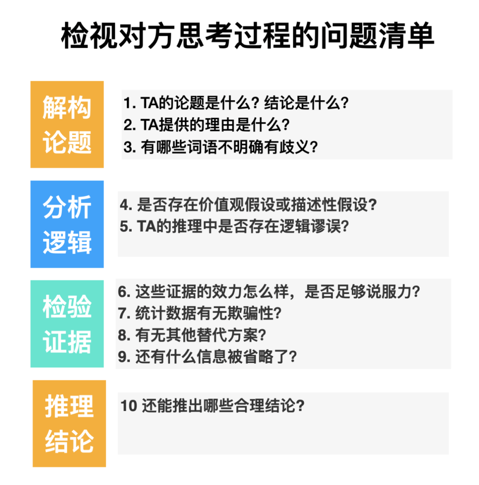

# 学会提问 Asking The Right Questions:A Guide to Critical Thinking Neil Browne

## 学会提出好问题  

* 好多影评家迫不及待的告诉我们，哪些电影不容错过，哪些电影不看为妙。可是他们的看法到底有哪些我们可以笃信不疑呢？你需要发展相关技能，树立正确态度，这样才能自行判断出哪些观点能为我所用，从而形成你自己的观点。  

### 一切从批判性思维开始  

* 激发你的批判性思维  
* 两种思维方式：海绵式思维和淘金式思维  
* 淘金式思维举例：美国该禁枪吗  
* 争议的正确答案莫非只是神话  
* 最好先问一问“关我什么事”  
* 弱势批判性思维和强势批判性思维  
* 亲自动手才更有乐趣  
* 也许我们根本就问错了问题  
* 价值观决定人与人之间的互动  
* 理智思考和感情用事  
* 让对话一直进行下去  
* 一厢情愿是批判性思维的最大劲敌  

## 论题和结论是什么 

如果找不准博客作者、演讲者的结论，你就会曲解别人的意图，这样做出的回应也就显得驴唇不对马嘴。  
“是什么”问题和“应不应该”问题  
他到底在说什么啊  
他想让我相信什么结论  
找到结论有线索可循  
轮到你自己写时，可得吸取教训  

## 理由是什么 

只有问一问别人为什么持有这样的观点，并得到一个明确的答复，才能公正地判断为什么应该同意它。  
他为什么相信这个观点  
找到理由有提示词  
理由是模具，结论据此成形  
轮到你自己写时，可得吸取教训  

## 哪些词语意思不明确 

如果每个词都只有一种潜在的含义，而且大家都认同这个含义，那么迅捷有效的交流就更有可能实现。可惜的是，大多数词语都有不止一种含义。  
让人捉摸不透的多义词  
找准关键词  
检查有没有歧义  
判定歧义  
看看上下文，这才是它的真实含义  
字典里的定义不一定适合文章里的情境  
小心那些饱含感情色彩的词语，它会让你的思维短路  
谁想要说服你，谁就得负责解释清楚  
轮到你自己写时，可得吸取教训  

## 什么是价值观假设和描述性假设 

在所有的论证中，都有一些作者认为是理所当然的特定想法，但通常情况下他们却不会明说出来。就好像你眼看着魔术师把手帕放进了帽子里，出来的却是一只兔子，而你压根儿就不知道魔术师暗地里到底玩的什么把戏。  
到哪儿去找假设  
找出幕后遥控的价值观假设  
两种价值观冲突时宁要哪个  
典型的价值观冲突  
对方的背景可以作为价值观假设的一个线索  
可能发生的结果是价值观假设的重要线索  
如果争论的人采取相反的立场，他们会关心什么  
一个例子：关于竞争与合作的争论  
价值观及其相对性  
找出没说出来的描述性假设  
找到描述性假设的一些线索  
避免浪费时间分析无意义的假设  
轮到你自己写时，可得吸取教训  

## 推理过程中有没有谬误 

判断交流者的推理是不是以错误的假设为基础，是不是通过逻辑上的错误或带有欺骗性的推理来糊弄你，就要特别小心推理过程中的那些诡计花招。  
不用死记硬背各种谬误的名称也能找到推理中的谬误  
有可能假设是明显错误的  
推理理由谬误百出  
警惕分散注意力的干扰  
愚弄人的循环论证  
推理错误小汇总  
扩展你关于谬误的知识  
轮到你自己写时，可得吸取教训  

## 证据的效力如何

如果有人对出示证据这一简单要求的反应是怒火中烧或退避三舍，往往是因为他们觉得尴尬难为情，因为他们意识到，没有证据，他们对自己的看法本来不应该那样底气十足。  
我为什么要相信它  
事实断言可靠吗  
证据从哪儿来  
直觉作为证据可靠吗  
个人经历作为证据可靠吗  
典型案例作为证据可靠吗  
当事人证词作为证据可靠吗  
专家意见作为证据可靠吗  
引用套引用的问题  
轮到你自己写时，可得吸取教训  

## 证据的效力如何：个人观察，研究报告和类比 

从某种意义上说，所有类比都是错误的，因为它们做出了错误的假设：因为两样东西在一两个方面有相似之处，它们在其他重要方面也必然会有相似之处。  
个人观察作为证据可靠吗  
研究报告作为证据可靠吗  
研究结果能采用吗  
样本能够代表整体吗  
调查和问卷的回答真实吗  
一个例子：对取消终身教职的批判性评价  
类比作为证据可靠吗  
轮到你自己写时，可得吸取教训  

## 有没有替代的原因 

人类都有这种强烈的倾向，愿意相信如果两件事紧随前后发生，那么第一件事肯定导致了第二件事。比如你可能在写出一篇极出色的论文的同时戴了某一顶帽子，所以现在你一逢到写论文就坚持非要戴同一顶帽子不可。  
有果必有因  
可能的原因不止一个  
找到更多的替代原因  
唯一的原因，还是原因之一  
组间差异的替代原因  
相关不能证明因果关系  
“在这之后”不等于“因为这个”  
很多事件并不只有一种解释  
哪个原因更合理  
轮到你自己写时，可得吸取教训  

## 数据有没有欺骗性

当你遇到听起来让人动心的数字或者百分比，一定要当心！你可能需要其他信息来判定这些数字到底有多让人动心！  
不知来历的和带有偏见的数据  
令人困惑的平均值  
把一个结论改头换面包装成另一个结论  
省略数据也是欺骗  
表述方式不同效果更加动人  
轮到你自己写时，可得吸取教训  

## 有什么重要信息被省略了  

说服力不够强的推理，并不是因为说出来的不顶用，而是因为省略掉的太关键。就像马眼睛上所戴的一副眼罩，眼罩让马心无旁骛全神贯注于正前方的道路，但是眼罩同时也阻止它去关注某些特定的信息——也许是至关重要的信息。  
接受说服之前，先打个问号  
不完整的推理在所难免  
识别省略信息的线索  
考虑是否有负面效果  
面对信息缺失的现实  
轮到你自己写时，可得吸取教训  

## 能得出哪些合理的结论  
很少有重要的问题我们可以用简简单单的“是”或斩钉截铁的“不是”来回答。  
各种假设和多个结论  
二分式思维方法：妨碍我们考虑多种可能性  
两面还是多面  
寻找多个结论  
某个条件下才合理的结论  
以解决问题为导向的可能结论  
让思维更加灵活  
不是所有的结论都生来平等  
更多可能的结论，更多可能的自由选择

## 批判性思维

* 对思考的再思考，关注的是对方提出某些观点背后的思考过程，找出哪些是合理的，哪些是不合理
    - 一套相互关联、环环相扣的关键问题意识
    - 一种恰如其分提出和回答关键问题的能力
    - 一个积极主动利用关键问题的愿望
* 学习批判性思维的目的不在于批判对方，而在于对双方思考过程的审视。通过改变思维方式、问对问题、与良师益友的促膝交谈、以及培养价值观倾向，可以促进有效的沟通和理智的决策，让你的思考越来越有洞见。当我们有能力去拒绝一个观点的时候，才是真正理解它的开始。

### 改变思维方式

- 海绵式思维：像海绵一样尽可能多的吸收所有知识，并且保证滴水不漏，它强调获取信息，重点在于记忆和理解内容
	+ 好处是吸收的越多，海绵中的知识就越多，就越能体会到世界的千头万绪，为日后进行复杂的思考积累基础。它的心理加工是大脑的注意和记忆。
	+ 问题就在于它是块海绵，工作模式是被动的。海绵式思维在学习和思考的时候并不需要自己本身的发力去冥思苦想，因为它的一切宗旨是先吸收了再说，多了总是好的。
	+ 要发挥作用则是需要外部动力去挤压的，一旦没有外部力量，海绵自身吸收的会越来越大，就导致只有搜集信息的能力却没有处理、判断、识别信息的能力。如果长时间依赖海绵式思维，那么就会形成像小明这样读到什么接收到什么，进而相信什么的习惯。各种认知税就这么交了出去，并且越交会越觉得有问题，又会拼命的寻找新的知识，陷入恶性循环。
- 淘金式思维：像矿工在淘金，筛掉泥沙，把金子找出来变为己有。它强调在获取知识的过程中要仔细琢磨，提出自己的质疑，然后对接收的信息和观点做出取舍和判别，找出真正有用的。TA总是爱问为什么，总会问各种的问题，提出自己的思考。
	+ 主动的，需要打造自己的工具，主动去判断和评价所见所闻的真相，找到合适的为你所用。
- 两种思维并非互相排斥，因为得先有了一些知识才开始淘金。但是，很明显这两种思维模式中淘金式思维更主动的调动大脑，展开互动，提出问题，质疑评价，不断内化和积累自己的飞轮，是一个更有效的方式。这种思维模式也就是批判性思维。**激发批判性思考的第一步就是要改变思维方式，从海绵式思维切换到淘金式思维。**

### 使用检视问题清单

- 训练思维的最好方式就是有目的的不断思考。苏格拉底的问答法是激发批判性思考的最有效方式，在不断提问和回答的过程获得对大脑的强化训练和灵感
- 从论题、推理逻辑、证据效力、结论四个角度向对方提问TA的思考过程
- 复盘自己的思考过程，向你自己提问在刚才的过程中是否有遵循淘金式思维的思考和质疑、询问和评价、为自己淘到金子和舍弃泥沙的过程。同时，对这些问题清单不断迭代，积累错题本经验本，持续升级固化。

### 寻找良师益友

- 思维之所以难以训练是因为它改变的是对思考结构的再思考。要了解你对于思考的思考，至少需要在你的认知或心智中建构两个角色：执行者和检查者
- 寻找一些可以探讨此类问题的老师或同行中人，借用外脑的作用，激发我的思考，避免长期陷入思维的死胡同。与此同时，这种社交式的对话还会促进对问题思考的深度和广度，进入新一轮淘金的开始，颇为”养脑“。

### 培养匹配的价值观倾向

- 《学会提问》中明确的指出批判性思维的最大障碍在于你的价值观倾向。**任何人之间的互动到底怎么样起作用，取决于你的价值观，以及你从那些互动人士身上体会到的价值观。**
- 修炼批判性思维的目的是能客观看待信息，理智的去工作和决策
- 实际上作为一个社会人，我们又如何阻拦得住行为的诚实表达：只愿与我们有相同价值观的人相处和交流。这也就导致了最大的挑战是如何去理解那些和我们的价值观背道而驰的人的分析推理方式。反过来，在与思维对话的路上，我们又只愿听取那些和我们价值观取向相似的人的观点，这就给批判性思维的训练带来了双层的阻力
- 从底层逻辑去修正上层建筑以达到更好的效果。这些价值观倾向会提醒我们去关注生活在对角线的他们的思考。这些价值观包括：
	+ 自主性：主动形成自己的结论，还要主动从更加广阔的范围内听取意见，包括那些与我们价值观取向不一样的人和观点，从而做出更加好的选择。
	+ 好奇心：兼听博观。要想成为一个批判性思考的人，你需要对自己遇到的一切不断地提问，只要他们的观点符合批判性思维的检查列表，就需要去接纳和吸收，从而可以将你从当前偏听偏信的状态中彻底解放，做到真正意义上兼听和博观。
	+ 谦恭有礼：“我唯一所知的就是我一无所知。-苏格拉底”。随着时间的延伸，就会越感知到自己的无知。对世界、对生命、对系统规则的认怂与臣服是早晚的事，你只不过是按照规则在系统中运行的一个粒子，他也是。谦恭的意识会让我们刻意的避免批判性思维最大的障碍：相信凡与自己意见相左的人都是立场狭隘，而自己则立场公正。
	+ 以理服人：观点和结论不同，我们需要倾听他人的声音，我们也需要理性决策。论据可靠有效、论证过程逻辑严谨。不论怎样，都要有理有据。这是批判性思维的核心。

## 是什么

### 取得绝佳业绩的秘密就隐藏在提问之中

* 假如只给我一个小时的时间拯救世界，我会先花55分钟去发现问题，然后再用余下的5分钟解决问题。这是爱因斯坦说过的一句名言。
* 越是重要的问题，在着手解决之前，越是应该问一问：什么才是问题的本质所在？
* 通过提问，可以准确地把握问题的本质。
* 如果想摆脱理所当然的思维定式，需要养成两点意识：
	-   要对理所当然的事物抱有疑问。
	-   通过提问让大脑运转起来。
* 提出问题可以改变我们看世界的方式，甚至改变这个世界的构成方式。

### 你要试着进行提问

* 提问带来的好处，大致可分为以下6个，并将依次说明：
	-   梳理杂乱的信息→整理信息，减轻工作上的烦恼
	-   找出事物的本质，缩短所需时间→减少工作中的无用功
	-   将不同的事物联系起来，发散我们的思维→更容易催生新点子
	-   引导至正确的方向→为工作上遇到的瓶颈或思维困境找出突破口
	-   改善人际关系→并非说服对方，而是以提问的方式让对方主动地采取行动
	-   改变自我→可以帮助自己找出真正重要的或想做的事情，从而立刻付诸行动

* 想要缩短工作的时间，可以问问自己：
	-   此时此刻，要将自己的注意力集中在哪件事情上？
	-   这真的是必须做的工作吗？
	-   这件事情很重要吗？

* 经常要挂在嘴边的问题：
	1.  真正的问题是什么？
	2.  真正重要的事情是什么？

* 问题应该只有一句话：问题本身必须足够简短且能抓住事物的本质。
	- 提问的共通之处就是能够让我们跳脱出条条框框的束缚。
	- 通过“简短的一句话问题”能让我们的焦点重新回到重要的事物上。而如果我们明白了什么才是自己眼下最为重要的事情，就能够舍弃其他多余的。
* 好的提问四个方向
	1.  询问事物的本质→抓住问题的核心例如：到底……？
	2.  面向未来的问题→寻找到“原本应有的姿态” 例如：为了这个目标，眼下应该怎么做呢？
	3.  跳脱条条框框的束缚→拓宽可能性 例如：真正想去完成的大事是什么呢？
	4.  引导对方说出真实想法→激发对方 例如：对你来说，什么才是真正……？

* 用来解决问题的提问笔记
	-   问题
	-   为什么
	-   到底
	-   如何
* 什么是“好的提问”:
	-   询问事物的本质
	-   Where哪里出现了问题？
	-   Why为什么会变成这样呢？
	-   How该怎么做呢？

* 从“必须……”中跳脱出来
	经常自问：什么才是自己真正想做的事情？重要的是，我们应时常自问：什么才是自己真正想做的事情？这样才能避免为了迎合他人而使自己变得不幸。
	- 这个世界上根本就不存在真正意义上的失败。
* 为了提高人生的质量
	-   提问带来新的想法
	-   注重五感违和感
	-   让自己回到正轨，“自己真正想去做的事情是什么？”
	-   提出“回顾性”的问题，“自己发生了什么改变呢？”，“自己身上具备了什么价值呢？”
	-   重新找回自己，“能否将眼前的工作变成让自己兴奋的事情呢？”，“给多少钱都不愿意改变的事情是什么？”
	-   不要以不安的情绪来做事，“你是以什么样的想法来做事的呢？”
* 越是困惑迷茫的时候，越是可以通过“提问”来改变现状
	-   “那真的是重要的事情吗？”
	-   “为什么你会认为那是很重要的呢？”
	-   “这么重要的事情将会带来什么？”

## 做法：不同场景下的“提问”列表

* 了解事物的本质
	-   到底为什么会发生这样的事情呢？
	-   问题出在哪儿？（Where）
	-   为什么事态会变成这样？（Why）
	-   应该怎样做呢？（How）
* 面向未来的提问
	-   想要有一个怎样的未来？
	-  为了实现所期待的状态，眼下该做些什么呢？
	-   阻碍变化发生的事情是什么？
* 跳脱束缚，拓宽更多的可能性
	-   真正重要的事情是什么？
	-   真的是那样吗？
	-   也有这种可能吗？
	-   如果一切顺利的话，想要做什么呢？
* 鼓舞人心
	-   对你来说真正重要的事情是什么呢？
	-   一直以什么样的心情来面对工作呢？
	-   不考虑其他因素的话，最想做什么？
	-   能让你兴奋的事情是什么？
	-   用来解决问题的提问
	-   应该……呢？
	-   当前所面对的真正问题到底是什么呢？
	-   最重要的课题是什么？
	-   那真的算是重要的课题吗？
	-   他们到底需要的是什么呢？
* 将事物朝正确的方向推进
	-   真正想做的是什么？
	-   那真的很重要吗？
* 工作无法顺利推进时
	-   是什么让工作不能顺利推进呢？
	-   从什么时候开始变得不顺利的呢？
	-   为什么会不顺利？
	-   原本我们想要达到的目标是什么？
	-   为什么会定那样的目标？
	-   这次的危机能给我们带来什么样的改变？
	-   怎样才能将其转变为机遇？
* 改变环境
	-   这能带来什么样的机遇呢？
	-   怎样才能将事态向前推进？
	-   这具有什么样的意义呢？
	-   催生思想的提问
	-   目标客户会为了什么而消费呢？
	-   原本他们的消费需求是什么？
	-   他们所需求的真正价值是什么？
	-   真的是那样吗？Pain or Gain?（是痛点还是益处？）
	-   在哪里完成那件事？
	-   （关于有益的价值）到底是指哪一方面呢？
	-   让沟通更顺畅的提问
	-   他之所以那样说的背景原因是什么呢？
	-   当前，现场发生了什么状况呢？
	-   提升工作效率的提问
	-   真的那样做就没问题了？
	-   能不能更进一步呢？
	-   眼下，怎样做才能将工作成果最大化呢？
* 回顾之前的工作
	-   为什么能够顺利推进？
	-   （如果顺利的话）这对今后会产生什么样的影响？
	-   没能获得成果的原因是什么？
	-   自己发生了哪些改变？
	-   掌握了哪些知识或技能？
* 没有任何浪费，缩短工作时间
	-   眼下必须马上去完成的工作是什么？
	-   当前最应该集中精力去做的事情是什么？
	-   那件事真的很有必要的？
	-   那真的是很重要的事情吗？
	-   如果不去做的话，真的会变成一个问题吗？
	-   对方真正想了解的是什么？
* 避免滥用信息
	-   真的是那样吗？
	-   这个人所说的内容是基于什么样的前提呢？
	-   打动人的提问
* 了解对方的意图
	-   什么时候会需要用到？（When）
	-   会在什么场景下使用到？（Where）
	-   对方想成为什么样的人呢？（Who）
	-   无法回避的重点内容是什么？（What）
	-   这项工作的目标是什么呢？（Why）
	-   以怎样的方式来使用呢？（How）
	-   真的如此吗？（跳脱出思想束缚的提问）
* 激励对方
	-   为什么会选择那种方法？
	-   那真的是很重要的事情吗？
	-   对于现状是怎么考虑的？
	-   什么是导致无法取得成果的罪魁祸首？
	-   不愿意去做的原因是什么？
	-   改变对方想法的提问
	-   眼下，对什么事情感到迷茫呢？
	-   目前最介意的事情是什么？
	-   当前，把大量的时间都用在什么事情上了呢？
	-   你想达到什么样的状态？
	-   最想去完成的大事是什么？
	-   你的理想是什么？
	-   那真的是一件重要的事情吗？
	-   为什么会认为那很重要？
	-   重要的事情会带来什么样的影响？
	-   什么事情是不去完成也没有问题的？
	- “是因为某种情结吗？”发现其内心的真实想法
* 不情之请
	-   你能去完成这件工作吗？
	-   如果是这样的条件，你怎么认为的？
	-   这个和那个，你觉得哪个更好呢？
* 了解对方的价值观
	-   最近，你最关注的事情是什么？
	-   最近，曾感动你的事情是什么？
*  提升团队实力的提问
	-   此时此刻，正在想些什么？
	-   什么让你感到厌烦呢？
	-   原本我们想要达到什么样的状态？
	-   我们的初心是什么？
	-   到底是为了什么而努力工作呢？
	-   团队成员的强项都体现在哪儿？
	-   将各成员的强项汇聚起来，那团队的优势体现在哪儿？
	-   团队的实力以及应被重视的事情是什么呢？
	-   该如何发挥团队的实力呢？
* 团队成员发生冲突时
	-   现在，到底发生了什么状况？
	-   当前团队内的气氛是什么样的呢？
* 头脑风暴、会议
	-   那真的是很重要的吗？（某项工作推进缓慢时）
	-   此时此刻，我们在思考什么呢？（会议陷入僵局时）
	-   眼下，发生了什么状况？（会议陷入僵局时）
	-   现在最介意的事情是什么呢？（会议陷入僵局时）
	-   最想重视的事情是什么？（会议陷入僵局时）
	-   此时此刻，大家都是什么感受呢？（气氛变得生硬时）
	-   我们的初心是什么呢？（改变想法）
	-   提高人生质量的提问
	-   自己觉得最应该去完成的重要事情是什么？
	-   如果今天是生命中的最后一天，你还会继续去完成今天想做的  
		事情吗？
	-   自己真正想去做的事情是什么？
	-   能让自己开心的事情是什么？
	-   给多少钱也不愿意改变的事情是什么？
	-   能否将眼前的工作变成让自己兴奋的事情呢？
	-   拥有什么才能让自己快乐地生活？
	-   真的只能那样了吗？
	-   你是以什么样的想法来做事情的？
	-   如果可以选择，你想要什么样的未来？
	-   消除烦恼的提问
	-   什么事情让你感到头疼？
	-   你觉得哪方面无法顺利往前推进？
	-   那真的是很重要的事情吗？
* 被否定时
	-   如果把这视作一次机遇，其中蕴含了什么样的机遇呢？
	-   那样说的前提是什么呢？