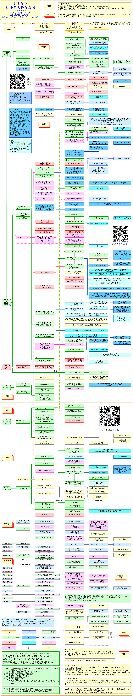

# 阅读

* 幸福感最大瓶颈就是阅读速度

* “亲情里最刻骨铭心的不是父母的伟光正，而是父母卑微、猥琐 、慌张、无助、茫然的镜头。” 评价《背影》
* 时间
  - 使人觉得遥远的不是时间长，而是两三件不可挽回的事。 ——博尔赫斯
  - 我不明白时间是什么。我不知道世界上有何办法，能最真实地测量时间。我知道用时钟测量时间的办法并不真实：它只是从外部把时间作空间性的分割。 我也知道靠情感来把握时间不真实：这不是分割时间，只是分割对时间的感觉。梦的时间当然也纯属错误：我们在梦中滔滔流逝的时光，一会儿光阴似箭，一会儿度日如年，而我们现实体验的时间既不快也不慢，它仅仅取决于时光流逝的特定方式，取决于我不能理解的时间本性。 有时候，我认为一切事物都是虚幻，时间仅仅是用来环绕这些事物的一个框架，从而使其异变。——佩索阿
  - 问题：怎样做才能不浪费时间？ 答案：在时间的漫长中体验时间。 方式：在牙医的候诊室里，坐在不舒服的椅子上度过几天；在自己的阳台上度过周日的下午；听别人用自己不懂的语言作报告；选择最长的路程和最不方便的铁路线旅行，当然还必须站着旅行；去剧院的售票窗口前排队却买不到票，等等。——加缪
  - 过去、现在和未来之间的区分只有一个（纵然是顽固的）幻觉的意义。——爱因斯坦
  - 生活不是我们活过的日子，而是我们去记住的日子，我们为了讲述而在记忆中重现的日子。——马尔克斯
  - 时间究竟是什么？没有人问我，我倒是清楚，有人问我，我想说明，便茫然不解了。——奥古斯丁
  - 时间是快的，大人虽不见老，孩子却一天一天的不同……大人总喜欢在孩子的身上去触到时间。——萧红
  - 时间在向后移动，所以我们看见的全是过去。——刘亮程
  - 只有当我们陷入烦恼的痛苦之中的时候，时间才会驻足不前。——叔本华
  - 时间不是流逝的，流逝的是我们。——高铭
* 春有百花秋有月，夏有凉风冬有雪，若无闲事挂心头，便是人间好时节。饥来食，困则眠，热取凉，寒向火，平常心即是自自然然，一无造作，了无是非取舍，只管行住坐卧，应机接物。
* 读什么书，往往与性情有着密不可分的关系.即使是同一个作家的作品，也有个读得进和读不进的差别，与写得好坏关系不大
* 寻常读书，只要能够引起一点共鸣，已经足够愉悦，与懂不懂没啥关系；甚而至于，只要能让自己处在一种阅读的过程和状态之中，并不在意懂不懂，更不会有懂不懂的焦虑，免得败了读书的兴味
* 也许忧伤并不可耻，但我们需要重新诚恳地看待它，并且从那些析出的沉淀中找出另一些更有意义的获得，并且将这些获得意义铭记，将剩下的忘却，或者原谅。在这样的过程中去成长，而且感恩。
* 书的本质，是孤独的作者与破碎的社会之间的一种交流方式

## 习惯与方法

* 熟练到可以用潜意识即可完美完成的地步。"通读"是做工程师必须的能力。不一定要全部能够理解（对任何人来说，最初都不可能做到），但必须对整个文档有一个整体的认识。这就好像读书的时候，能做到虽然不能完全读懂，但确实能够完整读完
  - 之后再多读几遍么！古人说的是对的：读书千遍其义自见。还有就是，若是从一开始就没有"通读"的意识，后面不知道会吃多大的亏，而且吃了多少亏自己都完全不知道...... 这很可怕。优秀是一种习惯"真的并不是空话，是放之四海皆准的道理。随后的过程中，我们会建立很多很多的好习惯，甚至这句话本身也会在各个地方重复
  - 生活质量就是这样一点一点提高的，放在哪个领域里其实都一样
* 学任何工具，第一件事情就是去把官方网站翻个遍，是必须的习惯
* 习得任何技能的最根本技巧，就是一句话而已：马上开始像那些已经精通这个技能的人一样生活
* 保持耐心，反复来过，直至成功
* 学习过程中必须学会的思考模式（Mindset）和行为模式（Action Pattern）
* 随时准备深入了解某个小领域 借助地球上最强大的人工智能（Google）找到学习资源 给自己一小段时间刻意练习 不怕死记硬背，更要善于死记硬背，通过短时间内的大量重复，把那些别人看起来枯燥的东西迅速变成自己"内建的技能"
  - 通过刻意练习将其熟练到"想都不用想就能用的地步"
  - 给自己定个"最后期限"，比如一小时之内一定做到把这些命令谙熟于心
  - 绝对不能"过些天就想不起来了"，否则，那就是思考监管的"只因为学习习惯不好造成的永久性愚蠢"。
* 再提醒一遍，别忘了给自己洗脑："只搜索、只阅读英文文档"，有中文的也不能看，就是不能看......
* 每次脑子里闪出"呀，好麻烦！"这个念头的时候，就要知道自己脑子脏了，该洗了。无论干什么都挺麻烦的，怕麻烦的人什么都做不成，躲避麻烦的唯一正确方式就是"不怕麻烦，逐一完成"，否则就会反复麻烦一辈子又一辈子（甚至会遗传，不耐心的父母必然养出不耐心的孩子）。凡事道理都是一样的，有一句口头禅："偷懒的唯一方式就是不偷懒......" 也还是一样的道理
* 一切的学习与创造，都是学习者与创造者的生活方式、生活内容。去目标技能拥有者最活跃的地方生活，像他们一样生活，直至真的就那么生活。这就是学习与创造的另外一个更为生动、更为本质的描述。
* 用 Github 做开发中必须的重要事情
  - 备份自己的代码
  - 文档与代码的版本管理
  - 相互最高效地交流与协作
  - 通过展现有效活动而获得更高信用
  - 更方便地展示自己与自己的成果
* 每天思考：80% 的时间用来思考，20% 的时间把思考结果用代码表达出来，这个思考的过程包括反复搜索(search 多了，就叫 research)，深入阅读各种文档（因为今天的工程师必定要用到大量别人写好的模块），还要思考自己写出来的代码如何写好文档才能让更多的人使用
* 一边思考，一边写写画画，一小时不知不觉就会过去
  - 我将要解决的问题是什么？
  - 最重要的问题是什么？
  - 它的核心关键在哪里？
  - 已有的解决方案都有哪些？
  - 我如何才能给出一个更好的方案？
  - 我的方案应该如何拆解，如何逐个实施？
* 事情的关键往往在另外一个领域中。在中国想要成为工程师，竟然有很大的一个关键并不在于技术本身，而是在于英语阅读能力；再比如说，即便成为了一个入门级的工程师，驻足不前的根本原因并不在于技术难关无法攻克，而是在于平时的思考习惯不良，或者干脆没有真正深入思考的习惯......
* 坏习惯
  - 只阅读，不思考，人会患上知识不育症：过程中，一定要保持问题意识和敏感性，知道在哪个节点，你应该适时停下来，思考一下
* 读书的终极意义，不是记住多少知识，而是要学会思考，提高自己对现实问题的理解和判断能力
* 思考的冲动大多源于批判的冲动。在生活中，不能只关注正能量。美好的东西让你感到舒服，却在不知不觉中消解了你思考问题的冲动。适当关注一些负面的东西，有助于点燃思考的热情，促使你试图通过阅读寻找答案。一个只关注正能量的人，多半是陷入思维的牢笼，不喜欢思考的人
* 人文社会科学所有问题的终极指向都是政治。回避政治，你的阅读和思考很难深刻起来。一个从来不关心政治的读书人，其学养非常值得怀疑。特别是历史学科的人，因为历史叙述的主流是政治史
* 一个真正热爱读书的人，看重的应该是书带给你的精神愉悦，而不是它的工具价值。读有质量的好书，能在无形中提升人的审美品位，进而帮助你打造自己独特的生活美学
* 知识结构、人文情怀和审美素养，共同组装在一起，构成大脑里的一套接收装置。它决定了在相同的环境中，不同的人能看到什么
  - 当地社会文化
  - 旅行当成文本之外的另一种阅读。旅行是一次人文体验，应该试着以他者的眼光，考察当地静态的历史和动态的文化与生活
  - 朝鲜最值得看的是，人的日常生活、外在形象、精神面貌......如何被政治塑造，以及雕塑、纪念碑、民用建筑和城市规划等等，如何诠释高度政治化的美学理念

## 经典图书

* 需要不断被重读——每一次重读都会有新的体会
* 书籍并非读的越多越好——大多数书籍只是经典书籍中的概念延伸（有时甚至是照搬）
* 关于读书，读书的习惯和习惯性的读书，是两回事。不要觉得没办法独处或希望独处，或是没什么别的事情干，才读书。而是把读书当做爱好的一部分，当做自我存在的证据。
* 主动阅读：越是简单的概念，其背后的内涵往往越厚重。『主动阅读』四个字简简单单，但是背后就涉及时间管理、习惯养成、科技趋势、制度流程和系统、书单、『如何阅读一本书』这类关于读书的书，甚至，『WHY』这个终极问题都息息相关。是啊，读书早晚会忘，为什么还要读书？

## 方法

* 从简单到复杂，再回到简单
  - 先把简单的事情做复杂：搭建读书系统，确定读书规则。
  - 找到适合你的工具、制度和规则，构建推动不断实现目标读书系统
  - 从复杂回归简单：行动、行动、行动
    - 每天读30分钟书
    - 每读完一本都做总结输出
+ 读一本书
  * 系统的阅读，至少要做到把一本书从头看到尾，跟着作者的逻辑，看他怎么一步步推演到结论
    * 直接把结论告诉我，我没有耐心读书。告诉你结论容易，但是没有用，我告诉你伟大的经济学家罗斯巴德的结论就是4个字：产权至上，它能成为你的分析工具吗？不能，因为你不知其所以然，一定要有足够的耐心啃完他的主要著作，你才知道怎么回事，养成耐心，才是阅读的首要收获，这样，以后你看到一个观点时，你会理一理它的逻辑链条，95%以上的热闹观点，对你就没用了，因为经不起推敲。
  * 学第二语言
    - 当初学英语时，给自己定的时间就是至少5年，时间维度一拉长，开始学习的焦虑感就基本消失
    - 每天看5页，5年近万页
    - 罗素的《西方哲学史》
+ 笔记 分拆
+ 有选择的看书，建议做笔记、写读后感

## 走在人生边上

* 在这物欲横流的人世间，人生一世实在是够苦。你存心做个与世无争的老实人吧，人家就利用你欺侮你。你稍有才德品貌，人家就嫉妒你排挤你。你大度退让，人家就侵犯你损害你。 你要不与人争，就得与世无求，同时还要维持实力准备斗争

## 活出生命的意义

* 弗兰克尔发现可能找寻到生命意义的三个途径：工作（做有意义的事）、爱（关爱他人）以及拥有克服困难的勇气。苦难本身毫无意义，但我们可以通过自身对苦难的反应赋予其意义。

## 钻石与铁锈：琼·贝兹自传

## 安静的美国人

## 《幸福散论》 阿兰

## 《退步集》

* 反对构造一个不断进步的阶梯和信念。因为把“理想”想象为进步之路的“高级阶段”，那理想就永远无法达成。

## 历史的教训

## 基地

## 机器人

## 帝国

## 《城市发展史》

## 《美国大城市的死与生》

## 蝇王

## 遥远的救世主

## 美丽新世界 阿道司·赫胥黎

## 动物农场

## 道德经

## 死神的精确度 [日] 伊坂幸太郎

## 鼠人

## 地下室手记

## 局外人

## 古拉格群岛

## 荒原狼

* 因为我跟你一样。因为我也和你一样孤独，和你一样不能爱生活，不能爱人，不能爱我自己，我不能严肃认真地对待生活，对待别人和自己。世上总有几个这样的人，他们对生活要求很高，对自己的愚蠢和粗野又不甘心。读书的目的不是为了求异，而是为了求同,不要向作者发号施令，而要设法变成作者自己。做他的合伙者和同伴。

## 红楼梦



## 龙族

* 象龟
* 朝比奈实玖瑠

## 日瓦戈医生

## 阿特拉斯耸耸肩

* 总结20世纪早期社会主义者的辉煌胜利经验，哈耶克说自由主义者也应当有自己的乌托邦构想以吸引知识分子的兴趣和投入，满足他们的知识探索热情
* 个人的自由选择是最重要的，任何一个自由的世界，应当是可以自由的进出和退出，自由世界应该有能力向大家证明他是有能力获得兰德说的有理性、有头脑、有思维能力的人最终认可的

## 麦田的守望者

* 当年轻时，可以为崇高的理想而选择光荣的死，当年长时，可以为崇高的理想而选择卑贱的活。我们每个人都应是守望者，守望我们的心智，我们的理想，以防它在生活中不知不觉地坠落和被自己遗忘。在平庸的活着和无悔的死去这两者之间，我义无返顾地选择后者。因为“人因梦想而伟大”。

## 生活与命运

* 瓦西里·格罗斯曼却在书里提出了许多永恒的问题，“人失去自由，究竟意味着什么？”“人生的实质是什么？”“人究竟是不是为星期六活着？”
* “可是，人生的实质就在这里面。人与人是否联合，这种联合是否有意义，决定于是否能达到唯一的主要目的，这主要目的就是：为人们争取权利，做各自不同的人、各有特性的人，各人有各人独立的感情，都能独立地思考，独立地生活在世界上。”
* 维克托昧着良心签署那份害人声明,他的动机，其实只不过是至简单的人性需要罢了；那就是他人的温暖认同，一种被友侪围绕的感觉。

## 漫长的告别

## 繁花

## 爱的艺术

## 阅读的故事

## 墨菲定律

* 解决问题的手段越高明，面临的问题越麻烦

## 解忧杂货店

* 东野圭吾曾这样谈及创作《解忧杂货店》的缘由：“如今回顾写作过程，我发现自己始终在思考一个问题：站在人生的岔路口，人究竟应该怎么做？”

## 祈念守护人

* “我总是写有人死掉的故事，偶尔也想写写怎样让人活下去。”——东野圭吾
* 东野圭吾曾说“偶尔也想写写怎样让人活下去”，这本书中不仅有关于人生的答案，还可以找到自我和解的路径和内心深处的安宁。
* 宫崎骏说：“只想做好半径五米之内的事，这样更能感到幸福。”或许东野圭吾也有同样的心境。中文版责编在读完《祈念守护人》后难掩激动的心情：“我们都是那么渺小而平凡，这没什么不好，而《祈念守护人》让我发现，就算是这样的自己，或许也可以有更加精彩的人生。”

## 失明症漫记

* 在脆弱艰险的境况中，人类的精神究竟可以坚持到何种地步。
* 我们都是这样的混合物，一半是冷漠无情，一半是卑鄙邪恶。
* 即使灾难降临在所有人头上的时候，总是有一些人比另一些人生活得更糟糕

## 修道院纪事

## 献给阿尔吉侬的花束

* 有一种残忍叫理解，有一种痛苦叫明白
* 我们的一生应该也是一直在走迷宫吧。查理笨拙而善良地开始了这项实验的“人体试验”阶段，起初他用错别字写下想要变聪明的时候，就让人心生柔软，也令人不忍心，想叫停，想劝他不如留着许多不解和迷惑，就这样单纯地快乐吧
* 从笨蛋到天才的极速上升，他会知道有些快乐不是真正的快乐，温馨的背后也许是阴谋，人们捧高踩低，甚至很少有人真正把低于大众标准的人当做“一个人”，明白一切且聪明的他自我挣扎，探索，和时间赛跑，只想找到“自我”。这个过程我想谁都会经历吧，也许时间长短不一，但总会有那样的想法：我是谁？我为什么而在这个世界上？
* 整个过程如同一颗橄榄，极速的心智发育之后是极速的退化。最后看到出现错别字的时候，我竟然松了一口气。查理回到自己的一亩三分地了吗？或许没有，但他应该也知道了，不管是聪明与否，善良真诚的他，都值得拥有朋友

## 棋王

* 直接面对最原始最基本的需求，才有永恒的震撼力。吃 书 电影，仪式
* 不做俗人，哪儿会知道这般乐趣？家破人亡，平了头每日荷锄，却自有真人生在里面，识到了，即是幸，即是福。
* 王一生孤身一人坐在大屋子中央，瞪眼看着我们，双手支在膝上，铁铸一个细树椿，似无所见，似无所闻。高高的一盏电灯，暗暗地照在他脸上，眼睛深陷进去，黑黑的似俯视大千世界，茫茫宇宙。那生命像聚在一头乱发中，久久不散，又慢慢弥漫开来，灼得人脸热
* 理想没有了，只剩下目的。倪斌，不能怪你。你没有什么不得了的要求。我这两年，也常常犯糊涂，生活太具体了
* 在文字结构方面，既不同于40年代以来的比较容易激动的革命浪漫主义，也有别于‘五四’以来的欧化文艺腔，很多句子直接来自于明清笔记

## 精进：如何成为一个很厉害的人

* 一个成熟的人，他的标准来自他的内心，而大多数人，却受环境所左右。一个年轻人，进入一所不那么优秀的高校，对自己的标准会不由自主的降低以适应这个环境，减少自身与环境的冲突，而这种做法对他们的人生也许是致命的。”
* “那些考入二三流大学的学生，因为高考本身带来的挫败感，二三流高校学生的身份设定及环境按时，不称职的老师所引发的失望以及同学间放任自流气氛的带动作用，都容易让他们在一个低标准下，自觉‘满意’的度过每一天。

## 人生海海

* 男孩儿的长大，都是从跟这个世界闹别扭开始的。就个人成长来说，当你青春很折腾，肯定是一种痛苦。但这可能也会增加生命的厚度
* 记起下面这种经历：觉得孤独，觉得难过，觉得身边所有人都跟自己过不去。年轻人在一起，就是刀子和刀子在一起。跟环境格格不入，硬着脖子，谁也不服气
* 前半段是爷爷
  - 为了儿子和家里的声誉出卖了上校，从此一家人在故乡被看不起
* 后半段是喜欢他的女人
  - 毁了他的事业

## 橘子不是唯一的水果

## 人类群星闪耀时

* 一个人类的群星闪耀时刻出现之前，必然会有漫长的岁月无谓地流逝而去。但是，这些时刻一旦出现，就“宛若星辰一般永远散射着光辉，普照着暂时的黑夜”。

## 布鲁克林荒唐事

## 斯通纳

* 斯通纳度过了很好的人生，不是世俗意义上成功的一生，但他却是真正活着、活过的人。他有不完美的婚姻，却拥有一段永恒的心心相惜的爱情；他有不成功的事业，一辈子被人嫉恨不得升迁，却拥有全身心去投入、去热爱、去奉献的知识与教育。
* 更难得，他在那个时代保留了温柔与爱，去对抗外在世界的残暴，去对抗妻子的病态，去女儿心中种下一颗种子，即使退缩到静谧之所、荒凉之地，父亲的爱仍是她保留的唯一的温柔。
* 直到年老，他仍然无法超越保留在心中的爱与激情，这是最大的不幸，却也是最大的有幸。
* 毕竟虽然每个人都有活着的机会，但不是每个人都真正的活过。

## 4321

## 那些忧伤的年轻人

* 真正感动人们的，从来不是思想，而是年轻的勇气

* 《六祖坛经》《狂热分子》
* 约翰伯格的《观看之道》
* 克拉克的《文明》
* 罗伯特休斯的《新艺术的震撼》
* 西蒙沙玛的《艺术的力量》

## 卡瓦利与克雷的神奇冒险

* 个人活在这个世间，无时无刻活在锁链的束缚之下，有形的无形的，来自社会的来自内心的，因此他内心深处总是存在着逃脱的欲望。就像是人们喜欢逃脱术大师胡迪尼，就是因为喜欢看到他从束身衣、绳索、锁链、笼子里逃脱出来。即便是观看那么个人，从无数难以摆脱的束缚和置人于死地的囚牢中脱身，也会让自己内心觉得有某种释放。

## 白痴
## 群魔
## 卡拉马佐夫兄弟

## 飞行家

## 呼吸

## 《错误》

* 马原的小说不仅在叙事技巧上影响了很多同时代的作家，而且他也提供了所谓‘文革’故事的另一个版本，一个荒诞、悲惨，但又隐含着道义和原则的版本。

## 阿兰德波顿

* 《爱情笔记》
* 《爱上浪漫》
* 《罪与罚》

## 地海传说

* 西方奇幻文学小说，作者是厄休拉·勒奎恩
* 《地海巫师》
* 《地海古墓》
* 《地海彼岸》
* 《地海孤雏》
* 《地海奇风》
* 《地海传说：短篇故事集》

## 《郁达夫小说集》

* 《迷羊》
* 《过去》
* 《逃走》
* 《茫茫夜》
* 《血泪》

## 战争与和平

## 丰乳肥臀

* 莫言接受采访时说自己5岁才断奶，书中患有“恋乳痞”的上官金童实则带有自己童年的影子；书中的“母亲”生育了八个女儿一个儿子，一生受苦受难，莫言的母亲也生育了8个子女，到生产那天，中午还在麦场打麦子，直到羊水浸湿了脚才被允许回家，这苦难的经历何尝不在书中再现；至于书中母亲吞咽食物再呕吐之后喂养儿孙的故事，也是莫言母亲和村里好几个女人的亲身经历。
* 大姐嫁给沙月亮，解放后被迫嫁给残疾军人孙不言，身体残疾的孙每到夜里就疯狂地折磨大姐，大姐上官来弟遍体鳞伤，后来爱上了在日本荒岛生存是近10年的鸟儿韩，最后打死了孙不言被处决；
* 二姐上官招弟嫁给抗日别动大队司令司马库，追随者她的偶像，最后中弹身亡；
* 三姐上官领弟代替大姐嫁给孙不言，神经错乱成为鸟仙，后练习飞翔摔死在悬崖下；
* 四姐上官想弟为了救全家自卖进入妓院，后接受残酷批斗旧病复发而死；
* 五姐上官盼弟嫁给爆炸大队政委，后在文革中自杀；
* 六姐上官念弟，嫁给美国飞行员巴比特，婚后第二天即被俘虏，后与巴比特同归于尽；
* 七姐上官求弟早年被卖给白俄女人，后被打成右派，因饥饿暴食生豆饼胀死；
* 八姐上官玉女，生而失明，困难时期因不忍拖累母亲投河自尽。
* 小狮子是红卫兵一样的人物

## 尘埃落定

* 旋风越旋越高，最后，在很高的地方炸开了。里面，看不见的东西上到了天界，看得见的是尘埃，又从半空里跌落下来，罩住了那些累累的乱石。但尘埃毕竟是尘埃，最后还是重新落进了石头缝里，只剩寂静的阳光在废墟上闪烁了。
* 就在这时，我突然明白，就是以一个傻子的眼光来看，这个世界也不是完美无缺的。这个世界上任何东西都是这样，你不要它，它就好好地在那里，保持着它的完整、它的纯粹，一旦到了手中，你就会发现，自己没有全部得到，这就是人性。
* 土司很锐利地看了太太一眼，说：“我宁愿相信一个傻子的话，有时候，聪明人大多了，叫人放心不下。”
* 为什么宗教没有教会我们爱，而教会了我们恨？
* 这个世界就是如此，人走在不同的道上，对世事的理解可以如此南辕北辙，如此相互抵牾。我却不能忍受自己对置身的环境一无所知。既然身处的这个自然界如此开阔敞亮，不试图以谦逊的姿态进入它、学习它，反倒是人的一种无知的狂妄
* 上天叫我看见，叫我听见，叫我置身其中，又叫我超然物外
* 看来，凡是血肉的东西都难于灵魂一样高扬
* 做一个傻子真好，做错了事情，想一想自己是傻子，心里就释然了
* 故乡是让我们抵达这个世界深处的一个途径，一个起点
* 从这些色彩精妙幻变的花朵上，让人想象自然之神也许有比我们更细致，更丰富，更自在的情感。表现这些颜色，文字其实无能为力，也许好的音乐更接近那种自由与丰富。其实，最有力的表现就是这些颜色它们自己，这些花朵它们自己，又喧闹又安静，在春天成都越来越明丽的蓝天下面
* 不想凡事都赢的人才是聪明人
* 一个傻子，往往不爱不恨，因而只看到基本事实

## 《母与子》

* 高度个人主义，是实现自我的和谐，从思想中提炼出强而有力的行动，去创造新的价值，这价值是出自于人的内心，但却会光照更多的人
* “一个真挚、漫长、富于悲欢苦乐的生命的内心故事。这生命并非没有矛盾，而且错误不少，它虽然达不到高不可攀的真理，却一贯致力于达到精神上的和谐。而这和谐，就是我们的至高无上的真理。”

## 《约翰·克里斯朵夫》

## 悉达多

* 我的生活确实古怪，他想，走过了奇怪的弯路。少年时，我只知道敬神和祭祀。青年时，我只知道苦行、思考和潜行，探索婆罗门，崇拜阿特曼之中的永恒。作为青年人，我效仿那些忏悔者，生活在森林里，忍受酷暑与严寒，学会挨饿，教自己的身体麻木。接着，那位活佛的教诲又奇妙地启迪了我，我感到关于世界统一性的认识又在我体内犹如自身的血液一样循环不已。可是，后来我又不得不离开了活佛以及他那伟大的真知。我走了，去向卡玛拉学习爱之欢乐，跟卡马斯瓦密学做买卖，积攒金钱，挥霍金钱，学着娇惯自己的肠胃，学着迎合自己的感官。我就是这样混了好多年，丧失了精神，又荒疏了思考，忘掉了统一性。就好像我慢慢绕了个大弯，从一个男子汉又变成了孩子，从一个思索者又变成了孩子般的俗人，不正是这样么？这条路也曾经美好过，我胸中的鸟儿并没有死去，然而，这又是怎样一条路哇！我经历了那么多的蠢事，那么多的罪恶，那么多的错误，那么多的恶心、失望和苦恼，只是为了重新成为一个孩子，以便重新开始。但这显然是正确的，我的心赞成，我的眼睛为此而欢笑。我经历了绝望，甚至堕入了最最愚蠢的想法，也就是自杀的想法，以便能得到宽大，重新听到“唵”，重新睡得好并且适时地醒来。为了能在我心中重新找到阿特曼，我不得不成为一个傻瓜，为了能重新生活，我不得不犯下罪孽。我的路还会把我引向何处？这条路怪里怪气，它绕着8字形，也许是在兜圈子。随它怎么走吧，我愿意顺着它走下去。
* 知识可以传授，但智慧不能。人们可以寻见智慧，在生命中体现出智慧，以智慧自强，以智慧来创造奇迹，但人们不可能去传授智慧。我年少时就有过这种疑问，正是我的怀疑驱使我远离教师们。我还有过一种思想，侨文达，你又会认为那是玩笑或只是一种愚蠢的念头，就是说，每一真理的反面也同样真实。比如说，只有片面的真理才能形诸于言辞；事实上，以语言表达或思维的一切都只能是片面的，只是半个真理而已，它们都缺乏完备、圆融与统一；当佛陀世尊宣讲关于世界的教义，他不得不把世界分为轮回与涅槃，虚幻与真如，痛苦与救赎。人别无选择，对于那些要传授教义的导师们来说尤其如此。而世界自身则遍于我之内外，从不沦于片面。从未有一人或一事纯属轮回或者纯属涅槃，从未有一人完全是圣贤或是罪人。世界之所以表面如此是因为我们有一种幻觉，即认为时间是某种真实之物。时间并无实体，侨文达，我曾反复悟到这一点。而如果时间并非真实，那么现世与永恒，痛苦与极乐，善与恶之间的所谓分界线也只是一种幻象。

## 思考，快与慢

* 太用力的人跑不远，真正坚持到最后的人靠的不是激情，而是恰到好处的喜欢和投入
* 直觉导致的偏见和失误
  - 典型性偏好，就是人们会过度关注典型事件，而忽视了典型背后的概率。最典型的案例就是盲人摸象，对事物只凭片面的了解或局部的经验，就乱加猜测，想做出全面的判断；以偏概全，不能了解真相，对于人的判断总会陷入这样的误区，由于没有足够的时间了解相处，我们总会以简单的观察和小事来评判一个人，效率确实提高了，但总会错过一些人或者事。
  - 可得性偏好。如果一件事情更容易出现在大脑里，人们就认为这件事情更容易发生，人对战争的死亡人数总额并不敏感，但对于一个偷渡小男孩淹死在大海中的故事会深表同情，马航事件之后，我不敢做飞机，那个案例过于吓人。网上爆出武汉疫情严重，有很多感染病例，那就不要回武汉过年了，当然不去更安全，去了真的有那么危险吗？武汉总共有1108万人，是不是都要逃离武汉呢？ 每个人成长轨迹和成功的原因各有不同，我们真的没办法因为身边有人做生意成功了，所以自己也要如法炮制，也不能完全听信某个人的意见，而忽略了整体的规律，我们很容易被系统1更容易感觉和理解的事情所打动，但理性却能给你更加客观和理性的答案。
  - 因果性偏好。系统1有个特点，喜欢对事物进行因果关系解释。它的解释是合理的吗？不一定，这在两种情况下特别容易导致偏见。人天生都有好奇心理，对于发生的事件总会先入为主找到某个原因来结束思考，看到富家女开豪车，就会恶意揣测他可能是小三，说不准别人是个年轻的企业家。主观臆断的内在原因是因为思维懒惰，脑回路带宽太窄，看不到更多的可能性，也不愿往前探索分析。
* 效应
  - 光环效应，是指你先接受了事物的一些信息之后，这些信息就会影响你对事物的整体判断和理解，基本就是先入为主，有人说，一见钟情不过就是见色起心，逻辑基本也是光环效应，典型性偏好是以偏概全，从某点判断整体，而光环效应却是以出现的先后顺序来判断一个人，由于人性确实有这个弱点，所以第一印象也就显得尤为重要。
  - 锚定效应，指的是你评估某一个未知事物之前，先会估计一个参考答案，这叫锚定值，然后再来调整。在脑海里没有任何头绪的时候，我们总是会被第一个提出的建议所影响，然后围绕这个建议的基线进行判断，由此会造成很大的误差。当然你也可以利用这个心理，在对方没有注意或者不方便给出答案的时候，你可以利用锚定效应来进行试探。
  - 框架效应，指的是同一个问题的不同描述，会导致你做出完全不同的决策判断。比如说，在描述某个手术术后病人生存情况时，有两种方法，第一种说手术后3个月内的存活率是90%，第二种说手术3个月后会有10%的病人死亡。这两种描述只是说法不同，其实含义是一样的。但是，实验证明，无论是医生这样的专业人士，还是一般社会公众，都觉得第一种方法更好。
  - 禀赋效应，是指当你拥有某个物品之后，你就会觉得它价值更大。比较起来，你对损失和获得的敏感程度是不同的，在损失时遭受的痛苦感，要大大超过获得时收获的快乐感。用一句话来解释，你捡到100块钱获得的快乐，不能抵消丢失100块钱带来的痛苦。

## 说部不乱

## 西线无战事

## 周作人

```
在悲哀中挣扎着正是自然之路。这是与一切生物共同的路，不过我们意识着罢了。路的终点是死，我们便挣扎着往那里去……我们谁不坐在敞车上走着呢？有的以为是往天国去，正在歌哭；有的以为是下地狱去，正在悲哭；有的醉了，睡了。我们只想缓缓的走着，看沿途景色，听人家谈论，尽量的享受这些应得的苦和乐。
```

## 讲谈社

## 《追忆似水年华》

## 《百年孤独》

## 《霍乱时期的爱情故事》

* 非常同意灵魂并不高于肉体的存在，对那些标榜自己对爱情忠诚，却管不住自己贪念而到处寻花问柳的人，实在无话可说，想来是极度自私的表现吧

## 《沈从文经典名作》

* 《从文自传》
* 《萧萧》
* 《边城》

## 《管锥编》

## 《谈艺录》

## 《人、兽、鬼》

## 《写在人生边上》

## [围城](https://mp.weixin.qq.com/s?__biz=MzA3ODk5NTAzNA==&mid=2652142534&idx=1&sn=91652af72d7c36ab015fb30fefd8c9e8)

* 标题几层含义
  - 书的历史背景，抗战时期上海这个被包围的城市和租界
  - 男女关系和婚姻。书里直接写到，也一再被引用。
  - 知识分子的纠结。比如董斜川出国当军事参赞，却批评同事上司中文的文理不通；方鸿渐在三闾大学不得志看不惯，一心想写封漂亮的辞职信出气，但是当发现只有他没有收到新学期的聘书后，却如热锅上的蚂蚁
  - 人类的普遍困境。一开始那条被无情无尽无际的大海包围的肮脏法国邮船即是一座围城是全书的缩影，被困在上面满是机巧，扰攘和希望的人们即是全人类的缩影。

## 黑天鹅

* 叙事谬误（narrative fallacy）:人类将复杂的现实转变为过于简单的叙述。人类倾向于将不相关的事实归结为因果关系，使其易于理解。这样的叙述让人类在心理上摆脱世界的真正随机性、人类社会的混乱、以及各种不可抗因素带来的影响

## 《未来的冲击》

## 《乞力马扎罗的雪》

## 《世界尽头与冷酷仙境》

## 《碎片，令人怀念的1980年代》

## 《维罗妮卡决定去死》

## 《愿你活得通透又自由》

## 一只特立独行的猪

```
什么叫失败？也许可以说，人去做一件事情，没有达到预期的目的，这就是失败。但是，那些与命运斗争的人，那些做接近自己限度的斗争的人，却天生地接近这种失败。

只有那些安于自己限度之内的生活的人才总是「胜利」，这种「胜利者」之所以常胜不败，只是因为他的对手是早已降伏的，或者说，他根本没有投入斗争。

在人生的道路上，「失败」这个词还有另外的含义，即是指人失去了继续斗争的信心，放下了手中的武器。人类向限度屈服，这种才是真正的失败。而没有放下武器，还在继续斗争，继续向限度挑战的人并没有失败。

胜利就是战斗到最后的时刻。
```

## 金庸武侠故事编年和人物大全 丁俞斌

* 《飞狐外传》第2回：苗夫人南兰嫌丈夫不够温柔体贴，终日郁郁不欢。英俊潇洒的天龙门田归农来苗家做客。为得到苗家世传的藏宝图，田归农勾引南兰。南兰抛夫弃女，随其私奔。按《雪山飞狐》第10回：“那时我还只三岁，爹抱了我连夜追赶，他不吃饭不睡觉，连追三日三夜，终于赶上了他们。”
* 陈家洛获悉后，单枪匹马去回部报信，中途遇见霍青桐的妹妹喀丝丽，人称香香公主，果真是美貌绝伦。陈家洛一见倾心，不能自已。按：“那少女回来对陈家洛说，满洲兵已占了阿克苏和马什，木卓伦老英雄他们已退到了叶尔羌，这里去还有十多天路程呢。”
* 余鱼同是红花会十四当家，多年来陷于对骆冰的暗恋而不能自拔。武当派陆菲青的女弟子李沅芷，对余鱼同一往情深
* 十月，红花会余鱼同在宝相寺出家为僧
* 霍青桐互生情愫，后见青桐与女扮男装的李沅芷嬉闹，遂生疑忌之心
* 洞庭湖畔的白马寺，有一对师兄弟“毒手药王”和“毒手神枭”，施毒和解毒的功夫超群绝伦。“毒手药王”脾气暴躁，出家后法名“大嗔”；后来修性养心，颇有进益，于是更名“一嗔”。“毒手神枭”法名“万嗔”，因使毒无节，多伤好人，给师父逐出门墙。此后数十年中曾和一嗔争斗过多次，石万嗔每一回屈居下风。石万嗔因此废寝忘食地钻研毒药，以求胜过师兄
* 胡一刀和苗人凤之间的一场大战终于不可避免，这是胡、苗之战的第一天。比武正酣，田归农在旁边用弹弓暗算胡一刀，苗人凤大怒，折断其弹弓，并大声斥责。胡、苗两人的侠义之气和绝世武艺都令对手钦佩之至。胡一刀听说苗人凤生平挂怀之事，是四年前“八卦刀”商剑鸣的灭门之仇，便连夜赶往山东武定县的商家堡，用苗家剑法杀死了商剑鸣。苗人凤听说胡一刀最是牵挂儿子胡斐的安危，当下发誓一定要将胡斐抚养成人
* 姑娘约莫十七岁年纪，她说那是她出世之前十年的事，正是二十七年之前。”第5回：“宝树坐椅中，凝目瞪视，回思二十七年前之事，始终想不出此人是谁。……二十七年之前，我是沧州那小镇客店中灶下烧火的小厮。”第4回：“那一年腊月，老衲（阎基）喝了三碗冷面汤睡了。”第5回：“爹爹（苗人凤）叫厨子做了满桌菜，倒十几碗酒，从十二月二十二起，一连五天，他每晚在[胡一刀]灵位边喝干这十几碗酒，神情十分伤心，喝到后来，往往抚刀大哭。”胡苗比武之期正是五天，因此可以确定，比武自十二月二十二起，至二十六胡一刀中毒身亡止。胡斐出生在此稍前。按第4回：“孩子生下来还只几天，自然不会说话，只咿咿啊啊几声。”
* 绵里针”陆菲青共有武当派同门师兄弟三人，大师兄马真是武当派掌门，他居中老二，师弟张召重热衷功名利禄，投身朝廷青云直上，陆菲青多年前已与他划地绝交。大师兄马真云游江湖，收了个弟子叫余鱼同。余鱼同乃江南望族子弟，中过秀才，父亲遭豪门陷害，瘐死狱中，余鱼同拜马真为师，弃文习武，回乡刺死土豪，亡命江湖，人称“金笛秀才”。这一年，余鱼同加入于万亭的红花会，坐第十四把交椅。他对红花会的十一当家“鸳鸯刀”骆冰一见倾心，怎奈骆冰此时已和四当家“奔雷手”文泰来结为连理。按第3回（1758年）：“余鱼同颤声说，你一点也不知道，这五六年来，我为你受了多少苦。我在太湖总香堂第一次见你，我的心就不是自己的了。”是年，余鱼同十八岁。第13回：“二十三年来往事，一幕幕涌上心头。”骆冰十七岁。第3回：“她人缘又好，二十二
* 郑芝龙（1604-1661）、郑成功（1624-1662）父子是南明隆武政权的忠实追随者，郑成功被隆武帝赐姓为朱，封招讨大将军，人称“国姓爷”。隆武帝被俘遇害，郑芝龙认为明朝的气数已尽，不顾郑成功的反对，十一月十五（据计六奇《明季南略》），只身北上投降清廷；三十（据《泉州人名录·田川氏》），郑成功的母亲不堪其辱切腹自尽；十二月，郑成功在小金门起兵抗清。1657年九月，永历帝桂王封其为延平郡王（据许浩基编《郑延平年谱》）
* 旗分藏八本《四十二章经》。 《鹿鼎记》第15回：清军进关之时，并没有想能得到大明江山。进关之后，见到中国地方这样大，人这样多，又是欢喜又是害怕，八旗的旗主接连会议多日，是占领整个中国，还是抢掠一番退回关外，在会议中口角争吵，拿不定主意。最后摄政王多尔衮决定，一面抢掠，将金银财宝运到关外收藏，一面在中国做皇帝。如果汉人起来造反，形势危急，旗人便退出山海关。多尔兖将收藏财宝的秘密所在，绘成地图，剪成碎片，分藏在八本不同封面的《四十二章经》中，由八旗旗主各执一本。只有收齐了八本经书里的地图碎片，才能知道宝藏所在。保管八部经书的主人，分别是正黄旗顺治皇帝、正红旗康亲王、正白旗苏克萨哈、正蓝旗嘉坤、镶黄旗鳌拜、镶红旗和察博、镶白旗（佚名）、镶蓝旗鄂硕克哈
* 必正等放纵士卒奸淫抢劫，京城百姓再次陷入水深火热。李自成授意将明朝大官捉来拷打，逼他们交出金银，朝野人心惶惶。刘宗敏要将九姑占为己有，与袁承志发生争执。起义之初追随李自成的老兄弟，和后来投奔李自成的“左革五营”发生内讧，权将军刘宗敏杀了乱世王蔺养成、革里眼贺一龙，老回回马守应见情势不对，反出顺天，投西
* 袁承志自去年六月与崇祯皇帝的小女儿九姑相遇，对其音容笑貌萦绕在心。承志深入皇宫去救青青，为了躲避惠王府爪牙的追捕，仓猝间进入九姑公主的闺房。情急之下两人共枕而卧，肌肤相接，承志方知九姑对自己也是一往情深。袁承志从民族大义和闯军安危出发，粉碎了惠王爷和曹化淳改立皇帝、借兵灭寇的阴谋
* 赵率教、祖大寿、何可纲、满桂，是袁崇焕部下的四大名将。参见金庸《袁崇焕评传》。按：袁承志生于1623
* 想到自己遭受的这般苦楚，不由得妒恨交加，对情郎日夜鞭打虐待。夏雪宜趁何红药下山去寻访温仪，便自封山洞，留下遗嘱，离开了人世
* 十九年来，我没跟爹爹说过一句话，以后我也永不会和他说话。我本来早不该再住在温家，可是我有了青青，又能去哪里？
* 《碧血剑》第17回：云南五仙教原名五毒教，以精研毒药闻名天下，教中三宝，即祖传金蛇剑、二十四枚金蛇锥和当年建文帝遗下的藏宝地图。江南少侠夏雪宜身负血海深仇，却因仇家温氏棋仙派人多势众，报仇没有把握，听说五仙教的施毒功夫在江湖上首屈一指，因此来到云南。夏雪宜遇见五仙教何教主的妹妹何红药，少年少女情窦初开，何红药为之倾倒。夏雪宜为何红药在粗蚕丝绢上画了一幅肖像，何红药则带他进入丽江府玉龙雪山的毒龙洞，取走镇教“三宝”。是年，何红药二十岁，夏雪宜大约二十二岁。按：“见那肖像是个二十岁左右少女，双颊晕红。
* 在这世上，我石清心中便只闵柔一人。我石清一生一世，从未有过第二个女人。你心中倘若对我好，我虽感激，但那也只是害了我。
* 可怜灵珊新婚一月，只有夫妻之名，没有夫妻之实，到头来命丧爱人之手。她临终拜托令狐冲，要他尽力照顾林平之。按：“其时三月天时，北方冰雪初消，哪里用得着扇子？
* 令狐冲终于认清了师父的真面目，与盈盈经此生死患难，已成知心情侣
* 令狐冲护送恒山派返回北岳，舟至夏口，遇见衡山派掌门莫大先生，方知日月教圣姑任盈盈为了救治令狐冲，自二月以来，作为人质一直被囚禁在少林寺后山山洞之中。江湖左道门派前去救助者不计其数，都是有去无回。令狐冲如梦初醒，为报盈盈的再生之恩，发誓要救盈盈出寺。沿路左道门派纷纷来奔，推举令狐冲做了盟主。恒山派定闲、定逸师太自告奋勇，日夜兼程前往少林寺，向方证大师请求释放盈盈。按：“今日已是十一月下旬，他们下月十五要去少林寺，为时已然无多。
* 令狐冲乔装成福建泉州府参将吴天德，拔剑相助，击退冒充日月教的嵩山派高手
* 一日，令狐冲伤重昏厥，盈盈将其送入少林寺，自为人质，求方证方丈用“易筋经”救其性命。三个月之后，令狐冲醒来，宁可伤重不治，也不肯背弃师门改投少林寺为徒。方证方丈出示岳不群手书，内云因令狐冲结交妖孽，已被逐出本派门户，武林正派诸友人人可得而诛之。令狐冲万念俱灰，惨然离开少林寺。按：“原来我昏迷不醒已有三个多月，我还道只是二十多天的事。
* 但十分器重令狐冲的人品资质，将生平绝学“独孤九剑”悉心传授于他
* 猛击。当晚，令狐冲无意间进入三十年代囚禁日月教十长老的山洞，目睹了当年十长老刻在石壁上痛骂五岳剑派的文字和破解五岳剑法的招式，内心大受震撼。灵珊误以为令狐冲指使陆大有在父母面前告状，割绝下崖。令狐冲颓然病倒。 十一月，华山派岳不群夫妇上思过崖看望令狐冲。 《笑傲江湖》第9回：令狐冲“这场病直生了一个多月，这才渐渐痊可。这一个多月中，岳灵珊曾来探视了三次。”时光已至十一月底。岳不群夫妇从关外回山，即到思过崖看望令狐冲，发现他这几个月内功非但没长进，反而后退了，责成他用功修习，半个月后再来考校
* 刘正风知道五岳剑派与日月教不久便有一场大火拼，同门之谊和知音之交不能两全，决定金盆洗手退出武林。五岳剑派盟主左冷禅，派师弟费彬率领嵩山派高手包围刘府，阻止刘正风举行洗手仪式。刘正风全家被杀，刘正风和曲洋在嵩山派的追杀下，将《笑傲江湖曲谱》交托令狐冲去寻觅传人，一对知音携手自杀
* 后世传人有岳不群；蔡子峰是华山派剑宗之祖，后世传人有风清扬、封不平等
* 公元15世纪初，明洪武帝朱元璋去世不久，永乐帝朱棣从侄儿建文帝手中夺得帝位。50年代，因瓦剌军进犯中原而失去帝位的宣德帝，闲居八年后终于复辟成功。80年代的弘治帝恭仁俭朴，朝多君子。16世纪初，正德帝少年即位，好声色犬马，信用太监荒疏朝政，农民起义此起彼伏，明朝进入中衰
* 五散人即布袋和尚说不得、铁冠道人张中、周颠、冷面先生冷谦、彭莹玉彭和尚
* 剑自刎，向天下英雄谢罪。张无忌被武当派夺回，可是已经中了元朝高手的玄冥神掌，生命垂危。张三丰让无忌练习九阳真经，以化除体内寒毒。按：“过了数日，已是四月初八。张三丰心想明日是自己的百岁大寿，徒儿们必有一番热闹。”第19回：“原来他在十岁那一年身中玄冥神掌阴毒，直至十七岁上方才去净。”第23回：“张无忌一听此言，脸上登时红了，他十岁丧父，未得跟父习练书法，此后学医学武，于文字一道实是浅薄之至。
* 张翠山夫妇回到阔别十年的武当山，百岁高龄的师父张三丰亲自接见，天鹰教主殷天正也派人送来厚礼。至四月初九张三丰百岁生日，武林各大门派云集武当山，逼问谢逊的下落，名义上是为被谢逊无故杀害的冤魂报仇，实质上是追踪屠龙刀的下落。俞岱岩得知十年前是被殷家兄妹暗器所伤，怨恨至极。张翠山、殷素
* 冬，明教黛绮丝战胜韩千叶，封为紫衫龙王。 《倚天屠龙记》第30回：圣女黛绮丝来到中土第二年，明教教主阳顶天的仇人之子韩千叶，自海外灵蛇岛来光明顶为父报仇。黛绮丝认阳顶天为义父，代替阳顶天与韩千叶在碧水寒潭中比武。韩千叶败北，身负重伤。阳夫人赠与黛绮丝“紫衫龙王”称号，与白眉鹰王殷天正、金毛狮王谢逊、青翼蝠王韦一笑并列。按：“过了一年，有一天海外灵蛇岛来了一人，自称姓韩，名叫千叶，……其时正当隆冬。
* 襄阳陷落之前，黄蓉眼见元兵势大，襄阳终不可守，夫妇二人决意以死报国。郭靖夫妇以杨过赠给郭襄的玄铁重剑熔铸成屠龙刀，以杨过的君子剑、小龙女的淑女剑熔铸成倚天剑，内藏郭靖毕生兵法和武功精要，分别交给郭襄和郭破虏。襄阳城破之日，郭破虏和父母同时遇难，屠龙刀从此不知下落。郭襄当时身在西川，倚天剑因此保存在其后创立的峨嵋派。天下英雄为了寻找两件神器，得到其中的秘密，几十年来争战不息。江湖上代代相传：“武林至尊，宝刀屠龙；
* 后来将其下毒害死，又杀了其子耶律铸，下令追杀其家属，得悉耶律铸的弟妹等人逃到了南朝，命霍都禀报忽必烈后逮捕斩杀，以绝后
* 小龙女为了给予杨过生存下去的希望和勇气，半夜悄然离去，在断肠崖上刻下十六年之约。按第38回：“杨过于十二月初二抵达绝情谷，比之十六年前小龙女的约期还早了五天。
* 靖之女郭芙误发银针，破坏了小龙女的疗程
* 杨过来到终南山，与小龙女在重阳宫祖师王重阳画像前拜堂成亲，之后带着郭襄潜入古墓。按：当在十一月中旬。“[小龙女]在道上追踪甄志丙和赵志敬一月有余。
* 杨过断臂之后离开襄阳城，来到剑魔独孤求败的埋骨之处，与陪伴过独孤大侠的神雕相依度日。杨过使用独孤的重剑，与神雕过招相抗，月余之间，功力大进。按：“过得月余，竟勉强已可与神雕惊人的巨力相抗，发剑击刺，呼呼风响，不禁大感欣慰。
* 杨过在绝情谷身中情花之毒，至郭襄出生之日，距离毒发尚有七日。当天武氏兄弟在荒山决斗，被李莫愁的冰魄银针暗伤，杨过舍命为其吮吸毒质，中毒后昏迷不醒。七日之后醒来，情花之毒未发，原来两般剧毒相侵相克，杨过反得善果。天竺僧带着武三通、朱子柳去绝情谷寻求解药，郭芙却和昏迷七日初醒的杨过发生激烈口角。郭芙说出甄志丙玷污小龙女的事，杨过怒不可遏，狠狠抽了她一个嘴巴。骄纵任性的郭芙挥剑砍出，杨过的右臂被生生断下
* 杨过反出全真教，殴打本师，又要娶姑姑小龙女为妻，离经叛道正合自己的心意，引为生平第一知己，传授其弹指神功
* 杨过当众宣布要娶小龙女为妻，郭靖和各门派群雄皆不以为然。杨过和小龙女孤立无援，双双离开了陆家庄
* 小龙女第二天听说杨过不肯娶她，伤心地离开了终南山，是为杨过和小龙女的第一次分别
* 完。……几个月过去，黄蓉始终不提武功，杨过也就不问。‘……杨大哥，你跟师娘学武艺，我们三个跟师父学。这几个月下来，也不知是谁长进得快了。’
* 从太湖边的长兴来到嘉兴，路程不远，葬了母亲后，从此流落嘉兴，住在这破窑之中，偷鸡摸狗地混日子。
* 《神雕侠侣》第3回：蒙古大军节节深入，黄河以北，尽为蒙古人天下。金哀宗从开封逃至蔡州，传位给宗室元帅完颜承麟，自缢而死。蒙古军拔蔡州，杀完颜承麟，金亡。据《金史·哀宗本纪》天兴三年：“正月，戊申（初九），夜，上集百官，传位于东面元帅承麟，承麟固让。……己酉（初十），承麟即皇帝位。百官称贺。礼毕，亟出捍敌，而南面已立帜。俄顷，四面呼声震天地。南面守者弃门，大军入，与城中军巷战，城中军不能御。帝自缢于幽兰轩。末帝退保子城，闻帝崩，率群臣入哭，谥曰哀宗。哭奠未毕，城溃，诸禁近举火焚之。奉御绛山收哀宗骨瘗之汝水上。末帝为乱兵所害，金亡。”《元史·太宗本纪》六年甲午：“春正月，金主传位于宗室子承麟，遂自经而焚。城拔，获承麟，杀之。宋兵取金主余骨以归，
* 40年代，蒙古帝窝阔台、宰相耶律楚材相继去世，乃马真后摄政。50年代，蒙古帝蒙哥灭大理，继而在进攻南宋时被击毙，王子阿里不哥为帝。60年代初，蒙古王子忽必烈登帝位。南宋君昏臣佞，朝政日坏，岌岌可危
* 金国精兵都在潼关，南据连山，北限大河，难以遽破。莫如假道宋境，自唐州、邓州进兵，直捣金国都城大梁。大梁乃金国皇帝所居之地，可是驻兵不多，一见我师迫近，金国是必从潼关急调金兵回师相救。然以数万之众千里赴援，精兵锐卒，十停中到不了一停，加之人马疲惫，虽至而弗能战。我军在大梁城外休兵养锐，以逸待劳，必可大破金兵。
* 这样心惊胆战地过了两年，我独个儿常常想，早知这样，盗什么劳什子的真经，还不如安安静静地在桃花岛好。
* 成吉思汗生有四子：术赤、察合台、窝阔台和拖雷，今年又生了一个女儿，名叫华筝。华筝比郭靖小两岁。按（郭靖六岁）：“华筝这小姑娘年方四岁，哪知豹子的凶猛，笑嘻嘻地奔到哥哥身前。
* 我师父是桃花岛岛主黄药师，他已有一个大弟子曲灵风、二弟子陈玄风，还有几个年纪略小的弟子陆乘风、武罡风、冯默风。师父给我改了名字，叫做梅超风。
* 冯衡出生
* 《射雕英雄传》第16回：黄裳练成绝世武功后，原来的仇人已无迹可循。“那黄裳心想，原来我也老了，可也没几年好活啦。他花了这几十年心血，想出了包含普天下各家各派功夫的武学，过得几年，也染上了那谁也逃不过的瘟疫，这番心血岂不是就此湮没？于是他将所想到的法门写成了上下两卷书，那是甚么？咱们说了半天，说的就是《九阴真经》的来历。”黄裳汇合天下各派武功，编撰《九阴真经》上下两卷（准确时间不详，当在剿灭方腊明教之后）。黄裳去世，年八十七。《九阴真经》后来成为武林人物争夺不休的秘笈
* 承诺，终其一生，不许辽军一兵一卒越宋辽疆界。萧峰身为辽人，自责此举有违忠义，自杀身亡。
* 四月，北宋朝大臣苏轼、苏辙兄弟相继被贬。《天龙八部》第49回：苏轼、苏辙兄弟当年反对王安石变法，在太皇太后垂帘听政期间受到重用。现下太皇太后一死，哲宗皇帝便贬逐苏轼、苏辙，朝野人人自危。《宋史·哲宗本纪》绍圣元年：“三月丁酉（二十六），赐礼部奏名进士、诸科及第出身九百七十五人。苏辙罢。……夏四月壬子（十一），苏轼坐前掌制命语涉讥讪，落职知英州
* 契丹人萧峰在小镜湖失手打死阿朱。阿朱临终将阿紫托付给萧峰。按：“今日是初二，就算有月亮，也决不会圆，她说这话是什么意思？
* 他与丐帮众兄弟同去赴会，猜拳喝酒，闹了个畅快，可是说什么也记不起在会上曾见过她，……‘百花会中一千多个男人，就只你自始至终没瞧我。你是丐帮的大头脑，天下闻名的英雄好汉。洛阳百花会中，男子汉以你居首，女子自然以我为第一。你竟不向我好好的瞧上几眼，我再自负美貌，又有什么用？那一千多人便再为我神魂颠倒，我心里又怎能
* 朔雪飘飘开雁门，平沙历乱卷蓬根；功名耻计擒生数，直斩楼兰报国恩
* 他（慕容复）比我（王语嫣）大十岁，一直当我是他的小妹妹，以为我除了读书、除了记书上的武功之外，什么也不懂
* 当时卓不凡不在福建，幸免于难，从此再也不敢回去，逃到长白山中荒僻极寒之地苦研剑法，无意中得了前辈高手遗下来的一部剑经，勤练三十年，终于剑术大成
* 逍遥派李秋水生李青萝，即王夫人

## 天龙八部

* “天众”，佛教宇宙观有三界（欲界、色界、无色界）六道（天、人、阿修罗、畜生、饿鬼、地狱）之说
  - 欲界有六重天：四天王天、三十三天、夜摩天、兜率天、化乐天、他化自在天
  - 色界有十八天：梵辅天，大梵天，梵众天，无量光天，光音天，少光天，徧净天，无量净天，无想天，少净天，广果天，福生天，无云天，无烦天，无热天，善现天，善见天，色究竟天。
  - 无色界四空天：空无边处天，识无边处天，无所有处天，非想非非想处天。
  - “天众”就是生活在各层天的众生，他们的生活比人间优胜得多，寿命也长得多。天众当然也包括天王，如帝释天主、大梵天王等，民间常称天王为神。中文常用省略语，所以“天”字至少包括四义：一、苍穹；二、天界；三、天人；四、天王。天众指的就是天人和天王。
  - 佛教认为一切事物无常，六道众生处于轮回之中，所以尽管天人的福报大，但他们的寿命终了之后，还是要死的。天人临终之前有五种征状：衣裳垢腻、头上花萎、身体臭秽、腋下汗出、不乐本座（第五个征状或说是“玉子离散”），这就是所谓“天人五衰”，是天人最大的悲哀。帝释是众天人的领袖
* 乔峰是第一男主角，对应的当然是天龙八部之首的 “天众”，
* 按照“天龙八部”的顺序依次为“龙众”段誉，“夜叉”四大恶人，“乾达婆”阿朱，“阿修罗”慕容复，“伽楼罗”鸠摩智，“紧罗那”阿紫， “呼摩罗迦”虚竹。具体到“迦楼罗”鸠摩智，他宝象庄严，与大理天龙寺为敌，整个书中都在跟“龙神”段誉过不去，最终走火入魔，其痛苦如同自焚。命运恰如 佛经中得迦楼罗，《妙法莲华经》写迦楼罗的命运，说它以龙为食品，每天吞食一条龙王和五百条毒龙，随着体内毒气聚集，迦楼罗最后无法进食，上下翻飞七次 后，飞往金刚轮山，毒气发作，全身自焚。而鸠摩智同样后来体内充满赌气，不过金庸笔下他是幸运的迦楼罗，最终把体内的“毒气”（内力）还给了龙（段誉）， 也因此而悟道。当然，这个扯远 了，回到佛教中，佛经中云天下有无数迦楼罗，由威德、大身、大满、如意四大迦楼罗王统领。同时，迦楼罗也是观世音化身之一。而在在密宗的体系中，迦楼罗是 五方佛中北方羯摩不空成就佛的坐骑，人面鸟身，寓意法王摄引一切，无不归附者，是忠心的象征。
* 小弟受戒之日，先师给我取名玄苦，佛祖所说八苦，乃是：生、老、病、死，怨憎会，爱别离，求不得。小弟免力脱此八苦，说来惭愧，勉能渡己，不能渡人。这“怨憎会”的苦，原是人生必有之境，宿因种种，该当有此业报，众位师兄、师弟见我偿此宿业，该当为我欢喜才是。玄难说道：“玄痛师弟参悟真如，往生极乐，乃是成了正果，尔辈须得欢喜才是。”
* 萧峰的悲剧更在于，他背负了太多的所谓国仇家恨，却唯独做不成自己。
* 慕容复：负复国梦的他，活到近三十岁没有过一天快乐的日子，也不曾真心爱过一个人，能做的不能做的他都做了，兢兢业业从未懈怠，但复国梦还是破灭了。
* 阿朱道：“他们不知，我大哥第一爱喝酒，第二爱打架。”萧峰摇头道：“错了，你大哥第一爱阿朱，第二才爱喝酒。”
* 四海列国，千秋万载，就只一个阿朱
* 段誉眼见各路英雄数逾千人，人人要击杀义兄，不由得激起了侠义之心，大声道：“大哥，做兄弟的和你结义之时，说什么来？咱俩有福同享，有难同当，不愿同年同月同日生，但愿同年同月同日死。今日大哥有难，兄弟焉能苟且偷生？”他以前每次奔逃出险，这时眼见情势凶险，胸口热血上涌，决意和萧峰同死，以全结义之情，这一次是说什么也不逃的了少林群僧中突然走出一名灰衣僧人，朗声说道：“大哥，三弟，你们喝酒，怎么不来叫我？”正是虚竹。他在人丛之中，见到萧峰一上山来，登即英气逼人，群雄黯然无光，不由得大为心折；又见段誉顾念结义之情，甘与共死，当日自己在缥缈峰上与段誉结拜之时，曾将萧峰也结拜在内，大丈夫一言既出，生死不渝，想起与段誉大醉灵鹫宫的豪情胜慨，登时将什么安危生死、清规戒律，一概置之脑后。
* 李秋水、童姥：爱 。是她,不是她。 都一辈子为空
* 齐御风：小师妹
* 萧峰：中了怨念，不接受自己是契丹人、接受自己（我是契丹人）
  - 等我大好了，我就和你到雁门关外骑马打猎，牧牛牧羊”，“身子一颤，脑袋垂了下来，一头秀发披在了他肩上，一动也不动了”。
  - 北宋宗哲元佑六年秋末冬初，河南信阳城西北小镜湖青石桥上，萧峰痛失阿朱。 此后，萧峰终生不娶，“四海列国，千秋万载，就只一个阿朱”。
* 萧远山：偏激，杀了仇人，让儿子在绝境中承受打击
* 康敏：情痴 怨恨 人到绝路
* 珍珑棋局是每个人的执念
* 大意是人生来有情，既然有情，人就必然要受感情的折磨，现实并不总像小说中那么完美，人总要遇到感情，这一挑战总有一天会降临于你，你必将经受一番磨难。总的来说就是造化弄人吧. 也是《天龙八部》这本书的全书主旨，在这本书中所出现人物无不为自身的贪嗔痴爱所困，造就了一个“无人不冤，有情皆孽”的婆娑世界。
* 章节
  - 《少年游》 青衫磊落险峰行，玉壁月华明。马疾香幽，崖高人远，微步毂纹生。谁家子弟谁家院，无计悔多情。虎啸龙吟，换巢鸾凤，剑气碧烟横。
  - 《苏幕遮》 向来痴，从此醉，水榭听香，指点群豪戏。剧饮千杯男儿事，杏子林中，商略平生义。昔时因，今日意，胡汉恩仇，须倾英雄泪。虽万千人吾往矣，悄立雁门，绝壁无余字。
  - 《破阵子》 千里茫茫若梦，双眸粲粲如星。塞上牛羊空许约，烛畔鬓云有旧盟。莽苍踏雪行。赤手屠熊搏虎，金戈荡寇鏖兵。草木残生颅铸铁，虫豸凝寒掌作冰。挥洒缚豪英。
  - 《洞仙歌》 输赢成败，又争由人算！且自逍遥没谁管。奈天昏地暗，斗转星移。风骤紧，缥缈峰头云乱。 红颜弹指老，刹那芳华。梦里真真语真幻。同一笑，到头万事俱空。糊涂醉，情长计短。解不了，名缰系嗔贪。却试问，几时把痴心断？
  - 《水龙吟》 燕云十八飞骑，奔腾如虎风烟举。老魔小丑，岂堪一击，胜之不武。王霸雄图，血海深恨，尽归尘土。念枉求美眷，良缘安在？枯井底，污泥处。 酒罢问君三语，为谁开，茶花满路？王孙落魄，怎生消得，杨枝玉露？敝屣荣华，浮云生死，此身何惧！教单于折箭，六军辟易，奋英雄怒！
  - 女儿意，英雄痴，塞外约，枕畔诗。献尽爱，竟是哀，风中化成唏嘘句，他朝两忘烟水里。
* 阿紫曾问过乔峰：“她（阿朱）有什么好，我哪里及不上她，你老是想着她，老是忘不了她？”乔峰这样回答，“你样样都好，样样比她强，你只有一个缺点，你不是阿朱”。

## 倚天屠龙记

* 觉远
* 张三丰瞧着郭襄的遗书，眼前似乎又看到了那个明慧潇洒的少女，可是，那是一百年前的事了
* 范遥眉头一皱,说道:“郡主,世上不如意事十居八九,既已如此,也是勉强不来了。”赵敏道:“我偏要勉强。”
* 他强任他强，清风拂山岗；他横由他横，明月照大江。
* 在乎别人的看法，太爱自己,在乎自己的名声大于明教事业
* 宋青书一掌护了爹，一掌护了爱的人
* 张无忌的选择：温莎公爵的做法
* 周芷若被抢亲的事，报回来了
* 五色令人目盲，目迷五色使人忘记了事物的本质
  - 太多诱惑与困扰，道回归自然
  - 浮生事，苦海舟，荡来飘去不自由
  - 周出家学道
* 朱元璋
  - 谋略
  - 口才
  - 大局论
* 成功
  - 忍：克己 容人 对敌人残忍
  - 决断
  - 权力欲
* 郭妃丽:搭档苏有朋、贾静雯出演 张无忌的母亲殷素素

## 书剑恩仇录

## 射雕

* 例如黄药师源自东方药师佛，又唐有李靖李药师，辽有郭药师。
* 五行讲究西金北水，所以西毒欧阳锋，金字旁；北水洪七公，洪水的洪。
* 靖哥哥，我死以后，有三准三不准。我准你娶华筝，不许你娶别的女人，因为华筝是真心对你，你若娶了别的女人，我怕她会骗你。我准你为我立一个坟祭拜我，但不准你带华筝一起来祭拜我，因为我始终还是个小气鬼！我死后，我准你为我伤心一段时间，但不准意志消沉。
* “原来是给大汗撵了出来，当不成驸马，才又来找我这穷丫头。难道我是低三下四之人，任你要就要，不要就不要么？”“今日你跟我好了，明儿什么华筝妹子、华筝姊姊一来，又将我抛在脑后。”这两句话虽是黄蓉“回首前尘，尽是恨事”时的气苦之言，但依然可以从中看出她在与华筝相比之时的几分自卑感。华筝身为公主，颇有贵族气息，剑眉大眼，英气勃勃，在气质上，确实有着令她自惭形秽之处。更兼郭靖为了解救撒马尔罕城百姓性命而放弃向成吉思汗提请解除婚约，让黄蓉误会他不肯离开华筝，黄蓉的自卑自苦便有了合理的缘由。
* 郭靖真正爱的，自然只有黄蓉，并不像黄蓉担忧的那样有个华筝横亘其间。他是直肚肠，不会思虑我二人配是不配的问题，黄蓉聪慧无比，却因此生出诸多忧虑来。加上世事多变，这对有情人竟在多次波折之后方成眷属。郭靖黄蓉性格上截然相反的两个人如何相爱，历来的许多解释，恐怕都只能说是事后的推论罢了。解释不足以成为事情发生的根据，推论也无法适用于爱情这回事情上。爱就是爱了，要什么理由，又哪里找得出什么理由？
* 死别容易，生离难。郭靖与华筝的婚约将黄蓉推进了巨大的无奈涡旋中，任凭她挣扎呼喊，都摆脱不了。她一直以为自己是天之骄女，可这一次，她真正尝到了无可奈何的愁苦滋味：分明那个人儿好好地在那儿，他却要离开自己，娶一个他不爱的女子为妻。那我怎么办？也嫁了别人吧。嫁了丈夫可就不许我再见他了。我是桃花岛主的女儿，谁敢欺侮？可父亲老了，还有几年好活？他如此对我，我又还有几年好活？还不如死了干净！
* 郭靖终究是要离开他北上的。他们还能在一起的日子，已经不多了。将来等待她的是没有尽头的孤苦，此刻还能与他多待一刻，便是一刻的好。长岭遇雨，也不用快跑躲避了，前面路上也尽是风雨，即便跑得快些，又能躲到哪里去呢？反正避不开了，那就趁着还在一起的日子，多做些好玩的事儿，以留到日后孤身一人时回味吧。于是湍江险滩一役，可真是险到了极处。陌生婴儿的满月宴席上，又放肆玩闹了一回。日夜都不肯休息，若非跟郭靖胡扯瞎谈，便是外出逛荡。从前父亲教了她许多愁啊恨啊的词，她全不明白，直到此时她才懂了。“在这世上，欢喜快活原只一忽儿时光，愁苦烦恼才是一辈子的事。”
* 郭靖终于无法眼看着她哀伤欲绝，横下心来，再不理会婚约，答应与她一辈子在桃花岛上厮守。她自是喜极若狂。郭靖问她此外她还要什么，她说：“我还要什么？什么都不要啦！”“若是再要什么，老天也不容我。”到此地步，她以为老天终于可怜她，遂了她的心愿。可谁知岛上巨变，顷刻间就打碎了她方才编织出来的好梦。
* 黄蓉如果没有黄药师那么多的爱就不会有那么勇敢选择郭靖

## 神雕侠侣

* 却听得杨过朗声说道：“今番良晤，豪兴不浅，他日江湖相逢，再当杯酒言欢。咱们就此别过。”说着袍袖一拂，携着小龙女之手，与神雕并肩下山。 其时明月在天，清风吹叶，树巅乌鸦啊啊而鸣，郭襄再也忍耐不住，泪珠夺眶而出。 正是： “秋风清，秋月明；落叶聚还散，寒鸦栖复惊。相思相见知何日，此时此夜难为情。”
* 程英这个人物，就是为了证明，高尚的品性和美好的灵魂，是可以去追求自己想做事情、关心自己想关心的人，而不用按照世俗的标准委屈求全，也可以过得好自己的一生。程英之所以成为剩女，不过是因为她用生命去追求了在她看来更重要的事情，比如对姨妈姨夫养育之恩的回报、照顾表妹的承诺、锄奸惩恶助弱扶伤，还有守护自己内心安宁的不懈努力。她是《神雕侠侣》书中，当之无愧的君子，为杨过缝衫煮饭，默写云胡不喜，不过是因为杨过像极了自己内心的投射。
* 程英何止是好女儿，她是君子，君子是且举世而誉之而不加劝，举世而非之而不加沮，定乎内外之分，辩乎荣辱之境。她有世间最为宝贵的内心安定与富足，这种安定在世间的稀有程度，恰如杨过小龙女爱情的一往情深一样，都是只在传奇中才看得到。

## 笑傲江湖

* 得知任盈盈为救他被困少室山后，令狐冲率江湖群雄围攻少林寺。此时讲到众人被困陷阱，情况危急，生死只在顷刻之间。突然天降大雪，顿时风声鹤唳，万籁俱寂，群雄只等令狐冲一声令下群起而攻。而此刻令狐冲看着山花野草，飞雪漫天。心中突然一柔，想起了岳灵珊：“小师妹这时候不知在干甚么？”
* 令狐冲要娶任盈盈，任谁来阻挡，他都会勇往直前，可若是小师妹呢？我想他不会。因为他知道，自己并非小师妹想要嫁的人。 如果她身处危难，他可以为她放弃生命。但若她幸福快乐，他愿意衷心祝福不再出现。这不就是爱吗？
* 这世间最懂令狐冲的人分明是仪琳，可惜仪琳这一生不争不抢，只愿令狐大哥平安喜乐。这样的姑娘注定难以得偿所愿，只因爱情与世上所有的事情都是一样，一分耕耘一分收获，若到紧要关头，还得用上政治家的雷霆手段
* 他身边能有那样一个任盈盈。令狐冲这一生太苦了，仪琳虽然懂他，却没有足够的power去温暖他。年少的时候我以为我们这一生只需要爱，不需要被爱，直到自身的energy被生活一点点消耗，方领悟到“陪伴”与“被爱”的可贵。
* 任盈盈固然是求仁得仁，殊不知令狐冲自由的天性却被束缚了”——我说，这世上的人都不懂令狐冲，可偏偏都喜欢他。
* 在湖畔悄立片时，陡然间心头 一阵酸楚：我这身功夫，师父师娘是无论如何教不出来的了。可是我宁可像从前一样，内力剑法，一无足取，却在华山门中逍遥快乐，和小师妹朝夕相见，胜于这 般在江湖上孤身一人，做这游魂野鬼。
* 自觉一生武功从未如此刻之高，却从未如此刻这般寂寞凄凉。他天生爱好热闹，喜友好酒，过去数月被囚于地牢，孤身一人 那是当然之理。此刻身得自由，却仍是孤零零地。独立溪畔，欢喜之情渐消，清风拂体，冷月照影，心中惆怅无限。
* 纵横江湖三十余载，杀尽仇寇，败尽英雄，天下更无抗手，无可柰何，惟隐居深谷，以雕为友。呜呼，生平求一敌手而不可得，诚寂寥难堪也

## 舞！舞！舞！ [日] 村上春树

## 白马啸西风

* 那都是很好很好的，可是我偏不喜欢

## 雪山飞狐

## 人生的智慧 叔本华

## 上帝掷骰子吗 作者：曹天元

## 水浒传 施耐庵

* 泰山在上，年灾月厄，撞了高衙内，吃了一场屈官司。今日有句话说，上禀泰山：自蒙泰山错爱，将令爱嫁事小人，已至三载，不曾有半些儿差池。虽不曾生半个儿女，未曾面红耳赤，半点相争。今小人遭这场横事，配去沧州，生死存亡未保。娘子在家，小人心去不稳，诚恐高衙内威逼这头亲事。况兼青春年少，休为林冲误了前程。却是林冲自行主张，非他人逼迫。小人今日就高邻在此，明白立纸休书，任从改嫁，并无争执。如此林冲去的心稳，免得高衙内陷害。”

## 悟空传 今何在

* 我有一个梦，我想我飞起时，那天也让开路。我入海时，水也分成两边。众神诸仙，见我也称兄弟，无忧无虑。天下再无可拘我之物，再无可管我之人，再无我到不了之处，再无我做不成之事，再无我战不胜之物。
* 如果失去是苦，你还怕不怕付出 如果坠落是苦，你还要不要幸福 如果迷乱是苦，该开始还是结束 如果追求是苦，这是坚强还是执迷不
* 人生最有价值的时刻，不是最后的功成名就，而是对未来正充满期待与不安之
* 们说了别人的答案不是你的答案，如果有人要拿答案灌输给你，那不是为了让你聪明，更可能是想让你变傻。
* 哪怕是野火焚烧，哪怕是冰霜覆盖，依然是志向不改，依然是信念不衰。”
* 成败，其实并不是最重要的。因为你去追求理想时你就会明白，你很可能不会成功。最关键就在于，当你深知这一点时，你还要不要去追求。
* 我要这天，再遮不住我眼。 要这地，再埋不了我心。 要这众生，都明白我意。 要那诸佛，都烟消云散！

## 让青春继续

* 写的是西安邮电大学，以前的邮电部五大部属高校之一
* 男主角百脑毕业分配是到成都电信局，女主角冰山毕业分配到广东省邮电管理局。冰山的老爸做过广东移动的副总
* 还有他们的班长，那个胖子，老爸是以前邮电部的全国邮电总工会主席，还做过山东省邮电管理局的党委书记，吉林省邮电管理局的副局长，胖子是属于高干子弟。还有阿兹猫和大傻，也都是邮电系统的干部子弟
* 百脑是在后来电信移动分家的时候离开电信局的。他的那些同学几乎都还在各地电信移动网通这些营运商里面工作，其中以移动的居多
* 冰山的真名绝对不叫程璐，她姓施，她老爸是北京邮电大学毕业的，是山东人，以前是浙江邮电管理局的一个处长，后来调到广东邮电管理局，电信移动分家以后做过广东移动的副总。冰山的老妈倒确实姓秦，是上海人，是从军队转业到邮电系统的，当兵的时候是南京军区文工团的舞蹈演员，她的老爸，就是冰山的外公，曾经是南京军区的某首长，在文革中被打倒过，退休的时候是以相当于大军区首长级别退休的；她的哥哥，就是冰山的舅舅，是现任广州军区空军的高官。冰山的老爸调到广东升官，也和冰山的舅舅有关系
* 冰山后来在广州结婚的老公，姓李，也是部队的干部子女，这个男的的老妈和冰山的老妈是战友，以前都是南京军区文工团的舞蹈演员，这个男的的老爸以前是广州军区后勤部的，后来因为贪污被强制转业到广东建设厅，仍然当官。总之冰山的家庭，就是她妈妈那边，和军队有千丝万缕的关系，冰山其实也算是军队的高干子女。这些内幕百脑绝对不会不知道，但是他没有写出来，因为他不敢写！只在第三季里面借助同学李云峰之口隐约提了一下！百脑看似很NB的一个人，最后还是要屈从于现实，可悲！可叹！希望他能够最终找到自己的幸福，错过了一次，不要再错过第二次！
* 不得不记住的那句话：青春的土壤中，只有记忆是潮湿的。我们不是植物，不能在这块土地上生生不息。当我们回眸青春，仿佛有一种说不出的痛。很多人问我，青春的诀别是否意味着年迈的将近，其实，青春，它一直都在继续……
* 生活就是这样的，有缘想见，有缘相恋，但是却无缘一生相守。我们两个心里面其实都知道对方是最适合自己的（甚至像很多同学说的“绝配”也不为过），但是也都明白生活这个大熔炉确实是非常残酷的。现实往往和理想有非常大的差别，所以昨天晚上我们俩都彼此非常诚恳地互相勉励，希望对方一生走好，不枉自西安那四年相恋一场。
* 如果不出什么意外，我们应该不会再有任何联系了，为了彼此今后的生活。毕竟初恋是刻骨铭心的，再回头只会一团糟，也对不起今后自己的爱人，也对不起自己，也对不起我们每一个70s那热血沸腾、无怨无悔的青春岁月。
* 人生路漫漫，彼此多珍重！送给所有正在相恋、正准备相恋的年轻朋友们：抓住自己的所有，不要轻言分手，十年修的同船渡，千年修的共枕眠，万年才修的长相守。珍惜！ 再送给单身的年轻朋友们：展望未来，努力开创自己的美好生活，不要失去信心和勇气，生活不会亏待任何一个努力的人！

## 赖宝日记

## 人生何处不尴尬 赖宝

* 大器继续怔怔，想了一下，笑了。“好像是这么个理，哎哎哎？其实这是个好事啊！兄弟当妹夫，哈哈！不错啊！”说着，大器抬起大脸看大家，“是吧？挺大个惊喜啊这可是！你们……”突然！脸色一沉，“哎不对啊，你们怎么刚才都在帮腔啊？你们怎么谁都不惊讶啊？……我操！你们是不是都早就知道了啊？！” 付裕和谭墩一听，对视一眼，马上一起扑过来，和我一个姿势跪着，扒着大器的腿，纷纷表白说他们也是猜到的，而且一直在帮大器观察我对吉吉怎么样，一旦不好，他们就身先士卒，帮大器为民除害……
* 王欥欥稍微一愣，可能没想到在她眼里一直不怎么言语的付裕能放出这等狠话来，但随即就阴阳怪气地针锋相对：“哈！我算个什么东西都比你强，女人跑了你就跟疯了似的，魂儿都跟着丢了。你连自己的女人都看不住，还来教训我？德行吧！” ……这话委实狠了，说的是一个老付曾经深爱、却不声不响离去的女人，戳的是老付命门。我有点紧张地看过去，生怕老付过于激动。从腮帮子看，他的确在咬牙，眼睛都已经冒火了，身子绷着，但坐着没动。 “欥欥，过了过了，你是来谈的还是来吵架的啊？”谭墩看不过去，终于说话了，尽管努力地装着嬉皮笑脸，但眼神已经有了点愠怒。 “我最看不上你！”王欥欥一点没给谭墩面子，甩头就是一句，“看见美女就贱皮兮兮的，也不看自己什么质量，你说以前咱们哪次饭局我没看见你跟不同的女孩起腻？你看我给过你好脸色么？”
* 我：“不过呢……这戒指先放我这儿，省得你在我答应之前给别人了！哼哼，断你后路！” 我心里一下子晴朗起来，也说不清具体为了什么，反正刚才那种压抑全消散了，一把搂住了吉吉：“怎么会呢！我谁也不给，就放你那儿吧。”
* 最后来的是谭墩，进来就鞠躬，连说不好意思，甩掉潇潇很困难。 一言激起千层浪，在座儿的都炸了，骨头喊着艾媚多么难缠，袁老二说温小花险些识破他，大器和老付指证的是同一个人——周小天。此女子十分阴险狡诈，大器在电话里，老付在他公司，都是绞尽脑汁险象环生才躲过去赶来参加秘密会议。
* 小子，要不要试试小李他妈的飞刀？” 吃午饭时聊到了吉吉陌生短信的事情，莱姐
* “人的一生应当这样度过：当回首往事的时候，不会因为虚度年华而悔恨，也不会因为碌碌无为而羞愧。我们就是这样。如果不和名人比，我们读书工作上班挣钱，不算虚度年华；如果不和伟人比，我们娶妻生子养家糊口，不算碌碌无为。我们是草根阶级，作为独立个体我们微不足道，只有聚拢到一起才会引人关注。所以我们需要一个地方，看我们想知道的事情，说我们想说的话。作为生活金像奖最佳配角的我们，需要自己的声音。”
* 人在工作中与生活中往往是两副面孔，如果分开来看，生活能把好人逼死，工作只能把好人逼坏。生活中软弱点最多是个老实人，工作中你要是软弱了那基本就是个废人了。
* 我快走几步到他面前，假装咔了一口痰在嘴里做样要吐他，大器下意识缩头闭眼地躲，我趁机探头朝门里喊：“里面的人听着！你已经被包围了！脱光衣服出来投降！我数到三，不然我就冲进去了，一……”
* 途中车上，莱姐说我今天讲得不错，让她受益匪浅。我急忙回应说岂敢岂敢，莱姐你才是让我刮目相看啊。莱姐说哦，你这意思是你以前就压根儿没瞧得起我？我急忙摆手说绝对不是，以前是敬仰，现在是崇拜。 这话说完莱姐沉默片刻，扭头不耐烦地一撇嘴训我说赖宝，你别这样行吧？咱还没开始正式上班呢，就算上班了，下班我们也是朋友关系，你别总这副对上级的姿态行么？
* 我有点心惊了，没接，一屁股坐回椅子上：“你这是……啥意思？分手费啊？” 陈吉吉没忍住，一下笑出来，又马上收住，一连正色把钱包递在我面前：“拿好，以后咱俩的债权关系算解除了啊。” “那……别的关系呢？” “谁跟你有关系！”说完话，陈吉吉站起身，拎着包就走。
* 她的第二句话，让我心里彻底踏实了：“这女人真让人讨厌！她还好意思打电话骂我？” 我隔着桌子伸手去揉她的肩膀：“好了，你别生气了，知道这个人是什么样就行了。咱俩以后可别再因为她不愉快了，多没价值啊。” 陈吉吉明显不再给我冷脸了，斜眼看着我，忍着笑，一下把我手打掉：“去！你也不是什么好东西！”
* “吉吉，有些事，发生在别人身上就是喜剧，发生在自己身上，那就是悲剧，所以，你听到某些地方的时候，就算想笑也忍着点，谢谢……”
* “吉吉，你太不了解王欥欥这个人，也不知道我和她究竟是怎么一回事，所以你这么生气。”我说着话，往前走了一步，伸手去拉她，“本来我和她的事，我是打算烂在肚子一辈子不说的，但我可不想和你就这么完了，所以你先别急着绝情，我给你讲讲吧，但先声明，这事你不能八卦给任何人，因为没任何人知道这事，连老付和你哥都不知道。” 陈吉吉被我这番话的玄机吸引了，愣愣地
* 五条未读信息。四条是陈吉吉发来的，时间相隔很长，有一条是凌晨三点多发的： 一条是：我可以解释么？ 一条是：你不理我了么？你到底去哪了？ 中间穿插了一条，是莱恬恬发来的：赖宝，别孩子气。 然后还是陈吉吉发来的：真没想到你会这样，祝你们玩得开心。 最后一条就是
* “你都看出来了，我就实话说了，你哥我……挺喜欢她的，你看她年纪不大吧，很聪明，而且和我挺谈得来。但是……你看你和小天现在关系挺好的吧？我真不知道你这妹妹怎么看这事儿，其实我和小天互相也没挑明，呵呵，你看我说着说着怎么有点不好意思了？这么说吧，我就是怕老二，袁老二你知道吧？我就是怕他，他跟小天是亲戚，还差着辈呢，我就想，我就怕赖宝他们都笑话我……”
* 微笑：“吉吉，我不知道从哪说起，但我得告诉你，无论什么时候都别怀疑我对你的真假。你知道我在冒多大的险？如果我不是有勇气真心对你，而且有勇气一直跟你在一起的话，那我失去的不止是你这么好的一个女孩，我还会失去你哥，我这辈子最好的一个兄弟，甚至老付也有可能因为这事不爽我，疏远我，所以我和你好就
* “我也不知道能跟她多好，我也不知道她愿不愿意跟我好。话说这茫茫人海啊，能遇到一个你真心想对她好的人不容易。我这挺幸运的，遇到了，虽然不知道什么下场，但就争取呗。所以你们哪，别捣乱，别扯我后腿，更别拆我台。到时候觉得靠谱了我肯定把她带给你们看，但在这之前你们别瞎琢磨乱打听的，万一把人家给惹毛了吓跑了咋办？别的不管，我这回这点儿事，求求各位，千万先别当谈资玩，让我好好地动一把感情行吧？你说
* 心思琢磨我！”我说话的同时，目光扫射今天心里有鬼的每一位。“别打听了，我也不能说，没到时候呢，到时候我肯定带她来跟大伙见见。但我要说什么呢？就是刚才那照片，那个王欥欥，包括大器小天啊你们这些后进来我们这圈子的不知道，但二哥啊骨头啊老谭啊是绝对知道，这个王欥欥是个什么样的人。” 袁老二、骨头和谭墩纷纷点头赞同，谭墩张嘴欲补充，犹豫了一下，伸手示意我继续。 “我不是说分手了就说前女友不好，那不地道。但第一这王欥欥未必算我的前女友，这事没法说，反正就不算什么正经恋爱关系；第二这王欥欥一般人真是哄不住，认识她的都有切身体会吧？” 那哥儿几个又是纷纷点头支持观点。 “反正那就是一公主，你只能顺着她不能有一点自己的想法，太累了。我那根本就不是努力恋爱，完全是奴才心态。往事不堪回首啊！”我感叹。 知情的几个又都认真点头，谭墩也长叹气：“不堪回首，不堪回首。” “所以以前老谭啊二哥啊喝酒时候，拿王欥吹闲扯瞎逗的我也不会不乐意，损她的那些缺点也都是实情。”我忧伤着，忽然一抬头做向往状，“但这个呢，就是刚才二哥说的这个鬼来电，我是很认真地和她在谈感情，别吐啊！谁也别吐！我说真的呢。” 桌上几个已经比画出了呕吐姿势的损友纷纷打住。
* 陈吉吉猛一转身，一手掐腰一手指我，“赖宝！你跟我好是不是就为了满足你那点兽欲啊？” ……这话是高招，也是女孩惯用的伎俩，一般男的有啥想法时，女的要这么一说，男的就真没法再往下进展什么了，虽然最终念头都是那么点事，但也不能就真明确表示啊。毕竟在百分之九十的女孩心里，都希望他是爱我才想和我那个，而不是他想和我那个才爱我。
* 我竖了一下大拇指，摆了一个坚定的表情：“陈同志，挺住！只要没被拍到照片，就打死不承认！” 谭墩凑热闹掏出手机做拍照的动作：“那要是拍到照片了呢？” “要是拍到照片，大器，你就说是预谋的，是周小天借你炒作自己！或者——”我停顿一下，伸手抓住后衣领子用力往上一扯，把外套从后面扯上来捂住头，“或者你就这样，我看电视里嫖娼被抓的都是这德行。” 满桌爆笑，从某处飞过来一根筷子，周小天尖锐的嗓音同时传来：“赖宝你骂我是小姐呢是吧？你这脚踩两只船的鸭子！” 满桌
* 还是因为喝急了酒正处在亢奋情绪的谭墩，拿了根筷子使劲敲着碗：“我来抢答！”说着话一手按着胸前，一手搂过潇潇，“我！和她是一对儿！”然后抬手指向骨头和艾媚：“他！和她是一对儿！”接着又伸手指向我，“他！宝！”说着话手指已经开始划向陈吉吉一边，“他和……” 后半截话，被我要吃人的眼神狠狠堵了回去，虽然亢奋，但谭墩还没有全醉，瞬间懂了我的眼神，干笑了一下，收回手指在面前胡乱摆了一下：“没了！浮在水面上的就我们这两对儿，潜在水底下的咱可就不知道了，哈哈哈……” 我也迅速带头大笑起来，大器几乎同时飞快配合着咧嘴猛笑，笑得十分生硬浮夸，跟我一样努力地自我掩饰着，于是在座的甭管心里有鬼没鬼也都笑，笑得累死了…… 莱姐对谭墩刚刚的言行面带疑惑，看了看我，又低头看陈吉吉：“这不是都知道么？刚才他要说的不是你俩么？” 陈吉吉也笑着，使劲把莱姐拽着坐下，用力之大
* 天若有情天亦老，此恨绵绵无绝期，相逢一笑泯恩仇，得饶人处也饶己。”
* 音：“陈先生，周女士让我转达您，今天要不去接她下班，她就跟我通奸来刺激伤害与打击您。” 大器猛扭头“啪”一个小李飞眼，那张肥脸阵阵红白，点了点头：“得得，我肯定去，你先挂了行么？” 我拿起手机继续蹩脚国语的发音交差：“周女士，陈先生说爱谁谁，打死也不去，让你有多远死多远。谢谢。”话音未落，左侧肩膀已经重重挨了大器一铁肘。 周小天也在电话里施放血性怒吼：“靠！赖宝你是人么瞎传什么啊？我都听见他说的话了！我挂了！跟你多说一个字我都嫌烦！你这个大贱人！”
* “也行，你跟陈胖子说，今天要再不来接我下班，以后连跟我暧昧的机会都没有了，以后要是有饭局碰一块儿，除了你好再见，一个字都甭说！”
* 师太莫怪，今晨一别，贫僧对师太的思念百转千回，若不能即刻相见，贫僧圆寂的心都有了！您就慈悲为怀一下下呗？
* 娘子既然有此雅兴，小人自当陪伴左右，白天做情郎，晚上当牛郎。
* 女人就是这样，说到自己的委屈时，说着说着就能把自己感动了，这不陈吉吉竟把自己眼圈都说红了。我连忙哄了半天，说自己的确是喝了酒壮了胆，但话是真心实意的，平时清醒的时候也不敢说啊，第一因为她是大器的妹妹，不好下手，第二因为她这么漂亮还这么乖巧，怕我自己表白完了自讨没趣羞臊一辈子。
* 但细琢磨刚才她那错愕的表情，再联想刚进门到现在的对话，答案只有一个——她自己都忘了她在生我的气了。那什么情况人才会忘了在生某人的气呢？答案只有两个，第一是这人缺心眼儿，第二就是这人根本是在装生气。
* “凭什么让我提啊？我又不想分手！我告诉你赖宝，我说过的，只有我王欥欥甩男人的份儿，没有男人甩我的时候！” “那你甩我？我求你甩了我好吧！”天哪，救命啊！ “美得你！”王欥欥狠狠剜了我一眼，一脸轻蔑，“明告儿你，追我的男的多了去了，但敢甩我的还没生下来呢！就你也想跟我拜拜然后跟那个小贱人好？哈！哈！” 我忍耐的底线崩溃了，这完全是在胡搅蛮缠。付裕和谭墩他们说得对，王欥欥太拿自己当公主了，周旋男人习惯了，被我这么一冷落她不平衡了，压根儿就跟任何感情没半毛钱关系！ 强迫自己镇定下来，重重喘了两口气，让心跳没那么快，坐正身子语气放缓：“得了，别闹了。王欥欥，我够了。你对我没有任何感情，我没敢拿自己那么当回事，同样地，你也别太拿自己当回事。所以咱俩这点破事就到此为止。” 王欥欥被我这番话噎着了，好半天惊讶的表情才有所缓解，开始一声接一声哼哼地冷笑，末了拿包站起身，蔑了我一眼：“姓赖的，你妈的，走着瞧。”说完端起桌上的柠檬水猛一下全泼在我脸上，放下杯一扭身，高跟鞋踏着节拍走了。
* “我靠！我靠我靠！你他妈的！”大器在电话里施放战斗怒吼，“太能装了你！人家明天就来了你还硬挺呢啊？你还真是拿我当外人！赶紧的！你这就回去收拾东西，晚上就搬过来！”
* 而这些天，每当夜晚，我又会沉浸在那种自己失手折断爱情之花的悔恨与焦虑中，也鼓起了三五次的勇气给陈吉吉发了六七条短信，内容基本都是道歉与试探，强调自己的醉酒失忆罪不当斩，但全部都石沉大海，那个绝情女连个标点符号都没回过来。 我还乍着胆子破了和陈吉吉的戒，打了两回电话，都是长时间响着无人接听。 种种迹象都在表明，投靠无望了。于是我做了最坏的打算，就是在潇潇来的前一天还是搬走，不能让谭墩为难，哪怕先找个招待所或者小旅馆将就几天；同时玩命找房子，如果拖得再久点，就让老付可怜可怜我，收容我几天，找到房子立马搬走。 实话说从刚来北京的时候到现在，觉得苦日子都熬过去了，谁知道这经历还带轮转换位的！折腾了几年又落魄到起点了。
* 我掰开了揉碎了掂量了一下对陈吉吉的感觉，应该说这感觉与对王欥欥的那种截然不同。照实了说，和王欥欥是我想简单了，以为上了床就等于是恋爱中了，但对陈吉吉……往恶心了说吧，就是心动。有年头没这感觉了，有了前期的短信交流垫底，从见到真人开始，这种心动就产生了。虽然没多长时间，但就真有那种相识已久的感觉，而且见着了就美，见不着就想，这感觉几乎让我想起了年少不经事时那一次次的初恋，如果这都不算爱，我有什么好悲哀
* 真的，我很坦然，我不鄙视自己。今朝居人篱下，小不忍则乱饭碗，又道是未曾清贫难成人，不经打击老天真。自古英雄出炼狱，从来富贵入凡尘……回办公室马上开文档向那个蔡大小姐致歉，不足百字，言简意赅，大概意思就是我对不起你全家，你要原谅我的话我感谢你八辈祖宗……整理完毕把道歉信和下半月的栏目稿子归档，直接传给美编。其实我不是多怕丢人，这么小销量的破杂志，丢人还能丢哪儿去？我就是痛恨被压抑被欺辱，尤其还是个女作者！——估计是王欥欥给我留下的后遗症吧，遇到那种话里话外不拿你当回事儿的女的我就牙根痒痒。
* “你这孙子哎？你有事不跟我和老付张嘴，你打我妹妹主意！你是不是觉得我妹妹好说话，好欺负啊？”大器瞪眼，伸手过来假装掐我脖子。 “不是，我吧……这不是钱么……然后我就借……我就琢磨吧……”
* 不得不承认，这一次，陈吉吉比我沉着冷静，比我更懂得先发制人，明哲保身，我正哑口呢，她轻轻咳了一声，蹲下身低头开始捡钱，边捡边说：“没什么事啊哥，就是宝哥说他最近有点麻烦，想跟我借点钱。” ……高！实在是高！一句话就把事全砸我脑袋上了！她蹲地上低头看不见她表情是紧张还是窃笑，这大器和付裕的眼神可都直接喷向我了
* “我？我在车里呢啊。”付裕继续阴笑，“找个屁啊，吉吉能被拐卖啊还？再说了，多明显的局啊，不就为了把我和大器支开么。”
* 连女方也未必待见，所谓再穷不能穷酸相，再贱不能贱骨头啊！
* 师弟，尽形寿，不淫欲，汝今能持否？” 我当即也合十双手，微鞠躬，牙刷含嘴里杵着腮帮子正色答：“回师兄，白天能持。”
* 了，“嗝——呼，这女人哪，要是狠下心来，比什么都狠。根本就没挽回余地，要是只为了气你根本不会玩这么大，再说她和骨头是网恋不是？那也不是一天半天的事儿，谁还没几个网友？人家怎么就单奔着骨头来了？人家既然跑北京来了，还没告诉你，那就等于GAME OVER了。你再怎么折腾她也不可能跟你回去。你这劳民伤财的，何必啊！” 满桌满脸的诧异，谁能想到刚才
* 那边很快接听：“喂？干吗？” “你知道是我？” “笨啊你，我手机里存的就是赖宝的名字啊。” “哦，呵呵，没什么，我就是还不敢确定呢，真的是你啊？太难以置信了！”“我也是啊，想想都好玩，原来白天和我发短信的赖宝一直就在我旁边呢，哈哈。”
* 长夜漫漫无心睡眠，我以为只有我睡不着，原来晶晶姑娘你也睡不着啊。 原来是你这只臭猴子！
* 这些人啊，尽看着猪跑眼馋了，不知道有些猪肉有毒啊。
* 前对她只是气味和眼缘儿，接触说话都寥寥，刚才短暂的真正接触下来，这女孩比想象的还可爱

## 世界与你无关 丁丁张

* 我始终尊重人的选择，包括各种选择，对爱的选择，对衣服的选择，对性对象的选择，这些选择，像有人选择终生读书，有人一辈子一本书也没有读完一样自然，没有高下之分；我也相信人总是有动物性的，站立在这个层面上，你会发现很多好感、冲动、爱慕都可以解释；我也相信人是学习和情感的动物，这样你会理解彼此的不和谐、厌弃、分离或因利益的在一起和分手。 我对爱情保有疑问，本质上它是一种彼此的需要。
* “以我们现在大部分人的努力程度，还到不了拼天赋的程度”。
* 所以，我对又漂亮又聪明的女人没有好感，一则是在她们面前我常有露马脚之感，一则她们太善于掩饰对方露出马脚之后的尴尬，这让我更加尴尬。漂亮的女人，同龄人是套不住她的，尤其是，又漂亮又聪明的女人。
* 谢谢你，让我曾饱含深情，也请你知道，我终将把你忘记，像现在你也不知道我记得你一样。或者到最后，我们终将将彼此忘记，但因为我为你写过这些字，终究是我忘记你慢一些，但在这么长的人生里，有人值得自己如此，是多好的事。 你要知道啊，人们只把那个深爱和在意过的人，承认他，作为前任。
* 思念不是什么可耻的事，尤其是这冬日世界并无那么多生动可聊可看。 只愿你得偿所愿，好好生活，不要再为思考所苦，更不要为求得某种理想状态而折磨自己。若有人爱你，请他真心对你，若他真心对你，请你好好珍惜。
* 性观念是人生观、世界观、价值观的综合体现，起先我不信，后来我信了。 性是爱的表现，有的时候是单纯身体的表现，是放下自我交付他人的最高阶方式，也是一个人和另一个人最无障碍的沟通，或者不用把它说到这么高，它应该是像吃饭睡觉一样的必需品
* 吃不到一块儿的人，也爱不到一块儿去，不能强求。
* 我给她总结说，一件衣服你放到一边不穿，一定有它的道理，绝不要再拿出来试，试了你也没法穿，人也一样。 我不认为有磨合这件事儿，磨合过来的，伤筋动骨。
* 两人的状态大概像冲了忘了喝再喝已经不热的那种茶。小雪莲有点儿不高兴，觉得对方不积极是对自己价值的不认可，她没法忍受一段不明不白的关系，就找对方谈了一次，说能不能好好的，对方说行。 是的，一般一开始有问题的感情，后边只会问题更
* 我是个循序渐进的土象星座，我相信日有寸进，以始为终，大概是全班为数不多相信铁杵能够磨成针的人。我深信不管哪个行业，都没有近路可走，窍门唯一对我的帮助是，它能够让我在着急的过程中变得没那么着急，但着急是必须的
* 自以为是地认为自己就是个完美的好人啊。 我们自己认为的自己，真的是大家认为的自己吗？我们如滨崎先生一样被生活支配，完善及满足自己的需要，苛责其他人以维护自己的想法，坚定自己的审美甚至需要驳斥其他人是错的，认为自己值得被爱并拥有无尽的选择权，包括现女友是深爱我们，前任则永远对我们保留着复合之心，她们充斥着留恋和不舍得，因为我们就是一个完美的人？
* 于是他对初恋说你的男人有别的女人，初恋说，我不在乎，而后她笑着说，你不要还以为我们会怎样，你知道吗？当时和你分手的时候，我内心想的是，这个男人怎么不去死啊？
* 我爸说，爸不急着你找媳妇儿生孙子定下来，可有一样你要记着，如果你喝了酒忘了全世界，脑袋里只剩下一个女人，一定记得，无论你们怎么样，无论走了多远，记得把她带回家。说完，他看向了我妈。
* 我信爱情有其规律，得到失去，都是得到，所以深信在爱情所有表达里，泪水最无用，它只是单属泪水的拥有者，只是宣泄渠道，被你眼泪打动的人，终究还是因为爱你，不是因为你哭。
* 苦海，翻起爱恨，在世间，难逃避命运，相亲，竟不可接近，或我应该相信，是缘分”，
* 她没有和我告别，我想她更不会和爱过的那个人告别，可她又选择了一种形式，标明自己来和走的原因和方向，这在整个人生来看，倒也算是一种利落。我也曾在上海待过三年，走的时候，和好朋友们开了个party说再见。他们给我留了一本的言，一个小朋友坐在那里不说话，我坐下时候他突然说，我也没什么送你的，要不，我把我手表给你留作纪念吧。我当时想笑又有点儿想哭，按住他摘表的手，只好又去唱了一首欢乐的歌。
* 相遇的太随意，告别又大多不完满，这大概是人生的两大苦恼，尤其是当你深爱一个人。
* 在告别的时候，却突然柔软了下来。她承认对方是自己心里有过的人，她说：我喜欢你，这不丢人。而后，他们在某个茶室分开。叶问自述说这是最后一次见她，她背影还是僵硬的，她说：每次相遇，都是久别重逢。
* 相爱如此容易，持续总是艰难，这是这个时代留给我们共同的课题，是啊，都那么爱自己了之后，爱别人真的好难。 好在有老人家们，让我们看到希望。
* 但最后和朋友们达成共识的，是桥段固然难能可贵，陪伴才是长情且久远的，那些超过他们能力范畴的爱，常常贡献让人感动的片段，比如拙手笨脚做了第一顿饭，或者一向不大表白的，坐着公车就突然塞过来一只耳机和你共听一首歌，再或者，一个不写字的人突然写出一首长诗…… 一个人愿意感动你，大概是更接近真爱吧。 而不是其他的愚蠢的判断标准，包括：对方会很喜欢吗？他会因此更爱我吗？他是不是应该特别爽而后也买同样的东西给我？ 这些非你控制的，都不该在你的考评体系之内。我常见一些朋友为此执着，甚至他们认为，礼物送出之后得到回馈是必须和应该的，甚至为这些回馈设置了相当的标准。最后他们当然非常失望，嗯，活该。
* 是的，表达爱，是恋爱时的重要心理需求，以表达爱并获得充分回应得到满足感，但这，又确实是一门技巧。在我的爱情观里，我总认为把自己所爱的东西分享给对方是一件很有意义的事情，包括打扮对方、给他戒指、送他通信工具，或者让对方更加漂亮或看起来更猛烈，可这归根结底，都只是送礼物者自己的事
* 都是带着白蛇的向往来了，最终做了青蛇，更多的沦为许仙，又爱又怕，最后还是爱自己，十年伤感，而后娶妻纳妾，忘了有过年轻时候的那条蛇。
* 爱就是失去，爱上了就是失去的过程，但在我们的人生中，用什么抵御失去？还敢去爱吗？
* 我知道我不会打扰，我愿意静悄悄，你爱一个人可以与他无关，尤其是对方不想和你有关的时
* 一旦学会了尽可能矜持，就知道进退，知道不强人所难，当然，也有可能孤独终老，孑然一身。
* 让我们保持自我，保持乐观，保持世界与自己的距离，保持内心的硬度，保持敏感及开心的能力，并学会控制自己，与安定相依相伴
* 她想是对方不够开心所以才拒绝她，而不是把自己拖向人生的深渊，去设想因为自己胖且不好看而被拒绝，真是一种积极达观的人生态度
* 给爱人发短信，她会说“不想让我烦你是吗？”对方很惊讶，回复说“我没这么说啊。”她接着回“那你为什么不主动说想见我呢？”于是，一场新的吵架发生了。
* 我看着就笑了，也是，年轻岁月，不吵架也没更多的别的事儿做，或者也有忧虑，但都小，若干年后，看起来，只剩童趣了。
* 我逐渐变成了一个理性的人，也包括控制自己，不纵容情绪，不把自己放在负面的地方。那是一种玄妙的感觉，就像自己是床被，有时候被铺展开来，有时候要拿到阳光底下晒晒，有时候又可以揉得乱乱的，看起来也很舒适。我庆幸自己可以做到这些，保持冷静，又很从容，这是难得的
* 再碰到她，清瘦了一些，她看着手机，又跟我说，到了三十岁，你还确定爱着一个人，是很重要的，哪怕对方是一坨屎、一只猫。确定非常的重要。 我觉得这种理念不对，可又无从辩驳。 那是我无法体会的生活和情感，我从没有和谁，像骨肉一样如此紧密。 然后我说，不管你怎么决定，我都支持。 生活没有面子可言，离不开就是离不开，底线只在内心。 且，有时候，底线并不由人。 上，是一种勇气，撤，也是一种勇气。 真是好有腔调，我的态度是，认真承认的态度，好过自欺欺人太多倍了。 这时候天气渐冷，大风狂吹，室内是温暖的，世界就是如此，给你凛冽，就给你解决凛冽的方
* 似乎从温泉想到人生或者人际关系略显矫情，更无法要求人人高贵，这样说似乎也要得罪一些人，可我真的深切感受到人生寒意，就是那些对自身、环境、服务没有要求的人，终于会泯然于众人，并注定在这样的场地里相逢，且互不嫌弃，成为彼此眼中无碍的大多数。我突然害怕往前走，若不保持警醒，胡吃海塞，得过且过，放弃要求，是否真要变成大腹便便、面目可憎者？
* 一个很忙的男人，拿钱来安慰你的男人，不给你解释的男人，都是不再爱你的男人。
* 爱从来不是攻城略地，但其实也是，它的残酷就是：有时候，我们根本无法决定对手是谁，也无法确定对方是否愿意参战，但有一个原则永远是对的，那就是不要死缠烂打，要留有余地，要适当鸣金收兵。
* 我在《人生需要揭穿》里谈论过这种关系，就是到底怎样才能让一个深爱你的人放心。事实证明，任何做法都不能，在一个深爱你又不那么自信的女人眼里，你永远都是一个躺在身边的犯罪嫌疑人，更何况你有的时候还不那么老实。
* 爱人从来没有责任承担我们的想象，有些所谓辜负，只是我们被自己的幻望辜负罢了。我们期待的完美从来不曾发生，那些在心里被编排好的剧本，如果被强行加诸在一个普通人身上，他凭什么就要按指定对白完成剧情呢？他不是一盆花、一盆草，可以被随意放置在卧室里或者阳台上，更不会像宠物，被条件反射训练出指定动作。
* 所谓的老房子，大概是指我们这些，还在辛苦维持着单身且显年轻的状态（“显”字好伤人啊），不甘进入俗常生活又真的年龄变大了的人吧。
* 不是每个接近中年的人都可以被称为大叔，大叔是身材保持良好、有优质审美取向、有固定视野及事业、看起来干净有品的那种，那种同龄却丧失了生活激情和斗志的，嗯，我们称他为……师傅
* 三十岁之后我很少再给自己找这样的不痛快，爱人再爱，也是另外一个人，我常感激他们对我的懂得、欣赏、爱护、付出，我也常必须原谅他们的鲁莽、忽略、心不在焉，因为我知道，那些爱并非理所当然，那些不爱可能并非刻意为之；我在爱里变得宽容不是因为我不想得到更多的爱，而是，那本来就是自然的东西，它不靠渴望获得，不靠攥握获得，不靠争取获得，它存在多少，就有多少。
* 我后来不这么看了，我长大之后觉得必要条件是开心，谁让我难受我就跟他分手

## 赖宝日记 赖宝 祖若曦

* 我不是个懦弱的人，向来为理会以德报怨的狗屁逻辑，这个世界就是这样，你要赢，肯定有人输，输的那个就把你当敌人，所以真要揣着一副慈悲心肠，根本无法生活。对付凶恶的人，就要比他更凶恶；对付卑鄙的人，就要比他更卑鄙；对付潇洒的人，就要比他更潇洒；对付英俊的人，就要……但
* 生活中没有什么困难是不能面对的，逃避是最可耻的手段！”
* 深陷爱情时，女人的智商等于零，所以经常被男人骗；深陷欲望时，男人的智商是负数，所以经常被女人耍。
* 其实爱情就是一所大学，每个人成长过程中都要在这里学会很多东西，但一般来说，学生一毕业，肯定回头骂母校不是东西！
* 聪明女人都懂得在男人面前装傻；傻男人都喜欢在女人面前装聪明。

## 巨人的陨落（英）肯•福莱特 Ken Follett

## 《牧羊少年奇幻之旅》

## 死人经 冰临神下

* 魂升九天，魄落九渊，生者悲苦，死人平安。
* 语言是个奇妙的东西，埋藏在心里的时候像一粒不知名的种子，可以随着主人的心意长出截然不同的结果来，一旦说出口，这些转瞬即逝的词汇立刻具有了固定的形态，对说话者具有了某种程度的束缚作用。
* 有时候，死亡是一种福气，活下来的人却要忍受更大的痛苦。 [2]
* “找出真相”与“解决问题”是截然不同的两件事，打个比喻，有人丢了一百两银子，追查真相的人想知道钱到底存不存在、有没有丢、谁是窃贼，解决问题的人则想变出一百两让大家都满意，至于钱从何而来由谁提供，都是无关紧要的小事。
* 历史告诉我们很多教训，其中一条就是没有人会吸取教训。
* 想要“安全杀人”，就必须在杀人之前斩断目标的“关系”，这句话反过来的意思就是，如果不能斩断目标的“关系”，那就斩断自己的“嫌疑”，不要让任何人怀疑到自己头上。
* 他已经不习惯以好与坏、善与恶来判断一件事，在见识过数不尽的阴谋与背叛之后，他坚信，好坏善恶、是非曲直皆属虚幻，人世中唯一真实的是生存，由生存引申出利益，由利益演绎出人生百态。
* 权力是天生的，但它不是送给你的，而是你主动拿来的。
* 在乎也好，不在乎也罢，都不要欺骗自己，战胜情绪跟战胜敌人一样，首先你得承认它的存在。
* 那些最深切的痛苦提也无用，它不会在倾诉中减弱或是得到宣泄，反而更加显示幸存者的无力与软弱。
* 记忆像一条讨好主人的狗，只要你做出扔的动作，它总会给你叼回来点什么。
* 死亡遥不可及时的模样与近在眼前时截然不同，远望如山，不露狰狞，巍峨壮丽，令人心动，甚至能激起诗情画意来，近看如崖，深不见底，无情的巨口让最勇敢的人也觉得四肢发软。
* 顾慎为是说惯谎言的人，所以最清楚不过承诺的脆弱，大多数时候，人们并非刻意说谎，他们只是对自己说出的话没有真正深入的了解。
* 这是一个教训，不要让任何一个女人和男人长时间待在一起，不管年龄与地位差别有多悬殊，总会产生依恋，当你不够坚定的时候。就会将依恋误认为爱情。
* 背叛有两种，一种源于仇恨，永远无法化解；一种源于自利，严格来说，那只是一种摇摆，是正常人在危急时刻的本能反应，只要形势转变，他们的态度也会改变。如果非要把事情查个清清楚楚，，第二种背叛就有可能转为第一种，再也不能挽回。
* 不忘深仇之人必有大爱，由爱生恨，即是以善养恶。世人为善而做恶，没有人为恶而做恶。人人皆有一颗善心，偶尔为魔念所执，刻意曲解为善之道，才做下那些恶事，所以佛法有云“放下屠刀立地成佛”
* 名是虚幻的，不会给拥有者增添丁点力量。名也是真实的，善于利用它的人，能将手中的力量放大千百倍。
* 解决大祸的手段就是惹一场更大的祸事。
* 我醉的恰到好处，听的懂你的话，却不会感到悲伤。
* 语言是座迷宫，为了试探对方隐藏自己，说话者还要给这座迷宫添上更多的迷雾，得是熟悉规则的人，才能顺利趟过迷宫。
* 做好事跟做生意一样，你得有能力保证连本带利收回，当心血本无归。
* 兴盛与衰亡，即使通晓其中的一切规律，还是没办法加以掌控。
* 不管你用什么手段爬到高处，仰慕者自然会替你编出光明正大、风起云涌的人生，人们就只看到站在高处的你，谁会在乎你用了什么手段、脚下踩了多少具背后有伤的尸体。
* 这是一个无耻的世界，想在这个世界生存，你得无耻，想出人头地，你得加倍无耻，想战无不胜，你得抢在对手之前无耻。
* 那些最深切的痛苦提也无用，它不会在倾诉中减弱或是得到宣泄，反而更加显示幸存者的无力与软弱。
* 主人往往将仆人的卑躬屈膝视为理所当然，仆人却不这样认为，他们将自己的每一次曲意奉承和忍辱受过都当成做生意的本钱，一笔笔记下，等着适当的回报，如果没有回报或者回报不如意，背叛的种子就会生根发芽。
* 忠诚与背叛：主人都是愚蠢的，他们心安理得地享受一切，从没想过一切都是有代价的。所以，你永远都能找到理想的背叛者，就是那些最忠诚、最诌媚、自以为付出最多的人。
* 对一群人的领袖来说，前进还是后退，永远是艰难的选择，掌握的信息越多，选择越难，向前走直闯陷阱，向后走没准也在敌人的计划之内。
* 选择即是赌博，无数有领袖潜质的人一遍遍掷下骰子，有人成功有人失败，运气最好的人成为最后的大赢家，被当做“英雄”。
* 有一些能力隐藏颇深，不仅外人难以发现，就是持有者本人也常常浑然不觉，只有进入到某种特殊的境地，潜伏已久的能力才会在瞬间迸发。于是，沉默寡言者滔滔不绝天花乱坠，懦弱无能者仗义执言拔刀相助，在突发而至的危机关头，挺身而出的领导者可能是平时的碌碌无为之辈，扛住木梁救出幼童的却是手无缚鸡之力的女子。
* 友情是个奇妙的东西，有时比爱情还复杂，对你最好、帮助最大的人未必能成为你最喜欢的人，反而是某个突然推心置腹过后又忘得干干净净的坏家伙，与你成为莫逆之交。
* 愚蠢与固执有着一副同样的面孔，而又常常带着懦弱的面具。
* 你承受的苦难并不比他人多太多，痛苦主要来自敏感和脆弱。

## 堂吉诃德

* 少有人认真读完的《堂吉诃德·下卷》才是了不起的杰作。在下卷中，堂吉诃德模仿上卷中的自己，模仿一个模仿骑士的人，以回应一个虚构自我的方式，证明自己的真实性——说白了，就是我们现在说的“人设”。

## 人间失格

* 太宰治并非一步步堕落。而是过早感受到了死亡的诱惑，他并非一步步沉沦。相反，他一直在努力地向上走，一步步想办法自救，找到活下去的理由。他一点点推迟自己的死亡，但最后没有办法了，死亡还是追上了他，把他拽了下来。

## 我们的孩子

* 成功者垄断了解释成功的特权，认为“比你出身好的人比你更努力”。这种论调下，出身不好的人变得越来越容易自我否定，在越来越不明确的努力中消耗自己的一生。持续的不平等，结构性的不平等被掩盖了，取代的是对个体能力的苛责。

## 了不起的盖茨比 The Great Gatsby F. Scott Fitzgerald

* 浮华时代的苍凉爱情
* 在盖茨比身上，理想主义和追求物质并不是矛盾的，甚至有一种奇妙的融合：他以一种非常理想主义的精神去追求物质，就像是一个战士追求勋章，一个僧人去献身宗教。
* 有的时候，你会发现有一个国家，他整个国家的人，都在做着一个梦。而且他们还会标榜，我这个国家厉害，因为我们全部人都做着这样的梦，居然都成功了！中国梦说不定是这样。但不要忘了接近100年前，还有另一个国家，也做过一场类似的大梦，那个国家每个人，都在做着类似的梦想。那个国家就是美国，他们的梦当然就是美国梦
* 它告诉了我们，一个国家整个时代，一起在做着梦的感觉。它告诉我们，一个做着这样一个世俗成功梦的人，他是为了什么要有这样的梦，他的遭遇如何，最后当梦想幻灭之后，又会剩下些什么
* 1920年代是一个什么年代？后来的人把它叫做爵士年代，在那个时代里面，整个美国经历完第一次世界大战之后，国力上升，成为世界强国，富裕的不得了，那时候广告业非常兴盛，有全国广告，大家都只是想着如何购物，如何消费，然后拼命要赚钱，物价上升得很快，大家炒股票，炒房地产，你就觉得整个社会只有一个目标，就是向着钱走
* 当时很多人就觉得我们过去深信的所有的传统的价值观、社会的最基本的信念，全被动摇了。一场战争怎么能够死那么多人呢？我们知道一战它突破性的地方就在于，它居然杀了那么多跟军人无关的平民百姓，这个社会到底怎么了？这个世界怎么了？人类到底怎么了？”
* 二战的士兵们看到这本书觉得感动，是因为通过小说他们仿佛预见到等待他们打仗完回到美国之后的，就是回到过去二十年代见过的那个世界。那个世界是一个人欲横流的世界，是传统社会价值观崩溃了的世界。但是整个国家好像忽然都很有钱了，国家强大了，国家在做梦了，人人都有钱了，或者很穷的人都想着有天我要发财，我为了发财我什么事儿都干得出来。我为了往上爬，我从乡下搬到纽约去住，到大城市去，我力争上游，我能够找到我的地位，我能够致富，我能够成名，那就叫做美国梦。
* 盖茨比之所以要发财，要成名，要往上流社会爬，是因为他有比一个发财还要大的梦想，这个梦想是什么呢？就是因为他看见了一个姑娘，就像我们刚才念的一段一样，他看见了这么一个上流社会来的姑娘。而他自己呢，他觉得他配不上人家，更惨的是，连那个姑娘都觉得盖茨比配不上她，自此之后就开始了盖茨比改变自己人生的计划，也开始了他迈向梦想的旅程，以及迎向最终的幻灭与消逝
* 真正使得他有所改变的就是因为他的太太泽尔达（Zelda）。 这个女孩儿是一个名门望族的后代，而菲茨杰拉德爱上了她。但是现实社会很残酷，那个年代的美国姑娘一样是宁愿坐在宝马车上哭，也不要骑着脚踏车笑。她后来就觉得菲茨杰拉德是个文学青年，才华很出众，长得很帅，但是没钱
* 特别流行一种人物典型，简单地讲叫Self-made man，什么意思呢？就是这个人，他是自我成就的。就是说呢，他不是靠继承得到他的财富，他不是靠他的出身阶级背景，靠的是什么？完全就是一个人，拼命地苦干，当然还得强调他是老老实实讲道德的人，一路一路往上爬，然后终于发财、终于成功了。那么这种人在美国特别受欢迎，大家很佩服，是美国梦的一个典型的代表
* 如果说《百年孤独》写到生命本身就是幻梦，那这本书写的就是爱情也不过是梦一场。毛姆好像和菲茨杰拉德是同一个时代。毛姆写到的那句如上，黛西爱的不是盖茨比，而是虚荣。五年时间，黛西没变，盖茨比也没变。那个镜头又浮现在我眼前
* 盖茨比望着黛西家码头上那盏绿色的灯，他守望的不过是一场梦

## 白鲸

## 格非

* 他会囫囵吞下一切结果、一切信条、一切信念和劝说，一切有形无形的困难，不管多么疙瘩烦难的东西，就像一只消化力很强的鸵鸟把子弹、铅丸都吞了下去。
* 等到有一天她终于能够理解《红楼梦》的时候，她的忧郁症状差不多就消失了。她给格非写来一封长达十几页的信，讲述自己精神康复的全过程。后来，同事王中忱教授特意从格非那里要了一份这封信的复印件保存
* 人面桃花
* 山河入梦
* 春尽江南
* 望春风

## 古龙

* 小李飞刀系列
* 英雄无泪
* 《绝代双骄》
* 《武林外史》
* 《萧十一郎》
* 《陆小凤系列》
* 《楚留香系列》
* 《欢乐英雄》

## 搜神记

* 天下诸帝
  - 神帝 神农氏 五德之身，不在五族之内。修为高绝，怀有善心。在蜃楼城岌岌可危之时，在南际山毒发石化之际，邂逅拓拔野，写血书，托付重任。
  - 金族 白帝 白招拒 爱好音乐，有长者之风。驾驭大九流光剑，淡泊出尘，与世无争，在通天河畔与幽天鬼帝大战。在《蛮荒记》中被推为神帝，被姬远玄暗杀。
  - 木族 青帝 灵感仰 为人放荡不羁，心高气傲，好胜心极强，武学奇才。暗恋空桑仙子。因句芒陷害，被鬼帝囚于鬼界，经脉俱断，肉身尽毁，但阴差阳错，练就碧火金光刀。后被蚩尤入鬼界巧合救出，自称孤魂野鬼灵威仰，又修成无脉之身。在《蛮荒记》中累战广成子等高手，误认拓拔野为儿子，与九翼天龙缚南仙相逢，最后羽化而去，大笑而终。
  - 水族 黑帝 汁光纪 曾经爱民如子，后被烛龙暗害，性情大变，自称幽冥鬼国幽天鬼帝，拓拔野的舅舅。用蛊毒控制蚩尤，击杀黄帝姬少典。在蟠桃会上企图以蛊毒控制五族，被拓拔野破坏并击杀。
  - 火族 赤帝 赤飚怒 穷兵黩武，痴迷武学，闭关修炼，但差点没能出关。出关后，恰逢烈碧光成叛乱，私生子赤松子又来寻仇，大战赤松子与赤炎金猊兽之后，力竭而死。临终传位烈炎。
  - 烈炎 火族四大公子之首，师从祝融。后与叔叔烈碧光晟决裂，效忠赤帝。即帝位后，称炎帝，并言不杀烈逆，不称赤帝，曾与拓拔野、蚩尤、姬远玄结为兄弟，被赤飙怒激发火灵，练就太乙火真斩。在《蛮荒记》中杀死烈碧光晟，统一火族。
  - 土族 黄帝 姬少典 宽厚温和，广纳贤才，与水圣女乌丝兰玛生下姬远玄与冰夷，用土孕大法传二人真气，被魔化的蚩尤击杀。
  - 姬远玄 阴沉狠毒，计谋深远。在蟠桃会上金族招为驸马，并即黄帝位。在《蛮荒记》中被证实为天下动乱的祸首，并修成帝鸿兽神。在逐鹿之战中斩杀蚩尤、夸父，后在阪泉河畔被拓拔野击杀。
  - 龙族 龙神 敖语真 深爱龙牙侯科汗淮，在《蛮荒记》中传龙神位于拓拔野，后在第二次东海大战中重伤失明，与科汗淮隐居。
  - 拓拔野 敖语真义子，被立为龙神太子，与神农神奇邂逅，开始传奇之旅。与科汗淮之女纤纤关系复杂，又与雨师国主雨师妾相爱，对木族圣女蕾依丽雅爱慕不已，与流沙仙子关系暧昧，而后又被蛇族亚圣女林雪宜缠住。在《蛮荒记》中，继位为龙神。后被各族蛇裔认作伏羲转世，尊为蛇族帝尊。神农帝的传人，伏羲大帝转世，前生为金族奇侠古元坎。
  - 蛇族 蛇帝
  - 苗族 苗帝 乔蚩尤 蜃楼城乔羽之子。蜃楼城破后，矢志复仇。在汤谷被青帝羽卓丞收为传人，与拓拔野关系甚笃。在《蛮荒记》中，于南荒苍梧之野得三天子心法，并释放九黎囚族，自称苗帝。后在逐鹿之战中，被帝鸿斩杀。
* 大荒十神
  - 金族 金神 石夷 木讷，大荒第一武痴，人称石头人，素光神尺被誉为天下第一尺，最终与长留仙子在一起。
  - 木族 木神 句芒 狡诈贪心，觊觎青帝之位，修成毕方大法，后被青帝折磨，被广成子的翻天印吸纳魂魄。
  - 雷神 雷破天 豪爽勇猛，风雷吼冠绝天下。被句芒陷害，后被始鸩毒死。
  - 水族 黑水真神 烛龙 大荒第一神，阴沉狠毒，害死黑帝，兽身为不死神蟒。在《蛮荒记》中，服用蛇蜕变成婴儿，被天吴除掉。
  - 朝阳水伯 天吴 东海朝阳谷主、龙女雨师妾之兄，隐忍凶狠。为保自身与妹妹决裂，修成八极之身。在《蛮荒记》中除掉烛龙。最后在广成子等人的围攻下，为护妹妹，伤重而死。
  - 西海老祖 弇兹 形若孩童，荒淫残暴。在《蛮荒记》中被蚩尤分尸。
  - 北海真神 禺京禺强 荒淫残暴。对雨师妾进行凌辱，兽身为北海巨枭。在蟠桃会上被拓拔野护身真气震死。
  - 火族 火神 祝融 驭兽之术天下前三。扶保烈炎，与烈碧光晟对峙。
  - 土族 黄龙真神 应龙 姬修澜之师，却扶保姬远玄。在《蛮荒记》中被拓拔野击杀于阪泉河畔。
  - 阳极真神 公孙婴侯 睚眦必报，却对亲人极好，用情不专。善使蛊毒，水火同德之身，曾被神农封印于阴阳冥火壶（皮母地丘）。拓拔野的亲哥哥，却被拓拔野斩杀。
* 五大圣女
  - 金族 西王母 白水香 大荒第一圣女，运筹帷幄，眼光长远，对科汗淮一往情深，与其生下纤纤。
  - 木族 姑射仙子 蕾依丽雅 大荒第一仙女，清丽脱俗，不可方物，前世为木族圣女清萝仙子。
  - 水族 北海玄女 乌丝兰玛 雍容华贵，阴沉狡诈，野心极大，暗恋科汗淮，被拒绝后性情大变。
  - 火族 赤霞仙子  不苟言笑，火族亚圣女、八郡主烈烟石的师父。
  - 土族 武罗仙子  大荒二仙子之一，美丽绝俗，曾情迷公孙婴侯，后与姬远玄私通。
* 大荒六小神
  - 金族 开明虎神 陆吾 性情豪爽，为人正直。
  - 金光神 蓐收 徒弟犁灵残暴凶狠。
  - 金门山神 天犬黄姖 西王母的师傅，袒护西王母十八年。
  - 水族 北极双尊 九凤仙子 乌丝兰玛被革除圣女位后，继任圣女。
  - 火族 战神 刑天 容貌似女，勇猛无敌，义薄云天。头断之后仍勇猛作战。
* 十大妖女
  - 水族 龙女 雨师妾 水族亚圣女、东海雨师国主，朝阳水伯天吴之妹，大荒第一妖女、第一美女。被公孙婴侯抛弃后自暴自弃，后嫁给拓拔野，人称龙妃，前世为水族圣女螭羽仙子。在《蛮荒记》中，被各族蛇裔认作女娲转世，尊为蛇族圣女。
  - 土族 流沙仙子 洛姬雅 大荒第二妖女、第一毒神，居于寸草不生的流波山，被公孙婴侯母子二人毒害，身体永远长不大，被神农救活，暗恋神农。
  - 水族 千面妖狐 晏紫苏 北海青丘国主，晏卿离之女，九尾狐化身。后嫁给乔蚩尤。
  - 火族 火仇仙子 淳于昱 火神祝融的私生女，原名祝浮玉，诡计多端，自私善变，喜欢姬远玄，却被其杀死。
  - 金族 长留仙子 瑰氏 金族长老瑰神臻之女，性情古怪暴虐，拜紫电光神白阿斐为师，练成一寸光阴，后嫁给金神石夷。
  - 木族 虹虹仙子  居于东海七彩岛，人品低下。
  - 水族 西海鹿女  西海老祖的徒弟，西海九真之一，好男色。
  - 水族  欧丝之野 北海拘缨国主，双头老祖的姬妾。
  - 火族  蒙沅沅 南荒鸾凤族三大酋长之一、烈碧光晟的侍妾，死在苍梧之野。
  - 水族  晏卿离 晏紫苏母亲，青丘国前任国主，被姬远玄杀人灭口。

```
刹那芳华曲

朝露昙花，咫尺天涯，人道是黄河十曲，毕竟东流去。
八千年玉老，一夜枯荣，问苍天此生何必？
昨夜风吹处，落英听谁细数。
九万里苍穹，御风弄影，谁人与共？
千秋北斗，瑶宫寒苦，不若神仙眷侣，百年江湖。
天璇灵韵曲
月冷千山，寒江自碧，只影向谁去？
雪莲花落，万丈冰崖，片片如星雨。
听谁？露咽箫管，十指苔生，寥落吹新曲。
人影肥瘦，玉蟾圆缺，昆仑千秋雪。
斜斟北斗，细饮银河，共我醉明月。
奈何，一夜春风，心如桑叶，又是花开时节。
```

## 金瓶梅

## 聊斋志异

## 新中国未来记 梁启超

* 我不禁在这里也要插一句，梁启超其实有很多神预测的。1902年，他在日本横滨就能预见十年以后清朝要完蛋，然后取代的是‘共和’，定都南京。而且他还特别说了，俄国会有革命。

## 呐喊
## 彷徨
## 狂人日记

* 吃人主题更深一步，就是狂人怀疑自己是否也吃过人，被吃人也参与吃人

## 白鹿原

* 不管怎么样，到了90年代，总算有作家对这个世纪的大是大非有了一些世纪末角度的回顾。陈忠实基本上就写了这一部小说，但已经够了
* 魔幻现实主义归类到现代主义与后现代主义艺术中；它们共同的特点，是挑战一切陈式，质疑一切权威，消解一切意义
* 文艺复兴倡导人性，启蒙时代崇拜理性，到了现代主义就解构一切信仰。文艺复兴画神，启蒙时代画人，到了现代主义就画怪物。每每走到艺术馆的现代主义展区，我就会被那些画作吓得心惊胆战。处处是挑战我认知的情色，诡异的形象，混乱的色彩与线条。
* 五四以降中国知识分子的挣扎。他们一面接受西方现代科学人文主义的洗礼，一面挣扎于中国传统之于现代文明的龃龉。他们很容易就拿西方的滤镜，审视这片土地上一些反文明的景象
* 家庭中女性地位的缺位
* 时代不一样，觉得时代不一样
* 背负历史感、道德感太沉重
* 看事情看到本质，不看表面。看懂事情了，就想不清楚了
* 现在人没骨气
* 传统的捍卫权威让人没得选的
* 政府吸收聪明人，能不能改变风气
* 活在当下 还是坚持理想

## 骆驼祥子

* 祥子和我都发现了，老实地学习、做好事，生活没有向上，甚至还有噩运，反之，混日子的、投机取巧的人，他们可能天天向上

## 论文学是人学　钱谷融

* 钱先生就认为，人道主义是文学作品的底线，它比其它的评论标准，比方现实主义、人民性等等，都更普遍地渗透在几乎所有的经典文学中。

## 兄弟

## 在细雨里呼喊

## 黄金时代

## 白银时代

## 岗上的世纪

## 彼岸花

## 1988，我想和这个世界谈谈

## 人生，何以至此

## 残雪

* 本名邓小华，1953年生于湖南长沙。1985年开始发表作品， 已创作七百多万字的新实验文学作品。残雪是作品在国外被翻译出版最多的中国女作家，代表作品包括《山上的小屋》、《苍老的浮云》、《突围表演》、《黄泥街》等。最近出版新作《赤脚医生》。

## 张爱玲

* 小团圆
* 红玫瑰与白玫瑰

## 印度墨

* 裕进说人生理想是种两亩草莓，在树下写诗
* 裕进的暑假是巴塔哥尼亚看冰川，欧洲看日全食，无奈回香港却遇到各种各样女孩，很知道自己要什么样的：相貌平凡，性格矜贵，不通世事都不要，所以他看中刘印子，容貌美到令路人侧目，家境贫寒所以从小懂得看人眼色，懂得隐忍。但那么喜欢，裕进也只随她任性过一次，没有跟她跌宕起伏，转身带着伤心回到舒适温馨的家中。憔悴过后会很快有一段婚姻
* 这样的男孩子会娶的一定是门当户对的伴侣，美丽、聪慧、有一双冷却亮的大眼睛，但举手投足大方得体，纤细肩膀懂得担当。他逃避世俗生活，不代表他不懂得其中琐碎无趣真相

## 那不勒斯四部曲

## 一句顶一万句

* 一个人的孤独不是孤独，一个人找另一个人，一句话找另一句话，才是真正的孤独。

## 记录

## 《澜本嫁衣》
## 《大地之灯》

## 西游记

* 当三藏法师在流沙河遇阻，见到沙悟净的时候，他脖子上挂着的并非念珠，而是9个骷髅头。用沙僧自己的话说，那是被他吞下的9位取经人的“遗物”。原来，三藏法师和沙悟净并非初遇，他们早已有过九世宿缘。
* 善良不是一种学问，而是一种行为
* 你且休嚷，他两个问你要人事之情，我已知矣。但只是经不可轻传，亦不可以空取

> 少年不识愁滋味，中年方知万事难。
> 一番番春秋冬夏，一场场酸甜苦辣。

> 争名夺利几时休？早起迟眠不自由。
> 骑着驴骡思骏马，官居宰相望王侯。
> 只愁衣食耽劳碌，何怕阎君就取勾。
> 继子荫孙图富贵，更无一个肯回头。

## 《尤利西斯》

## 《荒原》

## 《变形记》

讲述主角格里高尔一早醒来发现自己变成甲虫的荒诞故事

## 我依然爱你,我只是不喜欢你了 小岩井

* 厌倦是我们拼了老命爬上梯子，争先恐后往上爬，到顶后却开始怀疑梯子架错了墙的错觉。常常想念眼神清澈的那些年，似乎对什么都不会厌倦，而如今看到眼神颓废的朋友，真的感觉到一股对生活的厌倦。
* 男人经历过多段恋情后，最后选择的，往往是去掉最高分和最低分的平均值。 当然，这只是我的一己之见。 都过了爱做梦的年纪，就别想着老让对方来配合自己生活，如果你认定自己就是喜欢嘻嘻哈哈不求上进地过日子，那就找个家里护航、不愁吃喝的主儿过日子吧，真的上进的男人，是不会把自己有限的时间投入到无限的八卦和娱乐中去的
* 我武断地讲，男人一开始都是看中女人的身材长相等外在因素的，然后再希望有思想有内涵。但随着岁月成长，逐渐认识自己和分清主次后，才慢慢权衡更加看中哪一个。 如果跟漂亮却没有内涵的女性交往而觉得心力交瘁，那么下一个就会着重于思想交流
* 从表妹的描述来看，公务员是个对人生很有规划的人，从小成绩优异，自我要求高，平常喜欢看书运动做投资聊时事，而表妹对人生的态度是小富即安，顺其自然。 也就是说聊不到一块啊，如果真的很喜欢，这也不是大问题，可是这段感情中表妹的廉价感是怎么来的呢？因为对方逐渐对她的谈话展露出嗤之以鼻的态度和反感，而且最终是对方主动分手，还跟介绍人说了一些对表妹较低的评价
* 很多人对待爱情太规规矩矩，直到出局，也找不出自己犯了什么错，其实问题就出在，你没犯错，你就一份不断重复的生活习题，逐渐消磨对方对生活热情的心
* 我觉得真正能保持爱情新鲜感的啊，不是和不同的人做惯例一般的事，而是和一个熟悉的人不断去挑战和感受生活，尝试种种犯规的喜悦。这才是恋爱最大的激情。
* 你要能经常不走寻常路，给生活和对方带来一些惊喜与新鲜感，这是多美好的感受
* “正是因为你平常不是这样的人，这种话的威力才更大，可信度更高。感情中，偶尔犯规带给对方一点惊喜，可是很刺激的哦！”
* “但你情商有问题啊，工作的思维不能带进感情中啊，感情的问题不是用简单的是非黑白可以解决的。”
* 对我人生观影响巨大的有两个故事，其中一则就是《世说新语》中王徽之雪夜兴起而至，泛舟而上访戴逵的故事。潇洒人生，当即如是！ 在我成长的过程每逢有一个想法像火焰一般炙烤着我时，我都会忍不住想起这个故事，把握今天，涌起勇气，因为这一刻不会再有，你把它熄灭了，一次又一次，你就终于成了自己也看不起的人。
* 我忽然觉得人活得累，活得充满遗憾与悔恨，总是把错误的希望寄托在以后，总以为以后会有很多时间和机会，去补偿当下的错失和渴望，而明明很多东西，你当下就可以把握。 尤其是感情，炽烈的感情本来就像一阵火一般扑面而来，可你怕了，你一闪再闪，一灭再灭，直到火灭了，空留灰烬，你觉得凉了冷了空虚寂寞了，这时候对着一片灰烬再想点燃又有何用？
* 什么叫多余？多余就是夏天的棉袄，冬天的蒲扇，还有等我心凉以后你的殷勤。
* 想必每个独立生活的现代人，都有过最脆弱的时刻想依靠谁却谁也没出现过的经历。人是怎么变坚强的？无非是知道一切都不会如你意及时出现。最终形影不离的，也只有你自己。 心情就是那么容易被改变的东西，所以我常说“千金难得赤子之心”。我们通常很难保持对事物最初的心情，只能不自觉地被情绪左右，要么冲动，要么拖延，总错过了相遇最合适的时间
* 所谓人生，不过是摇摆于痛苦与无聊之间的一座钟摆，或者因欲望不能满足而痛苦，或者因满足后的空虚而无聊
* Losing all hope was freedom.”
* 爱人的话不需要重，轻轻的就可以懂
* 最温暖的相处模式，就是两个人在一起的时候，有一种自然而然的舒适氛围，能够消解心里的那些戾气，恢复成最放松而且淡然的自己。没有强烈的惴惴不安，也没有莫名的看不顺眼，没有所有那些消耗神经的累的东西
* 我最向往的一种相处方式，莫过两人处在一个空间，我知道你在，你知道我在；我们彼此专注着自己眼前的事：我在电脑前打字、写文章，她趴着静静看书或电影；偶尔伸个懒腰，彼此问一下对方在干什么，随意聊聊。也许她突然看到什么有趣的画面或段子，跟我笑嘻嘻地讲；我写了什么满意的故事，让她帮我看看。 在一起的时候，不必非要什么方式表达爱意，只要偶尔抬起头对上对方的眼神，悄然一笑，静谧安好。 两个人若要爱得长久，什么山盟海誓轰轰烈烈都不是真的。只要能一起平静地吃着饭，不需要想尽方法让对方开心；想聊就聊，不想说话就看看对方熟悉的脸庞；为她撩起发鬓的青丝，为他夹起最爱的食物，便已胜过千言万语。你让我安静下来的力量，就是疲惫生活中，爱所给的最大奖赏。 Time is fast，you make it slow. Time is hard，you make it soft.
* 好的感情当然是两情相悦，备胎和被备胎，都是一种非正常态。追一个人真的要这么赶时间吗？为何不等彼此多了解一下，让对方多认识你一些，听听对方对你的意见和想法，再调整自己的心态和位置呢？
* 很多感情其实是在追之前的暧昧阶段开始萌芽的，两个人的话题开始多起来，聊天的时间开始长起来，在共同活动、共同记忆等过程的积淀下，才能水到渠成。对大多数女生而言，一份良好的感情最重要的感觉就是舒适和安全，而要达到这种境界必须有良好的节奏感。
* 秒速五厘米间，樱花蹁跹了看客；人生聚散离合，伊人明媚了岁月。
* 人真的是会变的啊，在遇到生活的挑战之前，每个人都觉得自己会是那个例外。在没有见到巨龙之前，每个勇士都会认为自己会是那个屠龙的英雄。最可悲的是，即使最后一败涂地仓皇逃离，你以为打败你的是巨龙。其实打败你的，只是巨龙最微不足道的喽啰
* 一次一次的错过与无视，那么慢慢冷掉的不仅是菜，更是一起生活的决心
* 其实婚姻也好同居也好，最需要的，往往只是两个人都能按时回家吃饭。吃饭的时候吃饭，睡觉的时候睡觉，简单的节奏，就能平和许多戾气与不安。
* 令我们烦恼的，往往不是烦恼的事物本身，而是我们对那些事物产生的过多的虚妄与迷失，找不到一个踏实之地去坐实当下的存在。
* 人的一切痛苦，本质上都是对自己的无能的愤怒。”大多数我们烦恼的问题，其核心无非两种，纠结在过去，害怕在将来。我学禅，禅宗总是说要活在当下，活在每一个当前时刻。
* 现在这样的自己，真的有资格拥有爱情吗，如果自己的奋斗不成功，真的能承担两个人的未来吗？这样的自我怀疑逐渐萦绕心头，生活的节奏，似乎在不知不觉间走偏了节拍。
* 所以我常对那些恋爱中出问题的朋友说一句话：人跟自己处理不好关系的时候，跟谁恋爱都不合适。 很多恋爱问题，它首先是自己跟自己处理关系的问题。 社会对男人的要求越来越高，男人的压力自然也越来越大。本来男人的自尊心都普遍较高，当自己处于低谷的时候，一方面希望有人可以陪伴慰藉，另一方面又会害怕自己的弱小无法给对方带来幸福。 男人啊，总是自以为是，吃不准很多感情上的事。 于是总低估了女人陪他吃苦的决心，又常常高估了自己对女人的忠心
* 虽然经常回答感情问题，但觉得大多数问题本质上还是相同的。那就是双方之中至少一方，自我太强烈，超过了对方的承受阈值。我们在安静柔和的内心状态下，很容易感受美与爱；然而在焦虑烦躁的心境下，看谁都会不顺眼
* 这话真不假，从小到大，父亲对母亲的温柔宋都看在眼里，简直可以说是轻声细语，低声下气，生怕惊着了她，她真的拍屁股走了。现在想想，父亲简直把母亲当作女儿般疼爱着，生怕她受一点委屈。而母亲也只有在父亲面前跟平时不一样，时而骄横，时而任性。每当父亲回来晚了就故意锁门不开，唱起越剧讽刺道：官人你好比天上月，为妻好比月边星，月若亮来星也明，月若暗来星也暗……
* 我觉得爱是想触碰又收回手，收回手又掩不住毛绒绒打滚的心，于是处处渗出不经意的温柔。判断一个人的爱，去感受他对你独一无二的温柔，而不是计较他是否够好，他爱过几个人
* 给过爱的人多少幸福与快乐，才是最珍贵的
* 我人生中最幸运的两件事：一件是时间终于将我对你的爱消耗殆尽，另一件是很久以前我遇到你…… 我觉得遇见一个走进心里的人，已经很幸运。如果我们难过，不是对方的错，而是习惯了黑暗的人，好不容易得到一些光芒，太害怕再次回到黑暗里。龙猫，你爱上的那道光，是爱情。感谢人生中第一个带给你爱情感觉的人吧，因为是她让你明白，原来爱情是如此美好的东西
* 我最近看到一句话，说得到的都是侥幸，失去的才是人生
* 然而我毕竟是个不会爱的人啊，我真不知怎么才能和她亲近起来，我走在她身边，就像隔着一条河眺望，她笑她皱眉，都像隔着雾气般不真实，好像一个可望而不可即的目标，我眼巴巴地看着她，琢磨也琢磨不透，追也追不上，好像个仓鼠不停转圈圈，最终累得一屁股坐在地上，哈，哈哈……
* 爱情的美好之处，就是让人慢下来，听恋人的轻声细语，感受37℃的温厚体温，享受全世界都不见，只有你是唯一的静谧。当男人用分寸和自制把握住感情的节奏感，不急不躁，却又真诚表达——摆出我不是来占便宜的，我是要跟你过一辈子的认真态度，那个魅力是致命的
* 感情，是很需要节奏感的东西。就像一首歌，节奏乱了，就容易让听者不耐烦。还有一上来就直接上高潮的，
* 做个称职的前任吧，不纠缠，不打扰，不撩拨。心里那些残存的想念，是怀念和感激。放下心中那多愁善感的郁金香，才会开出畅然伸展的蓝莲花。“一朵花盛开，就会有数千数万朵花
* 最可怕的就是撩闲，明知是鸡肋，还要去闻香。两个人都心知肚明地扯着闲话谈，心中却各怀鬼胎，一个得意——嘿，这厮还念想着我呢！一个缅怀——毕竟Ta曾温柔了岁月。
* “爱很多人很浅，不如爱一个人很深。”我们一生所要真正追求的快乐，唯有心灵的平静与充实
* 我想每个人都会经历青年时期的迷茫与苦闷、郁结与彷徨，这是一个尴尬的年纪，下不能放任幼稚单纯，上不能达到豁达成熟。于是喜欢用别人都用的消遣寂寞的方式试图摆脱忧虑与孤独
* 我有时候看到那些害怕寂寞而选择在夜晚放逐自己，一晌酒精贪欢和肉体欢愉的年轻人，他们虽然笑着闹着，但我却总是感受不到他们的快乐以及所谓年轻的朝气。一个人若要完全理解另一个人，大概必须有过类似的处境，受过类似的痛苦，或者有过类似的觉醒体验，而这却是非常罕见的
* 人在爱欲之中，独生独死，独来独往，苦乐自当，无有代者
* 孟杰平静地喝着酒，他身上有种异样的成熟，这种成熟我说不上来，但绝非人情练达的那种自如圆滑，而是内在某种更坚硬深沉的东西。他眼里呈现出的色彩既非无所谓，也非满怀希冀；他对未来既不踌躇满志，也不心灰意冷
* 在观察了很长很长时间都没出现的孪生质数，在你继续观察下去的某一刻，又突然出现在了一起，互相靠近，紧紧依偎，一起对抗着周围无涯的合数。合数总不会孤独，他们热闹的世界，没人注意到两个质数又悄悄走近，彼此吸引
* 在遇到那个自己确定相伴一生的人之前，我们每个人都会孤独很长一段时间，尽管人群喧嚣，各色人等你来我往。但那些你通过十几二十多年悄然养成的好伙伴，你的灵魂，未必有人走进过。我们独自一人生活在一个思维的城堡里，那唯一的攻城神器，是共鸣
* 个性是种很对等的东西，怎么样的才华和个性同时需要有同样眼光的伯乐去欣赏才会发光
* 真正两个人能否相互吸引，恰恰是相近的志趣和价值观。两个人可以不顾那些硬件在一起，仅仅因为心意相同，言谈投机，但很难有两个人仅仅因为硬件都合适，人生志向和对事物的看法完全相反能在一起长久
* “下次真的不能光找长相甜美的啦，人的内涵，对生活品质很重要啊！” 琴瑟和鸣，高山流水。若想有一份高质量的感情，我们要首先培养自己的喜好，讨好自己，你看你喜欢的书，听你喜欢的歌，看你爱的电影。总有一天，那个跟你一样走过来的人，才能真正走进你心里，最后牵手读同一本书，听同一首歌，看同一场电影，多好。
* “我不想放大问题，她也未必要跟我一样不喜欢某部电影才行，只是这段时间接触以来，我们对于电影、对于生活的看法都不尽相同，这种东西没法妥协，妥协的话就没意思了呀。而互相各执己见的人，除非有一个特别包容，不然只会愈加不痛快。”
* “你说我谈恋爱，当然是为了让自己开心快乐吧，如果和对方相处，种种龃龉摩擦，总是搞得不愉快，那还谈个啥？找个女友练习辩论啊？”
* “林夕就曾经说过，‘很多人结婚只是为了找个跟自己一起看电影的人，而不是能够分享看电影心得的人。’如果为了只是找个伴，我不愿意结婚，我自己一个人都能够去看电影。你懂我意思吗？”
* 我们这一生，遇到爱，遇到性，都不稀罕。稀罕的是遇到了解。”
* 宝髻松松挽就，铅华淡淡妆成。青烟翠雾罩轻盈，飞絮游丝无定。 相见争如不见，有情何似无情。笙歌散后酒初醒，深院月斜人静
* 这样的爱情，不需要遗忘，也没有遗憾，有的只是可供一生汲取的温暖，以及走下去的勇气。 真正的爱里，没有遗憾
* 而苹果那边，也非常释然，他们之间没有对错冷淡，只有对未来的期冀与负责，对对方的尊重与祝福。两个简单知足的人，爱来了干脆明白地相爱，爱远了清楚真诚地分开。真是值得敬佩
* 我渐渐明白，人生岂有两全其美。没钱的时候以为有钱就什么都有了；有钱的时候又觉得自己丢了些什么。人呢，总是不知足。 “没有什么是一切，爱情不是，事业也不是；没有什么是万能的，上帝不是，金钱也不是；没有谁能真的掌握自己的人生，我们也只能，埋着头一路走到底，去看看，是不是还有什么没变的。
* “以为所有得不到的一切都是穷的错。眼睛盯着遥远的地方，看不到身边一朵花的美丽。”
* 老杜默默喝着红酒，淡淡说：我当初也很穷，也是写情书告白的，但是我成了。姑娘很尴尬，忙打圆场：时代不一样，人也不一样啊，你有潜力有魅力，肯定是能成功的人！ 老杜叹了口气：所以等我有钱了，你才会爱我吗？
* 我知道我已离开你的世界，也知道，彼此不再有交集，然而心中某块地方，始终无法抹去存在的痕迹。
* 人无法选择是否会动心，但至少我们该懂得是否该放弃。这正是成长的代价。
* 对于恋人深爱前任这件事，任谁都会不是滋味。可是爱就是爱，怎么可能因为不在一起了，就完全不爱了。感情不是水龙头，想来就来，想去就去，若真是如此，那才叫没人性。
* 都说相爱容易相处难。我自己又何尝不是如此，虽然很清楚自己确实是爱那个人，可那个人的言谈举止却又让自己难以接受，爱可以增强对恋人的包容，却无法改变双方的思维路径。彼此在互相折磨中证明是否有爱真的什么都可以，真的很累。
* 感性上，我的确爱她；但理性上，我知道我们在一起对谁都不好，只会有越来越多的争吵。所以爱并非什么都可以呀，就算我们彼此妥协，心里也谁都不痛快。让彼此都不痛快的感情，又何必死死不放呢…… 我问他：那你喜欢现在的嫂子吗？他眼睛亮了亮：她很好，她喜欢我，我也喜欢她，但我很难说，那是爱。不过没关系，我们可以很好地生活在一起，像喝一杯温水，平淡自如
* I love you，Dexter，So much. I just don’t like you any more.
* “是那句，当周星驰扮演的孙悟空对她说：我一直在骗你你知道吗？紫霞仙子笑笑说：骗就骗吧，就像飞蛾一样，明知道要受伤，还是会扑到火上……飞蛾就是那么傻！我想，这也是我的态度吧……”“所以，你就选择了当扑火的飞蛾，自寻死路？”“爱情里总得有人当傻瓜。因为有傻瓜傻傻的，才多些纯粹与快乐。大家都想做聪明人，那就没意思了。你说呢？”

## 审判

* 主角约瑟夫·K在早上正睡觉的时候，被人叫醒，说他犯了罪要被抓去审判，最后判了死刑，但他至死都不知道自己的罪名到底是什么。

## 流金岁月

* 朱锁锁在红尘中起伏，凭着才智和相貌很快发达起来
* 蒋南孙则依靠自己努力，在商场上有所斩获，最终也获得真正的爱情
* 一个人对另外一个人好，总是有原因的。
* 快乐是要去找的，很少有天生幸福的人。
* 多年以后，朱锁锁发现，没有男人，爱她如她表哥爱她一半那么多。
* 无论什么都要付出代价，一个人，只能在彼时彼地，做出对他最好的选择。或对或错，毋须对任何人剖白解释。
* 她一点也不相信他，可是在他面前，又装得一丝怀疑也没有。这种游戏，需要极大技巧。
* ——为何叫炒？股票黄金，都可以炒来吃的样子。——这就是中文的精髓了。炒的手势急而且促，一熟马上得兜起上碟，稍一迟疑，立即变焦炭，跟做投机生意有许多相似之处。
* 原来在那人身上捡不到便宜，可以骂那人不仁不义。
* 上一代的女人，老放不下空虚的心灵。我们不同，我们铁石心肠，男人无机可乘。
* 南孙看在眼里，益发可怜母亲。多年来她不知什么叫自尊，卑躬屈膝待主子手指缝间漏些好处出来……一定要经济独立，否则简直没有资格讲其他！
* 坏，也要大大的坏。坏到一流，也是个人物，照样有人跪着拜。
* 掘一个洞，藏起来，勤力修炼，秘密练兵。待有朝一日，破土而出，非得像十七年蝉那样，混着桂花香，大鸣大放，路人皆知。
* 我早已学会不为任何人做任何事。为人家做事，迟早要后悔的，我只为自己。
* 人们的思想仍然太过迂腐封建，仍爱看到他人吃苦，但凡自救的人，都被打入奸狡无信类。
* 在现实生活中，有泪不轻弹的时代女性，感情寄托在小说里头。
* 人就是这样，身在福中不知福，等到一切被剥夺，也只得默默忍受。再给他丁点甜头，就乐得飞飞的。
* 谁会笨地去嫁一个深爱的人。
* 原来小时候受过内伤，终身不能痊愈。
* 人们希冀的事，从来不会发生。命运往往另有安排。
* 总有好事之徒，来不及让你知道详情，好看你脸上表情。
* 早一年即使遇上了，也没有用，锁锁才会不会看他。这位表格来的恰是时候，碰巧一连串的事，令朱锁锁筋疲力尽，但求有个地方可以避一避风雨，管它是巢是穴。
* 少女中了童话的毒，总以为结婚是一个结局，等发觉是另一个开头时，难免叫苦连天。
* 不是没有要说的话，而是无从说起。
* 无论什么都需要付出代价，一个人，只能在彼时彼地，做出对他最好的选择，或对或错，毋须对任何人剖白解释。无论做什么，记得为自己而做，那就毫无怨言。
* 真不过瘾，这世界浑沌一片，还是小时候看的电影好，人物忠奸分明，就差额头没凿着字，而且善恶到头终有报。
* 但磨难使他们长大成熟老练，凡事都不大计较了，并且肯努力叫旁人愉快，即使略吃点亏，也能一笑置之。
* 南孙诧异，希望他知道他在说些什么，这样大的允诺，要以行动表示，不应轻口道出，她并不相信他做得到，但相信他这一刹那的诚意。
* 人的时间用在哪里是看得出的。
* 你拿脚踩他，身子就不能高飞，划得来吗？
* 有几个女人敢说她没靠色相行事，若然，也未免太过悲哀。
* 我成功，她不妒嫉，我委靡，她不轻视，人生得一知己足矣。
* 生活经历决定未来价值观，寻找自己值得的追求
* 电影拍的 自己喜欢的和喜欢自己的

## 人淡如菊

* 陈家明替乔收拾烂摊子

## 喜宝

* 当一个男人喜欢一个女人的时候，他可以为她做一切事。只要她存在，他便欢欣。当一个男人不再爱一个女人，她哭闹是错，静默也是错，活着呼吸是错，死了还是错。男人们就是这样，唯一听话的时间是在枕头上的。 爱情是另外一件事。爱情是太奢华的事。
* 生命还是好的，活下去单是为这太阳为这风便是充分理由。
* 一个女人十八岁便立志要弄点钱，只要先天条件不太坏，总会成功的。顾着谈恋爱，结果自然啥子也没有。
* 女孩子最好的嫁妆是一张名校文凭，千万别靠它吃饭，否则也还是苦死。带着它嫁人，夫家不敢欺侮有学历的媳妇。
* 有钱不肯花的人有什么用？五百块钞票看得比耗子还大。
* 但我是个女人，一个女人。你不可以这么快买下一个不是妓女的女人。最后我或许会把自己卖出来，但不是这么快。这是人与东西之别。
* 我一直希望得到很多爱。如果没有爱，很多钱也是好的。如果两者都没有，我还有健康。我其实并不贫乏。
* 一个年轻的女人立志要往上爬，并不是太难的事，立志要立得早。
* 世上的人原本如此，要踩大家一起踩一个人，要捧起来争着捧。
* 我最怕别人为我牺牲，凡是用到这种字眼的人，事后都要后悔的，将来天天有一个人向我提着当年如何为我牺牲，我受不了。
* 当我才十六岁的时候，我母亲便教导我：“女儿，如果有人用钞票扔你，跪下来，一张张拾起，不要紧，与你温饱有关的时候，一点点自尊不算什么。”
* 什么也不必追求的生活根本不是生活。
* 两只手赚回来的钱是苦涩的，永生永世不能翻身，成年累月地看别人的面色，你没穷过，你不知道，我何尝不是想过又想，但是我情愿跟着勖先生，反正我已经习惯伺候他，何苦出去伺候一整个社会上不相干的人。
* 富人不过是有钱的穷人。
* 假如有人来问姜喜宝：女人应该争取什么？我会答：让我们争取金钱，然后我才告诉你们，女人应当争取什么。
* 你在做生意的时候压倒过多少人，又有多少人因你寝食难安。每个人都做过伤天害理的事，或多或少。我害人失恋，也欺骗过男人，为着某种目的不惜施手段哄着他们，给他们虚假的希望，这些都是伤天害理。有能力的人影响别人，没能力的一群受人影响，一间公司倒闭，群众生计困难，更是伤天害理。
  发动战争，成千上万的人死去，捏权看新闻片，只觉战争场面比电影更真实感，这些刽子手身上又不溅半点血。
* 自小到大我只知道钱的好处。我忘记计算一样。我忘了我也是一个人，我也有感情。我怎么可以忘记算这一样。
* 感情本是奢侈品，我盼望得到的并不是这些人可以给我的。
* “你的灵魂卖给魔鬼，换取你所要的东西，你已经达到了愿望，你还想怎么样？”
* 2008年11月23日李嘉欣终于挽着香港首富儿子许晋亨走向盼望已久的红地毯
* 戴安娜在遇难前６个小时，曾接受一名英国记者的电话采访，她说：“现在，我终于找到了真正的爱情。结婚以后，我将过一种真正的普通人的正常生活。”
* 我是个自尊又争强好胜的人，我的信仰最初是简爱说的那句话：你以为我不美，贫穷，就没有感情吗？我也有的，假如上帝赐予我美貌与财富，我一定会使你难以离开我，正如我现在难以离开你，上帝没有这样做，但是我们的精神是平等的……
* 对于大多数女子来说，渴望爱情是渴望爱情的“附加值”，他对我好，他能给我一个人奋斗不来的提升，他能给我一辈子舒适并且体贴的生活
* 直到勖存姿去世，她变成最富有的女人，但她却失去了一切，青春、爱情、生命力
* I love you not because who you are,but because of who i am when i with you
* 人生短短数十载，最要紧的是满足自己，不是讨好他人。
* 既非正式比赛，松点又何妨，得饶人处且饶人。
* 每个人总有不愿意公开的秘密，千万不要苦苦相逼。
* 为工作出力永远获得报酬，为一个人费心事最划不来。
* 人的理想永远忽隐忽现，却不离不弃，在沮丧失望的时候，理想会来鼓励他，但理想虚无缥缈，无从捉摸。
* 人们日常所犯最大的错误是对陌生人太客气而对亲密人太苛刻，把这个坏习惯改过来，天下太平。
* 我再沦落，我还是爱我，可是为着要别人爱我，我不得不做些叫他们看得顺眼的事。
* 我的理想生活是，天天可以睡到自然醒，不做什么，不负啥责任，同我爱的，以及爱我的人，一起坐着说话，笑着看日落。
* 一家人的事最好一家人关起门来说清楚，最忌找外人来主持公道，不僵也会搞僵，外人许存看热闹之心，可能惟恐天下不乱，言语传来传去，又易生误会。
* 一个人的心原来是世界上最寂寞的地方，每个人都渴望被爱，如果没有人主动爱人，则没有人会被爱，困难已经过去，也就不必讨论值得与否，努力面对现实是正经。
* 什么叫好人，又谁算是坏人，人生路程既漫长又远，少不了得罪过一些人，又伤害过一些人，同时，自己也摔跤，受伤，又或是有些人觉得阁下成功，等于他的失败，因此怀恨在心，世上没有好人坏人，除非真的持枪抢劫，伤天害理。
* 做朋友，是论功过的，相识的日子中，如果加起来，功多于过，这个朋友还是可以维持下去。
* 如果你真的生她的气，那么表面上愈加要客气，越不要露出来，不要给她机会防范你，吃明亏。
* 做人要含蓄点，得过且过，不必斤斤计较，水清无鱼，人清无徒，谁又不跟谁一辈子，一些事放在心中算了。
* 因为太知道身在幸福里,幸福的非常凄凉,老有著不可置信的感觉,不相信自己的运气
* 人是不能比较的,上帝并不公平,生命是一种幻觉
* 千疮百孔的世界,值得哭的事原是非常多的
* 我有什么要你原谅?我有什么对你不起，要你原谅?每个人都有过去，这过去也是我的一部分，如果你觉得不满，大可以另觅淑女，可是我为什么要你原谅?你的思想混乱得很，女朋友不是处女身，要经过你的伟大原谅才能重新做人，你以为你是谁?
* 一个人在一生内做好一件事已经足以自豪，得陇望蜀诚属不智
* 人只能活一次，千万先娱己，后娱人。
* 真正有气质的淑女，从不玄耀她所拥有的一切，她不告诉人她读过什么书，去过什么地方，有多少件衣裳，买过什么珠宝，因她没有自卑感
* 世上的人原本如此，要踩大家一起踩一个人，要捧起来争着捧。
* 当一个男人不再爱它的女人，她哭闹是错，静默也是错，活着呼吸是错，死了都是错
* 女人要有女人的含蓄。女人要有一种暧昧的姿态——明明知道男人说谎也不会拆穿，而男人也知道她知道男人在说谎，如此一种疑幻疑真的感觉，是女人最大的魁力。
* 做人讲时讲命讲运，千万不要看低人
* 情绪这种东西，非得严加控制不可，一味纵容地自悲自怜，便越来越消沉。
* 太当心了，做人没有意思。放松一点，给人家利用一下，人家自然会拿东西来交换，彼此得益。一定要板着面孔等别人来真心奉献，不问报酬，肯定活该失望，世上哪有这种事。
* 你不要以为他老是悠然看南山，每个人有每个人固执的地方，有些女人屁股往麻将桌子上一推，便不肯动了，这是最最无伤大雅的一种固执。
* 无论怎么样，一个人借故堕落总是不值得原谅的，越是没有人爱，越要爱自己
* 世上最讨厌的不是知恩不报，而是施了小恩小惠就处处表现伟大状悲欢合，天下无不散之宴席，有生活经验的人都知道如何处理失意事，只忍耐在赌场中，赢的人不是拿到好牌的人，而是知道几时离开牌桌的人。
* 没有任何事,任何人会重要到需要你过了半夜12点还苦想不睡. 半夜三点半所想的事与清晨八时所想的事太不一样。
* 做人要含蓄点，得过且过，不必斤斤计较，水清无鱼，人清无徒，谁又不跟谁一辈子，一些事放在心中算了。
* 无论有多情急，装作施施然，千万不可给人知道你已无隔宿之粮。
* 有人知道的委屈，便不算是委屈；能抢走的爱人，便不算是爱人。
* 不应贪婪，好的事物永不耐久: 每每想起这件事，我就微笑。除了微笑，还能做些什么事？我不响，有很多事他是不知道的。丈夫的事，妻子知道得越少越好，妻子的事，丈夫也知道得越少越好，千万不要互相了解，了解才糟糕呢。所以我总是微笑
* 得意之事更不能说，你有，人家没有，说来无益，俗云，财勿露帛，露帛要赤脚，母亲是常常说的，我亦紧紧牢在心，行走江湖，不听老人言，吃亏在眼前
* 聪明的女人，应该装作什么都不知道，很蠢的样子。
* 再缜密的事，想多了也会不妥的
* 聪明人从不报复，他们匆匆离去，从头开始。
* 不要妒忌他人的幸福，他人的幸福亦靠双手赚来。
* 生活经验告诉她，敌人越是逼她吵，她越要维持缄默，以静制动，令对方无可奈何。她如果沉不住气炸起来，可要令仇者快，亲者痛。这道理谁不懂，可是真做起来，却有一定难度。
* 感情等到对方离去后才发泄，变得太琐碎，戚戚然活脱脱小人模样。
* 根本人生不得意事常八九，偶尔有件高兴事，就该放大来做，不要同自己过不去.
* 别赌气，无论什么事，做给你自己看已经足够，千万别到街上乱拉观众
* 在适当的时间与适当的地点，他是一个适当的人，就是如此。
* 所有的痴恋都一样，当事人觉得伟大，旁观者只认为傻气。
* 开头是怨：如果不爱我，就不该误导我，何必偶而给我甜头。后来就觉得，幸亏误导我，令我得到无限回忆。心中一直矛盾。
* 往事如烟，像是看过一场电影，听过的一支歌，逛过的名胜，过去便是过去，无凭无据。
* 对于这段感情，我看法错综复杂，视心情而定，于将之划为不值，一下又觉浪漫，忙的时候忘得七七八八，闲的时候又研究一番。
* 每个人的喜怒哀乐完全一样，只是涵养功夫有别，十分危险
* 最好是避不见面，既然不能够，那么，最好是不开口
* 我爱上他，我知道，因为我开始对他说真话，我开始伤心，开始在乎.
* 很多时候，因为没有选择的缘故，人们往往走对了路
* 因为人家不爱我而生气？天下有这种道理？
* 他以为我天性磊落。不。每一个女人，在她心爱的男人面前，都是最娇媚最柔弱的。我不爱他，所以冷静镇定，若无其事。
* 有什么苦自己知罢了，做人总要受委屈的，人家又帮不了我，许多细节不须回答，猜也猜得到.
* 我要很多很多的爱。如果没有爱,那么就很多很多的钱,如果都没有,有健康也是好的。
* 我所有的，不过是自己这一双手。
* 各人有各人的伤心史.不打仗也似劫后余生.
* 爱情是最大的冒险大赌博，输了，说不定哪一天他将那副可怕无情的面孔拿来对付我。赢了，我得到与我钟爱的人共度一生。都是这样。
* 关于工作：手停口停 关于爱情：人必自爱然后才能爱人
* 一个人的时间用在哪里是看得见的
* 生命只要好，不要长。
* 分手只有两个理由：要么不爱，要么爱得不够。
* 世事往往如此，想回头也已经来不及，即使你肯沦为劣马，不一定有回头草在等着你.
* 为别人改变自己最划不来，到头来你会发现委屈太大，而且，人家对你的牺牲不一定欣赏。
* 生活中发生的事，如果合乎理想，是我们福气，如不，当作经验
* 婚姻原则：人们爱的是一些人，与之结婚的又是另一些人。
  - 生活原则：人只能活一次，千万先娱己，后娱人。
    - 事业原则：这双手虽然小。
    - 错误原则：不是你的错，是社会的错。
    - 分手原则：无论怎样的分手，无非是爱的不够深。
    - 男人原则：谁要男人衷心铭谢？我只要他们爱我。
    - 修养原则：有气质的淑女，不会人她读什么书，去过什么地方，有多少件衣裳，买过什么珠宝。
    - 情绪原则：接吻可以选错对象，发脾气则不可。
    - 缘分原则：真正属于你的爱情不会叫你痛苦，爱你的人不会叫你患得患失，有人一票就中了大奖，有人写一本书就成了名，凡觉得辛苦，就是强求
* 适可而止，回头是岸，勉强无幸福。
* 原来真的深爱一个人时候，内心酸涩，什么都说不出来；甜言蜜语，反而说给不相干的人听。
* 至上的爱是什么都不计较，所谓做不到，即是爱得不够
* 动了真感情的人都会喜怒无常，因付出太多，难免患得患失
* 我一日不爱他，一日不需要怕他！
* 我爱他，但是我爱自己更多。不自救，人难救，忍辱负重于事无补，只会招致更大的侮辱。
* 多谢你，换了别人，未必会这么坦白，他们总把一干个一万个罪名加诸对方身上，以便证实他们不是负心人。
* 世上所有事都得付出代价，那代价又永远比你得到的多一点，我们永远得不偿失。
* 世上没有感同身受这回事,当事人或心如刀割或肉体受苦,至爱亲友再同情了解 也帮不到事主
* 人们日常所犯最大的错误,是对陌生人太客气,而对亲密的人太苛刻,把这个坏习惯改过来，天下太平
* 一个人如果心中没有企图，很少能被别人利用。
* 世界上最常见的是名和利，最难得的是良辰美景。
* 一个人用了没有感情为借口，就可以把应尽的义务推得一干二净是一种可耻的行为。
* 要有真正自由，一个人必须要非常富有。
* 终其一生在嫣红侄紫花丛中穿梭的蝴蝶，原属色盲
* 爱情不是竞跑，不是考试，尽了力也没有用。
* 一个人必须学习与自己不同类型的人相处，不然生活何其孤苦。
* 我不认为把人来作比较是公道的事，总而言之，如果他的优点较为适合我，我就喜欢他。
* 爱情是另外一件事。爱情是太奢华的事
* 只有不愁衣食的人才有资格用时间来埋怨命运
* 我其实也没有什么时候是真正高兴过。没有。
* 什么也不必追求的生活根本不是生活
* 谁的心底没有一两件不如意的，谁的生活中没有小挫折，也不必象我这么成,日价愁眉苦恼的。李白那“人生在世不称意，明朝散发弄扁舟”太过潇洒，商业社会中不容许这样的行为，我还是抬起头来面对现实的好。
* 甲之熊掌，乙之砒霜
* 如今世道已惯，此心到处悠然!
* 人类自身的问题，很少能被解决，只能被取代
* 人有各种天性，但如果一个人想过得好，非超越那些天性不可。
* 很多提出问题的人，渴望的并不是答案，而是同情。
* 生活品质的高低，常与勇气的多寡成正比。
* "他对我很重要，求你还给我吧!” “但我对他很重要，你可知道?”
* 做事有八字真言，忍无可忍？重新再忍。
* 这是原则的底线：不可贪慕自己能力够不到的物质享受，应量力而为，自得其乐。
* 没有事业、经济与精神皆不能独立，根本不算是一个完全的人，处处倚赖他人，生活毫无意思。
* 人生在世，总有得失，必有失望的时候，过分沉湎人不如意之处，渐渐心胸狭隘。
* 涵养功夫到了顶层便是诚心诚意地大讲假话。
* "不能为朋友破一次例？” “你若果是我朋友，应当加倍体谅尊重我."
* “虚荣会不会有报应？” 　　“要是你真够虚荣，并且愿意努力争取，你的报应会是名利双收，万人敬仰。”
* 买得起不要嫌贵，速速买下来住，有瓦遮头最重要，进可攻退可守。
* 许多事不可做，许多事不屑做，又有许多事做不出。既不能解释，又不能抱怨。
* 我们终身唯一持久的爱和兴趣，不过是赚钱。
* 爱一个人，老觉得他笨，非得处处照顾他不可，而不喜欢一个人的时候，肯定他聪明伶俐，占尽便宜，不劳任何人操心。
* 涵养与修养并非虚伪，故意使人难堪并非率直，这里边有很大分别。
* 日子过得舒适是太重要的一件事，过分清苦的生活会使灵魂折堕。
* 一个人聪明固然好，聪明人洞悉先机不会吃亏，可是你毋需让全世界人知道你是个聪明人
* 我很会保护自己，在过程中如果伤害到他人，我不会遗憾，不过，我绝对没试过为着个人利益而陷害诬告他人。
* 从前的女孩子比较有冒险精神，穷小子。浪荡子，甚至是有妇之夫，都不介意，希望真诚可以战胜克服一切。 现在不一样了，现在首要第一件事是弄钱防身，第二件事是攒些名气，赚钱更容易。
* 有没有空百分百是人为的，天下没有匀不出的时间，只有不想出席的约会。
* 当我们能够说，这是最坏的时刻时，这还不算是最坏时刻。
* 求生的律例原来最简单不过：死不去，也就活下来了，战壕中的士兵都明白这个道理。
* 吃苦是生活的第一步，不迈开这一步，什么地方都不用去。
* 甚至不需要骗她们，她们本身已是编故事的能手，再不开心的时候，她们也会安慰自己，添一件衣服，买一盒胭脂，第二天又凄酸的起床再一次做人。
* 凡事与众不同是行不通的。
* 你是念工商管理出身的，你应该知道管理上最注重权力界限
* 她不爱你，并不影响你的存在价值，两者之间不发生关系
* 恋爱是一回事，生活又是另外一回事
* 她是一个不甚发脾气的女子，因为聪明，知道形势比人强的时候多说无益。
* 我们要赚得的不过是一份生计，付出的往往却是生命。
* 我实在想不出努力节蓄有什么益处，一毛一块地储蓄毕竟不是年轻女孩的责任，节俭固然是美德，因之变得猥琐就代价太大。
* 一个人必须学习与自己不同类型的人相处，不然生活何其孤苦。

## 《玫瑰的故事》

* 傅家明则最终帮助玫瑰从庄家栋的阴影中走出

## 承欢记

## 《我的前半生》

## 明朝那些事儿

* 根据经济学的理论，垄断必然造成行业的退化和官僚化
* 但你们没有看到问题的关键，张士诚的特点是器小，陈友谅的特点是志骄，器小无远见，志骄好生事。如果我进攻陈友谅，张士诚必然不会救他，而进攻张士诚，陈友谅就一定会动员全国兵力来救，我就要两线作战，到时就很难说了
* 封建社会的中国，不存在其他的选择，不是做农民，就是做地主，商人固然可以成为另一个选择，但当时商人没有形成一股独立的政治力量。他们不可能提出自己的政治主张，你也不可能到一群饥饿的农民面前要求他们为商人争取权利。封建社会的农民也不可能要求实施资本主义。 这就告诉我们，每一种主张的背后，都隐藏着某种势力或者利益的群体。如房地产商一定说房价会不停的涨，电信公司一定说自己的收费很便宜一样。而农民的主张只可能是种地或者收租。一位著名的历史学家说过，农民两千年的起义只是为了一块土地！ 不是农民就是地主！别无选择！
* 作为乱世群雄中的一个，他有着小富即安的心理，却并不明白，在这样的环境中进行的，只能是淘汰赛，胜利者只有一个。 做不成天子，就不能再做人了！
* 军事和经济的发展往往是脱离的，这句话已经被历史多次证明。 蒙古的军事制度虽然简单，却很实用，他们没有南宋那些无用的官僚机构，作战时采用小股骑兵试探，然后采取突然袭击的方法对敌方薄弱部位实施冲击。一旦攻击受挫，立刻撤走，然后寻机从侧面突破。 机动，这是蒙古军队的最大优点。 更让人难以相信的是，蒙古军队的武器也比南宋更先进，他们天才的发明了当时最为可怕的弓，其射程可达300米，无论多厚的铠甲都难以抵挡。只有最精锐的南宋军队装备的神臂弓才能与之相比。但战争中，武器从来都不是最重要的，作战的士兵才是决定胜负的关键。
* 封建社会历来都是如此。但这一套不演也是不行的，大家各有所需，大臣演完后可以升官发财，朱元璋演完后可以做皇帝，可以说是双赢。不管我们如何鄙视这套把戏，但王朝建立的事实及其对历史深远的
* 成语是欲擒故纵，学名叫捧杀，俗语是将欲取之，必先与之，用小兵张嘎的话来说是“别看今天闹得欢，当心将来拉清单”。
* 蓝玉这一批开国功臣，文韬武略，能谋善断，只有朱元璋能够控制他们，朱标也还算有点威信，用俗话说就是还勉强能压得住阵，但朱允炆就完全没办法了。自己辛苦打下的江山，岂能拱手让人，良弓走狗之类的要先清理干净，这样才能保证朱允炆的皇位
* 朱棣有着两副不同的面孔不是因为他有精神病或者双重人格，恰恰相反，他是一个头脑极其清醒的人。他很清楚自己在做些什么，这两副面孔决不会同时出现，他们分别有不同的用途。 和善慈悲的面孔用来应付服从他的人，残暴凶狠的面孔用来对付他的敌人。对于朱棣而言，残暴是一种手段，怀柔是另一种手段，使用什么样的手段是次要的，达到目的才是根本所在。为了达到目的可以压抑自己的感情，为了达到目的可以勉强自己去做不愿意做的事，为了达到目的可以不择手段！这就是朱棣的人生观和世界观。从一个不通人事的少年，到一个老谋深算的藩王，是尔虞我诈的宫廷斗争，是你死我活的战场拼杀改变了他。 朱棣出生在权力编织的网络中，成长于利益交汇的世界里，但凡有利益的地方就有纷争，就算你不去找别人麻烦，但只要你有着皇子的身份，麻烦就会找上你。在这样的人生中，父亲、母亲、兄弟都只是一个符号，他们随时都可能因为某个原因成为你的敌人
* 这里主要是说明读书的能力和处理问题的能力是不一样的，书读得好，不代表事情能处理得好，能列出计划，不代表能够执行计划
* 大营是朱棣同志组建的部队，这支部队也是明朝的最精锐部队，它们分别是：五军营、三千营、神机营
* 三百多年后，一位矮个子开始使用与朱棣类似的战法，他的战术可以用三句话来概括：先用大炮轰，再用骑兵砍，最后步兵上。可以看出，他的这套战法和朱棣时代的明军战法是比较类似的，正是凭借这套战法，他征服了大半个欧洲，并最终找到了一份和朱棣相同的工作——皇帝。这位矮个子就是法国的拿破仑，他威震天下的资本正是他那独特而富于机动性的炮骑结合战术。 谋断
* 朝廷就是一个小社会，皇帝大臣们和地痞混混也没有什么区别，不过是吃得好点，穿得好点，人品更卑劣，斗争更加激烈点而已，在这里杨士奇如鱼得水，灵活运用他在社会上学来的本领，而他学得最好，也用得最好的就是：做官时一定要低调。 他虽然
* 一把手和二把手的关系始终是处理不好的，在封建社会，皇帝就是一把手，太子就是二把手，自然逃脱不了这个规则的制约。你积极肯干，说你有野心，你消极怠工，说你没前途。 干多了也不行，干少了也不行，其实只是要告诉你，不服我是不行的。 让你干，你就不得休息，不让你干，你就不得好死
* 既勤恳干活礼贤下士，又能够群而不党，与大臣保持距离，在杨士奇的描述下，朱高炽那肥头大耳的形象一下子变得光辉照人
* 太子对您一直尊敬孝顺，这次的事情是我们臣下没有做好准备工作，罪责在我们臣下，与太子无关。”（太子孝敬，凡所稽迟，皆臣等罪）说完，他抬起头，无畏地迎接朱棣锐利的目光。 朱棣终于释然了，既然不是太子的本意，既然太子并不是有意怠慢，自己也就放心了
* 杨士奇却不以为意，反而在下狱前对太子说：殿下宅心仁厚，将来必成一代英主，望殿下多多保重，无论以后遇到什么情况，都一定要坚持下去，决不可轻言放弃。此时，朱高炽终于意识到，眼前这个即将进入监狱却还心忧自己的杨士奇其实不只是他的属下，更是他的朋友，是患难与共的伙伴。
* 朱棣不断的打击太子，无非是想告诉太子不要急于夺权，但他的这一行动却给了朱高煦错误的信号，他误以为皇位非自己莫属，越发专横跋扈，最终触怒了朱棣
* 历了那么多的波折和阴谋，自己身边的同伴不是被杀掉，就是被朱高煦整垮，为了自己的信念，他忍耐了很久，他曾经有很多机会向朱棣揭发朱高煦的不轨行为，但作为一个政治老手，他十分清楚权力斗争就如同剑客比武，一击必杀才是制胜的王道，因为一旦宝剑出鞘，就没有收回的余地。朱棣已经丧失了对朱高煦的信任，他已经渐渐看清自己这个儿子的真面目，这是最好的机会，机不可失，失不再来！拔剑出鞘！杨士奇从容答道：“我和蹇义一直在东宫服侍太子，人家就把我们看成太子的人（还装，难道你不是吗），有什么话也会不跟我们讲，所以我们不知道。”
* 汉王两次被封都不肯到地方就藩，现在陛下要迁都了，在这个时候，他要求留在南京，希望陛下仔细考虑一下他的用意
* 朱高炽注视着他的两个朋友，深情地说道：“我监国二十年，不断有小人想陷害我，无论时局之艰难，形势之险恶，心中之苦，我们三个人共同承担，最后多亏父亲仁明，我才有今天啊！”回顾以前的艰难岁月，朱高炽感触良多，说着说着竟流下了眼泪。杨士奇和蹇义也泣不成声，说道：“先帝之明，也是被陛下的诚孝仁厚所感动的啊。”
* 就在这样的一片争议声中，朱高炽完成了他的壮举。在立足未稳之时，朱高炽敢于凭借自己的正义感和良心改正自己父亲的错误，不畏人言，不怕反对，这是毫无疑问的壮举。 真正的仁厚也是需要勇气的。 朱高炽是一个勇敢的人
* 实封建社会的老百姓们自我发展能力并不差，你就算不对他进行思想教育，他也知道自己要吃饭，要挣钱，要过好日子，只要官府不要天天加收田赋，征收徭役，给这些不堪重负的人们一点喘息之机，他们是会努力工作的。明宣宗就是这样的一个不扰民的皇帝，他没有祖父那样的雄才大略，但他很清楚，老百姓也是普通人，也要过日子，应该给他们生存下去的空间
* 所谓英雄，其实是一群心怀畏惧的人。要成为英雄，必须先学会畏惧。何解？待我解来：我们都曾经历天真无邪的童年，踌躇满志的少年，也时常梦想着将来一展抱负，开创事业，天下之大，任我往来！但当你真正融入这个世界，就会发现，这并不是你自己一个人的世界，你会遇到很多的不如意，很多的挫折，事情从来不会如同你所想的那样去进行。 于是人们开始退缩，开始畏惧。 他们开始意识到，在这个世界上生存下去不是那么容易的。于是有人沉沦，有人消极。然而英雄就是在此时出现的。
* 像也先这样强势的人，自然是老子天下第一，不把他人放在眼里。就这样，看似强大无比的瓦剌内部出现了严重的裂痕，对于这
* 他沉着地说：“这是为了成全太师的名声啊！国书上故意不写，是为了让太师自己做这件事，您想啊，要是在国书上写出来，太师您不就成了奉命行事了吗？这可是大明的一片苦心啊！” 听到这段话，也先作出了他的反应——大喜。也先被感动了，他没有想到明朝竟然如此周到，连面子问题都能为自己顾及到，确实不容易。于是他决心一定把朱祁镇送回去。 可是此时，又有一个人出来说话阻挠
* 从他后来的言行中，我们可以找到答案：公道。 徐有贞不是李贤的朋友，石亨也不是李贤的朋友，甚至于王翱也不是他的朋友，李贤周旋于这几个人之间，似乎是个让人捉摸不定的人，但在我看来，他也有一个真正的朋友，这位朋友的名字叫做于谦。 事实上，李贤和于谦的交往并不紧密，而且他们之间也有政治分歧，在继位问题上，李贤主张朱祁镇复位，而于谦似乎对这位太上皇并不感冒，却主张由他的儿子朱见深继位。
* 因为有着不同的政治见解，两人关系一度比较冷淡，但在那场轰轰烈烈的北京保卫战中，李贤彻底被这个挺身而出、拯救国家危亡的人所折服，他的勇气和顽强、清正与廉洁给李贤留下了深刻的印象。 混迹官场多年的李贤被打动了，他第一次认识到，在这个污秽的地方，还有像于谦这样勇于任事、刚直不阿的人。但转瞬之间，风云突变，那群不知所谓的投机者——“还乡团”一下子冒了出来，把朝政搞得乌烟瘴气，还冤杀了为国家耗尽心力的于谦。
* 为了打消朱祁镇心中的疑虑，以免有朝一日被不明不白地干掉，他特意来到京城说明情况。宾主双方举行了会谈，会谈在热情洋溢的气氛中举行，双方回顾了多年来的传统友谊，并就共同感兴趣的问题交换了意见，朱瞻墡重申了皇位是朱祁镇不可分割的财产，表示将来会坚定不移地主张这一原则。朱祁镇则高度评价了朱瞻墡所做的贡献，希望双方在各个方面有更进一步的合作。
* “你知道那是谁的房子吗？”吴瑾不但知道这是谁的房子，还知道朱祁镇为什么要问这个问题。作为李贤的同道中人、于谦的同情者，他决定趁此机会下一剂猛药，让那些人彻底完蛋。 “那一定是王府（此必王府）！”吴瑾斩钉截铁地回答道。在听到答案的瞬间，一丝杀意掠过朱祁镇的脸庞，他冷笑着说道：“那不是王府，你猜错了。” 朱祁镇回头冷冷地看着那些跟随而来的大臣们，抛下了一句话，飘然而去： “石亨居然强横到这个地步，竟没有人敢揭发他的奸恶！” 石亨，你的末日到了！
* 因为懂得，所以慈悲。
* 朱祐樘就是一个这样的人，一个了不起的人，他不复仇，只报恩。他比朱棣更有自信，因为他不需要用暴力来维护自己的权威，他比朱瞻基更为明智，因为他不但清楚种田老农的痛苦，也了解自己敌人的悲哀。他比朱厚熜（不好意思，这仁兄还没出场，先客串一下）更聪明，因为他不需要权谋，只用仁厚就能征服人心。
* 性子，十分容易着急上火，但他却有着一项独特的能力——断。这位内阁第一号人物有着极强的判断能力，能够预知事情的走向，并提前做出应对。正是这种能力帮助他成为弘治年间的第一重臣。
* 他也有着自己独有的能力——谋，此人十分善于谋略，凡事总要考虑再三之后才做出决断，思虑十分严密，内阁的大多数决策都出自于他的策划。
* 悟道这件事情，不能教也是教不会的，除了你自己之外，没有人可以帮你。
* 正是从那一天起，王守仁意识到：朱熹可能是错的。他开始明白，将天理和人心分开是不对的，人虽然有着种种的欲望，但那是正常的，也是合乎情理的，强行用所谓的天理来压制绝不可能有任何效果。
* 客行日日万锋头，山水南来亦胜游。布谷鸟啼村雨暗，刺桐花暝石溪幽。蛮烟喜过青扬瘴，乡思愁经芳杜洲。身在夜郎家万里，五云天北是神州！随心而动，随意而行，万法自然，便是圣贤之道！
* 下面发生的事情就很能体现他的性格了，张永先生二话不说，做了会儿热身运动就进了宫，直接找到朱厚照，表达了他的观点：刘瑾这个人不地道，想要坑我，大哥你看着办吧。 朱厚照一听这话，便拿出了黑社会老大的气势，叫刘瑾马上进宫和张永谈判，刘瑾得到消息，连忙赶到，也不管旁边的张永，开始为自己辩解。刘瑾说得唾沫横飞，朱厚照听得聚精会神，但他们都没发现，张永兄正在卷袖子。当刘瑾刚说到情绪激动的时候，突然一记拳头落在了他的脸上，耳边还传来几句真人配音——“打不死你！”
* 初次会面，就发此狂言，此人不可轻信。
* 玩了五年、整日都没有正经的朱厚照终于现出了原形，他的脸上第一次浮现出杀气： “去抓他，现在就去！”
* 这两人一个是杨一清，另一个是兵部尚书王琼。杨一清曾经见过王守仁，多年江湖打滚的经验告诉他，这个人是难得的奇才，是可以挑大梁的，所以他对此人一直十分关注，刻意提拔。而另一个王琼就更有意思了，这个人名声很差，擅长拍马屁，拉关系，他和钱宁、江彬的关系都很好（钱宁和江彬是死对头），常常为正人君子所不耻。 然而他却是一个不折不扣的好人，也是一个有能力的人。坏人拍马屁是为了做坏事，好人拍马屁是为了干实事。所以在王琼那里，马屁只是一种技术手段，和人品问题没有关系。 王琼掌管了兵部，利用手中掌握的大权，颁布了很多有利于国家的政策，并废除了许多不合理的制度，而他每次提出建议，总是能够获得批准。
* 书信内容是这样的：李士实、刘养正两位先生，你们干得很好，朝廷一定会好好嘉奖你们，现在希望你们配合行动，劝说宁王离开洪都，进攻南京，事不宜迟！两位难得的“人才”竟然投敌，宁王还算是个明白人，也不怎么相信。偏巧就在这个时候，手下通报，李士实、刘养正来访。李士实先生开门见山，第一句话就捅破了天：“殿下，此地不宜久留，应立即带兵攻击南京！” 王守仁的台词实在写得太好，李士实也配合得如此天衣无缝，这下子不由得宁王兄不信了。自信满满，前来邀功的两位军师本以为会得到一个激情澎湃的答复，最终却只看到了一双狐疑不定的眼睛。他们失望地走了，宁王朱宸濠却就此确定了他的战略：留在洪都，哪里也不去！有幸遇上王守仁这样的对手，朱宸濠先生也算是倒了八辈子的霉。 王守仁的计谋获得了成功，他立即向各地发出紧急文书，集结兵力。
* 只有两个人表现出了完全不同的态度，一个是自信，另一个是高兴。 自信的是兵部尚书王琼，他自拍着胸脯抚慰大家那脆弱的心灵：“大家不要慌，我当年派王伯安（守仁字）镇守赣南，就是为了今天！有他在，数日之内，反贼必然被擒！”说得轻巧，有这么容易吗？至少在当时，王尚书的话是没有几个人信的。高兴的那个人是朱厚照，他高兴坏了，高兴得手舞足蹈。 朱宸濠，你居然敢造反，好，太好了，看我亲自去收拾你！对于永不安分的朱厚照来说，这实在是一个天赐良机，不用出关走那么远打蒙古人了，现成的就有一个，真是太方便了。 他很快下达了命令——亲征！ 大臣们可以忽视王琼的话，却不能不管这位大爷，于是之前的那一幕又出现了，无数大臣拼命上书，还推出了杨廷和，希望这位杨师傅带头说话，阻止朱厚照的冒险行动。
* 无善无恶心之体， 有善有恶意之动。 知善知恶是良知， 为善去恶是格物。
* 有兴致地看着张璁那得意的笑容和无限的扩张，因为他明白：权力的膨胀就意味着加速的灭亡。事实证明了夏言的推断，转机终于到了，皇帝对待张璁的态度突然大变，经常大骂他，而且屡次驳回他的建议和奏折，让他大失脸面。 张璁终于发现情
* 二十多年以来，虽然饱经风雨，但徐阶始终是一个十分自信的人，他相信自己学到的四书五经，相信自己听到的圣贤之言，那些历史上的名臣名相和他们的不朽功绩一直都是他学习的榜样。徐阶曾经坚定地认为，只要信守圣人的教诲，遵循礼仪廉耻，必可修身齐家，治国平天下。可是现在出问题了，徐阶惊奇地发现，雷厉风行、刚正不阿，在现实中失去了作用，至少在现在这件事情上，一点作用也没有。而他的属下们并没有相同的道德觉悟，也不打算培养类似的品德，他们并不理会徐阶的苦心，只是站在一旁冷眼旁观，等待着徐阶的离去，然后继续获取他们的利益。 徐阶想不通，他忿忿不平了，他出离愤怒了，这个世界怎么会
* 徐阶终于遇到了他人生中的最大危机——信仰的危机，多年所学已然无用，世上还有什么东西可以相信？可以坚持！？然而他最终没有放弃，因为他还有第二个选择——良知之学，知行合一。 我
* 在痛苦的思索中，他终于发现，自己可能犯了一个根本的错误，他坚守二十余年的信念和原则是存在很大问题的。这套传统道德体系或许是对的，却并无用处。真正决定大多数人行为的，是另一样东西。 只要找到这样东西，就能解决所有的难题。于是徐阶决定，否定自己所有的过往，把一切推倒重来，去找到那样东西。说教没有用，礼仪廉耻没有用，忠孝节义也没有用，这玩意除了让人昏昏欲睡外，并没有任何作用。 在剥除这个丑恶世界的所有伪装之后，徐阶终于找到了最后的答案——利益。胸怀天下、舍生取义的绝对道德确实是存在的，可惜的是这玩意太高级，付出的代价太高，从古自今，除了个别先进分子外，大多数人都不愿消费。利益，只有充足的利益，才有驱动人们的魔力，这就是这个世界的真实面目，极其的残酷，却异常的真实。 在这个残酷的现实面前，徐阶终于明白了知行合一的真意，无论有多么伟大正直的理想，要实现它，还必须懂得两个字——变通。只有变通，只有切合实际的行动，才能适应这个变化万千的世界。于是在醒悟的那一天，徐阶丢弃了他曾信奉几十年的文字和理念，面对那些肆无忌惮的矿霸贪官，作出了一个前所未有的决定。
* 领教了黑暗中的挣扎、沉浮，天真幼稚的徐阶终于回到了真实的世界——一个丑恶现实的社会，但耐人寻味的是，那门追求光明的奇特心学正是诞生于在这黑暗的世界中，倔强地闪耀着自己的光芒。而创立者王守仁先生一生饱经风雨坎坷，却怀着一颗光明之心死去。因为天真的理想主义者纵使执着、纵使顽强，却依然是软弱的。他们并不明白，在这世上，很多事情你可以不理解，却必须接受。只有真正了解这个世界的丑陋与污浊，被现实打击，被痛苦折磨，遍体鳞伤、无所遁形，却从未放弃对光明的追寻，依然微笑着，坚定前行的人，才是真正的勇者。 不经历黑暗的人，是无法懂得光明的。 背负着黑暗活下去吧，徐阶，坚持下去，你会找到光明的。
* 夏言先生也是官场的老狐狸，他不搞小团体，那是做给皇帝看的，皇帝是最大的光杆司令，只喜欢比他更光的人。按说这一招没错，但夏言做得过了头，在工作中从不团结同
* 政坛就如同股市一般，暴涨必然暴跌，仇鸾耍威风的时候，高拱正在东宫当教书先生，张居正还在新单位打扫卫生，其余四位绝顶高手都在一旁装孙子，而以仇先生这样的白痴资质，竟然如此嚣张，是因为他根本不懂官场的第一原则——稳
* 一年之后，汪直被押赴刑场处决，与他一同被杀的，还有他的儿子。就如同那封让胡宗宪瞠目结舌的信件一样，汪直在这最后一刻，面对他的儿子，再次做出了一个判断——他一生中最为大胆的判断。 “杀我一人无碍，只是苦了两浙百姓（浙东和浙西），我死之后，此地必大乱十年！”
* 地理决定论，一般说来，生活在艰苦山区的人性格比较强硬，而且民风彪悍，不怕死，而在经济发达地区，混碗饭吃实在不难，不到万不得已，鬼才愿意拼命。
* 首先，他十分清楚嘉靖的习性，知道他打死也不认错，所以他明白哪些能说，哪些不能说。 其次，他知道三法司的那帮蠢人的想法，也料到他们会定哪些罪名。能够掌握皇帝和群臣的心理，已经极为不易，但我们可以肯定地是，对于这两点，严世蕃也了如指掌，因为他的诡计正是建立在此之上。 但徐阶之所以能够成为最后的胜利者，是因为他还掌握了最重要的第三点——严世蕃的心理。 他不但知道皇帝是怎么想的，法官是怎么想的，还知道严世蕃的想法，甚至连他用的阴谋手段也一清二楚，自负天下才智第一的严世蕃机巧狡猾、机关算尽，却始终在徐阶的手心里打转，最后被人卖了还在帮着数钞票。但是，这绝不能怪严世蕃同志，套用一句电影台词：不是国军无能，只是共军太狡猾。 对人心的准确揣摩，对事情的精确预测，还有深不可测的心机谋划，这是极致的智慧，在我看来，它已经超越了人类的极限。在这场暗战中，严世蕃输了，却输得并不冤枉，因为他输给了一个比他更聪明的人，而真正可悲的人，是嘉靖。这位天资聪慧，刚愎自用的皇帝，终于为他的自以为
* 徐阶就这样接管了帝国的几乎全部政务，他日夜操劳，努力工作，在他的卓越政治领导之下，国库收入开始增加，懈怠已久的军备重新振作，江浙一带的工商业有了长足的发展，万历年间所谓资本主义萌芽，正是起源于此。
* 这个纪录是怎样创造出来的呢？我来告诉你：上路时，要能走路，绝不坐车，随身带着几张大饼，能凑合，绝不上饭馆。赶得上驿站就住驿站（驿站凭县衙介绍信不要钱），赶不上绝不住私人旅馆，找一草堆也能凑合一宿。 到了京城，能不应酬就不应酬，要非吃不可，随便找个面摊大排档就打发了，要做到即使对方的脸红得像猪肝，你也不要在意，要使用联想法增加食欲，边看边吃，就当下饭菜了。争取多吃点，回去的路上还能多顶一阵，顺便把下顿的饭也省了。 遗憾的是，即使你能做到，也未必可以打破这个纪录，因为海瑞先生瘦，还是精瘦（可以参考画像），吃得不多不说，衣服用的布料也少，想要超越他，那是非常困难的。
* 顾璘实在是一个难得的好人，他曾亲眼见过无数像张居正这样的年轻人，身负绝学才华横溢，却因为年少成名而得意忘形，最终成为了一个四处游荡以风流才子自居的平庸官僚。所以当他看见张居正的时候，便决定不让这一悲剧再次上演。 只有经历过磨难的人，才能够走得更远，张居正，你的未来很远大。
* 不管情绪上有多大变化，但对于自己的天赋，张举人还是很有信心的，他相信自己能够中第，然而现实再次给他上了一课——名落孙山。这是一个张居正无法接受却不能不接受的事实，他的所有骄傲与虚荣都已彻底失去，
* 《金瓶梅》的作者以其精湛的笔法，深刻的思想，勾勒出了西门庆、潘金莲等知名人物（拜水浒所赐）的形象，并以这些鲜活的人物描述了明代中期的市民生活、被冲击得千疮百孔的封建礼教，以及不可遏制的思想解放与性解放潮流（拜王守仁心学所赐）。即使从文学体裁上讲，它也是杰出的，连一些红学家也认为，《红楼梦》关于人物日常生活的写作，是承继自《金瓶梅》的
* 在这个世界上，所有存在的东西，必有其合理性，否则它就绝不会诞生。而王安石不太懂得这个道理，他痛恨旧制度，痛恨北宋那一大帮子吃闲饭的人，但他不知道的是，旧有的制度或许顽固，或许不合理，却也是无数前人伟大智慧的结晶，制定制度和执行制度的人，都是无以伦比的聪明人，比所有自以为聪明的人要聪明得多，僵化也好，繁琐也罢，但是，能用
* 因为在中国历史上，共同创业的人大都逃不过“四同”的结局——同舟共济——同床异梦——同室操戈——同归于尽
* 这都是明摆着的，先把人搞倒，再把人搞臭，最后要人命，此套把戏大家很清楚，拿去糊弄鬼都没戏。
* 想走的走不了，今年都五十六了，再干十年，不做鬼也成仙了。 想干的干不上，今年才十八岁，再玩十年，还能玩出朵花儿来？
* 你还很年轻，将来你会遇到很多人，经历很多事，得到很多，也会失去很多，但无论如何，有两样东西，你绝不能丢弃，一个叫良心，另一个叫理想。
* 大事不糊涂，小事必然糊涂
* 史称鸣梁海之战
* 自你上任，大臣狂妄犯上，你是内阁大学士，不但不居中缓和矛盾，反而封还我的批示，故意激怒我！见我发怒，你又说你有病在身，回家休养！国家事务如此众多，你在家躺着（高卧），心安吗！？既然你说有病，就别来了，回家养病去吧！”
* 按照某些史书的传统解释，从此，在东林党人的管理下，朝廷进入了一个公正、无私的阶段，许多贪婪的坏人被赶走，许多善良的好人留下来。对于这种说法，用两个字来评价，就是胡说。 用四个字来评价，就是胡说八道。
* “杀人之前，竟然不请示！杀人之后，竟然不通报！士兵差点哗变，你也不报告！到现在为止，我还不知道，你到底杀了什么人！以何理由要杀他！”“据说你杀人的时候，只说是奉了上级的命令，如果你凭上级的命令就可以杀人，那还要尚方宝剑（皇帝特批孙承宗一柄）干什么？！” 袁崇焕没有吱声
* 祖大寿，袁崇焕的第一个助手。其实祖大寿这个名字，是很讨巧的，因为用当地口音，不留神就会读成祖大舅。为了不至于乱辈分，无论上级下属，都只是称其职务，而不呼其姓名。 只有一个人，由始至终、坚定不移地称其为大舅，原因很简单，祖大寿确实是他的大舅。这个人名叫吴三桂。当时的吴三桂不过十一二岁，尚未成年，既然未成年，就不多说了。事实上，在当年，他的父亲吴襄，是一个比他重要得多的人物。
* 仁义一生，死于诏狱，难言不得死所，何憾于天，何怨于人？唯我身副宪臣，曾受顾命，孔子云：托孤寄命，临大节而不可夺。持此一念终可见先帝于在天，对二祖十宗于皇天后土，天下万世矣！
* 在这世上，只要是人，都复杂，不复杂的，都不是人。袁崇焕很复杂，他极英明，也极愚蠢，曾经正确，
* 崇祯元年，陕西旱灾。崇祯二年，陕西旱灾，崇祯三年，陕西旱灾，崇祯四年，陕西旱灾
* 明朝的商品经济实在太过发达，经济越发达，需要的白银就越多，可是白银就那么多，所以到最后，白银就不够用了。这种现象，在经济学上有一个通称——通货紧缩。
* 于是，崇祯六年（1633）六月，山西、陕西的民军基本消失——全跑去河南了。河南的日子还算凑合，虽说曹文诏经常进来打几圈，但时不时还能围个县城，杀个把知县，混得还算凑合。到崇祯六年六月，来这里的民军，已经有十几万人。 但好日子终究到头了，因为另一个猛人，
* 杨嗣昌只说了一句，一句就够了： “大明若亡，必亡于流贼！”如果你仔细想想，就会发现这句话实在准得离谱。按照杨嗣昌的说法，清军或许很强，但短时间内，并没有太大威胁，但如果不尽快解决民军，大明必定崩溃。简单地说，就是先解决内部矛盾，再解决外部矛盾。为了实现这个意图，杨嗣昌还提出了一个计划，这个计划在历史上的名字，是八个字：四正六隅，十面张网。
* 案情查明：先动手的，是户部官员，东西领下来，不管好坏，先拦腰切一刀，然后到了地方，巡抚先来一下，知府后来一下，剩下的都发到乡绅手里，美其名曰代发，代着代着就代没了。 结合该案，综合明代史料，崇祯时期的官员，比较符合如下规律：脸皮的厚度，跟级别职务，大致成反比例增长。 这是比较合理的，位高权重的，几十年下来，有身份，也要面子，具体办事的就不同了，树不要皮，必死无疑，人不要脸，天下无敌，好欺负的，就往死了欺负，能捞钱的，就往死了捞，啥名节、脸面，都顾不上，捞点实惠才是最实在的，正如马克思所说，资本的积累，那是血淋淋的。 而且这拨人，还有个特点，什么青史留名、国家社稷，那都太遥远了，跟他们讲道理，促膝谈心都是没用的，用今天的话说，就是吃硬不吃软。教育没有用的，骂也没有用，往脸上吐唾沫都没用，相对而言，比较合适的方式是，把唾沫吐到眼里，再说上一句：孙子，我能治你！
* 造反，就是为了招安。 当年的宋江，原本是给政府干活，而且还有职务，根据水浒的说法，日子过得很不错，除了拿工资，还勾结黑社会（如晁盖等人），吃点外快，还经常结交江湖兄弟，给钱从不小气（宋江：你当及时雨的名号是白给的？），只是一时手快，在被检举之前，干掉了自己的小妾，所以才被迫流落造反。
* 崇祯同志有句名言，诸臣误我，还有一句，是文臣人人可杀，三月十七日，事实证明，这两句话很正确。 内阁大臣拿不出主意，连话都没几句，且不说
* 诸臣误朕，朕死，无面目见祖宗，自去冠冕以发覆面，任贼分尸，勿伤百姓一人。
* 只活一辈子，如何生活，都是自己的事，自己这辈子浑浑噩噩地没活好，厚着脸皮还来指责别人，有多远，就去滚多远。
* 其实这个世上很多事，本不需要理由，之所以需要理由，是因为很多人喜欢找抽，抽久了，就需要理由了。正如徐霞客临终前，所说的那句话：“汉代的张骞，唐代的玄奘，元代的耶律楚材，他们都曾游历天下，然而，他们都是接受了皇帝的命令，受命前往四方。”“我只是个平民，没有受命，只是穿着布衣，拿着拐杖，穿着草鞋，凭借自己，游历天下，故虽死，无憾。”
* 成功只有一个——按照自己的方式，去度过人生。
* 所以无论人家怎么讨厌你，怎么逗你，你都得理解，应该理解
* 因为我发现，其实历史没有变化，技术变了，衣服变了，饮食变了，这都是外壳，里面什么都没变化，还是几千年前那一套，转来转去，该犯的错误还是要犯，该杀的人还是要杀，岳飞会死，袁崇焕会死，再过一千年，还是会死
* 所有发生的，是因为它有发生的理由，能超越历史的人，才叫以史为鉴，然而我们终究不能超越，因为我们自己的欲望和弱点。所有的错误，我们都知道，然而终究改不掉。 能改的，叫做缺点，不能改的，叫做弱点
* 因为看得历史比较多，所以我这个人比较有历史感，当然，这是文明的说法，粗点讲，就是悲观
* 但我坚持幽默，是因为我明白，无论这个世界有多绝望，你自己都要充满希望。人生并非如某些人所说，很短暂，事实上，有时候，它很漫长，特别是对苦难中的人，漫长得想死。但我坚持，无论有多绝望，无论有多悲哀，每天早上起来，都要对自己说，这个世界很好，很强大。这句话，不是在满怀希望光明时说的，很绝望、很无助、很痛苦、很迷茫的时候，说这句话。 要坚信，你是一个勇敢的人。 因为你还活着，活着，就要继续前进

```
石灰吟
千锤百炼出深山， 烈火焚烧若等闲。
粉身碎骨浑不怕， 要留清白在人间！

滚滚长江东逝水，浪花淘尽英雄， 是非成败转头空，青山依旧在，几度夕阳红。 白发渔樵江渚上，惯看秋月春风， 一壶浊酒喜相逢，古今多少事，都付笑谈中！

小筑暂高枕，忧时旧有盟。 呼樽来揖客，挥麈坐谈兵。 云护牙签满，星含宝剑横。 封侯非我意，但愿海波平。
```

## 英雄志

* 1970年，孙嘉德出生于台湾，根据他在微博上透露过的信息，他的老父亲于2015年去世，享年90岁。孙晓是孙嘉德的笔名
* 孙嘉德写的小说里，越往后越让人感受到「回家」这一命题的沉重。在他的小说里，每个角色都是迷失在外的游子，他们有的离家越来越远，有的回到了家乡，有的不知该往何方。
* 26岁那年，当他孤身一人来到美国罗彻斯特大学，攻读公共政策硕士。在纷繁复杂的政治观念、经济理论中，他眼见美国社会的资本运作，自己又独在异乡，再加上对金庸《天龙八部》里段誉形象的不满，终于提笔写下了第一个故事：「……金庸笔下的书生代表人物段誉的言行太过吓人，好像除了王语嫣外，世间没有任何值得探索的事一般，因此才创造了这个角色。」
* 「乱世文章」。很多年后，我问他当时已经想好怎么写了吗？他很干脆地回答道：「不要想，就是干。先写了再改。」里的这个书生，性格执拗，甫一登场就有牢狱之灾，奈何手无缚鸡之力，只能经受严刑拷打，但尽管如此，这个书生依旧不肯屈服，倔强地喊出了横渠四句：「我辈读书之人，只求能为天地立心、为生民立命、为往圣继绝学、为万世开太平！生平全此四事，虽死无憾！」
* 创作了卢云之后，他开启了一个宏大的世界，当他着手修改《乱世文章》时，自然添加了关于柳昂天和伍定远的相关内容。紧接着，他开始创作《西凉风暴》，伍定远就此登场。
* 《西凉风暴》后来作为小说的第一卷，有着自己独特的粗犷之气，西凉城郊荒芜的大漠，风沙遍地，从来都是肃杀之气的代言人。
  - 一个不太讨喜的人物在故事的灰色世界里却坚守住了自己的底线。在那样一个动辄争斗死伤无数的时代，死人对伍捕头来说，不过是要调查的案子，调查得出来就查，查不出来就算，这是他身为捕头的浑浑噩噩过日子，这是法律要做的事，于他不过是代法律行事。但是如果对方要斩尽杀绝，不仅要杀人，还要灭人满门，那就是他自己的事了。
  - 可怜齐家满门，竟连最后一个遗孤也不能保住！伍定远心下痛楚，眼泪不禁流了下来。短短几个时辰，他已把齐伯川当成是知交好友一般，对他的身世遭遇甚是怜悯，谁知他还是死了，带着满身的血海深仇死了！这世上还有天理吗？
* 《京城之会》
  - 第三个主角杨肃观不过是「风流司郎中」，读者压根没意识到这也是主角，杨肃观是贵公子，八面玲珑，却空荡荡如一张白纸，而他的戏要等到很后面才会出现。最后一个主角自然就是秦仲海了。
  - 卢云此人自负又自卑，当他见到昔日的爱人和家世显赫的杨肃观有说有笑甚至谈婚论嫁时，只能整日唉声叹气、酩酊大醉。这时「一把刀重重的摔在桌上，卢云一惊，猛地抬头起来，只见一条大汉双手环胸，目光如电，正自望着自己」。
  - 阿兰·摩尔《守望者》里，有一个角色叫做笑匠。笑匠对这个世界有一种绝望的认识，他曾经下过这样一条判语：「It's all a joke.」（这就是个笑话。）
  - 秦仲海曾经是一个阳光、积极的汉子，他有一群好兄弟，他忠心为国（虽然有时也并不是那么忠心），却也对江湖上的反贼网开一面，他不像杨肃观那么小心翼翼，也不像卢云那么守护纲常，他经常随兴所至。直到那一天，当他突然变成了反贼，当他被刺穿了琵琶骨，当他突然被削断了一条腿，他整个人都变了。
* 神鬼亭外
* 西出阳关
* 一代真龙
* 天下第一
* 金榜题名
* 神剑擒龙
* 忠义孤臣
* 《重建怒苍》是秦仲海觉醒的一卷
  - 秦仲海的老师继续问他要杀谁，是杀陷害他的人吗？秦仲海双手紧紧握拳，暴吼道：「上苍！」说完秦仲海斜起浓眉，霎时掀开额上乱发，露出了血红的「罪」字，意思甚是明白，若真有天谴，他已经领教过了。 一个要杀上苍的角色诞生了。
  - 秦仲海反的是社会的基本价值体系。价值体系是公众所公认的、并且愿意遵守的一种默认规则。看到温文尔雅的人会欣赏，看到满口脏话的会厌恶。但有的人不同，他就是不认同这个体系，凭什么「要温柔」，凭什么「要好好读书」，是啊，凭什么？因为在我们这个价值体系里，温柔和读书是好的。你可以不认同我们的这个价值体系，但随之而来的代价也很明显。长期以往会被整个社会孤立，被整个社会排斥。
  - 很多年后，当阿秀问铁脚大叔，他的志业是什么时，铁脚大叔伸了个懒腰，目望远方，呆了半刻，最后说「忘了」
* 十面埋伏
* 海上孤鸿
* 正统王朝
  - 《败战将不死》一章里，战败了的杨肃观备受冷眼，独卢云不顾忌他的身份，依旧去和杨肃观友好交谈，同时抒发了自己的想法。杨肃观默默望着他，忽地颔首道：「卢云，您真是个了不起的人，无怪仲海这般敬重你。」
  - 杨肃观和卢云一样，都是悲悯的人他和银川公主这么描述卢云：「大约十年前的一个下午，他离开了这栋喜宅，开始了最后的旅程。别替他难过，他去了一个遥远的地方，但那也是他该去的地方。他走了，因为他生了一种病，让他管不住自己，让他一直听到奇怪的声音，那些声音催促着他，让他前往那个无名遥远的所在。状元顶戴救不了他，未婚爱妻唤不回他，换帖弟兄也帮不了他。大家只能眼睁睁看着他的背影逐渐离去，看着他坠下悬崖，把自己献给白水大瀑……每回仰望夜空，我都会见到他，见到他泪流满面，默默问着我：人间是否还有天理，天地是否还有公道？我说啊，人间要是有公理，我还忙什么呢？」
  - 两个人都对人间万物充满着大慈悲，但他们走上了不同的路。杨肃观选择了靠自己的双手终结这一切，哪怕为此担负起血泪斑斑的骂名，哪怕书中人和读者都夜以继日地对他不解乃至痛恨。
  - 当大家都在得过且过的时候，忽然有一天发现，量变产生质变了，没法子了，一定是之前有什么事做得不对，但自己毕竟不是卢云呀，不可能从一开始就不让步，自己也不是秦仲海呀，不会一刀切开，自己更不是杨肃观呀，牢牢守着规矩。 伍定远就是那个不讨喜的中年大汉普通人，在这个世界的主流。
  - 卢云和顾嗣源的话那样：「正道，就是对的事情。大是大非之前，并非拳头大小、人多人寡便能左右。皇帝也好、百姓也好，都不能折我分毫。求不到我心里的道，我可以回去卖我的面，便算世人说我是孔门叛徒，我也不在乎。」
* 镇国铁卫
* 业火魔刀
* 天之正道
* 吾国吾民
* 王者之上
* 保卫京城
* 兵临城下
* 八王世子,出版到此
* 万方有罪
* 苍天有亟
* 君知命否
* 最后一章叫做《小红脸》，孙晓会让伍崇卿走过所有的结局，最后来到西凉，故事开始的地方。但我相信那也早已不是当年的西凉城了
* 观海云远四个角色：亡命天涯的捕快，落魄潦倒的书生，豪迈不羁的将军与心机深沉的贵公子，四个人在黑暗时代中，交错复杂的感人故事
  - 卢云
    + 天地立心，为生民立命，为往圣继绝学，为万世开太平。一代儒侠，科举落榜，又不幸被官府污蔑，狱中识得常雪恨，逃狱后在扬州遇到陆孤瞻，学到无双连拳
    + 在顾家为家丁时与顾家小姐暗生情愫。西域和番，又一人面对十万大军、当阳怒吼的万丈豪情
    + 金榜题名，有打开天眼看文章的飞扬文采
    + 正统复辟，有独自一人行走人世间的默默忍泪
    + 有知识分子的那种正义和迂腐，又不乏才华和毅力，没有枭雄般的决断和大局观，但是他对人性的善的追求矢志不渝，是一个完美的不完美形象
    + 人生的大起大落中，他的执著造就了他对于正道的永恒追求，为人可以不像他那样思考，但得像他那样去做。守住心中的正道，至始至终都不曾违背
    + 柳昂天家被抄后，带阿秀逃亡，途中练成“剑芒”神技。后跌入白水大瀑布里面的石洞，在石洞中悟出正十七，十年大自然的洗礼打磨，练就了旷古烁今的不世内力，成为新一代“剑神”。后被琼芳带出，被誉为最后的圣光
    + 杨夫人只在身边不远，顾小姐却仍远在天涯，永远也找不到了。
    + 借顾倩兮之口说了这个道理：「这世上有许多人，他们打一出生便知道自己是什么人，也明白自己该做什么事。也因此，他们从不抱怨，更不会悔恨，不论结果是甘是苦，他们都会一件一件，把该做的事情一一做完。即使结果是死路一条，也要做下去。因为若不这么做，这一生等于白活了。」
    + 《小水滴》里有这么一个有趣的情节。卢云跪下了 看天下人尽皆拜伏，却只有这人孤身站立，一派出尘模样。孟子曰，人有恒言，皆曰天下国家。只消活在人世间，谁都有其国、有其家。卢云年轻时投身科考、奔波流亡，一切所作所为，岂不也是为了这四个字：天下国家？如今圣旨已到，天子向天下人下诏，他跪是不跪？只见他口唇喃喃，他面向王纛，缓缓提起长袍，身子一寸一寸下弯，竟也恭恭敬敬地叩下头去了。卢云跪了，不单是他，在天子的王纛正道之前，即便孔丘复生、孟轲再世，也得俯身屈膝，恭敬致意。因为这不是拜天子，而是拜天下。
  - 伍定远
    + 神胎宝血符天录，一代真龙海中生。
    + 本是西凉名捕，因调查一宗大命案，与官府反目成仇，被剑神卓凌昭的昆仑派从西凉追杀到北京，因缘际会的识得了卢云。
    + 有市侩的一面，明白世道的险恶，人心不古。面对名利，仕途的诱惑。他却一直奉行自己的一个准则，一个捕快的准则“杀人者死，天经地义”。只要自己一息尚存，便不允许世间有人斗胆灭人满门。
    + 后辗转千里，在神机洞中历经种种磨难，在生死存亡见始终不忘大义，反而得到真龙之体后，武功一日千里，成为与宁不凡，秦仲海等绝世强者并列的武学宗师。
    + 其为人虽然周到世故，但是始终坚持心中微妙的正义，是饱受时代洪流与命运考验的官场典范。
    + 痴恋艳婷，后终娶之，并育有一女。正统朝的始建者之一，正统朝龙手大都督，是正统朝抵抗怒苍反潮的中流砥柱，多次与秦仲海交锋。披罗紫气，龙神聚光掌，一身天山武学已练入巅峰极致。
    + 伍定远的悲剧，在于他不论是作为一介微末的巡捕，还是权倾天下的当朝第一武将，其小农本分的思想观念从未改变，因此在与艳婷的恩怨纠缠中苦闷压抑，被杨肃观牢牢算计，正如迦楼罗之于真龙
  - 秦仲海
    + 他日若遂凌云志，敢笑黄巢不丈夫。为征西大都督武德侯、前怒苍山主秦霸先之子，九州剑王方子敬之徒，柳昂天手下头牌猛将，与杨肃观并称“文杨武秦”，另有外号「火贪一刀」。正所谓“侵掠如火，嗜血如贪，杀人何须第二刀”。
    + 秦仲海状似粗豪，其实为人精细，尤擅权谋，英雄志中命运变化最为巨大的一人。性格诙谐，行事往往出人意表，死也不怕的铁汉。天生反骨，不屈从于任何压迫，敢于对皇权拔刀相向，是历史各朝代中挑战绝对权威的典范。
    + 他长年戍守北疆，生得是高鼻鹰目，虎背熊腰，生平最爱逛酒家。后被刘敬告知身世，打入狱中后左腿被施刖刑，脸刺“罪”，琵琶骨被穿，武功被废。被卢云救出后，与言二娘的客栈中谋生。
    + 后攀爬珠穆朗玛峰而使得阴阳筋脉畅通，武功直追业师。此后重建怒苍山并扯起反旗，引动八方好汉齐聚怒苍对抗朝廷。他在少林密道和宁不凡对阵杨肃观，练成烈火焚城。
    + 秦仲海率领怒苍反军为天下饥民之表率，不断冲击朝廷防线，多次与伍定远交锋，并亲赴帝都与杨肃观对决。面对越强势的敌人，反而能越战越勇，曾以一人之力倒拖800军士。
    + 昔年火贪刀，攻守不必第二刀；今朝秦仲海，杀人何须再用刀？
    + 秦将军，恭喜你了。」 在这一刻，居然有人向自己道喜？秦仲海愣住了，回过头去，望着眼前的青衣秀士。 「你已经是秦霸先了。」 秦仲海听了这话，更是一脸愕然，不解他话中意思。 「要做真正的大人物，第一个杀的便是自己。您已经过关了。
    + 秦仲海站立场中，续道：“好好想吧！你们这帮人书读得再多、武功练得再高，这辈子还是得跪人！不过求一口饭吃，头便要按得那么低，你们甘心么？大家一样是人，那帮贼只不过投胎投得好了，便能高高在上，颐指气使，你满腹经纶，一身武功，却要日也怕、夜也怕，忍气吞声，这种人生便如在猪堆里打滚，纵使富贵满门，却又有何滋味！来！学我吧，志气点，将那一把怒火烧起来，打打杀杀一样可以度日，谁能奈何你呢？”说着，竟是哈哈大笑起来，怒苍群雄更是高声叫好。
  - 杨肃观
    + 我建超世志，必至无上道。五辅大学士杨远之子，外号「风流司郎中」，少时代父出家，少林天绝僧关门弟子，十八岁赴京赶考，官拜兵部职方司郎中，乃是柳昂天手下两大将之一。
    + 外貌俊美，多智善谋，再加文武全才，是各朝各代中的政治菁英典范。天绝唯一弟子，天生战略家，客栈大掌柜，大佛国创始人，也是真正的枭雄之辈。正统朝创建者之一。
* 最让人看不透的一个人。实际是正统朝真正的主人。以一人之身，承托整个正统朝。他不是卢云，不会纠结于什么才是对错之分的公理正道；他不是秦仲海，不会一怒揭竿而起、牵动千万黎民之恨后转身遁逃；他不是伍定远，不会困惑于苍生和个人恩怨而茫然无措；他是杨肃观，一个灭世而济世的掌控者；敢于把理想付诸实际的实干家，倩兮口中的真正英雄。顾嗣源死后，与顾倩兮成亲。与怒苍交战难解难分。习成其师天绝神僧毕生摸索完善的少林传说阵法——天决，在少林与怒苍第三战中手持神剑擒龙，用六道轮回先后打败宁不凡的仁剑和秦仲海，正统朝秘密机构“客栈”创始人。
* 当卢云抱着婴儿去找秦仲海希望秦仲海收留婴儿时，秦仲海却一眼看出，如果收留了这个婴儿，那么朝廷大军立刻就会过来剿灭自己，因为这个婴儿是皇帝刚刚下令要满门抄斩的大将军的「儿子」
  - 秦仲海微微苦笑：“兄弟，你只是在赌命而已，那是不够的。你必须拿你最不舍的东西出来。” 卢云颤声道：“你……什么意思……” 秦仲海目带怜悯，轻诉道：“顾大小姐，状元顶戴，我要你拿出你的女人，你的功名。从女人到顶戴到名声到钱财，你要拿出全部。”卢云一脸诧异，只是愕然不解，又听好友幽幽地道：“懂了么？我的好兄弟，你眼前只剩两条，一条是舍弃这孩，然后平平安安地，回去做知州、做军师，做新郎，一辈欢喜。可另一条却是……”他轻抚卢云的脸面，柔声道：“全部都没有。身体打得残废了，女人走了，顶戴丢了，光光的，像只没壳的乌龟。
  - 我的好兄弟，你眼前只剩两条路，一条路是舍弃这孩子，然后平平安安地，回去做知州，做军师，做新郎，一辈子欢喜。可另一条路却是，全部都没有，身体打得残废了，女人走了，顶戴丢了，光光的，像只没壳的乌龟。兄弟，只要你能抛下顾家小姐，舍弃你的志业，一个人孤独战死，我就把全山兄弟一次赌上，陪你一起去死。相反的，如果你只是个半吊子，只想把人扔在我这儿，要我山弟兄白白丧命，自己却想回北京做员外，抱老婆，兄弟啊兄弟，请宽恕秦仲海的无情。我不能答应。选吧，咱的好弟兄。
  - 想要保证自己道德的高洁，那可不是嘴上说说然后把事情留给别人就可以的。一个道德完美的人物并没有意义，阶级上高高在上的人可以去批判道德低下的人，而他自己并不知道那些人并不曾拥有过自己所拥有的，他自己的批判也从不会让他失去什么。
  - 在这个家户团圆的元宵夜里，状元爷孤身挑着面担，就这样穿过了浩荡的永定河大水，独自回到了暌违十年的北京。「没人回答他。景泰朝能死的，全都死光了，剩下那些活着的，他也都见不着了
* 文天祥《正气歌》里写了十二位圣贤：「在齐太史简，在晋董狐笔。在秦张良椎，在汉苏武节。为严将军头，为嵇侍中血。为张睢阳齿，为颜常山舌。或为辽东帽，清操厉冰雪。或为出师表，鬼神泣壮烈。或为渡江楫，慷慨吞胡羯。或为击贼笏，逆竖头破裂。」《正气歌》开头有一段序，说的是他被关押在元大都的牢狱里的情形，他就在那样一个狭小、昏暗、阴冷、潮湿、闷热的黑屋里一个人待了三年
* “天苍苍兮临下土，胡为不救万灵苦？英雄便该凌迟死，悲愤垂泪苦无语？我自横刀向天叫，忠义孤臣枉痴心，安得大千复浑沌，莫叫我辈知天命！”
* 侠就是夹，左边是仁，右边是义，头顶灰天，脚踩泥地。只因存爱，所以存恨，只因心慈，所以心悲，只因成王败寇，所以济弱扶倾，只因天下无道，所以以武犯禁。
* 卢云肃然仰天，说道：“顾伯伯，我今日若敷衍你，我便不是儒生了。我读圣贤书，并非为皇上办事，也不是为百姓办事。什么民为本、君为本，我全都不要。”
  - 顾嗣源面色一颤，道：“那……那你要什么？”
  - 卢云仰望夜空，凛然道：“一个高乎这世间的东西，我称他为正道。”
  - 顾嗣源把酒杯放落，惊呼道：“正道？”卢云望向自己的双掌，低声道：“正道，就是对的事情。大是大非之前，并非拳头大小、人多人寡便能左右。皇帝也好、百姓也好，都不能折我分毫。”他举起酒杯，仰手而尽，道：“求不到我心里的道，我可以回去卖我的面，便算世人说我是孔门叛徒，我也不在乎。”
* 他要正道，然而什么是正道他说不出，他只知道正道是对的事情，但是人世间千姿百态，人性善恶难定，经历了无数人和事，未必每一次都能明白对的事情，他做官造福不了百姓，做百姓保全不了自己，对朋友，对情人，对认识不认识的人他都想去救，到最后他一个也救不到，现实中不会有这种傻子。
* 他被赋予的任务最为艰巨，他是一个独行于黑白之间的人，不属于朝廷，不属于怒苍，他是天地最后的圣光。他却没有对应的法力，只是一个凡人。
* 或许这也正是英雄志的结局一拖再拖的缘故，因为这条路找不出答案，大都督救不了天下，大家只能得过且过的活下去；大佛国救不了天下，无非是一朝天子一朝臣，等个英主来治世；大反贼也救不了天下，皇帝是永远杀不完的，他最多只能拉着天下和他一起陪葬。而卢云当日的问题却没有答案，可以说已经注定哪一种结果，都未必是我们想要的答案。
* 不是除暴安良，不是一切皆空，不是忠君爱国，不是仁义道德，甚至不是平天下，济苍生，而是“正道”！
* 黑暗降临，修罗现世，南瞻部州即将大乱，屹立达三十余年的景泰王朝，也将落幕。在这浊浊尘世之中，景泰与武英便如两道绳索，把每个人的命运牵连在一块儿。好似一道不得不过的关卡，无论狡猾如江充、聪明似刘敬、还是忠诚如武德侯、武勇似柳昂天，不管人在庙堂，抑或是亡命江湖，只要还活在世间，每个人都会遇到一次无路可逃的生死抉择。当命运之神降临的时刻，每个人物都会面向审判的殿堂，把自己的志业交出去。然后，用眼泪与鲜血，写下属于他们的……英雄志。
* 吾本息机忘世、槁木死灰之人，念念在滋于古之忠臣义士、侠儿剑客，读其遗事亦为泣泪横流，痛哭滂沱而若不自禁，今虽不能视富贵若浮云，然立心之本，岂能尽忘？我身入梏炬，我心受梏方，天地大无耻，吾对之以二字，曰……正道！
* 侠就是夹，左边是仁，右边是义，头顶灰天，脚踩泥地。只因存爱，所以存恨，只因心慈，所以心悲，只因成王败寇，所以济弱扶倾，只因天下无道，所以以武犯禁。
* 恨怨悲苦憎怒嗔、仁爱慈孝耻义廉。是故恨人所以得仁，无爱者必不怨，不慈者必无悲，孝而有苦，憎后耻来，义自怒生，廉人心嗔。夹天地七大苦，破人情七大碍，遂舍善恶之心，得称剑神。
* 告诉你们这群无知之辈吧！我辈读书之人，只求能为天地立心、为生民立命、为往圣继绝学、为万世开太平！生平全此四事，虽死无憾！
* 昆仑剑出血汪洋，千里直驱黄河黄。
* 正道，就是对的事情。大是大非之前，并非拳头大小、人多人寡便能左右。皇帝也好、百姓也好，都不能折我分毫。
* 仁义是空，悲怨是梦；只因信仰剑，所以贯彻道。
* 修罗王临，生不能使之喜，死不能使之惧。生者不恋生，生非生。死者不惧死，死非死。唯此，万物停争息斗，轮回终有 休止一日。愿天地罪孽，尽归吾身。
* “在你的心里头，什么样的女人最美？” “别人的老婆最美。”
* 愿来生来世，再为一名剑客！
* 官府官府，好生辛苦。它管婚姻顺便收田租，管贩货还兼着卖房屋，僧道凡俗给它管，黎民百姓归它管，士农工商任它管，由南到北，从西望东，总之人只消没死、兽只消拉屎，全都听官府来管。可说也奇怪，官府管尽了天下万物，就只一件事不管。“他妈的！”王一通气得泪水直流：“真不管我死活麽？”
* 儒侠一心守护的，非为国家刑法、非为乡愿习俗，而是那三纲五常里的人性。可他们血染衣襟，费心尽力，最后却只能像这样垮在这儿，轻轻地垂泪苦笑。失落的人生，失望的人间，可怜饥荒杀人，野兽吃人，可天下最能杀人的，还是人。濯缨濯足，皆由自取，方今世道如此，未尝不是大家心中所愿？何须谁来痛心疾首、谁来大声疾呼？
* 何谓英雄？出类拔萃谓之‘英’，有长才不世出，洞烛机先，明情察事，卓卓然如鹤立鸡群，英姿勃发，可得其英字。雄者！父权千姓万家，志于九州，气吞海内，识人而复容人，容人而复用人，天下群英无分男女长幼，甘愿纳侧妻身，如此霸气，吾得尊其‘雄’！
* 夫子有言：‘夫仁者，己欲立而立人，己欲达而达人’。发乎心，止于行，可以近仁乎。
* 仁者，二人也。两人之间的事，便是‘仁’了。凡事都替另一人想，那便是发乎心。待得所作所为皆是为旁人好，那便是止于行。两者皆备，也就差相仿佛了。
* 饮食欠泉，白水岂能度日；磨石麻粉，分米庶可充饥。
* “你们听了！我秦仲海只要想到一件事，夜里便会偷偷地笑，哪怕多刺十个字，再断一条腿，我也感到值得！那便是……”他见众人目瞪口呆，霎时双手撑开，一字一顿，喝道：“那便是，秦仲海此生不必跪人！”
* 秦仲海站立场中，续道：“好好想吧！你们这帮人书读得再多、武功练得再高，这辈子还是得跪人！不过求一口饭吃，头便要按得那么低，你们甘心么？大家一样是人，那帮贼只不过投胎投得好了，便能高高在上，颐指气使，你满腹经纶，一身武功，却要日也怕、夜也怕，忍气吞声，这种人生便如在猪堆里打滚，纵使富贵满门，却又有何滋味！来！学我吧，志气点，将那一把怒火烧起来，打打杀杀一样可以度日，谁能奈何你呢？”说着，竟是哈哈大笑起来，怒苍群雄更是高声叫好。
* 十年苦窑十年功，到得头来尽成空，名已空、爱已空，四壁萧然巢也空，亲逝友散仁义尽……恨不空、仇不空，不悲不苦不虚冲，天地万物杀一空！

## 隆庆天下

## 天行健 燕垒生

* 奔掠如火
* 水无常形
  - 从回到帝都那一天起，我还不曾有过真正高兴的一天。这不仅仅是因为她，更多的，只是高鹫城那些恶梦一般的日子。这些天来，明明知道自己是在帝都，可睡梦中却总是梦见那些狰狞的蛇人，以及在蛇人刀枪下无望搏杀的士兵。有时被子压得重了，我都梦见自己好象被蛇人缠着，喘不过气来。
  - “我父亲是一个老兵，他希望我当一个百战百胜的名将，可是楚老师，你跟我们说过，一支军队，最重要的就是保护人的生命，只要这个目的达到，那胜负并不是关键的。楚老师，你说，一个将领要是能保护民众的生命，却老打不胜仗，那也是名将么？” 是这个问题啊。我不禁抬起头，看了看天。在课堂上，我在讲“不战而屈人之兵”这句话时，曾经这么说过。 “军队的职责，就是保家卫国。牺牲在所难免，但是必须要把牺牲降到最小的程度。若能够以兵威使得敌人屈服，那是兵家的至高境界，那样不止是名将，而是军神了。只是，这一点我们都做不到，能做到的就是保卫这国家，保卫这国家的人民不受侵犯。以此而论，一两场战役的胜负，就不是关键了。战争的最终目的，便是消灭战争，只要能做到这点，你说是不是名将？”
  - 文侯口才相当好，侃侃而谈，声音响亮，军校里教官和学生共有一千余人，人人都听得清楚。只是他的话实在也没什么惊人之处，而昨夜太子去和花月春共度春宵后，文侯说的其实也并没有什么，不过和我们讨论了一下东平城战守之策。文侯昨夜说得并不是太多，大多时候只听着部将们的发话，偶尔才说上一两句，似乎他宁可让人觉得他只不过是个弄臣一类的角色。但是文侯纵然掩藏得甚好，在太子起身时，他突然说出的那一句话还是让我窥见了他的真实面目。 文侯，绝不是个弄臣。
* 激荡风雷
  - 我心头在暗暗冷笑，现在已没我想的那么简单了，陶守拙的话未必全然可信，周诺想自立，肯定不怕文侯兴师问罪，同样陶守拙也不会怕，如果我真按他的话做，到时陶守拙突然翻脸，以为周诺报仇之名起兵，西府军上下自然一呼百应将我拿下，这样他有名有实，而且军心尽归他掌握，连周诺的手下也会听他指挥，周诺为了自立做的准备反倒成全了他，我岂不是成了他手中的工具？虽然陶守拙也未必有这种打算，但我仍然不得不防。我道：“陶都督确是好计，只是万一此时蛇人攻来，那该如何？”
  - 我说的虽然都是实话，却不会把实话都说出来的。
* 天崩地裂
  - 路恭行喃喃道：“楚将军，我曾向殿下上三策，上策为集中力量猛攻皇宫，中策为生擒太子为质，下策为刺杀文侯，以绝后患。只是殿下父子情深，又恨文侯算计，只取了下策，等我发现刺杀失败，再回过头用上中二策，便来不及了。唉，一步错，步步错，若以我的决死队与残军杀入皇宫，你说能有几分胜算？天命有归，纵算尽千般人力终不能回。”
  - 路恭行忽然叹道：“天命有归，非战之罪，唉！”他这声长叹极是颓唐，似乎有着无限的痛苦。我勉力提劲站起，道：“路将军，降吧，我愿保你性命无忧。” 这话也是他对我说过的。路恭行苦笑道：“楚将军，你不愿降我，难道我愿降你么？” 我也默然无语。路恭行秉性随和，但内心里实是个极高傲的人。
  - 郡主又是“嗤”一声笑了，道：“别骗我。男人就该这样的，我不会怪你。可是，你以后要把心思都放在我身上，不许再念着别人了。对了，我那两个贴身侍女小慧小莹也是美人，到时我让她们陪嫁过来，一块儿嫁给你吧，这样好不好？
  - 气量小 优柔寡断  社会阶层小
  - 那不正是文侯的驭人之术么？既推心置腹，用人不疑，又每步必留后路，以求转寰的余地。和文侯一块儿
  - 郡主站起身来，婷婷地立着。夜雾渐起，朦胧如烟，她仿佛站在离我很远的地方，幽幽地叹了口气道：“同声相应，同气相求，楚将军。” 我吃了一惊，没想到她的话居然如此直截，竟会这般正面表白，正不知如何回答，她拿起两个棋子放回陶罐，又道：“世上事也果然非凡人所能测。磁石引铁，总是知其然而不知其所以然，我怎么想都想不出来。” 原来她说的是这个。我松了口气，但心中
* 星汉灿烂
  - 陆经渔若有所思地看着我，顿了顿，忽道：“楚将军，这条路荆棘重重，你要走下去，以后千万不要太轻信人。”
  - 说出这话时，我已下定了决心。如果文侯真的是这样的用心，那么无论文侯对我有多好，我也一定要代南征军十万袍泽向他讨个公道。陆经渔却叹了口气，低低道：“我不敢回去。我怕他。
  - 陆经渔道：“楚将军，你以前官职太小，很多内幕并不知情。朝中文武二侯主事，君侯主军，文侯主政，向称栋梁。但与君侯不同，文侯这人甚有野心，我当初就曾向君侯说过，君侯却说我妄议大臣，只是这几年来我越来越觉得，南征军落了个全军覆没的结局，与文侯不会没关系的。当初他即使派不出援军，能给城中运些粮草来，我们也不会败得如此之惨。十万人，一共逃出的大概还不到三四千吧。
  - 我默默地想着，陆经渔忽然道：“楚将军，有件事你听听便算了，如果不愿听，就当我胡说。文侯这人心思极其深沉，不论他对你有多好，你都不能太信他，否则就是拿自己的性命开玩笑。
  - 陆经渔笑了笑，道：“楚将军，为将之道，无论什么意外，便是山崩海啸于前亦不可变色，你要在这条路上走下去，可不能如此沉不住气。”
  - 鱼或跃于海，或沉于渊，皆得其所哉。然巨可吞舟者亦曾细若芥子，只是有些可波浪于沧冥，有些未当长成便葬身鱼腹，老朽只是不忍见化龙之器早夭于涸辙而已。” 我皱了皱眉，老人的这翻话多半只是敷衍。我嚅嚅道：“小将智勇皆非一时之选，实难当海老错爱，小将仍是不明。”他又是微微一笑，道：“大雾弥天，终有散日，有些事慢慢自然会明白的。楚将军，你深有自知之明，仅此一点便远在侪辈之上，便兼有仁义之心，乃是不世出的奇
  - 文侯道：“你以为你与李思进相比如何？” “末将远远不如。” “错了。”文侯微笑起来，“古人和今人的不同，就是古人往矣，而我们还在不断地向前走。也许现在李思进还站在你前面，但总有一天，你说不定会赶上他的。但如果你自己不愿再向前走了，那自然就远远不如。”我浑身都是一抖，道：“是……是么？”“不要以为自己只是一个微不足道的人物，世界在你手中，只要你愿意！
* 心如明月
  - 他的脸色突然一变，我吓了一大跳，正想着这话怎么又得罪他了，文侯直直盯着我，半晌，方才道：“你还真的和以宁一样，都是和我顶个半天，然后又不情不愿地要依着我，唉。”
  - 丁亨利摇了摇头，道：“你有时聪明得叫我害怕，有时又笨得叫我哭笑不得。” 我在心底长叹一声。丁亨利说的，也正是我的毛病吧。我不知道自己到底算什么，有时谨慎到多疑，有时却又会一头撞进别人拙劣的圈套中。我强笑了笑，掩饰住心底的悲哀，道：“丁将军却一直都是个聪明人。”丁亨利放下酒杯，道：“楚兄，此间已无六耳，我也不想再说别的，只想最后问你一次，楚兄，你可能够加入共和军？”我没想到他会说得如此直接。在五羊城，他已经向何从景提过一次建议，要把我留在五羊城，如果不同意就杀了我，但那一次他最后却还是把我放了
* 旭日如血
  - 那茶博士闻言，走过来赔笑道：“爷，您这话可别说啊。”他指了指柱子上贴着的纸条道：“只谈风月，莫谈国事
  - 丁亨利看着我，半晌，这才叹道：“楚兄，你真是个老实人啊。难道你真没看出来，他们有奉小王子为主，继续与我们对抗之心么？小王子不愿违背你的意思，所以故意避开了。
  - 也是最易用，最有威力，也最无力的东西么？就是民心。所谓民心，当发动起来时威力无比。要是挑拨起来，有时可能只需一句话，他们就会义无反顾，万丈深渊也会争先恐后地跳。可是一旦挑拨起来，也就如一只出柙的怪兽，再不受控制了。”这时他写完了最后一笔，将笔往笔筒里一扔，抬起头看着我道：“民心是最容易摆布的
  - 文侯忽地抬起头，眼里带着一丝嘲讽，道：“没想到，你居然只比张龙友晚看出半天，呵呵。不过，他搞的这个尊王团原本就是个松散的组织，我也不能全部控制。”
  - 我伸出手来，道：“过去我总觉得，军人以身许国，不该以私交笼络。但如今形势急转直下，国家已无法让我们信任，我现在只能要求你们无条件服从我，即使付出性命。” 他们都吃了一惊。我以前一直反对将军队私人化，所以在五德营中，我没有与哪个营特别亲近，全部一视同仁。我见他们也有些犹豫，道：“你们也可以不同意，不要有顾虑。只是我现在要做的事，必须得到你们无条件的支持。
  - 我心中忽地一亮。张龙友准备得如此周到详细，分明已经知道这并非是一个天然形成的地穴了，很有可能是炸开的。想到我回来时帝君急着问我蛇人繁衍之秘，我现在可以肯定，他就是海老所说的那个私自逃离的“阿龙”。我都没想到这些，如果真是炸开的，里面硝黄气息足以把人呛死，假如我贸然下去，说不定会被憋死在里面。从与他反目以来，我第一次在他身上看到很久以前那个温和而纯朴的张龙友的影子。我拍了拍他的肩，道：“张大人，放心吧，我没事的。
  - 都是血腥的，背后也只是野心家在操纵，哪有什么正义可言。不仁者，天诛之。所谓为正义而战，往往就是野心家在背后操纵，让人送死的借口。”
  - 帝君轻声道：“想必你一直都不知道，茵妹生前曾给我留过一份密奏，对如何用你讲得最多。她说你与那个南宫闻礼，一文一武，足为羽翼。只是你生性疏懒，必要时须让你当机立断，不能首鼠两端。茵妹真是绝世人物，洞若观火，即使身故，一切都在她预料之中，便是对甄砺之下手，毕胡子会转向，邓沧澜因可娜而赞同，都已尽在她估计里了。” 我的心里突然一阵冰凉。郡主身死多年，但现在这一切变化其实早在她的计算之中了！帝君拉拢我，也许正是郡主的遗命吧，假如当时我反对，郡主会不会告诫帝君及早除掉我？这也不是不可能的。我一直觉得自己有愧于她，但如果她一直无恙，渐渐地，我会不会成为她手中的一枚棋子？那难道是一件幸事么？我会不会与她也有决裂的一天？
  - 邵风观笑了：“你能忍。不论是怎样的生死关头，你总不肯放弃。这种坚忍是最可怕的。我就没你这种坚忍，说实话，当时帝君来招揽我时，我就决定了。如果那时你不原意倒向帝君的话，我就立刻向文侯密报一切，就算做卑鄙小人也在所不惜

## 挪威的森林

## 城堡

* 成于1922年
* 整个城堡仿佛是一个非常庞大而复杂的机构，有很多人在办事，K一来到这个村庄的时候，他就已经发现了。
* 首先由于受到城堡的统治，这个村庄里所有的人，对于来自城堡的一切都是非常诚惶诚恐，仿佛城堡来的所有人物都具有无上的权威。
* 但这毕竟只是个小村子，有那么多事情需要一个城堡这么庞大的官僚机构来管辖吗？
  - 比如说村长的办公室，有大量的档案柜，柜里的档案装到全部满洒出来的程度。一个小小的村庄，需要有那么多的公文和档案吗？
  - 再比如，每天城堡上都有一些办事的人要下来村庄，络绎不绝，每天也都有无数的工作人员要从这个山脚下的村庄回到城堡上去，他们到底在忙什么，你不知道。
* 城堡里面一些很主要的官员，比如城堡办事处的主任或者处长克拉姆，也是一个很神秘的人物。K就来了村庄这么久，从来没有机会见到他，每次打交道的都是他底下的人，而他底下有信差，有秘书，有代理，甚至也有一些人是他秘书的秘书……
* 在村庄里面要干成任何事情，都要经过无数的手续，需要无数的文件，走无数的程序。有人就想考取到城堡里面当办事人员，很年轻就开始考试，中间要走流程，走到他已经成了一个白发苍苍的老头了，才发现自己最后没有考成这个城堡要聘用的公务员。
* 所以这是一个永远在忙碌却不知道到底在忙什么的荒诞世界。

## 长物志 文震亨

* 梅生山中，有苔藓者，最有古意。
* 看书画如对美人，不可毫涉粗浮之气。
* 墨之妙用，质取其轻，烟取其清，嗅之无香，磨之无声。
* 花宜瘦巧，不宜繁杂，若插一支，须择枝柯奇古。

## 陪我散步吧

* 没什么好害怕，只不过是有去无回的人生。
* 天地悠悠，愿此去岁月晴好，各人的脚下步道，一路芳草。
* 把过去放入现在的人，永远活在过去，把现在扔给未来的人，没有现在。
* 与人遇合一场，但愿无过。当不成庇荫之树，至少也要做一阵春风。
* 在无法察觉的某一步当下，人生已走进另一条路径。

## 此时，众生 蒋勋

* 如你远行，我愿是那路，准备了平坦，随你去到远方。
* 当成一种缘分，可以记忆，也可以遗忘。
* 从人群中出走，走向山，走向海，走向久违了的自己。
* 有了渲染的审美，是开始懂得在时间里修行了。
* 我想把它们一一折叠起来，一一收存在记忆的角落。

## 八千里路云和月 白先勇

## 清嘉录 顾禄

* 山泽多藏育，土风清且嘉
* 盖春事半在绿荫芳草之间，故招邀伴侣，及时行乐，俗谓之“游春玩景”
* 牡丹花，俗称“谷雨花”，以其在谷雨节开也

## 把你交给时间 陶立夏

* 我们相爱，你渡我，我渡你，爱过来过，这或许就是爱情的意义。没必要去贪图结果
* 看重结果，得到的只是结局，是答案。注重过程，得到的，是时间里细枝末节的碎片，是幽微的深情
* 时间过去了，我们谁也没有留在原地等候
* 你是我拂晓时分做的一场梦，天光亮起前就要散了
* 最深的感情并不等待回应，因为我们出发，不为抵达
* 这一生，不过是以沉默达成沉默本身的美与完整
* 时间自会给所有的得失找到合理的解释与缘由

## 此刻，让美好发生

* 照见了一个世界，丰富了自己，也丰富了文化。
* 美感的养成在于能空，对物象造成距离，使自己不沾不滞，物象得以孤立绝缘，自成境界。
* 诗和春都是美的化身，一是艺术的美，一是自然的美。

## 原乡 杨素筠

* 每一棵老梨树，都有一个老故事
* 一派林茂树修，犬吠水声，桃花带露的景观
* 但我知道我有怎样的人生态度

## 榕树下

* 宁财神
  - 1997年，期货市场崩盘，22岁的宁财神被甩下过山车，300万资产荡然无存。
  - 他在北京骑单车、放风筝、晒太阳，遇心仪女孩，囊中羞涩，便自制杂志讨欢心。
  - 拍照设计他都会，唯文章从小不爱写，硬着头皮动笔后，竟一发不可收拾。
  - 此后，他混迹榕树下，投稿写小说，虚空中慢慢蚀出虫洞，通向新世界。
  - 1999年年底，去榕树下应聘。榕树下总部在上海静安区建京大厦内，楼前满是法国梧桐。 他推开办公室门，室内正中是一棵水泥浇筑的大榕树，榕树枝繁叶茂，遮蔽天花板。
  - 一屋子人有说有笑，桌上除了电脑就是零食。桌旁纸箱养着两只胖荷兰鼠，一只在啃苹果，一只在打盹。
  - 被安排坐在水泥榕树下，主职是网站设计，同时写小说。
  - 对面来了两个新同事
* 网站主编，网名李寻欢，江湖传言称，当时2000万网民，有1500万看过他小说。
* 北邮博士，真名邢育森。他的小说和四大名著一起被压入盗版盘四处贩卖。
* 来了个二十岁出头的宁波女孩，名叫励婕，网友更喜欢喊她安妮宝贝。
  - 2000年，安妮宝贝出版《告别薇安》，一举成名
* 当时17岁的郭敬明，特意跑到榕树下办公室，就为看一眼安妮宝贝模样。他也在榕树下写文，并出版了《左手倒映，右手年华》。
* 众人领导是上海作家陈村。那年陈村四十多岁，按照网络风潮，起名不管部部长。
* 1999年秋天，榕树下在南京西路一剧院举办首届网络原创文学大赛。陈村刷脸，请来王安忆、贾平凹、余华、阿城和王朔做评委，大厅挤进上千人，声势浩大。王朔说：从此后，每一个才子都不会被体制埋没。
  - 那一届最佳小说奖得主是尚爱兰。奖品之一是带家属游千岛湖。游玩当天，尚爱兰的女儿异常活泼，拿着弹弓一路蹦跳。 作家们凑过去逗她：你叫什么名字？ 小姑娘把头一扭：蒋方舟。
  - 第二届最佳小说得主是一个叫曾雨的年轻人.出生在江西南昌，取《滕王阁序》“楼中帝子今何在”，笔名今何在。 今何在高中时常写剧本给同学喻恩泰演，多年后，喻恩泰成了《武林外传》的吕秀才。
* 种下那棵树的主人名叫朱威廉
  - 美籍华人，1994年回国创办联美广告公司，几年后，公司卖给海外集团，卖了1240万美元。
  - 1997年圣诞节，他创办榕树下，最开始只是个人主页，后来开始接受投稿。第一家网络文学网站在混沌中诞生。 榕树下访客翻倍增长。因为流量太大，网络供应商找到朱威廉：你知道一天有多少人来看你的网站么？独立IP访问突破10万。
  - 1999年8月，榕树下正式成立公司。
* 90年代尾声，文学还留有最后的荣光，只是一切正渐渐冷寂
* 余华的《许三观卖血记》停在1995年，《白鹿原》和《废都》出版于1993年，而王朔在1992年的《许爷》之后，整个九十年代都没再写小说。
* 那几年，朱威廉喜欢开一辆红色敞篷跑车，带陈村兜风，那车当时上海仅有一台。 他车速极快，陈村常被晃得头晕目眩。 红色跑车从建京大厦出发，一路向西，路过新贵楼群，路过飞檐斗拱的城隍庙。 香烟从城隍庙袅袅升空， 最后散入蜃楼般的夜色中。
* 在招聘中说：不要再把文学放到至高无上的地位，不要觉得深奥看不懂的才是真正的文学。最辉煌时有450万注册用户，每日投稿量5000篇左右，另有300多万篇存稿。
* 千禧年后，朱威廉带团队到全国高校巡讲，千人会场常被学生们挤得水泄不通。小女生们哭喊着网络作家名字，把朱威廉震住了，“比现在的小鲜肉火多了！”。
* 朱威廉去上海图书馆做报告，常能遇见丁磊和张朝阳。大家相互点头致意，丁磊还问他要不要收购163邮箱。将所有可调动资金，全部投入榕树下。宁财神和李寻欢当时月薪两万。 给宁财神租了栋花园洋房，一个月提供一张往返北京机票。
* 两年内，榕树下快速扩张，员工突破200人，并在北京、广州、重庆等地设立分公司，办公室均位于黄金地段的五星级写字楼内。
* 总部前台小姐工作几年后，在上海买了四套房，看到朱威廉就劝： 朱总啊，你买个楼啊。公司一天发出的工资可以买多少房子啊。
* 榕树下的员工爱这个乌托邦式的公司。上班像回家，办公室从来都是笑声。 有员工感冒，不让上班，非要来。到了周末，公司一堆人自觉上班，改标点能改到深夜。
* 阿里巴巴员工蔡伟，当年是榕树下编辑。 榕树下改变了我的人生，我老婆知道，我的银行卡密码到现在都是榕树下的字母缩写。享受那个时候。
* 众人还记得千禧之夜，公司花10万包下金茂大厦86楼主席套房，举办年会。
* 2001年，朱威廉对外称，榕树下每月营收已达400万。 然而，实际营收每月不过几万或十几万。接触了十多家投资机构，然而所有希望终结于一个电话。2001年9月11日，朱威廉回家路上接到陈村电话，“不得了，世贸大楼倒了”。
* 海外谈判被迫取消，境外资本尽数撤退，还在继续烧钱的榕树下像在自焚。 联合出版、纸质出版、电台合作、品牌合作……各种我们能尝试过的商业化手段我们都尝试过了，就是不赚钱。
* 一切都太超前了。
  - 安妮宝贝的书，在网上已经很受欢迎，但出版社还是犹豫。后来风靡的《悟空传》，被出版社直接退货。
  - 想做电子收费阅读，安妮宝贝带头成立e-magazine小组。但支付宝还没诞生的年代，没有在线渠道，收费只能通过邮局。
  - 如果当时有人给我一个收费系统，我就跪下来嗑三个响头。
* 所有出路都被堵死了。朱威廉数了数手头的现金，榕树下仅能支撑半年。2002年，榕树下易主。
  - 邢育森跑去写《家有儿女》，宁财神开了家广告公司。
  - 李寻欢恢复本名路金波，出书《粉墨谢场》宣告李寻欢时代结束。
  - 陈村发文《告别榕树》，文中说：网文自有它的生命力，网站也自有它的命运。
* 榕树下易主一年后，起点中文网正式商业化，读者订阅小说，每千字收费2分。文学不再是奢侈品，不再是日用品，终成消费品，有批量的套路，有定制的价格。
* 2016年，朱威廉在上海香港广场开了一家叫相约榕树下的餐厅。开业时火爆异常，一年后停业。 这些年，他卖掉了所有跑车，换成了经久耐用的越野车，近几年唯一一张罚单是因买水果路边停车。 他从咖啡改饮淡茶，与人约会从不迟到，不再相信自己无所不能，而且终于明白时代的力量。
* 他说榕树下如黄粱一梦： “我不喜欢这个时代。所有事情变得唾手可得”。
* 2017年末，榕树下成立20周年纪念活动中，陈村说：最好的网文时代已经过去。 而朱威廉说：一切都是圆圈。最好的时代还没到来。

## 新概念

* 《萌芽》推出了新概念作文大赛，散落各地的文学青年因此脱颖而出，成为文坛新芽。但令人遗憾的是，很多新芽没有迎来收获的季节，有的提前凋零，有的还在尴尬地“萌芽”。
* 1996年，青年文学杂志《萌芽》创刊四十年整，销量从巅峰时期的三十多万份跌到只剩一万。为了糊口，《萌芽》的编辑李其纲在业余时间练摊儿卖童装，新上任的主编赵长天为了提高销量，把当红球星范志毅的照片印到了封面上。
* 看到王丽的文章后，《萌芽》也推出了自己的专题“教育怎么办”，读者的热烈反馈让李其纲隐隐感觉到，有什么东西即将改变了。李其纲跟赵长天说，咱们应该办一个大赛，跟名牌大学合作，请一流作家当评委，给爱写作的孩子们找一条高考之外的升学路，也能给大学输送优秀的文科人才。
* 1998年初秋，15岁的郭敬明在老家自贡的县城读初中，开始看古龙、金庸的武侠小说；16岁的韩寒进入高中，他郑重其事地向全班介绍：从今往后，松江二中写文章的，我称第二，就没有人敢称第一。18岁的刘嘉俊则在高三的物理班备战高考，并暗自期望能在高中结束前体验早恋的滋味。
* 《萌芽》向全国的重点大学发出协办大赛的邀请函。华东师范大学首先回应，他们的文科基地班可以招收获奖学生，然后南开、厦大、南大、山大也表示支持，最后连北大也拍板了。
* 首届新概念作文大赛的评委人选堪称豪华，不仅有多个年代的知名作家，像余华、苏童、陈村、铁凝、方方、马原、叶兆言、韩少功、孙甘露，还汇聚了各大高校文学系的教授。
* 1999年3月27日，新概念作文大赛的复赛在上海举行，所有入围的作者都要奔赴上海的考场，现场作文。 那天是周六，来自全国的134个入围者齐聚上海南洋模范中学。下午一点半，考试正式开始，每个考场的监考老师从兜里拿出一个苹果，然后咬了一口放在椅子上，这就是复赛的题目——一个咬了一口的苹果。
* 没有接到复赛通知，那天编辑临时给他打电话，他才从郊区赶来，用一个多小时写了《杯中窥人》。那是李其纲单独给他出的题目——半杯水里塞进一个纸团。 这篇引经据典的杂文共有一千两百字，韩寒在文中提到了两个他最喜欢的作家钱钟书和李敖，最终获得了首届大赛的一等奖。
* 之后的几届新概念涌现出多位令人期待的青年作者，比如第二届的周嘉宁、第三届的郭敬明、张悦然，第四届的郝景芳等等。过早的成名，让很多天赋过人的孩子迷失在市场之中，稿酬和版税不断增长，精神和思考却原地踏步乃至倒退。
* 在韩寒和郭敬明成为现象级偶像之后，新概念大赛的获奖者也被视作文坛新星，所写作品从《萌芽》直通各大出版社，而市场只顾利益，它从不会想，一个十几二十岁的作者在耗尽青春的哀伤之后，还有什么可抒发的呢。
* 2005年，《萌芽》举办了首届文学代际沟通论坛，目的是让格非、余华这些前辈和八零后的后辈作家对话，了解作为文学继承者的年轻人在想些什么。
  - 有作家在会上表示，八零后作者进入市场但没有进入文坛，作品虽然畅销，但是文学价值很低。张悦然回道：“我想知道，文坛的这些作品除了文学刊物的编辑在看，其他有多少人在看？”
  - 一年后，韩寒在和诗人白桦的骂战中写道：“文坛是个屁，谁也别装逼，茅盾文学奖算个屁，纯文学期刊算个屁，也就是一百人手淫，一百人看。”
* 九零和零零后有志于文学的年轻人看着新概念作文长大，但后者的获奖文集越出越厚，值得读的文章却越来越少。初衷是挑战应试教育的新概念，一不留神成为了另一种应试的规范。
* 九十年代中后期，中国人都忙着下海经商，连作家也不例外。文学的流失让当时的文人反思，开展了人文精神的大讨论，后来莫言也感慨，幸亏当年写的电视剧没红，要不然就没有后来的诺贝尔奖了

## 九州

* 九州往世书
  - 缥缈录前四十年，胤帝国绝世的兵法家公山虚以白衣如相，辅佐帝国九皇子白清羽（风炎皇帝）登上皇帝位，并且两次北伐蛮族的一段故事
* 九州·缥缈录
  - 白清羽穷兵黩武后的四十年，东陆内部虚弱，皇室屡有皇嗣争夺和大臣擅权，外围诸侯自立。
  - 北陆也因为青阳部在两次南北合战中被削弱，导致蛮族七部中朔北、阳河两部的强大，进而造成北陆的内乱。从而进入乱世时代。姬野与吕归尘作为未来南北帝国的君主出现，汇合诡道兵家项空月、天演士西门也静、歌吟者羽然、冥杀刺客龙襄、不动尊大将息辕，重现了天驱武士的七星历史。从而开创了新的南北对抗时代
  - 息家与白氏皇族、百里氏、敖氏、江氏、姬氏并称为胤朝七大世家
  - 纪事
    + 成王二年七月　“乱世同盟”成立，吕归尘、姬野、羽然成为乱世同盟最初的成员
    + 成帝四年六月　蛮族和下唐的联盟终结，下唐处斩质子吕归尘，蛮族铁浮屠秘密潜入宛州，劫夺吕归尘返回北陆。
    + 成帝五年三月　离败于诸侯同盟，退出京城。成王失踪，喜王侄继位，即共王。
    + 共帝二年三月　吕归尘失踪
    + 七月　乱世同盟六位核心的成员汇集在天启，乱世时代最强横的野兵团“野尘军”成立。
    + 五年四月　野尘军的历史结束，姬野转入离国，吕归尘失去行踪。
    + 共帝七年七月　“乱世同盟”破裂。吕归尘回北陆，姬野率燮军进京。
    + 共帝九年三月　辰月教教主易位。
    + 共帝十一年五月　姬野统一东陆。
    + 十二月　姬野北伐蛮族
    + 十三年一月　姬野和吕归尘订城下之盟，姬野回返东陆。
    + 共帝十三年十二月　共帝退位让贤，胤帝国正式消亡
  - 人物
    + 姬野：猛虎啸牙枪（麻木尔杜斯戈里亚）
    + 吕归尘：苍云古齿剑（西切尔根杜拉贡）
    + 项空月：强大的秘道术专家。他精通荧惑，太阳，太白三系的秘术.师承公山虚
    + 羽然；称为姬武神，太岁（精神控制）一系的秘术上，她拥有可怕的修为，连项空月这样强大的秘道家也不敢轻易抗衡她的吟唱。最强大精神攻击往生回忆之歌。她似乎拥有双重的性格
    + 龙襄：天罗
    + 西门也静：魅族，星相术集大成者，看起来永远像十五六岁的少女，早年淡金色头发，后来转为纯白。皇极经天派的最后继承者，后来被封为钦天监的博士，她从那时候开始装作男人。皇极经天仪的发明者，掌握《天野分皇卷》的最高星相知识。她性格比较孤僻，在所有人中似乎和姬野最好。胆子比较小，行军的时候通常都跟在一员大将的身边被保护
  - 真正泄露青阳战术的人是九王吕豹隐。吕豹隐是吕嵩的兄弟，因为战功显赫被草原人称为“青阳之弓”，他原本是吕守愚的支持者，一心想扶持吕守愚登上大君之位，没想到九王最后会把吕守愚推出来当挡箭牌
  - 百里宁卿和叶雍容在一起了，他最后成了项空月的对手
  - 直到很多年以后一个下雨的夜晚，阿苏勒在火红色的战马上抬起头去看漆黑的夜空，忽然又想起那一夜苏玛默默地摇头，他才明白了那不曾说出的、真正的意思
* 九州·捭阖录
  - 120年后，姬野本族的子孙被弟弟姬昌夜的子孙驱逐，成为单独的“野王”一支。意图重现羽烈王历史的野王子孙姬云烈和姬云河是野王一脉最后的子孙，姬云河以命为赌注，帮助姬云烈离开天启城皇宫的牢笼，成为一个自由的武士。
  - 姬云烈终于得到机会重新召集了旧时代天驱武士的继承者，发掘了天驱遗留的武库去抗拒燮王朝的天驱军团，并且在其中获得了刺客雷茗云岩，以及秘术家洛秋衣的帮助
  - 最终燮王朝的摄政王姬雷阖去世，姬云烈为野王一脉重新取得了辉煌和尊位。但是他失去的一切却再也无法挽回，东陆晟王朝取代了燮王朝，历史上也成为后燮王朝

## 沉沦

## 春风沉醉的晚上

## 《伊凡伊里奇之死》
## 《苏菲的世界》

## 爱情三部曲

## 罪与罚

## 杀死一只知更鸟 to kill a mockingbird

## 麦田守望者

* 处理他想表达的问题的subtlety了。是我最喜欢的那一类短篇，the finest of them all

* 出埃及记
* 加缪全集
* 巴菲特致股东的信
* 伤寒论
* 论教育
* 学八字看渊海子平
* 诛心之论

## 我在秘密生长 [哥伦比亚] 艾玛·雷耶斯 著

## 工具

* [koreader/koreader](https://github.com/koreader/koreader):An ebook reader application supporting PDF, DjVu, EPUB, FB2 and many more formats, running on Kindle, Kobo, PocketBook, Ubuntu Touch and Android devices http://koreader.rocks/
* Klib - 标注 & 笔记管理:Kindle、Apple Books、多看标注&笔记管理工具
* MarginNote
* GoodReader
* [Calibre](https://calibre-ebook.com/) — E-book Manager `sudo -v && wget -nv -O- https://download.calibre-ebook.com/linux-installer.sh | sudo sh /dev/stdin`
* 书单工具：OmniFocus(OF)中的『阅读』项目+豆瓣读书的豆列
* 阅读工具：Kindle Paperwhite
* 笔记体系：Evernote(读书笔记)+Clippings.io(导出标注至Evernote)
* 输出工具：Markdown写作工具+OmniOutlier(结构整理)
