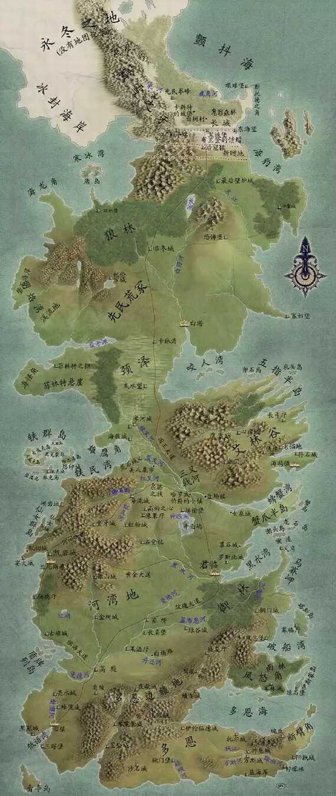
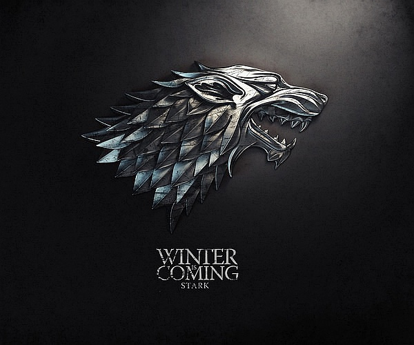
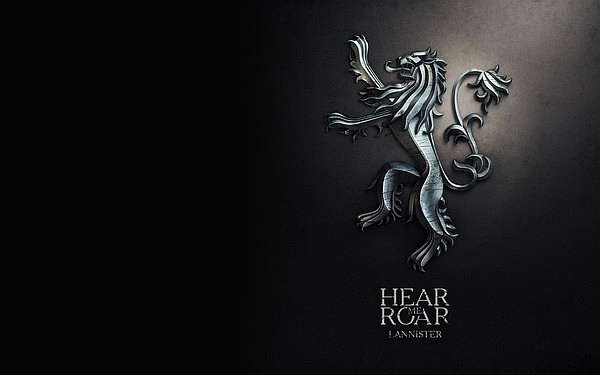
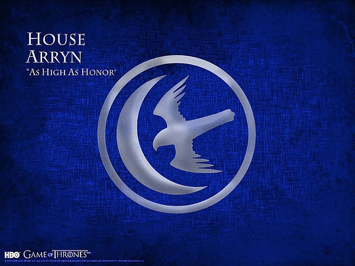
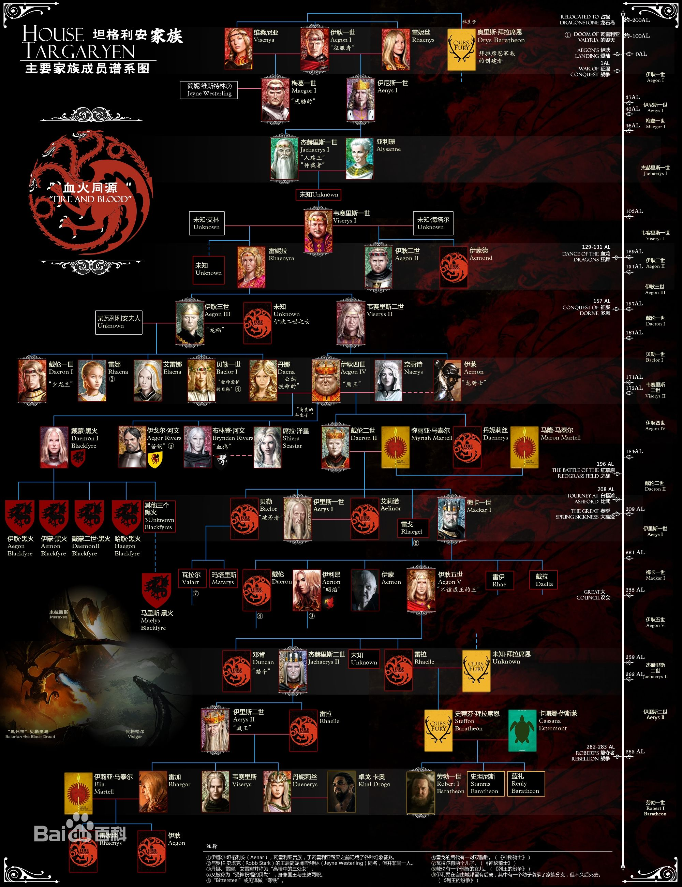
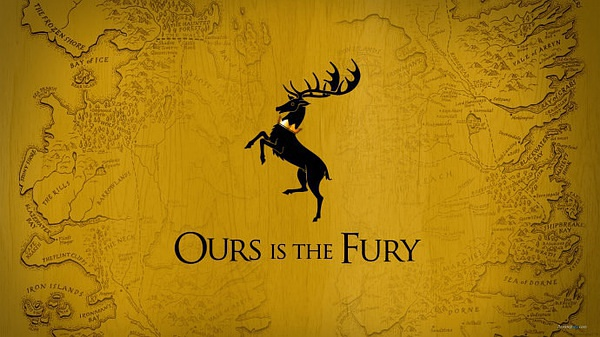

# Game of Thrones 权力的游戏

* 乔治·雷蒙·理查·马丁 Geoger Raymond Richard Martin
  - 1948年出生于美国新泽西州的贝约恩
  - 在1971年取得硕士学位以后，马丁陆续在重要的科幻杂志上，如《类比》杂志，发表了许多短篇作品，并很快以感伤怀旧的浪漫笔触，略带歌特气息的荒凉氛围，以及糅合恐怖小说元素的科幻作品，受到读者瞩目
  - 这一时期代表作有中短篇小说《莱安娜之歌》（A Song For Lya），《沙王》（Sandkings），《十字架与龙》（The Way Of Cross And Dragon）等，长篇小说《光逝》（Dying Of The Light），《热夜之梦》（Fever Dream），《末日狂歌》（The Armageddon Rag）等
  - 此后十年转向影剧界发展，担任了多部电视剧集的编剧工作
  - 直到上世纪90年代，受到《冰与火之歌》故事的感召，退出影剧界，转而投入这部著作的创作中
  - 二十七岁以小说《莱安娜之歌》摘下象征幻想小说最高成就的雨果奖。此后他不仅在文学上获奖连连，更曾在好莱坞担任编剧长达十年之久。至今，他已获四次雨果奖，两次星云奖，一次世界奇幻文学奖，十一次轨迹奖
  - 2011年，美国《时代周刊》将马丁评为"全世界最有影响力的一百位人物"之一，肯定了乔治·马丁在幻想文坛上的至尊地位
* 故事中的七大王国是以古英格兰七个王国为雏形，其故事整体背景大至也参考玫瑰战争
* 结构
  - 坦格利安王朝
    + 血龙狂舞
    + 篡位之战
  - 劳勃统治时期
    + 狮狼相争
  - 五王之战
    + 西境烽火
    + 兄弟阋墙
    + 红色婚礼
  - 五王之战后
    + 美人心机
    + 凛冬将至
    + 天佑女王

## 七卷

* 权力的游戏（1996）
* 列王的纷争（1998）
* 冰雨的风暴（2000）
* 群鸦的盛宴（2005）
* 魔龙的狂舞（2011）
* 凛冬的寒风
* 春晓的希望
* 中文翻译 屈畅




### 厄索斯大陆：瓦雷利亚人的兴衰

* 约伊耿登陆前5000年，厄索斯大陆东南半岛上上生活着一批放牧民族，他们性格谦逊，与世无争，世代以放牧为生。仿佛命中注定，有一天，他们在十四火峰（一处横越瓦雷利亚半岛地峡的环形火山）发现了一个惊天的存在——巨龙
  - 巨龙拥有庞大的身体，巨型的翅膀，周身是坚硬的龙甲，生有钢铁一般的利爪，而且还能从最终喷射出灼热的足够毁灭一切的火焰。据传说，巨龙与魔法之间有着深刻的关联。后来，经过不懈努力，善于放牧的瓦雷利亚人终于驯服了巨龙，从此他们精通养龙驭龙的魔法与冶炼。
  - 凭借着无敌的巨龙与手里精良的瓦雷利亚钢剑，瓦雷利亚人所向披靡，迅速征服了周边的小王国，开始向西虎视眈眈，而挡在他们面前的，是强大的吉斯帝国。
* 征服吉斯卡利帝国
  - 吉斯帝国拥有伟大的文明和战斗力足可以俾睨天下的步兵军团，控制了厄索斯东部大陆的许多地区，对内实行奴隶制，在雄伟的城堡里修建巨大的金字塔，并以鹰身女妖作为王国信仰。
  - 也关注到了半岛上瓦雷利亚的扩张，并试图阻止他们。吉斯帝国的军队接连向瓦雷利亚人发动了五次进攻，但都以失败告终，最终所向披靡的瓦雷利亚人乘着巨龙攻陷吉斯帝国的首都吉斯古城，并用龙焰将其付之一炬。
  - 灿烂一时的吉斯文明烟消云散，现如今只能从弥林和阿兹塔波一窥吉斯帝国当年的风采了
* 灭掉吉斯帝国后，瓦雷利亚获得了巨大的财富和奴隶，一举成为拥有语言，信仰和文化的伟大文明。在此后几千里，瓦雷利亚人从未停止扩张的步伐，让整个厄索斯大陆的民族苦不堪言。面对着瓦雷利亚的铁蹄，有些民族选择了反抗有些选择了逃离
* 洛伊拿人的反抗与逃亡
  - 伊耿登陆前700年，为了消除东部瓦雷利亚人的扩张威胁，由盖林亲王亲率25万洛伊拿大军与瓦雷利亚人进行决战，尽管一开始他们用水魔法取得了阶段性的胜利，但面对瓦雷利亚人300条巨龙的倾巢还击，最终败下阵来
  - 25万大军全军覆没，在生死存亡的紧急关头，战士女王娜梅莉亚汇集幸存的洛伊拿人渡过狭海逃亡到了维斯特洛大陆，最终在多恩的绿水河登陆
* 放眼整个厄索斯大陆，已经没有任何力量再与瓦雷利亚人相抗衡，瓦雷利亚人走遍了厄索斯大陆，建立起了一座又一座宏伟的城堡，每一座城堡都与瓦雷利亚有道路相连。淡银色的头发给了瓦雷利亚人超乎常人的美貌，而近亲结婚的传统更保证了血统的纯正性。由此，瓦雷利亚自由城邦从兴起到繁盛持续了将近5000年，直到那场末日浩劫的爆发
* 末日浩劫
  - 当天，瓦雷利亚半岛几百里所有的火山同时爆发，向天空中喷泄着无尽的火焰，城堡，宫殿，神庙，市镇都未幸免，整个半岛分崩离析，形成了如今的烟海
  - 巨龙和瓦雷利亚人都消失了，随之消失的还有瓦雷利亚人的魔法和历史，空前绝后的大帝国就此灰飞烟灭
  - 当时看起来并不起眼的小岛避开了末日浩劫，这个小岛位于狭海中间，叫龙石岛，这个家族就是坦格利安
  - 作为瓦雷利亚人最后的血脉存活了下来，并在100年以后，在一名伟大英雄的带领下，驾驭着巨龙，将火焰喷向了另一块大陆——维斯特洛
* 强大的瓦雷利亚自由堡垒覆亡后，辉煌一时的帝国四分五裂，东大陆战争不断，但坦格利安家族独善其身。由于他们是最后的坦格利安血脉，仍保有世上最后的龙，力量最强的自由城邦、自封为瓦雷利亚继承者的瓦兰提斯提议合作重建自由堡垒，征服东方。年轻的伊耿明智的拒绝了这些建议
* 这时候，厄索斯大陆势力最强的就是瓦兰提斯，凭借着洛伊拿战争积累下来的巨大财富招兵买马，四处扩张，准备向泰洛西进军。这种侵略举动引起了其他力量的不满，自由城邦联合泰洛西，多斯拉克的卡奥们也前来支持，就连维斯特洛东部的风暴地国王亚尔吉拉也前来支援
* 25岁的伊耿感觉到瓦兰提斯已经四面楚歌，加入众自由城邦反对瓦兰提斯的联盟，骑着巨龙黑死神贝勒里恩参战，击溃瓦兰提斯的军队。从此，瓦兰提斯一蹶不振，退出历史舞台。而伊耿也在这场战争里崭露头角，从那开始，将目光开始投向维斯特洛大陆

## 布拉佛斯

* 厄索斯大陆上的避难者,为了免受瓦雷利亚人的奴役联合起来，在伊耿登陆前500年，由一个划船的奴隶发动起义夺取了瓦雷利亚人的舰队，穿过狭海一直往北逃亡。
* 在月咏者的带领下来到一座矗立在咸水礁湖之中，经常被浓雾遮隐的群岛，并在此安顿下来。这个地方被称为布拉佛斯
* 由于布拉佛斯地处狭海与颤抖海交汇处，航海贸易非常繁荣，驾驶着紫色的船只航行到各地，带回了惊人的财富
* 铁金库:后来布拉佛斯的放债人利用这些财富成立了铁金库，专门向其他国家放贷，这其中就包括维斯特洛大陆上的七大王国
* 无面者:一群宗教刺客团体，历史悠久，总坛为黑白之院，供奉千面之神既死亡之神
  - 可以随意改变自己的面容，称自己为无名之辈，只要付出代价，便会取走一人的性命。信奉凡人皆有一死，与之相对的为凡人皆需侍奉
* 交际花

### 维斯特洛大陆

* 原住民是森林之子,极北地区则有巨人。一个季节持续数年，很长一段时间里森林之子与大自然都和平相处
  - 森林之子是极小的人型生物，黝黑而美丽，通过梦和自然施展不可思议的力量
  - 在战斗中使用黑曜石武器和鱼梁木长弓。他们的遗迹留存只有为数不多的鱼梁木，以及无名的自然神灵信仰还在北境存留。乔治•马丁多次强调森林之子不是精灵，对于此事他曾说：“森林之子是……诶，是森林之子。精灵早被杀死了。”
  - 鱼梁木树皮灰白如骨，叶色深红，有如千只染血手掌。树干上刻了一张人脸，满是干涸红树汁的深陷眼凹形容怪异、充满警戒意味。树上的面孔比临冬城本身还要古老，传说这些脸是在黎明纪元时，在“先民”渡过狭海而来之前，由森林之子刻上去的
    + 随着入侵的安达尔人带来七神信仰，鱼梁木被认为是旧神的象征遭受砍斫焚毁殆尽。在颈泽以南的地区，鱼梁木只有在先民和森林之子签署和平盟誓的千面屿还保留着少数。但是由于安达尔人始终未曾征服北境，旧神的影响在北方从未稍减，鱼梁木仍然广泛分布于整个北境，甚至远至绝境长城之外
  - 绿先知(Greenseer):对森林之子中那些拥有神秘能力的智者的称呼
    + 可以进入心树，以此监控远方。由于心树可以存活数千年，绿先知就能感知一切心树所及区域的过去和现在。
    + 一千个人里只有一人能成为易形者；一千个易形者中只有一个能成为绿先知。
    + 冰火书中出现的著名绿先知有“血鸦”，布兰.史塔克等
* 先民入侵
  - 约伊耿登陆前12000年，从东部大陆来到维斯特洛，他们的武器青铜兵器、皮制铠甲以及马匹.从维斯特洛大陆架登陆，凭借手中的青铜兵器和战马大举入侵
  - 森林之子为了阻止入侵，摧毁多恩臂，形成了现在的多恩断臂角和石阶列岛。另外，森林之子曾试图摧毁维斯特洛的南北连接部，把那里完全淹没，但是他们的魔法不够强，只形成了日后的颈泽
  - 漫长的战争旷日不下，森林之子冒险在人类身上用龙晶施展了自然魔法创造出——异鬼，最终，眼见都没有绝对取胜的可能，双方在神眼湖的千面屿上订立了和平协议，先民占据了维斯特洛大陆，森林之子只保有森林,此协议给维斯特洛带来了四千年的和平。先民还接受了森林之子的神祇，也就是之后所说的旧神
  - 在长达4000年的和平里，先民逐渐形成了七大王国的雏形
* 对抗异鬼的黎明之战
  - 由森林之子创造，后渐渐不受其控制。异鬼在长夜来临（也就是凛冬将至）时开始从极北之地席卷维斯特洛大陆
  - 一种高大憔悴，长着蓝眼的人型生物，身着铠甲，持有薄薄的水晶长剑，剑极为寒冷，足以粉碎铁器。异鬼行进无声，但他们的嗓音却像砸碎冰块一样，这暗示他们拥有自己的语言。异鬼杀死的生物立刻会作为尸鬼复活
  - 异鬼带领尸鬼组成的“死人军团”肆虐整个维斯特洛大陆，先民与森林之子联合起来抗争。在抗争中，他们发现，异鬼并非没有弱点，他们惧怕黑曜石（也称作龙晶）制成的武器，黑曜石可以轻易刺穿他们的铠甲。尸鬼虽然不怕黑曜石，但在火面前十分脆弱
  - 异鬼几乎征服了整个维斯特洛大陆，逼迫先民与森林之子联手发动黎明之战，并成立守夜人军团，这才把异鬼暂时打出北境，此时，北境长城建立
  - 最终，一个被东方人称作亚梭尔·亚亥伟大的英雄手持“光明使者”，带领部队与异鬼展开了殊死斗争。用一把名为“光明使者”的剑打败了异鬼，最终将异鬼击退到永冬之地
* 焉知非福的安达尔人
  - 受厄索斯大陆上瓦雷利亚人极速扩张的影响，最早逃离厄索斯大陆,信奉七神，用的武器升级为铁
  - 来自厄索斯大陆的安达斯山脉，也就是传说中七神驾临并为他们首任国王加冕的地方。伊耿登陆前约4000年，为了躲避瓦雷利亚的扩张，这个身上画着七芒星（代表着七神信仰）的金发民族坐船穿过狭海向西来到了维斯特洛大陆。他们的到来，打破了维斯特洛大陆长达4000年的和平
  - 本以为逃难的他们，发现维斯特洛大陆的先民和森林之子处在低度的文明之中，武器信仰都没有他们先进，于是，避难者变为侵略者
  - 先在五指半岛登陆，从先民手中夺过现在称为“谷地”的地方。随后迅速展开了扩张，先民和森林之子的反抗战争持续了几百年，最终，长城以南的森林之子被屠杀殆尽，而安达尔人也最终落脚南方，并未成功入侵北方。轻而易举击溃先民，然后到处捕杀森林之子，从此森林之子逃出长城以北，据说已经绝迹。安达尔人征服维斯特洛后，正式形成七大王国
  - 虽然并未能通过战争统一全境，但是聪明的安达尔人发现了另外一个更为行之有效的武器：联姻与宗教信仰。通过联姻与各大王国建立起了联系，并随着推移将七神信仰散布于整个大陆，这其中只有两个意外，一个就是北境，一个就是铁群岛
* 伊耿一世很快统一了维斯特洛的七大王国(多恩宁死不屈，顽抗到底，打动了伊耿一世，保留了一个国号封地)，建立了空前强大的坦格利安王朝，像所有外来入侵者一样，坦格利安家族摒弃了龙的信仰开始信仰七神，并且将龙由放养改为圈养，再加上坦格利安家族为了保持血统纯正，实行近亲婚姻，生出来的继承者精神病人越来越多，这几个情况导致了坦格利安王朝开始了眼花缭乱的花样作死之旅

## 宗教

* 旧神
  - 维斯特洛的原住民森林之子信仰既无名也无面的森林之神，溪流之神，巨石之神，他们还会将人脸刻在鱼梁木上，鱼梁木也被称为心树。这种较为原始的图腾崇拜，被称为旧神信仰
  - 与先民停战后，先民也接受了旧神的信仰
  - 鱼梁木被认为是旧神的象征
* 七神
  - 安达尔人的信仰，七神，实际上是一个神祗的七种不同形态，代表着七种不同的德行。崇拜者会根据自己所求之事向七神的某一个具体形态祈祷，在大陆的世俗展示就是圣堂里的大主教，修士和修女了
    + 天父代表审判与正义
    + 圣母代表母爱与养育
    + 战士代表勇气与胜利
    + 少女代表天真与纯洁
    + 老妪代表智慧
    + 铁匠代表创造与劳动
    + 陌客代表死亡与未知
  - 随着安达尔人的入侵脚步来到维斯特洛，随着征服成功，七神边烈火燎原般的延伸至整个大陆，成为大多数人的信仰，并在最后成为官方宗教。仅仅有两个例外，未被征服的北境和未被同化的铁群岛
* 光之王
  - 随着黎明之战的结束，后世产生了拉赫洛的宗教神明。
  - 黎明战争时期，拉赫洛又称光之王、圣焰之心、影子与烈火的神，是来自厄索斯的神明,在维斯特洛知名度不高，七大王国常称其为“红神”，标志是烈焰红心，教众成为祭祀
  - 宗教的教义基于一种二元的世界观
    + 真主拉赫洛，称作光之王，也是热量和生命之神
    + 他的死敌，寒神,则是黑暗、冰冷与死亡之神。他们之间永无止息的斗争决定了人类的命运
  - 根据阴影之地亚夏的古书中记载的上古，终有一天救世主亚梭尔·亚亥将会重生，挥舞一把叫作光明使者的火焰剑，亦称英雄之红剑，并从岩石中唤醒魔龙，来终结这场永世的纷争
  - 梅丽珊卓，人送外号红袍女,更喜欢叫她梅姨.是光之王拉赫洛的女祭司。
    + 她还能洞察一个人的过去。 在去黑城堡之前，我们可以确定她没有见过雪诺，更不可能知道雪诺和火吻之间的事。 但她却说出了那句火吻的经典台词： You know nothing,Jon Snow 你什么都不懂，琼恩·雪诺。
    + The night is dark and full of terrors.  长夜漫漫，处处险恶
  - 据一本五千年前的亚夏古书预言：长夏之后，星辰泣血，亚梭尔·亚亥将在烟与盐之地重生。在这个时候，将会有一位战士自烈火之中拔出那把“光明使者”，再次打败异鬼，驱离黑暗。 这个战士就是亚梭尔·亚亥的转世
* 淹神
  - 铁民自己创造出来的， 像铁民一样严酷残忍
  - 要求子民严格遵从古道。即要他们奸淫掳掠，用鲜血、烈焰和欢歌开创新天新地，并用之镂刻名姓
  - 后来面对死去的铁民，人们会说出“逝者不死”的话
  - 后来安达尔人到来后，也入乡随俗改信淹神

## 英雄纪元

* 发生在先民与森林之子的和平条约签订后，标志着黎明纪元的结束和英雄纪元的开始。这是一个充满传奇色彩的时代，人们所知的这段时期的历史更接近于神话

### 北境史塔克家族——先民的种子 Stark



* 维斯特洛大陆最北面有点像荒蛮之地，气候条件恶劣，经济极度不发达，百姓野蛮尚武不开化，关键是还有异鬼的威胁。由于大部分时间要跟异鬼战斗，而异鬼的战斗力又非常强悍
* 贵族
  - 恐怖堡：波顿家族
    + 先民的古老后裔，最古老、最有权势和最臭名昭著的贵族之一，家徽是粉底上的红色剥皮人，家堡恐怖堡。波顿家族因活剥他们敌人的皮而广为人知，族语是“吾刃尚锋”，但他们更喜欢一句更广泛流传在本家的话：“裸体的人少有秘密，但被剥皮的人没有秘密。”
    + 在史塔克家族没统一北境之前，波顿家族首领的叫做“红王”。自从长夜起，红王们就是史塔克最大的仇敌和苦手。几千年来，他们一直凶猛地抵抗着史塔克，甚至曾几次击败过他们，并剥了一些史塔克领主的皮并挂在他们的恐怖堡里
    + 距今数个世纪前，哈龙·史塔克国王的大军包围了恐怖堡整整两年，才逼迫饿得无力再战的波顿家投降并降下他们的旗帜。波顿家族成为最后向史塔克家族屈服的北境贵族
    + 卢斯波顿
      * 跟随罗柏史塔克发动五王之战，一直蠢蠢欲动，后随着西恩葛雷乔伊占领临冬城，决定反叛，与佛雷家族谋划了血色婚礼，随后被封为北境守护，后被私生子拉姆斯波顿杀死
    + 拉姆斯波顿
      * 变态青年之首，心灵扭曲，心狠手辣，变态至极
  - 卡霍城：卡史塔克家族
    + 临冬城史塔克家族的分支，在一千年前，卡隆·史塔克平定反叛领主有功，获赐领地。他将自己的城堡命名为卡隆之城，久而久之，成了卡霍城。几世纪后，卡霍城史塔克变成了卡史塔克。他们高大凶勐，留长发蓄胡须，喜欢穿用海豹、熊和狼皮制成的衣服。他们的纹章是黑底上的白色日芒星，族语是“凛冬骄阳”。
  - 熊岛：莫尔蒙家族
    + 一个古老的，骄傲的，富有荣誉感的家族，领地在熊岛，一个位于临冬城西北边的岛屿。他们的族徽是一只身处绿色丛林的熊。家族箴言是昂首屹立。莫尔蒙家族是拥有祖传的瓦雷利亚钢剑：长爪。另外由于地理位置极度偏僻，导致这个家族穷的叮当响。
  - 白港：曼德勒家族
    + 一支起源于河湾地但目前是北境的古老家族，北境唯一信仰七神，血统属于安达尔人的家族。
    + 族徽是蓝绿底色上的白色人鱼，有胡须和尾巴，手持黑色三叉戟。曼德勒家族原属河湾地，封地位于曼德河流域。大概在征服战争前一千年，曼德勒家族因为势力过于膨胀而引起河湾王警惕，他命与曼德勒素有仇怨的培克家族将其家族逐出河湾地。
    + 曼德勒家族被迫辗转流离多年，在九百年前他们终于获史塔克家族接纳。曼德勒家族在狼穴的心树下以新旧诸神的名义向史塔克家族宣誓效忠，并获得封地，这份恩情也成为日后曼德勒家族对临冬城的忠诚的起源。
    + 曼德勒家族以自己从河湾地带来的财富在白刃河口建立了一座名为“白港”的新城市。白港也一跃成为北境最大最富裕的城市和维斯特洛五大城市之一
  - 灰水望
    + 霍兰.黎德
      * 在参加赫伦堡比武大会时结识了艾德史塔克并与之成为好友，随后他们二人参加了一场大决斗，而他成为仅存的见证人
      * 一双儿女梅拉与玖建
* 从此，在漫长的年月里，史塔克家族一直守卫着北境，由于北方人比较能打也比较抗打，再加上气候恶劣，道路不通，又有卡林湾要塞的阻隔，所以后来安达尔人始终没有攻克北境，在安达尔人的七神信仰席卷维斯特洛的时候，北境得以独善其身。所以说史塔克家族代表的北境是先民创立的王国中最纯净和最后的种子
* 北境在史塔克家族的统治下已经八千年，麾下领主都无比忠诚，军队战斗力强悍，也是七大王国中唯一没有被安达尔人征服的地方，可以说拥有悠久又光辉的历史
* 族徽一头冰原狼，族语凛冬将至，北境之地守护总领主，族堡临冬城
* 历代家主
  - “筑城者”布兰登
    + 先民在领袖布兰登•史塔克的带领下，用寒冰、砾石和魔法（森林之子帮助下）筑起了从大峡谷至颤抖海的，绵延一百里格的绝境长城以抵御异鬼的再次入侵.布兰登也由此成为了第一任北境之王，人送外号“筑城者”布兰登
    + 不仅修了长城，还修筑了临冬城（很可能还有风息堡），专门负责守卫长城的守夜人军团的成立也发生在那个时
  - 瑞卡德.史塔克
    + 让长子布兰登.史塔克与河间地徒利家族长女凯特琳.徒利联姻
      * 在赫伦堡比武大会上不也照样引诱了拂晓神剑亚瑟戴恩的妹妹亚夏拉戴恩，一夜欢愉之后，可怜的亚夏拉还怀上了布兰登的骨肉。而失去名节走投无路的亚夏拉最终从星坠城海边悬崖一座名为白石剑塔的塔顶跳下身亡，而这位亚夏拉就是后世一直盛传的艾德史塔克私生子琼恩斯诺的母亲
      * 在前往奔流城准备与凯特琳徒利完婚的路上得知了妹妹被雷加“拐走”的消息
      * 立即与侍从驭马直奔君临，到达王城后，怒气汹汹的闯进红堡，声称要雷加的命。奔流城公爵霍斯特本来准备着要嫁女儿，但是听说布兰登已经杀向君临的消息后，霍斯特预感大事不妙，并大骂布兰登意气用事，不动脑子
      * 疯王给布兰登安了个叛国罪的罪名，直接下令将其逮捕，投入地牢问斩，而他的随从也算不未能幸免，布兰登的随从里大多都是贵族子弟，其中就包括了谷地鹰巢城继承人艾伯特.艾林
    + 让唯一的女儿莱安娜.史塔克与风暴地的劳勃.拜拉席恩联姻
      * 身上流着“奔狼之血”——任性倔强、勇敢无畏、脾气火爆，骑士高超，喜好武艺，这种北境人特有的性格是南方的贵族小姐们永远不可比拟的
    + 意识到谷地的琼恩艾林无子，于是将次子奈德.史塔克送去谷地做养子
    + 将幼子班扬.史塔克留在了身边
    + 听到长子被疯王逮捕的消息后心急如焚，能做的，只能是不顾危险，只身前往君临营救自己的儿子。到达君临后，瑞卡德向疯王提出比武审判
    + 疯王让瑞卡德面对的对手并不是御林铁卫，而是野火。疯王命令左右将全副武装的瑞卡德绑在了火刑柱上，随后让火术士们点起了熊熊大火，疯王说火才是坦格利安家族的斗士，如要想要自证清白，那就要接受烈火的灼烧。脖子上套着湿皮索的布兰登被带了出来，一柄长剑就立在他不能够得着的地方，面对着被烈火灼烧的父亲，布兰登拼命倾斜身躯企图拿到那把长剑，但是他越着急拿剑，脖子上的绳索就勒的越近，最后性情如火的布兰登救父心切，被绳索活活勒死，而瑞卡德公爵也在烈火里化为灰烬。
  - 奈德：临冬城的老大，最后发现了大秘密：国王的两个儿子和一个女儿都是皇后和孪生弟弟生的，想发动突袭把皇后抓起来，失败后被砍头
    + 凯瑟琳：和罗柏一起遇难，却被神秘地复活，开始冷血地为家族复仇，被追随者称为“石心夫人”
    * 珊莎，艾德的大女儿，被抓为人质，后来嫁给了小恶魔（就是那个侏儒），但很快就被小指头（国王的财政大臣）救走，冒称小指头的干女儿。第一季这妞非常得傻，但耐心点，她会成为和小指头一样的阴谋家
    * 艾利亚Arya，艾德的二女儿，父亲死后独自流浪，目睹家破人亡，渡海去了东方，加入了神秘的教派，喝了一碗牛奶后毒瞎，目前认为变瞎是“无面者”的前期训练
    * 布兰，艾德的二儿子，因偶然撞见了瑟曦和詹姆tou情，被詹姆推下高塔 残废，临冬城被毁以后，受到长城外北方神灵的召唤，北出长城迎接自己的命运
    * 瑞肯，艾德的三儿子，临冬城被毁以后，为了安全，和布兰分开，行踪不明
    * 琼恩，艾德的私生子，右手烧伤，脸被鹰抓伤，一度被诬陷为叛徒，在野人中遇到了爱人，却只能与之战斗并最终导致了她的身亡，守夜人的诺言束缚他不能家族复
    * 被小指头蒙骗，处理事情不够老到，被逮捕后，被乔弗里斩首。
  + 罗柏
    * 艾德的大儿子，起兵为父报仇，战场上节节胜利，却死于阴谋，“红色婚礼”仇。后通过山姆的帮助成为守夜人的首领，同时需要对抗长城外的异鬼和长城内的国王
  + 瑞肯·史塔克也许会作为另一种形式的守夜人首领而行使责任
  + 班杨史塔克
    * 守夜人军团首席游骑兵，绰号冷手，在绝境长城巡逻时失踪
* 绝境长城倚仗魔法高墙
  - 东海望
  - 黑城堡
  - 影子塔

## 风暴地杜兰登家族——与天斗其乐无穷

* 位于君临的南方，西接河湾地，南抵多恩海毗邻多恩，东边是破船湾。领土面积较小，而且地势险峻，地形复杂。险峻的地势也造就了这里的许多家族都能征善战
* 当年席卷整个大陆的安达尔人，也在进攻风暴地时屡战屡败，面对风息堡固若金汤的城墙亦是无可奈何，被迫和风暴王马尔登四世选择联姻，并与其他领主通婚，经过数百年时间才逐渐用安达尔人的文化信仰取代了先民
* 历代家主
  - 第一任风暴国王杜伦得到了海神和风神的女儿依妮的垂青，与之相爱。然而这段恋情并不受诸神祝福，在婚礼当夜，神摧毁了杜伦的堡垒，杀死了他的所有亲人和宾客
    + 愤怒的杜伦向诸神宣战，得到的回应是大风暴在他的王国各地肆虐。杜伦每在海边建成一座新堡垒，神就立即毁掉它。杜伦王顽强地继续建造更大更雄伟的堡垒，最终，第七座城堡屹立未倒，顶住了破船湾涌来的风暴，这座城堡就被称为风息堡，数千年来一直都是维斯特洛最难攻陷的城堡。
    + 杜伦所建立的杜兰登家族，也在自那之后一直统治着风暴王国
  - 亚尔吉拉国王继位后，更是一扫之前继位国王的接连丢失土地的颓势，击退了多恩人的进犯，渡过狭海打击了瓦兰提斯的野心，还在夏原之战中击杀了河湾王贾尔斯园丁七世
  - 伊耿将亚尔吉拉国王的独生女嫁给自己的私生子兄弟奥利斯.拜拉席恩，从此拜拉席恩家族开始统治风暴地
  - 劳勃拜拉席恩
    + 生于征服262年
  - 斯坦尼斯从小木讷沉闷，不苟言笑，但特别刚正，不懂阿谀奉承，是一个非常正直的忠诚战士
* 贵族
  - 暮临厅的塔斯家族：暮临厅是破船湾北部的一座美丽岛屿，塔斯家族起源于附近的塔斯岛，后控制着岛屿与大陆之间的塔斯海峡。

## 河湾地园丁家族——农业兴邦，物产丰饶


* 几千年前，一位领袖带领他的人民来到富饶的河湾，他的名字叫做青手加尔斯。传说中，加尔斯是教会人们耕作的第一人。他赐予人们种子，教他们如何播种、如何耕地、如何照料谷物以及如何收获
* 历代家主
  - 加尔斯的儿子加尔斯园丁一世成了第一位河湾之王，所创立的园丁家族建立起了整个大陆最美丽的城堡高庭
  - 孟恩园丁九世
    + 做了一个让他后悔终生也改变了河湾地历史的决定：把他的四个儿子两个孙子带上，一起见证胜利
    + 志得意满的孟恩园丁九世和他的儿孙全部被烧死。自祖先“青手”加尔斯以来，统治了河湾地六千多年的园丁家族就此血脉断绝
* 河湾王国的主要贵族都是由青手加尔斯的其他子嗣所建立起来的，整个河湾地的诸多大贵族其实都是一家人，之间一开始是非常团结友爱的，这让中部的河间地实在自惭形秽
  - 参天塔：海塔尔家族
    + 迎娶了加尔斯的女儿
    + 河湾地最有财富最有权势最古老的家族之一，统治旧镇与其附近地区，族语为“照亮前程”。祖传一把名为“警戒”的瓦雷利亚钢长剑。投资建成了学城，并一直保护学城至今
    + 河湾地第二牛逼的家族，也是整个大陆上除了七个国王之外势力最强的领主
    + 虽然强大富有，但是偏好贸易，不喜战争。直到百年后，他们引导了一场旷世大战，那也是这个家族为数不多全情参与的战争之一
  - 青亭岛：雷德温家族
    + 实力强大，与封君提利尔家族有着密切的联系，并且一直给河湾地提供着强大的舰队保护，其传统海军实力甚至可以匹敌王家舰队或铁舰队
    + 族徽是蓝底上的一挂深紫色的葡萄，象征着青亭岛久负盛名的葡萄酒，箴言未知
  - 河湾地：高庭的提利尔家族
    + 在当时只不过是一个微不足道的姓氏罢了，后来靠跪的早跪的快混到高位，这也就直接导致了河湾地贵族之间的离心离德和电视剧中提利尔家族拼了老命的赚取政治资本
    + 罗斯.提利尔意外去世后，奥莲娜垂帘听政，全面征管南境大权，人称“荆棘女王”，膝下有一个未老先衰的儿子叫梅.提利尔
    + 有个忠实盟友兼联姻对象雷德温家族
  - 角陵塔利家族
    + 蓝道.塔利
    + 把天生肥胖温和的长子山姆.塔利调教成一名真正的战士
* 虽然园丁家族灭亡了，但是河湾地还有那么多诸如海塔尔、雷德温、罗宛等血源势力一点都不逊于园丁家族的大贵族，结果弄来一个做管家的提利尔来当家，而且还是一条卖主求荣的哈巴狗，其他大贵族心里怎么想的可想而知了。自此，河湾地再也不是一家人的铁板一块了，老贵族们与提利尔家族全部面和心不和

## 凯岩城兰尼斯特——一个嘴炮骗取一个王国 Lannister



* 在大陆的西边，一开始，凯斯特利家族是这里最为富强的势力，他们在岩石之上修筑了凯岩城，并在凯岩城下发现了堆积如山的金矿。然而到了英雄纪元，这个家族却突然销声匿迹，取而代之的则是兰尼斯特家族
* 兰尼斯特家的创始人机灵的兰尼打了个嘴炮，不费吹灰之力就从凯斯特利手里得到了凯岩城，并从此依靠凯岩城金矿带来的强大财力逐渐征服了整个西境，建立起凯岩王国，并统治此地长达数千年
* 在兰尼斯特王国在几千年的历史之中，虽然中间也出过一点小动荡，但得益于巨大的财富支撑，使得国力一直非常强大。西境的军队，武器，战斗力在整个维斯特洛都是拔尖的存在
* 历代家主
  - 金狮 杰洛.兰尼斯特
    + 一个天生的领导者，他聪明绝顶，公正严明，在统治西境期间，兰尼斯特的财富、权势获得极大提升，而兰尼斯特港的贸易地位也跃居前列。
    + 统治西境长达31年，赢得了“金狮”的称号，除了这些光辉的政绩之外
    + 另一个影响历史的举动就是经过苦苦追求，他终于迎娶了死过好几任老公的罗翰妮夫人
    + 长子泰沃德后来随梅卡一世平定培克家族叛乱，在星梭城，梅卡一世被飞石击中头部当场死亡，泰沃德爬过城门时也被长矛刺中，伤重不治，死在了双胞胎弟弟提恩的怀中
    + 艾莲.雷耶斯是卡斯特梅将星绰号红狮的罗杰.雷耶斯的妹妹，她之前与泰沃德.兰尼斯特已有婚约，未婚夫战死后，艾莲入住凯岩城的雄心不改。为了达到目的，最终艾莲将目光锁定在西境继承人二子提恩.兰尼斯特身上。虽然已于金树城罗宛家族的小姐定有婚约，但提恩抵挡不住艾莲的引诱，最终放弃婚约，迎娶了艾莲。与此同时，提恩的弟弟泰托斯迎娶了烙印城马尔布兰家族的简妮.马尔布兰
    + 金狮杰洛形影相吊，开始不理政事，如此一来，艾莲.雷耶斯成为西境凯岩城事实上的女主人。开始招揽来大批外臣，举办多场宏伟的比武大会和舞会，而她雷耶斯家族的家人也相继入城为官，没过多久，凯岩城便一片乌烟瘴气
    + 第四次黑火叛乱，高个邓肯率军在文德河桥之战中击溃叛军，叛乱匆匆结束。叛军的尸体堵塞了文德河，王军却伤亡极小，但不幸的是，提恩.兰尼斯特却在死者名单上
    + 本已病重的杰洛按照常理应该命不久矣了才对，但奇妙的是，经此变故，之前萎靡不振，命不久矣的杰洛居然重新振作了起来。促使老金狮振作的主要原因应该是，他担心西境的新继承人，生性软弱，资质平平的三子泰托斯未来无法把控局势，于是，杰洛算是回光返照，重掌西境大权，为身后的交接做好万全准备
    + 艾莲仍不死心，于是她又开始故技重施，准备引诱泰托斯。幸好泰托斯虽然软弱可却不傻，她的妻子简妮.马尔布兰此时已经长成了大美女。这次，面对勾引自己的嫂子，小叔子终于把持住了，不仅把持住了，泰托斯竟然还羞愧的主动向简妮承认了错误
    + 简妮原谅了年仅19岁的小丈夫的不忠，但却向杰洛告了兄嫂一状。早就看艾莲不顺眼的老金狮怒不可遏，决定对艾莲下狠手，将她赶出凯岩城，并为她找了个新老公——塔贝克厅的瓦德伦.塔贝克，一个穷困潦倒，年愈55岁的老鳏夫。嫁到塔贝克厅后，艾莲.雷耶斯越挫越勇，开始了新的复仇。疯狂的生产，她将长女取名为罗翰妮，次女取名为瑟雷拉，这两个名字都是有意刺激杰洛（这是杰洛的两个夫人的名字），随后艾莲又生下一个男孩取名提恩
    + 简妮.马尔布兰也不甘示弱，征服242年左右，她为泰托斯生下长子泰温.兰尼斯特
    + 两年后，老金狮杰洛.兰尼斯特因排泄不畅逝世，24岁的泰托斯继承了西境大位
  - 笑狮泰托斯
    + 由于泰托斯软弱无能的性格，导致在他的治下整个西境腐败丛生，乱象四起。一些大的领主无视法令，为所欲为，小领主和平民遭到严重的压榨，各种冲突不断
    + 本来西境的仙女岛有一只海军法曼舰队，但泰托斯生怕惹怒铁群岛，引起更大的冲突，所以严禁法曼舰队出海对抗敌人。结果在伊耿五世末年，仙女岛突遭铁民舰队攻击，法曼舰队全军覆没
    + 征服254年，泰托斯将自己年仅七岁的女儿吉娜许配给了河间地滦河城领主瓦德.佛雷的次子艾蒙.佛雷，简妮夫人和手下许多封臣强烈反对这场婚事，因为兰尼斯特和佛雷家族的地位相差太多。而泰托斯同意这场婚约的原因竟然是不忍心拒绝看上去像个好人的瓦德.佛雷.这时，一个十几岁的少年拍案而起，给了泰托斯一巴掌并且大骂他是个愚蠢无能的老废物。少年就是泰托斯的长子，泰温.兰尼斯特。在被自己儿子打了以后，泰托斯把泰温送到君临做伊耿五世的侍酒
    + 泰托斯的软弱和无能，给了塔贝克和雷耶斯家族充分的夺位信心，新仇旧恨即将一起结算。而九铜板王之战虽然让泰温和凯冯迅速成长，但也使得一代将星罗杰.雷耶斯冉冉升起。
    + 养狗人克里冈，由于他的三条狗从狮子口中救了泰托斯的性命，作为回报，泰托斯赐予这个养狗人一个小城堡，克里冈家族就此正式建立。这个养狗人有两个孙子，彪悍异常，一个叫格雷果，一个叫桑铎，兄弟俩的外号可能更加闻名，那就是魔山和猎狗
    + 泰温和凯冯来到了西境凯岩城，经过战争的洗礼，他决定绕过父亲亲自整治西境乱局，对于儿子夺权的行动，泰托斯只表示了轻微的不满，过了没多久，他就将大权交给儿子。泰温与凯冯主政后，组建了一批收债人，并传达了命令：所有借过泰托斯公爵钱的领主必须还款，无法还债者必须交出人质。这种行为实在完美阐释了他们的俗语有债必还
    + 塔贝克这边的瓦德伦则试图找泰托斯来制止泰温的行为。他来到凯岩城求见了老公爵，反被泰温扣留，强逼他交出夺取的领地和还款。看到自己丈夫被扣，艾莲夫人紧接着掳走了三个兰尼斯特家的人做为回应。艾莲这么一闹，胆小怕事的泰托斯又怂了，他不顾两个儿子的强烈反对，释放了瓦德伦并且向雷耶斯和塔贝克两家致歉，而且还大手一挥，免去他们的债务。
  * 泰温
    - 征服261年末，泰温决定召唤雷耶斯与塔贝克家族前来凯岩城对峙。此时，泰温深知这样做是不会有结果的，两家领主决不会乖乖就擒。但之所以非要这样做，是因为要找个开战的理由，俗话说师出有名。从这里可以看出，年纪轻轻的泰温，已经颇有城府
    - 两家联合发表公告，拒绝效忠凯岩城兰尼斯特家族。听到这个消息，早有准备的泰温并未知会父亲而擅自召集3500步骑，联合布拉克斯和马尔布兰的死忠家族和其他封臣前往讨伐。
    - 泰温的行动太过迅速，以至于两家并未反应过来，做好迎战准备。泰温率军以迅雷不及掩耳之势推进至塔贝克厅城下。他在城下击败了瓦德伦.塔贝克的军队，杀死了他第一任妻子与儿子，俘虏了瓦德伦本人以及他与艾莲所生的儿子们。兵败的瓦德伦试图用高额酬金赎回自己，结果被泰温拒绝，随后泰温将瓦德伦与他的所有儿子们统统斩首。泰温命令弟弟凯冯拎着这些人的人头前往城门劝降。自从借了泰托斯一大笔钱修缮城堡后，艾莲夫人自恃城堡牢不可破，所以拒绝投降。随后，泰温下令部队强攻。泰温强攻城门的时候，他的内应此时已经悄悄打开了塔贝克厅的一道小门，兰尼斯特军队蜂拥而入，不到一个小时，看似牢不可破的塔贝克厅便告失守。艾莲夫人被泰温吊死在城堡中最高的窗子下，他的两个女儿被泰温拔了舌头并被逼加入静默姐妹，长女罗翰妮年仅三岁的儿子下落不明
    - 将整个塔贝克厅付之一炬，大火烧了一天一夜，辉煌的城堡成为残垣断壁，那个一生都在玩宫心计的艾莲夫人被永久的埋在了瓦砾之下。一代名将红狮罗杰.雷耶斯都没有反应过来，当他率领援军赶到时，城堡已经化为废墟，他的妹妹艾莲也已经身死。而此时，泰温和凯冯已经率军以逸待劳静待红狮。双方开始了针尖对麦芒的对攻战，最终红狮军队大败，部队折损一半，红狮罗杰本人身中一箭，伤势严重。来不及庆祝，他下令军队马不停蹄的继续追击红狮。一路上，西境忠于兰尼斯特的家族陆续前来支援，等到兵临卡斯特梅城下时，泰温手里的军队数量已经增长了一倍多，几近过万。而此时身受重伤的罗杰放飞渡鸦向盟友求援，但没有回应，他的盟友们已经得知了塔贝克厅族灭城毁的悲惨下场，摄于泰温的阎王手段，所有人都不敢轻举妄动。
    - 卡斯特梅这座城堡跟凯岩城一样，因丰富的金银矿产兴起，同样也屹立千年。为了保护家族的财富，雷耶斯家族世代的领主都在矿井入口处建立了厚厚的外墙，并在两边修建了坚固的塔楼和碉堡，而随着时间的流逝，卡斯特梅的矿井也越挖越深，地下有大量错综复杂的通道和密室。守卫卡斯特梅城堡的指挥任务交到了他的弟弟雷纳德.雷耶斯的手上。雷纳德深知现有的守军无法正面抵抗规模庞大的兰尼斯特军队，于是他放弃了地上的防守，率领所有军队撤退到地下
    - 凭借着卡斯特梅牢不可破的地下堡垒，雷纳德向泰温求和，他告知泰温，城堡地下有充足的食物和饮水，足可以支撑三年。雷纳德要求泰温立刻撤兵并把弟弟凯冯送上作为人质，如果照做，那么雷耶斯家族将投降。将卡斯特梅城堡的所有矿井全部堵死，用石头和泥土掩埋出口，在卡斯特梅城外筑起堤坝将河流改道，仅仅一天的时间，改道的河流汹涌的倒灌进卡斯特梅城堡地下，直至将其全部淹没。将卡斯特梅城堡地上的厅堂和堡垒全部焚毁
    - 用雷厉风行和灭族焚城的手段结束了西境的乱象。随后有歌手根据这场战争，谱写了一曲《卡斯特梅的雨季》
    - 打算让长子詹姆.兰尼斯特与河间地领主霍斯特徒利的次女莱莎联姻
    - 两度担任国王首相，强势的父亲，冷血无情有权谋，一手造就了三个儿女的杯具，死于小恶魔的十字弓
    - 詹姆
      + 15岁时，詹姆在剿灭御林兄弟会的战斗中因为作战英勇被御林铁卫拂晓神剑亚瑟.戴恩封为骑士
      + 皇后的弟弟，右手被砍，接了一个纯金打造的假手，深爱自己的姐姐瑟曦，却发现瑟曦到处和人上床，是个很矛盾的很可怜的家伙
      + 当泰温派詹姆到奔流城送信的时候，霍斯特就知道这是联姻的信号，霍斯特本人当然非常乐于与强大的西境联姻，于是他让詹姆在奔流城先住上半个月与女儿莱莎培养下感情。结果，詹姆压根没把莱莎放在眼里，而是一直缠着早已成名的黑鱼布林登，让他讲述九铜板王的战争。
      + 虽然詹姆不愿意，但是婚约已经临近敲定，但是在姐姐瑟曦的怂恿下，詹姆头脑发热的决定加入御林铁卫
    - 瑟曦
      + 有着一颗蠢蠢欲动的心，她从小骄傲任性、富有野心并且自认为很有政治天赋，她崇拜并且处处效仿父亲的行事之道，但其实并无泰温的城府与心机，至少从怂恿弟弟加入御林铁卫的举动来看，此女城府太浅，只顾自己，已经有点妖后的味道了
      + 出于愚蠢恢复了教会的军事组织，试图陷害托曼的妻子也就是小皇后通奸，结果搞砸了，被教会关押等待审判
      + 乔佛里，瑟曦和詹姆的大儿子，刻薄的王子，即位为疯狂的国王，婚礼上死于毒药
      + 托曼，乔佛里死后即位，善良，年幼无知，由瑟曦摄政
      + 弥塞拉，瑟曦的女儿，在多恩（南部沙漠王国）当人质，却被阴谋拥立为女王，混战中有人试图杀了她，因为马动了一下砍偏了，重伤
    - 提利昂
      + 当泰温发现年少纯情的提利昂与一个农夫的女儿泰莎相爱并秘密结婚后，他让与提利昂关系最好的长子詹姆告诉弟弟，泰莎只不过是泰温雇佣来让他体验人生中第一个女人的妓女罢了。随后，泰温竟然把泰莎带到凯岩城的军营，让所有的士兵轮奸了她，甚至还命令提利昂全程观看。每个强奸泰莎的士兵都给了这个无辜的女孩一枚银币。更可怜的是，最后泰温还强迫提利昂也强奸了泰莎，然后付给了这个奄奄一息的女孩一枚金龙币。这件事影响也伤害了提利昂的一生，詹姆对此也心怀愧疚
      + 拒绝了提利昂要环游世界的要求
      + 16岁的时候，泰温送了他一件生日礼物，让他掌管凯岩城的蓄水排水系统，简单讲就是让提利昂管下水道
      + 担任首相击退了斯坦尼斯的围城（战斗中被砍了半个鼻子），被逼着娶了姗莎，乔佛里遇害后被瑟曦认定为凶手，被詹姆放走，临走前得从詹姆的忏悔中发现是父亲毁了自己深爱的女人，弑父后逃亡。
  * 凯冯
    - 因为他的资历和能力，以及能够跟泰温和谐相处、并在他鞍前马后得以重用的强大生存、组织、领导智慧

## 河间地徒利家族——背信弃义的黑历史


* 位于大陆中部，北到颈泽与北境接壤，东到明月山脉跟谷地接壤，西到铁民和西境的领地，南临黑水河跟君临王室相邻，虽然东西两面有群山，南部有大河，但总体来说更利于对方势力的防守。由于囊括了众多平原、森林、山丘，以及无数的河流（熟知的为三叉河，即红蓝绿叉河，在哈罗威伯爵小镇交汇），使得此地地理位置优越，土地肥沃。使得它成为了一块兵家必争、流血漂橹的是非之地，因为地形是平原，而且地处大陆中部，可以说河间地身处四战之地且无险可守，历史上被除北境外的各大王国控制，征服，甚至其他王国的战争，也要到河间地这块地方来打，是为：七国一打仗，河间地就流血。
* 一块神奇的土地，这里物产丰饶，平原广阔，本应成为维斯特洛的乐土。然而奈何这块土地上的贵族不争气，自立为王的不少，统一整个三叉戟河的却没有一个。跟河湾地同根同源不同的是，这里的贵族彼此仇恨，战争此起彼伏，河间地的贵族间征伐不断，仇恨滔天，但由于实力太弱，所以一有外地入侵他们就互相捅刀。其中以奔流城的徒利家为翘楚，而暴发户弗雷家族也有样学样
* 贵族
  - 奔流城：徒利
    + 族徽腾跃于红蓝条纹底的银色鳟鱼，族语家族，责任，荣誉。
    + 霍斯特徒利
      * 来自五指半岛的培提尔.贝里席带到奔流城做养子，与凯特琳和莱莎一起长大，三人长大后，出现了令霍斯特意想不到的苦恋：培提尔爱上了魅力四射的凯特琳，而凯特琳只是把培提尔当弟弟看待，莱莎却偷偷爱上了培提尔，三人的感情从此打上了死结
    + 凯特琳.徒利
      * 在弟弟艾德慕的婚礼上，弗雷与波顿反叛，凯特琳被杀，罗柏与怀有身孕的妻子被杀，艾德慕与未婚妻被抓，舅舅黑鱼布林登由于临时尿尿，躲过一劫逃到奔流城
    + 莱莎.徒利
      * 与小指头结婚又被小指头推下月门谋杀
  - 孪河城：佛雷家族
    + 孪河城由矗立在绿叉河两岸的一对城堡组成，中间护卫着跨越三叉戟河支流的拱桥；而家族领主也因此得名“河渡口领主”
    + 孪河城的战略地位为佛雷家族带来了丰厚的财富,以向渡河者收取可观的费用并以此发家致富。很快成为三叉戟河流域最富有且最有权势的家族之一
    + 家徽是银白色背景上的蓝色双塔，双塔中间连接着桥梁
    + 箴言在书中没有提及。长相很有特点，总结四个字就是丑陋猥琐
    + 历代领主都比较喜欢生孩子
  - 石篱城：布雷肯家族
    + 石篱城的布雷肯家族是河间地的古老家族之一，继承了先民血统。从英雄纪元开始，布雷肯家族便和相邻的领主布莱伍德家族结下了血海深仇。
    + 根据布雷肯家族的说法，布莱伍德家族起初不过是他们的一个小封臣，而后来背叛了布雷肯的国王。然而布莱伍德家族讲述的版本恰恰相反
  - 鸦树城：布莱伍德家族
    + 河间地的古老家族，继承了先民血统。与大部份已被安达尔人同化的古老贵族不一样，布莱伍德家族至今仍保留不少传统，敬拜心树，保持对旧神的信仰，是现今唯一还保留旧神信仰的三河诸侯。
    + 上千年间，布莱伍德与布雷肯打了无数遍仗，仇恨还是无法化解，特别是布雷肯该信七神后，双方家族在血仇的基础上还增加了宗教信仰矛盾。
  - 赫伦堡：斯壮家族
    + 就像其他曾拥有过赫伦堡的家族一样，他们的家族业已消亡。一度是三河地区的最重要最富有的贵族之一，在征服战争时曾与其他河间地家族联手起兵反抗“黑心”赫伦·霍尔，协助征服者伊耿夺得河间地

## 多恩马泰尔家族——坚韧的洛伊拿人后代

* 多恩是位于维斯特洛最南端的巨大半岛，炎热干旱，多石多山，境内还有七国唯一的沙漠。边界北至多恩海，东至石阶列岛，南至夏日之海。而赤红山脉则是将多恩和旁边的风暴地河湾地分隔开来的陆上屏障。其中还要亲王隘口通往河湾地，骨骼路通往盛夏厅
* 马泰尔家族原本只是多恩土地上的一个小家族，领地是沙船堡，经过千年发展勉强在强敌环视的多恩存活了下来。然后可能天佑马泰尔，千年以后，他们等到了一位女王
* 洛伊拿战士女王娜梅莉亚率领子民乘万船出海，最后登陆在马泰尔家族的领地上。领主莫尔斯·马泰尔与娜梅莉亚联姻，终于时来运转。洛伊拿人带来了许多人口、庞大的财富与先进的技术，简直就是全方面的下乡扶贫。得此支持的马泰尔家族如虎添翼，此后两人携手征战多年，终将多恩全境置于自己的统治之下。战争期间，莫尔斯本人战死，娜梅莉亚成为女王
* 此后经过多年融合，马泰尔家族抛弃了很多原有的习俗，取而代之的是洛伊拿的风俗。比如，他们开始称他们的统治者为“亲王”而不是“国王”，并且土地和头衔由最年长的子女继承，而不限于长子
* 马泰尔家族也在洛伊拿人帮助下建立了新城堡阳戟城。而由此开始，多恩与河湾地，风暴地的冲突日渐剧化，边境冲突、劫掠和战争不时发生，造成多恩人与这两块土地的居民的世仇
* 族徽一杆长枪刺破红日
* 族语不屈不挠
* 人物
  - 红毒蛇 奥伯伦.马泰尔
    + 送往学城，不过很快他由于厌倦而辍学了，从此奥伯伦周游各地，甚至在狭海对岸建立过一支自己的雇佣兵团。奥伯伦自小与姐姐伊利亚亲近，童年时代两人总是形影不离，可谓姐弟情深
  - 勒文亲王担任御林铁卫

## 谷底王国——纯正的安达尔后裔



* 安达尔人出于对瓦雷利亚自由堡垒的恐惧，穿越狭海来到维斯特洛
* 谷地又称艾林谷，地处维斯特洛东部，四周被明月山脉环抱，北临咬人湾，西接狭海，仅有一条道路与河间地相通，地形地势乃是整个维斯特洛最最易守难攻。被称为“飞翼骑士”的阿提斯·艾林骑着巨鹰从天而降直抵谷地最高的山峰，杀死了最后一任山脉王狮鹫王，这是安达尔人对先民的首场大胜。阿提斯·艾林被封为山谷之王，领地也重新命名为艾林谷
* 开始从谷地向外不断扩张，凯岩风暴河湾三王难以抵抗他们的攻势，选择以联姻的方式向他们臣服，并皈依安达尔人的七神信仰。这样，安达尔人通过信仰逐渐改变并统治了先民
* 随后多恩和铁群岛也被安达尔人征服，只不过登上铁群岛的安达尔人最终接受了当地的淹神信仰，而多恩则始终未能全境统一
* 随后安达尔人挥师北境，然而他们始终无法突破卡林湾的天险，北境得以独善其身
* 安达尔人在卡林湾以南划分出了六个王国，后世讲的七大王国正式形成（铁群岛除外）。而除了七神信仰外，钢铁、战马和骑士制度也得以引入
* 贵族
  - 五指半岛：贝里席家族
    + 从属于谷地的成立时间几短，一个小的不能再小的小贵族，家族的封地位于五指半岛中最小的那个半岛上。直到坦格利安王朝末期这个家族的创始人才登场，到现在不过三代
    + 培提尔
      * 凯特琳被许配给布兰登.史塔克后，两人很快情投意合的在一起，而失恋的培提尔则怒火中烧，随即，他向布兰登提出决斗
      * 决斗之前，培提尔恳求凯特琳将信物给他，但凯特琳不为所动，将信物给了她所爱的布兰登，武艺高强的布兰登三下五除二就把培提尔打倒在地
      * 培提尔重伤。当晚，莱莎前来照顾遍体鳞伤的培提尔，精神恍惚的培提尔误把莱莎当做凯特琳，并与她发生关系。过了一段时间，莱莎发现自己怀孕了，霍斯特公爵听闻后暴怒，一面强制女儿讲孩子打掉，一面以出身低微为名，将培提尔送回五指半岛
* 家主
  - 琼恩.艾林
    + 最大的王牌两个养子：风暴地长子劳勃.拜拉席恩和北境次子奈德.史塔克

## 铁群岛——祖上也曾阔过

* 在落日之海的一片群岛上，生活着一群民风彪悍的居民，自称为铁民。传说在英雄纪元，铁民被一位叫灰海王的强大君主统治。在灰海王去世后，他的子孙开始自相残杀，最终决定分割群岛统治
* 多年以后，一位伟大的先知加隆以神的名义把铁群岛打造成一个统一的王国，将所有船长和领主召集到老威克岛选出一位至高王，结果他没被选上，当时最令人畏惧的掠夺者乌拉斯.葛雷艾恩当选
* 霍尔家族
  - 被称为“黑发、黑眼、黑心”，甚至是黑血
  - 历代由霍尔家族产生的铁王都以残忍和狡诈著称，他们热衷于铁民们传统的“古道”，即通过劫掠获取财富，所以他们对整个维斯特洛大陆开始入侵和劫掠
  - 赫伦王和他的所有儿子都被活活烧死在塔中，显赫一时令人闻风丧胆的霍尔家族就此血脉断绝
* 历代家主
  - 铁群岛的王并非完全世袭，而是要经过选王会进行选举。铁民信奉的是淹神，他们坚信逝者不死，只是回去侍奉神明，所有被选出的王必须经过淹礼的考验才能正式登上王座。此后数千年的时间里，铁群岛的王一直由葛雷艾恩家族和霍尔家族掌控
  - 尽管葛雷艾恩占据王位的时间更长，但是霍尔家族却取得了铁民历史上最伟大的成就
    + 在科瑞霍尔一世统治时期，“凡能闻到海水气息，或能听到浪涛声响的地方，皆为我的领土”。南至青亭岛，北至熊岛，整个维斯特洛西海岸的土地皆被铁民所占领。连高庭的主人园丁家族也不得不向铁钟称臣纳贡。其后凯岩城兰尼斯特的崛起给铁民带来严重的威胁，自此铁民和北境西境河湾等地的领主持续了上千年的战争，却始终无法恢复昔日的辉煌。直到“强手”哈尔文霍尔继位，率一百条战船东进，直取三叉戟河，并打败了数量多出一倍的风暴地军队，河间地从此落入铁民之手，直到伊耿登陆为止。
    + 哈尔文霍尔曾在河间地击溃风暴地大军，将三叉戟河流域纳入铁民的统治，哈尔文的儿子哈尔克一生致力于开疆拓土，他强迫三河诸侯给他当炮灰，向西境风暴地和谷地发动了多次战争，不过输多赢少，河间地也因此死伤无数。哈尔克的儿子赫伦继位后，对整个河间地横征暴敛，残酷统治，并且花费四十年的时间劳民伤财的建立起维斯特洛最大的城堡——赫伦堡
* 由于没了国王，铁岛开始四分五裂互相攻打。伊耿二话没说，骑着黑死神跑到铁岛上几个俯冲下来就把铁群岛的分裂势力料理了。料理完了以后，铁群岛该交由谁管理这个问题就成了烫手的山芋.由于历史上出至高王最多的葛雷艾恩早就没了，领土最大成就最高的霍尔家族也被龙焰烧干净了，选来选去就只剩下葛雷乔伊家族了，于是乎维肯.葛雷乔伊上位，葛雷乔伊家族粉墨登场
  - 族徽金色海怪，族语强胜胜于苦耕, 逝者不死
  - 维肯是个明白人，知道自己的王位是坦格利安给的，而且整个大陆现在已经是大一统的王国，于是下令不许实施铁民自古以来烧杀劫掠的传统“古道”，并且还破天荒的同意七神信仰在铁岛传播。此后，大量修士开始登上铁群岛传教，虽说这样做讨好了坦格利安，但是也埋下了宗教不合的种子，而这颗小种子，最终在伊耿死后成为了大患
  - 巴隆·葛雷乔伊
    + 发动两次扰乱，被劳勃和艾德迅速镇压，两个儿子战死，幼子西恩被艾德史塔克收为质子
    + 自称为铁群岛之王
    + 在五王之战时，寄养在临冬城的儿子席恩·葛雷乔伊也加入了他的队伍。在这场持久战中，从小由狼家养大的席恩，不仅背叛了将他养育成人的史塔克家族，甚至还领兵攻下了临冬城
    + 被拉姆斯波顿击败，西恩做了拉姆斯波顿的阶下囚
    + 长女阿莎与西恩没有争过叔叔，率领精锐仓皇出逃

## 王领：坦格利安铁王座

* 风暴地北部，谷地南部，河间地东部。所辖面积不大，北起蟹爪半岛，南到马赛岬，主要由频临的黑水湾沿岸及潮头岛，龙石岛，蟹岛等组成，主要城市为君临城，暮古镇，史铎克渥斯堡
* 家族
  - 潮头岛：瓦格利安家族
    + 纹章是海绿色底上的一只银色海马
    + 是伊耿最早也是最忠实的伙伴。瓦列利安家族在坦格利安迁徙龙石岛前，就已经在潮头岛安居。潮头岛优越的地理位置，使得他们能够通过贸易积累了一定的财富，旗下的海军为狭海上一支强有力的力量
    + 家族成员，与坦格利安家族成员一样，通常有着银发紫眸的瓦雷利亚血统特征。双方在坦格利安王朝统治早期，实行通婚，所以瓦列利安家族在早期的王朝里具有举足轻重的影响力。史上第一位御林铁卫队长和海政大臣都出自瓦列利安家族，有一段时间海政大臣的位置成为瓦格利安家族专属。

## 坦格利安——最后的瓦雷利亚血脉 Targaryen


* 虽为瓦雷利亚的血统，但却不是自由堡垒里的显赫贵族，古时，四十多支瓦雷利亚家族竞逐自由堡垒的统治权力，但坦格利安的势力远逊其他家族
* 末日浩劫前十二年，坦格利安家主伊纳尔深信女儿“梦女”丹妮丝关于瓦雷利亚将毁于大火的梦境会成真，于是举族迁往瓦雷利亚帝国最西边的的据点——龙石岛。由此，坦格利安逃过了这场大劫难
* 在龙石岛附近更靠近维斯特洛大陆的一个岛叫潮头岛，这里世世代代生活着坦格利安的亲密朋友瓦列利安家族，由于地理位置优越，瓦列利安家族初步积累起了可观的财富和颇有战斗力的海军，这也为后来的征服战争提供了坚实的基础
* 坦格利安在末日浩劫也损失了几条龙，不过他们还剩下一条巨龙——黑死神贝勒里恩，后来又孵化出了两条小龙——瓦哈格尔和米拉西斯
* 坦格利安迁居龙石岛接近一个世纪左右，伊纳尔的孙子伊耿.坦格利安出世
* 族徽是三头龙，族语血火同源
* 发源于古瓦雷利亚自由城邦龙石岛
* 特征非常明显蓝色眼睛，银金色或白金色头发，为了保证血统纯正，提倡近亲结婚
* 历代家主
  - 巨龙家族为了保持血统纯正，长期坚持近亲结婚（通常是直系亲属，比如亲兄妹的结合），所以家族的后代中有不少人携带了“疯狂”基因。具体表现为极度偏执，残忍且反复无常，对火和龙有种病态的迷恋
    + 曾有被称为“明焰”的国王伊里昂为了把自己变成龙，喝下了一整壶的“野火”

  - 伊蒙学士，放弃王族身份加入守夜人军团的王族，双眼失明，因为斯坦尼斯试图火祭王族被迫出海躲避，重病死于海船上，留下神秘的遗言
  - 韦赛里斯，金发男，疯狂而又愚蠢，因触犯多斯拉克人的禁忌，死于一顶炽热的金水王冠之下
  - 丹妮
    + 成功地孵化了龙蛋，三头小龙破壳而出。龙的母亲，龙的新娘，龙的女儿。三条龙成为无数人争夺的对象，丹妮并没有急着回到七大王国，而是狭海对岸先扩展自己的实力，用巧计得到了名为“无垢者”的太监军队并占领了奴隶城邦，成为了真正的女王
    + 七王国的东恩在寻求和丹妮通婚，而各种势力也在丹妮周围暗流涌动



## 火龙狂舞

* 在与瓦兰提斯的战争中，维斯特洛大陆风暴地国王亚尔吉拉见识了伊耿的勇武，更见识了巨龙的厉害，回到风息堡，他开始筹划一场联姻——将自己的女儿嫁给伊耿。如果联姻成功，他可以跟伊耿联手打击河间地和铁群岛的统治者黑心赫伦
  - 可亚尔吉拉不知道的是，伊耿已经结婚了，妻子还不止一个。他遵循瓦雷利亚的传统，娶了自己的姐姐维桑尼亚和妹妹雷妮丝为妻
  - 面对亚尔吉拉的联姻请求，伊耿微微一笑，准确的说他这时应该心潮澎湃，他要牢牢抓住这次机会——一个向维斯特洛大陆宣战的机会
  - 伊耿拒绝了亚尔吉拉的联姻请求，而是建议风暴国王将女儿嫁给自己的私生子弟弟奥里斯.拜拉席恩。而在维斯特洛大陆，私生子这个身份是个很低贱的存在。想让自己的掌上明珠嫁给一个私生子？面对这样极具侮辱性的提议，孤傲的亚尔吉拉愤怒了，他砍掉了伊耿派来的使者的手
* 伊耿召集两大助手——潮头岛的戴蒙.瓦列利安和兄弟奥里斯.拜拉席恩以及所有臣服于龙石岛的势力宣告他对维斯特洛的征服正式开始。随后，伊耿骑着黑死神贝勒里恩，姐姐维桑尼亚 Visenya Targaryen 骑着瓦哈格尔，妹妹雷妮丝 Rhaenys Targaryen 骑着米拉西斯带着所有的军队在黑水河北岸登陆，征服大幕，徐徐拉开
* 刚刚登陆，伊耿所向披靡，沿途领主纷纷投降，这时黑水河北岸的两大城堡：暮古镇和女泉镇两大领主组织军队严阵以待，结果被黑死神一个冲锋，两大领主全被烧死。就当坦格利安军队准备洗劫这两大城堡的时候，大姐维桑尼亚手持瓦雷利亚钢剑：暗黑姐妹站了出来，她厉声喝退了军队
* 攻下黑水河两岸的数十座城堡后，伊耿召集所有向他臣服的领主来到他位于入海口的临时城堡伊耿堡处，并且对亲信和主动投诚的领主们予以封赏：戴蒙瓦列利安为海政大臣，克里斯派安赛提加获任财政大臣，奥里斯拜拉席恩被封为第一任国王之手。随后，大姐维桑尼亚把一顶镶着红宝石的瓦雷利亚钢圈王冠戴在她的弟弟和丈夫头上，宣布他是“伊耿一世，全维斯特洛之王，人民之盾”，并遵循维斯特洛的传统，选择黑底红龙旗帜作为坦格利安的家徽，坦格利安王朝从这一天起正式建立。伊耿正式称王，他将手中的瓦雷利亚钢剑：黑火拔出，高高举向前方广阔无垠的维斯特洛大陆——属于他自己的征服战争才刚刚开始
* 七大王国开始合纵连横：风暴地与河间地离伊耿最近，调集大军准备开打，西境的兰尼斯特与高庭的园丁家族组成联盟，北境的史塔克开始召集封臣与军队，艾琳谷增兵血门与鹰巢城，多恩则提出与伊耿联手打击世仇风暴国却被伊耿拒绝。七大王国都在屏气凝神，等待伊耿下一步的行动。
* 称王七天后，就兵分三路，对维斯特洛大陆发动了全面征服战争。每一路的军队人数大概在一两千左右，军备与战斗力堪忧，可以说，伊耿把整个征服战争的胜负押宝在了三条巨龙身上
  - 伊耿独率一路大军进攻河间地的赫伦堡
  - 姐姐维桑尼亚跟戴蒙瓦列利安率军进攻谷地
  - 妹妹雷妮丝跟奥利斯拜拉席恩率军进攻风暴之地
* 火烧赫伦堡——击溃铁群岛
  - 在赫伦的残暴统治下，河间地诸侯无力反抗，敢怒不敢言。就在这时，伊耿进军消息传来，三河诸侯纷纷投降，其中领头的便是奔流城城主艾德敏徒利。三河诸侯一投降，赫伦的兵力就显得有些捉襟见肘了。迫于无奈，他把少量铁民与所有忠于他的军队都召集起来退守到赫伦堡坚守。 这座刚刚建成，全维斯特洛最巨大的堡垒，普通云梯与攻城武器都无法登上它或击穿它的厚墙，而且城中更有源源不绝的淡水，藏有大量粮食的巨大地窖，被视为不可能攻陷。
  - 伊耿此时已经集结了8000人包围赫伦堡。在开战前，伊耿与赫伦王谈判，狂妄自大的赫伦拒绝了投降，而被激怒的伊耿则保证：就在今晚，霍尔家族的血脉必定断绝。入夜，伊耿驭龙飞上高空，黑死神贝勒里恩在夜色掩护下形同隐形，它自高空俯冲下来向城堡吐下烈焰。
  - 大火点燃了整个城堡和里面所有人，使石头如蜡烛般融化，赫伦王和他的所有儿子都被活活烧死在塔中，显赫一时令人闻风丧胆的霍尔家族就此血脉断绝，而铁群岛和铁民从此以后再也无力发动任何大规模的入侵和劫掠。
  - 第二天，在冒着浓烟的赫伦堡废墟中，艾德敏·徒利正式向伊耿称臣，而伊耿则封他为河间地守护。其他三河领主也在此向伊耿和艾德敏宣誓效忠
* 海鸥镇之战——谷地称臣
  - 维桑尼亚与戴蒙瓦列利安带领的海军首先对谷地的重要港口海鸥镇进行了攻击。艾林谷摄政太后莎拉出动全部水军外加十几艘布拉佛斯的舰队迎战，双方在海鸥镇外的水域决战，瓦列利安舰队大败，戴蒙阵亡，舰队损失三分之一
  - 败局已定之时，维桑尼亚骑着瓦格哈尔从天而降吐下龙焰，胜利在望的艾林舰队全军覆没
  - 借此机会，本来隶属谷地王国管辖的外岛三姐妹群岛趁机独立，自立为王。这个三姐妹群岛在以后的某个历史阶段，对坦格利安家族造成了重创
  - 外围的水域，岛屿与最重要的港口被夺，莎拉太后转为守势。在这时，脑洞清奇的莎拉太后派出使者要与伊耿联姻。莎拉太后年轻的时候确实很美，号称大陆第一美女，奈何时光荏苒，现在的她早已青春不在，而伊耿对此并不感冒，有姐姐妹妹在侧，他不能娶也不敢娶
  - 被伊耿拒绝后，沙拉太后觉得脸上挂不住，增兵血门与鹰巢城。血门与鹰巢城地势险峻，可谓“一夫当关万夫莫开”，可惜高耸的城墙防得住人，但防不住龙。有一天，莎拉太后处理完国事回到了自家后院，猛然回头，她发现自己的儿子小国王罗纳艾林正坐在维桑尼亚膝头上，小国王扯着她的衣角，央求能骑着远处那个大家伙飞一圈。沙拉见状，大惊失色，知道无论再做什么也是徒劳，于是投降，并献上三顶王冠：自己的摄政后冠，罗纳的小王冠和传了六千年的山谷王冠。维桑尼亚心满意足，带着小国王绕着巨人之枪足足飞了三圈，也让小家伙过了一把瘾。安达尔人的纯正后裔，谷地王国正式被征服
* 最后的风暴
  - 亚尔吉拉面对坦格利安的入侵做了充足准备：先派出奇兵抢在奥利斯的军队渡过河流的时候发动进攻，杀伤近千人后撤退。随后他召集了风暴地主力军队出击，打算在野外和坦格利安军队决战。
  - 但可惜天命难违，骑着米拉西斯飞翔在天上的雷妮丝把风暴地军队的动向和兵力配置看的一清二楚。奥利斯拜拉席恩将计就计，率军抢占有利地形，掘壕固守静待敌军。
  - 两军交战当日，狂风大作，暴雨倾盆。有属下劝说亚尔吉拉暂缓出战，然而漫山遍野的黑底红龙旗帜令他怒从火烧。他下令全军出击
  - 亚尔吉拉率领骑兵三次进攻，但陡斜的山坡与地面的泥泞都影响了骑兵的发挥，三次冲锋皆告失败。而倾盆大雨也令奥利斯弓箭手根本无法张弓射箭，巨龙米拉西斯也无法从容的在空中飞翔，战斗力大打折扣。随着一次又一次的冲锋，亚尔吉拉杀至奥利斯阵中，结果却遭到在地上的米拉西斯的迎头痛击。龙焰吞没了亚尔吉拉的近卫骑士，他的战马受惊逃跑，他也被抛下战马。见到局面逆转，奥利斯带人冲下山作战，他则冲在最前面与风暴王展开了一对一的决斗。两人打的难舍难分，各自都受了伤，但最后还是年轻的奥利斯赢了，戎马一生的亚尔吉拉得偿所愿，持剑奋战至死
  - 风暴王之死粉碎了部队的军心，他们纷纷逃回风息堡。随后，风暴王的女儿亚吉菈公主自立为女王，固守风息堡继续抵抗，她拒绝了雷妮丝的劝降，紧闭城门，发誓要与坦格利安战至最后一滴血流尽。然而，守城的士兵却不这么想，他们不想赫伦堡被焚的一幕重演。雷妮丝劝降当夜，守城士兵把亚吉菈脱光衣服绑起上锁，打开城门投降，将城堡与年轻的女王献给奥利斯
* 怒火燎原
  - 西境的兰尼斯特与园丁家族组成的联军:两大王国集中了所有的力量，兵力总共55000人，其中5000人为骑士
  - 园丁家族的孟恩园丁九世也是这么想的，作为联军总指挥，他觉得伊耿居然敢进攻他们完全是以卵击石，凭借强大的部队，他可以轻而易举的把坦格利安从历史中抹去。于是，志得意满的孟恩九世做了一个让他后悔终生也改变了河湾地历史的决定：把他的四个儿子两个孙子带上，一起见证胜利
  - 两方军队在河湾地拉开架势展开决战，不出意外，甫一接触，强大的联军将河间地杂牌军打的丢盔弃甲，各自逃散，就在功亏一篑的时候，地上突然显示出巨大的阴影。伊耿，维桑尼亚，雷妮丝骑着三条巨龙参战了。志得意满的孟恩园丁九世和他的儿孙全部被烧死。自祖先“青手”加尔斯以来，统治了河湾地六千多年的园丁家族就此血脉断绝
  - 联军的另外一方，兰尼斯特的国王罗伦兰尼斯特看到三条巨龙俯冲喷火的时候，带领军队机智的跑路了，捡回一条命回到凯岩城后，意识到大势已去，罗伦率领整个西境向伊耿投降，被封为西境守护
  - 伊耿马不停蹄的骑着黑死神贝勒里恩直飞高庭王城，这个时候园丁家族都死绝了，唯一管事的就是高庭总管哈兰提利尔了。哈兰提利尔想都没想也直接下跪投降，被伊耿封为河湾地总督，南境守护
* 不战投降
  - 北境的军队也到了，全军在北境国王托伦史塔克的带领下穿过卡林湾要塞南下，整个军队跃跃欲试，准备跟坦格利安死磕
  - 在经过赫伦堡的时候，托伦看到了坚不可摧的城堡居然成了残垣断壁，后又看到飞翔在天空的三天巨龙，北境国王托伦史塔克果断向伊耿投降。托伦投降的场景实在不太好看，他当着双方几万大军的面，向伊耿下跪，随后被封为北境守护，而托伦史塔克也有了一个新的外号“降服王”。而整个北境和史塔克家族也成了伊耿征服战争过程中唯一一个没有交战便直接投降的地区家族
* 不屈不挠，浑身是胆的多恩人
  - 雷妮丝骑着巨龙米拉西斯来到多恩门户亲王隘口发现除了一小股守城军队外，找不到一个活人，于是飞到万斯城，发现没人，飞到神恩城，发现没人，再飞到板条镇，发现还是没人，这时候雷妮丝才恍然大悟，原来多恩人玩起了坚壁清野。
  - 雷妮丝直接飞到了王国首都阳戟城，这里也没人，只是在王庭，雷妮丝发现了一个年老体衰的老太太，她就是多恩女王——梅瑞拉.马泰尔。
  - 梅瑞拉此时已经八十高龄，她统治多恩已经六十多年了，且继承了祖先娜梅莉亚和马泰尔家族刚强坚韧的性格。当雷妮丝劝说她投降的时候，梅瑞拉告诉她：多恩人没有国王，多恩人也不认国王。随后，雷妮丝威胁她说，如果不投降，等待多恩的，将会是血与火（fire and blood）
  - 流淌着洛伊拿鲜血的梅瑞拉重现了祖先们反抗瓦雷利亚暴行的英勇。她回答说：“fire and blood是你们的族语，而我们的族语是不屈不挠（Unbowed, Unbent, Unbroken）。你们可以尽情放火来烧，但我们不会屈膝，不会鞠躬，不会投降！这里是多恩，你们不属于这里，不要回来！
* 第一次多恩战争
  - 从河湾地和风暴地抽出精锐，兵分三路，浩浩荡荡的开向多恩。这样的安排看上去确实没有任何问题，从河湾风暴两地调兵，主要考虑到这两个王国与多恩千年以来互相攻讦，征战，彼此的仇恨融在了血液里，这两地的军队也有长期与多恩人交手的经验。三路大军分别是：雷妮丝王后率领的先头部队，奥利斯拜拉席恩率领的风暴军队与伊耿亲率的河湾地部队
  - 先辈洛伊拿人早就跟骑龙的瓦雷利亚人交过手，有着丰富的对龙作战经验，长弓硬弩。坚守城门不出只能被烧糊，拉开架势跟对方决战，也只有灰飞烟灭。放弃城堡，坚壁清野，将部队化整为零，躲在茫茫的沙漠与荒原里打游击，避免与敌军正面冲突，敌退我进，我疲我打，敌追我跑
  - 雷妮丝嫉妒姐姐维桑尼亚显赫的战功，于是强烈主张伊耿采用军事行动征服多恩，而维桑尼亚这时并不主张采用武力征服，最后伊耿还是听取了他最爱的雷妮丝的建议。所以多恩战役一打响，她就迫不及待的骑着米拉西斯飞到多恩去了。长驱直入来到阳戟城发现连老太太梅瑞拉都撤了，怒火中烧之时，她骑龙火烧了板条镇。
  - 奥利斯拜拉西恩可就苦了，自从率领大军进入多恩后，每天都面对着像苍蝇一样忽聚忽散，神出鬼没的多恩军队的侵袭和骚扰，士兵和辎重损失惨重。更要命的是，多恩地处沙漠，干旱缺水且高温难耐，由于物资损失惨重，导致大量士兵渴死晒死。最终，没打几仗却减员严重士气低落的奥利斯率军经过两边都是高山的骨骼路的时候，前后退路被多恩人快速切断，瞬间两边高山上号角声四起，箭矢如雨一样倾泻而下，奥利斯中了多恩人的十面埋伏。战斗很快就打完了，结果是能征善战的风暴地大军全军覆没，奥利斯和麾下大批风暴地封臣领主被俘。后来虽然被风暴地用大量黄金赎回，但是在征服战争中英勇无敌立下汗马功劳的奥利斯拜啦西恩被多恩人砍去持剑手
  - 伊耿大军行动迟缓而且供应紧张，多恩的烈日下，大军士气低落。伊耿不得不派出更多的部队保护自己业已紧张的后勤供应。三路大军汇合了，伊耿才发现，雷妮丝一无所获，奥利斯被打成了光杆司令，被多恩的烈日晒晕了的伊耿此时也是无心恋战，于是他做了个愚蠢的决定：在阳戟城，他召集多恩人民宣城多恩王国已经被坦格利安王朝征服，从此多恩归铁王座统治。 他让罗斯比伯爵镇守阳戟城，提利尔公爵带兵控制多恩领。没几天，他们就接到了奏报：多恩军队迅速攻占阳戟城，全歼守军，罗斯比伯爵被梅瑞拉老太太扔下塔楼摔死。驻守多恩领的提利尔大军前去支援，结果进了沙漠就再也没出来。此战，河湾地大军几乎全灭。
  - 伊耿和两个王后骑着三条龙去了多恩，一进多恩领地就开始用三条龙对多恩的每一座城堡进行了地毯式的灼烧，所有城堡被烧的一干二净。不过多恩军民用实际行动验证了梅瑞拉女王当初回应雷妮丝的话：“你们可以尽情放火来烧，但我们不会屈膝，不会鞠躬，不会投降！这里是多恩，你们不属于这里！”
  - 就是这一次，雷妮丝在骑着巨龙米拉西斯飞往狱门堡的时候，由于飞的较低，被多恩人发现，于是弩箭齐射。正常来说，龙的皮肤鳞甲是不怕弩箭的，但就像金钟罩有命门一样，龙也有，那就是相对柔软的眼睛。正巧有一只弩箭射穿了米拉西斯的眼睛，射入大脑。米拉西斯与雷妮丝一道从天上坠落下来，香消玉殒
  - 报复与回应
    + 多恩的每一座城堡，每一个村镇，每一寸土地都被龙焰焚烧了几个来回，多恩的老百姓也遭到了血腥的屠杀。同时他下令为每一个多恩领主的人头定下赏金，因此至少六位领主因此死于暗杀。
    + 多恩人没有选择退却，而是以牙还牙血债血偿！河湾风暴地面对的侵袭更加频繁，甚至君临都有王公贵族遭到暗杀。
  - 征服13年，老王后梅瑞拉马泰尔去世，她的儿子尼莫尔亲王继位
    + 尼莫尔亲王率先行动，他派自己闺女去铁王座谈条件停战，顺便带上了巨龙米拉西斯的头。多恩公主面对群情激愤的王朝大臣们，幽幽的说：打了那么多年，大家都打腻歪了，咱们停战吧。不过我说的停战哦，不是投降哦。
    + 就在争执不下之时，多恩公主递给伊耿一封老爹写给他的亲笔信，据说伊耿看信之后直接用手紧紧抓住铁王座，血流了一地。伊耿把信烧了之后回到龙石岛思考了一夜，回来之后宣布同意停战

## 王权 vs 神权

* 伊耿登陆的消息传到旧镇后，总主教就在七星教堂中开始绝食祈祷，足足持续了七天七夜。随后，他宣布七神将接纳坦格利安家族，因为主教在向七神之一的老妪祈祷的时候，老妪向他展示了旧镇反抗时被龙焰付之一炬的惨状
* 位于河湾地的旧镇位居当时维斯特洛大陆上的四大城市之首也是历史最为悠久的一座,此时的旧镇守护是河湾地园丁家族的封臣海塔尔家族的曼弗德.海塔尔。曼弗德老兄一看大主教都接受了伊耿，于是在怒火燎原战役中选择了中立，关起门来谁也不见.两国联军惨败，园丁家族灭族的消息传来后，曼弗德想都没想赶紧投降，这样旧镇和总教堂总算都保住了.但是，曼弗德紧赶慢赶还是被提利尔家族抢了先，所以提利尔家族被阴差阳错的封为南境守护
* 在旧镇守护投降后三天，在数百领主贵族及学城学者的见证下，七神总主教于繁星圣堂里为伊耿涂抹圣油，并加冕他为“坦格利安家族的伊耿一世，安达尔人、洛伊拿人和先民的国王，七国统治者暨全境守护者”。伊耿随后皈依七神信仰，维斯特洛大陆历史上第一个大一统的王朝——坦格利安王朝正式建立
* 战士之子
  - 又称圣剑骑士团，是一个信仰七神的骑士组织，是教团武装的主要力量，战士之子主要有雇佣骑士和有产骑士组成，战斗力很强，战士之子的骑士都是狂热极端的宗教信仰者，他们视其他信仰者为异教徒，这个组织是作者借鉴了欧洲中世纪的十字军组织
* 与之相对应的就是由信仰七神的平民组成的穷人集会，也叫星辰武士团
* 这两个组织是教会通过宗教信仰控制的两支武装力量
* 七子比武
  - 比武审判，在那个年代里，还没有法院，政府，那么如果两个人有了纠纷怎么办呢，比武。通过比武审判来裁定孰是孰非，两个人在比武时必须分出你死我活，活下来的人就是对的哪一方
  - 七子比武就是比武审判的升级版了，两个争执方都必须找来七个骑士来一起比武，因为安达尔人相信，由两边各七人的两队人马比武可以体现出对诸神的崇敬，诸神也因此更愿意裁定罪行。要是一个人都找不到相信自己、愿意为自己而战的六个人，那这个人就显然有罪。

## 拜拉席恩



* 年轻的奥利斯·拜拉席恩见识到了亚尔吉菈刚烈的性格，并随即对她一见倾心。奥利斯脱下自己的披风，包裹在亚尔吉菈的身上，为她松绑并安抚了她，向她述说老国王英勇战死的事绩
* 战后，伊耿把风息堡、风暴国的领土以及亚尔吉菈赐予奥利斯，奥利斯也接受了杜兰登家族宝冠雄鹿的祖徽与箴言，拜拉席恩家族对风暴国的统治正式开始
* 历代家主
  - 劳勃，大胖子好色酒鬼国王，先被老婆（瑟曦）在酒里下药，然后打猎时被野猪尖牙戳死
    + 斯坦尼斯：劳勃的二弟，正直而刻薄，信奉了“火神”，被这个宗教操纵。围攻君临城大败；在”洋葱骑士“死谏下，北上救援长城，击溃野人的大军。目前困守长城
    + 蓝礼，劳勃的三弟，豪爽而轻浮，劳勃死后，获得南方诸侯的拥护，起兵夺取王位，和斯坦尼斯的大军决战的前夜，被斯坦尼斯的“影子”所杀

## 王位

* 伊耿一世 Aenys I Targaryen
  * 遵循瓦雷利亚的传统，娶了自己的姐姐维桑尼亚和妹妹雷妮丝为妻
  * 将上千残兵败将的刀剑用火铸成铁王座
  * 任命自己的私生兄弟叫奥利斯拜拉席恩为国王之手，这位就是拜拉席恩家族的创始人
  - 定都君临:位于北境之外六大王国中间的位置，也是整个大陆最靠近龙石岛的地方
    + 风暴地拜拉席恩家族的拱卫
    + 身后的龙石岛和潮头岛瓦列利安家族的支援
    + 可以更好地控制河间河湾等地
    + 远离七大王国原有的势力范围，避免冲突
    + 短短几十年的时间迅速发展成为一个大城市，到了征服25年，它的规模已经超过了维斯特洛四大城市中的两座：海鸥镇和白港，又经过数十年的时间，连兰尼斯港也要甘拜下风。来自自由贸易城邦和盛夏群岛的贸易商船纷纷出现，西海岸的贸易中心也从暮谷镇和女泉城转到了这里。为了和伟大的王国相匹配，伊耿不仅为君临修筑了拥有七道城门的巨型城墙，还决定兴建一座宏伟的城堡，此城堡由维桑尼亚王后监工，并于十年后竣工于。这座城堡就是——红堡。
  - 御林铁卫
    + 安达尔人入侵维斯特洛后，不仅带来了七神信仰，还引入了骑士制度.
    + 征服十年，伊耿跟维桑尼亚在君临城闲逛的时候，遭到刺客袭击，刺客袭击的时候，伊耿身边的卫士居然没有反应，幸好维桑尼亚武艺高强，手持瓦雷利亚钢剑“暗黑姐妹”杀了刺客。遇袭过后，脾气火爆的维桑尼亚大骂伊耿的卫士是废物，因此，伊耿让姐姐维桑尼亚着手建立一支保护国王的卫队——御林铁卫
    + 龙骑士”伊蒙坦格利安王子、“高个”邓肯爵士以及“拂晓神剑”亚瑟戴恩爵士都是其中最为杰出的代表
  - 姐姐维桑尼亚勇武刚强，政治智慧高超，管理朝政是一把好手，所以更像个男人
    + 政治头脑和谋略是伊耿平天下的第一臂膀
  - 妹妹雷妮丝，性格温和，细致体贴，长得又漂亮
    + 也没有辜负伊耿的宠爱，她喜欢艺术，喜欢结交游吟诗人和歌者，经常对他们嘘寒问暖，这些诗人和歌者被感动的无以复加，于是，这些诗人和歌者成了行走的王国宣传机器，歌颂伊耿和王朝的歌曲和诗句开始在七大王国广为流传，久而久之就有人添油加醋，把伊耿和两位王后都描述得有如天神天仙一般，这显然对于争取人心巩固坦格利安的统治有极为积极的效果
    + 还致力于为大陆上相距遥远的家族之间牵线搭桥进行联姻，让传统的王国和王国之间的隔阂逐渐打破，血缘上你中有我我中有你，把大一统的观念灌输到各大领主的心中
  * 长子伊尼斯是雷妮丝所生，次子梅葛则是维桑尼亚所生，很早就把长子伊尼斯定为铁王座的继承人
  * 征服37年，在龙石岛上给孙子们讲过去的故事的伊耿一世突然中风倒地，一代伟主，在他梦开始的地方，寿终正寝。死后，长子伊尼斯继位
* 伊尼斯一世
  - 年轻的伊尼斯将伊耿的佩剑“黑火”交给弟弟梅葛，宣传黑火剑永远属于勇武的弟弟，自己也讲将跟弟弟一起治理这个国家
  - 生于王朝7年，从小体弱多病，自然不能像父亲一样舞刀弄枪，于是学母亲玩起了琴棋书画。所以他天性温和善良，温和的太过彻底，成了没有主见，既想讨好别人，又怕别人不接受，想事情犹豫不决，顾虑太多，患得患失；善良的太过彻底，就成了懦弱，谁的意见都听，觉得大家都有道理，但就是拿不定主意
  * 年轻时谨遵父命，与瓦列利安家族的阿莱莎公主成亲，夫妻感情不错，一口气生了六个孩子：伊耿、雷妮亚、韦赛里斯、杰赫里斯、亚丽珊和瓦艾拉
  * 赫伦堡里，一位自称“黑心赫伦”亲孙子的人在赫伦堡一个侍从的帮助下，占领堡垒并捉住了堡主Gargon，自立为“红心赫伦”打响了叛乱的第一枪；赫伦堡东边的谷地，杰诺斯.艾林囚禁自己的哥哥自立；铁群岛上（哪里有乱哪有我）则有人号称是罗德斯国王再生；在多恩，一位自称“秃鹫王”的人纠集了数千叛军开始侵袭边疆地，使得边疆地领主们节节败退。
    - 谷地领主符石城的罗伊斯伯爵和梅葛王子里应外合迅速解决了杰诺斯·艾林的叛乱
    - 戈伦葛雷乔伊平息了铁群岛的叛乱
    - 听到多恩地有叛乱，有一个人兴奋难当，他就是奥利斯.拜拉席恩，当年他被多恩人砍去了持剑手，这被英勇善战的他视为终生耻辱。一直恨多恩恨得牙痒痒的奥利斯一马当先率领风暴军就杀向了多恩。当时秃鹫王将自己庞大的部队一分为三，这马上被验证为是个愚蠢的决定。奥利斯迅速击败了其中一支，河湾地最能打的角陵伯爵山姆威尔塔利击败了其中两支，看上去不可一世的叛乱瞬间被平。
    - 志得意满的奥利斯俘虏了当年砍掉他手臂的维尔伯爵之子沃尔特，想要父债子还。他先砍去沃尔特的持剑手是为报复，再砍去他的其余四肢，声称这是砍手之恨的利息。不幸的是，奥利斯在这次战事中受伤，在返回风息堡的归途上去世
    - 据他儿子戴佛斯所说，奥利斯是一脸满足地离世的。伊耿一世的私生子兄弟，生前最亲密的战友，一代名将，就此离世。
    - 时任国王之手的艾林.史铎克渥斯奉命平定红心赫伦的反叛，在两位将领的决斗中，红心赫伦把埃林士杀死，而国王之手的护卫奋起还击，又把红心赫伦杀死，反叛也借势被平。
  * 下令弟弟梅葛接替战死的埃林继任国王之手，这进一步助长了梅葛的嚣张气焰和野心
  * 同意了铁群岛戈伦葛雷乔伊的要求，把之前在此传教的七神教会逐出铁群岛
  * 下令让长子伊耿娶自己的妹妹雷妮亚，又封伊耿为龙石岛亲王和王位继承人，这下同时惹怒了教会和维桑尼亚
    - 重婚在教会看来是重罪，而近亲乱伦在教会看来则是十恶不赦，一个王朝的国王都这么做严重影响了教会在大陆百姓眼里的地位和影响力。总主教（仍然是当年把侄女嫁给梅葛的那位）称伊尼斯作“孽畜国王”，号召全国所有虔诚敬神的贵族与平民骑兵造反，教团武装起事爆发
    - 维桑尼亚发火的原因在于，当初继位的时候，你口口声声说要跟梅葛共同治理国家，说者无心听者。有意，结果你不仅把我儿子流放，转过头来就封自己的儿子做接班人
  - 战争初期得态势就大大出乎所有人意料，毕竟维斯特洛大陆大部分人都信七神，七大王国的大批贵族反叛，穷人集会叛军遍布全国，叛乱变成燎原之势。在君临城，大批激进的穷人集会更冲进红堡企图袭击王室，在御林铁卫的奋勇保护下，伊尼斯与他的家人才狼狈的逃到龙石岛，而当时正在西境巡视的王储伊耿及其妻雷妮亚却被穷人集会围困在秧鸡厅。维桑尼亚这时也管不得对伊尼斯的不满了，她建议马上骑龙飞到旧镇把繁星大教堂和主教烧成灰，然后再让叛军领受血与火的教训。但是伊尼斯这时犹豫不决的性格又在作祟，迟迟拿不定主意，而当自己的儿子和女儿被困在西境的消息传来后，本来就五内俱焚的伊尼斯再也坚持不下去了，一病不起
  - 大病中的伊尼斯，看起来像个六十岁的老人，面对病情，加文大学士也束手无策。不叫奇怪的是，素来不喜欢伊尼斯的维桑尼亚太后这时要求亲自照料伊尼斯。三天后，扶不起的阿斗，优柔寡断，懦弱之际的伊尼斯离世，在位五年
  - 伊尼斯死了，王后和他生下的几个儿子为他举行了传统的火葬。而维桑尼亚二话不说，骑着瓦哈格尔抢先从潘托斯叫回了儿子梅葛。在龙石岛上，再也没有谁能阻挡维桑尼亚母子二人了，维桑尼亚杀掉加文大学士，强行为梅葛加冕，梅葛终于得到了梦寐以求的王冠
* 梅葛一世 Maegor I Targaryen
  - 生于王朝12年，从小体格健硕，喜欢舞刀弄枪，武艺高强，十六岁时就参加比武，连续赢了三名御林铁卫，又在马上比武中获胜，被伊耿一世亲自授为骑士。太过勇武，成了残暴，这种残暴的性格在后来为他带来了灭顶之灾。
  - 娶了海塔尔大主教的侄女瑟丽丝·海塔尔为妻，十多年来一直没有产生任何孩子。没有把教会不准重婚的规定放在眼里，于是娶了第二任妻子亚丽哈罗威。教会再次炸锅，老好人伊尼斯为了平息教会的愤怒，流放梅葛到潘托斯，这又惹怒了护子心切的姨妈维桑尼亚
  * 梅葛在平叛时战斗英勇，他骑着父亲的黑死神贝勒里恩，拿着父亲的黑火钢剑，突然想：我是不是更有资格坐上铁王座呢？
  * 梅葛志得意满，没有把教会不准重婚的规定放在眼里，于是娶了第二任妻子亚丽哈罗威，教会再次炸锅，老好人伊尼斯为了平息教会的愤怒，流放梅葛到潘托斯，这又惹怒了护子心切的姨妈维桑尼亚
  * 维桑尼亚马上跟儿子飞到君临，毕竟这里是首都，而要平叛一定要先从这里开始，看到当年威风八面的老太后骑龙坐镇，顿时心里有了底气，纷纷响应，投到其麾下。向整个大陆上反对梅葛的反叛势力下达战书。在这时，有一个人站了出来表示接受挑战，他就是战士之子的团长达蒙.莫里根
  * 七子比武：两个争执方都必须找来七个骑士来一起比武，因为安达尔人相信，由两边各七人的两队人马比武可以体现出对诸神的崇敬，诸神也因此更愿意裁定罪行
  * 七子审判的结局是梅葛一世本人头部受重击昏迷不醒，另外十三人全部战死。昏迷了28天后，维桑尼亚太后准许梅葛在潘托斯结识的交际花提安娜单独照顾国王，两天后，梅葛奇迹般的醒来。而交际花提安娜因照料有功，被封为情报总管，这位毒妇就此粉墨登场
  * 醒来后就骑上黑死神马不停蹄的去平叛，他这时可能没想到，平叛是越平越乱
    - 梅葛带兵在早祷时突袭雷妮丝丘陵（俯瞰君临的三座丘陵之下，另外两座丘陵的名字大家都懂的）的纪念圣堂，这时大部分战士之子都卸下武装正在祷告，结果反应不及，被屠戮殆尽。这一下，皇权与教权的矛盾变得不可调和，大主教（还是那位海塔尔）号令所有的教徒拿起武器反对铁王座，所有的穷人集会以及大批领主群起响应
    - 多支部队兵临首都城下，梅葛又骑龙在黑水河岔口迎战来自河间地和西境的教会军队，这天暴雨如注，黑死神的威力发挥大打折扣，梅葛惨胜
    - 梅葛也变得愈加残暴，为每个战士之子的人头和穷人集会的成员的头皮分别设下悬赏，因此得名“残酷的梅葛”。而战事却并没有因此而平息，反而愈演愈烈。最后当杀红眼的梅葛威胁要骑龙直接去旧镇把繁星圣堂夷为平地后，坚决反对伊尼斯和梅葛兄弟俩的海塔尔大主教神秘死去。大主教死后，他的哥哥旧镇守护马丁.海塔尔向梅葛开城投降。新任大主教是个怕事的主，他下令解除教会武装，但这时候梅葛已经杀红了眼，拒绝接受教会武装的投降，而教会武装一看，投不投降都是死，干脆打到底吧。战争开始变得无休无止
  * 征服43年也就是梅葛登基后一年，当年被困在秧鸡厅的伊尼斯的长子伊耿起兵夺位，最后于神眼湖的决斗中被武功高强的老叔杀死，他的姐姐和妻子雷妮亚逃亡到西境西海岸的仙女岛。而神眼湖这个曾经森林之子与先民签下和平协议的地方在百年后又将迎来更加壮烈恢弘的一次终极决斗。
  * 征服44年，看着爱子登上王位两年后，维桑尼亚太后逝世,维桑尼亚一死，这世上再也没有人能够管束梅葛，而他的残暴变本加厉。趁着太后去世的混乱，伊尼斯一世的妻子阿莱莎太后带著孩子从龙石岛逃脱，而当时留在梅葛身边担任侍从的伊尼斯次子韦赛里斯没能逃走遭了殃，韦赛里斯王子被情报总管提安娜折磨了九天才死去
  * 梅葛找不到阿莱莎太后，气急败环之余骑龙飞到仙女岛俘获了雷妮亚，并强迫她嫁给自己。随后，梅葛册封雷妮亚与伊耿的双胞胎长女艾瑞亚为继承人，直接剥夺了伊尼斯的三子杰赫里斯的继承权
  * 亚丽在征服44年生了一个孩子，却是个怪胎。梅葛大怒杀死了为其接生的所有人，后来提安娜诬陷亚丽与别人通奸，梅葛盛怒之下将哈罗威家族灭族，河间地的哈罗威从此消失
  * 又陆续娶了三位新娘，艾萝.科托因、雷妮亚.坦格利安、简妮.维斯特林，除雷妮亚以外，另外两位也都曾产子，但都是怪胎，要么没眼睛没鼻子，要么就是阴阳人。这三位的丈夫都死在梅葛剑下，而嫁给梅葛之前都曾产子，唯独嫁给梅葛以后便只能生出怪胎，因此，这三位被称为“黑色新娘”.只能生出怪胎并不是什么先天原因，而是有人做了手脚，做手脚的这个人就是那位潘托斯的交际花，情报总管提安娜。后来知道了提安娜的所作所为，一代毒妇下场悲惨，被黑火剑剜心而死。
  * 为免红堡密道的秘密外泄，他大宴所有参与修筑的工匠，三天后将他们一个不留全部杀掉
    - 征服48年，新的一轮反叛高潮来临，这一次声势更为浩大
    - 在河间地，穷人集会再次死灰复燃，而这一次他们得到了奔流城徒利家族的支持
    - 潮头岛上，世代交好的瓦格里安家族也叛变了，海军封锁了黑水湾
    - 风暴地的拜拉席恩家族和西境的兰尼斯特家族也反叛了，他们共同支持有继承权利的年仅十四岁的杰赫里斯王子
  * 此时，被迫嫁给梅葛的雷妮亚也偷走了黑火剑，乘夜骑龙投奔了弟弟。某一夜，当结束议事后，梅葛独自留在议事厅。第二天清早，人们发现他死在铁王座上，双臂割开，衣袍沾满鲜血
  * 梅葛想要平叛却发现手头的军队捉襟见肘，这时，他终于清醒的认识到，已经没人愿意再追随他了，此时的梅葛已经是孤家寡人了。某一夜，当结束议事后，梅葛独自留在议事厅。第二天清早，人们发现他死在铁王座上，双臂割开，衣袍沾满鲜血。
+ 杰赫里斯一世 Jaehaerys I Targaryen the Old King
  * 拜拉席恩与瓦列利安的共同扶持下，年仅十四岁的杰赫里斯被总主教加冕，史称“杰赫里斯一世”。继位之初， 朝政由母亲阿莱莎太后与国王之手罗拔.拜拉席恩主持，但很快，少年杰赫里斯显示出了与年龄不相称的成熟与智慧。这位翩翩少年弓马娴熟，擅长用长枪和弓箭，行事思考果断睿智，最难能可贵的是，他总是能以最和平的手法解决事端
  * 在图书馆里他结识了一个图书管理员，这个管理员的名字叫巴斯。巴斯本是铁匠的儿子，年少时就被送给了教会。由于在教会学习出色，被送到君临城的红堡图书馆做管理员。就这样一来二去年轻的巴斯与同样年轻的杰赫里斯成了无话不谈的挚友，杰赫里斯一世仰慕巴斯的聪明才智，而巴斯修士则敬佩杰赫里斯的睿智冷静
  * 当罗拔拜拉席恩卸任宰相后，已经亲政的杰赫里斯一世力排众议，任命挚友巴斯修士为国王之手，此后巴斯修士用他的实际行动回应了贵族与教会对他身世和能力的质疑，成为一代明相。而这对亦师亦友的君臣在随后的四十年里继往开来，带领坦格利安王朝走了盛世巅峰
  * 皇权与教权不可调和的矛盾
    - 在当时，教会虽与王室和解，但教会麾下的骑士之子与穷人集会这两支教团武装的问题仍未解决。教团武装虽然因为梅葛的血腥镇压而人数大减且变成非法，但是并未彻底解散，而且它们随时都能再次打出宗教信仰的口号死灰复燃，这两支武装无疑对王朝统治产生了巨大威胁。同时，教会享有的审判权令许多贪婪的修士对各地领主予取予求，各地领主与教会的矛盾虽然并未集中爆发，但总还是埋下了动荡的隐患。
    - 杰赫里斯一世拒绝再次动用武力镇压，流血漂橹的场景他在年少时已经见过太多太多。于是，怀揣和平意愿的他派巴斯修士到旧镇与总主教谈判，谈判的主要内容是：从此以后，坦格利安王朝世代国王将发誓永远保护和捍卫教会的权益，而教会则要交出世代拥有的审判权并让旗下的教团武装成员放下武器。最终，总主教接受谈判条件，困扰了坦格利安王朝并最终导致大规模流血冲突的教团叛乱偃旗息鼓，而教权与皇权从此开始了和平相处。而这样的功绩也被后世称赞，因此杰赫里斯一世被称为“仲裁者”
  * 御前会议制度正式确立
    - 国王之手——协助国王处理全国政事，地位仅此于国王
    - 御林铁卫队长——掌管御林铁卫保护国王与都城安全，并握有军权帮助国王进行相关军事行动
    - 大学士——由学识渊博之人担任，没有具体实权，主要为国王献计献策，做决策咨询之用
    - 情报总管——掌管王朝的情报网络，及时发现潜在威胁
    - 法务大臣、财政大臣、海政大臣则管辖相对应的王国的法律审判，财政税收，海军政务事宜
  * 五条雄伟的王国大道
    - 国王大道——从绝境长城一直连绵至风息堡，中途经过北境临冬城，要塞卡林湾，途径河间地三岔河交汇地哈罗威伯爵的小镇后到达君临城。这也是五条大道中距离最长的，有效连接了君临与北境、河间地、风暴地的联系
    - 玫瑰大道——西起旧镇，途径河湾地高庭，横穿曼德河后最终到达君临。这条大道有效连接起了君临与旧镇学城、教会与河湾地的联系，并且可以将河湾地丰富的粮食资源调运至其他地方
    - 黄金大道——西起西境凯岩城，经过黑水河后，到达君临。连接起了君临与西境的联系，并且可以将西境丰富的矿产资源调运至其他地方
    - 滨海大道——连接高庭、兰尼斯特港与凯岩城，将整个大陆最富裕的两大王国河湾地与西境有效的联结，促进了物流与贸易的发展
    - 河间大道——将西境凯岩城、河间地奔流城、谷地的鹰巢城连接在了一起，战略意义突出
  * 杰赫里斯一世的长子也是继承人伊蒙去世，而他没有选择已故继承人伊蒙独女雷妮丝而是选择了自己的次子贝尔隆，这件事情造成了杰赫里斯一世与一生挚爱的王后也是他的妹妹亚莉珊的不合
  * 征服101年，继承人贝尔隆也去世了.到底是选择长子伊蒙独女雷妮丝的儿子兰尼诺.瓦列利安还是次子贝尔隆的长子韦赛里斯呢
  * 赫伦堡开会，讨论王国继承人的问题，这次会议的结果影响深远，被称为“101大议会”
    - 在会议上，各大领主争执不下，支持长子继承制的贵族青睐兰尼诺，而另一些更倾向于韦赛里斯，因为他身上的龙血比兰尼诺更浓，毕竟兰尼诺是雷妮丝坦格利安与潮头岛伯爵科列斯瓦列利安的儿子。这次的继承人纷争差点导致了龙石岛瓦列利安家族与坦格利安的翻脸，但最终多数领主还是选择了24岁的韦赛里斯，而放弃了年仅7岁的兰尼诺.瓦列利安
    - 基本确定了以后的继承顺位那就是男性继承权力优于女性
  * 继承人问题也尘埃落定了，而他这时的身体也已经每况愈下了，而最终压垮他的则是一生挚爱的妻子亚丽珊王后的去世，两人从小青梅竹马，结为伉俪后更是恩爱几十年，挚爱一走，老国王预感自己也时日无多
  * 由于经常要在病榻上休养，身边需要专人照顾，而这时年仅十五岁的少女阿莉森.海塔尔随父亲奥托.海塔尔爵士来到宫廷，负责国王的起居。当时的老国王可能没想到，自己创立的一代盛世，将毁于这个少女的手上
  * 征服103年，当阿莉森在老国王病榻前朗读已故首相巴斯修士的著作时，杰赫里斯一世溘然长逝，享年69岁。顿时，整个维斯特洛大陆的人民都在哀悼国王的去世，国王的遗体在龙穴火化，并与亚莉珊王后的骨灰一起洒在红堡底下
+ 韦赛里斯一世 Viserys I Targaryen
  * 韦赛里斯一世一系列对于立褚、弟弟和后宫的态度为这个盛世王朝埋下了巨大的隐患
  * 盛世阴影
    - 雄主身后，必有危局和大乱之后，必有大治
    - 盛世之时，必有阴影相伴
  * 原配是谷地艾林家族的艾玛王后，夫妻感情甚笃，但在生育方面却遇到一个麻烦，就是艾玛王后容易流产，好不容易生出一个孩子又夭折了，幸好夫妻双方生下了一个女孩，而女孩也健康的活了下来，她就是韦赛里斯一世的独女：雷妮拉公主。由于孩子来之不易，所以韦赛里斯一世对女儿是万千宠爱，除了女儿，韦赛里斯一世还非常宠自己的弟弟，他的弟弟就是坦格利安王朝整个历史上最具传奇色彩的戴蒙王子了
  * 仗着哥哥的宠爱，戴蒙王子也打起了自己的算盘，那就是希望哥哥有一天会把王位传给自己，反正101大会确立了以男性继承为主的原则
  * 不久后，正式册封独女雷妮拉为铁王座继承人，并让她加入御前会议，国王甚至命全国领主和骑士发誓效忠雷妮拉，捍卫她的权利
  * 在新王后的人选上面，大学时薛德建议国王迎娶龙石岛科列斯瓦列利安与雷妮丝公主的女儿兰娜尔，这样可以修补坦格利安与瓦列利安因为之前立褚问题所产生的隔阂。韦赛里斯一世拒绝了，他心中已经有了选择，那就是当年进宫伺候爷爷的那位少女——阿莉森.海塔尔。阿莉森的父亲奥拓.海塔尔已经贵为国王之手
  * 最终，韦赛里斯一世迎娶了阿莉森.海塔尔，几年前那位进宫的少女，一跃成为了维斯特洛大陆的王后。整个消息，让远在潮头岛的戴蒙王子与科列斯伯爵大为火光，一拍即合成了盟友。随后，阿莉森王后便为韦赛里斯一世生下了三子一女，分别是伊耿、海伦娜、伊蒙德、戴伦
  * 为了平息他们愈来愈强的不满，征服113年，韦赛里斯一世正式将雷妮拉公主嫁给了潮头岛继承人——科列斯瓦列利安伯爵与雷妮丝坦格利安公主的儿子，兰尼诺瓦列利安
  * 以前韦赛里斯一世没有儿子，将雷妮拉立为继承人合情合理，但今时不同往日，你已经有三个儿子了，那么继承人问题是不是可以重新再考虑下了呢？不断的向国王提一个问题，那就是继承人的更换问题，困扰韦赛里斯一世后半生的争褚大战正式开始打响
  * 面对暗流涌动的争褚之争，韦赛里斯一世不是没有察觉，他的意见非常坚定，坚决不改初衷，仍然坚持让雷妮拉公主做继承人，为此他还罢免了奥拓海塔尔的首相之职
  * 邀请赫伦堡伯爵莱昂诺·斯壮前来御前会议任职。赫伦堡领主带着两个未婚的女儿和两个儿子前来赴任，女孩们做了雷妮拉公主的侍女，长子节承认“断骨”哈尔温·斯壮被任命为都城守备队队长，弟弟“弯腿”拉里斯则追随国王
  * 戴蒙
    - 是整个坦格利安家族历史上最具魅力，最具争议，最具传奇色彩，天使与魔鬼混合体的一位王子
    - 与哥哥性情温和截然相反，戴蒙暴躁冲动，爱恨分明但却充满魅力。放荡，但是他继承了坦格利安家族尚武的传统，从小酷爱骑龙比武，年仅十六岁时就被册封为骑士，还获得“爷爷杰赫里斯一世赠予祖传族剑之一，维桑尼亚佩戴的暗黑姐妹
    - 迎娶了谷地符石城的伯爵夫人雷娅.罗伊斯，这是一段失败的婚姻，戴蒙亲王对新婚妻子一点好感都没有，他甚至公开嘲讽谷地的女人：“在谷地，男人们都操绵羊，这不是他们的错，他们的绵羊可比女人漂亮多了”
    - 让戴蒙回到君临，加入御前会议。并让其担任财政大臣和法务大臣，厌烦政客们伪善的嘴脸，首当其冲的便是国王之手——奥拓.海塔尔。于是，在这段时间，他与奥拓成了死敌，最后达到有我没你的水火不容的程度。韦赛里斯一世一看没办法，于是让弟弟退出御前会议改任王城守备军的司令
    - 赋予卫兵们金色的长袍以示荣耀。就从那时起，都城守备队的卫兵们被百姓们开始称作“金袍子”
    - 听到自己的侄女雷妮拉被钦定之后，戴蒙怒火中烧，辞去守备军司令，带着他的情妇弥赛瑞亚一同骑上他的龙科拉克休（也被称作嗜血巨虫）飞到了龙石岛。在龙石岛期间，弥赛瑞亚怀上了他的孩子，得知此事的戴蒙居然送了一只龙蛋给她，韦赛里斯一世听到后大为火光，勒令戴蒙收回龙蛋并返回到他的合法妻子身边，否则将被判为叛国。戴蒙一看好脾气的哥哥是真的生气了，尽管不情愿，但最终还是遵守了命令。后来，孤身一身返回里斯的弥赛瑞亚在狭海遭遇风暴而流产，消息传到戴蒙这里，脾气火爆的他一言未发，他将自己爱人的死归咎于哥哥，从此他铁了心要与哥哥作对。而他的传奇故事才刚刚开始
    - 戴蒙与头岛伯爵科列斯.瓦列利安合作进攻石阶列岛，与三女儿王国开战。他们在数年间攻克了大多数岛屿，在两年后，戴蒙终于与格雷哈斯短兵相见，他单手杀死敌人，并用黑暗姐妹砍下了他的脑袋。志得意满的戴蒙自封为“狭海与石阶列岛之王，但从此也使他长期陷入与三女儿王国的苦战。
  * 雷妮拉公主
    - 从小娇宠过度的公主一样有着易怒的性格，这种性格让她后来举步维艰
    - 七岁的时候，有一位骑士在女泉城为庆贺韦赛里斯登基而举办的比武大会中取得混战冠军，他甚至用流星锤击飞了戴蒙王爷手中的黑暗姐妹。而后，他把赢来的桂冠献给了幼小的雷妮拉公主，并请求她为他系上长枪比武的幸运绸带。从此以后，这位英剧潇洒的骑士在年幼的雷妮拉公主心目中留下了不可磨灭的印象。这位骑士的名字叫克里斯顿·科尔。黑港的唐德利恩伯爵手下一个事务官的儿子。
    - 克里斯顿·科尔爵士被任命为御林铁卫，以填补极具传奇色彩的莱安·雷德温爵士去世后留下的空缺。这名二十三岁的英俊骑士以他翠绿色的眼眸、墨如黑夜的的秀发和从容不迫的气度迅速成为宫廷里所有女性的心仪对象，其中最为热情的便是雷妮拉。雷妮拉向父亲请求任命科尔为她的私人侍卫，而国王像以往一样恩准了他宝贝女儿的请求。从此，克里斯顿.科尔与雷妮拉公主形影不离
  * 征服111年，韦赛里斯一世与阿莉森王后举办了一场盛大的比武以庆祝他们的五周年结婚纪念日。在开幕盛宴上，王后身穿绿色晚礼服出席，公主则穿着坦格利安家族传统的黑红色礼服，大抢王后的风头。自此两人的派别被称为“绿党”和“黑党”。就比武本身而言，黑党大获全胜，克里斯顿·科尔戴着雷妮拉公主的信物，将王后的骑士全部挑落马，包括她的弟弟加尔温·海塔尔。比武结束后，一声怒吼划破长空，我们的戴蒙王爷骑着他的嗜血巨虫飞临比武场上空，飞了三圈以后，嗜血巨虫缓缓降落，这时戴蒙王爷走了下来。在哥哥面前并呈上他石阶列岛的王冠以示爱意和忠诚。韦赛里斯一世大为感动将王冠还给弟弟并亲吻他的双颊欢迎他回家，人群中随即响起雷鸣般的掌声，欢呼贝尔隆·坦格利安的两个儿子又重新和好。欢呼声中最响亮的当数雷妮拉公主，她最喜爱的叔叔终于归来了。
  * 戴蒙这次回来的主攻目标并不是他们，而是他那美丽动人的小侄女。花了大量时间陪伴雷妮拉，而面对情场老手，雷妮拉公主没有一点抵抗力，特别是戴蒙的游历和战争故事让雷妮拉痴迷往返。戴蒙为雷妮拉念诗，与她同饮同食，带她一同出海，为了取悦她，戴蒙甚至在朝上嘲弄绿党，称一群“马屁精”拍阿莉森王后和她孩子们的马屁。从此以后，叔叔和侄女开始每天都骑着巨龙嗜血巨虫和叙拉克斯往返龙石岛
  * 戴蒙王爷离开了君临重返石阶群岛并开始继续征战。次年，克里斯顿·科尔被任命为御林铁卫队长以顶替哈罗德爵士的位置，又过了一年，也就是征服113年，雷妮拉公主十六岁，她获得了龙石岛作为封地，并在父亲的坚持下，不情愿的嫁给了潮头岛继承人兰尼诺.瓦列利安
  * 克里斯顿·科尔自雷妮拉公主同意联姻后就离开了她并转投阿莉森王后旗下，从此，御林铁卫队长成了绿党的得力干将
  * 雷妮拉公主带着她的新代理骑士，也就是国王之手赫伦堡伯爵莱昂诺·斯壮长子哈尔温·斯壮前往潮头岛完婚。从此以后，曾经的都城守卫队队长哈尔温成了雷妮拉公主新的朝昔相处的伙伴，而痛失挚爱后的雷妮拉也把新的感情寄托了这位新侍卫身上
  * 新婚不久，雷妮拉公主宣布怀孕，他的长子杰卡里斯.坦格利安出生。杰卡里斯长得强壮结实，棕发棕眼鼻子扁平，而兰尼诺则是银发紫眼鹰钩鼻，长得如此不像，父亲到底是谁，恍然若揭
  * 征服115年，符石城的雷娅.罗伊斯夫人在一次外出打猎中失足坠马，石头砸碎了她的脑袋，雷娅夫人卧床几天后，便告死亡。到了谷地碰了一鼻子灰，符石城传给了雷娅夫人的侄子，而鹰巢城领主简妮夫人对戴蒙的投诉置若罔闻，你不是说我们谷地的女人长得还不如绵羊好看吗，那就废话少说，从此以后不要再来谷地，这里不欢迎你
    - 到了龙石岛想找老朋友“海蛇”科列斯叙叙旧，就在满潮堡瞎转悠的时候，戴蒙发现了科列斯的女儿兰娜尔.瓦列利安。此时，兰娜尔已经22岁了，个子高挑美丽动人，一头银金色的齐腰卷发让人目眩神迷。没过多久，兰娜尔架不住34岁的大叔戴蒙的追求，迅速与他坠入爱河，两人爱的如胶似漆
    - 迎娶了兰娜尔，戴蒙与兰娜尔骑上巨龙横跨狭海，远离维斯特洛飞向厄索斯的自由贸易城邦。他们去过瓦雷利亚，那片曾经辉煌如今破败的烟雾之地，后来去了潘托斯，在那里收到了潘托斯王子的热情接待，后来又去了瓦兰提斯，洛伊拿河、科霍尔，这对神仙眷侣每去一个地方都受到了热烈欢迎，更多的人是想一睹两条巨龙的风采，毕竟，兰娜尔骑着的可是那条大名鼎鼎的瓦格哈尔
    - 兰娜尔发现自己怀孕了，为避免长途飞行影响胎儿，戴蒙与妻子在潘托斯的一个牧师家中暂住，等待孩子的出生。此时，龙石岛上传来消息，雷妮拉公主生下了第二个儿子，取名卢卡里斯，孩子出生的时候，兰尼诺和哈尔温都守在公主的床边。听到第二个外孙出生，韦赛里斯一世非常开心，而阿莉森王后看到孩子棕色的头发后便对这个喜讯嗤之以鼻。
    - 征服116年，在自由城邦潘托斯，兰娜尔女士生了一对双胞胎女儿，戴蒙王爷浪荡三十几年，终于有了子嗣，戴蒙给孩子取名贝妮拉和雷妮亚
  * 征服117年，在龙石岛上，雷妮拉公主又生下了一个儿子。这次兰尼诺用那位被锤死的已故“好友”乔佛里的名字给这个孩子取名。乔佛里.瓦列利安跟他的两个哥哥长得很像，于是谣言再次四起，而这些谣言也成了绿党攻击黑党的重要证据。根据王室法令，凡是坦格利安家族的子嗣小时候都会得到一枚龙蛋，而绿党在这时幸灾乐祸的造谣说，这三个男孩不是坦格利安家族的子嗣，是不可能孵化出龙来的，如果真是这样，那他们就大有文章可做了。只可惜，虽然父亲不是瓦列利安家族的，但他们的母亲雷妮拉可是实实在在的瓦雷利亚血统，于是，三个小男孩的小龙接连被孵化出来，分别是沃马克斯，阿拉克斯和泰雷克休
  * 阿莉森王后这边的三个儿子分别是伊耿、伊蒙德、戴伦，雷妮拉公主这边的三个儿子分别是杰卡里斯、卢克里斯、乔佛里。随着三个孩子的渐渐长大，母亲之间不可调和的仇恨传到了他们身上。
  * 征服118年，雷妮拉宣布她的两个大儿子与兰娜尔的两个双胞胎女儿订婚
  * 征服120年，兰娜尔为戴蒙王爷生下一个男婴，只可惜是个畸形，并且生下就高死亡。而兰娜尔悲伤过度再加上难产的折磨，变得奄奄一息。在昏迷了三天之后，兰娜尔.瓦列利安去世，年仅27岁。兰尼诺.瓦列利安在香料镇的集市上因为一次争吵被他的同性情人刺杀
  * 王后的二儿子伊蒙德还没有龙，觉得世上只有一条龙才配得上他，那就是已故兰娜尔的坐骑——开国皇后维桑尼亚曾经骑过的，世上现存的最年长、最大、最凶猛的瓦格哈尔。阻止伊蒙德的不是别人正是雷妮拉公主的小儿子乔佛里，一个三岁的小男孩。伊蒙德看到自己的小外甥大呼小叫，走上跟前就闪了他一巴掌，然后把他推进了龙粪之中。当乔佛里开始破口大骂时，伊蒙德已经骑在了瓦格哈尔的背上。三个小孩就被伊蒙德打翻在地。伊蒙德双手掐腰开始嘲笑他们三个是斯壮，而不是瓦列利安。三兄弟这时候已经了解这句话的意思了，怒火中烧的老二卢克抽出匕首刺向了伊蒙德脸，当侍卫跑来阻止的时候，卢克已经残忍的挖出了伊蒙德的右眼
  * 国王之手莱昂诺·斯壮同他的长子兼继承人哈尔温一同回到赫伦堡后不久，在他们夜晚酣睡时，赫伦堡塔内发生了一场火灾，父子双双殒命
  * 选择了让奥拓.海塔尔回归
  * 征服121年，戴蒙王爷与雷妮拉公主成婚了，最惊讶最无奈最尴尬的应该是海蛇科列斯和雷妮丝公主，老两口的一双儿女刚刚故去，自己的女婿和儿媳妇就在一起了，情何以堪
  * 不久之后雷妮拉就为戴蒙生了一个儿子，取名也叫伊耿。这一次，小王子生的淡银色的头发，紫色的大眼睛，总算是个纯正的坦格利安了
  * 征服122年，雷妮拉公主又生了一个儿子，取名韦赛里斯，与祖父同名。而同年，韦赛里斯一世亲自主持了大伊耿与女儿海伦娜的婚礼，这也是典型的坦格利安传统，哥哥娶妹妹，就在第二年，年仅14岁的海伦娜便生了一对龙凤胎，男孩取名杰赫里斯，女孩取名杰赫菈
  * 由于海蛇的子女全部去世，而潮头岛继承人的事宜被提上日程。考虑到长子杰卡里斯很有可能将从母亲手里继承铁王座，于是雷妮拉建议由次子卢克里斯来继承潮头岛。这个提议一出，遭到了科列斯侄子们的强烈反对，特别是海蛇的大侄子瓦蒙德·瓦列利安反对最强烈，而戴蒙王爷二话不刷，拔出剑就把瓦蒙德砍了
  * 征服129年，韦赛里斯一世病重，无法走动，一直卧病在床。同年第三月第三日，海伦娜公主带着孩子们去拜访父亲，这时她又多了个儿子，名字叫梅洛。韦赛里斯一世从手指上卸下珍珠戒指跟孙子们玩耍，并对他们讲述他的爷爷人瑞王杰赫里斯一世骑龙北上长城抗击野人的故事。讲着讲着，国王感觉突如其来的一阵疲惫，于是他缓缓闭上了眼睛。在睡梦中，再也没有醒过来
  * 国王去世以后，依据法则，应该敲响丧钟，并派渡鸦飞往龙石岛，通知王储雷妮拉公主前来君临继承王位，而事实并非如此，阿莉森王后跟她的父亲国王之手奥拓.海塔尔一起，玩起了中国古代宫廷常用的一招——秘不发丧
  * 指示克里斯顿.科尔紧急召开御前会议，并宣布了过往的死讯，国王之手奥拓要求大家立即确认王位继承人，在座的大臣们心里打起了鼓：不是早就确认了吗，当年老国王还曾命令维斯特洛所有的贵族们宣誓对雷妮拉效忠啊，现在又谈继承人的问题？就在大家默不作声的时候，科尔站了出来指出按照1010大会决议，男性成员的继承权应在女性之前，所以王位继承人不应该是雷妮拉，而应该是大伊耿。黎明时分，财政大臣毕斯柏里起身欲离开，并宣称坚决不参与这种叛国行为时，站在他身后的科尔用匕首划开了老臣的咽喉。毕斯柏里一死，中间派欧维尔噤若寒蝉，就这样争吵结束了，绿党推举阿莉森王后长子大伊耿作为铁王座继承人。而杀死大臣的克里斯顿.科尔多了一个称号“拥王者”。
  * 血龙狂舞 Dance of the Dragons
    - 大伊耿继位，史称“伊耿二世”，雷妮拉公主戴上了她曾祖父与父亲的王冠公开对抗伊耿二世，坦格利安王朝第一次出现了二王并立
    - 绿党联络了自己阵营的铁杆支持者：西境凯岩城兰尼斯特家族、河湾地旧镇海塔尔家族，积极备战。同时，雷妮拉公主的长子杰卡里斯飞往北境，说服了临冬城的史塔克家族加人黑党阵营，同时王子还与临冬城公爵克雷根.史塔克订下了冰与火的盟誓，答应将来胜利后，将把一位公主嫁入史塔克家族，随后北境的白港曼德勒家族、荒冢屯的达斯丁家族也先后来投，而谷地艾林家族是韦赛里斯一世第一位妻子艾玛王后的娘家，雷妮拉公主又是艾玛王后所生，所以鹰巢城也毫不犹豫的支持黑党。而河间地家族众多，实力相当，绿黑两党都相信获取他们的支持靠武力就够了，唯独河湾地的提利尔家族与多恩独善其身，保持了中立
    - 伊蒙德和卢克里斯飞往风息堡，此时的风息堡公爵博洛斯正在观望，卢克到了以后，博洛斯对二王子说，只要卢克愿意娶他的一个女儿，他就加入黑党。然后此时的卢克已经与表妹雷妮亚（戴蒙与兰娜尔的女儿）订婚，于是拒绝了博洛斯。而此前，伊蒙德已经毫不犹豫的同意了这个请求
    - 伊蒙德拔出利剑，准备趁机结果了卢克的性命，但被博洛斯制止。博洛斯对一梦的说你这样做违反宾客权力，不能在风息堡杀人。但是，博洛斯话锋一转，说道，如果离开了风息堡，我就无权干涉你能做什么不能做什么了。听到了这个暗示，伊蒙德骑上瓦格哈尔，追赶离开的卢克。阿拉卡斯与瓦格哈尔正面抗衡的话没有任何取胜的可能性，不久阿拉卡斯被体型大出五倍并身经百战的瓦哈格尔撕成了碎片，它连同卢克王子一起坠入破船湾的海浪中。
    - 戴蒙确立的战争计划的第一步，那就是瓦列利安的海军封锁海洋，威胁君临，而在陆地上建立据点，伺机占领君临，而这个陆地据点就是赫伦堡，伊耿二世屁股还没坐热，君临成已被黑党军队海陆包夹。
    - 两名刺客手持匕首对王后说你有债需要偿还，现在要选择让我们杀死你的哪个儿子，海伦娜王后恳求自己偿命，放过自己的孩子，但被拒绝。最后无奈之下，海伦娜王后选择了自己的小儿子梅洛，大概是他年龄还小，不知道发生了什么，而保住长子韦赛里斯是为了保住伊耿二世的继承血脉。刺客大笑着挥动匕首，砍下了长子韦赛里斯的头颅，扬长而去
    - 鸦栖堡战役
      + 被绿党军队围困在鸦栖堡的领主斯丹顿伯爵每天都登上城墙瞭望，翘首以盼大海对面龙石岛援军的出现，直到第九天，鸦栖堡上空被一片巨大的黑影覆盖，一声响亮的咆哮划破天际，龙石岛的援军来了。雷妮拉女王的婆婆，杰赫里斯一世的长孙女，韦赛里斯一世的表姐，潮头岛伯爵海蛇科列斯瓦列利安挚爱的妻子，人称不是女王的女王——雷妮丝老公主乘坐巨龙“红女王”梅丽亚斯前来救援
      + 就在红女王肆意攻击，绿党军队即将崩溃之时，科尔的暗号响起。不远处两头巨龙扇动翅膀的声音渐渐传来，原来这一切都是科尔事先准备好的陷阱，当他看到斯丹顿伯爵向龙石岛求援的渡鸦时，这一计划就在心底酝酿，雷妮丝老公主已经孤军深入，踏进了这致命的陷阱里。伊耿二世骑着金龙阳炎，独眼龙伊蒙德骑着巨龙瓦格哈尔出现了梅丽亚斯的对面
      + 红女王梅丽亚斯坠地而死，它身上的雷妮丝老公主被烧成焦炭，享年55岁。而绿党这边也损失惨重，除了瓦格哈尔和伊蒙德毫发未损以外，金龙阳炎身受重伤，它一边的翅膀几乎被整片撕下来，伊耿二世半身烧伤，盆骨碎裂，身体多处骨折，左臂的盔甲被龙焰融化，活生生融进了肉里。
    - 国王伊耿二世身受重伤，只能选择休养，那种状态有点生不如死，巨大的疼痛撕扯着原本就不坚强的国王，他只能整日靠罂粟花奶止痛。由于暂时无法执政，克里斯顿.科尔建议由二王子伊蒙德暂时摄政，残忍暴虐但勇猛的独眼龙伊蒙德开始成为绿党的主角之一
    - 杰卡里斯决定征召血统不纯正的庶出子弟为龙骑士。从坦格利安家族搬到龙石岛上已经两百年了，在这两百年里，坦格利安家族的王公子弟们也肆意对龙石岛上的平民们行使着初夜权，甚至在国王废除以后仍然还在继续。这就导致了很多至少有一半瓦雷利亚血统的私生子的存在，这些私生子被称作“天生龙种”，简称“龙种”。杰卡里斯正式宣布任何能够驯服巨龙的龙种都能立刻获得土地和财富并被封为骑士，子嗣封为贵族，女儿则嫁入豪门
    - 龙石岛上曾经属于坦格利安家族的三条龙再次找到了新的主人，人瑞王杰赫里斯一世的坐骑沃米索尔被一个铁匠的儿子“铁锤”休夫驯服；与此同时，一个苍白头发的士兵，人称“白发”乌尔夫骑上了杰赫里斯一世的挚爱亚莉珊王后的坐骑“银翼”；兰尼诺·瓦列利安的坐骑“海烟”，此时载上了一个15岁的男孩，人称霍尔镇的亚当。在亚当驯服海烟不久后，海蛇就向雷妮拉女王申请将亚当和埃林（弟弟）的身份合法化，正式纳入瓦列利安家族，得到同意后，海蛇随即将亚当册立为潮头岛继承人。
    - 难以驯服的“偷羊贼”居然让这位少女骑了上去，叫蓖麻
    - 喉道海战：送弟弟妹妹跨过狭海到对岸寻求保护的决定则将他打入了万劫不复，载着伊耿王子与韦赛里斯王子的潘托斯平底船从龙石岛出发了，与此同时海蛇派出了七艘战舰作为护卫。在驶往喉道的途中，九十多艘三女儿的舰队挡住了他们的去路。由于力量悬殊，黑党舰队大败，伊耿王子乘坐的小龙“暴云”被如暴雨一般倾泻的箭矢击中，挣扎着将小主人送回龙石岛后不治身亡。而年仅七岁的韦赛里斯小王子这时手里只有一颗还没孵化的龙蛋，天生聪慧的他果断的藏起了龙蛋，换上破烂的衣服扮成船僮想蒙混过关，可最终他是被一个真正的船僮出卖，成了俘虏，下落不明。手足情深的杰卡里斯王子立即骑着沃马克斯率先抵达喉道，他骑乘巨龙将愤怒的火焰喷射到一艘又一艘的敌舰上，而之前与戴蒙交过手见识过龙的威力的三女儿舰队则用数不清的长矛和箭矢予以还击。就在战况相持不下之时，几声怒吼划破海面，四位新的龙骑士驭龙前来支援，五条巨龙如闪电般俯冲，释放出团团火焰。一艘艘战舰着火沉没，三女儿舰队的水手们面对五条巨龙的轮番攻击丧失了抵抗的勇气，他们尖叫着跳入被龙焰覆盖的海面，屡屡黑烟自水面升腾而起。英勇的杰卡里斯王子骑乘着沃马克斯由于飞的太低被战舰的索具缠住，一头扎进了大海，随后巨龙身中的箭矢比吸入的海水还多，雷妮拉女王的长子跟随自己的巨龙一同被海水吞没。
    - 三女儿舰队转而入侵潮头岛，香料镇被残酷的洗劫，三女儿政权的军队见人就杀，街道上的尸体堆积如山，而满潮堡也被付诸一炬，海蛇科列斯.瓦列利安积累了半生的财富被大火吞噬
    - 蜜酒河之战
      + 绿党麾下南境旧镇的统治者蒙德.海塔尔伯爵终于将军队集合完毕，由南向东北进军。待军队到达河湾地的蜜酒河畔时，蒙德突然发现自己已被河湾地黑党阵营的两支军队包围。这两支军队分别是由金树城的赛迪斯·罗宛和苦桥卡斯威家族的私生子汤姆·佛花（河湾地的私生子统一姓佛花）正从东北方率大批骑士攻来，与此同时，蜂蜜林毕斯柏里家族的阿兰.毕斯柏里，角陵塔利家族（名副其实的战斗家族，哪里有战争哪里有他们）的阿兰.塔利和三塔堡科托因家族的欧文.科托因也合兵一处，切断了他到旧镇的退路
      + 在绿党军队溃败之时，当年年仅12岁就被母亲阿莉森太后送到旧镇做侍从的戴伦王子骑乘巨龙特里塞恩从天而降，巨龙的加入让战况急转直下，黑党军队难以招架巨龙的龙焰，从追击变成溃败。
    - 红叉河之战
      + 杰森.兰尼斯特公爵被侍从杀死，军队统帅权交由年老衰弱的莱佛德伯爵，而这个权力移交的决定在此后葬送了整个西境军队。
    - 解放鸦栖堡
    - 君临陷落
      + 等到伊蒙德与克里斯顿.科尔率军走了十九天到达河间地的赫伦堡后，他们却发现赫伦堡城门大开，戴蒙与他的黑党军队已经不知所踪。年少轻狂的伊蒙德以为叔叔怯战，望风而逃，当晚便和他的军队在赫伦堡设酒狂欢。好景不长，没过几天，他和克里斯顿.科尔就接到了一个令他们大为惊讶的消息——君临陷落！
      + 都城守卫队中戴蒙的死忠迅速反动武装政变，这些受戴蒙恩惠颇多的金袍子迅速制服了守备军的副司令阿莉森太后的弟弟加尔温.海塔尔。我们永远忠于为我们披上金袍的戴蒙王爷，话音未落，一剑刺死了太后的弟弟。随后金袍守卫夺取了王城七座城门中的六座，里应外合之下，阿莉森太后见抵抗无望，于是率领御前会议开城投降，黑党几乎不费吹灰之力就占领了君临。
      + 前国王之手奥拓.海塔尔被斩首,随同被斩首的还有法务大臣贾斯皮.维尔德和之前投降的罗斯比伯爵与史铎克渥斯伯爵，阿莉森太后与丧子后一直精神失常的海伦娜王后被软禁。不过令人奇怪的是，黑党军队在红堡搜了半天，都没有发现正在疗伤的伊耿二世与他的子女梅洛和杰赫菈的身影，与此同时，情报总管拉里斯.斯壮（断骨哈尔温斯壮的弟弟）与两位御林铁卫维里.费尔和瑞卡德.索恩也神秘消失。
      + 拉里斯提前将昏迷的伊耿二世及其子女通过红堡的地道秘密送出君临。而伊耿二世唯一幸存的儿子梅洛被交由瑞卡德.索恩保护，拉里斯命令瑞卡德护送梅洛王子前往旧镇。途中，经过河湾地卡斯威家族领地苦桥的时候被一群暴徒围攻。瑞卡德本人被暴徒杀死，而可怜的梅洛王子被暴徒活生生的撕成了几块，史称苦桥之劫。稍后进军至此的蒙德.海塔尔伯爵一怒之下纵兵蹂躏苦桥，卡斯威夫人为保护自己的孩子得到宽恕，自尽在自家城堡前。
      + 雷妮拉在付出了惨重的代价后终于登上了本属于她的铁王座，全身盔甲，志得意满的拾级而上，坐在了她的父亲、她的祖父等诸王坐过的王座上。但当她走下铁王座时，人们却赫然发现，鲜血正从雷妮拉女王的大腿和手掌之间滴了下来
    - 湖岸之战
      + 莱佛德发现自己已经深陷重围，但是他并没有太慌乱，蜜酒河之战中旧镇的军队也面临过这种情况，后来戴伦王子骑龙赶到后，战局就发生了巨大的转折。所以莱佛德安营扎寨，不断派出渡鸦向驻扎在赫伦堡的伊蒙德和克里斯顿.科尔求援，老伯爵心里这样盘算着，只要渡鸦把信送到，伊蒙德就会骑着瓦格哈尔前来把面前这些敌人烧成灰烬。
      + 佛德派出的渡鸦全部被河文率领的弓箭手射了下来
      + 冬狼军在第二天拂晓发起攻击，作为本次战役先锋的北境勇士们连续五次正面冲击西境兰尼斯特军队的长矛阵，而河文的弓箭手和长叶的河间联军从另外两个方向辅助进攻。在三个方向的猛烈攻击下，西境军队的正面防御阵型被冬狼军冲垮，而遭遇三面合围的西境士兵的生存空间被挤压的越来越小，最终等到他们的结局是，要么战死，要么被挤入神眼湖中淹死。
    - 石脊山之战
      + 有勇无谋的伊蒙德被这一消息彻底扰乱了心智，他拒绝了克里斯顿.科尔提出的一起率军南下与硕果仅存的南境蒙德海塔尔军队汇合的正确提议，而是自己一个人骑着瓦格哈尔跑到了河间地去疯狂报复。
      + 克里斯顿.科尔带领着三千多名绿军沿神眼湖西岸行军，但河间地的领主们实行焦土战术，把树林和村庄烧毁，致使本来就人困马乏的绿军更加士气低落，与此同时，河间地军队还采用游击战术不断侵扰疲惫不堪的绿军，致使士气低落的绿军军心大乱，开始不断的逃散甚至叛变。在向黑水河行进时，克里斯顿.科尔带领他的军队在神眼湖南侧的石山脊遭遇埋伏。两倍于绿军的黑党军队二话不说，向军心大乱的绿军开始冲锋，绿军一触即溃，不久后就全军覆没。
      + 此时，大势已去的克里斯顿.科尔为了维护自己的骑士荣誉，开始向罗德瑞克.达斯汀、长叶的佩特等黑党将领发出挑战，但全部遭拒。最终，绿党阵营最杰出的将领，维斯特洛大陆最著名的骑士，伊耿二世的国王之手，一生视荣誉为生命的克里斯顿.科尔毫无尊严的被射死而非死于剑下。
    - 腾石镇之叛
      + 战斗伊始，六千名黑党士兵与与绿党河湾地军队在腾石镇城郊展开激烈的厮杀，但绿军的弓箭手造成了黑军士兵的大量伤亡，与此同时，绿军的重骑兵强硬的逼退了黑军的冲击，眼见伤亡太大，黑党被迫退回城中。
      + 绰号“毁灭者”的罗德瑞克.达斯汀伯爵率领数量不多的冬狼军从后门杀出。尽管北境人与河湾地大军的数量对比为非常悬殊的一比十，但北境人在这时展示了自己的血性，他们这次发起的是决死冲锋！
      + 英勇无比的罗德瑞克.达斯汀被挥舞长斧的蒙德表亲布林登.海塔尔砍去了左手，但这却更激发了他的血性与怒火，达斯汀不顾重伤奋勇杀死了布林登，而后又击杀了旧镇统治者，河湾地军队的最高统帅蒙德.海塔尔，此时北境荒塚屯的领主，英雄罗德瑞克.达斯汀用尽了最后一丝力气，重伤倒地身亡。
      + 绿党军队接近崩溃，可就在战况似乎即将扭转的重要一刻，黑党的两位龙骑士却突然叛变，临阵倒戈！乌尔夫与休夫调转龙头开始向腾石镇的黑党军队吐下龙焰，黑党军队招架不住，腾石镇陷落
    - 雷妮拉女王首先做的就是赶紧拘捕另外两位龙骑士——亚当.瓦列利安与蓖麻，搜捕亚当不得，居然将自己的国王之手抓了起来，并且关进黑牢，等候处决。君临城瓦列利安家族的将领和士兵全部放弃了女王，自行返回潮头岛，瓦列利安家族退出黑党阵营
    - 戴蒙看了妻子雷妮拉的书信后，说了一句：女王的言辞，婊子的手段。当夜，戴蒙与蓖麻度过了他们两个在一起的最后一个夜晚，第二天凌晨，戴蒙手牵蓖麻走出城堡，替她上好龙鞍，并亲自抱她骑上巨龙，整个过程，双方默默无语，没有说一句话。送走了蓖麻，戴蒙忽然觉得自己已经了无牵挂，他跟曼佛利伯爵说，我飞去赫伦堡了，请把这个消息传播出去，如果我的那个独眼龙侄儿够胆的话，让他来与我进行一对一的决斗。话音未落，戴蒙王爷骑龙飞走，飞向了自己最终的宿命之地
    - 放走了女王的要犯，该如何跟女王交代，曼佛利伯爵并不愿意让年轻的学士一人承担罪名，当夜，下定决心的女泉镇伯爵将城堡上飘扬的黑龙旗换成了金龙旗，从此宣布效忠伊耿二世。再后来，血龙狂舞结束后，曼佛利·慕顿伯爵成为了新国王麾下第一批御前会议成员之一
  * 戴蒙驾驭巨龙从伊蒙德盲眼的一侧突然袭来，利用王子被最后一丝夕阳余光照射的炫目之际冲向了瓦格哈尔，随后死死咬住它的脖颈。两条龙扭打在一起，从万里高空中不断坠落。年老庞大的瓦格哈尔用牙齿撕裂科拉克休一边的翅膀，用爪子扯开它的肚腹，然而这却仍然不能让凶猛的科拉克休松口。戴蒙王爷跨过鞍带，跃上了瓦格哈尔龙背。伊蒙德一时慌乱竟然无法解开系于腰间的铁链。千钧一发之际，戴蒙拔出钢剑暗黑姐妹，挥剑刺入伊蒙德的盲眼处，钢剑从前直穿透了脖颈。随后，两条巨龙坠落神眼湖中。
  * 君临暴乱
    - 在戴蒙王爷死后的某天傍晚，海伦娜王后从红堡高处一跃而下，钉死在环绕梅葛楼壕沟里的铁枪尖上。很快，君临街道上就充斥着是雷妮拉女王谋杀了自己的同父异母的妹妹的谣言，曾经被万人敬仰的王国之光雷妮拉已经变成了被众人唾弃的残暴统治者，而她的外号也由王国之光变成了长奶子的梅葛和龙石岛的婊子。
    - 暴乱自跳蚤窝开始，而后迅速蔓延至大半个都城。暴民在绰号牧羊人的独臂乞丐的蛊惑下开始进攻雷妮丝丘陵下的龙穴，，杀死他们眼中的恶魔。越来越多的暴民涌入，人数本来就捉襟见肘的黑党军队根本无法镇压，而王城守备军司令罗斯和女王铁卫队长洛伦特.马尔布兰相继战死。
    - 在混乱中，雷妮拉女王的三子乔佛里.瓦列利安试图强行骑上母亲的龙叙拉克斯，希望飞到龙穴拯救自己的龙泰雷克休，但却因为巨龙无法适应新的骑手而自两百尺高空堕下而死。自此，雷妮拉与兰尼诺瓦列利安所“生下”的三个儿子全部殒命。源源不断的暴徒持续冲入龙穴，杀死了威廉.罗伊斯爵士及铁卫队长加勒敦·古德。而此时巨龙因为被锁链绑住，不能飞走，只能不断用龙焰和牙齿保护自己，但是最终，暴民以不计代价的人海战术杀害了四条龙：泰雷克休、斯里克斯、莫谷尔及梦火。女王的坐骑叙拉克斯降落在龙穴外，凶猛地袭击这些暴徒，结果它也被杀死。
    - 第二天清晨雷妮拉带着自己与戴蒙的儿子小伊耿以及仅存的少量支持者冲出巨龙门，逃离首都。
    - 伊耿二世命令手下趁夜色全面夺取了龙石岛并杀死了女王留下的代理城主。整个过程持续了不到一个小时，他们遇到的唯一反抗就是戴蒙王爷与兰娜尔的女儿贝妮拉.坦格利安了
    - 雷妮拉女王与小伊耿做了阶下囚，命令阳炎将自己的姐姐活活吃掉，这惨不忍睹暴虐之际的画面被雷妮拉女王的小儿子全程目睹，从此，这件事成为了小伊耿心中一生的阴影，对龙的恐惧与厌恶伴随了小王子随后的一生。
  * 绿党的南境贵族本想拥护戴伦王子加冕为王，但是戴伦王子坚决不受，因为王子觉得自己的哥哥伊耿二世或许还在世，自己不能僭越。这个死板的决定让两个野心勃勃的私生子龙骑士看到了机会，乌尔夫与休夫就开始不断的向绿党阵营狮子大开口，一开始他们想要南境的高庭做领地，后来休夫居然胆大妄为到想要自己封王，坐上铁王座。 恬不知耻的休夫甚至为自己打造了一顶黑铁冠冕，气得在场的绿党贵族及戴伦王子破口大骂。这下绿党阵营终于看清了这两个私生子贪婪的真面目，双方的政治矛盾日益剧烈。十三位绿党阵营的南境贵族决定先下手为强，秘密策划除掉这两个自私贪婪但又异常危险的私生子
    - 从君临城逃脱的亚当.瓦列利安为了证明自己的清白和忠诚，飞到河间地组织了四千名仍然效忠雷妮拉的军队，向腾石镇杀来。很多士兵都来不及系上盔甲拿起武器就葬身箭雨或者龙焰之中。在极度的混乱之中，正在酣睡的戴伦王子葬身于着火的营帐内，而铁锤休夫则被十三蒺藜的成员之一琼恩·罗斯顿所杀，而罗斯顿随即被数名休夫的党羽砍倒。最让人哭笑不得是，白发乌尔夫此时已经喝得酩酊大醉，不知道战斗打响的他侥幸逃过一劫
    - 一些黑党士兵试图趁休夫的沃米索尔和乌尔夫的银翼还在睡眠时袭杀它们，不过战斗的喧嚣提前吵醒了它们，沃米索尔轻易便杀掉来袭的敌人。同时，虽然戴伦王子葬身火海，但他的龙特里塞恩却飞上天空，不分敌我地胡乱喷射着龙焰，亚当见状驭龙去迎战它。两头矫捷的龙在空中狂舞，朝对方喷火或嘶吼却不作近战，它们看起来更像是求偶而非对战，此时，两条龙的英姿终于让血龙狂舞名副其实了
    - 沃米索尔在地面大开杀戒，它跟没有龙骑士的特赛里恩一样不分敌我的胡乱攻击，黑绿两党大量的将领和士兵被龙焰烧死。勇敢的亚当看到地面上的沃米索尔大开杀戒，于是又驭龙急冲直下朝地面上的沃米索尔撞去，而特赛里恩此时也从天而降，加入混战。继鸦栖堡三龙大战后，血龙狂舞中又一次出现了群龙混战的景象。三条已经杀红了眼的巨龙在地面最终搏斗而死，海烟被沃米索尔咬断颈部死去，不久沃米索尔也伤重死去，只剩下特赛里恩残喘至日落时。来自河间地的黑党将领本.布莱伍德伯爵下令他手下一位长弓手给戴伦王子的龙一个痛快，最终毫无抵抗力的特里塞恩的眼睛被三根长箭射穿而死。
    - 骑龙以一敌二的亚当.瓦列利安也随着自己的龙一起死亡，年仅十五岁，他用自己的实际行动证明了自己的清白，展现了自己的忠诚，虽然飞蛾扑火，但是忠勇可嘉。在瓦当英勇的领导下，绿党士兵死伤惨重，而且还损失了两条巨龙，而黑党付出的代价却很小，并且夺得了绿党阵营大量辎重和战马。只是黑党军队没有攻城武器或者巨龙来夺回腾石镇，于是当晚主动撤退。
    - 南境军队的首领霍伯特·海塔尔向乌尔夫献上两瓶青亭岛产的葡萄酒为礼物，乌尔夫虽然嗜酒贪婪可并不傻，他命令霍伯特与自己同饮，虽然年老昏聩统兵无方，但霍伯特·海塔尔却也是一位忠义之士，为了完成十三蒺藜当初立下的誓言，老将军将毒酒一饮而尽，与白发乌尔夫一起毒发身亡。
  * 风暴地博洛斯拜拉席恩公爵偷得了胜利果实，独占君临。迎回龙石岛的国王，伊耿二世复辟。
  * 得知北境和谷地即将出兵的消息后，残存于河间地的诸多黑党领主大受鼓舞，他们重整军队打算进行殊死一搏，征服131年第四个月，黑党的河间地军队沿着国王大道南下，准备进攻君临。领袖艾尔蒙徒利在行军途中病逝，他的儿子科米特.徒利继任军队指挥， 在科米特身旁辅助的是年仅12岁的本.布莱伍德和他的姐姐亚莉珊.布莱伍德。这些年纪轻轻就已经久经沙场的将领被人们合称“孩子们”，这些孩子们手里的兵马也是捉襟见肘，总共不到四千人。
  * 博洛斯.拜拉席恩这时在君临城里听说人数少的可怜的河间地军队在一群乳臭未干的小孩子们的带领下前来进攻王城时，不禁哈哈大笑。他并没有选择以逸待劳的驻守君临，等待黑党军队来攻，而是率领比对方多出十倍不止的风暴地军队主动来到国王大道迎击他们。连续多天的雨水已经让道路变得坑坑洼洼。博洛斯.拜拉席恩一直反抗到了最后，斩杀了两名将领后，最终他正面迎上了年轻的科米特.徒利，两人进行了一对一单挑，最终博洛斯死于久经沙场的科米特剑下。风暴地军队就此大溃败，基本全军覆没。
  * 潮头岛伯爵科列斯.瓦列利安建议国王投降，然后披上黑衣去长城做守夜人。伊耿二世一口拒绝，并丧心病狂的计划要割下外甥小伊耿的一只耳朵来教训黑党。当有一天伊耿二世钻进轿子准备返回居所时，有一个仆人为他奉上了一杯红酒。抵达后掀开轿帘，发现国王已经满嘴是血，气绝身亡
  * 韦赛里斯一世与阿莉森.海塔尔所生的三个儿子伊耿、伊蒙德、戴伦以及伊耿的两个儿子全部在血龙狂舞中丧命，再加上他的独女雷妮拉也被龙吞食，值此，韦赛里斯一世一脉，血缘断绝
  * 推举戴蒙王爷与雷妮拉女王的长子小伊耿继位，史称伊耿三世
+ 伊耿三世
  * 摄于北境大军强大的威势，伊耿三世任命克雷根公爵为国王之手。而后，克雷根在短短一天内逮捕了大量绿党成员，并进行审判和判刑。很多人都被判穿上黑衣，发配去了长城做守夜人。其中伊耿二世的情报总管拉里斯.斯壮选择了死亡，驻守赫伦堡的斯壮家族由此家族断绝，斯壮这个姓氏成为了历史
  * 潮头岛伯爵科列斯.瓦列利安也因为短暂效力过绿党被抓捕了，而就在海蛇生死未卜的时候，河间地的亚丽珊.布莱伍德站了出来，她许诺如果克雷根能放过科列斯，自己将嫁给他。鳏夫克雷根欣然同意，放了科列斯，然后第二天就辞去国王之手，带着新婚妻子回了北境，把几万北境士兵留在了君临吹风
  * 科列斯将伊耿二世留在世上的唯一一个女儿杰赫拉嫁给了伊耿三世，两个懵懂的孩童念着自己不理解的婚誓走到了一起，坦格利安家族再次合二为一
  * 随着杰赫拉王后的离奇死亡，迎娶了前潮头岛伯爵科列斯.瓦列利安的弟弟戴伦.瓦列利安之女丹妮娜菈
  * 埃林继任潮头岛伯爵兼王朝的海政大臣，六年以后，手足情深的埃林将在第二次腾石镇战役中力挽狂澜死去的哥哥亚当的遗骨从鸦树城移回潮头岛下葬
    - 乌温培克用心险恶的说服御前会议的摄政们派他去西境对付已经肆虐多年的红海怪道尔顿.葛雷乔伊领导的铁民，红海怪在睡觉时竟然被一个劫掠来的女孩杀死了，铁群岛四分五裂，向铁王座臣服
    - 在多恩的阳戟城一来一返时，她邂逅了多恩公主阿里安德拉.马泰尔，两人产生了一段感情
    - 返航途中，埃林发现了一个惊天秘密：当年在喉道海战中被俘虏的戴蒙与雷妮拉的小儿子，伊耿三世的亲弟弟韦赛里斯王子并没有死，而是在里斯充当人质，于是埃林高价赎回了王子，将其送回君临让兄弟团聚
    - 韦赛里斯王子已经与里斯罗佳尔家族的千金拉腊小姐结婚。罗佳尔家族可是里斯的一支显赫的银行家族，旗下的罗佳尔银行的财富曾一度超过了布拉佛斯的铁金库
  * 征服136年，多灾多难的伊耿三世终于成年执政，他执政后做的第一件事情就是解散了摄政会议，并罢免了首相来自白港的曼德勒伯爵
  * 征服153年，坦格利安家族仅剩的三条龙中的最后一条龙死去，从此巨龙灭绝
  * 征服157年，做了26年国王的伊耿三世终于在郁郁寡欢中去世，年仅36岁。长子戴伦继位，年仅14岁
* 戴伦一世
  - 叔叔兼国王之手韦赛里斯亲王并没有设立摄政。戴伦说，那我去收复多恩了哦，韦赛里斯与众多大臣表示强烈反对。自信满满的说：真龙就在你们面前。将与“橡木拳”埃林.瓦列利安一起制定的入侵计划拿了出来
  - 第二次多恩战争
    + 河湾地高庭公爵莱昂诺.提利尔亲率数万河湾地大军正面进攻多恩门户亲王隘口，而此时多恩也没有继续发挥当年先辈屡试不爽的坚壁清野游击战，而是调动王国大军前去正面应敌
    + 亲帅大军经羊肠小径绕过崎岖的骨道守军与密集的瞭望塔，长驱直入天神下凡般的突然降临多恩腹地，使多恩部队始料未及。
    + 马泰尔家族投降后，多恩地的其他主要家族诸如星坠城的戴恩家族，伊伦伍德城的伊伦伍德家族也全部臣服铁王座，各个家族交出了自己的至亲以做人质。戴伦带着十四名人质志得意满的返回君临，他将莱昂诺.提利尔任命为河间地总督
    + 前脚刚走，多恩人后脚就反了，河湾地驻军在三天的时间内损失了四万多人，代管多恩的莱昂诺只能疲于奔命的前往各处镇压叛乱
  - 征服160年，听闻多恩全境叛乱的少龙王不得不带兵返回多恩平叛。他已然率军从“骨路”南下，沿途获得一些小的胜利，与此同时，埃林也再度率领海军自板条镇深入绿血河。海陆夹击之下，多恩人再次被打败。征服161年，多恩再次同意议和并臣服铁王座。
    + 这次臣服并不像第一次一样，而是一次彻头彻尾的阴谋。年少的戴伦并未察觉，只带了少量随从前往阳戟城受降。多恩人袭击了少龙王一行，三名御林铁卫为护主而死，第四名骑士弃械投降，被万世唾骂。龙骑士伊蒙王子（韦赛里斯的次子）手刃了两名叛徒后受伤被俘
    + 戴伦一世手持黑火剑被十几个敌人围攻，力竭而死。年仅18岁
  - 尚未有子嗣，于是铁王座由他的弟弟贝勒王子继承
* 贝勒一世
  - 继位后的第一件举措就是不顾诸侯百姓和御前会议的复仇呼吁，赦免全部的多恩人质。他公开原谅了谋害哥哥戴伦的凶手，宣布将替哥哥发动的战争“包扎伤口”，与多恩达成和解。为了表示他对于七神的坚定信仰，他一个人前往多恩归还人质，举行和谈。他不带一件武器，不带一支军队，只身一人，赤脚徒步，穿着粗布衣从君临横越沙漠与江河，一路走向了阳戟城。
  - 答应多恩，将由自己的侄子，也就是他亲叔国王之手韦赛里斯长子伊耿的儿子戴伦与多恩亲王最大的孩子弥丽亚公主订婚，两人后来在征服169年成婚，婚礼由贝勒一世亲自主持。
  - 中途来到威尔城，想要救出做了俘虏的龙骑士伊蒙王子。可威尔城的威尔伯爵偏偏不认账，想要折磨一下这位苦行僧国王，于是，威尔刻意将伊蒙关在笼中，悬在满布毒蛇的坑上。随后威尔伯爵将钥匙交给贝勒，表示你如果够胆你就去救，看着满地乱爬的毒蛇，伊蒙哀求国王不要管他，但这时贝勒感觉七神附体，笑了笑说，诸神会保佑我的，说罢，踏进了蛇坑。被毒蛇咬了几十口后，居然成功的救出了龙骑士伊蒙，而这时他已经昏迷。伊蒙王子背着奄奄一息的贝勒离开了威尔城，走到骨路半途，在群山中找到了一栋乡村圣堂，修士们给了赤身裸体的龙骑士衣服，并且送了一头驴给他用来运送国王。凭着这些帮助，伊蒙最终将贝勒一世送到了黑港，随后又送到了风息堡接受进一步治疗。休养了半年以后，贝勒一世终于恢复元气，回到首都。
  - 坐上王座的第一件事情就是废除了与妹妹戴安娜之前早已立下的婚约。随后他立下修士的誓言，表示要永保童贞，不再结婚。将自己的三个妹妹戴安娜、雷妮亚、伊兰娜一同软禁在红堡的“美人房”。宣布此举是为了保护她们的纯洁
  - 发现自己的妹妹戴安娜生下了一个儿子，而戴安娜拒绝吐露孩子的父亲是谁，这让贝勒觉得罪孽深重，于是戒食祈祷，由戒食祈祷引起死亡
  - 做了那么多年国王之手，将整个王国治理的井井有条的韦赛里斯继位，史称韦赛里斯二世
* 韦赛里斯二世
  - 拉腊夫人厌倦了宫廷的勾心斗角，始终在君临找不到归属感，于是在征服139年，弃韦赛里斯而去，六年后拉腊夫人去世。失去挚爱的韦赛里斯痛不欲生，独自抚养孩子，并专心帮哥哥打理朝政，很快他就展现了出色的内政治国才能
  - 即位以后韦赛里斯二世改革了王室账目和运作；建立了新的王家铸币厂；增进了狭海两岸的贸易；修订了杰赫里斯一世时留下的法典
  - 征服153年，韦赛里斯二世做了一个让他后悔终生的决定，他强迫把自己的女儿奈丽诗嫁给了长子伊耿，而奈丽诗深爱的则是自己的二哥伊蒙。心如死灰的伊蒙宣布加入御林铁卫，而奈丽诗为伊耿生下长子戴伦
  - 第二年，一场突发疾病带走了他的生命，这让他成为坦格利安王朝历史上在位最短的一位国王，王位传给了他的长子伊耿，史称伊耿四世
* 伊耿四世
  - 征服155年，伊耿在美人集附近发现了梅盖忒，一个铁匠的妻子。伊耿指使御林铁卫乔弗里.斯汤顿威胁铁匠，铁匠被迫以七枚金龙币卖掉了妻子。后来的四年间，梅盖忒连续为伊耿生下四名私生女。
  - 征服169年，戴安娜公主私自从处女居中逃出，与伊耿有染。征服170年，戴安娜生下一子，取名戴蒙.维水
  - 又迷上了本是公主侍女的来自河间地的芭芭.布雷肯。征服172年，芭芭生下伊葛.河文，外号寒铁。
  - 自河间地的蜜利莎.布莱伍德收为了自己的第六位情妇。比芭芭更美丽动人的蜜利莎成为了伊耿四世所有情妇中最受宠的一位，下布林登.河文，外号血鸦
  - 私生子姓氏
    + 君临和龙石岛姓维水（warters)，铁群岛姓派克（Pyke），河间地姓河文（Rivers），谷地姓石（Stone），西境姓希山（Hill），河湾地姓佛花（Flowers），风暴地姓风暴（Storm),  多恩姓沙德（Sand），而北境的最出名，那就是大名鼎鼎的雪诺了（Snow）
  - 征服177年，伊耿四世来到了河间地石篱城，探望他的私生子伊葛·河文。邂逅了芭芭.布雷肯的妹妹蓓珊妮.布雷肯，这位被姐姐和父亲“定向培养”的美女一下子吸引了伊耿四世，从此，她取代了蜜利莎.布莱伍德。此时的伊耿四世已经异常肥胖，行动不便，寂寞难耐的蓓珊妮.布雷肯暗中与御林铁卫特伦斯.托因私通，结果被伊耿四世捉奸在床。托因被严刑拷打致死，而蓓珊妮与其父都被处决。之后，托因的江湖兄弟们试图为其复仇，结果饱受伊耿羞辱的弟弟龙骑士伊蒙王子还是尽到了一名伟大骑士的职责，为保护国王而死。伊蒙死后不久，奈丽诗王后也在次年去世，这对苦命鸳鸯，真让人唏嘘不已
  - 在征服174年，派出一支庞大的舰队入侵多恩，所幸舰队还未到达多恩就被风暴毁灭
  - 戴蒙.维水一跃变成了戴蒙.黑火，就这样一个与坦格利安有千丝万缕联系的新家族：黑火家族诞生了
    + 将长女卡利拉许配给寒铁伊葛.河文
  - 将所有的私生子全部划归正统
  - 嫡长子戴伦继位，史称戴伦二世
* 戴伦二世
  - 为戴蒙付了礼金，好让他完成了伊耿四世在世时安排的婚约，与泰洛西的罗翰妮结婚。破天荒的将黑水河边的一块土地封给他，让他有权修建属于自己家族的城堡
  - 同自己的内兄多恩的马伦亲王商谈将多恩纳入坦格利安王朝版图的事宜。经过两年艰苦的谈判，多恩领的并入协议正式达成，马伦亲王在第二年与戴伦二世的妹妹丹妮莉丝公主成婚，之后，马伦亲王终于心甘情愿的跪在铁王座前，宣誓效忠
  - 在多恩边疆地建成了一座雄伟的城堡以彰显和平协议的荣耀，这座城堡位于河湾地、风暴地和多恩领三地的交界处附近，被命名为“盛夏厅”
  - 征服195年，戴伦黑火正式发动叛乱。由于行事不严密，没过一个月就被戴伦二世知道了。国王派御林铁卫前去逮捕还在红堡里住着的戴蒙，结果国王这边行事也不严密，提前得到消息的戴蒙在自己的师傅火球昆廷.波尔的协助下居然毫发无伤的逃跑了
    + 将坦格利安传统的黑底红龙旗改为红底黑龙旗
    + 寒铁伊葛.河文的行动迅速，河间地支持戴伦二世的诸侯纷纷败溃
    + 戴蒙的忠实追随者兼老师昆廷.波尔率军进攻西境，在兰尼斯港火球杀死了金牙城的领主莱佛德爵士，随后又势如破竹的击败了西境领主灰狮达蒙.兰尼斯特，灰狮只好败退凯岩城。随后愈战愈勇的昆廷.波尔挥师东进，将战火烧到了曼德河，在渡口，火球杀死了风暴地庞洛斯夫人的几乎所有儿子，只出于骑士风度为庞洛斯夫人留下了最年幼的一个儿子
  - 血鸦——布林登.河文：佩剑为坦格利安家族另外一把祖传钢剑暗黑姐妹，不过相比于钢剑，他更喜欢使用鱼梁木长弓，而他本人也是一名神射手，他组织了一支长弓箭队取名鸦齿卫队
  - 与弥利亚王后一共有四个儿子：长子贝勒，次子伊尼斯，三子雷格，幼子梅卡。在这四个儿子中最让国王满意的当属长子和幼子，特别是长子贝勒，贝勒王子在17岁的时候就在姑姑丹妮丽丝婚礼的比武大会上名动天下，他在决赛里正是打败了戴蒙黑火，从而获得了“破矛者”的称号，而弟弟梅卡的实力与之相比，也不遑多让
  - 红草原之役
    + 战无不胜的昆汀.波尔在大战前夕牵着自己的战马在河边饮水的时候，被一名不知名的弓箭手发现，弓箭手张弓搭箭射穿了一代名将的喉咙
    + 御林铁卫科布瑞挥舞瓦雷利亚钢剑“空寂女士”向戴蒙黑火杀来，两柄瓦雷利亚钢剑你来我往，碰撞的声音响彻整个战场，最终，经过近一个小时的搏斗后，戴蒙重创科布瑞，而科布瑞的勇猛给了戴蒙很深的印象，也获取了戴蒙的尊重，于是，就在战况激烈的战场上，戴蒙黑火居然站在原地保护着一位敌方的将领
    + 由于戴蒙黑火没有乘势进攻，给了面临即将溃败的梅卡王子以喘息之际，梅卡有了足够的时间重整被打散的前锋军队。更要命的是，在这电光火石之际，血鸦布林登与他的鸦齿卫队迅速攻下了草原不远处的战略高地哭泣山脊
    + 布林登率领鸦齿卫队在山脊上居高临下的对敌军进行点射，而深知擒贼先擒王道理的血鸦首先射杀了戴蒙黑火的长子伊耿。戴蒙黑火看到自己的长子被杀，急火攻心，前去援救，就在这千钧一发之际，血鸦命令鸦齿卫队朝戴蒙的位置万箭齐发，戴蒙黑火在箭雨中殒命，随后他的次子伊蒙捡起了垂死父亲手上的黑火剑，也被血鸦射杀
    + 寒铁伊葛河文夺回黑火剑，重整部队，并进行了最后一次也是最疯狂的孤注一掷的反扑。在战斗中，手持黑火剑的寒铁终于遇上了手持暗黑姐妹的血鸦。在决斗中寒铁击瞎了血鸦的一只眼睛，而寒铁也不得不逃离战场。因为在这时，贝勒王子已经率领风暴地与多恩的联军从后方投入了战斗，而梅卡王子也将被击溃的前锋部队重整完毕，此时，梅卡的军队组成盾墙以抵抗黑龙军队的进攻，而贝勒的军队则从黑龙军后方杀来，被前后夹击的黑龙军队大势已去，最终被消灭，寒铁率领少量残兵败将逃遁而去。
    + 寒铁与许多黑龙的支持者保护戴蒙的妻子罗翰妮及剩余的儿子逃离维斯特洛大陆，流亡到罗翰妮的故乡泰洛西。在泰洛西，寒铁建立了规模庞大战斗力强悍的佣兵组织黄金团继续对维斯特洛虎视眈眈
  - 任命长子贝勒王储为国王之手
  - 邓肯
    + 阿兰爵士出生于河间地的一个小村庄铜分树村，他大半辈子都默默无闻，直到征服192年，也就是在他大概四十几岁的时候，阿兰爵士在君临城比武大会的团体比武中击倒了史铎克渥斯领主与赫伦堡的私生子后开始有了一点点名气。随后，七年以后的征服199年，在风息堡的长枪比武中阿兰爵士折断了四根长枪才被“破矛者”贝勒王储击败
    + 阿兰爵士返回河间地，当路过君临城跳蚤窝的时候，他偶然发现了正在赶着小猪崽满街乱窜的邓肯，也不知什么原因，阿兰爵士鬼使神差般的将邓肯收为侍从并将其养大
    + 将自己毕生所学都教给了邓肯，但是对邓肯影响最大的却是骑士精神。阿兰爵士教导邓肯说，只有雇佣骑士才能真正体现骑士精神，坚守信念，保护弱小与无辜者。
    + 征服209年，年过六旬的老阿兰带着17岁的邓肯在前往河湾地岑树滩参加比武大会的途中感染风寒，几天后去世。悲恸难忍的邓肯为了老人挖了一个朝西的坟墓，因为阿兰爵士平时最喜爱看日落。继承了老人的马匹和盔甲，继续前往岑树滩，在那里将举行一场全国瞩目的比武大会。路过一个旅店吃饭的时候，撞见了在旅店的一个光头小男孩。邓肯误把这个小男孩当做马僮，于是让他小心照顾好自己的马，在大快朵颐之后，邓肯准备起身离开，却发现那个光头小男孩非要吵着要去比武大会，并乞求将他收为侍从，实在耐不住小男孩的苦苦哀求，心地善良的他最终还是同意了小男孩的请求，自称自己叫伊戈（Egg）
    + 比武大会的组委会报名，但是组织者表示并没有在花名册中找到邓肯这个名字，邓肯确实也无法证实自己骑士的身份。眼看参加比武大会的计划泡汤，这时，一个满头黑发，身材高大，气质高贵的人走了过来，这个人对组织者说自己曾经与阿兰爵士交过手，而阿兰还折断了四根长枪，这给他留下了深刻的印象。不是血亲将无法继承阿兰的族徽，所以大高个必须选择一个新的。随后，受宠若惊的邓肯变卖了老阿兰的装备，为自己置办了一身合身的盔甲，剩下的就只缺一个全新的徽章了
    + 遇见坦茜莉后，大高个邓肯瞬间就被这位来自异国他乡的高个美女吸引了。当坦茜莉问他需要什么样子的徽章时，邓肯突然想起流星划过的那一夜。于是坦茜莉在他的盾牌上画了一轮流星，于暮色之中划过榆林之上
    + 这场比武大会中，一大批七国中的人中龙凤正式开始走上冰火的舞台
      * 风息堡的莱昂诺.拜拉席恩
      * 境的领主灰狮达蒙.兰尼斯特三个回合就快速败给了河湾地高庭领主里奥.提利尔
      * 儿子泰伯特.兰尼斯特用了六个回合击败了安德鲁.岑佛德
      * 亨佛利.哈顿击败了亨佛利.毕斯柏里守住了自己冠军的头衔
      * 贝勒王储的长子瓦拉尔.坦格利安击败了阿贝拉.海特尔也同样守住了自己的荣誉
    + 梅卡王子的次子伊利昂在同亨佛利.哈顿爵士的比武中，故意杀死了对方的战马，亨佛利坠马后不幸被战马压断了腿。见到此情景，本来骑在邓肯脖子上观战的蛋蛋突然对大喊卑鄙，卑鄙以抗议伊利昂的小人行径，邓肯怕蛋蛋惹事，于是赶紧将他带离现场
    + 伊利昂欺负坦茜莉，邓肯将得意忘形的伊利昂打翻在地，接着愤怒的拳头像雨点一样打在王子脸上，在打落了伊利昂的几颗牙齿后，邓肯被侍卫们制服。邓肯的光头小侍从蛋蛋走到了邓肯的前面，小男孩张开双臂护住了自己侍奉的骑士。待侍卫们看清蛋蛋的脸以后，令人惊讶的一幕出现了：所有侍卫们纷纷后退，而伊利昂也在看清了蛋蛋的面容后，一脸惊讶。是梅卡王子的幼子，伊利昂的亲弟弟伊耿.坦格利安。殴打真龙血脉的罪名被投入大狱
    + 贝勒王储与岑树滩领主及高庭领主里奥.提利尔对邓肯与伊利昂王子进行了公开审判，在审判过程中，双方被裁定进行一对一的比武审判，以证明清白。这时，之前就被邓肯打掉牙的伊利昂畏惧邓肯的实力，于是提出了要求进行七子比武审判，贝勒王储思索了一下，答应了
    + 邓肯这边——罗宾.罗辛林爵士、亨佛利.毕斯柏里爵士、亨佛利.哈顿爵士、莱昂诺.拜拉席恩爵士、雷蒙.佛索威爵士、贝勒.坦格利安王储；伊利昂这边——戴伦.坦格利安王子，三名御林铁卫：暮古镇的唐纳尔爵士、罗兰.克雷赫爵士、威廉.威尔德爵士，史蒂芬.佛索威爵士、梅卡.坦格利安王子
    + 梅卡王子见儿子被制服，于是调转方向，向邓肯跑了过来。也就在这时，梅卡发现，哥哥贝勒挡住了他的去路。挥舞钉头锤砸向了哥哥贝勒的脑袋，邓肯这才扯下伊利昂的面具，用拳头砸向了他的脸，威胁伊利昂尽快喊投降，伊利昂被打的鼻血横飞，只好大喊投降
    + 邓肯跪在他面前请求效忠时，贝勒王储突然感觉脑袋疼痛，待侍从拿下他的头盔后，才发现王储的头部已经被砸的血肉模糊
    + 铁王座继承人国王之手贝勒王储与世长辞，弟弟梅卡王子从此陷入弑兄的阴影里懊悔不已，而被揭下虚伪面具的伊利昂得到了应有的下场，被父亲梅卡流放到了里斯
    + 邓肯为贝勒王储的死感到自责并伤心欲绝，虽然同意了梅卡王子的请求，正式收小伊耿为侍从，但是他拒绝为坦格利安家族服务
  - 一场大瘟疫从天而降，席卷整个维斯特洛大陆，王国上下，不论贵族平民，皆不能幸免。贤王戴伦二世与贝勒王储的两个儿子瓦拉尔和马塔里斯王子及数十万人在这场风暴中丧命。
  - 铁群岛又趁着大瘟疫出来趁火打劫，铁民在达衮.葛雷乔伊的带领下频频袭扰北境、西境、河湾地，在狭海对岸，寒铁伊葛.河文死灰复燃，他带领强大的佣兵组织“黄金团”也准备趁机登陆，发动新一轮的战争。
  - 征服209年，伊里斯.坦格利安继位
* 伊里斯一世
  - 任命血鸦布林登.河文为国王之手，王国大小事宜，咸决于血鸦。任命完了以后，伊里斯一甩手，回到城堡里看书去了
  - 有效的抑制住了横扫大陆的大瘟疫，他把君临城堆积如山的死者尸体运到龙穴，然后交由火术士将尸体焚烧。据说烧尸时，野火的火光令夜色中的君临闪闪发亮。随后，大陆境内的主要城市纷纷效仿君临的做法，大瘟疫终于得到有效遏制。
  - 迎来了长达两年的大旱，许多人只能落草为寇，维持生计。血鸦对付这些困境的方法就是高压统治，他建立起了遍布全国的情报网，用以监视七国上下的蠢蠢欲动的危险分子，虽然这些强大的情报网确实及时挫败了各种反叛活动
  - 征服212年，曾经担任过伊耿四世的国王之手的巴特威伯爵伙同第一次黑火叛乱失败后被严厉惩处的葛蒙.培克以比武大会之幌子，将那些在黑火叛乱中曾支持戴蒙.黑火的人和不满血鸦高压统治的人集结在一起，准备卷土重来。而比武大会获奖者的奖品，正是当年伊耿四世为了跟巴特威爵士的三个女儿睡觉，而送给他的一枚龙蛋
    + 众人将戴蒙黑火幸存的三子戴蒙黑火二世推为首领，并准备安排他赢得比武冠军，借此闪亮登场。雄心勃勃的戴蒙.黑火二世化名提琴手约翰，来到了河间地临近神眼湖畔的比武地白墙城
    + 邓肯也前来凑了个热闹，武功见涨的他击杀了比武大会的发起者之一汤玛德.赫德尔，成为了搅局者。而随后格伦顿.佛花在一对一单挑中，仅仅用了一轮就把黑火二世挑落马下
    + 血鸦的大军已经浩浩荡荡的开来，留下了戴蒙黑火二世的性命，这样狭海对岸的黑龙余孽就不能加冕他的弟弟哈耿了
  - 七年以后，哈耿.黑火自立为王，与寒铁伊葛.河文一起率领强大的黄金团发动第三次黑火叛乱。面对来势汹汹的敌人，在盛夏厅生完闷气的梅卡王子终于出山了，在战争中，梅卡凭借高超的指挥艺术与高强的武力发挥了重要作用，而此前由于惹下弥天大祸而被流放的伊利昂王子也前来参战
  - 叛乱失败后，哈耿黑火弃剑投降，却被血鸦背信弃义的杀死。寒铁被俘，等待送到红堡进行审判，尽管血鸦要求处决这位毕生的敌人，但伊里斯一世破天荒的发了善心，驳回了血鸦的建议，选择饶他一命，并令他乘船背上前往长城加入守夜人军团
  - 寒铁的党羽得知了他的去向后，在狭海拦截了运送寒铁和其他俘虏的船只，寒铁死里逃生，决定将造反事业干到底。当年年底，他在泰洛西加冕了哈耿黑火的儿子戴蒙为王，继续策划新一次的叛乱。
  - 伊里斯去世后，梅卡王子继位
* 梅卡一世
  - 征服233年，梅卡一世亲自率军讨伐终于反叛了的培克家族，在平叛期间，他被星梭城上投下的石块击毙
  - 伊利昂娶了堂妹丹诺菈为妻，育有一子，取名梅葛。梅卡继位后，他成了王国继承人，一直认为自己是真龙转世的他，在征服232年，也就是梅卡一世去世的前一年，喝下了一罐野火丧生。根据继承法，他的儿子梅葛顺位成为继承人
  - 三子伊蒙从小立志成为一名学士，天性温和善良，对权力丝毫不感冒，梅卡一世战死，血鸦布林登.河文主持继承人会议，并悄悄授予伊蒙王子国王之位，但是又被伊蒙拒绝。也就是说伊蒙将王位拱手让给了弟弟小伊耿。为了防止自己的身份被别有野心之人利用，伊蒙王子自愿前往长城加入守夜人军团。
  - 伊尼斯.黑火也就是戴蒙.黑火的第五个儿子异想天开的写信给御前会议，要求自己的继承权。血鸦将计就计，同意让伊尼斯前来君临伸张权利，同时承诺保证他的安全。然后就在伊尼斯.黑火前脚刚迈进君临城的时候，后脚就被金袍守卫俘虏。随后，血鸦雷厉风行的将伊尼斯斩首，以断绝黑火家族对铁王座的觊觎，同时震慑那些心怀不满的领主们。
  - 征服233年，曾经的光头蛋蛋，高个邓肯的侍从，小伊耿继承大统，登基称王，史称伊耿五世
* 伊耿五世
  - 邓肯拒绝为坦格利安效力，于是带着小伊耿开始了颠沛流离，披星载月的征途
  - 首要目标是寻找木偶师坦茜莉，邓肯和小伊耿从岑树滩一路南下穿过亲王隘口来到了多恩。也正是因为身在多恩，两人侥幸逃过了席卷大陆的春季大瘟疫。两人在多恩盘桓良久也没有打听到坦茜莉的下落，邓肯无奈放弃了寻找坦茜莉的计划，从此决口不提这个名字
  - 两人来到了河湾地坚定堡，被一个叫尤斯塔斯.奥斯格雷的破落有产骑士雇佣。尤斯塔斯仅仅拥有两三处村庄和几十个农民，而尤斯塔斯领地对面就是冷嚎堡的罗翰妮夫人
  - 邓肯自告奋勇前去冷嚎堡找罗翰妮谈判。两人见面后产生了若有若无的情愫，罗翰妮夫人平时在人前表现的冷酷严苛，但在邓肯面前却像个小女人一样把弄自己的长辫子。最后，罗翰妮说出了一个让邓肯大为惊骇的秘密：尤斯塔斯曾参加黑火叛乱并为黑龙方而战，而也正因为战败受到了国王的惩罚整条方格河被划归冷嚎堡，邓肯虽然被尤斯塔斯欺骗，但依然坚持让罗翰妮同意了他提出的比武要求
  - 罗翰妮夫人派事务长官卢卡斯迎战邓肯，两人在方格河湍急的河水中开始了一对一比武，这一次，邓肯的天生神力（主角光环）再次弥补了他剑术的不足。经过激烈的近身搏斗，邓肯杀死了卢卡斯，自己也遭受重创，差点在河中淹死
  - 邓肯醒来后，他惊讶的发现尤斯塔斯与罗翰妮夫人抛弃前嫌并决定联姻，大失所望的邓肯由于之前尤斯塔斯的欺骗再加上爱人罗翰妮的出嫁心灰意冷，拒绝了冷嚎堡侍卫队长的职位决定离开
  - 准备上路的时候，邓肯发现罗翰妮夫人正在马厩等他，罗翰妮夫人告诉他联姻是为了保住冷嚎堡继承权的无奈之举，并再次请求邓肯能留在她身边。遭到拒绝后，罗翰妮决定把马厩里最好的一匹马“火焰””送给邓肯留做纪念，但这也被邓肯拒绝了。伤心的邓肯临行之前也没有跟罗翰妮表露心迹，他吻别了罗翰妮，并用匕首割下了她的一撮头发作为留念，然后和小伊耿一起离开
  - 罗翰妮夫人嫁给尤斯塔斯后，后来又嫁给了西境凯岩城的“金狮”杰洛.兰尼斯特，她给兰尼斯特生了四个儿子，其中三子泰托斯继承了凯岩城公爵，而泰托斯的长子就是大名鼎鼎的泰温.兰尼斯特
  - 伊蒙王子临行前，语重心长的对弟弟说：男人才能统治天下。你得做伊耿，跟伊戈（小时候伊耿化名EGG）永别。杀死心中的小男孩，承担男人的责任。
  - 因为血鸦违背了承诺令铁王座蒙羞为由逮捕了血鸦。血鸦对自己出尔反尔设下陷阱捕杀伊尼斯的事实没有否认，但他说他这是在牺牲自己的荣誉以换取国家的安宁和统治的稳定。伊耿五世不为所动，为了维护铁王座的名誉，新国王判处了血鸦死刑，但给予了血鸦一个披上黑衣免死的机会。就在于此同时，伊蒙王子也准备前往长城守夜人军团。所以伊耿五世为了让自己的三哥不用独自立誓，于是清空了地牢，让罪犯们成为伊蒙的荣誉护卫，其中的首领便是血鸦。而听到血鸦被流放绝境长城，两百名鸦齿卫自愿随同血鸦与戴蒙同行。
    + 血鸦利用自己的声望于征服239年成为守夜人总司令，13年后，也就是征服252年，血鸦在一次塞外巡逻中神秘失踪。
    + 血鸦失踪后的另外一个身份就是狼家的布兰史塔克遇到的——绿先知三眼乌鸦
  - 对民间疾苦更加重视。而他继位后，干旱结束的寒冬又迅速袭来，很多地方特别是北境遭遇到了严重的饥荒，伊耿五世随即下令将南境的粮食运到北境，以解燃眉之急。但是此举，招来了南境大量领主的不满和非议
  - 任命邓肯为御林铁卫队长
  - 游历时结识了河间地鸦树堡的贝丝.布莱伍德 ，两人很快坠入爱河并私定终身。在这之前，伊耿已经与亲姐姐丹妮拉订婚，但是年轻的伊耿下定决心，非贝丝不娶。成婚后，感情和睦，先后生下了三子两女，分别是长子邓肯、次子杰赫里斯、三子戴伦，长女雪拉、幼女雷蕾。本来的安排是这样的
    + 长子邓肯与风息堡领主莱昂诺.拜拉席恩公爵的长女订婚，次子杰赫里斯与奔流城公爵之女瑟丽娜订婚，三子戴伦与南境青亭岛的奥莲娜.雷德温订婚，长女雪拉则与南境的罗斯.提利尔成婚
  - 第四次黑火叛乱规模与声势实在小的可怜。叛军在黑水河的马赛岬甫一登陆，就被邓肯率领的先锋部队击溃，在战斗中邓肯击杀了戴蒙黑火三世，第四次黑火叛乱就这样刚开了个头，就迅速结束了
    + 寒铁率残部逃回厄斯索斯大陆，结果在几年后，69岁的寒铁在率领黄金团参加泰洛西和密尔在争议之地的战争时意外丧命
  - 致力于削减贵族领主的特权来达到帮助平民百姓的目的，这一政策更是引起了整个大陆七国的坚决反对
  - 铁王座继承人，长子邓肯王子不仅名字跟父亲的好基友一样，身高也差不多，而且同样也是优秀的骑士。人送外号：矮个邓肯
    + 征服239年，邓肯王子在河间地游历时爱上了一位居于荒石城，名为珍妮的野人，两人情投意合，私定终身
    + 总主教、大学士与御前会议众臣联名上书，逼迫邓肯王子在江山与美人之间只能二选一。邓肯王子一看这阵势，二话不说，放弃了铁王座的继承权
    + 极大的触怒了风息堡公爵“狂笑风暴”莱昂诺.拜拉席恩，为了一个野女人不惜撕毁婚约，自立为风暴之王，公开造反
    + 邓肯采取了一个伤亡最小的解决方式——比武决斗。依靠惊人的意志力和战斗力（主角光环）在一对一决斗中出人意料的击败了莱昂诺，单枪匹马的摧毁了这次声势浩大的叛乱
    + 为了弥补拜拉席恩的损失，消弭对方的怒火，伊耿五世无奈将自己的幼女雷蕾嫁给了莱昂诺的长子蒙德.拜拉席恩，婚后生下一子史蒂芬.拜拉席恩，而史蒂芬.拜拉席恩生有三子，分别是：劳勃、斯坦尼斯、蓝礼
      * 劳勃.拜拉席恩造反，并在三叉河之战中杀死了雷加.坦格利安，也就是说伊耿五世的曾外孙杀死了他的曾孙
    + 余下的人生中作为一名骑士辅佐父王和弟弟
  - 次子杰赫里斯王子：从小跟妹妹雪拉相爱，青梅竹马两小无猜的两人经常形影不离，伊耿五世发现苗头后，再次想方设法拆散兄妹俩，但这却激起了杰赫里斯与雪拉反抗的决心。一气之下，杰赫里斯王子领着妹妹雪拉跑到个没人的地方私下成婚，等到伊耿五世发现后，两人已经生米煮成熟饭了
  - 老三戴伦
    + 抗婚约，是因为爱上了一个男人
    + 在南境高庭担任侍从期间他结识了同样当侍从的杰瑞米.诺瑞吉，两人从小一起长大
    + 18岁时，公然违命，解除了自己与青亭岛的婚约。五年后，他跟杰瑞米在平定一场叛乱时，双双丧命
    + 抛弃的青亭岛雷德温家族的奥莲娜小姐日后与被雪拉公主抛弃的提利尔家族的罗斯.提利尔爵士成婚，随后两人生下一子梅斯.提利尔。后来梅斯.提利尔在一次打猎中意外身亡，奥莲娜小姐垂帘听政独揽高庭大权，就是权游电视剧中那位大名鼎鼎的“荆棘女王”
      * 儿子梅斯.提利尔日后与海塔尔家族的小姐成婚，生下了几个儿女： 维拉斯、加兰、洛拉斯还有小玫瑰玛格丽
  - 盛夏厅悲剧:259年，伊耿五世的曾孙雷加将要诞生，伊耿五世召集众多坦格利安家族亲友到盛夏厅庆祝这一喜讯。与此同时，他还预备了七枚龙蛋进行孵化。火术士在用野火孵化龙蛋的时候，没有及时控制住烈火，致使火势迅速扩大，变得不可阻挡，整个城堡变成了火葬场，大部分人被火焰吞噬。伊耿五世与高个邓肯以及邓肯王子不幸身亡，而伊耿五世的孙女雷拉侥幸逃离大火，并生下了与哥哥伊里斯的长子雷加
  - 厄斯索斯大陆上的九位阴谋家（主要组成是不法之徒，流放者，海盗，佣兵团团长和黑火家族最后的余脉马里斯.黑火）在一株称为“王冠之树”（Tree of Crowns）下聚会结盟，发誓要互相帮助所有人都戴上一顶王冠，跃跃欲试的试图进攻维斯特洛
  - 征服259年，在战争阴霾笼罩下，伊耿五世的次子杰赫里斯王子登上铁王座
+ 杰赫里斯二世
  * 九铜板王已经发兵攻陷了泰洛西并拥立了“银舌”阿里克为泰洛西的统治者。
  * 以迅雷不及掩耳之势攻占了维斯特洛大陆的跳板石阶列岛，此刻，马里斯·黑火已经加冕为王，自封马里斯一世
  * 征服260年，全面战争正式打响，位于石阶列岛前线的拜拉席恩家族首先参战。蒙德.拜拉席恩率领数万兵马登陆石阶列岛与叛军展开激烈战斗，石阶列岛各处岛屿和海峡都发生了激烈的陆战和海战。 由于数年之内没有战事，风暴地军队欠缺临战经验，所以一开始的攻击并不顺利，双方各有胜负。而蒙德.拜拉席恩在一场战役中与马里斯.黑火展开了一对一决斗，最终风息堡公爵没有抵挡住黑火子嗣，死在了儿子史蒂芬的怀里。
  * 御林铁卫队长的职位由绰号“白牛”的杰洛.海塔尔担任，在蒙德死后，杰洛率领铁王座军队与其他王国军队一同与叛军僵持，双方双亡惨重
  * 风暴地属臣丰收厅赛尔弥家族的继承人：巴利斯坦.赛尔弥的出现，终结了整场战争
    - 生于征服237年，九铜板王之战时年仅23岁，正是英姿勃发之时
    - 在比武大会中，无人敢挑战当时杰出的骑士邓肯王子，但唯独十岁的巴利斯坦敢为人先，就在所有人都嘲笑这个不知天高地厚的小孩时，邓肯王子慧眼识珠，非常欣赏他，并赐予他“无畏的”的称号
    - 在十六岁那年，他又匿名参加了于君临举办的冬季比武大会，在连续打败矮个邓肯王子和高个邓肯骑士后，伊耿五世亲手册封他为骑士。无畏的巴利斯坦仅仅用了六年，就成为了大陆上闻名遐迩的知名骑士
    - 在两军相持不下之时，巴利斯坦孤身冲人黄金团军队之中，一对一成功击杀了马里斯.黑火，以一人之力结束了整场战争
    - 在战争结束后，由御林铁卫队长杰洛.海塔尔介绍，正式成为御林铁卫
  * 代表王室出战的伊里斯王子在战争中结识了史蒂芬.拜拉席恩与泰温.兰尼斯特，经过血与火的考验，三人成为挚友。杰森.兰尼斯特更是亲自册封伊里斯与史蒂芬为骑士
  * 河间地领主奔流城公爵霍斯特.徒利在战争中与来自五指半岛的贝里席家族领主成为好友，战争结束后，霍斯特将贝里席家族的继承人培提尔收为义子，并将其领到奔流城抚养。霍斯特育有两女一子，分别是凯特琳.徒利、莱莎.徒利，艾德慕.徒利，在外号小指头的培提尔来到奔流城后，他与凯特琳与莱莎的爱恨情仇也即将上演
  * 霍斯特徒利公爵的弟弟布林登.徒利也在战争中一战成名，感受到战争带来的血火激情后，布林登放弃了与青亭岛的婚约，成为一名威震八方的剑士，而此后，他与兄长霍斯特不睦。在一次争吵中，霍斯特指责弟弟是“徒利家的害群黑羊”，但布林登笑着说他们家族的标志是跃出水面的鳟鱼
  * 战争之初，西境军队指挥杰森.兰尼斯特阵亡，随后，整个西境指挥权交到了卡斯特梅的罗杰.雷耶斯手中。在后期的战争中，罗杰展现了一位名将的风采，率领西境军队所向披靡，声名大振。而此时，由于西境领主泰托斯.兰尼斯特软弱无能，弟弟杰森战死，两个儿子泰温与凯冯尚且年幼，雷耶斯家族在罗杰的带领下有了对抗兰尼斯特家族充足的实力和信心
  * 征服263年，体弱多病的杰赫里斯二世患急病去世，在铁王座上仅仅坐了三年国王，他的长子伊里斯继位
+ 伊里斯二世 更著名称号“疯王”
  * 被自己的父亲杰赫里斯·坦格利安二世安排娶了自己的亲妹妹雷拉，不久，第一个孩子雷加·坦格利安王子诞生
  * 继位之初并不疯狂，而是一位力求革新很有作为的君主。也是在这个阶段，与泰温·兰尼斯特结为好友，并任命年轻的泰温担任他的“国王之手”。两人在这个阶段，共同维系着维斯特洛的繁荣
  * 经常举办舞会，热爱音乐和舞蹈，用他出众的魅力去跟七国的贵族们交际；首相泰温则一脸严肃兢兢业业的打理着王国的大小事宜：他用凯岩城的黄金偿还杰赫里斯二世因为战争而拖欠布拉弗斯的借款，一举解决了王室的财政危机；废除了伊耿五世时期削弱贵族权力和利益的政策，让铁王座重新赢得七国贵族的支持；降低了君临、旧镇和兰尼斯港的关税，让这三个大港口生机勃勃，赢得商人的尊重；新建并维修道路，举办比武大会，赢得骑士和平民的青睐；大力发展和自由贸易城邦的贸易，严惩犯罪，国库开始逐渐充盈
  * 随着伊里斯年纪的增长，逐渐变的多疑，一方面越来越忌惮泰温功高盖主，另一方面也开始怀疑雷加王子有谋逆的意图
  * 同时，他与王后雷拉的婚姻也不幸福，因雷拉在雷加王子之后一直没能诞下新的王室成员，一直觊觎泰温的妻子乔安娜·兰尼斯特的美貌，经常当众冒犯乔安娜，羞辱泰温。直到乔安娜因生提利昂难产而死，伊里斯与泰温的友情已名存实亡
    - 泰温.兰尼斯特这边与伊里斯恰好相反，虽然人前冷酷无情，但是回归家庭后，泰温是温情并快乐的。而带给他快乐，就是他的妻子，堂妹乔安娜.兰尼斯特。就任国王之手后一年，泰温就迎娶了叔叔杰洛的女儿乔安娜，据说在婚礼现场，冷酷的泰温露出了罕见的笑容
    - 征服266年，乔安娜为泰温生下了一对龙凤胎，取名为瑟曦和詹姆
    - 征服267年，庸庸碌碌，懦弱的笑狮泰托斯.兰尼斯特由于心脏病突发死，时年25岁的泰温在国王伊里斯的陪伴下从君临返回凯岩城，继承凯岩城公爵与西境守护的职位
    - 征服272年，乔安娜带着两个孩子前去参加伊里斯二世加冕十年庆典的比武大会，在拜见国王的时候，醉酒的伊里斯二世竟然问乔安娜给孩子们喂奶是不是“毁了你那对儿坚挺又骄傲的奶子”
    - 征服273年，乔安娜在凯岩城难产而死，小恶魔提利昂出生。自出生开始，提利昂就是天生畸形：腿短、头大、双眼颜色不一
    - 乔安娜死了，泰温.兰尼斯特受到极大的打击，随后终生不曾再娶。可以说，乔安娜代表了泰温身上光明美好的一面，泰温的三弟吉利安曾经告诉提利昂，乔安娜死去时候，泰温身上最好的那部分情怀也随之消失
  * 征服276年，雷拉王后终于诞下了第二个健康存活的王子韦赛里斯·坦格利安。在庆祝王子诞生的比武大会上
    - 伊里斯二世的长子，年仅17岁的龙石岛亲王英俊潇洒的雷加王子连续挑落泰温的两个弟弟提盖特和吉利安，随后又战胜了“无畏者”巴利斯坦.赛尔弥，风头一时无两，但在决赛中，他遇到了来自多恩地的“拂晓神剑”亚瑟戴恩，惜败给对方
    - 泰温向伊里斯提出要将女儿瑟曦许配给雷加王子做王后，同时让儿子詹姆成为雷加的侍从。但伊里斯忌惮泰温越来越高的声望和权力，拒绝了这一请求
  * 两年后，伊里斯为雷加王子迎娶了来自多恩的伊莉亚·马泰尔公主，致使他和泰温的矛盾进一步加剧
    - 作为乔安娜好友的多恩女王曾经向泰温提出过联姻请求，将自己的一对儿女：奥伯伦.马泰尔与伊利亚.马泰尔分别与泰温的双胞胎儿女联姻。
    - 泰温是个高傲的人，他完全看不上位于穷乡僻壤的多恩马泰尔家族，所以他提出让提利昂代替詹姆联姻，这种傲慢的行为惹怒了马泰尔家族，联姻也就不了了之
    - 谁曾想，没过几年，马泰尔家族居然与坦格利安完成联姻登上高位，这无疑是伊里斯二世给高傲冷酷的泰温.兰尼斯特泼了一桶冷水
  * 暮谷城之乱
    - 谷城是直属于王领的大型城镇。韦赛里斯王子诞生那一年年末，时任暮谷城领主丹尼斯·达克林伯爵停止给铁王座上税，要求和国王面谈解决争端，本来理智的决定应该是强硬拒绝，但为了和泰温唱反调，伊里斯带了一支小卫队亲自跑到暮谷城向丹尼斯伯爵叫嚣
    - 丹尼斯伯爵方寸大乱，不得已把伊里斯抓了起来并囚禁在暮谷城。伊里斯在暮谷城被关了半年，直到御林铁卫巴利斯坦·赛尔弥趁夜混入暮谷城将之解救，“暮谷城之乱”方才告终
    - 少年英雄巴利斯坦又站出来了，他请求泰温暂缓攻城，让他一个人潜入暮古镇救出国王。泰温同意了，但只给他一天的时间。趁夜色翻入暮谷镇，然后化妆成一个蒙脸的乞丐，接近囚禁国王的褐堡。他干净利索不留声息的暗杀了城墙上的守卫，寻路至地牢，解救出了已经崩溃的伊里斯二世。当达克林的人发现国王不见了以后，乱做一锅，顿时号角声四起。
    - 面对已经蜂拥而上的追兵，巴利斯坦主动出击，以一人之力冲向敌阵，在击杀了西蒙.霍拉德和若干守卫之后，他拉着国王奔向马厩，两人骑上马，左突右杀，硬是在人群中杀出了一条血路。最终英勇无畏的巴利斯坦再次以一人之力改变了历史，救出了国王
    - 伊里斯二世声嘶力竭的命令将达克林家族的所有人，不管男女老幼，悉数处死
  * 半年的囚禁生活彻底唤醒了伊里斯体内的疯狂基因，从此之后，他开始怀疑所有人，包括自己的妻子和儿子，并同自己的先人们一样，迷恋上“野火”。也是在这个阶段，他听说了瓦里斯的情报才能，将他从自由贸易城邦召至君临，为自己搜集其他所有人的情报
  * 决定撤掉泰温国王之手的职务，而接替者是他们共同的好友风息堡的史蒂芬.拜拉席恩公爵。随后，疯王决定让史蒂芬夫妇前去厄斯索斯大陆，为雷加王子寻找一个更适合他的王妃。从瓦兰提斯返航时，船只在风息堡附近触礁沉默
    - 史蒂芬的长子劳勃.拜拉席恩正式继承风息堡公爵的职位和封地，为了学习管理，他被送去谷地作为鹰巢城琼恩.艾林公爵的养子，从此登上历史舞台
  * 找到一个名扬潘托斯的情报收集者瓦里斯的阉人来君临担当他的情报总管
  * 赫伦堡比武大会 “篡夺者战争”的导火索
    - 外号八爪蜘蛛的情报总管瓦里斯告诉疯王，雷加王子计划以赫伦堡比武大会为契机，准备召集领主们将父亲赶下台。五年不出红堡一步的伊里斯二世决定亲自出席赫伦堡比武大会，而在这场比武大会中，冰火之歌里新的一批英雄豪杰将悉数登场，他们包括雷加王子、多恩的拂晓神剑亚瑟戴恩以及他的妹妹亚夏拉.戴恩、北境的布兰登.史塔克与奈德史塔克、莱安娜.史塔克三兄妹、灰水望的霍兰.黎德、西境的詹姆.兰尼斯特、风暴地的劳勃.拜拉席恩等
    - 伊里斯在赫伦堡的授职仪式上，授予詹姆·兰尼斯特担任御林铁卫。御林铁卫对骑士来说，是至高无上的荣誉，但凡加入御林铁卫的人，终生不得娶妻生子，这一举动无疑是剥夺了兰尼斯特家族的继承人。泰温大怒之下辞去“国王之手”，离开君临，返回凯岩城
    - 当晚疯王就翻了脸，他命令詹姆返回君临去保护雷拉王后与韦赛里斯王子，这样一来，詹姆失去了在比武大会中取得荣誉的机会。詹姆这才意识到，国王选他加入御林铁卫仅仅是为了让泰温后继无
    - 一次盛大宴会
      + 来自北境的灰水望伯爵霍兰.黎德在场地上散步时被河间地佛雷家族的侍从拦住了去路，这几个仗势欺人的侍从见霍兰身材矮小，衣衫褴褛就嘲讽他说比武大会不欢迎沼泽地的青蛙，接着便殴打他。这时，莱安娜史塔克走上前，高呼“你们在欺负我父亲的人”，用比武的剑赶走了他们。随后莱安娜带着霍兰到了史塔克家族的营帐中疗伤。她清理了霍兰的伤口，用亚麻布包扎好。在这里，霍兰第一次见到了布兰登、艾德以及年幼的班扬
      + 莱安娜挽留了霍兰来参加比武大会的开场晚宴。她坚持说霍兰是贵族是灰水望的领主，和其他人一样有权参加宴会。这场晚宴上，当时已经是知名琴手的雷加王子在现场演奏了一曲动听又悲伤的歌，使得莱安娜潸然泪下。班杨嘲笑姐姐是个爱哭鬼，反被莱安娜随手泼了班杨一脸酒
      + 莱安娜认出了三个欺负霍兰的佛雷家族的侍从。随后她给她的兄弟们指出了这三个人，年幼的班扬立即表示愿意帮助霍兰找盔甲和武器，帮助霍兰来跟他们决斗，但自知自己没有格斗经验的霍兰并没有答应。当晚，霍兰就睡在了艾德的帐篷中
    - 比武大会
      + 欺负霍兰的三个侍从的主人都赢得了挑战者的地位，就在此时，突然出现了一位神秘骑士，带着笑面树的纹章，将此三人分别击败，赢得了他们的马和盔甲。当三人纷纷要求希望赎回自己的装备时，笑面树骑士开出了价码：“教你们的侍从懂得荣誉，把这当赎金就够了”
      + 笑面树骑士突然神秘的失踪，愤怒的伊里斯二世命令雷加王子寻找他的下落，而随后，雷加王子只带回了笑面树骑士的盾牌
      + 雷加王子赢得了最终的胜利。按照习俗，胜利者可以将“代表爱与美的王后的蓝色玫瑰花环”献给一位女士，而此时已有一子一女的雷加王子并没有把花环献给伊莉亚王后，而是用长枪挑着花环放到了莱安娜·史塔克膝上。
    - 已是劳勃·拜拉席恩未婚妻的莱安娜成为了众人焦点
  * 在这寒冷的季节里，雷加王子带着十几个最亲密的朋友，包括亚瑟.戴恩和奥斯维尔.河安，再度奔赴河间地。在赫伦堡城外，雷加与莱安娜再次相会，两人一起消失在茫茫的雪海里
  * 北境史塔克家族的领主与长子，就这样被残暴无比的疯王活活虐死，命令谷地的琼恩.艾林立即将他的两个养子：艾德.史塔克与劳勃.拜拉席恩的人头送到君临
  * 雷加.坦格利安王子
  * 拂晓神剑亚瑟.戴恩
    - 挥舞着由万年前掉落在多恩的陨铁制成的“黎明”征战江湖。作为疯王的御林铁卫，他剿灭了匪帮御林兄弟会，斩杀了臭名昭著的微笑骑士，深得百姓爱戴，作为雷加王子最亲近的好友，他将余生都奉献给了他
  * 征服282年，他毅然决然的竖起新月猎鹰旗，公开反抗疯王暴政，**篡夺者战争爆发**
    - 怀着家仇国恨的北境史塔克家族新领主艾德史塔克、有着夺爱之辱的风暴地拜拉席恩家族领主劳勃.拜拉席恩纷纷投入养父琼恩艾林的阵营，而河间地的徒利家族因为与北境的关系也在霍斯特.徒利的带领下加入反抗大军。为了更加密切反抗军之间的同盟关系，琼恩艾林迎娶了霍斯特公爵已经失去贞操的次女莱莎.徒利，而布兰登的未婚妻凯特琳.徒利则为了家族利益嫁给了之前从未谋面的艾德.史塔克，四大家族共推劳勃.拜拉席恩为领袖
    - 伊里斯二世立即召集封臣勤王。南境的提利尔家族率先响应，毕竟他们现在的地位和荣华富贵都是坦格利安给的，而奥莲娜的娘家雷德温家族也加入到保王党一派，此外，多恩的马泰尔家族由于与铁王座是亲家关系自然也加入进来，而忠于铁王座的还有南境另一个大家族海塔尔家族
    - 西境的兰尼斯特家族和铁群岛的葛雷乔伊家族则无视国王召唤，保持中立
    - 劳勃南下的海陆此时却被封死，拿下谷地海鸥镇是当务之急。率军所向披靡，亲自攻破了海鸥镇的城墙，并一锤子锤死了格拉夫森，占领海鸥镇。此役过后，谷地的保王党军队全部被肃清，而劳勃间不容发，立即赶往风暴地，召集军队
    - 盛夏厅战役
      + 风暴地部分封臣选择了队铁王座效忠，他们响应了当时的国王之手欧文.玛瑞魏斯的号召，起兵对抗劳勃。其中的三支终于力量，费尔、卡伏伦以及格兰德森准备在盛夏厅集结部队阻击劳勃义军。劳勃在获悉这一消息后，率军朝盛夏厅急进
      + 在短短一日之内三次奏凯，打的保王党军队丢盔卸甲，在一对一的决斗之中，他手持巨锤击杀了费尔伯爵，并俘虏了费尔伯爵的儿子“银斧”和格兰德森伯爵、卡伏伦伯爵
      + 在风息堡的庆功宴会上，劳勃又展现出了强大的人格魅力，他不仅没有羞辱这三个手下败将，还没有任何敌意的与他们把酒言欢。在见证了劳勃的战斗实力与人格魅力之后，三人对这个高大魁梧的大汉彻底俯首称臣，加入义军
    - 率领大军西进前往与风暴地接壤的河湾地去迎击南境保王党军队，带走了风暴地的绝大部分主力，只留下了少量军队让弟弟斯坦尼斯统领
    - 岑树滩之战
      + 南境的战斗家族蓝道塔利已经率南境先锋疾驰而来。以寡敌众的突然袭击，有点出乎劳勃的意料，只能率大军仓促迎战。在蓝道不讲道理的横冲直撞下，劳勃的部队渐渐不能支撑，开始溃败，而在战斗中，刚刚投降的卡伏伦伯爵被手持瓦雷利亚钢剑碎心的蓝道斩杀。为了避免更大的损失，劳勃只好被迫在提利尔率领的主力部队投入战局之前提前撤退，如果继续恋战，劳勃的大军随时有被南境大军咬死的危险
      + 琼恩克林顿率军北上追击劳勃，而梅斯提利尔和蓝道塔利率南境大军前往风暴地，围困守军寥寥的风息堡
    - 风息堡围城战
      + 由于海陆与陆路都被保王党军队封死，风息堡的给养开始变得愈发困难，半年之后，风息堡已经弹尽粮绝
      + 粮食吃没了，开始杀战马，战马杀光了，开始吃成立的猫狗，猫狗吃光了，那就吃老鼠和树根，实在没得吃了，开始吃死去守卫的尸体。风息堡内部的守军终于还是出现了软骨头，风息堡教头加文维尔德企图带人献城投降，结果被斯坦尼斯发觉后果断将其斩首示众，自此再也没人敢投降，整个风息堡同仇敌忾，誓与孤城共存亡
      + 一个叫戴佛斯.席渥斯的走私贩子觉得有利可图，开始每天趁着夜色划着小船突破雷德温舰队的封锁偷偷向风息堡运送咸鱼和洋葱等食物。就是依靠着每晚戴佛斯运来的食物，斯坦尼斯硬是在异常的艰难困苦下一直牢牢守住了风息堡，风息堡就像一颗钉子一样牵制住了南境的数万大军，为义军随后的几场大战创造了有利条件
      + 为了感谢戴佛斯的雪中送炭，斯坦尼斯封他为骑士，并赐予他风怒角的土地，然而斯坦尼斯虽然感谢戴佛斯的贡献，但是同时也要惩罚他走私的行为，于是斯坦尼斯亲自持刀切掉了戴佛斯左手所有手指的第一个指节
      + 战后劳勃居然让立了如此奇功的斯坦尼斯去鸟不拉屎的龙石岛做领主而把风息堡封给了三弟蓝礼
    - 鸣钟之战
      + 劳勃在前往河间地的战斗中受了伤，被迫在河间地的一个小镇——石堂镇养伤。琼恩克林顿展现了勇武的作战能力，他不仅重伤了霍斯特徒利，还击杀了琼恩艾林的侄子兼继承人丹尼斯，就在双方战斗呈现出白热化的状态之时，劳勃突然杀了出来。
      + 连续杀死五名骑士，并一举击杀了雷加王子的侍从米斯慕顿，在石堂镇圣堂的台阶上，劳勃遇上了琼恩克林顿，双方展开决斗，琼恩差点丧命。而与此同时，艾德史塔克指挥部队趁势反击，保王党军队渐渐不支，眼看局势不妙，琼恩克林顿指挥余部撤退，在撤退过程中，琼恩展现出了统帅卓越的才华，他尽可能的把部队有效的组织起来，避免了更大的损失，所以这场战役中，保王党军队损失并不大
      + 疯王剥夺了琼恩克林顿的封地并驱逐了他
    - 三叉戟河战役
      + 道朗亲王派身为御林铁卫的舅舅勒文.马泰尔率领一万军队沿国王大道北上，前往三叉河与雷加的军队会师
      + 林恩.科布瑞爵士在父亲受伤之后拾起了他的剑，发动冲锋冲破了多恩军队。在这场猛攻中，林恩爵士遇到已经受伤的勒文亲王，随后经过一番打斗，他亲手杀死了勒文亲王
      + 雷加被劳勃拜拉席恩一锤子捶死了
    - 泰温兰尼斯特也起兵响应，攻入君临，疯王命令詹姆兰尼斯特杀掉泰温兰尼斯特，结果被詹姆杀掉
      + 封臣格雷果克里冈奸杀了多恩伊利亚公主并杀死了雷加的两个孩子
      + 疯王另外的一儿一女当时在龙石岛上，幸免于难，就是龙妈丹妮莉丝和维塞利斯
    + 最终劳勃推翻了坦格利安家族近300年的统治，夺取了象征七国统治大权的铁王座，加冕为劳勃一世
  - 艾德史塔克领军向南，独自去结束剩余的战斗并寻找自己的妹妹莱安娜
    + 首先是解风息堡之围，带领六位下属霍兰.黎德、威廉.达斯汀、伊森.葛佛洛、马丁.凯索、席奥.渥尔、马克.莱斯威尔前往多恩解救自己的妹妹莱安娜
    + 年初跟王子出来的御林铁卫全部奉命守卫着多恩地赤红山脉的一座名叫极乐塔的塔楼，他们分别是：御林铁卫队长杰洛.海塔尔、佛晓神剑亚瑟.戴恩、奥斯维尔.河安。三名御林铁卫和五名义军将领全部战死，只有艾德史塔克和霍兰黎德幸存
    + 当时莱安娜已生命垂危，临终前托付哥哥遵守一个承诺
  - 斯坦尼斯领命率领舰队攻打坦格利安最后的要塞龙石岛，威廉.戴瑞爵士只好将韦赛里斯王子与刚出生的丹妮莉丝偷运到布拉佛斯
* 劳勃
  - 娶了瑟曦兰尼斯特，任命养父琼恩艾林为国王之手，艾德史塔克为北境守护
  - 随着劳勃的两子一女越来越大，斯坦尼斯发现，不对啊，这仨娃娃的头发怎么是金色的呢？然后再看看詹姆兰尼斯特那头大金发，兄妹乱伦了,诉了国王之手艾林，艾林知道此事后不久离奇死亡，劳勃动身去找艾德斯塔克来君临当国王之手
  - 瑟曦色诱了自己的堂弟蓝赛尔，后者在劳勃出门打猎前喝的酒里下了三倍剂量的毒酒，被野猪杀死,长子乔弗里继位
  - 斯坦尼斯开始拉着红发女巫婆造反夺王位,攻打君临被小恶魔来了个火烧赤壁，后攻打北境时烧死了自己的女儿，后被剥皮小恶魔波顿打败，失意之时被手下士兵杀死
  - 蓝礼
    + 跟提利尔家族的长子拉洛斯搞基不久,被火女生了个暗黑的幽灵杀死
  - 正宗的私生子小铁匠詹德利，结识史塔克家族二丫头艾丽娅，流亡途中加入无旗兄弟会，后认识了篮球运动员骑士布蕾妮
* 乔弗里
  - 被提利尔家族的恶毒老奶奶毒死，弟弟托曼继位
  - 妹妹弥塞拉联姻多恩，不久被杀
  - 一时兴起就当众砍了奈德的头，这使得双方最后的和谈希望化为了泡影

## 五王之战

## 野人

* 曼斯·雷德：曼斯是一个很有魅力的人物，他跟雷加有点像，武艺高强并且还精通音乐。他背叛守夜人，是因为爱情和自由，他还想把这种精神播种到长城以南的维斯特洛大陆上。这是对守夜人传统的挑战，对勾心斗角的权力游戏的颠覆。这个人物象征的精神和文化价值不能抹杀

## 语录

```
守夜人誓言

长夜将至，我从今开始守望，至死方休。
我将不娶妻、不封地、不生子。
我将不戴宝冠，不争荣宠。
我将尽忠职守，生死於斯。
我是黑暗中的利剑，长城上的守卫。
我是抵御寒冷的烈焰，破晓时分的光线，唤醒眠者的号角，守护王国的坚盾。
我将生命与荣耀献给守夜人，今夜如此，夜夜皆然.
　
Night gathers, and now my watch begins.It shall not end until my death.
I shall take no wife, hold no lands, father no children.
I shall wear no crowns and win no glory.
I shall live and die at my post.
I am the sword in the darkness. I am the watcher on the walls.
I am the fire that burns against the cold, the light that brings the dawn, the horn that wakes the sleepers, the shield that guards the realms of men.
I pledge my life and honor to the Night’s Watch, for this night and all the nights to come.
```

## 思考

* 建国君王一代子弟不稳：秦始皇 宋太祖 成吉思汗 明太祖 皇太极
* 大乱后的大治：一个王朝前期有治世明君的出现至少可以使国运延长近百年
* 君弱必臣强

## 图书

* 冰与火之歌的世界

## 参考

* [冰与火之歌中文维基](http://zh.asoiaf.wikia.com/wiki/%E5%86%B0%E4%B8%8E%E7%81%AB%E4%B9%8B%E6%AD%8C%E4%B8%AD%E6%96%87%E7%BB%B4%E5%9F%BA)

https://zh.wikipedia.org/wiki/%E5%86%B0%E8%88%87%E7%81%AB%E4%B9%8B%E6%AD%8C
https://en.wikipedia.org/wiki/A_Song_of_Ice_and_Fire
https://en.wikipedia.org/wiki/World_of_A_Song_of_Ice_and_Fire
