# [gRPC gRPC Remote Procedure Calls](https://github.com/grpc/grpc)

The C based gRPC (C++, Node.js, Python, Ruby, Objective-C, PHP, C#)

* Google 发起的一个高性能、通用的开源RPC框架
* 基于 HTTP/2 协议标准和 Protobuf 序列化协议开发，支持多种开发语言（Golang、Python、Java、C/C++等）,带来诸如双向流、流控、头部压缩、单 TCP 连接上的多复用请求等特性。这些特性使得其在移动设备上表现更好，更省电和节省空间占用。
* use protocol buffers as both its Interface Definition Language (IDL) and as its underlying message interchange format.使用 protocol buffers 作为接口描述语言（IDL）以及底层的信息交换格式，来描述服务接口和有效负载消息的结构
* 客户端：可以像调用本地对象一样直接调用位于不同机器的服务端方法，可以非常方便的创建一些分布式的应用服务.On the client side, the client has a stub (referred to as just a client in some languages) that provides the same methods as the server.
	* a client application can directly call a method on a server application on a different machine as if it were a local object, making it easier for you to create distributed applications and services.
* 服务端:实现所定义的服务和可供远程调用的方法，运行一个gRPC server来处理客户端的请求,the server implements this interface and runs a gRPC server to handle client calls. 

## install

* [Protocol Buffers v3.8.0](https://github.com/protocolbuffers/protobuf/releases)

```sh
./configure --prefix=your_pb_install_path

brew install protobuf
protoc --version

brew install grpc

sudo pecl install grpc
```

## 概念

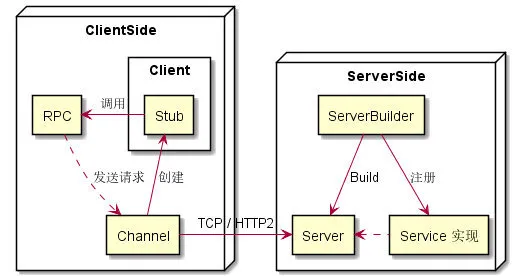
   
* 客户端调用这些API，服务器端实现相应的API
  - 服务侧，服务器实现服务中声明的方法并运行一个gRPC服务器来处理客户端的调用。gRPC的基础设施解码传入的请求，执行服务的方法，编码服务的响应
  - 客户端，客户端拥有一个名为stub(存根)的本地对象（在有些语言中更倾向于把stub叫做客户端）该对象同样实现了服务中的方法。客户端可以只在本地对象上调用这些方法，将调用参数包装在适当的protocol buffer消息类型中，gRPC会负责将请求发送给服务器并且返回服务端的protocol buffer响应

* 截止时间/超时时间：gRPC允许客户端指定在RPC被 DEADLINE_EXCEEDED错误终结前愿意等待多长时间来让RPC完成工作。在服务器端，服务器可以查看一个特定的RPC是否超时或者还有多长时间剩余来完成RPC
* 终止:在gRPC中，客户端和服务端对调用是否成功做出独立的基于本地的决定，而且两端的结论有可能不匹配
* 元数据:以键值对列表形式提供的关于特定RPC调用的信息（比如说身份验证详情），其中键是字符串，值通常来说是字符串（但是也可以是二进制数据）
* 取消:客户端或服务器都可以随时取消RPC。取消操作将立即终止RPC，因此不再进行任何工作。这不是“撤消”：取消之前所做的更改不会回滚

### Service 定义

* `.proto` 文件定义服务 `Greeter` 和 API `SayHello`

```c
// helloworld.proto
// The greeting service definition.
service Greeter {
  // Sends a greeting
  rpc SayHello (HelloRequest) returns (HelloReply) {}
}
```

#### 类型

* 按照 Client 和 Server 一次发送/返回的是单个消息还是多个消息
- 一元 RPC Unary RPC
	- `rpc GetFeature(Point) returns (Feature) {}`：类似普通的函数调用，客户端发送请求Point到服务器，服务器返回相应Feature
    + 一旦客户端调用 stub/客户端对象上的方法，服务器会被通知RPC已经被调用了，同样会接收到调用时客户端的元数据、调用的方法名称以及制定的截止时间(如果适用的话)。
    + 服务器可以立即发送自己的初始元数据（必须在发送任何响应之前发送），也可以等待客户端的请求消息-哪个先发生应用程序指定的。
    + 服务器收到客户的请求消息后，它将完成创建和填充其响应所需的必要工作。然后将响应（如果成功）连同状态详细信息（状态代码和可选状态消息）以及可选尾随元数据一起返回。
    + 如果状态是OK，客户端将获得响应，从而在客户端完成并终结整个调用过程
- 服务器流式 RPC Server streaming RPC 
	- `rpc ListFeatures(Rectangle) returns (stream Feature) {}`：客户端发起一次请求，服务器端获取流以读取回一系列消息，比如一个数组中的逐个元素,gRPC保证单个RPC调用中的消息顺序
    + 与简单的一元RPC类似，不同的是服务器在接收到客户端的请求消息后会发回一个响应流。在发送回所有的响应后，服务器的状态详情（状态码和可选的状态信息）和可选的尾随元数据会被发回以完成服务端的工作。客户端在接收到所有的服务器响应后即完成操作
- 客户端流式 RPC Client streaming RPC
	- `rpc RecordRoute(stream Point) returns (RouteSummary) {}`：客户端使用提供的流写入消息序列然后将它们发送到服务器，比如数组中的逐个元素，服务器返回一个响应,gRPC保证了在单个RPC调用中的消息顺序
    + 也类似于一元PRC，不同之处在于客户端向服务器发送请求流而不是单个请求。服务器通常在收到客户端的所有请求后（但不一定）发送单个响应，以及其状态详细信息和可选的尾随元数据。
- 双向流式 RPC Bidirectional streaming RPC 
	- `rpc RouteChat(stream RouteNote) returns (stream RouteNote) {}`：双方都使用读写流发送一系列消息。这两个流是独立运行的，因此客户端和服务器可以按照自己喜欢的顺序进行读写
    + 调用由客户端调用方法发起，服务器接收客户端元数据，方法名称和期限。同样，服务器可以选择发回其初始元数据，或等待客户端开始发送请求。
    + 接下来发生的情况取决于应用程序，因为客户端和服务器可以按任何顺序进行读取和写入-流操作完全是独立地运行。例如，服务器可以等到收到所有客户端的消息后再写响应，或者服务器和客户端可以玩“乒乓”：服务器收到请求，然后发回响应，然后客户端发送基于响应的另一个请求，依此类推。
+ 流结束
	+ Client 发送流，通过 Writer->WritesDone() 函数结束流
	+ Server 发送流，通过结束 RPC 函数并返回状态码的方式来结束流,将 status code、可选的 status message、可选的 trailing metadata 追加进行发送，这就意味着流结束了。
	+ 流接受者，都是通过 Reader->Read() 返回的 bool 型状态，来判断流是否结束

####  RPC vs API

* RPC (Remote Procedure Call) 是一次远程过程调用的整个动作，而 API (Application Programming Interface) 是不同语言在实现 RPC 中的具体接口。
* 一个 RPC 可能对应多种 API，比如同步的、异步的、回调的
* 一次 RPC 是对某个 API 的一次调用
	
```c
std::unique_ptr<ClientAsyncResponseReader<HelloReply> > rpc(
    stub_->PrepareAsyncSayHello(&context, request, &cq));
```
	
### Client

* `class GreeterClient` 是 Client，是对 Stub 封装；通过 Stub 可以真正的调用 RPC 请求

```c
class GreeterClient {
public:
  GreeterClient(std::shared_ptr<Channel> channel)
      : stub_(Greeter::NewStub(channel)) {}

  std::string SayHello(const std::string& user) {
...
private:
  std::unique_ptr<Greeter::Stub> stub_;
};
```

#### Client 调用 RPC

* 调用一元 (Unary) RPC 时，像调用普通函数一样，除了传入 ClientContext 之外，将 Request 和 Response 的地址，返回的是 RPC 状态：
* 调用 ServerStream RPC 时，不会得到状态，而是返回一个 ClientReader 的指针：
	- Reader 通过不断的 Read()，来不断的读取流，结束时 Read() 会返回 false；通过调用 Finish() 来读取返回状态。
* 调用 ClientStream RPC 时，则会返回一个 ClientWriter 指针：
	- Writer 会不断的调用 Write() 函数将流中的消息发出；发送完成后调用 WriteDone() 来说明发送完毕；调用 Finish() 来等待对端发送状态。
* 调用双向流 RPC 时，会返回 ClientReaderWriter：
	- Reader 和 Writer 读取和发送完成的函数调用。因为 RPC 都是 Client 请求而后 Server 响应，双向流也是要 Client 先发送完自己流，才有 Server 才可能结束 RPC。所以对于双向流的结束过程是：
		- stream->WriteDone()
		- stream->Finish()
	- 示例中创建了单独的一个线程去发送请求流，在主线程中读返回流，实现了一定程度上的并发。

```c
// rpc GetFeature(Point) returns (Feature) {}
Status GetFeature(ClientContext* context, const Point& request, Feature* response);

// rpc ListFeatures(Rectangle) returns (stream Feature) {}
unique_ptr<ClientReader<Feature>> ListFeatures(ClientContext* context, const Rectangle& request);

// rpc RecordRoute(stream Point) returns (RouteSummary) {}
unique_ptr<ClientWriter<Point>> RecordRoute(ClientContext* context, Route Summary* response);

// rpc RouteChat(stream RouteNote) returns (stream RouteNote) {}
unique_ptr<ClientReaderWriter<RouteNote, RouteNote>> RouteChat(ClientContext* context);
```

### Stub

* Stub 是在 Channel 的基础上创建而成的

```C
target_str = "localhost:50051";

auto channel = grpc::CreateChannel(target_str, grpc::InsecureChannelCredentials());

GreeterClient greeter(channel);
std::string user("world");
std::string reply = greeter.SayHello(user);
```

#### Channel

* Channel 提供一个与特定 gRPC server 的主机和端口建立的连接
* 在创建客户端存根（或者对某些语言来说就是“客户端”）时被使用。客户端可以指定通道参数来更改gRPC的默认行为.
* 状态
	* connected
	* idle

### Server

* 创建 Server 需要一个 Builder，添加上监听的地址和端口，注册上该端口上绑定的服务，构建出 Server 并启动

```C
ServerBuilder builder;
builder.AddListeningPort(server_address, grpc::InsecureServerCredentials());
builder.RegisterService(&service);
std::unique_ptr<Server> server(builder.BuildAndStart());


class GreeterServiceImpl final : public Greeter::Service {
  Status SayHello(ServerContext* context, const HelloRequest* request,
                  HelloReply* reply) override {
    std::string prefix("Hello ");
    reply->set_message(prefix + request->name());
	  
    return Status::OK;
  }
};
```

####  Service 实现

* Server 需要实现对应 RPC，所有 RPC 组成 Service
* 每种 RPC 的实现都需要将 ServerContext 作为参数输入
* 一元 (Unary) RPC 调用，则像调用普通函数一样。将 Request 和 Reply 的对象地址作为参数传入，函数中将根据 Request 的内容，在 Reply 的地址上写上对应的返回内容。
* 涉及到流，则会用 Reader 或/和 Writer 作为参数，读取流内容。
	- ServerStream 模式下，只有 Server 端产生流，这时对应的 Server 返回内容，需要使用作为参数传入的 `ServerWriter`。这类似于以 `'w'` 打开一个文件，持续的往里写内容，直到没有内容可写关闭。
	- Client 来的流，Server 需要使用一个 ServerReader 来接收。这类似于打开一个文件，读其中的内容，直到读到 EOF 为止类似
	- Bidirectional-Stream 模式，输入参数除了 ServerContext 之外，只有一个 ServerReaderWriter 指针。通过该指针，既能读 Client 来的流，又能写 Server 产生的流
		- Server 不断地从 stream 中读，读到了就将对应的写过写到 stream 中，直到客户端告知结束；Server 处理完所有数据之后，直接返回状态码即可

```c
// rpc GetFeature(Point) returns (Feature) {}
Status GetFeature(ServerContext* context, const Point* point, Feature* feature);

// rpc ListFeatures(Rectangle) returns (stream Feature) {}
Status ListFeatures(ServerContext* context, const routeguide::Rectangle* rectangle, ServerWriter<Feature>* writer);

// rpc RecordRoute(stream Point) returns (RouteSummary) {}
Status RecordRoute(ServerContext* context, ServerReader<Point>* reader,RouteSummary* summary);

// rpc RouteChat(stream RouteNote) returns (stream RouteNote) {}
Status RouteChat(ServerContext* context, ServerReaderWriter<RouteNote, RouteNote>* stream);
```

### 异步

- 不管是 Client 还是 Server，异步 gRPC 利用 CompletionQueue API 进行异步操作。流程
	- 绑定一个 `CompletionQueue` 到一个 RPC 调用
    - 利用唯一 `void* Tag` 进行读写
    - 调用 `CompletionQueue::Next()` 等待操作完成
    - 完成后通过唯一的 Tag 来判断对应什么请求/返回进行后续操作
- 异步 Client `greeter_async_client.cc` 是异步 Client 的 Demo，其中只有一次请求，逻辑简单
	- 创建  `CompletionQueue`
	-  创建 RPC (`ClientAsyncResponseReader<HelloReply>`) 两种方式
		- `stub_->PrepareAsyncSayHello() + rpc->StartCall()`
		- `stub_->AsyncSayHello()`
	- 调用 `rpc->Finish() `设置请求消息 reply 和唯一的 tag 关联，将请求发送出去
	- 使用 `cq.Next()` 等待 Completion Queue 返回响应消息体，通过 tag 关联对应请求
- 异步 Client 2 在 example/cpp/helloworld 中还有另外一个异步 Client, `greeter_async_client2.cc` 使用两个线程去分别进行发送请求和处理返回
	- 一个线程批量发出 100 个 SayHello 的请求
	- 另外一个不断的通过 cq_.Next() 来等待返回
- 异步 Server
	-  创建一个 CallData，初始构造列表中将状态设置为 CREATE 构造函数中，调用 Process()成员函数，调用 service_->RequestSayHello()后，状态变更为 PROCESS
		- 传入 `ServerContext ctx_`
		- 传入 `HelloRequest request_`
		- 传入 `ServerAsyncResponseWriter<HelloReply> responder_`
		- 传入 `ServerCompletionQueue* cq_`
		- 将对象自身的地址作为 tag 传入该动作，能将事件加入事件循环，可以在 CompletionQueue 中等待
	-  收到请求，cq->Next()的阻塞结束并返回，得到 tag，既上次传入的 CallData 对象地址
	-  调用 tag 对应 CallData 对象的 Proceed()，此时状态为 Process
		- 创建新的 CallData 对象以接收新请求
		- 处理消息体并设置 reply_
		- 将状态设置为 FINISH
		- 调用 responder_.Finish() 将返回发送给客户端
		- 该动作能将事件加入到事件循环，可以在 CompletionQueue 中等待
	-  发送完毕，cq->Next()的阻塞结束并返回，得到 tag。现实中，如果发送有异常应当有其他相关的处理
	-  调用 tag 对应 CallData 对象的 Proceed()，此时状态为 FINISH，delete this 清理自己，一条消息处理完成
-  无论是 Client 还是 Server，在以异步方式进行处理时，都要预先分配好一定的内存/对象，以存储异步的请求或返回。
-  回调方式的异步调用:结构上与同步方式相差不多，但是并发有本质的区别
	-  属于实验性质的，不建议直接在生产环境使用
	-  Client:发送单个请求，在调用 SayHello 时，除了传入 Request、 Reply 的地址之外，还需要传入一个接收 Status 的回调函数。
			- 例子中只有一个请求，因此在 SayHello 之后，直接通过 condition_variable 的 wait 函数等待回调结束，然后进行后续处理。这样其实不能进行并发，跟同步请求差别不大。
			- 如果要进行大规模的并发，还是需要使用额外的对象进行封装一下。
	- 回调 Server 与同步 Server 不同的是：
		- 服务的实现是继承 Greeter::CallbackService
		- SayHello 返回的不是状态，而是 ServerUnaryReactor 指针
		- 通过 CallbackServerContext 获得 reactor
		- 调用 reactor 的 Finish 函数处理返回状态

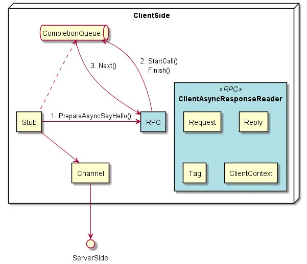右侧 RPC 为创建的对象中的内存容，左侧使用相同颜色的小块进行代替
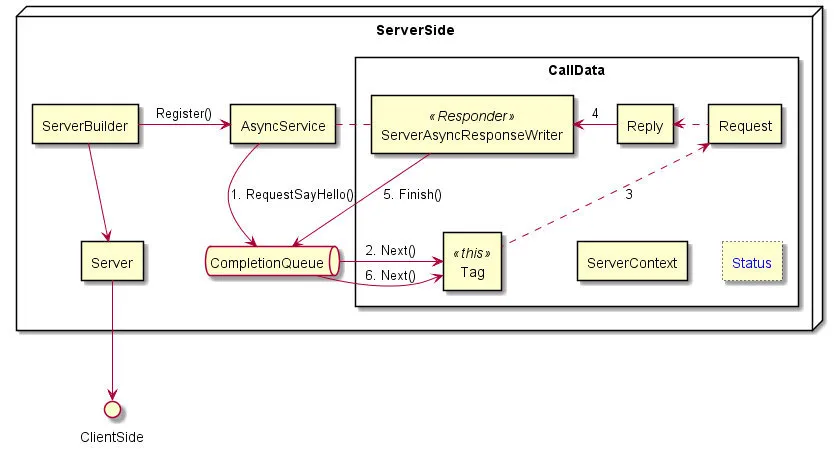
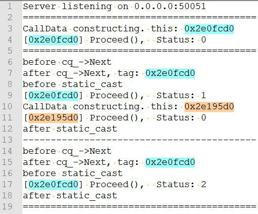

```sh
cd examples/cpp/helloworld/
vimdiff greeter_callback_client.cc greeter_client.cc
vimdiff greeter_callback_server.cc greeter_server.cc
```

```c
stub_->async()->SayHello(&context, &request, &reply,
                         [&mu, &cv, &done, &status](Status s) {
                           status = std::move(s);
                           std::lock_guard<std::mutex> lock(mu);
                           done = true;
                           cv.notify_one();
                         });
// 函数调用函数声明如下，很明显这是实验性（experimental）的接口
void Greeter::Stub::experimental_async::SayHello(
    ::grpc::ClientContext* context, const ::helloworld::HelloRequest* request,
    ::helloworld::HelloReply* response, std::function<void(::grpc::Status)> f);
```

### 上下文

* gRPC 支持上下文的传递，主要用途：
	- 添加自定义的 metadata，能够通过 gRPC 调用传递
	- 控制调用配置，如压缩、鉴权、超时
	- 从对端获取 metadata
	- 用于性能测量，比如使用 opencensus 等
- 客户端添加自定义的 metadata key-value 对没有特别的区分
- 服务端添加，则有 inital 和 trailing 两种 metadata 的区分
- Callback Server 对应的上下文叫做 `CallbackServerContext`，与 `ServerContext` 继承自同一个基类，功能基本上相同。区别在于：
	-  ServerContext 被 Sync Server 和基于 CQ 的 Async Server 所使用，后者需要用到 `AsyncNotifyWhenDone`
	-  CallbackServerContext 因为在 `CallOnDone` 的时候，需要释放 context，因此需要知道 context_allocator，因此对应设置和获取 context_allocator 的两个函数

```c
void AddMetadata (const std::string &meta_key, const std::string &meta_value)
	
void AddInitialMetadata (const std::string &key, const std::string &value)
void AddTrailingMetadata (const std::string &key, const std::string &value)
```

## 通信协议

* ABNF 语法是一种描述协议的标准，gRPC 协议也是使用 ABNF 语法描述
* 请求协议
	* `*<element>` 表示 element 会重复多次（最少 0 次）
	* `Request-Headers` 由一个 `Call-Definition` 和若干 `Custom-Metadata` 组成
		* `[]` 表示最多出现一次，比如 `Call-Definition` 有很多组成部分，其中 `Message-Type` 等是选填的
	* 可能多次出现的 `Length-Prefixed-Message`
	* 最后以一个 `EOS` 结尾（EOS 表示 End-Of-Stream）
		* 并没有单独的数据去描述，而是通过 HTTP2 的数据帧上带一个 END_STREAM 的 flag 来标识的
*  返回协议
	- () 表示括号中的内容作为单个元素对待，/ 表示前后两个元素可选其一
	- Response 的定义说明，可以有两种返回形式
		- 一种是消息头、消息体、Trailer
		- 另外一种是只带 Trailer
	- 区分 gRPC 的 Status 和 HTTP 的 Status 两种状态
	- 最后一部分都是`Trailers`，其中包含了 gRPC 的状态码、状态信息和额外的自定义元数据.同样地，使用 END_STREAM 的 flag 标识最后 Trailer 的结束。

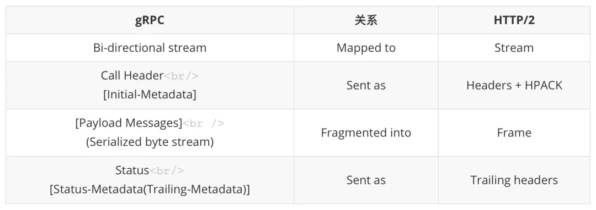

```
3.  Operators
 3.1.  Concatenation:  Rule1 Rule2
 3.2.  Alternatives:  Rule1 / Rule2
 3.3.  Incremental Alternatives: Rule1 =/ Rule2
 3.4.  Value Range Alternatives:  %c##-##
 3.5.  Sequence Group:  (Rule1 Rule2)
 3.6.  Variable Repetition:  *Rule
 3.7.  Specific Repetition:  nRule
 3.8.  Optional Sequence:  [RULE]
 3.9.  Comment:  ; Comment
 3.10. Operator Precedence
 
Request → Request-Headers *Length-Prefixed-Message EOS

Request-Headers → Call-Definition *Custom-Metadata
Call-Definition → Method Scheme Path TE [Authority] [Timeout] Content-Type [Message-Type] [Message-Encoding] [Message-Accept-Encoding] [User-Agent]

Length-Prefixed-Message → Compressed-Flag Message-Length Message

Response → (Response-Headers *Length-Prefixed-Message Trailers) / Trailers-Only

Response-Headers → HTTP-Status [Message-Encoding] [Message-Accept-Encoding] Content-Type *Custom-Metadata

Trailers-Only → HTTP-Status Content-Type Trailers
Trailers → Status [Status-Message] *Custom-Metadata
```

## Generated Code

* 通过 protoc 生成 gRPC 相关的文件
- 用于消息体定义的 xxx.pb.h 和 xxx.pb.cc 文件
- 定义 RPC 过程的 xxx.grpc.pb.h 和 xxx.grpc.pb.cc。`helloworld.grpc.pb.h` 文件中有命名空间 `helloworld`，其中就仅包含一个类 `Greeter`，所有 RPC 相关定义都在 `Greeter` 当中，分两部分：
	- Client 用于调用 RPC 的媒介 `Stub` 相关类
	- Server 端用于实现不同服务的 Service 相关类和类模板
- Stub
	- .proto 中一个 service 只有一个 Stub，类中会提供对应每个 RPC 所有的同步、异步、回调等方式的函数都包含在该类中，该类继承自接口类 StubInterface。
	- 为什么需要一个 StubInterface 来让 Stub 继承，而不是直接产生 Stub？别的复杂的 proto 会有多个 Stub 继承同一个 StubInterface 的情况？不会，因为每个 RPC 对应的函数名是不同。
	- Greeter 中唯一一个函数是用于创建 Stub 的静态函数 NewStub
	- Stub 中同步、异步方式的函数是直接作为 Stub 的成员函数提供，比如针对一元调用：
		- SayHello
		- AsyncSayHello
		- PrepareAsyncSayHello
	- 回调方式的 RPC 调用通过一个 `experimental_async` 的类进行了封装（有个 `async_stub_` 的成员变量），所以回调 Client 中提到，回调的调用方式用法是 `stub_->async()->SayHello(...)`。
- Service 本节说的 Service  `helloworld.grpc.pb.h` 中`Greeter::Service`
	- `helloworld.grpc.pb.h` 文件中共定义了 **7 种 Service**，拿出最常用的 `Service` 和 `AsyncService` 两个定义来说明下 Service 的定义过程：通过类模板链式继承。
	- Service 跟其他几种 Service 不同，直接继承自 `grpc::Service`，而其他的 Service 都是由类模板构造出来的，而且使用类模板进行嵌套，最基础的类就是这里的 `Service
	- 特点：
		- 构造函数利用其父类 grpc::Service 的 AddMethod() 函数，将 .proto 文件中定义的 RPC API，添加到成员变量 methods_ 中（methods_ 是个向量）
		- AddMethod() 时会创建 RpcServiceMethod 对象，而该对象有一个属性叫做 api_type_，构造时默认填的 ApiType::SYNC.所以 Service 类中的所有 RPC API 都是同步的
		- SayHello 函数不直接声明为纯虚函数，而是以返回 UNIMPLEMENTED 状态，因为这个类可能被多次、多级继承
	- AsyncService 含义就是继承自 Service，加上 WithAsyncMethod_SayHello 新功能：
		- 构造时，将 SayHello (RPC) 对应的 api_type_ 设置为 ApiType::ASYNC
		- 将 SayHello 函数直接禁用掉， abort() + 返回 UNIMPLEMENTED 状态码
		- 添加 RequestSayHello() 函数
	- 通过 gRPC 提供的 `route_guide.proto` 例子能更明显的理解这点
		- RouteGuide 服务中有 4 个 RPC，`GetFeature`、`ListFeatures`、`RecordRoute`、`RouteChat`，通过 4 个`WithAsyncMethod_{RPC_name}` 的类模板嵌套，能将 4 个 API 都设置成 `ApiType::ASYNC`、添加上对应的 `RequestXXX()` 函数、禁用同步函数。
	- 种类
		- Service
		- AsyncService
		- CallbackService
		- ExperimentalCallbackService -- 等价于 CallbackService
		- StreamedUnaryService
		- SplitStreamedService -- 等价于 Service
		- StreamedService -- 等价于 StreamedUnaryService
		- 不同类型的 Service 是跟前边提到的 `api_type_` 有关。使用不同的 `::grpc::Service::MarkMethodXXX` 设置**不同的 ApiType** 会产生**不同的 API 模板类**，所有 API 模板类级联起来，就得到了**不同的 Service**。
- 与 ::grpc 核心库的关系
	- Stub 类中主要用到 gRPC Channel 和不同类型 RPC 对应的方法实现
- Service 类则继承自 ::grpc::Service，具备其父类的能力，需要自己实现一些 RPC 方法具体的处理逻辑。其它 Service 涉及到 gRPC 核心库的联系有：
	- AsyncService::RequestSayHello() 调用 ::grpc::Service::RequestAsyncUnary
	- CallbackService::SayHello() 函数返回的是 ::grpc::ServerUnaryReactor 指针
	- CallbackService::SetMessageAllocatorFor_SayHello() 函数中调用 ::grpc::internal::CallbackUnaryHandler::SetMessageAllocator() 函数设置 RPC 方法的回调的消息分配器。

```c
static std::unique_ptr<Stub> NewStub(...)
	
return ::grpc::internal::BlockingUnaryCall< ::helloworld::HelloRequest, ::helloworld::HelloReply, ::grpc::protobuf::MessageLite, ::grpc::protobuf::MessageLite>(channel_.get(), rpcmethod_SayHello_, context, request, response);

return std::unique_ptr< ::grpc::ClientAsyncResponseReader< ::helloworld::HelloReply>>(AsyncSayHelloRaw(context, request, cq));

template <class BaseClass>
  class WithAsyncMethod_SayHello : public BaseClass { ... };

typedef WithAsyncMethod_SayHello<Service > AsyncService;
typedef WithAsyncMethod_GetFeature< \
    WithAsyncMethod_ListFeatures< \
    WithAsyncMethod_RecordRoute< \
    WithAsyncMethod_RouteChat<Service> > > >
    AsyncService;
```

## [protobuf](https://github.com/protocolbuffers/protobuf/)

Protocol Buffers - Google's data interchange format  <https://developers.google.com/protocol-buffers/> 

* [Protocol Buffers](https://developers.google.com/protocol-buffers/docs/overview)
* gRPC 默认使用 Protobuf 作为接口定义语言（IDL），也可以使用其他的 IDL 替代 Protobuf
* Protobuf 编码基于变种 Base128
* Google公司开发的一种数据描述语言，用于描述一种轻便高效的结构化数据存储格式，并于2008年对外开源
* 用于结构化数据串行化，或者说序列化。设计非常适用于在网络通讯中的数据载体，适合做数据存储或 RPC 数据交换格式，序列化出来的数据量少再加上以 K-V 的方式来存储数据，对消息的版本兼容性非常强，可用于通讯协议、数据存储等领域的语言无关、平台无关、可扩展的序列化结构数据格式。
* 开发者可以通过 Protobuf 附带工具生成代码并实现将结构化数据序列化的功能


### [Base 128 Varints](https://google.golang.org/protobuf@v1.25.0/encoding/protowire/wire.go)

* Google 开发的序列化库 Protocol Buffers 所用的编码方式。Varints are a method of serializing integers using one or more bytes. Smaller numbers take a smaller number of bytes. 尽量只储存整数的有效位，高位的 0 尽可能抛弃。
* Base 128 Varints 只能对一部分数据结构进行编码，不适用于所有字节流（当然你可以把任意字节流转换为 string，但不是所有语言都支持这个 trick）。否则无法识别哪部分是无效的 bits。
* Base 128 Varints 编码后的字节可以不存在于 Ascii 表中，因为和 Base 64 使用场景不同，不用考虑是否能正常打印。
* 实现
	* 对于编码后的每个字节，低 7 位用于储存数据，最高位用来标识当前字节是否是当前整数的最后一个字节，称为最高有效位（most significant bit, msb）。
	* msb 为 1 时，代表着后面还有数据
	* msb 为 0 时代表着当前字节是当前整数的最后一个字节
- 编码
	- 将数据按每 7 bits 一组拆分
    - 逆序每一个组
    - 添加 msb
- 解码 300 (0b100101100) 1010 1100 0000 0010 
		- 去除 msb
		- 将字节流逆序（msb 为 0 的字节储存原始数据的高位部分，小端模式）
		- 最后拼接所有的 bits
- 逆序字节流这一步在机器处理中实际是不存在的，机器采用小端模式处理数据，此处逆序仅是为了符合人的阅读习惯而写出
- 所有与有线类型0关联的类型都会采用此编码
- 编码负数时，带符号的int类型（sint32和sint64）与“标准” int类型（int32和int64）之间存在着巨大区别。
	- 如果将int32或int64用作负数的类型，则结果varint总是十个字节长––实际上，它被视为一个非常大的无符号整数。
	- 如果使用带符号类型(sint32和sint64)之一，则生成的varint使用ZigZag编码，效率更高
* [编解码](https://mp.weixin.qq.com/s?__biz=MzUzNTY5MzU2MA==&mid=2247483873&idx=1&sn=2ff1ecdfc2760d054de944612786b59f)
  - 当一个消息被编码时，键和值会被连接放入字节流中
  - 当消息被解码时，分析器需要能够跳过未识别的字段。这样，新加入消息的字段就不会破坏不知道他们存在的那些老程序
  - 有线格式消息中每个对的“键”实际上是两个值：-.proto文件中的字段编号，加上 一种有线类型，该类型仅提供足够的信息来查找随后的值的长度

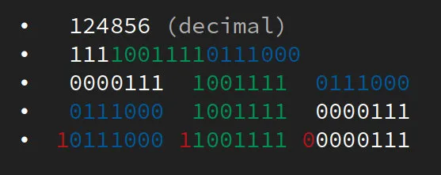
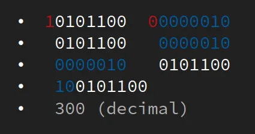

### 数据类型 wire type

* 默认值
  - 字符串，默认值为空字符串
  - 字节，默认值为空字节
  - bool，默认值为false
  - 数字类型，默认值为零
  - 枚举，默认值是第一个定义的枚举值，该值必须为0
  - 消息字段，未设置该字段。它的确切值取决于语言
* 枚举类型:都需要包含一个常量映射到0并且作为定义的首行，因为：
  - 必须有0值，这样就可以将0作为枚举的默认值
  - proto2语法中首行的枚举值总是默认值，为了兼容0值必须作为定义的首行
* 使用 protobuf 进行编码时经过两步处理
	- 将编程语言的数据结构转化为 wire type
    - 根据不同 wire type 使用对应的方法编码。 Base 128 Varints 用来编码 varint 类型的数据，其他 wire type 则使用其他编码方式
- 不同语言中 wire type 实际上也可能采用了语言中的某种类型来储存 wire type 的数据。例如，Go 中使用了 uint64 来储存 wire type 0。一般来说，大多数语言中的无符号整型被转换为 varints 之后，有效位上的内容并没有改变。

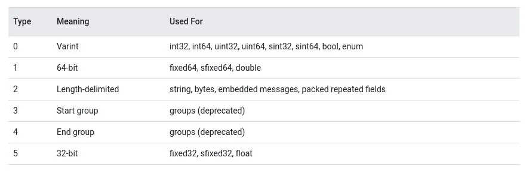

```sh
# .proto Type Notes C++  Java Go  PHP
double
double double float64 float

float
float float float32 float

int32 使用可变长度编码。编码负数的效率低 - 如果字段可能有负值，请改用sint32。 int32 int int32 integer

int64 使用可变长度编码。编码负数的效率低 - 如果字段可能有负值，请改用sint64。 int64 long int64 integer/string[5]

uint32 使用可变长度编码 uint32 int uint32 integer
uint64 使用可变长度编码. uint64 long uint64 integer/string[5]
sint32 使用可变长度编码。签名的int值。这些比常规int32更有效地编码负数。 int32 
int int32 integer
sint64 使用可变长度编码。签名的int值。这些比常规int64更有效地编码负数。 int64 long int64 integer/string[5]
fixed32 总是四个字节。如果值通常大于228，则比uint32更有效。 uint32 int uint32 integer
fixed64 总是八个字节。如果值通常大于256，则比uint64更有效 uint64 long uint64 integer/string[5]
sfixed32 总是四个字节 int32 int int32 integer
sfixed64 总是八个字节 int64 long int64 integer/string[5]

bool
bool boolean bool boolean
string 字符串必须始终包含UTF-8编码或7位ASCII文本，且不能超过232。 string String string string
bytes 可以包含不超过232的任意字节序列。 string ByteString []byte string


# 可用的有线类型
Type Meaning Used For
0 Varint int32, int64, uint32, uint64, sint32, sint64, bool, enum
1 64-bit fixed64, sfixed64, double
2 Length-delimited string, bytes, embedded messages, packed repeated fields
3 Start group groups (deprecated)
4 End group groups (deprecated)
5 32-bit fixed32, sfixed32, float
```

### 转换规则

* 有符号整型:采用 zigzag 编码来将 sint32 和 sint64 转换为 wire type 0
	* 如果不先采用 ZigZag 编码成 wire type，负值 sint64 直接使用 Base 128 Varints 编码之后的长度始终为`ceil(64/7)=10bytes`，浪费大量空间。使用 ZigZag 编码后，绝对值较小的负数的长度能够被显著压缩。
	* 对于 -234(sint32) 这个例子，编码成 varints 之前采用 ZigZag 编码，比直接编码成 varints 少用了 60%的空间。
	* 当然，ZigZag 编码也不是完美的方法。当尝试把 sint32 或 sint64 范围内所有的整数都编码成 varints 字节流,使用 ZigZag 已经不能压缩字节数量了。
	* ZigZag 虽然能压缩部分负数的空间，但同时正数变得需要更多的空间来储存。因此，建议在业务场景允许的场景下尽量用无符号整型，有助于进一步压缩编码后的空间。
* 定长数据（64-bit）直接采用小端模式储存，不作转换。
* 字符串：编码后的 value 分为两部分
	* 首位表示字符串采用 UTF-8 编码后字节流的长度（bytes），采用 Base 128 Varints 进行编码。
	* 后面，字符串用 UTF-8 编码后的字节流。

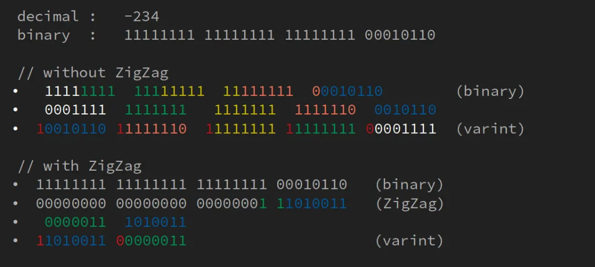

```c
(n << 1) ^ (n >> 31)  // for 32-bit signed integer
(n << 1) ^ (n >> 63)  // for 64-bit signed integer

n * 2       // when n >= 0
-n * 2 - 1  // when n < 0
```

### message 消息

* 注释 `//` 和 `/*...*/`
* 文件中非空非注释行的第一行必须指定使用 proto3语法。如果省略 protocol buffer编译器默认使用 proto2语法
* Protobuf 采用 proto3 作为 DSL 来描述其支持的消息结构
* 最基本数据单元 message，是类似Go语言中结构体的存在
* 定义字段规则
	*  ingular：一个遵循singular规则的字段，在一个结构良好的message消息体(编码后的message)可以有0或1个该字段（但是不可以有多个）。这是proto3语法的默认字段规则。（这个理解起来有些晦涩，举例来说上面例子中三个字段都是singular类型的字段，在编码后的消息体中可以有0或者1个query字段，但不会有多个。）
	* repeated：遵循repeated规则的字段在消息体重可以有任意多个该字段值，这些值的顺序在消息体重可以保持（就是数组类型的字段）
* 使用 proto2 消息类型
	* proto2的枚举类型不能直接应用到proto3的语法中
* 每一个字段后面都有一个 `= x` 定义了每个字段都有一个唯一编号，给每一个字段指定一个 ID，称为 field number。消息内同一层次字段的 field number 必须各不相同
	* 被用来在二进制消息体中识别定义的这些字段，一旦message类型被用到后就不应该在修改这些编号了
	* 注意在将message编码成二进制消息体时字段编号1-15将会占用1个字节，16-2047将占用两个字节。所以在一些频繁使用用的message中，应该总是先使用前面1-15字段编号
	* 可以指定最小编号是1，最大是2E29 - 1（536,870,911）。其中19000到19999是给protocol buffers实现保留的字段标号，定义message时不能使用
	* 也不能重复使用任何当前message定义里已经使用过和预留的字段编号
* 映射类型 `map<key_type, value_type> map_field = N;`
	* `key_type`可以是任意整数或者字符串（除了浮点数和bytes以外的所有标量类型）。注意 enum不是一个有效的 `key_type`在 protobuf 源码中被称为 tag
		*  field number 左移 3 bits
    	*  在最低 3 bits 写入 wire type
		*  tag 的长度不能超过 32 bits，意味着 field number 的最大取值为 2^29-1 (536870911)。而且在这个范围内，有一些数是不能被使用的
			* 0 ，protobuf 规定 field number 必须为正整数。
    		- 19000 到 19999， protobuf 仅供内部使用的保留位
		- field number 不必从 1 开始，可以从合法范围内的任意数字开始。
    	- 不同字段间的 field number 不必连续，只要合法且不同即可。
	* `value_type`可以是除映射以外的任意类型（意思是protocol buffers的消息体中不允许有嵌套map）
	* 映射里的字段不能是follow repeated规则的（意思是映射里字段的值不能是数组）
	*  映射里的值是无序的，所以不能依赖映射里元素的顺序
	* 生成.proto的文本格式时，映射按键排序。数字键按数字排序
	* 从线路解析或合并时，如果有重复的映射键，则使用最后看到的键。从文本格式解析映射时，如果存在重复键，则解析可能会失败。
	* 如果未给映射的字段指定值，字段被序列化时的行为依语言而定。在C++， Java和Python中字段类型的默认值会被序列化作为字段值，而其他语言则不会
* 预定义消息类型
	* Protobuf 带有一组预定义的消息，称为众所周知的类型（WKT）。这些类型可以用于与其他服务的互操作性，或者仅仅因为它们简洁地表示了常见的有用模式
	* WKT的预生成Go代码作为Go protobuf库的一部分进行分发，如果message中使用了WKT，则生成的消息的Go代码会引用此代码
* 更新
	* field number 一旦被分配了就不应该被更改，除非能保证所有的接收方都能更新到最新的 proto 文件。
    * 由于 tag 中不携带 field name 信息，更改 field name 并不会改变消息的结构。发送方认为的 apple 到接受方可能会被识别成 pear。双方把字段读取成哪个名字完全由双方自己的 proto 文件决定，只要字段的 wire type 和 field number 相同即可。
	* 如果添加新字段，任何由旧版消息格式生成的代码所序列化的消息，仍能被依据新消息格式生成的代码所解析。你应该记住这些元素的默认值这些新生成的代码就能够正确地与由旧代码序列化创建的消息交互了。类似的，新代码创建的消息也能由旧版代码解析：旧版消息（二进制）在解析时简单地忽略了新增的字段，查看下面的未知字段章节了解更多。
	* 只要在更新后的消息类型中不再重用字段编号，就可以删除该字段。你也可以重命名字段，比如说添加 OBSOLETE_前缀或者将字段编号设置为 reserved，这些未来其他用户就不会意外地重用该字段编号了。
	* 由于 tag 中携带的类型是 wire type，不是语言中具体的某个数据结构，而同一个 wire type 可以被解码成多种数据结构，具体解码成哪一种是根据接收方自己的 proto 文件定义的。修改 proto 文件中的类型，有可能导致错误
* 未知字段是格式良好的协议缓冲区序列化数据，表示解析器无法识别字段
	* proto3 消息在解析期间总是丢弃未知字段
	* 在3.5版本中，重新引入了未知字段的保留以匹配proto2行为
	* 版本3.5及更高版本中，未知字段在解析期间保留，并包含在序列化输出中
* 嵌套消息
	* wire type2 （length-delimited）不仅支持 string，也支持 embedded messages。
	* 对于嵌套消息，首先要将被嵌套的消息进行编码成字节流，然后就可以像处理 UTF-8 编码的字符串一样处理这些字节流：在字节流前面加入使用 Base 128 Varints 编码的长度即可。
* 重复消息
	- 假设接收方的 proto3 中定义了某个字段（假设 field number=1），当接收方从字节流中读取到多个 field number=1 的字段时，会执行 merge 操作。merge 的规则如下：
		+ 如果字段为不可分割的类型，则直接覆盖
    	+ 如果字段为 repeated，则 append 到已有字段
    	+ 如果字段为嵌套消息，则递归执行 merge
	+ 如果字段的 field number 相同但是结构不同，则出现 error
- 字段顺序
	- Proto 文件中定义字段顺序与最终编码结果的字段顺序无关，两者有可能相同也可能不同。
	- 当消息被编码时，Protobuf 无法保证消息的顺序，消息的顺序可能随着版本或者不同的实现而变化。任何 Protobuf 的实现都应该保证字段以任意顺序编码的结果都能被读取。
	- 序列化后的消息字段顺序是不稳定的。
	- 对同一段字节流进行解码，不同实现或版本的 Protobuf 解码得到的结果不一定完全相同（bytes 层面）。只能保证相同版本相同实现的 Protobuf 对同一段字节流多次解码得到的结果相同。
	- 假设有两条逻辑上相等消息，但是序列化之后的内容（bytes 层面）不相同，部分可能的原因有：
		- 其中一条消息可能使用了较老版本的 protobuf，不能处理某些类型的字段，设为 unknwon。
		- 使用不同语言实现的 Protobuf，并且以不同的顺序编码字段。
		- 消息中的字段使用了不稳定的算法进行序列化。
		- 某条消息中有 bytes 类型的字段，用于储存另一条消息使用 Protobuf 序列化的结果，而这个 bytes 使用了不同的 Protobuf 进行序列化。
		- 使用新版本的 Protobuf，序列化实现不同。
		- 消息字段顺序不同。
- 导入消息定义
	* 任何导入包含 importpublic语句的 proto文件都可以传递依赖导入公共依赖项

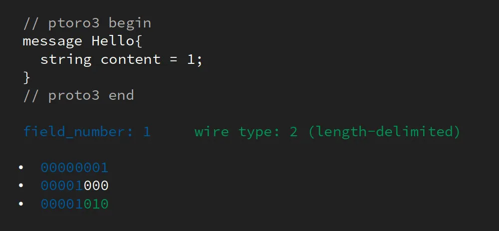
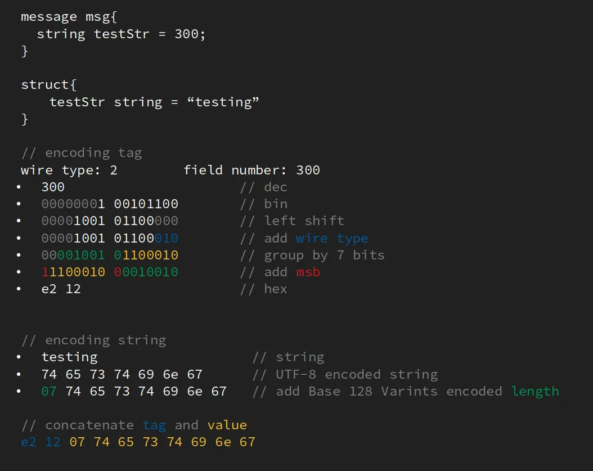
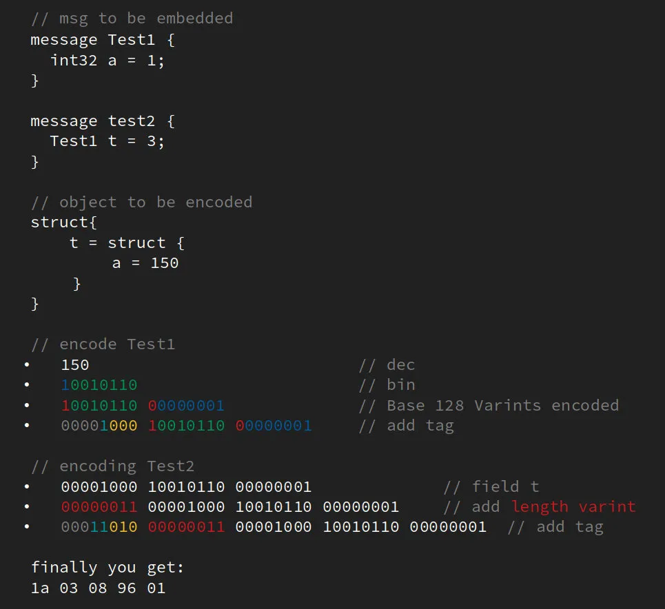

```proto3
syntax = "proto3";

message SearchRequest {
  string query = 1;
  int32 page_number = 2;
  int32 result_per_page = 3;
}

# 假设有一条消息foo，以下关系可能不成立
foo.SerializeAsString() == foo.SerializeAsString()
Hash(foo.SerializeAsString()) == Hash(foo.SerializeAsString())
CRC(foo.SerializeAsString()) == CRC(foo.SerializeAsString())
FingerPrint(foo.SerializeAsString()) == FingerPrint(foo.SerializeAsString())
```

```go
// google.golang.org/protobuf@v1.25.0/encoding/protowire/wire.go

// EncodeTag encodes the field Number and wire Type into its unified form.
func EncodeTag(num Number, typ Type) uint64 {
    return uint64(num)<<3 | uint64(typ&7)
}
```


### JSON 编解码

* Proto3 支持JSON中的规范编码，使得在系统之间共享数据变得更加容易
* 如果JSON编码数据中缺少某个值，或者其值为null，则在解析为protocol buffer时，将被解释为相应的默认值
* 如果字段在protocol buffer中具有默认值，则默认情况下将在JSON编码的数据中省略该字段以节省空间。
* 编写编解码实现可以覆盖这个默认行为在JSON编码的输出中保留具有默认值的字段的选项

```sh
proto3 JSON JSON example Notes
message object {"fooBar":v,"g":null,…} 生成JSON对象。消息字段名称会被转换为小驼峰并成为JSON对象键。如果指定了 json_name字段选项，则将指定的值用作键。解析器接受小驼峰名称（或由 json_name选项指定的名称）和原始proto字段名称。 null是所有字段类型的可接受值，并被视为相应字段类型的默认值。
enum string "FOO_BAR" 使用proto中指定的枚举值的名称。解析器接受枚举名称和整数值。
map object {"k":v,…} 所有键都将被转换为字符串
repeated V array [v,…] null会被转换为空列表[]
bool true, false true,false
string string "Hello World!"
bytes base64 string "YWJjMTIzIT8kKiYoKSctPUB+" JSON值将是使用带填充的标准base64编码编码为字符串的数据。接受带有/不带填充的标准或URL安全base64编码。
int32, fixed32, uint32 number 1,-10,0 JSON value will be a decimal number. Either numbers or strings are accepted.
int64, fixed64, uint64 string "1","-10" JSON value will be a decimal string. Either numbers or strings are accepted.
float, double number 1.1,-10.0,0,"NaN","Infinity" JSON value will be a number or one of the special string values "NaN", "Infinity", and "-Infinity". Either numbers or strings are accepted. Exponent notation is also accepted.
Any object {"@type":"url","f":v,…} If the Any contains a value that has a special JSON mapping, it will be converted as follows: {"@type":xxx,"value":yyy}. Otherwise, the value will be converted into a JSON object, and the "@type" field will be inserted to indicate the actual data type.
Timestamp string "1972-01-01T10:00:20.021Z" Uses RFC 3339, where generated output will always be Z-normalized and uses 0, 3, 6 or 9 fractional digits. Offsets other than "Z" are also accepted.
Duration string "1.000340012s","1s" Generated output always contains 0, 3, 6, or 9 fractional digits, depending on required precision, followed by the suffix "s". Accepted are any fractional digits (also none) as long as they fit into nano-seconds precision and the suffix "s" is required.
Struct object {…} Any JSON object. See struct.proto.
Wrapper types various types 2,"2","foo",true,"true",null,0,… Wrappers use the same representation in JSON as the wrapped primitive type, except that null is allowed and preserved during data conversion and transfer.
FieldMask string "f.fooBar,h" See field_mask.proto.
ListValue array [foo,bar,…]
Value value
Any JSON value
NullValue null
JSON null
Empty object {} An empty JSON object
```

### 生成代码

* 使用 .proto文件中定义的消息类型，需要在 .proto上运行protocol buffer编译器 protoc
* 如果尚未安装编译器，请下载该软件包并按照README文件中的说明进行操作
* 对于Go，需要为编译器安装一个特殊的代码生成器插件：可以在GitHub上的golang/protobuf项目中找到这个插件和安装说明
  - 如果一个 .proto文件中有包声明，生成的源代码将会使用它来作为Go的包
  - 如果 .proto的包名中有 . 在Go包名中会将 .转换为 _
  - 在 .proto文件中可以使用option go_package指令来覆盖上面默认生成Go包名的规则
  - 如果一个 .proto文件中不包含package声明，生成的源代码将会使用 .proto文件的文件名(去掉扩展名)作为Go包名， .会被首先转换为 `_`。举例: `high.score.proto`不包含pack声明的文件将会生成文件 high.score.pb.go，Go包名是 high_score
* 内嵌消息编译器会生成多个结构体
* 编译器会为每个在message中定义的字段生成一个Go结构体的字段，字段的确切性质取决于它的类型以及它是 singular， repeated， map还是 oneof字段
  - 生成的Go结构体的字段将始终使用驼峰命名，即使在 .proto文件中消息字段用的是小写加下划线（应该这样）。大小写转换的原理如下：
    + 首字母会大些，如果message中字段的第一个字符是 _，将被替换为X。
    + 如果内部下划线后跟小写字母，则删除下划线，并将后面跟随的字母大写
  - 单一标量字段:生成字段和获取该字段的get方法
  - 单一message字段：字段可以设置为nil，这意味着该字段未设置，有效清除该字段。这不等同于将值设置为消息结构体的“空”实例
  - 可重复字段：在Go中的结构中生成一个T类型的slice，其中T是字段的元素类型。对于带有重复字段的此消息
  - 映射字段：在Go的结构体中生成一个 map[TKey]TValue类型的字段，其中 TKey是字段的键类型 TValue是字段的值类型
* 默认情况下，Go代码生成器不会为服务生成输出。如果您启用gRPC插件（请参阅gRPC Go快速入门指南），则会生成代码以支持gRPC

```sh
protoc --proto_path=IMPORT_PATH --cpp_out=DST_DIR --java_out=DST_DIR --python_out=DST_DIR --go_out=DST_DIR --ruby_out=DST_DIR --objc_out=DST_DIR --csharp_out=DST_DIR path/to/file.proto

## Go代码指南
go get github.com/golang/protobuf/protoc-gen-go
go get -u github.com/micro/protoc-gen-micro
go get github.com/micro/micro/v2/cmd/protoc-gen-micro@master # 替代
go get -u github.com/golang/protobuf/protoc-gen-go
go get github.com/micro/micro/v2

option go_package = "./proto";
option go_package = ".;hello";

protoc --proto_path=src --go_out=build/gen src/foo.proto src/bar/baz.proto

package example.high_score;
option go_package = "hs";

protoc --go_out=$GOPATH/src/github.com/protocolbuffers/protobuf/examples/tutorial ./addressbook.proto
```

### 问题

```sh
# spawnSync clang-format ENOENT
sudo apt install clang-format
```

### PHP

* `protoc`: the protobuf compiler binary to generate PHP classes for your messages and service definition.
* `grpc_php_plugin`: a plugin for `protoc` to generate the service stub classes.
*  `protobuf.so`: the `protobuf` extension runtime library.

```sh
## in `cmake/build/third_party/protobuf/protoc` and `cmake/build/grpc_php_plugin`
mkdir -p cmake/build
pushd cmake/build
cmake ../..
make protoc grpc_php_plugin
popd

### `protoc` compiler
cd grpc/third_party/protobuf
./autogen.sh && ./configure && make
sudo make install

## grpc_php_plugin
mkdir -p cmake/build
cd cmake/build
cmake ../..
make protoc grpc_php_plugin

### or
bazel build @com_google_protobuf//:protoc
bazel build src/compiler:grpc_php_plugin

protoc -I=. echo.proto --php_out=. --grpc_out=. \
--plugin=protoc-gen-grpc=<path to grpc_php_plugin>


cd examples/php/route_guide
./route_guide_proto_gen.sh

## unit test
cd grpc/src/php
./bin/run_tests.sh

## test client
./bin/run_gen_code_test.sh
```

## 认证

* 基于SSL/TLS认证方式
* 远程调用认证方式
* 两种方式可以混合使用

## example

*  .proto 文件中定义接口:
	*  确保客户端发送或服务器端接收到的数据遵循规范的，非常有助于调试
* 使用 protoc 编译器编译文件，生成客户端和服务器端代码
* 编写调用这个 API 或提供 API 服务的代码

```python
pip install grpcio
pip install grpcio-tools

## receiver.proto 定义一个数据接收服务Receiver，用来接收客户端传递给服务器端的数据
syntax = "proto3";
import "google/protobuf/struct.proto";

// 服务定义
service Receiver {
  rpc receive (Event) returns (Reply) {}
}

// 接收消息定义
message Event {
  string appid = 1;
  int32 xwhen = 2;
  string xwho = 3;
  string xwhat = 4;
  google.protobuf.Struct xcontext = 5;
}

// 返回消息定义
message Reply {
  int32 status = 1;
  string message = 2;
}

python -m grpc_tools.protoc -I. --python_out=. --grpc_python_out=. ./receiver.proto

# server.py
# _*_ coding: utf-8 _*_

import grpc
import receiver_pb2
import receiver_pb2_grpc

import time
from concurrent import futures

_ONE_DAY_IN_SECONDS = 60 * 60 * 24


class Receiver(receiver_pb2_grpc.ReceiverServicer):

    # 重写父类方法，返回消息
    def receive(self, request, context):
        print('request:', request)
        return receiver_pb2.Reply(message='Hello, %s!' % request.xwho)


if __name__ == '__main__':
    server = grpc.server(futures.ThreadPoolExecutor(max_workers=10))
    receiver_pb2_grpc.add_ReceiverServicer_to_server(Receiver(), server)
    server.add_insecure_port('[::]:50051')
    server.start()
    print('server start...')
    try:
        while True:
            time.sleep(_ONE_DAY_IN_SECONDS)
    except KeyboardInterrupt:
        server.stop(0)

# client.py
# _*_ coding: utf-8 _*_

import grpc
import receiver_pb2
import receiver_pb2_grpc
from google.protobuf import struct_pb2


def run():
    channel = grpc.insecure_channel('localhost:50051')
    stub = receiver_pb2_grpc.ReceiverStub(channel)

    # 自定义struct结构
    struct = struct_pb2.Struct()
    struct['idfa'] = 'idfa1'
    struct['amount'] = 123

    response = stub.receive(receiver_pb2.Event(xwhat='install', appid='fuckgod', xwhen=123, xwho='jerry', xcontext=struct))
    print("client status: %s received: %s" % (response.status, response.message))


if __name__ == '__main__':
    run()
```

```go
go get -u -v google.golang.org/grpc
go get -u github.com/golang/protobuf/proto // golang protobuf 库
go get -u github.com/golang/protobuf/protoc-gen-go //protoc --go_out 工具
protoc -I. --go_out=plugins=grpc:. helloworld.proto

// server.go
package main

import (
    "log"
    "net"

    "golang.org/x/net/context"
    "google.golang.org/grpc"
    pb "google.golang.org/grpc/examples/helloworld/helloworld"
    "google.golang.org/grpc/reflection"
)

const (
    port = ":50051"
)

// server is used to implement helloworld.GreeterServer.
type server struct{}

// SayHello implements helloworld.GreeterServer
func (s *server) SayHello(ctx context.Context, in *pb.HelloRequest) (*pb.HelloReply, error) {
    return &pb.HelloReply{Message: "Hello " + in.Name}, nil
}

func main() {
    lis, err := net.Listen("tcp", port)
    if err != nil {
        log.Fatalf("failed to listen: %v", err)
    }
    s := grpc.NewServer()
    pb.RegisterGreeterServer(s, &server{})
    // Register reflection service on gRPC server.
    reflection.Register(s)
    if err := s.Serve(lis); err != nil {
        log.Fatalf("failed to serve: %v", err)
    }
}

// client.go
package main

import (
    "log"
    "os"
    "time"

    "golang.org/x/net/context"
    "google.golang.org/grpc"
    pb "google.golang.org/grpc/examples/helloworld/helloworld"
)

const (
    address     = "localhost:50051"
    defaultName = "world"
)

func main() {
    // Set up a connection to the server.
    conn, err := grpc.Dial(address, grpc.WithInsecure())
    if err != nil {
        log.Fatalf("did not connect: %v", err)
    }
    defer conn.Close()
    c := pb.NewGreeterClient(conn)

    // Contact the server and print out its response.
    name := defaultName
    if len(os.Args) > 1 {
        name = os.Args[1]
    }
    ctx, cancel := context.WithTimeout(context.Background(), time.Second)
    defer cancel()
    r, err := c.SayHello(ctx, &pb.HelloRequest{Name: name})
    if err != nil {
        log.Fatalf("could not greet: %v", err)
    }
    log.Printf("Greeting: %s", r.Message)
}
```

## 服务

```sh
# 查看所有服务
grpc_cli ls localhost:50051
# 查看 Greeter 服务的详细信息
grpc_cli ls localhost:50051 helloworld.Greeter -l
# 查看 Greeter.SayHello 方法的详细信息
grpc_cli ls localhost:50051 helloworld.Greeter.SayHello -l
# 远程调用
grpc_cli call localhost:50051 SayHello "name: 'gRPC CLI'"

# 问题
Received an error when querying services endpoint.
Reflection request not implemented; is the ServerReflection service enabled?
```

## grpc-gateway

* 提供很好地扩展 protobuf/gRPC，用代码生成代码的方向和蓝图。这也是 protobuf 这样的语言的魅力所在：足够简单，可以很容易被解析，从而生成不同角度的工具

### gRPC vs REST

- 使用二进制进行数据序列化，比 json 更节约流量、序列化与反序列化也更快。
- protobuf3 要求 api 被完全清晰的定义好，而 REST api 只能靠程序员自觉定义。
- gRPC 官方就支持从 api 定义生成代码，而 REST api 需要借助 openapi-codegen 等第三方工具。
- 支持 4 种通信模式：一对一(unary)、客户端流、服务端流、双端流。更灵活

## 项目

* [grpc-spring-boot-starter](https://github.com/yidongnan/grpc-spring-boot-starter)Spring Boot starter module for gRPC framework.

## 图书

* gRPC: Up and Running

## 工具

* [Linkerd](https://kubernetes.io/blog/2018/11/07/grpc-load-balancing-on-kubernetes-without-tears/)
* [bloomrpc](https://github.com/uw-labs/bloomrpc):GUI Client for GRPC Services
* [grpc-web](https://github.com/grpc/grpc-web):gRPC for Web Clients <https://grpc.io>
* [grpc-web](https://github.com/improbable-eng/grpc-web):gRPC Web implementation for Golang and TypeScript
* [ggrpc-java](https://github.com/grpc/grpc-java):The Java gRPC implementation. HTTP/2 based RPC <https://grpc.io>

## 参考

* [gRpc docs](https://grpc.io/docs/guides/)
* [examples](google.golang.org/grpc/examples )
