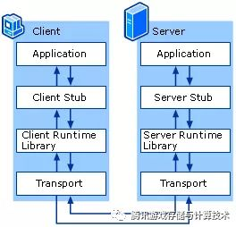

# RPC Remote Procedure Call 远程调用框架

* 现有 RPC 框架基于 Andrew D. Birrell 和 Bruce Jay Nelson 论文：[Implementing Remote Procedure Calls](http://www.cs.cmu.edu/~dga/15-712/F07/papers/birrell842.pdf)， [中文](https://www.jianshu.com/p/91be39f72c74)实现,论文定义了 RPC 调用标准
* 远程调用：被调用方法的具体实现不在程序运行本地，而是在别的某个远程地方
* 一个应用调用另一个应用中方法的一种实现方式:服务端实现了一个函数，客户端使用 RPC 框架提供的接口，调用这个函数的实现，并获取返回值
* 一种通过网络从远程计算机程序上请求服务，而不需要了解底层网络协议的协议.屏蔽了底层的网络通信细节，使得开发人员无须关注网络编程的细节，而将更多的时间和精力放在业务逻辑本身的实现上，从而提高开发效率
* 在OSI网络通信模型中，跨越了传输层和应用层
* 使得开发包括网络分布式多程序在内的应用程序更加容易

## 流程

* 客户端应用（服务消费方）发起一个远程调用:通过本地调用客户端 Stub，将调用接口、方法和参数，通过约定的协议规范进行编码（也叫 Marshalling）成一个消息，并通过本地 RPCRuntime（RPC 通信包） 进行传输，将调用网络包发送到服务器
* 服务器端 RPCRuntime 收到请求后，交给服务提供方 Stub 将消息解包（Unmarshalling）得到参数，然后调用服务端对应的方法，方法执行后返回结果，服务提供方 Stub 将返回的结果编码后，再发送给客户端
* 客户端RPCRuntime 收到发给调用方 Stub 解码得到的结果

## 网络层

## 应用层格式

## 原理

* 编写数据描述文件
* 转换为特定语言数据结构
* 翻译为二进制/字节/字节数组
* socket 网络编程
* 翻译为另一种语言数据结构
* 调用本地方法

## RPC vs Socket

* RPC（远程过程调用）采用客户机/服务器模式实现两个进程之间相互通信
* socket是RPC经常采用的通信手段之一，RPC是在Socket的基础上实现的，它比socket需要更多的网络和系统资源
* 除了Socket，RPC还有其他的通信方法，比如：http、操作系统自带的管道等技术来实现对于远程程序的调用。微软的Windows系统中，RPC就是采用命名管道进行通信

## HTTP vs RPC

* 传输协议：
  - HTTP 基于 HTTP 协议
  - RPC 即可以 HTTP 协议，也可以 TCP 协议
  - HTTP 也是 RPC 实现的一种方式
* 性能消耗：
  - HTTP 大部分基于 JSON 实现，序列化需要时间和性能
  - RPC 可以基于二进制进行传输，消耗性能少一点
  - 推荐一个像 JSON ，但比 JSON 传输更快占用更少的新型序列化类库 [MessagePack](https://msgpack.org/)
  - 服务治理、负载均衡配置的区别
* 使用场景：
  - 浏览器接口、APP接口、第三方接口，推荐使用 HTTP
  - 集团内部服务调用，推荐使用 RPC
  - RPC 比 HTTP 性能消耗低，传输效率高，服务治理也方便

## RPC vs REST

* REST API 和 RPC 都是在 Server端 把一个个函数封装成接口暴露出去，以供 Client端 调用
* RPC 相比 REST 的优点：
  - RPC+Protobuf 采用的是 TCP 做传输协议，REST 直接使用 HTTP 做应用层协议，这种区别导致 REST 在调用性能上会比 RPC+Protobuf 低
  - RPC 不像 REST 那样，每一个操作都要抽象成对资源的增删改查，在实际开发中，有很多操作很难抽象成资源，比如登录操作。所以在实际开发中并不能严格按照 REST 规范来写 API，RPC 就不存在这个问题
  - 相比 gRPC，OpenAPI 的定义更难懂，也更啰嗦，结构也更复杂
  - 流式传输:在有第一批结果时就开始传输。而 REST 只返回一个单独的 JSON 数组，在服务器端收集到所有结果之前是不会向客户端发送任何数据的
    + REST:要求客户端轮询搜索结果，先是发送一个 POST 请求发起搜索，然后再不断发送 GET 请求获取搜索结果。响应消息中包含了一个用于表示搜索是否已完成的字段
    + 需要在.proto 文件中加入 stream 关键字。下面是我们的 Search 函数定义：`rpc Search (SearchRequest) returns (stream Trip) {}`
  - RPC 屏蔽网络细节、易用，和本地调用类似
    + 这里的易用指的是调用方式上的易用性。在做 RPC 开发时，开发过程很烦琐，需要先写一个 DSL 描述文件，然后用代码生成器生成各种语言代码，当描述文件有更改时，必须重新定义和编译，维护性差。
* REST 相较 RPC 也有很多优势：
  - 通过http协议中的POST/GET/PUT/DELETE等方法和一个可读性强的URL来提供一个http请求
  - 轻量级，简单易用，维护性和扩展性都比较好
  - REST 相对更规范，更标准，更通用，无论哪种语言都支持 HTTP 协议，可以对接外部很多系统，只要满足 HTTP 调用即可，更适合对外，RPC 会有语言限制，不同语言的 RPC 调用起来很麻烦
  - JSON 格式可读性更强，开发调试都很方便
  - 在开发过程中，如果严格按照 REST 规范来写 API，API 看起来更清晰，更容易被大家理解
  - 在实际开发中，严格按照 REST 规范来写很难，只能尽可能 RESTful 化。
* 业界普遍采用的做法:内部系统之间调用用 RPC，对外用 REST
  - 内部系统之间可能调用很频繁，需要 RPC 的高性能支撑
  - 对外用 REST 更易理解，更通用些
  - 当然以现有的服务器性能，如果两个系统间调用不是特别频繁，对性能要求不是非常高，REST 的性能完全可以满足

## [brpc](https://github.com/brpc/brpc)

Brpc 是百度开源的一个基于 protobuf 接口的 RPC 框架，它囊括了百度内部所有 RPC 协议，并支持多种第三方协议，到现在为止，brpc 在 GitHub 上已经拥有 6000 多个关注、17 个代码贡献者。

### [braft](link)

* braft 是基于 brpc 的 Raft 协议工业级 C++ 实现，设计之初就考虑高性能和低延迟。由百度云分布式存储团队打造，在百度内部大概有十几个应用场景，部署了 3000 多个服务器，有做 Master 模块 HA 的，也有用作存储节点复制修复的。其中百度云的块存储、NewSQL 存储以及即将推出的 NAS 存储、强一致性 MySQL 都是原生基于 braft 构建的。
* 对于 braft 和 brpc 之间的关系，braft 是解决复制状态机的问题，而 brpc 是解决模块间 RPC 通信的问题。braft 中 Raft 协议的互通直接使用 brpc 实现，runtime 使用了 bthread，因此 braft 编译需要依赖 brpc，从这点来看 braft 和 brpc 有一定的绑定关系。

## 框架

* [dubbo](../Back_end/Java/Dubbo.md)
* [weibocom/motan](https://github.com/weibocom/motan)A remote procedure call(RPC) framework for rapid development of high performance distributed services.
* phprpc
* yar
* hprose
* [thrift](./Thrift.md)
* [go-zero](https://github.com/tal-tech/go-zero):go-zero是一个集成了各种工程实践的web和rpc框架。通过弹性设计保障了大并发服务端的稳定性，经受了充分的实战检验。包含极简的API定义和生成工具，可以一键生成Go, iOS, Android, Dart, TypeScript, JavaScript代码，并可直接运行。<https://www.xiaoheiban.cn/>

## 工具

* [prototool](https://github.com/uber/prototool):Your Swiss Army Knife for Protocol Buffers
* [Tars](https://github.com/Tencent/Tars):Tars is a highly performance rpc framework based on naming service using tars protocol and provides a semi-automatic operation platform.
* [rpcx](https://github.com/smallnest/rpcx):A zero cost, faster multi-language bidirectional microservices framework in Go, like alibaba Dubbo, but with more features, Scale easily. Try it. Test it. If you feel it's better, use it! 𝐉𝐚𝐯𝐚有𝐝𝐮𝐛𝐛𝐨, 𝐆𝐨𝐥𝐚𝐧𝐠有𝐫𝐩𝐜𝐱! <https://rpcx.io>
