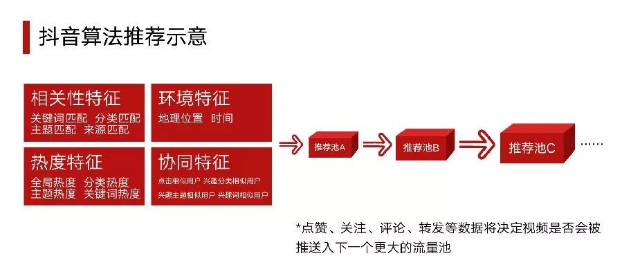

# Reality

* 这个时代让人心碎之处在于，它让个体为实现自我奋斗，但奋斗却不必然实现自我。而于此同时，互联网和消费主义史无前例地把不同阶级的生活一起展示了出来，相对剥夺感史无前例地被我们如此直接和剧烈地体验着。在这样的时代中，我们的灵魂始终处于一个躁动不安的状态。 引用托克维尔的话，“这是一个激烈的社会而不是一个深刻的社会。这是一个广泛的社会而不是一个多样的社会，人们追逐实际却又不脚踏实地。在这样的社会中，心灵应该如何安置？理想应该如何寄托？” 自由和多元，都不等于一种表面的多样形式。一个社会真正的自由，来自于每个人从自己身上培养起一种宽容他人的习惯。我们既宽容他人，也宽容自己；既宽容“选择”，也宽容“不选择”。我们宽容那些“少数者”，也宽容那些无法对少数者有所理解的“主流”。真正的自由，需要每个人付出长期的学习。这并不是为了他人，因为最终这种“自由”的得利会指向每个人自身
* 受雇者和雇佣者之间的对等交换正在获得越来越强的道德价值。
* 无论是人生，还是国足，所有的攻略书上，都会告诉你“慢一点，脚踏实地”。但实际的的环境却都在催促：“快一点，你要离成功快一点，否则你就是个废物”。
* 满屏’年轻漂亮’的皮囊始终拿不上精神品质和人文关怀的台面，自娱自乐吧！
* 互联网一方面将人变得彼此类似，一方面将人变得愈加偏执。人们只看自己愿意（能）看的，只听自己愿意（能）听的，由此形成了各个“平行宇宙”。“宇宙”间不相往来，“宇宙”内相互趋同。
* 时代变了，人何曾变过
* 话不说透，自己体会去
* 给领导人 加重，增加的幻觉
* 大公司正在用 API 替代掉中层干部。未来只有两种工作：API 之上的工作和 API 之下的工作。
* 时代缺什么，就会有什么样的偶像填充空白。
* 那些数量庞大的年轻粉丝，是帝国真正的主人，他们所经受的潜移默化，正生成着他们的价值观。无论是否习惯，偶像文化已成为年轻人中的主流文化。庞大的流量导向何处，决定着未来世界的模样。
* “我的整个生命，只是一场为了提升社会地位的低俗斗争。” ——〔意〕埃莱娜·费兰特
* 你一定要有一项技能，是人们普遍要用到，且能让周边的人第一时间就能想到你。你个人的价值，很多时候体现在被“用”，“有用”上。于人有用，于己有趣，这里面的技能，总要培养几个，甚至需要适度的优秀。
* 权健
  - 不出问题 不处理，舆论 不到一定阶段 不严惩
  - 放纵到以为这事搞得定
* 行政的人 会聚集资源，领导也相信
* 女人现实起来比男人更现实、踏实、灵活，利用现实的资源
* 我们看到的世界，只是媒体想要我们看到的罢了，但是事实依然存在，依然值得我们每个人去追寻。
* 商量不出来什么的，他们不会同意的。我在这里真是待够了，再这么下去，我就要废掉了。”小枫无奈地搓搓手，再一次跟我憧憬了那座南方城市。“小王你知道吗？在那边读了4年大学以后，我是真的不想回来。这里死气沉沉的，就只有国企和公务员，年轻人真的不应该在这里浪费青春。
* 对待好人有对待好人的方法，对待畜生有对待畜生的路子，你心太软，人家说什么你就信什么，即便学会了‘套路’，也下不了那个狠心
* 世上有很多事，一旦了解得太多就没意思了。——东野圭吾
* 操心的是没有实现财务自由却有可能被裁或者已经被裁的人，要有能力和思想准备应对这种情况
* 性别观讲的是一种平衡。 ——于困困
* 粗暴和赤裸——人性的畸变比赌场的“高频彩”更快得猝不及防，所有赌徒的故事，都是一个不断坑害与被坑害的故事。
* 木秀于林，风必摧之，你应当学会与光同尘
* 中国式的成功，不太可能依靠完全的职业化。同样，中国式的成功一般需要明显的领导人风格。这就是说，第一老板几乎都需要事必躬亲；第二老板必须建立自己的团队文化。好听了叫企业文化，说不好听了就是企业在外部和内部的形象，这些形象是通过一件件事情展现出来的。
* 现实 压抑了年轻人梦想。压垮地地的最后一根稻草，来自一位新朋友：“这就是你生活的意义吗？你不觉得这样是个废人吗？”
* 个稳定体面的工作只适合官二代和富二代，普通人活不起。穷人家的孩子想干好公务员，不容易。机关工作就是这样，一辈子最要紧的就是守住自己的这个坑.我依然成不了老陈家的骄傲。但是我一定会成为自己的骄傲，一个赤脚奔跑的穷人家孩子的骄傲。
* 浮躁的原因是什么？没有时间，没有耐心，没有成本试错，没有意义。
* 生活造成偏激、麻木
* 美国先贤杰斐逊曾有一句名言：假如要在政府与报纸之间选择一个的话，我宁可选择一个没有政府的国家，而不要一个没有报纸的国家。如果没有报纸，人民之间就没有信息沟通，什么事都不知道，那是一个心智封闭的社会，不可能有自由有民主
* 所以，请不要把你们的努力，仅仅用在让自己站在金字塔顶之上。请让你们得天独厚的环境与能力，不要用在压迫那些没有得到这些东西的人身上，而是用来帮助这样的人们。然后请你们不要逞强，承认自己的弱点，与他人互相帮助地活下去。
* 所谓“女权主义”的女性运动，但女权主义绝非要让女性像男性一样、或是让弱者变成强者之类的思想。女权主义追求的正是让弱者本身受到尊重。
* 不要害怕。他们就是想要我们害怕，切勿中了圈套。不要作恶，坚守自己的良知。不要说“领导或法律要我作恶的啊”，奥斯维辛的凶手当年也是这样说的。即便我们没有勇气做英雄，我们还是可以做好人，做自由人。国家的恶源自我们每个人的恶；只要我们自己不作恶，就断了这个怪兽的一点养料。大家都这样，就没有恐怖，没有罪恶，就会得到自由的灵魂。
* 你是如何从活泼能干的19岁年轻人，变成了只想一件事的40岁中年人？我爸爸曾经是非常聪明的人，但他现在除了谈论钱和肝脏外再无其他
* 有些事,只能让让发生，预防不了
* 中年危机就是还有期望，但没有希望；保有责任，但没有成就感；努力获取成就，但没有成就感。所有的满足感似乎都不能长久，所有的挫败感似乎都是刚刚开始。
* 不管昨夜你是多么泣不成声,早晨醒来城市依旧车水马龙.
* 我们鄙视那些人情交往，但从来不问自己，为什么别人会帮你。我们经常说，有钱难买我愿意，那好，面对需要人情世故的时候，别人如何“愿意”？
* 大概成长就是，终于接受有些人会被时间洪流冲走，而我们居然也能坦然面对了
* 社会的优劣，不是看给富人多少的机会，而是如何善意的对待穷人。贫富的差距永远存在，只是看社会机制能否提供流动的通道和相对普遍的富裕。
* 在这个时代，每个人生活的一点一滴都被别人看在眼里，而且是被放大倍数观看的:别人也无时无刻不在打量你的穿着、你开的车、你住的小区级别、你孩子读的幼儿园，估算你的银行存款
* 三十多岁的男人，没有任何借口可以再去依靠他人。前一天失眠，早上还是要打扮光鲜地出门，尽可能让自己看起来更“精英”一些。只不过，表面装得越精英，心里越焦虑。
* 80后都还不是能够完全甩掉束缚的一代，身上还背负着很多传统的东西，毕竟我们是从一个没有网络的时代走过来的，小时候接触的信息和观念都比较单一，有同学的爸爸妈妈离婚都是件稀奇的事。在我心里，还是认为人最终是要结婚、回归一种稳定的状态的，如果我选择结婚生子，我就要为那种状态负责。但我现在还没有准备好心甘情愿地放弃。
* 对于中年人来说，“成功”的定义很具体，而且越来越具体，与之相应的标准无非是名和利，随时都有各种“每个年龄阶段的人应该达到的生活状态”来提醒你：“拖后腿了吗？”
* 悲哀的是，你知道这条路是不可逆的，所以一定要给自己找一些原因去把现在的状态合理化，比如告诉自己变老也有变老的好处，至少经济上比年轻时要宽裕，也离开了管束，拥有更多行动的自由。但是我内心里一直觉得这都是自欺欺人的，无论是事业、爱情、身体，生活里不自由的部分明明是越来越多啊。
* 应对焦虑的办法，我认为最关键的还是控制自己的欲望，不要去强求属于自己的东西。你必须要正视自己的能力，承认自己是有局限的，承认很多梦想不会实现，不要有太多的妄念。在追求的时候可以尽力去追求，但是不要认为你所获得的东西都能够永远持有，你可能配不上那些，迟早还是要还回去，问题迟早还是要爆发。越晚爆发、越晚面对，对你来说越致命。
* 在生命的旅途中，我们一直和时间赛跑。疾病和死亡，用最决绝的方式，把我们拉偏赛道。在被病魔缠身之前，我们还算得上是时间的主人，可以自主选择这旅途是闲庭散步，还是奋力冲刺，是休养生息，还是蓄势待发；然而生病之后，这选择权被一步步剥夺：先是才干被输液管无情禁锢，接着进取心被痛苦慢慢摧残，随后影响力如潮水般退去，退去之后，也不知能不能遗下丁零知交；最后，就剩乐观还就着卑微的希望不屈地挺立着，和亲情一道，寻觅翻盘的机会。
* 剥夺一个人对时间的选择权还不是最糟的。当灭霸的响指弹起，死神的镰刀挥下，一个人未来的时间一下子被清零，再无翻盘的可能。这才是最要命的。离去的永远离去，活着的被悲痛萦绕。
* 生命是多么深邃的话题，它包含着人世间一切最极致的体验。生命，可以是能够被毁灭但不能够被打败那般顽强，也可以是“亦余心之所善兮，虽九死其犹未悔”那般博大。生命如果有颜色，会不会看上去，就像梵高的《向日葵》和《星空》；生命如果有态度，是不是听上去，就是贝多芬的《田园》和《英雄》。生命的意义是如此厚重，无论我们怎样全力以赴都不为过，因为我们生而为人，生而为众生。
* 在大年里，人们总是习惯调高对未来的预期，浑然忽略了现实的警讯，觉得日子可以一直这么高歌猛进下去；在小年里，人们又对未来充满了远超实际需要的悲观，觉得从此之后只是日复一日地更加糟糕。
* 你在社交网络上看到的别人的各种嗮幸福、各种嘚瑟都只是他们生活中极小的一小部分；他们生活中大部分时候跟你大部分时候都差不多平淡。不要做无谓的比较，你知道你的全部、但却看不到别人的全部。 同样道理，如果你在创业，如果看到你的竞争对手的各种媒体报道、在社交网络上各种嘚瑟，也不要慌；都是报喜不报忧的。掌握好自己的节奏。
* 年龄的增长是不以人的意志为转移的，正如一切价值以钱来衡量一定会为钱所困一样，只有跳出这个逻辑才能脱困，保持主动破局的心，做合适自己的事，过适合自己的日子才正道。
* 如今世界越来越小，文化习俗碰撞、地域歧视或偏见越来越多…… 所以，凡事别轻易往品性道德和教养上面扯，才是真正有用的教养。 一个尤其来自外乡的人，ta的文化认同、观念秉持、个人习惯你并不了解，如果像和菜头先生文末莫名引述的那个佤族人，妄加揣测说“你不喝牛血是不是瞧不起我？”，那换做是我的话，就只能揣测这人很自卑或是有被迫害妄想症了。
* 依我在社会上经历的人情是非来看，教养、品德的问题其实相对鲜见，思维和认知的固化才是最要命的。 所以我一直觉得【脆弱的内心守不住善良，逼仄的观念下难有好德性】
* 社会，正在努力摒弃过去的“人情社会”弊病，但新的发展却将人与人的联系更“能力化”和“利益交换化”，这对每一个人都是新的挑战，你要有用才能变得更有价值。
* 贫穷是一种习惯，富裕也是一种习惯。贫穷不会让你的智商降低，但日常琐碎的生存压力会，这或许是贫穷最可怕的压力。
* 我们认同自己是贫穷的，但不认同我们是普通的；我们认同我们应该富有，但不认同我们不够努力；我们不安于自己的生活状态和水平，被欲望和比较摧残的无比焦虑，这样的贫穷是真的难捱。
* 在未来的很多年中， 我希望你被不公正地对待过， 唯有如此 你才真正懂得公正的价值。” From time to time in the years to come, I hope you will be treated unfairly, so that you will come to know the value of justice.
* 年轻时，我觉得亲戚们都是前车之鉴，我要避免重蹈他们的生活、性格、工作与处世态度。 直到现在这年纪，我觉得我跟他们越来越像了，于是感慨人生早就在家族基因注定。如果没有碰上基因突变，一个人的一生就是父母两边家族平均基因的 ±20% 吧，至少我觉得我是。
* 未来的三十年，自动化和人工智能将占据美国一半的就业岗位。那些没有技能的劳工，很难在市场上找到自己的位置。
* 光脚不怕穿鞋的 适应很多情况
  - 能力的挑战士族
  - 阶级跃迁
* 你为什么离婚？」其中的一条回答是：「我不想变成那种人，在50多岁时离了婚，落着泪承认从没爱过自己的伴侣，过往的生活一片空虚」
* 正如《迷雾》中所言：“我们人类生来就疯狂，同一个房间有两个人以上，我们就会选边站；想尽办法自相残杀，不然怎么会有政治和宗教？”
* 不过，自从“钢铁侠”当上了编辑室的主任，一切就都变了。 曾经的热血青年变成了好好先生，腰弓了，讲话也和气了；皮鞋变成了布鞋，走路一步三回头，好像生怕漏了什么似的；所谓的原则也如同他的发际线，一退再退。 主任憔悴了，但我们这个原本会被裁撤分流的编辑室却越做越大，还成了出版社里的“三强”之一。不过，代价就是我们做书越来越被动，“讨好作者”成了工作重心之一。 以前，出版社是事业单位，
* 最低限度还可以保持住对真理的忠诚。 如果某些外部形势期待我们撒谎，而我们依然能够保持沉默，这也是一种忠诚于真理的勇气，依然值得赞美。
* 如今邪魅狂狷的刘敏涛，当年是93级中戏专业课第一名；手把手教赵薇的，可是谢晋导演领衔的“第四代”；而70后的宁静、周迅之所以能从60后的巩俐、蒋雯丽手里接班，是因为50后自有刘晓庆和张艾嘉——后浪想要赶超前浪，必须拿出更好的作品，必须死磕专业。
* 在网上收获千万人赞许，被“看到”的普通人是极少数，但构成他人的赞许，和他人的“被观看”，才是绝大多数普通人的宿命。普通人作为互联网神话最基础的燃料，仅仅让个体差距越拉越大。
* 权力与产业一再将“平民主义”描绘为一种最多数人的共赢，真的如此么？
* 平民主义允诺你的“观看的力量”，允诺你“发声的权利”，前提是你必须重复相同的话。
* 在面子上，人们大谈百花齐放、美美与共，时代进步，一代新人换旧人；谈开放包容，打破虚伪，挣脱传统的枷锁，向精英主义宣战。在里子中，复读与转发，夹着尾巴。在恐惧中消费，在恐惧中谋利，在恐惧中摇摆不定，在恐惧中加入征伐。
* 平民主义就是此权力与产业的共谋，这是个被发明的圈养之地，以便成规模的驱策。
* 西西弗式的崇高值得尊敬，屎壳郎式的坚韧同样不可或缺。
* 当代人对成功淆的迷恋,其实也映射到了普及读物上的,那种半小时读完xxx系列.误人子弟的东西那么畅销.其实就是我们不用很累很麻烦就可以成佛/学到知识/获得成功. 之前很鄙视一个迷恋罗辑思维每天细致分析成功淆理论的朋友.后来想想觉得是我自己没道理，在无望的末世谁不想找个可以兜底的寄托呢
* 社会上那些“成功”的人，一些基本要素是心狠、嘴活，再加一点点运气
* 理性的人使自己适应世界，不理性的人不愿意妥协，坚持要求世界适应他的方式。因此，一切进步都取决于不理性的人。 -- 萧伯纳

## 产业

* 不要只看成绩，看产业健康度、合理性 持续性

## 现实

* 为了流量：形式新,内容不敢恭维

## 体制

* 还是东部沿海经济相对发达的乡镇。在我的记忆里，那种精神上的苦闷，至今仍然余味不消。在我东部的家乡，很多公立学校的老师辞职去私立学校工作。他们普遍认为，别把目光局限于现在，几十年之后，等到自己退休的时候，私立学校老师的退休待遇一定会改善
* 然而，对于西部二本院校大多数来自山区农民家庭的学生来说，考入编制，月月能领国家工资，几乎是人生最高理想。脱去农民身份，踏上工作岗位之后，他们最喜欢的，就是在朋友圈和同学群里，晒单位食堂的饭菜。其实，这是在变相地炫耀自己“有单位了，吃上公家饭了，月月有工资了”的体制内身份。西部乡镇县城再是粗糙恶劣的人文环境，也无法抵消他们内心爆棚的优越感。

## 媒体

* 国内的新闻讯息是一个系统，它包括四个要素：新闻的耸动与引导性的标题，剪辑拼凑的正文内容，新闻底下的评论，以及对该新闻的转帖和评论。这四个环节是一条新闻讯息推送的完整的操作，是由一队人统一完成，缺一不可。国内的新闻，不是传递消息，是价值引导和观念诱导
* 在判断一个媒体或者事实核查机构是不是有偏见（biased）的时候，不要看他们framing有没有偏向性（废话，当然有，任何framing都有偏向性），而是要看他们是不是就事论事（fact-based），是不是永远一边倒
* 所谓“主流媒体不报道”这种话，还是先搜索一下再说话吧
* 2008 年伊始，纸媒的黄金时期就开始波动了（也有一说已经过了黄金时期）。媒体人需要考虑新的商业模式，新媒体成为下一步的发展方向。与此同时，一些早年扎根于互联网根基的网媒也开始分割媒体市场，如腾讯网旗下的「大家」、「棱镜」，网易新闻的「回声」、「路标」等
* 2013 年大概是中国新闻工作者和媒体人的一道分水岭。2013 年 1 月份，《南方周末》发生一件引发全球媒体关注的事件，南周编辑部因迫于广东委宣传部新闻处的压力，将其新年特刊中的新年致辞及相关内容进行大幅删改，由原本内容的呼吁性质改为歌颂性质
  - 1 月 3 日，该事件被曝光，引发全球媒体关注。1 月 4 日，外交部发言人华春莹在记者问到此事时说：「不了解具体情况，这也不属于外交事务。我想原则性地指出，在中国大陆不存在所谓的新闻审查制度，中华人民共和国政府依法保护新闻自由，也充分发挥了新闻媒体和公民的舆论监督作用。
  - 1 月 6 日，该事件在微博上二度发酵，上升为知名人士和媒体在微博声援南方周末，而线下也有网民在广州南方报业传媒集团大楼和北京新闻处声援南方周末。翌日，线下声援的网民被公安带走，线上声援人士和媒体也被逐一约谈。此后，该事件也被广泛评价为中国大陆新闻自由极度收紧、严控舆论的开端。
  - 新闻自由度收紧仅仅是当时新闻工作者和媒体人在日后所面临的困境之一，他们同样要面对的还有传统纸媒在互联网行业冲击下的问题。传统的纸媒拥有单向的话语权，无论是广告业务还是信息传播都有较大的控制权。随着移动互联网用户群体的不断提升，纸媒行业也走到了瓶颈期。
* 2013 年这一年开始，中国官方收紧了媒体控制，对一些老牌媒体进行了「清洗」，至此，中国媒体人的身份也开始进入「游离状态」，根据最终去向的不同，大致分为两个阵营
  - 选择离开中国新闻行业或者去境外新闻行业发展
  - 则是选择在中国充当新闻行业之吹哨人身份
  - 还有一小部分虽然继续留在行业内，但对于新闻的红线不碰及
  - 这些老牌纸媒也开始转型网媒，即发展线上媒体。这些发生的事情就是我们后来所知道的媒体故事。
* 动态
  - 庞皎明（笔名上官敫铭）从财新传媒辞职，之后只身前往香港
  - 2013 年下半年，上海报业要求东方早报创建一个结合新媒体与纸媒性质的网站，2014 年下半年，澎湃新闻上线
  - 同年的 2 月份，伊险峰辞去《第一财经周刊》总编辑职位（由副总编辑李洋接替），与同在第一财经周刊的主编杨樱、资深编辑黄俊杰联合创办好奇心日报
    + 名字，来源于生活中最稀缺与最可贵的两个东西，想象力与好奇心
    + 伊险峰在 2015 年接受媒体采访时说，“我相信，这也是好奇心日报一直以来坚持的信条——在人文和科学间找到平衡点的同时，还需对世界抱有一颗不随年龄而衰减的好奇心。”
    + 2017 年第一季，在两岸三地还没有一家能做到像好奇心日报这样的，仅在两年半内做到被评为「中国最赚钱的商业媒体」之称，当时在行业内有调查称一家媒体从创办到盈利平均值是 7 年，显然好奇心日报是成功的
    + 好奇心日报有着明确的目标人群（Target Audience）和提供有价值的内容。目标人群是 90 后群体，内容则是不负责解决信息焦虑感的问题，做到可以在信息爆炸的环境里为读者提供真正的价值。
    + 在内容上，好奇心日报有着一道规范化的流程。和所有媒体行业的工作模式一样，好奇心日报团队的工作模式同样有四个阶段，选题、编辑、校对、推送。与其不同的是好奇心日报在选题的过程强调立场和价值，因其团队不相信存在完全中立的报道，所以便延申出价值这一属性，简单理解，对读者本身无价值而言、对编辑和记者都无法清来龙去脉与价值的选题，都会被 Pass 掉
    + 为防止文章 的 PV（浏览量）影响到记者，所以好奇心日报的记者只需要专心负责内容，后台数据也是屏蔽记者的。所以校对、推送等工作就落在了负责人伊险峰、总编辑杨樱、联合主编黄俊杰和两位副总编及一位所长（好奇心研究所）。
    + 作为负责人的伊险峰，他的有一部分的时间在为好奇心日报的融资找渠道。期间还找到了雷军，但雷军最后没投资好奇心日报，而是投资了伊险峰的前同事何力（界面新闻的创始人），中间有个小故事，雷军告诉伊险峰，这是移动互联网的时代，应当专注移动端。后来的好奇心日报用户报告中，读者的流量 90% 来自移动端
    + 此前，伊险峰把重心放在 PC 网页端，借鉴了不少国外成熟网站和杂志的排版，为此，还从美国邀请了一流的设计人员帮忙。面对市场的商业模式，比起之前只想做好内容，之后的伊险峰妥协了不少
    + 我们处在一个不能过多解释自己处境的时期，不过即使随便讲，或好或坏，我们也没有太多好说的”，好奇心日报在停更声明中写道。
    + 在北京和上海各有办公场所，主体分别是上海佩珀文化传播有限公司和北京酷睿奥思科技发展有限公司。
    + 2018 年 7 月 13 日，这一天是刘晓波逝世的一周年。当天上午，上海市网信办向上海佩珀文化传播有限公司发出整改通知书，要求立即停止违法违规行为。同时将依法对上海佩珀文化传播有限公司给予行政处罚。上海佩珀文化传播有限公司在好奇心日报平台就此事对读者发布公告，内容称：
      * 我们确实接到了上海互联网信息办公室的约谈，他们对好奇心日报的时政新闻报道提出了批评。
      * 好奇心日报的商业、城市、文化和生活方式资讯并没有受到影响。
      * 我们会一如既往地给读者提供高质量的信息服务。
      * 好奇心日报的所有合作、渠道分发都正常运行。
    + 前天下午，上海市网信办会同市工商局、市文化执法总队等部门赴好奇心日报上海办公地点联合执法检查。对外发布信息称，上海佩珀文化传播有限公司在上海设立办公场所、非法组建「新闻采编团队」，在「好奇心日报」网络平台上违规提供时政新闻信息服务。针对上海佩珀文化传播有限公司存在的严重违法违规事实，上海市网信办履行属地管理责任
    + 2018 年 8 月 2 日，再度传出消息，上海网信办和北京网信办联合约谈了好奇心日报的负责人伊险峰，之后便是大家都知道的事情，好奇心日报发布公告，宣布停更一个月（8 月 3 日至 9 月 2 日），期间好奇心日报网站、应用程序暂停内容更新，微博、微信公众号等多个账号一律禁言，好奇心日报 App 在应用商店下架
    + 2019 年 5 月 27 日，距离第一次被约谈的时间一年不到，好奇心日报第三次被网信办约谈，应网信办要求停更三个月。好奇心日报的寒冬就此到来，微博和中文推特传出消息，好奇心日报解散了原先在上海办公的采编团队，团队从原有的 90 多人开始缩减，这些消息在后来也得到官方的证实。从先前一个月的停更对内部的影响判断，不难看出，三个月的停更足以给好奇心日报带来「不可挽救」的局面
    + 2019 年 8 月 28 日零时，好奇心日报准时恢复更新，并向读者宣布此后将保持 4 个栏目的更新，分别是「大公司头条」、「城市早报」和「为什么读书」、「好奇心研究所」。此外，官方会新增一个叫「蓬皮杜」的栏目，在未来希望与出版界合作，后期或开启付费墙模式
    + 好奇心灾难的一年里，伊险峰把更多的时间花在的阅读法国文学上；杨樱继续在好奇心日报担任总编辑；而黄俊杰则是在 2019 年期间加入晚点 LatePost 团队，担任主编兼合伙人
    + 好奇心日报属大陆媒体中自由主义的媒体之一，其报道题材广泛，切入社会问题，针对前几年的北京低端人口、深圳白石洲、中国米兔运动、同性审查等社会话题多有报道，但因多数话题触及红线，被三次约谈整改，导致广告业务受影响，因而团队不得不缩减
    + 曾回应读者想成为什么样的媒体，“我们希望成为中文世界最好的媒体之一”。“最好” 是指，做一个有操守的媒体、有责任心的媒体、有职业道德规范媒体，就像纽约时报、华尔街日报，都是我们敬佩的媒体范例
  - 此前，《第一财经周刊》姐妹杂志《好运 Money+》，因广告业务未能达到预期，最终以停刊而告终；
  - 2015 年，媒体人张洁平受投资人邀请，担任端传媒总编辑
    + 自接入广告模式伊始，因端传媒的目标人群来自两岸三地，所以广告效果一直很差
    + 端传媒的广告团队也比较晚建立。这也是导致端传媒在 2017 年上半年出现大幅度裁员的重要因素，最终端传媒剩下原先团队的 3 成人员，仅保留编辑和约稿能力的人员
    + 电讯盈科的主席李泽楷表示愿意投资端传媒，原定双方签约，但半路李泽楷突然改变主意。之后端传媒在读者群体的支持下，发起众筹开启付费墙（Paywall）模式，成为第一家开启付费墙的中文媒体
    + 第一批付费读者达到 6000 多位，张洁平离开端之后，李志德（端传媒第二任总编辑）表示，目前端的付费读者已经上升到 33000 多位
    + 张洁平在端面临困境的时候曾言道，除金主模式外，资本眼里不看 journalism（记者）、content（内容）这件事情，两者最终都是为换得流量
    + 张洁平于 2018 年年中悄然离开端传媒，建立起了 Matters 社区，一个不参与（金主）资本的中文社区。
  - 同年，张文敏辞去华商报调查记者职位以「江雪」为笔名发展独立记者身份，并在微信公众平台创办「雪访」
  - 也是在同年，NGOCN 在 ICS 带领下转型为网媒
    + 在 2019 年资金账户被官方冻结，上诉无效，之后 NGOCN 在撑了一段时间后宣布注销主体
* 做好内容或者把内容变得有价值大概是每一位媒体人的一种执念，但现实是往往决定一家媒体的生死之权的并非是内容而是在其商业模式上。换言之，内容和商业模式是共存的，假设一家媒体的商业模式是错误的，内容再有价值依然会面临该有的困境。
* 一个完整的媒体持有自己的立场。，打压新闻自由的行为主要集中在亚洲地区，新闻自由度较高的则是集中在北欧地区。在亚洲地区中，中国和菲律宾两国在近年来备受关注。
  - 在媒体意识上表现为对媒体意识的严控。在 2016 年，党中央要求所有大陆记者参与考试，用于加强党意识，维护党形象，不过考者无法取得记者证。之后要求新闻稿传播「正能量」，政类新闻稿则统一使用「通稿」。而独立发声的记者则会被限制人身自由或口头威胁，更为严重会以「寻衅滋事罪」逮捕，如张展、张贾龙、陈杰人、黄雪琴、张文敏等人。
    + 一篇新闻稿被撤，很大概率不是因为这篇新闻造谣了什么，而是说对了什么。
  - 言论自由
  - 大数据

## 你并不无辜：我们大都是携带群体暴力基因的隐形杀手

* 我们是否曾经和正在以集体无意识的方式，参与一场又一场扼杀多元主义和创新精神的“多数人暴政”
* 丁克不应该提倡。如果所有人都选择丁克，人类要灭绝。
  - 前面一句话,典型的凭感觉而不是凭大脑说话.这种粗暴武断的逻辑，一直在互联网上蔓延滋长。它是公共文化遭到严重扭曲，对话精神被严重损害的表征。网络提供了表达的便利，我们却忽视了聆听的重要性。我们经常抱怨媒体和公众对很多问题噤若寒蝉，却鲜少反思自己是否缺乏准确理解别人的足够耐心
  - 第二句话:极端化加强论证，虚构或想象了一个几乎不可能出现的极端情境，以及在这一情境中被严重损害的整体利益
* 当个体无意识融化汇合成民族的集体无意识的时候，它便蕴含着巨大危险
* 潜伏在大脑深处的群体暴力基因，就这么通过这些不假思索的反应和看似不经意的言论得以暴露
* “绝对正确”并非一无是处。有时候，它能给大家省去自己思考寻找答案的很多麻烦。然而，在对它的过度依赖和膜拜，却是一场智识灾难。它会导致一个民族陷入思维惰性，重伤集体想象力，扼杀创新能力。渐渐地，一个社会会在日益同质化中，丧失多元文化和宽容精神。
* 当很多网民动辄“不转不是中国人”的时候，手里高高祭起不正是民族（整体）利益的大旗吗？他们以此占据道德高地，标榜自己绝对正确，并粗暴武断地否定别人对“民族利益”的理解。
* 吴建民被骂，资中筠被骂，袁南生被骂
* 延续几千年的灌输式教育的负面影响延绵不绝。它严重损害了中国人的思维语法。用语言学家乔姆斯基的理论来说，它造成的伤害触及中国人‘思维的深层结构’。
* 作为个体，我们并非都那么无辜，我们都是携带群体暴力基因的隐形杀手。我们一方面批评应试教育体制，一方面又无意识地充当扼杀个性和创新精神的帮凶。
  - 印度电影《厕所英雄》里的一句台词：有人问，谁该为印度农村妇女无处排便的卑微地位负责任？女主角回答说，那些每天早上天蒙蒙亮，就提着灯笼，到野地排便的妇女，最该为自己的卑微地位负责任。因为有人给她们造厕所，她们还会骂人。跟中国古代女人裹脚一样，一开始强迫女人裹脚的是男人。后来，都成了女人强迫女人。

## 摘录

1.变得温柔一些，生活也会顺遂很多。
2.在一段关系里不索求太多，是保持快乐的法则。
3.平静比快乐更难得。
4.哪怕你是对的，也不用非要证明别人是错的。
5.不要在背后说别人，别人和你说你可以听着，听完忘了就好。
6.不是每个人都会按照你的处事方式来，如果别人没有做到你想象的样子，也有可能是你想多了。
7.低调是一种美德。
8.不要打听别人的私事，也不用主动对别人讲自己的私事。
9.好事不要做尽，坏事不要做绝，给自己留点余地。
10.少管别人的闲事，哪怕他们装出很需要你关心的样子。
11.不要和玻璃心的人走得太近，你的善意可能被玻璃心扭曲后变得刺眼。
12.遇见奇葩，离得越远越好。奇葩的世界观和下限是你无法理解的。
13.不要搀和朋友的恋情。
14.做个善良温和的人，但要有防人之心。
15.一开始就气场不和的就不要费劲去发展了，你们之间早晚会有人绷不住。
16.人与人相处不是等价交换的，不是你对他ta好，Ta就会对你好。
17.交浅勿言深。
18.永远不要将希望寄托在别人身上。
19.建议永远相信爱情，不建议相信爱情会永远。
20.看清一个人没必要戳穿他。
21.好心未必有好报，善良只能用在对的人身上。
22.宁得罪君子，不得罪小人。
23.不要在生气的时候做决定。
24.放手需趁早。
25.遇到低谷别抑郁，低谷总会过去，抑郁有可能伴随一生。
26.一个普通朋友如果在你面前经常讲别人的坏话，那么ta也一定会在别人面前前讲你的坏话。
27.别被流行的事物绑架，冷静下来感受自己真正在意的是什么。
28.凡事不要太拼命，生病了不要坚持工作。
29.不要虚度光阴，趁来得及做想做的事。
30.少刷社交媒体。
31.朋友间的亲疏远离很正常，圈子不同了，没必要太纠结。
32.不要用别人的错误惩罚自己。
33.学会适当放弃，不是逃避，是变成熟。
34.身体健康第一，没什么事情值得熬夜。
35.有烦恼的功夫，不如用来读书。
36.钱能解决的事情，就不要麻烦别人。
37.相比“有所为”来说，“有所不为”要难太多。
38.生活的本质就是平淡的，接受它，然后尽最大的努力让自己开心。

1、一个年轻人，如果三年的时间里，没有任何想法，他这一生，就基本这个样子，没有多大改变了。
2、成功者就是胆识加魄力，曾经在火车上听人谈起过温州人的成功，说了这么三个字，“胆子大”。这其实，就是胆识，而拿得起，放得下，就是魄力。
3、这个世界，有这么一小撮的人，打开报纸，是他们的消息，打开电视，是他们的消息，街头巷尾，议论的是他们的消息，仿佛世界是为他们准备的，他们能够呼风唤雨，无所不能。你的目标，应该是努力成为这一小撮人。
4、如果，你真的爱你的爸妈，爱你的女朋友，就好好的去奋斗，去拼搏吧，这样，你才有能力，有经济条件，有自由时间，去陪他们，去好好爱他们。
5、这个社会，是快鱼吃慢鱼，而不是慢鱼吃快鱼。
6、这个社会，是赢家通吃，输者一无所有，社会，永远都是只以成败论。
7、如果你问周围朋友词语，如果十个人，九个人说不知道，那么，这是一个机遇，如果十个人，九个人都知道了，就是一个行业。
8、任何一个行业，一个市场，都是先来的有肉吃，后来的汤都没的喝。
9、这个世界上，一流的人才，可以把三流项目做成二流或更好，但是，三流人才，会把一流项目，做的还不如三流。
10、趁着年轻，多出去走走看看。读万卷书，不如行万里路，行万里路，不如阅人无数。
11、与人交往的时候，多听少说。这就是，上帝为什么给我们一个嘴巴两个耳朵的原因。
12、记得，要做最后出牌的人，出让别人觉得出其不意的牌，在他们以为你要输掉的时候，这样，你才能赢得牌局。
13、不要装大，对于装大的人，按猫扑的话说最好的办法就是，捡块砖头，悄悄跟上去，一下子从背后放倒他。
14、不要随便说脏话，这会让别人觉得你没涵养，不大愿意和你交往。即使交往，也是敷衍。因为他内心认定你素质很差。
15、想要抽烟的时候，先问下周围的人可不可以，要学会尊重别人。少在女生面前耍酷抽烟，你不知道，其实她们内心很反感。
16、买衣服的时候，要自己去挑，不要让家人给你买，虽然你第一第二次买的都不怎么样，可是，你会慢慢有眼光的。
17、要想进步，就只有吸取教训，成功的经验都是歪曲的，成功了，想怎么说都可以，失败者没有发言权，可是，你可以通过他的事例反思，总结。教训，不仅要从自己身上吸取，还要从别人身上吸取。
18、学习，学习，再学习，有事没事，去书店看看书，关于管理，金融，营销，人际交往，未来趋势等这些，你能获得很多。这个社会竞争太激烈了，你不学习，就会被淘汰。中国2008底，有一百多万大学生找不到工作。竞争这么激烈，所以，一定要认识一点，大学毕业了，不是学习结束了，而是学习刚刚开始。
19、如果你不是歌手，不是画家，也不是玩行为艺术的，那么，请在平时注意你的衣着。现在这个社会，衣着能表现出你属于哪一个群体，哪一个圈子。
20、记住，平均每天看电视超过三个小时以上的，一定都是那些月收入不超过两千元的，如果你想要月收入超过两千，请不要把时间浪费在电视上。同样的道理，那些平均每天玩网络游戏或聊天超过三个小时以上的，也都是那些月收入不超过两千的。 上猫扑的工资最高也不过3800.
21、因为穷人很多，并且穷人没有钱，所以，他们才会在网络上聊天抱怨，消磨时间。你有见过哪个企业老总或主管经理有事没事经常在社区论坛里呆着看帖的?
22、无论你以后是不是从事销售部门，都看一下关于营销的书籍。因为，生活中，你处处都是在向别人推销展示你自己。
23、平时的时候，多和你的朋友沟通交流一下，不要等到需要朋友的帮助时，才想到要和他们联系，到了社会，你才会知道，能够认识一个真正的朋友，有多难?
24、如果你想知道自己将来的年收入如何。找你最经常来往的六个朋友，把他们的年收入加起来，除以六，就差不多是你的了。这个例子，可以充分的说明一点，物以类聚。
25、不要听信身边人的话，大一不谈恋爱，好的女孩子就被别人都挑走了。想想，刚上大一就耐不住寂寞，而去谈恋爱的女孩子，值得自己去追吗?大学里，可以有一场爱情，可是，不要固执地认为，刚上大一，就必须要谈恋爱。
26、大学里不是一定要经历恋爱的，除了恋爱，还应该有其他更值得自己去做的事情，比如，去参加一些兼职或校内代理一些东西，去图书馆多看一些书，可以的话，去组织并领导一个团队，做点有意义的事情。
27、关于爱情，有这么一句话，没有面包，怎么跳舞?无论什么时候，你决定去好好爱一个人的时候，一定要考虑给她你能给予的最好的物质生活。
28、给自己定一个五年的目标，然后，把它分解成一年一年，半年半年的，三个月的，一个月的。这样，你才能找到自己的目标和方向。
29、无论什么时候，记住尊严这两个字，做人是要有尊严，有原则，有底线的。否则，没有人会尊重你。
30、如果，我只能送你一句忠告，那就是，这个世界上没有免费的午餐，永远不要走捷径!

## 中产

* 犬儒主义，其实是英语单词cynicism，它是指一个人对社会不满意，但是他不去积极地抵抗，他用一种非常消极的态度去忍耐，或者是用一些愤世嫉俗的姿态去躲避。
* 中产阶级在本质上，就具有一种自恋主义的人格倾向。
* 中产阶级，往往是依附于现代的大企业制度和庞大机构而生存的，他们也有很多的管理规则和组织的纪律性。当这种平时工作中的条框越明确、越具体、越限制的时候，他们在私下里，越渴望一种灵魂的自由和精神的补偿。
* 中产阶级就是关注自我欲望的极大化满足，就是追捧炫耀性消费和富有刺激性的偷情——因为在中国当前的社会背景下，炫耀性消费和偷情频率是中产阶级文化身份最有效的表达方式，是中产阶级显示财力、能力和地位的最佳形式。
* 曾出现在我们生命中的不少物品，关于它们的记忆最清晰的不是最初获得时的快乐，而是最后摆脱它们时的轻松
* 落座后表明来意，却绝口不提要钱的事，只说了些“诚信和征信对客户的重要性、以及对客户前途的影响”等等，又说自己担心是不是小两口出什么事了，看看能否帮忙联系上。
* 极富魅力的销售员、对外流露出看上去真实的感情、整个人散发出一种纯然真实的气场，这就是这一类人能在人群中如鱼得水的原因。 掩藏自己真正的愿望”，更以一个个冠冕堂皇的场面话来装饰自己。
* 真话不全说，假话全不说

## 阶层

* 当村官时的难处：不管事，人家骂你占着茅坑不拉屎；管事吧，总会得罪些人。因此，最后无论做什么，背后都是一句话：“不晓得又贪了多少钱。”
* 1997年伯利恒钢铁经营困难，开始全面重组；汽车之城底特律失业率畸高，种族矛盾激化。而太平洋彼岸的中国同样深陷大型制造业企业破产的困局，朱相义无反顾的闯进国企改革雷区，老工业区的下岗职工艰难度日。
* 我相信“我消费你跟你一点关系都没有”即将无差别地重新定义我们能接触到的一切
* 我能看见的，往往是别人给我看到的，或者希望我看到的。因为总是存在更多看不见的部分，那里是深不见底的深渊，宝贵的自我和真实在那深渊里栖居。一个人真正的动力，真正的欲望，乃至真正的命运，都蛰伏在那深渊底部。人人都是如此，所以人人都撒谎。
* 我已经进过至少中国金融行业最顶级的地方了。我知道里面都是什么人，在他们的背景和资源面前，我永远都是个奴隶，永远让我滚我就滚，我永远没有尊严。
* 跟别人过不去没事，跟自己过不去就麻烦了。你陈婆不该读书，这往后可是害了她了。她更不该跟老陈结婚，这是害了老陈。第一次跟小叫天跑，是因为看不上老陈，第二次跟赵老万跑，是因为老陈走之后家里家外的事儿一下子全落到她身上，她受不了了。
* 这么多年，我一直想靠自己的努力，在这个城市扎根生活下去，却发现无论我如何努力，以我的出身、我的条件，仿佛都死死地把我困在了最底层。而当‘正道’走不通转走‘邪道’时，又因为底气不足，让我不敢去恣意妄为。走到最后，我就像是一只被堵在地洞里的老鼠，找不到任何出口
* 有一分热，发一分光，就令萤火一般，也可以在黑暗里发一点光，不必等候炬火。此后如竟没有炬火：我便是唯一的光。
* 我们的派出所待久了，我发现吸毒、养毒、贩毒的人，身上都带着一种阴冷和颓废气，感觉和正常人比，他们的气息不同，跟千年老妖一样，说话阴森，看人的眼神更阴森。
* “独乐乐”心虚发怯，“众乐乐”就底气倍增呢。
* 家庭出身能影响一个人获得文凭的质量，阶层正在通过教育这种方式逐渐固化。在美国，教育与文凭正在成为富裕家庭自我复制和再生产的路径。
* 他们会先“买猪”，物色合适的对象，再用高端的人设和精心准备的话术来“养猪”，待时机成熟后，挥刀“杀猪”，如此三部曲循环上演，养活着千里之外多达几十万的“屠夫”们。
* 有时候，并不是所有人都必须成为成功的商人，在时代浪潮中，不需要对个人太苛刻。
* 父亲一直努力着，积极地体验人生，他真实谦卑，平凡动人。长街上的大多数父辈也都如此。
* 但是这位曾先生采用了赖着不走的姿态，就被瑞典的两个女警察抬出了酒店。我觉得警察就应该是这个样子，想想那位为了等老公把住高铁门不让走的女教师，再想想那位在高铁上占着别人座位说自己有病的霸座男。这时候应该由警察出面，抬也把你抬走。
  - 曾先生为了自己利益最大化省略一些关键情节、夸大其辞还可以理解，但一个专业媒体在未对单一信息源进行多方核实的情况下，贸然把问题上升到民族尊严、国格尊严上来，并借此煽动民族主义情绪才是可怕的。
* 镇上的人都知道了老丁的事，一开始大家议论纷纷。时间长了，议论不出什么新结果，议论也就渐渐没了。老丁一直在镇子上跑车。他依然黑瘦、精干。
* 小镇辖区的村学一个个都濒临倒闭，所有的人都在设法让孩子来小镇读书。小镇似乎有一天更比一天繁华的势头：常驻人口多了，原住民在挖空心思搭建活动板房；中学和小学人满为患，教学楼和餐厅都在不断壮大；街道上的楼房也在增多，一家比一家要修得高一些。
* 更重要的是，不止陪读女人在用微信，现在人人都在用微信，各种交流群有抢不完的小红包，有说不完的小是非，小镇几乎没有任何秘密。
* 何玫站在人群里环视一圈，顿时血气上涌，话也脱口而出：“主任，你这话不对，你明明知道这个指标根本达不到，患者也根本用不着那么多中药注射液，你该去向上面反映，而不是在这里逼医生开药。” 这话像一道闷雷炸在会议室里，把所有人都给炸懵了。 那次的莽撞换来的是一次全科检讨，可何玫说她不后悔：“对比现在的懦弱，我反而觉得那时的莽撞至少对得起良心。” “可是现在，我每天机械化地接受指令，不像最初那样充满热情了，似乎把这个当作一个程序化的工作一样。” “其实我们中的很多人都是这样。在日复一日的工作里，忘了毕业时的誓言，忘了初衷，屈从于所有现实。”
* 你受不了的，也许别人可以，如果你佛系又不缺基本所需，那你尽可以继续佛系，教育近乎是改变穷家子弟命运的唯一方式，受了别人受不了的苦，你才能比别人强。跟那个所谓七中的孩子对比是没有意义的，他们的确比你条件好，但是他们之上有条件更好的阶层，你家里有钱的话你不用学习太好也不用太过努力你也可以去欧洲去英国接受更好的英式教育而不是中国的应试教育，跟条件更好的孩子去比的话七中的孩子也同样毫无优势。你唯一的优势就是你的努力，你的持之以恒，你得吃的了别人吃不了的苦，你才有一点点可能跨越阶层过上更好的生活。或者当然你不care什么阶层，自己舒服就可以了，这同样也毫无问题，只是个人选择。人生是一场长跑，每个人都会有各自的问题，但是你受不了不是因为谁错了，中国千千万贫寒子弟，甚至有人连受教育的权利都没有，你不能否定这种新的教育尝试，起码它给了你一个看到更好更强的机会。而不是井底之蛙自我满足，放羊的孩子长大了再生个放羊的孩子。
* 视频里，她高贵冷艳的风格、绝对的话语权、明星光环和精英人设，让她说起毒舌鸡汤的警句来毫不客气，什么“穷人穷的是思维，富人富的是胆识”、“我富我有理，你穷你活该”，观众要么被她的道理洗脑，要么被放大的阶层焦虑惹得满腹牢骚。
* 乡村
  - 自己70来岁了，老得连眼泪都没多少了，却还是想哭。因为她发现，镇上医院的某个棚子里全是些“流掉的”小孩，她觉得白瞎了医院那么好的技术，看病的没几个，一车一车的产妇往里送，一堆一堆的小孩往外扔。
  - 那个真正能教会他道理的人走了，村里就再也找不出一个这样默默无闻的明白人了，“有几个钱就叫嚣得厉害，屁都不懂”。
  - 他母亲常年患有间歇性精神病，待在家里便会反复发作，说“四方盒子压住了她”，用手掌劈墙，拿头撞门，也从不去厕所，随地大小便，还有几次差点烧了房子。前妻也是因此才离家出走，后来双方协商离了婚。 后来，他也不再勉强母亲住在家里，而是偷偷跟在她身后，看她想去哪里。他见母亲进入山洞后反而睡得很安详，便悄然离去。第二天将米和油放到洞口，后来每月定时送几次，时间久了，母亲的精神状态反而好多了，有时换了地方，也会主动回来给他讲一声，说自己需要点什么。
  - 背了那么多的死人，那次想做一回接生的。我不怕死，就怕两条鲜活的人命在我眼前没了，我是进去救人的。
  - 这些年来，村里没有谁会像我一样会和他认真交谈。他这辈子最羡慕读书人，说自己悟不出的道理书里早就写了。他看经史子集，说自己也曾想过要成为一个真正的“士”，立心、立命、继绝学、开太平，以前以为只有有钱人才能做到的，后来才发现目不识丁的接生婆就做到了。
  - 范晔比班固更适合做学问，“班固太在乎自己的名声，所以会在天子面前有所顾虑，范晔长得丑，反而无所顾忌”。而黎南松最喜欢的，是钟离意这个人，“他以一人之力救数万瘟疫感染者，把人当人看”。
  - 老太太养育了3个儿女，多在外地有工作。老太太生病后，儿女们却都借口忙，没有一个回来照顾，只请了个保姆。老太太娘家人怪罪，所以过来吊唁时，在村口迟迟不肯下车。 3个儿女觉得母亲娘家那边是在摆架子，言语上也颇为不满。黎南松却跟他们说，要在马路边跪等娘家人——因为他们觉得自家的女儿嫁过来受了委屈，这在以前，是理所应当的，娘亲舅大，他们这也是最后一次抱不平了。
  - 黎南松带着主事人和儿孙们去请罪，娘家人这才开口说，终于有个明白人了。 又过了一会儿，我听到一声浑厚的喊：“跪，向娘家亲舅三叩首，母亲大人在我们家受了委屈，不肖子孙跪地请罪——”
  - 只要众人对生死有敬畏，对每个行业都保留一份尊重，自己只是服务大众，怎么样都可以的。
* 我们看到穷人在医疗和教育上有很多匪夷所思的决定，但如果仔细分析，会发现这反而是他们现实的最优选择，因为他们极度缺乏原始资本积累。而且，贫困的境遇，还会导致穷人接受信息的渠道受限，造成一系列的小错误，而这些错误又会产生恶性循环，导致一步错步步错。最终，原始资本的匮乏和信息渠道的受限，让他们和富人之间的距离越来越远，也形成了穷人越来越难翻身的局面。

## 三观

* 概念
  - **世界观**代表是怎么看这个世界的。是左还是右，是激进还是保守，是理想还是现实，是乐观还是悲观
  - **人生观**代表你要想成为什么样的人。是成为有钱人，还是成为人生的体验者，是成为老师，还是成为行业专家，是成为有思想的人，还是成为有创造力的人
  - **价值观**则是你觉得什么对你来说更重要。是名是利，是过程还是结果，是付出还是索取，是国家还是自己，是家庭还是职业
* 演变
  - 学生时代的三观更多的是学校给的，用各种标准答案给的，是又红又专的
  - 刚走上社会后发现完全不是这么一回事，但学生时代的三观根深蒂固，三观开始分裂，内心开始挣扎
  - 三十岁后，不如意的事越来越多，对社会越来越了解，有些人屈从现实，有些人不服输继续奋斗，而有些人展露才能开始影响社会，而分裂的三观开始收敛，我属于还在继续奋斗的人。
  - 四十岁时，经历过的事太多，发现留给自己的时间不多，世界太复杂，而还有好多事没做，从而变得与世无争，也变得更为地自我。
* 世界
  - 有一个好的世界观，你需要亲身去经历和体会这个世界，而不是听别人说
  - 抵制这个抵制那个只不过是幼稚和狭隘的爱国主义，真想强国，想别让他人看得起，就应该把时间和精力放在努力学习放在精益求精上，做出比他们更好的东西来
  - 只是一个普通的老百姓，能力有限，请不要赋予我那么大的使命，我只想在我的专业上精进，能力所能及地帮助身边的人，过一个简单纯粹安静友善的生活
  - 现在很多资源我们都访问不了，用个VPN也非法，你说是谁阻碍了发展？我只想能够流畅地访问互联网，让我的工作能够更有效率
  - 对国与国之间的关系的态度是，有礼有节，不卑不亢，对待外国人，有礼貌但也要有节气，既不卑躬屈膝，也不趾高气昂。有机会多出去走走，多结交几个其它民族的朋友，你会觉得，在友善和包容的环境下，你的心情和生活可以更好。
  - 我想尽一切办法，努力让选项多起来，无法改变无法影响，那就只能提高自己有可选择的可能性。
  - 在这个时代里，行业大势的变化比公司的反应快，而公司的变化又往往比个人的反应快。往往人还没缓过神来，时代就变了。
* 社会
  - 问题
    + 很多讨论不是说事，直接就是怼人骂人。随意就给人扣个帽子。
    + 非黑即白的划分，你说这个不是黑的，他们就把你划到白的那边。
    + 飘移观点，复杂化问题。东拉西扯，牵强附会，还扯出其它不相关的事来混淆。
    + 杠精很多，不关心你的整体观点，抓住一个小辫子大作文章。
  - 你的影响力不是你对别人说长道短的能力，而是别人信赖你并希望得到你的帮助的现象。
  - 大家少一些对人的指责和批评，通过对一件事来引发你的思考，想一想有什么可以改善，有什么方法可以做得更好，有哪些是自己可以添砖加瓦的？你会发现，只要你坚持这么做，你个人的提升和对社会的价值会越来越大，而你的影响力也会越来越大。
* 人生
  - 第一步要努力实现自我价值，第二步要全力照顾好家人，第三步要尽可能帮助善良的人，第四步为族群发声，第五步为国家争荣誉。事实上作为男人，前两步成功，人生已算得上圆满，做到第三步堪称伟大，而随意颠倒次序的那些人，一般不值得信任。
  - 选择和决定，比努力更难
  - 选择是有代价的，你不选择的代价更大；选择是要冒险的，你不敢冒险的风险更大；选择是需要放弃的，因为无论怎么选你都会要放弃。想想你老了以后，回头一看，好多事情在年轻的时候都不敢做，而你再也没有机会，你就知道不敢选择不敢冒险的代价有多大了。
  - 有时候人活着就是为了活着本身
* 取向
  - 挣钱：越是有能力的人，就越不计较一些短期得失，越计较短期得失的人往往都是很平庸的人。投资会把自己的时间精力金钱投资在能让自己成长和提升的地方，那些让自己可以操更大的盘的地方，他们培养自己的领导力和影响力。
  - 技术：花时间在技术的原理和技术的本质上，这导致我需要了解各种各样的技术的设计方法，以及内在原理
  - 职业：管理者的技能力需要到公司和组织里才能展现，而有创造力的技能的人是可以自己独立的能力，所以，我觉得程序员的技能比管理者的技能能让我更稳定更自地活着
  - 打工：第一的肯定是完成公司交给你的任务；尽我所能在工作找到可以提高效率的地方进行改善；
  - 创业：去创业公司的更好的心态是，这个创业公司在干的事业是不是你的事业？说白了，如果你是为了你的事业，为了解决个什么，为了改进个什么，那么，创业是适合你的，也只有在做自己事业的时候，你才能不惧困难，才会勇敢地面对一切。那种想找一个安稳的避风港呆着的心态是不会让你平静地，你要知道世界本来就是不平静的，找了自己的归宿和目标才可能让你真正的平静。每个人都应该为自己的事业为自己的理想去活一次，追逐自己的事业和理想并不容易，需要有很大的付出，而也只有你心底里的那个理想值得这么大的付出
  - 客户：更愿意鲜明地表达我的观点，并拉着用户跟我一起成长，因为我并不觉得完成客户的项目有成就感，我的成就感来自客户的成长
* 想了解一个人在想什么、为什么这么想，最直接的办法是了解他的收入来源是什么，收入来源决定了他的思想和意识
* 态度
  - “怀着爱”生活不是一件容易的事。它需要我们抱有对世界和他人先入为主的善意，在接收到任何被爱的信号之前，首先给出我们的爱。
  - 也要求我们在受到伤害之后去理解，相信他人的恶行出自自身的局限。也许我们无法原谅，但仍然可以像祝福一个陌生人一样祝福ta的未来。
  - 这是一种慈悲的生活态度，它包含对生活的敬畏、对人与事更深刻的理解，和从心底生发的勇敢和无畏。
  - 不殚以最大的善意揣测他人，底层是一种无畏。充满防备的人，是内心对世界怀着恐惧。当你深知自己能够守护得住自己的核心，因而知道他人实际上并无法对你造成什么，继而你能够选择用善意面对他人和世界，不防备，不试探，只是敞亮地对外给出。
  - 我曾经最欣赏的状态是一种光风霁月的胸怀，是江山易改我自风流的豁达。如今我开始懂得，比起独善其身的耀眼光华，投入普通的生活，并在生活的细微之处坚持承担他人和给出善意，是更朴素却更高贵的状态。
  - 迎来了一位盲生。
    + 她是一个十八岁的女孩，没有家人随行，要自己照顾自己的学习起居。 所有人都愁云满面，结果她却让我们惊喜。她能凭声音准确猜出一个人的年龄，她会珍惜地抚摸花枝树叶，说我看不到但我还是很开心。她会在需要帮忙的时候主动提出，不需要时得体拒绝，不卑不亢。最后她不但全A结业，还代表毕业生致辞。她感慨说我以为我做不到，可我竟然真的可以。
    + 她来的第一天，校长对我们说，这位同学不是一个待解决的问题，而是一个我们重新看待自己和教学的契机。回过神来会觉得，生活慈悲，给过我们无数善意的提示，如果你懂了，就会让百分之一的温柔，照亮百分之九十九的阴霾。
  - 慈悲心的训练从亲近的人开始，希望对方快乐，愿意分担对方的忧苦。我最大的愿望就是你安乐，我也尽力为此而努力，尽管我还在努力的路上，有时会显得笨拙和力不从心。
  - 你若给我回馈，我很感激；若没有，我也要慢慢学会不恼怒，因为我的愿望是你安乐。在你追求幸福自由的路上，有机会为你做点什么，我很高兴。”
  - 有没有一个人曾经让你感受过慈悲，让你在困顿时感受到了被爱，感受到世界仍有它温柔的一面。
  - 你只是个孩子，别把这么多人情世故揽到自己身上。” 她无心的一句话，让我当时差点哭了出来。所有人都期望我成为一个大人，她却为我保留身为孩子的机会。
  - 慈悲其实就在普通的生活中，是坚持以一颗平凡的心，去温暖其他平凡或不平凡的人。
  - 欣赏的就是这样的普通人，他们没有精英的出身背景，没有过人的财富名望。但是她们从来没有失去过对未来的希望，没有失去过乐观的心态和执着的努力。
    + 尤其是上两代人。他们经历了许多生活的磨难，但总是积极地奔着”让生活过得好一点点“而精心筹谋。
    + 我们这代人身上，却好像少了这种精神和力量。我们中有些人，读了更多的书，见过了更好的生活，却失去了一些最朴素的心劲儿和智慧。我们更知道“为自己而活”，却不知道有时候为了别人、家人好好过下去，人能因为这份责任的担当变得强大。
    + 都说我们这代人过得焦虑，其实每一代人都一样是活在不确定中。从来没有人能在年轻时就得到未来的人生能够一世顺遂的保障，过一天是一天，日子也就那么过下来了。
    + 人世间，谁不似躲雨的人？大家都背着生活的重负，你只有也背上自己的那一份，才会因为这份重量，更加坚实地脚踩大地。
    + 人活着，要有一些自己真正珍视的东西，你可以为那个东西拼命努力，只要你能拥有这个东西，别的很多东西都可以不那么重要。
    + 最不能要的东西，就是贪心。有些人说找不到理想的职业方向，有些人说找不到理想的伴侣，我都会跟他们说，你要想清楚你到底图什么。
    + 人不能什么都不图，也不能图太多。最好只图一样。如果能得到超过一样，是你的命好，但想清楚了自己图什么，只图一样的话，大多数人都还是能图得到的——求仁得仁也不失为一种好结局。怕的是没想明白，无论图到了什么都觉得那不是自己最想要的东西。或者是图的太多，总不可能全都得到，但无论没得到那样，都觉得不满足不甘心。
    + 有很多人都是盲目地在追，追一些自己也不知道是什么东西，像在追风。
    + 到最后，你还是要为你自己做出一个选择，即便未来这个选择仍然可能会被改变，这个选择关于的就是以什么样的方式、过什么样的生活、成为什么样的自己。
  - 我们都曾如一缕游魂，需要找到可以附着的人事，才成为自己。如今我觉得我已经找到了一些。我想成为一个总是乐观的人，一个积极而豁达的人。成为芸芸众生里，最平凡俗气的一个。迎着人间的烟火，从不停止生活的努力。 与更少的人来往，向更少的人说明自己。
  - “忍耐吧，心中的忧愁不是消散吗？在这忧苦的世上，樱花不是开了吗？” 樱花来年还会再开，对于那些此时不幸的人，忍耐下去，总有更好的时节。 做一个埋头在生活里，为了心中真正珍惜的人事，好好生活的人。

## 现实

* 我们的悲欢不相通，我们的趣味也不再相通：注意力已经成为一种稀缺商业资源的当下，精心设计的内容分发算法似乎赋予了我们巨大的「自由选择权」：从找到感兴趣的领域，到屏蔽异己的声音，都变得轻而易举。
* 即便大家都在使用抖音这款产品，但是所接收到的内容却大相径庭。在用户无意识浏览的行为之下，每个人都只能触及到这款应用的一部分、甚至一小部分内容。这背后，其实潜在的就是一种千人千面的内容推荐系统。
* 内容推荐
  - Facebook、Twitter和微博也同样存在推荐机制。但是，它们的推荐机制更多基于粉丝与粉丝之间的人际圈，即通过“我关注的人的兴趣就是我的兴趣”不断扩大关注网络。
  - 抖音的内容分发模式是「去中心化」：算法根据用户行为，愈加精准地推荐用户会感兴趣的内容。每个刚关注抖音的人，会被投放到一个资源池中，随着用户行为（点赞、关注等）偏好的产生，继而被算法继续投放进一个更大的资源池。
  - 所有你看到的内容，基本都是由你过去发生的行为所决定的。
  - 这套去中心化的内容分发模式，能够让内容推荐越来越精准。但同时，内容的广度却难以保证，从而导致你看到的内容面越来越窄——你永远只能看到自己已有兴趣圈层中的内容，并且越陷越深。
* 在「我的互联网」上，我看到的观点，皆是自己观点的回声，并认为整个世界就是这样。将导致：一方面，信息来源愈发闭塞；另一方面，则是鄙视链的出现。
* 群体之间又会在无意识中出现「极化效应」。兴趣部落会自发形成一定的审美共识，这套共识在群体的作用下不断偏激化，使黑白界限分明。比如，粉丝团之间的不定期骂战；豆瓣上的恶意打分；弹幕上的毒舌嘴炮。可问题是，站在鄙视链两端的人，可能并不完全了解对方的领域。
* 审美层面的固化，即人们会对兴趣范畴之外的作品、话题表现得冷漠且无知。 但深层次而言，这种现象也正使资讯的严肃性被消解，公共话语空间被侵蚀。
* 个性化的信息推荐机制，却在减少这种共同经验——人们难以听到不同的声音，更开始逐渐对重要的公共议题失敏。
* 主社会的健康发展应当具备两个条件。
  * 第一，人们对信息的接触是不期而遇的。也就是说，人们能够有机会阅读一些计划之外的内容，而不是只看到他们想看的。
  * 第二，大部分公民应当拥有一定程度的共同经验，对有普遍价值的公共话题有所了解。
+ 在大众化媒体的娱乐属性下，人们本能偏爱那些能赋予感官刺激的内容。但是，利用无意识行为揣测用户需求，对用户来说，是不公平的。
* 达晨肖冰：所有的传统行业都值得重做一次。牛文文：中国所有的生意都值得重做一遍。梁宁：所有的东西都值得重新做一遍。
* 娱乐化
* 前几天流传过一个段子：“你爷爷喜欢权健火疗，你奶奶穿足力健，你爸爸炒A股，你妈妈买P2P理财，你听罗辑思维，你老婆看咪蒙。”很多人留言都说太真实了。事实上不是他们崛起了，而是整个社会正在快速对人群进行分类。以前能够平等对话的人，由于经济的快速发展出现了代沟。我们不互相理解，我们只认同自己群体的观点。根据关注的圈子，分层。内心的孤独
* 生活把人折磨成神经病
* 知道生活真相，不要抱不合实际的期待
* 到了后半场，你不用取悦所有人，只要你能圈住一部分人，就拿到了人口红利时代的生意经。当然占了最大便宜的还是房地产。过去四十年，中国的城镇人口增加了6.3亿，这6.3亿人要安家，还得从开发商手里买房子。
* 共识远比真相重要。一个内容的好坏与它是否精美、多么正确、甚至是否有价值并非正相关。我们会觉得某个内容好，完全是因为“这个东西符合我的期望”，这里的“期望”可以是美、可以是逼格、可以是知识、可以是情报。内容变成为了取悦用户的存在，去中心化的传播方式加速了这一过程，垃圾内容指数级增加。到了算法手里，大众已经不需要自己去找内容了，内容“啪”就怼到了你的脸上——而且都是最能愉悦你的。
* 没有允许通信录、没有使用微信、QQ授权绑定，纯手机注册，关闭了所有关联性的推荐。因为我就是进去看某个人的抖音更新而已。即便如此，我每次打开都能在上面看到“可能认识的人”，他们有来自我的通信录（因为没加微信也没加QQ），有来自我的qq的，有来自微信的
* 创业者找成功企业家希望支持，希望企业家能试用他们的服务，介绍客户，企业家就说了很简单的一句话，半年后再来找我，半年后你来我给你介绍客户。企业家的逻辑很简单，时间就是一把筛子，你活得过半年，这是一种证明，才有资格让我帮你s
* 流量思维背后的逻辑就是说这个事情，它本质是什么已经不重要了，但是我被看到就是比这个事情本身的样子更为重要。强调在网络世界也好，在现实都一样，你知道你在做什么
* 这些互联网公司真的是拿着垄断地位愚弄老百姓。 失败是一天来的，却是一点点积攒来的。特别是有些行业，因为行业的本身流程化、规范化、门槛都清晰，妄图剑走偏锋，大概率是收获失败。这样的行业，你自己挖的坑，后边总要自己去填。比如房地产、汽车营销等等。
* 抖音是生活的假象

## 历史

* 冯骥才和妻子在同一家单位，是书画社，1968年的某一天，妻子和另一个女同事印完了一块画版，要一起送到车间去。这块画版是领袖像，包装纸有些油腻，还带着些红颜料，用绳系着，妻子拎着画版交给女同事时，随口开玩笑说“像是块火腿”，冯骥才一听，大惊，正想着岔开话，女同事已经开口说：“冯骥才你可听见了，你老婆可说领袖像是火腿！”冯骥才竟然马上回口说：“我没听她说，倒是听你说了，这屋里可就咱们三个人。”冯骥才这样写道：“拔剑相向，好像瞬间来到你死我活的时刻。运动中有时就这样，忽然反目、生死立见。”这个女同事楞了一下，马上笑着说：“那就谁也没说呗。
* 人的一生只有三次机会，只要抓住其中一次机会，至少可以成为中产，如果一次机会也没抓住，那么变富无望，终生贫穷。”近的3次机会是：
  - 第一次机会是2008年，如果你在那时候买股票、买地产，现在肯定很富裕。
  - 第二次是2019年，就是今年，因为今年会是历史上最低的低点，今年下半年所有的资产都有可能触底反弹。我们现在看到了春节过后股票也开始暴涨了，这也是一个明显的迹象。
  - 第三次是在2030年附近。

## 商业

* 中国人对好人的期待，对道德的膜拜，远远比商业巨头的傲慢，更值得忧虑。它是一个民族普遍罹患巨婴症，在心智上尚未真正成熟起来的一大精神症候。
* 受儒家伦理本位主义的影响太深，在中国道德被摆到了一个不应有的高度，导致法律至上主义的观念无法深入人心。
* 人类的智慧不应该过多用来追求大善，而应该更多用于防止恶的膨胀，因为人的本性注定，我们永远无法在人世间彻底铲除恶。与恶共存，并利用恶来制衡恶
* 商业天然是逐利的,守住底线，合法经营
* 对于商人的道德，不应该有太高的期待。对于其他社会群体的期待，也应该如此。在良好的制度框架下，各行各业本着法律至上的原则，守住底线，履行职责，社会自然能健康发展。
* 忽视外在制约，总是对某些群体在道德上寄予过高的期望，哪一天，当大家突然发现，事实并非如此的时候，我们便连道德都不相信了。于是，人性危机接踵而至。
* 摧毁道德的，不是坏人，而是“我不再相信好人”。对道德的过度膜拜，最终不但会伤害道德本身，还会殃及文化、经济......

## 娱乐化

* 即时的快感永远比思想的内涵更有吸引力
* 能否引来大量的人来灌水（回帖），主要看它是否具有娱乐价值。如果题目或内容足够煽情，随即就会引来一窝蜂的跟帖。娱乐价值一旦被榨干，帖子便自行沉淀下来，再也无人理睬
* 随着抖音、快手的出现而呈现出愈演愈烈的迹象。美分党已经进化成了“臭公知”，五毛进化成了“蛆虫”。彼此都嫌对方臭不可闻。除了谩骂，双方都不屑于跟对方展开平静理性的对话。
* 被踢的原因非常简单，甚至可笑：我的观点不符合群里高谈阔论的旅美“精英”们对中国社会转型之路的看法。
* 中国已经进入手机自媒体时代，这让网页公共论坛普遍失去了影响力，却也因此躲过很多严苛的审查。唯有在这个日益被公众冷落的公共“角落”，被压抑的表达欲望、被禁锢的“才情”，才可以相对尽情地释放。在网页论坛日益凋敝的公共精神，随着微信群聊的流行，正进一步走向封闭。加群纯粹为了宣泄情绪，加固认知。
  - 微信群缺少公共论坛的属性，几乎相当于群主的私人领地。在他们的地盘，群主和群众们决不允许别人不同意自己。有容乃大的群主和群众只是极少数。
  - 群里每天都在分享着高度同质化的信息，重复着相同的抱怨，看不到冷静的思考、理性的对话、智性的探寻。群里多数人甚至连完整阅读一篇文章的耐心都没有。
  - 长期不容和不见思想碰撞，人会逐渐陷入认知依赖，躺在思维舒适区，不愿开动脑筋
* 最缺的是不同思想派别之间共处和对话的能力。

## 人生

* 生命的意义究竟是什么，这就是哲学的意义，哲学说到底，不过是你学会了一种解释世界的方法。人类作为唯一有自我死亡认知的生物，幸运也悲壮，当然客观原因是跳脱了食物链，才有这个闲工夫来思考。
* 要明白人类社会是有阶级层次的，终你一生你也无法彻底越级，可能你好好读书天资聪颖，能够爬到上一个层次，但是你的原生家庭与血脉，终究还是在你脚底，你切不断自己低一级的血脉，到最后你的身边也是一群同样的人，再高级的，你看不见。
  - 越级带来的好处，当然是物质条件大幅提升，身边多了一群值得你学习的人，工作伙伴都比以前的容易沟通，你的生活品质能大大提升，最重要的事，是你更清楚了自己一生要做什么，是你管控了自己的生活，而不是生活碾压着你苟延残喘。（简单来说，你不会因为钱的事捉襟见肘，随时担心自己出了意外，银行卡里却没有足够的钱支撑你交一个病床费）
  - 在不断学习的过程中，你会变得越来越强大，能探寻到高一级的人群的生存捷径，不断优化自己的做事方式，提升生活效率，达到最终的目标，或者说信仰。
  - 中国人是不信神的，那信仰最终是——你相信自我的某种天赋或使命，这种天赋或者使命能让你在痛苦生活中找到心灵的静谧，你能通过相信自我的不凡，来劝慰自己抵抗挫折。
  - 把短暂的生命，每一分钟都用到能让自己心灵安宁的事情上，不要被商业时代毁灭于喧嚣，而要养成自己坚定的精神内核，你有着自己这一生必须要完成的事，那件事终你一生可能也无法实现，但是前人义无反顾地奉献了一生，后人正隐于暗处还未出现，此刻是你的时代，是你承上启下的高光时刻，你将继承前辈的精神，用一生体认，最终给后辈留下只言片语。
    + 你们在做的，是一项伟大的事业，你甘愿劝慰自己一生平凡，甘愿做一块基石，将来丰碑耸立，其下正有一个寂寂无名的你。
    + 是的，私以为内心安宁的一生，是一定要做一个殉道者的，你给自我涂上悲壮的色彩，面对人生苦难反而更从容，遇到开心的事就会更珍惜，因为你知道快乐短暂，痛苦永存，但人之所以为人，其尊严就在于承受住经历的挫折，从而让平庸升华成伟大，凡人成神。
* 越级的条件，对于一个普通人来说，是什么呢？唯一的就是，学习。
  - 假使你没有好的家世能直接给你帮助，一切资源都要靠自己掠夺的话，那只有学习一条路可以走。
  - 这个时代最昂贵的是广告，最廉价的是知识，摄取资源是越级的基本能力，只要你放下一切虚无的喧嚣（短视频，社交，官能娱乐)，剩下的就都是可以学习的东西。
  - 义务教育是一个重要机会，考上一所好大学，就意味着你能攀上一个好平台，不同资源灌溉下的学生精气神一定不同，假使读书时你没有努力，那后天通过考研也能多少弥补一点，我想能看到这里的各位，都不是先天双商不足的，你一定也自命不凡。
    + 所以能接触到优秀的老师和同学，就一定要尽你所能去争取，如果现实如沼泽毫无光亮，网课也是个不错的选择。
    + 即使某些资源落后，但基础的东西都是八九不离十的。 最后，在自我提升的过程中，往往会面临生存危机，比如年过二十五无法放下的工作压力，年过三十被迫考虑成家的社会压力，还有一系列各种各样的生存困惑，但是，只要你的身体健康，你没有身患重病，朝不保夕，那你就可以尽情追求自我。
* 旁人终究是旁人，个人来说我是做好孤独终老的准备的，我不畏惧这种孤独，因为比起久不成家，我更畏惧生命的平庸，我害怕某天生命即将终止，我却无法接受这庸碌的一生。假使爱情能抚慰将死惶恐，那那个人定然如神祇一样普照我，他或许终生不会降临，但我相信他的存在。
* 这一生如果是为了自我殉道，我好好汲取世界的知识，这一生如果是为了与神厮守，我好好学习，让自己也散发神光，等待着与他相遇的那天。
* 朋友以全系唯一一位司考，注会，证券从业三证持有者，研究生还未毕业就被北京某券商投行部录取，从事公司上市重组工作，仅仅入行两年，每年的收在40w左右，是他在原单位年收入的四倍。从朋友被前任家人看不上，朋友计划辞职2年多，辞职备考1年多，读研3年，前后总共7年时间。
* 有时候，是我们理解不了父母作为过来人的苦心；也有时候，是父母无法理解下一代作为后来者，随时代变迁而变迁的新意志。唯一可以肯定的是，双方都以为自己是清醒的。
* 婚姻是一种契约关系，家庭是一个经济共同体，需要的是一个一起过日子的伴儿，这个伴儿当然可以用很多标准来衡量，有明确标准的人和事都是可以找的。虽然也有难度，但是标准毕竟是可以上下浮动的东西。
* 要看你自己是一个什么样的人。如果你是一个更相信感情的人，就会始终坚信自己应该跟相爱的人结婚，心甘情愿地等，没有也没关系；如果你是偏重于实用主义的人，就会认为谈结婚的对象讲究的是一个条件般配。
* 必须知道自己真正想要的是什么，如果你过于偏重其中的一方面，另一方面有可能就要有所放弃。真要讲实用主义的话，我觉得没有什么比人品好、性格好更实用的了，那是一个人骨子里的东西，比什么都重要。
* 如果有一天看到别人拥有我们没有的生活，也要记得，生活都是自己选择的。
* 孤独痛苦才是人生的底色，幸福只是点缀在上面的小星星。人和人的区别在于，有的人星星多，有的人星星少；有的人学会了在孤独中解脱，借着幸福的微光取暖，有的人则被孤独吞没。
* 我要找个好玩的人，找个懂得爱的人，善良的人。人品性格，这些难道不才是我们得以爱上一个人的本质吗？反过来说，不也才是我们能够被人爱的本质吗？
* 一个人的品性、气质、爱好、生活态度和三观，这些都不是精神层面上的虚妄之谈，它们是除了物质以外，生活中很现实的一面。
* 就算你有车有房、你前途无量，这些标准都和爱情无关啊，你能让人家和你待在一起感到幸福吗？你会让他笑吗？你想寻找被爱的感觉，那你自己有爱的能力吗？
* 你有给别人幸福的能力吗？最重要的是，你能给自己幸福吗？你有好好享受你的生活，而不是像无头苍蝇一样东奔西跑、向生活要这要那吗？你能不依靠别人，自己有感知幸福的能力吗？一个人要是连自己都没本事哄开心了，你还能指望他把谁哄开心了呢？
* 人年轻的时候，总是向外看，向外去寻找。但当年纪渐渐大了，就要开始学习向内心看、向内心去寻找了。
* 年轻稀里糊涂，不知道有什么可能性

## 中年

* 人到中年突然失业，而且发现很难找工作，说实话挫败感更严重。但没办法，只能坦然接受，因为时代变化就是这么快。
* 应对
  - 一是时刻跟踪最新技术，同时学会自我包装，多参加外面的行业会议，多去论坛、贴吧写文章。作为一名技术者，你需要努力得到所在领域的认可
  - 二是增加被动赚钱的能力，未来即使不工作，也可以有收入来源，比如说投资、开店。
  - 其实一旦发现所在领域已经在走下坡路了，路越走越窄，这时候就要坚定地走出去，不能做鸵鸟，把头埋进沙子里。创业晚动不如早动，还要注意攒人脉，开会、演讲、出书、写博客、技术群、吃饭和咖啡厅，都是非常好的攒人脉的地方。
* 当你的精力开始下滑，你的学习能力消失，你面对发展世界的不适应越来越严重。这才是中年危机的最大问题，如何合理分配精力和时间，如何改变学习方法增加学习能力，能否拥有更强的适应能力，这是中年需要面对的问题。
* 你通常不会因为今天做错了什么错事，而在今天失眠。你多半会因为明天可能发生的事情担忧，明天是明天的模样，未来是未来的模样，你需要准备的是迎接未来的能力，而不是今天能把一切事情想清楚。
* 身体、时间、精力、学习的能力、创新的能力，是中年的财富，金钱不是。而我们恰恰以为金钱是，其他的不是。那你处于任何的位置，都会有中年危机。其实这一点对各个年龄段的人都合适。
* 发现四十岁左右年龄的人，特别容易往两个方向走，要么越来越丰富，越来越有魅力；要么视野越来越窄，与外在世界非常疏离。
* 只有年轻人是自由的。年纪大了，便一寸一寸陷入习惯的泥沼里。不结婚，不生孩子，避免固定的生活，也不中用。孤独的人有他们自己的泥沼。 —— 张爱玲
* 我们对年龄的恐惧，其实并不在于年龄增长所带来的苍老，而是恐惧随着年龄的增长，我们仍然一无所得。
* 价值贬值
* 没有退路  只能往前走
* 对无关紧要的事，有一种天然的屏蔽能力。 ——吴伯凡：好多过的成功且幸福的人，都有这样的特点
* 无论年轻还是中年，都应该去拥抱竞争，把它当成工作生活中的常态。 “终身实践，永远保持学习的心态”
* 对任何新事物都包邮好奇心和探索欲，而不是本位主义的拒绝。看书，学习，记笔记都是好办法，但更重要的是知行合一。在自我逐步成长的过程中， 每个人都在完善自我，提高自己的能力水平，提高自身的修为，完成量上的积累，实现质的飞跃。毕竟，时间才是检验和优化理论的最佳标准。
* 父母 不能让他们知道钱的事
* 成熟的分寸的拿捏
* 第一，凡事不是非黑即白；第二，凡事未必有唯一答案；第三，凡事有度，过界反而适得其反；第四，凡事不能看表面。总结起来，就是凡事无绝对。我们终于可以摆脱原始而纯粹的感官吸引，更加走心而用脑地来审视世界，并且不轻易下断论。
* 你必须非常努力， 才能过上平庸的生活
  - 一大半的痛苦都是因为没有做好预期管理，某种意义上，痛苦的本质是源于对无法预见的现实寄予过高的期望。尔冬升的家族中有二十多人从事电影相关工作。他说他从小见多了时代的宠儿晚年落魄，而他最满意自己人生的一点就是虽然没有攀过高峰，也没有跌落到谷底，到人生旅程的尾端依然平坦稳健。相信万事都有一条诚恳之路，沿着那条路慢悠悠地奔跑吧。
* 省力的那条路， 也是永远会后悔的人生选择
  - 不要因为畏惧可能的冲突而放弃表达。“求战者安，求安者亡”的道理对人生选择也通用。
* 敢爱、敢恨、也敢保持漠然
  - 人进入一个环境最好的方式就是加入这个环境的情绪，同哭同笑同愤怒，把对自身的探寻裹挟进庞大的不需要思考的集体中。
  - 社交网络一方面把一切值得关注的，不值得关注的信息都堆放在人们眼前；另一方面也放大情绪、鼓励人把情绪和感觉上升为价值。它促生片刻的激情，却无法解决激情之后的空虚。
  - 公共话语的萎缩，让个人对于他人八卦和自身情绪有着变态的关切。
* 对爱情的许多理解和做法， 不过是对大众传媒作品拙劣的想象和模仿
  - 生活模仿艺术远胜于艺术模仿生活
  - 在生活中，爱而不得才是常态，并不值得自怨自艾或是憾恨他人，认为自己是世界上最受伤的人。
* 不要把总结自己的权力交给他人
  - 看起来非常了解你的大众传媒，也无法替你过好这一生。在了解自己，成为自己之前，不必急着和他人合并同类项。
* 三十岁的生活，人们抱有的期许常常是：成熟，稳重，事业有成，家庭幸福
  - 工作
    + 尽快确认自己真正热爱并擅长的工作
    + 选对行业和岗位
    + 磨练好你自己的专业技能:写作、运营、技术、管理
  - 生活
    + 尽早买房：能让我们把资金存下来，还有可能让资金段时间内增值。
      * 对家境一般的人来说，钱还真的是存下来的
      * 不要担心买不了房，一定买得起！
    + 独居生活：迅速自愈的途径
  - 家庭
    + 只要你对家人还有期待，那你就没办法脱离他们。
  - 个人
    + 坚持运动
    + 护肤品能做好基础的保湿、维稳功能，水、乳液/精华、防晒三件套
    + 心态上，保持年轻感，对这个世界保持好奇心
      * 当遇到自己不熟悉的事物出现时，选择去了解、查询、研究。
    + 尽量不要在意社会和他人对年龄的评价
* 一诺：钝感中年
  - 人到中年，所有的正能量和负能量，都不再来得那么排山倒海。
  - 年轻时要改变世界的梦想，虽然从未放弃，但总在夜深人静的时候，觉得自己是拿着长枪刺向风车的堂吉诃德，可笑而无望。
  - 想起妈妈让我们去捡杨树叶子，一麻袋一麻袋的，妈妈在咱家小平房的院子里支起鏊子摊煎饼，烟火呛得直流眼泪，我们围着一个接一个地吃，恍如昨日。爸爸妈妈没了，好像头顶上遮风挡雨的保护伞突然没了，独自站在风雨中，难以名状的孤独无助。
  - 我们都是幸运的，不管物质条件多么贫乏，这无条件的爱，让我们走到现在。因为再没有一个人，是这样爱我们的了。
  - 擦完眼泪，去给孩子摆礼物。 再把摆的饼干掰碎，仿佛圣诞老人来过。孩子们都还相信，说明一直演得不错。想象他们明早醒来，那兴奋的样子。 这些想象出来的奇妙和美好，恐怕是我们能给孩子们的，最好的礼物。
  - 但是有些爱和痛，人到中年，才真正觉悟。 只不过有时痛得厉害， 所以要靠钝感， 以度余生。
* 对普通人而言，20多岁的追求和欲望，通通需要在30多岁的时候落地，你不愿意落地，也会有现实把你砸下来。所以，很多事，早面对比晚面对要好，爱情工作，都是一个萝卜一个坑，什么样的人只配认识什么样的人，什么样的能力只配做什么样的工作，想要更好的，对不起，自己去争取。如果说20多岁靠梦想活着，30多岁必须靠根基活着，这是40岁50岁二次腾飞唯一的出路，因为已经落后了，还曲高和寡，一辈子也就那样了。
* 如果继续过这样的生活和工作下去。那就是：“在自我摧毁的道路上更近了一步。
* 有赞的年会，是制造焦虑的另一面，而我怀疑，现实往往只有这一面。
* 职业不讲感情，商业不讲道德
* 少年气质的核心是知耻知怯，是谓洁净。对应的所谓油腻中年，什么肚腩啊脱发啊都是不重要的，自然现象而已……怕的是没羞没臊。
* 没有人能优雅老去，老去怎么可能优雅，中年人都在装优雅。 ——阿默
* 艺术家的死亡，不是被人遗忘…而是他们为了迎合市场，拗口地堆砌着流行词，试图伪装成年轻人。他们装成追上了时代，但只是徒有其表，他们是真不懂这个时代。 ——阿默
* 我的心态从未步入中年……可是我的身体不同意。 ——阿默
* 都知道只要扛过去就能成功，但为什么成功的人那么少。 ——阿默
* 中年是一件不必急于求成的事， 中年是一个必然会降临的节日。 中年，是一场悄无声息的泥沙俱下。
* 人到中年的油腻感
* 应对
  - 把自己变成不可替代
  - 原始积累的利用：把原先的知识、人脉或财富积累利用，形成强有力的资源能力场，进行综合能力扩大；

## 生活

> 幼时我的大多数要求，都还是在吃上。我不断地试探着母亲的底线，慢慢地，就摸索出规律了，平常日子里，想吃炒香肠是过分，换成炒油渣就还好；想吃饺子是过分，换成炒鸡蛋就还好；想吃糖盒子过分，换成清凉糕就还好，而葱煎饼，是永远不过分的选项。
> 彼时最小的满舅已经4岁了，最喜欢她这个大姐，每日里缠着她，拖着衣角要抱抱，母亲采菜进城卖，菜拢好要装篮了，满舅早已爬进挑篮里，奶声奶气地喊着姐姐，“走走，姐姐，带我去街街。”母亲总要把他抱出来，许个吃食的愿，才得脱身。
> 你们这一代啊，日子好过了咧。”母亲抚今追昔，常常以这句话结尾。言语里带着叹息，脸上的表情有些复杂。幼小的我有些懵懂，会觉得母亲有些怨怼，好像我得了天大的便宜似的。

> 可我实在冤得慌，比起别家的小孩，自己的日子算一般的，吃一回肉菜就像过节，不舍得放量吃，省着好下饭，等菜吃完了，碗底的汤渣还能拌两碗饭。更别说糖盒子、饺子、开口酥等等一应小吃，那都是我发狠学习、拼了小命才换得来的。

> “这就是好日子了？”我腹诽道，“别人家小孩有苹果吃咧，还有零花钱咧。”
> 在我的印象里，葱煎饼并不是一件金贵的吃食，总觉得那是母亲想要偷懒时，才做给我吃的，既没有肉，做法又简单，鸡蛋都舍不得放，假称这般做法会让面饼更糯软，我不相信，总觉得母亲在敷衍，虽然煎几个我就能吃几个，可好吃归好吃，立场归立场。

> 她的初中校风很差，同学们嫌她身上有捡破烂的味儿，没有人愿意和她坐同桌，她坐在教室最偏僻的角落，一坐就是一个多学期；他们嘲笑她衣着土气，经常在黑板上歪歪扭扭画她的画像，旁边还标注着醒目的粉笔字：“土包子”；因为在数学课上答错了一道简单的找“1、3、5”奇数的问题，惹得全班哄堂大笑，老师也讥笑她，从此她还有了一个“135”（类似于“二百五”）的外号；她说她根本没有谈恋爱，那个男生只是偶尔一次看见她在教室里孤零零地哭泣，走过来安慰了她两句，却被班上同学看见而嘲讽他俩；远在广东的父母也不理解，每次视频，大多是指责她为什么不好好学习——父母没有多少文化，只认死理。
> 茵茵说她没办法和任何人沟通，她问我：“为什么有的人可以轻而易举就得到幸福，而我却这么难？” 看着泣不成声的她，我心里五味杂陈，不知道如何安慰，更不知如何开解。

> 蒋秀病逝的消息很快传进了苏大爷的耳朵里，几个子女像是特意把这事第一时间告诉苏大爷，企图消除两人之间的某种牵挂。那个瞬间，苏大全身的活力似乎“哗”地一下又失去了。
> 重新搬回小儿子家后，儿子儿媳和孙子小岩都表现出异常的开心，先前的芥蒂在某种程度上也直接消失了。可苏大爷的心里却留下了一个谁也不知道的结。 半个月后，他便兑下一间食杂店，独自搬了过去。
> 一不傻二不瘫，岁数怎么了？她生了你，你生了儿子，难道她就不能按照自己的意愿生活了？你年轻的时候她左右你的想法，是为了让你之后过得好，那你说说，你现在左右她的想法是为了什么？”
> 青年的时候为父母活着，中年的时候为家庭活着，到老了，我才为自己活着。我从没想到自己60多岁了还有这样的活法，这就是枯木回春。
> 那时候我会不会太强硬了，既伤了孩子的心，也把我们弄得被动。我当时要能稳一点，慢慢来，最后未必是这个结局。她（蒋秀）也是一股急火才发病啊……”

* 文化 爱情是我们忍受万般生活后慰籍与依靠
* 你数落他不过是在给我难堪，我当然清楚自己的处境，但我不想你来告诉我他有多不堪。”严晓冬叹了口气，“我就算再喜欢你，也是有自尊的。
* 故事
  - 生产大队和公社作为农村的一种行政组织，存在时间为1958年至1984年，后来改为了行政村和乡镇
  - 组长通知林小玉，为了锻炼她的革命意志，从今天起她的工作有所调整，改为收集各家粪便，然后挑到大队最西边的粪便管理站，他会和贾香草一同负责评估各家粪便质量并打分，三人一路同行。
  - 我只知道她是个孤儿，贫下中农不能这样欺负人！”葛明的声音大到近似怒吼，说完又昂起头，对着大伙说道：“我喜欢林小玉！”
  - 工作人员告诉他俩，之所以没有录取他们，是因为两人的政审都没有通过——林小玉是记录在案的戴帽右派子女，这个谁也没办法；但葛明家里三代贫农，政审却没有通过，这个就需要去公社问问了。
  - 就算一辈子跟你在农村，我也绝不后悔。

## 免费的代价

* 巨头在割韭菜

## 现实

* 这么多的大流量 的现实
* 老年人的人格不健全
* 年轻人是城市的血液
* 满足的生活是消费, 对生活的想象 来自植入
* 互联网成了日常生活的基础条件
  - 不再关注互联网上的热点事件:话题不具有公共性或者不值得讨论
    + 它的受关注度，其实它们本质上都是一些私人的事情
    + 严肃性的不合比例，或者所谓公共性的不合比例
  - 网络暴力的现象越来越严重
    + 尊重其实需要距离，但是互联网所做的就是祛魅，就是让距离感消失。
    + 距离感的消失滋生了一种自恋。
    + 自媒体文章的话术，它让每个它提到的人都联想到自己，都让你觉得这就是我，要么引起焦虑，要么引起共鸣，其实焦虑也是共鸣的一种。
    + 每个人都试图从他人的生活当中找到自己，但这是不是我们上网的唯一的目的呢？
      * 人们上网的目的就是为了虚荣，就是为了让别人来称赞自己，我当时并不认同，可是现在似乎事实证明他是对的，每个人都在他人的言语、生活、经验、表现当中去找到自己，无论这个人是个明星、名人还是虚构的人物。
      * 一个膨胀的自我是没有能力关心他人的，我始终觉得人的灵魂好像在我心目当中有个非常具象的形象，人的灵魂是有限的，当它充满了对于自我的关照、怜悯、同情、爱惜的时候，他有能力关心他人吗
  - 不再参与任何互联网上的争执和讨论
    + 话语圈的每个角落似乎都形成了一种敌我关系
  - 尽量减少跟人在微信上面的交流，基本上只说一些事务性的事情
    + 真正的交流是非常微妙的事情，它包括每个人的语气、表情和停顿，空气中的味道，这一瞬间的凝固的感受，这是真正美妙的交流。
    + 丧失了对别人肢体动作的解读能力，渐渐地自己也不会通过一些微妙的表达来传递自己的想法。
  - 只要手机在身边，只要浸泡在社交网络里，我们的生活就时刻都在经受诱惑。
    + 除了诱惑我什么都可以抵抗，但抵抗诱惑最好的方式就是臣服于它。
  - 做出这种选择之后，才能够在现实生活当中去有意识地去培养你跟他人的关系，去寻找虽然不那么热点，但是你觉得有价值的内容。
  - 当你权衡了所有的观点的时候，你得出来的就是一个无聊的观点。并且会养成一个习惯，时刻去维护这个观点，所有的观点都是以这个东西作为一种延伸，所以就形成了人设。
* 那天，西装革履、轿车在侧的李超，很有大老板的样子。而我一身学生装，仍然要靠家里养活，稚气未脱。他并没有过来跟我聊天的意思，只是隔着马路打了个招呼，想必他也觉得无话可聊。我站在家门口，看着他远去的车影，突然想起了初中班主任的那句：“你难道真想跟李超他们混一辈子吗？跟他们一样，在农村待一辈子，一辈子没出息？”

## 信息

* 满满当当的信息碎片，导致他们的大脑已超载到容不得任何异见。信手可拈的信息碎片，却赋予了他们反智的自信。尽管自己没读过什么书，这几位朋友在饭桌上却毫不客气地嘲笑公知，嘲笑专家，嘲笑我“读书读傻了，竟然为美国说话”。作为大学老师，唯一让他们羡慕的，不是我受过的教育，而是事业单位的待遇和稳定。
* 非常鄙视左邻右舍、同事朋友不关心世界局势，对美国的阴谋丧失警惕，“这些人将来怎么被美国弄死都不知道。”他们认为，自己才是最清醒的人。给“至道学宫”打赏，是“位卑不敢忘国忧”。给作者一点鼓励，好让他们创作出更多“醒世”的作品。
* 凡事真相只有一个，但是谎言却可以有很多版本，因为谎言不需要成本，可以信口捏造。手机上网，有利于知识的传播，更有利于谎言的复制。现在我们经常看到的一幕是，在公共讨论中，一条真相被几十条谎言围攻。不但很难说服脑子被碎片和谎言占据的中老年粉红，却有可能被他们驳得“体无完肤”。打个比方，假如你和他们说，林肯解放了黑奴，是一位好总统。他们可以信口列举林肯犯下的几十条“滔天罪行”来驳斥你。他们坚信，那些来自网络的信息都是真相，你却无法证伪。
* 面对这些从不摸书，完全依赖手机获取信息的中年粉红，逻辑是无力的，思辨是苍白的，他们比的是谁脑子里的碎片多。纵然是学富五车的国际政治学者，恐怕也会陷入深深的无力感。
* 却痛心地看到，明明这是一个资讯超载的时代，人们却越来越活在信息的孤岛中。以色列学者尤瓦尔.赫拉利说，在信息不发达的时代，人们难以获得真相。在信息爆炸时代，人们只相信符合自己价值观的真相。
* 在这个“后真相时代”，能被人们装进脑袋里的，只有那些与原来的认知相容的信息碎片。装的越多，他们就越“自信”。内容越同质，他们就越偏执。在思想的极化中，不同的人群皆被情绪和偏见裹挟，理性对话越来越困难，社会正在不断走向撕裂。
* 谎言
  - 低端谎言如公众号“至道学宫”炮制的“美国新冠疫情严重到人吃人”，除非是受教育程度低的中老年人，大多数有点智商的人都会嗤之以鼻。这一类谎言低端到连作为伪装的逻辑和论证都扔了，纯粹是赤裸裸地信手捏造“事实”。只要迎合了不思考的人群的仇美情绪，就有人喝彩，有人打赏。
  - 高端谎言如《货币战争》，写作手法高明，文笔流畅，通过绘声绘色地虚构一段阴谋史，揭发国际金融资本大财团如何操纵美国乃至世界经济和政治，控制世界财富的流向与分配，轻而易举收割了大量的高学历“韭菜”。
    + 大范围流行，必须具备三个条件
      * “论据”有力
      * 逻辑通畅
      * 叙述简单易懂，便于理解，也便于转述
    + 高端谎言的“证据”普遍具有几个共性：
      * “专业”到你只能仰视，不敢质疑。它符合直觉，你也很难质疑；
      * “秘密”到你根本无法查证；
      * 把根本无法证明的动机，如“不愿意”、“内心想”......作为证据。
    + 高学历人士沦为“韭菜”，归根到底是因为他们没能识破高端谎言微妙的合成机理。在“至道学宫”的粉丝面前，高学历“韭菜”满是优越感，是因为这本书貌似证据充足专业，论证逻辑严密，低学历韭菜普遍“够不着”、读不懂。貌似读懂的高学历“韭菜”们，读了它之后，感觉自己有了重大的发现和满满的收获感。他们能不自信吗？
  - 作为论证工具，逻辑无所谓真和假，符合逻辑未必代表真实。作为论证材料，论据才是谎言合成的关键元素。用虚假的论据论证出来的谎言，同样可以非常符合逻辑。因此，谎言制造者的重点都放在论据上。
  - **大多数人都存在思维惰性。他们观察世界，感知现实，更多的是依靠直觉，而非依靠理性**。

## 消费主义

## 浪漫主义

## 自我

* 荣格认为，任何性别的人，在他/她的基础人格原型之中，都会有一个与其相对应的异性人格，对应于“外貌”它被称为人的“内貌”。
  - 如果一个人从来没有获得过一段比较健康的亲密关系，他/她不会活得像他/她真实的自我，他/她的“内貌”会逐渐显现，活得越来越像自己内心异性的形象
* 今时今日的亲密关系：在于我们对亲密关系的理解和反思。
  - 处在一个个人主义的社会，每个人第一关注的，是一种排除一切其他因素、不受干扰的纯粹自我，不与自身所处的社会、家庭，或任何其他人有直接的关系。每个人都需要有非常独立和重要的私人空间
  - 在过去，没有这么强的个体感、自我意识，感情关系里面有许多其他因素，属于家庭。
  - 今天年轻人反对父母参与到自己的感情之中，其实也正是对过去这种感情属于家庭形态的反对。
  - 每个人都需要有非常独立和重要的私人空间
* 对于今天个人主义之下的个体来说，能够拥有自信心和最基础安全感，需要的是对独立自我的认可
  - 亲密关系首先就重要在，它是人的自信心和基础安全感的来源
  - 亲密关系是一个人真正能够与内心的异性人格达成和解或者实现融合的要素
  - 亲密关系太具体了，距离太近了，太属于私人生活领域了，一旦失败了，就完全没有借口可讲，你只能怪自己，从根本上否定自我。它的失败会导致对一个人根本性的否定
* 毒鸡汤
  - 企业隐喻:一旦你采用经营的心态、认为感情可以合理化的心态去对待一段感情，感情的重要性就大打折扣了。
  - 镜像神经元隐喻:像我们在亲密关系中夸下的一个海口，为我们自己设计了一个不切实际的过高目标。
  - 信仰隐喻:危害，就是信仰与迷信的区别
* 博弈
  - 现在，亲密关系变得更加纯粹，这种外部维系的纽带就弱化了。我的感情还好不好，我为何非得和他/她在一起 这两个问题的频率变得极高，而这种反思又是具有一定破坏力的
  - 选择变多了，亲密关系的博弈就成了“囚徒困境博弈”，面对极大的伤害，先脱身的那个人受到的伤害会相对较小。
    + 开放关系：理论上单一关系对你造成的损伤就没那么大了，另外“我跟他好不好”的这种高度紧张感也在多人关系中被分散了。
      * 个人的生活经历之中，能够被识别且认定为心目中的阿尼玛/阿尼姆斯形象的人，只可能有一个，多个关系的这种摊薄，对你真正实现与阿尼玛/阿尼姆斯的和解或者融合没什么好处。
      * 否定了人需要且可能形成的一对一的关系
* 保卫一种真正的关系：敢于接受真正的关系之后，如何克服它这么多的脆弱性

## 体制

* 1997年春节，孟非办公桌上摆了四条带鱼。他提鱼下班走入人海，顿觉自己是人上之人。 此前多年，他是江苏电视台临时工，逢年过节常帮人搬鱼和卫生纸，那是给正式员工的福利，他没有。 1997年，他终于进入体制之内，带鱼不值几个钱，“但感觉地位有了巨大提升”。
* 很长时间内，工厂、机关、事业单位是这个国家的细胞。一代人一生，都在单位中完成。 在厂区医院出生，在厂办学校读书，在工厂礼堂婚礼，在职工家属楼生活，最后又在厂区医院告别。 单位自成小社会，甚至发展为封闭王国。衣食住行生老病死，人生如闭环。
* 作家贾行家，在哈尔滨飞机制造厂长大。厂区覆盖整个行政区，住着8000工程师。 厂里有自己的托儿所、幼儿园，有自己的医院、公安局，甚至有报社和电视台。 这种模式被称为企业办社会。除了命案外，工厂几乎可以自治。 老人看病免费，孩子上学免费，厂区水龙头能流橘子汽水，到厂办医院看病，药房暗藏福利，可领出高压锅，推出自行车。 贾行家说，大厂子弟觉得工厂像山盟海誓的恋人，对他们许下了养生送死的承诺。
* 1994年初春，湖南永州山庙前，年轻农民如蝼蚁般排成长队。 他们跪拜山神，焚烧符纸，然后转头，一去不回。 绿皮火车穿过一座座小城，拉着年轻人憧憬南下。广州深圳像两块巨大磁石，牵扯着无数命运轨迹。
* 在河南驻马店，有年轻人组队步行向南。 他们沿着铁轨前进，花了几个月走到东莞、佛山和中山。 数据显示，1992年，4000多万人流入沿海城市，1996年，这数字变为8000万。 那一年深圳，如发酵的蒸笼，但汗流浃背的人们，像登上新大陆般兴奋。 作家慕容雪村写道，当年的深圳，每天都有数不清的公司成立，每天都有数不清的人怀揣梦想到来。 公交车上总有人大声聊着地产和外贸；入夜，整座城人声鼎沸，仿佛要飘飞起来
* 这是院墙中人陌生的生活。一切不再有集体护佑，机遇和变数并存。 官方数据统计，1992年，停薪留职者超过1000万。
  - 北大教师俞敏洪、复旦教师郭广昌、河南舞阳钢铁厂车间主任许家印，都在1992年前后投身商海。
  - 曾经安守于剧团内的演员也开始走穴。 京剧演员厉慧良，到天津教折子戏，一出四十分钟《截江夺斗》，拿到一万元报酬。
  - 歌手韦唯，到横店演出一场报价6万。主办方换了个大场地，韦唯要求再加4万，否则立刻返回北京。
  - 那个年代最风光刘晓庆，筹划写本书，内容就写“怎样从一个演员变成亿万富翁。”
* 走出院墙的人们，很快感受到命运无常。 没有职工医院的便利，医患紧张成为积年话题。养老福利断裂，很多人并无风险储备金概念。 许多九十年代勇闯珠三角的人，无社保无医保、对晚年生活毫无规划，十年过后一场空梦。
* 2011年，南方周末报道了年轻人连考八年国家公务员的经历。 新闻背景中，国考连年火爆，越来越多年轻人，希望重回集体之内。
* 真正能回乡的并不多，年轻一代憧憬集体生活，更多是因安全感缺失。 漂泊在北上广深杭的年轻人，安全感是终极追求。 行业进化让职场更迭加快，消费浪潮让生活成本增高，而对疾病的恐惧，已写入无数微博、朋友圈和空间日志中。 他们不再有固定的单位，甚至也不会有固定的职业，罗振宇称他们如“U盘式生存”，更换灵活，但并无定所。
* 自由和变数，如同硬币两面。这一代人拘束越来越少，但变数也越来越多。 他们不再习惯规定好的生活，但已习惯用多种手段保障自己的未来。

## 时代

* 南山煤矿成立的时候，矿门口的小村庄早已经存在了上百年，村子里的人本来过着日出而作日落而息的小日子，可自从有了煤矿，男人和女人就不再下地种田。年轻力壮的男人靠在煤场装车为生，手脚利落的女人则和男人合作，不停地捡拾混在煤里的石块。这是极其辛苦的体力活，却能换来颇为丰厚的报酬——选煤厂其实就是用自动化来代替这些原始的体力活，自然不可避免地触动了村民们的利益。
* 中国的改革老是缺少细节，大家都是说理论说得天花乱坠，一到实际就不会,我们说得很高调，做的却很少。
* 无论你多么藐视这个虚拟的网络，无论你多么不屑于爆吧人群的行为。但是你必须承认，这个时代的年轻人，不会向任何人屈服。他们的词典里没有妥协，而他们终将成为一个时代的主宰！
* 恭喜那些一毕业就工作的年轻人，你们的好日子就要到头了。可真正的生活，也来了。
  - 如果一年前的我有得选的话，我一定选择毕业前先看看热搜。 这样我就不会对毕业以后的生活抱有什么不切实际幻想，说不定还能趁早悔悟回去念个书。——我会提早知道自己赚的钱一定不够花。
  - 还会迅速地和以前的生活脱节，迎来人生中最孤独的时候。
  - 还会意识到，我可能永远也找不到一份真正称心如意的工作。
  - 虽然你们马上就要从“世界是我的”，变成“我什么都不是了”。 但这也是你最快成长的一年，你会比以往收获更多。
  - 没毕业之前，我曾经以为生活很简单。 —— 我以为工资能让我过上想要的生活，但我没想过生活成本到底有多高。
  - 你也会被推着面对很多极其现实的问题。但一工作，那些你从前不会想，不愿意想的问题，都堆在你面前了。你们在一起对未来有很好的憧憬，但真的没办法一开始就过上那种幸福生活。
  - 工作也没有你想象得那么容易。
  - 逐渐意识到，人生中最轻松的一段日子已经过去了。 有天我躲在公司卫生间刷朋友圈，一下刷到了读研的好朋友的动态。 她看起来特别无忧无虑。刚刚考试完，和一堆人在吃海底捞，马上要去欧洲玩半个月。我在马桶上有点想哭，反复地想，“明明大家都是一样的年纪，可我怎么就不年轻了呢？”
  - 成长是很痛的。 但好处在于，一个浪头一个浪头打过来，你挺过去。 慢慢慢慢就比以前要撑的住了。
  - 最大的挫败感:而是你以为你知道自己想干什么，出了社会才发现，你不知道真正的工作内容是这个。 没有人替你安排人生，一切都要自己决定。所以选完的后果，你也要担着。
  - 然不知道自己想要什么，但逐渐知道了自己不想要什么。好处就在于，你已经开始提早摸索了。
  - 有了很多独立的底气。也会找到一些切实属于自己的成就感。
  - 我们是从什么时候开始悄悄进化的呢？
    + 是一个人熬了数不清的夜，反复修改那些不够格的 PPT 的时候吧。
    + 是咬着牙忍住眼泪，继续对接客户的时候吧。
    + 无论是谁，熬过一些困难，再站在一年的这个节点往回看。
    + 都会产生一种骄傲感。
    + 你选择了，你努力了。你想法迅速成熟，但你依旧年轻。
  - 没对生活的真相准备好，就这么跌跌撞撞地来了。 可谁不是早晚要面对这些真相呢？ 工作让你吃了很多苦，但它也让你见多识广，让你知道人外有人天外有天。会意识到自己还不够，恰恰是因为你已经来到更高级的赛道上了。
  - 无忧无虑的青春生活过去了，但我们的人生，好像真正开始了。“你知道你会遇到怎么样的挫折。但这些都不足以磨灭你关于未来的雄心。”
* 996毫无疑问是错误的，与法与理皆如此，但经济的环境和行业的竞争，屁股决定思维，可以换位思考，但换不了屁股
* 豫东黄泛区
  - 整整两天，他不吃不喝，拖着疲累的双腿回到塬上，瞅见妻子站在门口焦急地东张西望，见他回来扑过来就问：“俄娃呢，俄娃哪去啦？” 他跪倒在地上，放声痛哭，两只手狠劲儿扇自己的脸。妻子愣怔片刻，回过神来，“哇”地一声惨叫，撒腿就朝塬下狂奔而去。
  - 那一夜，他和塬上的族人又忙着去找妻子。及至天明，才在好远一道沟坎里找着了人，妻子蓬头垢面，满脸泪痕，嘴里“俄娃、俄娃”地喃喃自语，从此便疯癫了，谁也不认识了，总是想往塬下跑，刮风下雨都不知道回家。
  - 那汉子哭诉说，他后悔啊，也不甘心，家里没有钱，就去捡垃圾，饿急了，舍下脸皮去要饭，沿途到周边的市县和乡村寻找儿子，不知道吃了多少苦，磨破了多少双鞋，儿子始终杳无音信。 两年间，为了寻找丢失的儿子，家里田地早就荒芜了，妻子疯了无人照顾，他整日奔波，那个曾经温暖的小家，就这么一下子垮了。
  - 我心里一阵酸楚，忽然间想起了自己儿时丢失的情景：我曾经不止一次听爷爷说过，在我几个月大的时候，父亲在豫西的大山里开卡车拉矿石。爷爷和母亲抱着我去找父亲，夜晚在郑州汽车站转车时，票房里灯光昏暗，人来人往一片混乱。爷爷去买票，母亲抱着我累了，随手将裹着我的铺盖卷放在身旁的座椅上。可一眨眼的功夫，我就不见了。那一刻，母亲像疯了一样，嗷嗷叫喊着我的名字，看见怀抱孩子的人，上前劈手就扒拉。爷爷赶忙叫来车站的公安，堵住进出口挨个搜查。最后，在票房一个昏暗的角落里，瞅见一个小脚老太太抱着铺盖卷，我躺在里面睡得正香呢。那老太太解释说，瞅见有人把孩子扔下，就捡起来抱在怀里哄睡着了。 多年后，爷爷回忆起那一幕，咧嘴苦笑着对我说：“那天要是找不着你，俺可该死啦！”以己度人，眼前这个关中汉子实在是让人心酸。
* 我们时代变换太快，经验不是社会依赖的资本

## 消费主义

* 如果你在大城市，没有买房，把所有的钱都拿去买包包买衣服，最后身无长物地离开大城市，这种情况下，你就是大城市的消耗品。
* 钻石； 82年拉菲； 爱马仕。这些东西的价值本质都是故事，剥掉故事本身，东西一文不值。
  - 现在在一个什么坑里呢？ 可以姑且认为是“上层社会准入妄想症”，或者换句时髦话说，“你的消费就是你自己”。通过买衣服，买包包，买车，会产生一种“爬到不属于自己阶级的错觉”，通过消费让自己觉得自己不是自己了，在精神层面得到了升华。
  - 市场经济做的第一件事，就是对用户进行分级，按照消费能力分层.消费品给人贴上了标签
    + 首先满足基本需求
    + 提供高质量
    + 再往上就开始务虚
  - 时间长了大家就觉得一咬牙买个高端消费品自己地位就上去了，所以才顶着巨大压力搞消费，不惜超前消费，商家也为了配合消费者这种需求，主动降低段位，搞轻奢
  - 很多消费观念其实是反复灌才灌输到你的脑子里
  - 在几乎所有的文化里，安居乐业，养育后代，稳定的家庭都是主流和核心，非主流和边缘人可能声音比较大，但是长期看来谁信他们谁倒霉。
* 消费主义强调生活的核心是消费，花钱就是最快乐的事，生活的目标就是追逐消费的快感。
* 通过买衣服，买包包，买车，会产生一种“爬到不属于自己阶级的错觉”，通过消费让自己觉得自己不是自己了，在精神层面得到了升华。
* 解决
  - 树立正确的核心价值观，而且在实践中反复强化。真正的明白家庭都会提前灌输关于资产，消费，成本，读书等观念
  - 富人是需要学习的，没掌握过大财富，没有经历过白手起家到晋升豪门，中间来几次大起大落，很多事都不会理解，绝大部分人掌握不了财富的奥义。
  - 绝大部分家长其实不合格，当兵要体检，读大学要高考，当公务员要国考，进公司要面试，唯独当家长这么大的事基本没门槛。这个没必要隐晦，绝大部分基层小孩成才主要靠自身努力，家长并没有帮上什么忙，尽管他们尽力了，尽力不代表做好了。
  - 收入的绝大部分要投入到收生产资料，少部分用来消费，资产能给人带来被动收入，也就是你家的爹让别人养
  - 关键不是攒钱，是攒下来收资产。
  - 绝大部分事情的本质都是积累和爆发。积累是大家能控制的，攒的钱少就买个小资产，攒多了就买个大的，然后通过一波又一波的置换往上爬。如果能承担了风险，就适时赌一把，每隔五六年都有一个小浪潮，每隔十来年有个大浪潮，二十年左右有个滔天巨浪，大浪来临的时候抓住机会爬上去，也就翻身了，不过前提是得有资本。
  - 很多东西都需要父母以身作则十几年给你灌进去，你在实践中固化下来。到最后，文章能真影响到的人，不会有几个人。

## 事实

* 更改规划是既得利益集团对公众权益的一种掠夺。
  - 此前的规划，是泛海国际社区的商业配套。44.6万平米建面里，只有9.5万平米住宅，配套、商业及办公用地是35万平米。
  - 调整之后的规划，36.6万平米的建面，住宅增加到了26.5万平米，配套、商业及办公用地减少到了10万平米。
  - 买房就是冲着这个小区安静、有承诺的商业配套，现在都改成住宅了，业主的生活品质就没法保证了。
* 那一年，有政府给万科开了四千万罚款单，为什么，因为降价。这就是物价局开的。我们一般认为你物价局更应该管的是哄抬物价啊，但物价局说你降价是为了垄断。这就是万科当时的地位。
* “内卷化”就是一种自我锁死在低水平状态上。
* 年轻人靠勤奋，中年人靠运气，老年人注意前列腺。
  - 几乎所有牛逼人在人生道路上最关键的一步，都是靠运气走出去的，勤奋和智力学识都是基础，能不能实现跃迁，主要靠运气
  - 在能承受的范围内多尝试，多去面对不确定性
* 人想进步最难的地方，就是随时想放弃，为啥想放弃呢？因为看不到进展，不知道自己在进步。而人不管干啥正经事都有个慢启动过程，也就是一开始没啥效果。要学会“不计后果”地去做某件事，不能成天等着回报，看不到回报就迅速就懈怠了。人不断向上突破，就是克服基因固件里固有缺陷的过程。
  - 现在是慢启动阶段，要啥自行车？
  - 数量都没够，要啥效果？
  - 重复就是力量。
* 成功
  - 全年无休：太有保障太稳定的生活，生理和心理上都容易残废
  - 坚定看多
  - 区分开哪些东西有长线价值，哪些东西的长线价值是自己的。
* 职场竞争力通常是竞争环境下磨练出来的
* 输在起跑线，毁不了你的一生
  - 看到一点点的倾向，就大惊小怪，认为以后所有的这些倾向都会跟着它走。基本思维方式就是形成一个有问题的「假言三段论」，再进行一次「滑坡论证」
  - 三段论中的每一个承上启下的环节都有问题
  - 这里的“滑坡”，就相当于一条衡量人生成功指数的赛道，所谓的“输在幼儿园”，是指在这样一条坐标曲线上，一开始的指标就是一个比较惨的数值，所以父母就会预言，他会一步步惨下去。这也就是为什么可以用“滑坡”这样一个隐喻，来表述“虎爸虎妈”的思维方式。
  - 人生的竞赛很长，所以真正优秀的赛跑手，要考虑后劲的问题。
  - 人生在任何一个时刻都是你的起点，任何一个时刻你都可以开出一个新的赛道，你的输赢都可以按照你的内心来进行界定。
  - 一个好的论证的形成，它牵涉到一个比较健康的社会氛围，包括政治和经济的这种氛围，它要强调的是一个均势和平衡。这个均势和平衡，其中也体现到了评价手段、人才成长渠道的多样性。

## 思维

* 诺贝尔经济学奖的阿比吉特·班纳吉 （Abhijit V.Banerjee）与埃斯特·迪弗洛 （Esther Duflo）：以表彰他们在缓解全球贫困研究领域作出的突出贡献。几年时间一直在五大洲最贫穷的国家和地区进行“田野研究”——随机对真实环境中的真实研究对象进行研究、调查，甚至“政策对照实验”。他们从穷人的日常生活探寻贫穷真正的根源，非常值得敬佩。
* 曾经合著过一本《Poor Economics》
  - 为什么穷人越努力越无法走出穷的怪圈？
  - 为什么穷人不喜欢教育，反而喜欢生孩子？
    + 教育是一项长远的投资，而且是对子女的投资，可能对自己而言并没有任何收益，所以风险极大，只能作为无所事事的替代品。
    + “超生游击队”跟“我们不愿多生”，都是各自生存条件下的理性选择——穷人不愿意投入教育，所以要多生；我们重视教育，所以不需要多生，也没钱多生。
    + 对社会而言有利的事，对下一代有利的事，对个人而言反而不利，所以，当不注重教育，生一堆孩子，成为穷人的理性选择时，问题其实是出在国家和社会身上，穷人的教育天生是国家的义务，让白领生孩子天生也需要国家补贴，这跟修桥铺路一样是政府该做的事。
  - 为什么穷人喜欢昂贵低效的私立医院？
    + 穷人更擅长精打细算，在他们有限的条件里，他们总想得到更多，但结果却常常南辕北辙
    + 认为这是每一个人都固有的缺陷，不管你是勤劳致富者、中产阶段还是富人、富豪，只是穷人所处的环境、所受的教育、所接受的信息，把这些人类固有的缺陷汇集到贫穷这一个点上。
    + “上私立医院”就是他们在所能接受到的信息范围内，在他们的认知习惯中，理性的最优选择
      * 营销问题，公立医院没有任何营销意识，导致穷人没有足够的信息去判断私立与公立医院的区别；
      * 公立医院都是官僚机构，医生只会把病人看成带病的人，不会从病人的角度，考虑他们的感受；
      * 公立医院习惯于用效果差不多但费用较低的药，而穷人更相信用昂贵药的私立医院，用猛药和滥用抗生素的私立医院医生。
    + 一个人对生活的看法做法不但取决于跟他接受到的信息，更与周围人的生活有关，这导致很多福利政策、慈善帮助没有起到应有的作用。
    + 跟穷人的最大区别——当你的生活有基本的保障，你才有时间思考一些别的事
  - 为什么穷人沉溺于垃圾食品、赌博和游戏机？
    + 正因为他们的生活太绝望了，更需要垃圾食物和短暂的娱乐时光来放松一下，“享受轻松生活一刻”。
    + “即时行乐”一下，这才是穷人能活下来，而不至于被生活逼疯的最大原因。
  - 穷人为什么穷？我们为什么平庸？
    + 消灭贫穷最大问题不是政府的福利和社会的慈善捐款不够，而是这些钱没有效率，大部分都被浪费了，因为我们不理解穷人的处境，不理解穷人思考的出发点。
    + 我们每个人的认知资源都是为了适应现状而产生，我们的认知习惯又反过来禁锢了我们的思维模式。
    + 理解穷人为什么穷，等于从另一个角度发现我们为什么平庸。

## 本质

* 还本归真
* 忽略了一个更重要的东西，这也是工具带来的。你要解决问题，任何问题都是有它的时间空间边界的，工具一升级，边界内的问题，是被更高效的解决了，但是，这个时空边界本身也被打破了。于是，会出现新的问题，而且是更大的问题。
  - 工具不仅为你解决了问题。工具还在你始料未及的地方，推开了一扇新的可能性的大门。这扇大门一旦推开，就再也关不上了，后面的人就会一涌而出，只会把门撑得越来越宽。这就是工具对人的反向塑造。
* 礼物是开口的垫底的准备

## 经验

* 何兵，中国政法大学法学院副院长
  - 人生总有失意的时候。 好景不常在，好花不常开。失意时，你要耐得住寂寞。 不放弃，不懈怠，寻找你的机会。 “牢骚太盛防肠断，风物长宜放眼量。”
  - 人在得意时，要经得住浮华。当社会整体混沌时，多数人随波逐流，主动地迎合或消及地被挟持，一时间泥沙俱下。 此时，我们要保持清醒的头脑——不畏浮云遮望眼。
  - 身处官场，容易产生官僚主义和职业麻木，这就需要警惕了。入职时间越长，他们与普通人民交住渐少，检法人员相互交往日多，互相发酵和激励。 他们看到的，更多是卷宗里一张张冷冰冰的证据，一条条干枯的法律。
  - 半个多月前，我到丽江，在玉龙雪山下，在一个纳西人的村庄里，拜访一位朋友。 他租下一个古木参天的大院子，住在那里，看闲书，喝普洱。 我问他，以前做什么工作？他说在上海做证券。三十多岁，辞了工作，远离繁华的都市，到了古城丽江。 起初只是想试试换一种活法，后来再也不想回去了。

## 国际

* 1884年，美国和加拿大的八个国际性工人团体在芝加哥召开大会，大会一致决议在每年的五月一日这一天号召全体工人阶级进行一场示威游行，为的是争取实行八小时工作制，并且指定两年后的1886的5月1日这一天为首次示威运动的日子。然而，争取权益是要付出代价的，1886年的五一大罢工，当一位工人阶级代表登台演讲的时候，176名警察前来维持秩序，突然一枚炸弹飞入警察的队伍之中，炸伤一群。警察随即提枪一阵乱射，双方再度爆发冲突，混乱的局面持续两分钟之久方才平息下来。有8名领袖人物被逮捕，然后被审判，其中4人被执行绞刑，1人于狱中自杀，3人于5年后得以释放。1889年，在巴黎召开的万国社会党大会决定，“五一”纪念日为欧洲劳工团体所采用。1920年5月1日，北京、上海、广州等大城市的工人们组队走向街市，举行了声势浩大的游行和集会，这一天成了中国历史上的第一个五一劳动节。

## 态度

* 对漂亮话的敏感和反思，是我们对互联网言论的基本思辨素质。
* 言论从来不是语句所表示的内容“本身”，言论包含了一系列构成我们日常“信念”的前提。
* “不是非黑即白”本来是抵抗极端独断论的话语，现在却成为新的绝对教条，成为消解一切观点的恶魔。
* 一个无真诚社会，是没有价值的。一切要么是利益，要么是权力。
* “真诚”消失之处，则是价值的土壤消失之处，即便充斥着华丽的价值宣导，也只能是教条，我们自然开始揣测背后的“命令”。这是中国人的一种“情商能力”，从价值的文本中读出命令来。谁都不爱强权，但若真诚丧失，哪里都是强权。
  - 对于自己的话：表达明白的观点，首先诚实，其次准确分明；
  - 对他人的话：对于他人模棱两可的观点，务求其澄清明白，到底偏向哪个？如果无法澄清，则没有谈论的必要；对于他人明白的观点，不要教条地以”以偏概全“驳斥；
  - 对于公共媒体：将其“真诚”当作第一要务，不真诚的媒体，即便影响巨大，又说出了让你开心的言论，也不与之“合作”；
  - 对于公共人物和机构的言论：没有什么“不过是个广告”或者不过是个演员”，广告和演员表演也是公共表达，只要说出口的，就当他相信这个主张。
* 维持公共言说的“真诚性”，是每个人的义务。如果真有什么可以让人闭嘴，那不是“负能量”，而是“不真诚”。
* 这是“真诚社会”和“正能量权力社会”的二选一，忘掉什么理想主义和现实主义的区分，重新想想这道选择题吧。
