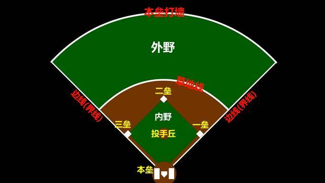

# 棒球

## 场地

* 一个直角扇形，直角内，是界内；直角外，是界外
* 扇形的弧线，只是场线，而不是界线。即使球飞过了这条弧线，只要还在直角之内，就不算出界。只有向左或向右超出，才算是出界。
* 4个垒包。分别是本垒、一垒、二垒、三垒。投手站的这个位置，叫做投手丘

## 规则

* 核心规则：击出界内球，然后绕一圈，回到本垒得分
* 裁判
  - 站在捕手后面的人，是司球裁判员，也就是主裁判，拥有无上权威
  - 在垒包附近还有一垒审、二垒审、三垒审，总共4位裁判员
  - 有些比赛还有右线审、左线审，总共6位裁判员。
* 每队有9名队员，两个队轮流攻守。一场比赛有9局。每一局都分上下两个半局。上半局A队进攻，B队防守；下半局B队进攻，A队防守
  - 一般是上半局客队进攻，主队防守。客队有3人出局后，上半局就结束，开始下半局。下半局是主队进攻，客队防守
  - 9局比赛打完后，得分多的队，是赢家。如果得分相同，就加赛，直到决出胜负
  - 如果分数相差悬殊，一方输定了，那就可以提前结束比赛
* 防守方：B队：负责投球、接球、传球，让进攻方出局，阻止进攻方得分，9名队员一开始就全都一起上场
  - 扔球
  - 捕手：把手伸在裆部打各种手势，他是在向投手示意采用何种方式投球；有时候则是向守垒员打暗号
  - 野手
    + 左外野手
    + 中外野手
    + 右外野手
    + 负责守备一垒的一垒手
    + 负责守备二垒的二垒手和游击手
    + 负责守备三垒的三垒手
  - 只要让3个进攻队员出局，就能结束这个半局，开始另一个半局，攻防关系就可以逆转
  - 守垒员不可以用绊倒之类的身体阻碍方式，阻拦跑垒员跑垒。只能是拿到球之后，再用触杀、封杀之类的方式，让跑垒员出局。
* 进攻方 A队：负责击球和跑垒，目标是得分
  - 每一个半局刚开始时，进攻方只有击球手独自上场。其他8名队友都在外等候
  - 击球手:站在本垒板旁边，左边或右边都可以
    + 将球打飞，从本垒出发，攻陷一垒后，就变身成了跑垒员
    + 接着第二名击球手上场，如果也成功上垒，那么第三名击球手上场,只有4个垒包。所以进攻方最多只有4名队员同时在场上
* 跑垒
  - 一个垒包只能容纳一个人
  - 后方跑垒员不能超越前方跑垒员
  - 击球手打出界内球，必须开始跑，向一垒狂奔
  - 强制进垒：击球手冲向一垒时，已经占据一垒的跑垒员也必须前进，向二垒冲去——因为一个垒包只能容纳一个人，要把一垒让给击球手
* 出局
  - 接杀：击球手把球打飞，球还没落地，就被防守队员用手接住了，那么击球手立即出局。不分界内界外，只要球没落地，被防守队员接到，就是接杀
  - 触杀：防守队员手里拿着球，触碰到“还没跑到垒包上的跑垒员”，那么跑垒员就得出局，防守队员之间，球是可以传来传去的
  - 封杀：拿到球之后，抢在跑垒员之前，抢先占领跑垒员的目标垒位。这样跑垒员就无家可归
    + 脚踩二垒的防守队员拿到球，被强制进垒跑向二垒的跑垒员，就被封杀出局。紧接着球又被扔给一垒的守垒员，于是把正在跑向一垒的击球手也封杀了。这就是双杀
    + 如果垒上没有人，只有击球手冲向一垒，那么球传给脚踩一垒的一垒手，就把击球手封杀出局
    + 适用于必跑（强制进垒）的状况，其本质就是让强制进垒的人无处可去。而非必跑情况下（主动进垒）的跑垒，只能用触杀出局。
* 得分：击球手在对方9个人的围追堵截下，沿逆时针方向，依次攻占一垒二垒三垒，最后跑回本垒，这样就能让进攻方得到1分
  - 跑回本垒，难度挺高，很多时候，进攻队员没跑多远就阵亡出局
* 好球 vs 坏球
  - 好球带：本垒板正上方、击球手的腋部到膝盖的这个立体空间，具体范围裁判说了算
  - 投手扔出的球，穿越了这个区域，就是一个好球，没有穿越，就是坏球。
  - 击球手挥棒落空、没打到球，或者将球打出界外，即使没有经过好球带，也算好球，好球数加1
  - 注意，如果好球数已经达到2了，那么打出界外球就不算好球也不算坏球。
* 保送上垒
  - 如果投手扔了4次坏球，击球手就被保送到一垒,如果一垒已经有人了，那么这个一垒的跑垒员也会被安全地推进到二垒。以此类推
  - 如果一垒二垒三垒本来就都已有人，那么击球手被保送上垒的同时，三垒的人会被平安推进到本垒，进攻方因此得到1分
* 三振出局：好球达到3个，击球手就被三振出局
* 触身球
  - 投手扔的球打在击球手身上，成立的条件，是击球手要有闪避的动作。很多时候，击球手必须要演，要精确地表演——既要闪避，以符合判定条件和减轻对身体伤害，又要让球碰到自身。最终算不算触身球，还是得裁判说了算。
  - 触身球也会让击球手被保送上垒
  - 防守一方有时候也会故意扔出触身球，送击球手安全上一垒。这是因为有些击球手太厉害，防守方怕他打出全垒打，所以干脆送他一个触身球，把眼前这个瘟神送到一垒去
* 安打：带来安全上垒的一次击打
  - 击球手把球打出后，成功地上垒，那么这次击球，就是一支安打
  - 一垒安打、二垒安打、三垒安打和全垒打
* 本垒打
  - 击球手把球打到全垒打区（全垒打墙的外面），然后击球手就可以从容不迫地安全跑一圈，得1分
  - 如果垒上已经有人，那么他们也可以跑回本垒得分
  - 满贯全垒打｜满贯炮：最好的情况，一垒二垒三垒都已经有进攻方的人了，那么击球手打出全垒打，这3个人和击球手都可以依次回到本垒。这样进攻方一下子就得到了4分
  - 阳春全垒打｜阳春炮：垒上无人的全垒打，只得1分
* 盗垒
  - 一旦投手开始了他的投球姿势，跑垒员就可以向下一个垒包冲刺。
  - 如果击球手没有做出击球姿势或者没有打到球，捕手就会传球给守垒员，以让跑垒员出局。
  - 如果击出的是界外球，那么盗垒无效，要返回原来的垒包。
* 强制回垒
  - 球被防守队员接住，击球手被接杀，那么跑垒员必须强制回垒，再次接触自己之前所在的垒包，然后才能重新出发跑垒
  - 跑垒员如果很确定这个球会被接杀，他就会踩着垒包不动，等球被接到了再开跑进垒
  - 如果跑垒员不确定会不会有接杀，他会先跑几步等着，如果没有接杀，就继续进垒，如果被接杀了，就赶紧回到原来的垒位上
