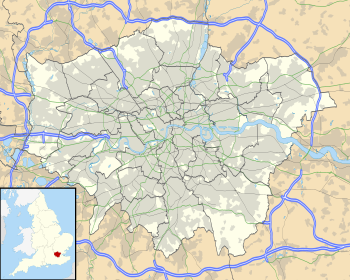
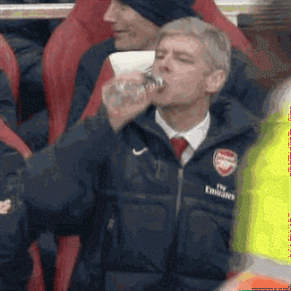
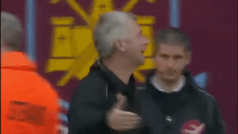
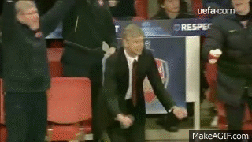
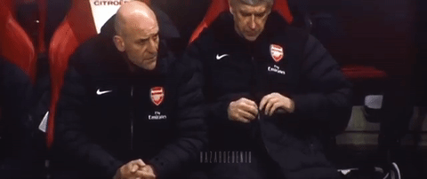

# 足球 soccer

* 偶然的存在，让我们相信人的自由意志还有更多可能
* 想象力与创造力

## 趋势

* 朗尼克
	- 世界杯的结果已经证明，可以忘记去控制球权。这也一直是我的战术主题：拉开纵深，通过灵性地传导，以速度取胜。必须把速度加到第六档，第七档，否则是进不了球的
  	- 法国队夺冠的另一大原因是球队良好的整体性和对年轻球员的正确指导：“八年前的法国队是一群自负的球员，而今年他们成为了世界冠军，尽管他们还是一支由背景各异的白人和黑人球员混合在一起的球队，但现在他们拥有了整体性，球员会得到明确的指导。
	- “年轻球员需要时常关心，俗气一点说，你需要给予他们关爱，就这点而言本届世界杯的法国队是一个良好的榜样。
* 向前出球
* 前场逼抢：对高速反复跑动有高要求
* 快速转移，造成防守出错

## Formation 阵型

* 4-4-2
	- 8号成为两名中场球员中更具进攻性的那一个
    - 占据中场人数优势，从而获得控球上的领先
    - 劣势则是将边后卫直接暴露在对方两个边路的冲击之下
    - 平行站位中防守的问题是两个边后卫需要被保护，那么进攻中的问题就是两个前锋必须自己拉边，在当代足球中，进攻中没有边路空间绝对是不够的
  * diamond
+ 4-4-1-1
* 4-2-3-1
* 4-3-3
	- 8号球员的情况则变得更加复杂，三中场组合让两名球员出现在传统8号的位置上，当身后有一名表现出众的防守型中场之时，他们就可以毫无顾忌地向前推进，威胁对手的防线。

### 中卫

* 贴身防守 不能让转身
* 争顶
* 回追
* 卡位
* 预判准传中
* 出球

### 防守

* 常规三大模式：地面渗透、个人突破和传中
* 穆里尼奥

### 控球

* 克鲁伊夫
* 瓜迪奥拉
  - 没有梅西型球员的打法修正

### 反击

* 弗里克
* 克洛普

## 培养

* 体制
	* 良好的体制保证年轻人能出来,不会出现老将还在顶现象出现
* 球员经验
	* 在决赛和重大赛事里经验和节奏的把控

## 规则

* 金球制 Golden Goal
  - 一般用于淘汰赛中，如果两支球队在90分钟比赛时间内打平，那么加时赛中的进球将决定哪一支球队最终赢得比赛
* 银球制
  - 由欧洲足球协会在2002年引入，于2003年2月开始实施。其中以2004年举行的欧洲足球锦标赛最受注目，在2004年2月被FIFA废除。
  - 银球规则与金球规则同样并非强制性规则，比赛组织者可以选择在加时赛中是采用金球或银球。
  - 银球制即以加时赛上下半时各15分钟为界，如一方在加时赛上半时攻入一球，不能立即取得胜利，而必须等到加时赛上半时结束，如果对方没有扳平比分，才算是赢得比赛。
  - 如果对方在加时赛上半时结束前扳平了比分，则双方还要继续进行加时赛下半时的比赛。

## 事件

* 米歇尔斯的现代足球
  - 米歇尔斯的到来，为阿贾克斯培养了一众巨星，克鲁伊夫、内斯肯斯等等。然而使得他真正光芒万丈的，是他为整个足坛做出的贡献，一位改变世界足球命运的改革。
  - 足坛历史上有许多伟大的改革，比如“WM阵型”，“442阵型”，埃雷拉的“链式防守”等等。但在1970年前后，世界足球是完全不一样的两种足球。彼时，还名不见经传的米歇尔斯创造了一种名叫“全攻全守”的战术，同时，他还为球场上的球员定义了职责详细的场上定位。正是我们今日常说的：边后卫、后腰、前腰、影锋、边锋等等。米歇尔斯让足球变成一项职责详细且三条线紧密的运动，从此足球进入了“现代足球”时代。
  - 米歇尔斯对后世教练的影响同样深远，秉承其衣钵的足球文化源远流长，克鲁伊夫、范加尔、瓜迪奥拉，至今仍然在不断影响着足球运动。将足球战术不断细化，将进攻进行到底，是米歇尔斯的足球哲学。那句经典的“足球既战争”，早已家喻户晓。他的弟子克鲁伊夫曾称赞道：“米歇尔斯打破了世界足坛维系了很长时间的呆板和僵硬。”
  - 关于荣誉，很多年后，他的弟子们每每提起，都认为之后的很多荣誉都离不开他，他本应获得更多。退休多年后，米歇尔斯接受采访时曾表示：“很多年以前，球员带着荣誉感去比赛，踢球是为了获胜，而不是像今天一样为了不输球。对于华丽的足球，胜负那些（虚名）并不重要。”
* 博斯曼法案
  - 1990年，一名名叫博斯曼的比利时球员，因为对于球队工资不满，在合同期满后决定不再与RFC列日队续约，试图转会法国敦刻尔克俱乐部。但在当时，合同到期的球员的转会仍旧需要转会费，而敦刻尔克拒绝支付转会费。博斯曼则被迫留在了俱乐部。
  - 1990年7月，仍然不肯与RFC列日队签约的博斯曼，被该俱乐部根据比利时足协的规定，处以“无薪及不得代表RFC列日队以外任何球队踢球”的处罚。在没有合同仍然被俱乐部封杀的情况下，博斯曼决定捍卫自己的利益。
  - 同年8月，博斯曼将RFC列日、比利时足协和欧洲足联三方一起告上了法庭，要求赔偿他100万美元。他的诉讼依据竟然是《罗马条约》，这场长达五年的诉讼，使得他这名职业球员只能长期的在法国、比利时这样的低级别联赛踢业余的“野球”。
  - RFC列日俱乐部、比利时足协和欧洲足联三家不服判决提出上诉后4年，比利时最高法院才裁定驳回上述。不服气的欧足联采取了双管齐下的场外手段，一方面向欧盟部长理事会施加压力，希望他们能帮助欧足联维护对球员的管理权；另一方面，欧足联又向博斯曼表示和解上的诚意，提出以800万法郎私了。
  - 这场漫长的官司，让博斯曼成为了全球瞩目的新闻人物。获得广泛舆论支持的博斯曼，将官司上升到欧洲法院。顶住压力的博斯曼，终于熬到了1995年12月15日这一天，欧洲法院最终裁决，认定“现行的转会费制度与外援上场名额限制是非法的”，这就是著名的《博斯曼法案》。1996年2月19日，法案正式实施。
* 2003年欧足联第二次改制
  - 2003年，欧足联正式完成了意味着妥协的“二次改制”。这一切绝不是偶然。足坛从“三大杯时代”转入欧冠唯我独尊的时代。欧冠的“二次改制”既维护了顶级豪强的利益，普拉蒂尼也通过吸取更多国家登陆欧冠，为自己日后竞逐欧足联主席赢得了更多的选票。这三年所发生的一切绝不是偶然，直到很多年后才侧证这一切。
  - 在90年代，10次世界足球先生有5次来自联盟杯，但欧足联将所有吸引力全部集中到欧冠，曾经笑傲足坛的欧洲三大杯，为了世纪初欧洲整体的经济低迷而牺牲。欧冠改制后崛起的豪强，如拉齐奥、多特、拉科鲁尼亚、帕尔马等等都开始先后陷入各种危机，80年代发展至当时的群雄逐鹿的局面开始走向终结，军备竞赛垄断开始。因为联盟杯的扩军，欧冠的队伍的两极化，这让足球市场发生了翻天覆地的变化。随后的两三年时间里，欧洲优胜杯宣告取消，联盟杯改名“欧联杯”。
* 意甲电话门
  - 2006年5月4日，《米兰体育报》刊登了尤文图斯总经理莫吉与意甲裁判间的通话内容。5月8日，足协主席卡拉罗、副主席马齐尼相继辞职，那不勒斯、罗马和都灵等四大检察院开始介入调查。一场意甲历史上前所未有的风波掀起，尤文图斯官方发布声明宣布尤文图斯董事会集体辞职。
  - 伴随着调查的全面铺开，AC米兰、拉齐奥、佛罗伦萨相继卷入其中。同时，还有以莫吉为首，长达26人的起诉名单。而随着调查结果的公布，尤文图斯、AC米兰、佛罗伦萨、拉齐奥将被起诉，并要求降级，尤文图斯近2次联赛冠军将被剥夺。“电话门”事件经过了长达几个月的调查取证，二审最后做出了包括尤文降级扣除联赛积分并剥夺两个意甲联赛冠军；AC米兰、佛罗伦萨、拉齐奥等俱乐部扣分的处罚决定。当年的意甲冠军被排在第三名的国际米兰俱乐部替代，国际米兰也因此成为了意甲联赛唯一一支从未降级的球队。以莫吉为首的涉案人员，也都被判处相关的刑罚，并被终生禁止参与足球运动等。
* 2019
  - 热刺淘汰阿贾克斯，利物浦淘汰阿贾克斯：英国球队的坚韧和血性，永远都是克鲁伊夫式足球的噩梦

## [Fédération Internationale de Football Association FIFA World Cup 世界杯](http://www.fifa.com/worldcup/)

* 单论球星的数量和质量，1986年世界杯和2006年世界杯是世界杯历史的翘楚
* 阵容厚度与球队打法的稳定性
* 1986年世界杯
  - 球星名单上的这些神人，巴西队的济科、苏格拉底、法尔考，意大利的罗西、孔蒂、安切洛蒂，法国的普拉蒂尼、帕潘、吉雷瑟、蒂加纳。西班牙的卡马乔，德国的沃勒尔、鲁梅尼格、布雷默、马特乌斯，英格兰的莱因克尔，比利时的希福，丹麦的大劳德鲁普
* Qualification
  - start as early as almost three years before the final tournament and last over a two-year period.
* Final tournament
  - The tournament was expanded to 24 teams in 1982, and then to 32 in 1998
  - On 10 January 2017, FIFA confirmed the 2026 World Cup will have 48 finalist teams.

### 2002 Trophy:Brazil@Japan

* Brazil    2–0    Germany

### 2006 Trophy:Italy@Germany

* 巴西黄金一代未进四强
* Italy vs France
  - 齐达内头顶马特拉齐，成全意大利

### 2010 Trophy:Spain@South Africa

* Spain   1–0  Netherlands
  - 托雷斯超车拉姆，登顶

### 2014 Trophy:Germany@Brazil

* Germany vs Argentina
  - 德国格策绝杀阿根廷

### 2018 Trophy:France@Russia

* 德国小组赛首轮负，二轮瑞典：克罗斯补时4分钟任意球反超比分，德国队最后的挽唱
* France    4–2    Croatia

### 2022 @Qatar

* 亚洲预选赛
  - 中国
    + 打进十二强赛
      * 40强赛出个线跟世界杯夺冠了一样，都吹上天了。
      * 这是一场值得高兴的胜利，但我们不能炫耀，这只是中国足球前进的一小步。而且，我一直认为我们40强赛出线仅仅是个小目标，是我们整个足球发展中向前跨了一小步，没必要去骄傲，更没有必要去炫耀！我觉得这个成绩没什么了不得，仅仅是我们预想的一个小目标而已。我们当然会向着更大的目标去前进。我们前面的路还很长、还很艰难，必须继续踏踏实实的努力，久久为功，让老百姓看到中国足球的进步与希望。我们希望中国足球每年都有进步、每年都有发展。
      * “我们回去之后将很好地总结40强赛的得失与不足，我们将竭诚向前走。足球是全社会的事，中国足协是起一个牵头的作用，希望更多的人能关心足球、支持足球，希望中国足球能够越来越好！”

## [UEFA European Championship](https://www.uefa.com/uefaeuro-2020/)

* [Union of European Football Associations UEFA](http://uefa.com/)
* held every four years since 1960
* first proposed by the French Football Federation's secretary-general Henri Delaunay in 1927, but it was not until 1958 that the tournament was started, three years after Delaunay's death. In honour of Delaunay, the trophy awarded to the champions is named after him.
* qualification tournament
* Final tournament
  - four teams took part in the final tournament
  - expanded to eight teams in the 1980 tournament
  - 1996 see the number of teams taking part double to 16
  - 2016 was the first to have 24 teams in the finals

### [英格兰 England](https://www.thefa.com/)

* 贝克汉姆
  - 兰帕德和杰拉德总是无法很好地处理双方之间的关系，也许最简单的解释就是：他们都是8号球员。简单来说，他们需要一名传统英式4号球员出现在他们的身后，让他们能够有更多的自由度去进攻。
* 鲁尼
* 凯恩

### 意大利 Italy

* 防反打法：传统的盯人中卫、“挑水工”型中场和“9号半”生产线
* 普兰德利
  * 以技术足球之名打造了一支充满活力的意大利，在2012欧洲杯上的表现赢得了尊重
* 曼奇尼转型
  * 取而代之的是由技术型中场、逆足边锋和攻击型边后卫撑起的传控体系
  * 围绕若日尼奥和维拉蒂打造433体系，重用因西涅，曼奇尼为意大利带来的战术革命极具颠覆性。
  * 犀利的高位逼抢，耐心的地面传导，曼奇尼为意大利打上了“现代”足球烙印。
  * 技术更为细腻的巴雷拉取代帕罗洛占据另一个主力位置，三名球员与博努奇、基耶利尼组成了一个稳定的中轴线。
  * 主要在侧翼和锋线进行轮换，贝洛蒂和因西涅的位置相对稳固，小基耶萨和贝尔纳德斯基争夺右翼先发，扎尼奥洛因伤落选，L-佩莱格里尼成为最可靠的“边中场”，弗洛伦齐和斯皮纳佐拉看起来已经在两闸的竞争中占据了杆位。
  * 通过(中)高位逼抢将发动进攻的地点推前，用"三个半"后卫组成的防线完成出球，依靠攻击型边卫撑起进攻宽度，有耐心、有能力在局部打出连续配合，中场球员不断寻找后插上支援锋线的机会。

### 荷兰 Holland

### 黄金一代

* Czech Republic
  - 内德维德
  - 波波斯基
  - 杨.科勒
  - 罗西基
* Portugal
* Netherlands

### 1992 瑞典

* 半决赛上，抱定了防守反击打法的丹麦利用点球决胜将进攻足球的倡导者荷兰淘汰出决赛，并最终获得了冠军，创造了著名的“丹麦童话”，这件事情更是起到了推波助澜的作用，至此金球制已然呼之欲出。

### 2000 France@ Netherlands & Belgium

* France vs Italy
  - 特雷泽盖罚进点球

### 2004 Greece@Portugal

### 2008 Spain@Austria & Switzerland

* 俄罗斯奇迹：希丁克执教，击败意大利、法国，败在西班牙还是荷兰
* 黑马土耳其
* Spain 1-0 Germany

### 2012 Spain@Poland & Ukraine

* Spain 4–0 Italy

### 2016 Portugal@France

- 法国 2-0 德国 晋级决赛
  + 全面、高效，马竞新一代神锋。法国队放弃场面追求实效取得突破，相信决赛他们会踢得更主动。
  + 德国队为缺少中锋人选付出代价，勒夫没给球队准备好替补中锋，格策、穆勒都让他失望了。
  + 法国的确进攻更有穿透力，德国进攻速度还是没提上去，办法不多
* Portugal 1-0  France

### 2020

* Italy
  * 贝拉尔迪 洛卡特利，教练的调教能力
  + 进攻能力上来了
  + 力量、速度、防守，能不能打得过真强队
* Croatia
  * 老球员的经验，球员特点鲜明
  * Modelic:不急，出球合理
* England
  * vs Croatia
    * 首发阵容，很多都没上呢，储备太足了，球员年轻 福登 芒特，有才气
    * 没打算控制要前场，前腰不做过多纠缠，后腰出球，边路传中
    * 利兹联队后腰 Kalvin Phillips，阿尔特塔调教人不行
  + vs Scotland
    * 英格兰后腰容易被打穿
      - 福登频频前插
    * scotland 传中好习惯
    * 蒂尔尼+罗伯逊 左边一条线
* Belgium
  * vs Russia
    * 稳重的打法
    * 俄罗斯跟中国一样，球员青黄不接
  + vs Danmark
    * 德布劳内的决定性发挥
* Holland
  * vs 乌克兰
    * 真实全攻全收，踢得好看
* Scotland
  * vs cezh
    * 战斗意志，跑动能力，身体对抗
    * 罗伯逊的爆点
    * Schick 头球
    * 麦克斯米奈
    * 勇猛有余而灵活不足
* 西班牙
  - 传控的病，没有实用中锋以及传关键球的球员
* 德国
  - 还是瓜迪奥拉的传控思路，没有好用前锋
  - 德国的传中的拾起
  - 拉开空间
  - 抢第一点
  - 保持冲击力
* 法国
  - 稳得住，不急进攻，有防守
  - 博格巴是个双刃剑：有好的传球视野，也有不端正的态度
  - 坎特是个无解的防守 bug
* 葡萄牙
  - vs 德国
    + 反击的成功率
    + 一直向前推进的能力
    + 进攻前锋空拉边
    + 以防守为主
    + 穆勒边路长 高 快，另外边路不要停
    + 边路传高球，不要精确计算，直接往门前射或中路摆渡
    + 高速往禁区传
    + 破密集防守的打法
    + 如何压制德国边路的传中
    + 葡萄牙的边路空挡太大
    + 防得住会进攻
    + 德国起后点

## 美洲杯

* 就十支球队，美洲杯跟世界杯预选赛打的频率太高了

### 阿根廷

### 巴西

## 亚洲

### 中国 China

#### 国足

* 第一代
  - 1951年，解放军足球队走出国门会战捷克斯洛伐克，由于舟车颠簸，加之的确水平不如别人，被人摁着打了一个1比17。时逢匈牙利足球队创下了连续33场国际比赛不败战绩，于是国家便用紧巴巴的外汇，相继送了25名队员到社会主义兄弟家里去取经学习。
  - 年维泗、张宏根等人从北京坐了13天火车抵达匈牙利，顿时就感受到了巨大冲击。东欧兄弟水平高，做饭大师傅、场地施工员临时组队，都踢得他们这些国脚羞愧不已。经过一年半科学系统的训练和牛奶面包的喂养，球队终于达到了欧洲乙级联赛的水平
  - 1957年夏，学成归来的国足第一次大考，冲击瑞典世界杯。在雅加达的首战，国足以0比2告负印尼队，因此，当回到家门口北京先农坛体育场时，意味着国足必须拿下比赛。 那时候国足心理能力还很强大，开场仅一分钟，50年代的中国头号球星张宏根便连过数人，在距离球门25米处左脚大力抽射，皮球带着一代人的希望和呐喊入网得分。国足虽然取得了4：3的胜绩，但因净胜球劣势出局，世界杯首航触礁。
  - 门将张俊秀，擅长鱼跃扑球，被誉为“万里长城”；左边锋方纫秋，意识敏锐，门前杀手；前腰年维泗，敢打打拼，球场硬汉；前锋张宏根，技术全面，能突善射，还被越南印到了邮票上。那个时期的国人很拼，但对足球也有不少误解，比如大部分人更推崇轻伤不下火线、重伤不进医院的大无畏精神，结果老一代的名宿们多在30岁前就因伤退役，止梦世界杯。
* 第二代
  - 有小个子天才胡登辉、飞将军王后军、能跑能带的戚务生、防守稳固的徐根宝等人。他们大多出生于40年代初，技术、体能、速度都超过了上一代，训练也依然格外刻苦。
  - 胡登辉曾胳膊绑着夹板比赛，场上刚毅如铁，却在浩劫中不堪受辱，在圆明园一颗歪脖子树上吊自尽。 没人敢去善后，只有当时担任国足队长的戚务生，借了辆三轮车，顶着巨大压力把队友发硬的遗体从树上解了下来，铁青着脸独自蹬回宿舍，悄悄地找地方火化了。十年动荡、十年青春，第二代球员在漠然中终止了足球生涯。
* 第三代
  - 改革开放后的1984年，在狮城新加坡不仅勇夺亚军，更在世界面前展示了国足的风采，李华筠、古广明、贾秀全、赵达裕等人便是其中佼佼者。
  - 比如“矮脚虎”赵达裕，虽然个子不高，但从小就绑着十公斤沙袋练习弹跳，倒挂金钩如履平地。他曾在“尼赫鲁杯”中绝杀两年后的世界冠军阿根廷，将马拉多纳的一干队友踢成手下败将。
  - 因为种种原因，最终也未能帮助国人实现冲出亚洲的梦想。1985年的“519”惨案，宛如一把尖刀，刺穿了中国足球的心脏。5月19日，世界杯预选赛末轮，国足面对实力远逊自己的香港队，打平即可出线。但媒体并不答应，认为国足面对英国治下的香港，一定要全力拿下，给资本主义一个下马威。 赛前的紧锣密鼓，导致了一场标准的心理失衡型比赛。重压之下的中国男足，面对摆大巴、猥琐反击的香港队，十一次角球只有一个打在了球门范围内，最终1比2饮恨出局。
  - 从自信云巅坠落的球迷怒不可遏，爆发了打砸抢的骚乱。公安不得不拘留了127名肇事者，才平息了风波。而这次骚乱，也被海外舆论揶揄到，“中国球迷已经实现了国际接轨”。
  - 骚乱给教练、球员套上了极大的心理包袱，赵达裕与李华筠在“519事件”后相继挂靴，只有古广明后来去了德乙，成为第一个在德国踢上职业足球、配上宝马轿车的中国球员。
* 年维泗“海归一代”终结于伤病，徐根宝“接棒一代”困惑于时代，贾秀全“高光一代”负重于心魔。
* 1986年，釜山亚运会对阵韩国，国足先进一球后收缩防守，被4比2击溃；1992年，巴塞罗那奥运会预选赛又碰韩国，国奥开场9分钟被对方灌了三个球。“恐韩”已成气候。
* 1989年国足再次冲击世界杯时，1比0领先阿联酋、1比0领先卡塔尔的两场比赛，都出现了最后三分钟连丢两球的状况，替补队员董礼强两次带球失误导致对手破门，耻辱性地一战成名。“黑色三分钟”笼罩下的国足，仿佛魔法消失后的灰姑娘。煮熟的鸭子接连飞走，男足彻底陷入低潮，用徐根宝的话形容就是：“打击太重太快，一生都会产生阴影。”
* 现实
  - 2000年，米卢来到中国，带来了“快乐足球”的同时，也搞起了思想建设。在召集范志毅和郝海东两位素有芥蒂的老将时，米卢提了一个问题：“你们是为谁踢球？”最终，于根伟在五里河一脚捅射宣告国足冲进了2002年世界杯，男足在这一年终于没有给在凯歌高进的中国人添堵。
  - 少有的曙光出现在2005年的荷兰世青赛，以董方卓、赵旭日、郜林、蒿俊闵、冯潇霆为代表的国青小将，有传有射，敢断敢过，4场比赛攻入11球，最后虽然2比3惜败德国队，但仍赢得球迷尊重。
  - 次年国青教练克劳琛被罢免，这批希望之星在亚运会中倒在了和伊朗队的点球大战中。在2008年的北京奥运会中，谭望嵩直奔比利时球员下三路去的少林腿，也完全压过了董方卓的一记头球。
  - 2006年男足对阵伊朗的比赛中，国足球员在被断球后有的龟速回防，有的叉腰观看。最终，伊朗前锋晃过门将王大雷后，并没有选择射门，而是招呼队友来庆祝后，才缓缓将球送进了球门。
  - 在甲A时代，21岁的球员能在国足胜任主力，如今23岁的球员却只能靠足协强制新政才勉强上场。而23岁，在职业化的欧洲足坛早已是一个熟透了的年纪。 金元足球之下，俱乐部狂买外援的根本原因，还是因为本土新秀脚下没根，青训断代、后继无人，只能请外来和尚，吃一天斋念一天经。
* 主帅
  - 1983年国家体委挑选国足主帅，代理主帅张宏根被约谈聊聊组队目标。他思考了一番，有点保守又有点清醒地表示：（我）出任主教练，可以打出水平，但冲出亚洲没有十分把握。 这个答案让渴望成绩的领导们觉得没魄力，于是，机会留给了立下军令状的曾雪麟。 而张宏根则在1987年获得体委批复，到国家体委体育服务公司下属百乐酒店担任公关经理。踢了半辈子圆球的射手，离开球场进入酒桌，从头学习如何圆滑地与人相交。
  - 曾雪麟一头撞在“519”这堵墙上后，才知道自己签的是投名状、背锅状。赛前预感到危机的他，曾提出到香港研究对手虚实，领导听闻直接甩了冷脸：“香港队有什么可看的？” 比赛失利当晚，曾雪麟被球迷围堵在工体休息室，有问候祖宗的，有要枪毙他的。他引咎辞职后，仍然不断收到刀片和骚扰信。 老爷子后来透露，那天的战术其实不是自己定的，有领导发话了，“踢香港你还要保平就出线吗”，中国队必须攻出去，必须赢得漂亮。
  - 上海的“中国足球教父”徐根宝。1992年，徐根宝带着一手调教的弟子南下吉隆坡，这支坐拥范志毅、郝海东、徐弘、区楚良的国奥队，在“打平即可出线”的生死战中上演了“打死都不出线”的剧情，1比3负于韩国，引来骂声一片。
  - 徐根宝引咎辞职后，在2000年回到崇明岛，创办足球基地，潜心培养年轻队员。根宝足球学校鼎盛时撑起了国家队的半壁江山，武磊、张琳芃都是他的得意门生。这位七十五岁的老人被称为“中国弗格森”，至今仍奋战在青训一线，很难说是国足的幸、还是不幸。
  - 徐根宝折戟沉沙的那一年，德国人施拉普纳以25万美元的年薪来到中国。5个月后，国足夺下广岛亚洲杯的季军。新教练、新队员、时间短、成绩佳，正中了国人“速成”心态的下怀。施拉普纳被当成国足救星，球迷们亲切地称之为施大爷。 1993年春晚现场，施大爷一根白发，被冯巩以5万元的价格拍卖。“施大爷的这根头发是在中国变白的，是为了中国足球变白的，是为了中国变白的，我们要把它永远留在中国。”
  - 次年施家军率队冲击美国世界杯，在同一干西亚弱旅的遭遇战后铩羽而归。一夜之间中国球迷将来自德国的“豹子精神”弃如敝履，纷纷喊道：施拉普纳是国际骗子。
  - 1994年主教练一职又落到了老实人山东大汉戚务生身上，戚务生不敢怠慢，以甲A前列球队为班底，组成了一个号称史上最强国字号的队伍。 这只球队在北京工体迎来了各路友谊赛。意甲豪门桑普多利亚、英超强队阿森纳、乌拉圭劲旅佩纳罗尔，以及哥伦比亚国家队等各路球队，居然都没在国足身上捞到一场胜绩。后来人们才知道，走穴而来的豪门，其实都是在给甲方面子。
  - 大连金州首战，国足在2比0的局面下被伊朗人连扳4球；对阵“鱼腩球队”卡塔尔的关键一役，国足输了个2比3输掉。愤怒的球迷甚至放起了鞭炮喝倒彩。 两百多天，没有假期，生活单调的封闭集训，换来戚务生瘦了两个皮带扣，也换来了熟悉的一地鸡毛，戚务生差点儿被球迷砸烂狗头，只好灰溜溜的下课了。
  - 荷兰人阿里汉。在任期间，首场比赛在广州0比0战平了世界冠军巴西队，又斩获了亚洲杯的亚军，开局还不错，可惜阿里汉还是倒在了世界杯预选赛上。 世预赛的最后一场比赛对阵香港队，国足需要和其他球队比较净胜球，对手香港队默契配合。最终国足7比0大胜，然鹅现实很残酷，国足还是因为净胜球不足被淘汰。
  - 接任的朱广沪颇有伯乐之相，在健力宝执教时，他将郑智从后卫改为前腰，令后者组织进攻才华全面绽放。但可惜朱伯乐运气不佳，2007年率队冲击亚洲杯时，又是一场平局即可出线的比赛，但却被乌兹别克斯坦打入了三个定位球。
  - 2009年高洪波上任，次年以最年轻国足主帅的身份率队出征东亚四强赛。不仅0比0逼平了日本，更是3比0大胜韩国，最终夺得冠军。邓卓翔和曲波戏耍韩国队后防线的精彩进球，令习惯了24年“恐韩”的球迷们唏嘘不已。而国足的FIFA排名，也一时从108位前提至69位。球迷们都期待着男足在世界杯预选赛会有所惊喜，然后，高洪波突然被足协免职。
  - 昨天晚上与协会（中国足协）领导有深入的交流，协会领导也认为目前中国男足存在问题应该由你主教练承担，我明白这个意思，所以比赛结束了，我现在也提出离开。”高洪波的辞职发言看似波澜不惊，但却值得玩味。他首先承认比赛前一天晚上同中国足协领导有过深入交流，并且表示“领导认为目前中国男足存在的问题应该由你主教练来承担”。紧接着又补充了一句“我明白这个意思，所以比赛结束后提出离开
  - 继任者是西班牙足球名宿卡马乔。卡马乔在皇马踢球时奖杯拿到手软，在西班牙国家队也是核心主力。但退役后的教练生涯却十分凄惨。他带领塞维利亚队期间，球队被迫降级。在皇马任教期间，创下了22天的最短执教记录。 但坚强的卡马乔不信邪，还是决定用一件最难最惨的事情来证明自己。 卡马乔执教国足后，急需要一个软柿子。可惜“柿与愿违”，2013年男足在合肥1：5惨败泰国二队；而热身赛上也0比8输给巴西，创造了中国男足的最大输球纪录。
  - 经济适用男佩兰来了。他的执教成绩并不突出，所幸也没卡马乔贵。于是，来的不轰烈，走的也很平静。高洪波随后又被拉来救场，但他清楚认识到“领导认为目前国足成绩差，主教练应当承担责任”后，也是无奈辞职离场。
  - 五年前，踌躇满志的高洪波，还没正式下课就得知足协敲定了卡马乔，那种屈辱和愤怒，他显然不想再来一次。4天背靠背的比赛，高洪波竟然替换了7名首发球员。
  - 里皮一开始进国家队，他就经常跟我说——他很奇怪这些球员在联赛当中的发挥非常好，但来到国家队却踢不出真实水平的百分之四十、百分之五十。 给他解释就是压力太大，他们背负了太多。他们在俱乐部比赛，心态非常放松。但来到国家队，压力就变得很大。
* 俱乐部纷纷脱离体委，成为了自负盈亏的企业实体。但足协却依然留在了国家体育总局内，实行“两块牌子、一套人马”的双轨制，对内执行计划行政，对外执行市场经济。
  - 总局喜欢委任圈外人来充当负责人，指导思路是：利益纠缠越少，改革魄力越大。
  - 2000年，“外行”阎世铎开创先河式地接替了“内行”王俊生，成为足协新掌门。阎世铎曾写过一篇论举国体育利弊的文章，一股子改革派的味道。上任不久，阎世铎便提出了人民足球、少年足球的纲领，希望沿着这条路，“坚持五六年，有信心向日本叫板”。然而，当中国队抽中了世预赛的上上签后，长期规划顷刻退位，足协工作原则转为“一切服务、服从于世界杯”，“2001年联赛只升不降”的方案也随之出炉。
  - 取消升降级后，处在升级通道的甲B球队慌得一比，为了最后几张船票，争先祭出假球与黑哨，最终酿成了浙江绿城、长春亚泰、四川绵阳等五家俱乐部互踢假球的丑剧，史称“假B五鼠”。
  - 与此同时，“留洋限令”也隆重出台，几位已经在欧洲球队站住脚的球员，如张恩华、谢晖等人，均“自动”割舍前途，全力回国备战。这一转身，就与留洋就此别过；可要不转身，他们的下场多半就是下一个王治郅。
  - 2001年的十强赛国足赢了，战利品是和巴西等队交换了几件球衣，而牺牲的却是青训缺失的几年。眼瞅着不见新人。2005年足协规定没有国奥队球员的俱乐部，每场比赛必须上场至少两名20岁以下球员。结果，深圳队在比赛最后一分钟，先换上一名小将，随后又用另一名小将进行替换，完美适应规则而不影响球队实力，塑造了大型“上有政策，下有对策”现场。
* 俱乐部
  - 2001年10月6日，甲B末轮。亚泰6比0大胜绿城，晋级甲A。有两球是在最后四分钟掐算着打入的。绿城球迷痛骂假球，时任浙江体育局局长的陈培德拨通了绿城老板宋卫平的电话，质问他为什么这么干。 不料，刚猛汉子宋卫平在电话那头嚎啕大哭：“没想到，几千万元买下球队，却被球员出卖”。
  - 吉利李书福当年也是黑哨的受害者。有人劝他“冲甲A就必须给裁判送钱”，他大怒，“一个吹哨的，凭什么挣钱比我还容易”。结果球队六连败，俱乐部总经理无奈辞职。冲级无望后，入局不到一年的李书福就像后来的本山大叔一样，宣布远离中国足球，珍爱生命。
  - 陈培德和宋卫平等人随后发起了一场“揭黑战斗”，但最终，仅有裁判龚建平一个人站出来忏悔受贿，被判处有期徒刑十年，战斗宣布结束。
  - 曾管理陕西国力俱乐部的王珀，因夸口要将球队打造成银河战舰，沦为天下笑柄。他最犀利的一段话是：“要打假球，要赌球，也应该是俱乐部来操作！你们跟着我干，可以挣大钱，我带着你们赌球，我有消息的啊。”
  - 国力俱乐部的商业模式就四字：输球赚钱。输长春亚泰，球队提前支付了下个月工资。输珠海中邦，球队在KTV消费了2万多。
  - 2009年，公安部出手掀开了足坛的光鲜外衣，足协前高层谢亚龙、南勇、杨一民，裁判委员会原主任张建强等人锒铛入狱。而南勇正是2001年足协调查腐败案件的负责人之一。
* 没人提荣誉和兴趣这两个点.**我们根本没有我们想象的那么爱足球：我们对于足球的爱，一直都是叶公好龙式的爱，当这种爱和现实产生了冲突，第一个舍弃的就是它。 而从根子上，我们也爱不起足球，甚至都没有意识到一个健康的体魄、竞争意识、团队合作精神，是一件和学好科学文化知识同等重要的事情。 做一件让人愉快而没有“用”的事情，对急速前进的我们来说，是一件奢侈品。中国足球的崛起，需要等到我们的社会真正能够从容的那一天。**
* 前延边富德主帅朴泰夏任中国女足黄队主帅，同为韩国人的前中国曲棍球女队教练，金昶伯任体能训练顾问
* 这支国足以85国青为主力框架，是中国上次杀入世青赛决赛圈的队伍。之后中国连续无缘7届世青赛决赛圈。未来10年中国足球后继人才匮乏。国足目前问题很多，请球迷做好心理准备，未来10年可能出现人才断档，国家队成绩可能会更加下滑。
* 分析来分析去，哎，都好笑。十几年走的太多弯路，这会想着抄近道，拜托了，还是想想怎么培养年轻运动员。这么多好的例子，亚洲杯的卡塔尔、邻国的越南、泰国，想说的是摩天大楼不是一夜建好的，没有好的基础，也很难看到希望！​​​​”
* 如果球队踢得像我们今天这样：没有斗志、没有求胜欲、没有个性、充满恐惧、没有创造力，这意味着教练的工作完全不到位。这意味着我的工作做得不好。如果我带的球队像今天这样，我不会去偷钱，我挣很多很多很多钱，而我不会去抢钱。这是我辞职的原因，此决定不可撤销。
* 足球基础
  - 中国足球最大的问题就是小学没人踢球，没人踢球怎么能有高水平的球员
  - 小学阶段不普及
  - 日本踢球中小学60万：一周两次训练，一场比赛
  - 小孩围栏式小场地自由踢
  - 学校把注意力放在提高上，没人去抓足球普及，所以很多孩子不踢球。‘底座’被忽视掉了，其实也选不出什么好尖子。在这个问题上，过去是跑偏的。所以中国足球抓了20多年了，还是搞不上去。
  - 青训和校园足球都存在早期竞技化、专业化、成人化的思想。一天练2、3个小时，恨不得每天都练，所以这必然会让家长做出抉择。大部分家长都会意识到，踢足球这条路太难了，导致很多家长不得不割舍足球。当足球只是孩子的课外活动，家长就可以两者兼顾，继续观察孩子是否有可能成为球星，到了16岁就能看准孩子是否适合走足球这条路，这时候家长再做出选择就比较容易了。
  - 教育部已经有28000多所特色校，有2800万中小学生在踢球。如果确实有这么多孩子在踢，那非常了不得，这是一个很雄厚的基础。但现在这些孩子是不是都在踢，是怎么踢的，还需要进一步落实。包括怎么把足球课上好、怎么把校内的班级比赛经常性的开展起来，这些都必须落实。

```
老爸在电视机前看国足被虐1:5，无比愤怒，大骂“中国足球还有救么？”孩子跑出来说：“老爸，让我出去踢会儿球呗~”   父亲回答：“踢个P，不考大学了？赶紧去做作业！”

校长在窗边和区教育局领导谈心，领导说：“你们学校的体育氛围搞得好，要坚持！”校长刚想谦虚，窗外的操场上传来一阵喧闹，有孩子踢球时受伤倒地。 家长闹到学校，全区学校体育课减半，足球课取消。

开发商告诉购房者：“我们这个楼盘真的很不错，旁边给业主配套了一个足球场，平时小孩可以来踢球。”购房者也是球迷，听了很开心，不过看了周围配套后，他建议道： “你们应该把足球场改成shopping mall，这样房价才能涨得快啊！”
```

#### 女足

* 1999年7月10日，凌晨4点，中国电视收视率迎来历史高峰。女足世界杯决赛开赛在即，洛杉矶玫瑰碗体育场内，9万观众呐喊欢呼，沸腾如怒海。 4架F16战斗机低空掠过赛场，看台包厢内，金发的克林顿志得意满。这不光是一场足球比赛。两个月前，美国轰炸了中国驻南斯拉夫联盟大使馆，三名中国记者牺牲。
* 决赛陷入胶着之中，90分钟内两队无建树。加时赛，中国队一度将球顶入球门，又被美国球员顶出。赛后回放，那个球已整体越过门线。一个标准的误判，一道世纪的暗伤。
* 2003年起，老一代女足陆续退役。孙雯去复旦读书，后又受邀成为《新民晚报》兼职记者。
* 2007年，女足再次无缘世界杯四强，2011年，女足无缘世界杯。最后连亚洲冠军也保不住了。2005年到2017年，6届女子东亚杯，中国3次垫底，2次第三，1次第二，没有一次冠军。
* 2015年，中国女足的足球人口还不到1000人，而德国女足有超100万人，美国女足有300万人。
* 2018年，上海女足主场球票免费，即便如此，新赛季首场观战人数仍不到一千人。
* 白洁，退役后成为八一女足主帅，2005年她因球队管理问题愤而辞职。转业后，她前往深圳，成为一名警察。深圳夜晚，无穷尽的大厦有着重叠的影子。 她说，情分还在，但已经很少关注足球。
* 每次只有到此时，铿锵玫瑰才会再次被提起，热度一个月，像短暂的花期。

#### 国青

* 20年多年前从跟随77-78年龄段第一批国青队员开始，每两年一支国青队，迄今为止已经先后连续跟踪采访了12支国青队。在这么多年中，每一支国青队都出现过类似情况，而且从未断过
  - 20年多年前从跟随77-78年龄段第一批国青队员开始，每两年一支国青队，迄今为止已经先后连续跟踪采访了12支国青队。在这么多年中，每一支国青队都出现过类似情况，而且从未断过
* 中国教育是桎梏，要听话。听话是要对自己负责

### 日本 Japan


## 俱乐部 Clubs

* 盈利能力：不留高价球员
* 不再寻求长期教练，给教练交学费周期太长了
* 球队的普适性：不能来一个教练，大换血

## [UEFA Champions League UCL](http://www.uefa.com/uefachampionsleague/)

* 1992年欧足联第一次改制
  - 欧冠从曾经的32支球队两回合单轮淘汰制改为16支球队4个小组比赛的淘汰晋级制。
  - 改制的开始，也意味着商业利益链的不断捆绑，欧冠作为全世界最高素质，最具影响力以及最高水平的俱乐部赛事，自然也注定成为世界上奖金最高的赛事。1997/98赛季，欧冠改制步伐加大，不再仅仅是联赛冠军才能参加的赛事，欧冠开始扩军为24支球队，分为6个小组，种子队则是卫冕冠军加五大联赛冠军。扩军后，五大联赛的亚军都可以参加欧冠，但第三名与第四名仍然将参加联盟杯。这一度也使得欧冠的观赏性更强，但无形中也放开了规则的有效限制。
  - 欧足联规定同一联赛最多只能有5支球队同时参加欧冠，因此一旦这种极端情况成立，那么由于要优先保证欧冠和欧联卫冕冠军的利益，获得第4名的球队将被剥夺资格
  - 如欧冠冠军已经通过联赛获得欧冠小组赛的席位，则该小组的欧冠席位将授予欧战系数第11的联赛冠军；
  - 如欧联冠军已经通过联赛获得欧冠小组赛的席位，则该小组的欧冠席位将授予欧战系数第5的季军；
  - 四大联赛的同国球队获得欧冠和欧联杯冠军且未打进联赛前4，则该联赛第4名参加欧联杯。
* Qualification
  - 2009–10 season begin a double round-robin group stage of 32 teams
* Group stage
* knockout phase
* Distribution

## leagues

##  [Premier League EPL 英超](https://www.premierleague.com/)

* 1863年，英格兰足球的“共主”英足总（FA）成立，与之一同诞生的还有足总杯。由于足总杯是淘汰赛制，绝大多数球队都面临一年大部分时间没有正式比赛的困境，只能彼此“约球”。直到1888年，时任阿斯顿维拉主席麦克格雷格提议，由12支球队组成循环制联赛，每周举行。
* 为了管理联赛，英足总还特意成立了“联赛管理委员会（EFL）”。法律上，联赛管理委员会是英足总的下属机构，但也服务于俱乐部利益。在联赛管理委员会的努力下，“球员周薪统一为4英镑”、“不准在经营俱乐部中营利”等上古规则被一一废止。不过同时，联赛管理委员会的权力越来越大，不断挑战英足总。
  - 很长时间内，联赛管理委员会采用“大锅饭”的方式分配转播收入，豪门往往要牺牲很大一部分收入来帮衬低级别的穷兄弟们，这就让联赛管理委员会与一些俱乐部之间心存芥蒂
* 1989年——希尔斯堡惨案在这一年发生。一方面，撒切尔夫人大肆打压足球，导致俱乐部收入锐减，顶级联赛转播权一度只能卖50万英镑；另一方面，根据大法官泰勒的提议，职业联赛各队球场强制改成坐席，这意味着不小的开销，而联赛管理委员会与英足总能够提供的帮助都很有限。
* 1990年11月，格雷格-戴克宴请五大豪门的高层，提出了自己的计划——以五大豪门为首的顶级俱乐部脱离联赛管理委员会，另起炉灶组织联赛，这样方能将转播收入的支配权牢牢握在手中。这份提议，就是如今“英超联赛”的雏形.为了获得五大豪门支持，戴克还承诺每家每年250万英镑的收入，这是一个难以拒绝的价格。
  - 为了获得英足总支持，戴克还放弃了建立封闭联赛的想法，而是保留升降级制度，并接受英足总的领导，让英足总持有能对英超联赛各项决议一票否决的“金股”。而英足总，实际上也乐见英超联盟的成立，因为一旦顶级联赛各队独立，就意味着联赛管理委员会失去了最重要的资产。在英足总的默许下，1991年7月17日，英超正式成立。
  - 传媒大亨默多克带着5年1.9亿英镑的价格杀入，并提出了一份更有利于英超中小球队的方案，并借此在最终投票中以14票勉强过关，多数的票都来自于中小球队。在巨额转播费的加持下，英超联盟的实力愈加庞大，也逐渐脱离了英足总的控制。
  - 英超联盟由20支球队“共管”，每支球队的投票权重相等，一队一票。一应大事小情，需要2/3的球队同意才能落听
* 欧战
  - 1、2、3名欧冠小组赛；4名参加欧冠资格赛
  - 第5名参加欧罗巴联赛资格赛；足总杯冠军和联赛杯冠军参加欧罗巴联赛资格赛
    + 若足总杯冠军已获得欧战资格，亚军替补参加，若冠亚军都已经获得欧战资格，联盟杯名额递补给联赛。
    + 若联赛杯冠军已获得欧战资格，联盟杯名额递补给联赛
* 裁判
  - 天谴者阿特金森，豪门猎手克拉滕伯格，北伦敦狙击者麦克迪恩，盲侠奥利弗



### [Arsenal F.C.](https://www.arsenal.com/)

* Gooners|The Gunners@Emirates Stadium|Highbury

* 后腰防守问题一直存在
  - 反击效率:强队气质，打脏球
* 07-08
  - 欧冠
    + vs 巴萨
+ 爱美丽
  - 没有中场，拖后后腰
  - 球员遇见没有想法的教练也是白给
* Jérémie Aliadière
  - 1999年，年仅16岁的阿利亚迭雷加盟了以青年军著称的阿森纳，但是在长达8年的枪手生涯中，这名法国前锋仅在英超联赛中上阵7次，上个赛季由于范佩西和亨利的相继受伤，阿利亚迭雷获得了在各项比赛共23次的上阵机会，但这其中大多数都是联赛杯的比赛，对此，阿利亚迭雷觉得只有转会到其他球队才能彻底改变这种情况
* 解雇球探
  - 从1997年就已任职阿森纳球探的Francis Cagigao离开球队，信任的员工的离职如Brian McDermott, Peter Clark 和Ty Gooden也是他离开的一个重要原因。
  - 埃杜透露了他的想法，他表示想要与一个小团队紧密合作，并专注于使用StatDNA，一个枪手在2014年收购的数据和分析公司
  - 我很清楚自己在做什么，我想和更少的人一起工作。我非常想和StatDNA合作，这很重要。我想与之共事的人，我希望他们与我非常亲近。我想与一群人一起工作。我不希望一个人在一个地区或一个国家工作。我想要一个团队一起工作。人少了责任就多了。

#### 股东

* Stan Kroenke
  - 2004年，杰夫-布什刚刚被KSE任命为科罗拉多急流的高管。他们的第一个目标是与一支欧洲球队进行合作，而最理想的合作对象就是英超球队。杰夫-布什告诉The Athletic记者：“我立刻意识到，我们需要更多的足球知识、专业人才。我想和阿森纳谈谈——不仅仅是因为我是阿森纳球迷，还因为这是一支拥有不错历史底蕴的球队。”
  - 在阿森纳，杰夫-布什受到了热烈的欢迎。他会见了大卫-邓恩和球队商务总监阿德里安-福特，后者为他提供了周末比赛的门票。用杰夫-布什的话来说，阿德里安-福特真是“一个正派的绅士”。
  - 一年后，科罗拉多急流的老板斯坦-克伦克在阿森纳新球场项目场地与邓恩会面，这一次，迪克-劳也加入了会谈。他回忆道：“我们是在海布里搬迁的时候认识的。那里除了一些箱子，什么都没有。我们将一张桌子和六把椅子凑到了一起。然后邓恩邀请斯坦-克伦克去看看体育场。我们其他人恭敬地跟在远端。邓恩和斯坦-克伦克朝着球场走去。”
  - 2007年2月，阿森纳和科罗拉多急流正式建立合作关系。4月，斯坦-克伦克收购了阿森纳9.9%的股份——邓恩将斯坦-克伦克带上了谈判桌，他坚信阿森纳需要一个亿万富翁，来保持球队与切尔西、曼联这样球队在英超联赛中竞争的实力。
  - 他的投资遭到了枪迷和其他股东的反对。当时的董事长彼得-波尔-伍德告诉《卫报》：“你可以认为我守旧，但我们不需要克伦克家族的钱，我们也不想和那种人共事。我们的目标是保持阿森纳的英姿，尽管这里有很多外籍球员。我不确定斯坦-克伦克是否会恶意收购我们的球队，但我们会全力抵抗。”阿森纳的英国特色，已经成为了一种骄傲。在2005年足总杯决赛中，他们的球迷用讽刺的口号嘲笑曼联的支持者：“美国！美国！”
  - 斯坦-克伦克在2007年对阿森纳首次投资，便遭遇到了冰冷的敌意，他与一些枪迷的关系并没有随着他股份的增加而缓和。在斯坦-克伦克出现之前，阿森纳是一家不以“老板”而以“管理者”来称呼的球队。对于很多球迷而言，克伦克家族与阿森纳传统和文化的改变，有着不可分割的联系。在克伦克家族治下，阿森纳逐渐成为了一个公司
  - KSE是一个家族企业，克伦克家族也欢迎阿森纳的员工加入他们的大家庭。2012年奥运会期间，他们在游艇上款待了阿森纳高管和其他商业伙伴。克伦克家族还曾安排员工们参加一个游泳比赛
  - 2018年春天，乔什-克伦克搬到伦敦住了大约八周。他此行目的是让自己全方位的感受阿森纳，对阿森纳的运作有更深的了解。乔什-克伦克抵达伦敦的时间，大致与桑列伊出任阿森纳足球总监的时间一致——他们两人建立了融洽的关系。桑列伊和德国球探米斯林塔特、合同谈判代表胡斯-法米一起加入了一个新的管理团队，这个团队是加齐迪斯为帮助球队走出温格时代“阴影”而组建的。
  - 加齐迪斯离开之后，球队老板仍听从了他的建议，任命桑列伊和文卡特瑟姆出任球队的足球总监和总经理
  - 2018年 KSE在秋天对阿森纳的全面收购
  - 今年4月，由于新冠病毒导致联赛停摆，甚至英超联赛的命运都悬而未决，阿森纳也成了英超首家宣布降薪的球队（最终也是唯一一支）降薪被证明是一个极具争议性的问题，不过绝大多数球员最终还是表示同意。然而，不到四个月，当阿森纳又宣布裁员55人之时，人们还是表现得相当失望，一些球员带着愤怒和背叛离开了。
  - 蒂姆-刘易斯现在是克伦克家族的“新兵”，他曾到伦敦科尔尼训练基地参观训练，并通知劳尔-桑列伊被解雇了。是高伟绅律师事务所的合伙人，他从一开始就为斯坦-克伦克收购阿森纳提供了建议。当乔什-克伦克、斯坦-克伦克没有办法前往伦敦之时，蒂姆-刘易斯则在伦敦现场为克伦克家族提供“支援”。作为一名阿森纳球迷，蒂姆-刘易斯曾代表董事会，跟随球队远征他乡，他完全有能力带领球队度过这段动荡的时期。法律背景为他在球队监管问题上提供了更多的专业知识和建议。他最近甚至被发现和技术总监埃杜一起观看了球队的训练
  - 6月17日，阿森纳输给曼城之后，大卫-路易斯接受了天空体育记者的赛后采访，他说道：“在过去两个月里，我应该做出不同的决定，但我没有。一切都是关于我的合约，我是否留在这里。我还有14天的时间，就这样了。我本应该尽早决定自己的未来，但我没有。”
  - 巴勃罗-马里和塞德里克-苏亚雷斯的永久转会，也引起了争议。球员们在一月份得到了保证，他们的租借合约将变成转会合约，但对于老板在多大程度上意识到这一承诺，其实存在分歧。在每一个案例中，球队所有者最终都支持了他们的高管，并完成了交易——但这确实导致质疑的出现。

### Arsène Charles Ernest Wenger 阿尔塞纳·温格

* 1949年10月22日出生于法国斯特拉斯堡 Strasbourg
* 1984–1994: Nancy and Monaco
  - 尽管温格带队在欧洲赛场成绩斐然，还引进了“金色轰炸机”尤尔根·克林斯曼这样优秀的球员，但摩纳哥却在国内联赛中掉了队。
  - 1994年，摩纳哥在法甲赛场遭遇滑铁卢，在积分榜上曾一度跌至第17位，温格惨遭解雇。
  - 虽然法国人离开了俱乐部，但不可否认的是，正是在他的治下，摩纳哥一跃成为法甲最有竞争力的俱乐部之一
* 1994–1996: Nagoya Grampus Eight 名古屋鲸八
  - 1995，受邀执教日本职业足球联赛球队名古屋鲸八足球俱乐部
  - 1996年，率领名古屋鲸八队赢得日本天皇杯以及日本超级杯冠军，并被评选为当年的J联赛最佳教练。
  - 与此同时，在日本的经历让温格进一步了解了一个不同文化体系下的建队理念，不同的文化氛围使得温格的足球哲学更加丰富起来。另外，在这里还遇见了博罗·普里莫拉茨(Boro Primorac)，二人配合默契，现在他也是阿森纳的一队教练组成
* 1996–2018: Arsenal
* 96-97
  - 1996年10月1日，从日本远渡重洋而来的温格接替了布鲁斯-里奥奇的位置，成为了阿森纳新一任的主教练。那一刻，人们对他最多的形容词是“不知道是谁”。对于温格的到来，弗格森起初表现得很不屑，他甚至表示“难道要一名日本来的教练教育我们如何踢英超比赛”？
  - 彼年46岁的温格戴着眼镜，行为举止之间透露着儒雅随和。阿森纳的球迷们对这个决定普遍不解，他们不认为这个法国男人会比约翰-克鲁伊夫或者特里-维纳布尔斯更为出色。然而，一些精彩的故事恰恰正是这样，一个不被看好的开始，才是英雄出场的序章。
  - 开创了一系列超越时代的政策，其中不仅仅只是针对球场上的，也有针对球场外的。那个时候的英格兰足坛充斥着傲慢又偏见，老派英伦的集大成者弗格森是英国教练的图腾，然而在温格来临之后，倾斜了原有的平衡，改变了岛上的空气。
  - 作为大陆派的代表人物，那个时候的温格已经在心里坚定了自己美丽足球的信仰。作为英伦足坛史上第一位改良派主帅，他带来的传控足球让英格兰足坛如沐春风。在以长传冲吊为主要打法的英国联赛，阿森纳成为了独树一帜的球队。
  - 在球场之外，温格更是大力推行自己的科学理论，从严格的生活管理到合理的饮食搭配，法国人事无巨细都要安排妥当。这个文弱书生很快用自己的魅力征服了更衣室，就连托尼-亚当斯都放下了自己最初的不逊，成为了温格麾下力能扛鼎的大将。
  - 拿到了联赛第三名，这并不是一个理想的成绩
* 97-98赛季
  - 完成了不可一世的双冠成就，要知道曾经一度落后“红色魔鬼”曼联12分之多。这场奇迹之后，英格兰足坛从此震动，那些曾经对之奚落的名宿们开始转过头来学习着温格天才般创造的一切
  - 阿内尔卡
  - 维埃拉
  - 双杀曼联
* 第三年98-99
  - 永贝里初登场
  - 曼联
    + 吉格斯精彩进球
* 1999-01
  - 那个夏天，温格大手一挥，花费了历史上最高的代价签约了尤文图斯的年轻边锋蒂埃里-亨利。这是一笔横跨时代的交易，而这笔交易也恰恰证明了温格在看待年轻人时的独具慧眼。当时在亚平宁半岛郁郁不得志的亨利寻回自己曾经在摩纳哥的恩师，这重逢就像是青天里太阳和月亮走碰了头，就像是火焰里氢气和氧气撞在一起。
  - 亨利第八轮才进球，开始展现自己真正的技术。那一年，亨利出场了49次，打进了32球，将射手的定义提高了一个档次，从此，便一直在超越自己的路上
  - 天生宿敌：维埃拉与基恩
  - 曼联在海布里拿了三分
  - 卡努在斯坦福桥上演帽子
* 00-01
  - 在曼联主场大比分被屠杀6:1
  - 足总杯被欧文绝杀
* 01-02
  - 重新戴上了英超冠军的王冠——阿森纳灿烂的夏天到来了，时至今日，可能还有很多球迷能够完整背诵当时那支球队里球员的名字，莱曼、阿什利-科尔、 基翁、坎贝尔、劳伦、皮雷、维埃拉、吉尔伯托-席尔瓦、永贝里、亨利、博格坎普等等等等，他们书写了一个现代版的安徒生神话，立起了一个至今无法被逾越的神迹。
  - 从热刺免签坎贝尔
  - 赢曼联 3:1，巴特斯两次失误
  - 冰王子 詹姆斯公园球场转身过人
  - 维尔托德终结悬念，战胜曼联
  - 亚当斯退役
* 02-03
  - 席尔瓦加盟
  - 亨利单骑破热刺
  - 足总杯引发曼联飞靴门
  - 送曼联冠军
  - 希曼最后生涯
  - 被切尔西终结
* 03-04
  - 从2003年5月8日对阵南安普顿的6比1开始，到2004年10月16日3比1战胜阿斯顿维拉结束，阿森纳用49场比赛铭记了一个时代。那是一个最好的时代，是全世界阿森纳球迷引吭高歌的时代，是被载入足球史册的伟大时代。毫无疑问，温格就是这个时代最大的缔造者，它如同创世主一般俯瞰人间球场，打造了一支零件运营精准到毫米的球队。在漫天飞舞的烟花和彩带里，海布里球场枪炮轰鸣，然而，历史书上却没有写下未来会发生什么。
  - 莱曼加入
  - 与曼联争议之战
    + 范尼罚丢点球
  - 热刺主场平局加冕冠军
* 04-05
  - 从2004年开始，北伦敦的红色加农炮就开始在战场上陷入迷茫，这一年，伦敦城来了一位“聒噪”的朋友。他被叫为“狂人”，敢自诩“上帝第二”，甚至自称“最特殊的一个”，他就是切尔西新帅、葡萄牙人何塞-穆里尼奥。
  - 当英超的竞争开始变得激烈，岛屿上足球颜色也不再只是曼联与阿森纳的红色时，温格坚持着自己最重要、几乎算是决绝的决定——抛弃海布里球场。
  - 法布雷加斯加入
  - 延续49场不败
  - 鲁尼终结不败，披萨们事件
  - 曼联双杀阿森纳
  - 双雄争斗落幕
* 2005/2006赛季欧冠决赛，阿森纳对阵巴萨
  - 亨利攻陷伯纳乌
  - 打败尤文，杀入四强
  - 莱曼扑出里克尔梅
  - 欧冠决赛
    + 莱曼红牌下场
    + 门将莱曼上半场侵犯埃托奥被罚出场，随后温格调整将皮雷换下，这是他最后一次代表阿森纳登场。决赛后，皮雷转会比利亚雷亚尔
    + 贝莱蒂绝杀
  - 最后的海布里的告别
* 酋长球场
  - 从2003年开始兴建，历时三年，建造完成。我们理解温格，这位曾经拿到过经济学硕士的理科学家有着自己的理由，他为了开创品牌，为了增加收入，为了提高地位，他有一千条理由和一万个数学模式来说服自己去建造这座球场。但是，在那个时候，他却没有想到，这座球场能够吞噬如此多的资本，乃至影响球队此后的十余年兴衰。
  - 2006年5月7日，海布里球场结束了自己93年的使命，为阿森纳上演了最后一场比赛。那场比赛里，被称为海布里之王的亨利打进了三个进球，完成了帽子戏法，给予了它最为体面的告别。进球之后，亨利双膝下跪，给海布里献上了最为深情的一吻，留给了这座球场纵横百年来最伟大的一个吻痕。这个吻，竟然也成了亨利留给阿森纳的最后的风景
  - 一年之后，亨利踏上了通往巴塞罗那的列车，在他深情的回眸中，温格和那座崭新的酋长球场渐行渐远。 从那一刻起，这个球队与温格之间的命运被鲜明地分成了两半。一个是光辉灿烂的前十年，一个是孤独难捱的后十年。海布里与酋长球场之间只有两英里的距离，然而，这短短的距离却意味着一个时代结束。从此，阿森纳走向了另外一条道路
* 06-07
  - 对穆里尼奥和蓝军崛起的回应是走另一个极端。可惜的是，小法身边缺一个可以互补的糙汉，这让枪手的中场过于娇嫩。加里内维尔上赛季也评价了当时的阿森纳，“他们太过精致，甚至小巧玲珑。”“让弗拉米尼在法布雷加斯身边保护已经是一个错误，而温格又签下了阿尔特塔，然后是卡佐拉。10年，来的都是绣花针，这是错上加错。”
  - 我始终不清楚为什么他不签力量型的球员来配搭已经不少的中场天才，这种平衡性也许可以早些为他们带来联赛冠军，”加里内维尔说，“真的，这10年我一直都想问问温格。我想他不是太天真就是太骄傲，他就想要用自己的方式来挑战其他球队，哪怕付出的代价是丢分无冠。”
* 07-08
  - 62.1%的胜率依然无法带领枪手夺冠，阿森纳获得英超季军，只差榜首曼联4分，在足总杯连续两年止步第5轮，在联赛杯重赛上1比5惨败托特纳姆热刺再次倒在决赛的门外
* 在这个十年里，阿森纳不再是那支威猛的不败之师，如同王朝兴衰，他们在财政的压力和球星的出走之下，一步步走向了衰败。阿森纳退出了争冠的队伍，他们的球队逐渐接受了以进军前四为最后的目标。球迷们甚至开始把这支球队写进段子，给他们挪揄一个又一个玩笑，要知道，仅仅在数年以前，他们还是被载入史册的球队
  - 此时的英超不再是当年的英超了，切尔西已经跻身豪门，曼城成为了后起之秀，就连白鹿巷的热刺的风光时而都能够压过自己。资本泛滥的欧洲足坛，那时的温格却还是只能秉持着拮据的生活。他并不是没有努力过，他依旧在全球搜罗着天才，试图用自己的能力把这些璞玉雕刻成国之重器。但是，他的努力不是被化为泡影，就是被反噬为伤害。法国人的眼光仍然精准狠辣，只是时代已经不再是当年的那个时代。那些他倾注了最多心血的孩子，反而伤他最深
* 时代不是那个时代，但是温格仍然是那个温格。他是一片混沌之中，孑然独行的理想主义者，他是行侠仗义从不投降的唐吉诃德，他是宁天下人负我而我不负天下人的绅士，在这样的时候，在千夫所指的时候，温格依然没有退却，没有推辞。他承担了自己所有的责任，但是也无力阻拦阿森纳上空肃杀而来的冬天
* 在很久之后，枪手传奇球星伊恩-赖特的自传里，看到了这样的一段话：“在阿森纳行将破产的边缘，阿尔塞纳-温格天才般地尽他所能去赢得比赛。保证阿森纳留在前四恰恰证明了他对俱乐部的热爱：明明自己知道一切，他却从未站出来为自己辩解，默默接受现实，承受媒体和球迷泼给他的脏水，让俱乐部幸免于难。在他身上有种基督耶稣的光环，他张开自己的双臂，然后说接受所有的责难，并保护每一个人……”
* 漫漫时光里，误解总会迎来释怀，只是有时候释怀来得晚了，让温暖也损失不少。温格在阿森纳最后的时光里，那些看台上挥舞的标语，那些球场上飞过的横幅，那些球迷歌声中的“Wenger out”，那些妄想指他于死地的反对者，构成了所有的记忆。这个男人曾经如此聪明且审时度势，偏偏却在自己最爱的地方不能明哲保身，但尽管是这样，温格也称自己没有遗憾
* 2018年4月20日，阿森纳官方宣布温格将在赛季结束后不再执教球队
* 最后一次出现在酋长球场的比赛里，阿森纳用一场酣畅淋漓的大胜送别了陪伴自己22年的主帅。在离开球场之前，温格驻留了一会，然后解下了自己标志性的红色领带，送给了场边一位可爱的小球迷。人们常说，拥有了爱的人像是有了盔甲，也像是有了软肋。而温格解开了他的红领带的瞬间，像是一种放纵，更像是一种解脱，解开了他所有的软肋与盔甲，解开了所有的忧愁与牵挂。
  - 酋长球场最后一段国王的演讲里，他说到，从现在开始，自己也将是阿森纳的球迷了。而从这一刻开始，昔日如梦似幻般的伦敦城也在瞬间坍塌，如同王小波所说，“一切都在无可挽回地走向庸俗。”
  - “是的，已经20年了，我很抱歉，但是我想要感谢你们不断的支持。”法国人说道，“我为这20年来你们忍受的每一分钟道歉，但是对于忍受了20年的人来说，你们看起来还不至于太糟糕。”“我对那个20年前出生的孩子感到抱歉，这20年来他只知道一个教练。我相信当他40岁的时候他将会多认识几个教练。”“我真诚地为这家俱乐部工作了20年，用我的忠心与能力，这是我人生指南很重要的一部分，我尊重这家俱乐部，尊重这里的人，我很谦恭，同时我也努力发展这支球队和这家俱乐部。”
  - 我有点像这种人，一旦断绝关系就不再联系孩子们，但是他始终深爱着他们
  - 我已经选择了完全保持距离，但是这并不意味着情感上疏远。重要的是，不要让人把你看作一个影子，好像你还在试着影响某些事一样。我觉得最好的做法就是完全切断联系
* 离开之后
  - 我们看到了一个更加轻松的教授。2018年，他获得了英国联赛教练协会的终身成就奖；2019年，他获得了劳伦斯世界体育终生成就奖。领奖时温格无不戏谑地说：“自从不做教练，经常拿奖杯，早知道应该早点卸任。“其实，你看，温格也并不是人们口中冥顽不化的“老头子”，只是对于足球，他有着自己不妥协的理由
  - 2019年欧冠决赛上，甚至与穆里尼奥一起解说了热刺与利物浦的红白大战，两人在那插科打诨的瞬间，很容易让那些一路从2004年厮杀而来的球迷们出戏，不过想一想，这两位曾经针锋相对的冤家如今也许早已对生活妥协
* 在这个物欲横流的时代，那些温格所在阿森纳的日子，就像是一部古风英雄的荷马史诗，就像是一个理想主义者的纯粹理想，足以照亮我们人生中很多行将放弃、孤独难捱的旅程。在这里，我们只能向你致以感谢与敬意
* 被问及生命中最糟糕的决定，温格说道：“应该是2006年在欧冠联赛中换下皮雷，我知道他永远都不会原谅我，我能够接受这一点。”
* 没有人能只靠天分为生。即使你有天分，没有付出的人生成不了事情。
* 人是一种高级动物，人和动物的最大区别就是人能够控制住自己。
* 当愚蠢的人得到成功，有时候会使他们变得更愚蠢，并且不再聪明。
* 只要没有人进球，进球的时刻总会越来越近的。
* 每个人都会认为自己的老婆是最漂亮的。
* 弗格森应该冷静。也许让我们靠墙排队然后朝我们开枪这样会让他好受些。
* 如果你不相信你能做到，那你确实一点机会也没有。
* 我不踢更衣室门，我也不踢猫，我甚至不踢足球记者。
* 一些俱乐部的成功是偶然的，而在阿森纳成功则是必须的。
* 我们不买超级球星。我们制造超级球星。
* 维埃拉：你想成绩好点就得买球星。温格：我买你的时候你也不是球星。
* 这犯规看起来非常恶劣。你问100个人，99个人都会说它非常恶劣，第100个人是马克休斯。
* 你一天吃三张床，睡一顿饭，要那么多钱干什么？
* 某人把他的所有精力都集中在某种激情上的话，很显然，这个人会伤害到他身边的人。
* 我没有离开阿森纳的想法，如果有一天我在大街上身无分文，并且没有工作，那我肯定会考虑皇家马德里。
* 基翁从影的希望破灭了。
* 足球队就如美丽的女人。你不告诉她，她就会忘记了自己的美丽。
* 我不知道踢水瓶都是不允许的，虽然踢得脚法还不错。
* 在酒店里我想看热刺的比赛，结果睡着了。

* 拒签小法是为了告诫俱乐部的年轻球员。“这是我给队内球员的一个指示，我要告诉他们：‘看吧，一旦你走出这里，就别想再回来。’有些球员时不时想看看，其他俱乐部的草皮是不是更绿一些，这是留下他们的一种方式。”“我曾经给过亨利、坎贝尔、莱曼第二次机会，但他们的情况完全不同。对那些离队的年轻球员，我不愿意把他们带回阿森纳。”
* 天下足球
  - 枪手风云
  - 枪手风云（二）
  - 一生之敌：大衣拉链
* 《我的红白人生》








#### Kieran Tierney
#### Bukayo Saka

### [Manchester United F.C. 曼联](https://www.manutd.com/)

* The Red Devils
* Old Trafford
* 1986年，一位苏格兰人入主梦剧场，这个人就是曼联功勋弗格森。在入主曼联时，他曾经说过这么一句话：“我这辈子最大的心愿就是把利物浦拉下马。”
* 弗格森入主之前，利物浦的联赛冠军是18座，曼联仅有7座。人们或许以为弗格森的这句话只不过是打嘴炮。利物浦球迷曾经这样轻蔑表示：“等你们拿了18座顶级联赛奖杯再回来。” 这一切都在1992年英超改制以来逐步实现。从1993年赢得第一座英超奖杯开始，弗格森用一座座英超奖杯完成逆袭。08-09赛季，曼联夺得了第18座英超冠军回击了利物浦球迷。此后，弗格森再次用两座英超冠军奖杯完成了超车，完成了自己当初的誓言。最终弗格森夺得了13座英超冠军，联赛冠军数超过了利物浦。
* 认识我的董事会成员都知道我的原则：当任何一名曼联球员敢挑战教练的权威时，他就必须离开。我过去常说，‘一旦教练失去了权威，整支球队就不在你的控制当中了。球员们会开始自以为是，然后你就有麻烦了。

#### Alex Ferguson
#### Ryan Giggs
#### Wayne Rooney


### [Liverpool F.C. 利物浦](http://www.liverpoolfc.com/)

* The Reds
* Anfield
* 20世纪70-80年代，在比尔-香克利、鲍勃-比斯利等几代名帅的带领下，利物浦接过了完成了完美的逆袭。在联赛赛场上，他们夺得了11坐冠军奖杯。将最终的冠军奖杯定格在18座。在欧洲赛场上，他们曾经四次站在欧冠之巅，成为50年代的皇家马德里之后第二个“欧洲王”。将曼联牢牢踩在脚下。
* 2009——2010赛季，利物浦出售核心球员阿隆索，这一事件标志着利物浦阵痛期的开始。此后利物浦先后经历了多次教练更迭和财政危机，内忧外患重重，风雨飘摇似孤灯。联赛低迷，一直徘徊在欧冠之外。
* 2013——2014赛季利物浦才迎来复苏，时隔四年再次重返欧冠赛场。
* 2015——2016赛季随着克洛普入主利物浦，球队焕然一新，欧战成绩开始有了起色。
* 2017——2018赛季利物浦在克洛普追求速度、高位压迫的执教理念下时隔九年再次晋级欧冠淘汰赛并最终与皇马会师决赛。
* 2019-2020
  - 进攻
    + 根本无所谓失去球权，一俟前场出现机会，哪怕传球难度极大，也会优先尝试先把球打到禁区里，制造混乱就有后续“浑水摸鱼”的资本，且前场也具备足够的个人能力应对这种乱战
    + 中后场向前传球能力普遍达到中上水准
    + 在“形成传中”和“形成好的传中机会”之间更倾向于前者，有时即便禁区内接应点并不很足，他们也会先把球传出去，考验对手在退防时的解围能力.
    + 利物浦球员进入禁区的意识从来不用怀疑，只要时间来得及，一定会在禁区内囤积大量球员接应传中。两名边后卫那么多助攻，也与此不无关系
    + 对长传的倚重程度，确实是要高于其他英超强队.
    + 定位球把握极为惊人
  - 防守：特殊的逼抢模式
    + 比多数强调高压防守的球队（曼城、巴萨等）更擅长稳扎稳打的平行站位防守
    + “频繁断球”和“不放给对手好的射门机会”其实是存在悖论的。利物浦竟然能给这组悖论给解决了。
      * 利物浦压上去逼抢的同时，自身的阵型保持的非常好。他们的站位确实很“松散”，人与人之间，或者说三条防线之间的距离非常大。但这并不影响他们彼此呼应。尤其是后场，可以在完美接应中场的同时，兼顾禁区。
      * 利物浦相比于曼城，很难组织起人数很多的围抢，但他们却可以保证不漏人。说得再形象一点就是：当曼城投入大量兵力围着持球人、争取一次性断球时，利物浦是把兵力投入到对接球人的盯防上，迫使传球者抬头就会发现，所有接球人身边都有人照顾。当然，也包括最靠近本方禁区的那些前锋。
      * 曼城这种做法最能够支撑持续的高压传控，因为能够最大限度的把“夺回球权”这一事件安排在前场
      * 利物浦这种模式的强项在于：由于他们会尽可能把所有位置的接球人都给照顾起来，所以不会轻易放给你传球。
    + 与所有高控球率球队一样，利物浦放给对手较高的反击进攻占比（10.08%英超第3），但他们能够将对手反击进攻形成射门的比重限制到30.93%，这种保持阵型的防守模式不可谓无功
    + 这种防守模式本身容错率还比较高，尤其是前面逼抢失败被过之后，由于后场阵型保持良好（且个人能力超群），完全可以在不“赌博”的情况下给中前场擦屁股

#### Steven Gerrard
#### Michael Owen

### [Manchester City F.C.](http://www.mancity.com/)

* Etihad Stadium

#### Sergio Agüero

### Chelsea 切尔西

* 切尔西vs 巴萨
  - “斯坦福桥惨案”
* 切尔西 0-6 曼城
  - 我所看到的最糟糕的事情，是萨里把切尔西变成了阿森纳。
  - 固执的人有两种，一种是只有自己看透而别人看不透的坚持，一种是别人都看透了自己却看不透的蠢货

### Tottenham Hotspur

####  Harry Kane

### [Leeds United F.C](http://www.leedsunited.com/)

* The Whites, The Peacocks
* Elland Road

### 南安普顿

* Matthew Le Tissier:效力17年，462场比赛共进209个入球
  - 2002年3月27日，过去三年一直饱受伤病纠缠无法上场的马修给主席打电话决定赛季结束后正式退役，专心修习教练课程，“伤病让我甚至在预备队也没有一席之地，即使俱乐部出于感情给了我一个新合同，我也不能欺诈。”球队决定把他的7号球衣封存，但他却坚决不同意

## [Serie A 意甲](http://www.legaseriea.it/en)

* 链式防守
* 自由球员：巴乔、卡萨诺

### [Juventus F.C.](http://www.juventus.com/)

* I Bianconeri (The Black and Whites)|La Vecchia Signora (The Old Lady)
* Juventus Stadium

#### Giovanni Trapattoni

#### Massimiliano Allegri

#### Alessandro Del Piero

### [Associazione Calcio Milan  AC Milan 米兰](http://www.acmilan.com/)

* San Siro
* 2005年5月25日，土耳其伊斯坦布尔阿塔图克体育场。那是永载足球史册的奇迹之夜，那一夜诞生了欧冠历史上最不可思议的经典逆转。
  - 那场比赛，AC米兰凭借开场马尔蒂尼的闪击和之后克雷斯波的梅开二度在上半场取得3—0的巨大领先优势，就在所有球迷都认为比赛已经提前结束的时候，利物浦队却在绝境边缘演奏了属于“红军”的命运交响曲。
  - 下半场用不擅长的头球攻破迪达把守的球门，吹响了利物浦反击的号角，进球之后的杰拉德振臂高呼，鼓舞着队友和球迷，利物浦球迷集体高唱“你永远不会独行”，经典定格在了那一刻。之后利物浦士气大振在很短的时间内凭借斯米切尔和阿隆索的进球扳平比分，完成了不可能完成的任务。
  - 加时赛利物浦门将杜德克扑出舍普琴科近在咫尺的射门又在点球大战中扑出舍普琴科的点球
* 2007年5月23日，AC米兰和利物浦时隔两年再次会师欧冠决赛。在奥林匹克球场，皮尔洛和卡卡先后助攻因扎吉破门，AC米兰最终2—1力克利物浦完成复仇
* 2007——2008赛季，由于引援不利以及罗纳尔多因伤缺阵等诸多因素，AC米兰在欧冠1/8决赛被阿森纳淘汰，联赛位列第五名无缘下赛季欧冠。
* 2008——2009赛季，小罗、贝克汉姆的加盟以及舍普琴科的“二进宫”依然没有阻挡AC米兰下滑的趋势，当赛季AC米兰在欧洲联盟杯淘汰赛首轮被不莱梅淘汰，联赛只收获第三名。当赛季结束，功勋教练安切洛蒂告别，AC米兰正式进入球员和教练频繁更迭的动荡期。
* 2009——2010赛季，马尔蒂尼退役，卡卡转会皇马，贝克汉姆因为伤病早早告别球场，舍普琴科租借期满离开，AC米兰由于资金紧张没有进行有力引援而实力大大削弱。当赛季联赛屈居第三，欧冠赛场1/8决赛被曼联淘汰。
* 2010——2011赛季，随着伊布、罗比尼奥和卡萨诺的加盟，AC米兰实力有所提升获得当赛季联赛冠军，但是欧冠被热刺淘汰再次无缘八强。
* 2011——2012赛季，AC米兰放逐十年核心皮尔洛，皮尔洛转会尤文图斯，这一事件间接改变了当年意甲走势，最终AC米兰在意甲联赛被尤文图斯反超，无缘冠军。欧冠终于晋级八强后被巴萨淘汰
* 2012——2013赛季，内斯塔远走美国大联盟，加图索奔赴瑞士联赛，伊布加盟巴黎圣日耳曼，因扎吉退役。当赛季AC米兰联赛获得第三名，欧冠1/8决赛在首回合2—0领先情况下次回合被巴萨4—0大比分逆转
  - 2012年的5月12号 米兰告别了因扎吉 内斯塔 加图索 赞布罗塔 西多夫 范博梅尔
  - 夏天 伊布和席尔瓦同时的离去 从此米兰一去不返 不曾想是这么多年 现在米兰在复兴 都不敢相信
* 2013——2014赛季，卡卡重回圣西罗球场，球队名宿西多夫开始执教AC米兰。但是那个赛季AC米兰依然低迷，欧冠1/8决赛被马竞大比分淘汰，联赛仅仅获得第八名，从那个赛季开始，AC米兰开始了长期徘徊意甲联赛中游无缘欧冠的惨痛历史。
* 2014——2015赛季，卡卡离开AC米兰，因扎吉接替西多夫开始执教AC米兰。因扎吉仅仅执教一个赛季因为成绩惨淡下课告别。
* 之后经过米哈伊诺维奇的过度，加图索在2017年11月27日正式出任AC米兰主教练，加图索把球员时代的铁血足球风格带给了球队。
* 自从2012——2013赛季以后，AC米兰已经连续四个赛季无缘欧冠。

#### Silvio Berlusconi
#### Adriano Galliani.
#### Arrigo Sacchi

#### Ruud Gullit, Marco van Basten and Frank Rijkaard


#### Paolo Maldini, Franco Baresi, Alessandro Costacurta and Roberto Donadoni

#### Enrico Albertosi

### Internazionale 国际米兰

### Napoli

### [Associazione Sportiva Roma A.S. Roma](http://www.asroma.com/)

* Stadio Olimpico

#### Francesco Totti

### Unione Calcio Sampdoria 亚特兰大

### Sampdoria 桑普多利亚

### ACF Fiorentina

#### Gabriel Batistuta

### Lazio

#### Roberto Mancini

## [德甲 Bundesliga](http://www.bundesliga.com/)

* 健康的财政政策
* 09年德甲第26轮。马加特率狼堡血洗拜仁。伤停补时换下门将。[视频](http://tieba.baidu.com/mo/q/videomiddle?vid=XODI1MTI0OTI=&tid=4606670690&fid=173802)

### [Bayern Munich 拜仁慕尼黑](https://fcbayern.com/en)

* Allianz Arena
* 1500万欧元打包买来的勒沃库森双星泽罗伯托和巴拉克、850万欧元从柏林赫塔引进的潜力新星代斯勒、从拜仁二线队提拔上来的边后卫拉姆以及从拜仁U19青年队直接提拔进入一队的施魏因施泰格
* 怎么耀眼上去的，就有唏嘘掉下来的那天
* 弗里克
  - 个人
    + 早早入选德国U18国青，弗里克在自己20岁那年被拜仁招致麾下，当时他就师从海因克斯成为球队的重要一员。为拜仁效力的5年时间里，他出战104次打入5球，帮助拜仁杀入过欧冠决赛，更是完成过联赛的两连冠
    + 1990年，25岁的弗里克转会加盟科隆，但是持续的伤病让他难以更进一步。28岁时选择退役，弗里克的职业生涯新起点是家乡海德堡附近的巴门塔尔队担任教练兼球员
    + 35岁那年，弗里克方才接过当时还在低级别的霍芬海姆教鞭，向世人展现出自己在球场之下的实力。带队第一年就成功升级进入第三级别的南部地区联赛.霍芬海姆在2002-05年期间连续赢得巴登地区杯赛的冠军，更为让人难忘的是2003-04赛季的德国杯16强战，他们以3-2的比分战胜拥有卢西奥、贝尔巴托夫等一干名将的勒沃库森
    + 2006年，成为德国队助教的弗里克开启了自己职业生涯新篇章。虽然只是助教，但是弗里克既要管理更衣室的球员关系，还要负责日常训练。更重要的是，他会就球队的战术思路，向勒夫提出建议。在2014年世界杯前，弗里克直接负责任意球攻防战术和训练，为球队赢得冠军奠定了坚实的基础。那支德国队在大赛正赛里，收获了7次定位球战术破门，弗里克称得上是球队赢得世界杯的幕后英雄。在他成为拜仁主帅后，勒夫直接表示昔日赢得世界杯，弗里克功不可没。
  - 思路
    + 拜仁的4231阵型下，球队的进攻主要从两条边路发起。左路的阿方索-戴维斯在决赛得到科曼的帮助后，让左路进攻威胁来到顶峰。加上格纳布里在右路活力四射，拜仁的攻击就是有球侧从边路压制，带来中路**4-5人团队冲击禁区**的盛况
    + 在于第一波攻击受阻之后，就地发起二次进攻的能力。进攻就像是按下了快进键，就是因为他们的第二波进攻总是比第一波来得更快更突然
    + 对于跑动和体能输出的要求，真的是来到了一个极端的高度重视，斗志昂扬、跑动能力惊人，更是有着无尽的能量

### [Borussia Dortmund](https://www.bvb.de/)

* Westfalenstadion

### [RasenBallsport Leipzig e.V.](http://www.dierotenbullen.com/)

## [Campeonato Nacional de Liga de Primera División La Liga 西甲](https://www.laliga.es/)

### [Real Madrid Club de Fútbol](http://www.realmadrid.com/)

* Estadio Santiago Bernabéu
* Florentino Pérez

### [Futbol Club Barcelona 巴塞罗那](http://www.fcbarcelona.com/)

* Camp Nou
* 节奏控制
* 战术多样性
* 堵传球线路

#### [Paris Saint-Germain F.C.](http://www.psg.fr/)

* Parc des Princes

## [CONMEBOL Libertadores|Copa Libertadores de América](https://conmebollibertadores.com/)

* Initially, only the champions of the South American leagues participated.
* In 1966, the runners-up of the South American leagues began to join.
* In 1998, Mexican teams were invited to compete and contested regularly from 2000 until 2016.
* In 2000 the tournament was expanded from 20 to 32 teams.
* Qualification
* Group stage
* Final stages

#### [Boca Juniors]

#### [River Plate](link)

#### 中超

* 1995
  - 11月12日，甲A联赛倒数第二轮，辽宁足球队坐镇沈阳五里河体育场，迎战广州太阳神。终场前六分钟，是辽宁足球史上的至暗时刻。太阳神连进两球，2:1逆转辽宁，把昔日的“十冠王”踢到了甲B。
* 去企业化中性名
  - 俱乐部在“狭义”足球产业市场上的价值，本支撑不起这么巨额的薪资，所以投资人背后主业一旦受影响，足球这种末梢产业肯定会先供血不足
  - 俱乐部名称强制中性化。这是自上而下的态度。未来，俱乐部独立生存，挣多少钱发多少工资，是大方向。
  - 早前的高薪本身就涵盖了高风险。这个行业不是健康的
  - 未来很长一段时间，联赛都不会很热闹，但是不是反而可以让更多人扎进去做青训
  - 降薪后，欠薪情况应该会得到改善，如果还是总有欠薪，说明这个市场不好

## 教练 Coach

* 根据手上球员规划打法
  - 曼尼奇执教的意大利队
  - 希丁克
* 不是买高价球员，有自己打法规划
  - 安切洛蒂
  - 利兹联的贝尔萨
* 找实现打法的球员
  - 瓜迪奥拉的实验性太强

### Marcelo Bielsa

### Julian Nagelsmann

### Ralf Rangnick

### Fabio Capello

### Gennaro Gattuso

### Pep Guardiola 何塞普·瓜迪奥拉

* 中卫定义
  - 但是我们需要一种可以在中场创造出简单传球的配置，然后中场球员可以藉此为锋线输送高质量的传球。我相信皮球从中卫可以多快输送给前锋，它就能有多快回给后卫。”
  - 基恩和瓜迪奥拉都出生于1971年，基恩2000年在曼联获得英超赛季最佳球员和记者协会最佳球员奖时，瓜迪奥拉作为球员已经行将离开巴萨，2001年基恩作为队长率领红魔取得了第六个英超冠军，瓜迪奥拉转会去了意甲的下游球队布雷西亚。卡洛-马佐尼作为教练，坚持使用大脑后置，甚至让瓜迪奥拉曾一度替代皮尔洛上阵。
  - 2009年欧冠决赛，亚亚图雷被放在中卫的位置，马斯切拉诺从他喜欢的后腰被改造成了中卫。瓜迪奥拉始终认为马斯切拉诺是他在巴萨最成功的一次签约。“佩普总会给你一些新东西，”前利物浦球星说，“我现在知道足球还有另外一种踢法。”
  - 在拜仁慕尼黑，哈维马丁内斯被改造成了中卫，“在瓜帅的体系中，防守型后腰和后卫区别其实并不大，”他告诉ESPN。“他需要你从后防线插上，他喜欢在比赛中应变自如的球员。”但阿隆索的使用才真正显示了瓜迪奥拉贯彻打法的决心。前皇马球员加盟拜仁时已经32岁，瓜迪奥拉使用了他出色的控制球和控制局面的能力。
  - 2014年对阵沙尔克04的首秀中，阿隆索踢了中后卫，完成了全队最高的传球数。“你必须为一切做好准备，必须知道如何去踢中后卫，这个位置对动态要求很高，实际上可以看做是一个人打两个位置。”过年之后对阵勒沃库森的比赛经典的诠释了这一切。瓜迪奥拉使用了3名边卫，并没有安排一位正牌中卫，阿隆索被要求在后腰的位置防守。“我问佩普，你需要我怎么做？”阿隆索说，“像中卫一样防守，像中场一样进攻。”最终上赛季排名第三的药厂被3比0击败。
* 曼城
  - 有时候他们用三个人串联进攻，有时候用两个人，有时候他们的右后卫会在场上变成后腰，他们有明确的原则，这就是区别所在。在不断地变换阵型，不变的是他们控球以及展示能力的原则，这些原则永远不会改变。

### Claudio Ranieri 拉涅利

* 外号补锅匠，1951年出生在意大利罗马，从1990年代初期开始崭露头角。
* 在意大利的坎帕尼亚队开始自己的执教生涯,之后在卡利亚里成功的经历奠定了他日后成为著名教头的基础.1989年到1991年期间,成功带领卡利亚里从丙级一路连升到甲级联赛,之后加盟当时如日中天的那不勒斯队,但是那不勒斯没有给拉涅利留下太多美好的回忆,他的那不勒斯之行以失败告终,但是他在这里和年轻的佐拉成为朋友,为两个人日后在英超相会埋下了伏笔。离开那不勒斯之后,拉涅利成为紫色军团佛罗伦萨的主教练,他成功让陷入低谷的佛罗伦萨在1994年重新回到意甲.紧接着在95-96赛季带领佛罗伦萨问鼎意大利杯冠军。
* 1997-98赛季:转战西班牙,加盟巴伦西亚队.他把意大利式的防守反击传播到西班牙,在巴伦西亚身上开花结果,虽然仅仅在巴伦西亚两年时间,但是他的战术思想却深深影响着巴伦西亚,巴伦西亚能够在90年代末期开始跻身西班牙豪门之列,拉涅利可谓功不可没.
* 1998-99赛季:拉涅利率领的巴伦西亚勇夺西班牙国王杯冠军.这也让巴伦西亚有机会打入欧洲赛事,并且在2000年以黑马的姿态打入欧洲冠军杯决赛.
* 1999-2000赛季 马德里竞技招揽到拉涅利,拉涅利用1200万英镑将当时效力利兹的哈塞尔巴因克挖到马德里竞技,但是马竞的战绩却一直让人汗颜,2000年3月,拉涅利被解职,马竞也在这个赛季结束之后跌入乙级联赛.
* 2000年9月 拉涅利收到了来自英超切尔西的邀请,取代同胞维亚利主教练的位置.拉涅利开始着手重建切尔西.尽管当时的拉涅利还不大会说英语,但是他的工作态度受到了一致的肯定.切尔西重新成为英超劲旅.在英超的第一个赛季拉涅利就把当时球队的锋线主将萨顿卖到凯尔特人队,买入年轻的冰岛前锋古德扬森和他在马竞的旧将哈塞尔巴因克,这里还有他在那不勒斯的弟子佐拉,因此切尔西的攻击力不成问题.第一个赛季拉涅利的改造初见成效,他们以联赛第六名的身份晋级欧洲联盟杯.
* 2001-02赛季 切尔西继续换血,老将波耶特勒伯夫和老队长怀斯离队,从西汉姆联队挖来了了年轻的兰帕德,从马赛挖来了法国中卫加拉斯以及从巴塞罗那得到了老将佩蒂.这个赛季他们成为冠军的有力争夺者,但是最终在联赛排名仍然是第六,另外他们还打入足总杯决赛,但是最终0-2不敌阿森纳.
* 2002-03赛季 切尔西没有足够的转会资金,他们只能租借年轻球员,并且从球队自身挖掘潜力.切尔西仍然没有能够在欧洲赛场证明自己的实力,他们甚至被名不见经传的挪威维京队淘汰,但是两位意大利老将佐拉和门将库迪奇尼的优异表现让切尔西得以在接下来的一个赛季中进入欧洲冠军杯!
* 2003-04赛季 切尔西队历史上新的一个时代开始,俄罗斯人阿布拉莫维奇挥金如土,拉涅利手下名将云集,拉涅利也开始成为风口浪尖上的人物,这个赛季切尔西在拉涅利的带领下夺取了联赛亚军，获得了自从1955年以来最好的联赛成绩，同时，在冠军杯上他们也历史性的首次进入四强，尤其是在海布里击败阿森纳晋级令蓝军球迷更感欢畅，不过在1/2决赛中却败给了当时还在执教摩纳哥的德尚，德尚又在当年冠军决赛中输给了后来代替拉涅利接手切尔西的穆里尼奥。
* 在2003-2004赛季结束后，切尔西俱乐部官方网站发布了一张耐人寻味的图片，左侧记录了拉涅利率领的切尔西所取得了一系列佳绩，而右侧，则是一张拉涅利在英超末轮告别球迷时的照片，在这一刻，骄傲与伤感的复杂感情伴随着 拉涅利，在老人胸前那条切尔西俱乐部的围巾也显得格外醒目。
* 2004-05赛季 重返西甲瓦伦西亚，与球队签约三年，前半赛季球队一路狂飙，排名联赛老三，而过了冬竭期球队遭遇了五轮不胜。有第二名扩大到了9分的差距。在联盟杯16强1/8的比赛中被罗马尼亚布加勒斯特星队挡在门外后，拉涅利就被瓦伦西亚俱乐部随即召开的董事会上立即宣布辞退，拉涅利也只在瓦伦西亚呆了八个月。最终瓦伦西亚也只以14胜18平8负只排名联赛第7。
* 2005-2006 被瓦伦西亚解职后拉涅利一直赋闲在家，只是在英伦为报纸撰写专栏。
* 2006-2007帕尔马前半段成绩一塌糊涂，在意甲积分榜上仅名列倒数第二，07年2月13日帕尔马宣布新帅上任，难辞其咎仅有过执教意乙经验的皮奥利下课，拉涅利重出江湖执教起濒临死亡边缘的帕尔马。最终带领球队开始了反弹，赛季结束后帕尔马也以42分，排名12成功的留在了意甲。6月合同到期，拉涅利宣布的了辞职。
* 2007年,尽管德尚率领率陷入低谷的尤文夺得2006-2007赛季意乙冠军，但仍被拉涅利取代帅位。拉涅利率领尤文图斯征战意甲，在2007-2008赛季率队获得意甲联赛季军。
* 2009年 拉涅利在执教尤文图斯战绩不佳，加之伤兵满营被尤文图斯解雇。
* 2009年9月2日，在斯帕莱蒂卸任几个小时之后，罗马官方宣布了拉涅利接手球队，成为新任主帅的消息，带领罗马队在赛季后半段有非常出色的发挥，获得了联赛亚军。
拉涅利的委托人Mattia Grassani律师已经离开了特里戈里亚基地，接受采访时表示：拉涅利已经与罗马签下了两年合同，合同签到2011年6月30日。
拉涅利：“我感到十分荣幸，这是我执教生涯的顶端,能够执教我最喜爱的球队是梦幻般的。我相信我可以在罗马做到最好。”
* 2011年 北京时间2011年9月22日下午，国际米兰官方宣布由拉涅利接替加斯佩里尼担任球队主教练，合同为期两年，据《米兰体育报》此前透露，拉涅利将拿到150万欧元的年薪。
* 2012年3月27日凌晨，意甲豪门国际米兰在其官网宣布，球队主教练拉涅利已经下课，他的职位将由U19青年队主帅斯特拉马乔尼暂时代理。这份官方声明这样写道：“莫拉蒂主席与国际米兰俱乐部非常感谢拉涅利,国际米兰官方宣布拉涅利下课,执教团队几个月来所表现出的职业精神和奉献精神，与此同时，蓝黑军团帅印将移交给安德雷亚-斯特拉马乔尼，他将于明晚正式履新。”拉涅利是2011-2012赛季国际米兰炒掉的第二位主教练。拉涅利接手球队后，蓝黑军团曾一度强势反弹，创造了7连胜的佳绩，重新迎来争冠希望，不过因为诸多原因，国米的战绩再度一落千丈，自第 19轮战胜拉齐奥后，10轮联赛中仅胜一场，联赛仅仅排名第8，欧冠赛场上也被马赛绝杀淘汰。在3月26日进行的国际米兰与尤文图斯的比赛中，球队以0-2的比分惨遭对手2011-2012赛季双杀，这成为了压垮拉涅利的最后一根稻草，最终使得莫拉蒂痛下杀手。而由于拉涅利在上任时与球队签订了为期两年的合约，国米又需要掏出一笔不菲的解约金。
* 2012年 北京时间2012年05月30日，法乙摩纳哥俱乐部在其官方网站上宣布，意大利名帅克劳迪奥-拉涅利成为了球队的新任主教练，“补锅匠”签约两年。[4]
* 2014年 2014年7月份，62岁的拉涅利从费尔南多-桑托斯的手中接过了希腊国家队的教鞭，后者在巴西世界杯上率队杀入到了16强，但在1/8决赛当中点球负于哥斯达黎加，而后桑托斯离队。
* 2014年11月15日晚，希腊足协官方宣布，意大利教头拉涅利不再担任希腊国家队的主帅。在欧洲杯预选赛上，希腊0-1爆冷输给了法罗群岛，这让希腊举国哗然，而 希腊足协也颇为震惊，在足协官方网站上，希腊足协主席萨里斯发布了一份声明，“在国家队的灾难性战绩面前，我需要对主教练的选择承担全部的责任，正是主教 练的选择让整个国家队蒙受了巨大的损失。希腊足协将会召集全体成员，担负起责任，并且采取必要的措施来做出改变，避免重蹈今晚的耻辱性一幕。”[1]
* 2015年 2015年7月13日，英超球队莱斯特城俱乐部正式任命前切尔西主帅、意大利人拉涅利为新任主教练。63岁的拉涅利说：“自从我离开切尔西后，就一直梦想重返世界上最好的联赛英超执教。感谢俱乐部主席、他的儿子和所有董事给了我这个机会。我现在只有一个方式回报他们的信任：倾尽我所有的精力为俱乐部赢得最好的成绩。”
  - 2015/16赛季莱斯特城在拉涅利的调教下，表现惊艳，队中射手瓦尔迪和马赫雷斯成为了英超的两大杀器，瓦尔迪更是连续11轮英超联赛破门，创造了新的英超历史纪录。北京时间2015年12月19日晚，英超第17轮莱斯特城客场3比2击败埃弗顿，以38分领跑积分榜，获得了英超的圣诞冠军
* 2016年5月10日，拉涅利在罗马的意大利奥委会中心大厅领取了“贝阿尔佐特奖”，即意大利奥委会年度最佳教练奖。

### Jürgen Klopp 克洛普

* 高压逼抢和快速反击战术
  - 不要前场，后腰出球,速度撕破防线
* 2014-15赛季：最后的告别
	* 虽然始终以勇敢的面目示人，但克洛普的乐观主义在执教多特的最后一个赛季遭遇了严峻的考验。
	* 在赛季的上半程，一切都看起来越来越糟，大黄蜂在德甲吃了十场败仗，冬歇期的时候，他们在德甲只排在倒数第二。
	* 赛季末的时候，大黄蜂拿到了第七名，取得了欧战资格。四月份的时候，克洛普宣布要离开大黄蜂

### Hans-Dieter Flick

* 德国打法重现
* 拜仁同一拨人，完全

###  Carlo Ancelotti 安切洛蒂

* “对我来说，与米兰交手都有着特殊的意义，多年来，米兰一直是我的家，在那里我有着美好的回忆。”安切洛蒂曾经如是说。
* 拜仁和米兰有着不解之缘，安切洛蒂的米兰如是。2001年接过红黑军团教鞭之后，安切洛蒂秣兵厉马，在2002/03赛季的欧冠小组赛中，揽入内斯塔、因扎吉、皮尔洛等一干强援的米兰小组赛双杀对手，开启了一个新的米兰时代。2005/06赛季八分之一决赛，又是一个冷酷的4比1，在拜仁身上画上了难以磨灭的伤痕。一年之后，欧冠的四分之一决赛，坐拥两个客场进球的拜仁面对老迈的米兰踌躇满志，安联球场一度打出了决赛地雅典的横幅，彼时安切洛蒂有因扎吉，有西多夫，客场兵不血刃再次在德甲巨人的伤口上撒下一把盐，2比0的比分向着欧洲之巅挺进，那是米兰王朝辉煌的最终章，三英战米兰的故事已成为美谈。安切洛蒂的米兰对阵拜仁，六场无一败绩。
* 命运就是不断轮回。2006/07赛季是安切洛蒂的封神之作，米兰捧起了大耳朵杯。那个赛季的拜仁德甲第四，甚至没有欧冠资格。此后两队的轨迹却完全逆转——拜仁撸来了里贝里、克洛泽、托尼，随后又引进罗本、戈麦斯，王朝之师开始建立；而米兰的黄金一代逐渐退役，青黄不接进退失据，如今已连续三年无缘欧战。
* 2009年，安切洛蒂告别米兰。2016年，安切洛蒂入主拜仁。这似乎是命运的嘲弄。一样的神情，一样的动作，一样憨态可掬的模样，只是身边不再有拍着他面颊的加图索，安切洛蒂面对的米兰也变得陌生。他眼里忘去会不会是十年前的样子，最好的米兰和最壮志凌云的自己。人生若只如初见。十年之间，流水它带走光阴的故事，改变了许多人。
* 在从皇家马德里离任之后，安切洛蒂曾经有过和米兰再续前缘的传闻，但他最终还是选择了拜仁慕尼黑。“我愿意回AC米兰执教，但我内心的声音告诉我，我得停下来歇一歇。我希望有一天还能再回到圣西罗。我不想自己以这样的心态回到米兰。”我爱你，所以想把最好的自己给你，如果我不能给你带来更多，那我选择忍痛割爱。或许没有因扎吉那样飞蛾扑火的赤子之心，但安切洛蒂对米兰的爱毋庸置疑。他曾说过，AC米兰永远在我心中，出于对米兰的尊重，我永远不会执教国米。是不是想起了阿尔贝蒂尼那一句“我不愿与米兰为敌，所以我选择离开意大利”呢？
* 无论如何，未来谁也无法预料，足球场上的纷争永远不会有定论。风水轮流转，高峰与低谷纵横交错，就像米兰和拜仁这一对永恒的对手，终有一天他们会在最高级别的舞台重逢。黑暗是短暂，爱是永恒。你看，格拉斯哥流浪者又回到苏超了呢。
* 安氏拜仁会驶向何方，人们拭目以待着。而或许有一天，米兰会对安切洛蒂说出《安和桥》里的那句歌词：你回家了，我在等你呢。

### Rafael Benítez

### Mauricio Pochettino 波切蒂诺

* 不断潮水的前压进攻
* 你可以说我parts选人的水平垃圾，但请尊重我的球员.预想到日子会难过，真过起来，又是一回事了，无法抽身的

### José Mourinho 穆里尼奥

* “我对于温格非常的尊重。如果他能以我对他一半的尊重来尊重我，我们甚至可以在未来成为朋友。”“但事实上是，他在阿森纳执教，他曾经是冠军，我在2004年来到这个国家，并且试图夺走他的冠军。这就是足球。”“但是说到底我很尊重温格，在过去几年的时间里我一直试图去证明这一点，在我职业生涯的不同阶段里，我们之间都没有什么问题。”
* “对于弗格森爵士的退休我很遗憾，但很显然这是弗格森爵士自己的决定——如今下一个伟大教练，下一个标志性人物也将要离开英超联赛了。”
* “我相信真相在我手中，我不会挑起战争，也不会做战争的逃兵。”——穆里尼奥坚称自己是一个有原则的人。
* “我们拥有最顶尖的球员，在此请原谅我的自大，我们还拥有最顶尖的主教练”
* “与曼联比赛(曼联的对手)是很难获得点球的，但对切尔西却很有可能。如果有人因为我说实话惩罚我的话，那就是民主的末日，我们会回到中世纪。”—— /赛季英超夺冠关键战，切尔西对纽卡斯尔比赛中应该获得的点球被当值主裁忽略，而曼联主场对米德尔斯堡的比赛却获得长时间补时并最终得到一个致胜点球。
* “如果我家里有两部车：一部是宾利，另一部是阿什顿·马丁。如果我每天就开着宾利出去，而一直把那部阿什顿放在院子里生锈，那就是傻瓜。适当地让车休息会是一种保养，这可以使它们以后驾驶起来更容易。最关键的是，我首先得同时有两部好车。” ——对于外界对他不太喜欢在比赛中轮换球员的批评，穆里尼奥是这样回应的。
* “有越多的人讨厌你，就有更多的人热爱你;有越多的人想要打败你，就证明你有多强大。”——面对流言蜚语和各种困难、挑战和打击，穆里尼奥永远不会低头。
* “就像我们葡萄牙人习惯说的，他们把大巴停到了球门前面。”——年月切尔西主场被热刺比逼平后，主帅穆里尼奥这样评价对方的死守。
* “周三赛后，我们一起到了我的办公室聊天并享用葡萄酒。糟糕的是他抱怨这瓶葡萄酒质量太差，因此当我们到老特拉福德进行第二回合比赛时，正好是我生日那天，我会记得带上一瓶葡萄牙产的美酒。”——还是那场比赛(/赛季联赛杯切尔西与曼联的半决赛首回合)后，穆里尼奥坦言自己与弗格森并没有私人恩怨。
* “早已注定，我只能在荆棘中采拾鲜花。但重要的是，要对胜利和信念充满执着。”— 何塞·穆里尼奥
* “执教国际米兰，我感觉自己有些像罗宾汉。即使耶稣也不是所有人都喜欢，对我又能要求什么呢?”——当被问及他自己的形象，以及他为什么看上去总是闷闷不乐时，穆里尼奥这样打趣道。
* “我们在两个欧冠赛季里四次与他们交手，只要场上是人对人，他们就从来没有赢过我们。这就是事实。”——/赛季欧冠/决赛客场比战平巴萨后，切尔西被淘汰出局，主帅穆里尼奥却不服输。
* “比赛结束后，如果有人有什么要批评我的球队的话，他们必须先杀了我……我明白你们的文化，也许全意大利都因为国际米兰被淘汰出了冠军联赛而开心，但我将给俱乐部做出所有必要的回答，因为我们今天没有赢，这是真的。”——/赛季国际米兰在欧冠联赛被曼联淘汰出局后，穆里尼奥面对媒体这样说。
* “切尔西是一支最好的球队，如果这听上去有点狂妄自大，那么请大家原谅：现在的切尔西更有了一个最好的主教练。”——穆里尼奥坚信自己的球队永远是最好的。
* “家庭和睦与世界和平都比足球重要的太多了!和爱情、亲情、友情比起来，足球只不过是一种游戏而已!”——穆里尼奥提醒广大球迷哪些才是生命中最宝贵的东西。
* “请别说我傲慢，但我是欧洲冠军，所以我想我是特别的一个。”——年夏，穆里尼奥从波尔图初到伦敦时，对英国媒体这样介绍自己。
* “媒体在有预谋、有组织地操纵公众的看法。我不喜欢这种智力(精神)卖淫，我喜欢诚实。” ——穆里尼奥将意大利媒体比作可耻的荡妇，并在国际米兰的新闻发布会上怒斥意甲的那些无良媒体和龌龊小人。
* “这样的金牌我去年已经有了，我不喜欢一样的东西。”——/赛季切尔西成功卫冕英超冠军，主帅穆里尼奥直接将自己的冠军奖牌扔上了看台送给球迷。
* “也许当我岁，而且在这个联盟中执教了年的时候，我也可以赢得所有人的尊重，拥有一字一句都能让别人感到发抖的力量。”——/赛季联赛杯切尔西与曼联的半决赛首回合互交白卷后，主帅穆里尼奥称曼联老帅弗格森在中场休息时与当值主裁进行了交谈，从而影响了裁判的公正性。
* “所有人都希望切尔西输球，如果某天我们输了，他们会把那天定为公众的节日。” ——/赛季初，切尔西一骑绝尘，穆里尼奥和球队俨然成为全英超的“公敌”。
* “那件大衣是我妻子第一次去意大利时给我带回来的阿玛尼大衣，那是她一个月的工资，我必须珍惜。”——当巴萨女球迷嘲讽他“数年来冬天比赛只穿一件大衣指挥比赛”时，穆里尼奥郑重地给出了解释。如今，黑色风衣已经成为穆帅的标志之一，那身行头也成为很多足球界人士争相模仿的对象。
* “一名教练可以输掉一切，除了他的职业尊贵。我不会输掉我的(职业尊贵)。两个词足以让聪明人明白，我已经说了个。该你们了……”——在/ 赛季国际米兰欧冠被曼联淘汰出局后的第一场意甲赛前新闻发布会上，主帅穆里尼奥响亮而清晰地对在场记者说。
* “马克莱莱不是个球员，他是个奴隶。”——年世界杯后，穆里尼奥抨击法国队主教练多梅内克将已经从国家队退役的切尔西老将强行召回参加年欧洲杯预选赛。
* “切尔西足球并不是我想要的那种足球，但却是最可能在英超获得成功的一种模式。主教练不能只根据自己的爱好设计战术，而是要根据所在联赛的具体特征作出决定。”——对于自己对足球的功利和实用观点，穆里尼奥并不避讳。
* “很多年前曾有人告诉我这样一句话：‘大篷车经过了，一群狗在狂吠;你看看那些狗，但大篷车继续前行。’”——在率领球队获取荣誉的征程中，穆里尼奥从不在乎对手的质疑，相反他会变本加厉地反击。
* “我的牙医很棒，但他从来没有牙疼过。也许安切洛蒂忘了AC米兰历史上最优秀的主教练之一萨基，跟我一样，他也没能亲自在高水平赛场踢过球。”—— 当安切洛蒂讥讽穆里尼奥的球技差球员时代很糟糕时，狂人如此回应。
* “与热那亚的比赛，我看到了奔跑、愿望和克服困难的能力。很多人在期待我们走错一步，但是那些期待我们跌倒的人现在可以把香槟放回到冰箱里去了。”—— /赛季意甲第轮国际米兰客场比战胜热那亚后，穆里尼奥如是说。他的球队刚刚在周中的意大利杯中客场比惨败于热那亚的同城死敌桑普多利亚。
* “压力?什么是压力?压力是穷人为填饱一家人的肚子而烦恼。足球毫无压力可言。”——葡萄牙人的思维方式确实很独特，难怪他总是能在面对压力时获胜。
* “没有鸡蛋，就没有煎蛋饼，煎蛋饼质量的好坏取决于鸡蛋的质量。超市里有很多种Shh ! 鸡蛋：甲等鸡蛋、乙等鸡蛋或丙等鸡蛋。有些鸡蛋就是要比其他鸡蛋贵，但这些贵的鸡蛋却可以做出更好的煎蛋饼。如果甲等鸡蛋只能在华路士(英国高档超市)里买到，但你没法去那个超市，你就出问题了。”——/赛季初，兰帕德、德罗巴、卡瓦略和巴拉克等绝对主力纷纷伤停，这也直接导致切尔西的战绩不佳。当年欧冠小组赛对罗森博格的首战前，主帅穆里尼奥抱怨手上真的无牌可用。
* “我感觉到了安菲尔德球场的力量，我想这些并没影响到我的球员，但也许影响到了其他人。你该问问边裁为什么他给了这个进球?因为只要他想给，这个球 %会进，而且他%肯定这个球进了。如果你认为那是个进球，也许你可以说是边裁进球了。”——穆里尼奥严重质疑利物浦球员路易斯·加西亚的诡异进球是否越过了门线，而这个莫须有的进球让切尔西止步于/赛季欧冠半决赛。
* “如果阿布在训练场边帮我出主意，我们恐怕会联赛垫底。”——穆里尼奥最不喜欢球队老板干涉自己的训练以及比赛时的战术。
* “上帝，除了上帝，就是我。”——狂人一入主切尔西，便以“上帝第一我第二”的姿态开始治军。他甚至给队员们发放了一份“穆里尼奥十诫”手册。
* “当我与另外一个人一起在湖中划船，距离岸边有一英里远，这时我直接跳下水向岸边游，因为我是个游泳高手，而那个人则紧跟不放。我用了很多泳姿最后上了岸，那个人也到了沙滩，不过他已经淹死了，这就是所谓的‘死在沙滩上’吧?如果他当初要是留在船上老实呆着，估计就没事了。”——年月日，切尔西主场比痛击曼联，提前蝉联了英超冠军，鲁尼也因为在这场比赛中受伤而险些错过了德国世界杯。
* “客观地说，一名球员可以有三种方式与我共事：不做我想要他做的，因为我要求他才做一些事情，或者在我不要求他的情况下就做。马里奥目前处于第二个阶段，他在做我想要他做的，因为我要求他做。如果他能到达第三阶段的话，将是完美的。但此时此刻，我很高兴他通过了第一阶段。”——以巴洛特里为例，穆里尼奥阐述了自己与队员相处的原则。
* “只有两种方式能让我离开切尔西。一种是年月，我履行完合同而俱乐部不给我新合同;第二种是切尔西把我解雇了。至于我主动丢下切尔西辞职，没门!我永远不会对切尔西的球迷做这样的事!”——/赛季穆里尼奥和阿布关系闹得最僵时，依然对媒体如此说。
* “一个过去十年只知道打高尔夫和拿着笔批评别人的人根本不懂什么叫尊重。”——当荷兰足球和巴萨的“教父”克鲁伊夫警告穆里尼奥必须学会尊重别人时，狂人反唇相讥。
* “换人是个赌博，如果某一天它没发生作用，就像我第一年在纽卡斯尔那样，我会受到批评，但我仍会睡的很香，因为我尝试了。生活中最糟糕的事情不是冒险失败，而是你根本没去尝试，这也是我时刻传递给队员们的信息。 ”——穆里尼奥这样解释自己在赛场上经常出现的果断、冒险甚至可以说是“疯狂”地换人。
* “我必须清楚自己目前身在英格兰，因此尽管我认为我没错，但我必须适应并尊重这个国家(的足球传统)。对利物浦球迷我是很尊敬的，我所做的‘闭嘴’手势，并不是针对球迷，而是针对英国媒体。”——/赛季联赛杯切尔西对利物浦的决赛，主帅穆里尼奥将手指放在唇边做出“闭嘴”的手势，结果被罚出场。
* “我，是功勋卓众的教练。而你们，现在什么都不是…… ”——穆里尼奥初到球队时，对全体切尔西一线队员的训话。
* “现在肯定有人会后悔，但不是我。”——年夏，当有人询问穆里尼奥对皇马选帅放弃自己怎么看时，狂人保持了一贯的骄傲。很遗憾，最终的结果偏偏是：皇马在接下来的/赛季四大皆空，一无所获。
* “我要感谢切尔西俱乐部的所有球迷，我们之间的爱将永远不会结束。”——年月穆里尼奥遗憾地离开斯坦福桥时，对切尔西[]全体球迷发表的公开声明。
* “在这里你只需要一个明星就够了，那就是我!”——当阿布提出要为切尔西收购齐达内、贝克汉姆等足坛巨星的时候，穆里尼奥这样表示。
* “年轻球员有点像甜瓜，只有当你打开并品尝之后，才能%知道瓜是不是很好吃。有的甜瓜看起来很漂亮，但它们口味不佳;有的甜瓜长得很丑，但当你打它开之后才知道，味道好极了。”——穆里尼奥关于年轻球员的“甜瓜论”。
* “我们踢得不够有观赏性?我不在乎，反正我们赢球了。”——穆里尼奥的实用主义哲学让他招致了不少批评，但是赢得冠军才是足球场上的硬道理。
* “我想他是个偷窥狂，他喜欢偷窥其他人。总有这种人，他们喜欢呆在家里，通过一部超大型望远镜偷窥其他家庭发生了什么事。他总是不停地唠叨切尔西。”——年月，穆里尼奥对阿森纳主教练温格的这番评论引起了很大争议，事后他为此向教授道歉。
* “早已注定，我只能在荆棘中采拾鲜花。但重要的是，要对胜利和信念充满执着。”——穆里尼奥的人生格言。
* “请别说我傲慢，但我是欧洲冠军，所以我想我是特别的一个。”——2004年夏，穆里尼奥从波尔图初到伦敦时，对英国媒体这样介绍自己。
* “如果要过快活日子，我就留在波尔图了。那里有漂亮的蓝色宝座、欧洲冠军杯荣誉、上帝，上帝之后就是我了。”——2004年7月穆里尼奥的自白。
* “切尔西是一支最好的球队，如果这听上去有点狂妄自大，那么请大家原谅：现在的切尔西更有了一个最好的主教练。”——穆里尼奥坚信自己的球队永远是最好的。
* “我，是功勋卓众的教练。而你们，现在什么都不是…… ”——穆里尼奥初到球队时，对全体切尔西一线队员的训话。
* “就像我们葡萄牙人习惯说的，他们把大巴停到了球门前面。”——2004年9月切尔西主场被热刺0比0逼平后，主帅穆里尼奥这样评价对方的死守。
* “我必须清楚自己目前身在英格兰，因此尽管我认为我没错，但我必须适应并尊重这个国家（的足球传统）。对利物浦球迷我是很尊敬的，我所做的‘闭嘴’手势，并不是针对球迷，而是针对英国媒体。”——2004/05赛季联赛杯切尔西对利物浦的决赛，主帅穆里尼奥将手指放在唇边做出“闭嘴”的手势，结果被罚出场。
* “我感觉到了安菲尔德球场的力量，我想这些并没影响到我的球员，但也许影响到了其他人。你该问问边裁为什么他给了这个进球？因为只要他想给，这个球100%会进，而且他100%肯定这个球进了。如果你认为那是个进球，也许你可以说是边裁进球了。”——穆里尼奥严重质疑利物浦球员路易斯·加西亚的诡异进球是否越过了门线，而这个莫须有的进球让切尔西止步于2004/05赛季欧冠半决赛。
* “我们在两个欧冠赛季里四次与他们交手，只要场上是11人对11人，他们就从来没有赢过我们。这就是事实。”——2005/06赛季欧冠1/8决赛客场1比1战平巴萨后，切尔西被淘汰出局，主帅穆里尼奥却不服输。
10、“那件大衣是我妻子第一次去意大利时给我带回来的阿玛尼大衣，那是她一个月的工资，我必须珍惜。”——当巴萨女球迷嘲讽他“数年来冬天比赛只穿一件大衣指挥比赛”时，穆里尼奥郑重地给出了解释。如今，黑色风衣已经成为穆帅的标志之一，那身行头也成为很多足球界人士争相模仿的对象。
11、“我想他是个偷窥狂，他喜欢偷窥其他人。总有这种人，他们喜欢呆在家里，通过一部超大型望远镜偷窥其他家庭发生了什么事。他总是不停地唠叨切尔西。”——2005年10月，穆里尼奥对阿森纳主教练温格的这番评论引起了很大争议，事后他为此向教授道歉。
12、“所有人都希望切尔西输球，如果某天我们输了，他们会把那天定为公众的节日。” ——2005/06赛季初，切尔西一骑绝尘，穆里尼奥和球队俨然成为全英超的“公敌”。
13、“切尔西足球并不是我想要的那种足球，但却是最可能在英超获得成功的一种模式。主教练不能只根据自己的爱好设计战术，而是要根据所在英超的具体特征作出决定。”——对于自己对足球的功利和实用观点，穆里尼奥并不避讳。
14、“如果阿布在训练场边帮我出主意，我们恐怕会英超垫底。”——穆里尼奥最不喜欢球队老板干涉自己的训练以及比赛时的战术。
15、“在这里你只需要一个明星就够了，那就是我！”——当阿布提出要为切尔西收购齐达内、贝克汉姆等足坛巨星的时候，穆里尼奥这样表示。
16、“当我与另外一个人一起在湖中划船，距离岸边有一英里远，这时我直接跳下水向岸边游，因为我是个游泳高手，而那个人则紧跟不放。我用了很多泳姿最后上了岸，那个人也到了沙滩，不过他已经淹死了，这就是所谓的‘死在沙滩上’吧？如果他当初要是留在船上老实呆着，估计就没事了。”——2006年4月29日，切尔西主场3比0痛击曼联，提前蝉联了英超冠军，鲁尼也因为在这场比赛中受伤而险些错过了德国世界杯。
17、“这样的金牌我去年已经有了，我不喜欢一样的东西。”——2005/06赛季切尔西成功卫冕英超冠军，主帅穆里尼奥直接将自己的冠军奖牌扔上了看台送给球迷。
18、“如果我家里有两部车：一部是宾利，另一部是阿斯顿·马丁。如果我每天就开着宾利出去，而一直把那部阿斯顿放在院子里生锈，那就是傻瓜。适当地让车休息会是一种保养，这可以使它们以后驾驶起来更容易。最关键的是，我首先得同时有两部好车。” ——对于外界对他不太喜欢在比赛中轮换球员的批评，穆里尼奥是这样回应的。
19、“家庭和睦与世界和平都比足球重要的太多了！和爱情、亲情、友情比起来，足球只不过是一种游戏而已！”——穆里尼奥提醒广大球迷哪些才是生命中最宝贵的东西。
20、“马克莱莱不是个球员，他是个奴隶。”——2006年世界杯后，穆里尼奥抨击法国队主教练多梅内克将已经从国家队退役的切尔西老将强行召回参加2008年欧洲杯预选赛。
21、“换人是个赌博，如果某一天它没发生作用，就像我第一年在纽卡斯尔那样，我会受到批评，但我仍会睡的很香，因为我尝试了。生活中最糟糕的事情不是冒险失败，而是你根本没去尝试，这也是我时刻传递给队员们的信息。 ”——穆里尼奥这样解释自己在赛场上经常出现的果断、冒险甚至可以说是“疯狂”地换人。
22、“与曼联比赛（曼联的对手）是很难获得点球的，但对切尔西却很有可能。如果有人因为我说实话惩罚我的话，那就是民主的末日，我们会回到中世纪。”——2006/07赛季英超夺冠关键战，切尔西对纽卡斯尔比赛中应该获得的点球被当值主裁忽略，而曼联主场对米德尔斯堡的比赛却获得长时间补时并最终得到一个致胜点球。
到头来我相信人生就是不断地放下,然而痛心的是,我都没能好好地与他们告别
23、“只有两种方式能让我离开切尔西。一种是2010年6月，我履行完合同而俱乐部不给我新合同；第二种是切尔西把我解雇了。至于我主动丢下切尔西辞职，没门！我永远不会对切尔西的球迷做这样的事！”——2006/07赛季穆里尼奥和阿布关系闹得最僵时，依然对媒体如此说。
24、“没有鸡蛋，就没有煎蛋饼，煎蛋饼质量的好坏取决于鸡蛋的质量。超市里有很多种 鸡蛋：甲等鸡蛋、乙等鸡蛋或丙等鸡蛋。有些鸡蛋就是要比其他鸡蛋贵，但这些贵的鸡蛋却可以做出更好的煎蛋饼。如果甲等鸡蛋只能在华路士（英国高档超市）里买到，但你没法去那个超市，你就出问题了。”——2007/08赛季初，兰帕德、德罗巴、卡瓦略和巴拉克等绝对主力纷纷伤停，这也直接导致切尔西的战绩不佳。当年欧冠小组赛对罗森博格的首战前，主帅穆里尼奥抱怨手上真的无牌可用。
25、“一个过去十年只知道打高尔夫和拿着笔批评别人的人根本不懂什么叫尊重。”——当荷兰足球和巴萨的“教父”克鲁伊夫警告穆里尼奥必须学会尊重别人时，狂人反唇相讥。
26、“很多年前曾有人告诉我这样一句话：‘大篷车经过了，一群狗在狂吠；你看看那些狗，但大篷车继续前行。’”——在率领球队获取荣誉的征程中，穆里尼奥从不在乎对手的质疑，相反他会变本加厉地反击。
27、“也许当我60岁，而且在这个联盟中执教了20年的时候，我也可以赢得所有人的尊重，拥有一字一句都能让别人感到发抖的力量。”——2004/05赛季英格兰联赛杯切尔西与曼联的半决赛首回合互交白卷后，主帅穆里尼奥称曼联老帅弗格森在中场休息时与当值主裁进行了交谈，从而影响了裁判的公正性。
28、“周三赛后，我们一起到了我的办公室聊天并享用葡萄酒。糟糕的是他抱怨这瓶葡萄酒质量太差，因此当我们到老特拉福德进行第二回合比赛时，正好是我生日那天，我会记得带上一瓶葡萄牙产的美酒。”——还是那场比赛（2004/05赛季英格兰联赛杯切尔西与曼联的半决赛首回合）后，穆里尼奥坦言自己与弗格森并没有私人恩怨。
29、“我要感谢切尔西俱乐部的所有球迷，我们之间的爱永远不会结束。”——2007年9月穆里尼奥遗憾地离开斯坦福桥时，对切尔西全体球迷发表的公开声明。
30、“现在肯定有人会后悔，但不是我。”——2008年夏，当有人询问穆里尼奥对皇马选帅放弃自己怎么看时，狂人保持了一贯的骄傲。很遗憾，最终的结果偏偏是：皇马在接下来的2008/09赛季四大皆空，一无所获。
31、“我相信真相在我手中，我不会挑起战争，也不会做战争的逃兵。”——穆里尼奥坚称自己是一个有原则的人。
32、“我的牙医很棒，但他从来没有牙疼过。也许安切洛蒂忘了AC米兰历史上最优秀的主教练之一萨基，跟我一样，他也没能亲自在高水平赛场踢过球。”—— 当安切洛蒂讥讽穆里尼奥的球技差、球员时代很糟糕时，狂人如此回应。
33、“客观地说，一名球员可以有三种方式与我共事：不做我想要他做的，因为我要求他才做一些事情，或者在我不要求他的情况下就做。马里奥目前处于第二个阶段，他在做我想要他做的，因为我要求他做。如果他能到达第三阶段的话，将是完美的。但此时此刻，我很高兴他通过了第一阶段。”——以巴洛特里为例，穆里尼奥阐述了自己与队员相处的原则。
34、“媒体在有预谋、有组织地操纵公众的看法。我不喜欢这种智力（精神）卖淫，我喜欢诚实。”
——穆里尼奥将意大利媒体比作可耻的荡妇，并在国际米兰的新闻发布会上怒斥意甲的那些无良媒体和龌龊小人。
35 、“与热那亚的比赛，我看到了奔跑、愿望和克服困难的能力。很多人在期待我们走错一步，但是那些期待我们跌倒的人现在可以把香槟放回到冰箱里去了。”——2008/09赛季意甲第27轮国际米兰客场2比0战胜热那亚后，穆里尼奥如是说。他的球队刚刚在周中的意大利杯中客场0比3惨败于热那亚的同城死敌桑普多利亚。
36、“比赛结束后，如果有人有什么要批评我的球队的话，他们必须先杀了我……我明白你们的文化，也许全意大利都因为国际米兰被淘汰出了欧洲冠军联赛而开心，但我将给俱乐部做出所有必要的回答，因为我们今天没有赢，这是真的。”——2008/09赛季国际米兰在欧冠联赛被曼联淘汰出局后，穆里尼奥面对媒体这样说。
37、“一名教练可以输掉一切，除了他的职业尊贵。我不会输掉我的（职业尊贵）。两个词足以让聪明人明白，我已经说了9个。该你们了……”——在2008/09赛季国际米兰欧冠被曼联淘汰出局后的第一场意甲赛前新闻发布会上，主帅穆里尼奥响亮而清晰地对在场记者说。
38、“执教国际米兰，我感觉自己有些像罗宾汉。即使耶稣也不是所有人都喜欢，对我又能要求什么呢？”——当被问及他自己的形象，以及他为什么看上去总是闷闷不乐时，穆里尼奥这样打趣道。
39、“年轻球员有点像甜瓜，只有当你打开并品尝之后，才能100%知道瓜是不是很好吃。有的甜瓜看起来很漂亮，但它们口味不佳；有的甜瓜长得很丑，但当你打它开之后才知道，味道好极了。”——穆里尼奥关于年轻球员的“甜瓜论”。
40、“有越多的人讨厌你，就有更多的人热爱你；有越多的人想要打败你，就证明你有多强大。”——面对流言蜚语和各种困难、挑战和打击，穆里尼奥永远不会低头。
* 皇马
  - 卡西向巴萨正副队长普约尔和哈维致歉了，却实实在在地惹怒了魔力鸟。
* 热刺
  - 热刺0-3萨格勒布迪纳摩总分2-3遭淘汰
    + 我的球队--我也在里面，看上去没有在踢一场非常重大的比赛。如果对他们任何人来说，这场比赛不重要的话，对我来说，这场比赛很重要。
    + 很多次我畏惧我的感受，但是我从不隐藏，我总是分享出来赛前我告诉球员，坏的比赛态度有什么风险。
    + 告诉球员们，我们踢比赛是为了胜利，不要感觉打平或者0-1输球都可以，我告诉球员们不能有这样的感觉，我们不能朝着那个方向走。我们踢比赛是为了胜利，即使半场比分是0-0，我也在告诉球员们，我们不能觉得这样就可以了。
    + 想要成为一名职业球员，你需要在每一天、在比赛里的每一分钟都保持自己的态度。当然，天赋的差异能够给比赛带来不同，但是态度永远是第一位的，从态度方面来看，萨格勒布迪纳摩的球员们比我们更加出色。
    + 无论你信与不信，我要告诉你的第一件事，就是在比赛之前，我的球员们看了所有奥尔西奇的分析资料。我们和分析师一起分析了每一名球员，我看了所有奥尔西奇的进球，我的球员们也全部都看到了。我不知道该说什么，我只能说奥尔西奇第一个、第二个和第三个进球的方式我都看到过，这是我唯一能说的。为了让我的球员对抗奥尔西奇，我做好了准备，我给了他们所有奥尔西奇的信息，这是我唯一能够说的。祝贺奥尔西奇，这对他而言是一个美好的夜晚。
    + 相较于你生涯的其他球队，这一支热刺缺失的是什么东西，胜利在哪里？我觉得你不会期待我在镜头前说这么深的东西。我永远都不喜欢那种我赢了他们输了的感觉，对我来说就是一起赢一起平一起输。我只是对双方的不同态度感到失望，这不止是足球的基础，更是生活的基础，那就是尊重自己的工作，并为此付出全部。

### Ole Gunnar Solskjær 索尔斯克亚

* 2018年12月19日，英超豪门曼联官方宣布，旧将索尔斯克亚将执教曼联一线队至本赛季结束

### Mikel Arteta 阿尔特塔

* 15岁的时候，和瓜迪奥拉在巴萨认识时，那时我们都是球员，他（瓜迪奥拉）就对我很有影响。在我的教练生涯和我的生活中，他有着巨大的影响力。如果我必须谈谈他的为人、他的价值观、他对待我的方式以及他如何对待他周围的球员和工作人员，这都是非凡的
* 2019年12月20日下午，英超俱乐部阿森纳正式宣布阿尔特塔为球队新任主教练，执教期为3年半
* 2020~2021
  - 有执意不要的球员，不要托雷拉、厄齐尔。
  - 没成型打法，后防一直轮换。调教球员有限

## 球员 Player

* 球员成功
  - 教练
  - 球队
  - 其他球队
* 真正属于一个人的一届大赛，但是够的上这种级别的寥若晨星，目前公认的只有两届大赛，一个是属于普拉蒂尼一个人的1984年欧洲杯，一个是属于马拉多纳一个人的1986年世界杯
* 趋势：将转会费做成自己的签字费或拿大合同
* 新生代
  - 球员创造力
  - 孙兴慜
    + 父亲孙雄政经常到场边观看训练，帮忙捡球
  - 狼队的鲁本-内维斯
  - 哈弗茨

### 马拉多纳 Diego Maradona

* 在马拉多纳心里，有一个人一直是他的精神图腾，这个人一生的理想、信念和一生的行径给马拉多纳产生了深刻的影响，这个人就是古巴革命领袖切—格瓦拉。马拉多纳和格瓦拉没有见过面，但是他一直把格瓦拉当成自己人生的精神支柱。同时，马拉多纳和另外一位古巴领袖卡斯特罗结成了忘年知己，他和卡斯特罗从相识到相知，仿佛“与君初相识，犹如故人归”，相逢恨晚，肝胆相照。于是，我们看到，马拉多纳把这两位古巴英雄的头像用纹针刺在右臂和左腿，为的是永远不能忘却的纪念
* 1982年西班牙世界杯
  - 1982年2月，阿根廷与英格兰之间爆发了马岛海战，战争持续到了6月，最终以阿根廷的失败告终。政治影响了足球，民族国家之间的仇恨带到了绿茵世界，自此阿根廷和英格兰成了足坛宿敌，这种仇恨融化到了每一位球员的血脉里和灵魂深处。
  - 战争之后千疮百孔的阿根廷把民族复兴的希望寄托在了世界杯赛场上，他们渴望用一座世界杯冠军告慰马岛海战中战死疆场的阿根廷将士的在天之灵，马拉多纳在那一年是足坛冉冉升起的新星，阿根廷人民把弹奏《安魂曲》的使命交到了在世界杯上初出茅庐的马拉多纳身上。但是，这一首《安魂曲》阿根廷等了四年，马拉多纳在四年之后才为《安魂曲》的弹奏划上句号
  - 第一场0—1输给了欧洲红魔比利时队，马拉多纳的世界杯首秀以失败告终
  - 第二场阿根廷4—1大胜匈牙利，马拉多纳梅开二度，他的表现令人击节赞叹
  - 输给了意大利的教科书防守，“鬼见愁”克劳迪奥—詹蒂莱彻底冻结了马拉多纳，夸张的说，那场比赛詹蒂莱对马拉多纳的贴身盯防不会超过十厘米
  - 第二轮小组赛第二场比赛迎来了与巴西的对决，那是巴西队核心“白贝利”济科与阿根廷核心“小贝利”马拉多纳的直接对决，在当年那场“贝利接班人”的比赛中，马拉多纳输给了济科，阿根廷输给了巴西，比赛第85分钟，马拉多纳焦急的情绪达到顶点，他用一次没有必要的恶意犯规染红离场，《安魂曲》在那一年没有奏响，这一等就是四年。
* 1986年世界杯
  - 与英格兰的复仇之战中，他留下了一个传奇的“上帝之手”，一个让墨西哥政府塑像纪念“世纪进球”
  - 与比利时的半决赛，梅开二度
  - 与联邦德国决赛的最后时刻，他送出关键传球，助攻布鲁查加绝杀德国
* 1990年意大利世界杯
  - 给“风之子”卡尼吉亚的“世纪助攻”打败的同样是巴西队：在三人包夹中突出重围的时候，卡尼吉亚仿佛与马拉多纳灵犀相通，灵台互照，早早的赶到禁区左路，后者接马拉多纳传球，晃过巴西门将，打进致胜球，这就是名燥足坛的“世纪助攻”
  - 给了他一个黄金搭档卡尼吉亚。两个人之间的友谊一直传为足坛佳话，1998年世界杯之前，当雷东多和卡尼吉亚因为不肯舍弃自己的长发而被时任阿根廷主教练帕萨雷拉驱逐离队的时候，马拉多纳第一个声援卡尼吉亚，他不客气的说，帕萨雷拉，请你永远记住，阿根廷国家队是一支长发飘飘的球队，而马拉多纳和卡尼吉亚的友谊在1990年世界杯上展示的淋漓尽致。
  - 与意大利的半决赛，凭借卡尼吉亚的进球，阿根廷涉险过关打败东道主，但是，球王马拉多纳也失去了最好的搭档“风之子”卡尼吉亚
  - 与西德队的决赛上，最后时刻裁判对阿根廷处以极刑，布雷默一蹴而就罚入点球，阿根廷屈居亚军。亚军领奖台上，马拉多纳哭的像一个无助的孩子一般，没有人能够止住他的眼泪
* 1994年世界杯
  - 阿根廷第一场与希腊的小组赛上，战神巴蒂横空出世，上演帽子戏法，马拉多纳强饭为佳，宝刀不老，在一连串眼花缭乱的传递后，马拉多纳射门得分，最终阿根廷4—0横扫希腊
  - 随后由于药检事件告别世界杯.一直对1994年世界杯上的禁赛风波耿耿于怀，他始终认为是美国方面与国际足联相勾结，剥夺了他和阿根廷人民的世界杯，一向语出惊人、放浪形骸的马拉多纳公开场合经常说，“他们惧怕阿根廷人民，他们惧怕我，他们只能用如此下流的方法来驱逐我……”
* 2010年南非世界杯，当阿根廷被德国4—0血洗之后，已经成为阿根廷国家队主教练的马拉多纳黯然失色的看着这一切，这位昔日球王的脸上写满了落寞和悲情

### Pelé

### Lionel Messi

* 天赋的罕见

### Ronaldo

### Cristiano Ronaldo

* 职业球员的榜样

### Miroslav Klose

### Jürgen Klinsmann
### Ruud van Nistelrooy
### Roberto Baggio
### Giuseppe Signori
### Ronaldo de Assis Moreira Ronaldinho

* 父亲乔奥一直痴迷足球，把他的足球梦想寄托在了他的身上
* 八岁那年，父亲不幸去世，此后小罗从出道到成名，每当进球，总会单手指天，告慰自己父亲的在天之灵
* 2005年，小罗在诺坎普球场展示他的金球奖奖杯，在数万球迷的喝彩声中，把动人一吻献给了自己的母亲

### Zinedine Zidane

### Luka Modrić

### 夸利亚雷拉

### Roy Keane

 * 2001年4月21日，在英超第35轮联赛中，曼联以1比1战平曼城，罗伊·基恩在比赛的第85分钟恶意踹向曼城队员阿尔夫-因格·哈兰德的小腿而被红牌罚下，这一恶意犯规导致后者膝盖韧带关节破裂，因而提前结束了职业生涯。
   * 此哈兰德便是当今哈兰德的父亲

### Karim Benzema

### Philippe Coutinho

### Antoine Griezmann
### Robert Lewandowski
### Andriy Shevchenko
### Zlatan Ibrahimović

### Theo Hernandez
### Thierry Henry 亨利

* 发迹于摩纳哥，而当时执教球队的主教练正是温格。无论是在摩纳哥，还是在当时的法国国家队，亦或者是后来转会去到的尤文图斯，其实亨利所扮演的角色都是边锋。在这个位置上，亨利展现出了自己极具破坏性的速度，能够在侧翼充分发挥自己的技术，不断冲击对手的防线。然而，在加盟阿森纳之初，亨利并没有能够找到一个合适的位置——当时的温格沉迷于4-4-2战术。或许亨利的到来，只不过是因为皇家马德里为阿内尔卡开出了2300万英镑的转会费，阿森纳需要一个后备。亨利有着和阿内尔卡类似的身体素质。不过阿内尔卡是那种能够利用速度去碾压对手的球员，类似于迈克尔-欧文，而当时的亨利，则是一名脚下技术细腻，喜欢控球的球员。
* 尽管1998年的时候，亨利就跟随高卢雄鸡拿到了世界杯的冠军，但在1999年夏天加盟阿森纳之时，并没有太多人意识到，亨利能够为球队带来如此巨大的影响力。同时，亨利不仅仅是成为了阿森纳的一员，还成为了枪手文化的重要组成部分。当时，一名射手应该做什么，有着明确的定义。如同阿兰-希勒、安迪-科尔和罗比-福勒，他们在英超赛场上收获了巨大的成功，他们会在对手禁区内寻找机会，等待队友们输送弹药。对于这些前锋而言，进球，就是衡量他们价值的唯一标准。如果一名前锋能够从后场跑到前场，在中场创造进攻机会，甚至是策划进攻，那么他显然不符合当时前锋的“基本法”。坎通纳、博格坎普，或者是佐拉，他们都是这样的“异类”。在那个4-4-2战术称王的年代，这些球员虽然身处锋线位置上，却展现出了别样的风采。或许放到当下，他们更多会被认为是10号球员，在4-2-3-1战术中的攻击型中场。
* 在4-4-2战术体系中，亨利缺乏必要的防守天赋（在4-3-3战术体系中，亨利则是发挥了至关重要的作用），所以他和博格坎普之间的配合并没有达到人们预期的效果，也正因为如此，看起来亨利的签约是一笔缺乏远见的交易。
* 不过球迷们这样的疑虑很快就被打消。诚然亨利对于新环境的适应并不是那么快，在前8场比赛中都没有能够取得进球，直到9月阿森纳对阵南安普顿的比赛，亨利才收获了自己的首粒进球。亨利在比赛中经常会发现自己被困在了边路，而卡努和达沃-苏克则更习惯于在中路活动。但到了赛季末的时候，他和博格坎普已然成为无可争议的锋线搭档。同时值得一提的是，阿森纳14号在处子赛季的各项赛事中一共攻入了26粒进球，也是达到了他职业生涯的新高。
* 当然，亨利并没有随波逐流，将自己塑造成一个英格兰球迷眼中，传统意义上的前锋。他重新定义了这个角色。他所扮演的前锋，还能够让我们看到他昔日出任边锋之时的影子，他习惯性在左路寻找突破机会，而后再向右进行突破。在中路，亨利闪电般的突破，完美的控球，使得他成为了对方防守球员的噩梦。此外，亨利还善于寻找对手后防线上的空当，而后拿球、转身，发动进攻。最终，亨利成为了创造者和偷猎者的结合体，当几乎所有球员都专注于这两项技能中的一项之时，亨利却将它们很好地结合到了一起。亨利曾表示，自己从助攻中所收获的乐趣，和自己破门得分的乐趣一样多——事实上，亨利单赛季的助攻数同样是相当可观的（曾单赛季助攻20次）。

* 有时候，亨利会被指责“狂妄自大”，他对于自己的能力极其自信，但他确实有理由如此。他曾六次入选英超年度最佳阵容，四度夺得英超金靴，两次拿到PFA年度最佳球员，并三次当选FWA足球先生。亨利对于自己的控球有着绝对的自信，他曾表示：“当我踏上球场，控到球的时候，我感觉这一切都是我的。这只是一种感觉。”
* 尽管亨利从未获得过梦寐以求的金球奖（他在2003年的金球奖评选中拿到了第二名，2006年的评选中拿到了第三名），但1992年成立的英超仍旧可以自豪地对外宣称，他们拥有这个世界上最好的球员。
* 亨利一直都是阿森纳的关键球员。两个联赛冠军（包括2003/2004赛季的“不败夺冠”），两个足总杯冠军，亨利都是贡献了关键进球。同时，他还帮助球队在2006年杀入了欧冠决赛。在那场欧冠决赛中，亨利漂亮的任意球助攻，帮助球队攻破了巴塞罗那的大门。
* 在对阵曼联的联赛中，亨利挑过巴特兹，凌空抽射破门。对阵热刺、利物浦和皇家马德里之时，亨利亦有着精彩的个人表演。这位前摩纳哥前锋，总是能够用不重样的方式，将皮球送入对方的大门。
* 2004年4月，利物浦对阵阿森纳的比赛之后，卡拉格就表示自己根本没有办法限制住亨利的突破，无法阻挡他的射门。谈及被亨利突破的感觉如何，卡拉格绝对是有发言权的。
* “我以前就用过这样的比喻，可我不会因为重复使用这个比喻而道歉：当他快速启动，并突破你的时候，就像在追赶一个骑摩托车的人。”卡拉格说道，“2003/2004赛季，阿森纳不败夺冠，亨利和罗纳尔迪尼奥争夺金球奖……他是我见过的，英超联赛中最厉害的球员。他在比赛中根本找不到弱点。”
* 或许对于阿森纳而言，他们在不败夺冠的那个赛季达到了顶峰，但对于亨利而言，他一直保持着自己上佳的状态，在2007年转会巴塞罗那之前，他已然刷新了历史纪录，成为球队历史最佳射手——攻入了226粒进球。
* 在谈及球迷对于自己的热爱，亨利表示：“我明白阿森纳对于球迷意味着什么，这就是为啥我时而疯狂的原因。因为我热爱它，我是它的球迷。”正是因为对于球队的热爱，所以在转战美利坚之后，亨利又以租借的方式回到了阿森纳，并且再度帮助阿森纳破门得分。
* 亨利被罗纳尔迪尼奥称之为“最完美的球员”，而乔治-贝斯特更是称其为“不只是一位伟大的球员，更是一个艺术家”。
* 至于恩师温格，对于亨利更是赞不绝口，他表示：“亨利是一个超级天才。最能够代表他的就是那一粒粒精彩绝伦的进球——对阵利物浦的进球，或者是客场对阵皇家马德里的进球。他就是拥有顶级足球天赋的博尔特。”
* 为阿森纳效力八个赛季，亨利凭借其出众的表现，成为球队当之无愧的伟大球员。同时，我们也必须承认，亨利是现代英格兰足球中最重要的、最具影响力的球员，一名能够改变比赛的天才球员。
* 32岁的亨利就坐在那里，深情的目光望过去，都是自己22岁的影子。380场比赛，226个进球，4座英超金靴，2座英超奖杯，49场不败。历史最佳射手，海布里的最后一战，海布里的最后一吻。当烟花升起的时刻，那个曾属于亨利的海布里国王时代不会随年华逝去，而只会在年华的飘零中常常记起。

### Mesut Özil 厄齐尔

### Granit Xhaka 扎卡

* 我个人希望他能成为两个禁区之间的全能中场，”本月初教授如此评价扎卡，“因为他速度力量都很好，又有一脚长传。他喜欢回撤接应分球，快速的前插又让他可以在攻击端有所作为，他绝对是对手的眼中钉。

### 伊瓜因

* 与C罗 老佛爷的恩怨

### 克雷斯波

* 谈到米兰时，克雷斯波说道：“对我而言，米兰是一场短暂的梦，范巴斯滕在我心中是一个伟大的神话，当穿上米兰球衣时，我无比的兴奋。”
* 2000年夏天，以1100亿里拉（约合5416万美元）的价格从帕尔马转投拉齐奥，这笔高昂的转会费打破了维埃里在1999年转会国际米兰时创下的世界纪录900亿里拉（约合5000万美元）。
* 2000-01赛季为拉齐奥打进了26球，荣膺意甲金靴奖。那时候的克雷斯波意气风发，在2001年一共征战了56场比赛，打进了50粒进球

### 托雷斯 Fernando Torres

* 最强的红军前锋，没有之一
* 打关键比赛和关键进球能力拉满，这也是为什么现在如此多进球如麻的前锋都仍然被人们认为不如托雷斯的原因
* 杰拉德➕托雷斯是利物浦史上最强的锋线组合，个人观点。巅峰的托雷斯各种强吃英超顶级后卫，费迪南德，维迪奇，特里
* 爆发力下降导致自信心下降，巅峰时期禁区里一个大跨步加速直接摆脱，想怎么打都行
* 管在任何角度，他的打门几乎全是死角，左右开弓，脚头非常准，非常恐怖

### Mario Balotelli

### Mario Gómez

### Thomas Müller

* 锋线后面的支点，一脚做球

### Clarence Seedorf

### 胡安-罗曼-里克尔梅 Juan Román Riquelme

* 1978年06月24日，本文的主人公里克尔梅出生在阿根廷首都布宜诺斯艾利斯大区的圣-费尔南多-德拉布埃纳-维斯塔市，该地区是阿根廷国内著名的贫民聚集区，所以儿时的里克尔梅家境贫寒，加之他是家中的长子，照顾弟弟妹妹们的同时还要帮助母亲完成日常的劳作。
* 巨大的生活压力让儿时的里克尔梅变得不苟言笑，然而雪上加霜的是，1990年，里克尔梅的父亲因参与当地黑帮斗殴而锒铛入狱，这让原本就很内向的里克尔梅变得更加孤僻自闭，同龄孩子的嘲笑和讥讽充斥着这名年仅12岁的阿根廷少年的内心。“我12岁开始便没有了父爱，有几个瞬间，我会认为自己失去了生活的方向，但每次想到母亲，我都会尽自己最大的努力为她撑起一片天，而帮助我寻找到生活动力的就是脚下的足球”，里克尔梅在接受阿根廷媒体《独立报》采访时动情地说到。
* “足球能带给我快乐，让我积极面对生活，在球场上，我可以永远做我认为正确的事情，足球让我成为指挥官，成为领袖，它给予我一切，发明足球的人是一个真正的英雄，没有人比他更伟大”，里克尔梅在被问及如何看待足球运动时说到。
* 1993年15岁的他获得了试训当地职业联赛球队阿根廷青年人俱乐部的机会，并在1994年顺利与阿根廷青年人U20梯队签下了青训合同，有了更加专业的训练体系培养，里克尔梅的足球天赋得以进一步释放。凭借在阿根廷U20联赛中的惊艳发挥，少年老成的里克尔梅迅速吸引了来自首都布宜诺斯艾利斯的两支超级豪门博卡青年和河床的青睐，由于母亲是博卡青年队的支持者，里克尔梅毫不犹豫地选择了博卡成为自己新目的地。
* 1996年，在时任博卡青年队青训主管的卡洛斯-萨尔瓦多-比拉尔多的大力推动下，18岁的里克尔梅以80万美元的价格顺利登陆糖果盒球场，并在11月10日与班菲尔德的阿甲联赛中上演了职业生涯首秀。1998年7月，里克尔梅的“伯乐”阿根廷名帅卡洛斯-比安奇正式执教博卡青年，从此年仅20岁的里克尔梅开启了暴走模式，比安奇将这名阿根廷小将的场上位置固定在了古典型拖后前腰，并给予他全方位的信任，名不见经传的里克尔梅成为了博卡青年的中场大脑和比赛节拍器。
* 在此后的六年时间里阿根廷中场新星总共代表博卡青年出战194场攻入44球并送出68次助攻，优异的表现也帮助里克尔梅连续收获阿甲联赛冠军、南美解放者杯冠军、丰田杯冠军、阿根廷足球先生、南美足球先生等一系列殊荣，一颗来自南美洲的超级中场球星正冉冉升起。
* 2002年，功勋主帅比安奇由于与时任博卡主席的马克里意见相左，最终愤然辞职，恩师的离开让里克尔梅也萌生去意。2002年夏窗，同样与博卡主席矛盾激化的里克尔梅递交了转会申请，一时间各大欧洲豪门竞相追逐这名隐世多载的南美足球先生，最终西甲豪门巴塞罗那脱颖而出，1100万欧元抢先签下了里克尔梅，阿根廷人正式踏入了欧洲顶级豪门殿堂。
* 正准备在欧罗巴之巅大展宏图的里克尔梅却遭遇了当头棒喝，泼冷水的人正是时任巴塞罗那主教练的荷兰人路易斯-范加尔，在范加尔全攻全守的足球理论中，绝不允许看上去拖沓慵懒的古典型前腰存在，里克尔梅自然而然地被弱化和边缘化，加之初登欧洲水土不服，阿根廷人举步维艰。在为巴萨效力的一个赛季里，里克尔梅仅出场24次且多数为替补身份，范加尔将他的位置由中前卫调整为边前卫，不断地折返跑极大消耗了里克尔梅的体能，耐力不足的问题被无限放大化，范加尔甚至直接将里克尔梅的交易形容成了“商业开发”式的转会。
* 原本踌躇满志的里克尔梅内心遭受了极大羞辱，不善言谈使他逐渐与教练和队友产生代沟，顶着南美妖星华丽外衣的阿根廷人陷入了巨大的焦虑之中，离开成为了双方的唯一选择，“古典大师”与现代足球的第一次博弈以里克尔梅的完败而告终。
* 巴萨方面无奈将里克尔梅租借给了“黄色潜水艇”比利亚雷亚尔两个赛季以适应西甲节奏，而心有不甘的里克尔梅则遇到了自己职业生涯的第二位“伯乐”，这便是“智利工程师”佩莱格里尼。拥有与比安奇相同的4-2-3-1战术打法，佩莱格里尼重新将里克尔梅的潜力激发，在佩公的麾下，阿根廷人找回了自己魔性般的双脚，三个赛季里，里克尔梅是当之无愧的核心，代表比利亚雷亚尔出战122场攻入44球并送出52次助攻。
* 里克尔梅终于证明了自己能够在欧洲五大联赛的赛场上立足，在“古典大师”与现代足球的第二次博弈中，阿根廷人扳回一局；然而，里克尔梅还是那个里克尔梅，不苟言笑的性格让他不会拘泥于暂时的成功之中而停滞不前，也往往会做出超乎常人想象的个性抉择。
* 随着阿根廷国家队在2006年世界杯上折戟沉沙，里克尔梅也随之陷入人生的低谷，阿根廷媒体形容他的状态就像“降了半旗的旗帜”一样，很快，里克尔梅退出了阿根廷国家队。原本人们认为里克尔梅接下来会将全部精力都放到俱乐部的赛事上，但实际上情况却并非如此，“黄色潜水艇”需要阿根廷球星的爆发才能前进，但他这颗“鱼雷”却始终未能爆炸，他上场1228分钟，只有1个进球，还是点球，助攻虽然有6次，但发挥始终不稳定，比利亚雷亚尔的战绩也一落千丈。
* 主帅佩莱格里尼对里克尔梅的低迷状态也非常不满：“我们在场上看到的根本不是球队，甚至连梦游者都算不上，我更宁愿球员少一点，但态度更积极一点”，佩莱格理尼的警告最终演变为里克尔梅消失在球队大名单之中的结局。
* 与俱乐部矛盾激化的里克尔梅最终选择了离开比利亚雷亚尔，但目的地并非其他欧洲豪门，他早已厌倦了欧洲足坛的纷繁复杂和尔虞我诈，回到梦想开始的地方成为了28岁的里克尔梅追随内心的最后抉择。
* 2007年冬窗，里克尔梅以300万美元的价格租借加盟博卡青年，重新回到南美大陆的阿根廷人与球队实现了无缝衔接，加之里克尔梅身前的“双帕组合”帕拉西奥与帕勒莫的疯狂进攻火力，博卡青年在南美解放者杯赛场一路披荆斩棘，最终问鼎冠军。
* 里克尔梅在自己熟悉的古典型前腰的位置上发挥得游刃有余，他再一次成为了糖果盒球场的焦点人物并完成自我救赎，久违的“国王”感觉让里克尔梅心满意足，在为博卡青年效力的7年半时间里，阿根廷球星共出战187场攻入48球并送出77次助攻。
* 绝对大核带领阿根廷打出了06年世界杯最华丽的进攻和最精彩足球,里克尔梅踢球，他的技术、盘带、传球会让你震惊的
* 06年佩克尔曼带领的阿根廷是最具冠军相的一届阿根廷队，攻守平衡却又不失华丽，不像02年贝尔萨当时的打法那么激进，也不会像10年老马带领的阿根廷进攻美如画后防烂如渣，8强对阵德国1:0领先，70多分钟换下里克尔梅确实是败笔，等于放弃中场想守住比分，可惜了，真的是太可惜了

### 内德维德

* 以前他接连错失了1998年和2002年世界杯，他恐怕一生都难以参加世界杯了，所以在他心里，欧冠就有着和世界杯一样的地位……他愿意用自己的生命换取参加了2002—2003赛季欧冠决赛的机会

###  Mario Mandžukić

* 被拜仁跟尤文抛弃

### Ousmane Dembélé

### 姆巴佩

- 24场欧冠14球7助，追平大罗欧冠生涯进球总数
- 姆巴佩边路超车真的是电光火石，快的我都怀疑这是不是人类，球一趟不放铲拉拽根本阻止不了他，而且到了最后还有力气玩些花式传球，关键他才20岁，踢得成熟的跟老球员一样，快慢自如，比在世界杯上又进步了一个档次

### 哈兰德

- 老哈兰德退役后悉心培养小朋友，加入了挪威本土的青训工作。正所谓“肥水不流外人田”，他将自己的儿子带入了青训营，想让他试试身手。
- 小哈兰德一接触足球就表现出格外的喜爱，不仅十分乐意来到球场，也很享受进球所带来的快感。这大概就是“射手的天赋”吧。
- 2018年，哈兰德已经长成，球技、意识、身体等方面都已经具备了“出货”的实力，他也被提拔到了莫尔德俱乐部的一线队中。时任教练证是大名鼎鼎的索尔斯克亚。

### Mount

### Fuden

## 天下足球

* 从踏入06年世界杯赛场的第一步起，每一步都是那么的重要，每一个90分钟都有可能要迎来告别，而每一个对手都有为齐达内的职业生涯的最后结局揭晓答案。有人说，齐达内是20世纪最后的艺术大师，有人说，齐达内是21世纪的一副肖像。他就那样曾经让我们爱过，恨过，笑过、哭过，痛过，欢喜过，悲伤过，失去过，得到过，激动过，幸福过，成功过，失败过，最重要的是，无论他用什么样的方式，最终又走向何方，感谢他，曾经陪我们一起走过。——齐达内
* 你可以不喜欢他,只因你没有读懂他!飘逸的长发,优雅的步伐,高贵的姿态!真正的王子,永恒的流星!就像无法融化的冰山,就像无法攀登的孤峰!英俊的面庞上时常带着微笑,微笑中又带着一种不容亵渎的圣洁! 曾经有人这样形容，上帝一定是一个追求完美的人，他在创造了一个完美的马拉多纳之后，又怕他太过寂寞，又创造出了一个同样完美的搭档，卡尼吉亚就像风一样没有方向，就像风一样习惯流浪，他是风之子——克劳迪奥·卡尼吉亚
* 对于一个将足球视为生命的男人来说，世界杯就像是他的初恋情人。1994年的这个夏天，当巴乔站在一个男人一生中最重要的时刻的时候，他与幸福擦肩而过。对于巴乔来说，失去了世界杯就像是失去了他最深爱的恋人，这种忧伤，伴随一生。。。直到今天都认为，你不是悲剧，尽管与辉煌一次次擦肩而过，尽管伤病总是残酷的摧残着你的身体，尽管遭受冷漠与不理解，但是你的价值不该以结果来评判，而足球却恰恰是结果决定一切。所以你注定不可能成为贝利和马拉多纳那种舍我其谁的王者，也不是巴斯滕、古力特那种充满杀气的斗士，因为不会把足球和整个世界踩在脚下，你只会轻巧的把球颠在足间，用过程和美感来倾倒旁人和对手，这才是你，你的魔力，所以你只是巴乔，而巴乔只有一个！喜欢你已经成为一种习惯，宁静致远，淡泊名利，高尚你生活态度，赋予了你一种高贵的传统。不染铅华，不着尘泥，于是英雄不老。——罗伯托·巴乔
* 24年，伟大的圣西罗球场给我们讲述了这样的一段光阴的故事。保罗·马尔蒂尼，在你包含着沧桑和充实的脚步中，就这样一步步的走来，而且从未离开。他已经不单是属于一支球队的光荣，而是所有球员的楷模和旗帜。——保罗·马尔蒂尼
* 遥远的罗马奥林匹克球场有一位王子，他被这里的人们顶礼膜拜，他有着至高无上的地位。他不缺少拥戴，因为他是罗马城集万千宠爱于一身的王子；他又是孤独的，因为他知道这支球队很难给自己带来超级豪门的荣耀和骄傲。但即便如此，托蒂依旧将自己职业生涯的最后阶段毫无保留地献给了罗马，在这座永恒之城写下一段王子传奇。——弗朗西斯科·托蒂
* 海布里的最后一站，海布里的最后一吻。当烟花升起的时刻，那个曾属于亨利的海布里国王时代不会随年华逝去，而只会随年华的飘零中常常记起。32岁的亨利，就坐在那里，深情的目光望过去，都是自己22岁的影子。他是队长，他是领袖，他是传奇，他是射手，他是枪王之王。——蒂埃里·亨利
* 对于一名职业足球运动员来说，四年便是一个轮回。转眼，四年过去了……因扎吉依然用一个个进球来回击着人们对他的评头论足，他告诉人们：前锋可以没有强壮的身体，前锋可以没有飞快的速度，但是，只要可以不停的将足球一次次打入对手的球门，那你就符合一名前锋的标准。 2006年的夏天，地中海的湛蓝，柏林奥林匹克体育场上空的蔚蓝，和那23名身披深蓝色战袍的意大利人融为一体，这其中你会看到一位留着飘逸的长发，身体略显单薄的男人，或许你会觉得他很眼熟，后背上印着的名字可以告诉你答案——菲利普·因扎吉。
* 还记得1985年的切尔诺贝利核电站爆炸事故吧？虽然这起迄今为止世界上最为严重的核灾难让切尔诺贝利变成了不毛之地，但它却间接地使一个叫做安德烈·舍甫琴科的小孩子得益。当13年前舍甫琴科初登米兰内洛之时，恐怕不会有多少人相信，这一个“愣头青”会给世界足坛留下如此多的回忆和精彩镜头。动若脱兔的瞬间启动，雷霆万钧的长途奔袭，白驹过隙的非凡速度，永不知倦的矫健步伐 ，从此我们亲切地叫他“乌克兰核弹头”，这也开启了舍瓦在红黑军团的光辉岁月，那一刻，全世界红黑球迷的心第一次被这个来自东欧不毛之地的金发少年深深打动，这一动，就是足足7年，或者，又岂止7年？ 当4年前舍瓦做出急流勇退的决定以后，无数人潸然泪下。此情可待成追忆，只是当时已惘然。或者，有他的米兰，才是那支陪伴我们成长的熟悉的米兰？
* 2012年的夏天，欧洲杯终于不再寂寞，因为它迎来了已经36岁的舍瓦。飞身、甩头、蹭球、破网，动作连贯，一气呵成，他还是那个我们熟悉的核弹头。岁月，你别催，该来的，我不推。十数年的岁月苍老了这位乌克兰核弹头的容颜，不变的却是他那颗永远刚毅的心，他终于又回来了，是的，他舍不得这些深爱他的球迷，或者说，他，从未走远。——安德烈·舍甫琴科
* 十五年的漫长岁月足以改变一些人和一些事，但有些东西是改变不了的，比如我们对斑马王子光辉岁月的记忆。十五年前那脚神奇的吊射让皮耶罗一战成名，而那段往事，仿佛就在昨天。皮耶罗还在陪伴着我们，在那个辉煌的起点后，他没有终点。只是当金童和王子不再年轻，曾经尘封的记忆会被我们更加珍藏，回味无穷。——德尔·皮耶罗
* 我能想到最浪漫的事，就是和你一起慢慢变老。这是恋人间最温馨的话语。可是看到自己喜欢的球星，慢慢的变老，却是最残忍的事。你可以追的上风，却永远追不上时间的脚步。你只能眼睁睁的看着岁月的手将时间年轮一圈圈的拨走。那么多年来，你的进球伴随着多少少年慢慢成长。随着你的老去，那曾经向你敞开的球门也慢慢的关闭了，这是我们不愿意接受却不得不接受的事实。原先那些有着巴蒂情节的亭亭玉立的小姑娘，那些懵懂顽皮的少年如今早已长大成人，他代表了一个时代的终结，他也清晰地印证了时间的无情与匆匆，他是战神——加布里埃尔·巴蒂斯图塔
* 是否还记得98年欧洲联盟杯决赛那记远射？你是否还怀念98年英阿大战时的那次战术任意球？你是否还认识那个每周出现在梅阿查球场的4号球星？雕塑一般的面庞，朴实忠臣的性格，扎实全面的球技，让他成为了梅阿查的一座丰碑，他就是萨内蒂。——哈维尔·萨内蒂
* 这个有如阳光一般俊朗，有着地中海一般深邃眼神的男人在他的2006年，一边品尝着生命中最失意的苦果，一边聆听着生命中最激昂的脚步声，一边又微笑着开始了对未来的无限憧憬。打个并不算太恰当的比喻，这就好似阿拉伯人传统的三杯茶：第一杯苦若人生，第二杯甜似爱情，第三杯淡如清风。2006年的夏天，他成为第四个意大利的世界冠军队长，2006年的夏天，他成为蓝衣军团的百场英雄，2006年的夏天，他成为了历史上第三个欧洲金球后卫。在今后的很多年中，有些事情会一直在法比奥·卡纳瓦罗的心中常常回忆，比如那个值得纪念的年份和那年的夏天——法比奥·卡纳瓦罗
* “我战斗，我存在”这就是内德维德，“勇敢的心”是他最喜欢的电影，而正像影片中勇猛的威廉华莱士一样，内德维德就是足球场上刚强的战士。火焰，在烈火中铸造的是更为坚强和勇猛的战士，在他那坚冰中的眼神中是对胜利更加炽热的渴求，就像骑士永远不会放下手中那柄象征着勇气和信念的长剑，那是他用生命磨砺出的剑锋。——帕维尔·内德维德
* 大力神杯就摆在眼前，但卡恩却无缘举起。在2002年世界杯上他们成为了最后一个失败者。但卡恩无须为自己胸前所挂的银牌感到羞愧，胜利属于巴西，属于罗那尔多，但光荣属于卡恩。——奥利弗·卡恩
* 老特拉福德的看台上还在一遍又一遍的唱响：“请不要带走我们的索尔斯克亚！”不知道这段熟悉的旋律还会唱多久！但我们一定知道，当有一天这歌声不再响起，我们却依然会想起：那段11年的传奇岁月和当年的你！——索尔斯克亚
* 岁月是一座永远不能冲破的围墙，在围墙之内，再坚强的人也会任由时间的吞噬，渐渐老去。即将36岁的范尼，也终于走向了和他的同龄人大抵相同的终点。  范尼近20年的职业生涯，每个亲眼目睹的人都会为你讲述一段他的故事。那里有初出茅庐的埃因霍温记忆，有威风八面的老特拉福德时代，伯纳乌的辉煌还就在昨天，那里面更有着全世界球迷共同的呐喊，再见！禁区之王！——鲁德·范尼斯特鲁伊
* 上帝赋予他令人羡慕的天赋，天才却注定要孤独行走。——胡安·里克尔梅  
* 也许，这个世界上有两个阿森纳，有三个海布里，但是这个世界上只有一个丹尼斯·博格坎普。枪手的球迷们也许是为他们的下一场胜利而来，也许是为了他们的下一座奖杯而来，也许他们是为了一个人而来。——丹尼斯·博格坎普
* 那个曾经的追风少年，那和曾经的安菲尔德金童，那个曾经一战成名的英格兰新秀，那个曾经快如闪电的影子，那个曾经身披红袍打遍天下无敌手的英雄，那个曾经的金球奖得主，那个曾经的欧文，都将渐渐远去，滞留在我们每个人尘封的记忆中。——迈克尔·欧文
* 他是天才，但无奈天妒英才；他屡屡倒下，但他从未放弃；他有一个脆弱的膝盖，更有一颗坚强的心.他说自己不会轻易倒下，因为他是罗纳尔多，世界上，只有一个罗纳尔多。——罗纳尔多
* 那个属于三剑客的年代，已经无法复制。虽已走过花期，整个大地却都保留着对他们惊艳的记忆。岁月终会流逝，年华终要老去，唯一不老的是一颗永怀激情的心。——荷兰“三剑客”巴斯滕，古力特，里杰卡尔德
* 这是一个天使和魔鬼赋予一身的人，从少年到现在。无论在哪里，马拉多纳都意味着天才和胜利，也意味着狂放不羁和惹事生非。讨厌马拉多纳的人可能会有一万个理由，但是爱他的只需要一个理由。——马拉多纳
* 当劳尔离开，巴萨的普约尔和哈维会不会有一种失去对手的悲哀，卡西利亚斯暮然回首会不会承载了劳尔戴上队长袖标的孤独 。从马德里到盖尔森基兴，两千二百八十九公里，劳尔随时都可以回家。而马德里，随时都在守望他的孩子。期盼归期，从劳尔离开的那一刻，已经开始。——劳尔·冈萨雷斯
* 杰拉德，伴随着红军的悠久岁月，就这样进入了光辉的殿堂，成为了安菲尔德的宠儿，成为了利物浦的旗帜，成为了红军在辉煌的欧战赛场上的第一射手，成为了KOP看台上永远被第一个歌颂的名字。 ——杰拉德
* 老特拉福德，梦剧场，一个不断诞生传奇的地方。曾经的追风少年，如今早已过了而立之年，而留在我们记忆中的吉格斯却好像还是那个少年，一样的风驰电掣，一样的充满激情。18年的漫长岁月，造就了一个真正的红魔，也收获了一段历史佳话。当他把18年的青春都奉献给了一支球队，时间也会凝固，陪他慢慢的倒数。少年的青春终会有老去的一天，只有老特拉福德上空的旗帜还会迎风飘扬。——瑞恩·吉格斯
* 最好的时光，最坏的时光，都曾在这里，他永远当成自己家一样的地方，老特拉福德。贝影远去，贝影又近。人总是喜欢感怀，人也总是喜欢流泪。回来吧，你走了7年，2010年3月10日的老特拉福德球场，那些真情等待你回家的人们会一如往昔。贝影远去，传奇依旧他是宠儿，也是弃儿。他被追逐，也被放逐。他在失重后赢回尊重，他在尊重中赢来更多的尊重。他在离开时已经没有离开，他叫大卫.贝克汉姆，一个总是牵动世界的人。这一次，他是一个动人的球员。在足球场上，他，不是天才，没有上帝的眷顾，他只是默默地奔跑，静静地等待。美丽的弧线，让他集万千宠爱，却也让他背负了太多的本不应该属于他的责任。直到曾经的倔强变成今天的执著，直到贝影渐行渐远，只留下一声叹息。  我们可以说，他，没有老，因为青涩的微笑记忆犹新。我们可以说，他，正在老去，因为岁月无情，唯有时间永恒。从那条羡慕的中场弧线到法兰西的红牌，那种从天堂坠落的痛楚让他明白——人生若无缺憾就不会完美！于是，转过身，贝影越来越清晰。是浮华退去，他变了，变得成熟。   他，不是天才，不是领袖。但是，戴上三狮军团的队长袖标，他，却勇敢承担起一个天才领袖应该承担的责任，这种勇气让我们肃然起敬。三冠王，战希腊，复仇阿根廷，坚持和忍耐终于让他在胜利之后可以肆意宣泄压抑之情。摄像机前，那张无限放大的脸，夸张地、扭曲地彰显着一个男人的力量——很美、很高贵。。。当一个人习惯高昂着头，他就为任何选择做好了准备。出走红魔，是一种忍让。尽管眉骨上的血迹还没褪去，他依然眷恋的说：“弗格森，是我最好的教练，永远都是……”这不是叛逆，只是为尊严付出的代价。 离开家，人们关注的并非足球。眼神中，只剩下孤独。他很想说，其实我是一个球员。直到为伯纳乌赢得历史上最有分量的一座奖杯，直到拖着伤腿重回国家队。在兢兢业业地付出与执著地等待中，他终于为足球重生。 你说，要踢到2010年。可是这一天在眼泪中提前到。你说，会为足球奉献一生。可是华丽转身后，贝影在好莱坞消失。 “贝影”远去，我们不为你哭泣，只为你无眠。 任何人的足球记忆里，不可能少了小贝，而今我们和他一样已经不再是当初的少年——大卫·罗伯特·约瑟夫·贝克汉姆
* 亨利:海布里的最后一站，海布里的最后一吻。当烟花升起的时刻，那个曾属于亨利的海布里国王时代不会随年华逝去，而只会随年华的飘零中常常记起。32岁的亨利，就坐在那里，深情的目光望过去，都是自己22岁的影子。他是队长，他是领袖，他是传奇，他是射手，他是枪王之王。
* 曼奇尼：桑普多利亚的蓝色，忧郁深远;拉齐奥的蓝色，淡薄内敛;国际米兰的蓝色，孤傲而深邃。无论是记忆中的哪一抹蓝色，那都曾是罗伯特·曼奇尼身上不变的色彩。
* 恩克：汉诺威96队的队长，德国国家队的国门。一个尽责的丈夫，一个慈爱的父亲。不管是哪一份依恋，都没能成为恩克留下的理由，想念，每一个爱他的和不曾爱过他的人。悲伤，每一个了解他和对他不曾所知的人。当飞速的火车，再一次在黑夜中穿过，当教堂的钟声，再一次在祈祷中响起。我们看到的是在德国足协新闻发布会上，比埃尔霍夫难以抑制的泪水!是在恩克的追思会上，巴拉克和勒夫，低垂的脸!是十万人在汉诺威体育场，为恩克举行的告别仪式!更是在人群的背后，女儿的墓碑旁，妻子孤独的身影，和母亲代他写给女儿的话：“拉拉，爸爸，来了……”
* 萨内蒂：是否还记得98年欧洲联盟杯决赛那记远射?你是否还怀念98年英阿大战时的那次战术任意球?你是否还认识那个每周出现在梅阿查球场的4号球星?雕塑一般的面庞，朴实忠臣的性格，扎实全面的球技，让他成为了梅阿查的一座丰碑，他就是萨内蒂，国际米兰的旗帜人物。
* 因扎吉：春天的风吹乱你飘逸的长发，却吹不散你执着的梦想;夏天的雨拍打你俊秀的脸庞，却拍不垮你胜利的渴望;秋天的霜冰封你清澈的双眸，却封不住你燃烧的激情;冬天的雪困住你前行的脚步，却困不住你勇士的信念。当足球遇到因扎吉，当天长遇到地久。
* 卡纳瓦罗：这个有如阳光一般俊朗，有着地中海一般深邃眼神的男人在他的2006年，一边品尝着生命中最失意的苦果，一边聆听着生命中最激昂的脚步声，一边又微笑着开始了对未来的无限憧憬。打个并不算太恰当的比喻，这就好似阿拉伯人传统的三杯茶:第一杯苦若人生，第二杯甜似爱情，第三杯淡如清风。06年的夏天，他成为第四个意大利的世界冠军队长;2006年的夏天，他成为蓝衣军团的百场英雄;这使他在2006年成为了历史上第三个欧洲金球后卫;在今后的很多年中，有些事情会一直在法比奥·卡纳瓦罗的心中常常回忆，比如那个值得纪念的年份和那年的夏天!
* 内德维德：“我战斗，我存在”，这就是内德维德，《勇敢的心》是他最喜欢的电影，而正像影片中勇猛的威廉·华莱士一样，内德维德就是足球场上刚强的战士。火焰，在烈火中铸造的是更为坚强和勇猛的战士，在他那坚冰中的眼神中是对胜利更加炽热的渴求，就像骑士永远不会放下手中那柄象征着勇气和信念的长剑，那是他用生命磨砺出的剑锋。
* 卡恩：大力神杯就摆在眼前，但卡恩却无缘举起。在2002年世界杯上他们成为了最后一个失败者。但卡恩无须为自己胸前所挂的银牌感到羞愧，胜利属于巴西，属于罗纳尔多，但光荣属于卡恩。
* 索尔斯克亚：老特拉福德的看台上还在一遍又一遍的唱响：“请不要带走我们的索尔斯克亚!”不知道这段熟悉的旋律还会唱多久!但我们一定知道，当有一天这歌声不再响起，我们却依然会想起：那段11年的传奇岁月和当年的你!
* 里克尔梅：上帝赋予他令人羡慕的天赋，天才却注定要孤独行走……
* 博格坎普：也许，这个世界上有两个阿森纳，有三个海布里，但是这个世界上只有一个丹尼斯·博格坎普。
* 欧文：那个曾经的追风少年，那和曾经的安菲尔德金童，那个曾经一战成名的英格兰新秀，那个曾经快如闪电的影子，那个曾经身披红袍打遍天下无敌手的英雄，那个曾经的金球奖得主，那个曾经的欧文，都将渐渐远去，滞留在我们每个人尘封的记忆中。
* 罗纳尔多：他是天才，但无奈天妒英才;他屡屡倒下，但他从未放弃;他有一个脆弱的膝盖，更有一颗坚强的心。他说自己不会轻易倒下，因为他是罗纳尔多。
* 古利特、巴斯滕、里杰卡尔德：那个属于三剑客的年代，已经无法复制。虽已走过花期，整个大地却都保留着对他们惊艳的记忆。岁月终会流逝，年华终要老去，唯一不老的是一颗永怀激情的心。
* 马拉多纳：这是一个天使和魔鬼赋予一身的人，从少年到现在。无论在哪里，马拉多纳都意味着天才和胜利，也意味着狂放不羁和惹事生非。讨厌马拉多纳的人可能会有一万个理由，但是爱他的只需要一个理由。足球是让阿根廷人忘掉一切痛苦和磨难的最好的精神家园，而马拉多纳则是上帝赐与他们的最好的礼物。蓝色阿根廷，蓝色的博卡青年，蓝色的那不勒斯共同分享了这一份礼物。为足球而流泪，94年是伤心的泪，90年是不屈的泪，而86年则是狂喜的泪。在86年后，阿斯台克球场给马拉多纳的那个世纪进球留下了一个雕像。作为一个人，马拉多纳永远毁誉参半，但是他的足球却永远值得人们去纪念，去仰慕……
* 齐达内：从踏入06年世界杯赛场的第一步起，每一步都是那么的重要，每一个90分钟都有可能要迎来告别，而每一个对手都有为齐达内的职业生涯的最后结局揭晓答案。有人说，齐达内是20世纪最后的艺术大师，有人说，齐达内是21世纪的一副肖像。他就那样曾经让我们爱过，恨过，笑过、哭过，痛过，欢喜过，悲伤过，失去过，得到过，激动过，幸福过，成功过，失败过，最重要的是，无论他用什么样的方式，最终又走向何方，感谢他，曾经陪我们一起走过。
* 卡吉尼亚：曾经有人这样形容，上帝一定是一个追求完美的人，他在创造了一个完美的马拉多纳之后，又怕他太过寂寞，又创造出了一个同样完美的搭档。卡尼吉亚就像风一样没有方向，就像风一样习惯流浪。
* 巴乔：对于一个将足球视为生命的男人来说，世界杯就像是他的初恋情人。1994年的这个夏天，当巴乔站在一个男人一生中最重要的时刻的时候，他与幸福擦肩而过。对于巴乔来说，失去了世界杯就像是失去了他最深爱的恋人，这种忧伤，伴随一生。人们从巴乔的身上可以看到：有多少爱戴，似乎就有多少嫉恨;有多少辉煌，似乎就有多少失落;而有多少是是非非，似乎也就有多少大彻大悟!巴乔酷爱打猎，海明威告诉巴乔，打猎时，你在世界之外，你在时间之外，你忘乎所以;巴乔是个虔诚的佛教徒，佛教告诉容易受伤的巴乔，换一种角度思考问题，人生就是苦隶，在挑战中能够获得人生的最大乐趣!即使他不能得到别人的承认。这就是我们记忆中的巴乔，从年少轻狂到低迷彷徨，他总是以不屈的态度去拥抱心中的理想!对于所有热爱足球的人来说，你可以不热爱巴乔，但是你不得不尊重巴乔!
* 劳尔：当劳尔离开，巴萨的普约尔和哈维会不会有一种失去对手的悲哀，卡西利亚斯暮然回首会不会承载了劳尔戴上队长袖标的孤独。从马德里到盖尔森基兴，两千二百八十九公里，劳尔随时都可以回家。而马德里，随时都在守望他的孩子。期盼归期，从劳尔离开的那一刻，已经开始。
* 马尔蒂尼：24年，伟大的圣西罗球场给我们讲述了这样的一段光阴的故事。保罗·马尔蒂尼，在你包含着沧桑和充实的脚步中，就这样一步步的走来，而且从未离开，他已经不单是属于一支球队的光荣，而是所有球员的楷模和旗帜。已过不惑之年的他终于为自己定下了终点，而他24年的从一而终已经立下了一座足以令后人仰望的丰碑，在圣西罗球场的光荣历史中，永远的传颂——马尔蒂尼。
* 杰拉德：伴随着红军的悠久岁月，就这样进入了光辉的殿堂，成为了安菲尔德的宠儿，成为了利物浦的旗帜，成为了红军在辉煌的欧战赛场上的第一射手，成为了KOP看台上永远被第一个歌颂的名字。
* 托蒂：遥远的罗马奥林匹克球场有一位王子，他被这里的人们顶礼膜拜，他有着至高无上的地位。他不缺少拥戴，因为他是罗马城集万千宠爱于一身的王子;他又是孤独的，因为他知道这支球队很难给自己带来超级豪门的荣耀和骄傲。但即便如此，托蒂依旧将自己职业生涯的最后阶段毫无保留地献给了罗马，在这座永恒之城写下一段王子传奇。
* 贝克汉姆：他是宠儿，也是弃儿;他被追逐，也被放逐;他在失重中重获尊重，更在尊重中获得更多的尊重;他将离开，也永远不会离开。他叫大卫·贝克汉姆，他是一个牵动世界的人，而这次，他是一个动人的球员。你说，要踢到2010年，可是这一天在眼泪中提前到来;你说，会为足球奉献一生，可是华丽转身后，贝影在好莱坞消失。贝影远去，我们不为你哭泣，只为你无眠。
* 普约尔：在群星云集的诺坎普球场，他从来都不是最耀眼的一颗，他是一个低调的人，不会成为焦点。他又是一个忠诚的人，忠诚使他成为传奇。
* 皮耶罗：十五年的漫长岁月足以改变一些人和一些事，但有些东西是改变不了的，比如我们对斑马王子光辉岁月的记忆。十五年前那脚神奇的吊射让皮耶罗一战成名，而那段往事，仿佛就在昨天。皮耶罗还在陪伴着我们，在那个辉煌的起点后，他没有终点。只是当金童和王子不再年轻，曾经尘封的记忆会被我们更加珍藏，回味无穷。
* 吉格斯：老特拉福德，梦剧场，一个不断诞生传奇的地方。曾经的追风少年，如今早已过了而立之年，而留在我们记忆中的吉格斯却好像还是那个少年，一样的风驰电掣，一样的充满激情。18年的漫长岁月，造就了一个真正的红魔，也收获了一段历史佳话。当他把18年的青春都奉献给了一支球队，时间也会凝固，陪他慢慢的倒数。少年的青春终会有老去的一天，只有老特拉福德上空的旗帜还会迎风飘扬。
* 巴蒂：你可以追的上风，却永远追不上时间的脚步。你只能眼睁睁的看着岁月的手将时间年轮一圈圈的拨走。那么多年来，你的进球伴随着多少少年慢慢成长。随着你的老去，那曾经向你敞开的球门也慢慢的关闭了。这是我们不愿意接受却不得不接受的事实。

## 记录

### 2019~2020

* 阿森纳
  - 科斯切尔尼离队
    + 2018年欧联半决赛遭遇跟腱断裂之后，错失2018年俄罗斯世界杯，以及错失了冠军
    + 最后一刻宣布不加入球队，拒绝随队参加美国的季前赛
    + 500万欧元转会波尔多
  - 签入巴西后卫大卫-路易斯，转会费800万英镑
  - 足总杯
  - 萨利巴刚刚从圣埃蒂安转会而来。值得一提的是，里昂与圣埃蒂安正是一对儿德比死敌（罗讷河德比，堪称是法甲赛场最火爆的德比）。因此在足总杯赛后更衣室内看到萨利巴时，拉卡泽特忍不住开起了玩笑。“嘿，萨利巴，这里可不是圣埃蒂安，你在这里能够赢得冠军！” 在听到拉卡泽特的话语后，萨利巴显得很害羞，好在老大哥奥巴梅杨替他解了围。奥巴梅杨此前也在圣埃蒂安踢过球，他对拉卡泽特说道：“嘿，冷静点，冷静一点。”
  - 羊羊进球,左右脚配合
* 2020年 欧冠1/4决赛 Flick 拜仁 8：2 巴萨
  - 12-13 半决赛，7：0 淘汰巴萨
  - 场上形势瞬息万变
  - 巴萨
    + 球队老化，没有速度
    + 以前过不了巴萨中场，都被回抢回来
    + 为了成绩，年轻梯队培养缺失
    + 前卫线前压，没有对穆勒限制
    + 三亿买来的人，两个在替补席，一个在对面鼓掌
    + 张路：“换谁来都不行，球员人不行，球员的问题。巴萨现在不是个别球员的问题，整体上要更新了。包括梅西、苏亚雷斯、布斯克茨、皮克这一代创造过辉煌历史的老将，应该逐渐退出历史舞台了。虽然不舍，但是没有办法。”
    + 将比赛的所有命运都直接赌在前20分钟实在不够明智
    + 一旦获得进攻机会，一侧边后卫套上拉开宽度的同时，中路会有4-5人一起冲击。巴萨因为将比达尔放在太高的进攻位置，防守端缺人导致多次被打爆。在于进禁区的人数，以及攻防转换的速度太快。一瞬间就多人杀向巴萨腹地，不到7秒就射门
    + 我认为俱乐部需要一些改变，我不是说球员们和教练们，这是结构性的问题，俱乐部需要在所有方面进行改变，我是第一个提出是否需要新鲜血液的人，我也是第一个愿意为此离队的人，因为我认为我们已经跌到了谷底
  - 拜仁
    + 年轻人表现好,老将没机会
    + 硬朗 速度 力量
    + 边中结合
    + 破巴薩反搶
    + 加斯佩里尼针对大巴黎，还是弗里克针对巴萨，他们都是吃准了身前的内马尔亦或者梅西不会回防
* 巴黎
  - 现在看巴萨把自己的未来球员内马尔卖了，速度的冲击能力
  - 球队的结构构建，成熟
* 埃弗顿中租借巴萨三人：虚名没用，有球踢才是正道。名跟实惠不能都得

### 2020~2021

* 第四轮：英超彩经：红军告捷枪手防平 红魔主场力拔热刺
  - 曼联：热刺 1:6
  - 维拉：利物浦 7:2
  - 上联：你拍一 我拍一 曼联先输个六比一 下联：你拍二 我拍二 利物浦再输个七比二 横批：双红废
* 热刺 vs 曼城
  - 曼城靠个人能力，打身后不会，理想害了人
  - 穆里尼奥：对凯恩的改造，真正的进攻真正效果 穆的效果
* 热刺 vs 阿森纳
  - 全是背身要求，没有斜线出球机会
* 欧冠半决赛
  - 巴黎圣日耳曼 vs 曼城 1：2
    + 曼城球队结构合理
    + 传控（一堆能脚下） vs 高压（体力）
    + 攻守不同方式
    + 无锋无法对对方后防形成伤害
    + 瓜迪奥拉：因人成势
    + 上半场没有杀伤力
    + 用力过猛未必好事
    + 上津今科，俩边卫上提
    + 巴黎后面张力不够
+ 阿森纳再这样两年，豪门荣耀不在，如何自处
* 莱斯特城打败切尔西拿到足总杯冠军，联赛输给切尔西，就是前四资格不要了,可以把利物浦送进欧冠区
* 2020年欧洲杯于2021年举行
	* 法国队重招本泽马

## 评论员

### 张路

* 带自字的这些东西都是在自由状态下完成的
* 足球在中国充满功利性，这些年来，中国足球还是没有找到病根，没有找准方向。
* 限薪：现在中国球员身价虚高，再不干涉，就玩不下去了。俱乐部也表示认同，不然恶性竞争下，俱乐部也越来越吃不消。
* 如果花大笔钱去归化球员，必然会抑制中国足球的普及，抑制国内球员的成长。除了追求短期效益，长远看归化球员没什么意义。
* 职业足球是有公益属性的商业活动。投资人投资足球应该具有一定公益性，但也有商业性考虑，能够提高企业知名度，对企业发展有促进作用。在强调公益性同时，也应该对投资人有相应的保障政策。
* 德国青少年踢足球注册人数为208万、法国为103万、英国为82万。日本高中联赛的参赛球员就有10万人，整个日本大约有100万孩子在踢球。韩国、泰国等也有几十万人踢球。而从1990年到2014年，中国孩子每年大约只有一万人在踢球，这几年可能连一万人都没有。
* 很多人给孩子灌输的思想是，踢球目的就是要拿奖杯、当球星、进国家队等。在这种功利足球思路下，中国足球不可能成功。
* 在小学阶段，校园足球是搞普及的，目的是让广大学生健康快乐，而俱乐部是搞提高的，应该在校外进行，二者应该有明确划分。各个足球发达国家的小学阶段都没有校队，也没有以学校为单位的比赛，青训都在校外进行，只有我们在小学就组建校队，搞以校为单位的比赛，结果孩子球没踢好，还影响了学习。

### 詹俊

## 训练

* 小腿带大腿  脚踝绷紧

## 资源

* [BeIN](https://www.beinsports.com/us/)
* 黑白直播
* [FourFourTwo](http://fourfourtwo.com/)
