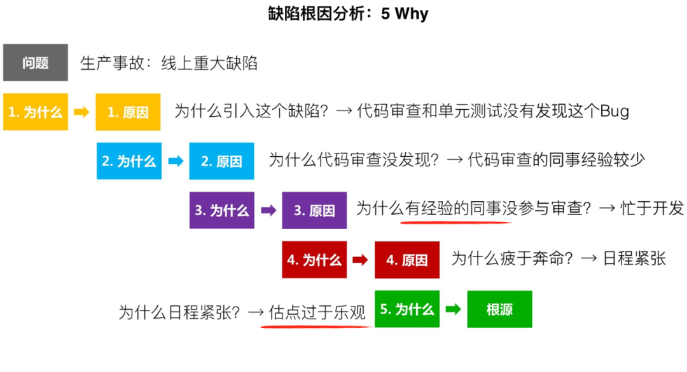

# Bug

## [Bug Report](https://mp.weixin.qq.com/s/OVqTsk6OJ_xi5Q4iWtKkUg)

* 为什么要做bug分析
  - bug越早被发现并修正，所消耗的资源越少
  - 通过对现有的bug进行分析，找到bug产生的根因以及流程上的不足，并思考如何从各个方面去优化改进，可以进行bug预防，把控质量风险，提升产品质量。
* 怎么做bug分析
  - 记录bug: 记录的维度越广泛，对之后的数据分析就越有利
  - 分析什么:需要确定分析维度。针对不同的项目，分析维度也不尽相同。一般情况下，比较常见的分析维度如下：bug分类、bug趋势、bug状态流转效率、多个周期对比
* 分类分析:包括功能模块、引入时机、bug类型、优先级、严重性、产生原因等。首先介绍bug分类统计的规则，一般来说会按照不同维度来分类，而每个维度下面又可以分为多个不同的属性值
* 趋势分析:包括每日新增、每日关闭、累计活跃、累计关闭、bug总数、严重bug占比、反复打开bug占比等
* 状态流转效率分析|效能分析:通过bug状态的时长分布，可以分析bug状态流转的时效
* 根因分析
  - 5Why：比较适合原因单一的问题，通过刨根问底可以找到根本原因。
  - 5M1E：比较适合成因复杂的问题，可以通过多个维度进行综合分析，找出可以改进的方面
* 统计数据的变化趋势要比绝对值更重要。相对于绝对值，变化趋势更能体现出被统计数据的动态过程
* 最终目的
  - 通过根因分析，发现bug产生的根源，及早采取调整和控制措施，继而对现有方法和流程进行优化，预防和控制问题的蔓延和新问题的产生
  - 使用统计分析方法，通过bug的共性发现软件生命周期中技术、人员、过程、项目和组织存在的问题，揭示软件质量、过程质量、人员能力、组织能力之间的关系，加强软件精细化管理，促进人、过程、组织持续性改进
  - 通过对每一个迭代周期进行持续的bug分析，也可验证我们之前的action是否有效，进而做到持续优化

## 工具

* [Bugzilla](https://www.bugzilla.org/)
