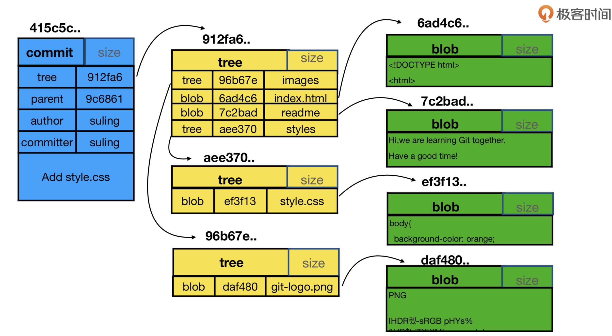
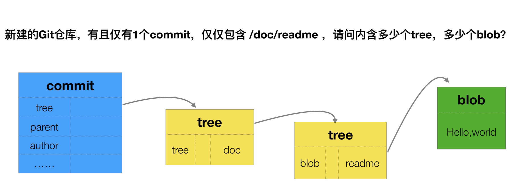
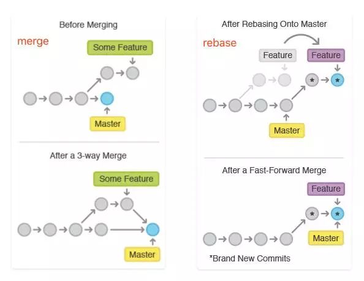

# [git/git](https://github.com/git/git)

fast, scalable, distributed revision control system. https://git-scm.com/

## 服务

* [GitHub](https://github.com/)
* [Bitbucket](https://bitbucket.org/product)
* [Gitlab](https://gitlab.com/)
  - [gitlabhq/gitlabhq](https://github.com/gitlabhq/gitlabhq):GitLab CE Mirror | Please open new issues in our issue tracker on GitLab.com https://about.gitlab.com/getting-help/
* [码云](https://gitee.com)
* [Coding](https://coding.net)  <https://arsenal.coding.net/p/coding-demo>
* [sourceforge](https://sourceforge.net/):The Complete Open-Source Software Platform
* [backlog](https://backlog.com/):Online project management tool for developers
* [gogits/gogs](https://github.com/gogits/gogs):Gogs is a painless self-hosted Git service. https://gogs.io
* [go-gitea/gitea](https://github.com/go-gitea/gitea):Gitea: Git with a cup of tea http://gitea.io
* [工蜂](https://git.code.tencent.com)
* [GitKraken](https://www.gitkraken.com/)

## 安装

```sh
sudo apt-get install git # Ubuntu 18.04 or Debian 9
sudo yum install git # CentOS
sudo dnf install git # Fedora

brew install git
brew install git-flow
brew install git && brew install bash-completion

# Add bash-completion to your ~/.bash_profile or ~/.zshrc
if [ -f $(brew --prefix)/etc/bash_completion ]; then
  . $(brew --prefix)/etc/bash_completion
fi
```

## 配置

* 优先级：local > global(用户) > system
  - 全局配置
    + `/etc/gitconfig`
    + ubuntu:`~/.gitconfig`
  - 系统配置：`git config --system`
  - 项目配置：`git local --system` project/.git/config   `git config`
* alias
  + prune = fetch --prune - 当在其他人将分支推送到远程仓库时，我也会得到了大量的本地分支。Prune可以删除远端已经删除的任何本地分支。
  + undo = reset --soft HEAD ^ - 如果我在做出提交时犯了一个错误，这个命令会把代码恢复到提交之前的样子。通常我只是在这种情况下修改现有的提交，因为它保留了提交信息。
  + stash-all = stash save --include-untracked - 当你正在开发，有人临时要求你切换分支时，stash 是非常有用的。这个命令确保当你 stash 时，可以记录没有被 git add 的新文件。
  + merge
    + ff = only 确保只有在每一个合并都是 fast-forward 的时候，你才会看到报错。否则只要你配置了这个选项，什么合并提交，什么历史记录，通通都不需要，只是两次提交之间的平滑过渡。你可能会想知道如何完成这项工作。答案是用 git rebase，把一个分支的修改合并到当前分支，它非常有用当我 pull 代码与 master 有冲突的时候，我使用这种方式来处理。当你在本地分支上修改后，同时其他人在 master 上 做了修改，我想这样比你直接 merge 到你本地分支时的 commit 更好。这样你可以避免多出一个 merge 的 commit。如果我打算新建一个merge commit，我可以用明确的 git merge -ff 来创建。
  + commit
    + gpgSign = true 确保您的所有 commit 都由你的 GPG 密钥签名。这通常是一个好主意，因为 .gitconfig 文件中没有验证您的用户信息，这意味着看起来像您这样的提交可能会轻松显示在其他人的提交 信息中。事实上，我曾经用过别人的凭据，因为帐户和机器配置耗时太长。我的提交请求是通过别人的帐号提交的，但内部的所有提交都是我的真实账号。将你的 GPG key 添加到 Github并尝试一次提交，你可能就会解决你现在的疑问，您提交内容将会有一个"已验证"标记。
    + 如果您有多个 GPG 密钥，可以使用 user.signingKey 选项指定要使用的密钥。
    + 上述的配置在 GUI 工具里不会生效，你需要在工具里的设置里找配置项。
    + gpg-agent可以保存口令，让我们更方便。
  + Push
    + default = simple可能是你已经设置的配置项。它可以更轻松地将您的本地分支推送到远程，当二者分支名一样的时候。
    + followTags = true很简单。配置它以后，当你 git push 的时候可以直接将本地的 tags 提交到远程，而不用每次都加参数 --follow-tags。不知道你是不是和我一样，我如果创建了一个tag，我就基本上一定会将它推到远程的。

```sh
git --version
man git # Git User Manual

git config --global|--system|--local --list[-l]|--edit[-e]|--add|--get|--unset

git config --global user.name "name"
git config --global user.email "email"
git config --global color.ui "auto"
git config --global core.editor "vim" # 设置编辑器为 vim
git config --global credential.helper osxkeychain
git config --global core.excludesfile ~/.gitignore
git config --global mergetool.sublime.cmd "subl -w \$MERGED"
git config --global mergetool.sublime.trustExitCode false
git config --global merge.tool sublime | vimdiff
git config --global diff.submodule log
git config status.submodulesummary 1　# show you a short summary of changes to your submodules
git config --global rebase.autoStash true

git config --unset --local user.name
git mergetool -y

echo .DS_Store >> ~/.gitignore

git config --global alias.lg "log --color --graph --pretty=format:'%Cred%h%Creset -%C(yellow)%d%Creset %s %Cgreen(%cr) %C(bold blue)<%an>%Creset' --abbrev-commit --"
git config --global alias.ls 'log --name-status --oneline --graph'
git config --global alias.st 'status --porcelain'
```

## 传输协议

* SSH:需保证remote的源为git方式
  - 支持使用RSA密钥来鉴权,RSA是一种非对称的加密算法，公钥负责加密，私钥负责解密
    + 公钥：保存在服务器或者平台配置里面（github账户）
    + 私钥：保存在个人电脑中
  - 存储路径 `~/.ssh/`
  - GPG
    + 为提交内容添加一个"已验证"标记
    + 与SSH配合使用，都添加到GitHub中
    + bitbucket不支持gpg添加密钥
* HTTP(S)

```sh
ssh-keygen -t rsa -b 4096 -C "your_email@example.com" -f ~/.ssh/github # github添加key诸侯，提交默认会检查id_rsa
ssh-add -K ~/.ssh/github # 如果不是默认密钥 id_rsa ，则需要以下命令注册密钥文件，-K 参数将密钥存入 Mac Keychain
cat ~/.ssh/github.pub # 添加公钥到服务器

ssh -T git@github.com  # 验证
ssh -v bluebird89@github.com

brew install ssh-copy-id
ssh-copy-id -i ~/.ssh/tatu-key-ecdsa user@host

cat ~/.ssh/id_rsa.pub | ssh demo@198.51.100.0 "mkdir -p ~/.ssh && chmod 700 ~/.ssh && cat >>  ~/.ssh/authorized_keys"

sudo nano /etc/ssh/sshd_config

PermitRootLogin without-password
sudo systemctl reload sshd.service

eval "$(ssh-agent -s)"
ssh-add -K ~/.ssh/id_rsa

# ~/.ssh/config:
Host *
  AddKeysToAgent yes
  UseKeychain yes
  IdentityFile ~/.ssh/id_rsa

# 多个ssh
git:http://01810661@gitlab.smgtech.net

# 配置github.com
Host github.com
    HostName github.com
    IdentityFile C:\Users\Administrator\.ssh\id_rsa
    PreferredAuthentications publickey
    User git

# 配置gitlab.smgtech.net
Host gitlab.smgtech.net
    HostName gitlab.smgtech.net
    IdentityFile C:\Users\Administrator\.ssh\smt
    PreferredAuthentications publickey
    #User 01810661

# 用cmder无效
github
# Couldn't agree a key exchange algorithm (available: curve25519-sha256@libssh.org,ecdh-sha2-nistp256,ecdh-sha2-nistp384,ecdh-sha2-nistp521)

# GPG
sudo apt-get install gnupg # Debian / Ubuntu 环境
yum install gnupg # Fedora 环境
brew install gpg

gpg --help|version

gpg --full-generate-key # 4096
gpg --gen-key # 2048

gpg -K
gpg --list-keys
gpg --list-secret-keys --keyid-format LONG  # list GPG keys for which you have both a public and private key. A private key is required for signing commits or tags.

sec   4096R/3AA5C34371567BD2 2016-03-10 [expires: 2017-03-10] # GPG key ID is 3AA5C34371567BD2
uid                          Hubot # 用户ID Henry Lee <liboming88@yeah.net>
ssb   4096R/42B317FD4BA89E7A 2016-03-10

git config --global user.signingkey 3AA5C34371567BD2 # git配置,commit生效
git config --global commit.gpgsign true
git config --global user.email "kend56@qq.com"

gpg --armor --export 3AA5C34371567BD2 | Hubot  # get the public key,add to github

git commit -S -m your commit message
git tag -s -m "GPG-sign tag"
git tag -u "886C8FB9" -s v0.0.1 -m "说明"

git log --show-signature # 查看本地commit有签名

gpg --delete-key [用户ID] # 删除密钥

gpg --recipient [用户ID] --output demo.en.txt --encrypt demo.txt
gpg --decrypt demo.en.txt --output demo.de.txt

gpg --sign demo.txt #签名
```

## Git VS SVN

* 版本控制系统（VCS: Version Control System）：提供记录和追溯变更的能力
  - 图片，视频这些二进制文件，但没法跟踪文件的变化，只能把二进制文件每次改动串起来，也就是知道图片从1kb变成2kb，但是到底改的内容没法记录
* SVN：集中式版本控制系统，版本库是集中放在中央服务器
  - 每次记录哪些文件作了更新、更新哪些行的内容
  - 要从中央服务器得到最新的版本
  - 做完的活推送到中央服务器
  - 有本地仓库，必须联网才能工作
  - 每个分支都要放在不同的目录中
* Git 分布式版本控制系统
  - 记录文件快照
  - 没有中央服务器，每个人电脑就是一个完整的版本库
  - 可以在同一个目录中切换不同分支

## 原理

* 基于时间点的快照：将提交点指向提交时的项目快照
* HEAD:的是当前分支最末梢最新的一个提交
* 对代码的任何修改，最终都会反映到 commit 上面去。创建和保存项目的快照及与之后的快照进行对比
* 维护的就是一个commitID树，分别保存着不同状态下的代码
* objects 目录下有 3 种类型的数据： `git cat-file -p`
  - Blob 文件
  - Tree 文件夹
  - Commit 创建的提交节点 整合了 tree 和 blob 类型，保存了当前的所有变化
* sdf
  - `config` 配置文件
  - `description` 仅供 Git Web 程序使用的描述
  - `HEAD`  当前被检出分支
  - `index` 暂存区信息
  - `hooks/`  客户端或服务端的钩子脚本（hook scripts）
  - `info/` 全局性排除（global exclude）文件，不希望被记录在 .gitignore 文件中的忽略模式（ignored patterns）
  - `objects/`  所有数据内容
  - `refs/` 数据（分支）的提交对象的指针




<!--  图片待修复-->

```sh
# git add 原理
touch test.txt
git hash-object -w test.txt # e69de29bb2d1d6434b8b29ae775ad8c2e48c5391
ls -R .git/objects
# .git/objects/e6:
# 9de29bb2d1d6434b8b29ae775ad8c2e48c5391
git cat-file -p e69de29bb2d1d6434b8b29ae775ad8c2e48c5391 # 什么也看不到

echo 'hello world' > test.txt
git hash-object -w test.txt # 3b18e512dba79e4c8300dd08aeb37f8e728b8dad
git cat-file -p 3b18e512dba79e4c8300dd08aeb37f8e728b8dad #  查看原文件内容 hello world fatal: Not a valid object name 7db03de997c86a4a028e1ebd3a1ceb225be238

.
└── .git
    ├── HEAD  # 存储的是当前所在的位置，其内容是分支的名称
    ├── branches
    ├── config # 创建的远端，分支都在等信息都在配置文件里有表现；fetch 操作的行为也是在这里配置的
    ├── description
    ├── hooks
    │   ├── applypatch-msg.sample
    │   ├── commit-msg.sample
    │   ├── fsmonitor-watchman.sample
    │   ├── post-update.sample
    │   ├── pre-applypatch.sample
    │   ├── pre-commit.sample
    │   ├── pre-push.sample
    │   ├── pre-rebase.sample
    │   ├── pre-receive.sample
    │   ├── prepare-commit-msg.sample
    │   └── update.sample
    ├── index
    ├── info
    │   └── exclude
    ├── objects # 通过一种算法可以得到任意文件的 “指纹”（40 位 16 进制数字），然后通过文件指纹存取数据，存取的数据目录 git hash-object test.txt 命令来看看创建的 test.txt 的 “文件指纹”：
    │   ├── .DS_Store
    │   ├── info
    │   └── pack
    └── refs # 引用文件，如本地分支，远端分支，标签等
        ├── heads
        └── tags
```

### 工作区（Workspace）working directory

* 开发改动的地方，任何对象都是在工作区中诞生和被修改
* 文件状态：modified
* git add 保存对象
  - git add添加文件的相关信息(文件名、大小、timestamp...)，不保存文件实体, 通过id指向每个文件实体
  - `git hash-object -w test.txt`:每次add的文件中的每一个文件压缩成二进制文件，存入 Git。压缩后的二进制文件，称为一个 Git 对象，保存在.git/objects目录
  - `git cat-file -p hashId`: 查看 hash 文件内内容
  - 暂存区:`git update-index`:在暂存区记录一个发生变动的文件
  - `git ls-files --stage`:显示暂存区当前的内容
  - 相同的文件只会存一个blob，不同的commit的区别是commit、tree和有差异的blob
* 数据结构
  - 绿色的5位字符表示提交的ID，分别指向父节点
  - 分支用橘色显示，分别指向特定的提交。当前分支由附在其上的HEAD标识
* 撤销工作区文件修改:
  - git checkout -- [filename]`用于从历史提交（或者暂存区域）中拷贝文件到工作目录,工作区的文件变化一旦被撤销，就无法找回了
  - `git checkout .` 把被「修改」的文件恢复成stage的状态. 如果新增了新文件，是不会删除新文件的
  - `git checkout HEAD -- files`:回滚到最后一次提交。跳过暂存区域直接从仓库取出文件
  - `git checkout HEAD~ foo.c`:会将提交节点HEAD~中的foo.c复制到工作目录并且加到暂存区域中
  - detached HEAD（被分离的HEAD标识）:既没有指定文件名，也没有指定分支名，而是一个标签、远程分支、SHA-1值或者是像master~3类似的东西，就得到一个匿名分支
    + 方便地在历史版本之间互相切换。`git checkout v1.6.6.1`
    + 当HEAD处于分离状态（不依附于任一分支）时，提交操作可以正常进行，但是不会更新任何已命名的分支.一旦此后切换到别的分支，比如说master，那么这个提交节点（可能）再也不会被引用到，然后就会被丢弃掉
    + 如果想保存这个状态，可以用命令git checkout -b name来创建一个新的分支
* 撤销提交:`git revert HEAD`:在当前提交后面，新增一次提交，抵消掉上一次提交导致的所有变化。它不会改变过去的历史，所以是首选方式，没有任何丢失代码的风险
  - 想抵消多个提交，必须在命令行依次指定这些提交
  - `--no-edit`：执行时不打开默认编辑器，直接使用 Git 自动生成的提交信息
  - `--no-commit`：只抵消暂存区和工作区的文件变化，不产生新的提交
* 从stage区还原出来:`git reset [last good SHA]` 让最新提交的指针回到以前某个时点，该时点之后的提交都从历史中消失
  - `--mixed`（默认）：更改引用的指向，不改变工作区的文件（但会改变暂存区）.想找回那些丢弃掉的提交，可以使用`git reflog`
  - `--hard`:更改引用的指向;替换暂存区内容和引用指向的目录树一致;替换工作区内容和暂存区一致，也和HEAD所指向的目录树内容相同
  - `--soft`:更改引用的指向，不改变暂存区和工作区
  - `--keep`:更改引用的指向，不改变工作区
  - 没有给出提交点的版本号，默认用HEAD。这样，分支指向不变，但是索引会回滚到最后一次提交
  - 如果给了文件名(或者 -p选项), 那么工作效果和带文件名的checkout差不多，除了索引被更新
* 从暂存区撤销文件: `git rm --cached [filename]`


```sh
git init --bare # 远程仓库文件构建
git init [project-name] # 初始化git仓库 在当前目录内新建一个Git代码库，会生成.git文件，用于新建空项目文件或者将项目添加git管理，默认URL文件名称，也可以自定义project-name

git clone [--recurse-submodules]  [url] [project-name] # 下载一个项目和它的整个代码历史,支持多种协议
git clone http[s]://example.com/path/to/repo.git/
git clone ssh://example.com/path/to/repo.git/
git clone [user@]example.com:path/to/repo.git/
git clone username@host:/path/to/repository
git clone git://example.com/path/to/repo.git/
git clone /opt/git/project.git
git clone file:///opt/git/project.git
git clone ftp[s]://example.com/path/to/repo.git/
git clone rsync://example.com/path/to/repo.git/
git clone -o jQuery https://github.com/jquery/jquery.git # 所使用的远程主机自动命名为origin。如果想自定义主机名，需要用-o选项指定
git clone --depth=1 https://github.com/rwv/chinese-dos-games.git
git clone -b v1.21.0 https://github.com/grpc/grpc

# 从远程仓库中克隆一个特定的分支
git init
git remote add url origin
git checkout -b com.mt365 origin/com.mt365
git checkout -b core/bugfixes/urgent     origin/core/bugfixes/urgent

git stutus -s(short) # 查看本地的代码状态,上次提交更新后的更改或者写入缓存的改动

git add . # add all new and edit file, not include delete file
git add <file1>(<file2> <file3>)|[dir] #（所有文件/单个文件 或通过使用通配符）写入缓存区
git add -p # 添加每个变化前，都会要求确认,对于同一个文件的多处变化，可以实现分次提交
git add -A # 添加所有变化（新增 new、修改 modified、删除 deleted）到暂存区
git add -u # 添加修改(modified)和被删除(deleted)文件，不包括新文件(new)也就是不是被追踪文件（untracked）
git add -p <file> # 添加文件内某些改动到暂存区

git mv [file-original] [file-renamed]  # 改名文件，并且将这个改名放入暂存区

git rm [file1] [file2] ... # 从已跟踪文件和工作区中移除某个文件 并且将这次删除提交暂存区
git rm --cached [file]  # 把文件从暂存区移除但工作区保留
git rm -f <file> # 如果已修改并提交到暂存区

git diff # 显示暂存区和工作区的差异
git diff -- <fileName> # 未缓存的所有或者单个文件的改动
git diff --cached <fileName> # 暂存区和 HEAD 的文件差异
git diff --staged # 暂存区与最新一次提交之间的差别
git diff HEAD # 已缓存的与未缓存的所有改动 HEAD：最后一次提交,HEAD^^:前两次提交 HEAD~3：前三次提交
git diff --stat # 显示摘要而非整个
git diff [first-branch]...[second-branch]  -- fileName # 显示两次提交之间的差异
git diff --shortstat "@{0 day ago}" # 显示今天你写了多少行代码
git diff HEAD@{'2 months ago'}
git diff HEAD@{yesterday}
git diff HEAD@{'2010-01-01 12:00:00'}

git diff branch_1..branch_2 # Find the diff between the tips of the two branches
git diff branch_1...branch_2 # Produce the diff between two branches from common ancestor
git diff branch1:file branch2:file # Comparing files between branches

# Reset the index to match the most recent commit soft(commit)< mixed<(commit + add)< hard(commit+add + local working)
git reset HEAD -- [file] # 撤销文件跟踪，重置暂存区的指定文件，与上一次commit保持一致，但工作区不变,
git reset commit # 重置当前分支的指针为指定commit，同时重置暂存区，但工作区不变 会将提交记录回滚，代码不回滚
git reset --mixed HEAD # 缺省参数，将HEAD变了，文件目录没有变，取消了commit和add的内容
git reset --soft "HEAD~n"  # 取消commit的内容
git commit --amend # 合并 commit
git reset --hard <b14bb52> # 重置暂存区与工作区，与上一次commit保持一致 会将提交记录和代码全部回滚 重置当前分支的HEAD为指定commit，同时重置暂存区和工作区，与指定commit一致
git reset --keep [commit] # 重置当前HEAD为指定commit，但保持暂存区和工作区不变
git reset HEAD~1 # Undo last commit
git reset –hard HEAD^ | HEAD^^ | HEAD~100 # 回退版本
git reset –hard dc5f1d1 # 只要记得版本号就可以穿梭回到现代
git reset . # 已提交至暂存区的文件 此类文件的状态为 Changes to be

git revert [commit]|HEAD # 回退到某个提交，不删除commit,会产生新提交

# 移除没有track文件
git clean -f     # remove untracked files
git clean -fd    # remove untracked files/directories
git clean -nfd   # list all files/directories that would be removed

# 冲突
git add <文件名> # # 标记为解决状态加入暂存区
git mergetool <文件名>  # Mac 系统下，运行 默认的是 FileMerge

git checkout . # 提交过版本库，但未提交至暂存区的文件（未执行 git add) 此类文件的状态为 Changes not staged for commit
git checkout -- files # 丢弃 1.工作区中未提交暂存区修改（与版本库一致） 2.已提交暂存区新的修改（与暂存区一致）
git checkout [file]  # 使用HEAD中的最新内容替换工作区中的文件，以添加到暂存区改动与新文件不受到影响，会删除该文件没有暂存和提交的改动，不可逆
git checkout [commit] [file] # 恢复某个commit的指定文件到暂存区和工作区
git checkout origin/master -- path/to/file # 丢弃工作区的修改
git checkout  branchname/ remotes/origin/branchname  / 158e4ef8409a7f115250309e1234567a44341404 / HEAD

git update-index --assume-unchanged <file>Resume tracking files with:
git update-index --no-assume-unchanged <file>
```

### 暂存区（Index/Stage）:

* 任何修改都是从进入index区才开始被版本控制
* .git目录下的index文件, 暂存区会索引
* reset:重置 commit 版本
* 文件状态：staged:Stage(Index)
* `git commit`
  - `git write-tree`:将当前的目录结构，生成一个 Git 对象,目录结构也是作为二进制对象保存的，也保存在.git/objects目录里面
  - `echo "first commit" | git commit-tree hashId`  将目录树对象写入版本历史, 生成hashId
    + `echo "second commit" | git commit-tree 1552fd52bc14497c11313aa91547255c95728f37 -p c9053865e9dff393fd2f7a92a18f9bd7f2caa7fa`: 更新需要关系父节点
  - `git log --stat hashID` 查看某个快照信息,没有记录这个快照属于哪个分支
  - 更新分支指针 `echo 785f188674ef3c6ddc5b516307884e1d551f53ca > .git/refs/heads/master`
* commit:提交到history，生成上次提交的状态与当前状态的差异记录（也被称为revision）,系统会根据修改的内容计算出没有重复的40位英文及数字来给提交命名
  - p, pick = use commit
  - r, reword = use commit, but edit the commit message
  - e, edit = use commit, but stop for amending
  - s, squash = use commit, but meld into previous commit 有多个commit信息
  - f, fixup = like "squash", but discard this commit's log message
  - x, exec = run command (the rest of the line) using shell
  - d, drop = remove commit
* 更改上次提交：`git commit --amend ""`,会使用与当前提交相同的父节点进行一次新提交，旧的提交会被取消
* 合并多个commit：把 HEAD 移到了17bd20c这个commit（reset），而且不会修改work dir中的数据，add再commit
* stash:还未提交的修改内容以及新添加的文件，留在索引区域或工作树的情况下切换到其他的分支时，修改内容会从原来的分支移动到目标分支
  - 如果在checkout的目标分支中相同的文件也有修改，checkout会失败的。这时要么先提交修改内容，要么用stash暂时保存修改内容后再checkout
* merge 命令把不同分支合并起来。合并前，索引必须和当前提交相同。
    - 如果另一个分支是当前提交的祖父节点，那么合并命令将什么也不做。
    - 如果当前提交是另一个分支的祖父节点，就导致fast-forward合并。指向只是简单的移动，并生成一个新的提交。
    - 一次真正的合并。默认把当前提交(ed489 如下所示)和另一个提交(33104)以及他们的共同祖父节点(b325c)进行一次三方合并。结果是先保存当前目录和索引，然后和父节点33104一起做一次新提交。
    - merge的特殊选项squash：选项指定分支的合并，就可以把所有汇合的提交添加到分支上
* Commit Message 格式
  - type: commit 的类型
    + feat: 新特性
    + fix: 修改问题
    + refactor: 代码重构
    + docs: 文档修改
    + style: 不影响代码含义的变化（空白，格式化，缺少分号等）, 不仅是 css 修改
    + test: 添加缺失测试或更正现有测试
    + chore: 其他修改, 比如构建流程, 依赖管理.
    + build:影响构建系统或外部依赖关系的更改（示例范围：gulp，broccoli，npm）
    + ci:更改持续集成文件和脚本（示例范围：Travis，Circle，BrowserStack，SauceLabs）
    + perf:改进性能代码更改
  - scope: commit 影响的范围, 比如: route, component, utils, build...
  - subject: commit 的概述, 建议符合  50/72 formatting
  - body: commit 具体修改内容, 可以分为多行, 建议符合 50/72 formatting
  - footer: 一些备注, 通常是 BREAKING CHANGE 或修复的 bug 的链接
  - [Conventional Commits](https://conventionalcommits.org/)
  - git-cz：在本地进行提交信息的规范化

```sh
# 每个 commit 都是一份完整的代码状态，用一个 commitID 来唯一标志.进行一次包含最后一次提交加上工作目录中文件快照的提交
git commit -m "commit message" # 将缓存区内容添加到仓库中,在命令行中添加提交注释
git commit [file1] [file2] ... -m [message]
git commit -a # 把unstaged文件变成staged(不包括新建文件)，然后commit
git commit –am "message" # git add . + git commit -m 'message' 合并使用,只提交修改
git commit -v # 提交时显示所有diff信息
git commit --amend [file1] [file2] ... # 修改上一次提交日志 使用一次新的commit，替代上一次提交,如果代码没有任何新变化，则用来改写上一次commit的提交信息

git commit -m "fix(core): remove deprecated and defunct wtf* apis" -m "These apis have been deprecated in v8, so they should stick around till v10, but since they are defunct we are removing them early so that they don't take up payload size." -m "PR Close #33949"

# message 格式
# 第1行：提交修改内容的摘要
# 第2行：空行
# 第3行以后：修改的理由
<type>(<scope>): <subject>
<BLANK LINE>
<body>
<BLANK LINE>
<footer>

# 在开发中的时候尽量保持一个较高频率的代码提交，这样可以避免不小心代码丢失。但是真正合并代码的时候，我们并不希望有太多冗余的提交记录.压缩日志之后不经能让 commit 记录非常整洁，同时也便于使用 rebase 合并代码。
git log -p --submodule <file> # 跟踪查看某个文件的历史修改记录 每一次提交是一个快照，会计算每次提交的diff，作为一个patch显示
git log [branchname]
master..develop
--oneline #  --pretty only show the commit id and comment per-commit
--graph # gives you that visual representation The * indicates that there is a commit on the line
--pretty=format:"%Cred%an - %ar%n %Cblue %h -%Cgreen %s %n"
--decorate # 显示tag信息
--reverse # 逆向显示
--all
--author="Linus"
--since="yesterday"
--before={3.weeks.ago}
--after={2010-04-18}
--grep="day of week" # 根据commit过滤log，与其它选项是or的关系，如果and关系 --all-match的选项
--stat # 查看改动的相对信息
-G "chef-client" # Regex on Commits
-p # show the log with the diff changes
--no-merges # 显示当前分支的版本历史
--abbrev-commit  # （仅展示commit信息的图形化分支）
-S[keyword]  # 搜索提交历史，根据关键词 git log -Smethodname
--name-status
--merges
-i # show the log with the diff changes

git log --graph --pretty=format:'%C(yellow)%h%Creset -%C(cyan)%d%Creset %s %Cgreen(%an, %cr)' --abbrev-commit --name-status --oneline --decorate --all
git config --global alias.ll "log --graph --pretty=format:'%C(yellow)%h%Creset -%C(cyan)%d%Creset %s %Cgreen(%an, %cr)' --abbrev-commit"
%H  commit hash
%h  commit short hash
%T  tree hash
%t  tree short hash
%P  parent hash
%p  parent short hash
%an 作者名字
%aN .mailmap 中对应的作者名字
%ae 作者邮箱
%aE .mailmap 中对应的作者邮箱
%ad –date=制定的日期格式
%aD RFC2822 日期格式
%ar 日期格式，例如：1 day ago
%at UNIX timestamp 日期格式
%ai ISO 8601 日期格式
%cn 提交者名字
%cN .mailmap 对应的提交的名字
%ce 提交者邮箱
%cE .mailmap 对应的提交者的邮箱
%cd –data=制定的提交日期的格式
%cD RFC2822 提交日期的格式
%cr 提交日期的格式，例如：1day ago
%ct UNIX timestamp 提交日期的格式
%ci ISO 8601 提交日期的格式
%d  ref 名称
%e  encoding
%s  commit 信息标题
%f  过滤 commit 信息的标题使之可以作为文件名
%b  commit 信息内容
%N  commit notes
%gD reflog selector, e.g., refs/stash@{1}
%gd shortened reflog selector, e.g., stash@{1}
%gs reflog subject
%Cred   切换至红色
%Cgreen 切换至绿色
%Cblue  切换至蓝色
%Creset 重设颜色
%C(color)   制定颜色，as described in color.branch.* config option
%m  left right or boundary mark
%n  换行
%%  a raw %
%x00    print a byte from a hex code
%w([[,[,]]])    switch line wrapping, like the -w option of git-shortlog(1).

git shortlog -sn # 显示提交记录的参与者列表
git log -n3 # 查看最近的三次提交
git log branch1 ^branch2 # 查看在分支1不在分支2的log

git log [tag] HEAD --pretty=format:%s   # 显示某个commit之后的所有变动，每个commit占据一行
git log [tag] HEAD --grep feature  # 显示某个commit之后的所有变动，其"提交说明"必须符合搜索条件
git log --follow [file]  # 显示某个文件的版本历史，包括文件改名
git log --name-status --oneline
git log -p FILE # 查看 README.md 的修改历史
git log -S'stupid'  # 搜索修改符合 stupid 的历史
git log ..BRANCH # 这个命令返回某个非 HEAD 分支的提交记录

#  使用 git reset --hard commitID 把本地开发代码回滚到了一个之前的版本，而且还没有推到远端，怎么才能找回丢失的代码呢？
#  你如果使用 git log 查看提交日志，并不能找回丢弃的那些 commitID。
#  git reflog 却详细的记录了你每个操作的 commitID，可以轻易的让你复原当时的操作并且找回丢失的代码。
#   git relog 在你将变化提交之前，可以帮助你回到任何修改之前，包括 git reset。但是 reflog 只是保存在本地，而且不是永久保存，有一个可以配置的过期时间。
git reflog # 用来记录引用变化的一种机制,比如记录分支的变化或者是HEAD引用的变化，git会将变化记录到HEAD对应的reflog文件中，其路径为 .git/logs/HEAD， 分支的reflog文件都放在 .git/logs/refs 目录下的子目录中

git whatchanged [file]  # 显示某个文件的版本历史，包括文件改名
git shortlog -sn  # 显示所有提交过的用户，按提交次数排序

git show [commit] # 显示某次提交的元数据和内容变化
git show --name-only [commit] # 显示某次提交发生变化的文件
git show [commit]:[filename] # 显示某次提交时，某个文件的内容

git blame filename # 文件每行修改的 commit 的哈希标签、作者和提交日期

git stash # 将当前目录和index中的所有改动(但不包括未track的文件)临时存放在 stash 队列中,注意：未提交到版本库的文件会自动忽略，只要不运行 git clean -fd . 就不会丢失
git stash save "stash name"
git stash save --keep-index    # stash only unstaged files
git stash list # 查看 stash 队列中已暂存了多少 WIP

git stash apply # 恢复stash中上一个（stash@{0}）内容到工作区，但是并不删除stash中的内容
git stash apply stash@{num} # 恢复指定编号的 WIP，但不从队列中移除
git stash drop # 删除stash中上一个

git stash pop # 恢复上一次的 WIP 状态，并从队列中移除
git stash pop stash@{num} # 恢复指定编号的 WIP，同时从队列中移除

git stash clear # 删除所有

pick   7735d66 update #合并到该commit上
squash bbe6d53 update
squash 9eb3188 update
squash 7d33868 update
```

### 版本库|本地仓库（commit history）

* `.git`文件夹。保存了对象被提交过的各个版本，只有把修改提交到本地仓库，该修改才能在仓库中留下痕迹；
* 包括git自动创建的master分支，并且将HEAD指针指向master分支
* 文件状态：committed
* 每个commit都有一个唯一的 Hash 值
* 通过git log命令来查看

* merge:保持修改内容的历史记录，但是历史记录会很复杂
  - fast-forward:bugfix分支的历史记录包含master分支所有的历史记录，所以通过把master分支的位置移动到bugfix的最新分支上，Git 就会合并
* rebase:历史记录简单，是在原有提交的基础上将差异内容反映进去。因此，可能导致原本的提交内容无法正常运行
  - 待合并分支rebase主分支
  - 主分钟merge待合并分支
* 流程
  - 在topic分支中更新merge分支的最新代码，请使用rebase。
  - 向merge分支导入topic分支的话，先使用rebase，再使用merge
* branch name should be descriptive

```sh
git branch -r|a # 列出所有远程/所有分支，不带参数时列出本地分支
git branch -av # 查看所有分支（包括远程分支）和最后一次提交日志
git branch –merged & git branch –no-merged # 返回已合并分支列表或未合并的分支列表
git branch –contains SHA # 返回包含某个指定 sha 的分支列表

git branch <new-branch> <old-branch>|[commit] # 新建分支，不带old-branch为默认在当前分支上建立新分支 但依然停留在当前分支
git branch --track [branch] [remote-branch] # 新建一个分支，与指定的远程分支建立追踪关系
git branch repair remotes/origin/master
git checkout -b newBrach origin/master|[tag] # 在origin/master的基础上，创建一个新分支，并切换到new分支
git checkout dev # 切换
git checkout - # 切换到上一个分支

git branch -m new # Rename current branch
git branch -m old new  # Rename branch locally

git branch -d [branch-name] # 删除已合并分支
git branch -D branchName # 删除分支

# 通过二分搜索的方式来帮助你定位到引入 bug 的 commit。
git bisect start
git bisect good
git bisect bad # Find bug in commit history in a binary search tree style

git --git-dir=/.git format-patch -k -1 --stdout  | git am -3 -k # 将另一个不相关的本地仓库的提交补丁应用到当前仓库

git filter-branch --prune-empty --subdirectory-filter  master # 将Git仓库中某个特定的目录转换为一个全新的仓库

git rm filename # 从 HEAD 中删除文件
git rm –cached FILE # 这个命令只删除远程文件
```


## 分支（branch）

* 指向某个快照的指针，分支名就是指针名
* 分支会自动更新，如果当前分支有新的快照，指针就会自动指向它
* HEAD:总是指向当前分支的最近一次快照
* 切换分支:当不指定文件名，给出一个（本地）分支时，那么HEAD标识会移动到那个分支，暂存区域和工作目录中的内容会和HEAD对应的提交节点一致
  - 新提交节点（下图中的a47c3）中的所有文件都会被复制（到暂存区域和工作目录中）
  - 只存在于老提交节点（ed489）中的文件会被删除
  - 不属于上述两者的文件会被忽略，不受影响保留

### 远程分支

* pull:远程数据库的内容就会自动合并，=fetch+merge
  - -rebase # 将当前分支的版本追加到从远程 pull 回来的节点之后
  - --continue # 若发生冲突，则按以上其他方法进行解决，解决后继续
  - --skip # 若多次提交修改了同一文件，可能需要直接跳过后续提交，按提示操作即可
* fetch:取得远程数据库的最新历史记录到本地
* merge 处理冲突更直接
* rebase 合并分支，重写历史
  - 合并分支，但是不合并提交记录（commit）
  - rebase合并如果有冲突则一个一个文件的去合并解决冲突,能够保证清晰的 commit 记录。
  - 变基会通过在原来的分支中为每次提交创建全新提交来重写项目历史。变基的主要好处在于你会得到一个更加整洁的项目历史
  - rebase 先找出共同的祖先节点
  - 从祖先节点把功能分支的提交记录摘下来，然后 rebase 到 master 分支
  - rebase 之后的 commitID 其实已经发生了变化
* deploy your changes to verify them in production.If your branch causes issues, you can roll it back by deploying the existing master into production.

```sh
git config get --remote.origin.url
git remote [-v] # 列出所有的仓库地址
git remote show [remote] # 显示远程仓库信息

git remote add origin git@github.com:han1202012/TabHost_Test.git # 本地git仓库关联GitHub仓库
git remote set-url origin git@github.com:whuhacker/Unblock-Youku-Firefox.git # 修改远程仓库地址
git remote rm <主机名> # 删除 origin 仓库信息
git remote rename <原主机名> <新主机名> # 用于远程主机的改名
git remote prune origin # removes tracking branches whose remote branches are removed

git remote update [wilson] # 更新源代码信息

git branch --set-upstream  v1.0 origin/v1.0
git branch --set-upstream-to|track v1.0 origin/v1.0
git branch --set-upstream-to=origin/master master # 建立追踪关系，在现有分支与指定的远程分支之间 --set-upstream 已废弃

git fetch # 拉取所有分支的变化
git fetch origin master # 从远程更新代码到本地但不合并 拉取指定分支的变化 只想取回特定分支的更新,所取回的更新，在本地主机上要用"远程主机名/分支名"的形式读取
git fetch -p # 拉取所有分支的变化，并且将远端不存在的分支同步移除

# 合并 commit 冲突 记为解决状态加入暂存区
# <<<HEAD是指主分支修改的内容，>>>>>fenzhi1 是指fenzhi1上修改的内容
# 合并分支时，git一般使用”Fast forward”模式，在这种模式下，删除分支后，会丢掉分支信息，现在我们来使用带参数 –no-ff来禁用”Fast forward”模式。
git merge 　--squash origin/master  # 抓取远程仓库更新  将远程主分支合并到本地当前分支 等同于git pull
git merge new # 合并指定分支到当前分支，新增一个 commit 追加
git merge --no-ff master # 不快速合并
git merge 　--squash  # 压缩分支的提交
git mergetool # 使用配置的合并工具来解决冲突
git diff <source_branch> <target_branch>

git checkout --ours <文件名> # 使用当前分支 HEAD 版本
git checkout --theirs <文件名> # # 使用合并分支版本，通常是源冲突文件的

# rebase:将本次修改起始的远程仓库节点之后的修改内容优先合并到本地修改分支上
# conflict：git rebase出现冲突，
#   修改冲突文件，每次修改,只修改自己添加的内容，git add . 不需commit
#   git rebase --continue
#   git push 提交到远程仓库
git rebase someFeature # 将someFeature分支上的commit记录追加到主分支上 合并分支，但是不合并提交记录（commit），rebase合并如果有冲突则一个一个文件的去合并解决冲突
git rebase origin/master # 在本地分支上合并远程分支
git rebase source destiantion # 将source压缩到destiantion
git rebase --continue|skip|abort # 如果出错的话
git rebase --onto master server client # 取出 client 分支，找出处于 client 分支和 server 分支的共同祖先之后的修改，然后把它们在 master 分支上重放一遍

git rebase -i parantCommitId  #　通过交互式的 rebase 调到修改信息开始的地方
# pick:保留
# reword:修改消息
# edit: 修改提交
# squash: 合并之前的提交
git rebase -i start_commit_hash end_commit_hash # combine to one commit

git pull <远程主机名> <远程分支名>:<本地分支名> #  取回远程仓库的变化，并与本地分支合并;远程分支是与当前分支合并，则冒号后面的部分可以省略;等同于先做git fetch，再做git merge.如果当前分支与远程分支存在追踪关系，`git pull`就可以省略远程分支名
git pull # 执行的是 git merge
git pull <remote> <branch>    # 抓取远程仓库所有分支更新并合并到本地
git pull -r[--rebase] origin master # 执行的是git pull origin master git rebase 取回远程主机某个分支的更新，再与本地的指定分支合并
git pull origin master --allow-unrelated-histories # 合并两个不同的项目
git pull --no-ff                 # 抓取远程仓库所有分支更新并合并到本地，不要快进合并
git pull --rebase --autostash
for((i=1;i<=10000;i+=1)); do sleep X && git pull; done # 每隔X秒运行一次git pull

# merge 其它的 分支或文件
git pull -X theirs
git checkout --theirs path/to/file

# Git会首先在你试图push的分支上运行git log,检查它的历史中是否能看到server上的branch现在的tip,如果本地历史中不能看到server的tip,说明本地的代码不是最新的,Git会拒绝你的push.要求先在本地做git pull合并差异，然后再推送到远程主机
git push   # push所有分支
git push <remote name> <local branch name>:<remote branch name> # 上传本地指定分支到远程仓库. git push origin my:master
git push [-u] origin branch-name        # 将本地主分支推到远程(如无远程主分支则创建，用于初始化远程仓库) 设置本地分支与远程分支保持同步，在第一次 git push 的时候带上 -u 参数即可  上传本地指定分支到远程仓库. git push origin my:master,远程存在则更新，不存在则新建
git push origin qixiu/feature  # 新建本地分支，然后更新到远端的方式来新增一个远端分支
git push [remote] --all # 不管是否存在对应的远程分支，将本地的所有分支都推送到远程主机
git push --force origin  # 如果远程主机的版本比本地版本更新，推送时Git会报错，。强行推送当前分支到远程仓库，即使有冲突
git push --set-upstream origin new   # Push the new branch, set local branch to track the new remote

git push origin -d qixiu/feaure # 删除远程分支
git push origin :<remote_branch>  # 省略本地分支名，则表示删除指定的远程分支，因为这等同于推送一个空的本地分支到远程分支
git branch -dr [remote/branch] # 删除远程分支
git push origin --delete dev # 删除远程分支
```



### Pull Request

A common best practice is to consider anything on the master branch as being deployable for others to use at any time.

* Pull Request:useful for contributing to open source projects and for managing changes to shared repositories.
* code review:project guidelines,unit tests
* Fork repository to remote-user
* clone local repository
* git checkout -b new-branch
* new-branch develop and commit

```sh
Update Local Repository update with origin
  - git remote add upstream https://github.com/original-owner-username/original-repository.git
  - git fetch upstream
  - git merge upstream/master
Rebase and Update a Pull Request
  - git rebase -i HEAD~x # -i refers to the rebase being interactive, and HEAD refers to the latest commit from the master branch. The x will be the number of commits you have made to your branch since you initially fetched it.
  - git merge-base new-branch master # out key
  - git rebase -i 66e506853b0366c87f4834bb6b39d341cd094fe9 # pick commit
  - git rebase upstream/master
git push --set-upstream origin new-branch

# Create Pull Request # why you are making the pull request through your commit messages, so it is best to be as precise and clear as possible.

git checkout master
git pull --rebase upstream master
git push -f origin master
git branch -d new-branch
git push origin --delete new-branch
```

### Tag

* 版本号使用x.x.x进行定义,一个常见的版本号类似于：0.11.10
  - 第一个x代表大版本只有在项目有重大变更时更新
  - 第二个x代表常规版本有新需求会更新
  - 第三个x代表紧急BUG修正
* 有合并分支的流程　最后打标签

```sh
git tag # 列出所有tag
git tag -l|-n
git show [tag]  # 查看tag信息

git tag 1.0.0 1b2e1d63ff
git tag -a v2.1 -m 'first version' # -a 创建一个带注释的标签，不带-a的话，不会记录时间 作者 以及注释
git tag -am v2.2 "连猴子都懂的Git"
git tag -a tagName commitId # 追加tag在指定commit
git tag -s tagname -m "messsage" # PGP签名标签

git tag new old # Rename tag
git tag -d TAG1 TAG2 TAG3 # 删除本地tag

git push [remote] [tagname]  # 提交指定tag
git push origin v2.1
git push [remote] --tags  # 提交所有tag
git push origin --tags # 不推　commit

git push origin --delete origin v1.0.0
git push origin :refs/tags/old # 删除远程指定tag
# delete remove tag
git push REMOTE --delete TAG1 TAG2 TAG3

git tag -fa tagname
```

### archive

```sh
git archive

tar cJf .tar.xz / --exclude-vcs
```

### cherry-pick

* 部分代码变动（某几个提交）转移到另一个分支,picking a commit from a branch and applying it to another. 选择某一个分支中的一个或几个commit(s)来进行操作,当执行完 cherry-pick 以后，将会生成一个新的提交,这个新的提交的哈希值和原来的不同，但 标识名 一样
* 从develop分支新开分支fromdevelop-01，然后commit两次，这时候develop分支只需要第二次提交的信息，步骤：
  - `git checkout develop`
  - `git cherry-pick 第二次commitID`
  - `resolving the conflicts`
  - `add ,commit`
* 配置
  - -e，--edit 打开外部编辑器，编辑提交信息
  - -n，--no-commit 只更新工作区和暂存区，不产生新的提交。
  - -x 在提交信息的末尾追加一行(cherry picked from commit ...)，方便以后查到这个提交是如何产生的。
  - -s，--signoff 在提交信息的末尾追加一行操作者的签名，表示是谁进行了这个操作。
  - -m parent-number，--mainline parent-number 如果原始提交是一个合并节点，来自于两个分支的合并，那么 Cherry pick 默认将失败，因为它不知道应该采用哪个分支的代码变动。 -m配置项告诉 Git，应该采用哪个分支的变动。它的参数parent-number是一个从1开始的整数，代表原始提交的父分支编号。
* 代码冲突
  - --continue 用户解决代码冲突后，第一步将修改的文件重新加入暂存区（git add .），第二步使用下面的命令，让 Cherry pick 过程继续执行
  - --abort 发生代码冲突后，放弃合并，回到操作前的样子
  - --quit 发生代码冲突后，退出 Cherry pick
* 转移到另一个代码库
  - `git remote add target git://gitUrl`
  - `git fetch target`
  - `git log target/master`
  - `git cherry-pick <commitHash>`

```sh
git cherry-pick [commit] # 选择一个commit，合并进当前分支
git cherry-pick hash_commit_A hash_commit_B
git cherry-pick feature # 上面代码表示将feature分支的最近一次提交，转移到当前分支
git cherry-pick -m 1 <commitHash> # 采用提交commitHash来自编号1的父分支的变动
```


## .gitignore

* 过滤目录: `/bin/`
* 过滤某个类型文件 :`*.zip *.class`
* 过滤指定文件 : `/gen/R.java`
* 可以递归忽略.gitignore文件内容
* 参考
  - [github/gitignore](https://github.com/github/gitignore):A collection of useful .gitignore templates
  - [gitignore.io](Create useful .gitignore files for your project)

```sh
git update-index --assume-unchanged # 永久性地告诉Git不要管某个本地文件

# 屏蔽当前文件夹下文件
*
!.gitignore
```

## 自动化部署

* 搭建git仓库

```sh
groupadd git
adduser git -g git

mkdir -p ~/.ssh  # 创建证书
chmod 700 .ssh
touch .ssh/authorized_keys
chmod 600 .ssh/authorized_keys

# 将客户端的id_rsa.pub文件，把导入到服务器端
/home/git/.ssh/authorized_keys

# 新建仓库
mkdir /home/testgit
cd /home/testgit
git init --bare /path/to/repo.git
sudo chown -R git:git sample.git
# 禁止git用户登录shell:修改/etc/passwd 为
git:x:1001:1001:,,,:/home/git:/usr/bin/git-shell # 可以正常通过ssh使用git，但无法登录shell

#  服务器
git clone git@server:/path/to/repo.git
chown -R git website
# post-receive｜ post-update
#!/bin/sh
# 打印输出
echo '======上传代码到服务器======'
# 打开线上项目文件夹
DEPLOY_DIR=/usr/share/nginx/html/
cd $DEPLOY_DIR
# 这个很重要，如果不取消的话将不能在cd的路径上进行git操作
unset GIT_DIR
env -i git reset --hard
env -i git pull
# 自动编译vue项目,如有需要请去掉前面的#号
# npm run build
# 自动更新composer（我暂时没试过）
# composer update
echo $(date) >> hook.log
echo '======代码更新完成======'

chmod +x post-receive|post-update

# 本地 clone push
git clone git@115.159.146.94:/home/testgit/sample.git lsgogit
```

## hook

Hook是Git系统的本地机制，用于在诸如代码提交（Commit）和合并(Merge)之类的操作之前或之后触发的定制化脚本，可以把它们看作是Git的插件系统。

* 脚本路径：.git/hooks/
* 分类
  - 客户端Hooks
  - 服务端Hooks:检查代码是否符合某些条件，防止开发人员随意将代码推送到master
  - Pre-：在某些特定的Git操作之前被调用，检查推送过来的提交是否合法
    + applypatch-msg：由'git am'脚本触发. 它将接受一个参数,即将提交的commit msg的临时文件路径.以非0状态退出,那么'git am'将在patch(补丁)应用之前取消
      * 修改message(信息)文件, 用来匹配项目的规范格式
      * 用于校验commit msg,并在必要时拒绝提交
    + pre-applypatch:由'git am'脚本触发. 它并不接受参数, 当patch(补丁信息)已经应用,且commit尚未执行之前被调用,如果以非0状态退出, 那么working tree(工作树)将不会被提交,但patch已经被应用
      * 用于检查当前的working tree(工作树),当其无法通过某个特定测试时,拒绝进行提交
    + pre-commit的时候我们可以做 eslint
    + pre-receive：由远程资源库的'git-receive-pack'触发,此时,'git push'已经在本地资源库执行完毕.此时,正准备update远程资源库的refs,且pre-receive hook已经被触发并执行完毕.它的退出状态,决定了全部ref的update是否可以进行.
      * 这个hook,每个接收操作,仅执行一次. 它不接受参数,但可以从标准输入读取以下格式的文本(每个ref一行):`<old-value> SP <new-value> SP <ref-name> LF` (译者注: SP=空格, LF=\n)
        + 这里的 `<old-value>` 是ref中原本的Object名,
        + `<new-value>` 是ref中老的Object名 and
        + `<ref-name>` 是ref的全名.
        + 当创建一个新ref,`<old-value>` 将是 40, 即字符`0`.
      * 如果这个hook以非0状态退出,则所有ref都不会被更新(update).
      * 如果以0退出, 仍可以通过`<update,'update'>` hook 来拒绝特定的ref的更新.
      * hook的标准输入/标准输出,均导向'git send-pack',所以,你可以简单地使用`echo`来为用户打印信息.
    + pre-auto-gc:由'git gc --auto'触发. 它不接受参数, 非0状态退出,将导致'git gc --auto'被取消.
  - Post-
    + post-applypatch:由'git am'脚本触发. 它并不接受参数, 在patch已经应用且commit已经完成后执行
      * 用于通知, 而且对'git am'的输出无影响
    + post-commit:由'git commit'触发, 且可以通过`--no-verify` 来略过. 它并不接受参数, 在commit msg被创建之前执行.如果以非0状态退出,将导致'git commit'被取消.当启用时, 将捕捉以空白字符结尾的行,如果找到这样的行,则取消提交
      * 做利用 jenkins 类似的工具做持续集成
    + prepare-commit-msg:由'git commit',在准备好默认log信息后触发,但此时,编辑器尚未启动.它可能接受1到3个参数.如果以非0状态退出, 'git commit' 将会被取消.
      * 第一个参数是包含commit msg的文件路径.
      * 第二个参数是commit msg的来源, 可能的值有:
        - `message` (当使用`-m` 或`-F` 选项);
        - `template` (当使用`-t` 选项,或`commit.template`配置项已经被设置);
        - `merge` (当commit是一个merge或者`.git/MERGE_MSG`存在);
        - `squash`(当`.git/SQUASH_MSG`文件存在);
        - `commit`, 且附带该commit的SHA1 (当使用`-c`, `-C` 或 `--amend`).
      * 这个hook的目的是修改message文件,且不受`--no-verify`的影响.
        - 本hook以非0状态退出,则代表当前hook失败,并取消提交.它不应该取代`pre-commit` hook.
        - 示例`prepare-commit-msg` hook是准备一个merge的冲突列表.
      * commit-msg：这个hook由'git commit'触发, 且可以通过`--no-verify` 来略过.它接受一个参数, 包含commit msg的文件的路径.如果以非0状态退出, 'git commit' 将会被取消.
        - 这个hook可以用于修改message(信息)文件, 用来匹配项目的规范格式(如果有的话).
        - 也可以用于校验commit msg,并在必要时拒绝提交.
        - 缺省的'commit-msg' hook, 当启用时,将检查重复的"Signed-off-by"行, 如果找到,则取消commit.
      * post-commit：这个hook由'git commit'触发. 它不接受参数, 当commit完成后执行.
        - 这个钩子主要用于通知,对'git commit'的输出无影响.
      * pre-rebase
        - 第一个参数, the upstream the series was forked from.
        - 第二个参数(可选), the branch being rebased (or empty when rebasing the current branch)
      * post-checkout：由'git checkout'触发, 此时,worktree已经被更新.不会影响'git checkout'的输出，也可以被'git clone'触发, 仅当没有使用'--no-checkout (-n)'.
        - 这个hook接受3个参数: 之前HEAD的ref,新HEAD的ref,一个标记(1-改变分支,0-恢复文件)
          - 第一个参数是null-ref
          - 第二个参数新的HEAD的ref
          - 第三个参数(flag)永远为1
        - 用于进行校验检查, 自动显示前后差异, 或者设置工作目录的meta属性.
      * post-merge：由'git merge'触发,当'git pull'在本地资源库执行完毕.
        - 接受一个参数, 一个状态标记(当前merge顺利squash -- 不知道啥意思~_~).
        - 如果合并失败(冲突),那么这个hook不会影响'git merge'的输出,且不会被执行.
        - 这个hook用于与pre-commit hook共同使用,以保存并恢复working tree的metadata.
      * post-receive:由远程资源库的'git-receive-pack'触发,此时,本地资源库的'git push'已经完成,且所有ref已经更新.这个hook仅执行一次. 它不接受参数,但跟<<pre-receive,'pre-receive'>> hook获取相同的标准输入格式.
        - 不影响'git-receive-pack'的输出,因为它在实际工作完成之后执行.跟`<post-update,'post-update'>` hook不一样的是,这个hook可以拿到ref在update前后的值.
      * post-update:由远程资源库的'git-receive-pack'触发,此时,本地资源库的'git push'已经完成,且所有ref已经更新.它接受可变数量的参数, 每一个参数都是已经实际update的ref的名字.
      * post-rewrite:由改写commit的命令所触发(`git commit --amend`, 'git-rebase'; 当前 'git-filter-branch' 并'不'触发它!!).它的第一个参数,表示当前是什么命令所触发:`amend` 或 `rebase`.
  - update:由远程资源库的'git-receive-pack'触发,此时,'git push'已经在本地资源库执行完毕. 此时,正准备update远程资源库的ref. 它的退出状态,决定了当前ref的update是否可以进行
    + 接受3个参数:
      * 将要被update的ref的名字,
      * ref中老object的名字,
      * 将要存储的ref的新名字.
    + 以0状态退出,将允许当前ref被update.以非0状态退出,将防止'git-receive-pack'更新当前ref.
    + 用于防止特定的ref被'force'更新 就是说,可以确保"fast-forward only"这一安全准则.
    + 使用这个hook实现访问控制, 而不仅仅通过文件系统的权限控制.
* 功能
  - 验证你在提交消息中包含了关联的JIRA密钥
  - 在代码合并前，确保满足先决条件
  - 发送通知给你开发团队的聊天室
  - 在切换到不同的工作分支后，设置你自己的工作区
* 使用git hook实现代码的自动布署
  - 服务器键仓库
  - 本地clone仓库
  - 部署区clone仓库:必须与服务器键仓库在一台服务器
* 参考
  - [post-checkout-build-status](https://bitbucket.org/tpettersen/post-checkout-build-status/src/master/)
  - [git-ci-hooks](https://bitbucket.org/tpettersen/git-ci-hooks/src/master/)
  - [templates](https://github.com/git/git/tree/master/templates)
  - [Git hooks](https://githooks.com)
  - [typicode/husky](https://github.com/typicode/husky):🐶 Git hooks made easy
  - [Arkweid/lefthook](https://github.com/Arkweid/lefthook):Fast and powerful Git hooks manager for any type of projects.

```sh
git init --bare /opt/html.git
git clone root@host:/opt/html.git
git clone /opt/test.git  /usr/share/nginx/html

# 添加脚本 post-update 或者 post-receive到 远程仓库hooks
#!/bin/sh
#
DEPLOY_DIR=/usr/share/nginx/html/
echo "start git pull /usr/share/nginx/html/"
cd $DEPLOY_DIR
env -i git reset --hard
env -i git pull
echo "end"

#!/bin/bash
git --work-tree=/home/www checkout -f
```

## 代码规范

* 确保每一个进入主分支的commit都达到了一定的质量标准，例如：
  - 编译必须通过，单元测试和接口测试必须通过，新代码的覆盖率不能低于某个水平，静态代码扫描必须通过

## 工作流

* **集中式工作流**：维护一个master分支，开发者提交功能修改到中央库前，需要先fetch在中央库的新增提交，rebase自己提交到中央库提交历史之上
* **功能性分支**：每个 feature 分支都是用来开发某个新功能，以便与项目的其他部分隔离
  - 开发者每次在开始新功能前先创建一个新分支，功能分支应该有个有描述性的名字，比如animated-menu-items或issue-#1061，隔离功能的开发
  - 功能分支也可以（且应该）push到中央仓库中 `git push -u origin animated-menu-items`
  - 合并：push到中央仓库的功能分支上并发起一个Pull Request请求去合并修改到master
  - 做Code Review，并修改，合格后合并
* **Gitflow工作流**：通过为功能开发、发布准备和维护分配独立的分支，让发布迭代过程更流畅
  - master分支（production分支）：存放的是随时可供在生产环境中部署的代码。只能从其他分支合并，不能在这个分支直接修改
    + 仅在发布新的可供部署的代码时才更新master分支上的代码
    + 每一次更新，添加对应的版本号标签（TAG）
    + master分支存储了正式发布的历史：
  * develop分支:功能的集成分支，包含了项目的全部历史。用于整合 Feature 分支
      * 功能开发完毕等待最后QA的验收
      * 可进行每日夜间发布的代码
      * 用于生成提测分支release，始终保持最新
  * feature分支:用于开发新需求和需要较长时间的BUG修改
    - 使用develop分支作为父分支
    - 当新功能完成时，合并回develop分支，不直接和 Master 分支交互
    - Merge Master 分支上的最新代码 git merge --no-ff origin/master ，使得 Master 分支上的变更更新到迭代开发分支上面
  * 发布分支（release）：清理发布、执行所有测试、更新文档和其它为下个发布做准备操作的地方，像是一个专门用于改善发布的功能分支
    - 对应一个迭代，基于Develop分支创建一个Release分支
    - release 为预上线分支，如果上线前发现了bug，在 release 上进行修改提交，这样就可以允许其他团队在不干扰发布工作的情况下处理新功能。
    - 当 release 确定发布时，要合并到 master 和 develope 分支
    + 发起 pull request 请求，并指定 Code Review 人，请求的分支选择本次上线的 release 分支，即 release20150730
    + 被指定 Code Review 的人，对发起者的代码 Review 后，决定是否可以提交测试，若有问题，评论注释代码后，提交者对代码进行进行修改，重复上面，直到代码 Review 者认为 Ok，对这些代码发布到测试环境验证
    - 重复多次后，就会达到一个稳定可发布的版本，即上线版本，上线后，将 release 版本上面最后的提交合并到 Master 分支上面，并打 Tag0.3
    - 测试并且bug修改结束后生成该版本tag，后续可以使用git show tagname来查看版本信息或者回滚
    * 原则
      + 只要创建这个分支并push到中央仓库，这个发布就是功能冻结的
      + 任何不在develop分支中的新功能都推到下个发布循环中（自动化脚本执行）
      + 这个分支不在追加新需求，可以完成 bug 修复、完善文档等工作
    - 合并修改到master分支和develop分支上，删除发布分支
  * Hotfix维护分支：生成快速给产品发布版本（production releases）打补丁，
    - 基于master生成，bug修正后自动合并到master和develop并且生成tag
    - 修复完成，修改应该马上合并回master分支和develop分支（当前的发布分支），master分支应该用新的版本号打好Tag。
    - 从 Tag 处新开分支 release_bugfix_20150731、dev_bugfix_20150731 ，开发人员从 dev_bugfix_20150731分支上进行开发，提测code review在 release_bugfix_20150731 分支上
    + 测试环境验证通过后，发布到线上，验证OK，合并到 Master 分支，并打 Tag0.2.3，此次 Bug 修复完毕，删除release_bugfix_20150731、dev_bugfix_20150731两分支即可
  - 流程
    + hotfix|feature-develop->release->master
    + develop分支上有了做一次发布（或者说快到了既定的发布日）的足够功能，就从develop分支上checkout一个发布分支
    + 新建的分支用于开始发布循环，所以从这个时间点开始之后新的功能不能再加到这个分支上---- 这个分支只应该做Bug修复、文档生成和其它面向发布任务
    + 一旦对外发布的工作都完成了，发布分支合并到master分支并分配一个版本号打好Tag
    +  这些从新建发布分支以来的做的修改要合并回develop分支
    +  The developer forks the open-source software’s official repository. A copy of this repository is created in their account.
    +  The developer then clones the repository from their account to their local system.
    +  A remote path for the official repository is added to the repository that is cloned to the local system.
    +  The developer creates a new feature branch is created in their local system, makes changes, and commits them.
    +  These changes along with the branch are pushed to the developer’s copy of the repository on their account.
    +  A pull request from the branch is opened to the official repository.
    +  The official repository’s manager checks the changes and approves the changes to get merged into the official repository
  - 利用Git有提供各种勾子（hook），即仓库有事件发生时触发执行的脚本
    + 配置一个勾子，在push中央仓库的master分支时，自动构建好对外发布
  - [nvie/gitflow](https://github.com/nvie/gitflow)：Git extensions to provide high-level repository operations for Vincent Driessen's branching model.
* **Forking工作流**：让各个开发者都有一个服务端仓库
  - 有2个Git仓库，fork操作基本上就只是一个服务端的克隆
    + 一个本地私有的（fork，其它开发者不允许push到这个仓库，但可以pull到修改。为了方便和其它的开发者共享分支。 各个开发者应该用分支隔离各个功能，就像在功能分支工作流和Gitflow工作流一样。）
    + 服务端公开的（公开的正式仓库存储在服务器上，**让正式仓库之所以正式的唯一原因是它是项目维护者的公开仓库**）
  - 优点：贡献的代码可以被集成，而不需要所有人都能push代码到仅有的中央仓库中
    + 开发者push到自己的服务端仓库，而只有项目维护者才能push到正式仓库。 这样项目维护者可以接受任何开发者的提交，但无需给他正式代码库的写权限。
  - 开发者需要2个远程别名
    + 一个指向正式仓库，保持代码兼容，pull快进合并
    + 一个指向开发者自己的服务端仓库，用户功能开发。发起一个Pull Request，要做的就是请求（Request）另一个开发者（比如项目的维护者） 来pull你仓库中一个分支到他的仓库中
    + 别名的名字可以任意命名，常见的约定是使用origin作为远程克隆的仓库的别名，upstream（上游）作为正式仓库的别名。
  - 项目维护者两种方式
    + 直接在pull request中查看代码
    + pull代码到他自己的本地仓库，再手动合并
  - [firstcontributions/first-contributions](https://github.com/firstcontributions/first-contributions):🚀✨ Help beginners to contribute to open source projects https://firstcontributions.github.io
* 环境
  - 测试环境
    + 开发者的feature分支开发、自测验收通过后，merge到测试环境的develop分支，（QA）部署到测试环境，等待QA验收。
    + QA提bug issue，开发者从develop切分支修正再次合并、部署、验收。
  - 预发布环境
    + 测试环境验收通过之后，合并到预发布环境的master，部署预发布环境
    + QA全面回归，发现问题提bug issue，开发者从master切分支修正再次合并、部署、验收。
    + 回归完毕打tag，准备上线
  - 生产环境
    + 上线验收通过的tag
    + 回归测试，发现问题开发者从master切分支hotfix修正

```shell
# 功能分支
git checkout master
git pull -r origin master
git checkout qixiu/newFeature
git rebase master # 处理冲突
git checkout master
git merge qixiu/newFeature
git push origin master # 推送，并请求pull request

## gitflow流
git branch develop
git push -u origin develop

git checkout -b some-feature develop
git pull origin develop
git checkout develop
git merge some-feature
git push
git branch -d some-feature

git checkout -b release-0.1 develop

git checkout master #（功能回归分支）
git merge release-0.1
git push
git checkout develop
git merge release-0.1
git push
git branch -d release-0.1
git tag -a 0.1 -m "Initial public release" master # （打好Tag以方便跟踪）
git push --tags

# Fix the bug
git checkout -b issue-#001 master

git checkout master
git merge issue-#001
git push
git checkout develop（重要修改需要包含到develop分支）
git merge issue-#001
git push
git branch -d issue-#001

#### gitflow
git flow init

# 开发工作流程
git flow feature publish MYFEATURE # Publish一个Feature
git flow feature pull origin MYFEATURE # 获取Publish的Feature
git flow feature start xxxxx # （开始新需求） 在feature/xxxxx分支下进行开发
git flow feature finish xxxxx # （开发完成后等待研发经理确认可以完成时执行） merge to branch develop, delete branch feature/xxxxx, checkout to develop
git push origin develop #（发布develop分支） 每天工程师都需要git pull origin develop来更新develop分支，然后将develop分支合并到你正在开发得feature/xxxxx分支上来保持代码最新
# 切记不能直接在develop上进行开发

# 常规分支debug流程 由研发经理通知相关工程师release版本x.x
git fetch
git checkout -b release/x.x origin/release/x.x #（拉回release版本）
git pull release/x.x #（更新该分支） 修改测试中发现的BUG
git push origin release/vx.x #（修改完后提交分支）

# 紧急debug流程 由研发经理通知相关工程师hotfix分支名称x.x.x
git fetch
git checkout -b hotfix/x.x.x origin/hotfix/x.x.x #（拉回hotfix分支）
git pull hfx.x #（更新hotfix分支）在热修复分支下修改bug
git push origin hfx.x # （修改完成，提交分支） 在日常工作中不能修改master分支下得代码
# 开发和DEBUG流程同工程师流程 常规分支debug流程
git pull origin develop # 更新develop分支为最新）
git checkout develop # 切换到develop分支）

# release
git flow release start x.x # 生成一个release分支）通知测试和相关得工程师分支名称
git flow release publish RELEASE # Publish一个Release
git pull origin release/x.x # 最终测试完成后拉回分支最新代码
git flow release finish x.x # 最终修改和测试完成后，结束release版本以供发布

git push origin develop # 发布最新的develop
git push origin master # 发布最终得master分支

# hotfix
git pull origin master # 更新master分支为最新）
git checkout master # 切换到master分支）
git flow hotfix start x.x.x # 生成一个hotfix分支）通知相关得工程师和测试人员hotfix分支名称
git pull origin hotfix/x.x.x # 最终测试完成后拉回分支最新代码）
git flow hotfix finish x.x.x # 最终修改和测试完成后，结束hot fix以供发布）

# 工程师必须维护自己的feature分支保证代码最新，减少合并时的冲突。
# 研发经理必须维护release分支，将最新的hotfix都合并进去，保证代码最新，减少合并时的冲突。
# 在提交代码时还要注意判断对代码的修改是否是自己的，多用diff工具，多查看log，防止代码回溯。

# 合并特性分支到开发分支
git merge --no-ff some-feature

###### fork工作流
git remote add upstream https://user@bitbucket.org/maintainer/repo.git

git checkout -b some-feature
# Edit some code
git commit -a -m "Add first draft of some feature"
git pull upstream master（开发者和正式仓库做同步）
git push origin feature-branch
# pull requests（简单的通知，而是为讨论提交的功能的一个专门论坛)

git fetch https://bitbucket.org/user/repo feature-branch
# 查看变更
git checkout master
git merge FETCH_HEAD
```


### submodule

用来管理一些单向更新的公共模块或底层逻辑

* 允许项目模块化成为每一个 Repository，最终汇聚成一个完整的项目
* Git Submodule 可以别人的 Repo 挂到自己的 Repo 中的任何位置，成为的 Repo 的一部分
* 在项目 Repository 下产生一个 .gitmodules 文件，记录 Submodule 信息，同时 another_project项目也clone下来
* Git doesn't update submodules automatically when the SHA in them has changed.need to git submodule update  put the submodule back to the expected SHA

```sh
# 会添加一个.gitmodules文件在repository的根目录里
git submodule add git@domain.com:another_project.git file_path/another_project

git config -f .gitmodules submodule.Note/Interview-Notebook.branch master # 指定分支
git diff --cached --submodule

# 更新 repo 下所有的 submodules,
git submodule foreach git pull origin master # 出错后会停止更新后面

# clone后初始化
git submodule init
git submodule update [submoduleName] # 只更新ｃｏｍｍｉｔID,不更新代码
git submodule update [--remote] [submoduleName] # 同步代码
git submodule update --recrusive --init
git submodule deinit submodule # delete config

# 删除 submodule
# 删除.gitsubmodule中的项目配置
# remove .git/config another_project...　
git rm --cached another_project # 删除项目

# git status contain commit-dirty: regarded as dirty if they have any modified files or untracked files
git status --ignore-submodules=dirty

git reset HEAD .
git checkout --  .
```

### subtree

git subtree 对于部分需要双向更新的可复用逻辑来说，特别适合管理.比如一些需要复用的业务组件代码. Merge subtrees together and split repository into subtrees

[文档](https://github.com/git/git/blob/master/contrib/subtree/git-subtree.txt)

```sh
git clone git@github.com:Ihavee/dotfiles.git
cd dotfiles

git remote add bash git@github.com:Ihavee/bash.git        # 可以理解为远程仓库的别名
git subtree add pull -P home/.bash bash master --squash   # 拉取远程仓库 bash 到本地仓库的home/.bash 目录。

...... edit home/.bash/file......
git commit -a -m 'update some'
git subtree push -P home/.bash bash master
git push origin master                                    # 顺便主项目也 push

git subtree pull -P home/.bash bash master --squash

对 git-subtree 下子项目有修改需求的，请先 git subtree pull

git subtree add --prefix=client <https://github.com/example/project-client.git> master # 建立主项目里子树
```

## Git worktree

为同一个仓库开多个工作目录，每个工作目录盛放不同的分支，同时它还可以自动的做好多分支的同步，在需要同时处理多个分支时，十分的便捷和好用

* 命令
  - list
  - add:为当前所在仓库添加一个新的目录并迁出一个分支到其中
  - remove:不再需要它时
  - move
* 配置: `/home/James/worktrees/`
  - `.bare`
  - `feature`
  - `.git`
  - `hostfix`
  - `master`

```sh
git worktree add cake
git worktree add -b hotfix ../temp master
git worktree prune # 来清理已不存在的关联工作目录的记录文件

git worktree add [-f] [--detach] [--checkout] [--lock] [-b <new-branch>] <path> [<commit-ish>]
git worktree list [--porcelain]
git worktree lock [--reason <string>] <worktree>
git worktree move <worktree> <new-path>
git worktree prune [-n] [-v] [--expire <expire>]
git worktree remove [-f] <worktree>
git worktree unlock <worktree>
```

### [git-lfs/git-lfs](https://github.com/git-lfs/git-lfs)

Git extension for versioning large files https://git-lfs.github.com

```sh
git lfs install
git lfs track "*.zip"
git add .gitattributes
git add my.zip
git commit -m "add zip"
git lfs ls-files
git push origin master
```

### [kennethreitz/legit](https://github.com/kennethreitz/legit)

Git for Humans, Inspired by GitHub for Mac™. http://www.git-legit.org/

```python
pip3 install legit

switch <branch>
Switches to specified branch. Defaults to current branch. Automatically stashes and unstashes any changes. (alias: sw)
sync [<branch>]
Synchronizes the given branch. Defaults to current branch. Stash, Fetch, Auto-Merge/Rebase, Push, and Unstash. You can only sync published branches. (alias: sy)
publish [<branch>]
Publishes specified branch to the remote. (alias: pub)
unpublish <branch>
Removes specified branch from the remote. (alias: unp)
undo
Un-does the last commit in git history. (alias: un)
branches
```

### [so-fancy/diff-so-fancy](https://github.com/so-fancy/diff-so-fancy)

Good-lookin' diffs. Actually… nah… The best-lookin' diffs. tada git diff 格式化显示工具

```sh
#  install
npm install -g diff-so-fancy
yarn global add diff-so-fancy

#Arch Linux下面工作，更简单：
sudo pacman -S diff-so-fancy

## config
git config --global color.ui true

git config --global color.diff-highlight.oldNormal    "red bold"
git config --global color.diff-highlight.oldHighlight "red bold 52"
git config --global color.diff-highlight.newNormal    "green bold"
git config --global color.diff-highlight.newHighlight "green bold 22"

git config --global color.diff.meta       "yellow"
git config --global color.diff.frag       "magenta bold"
git config --global color.diff.commit     "yellow bold"
git config --global color.diff.old        "red bold"
git config --global color.diff.new        "green bold"
git config --global color.diff.whitespace "red reverse"

git config --global core.pager "diff-so-fancy | less --tabs=4 -RFX"
git config --bool --global diff-so-fancy.markEmptyLines false
git config --bool --global diff-so-fancy.changeHunkIndicators false
git config --bool --global diff-so-fancy.stripLeadingSymbols false
git config --bool --global diff-so-fancy.useUnicodeRuler false

git config --global alias.dsf '!f() { [ -z "$GIT_PREFIX" ] || cd "$GIT_PREFIX" '\
'&& git diff --color "$@" | diff-so-fancy  | less --tabs=4 -RFX; }; f'
```

### [arzzen/git-quick-stats](https://github.com/arzzen/git-quick-stats)

Git quick statistics is a simple and efficient way to access various statistics in git repository.

```sh
brew install git-quick-stats

git quick-stats
# or
git-quick-stats
```

### Aliases

* [alias](https://github.com/robbyrussell/oh-my-zsh/wiki/Plugins#git)
* [GitAlias/gitalias](https://github.com/GitAlias/gitalias#shortcut-examples):Git alias commands for faster easier version control

| Alias                | Command                                                                                                                                 |
| :------------------- | :-------------------------------------------------------------------------------------------------------------------------------------- |
| g                    | git                                                                                                                                     |
| ga                   | git add                                                                                                                                 |
| gaa                  | git add --all                                                                                                                           |
| gapa                 | git add --patch                                                                                                                         |
| gb                   | git branch                                                                                                                              |
| gba                  | git branch -a                                                                                                                           |
| gbda                 | git branch --merged \| command grep -vE "^(\*\|\s*master\s*$)" \| command xargs -n 1 git branch -d                                      |
| gbl                  | git blame -b -w                                                                                                                         |
| gbnm                 | git branch --no-merged                                                                                                                  |
| gbr                  | git branch --remote                                                                                                                     |
| gbs                  | git bisect                                                                                                                              |
| gbsb                 | git bisect bad                                                                                                                          |
| gbsg                 | git bisect good                                                                                                                         |
| gbsr                 | git bisect reset                                                                                                                        |
| gbss                 | git bisect start                                                                                                                        |
| gc                   | git commit -v                                                                                                                           |
| gc!                  | git commit -v --amend                                                                                                                   |
| gca                  | git commit -v -a                                                                                                                        |
| gcam                 | git commit -a -m                                                                                                                        |
| gca!                 | git commit -v -a --amend                                                                                                                |
| gcan!                | git commit -v -a -s --no-edit --amend                                                                                                   |
| gcb                  | git checkout -b                                                                                                                         |
| gcf                  | git config --list                                                                                                                       |
| gcl                  | git clone --recursive                                                                                                                   |
| gclean               | git clean -df                                                                                                                           |
| gcm                  | git checkout master                                                                                                                     |
| gcd                  | git checkout develop                                                                                                                    |
| gcmsg                | git commit -m                                                                                                                           |
| gco                  | git checkout                                                                                                                            |
| gcount               | git shortlog -sn                                                                                                                        |
| gcp                  | git cherry-pick                                                                                                                         |
| gcpa                 | git cherry-pick --abort                                                                                                                 |
| gcpc                 | git cherry-pick --continue                                                                                                              |
| gcs                  | git commit -S                                                                                                                           |
| gd                   | git diff                                                                                                                                |
| gdca                 | git diff --cached                                                                                                                       |
| gdt                  | git diff-tree --no-commit-id --name-only -r                                                                                             |
| gdw                  | git diff --word-diff                                                                                                                    |
| gf                   | git fetch                                                                                                                               |
| gfa                  | git fetch --all --prune                                                                                                                 |
| gfo                  | git fetch origin                                                                                                                        |
| gg                   | git gui citool                                                                                                                          |
| gga                  | git gui citool --amend                                                                                                                  |
| ggf                  | git push --force origin $(current_branch)                                                                                               |
| ghh                  | git help                                                                                                                                |
| ggpull               | ggl                                                                                                                                     |
| ggpur                | ggu                                                                                                                                     |
| ggpush               | ggp                                                                                                                                     |
| ggsup                | git branch --set-upstream-to = origin/$(current_branch)                                                                                 |
| gpsup                | git push --set-upstream origin $(current_branch)                                                                                        |
| gignore              | git update-index --assume-unchanged                                                                                                     |
| gignored             | git ls-files -v \| grep "^[[:lower:]]"                                                                                                  |
| git-svn-dcommit-push | git svn dcommit && git push github master:svntrunk                                                                                      |
| gk                   | \gitk --all --branches                                                                                                                  |
| gke                  | \gitk --all $(git log -g --pretty = format:%h)                                                                                          |
| gl                   | git pull                                                                                                                                |
| glg                  | git log --stat --color                                                                                                                  |
| glgg                 | git log --graph --color                                                                                                                 |
| glgga                | git log --graph --decorate --all                                                                                                        |
| glgm                 | git log --graph --max-count = 10                                                                                                        |
| glgp                 | git log --stat --color -p                                                                                                               |
| glo                  | git log --oneline --decorate --color                                                                                                    |
| glog                 | git log --oneline --decorate --color --graph                                                                                            |
| glol                 | git log --graph --pretty = format:'%Cred%h%Creset -%C(yellow)%d%Creset %s %Cgreen(%cr) %C(bold blue)<%an>%Creset' --abbrev-commit       |
| glola                | git log --graph --pretty = format:'%Cred%h%Creset -%C(yellow)%d%Creset %s %Cgreen(%cr) %C(bold blue)<%an>%Creset' --abbrev-commit --all |
| glp                  | _git_log_prettily                                                                                                                       |
| gm                   | git merge                                                                                                                               |
| gmom                 | git merge origin/master                                                                                                                 |
| gmt                  | git mergetool --no-prompt                                                                                                               |
| gmtvim               | git mergetool --no-prompt --tool = vimdiff                                                                                              |
| gmum                 | git merge upstream/master                                                                                                               |
| gp                   | git push                                                                                                                                |
| gpd                  | git push --dry-run                                                                                                                      |
| gpoat                | git push origin --all && git push origin --tags                                                                                         |
| gpristine            | git reset --hard && git clean -dfx                                                                                                      |
| gpu                  | git push upstream                                                                                                                       |
| gpv                  | git push -v                                                                                                                             |
| gr                   | git remote                                                                                                                              |
| gra                  | git remote add                                                                                                                          |
| grb                  | git rebase                                                                                                                              |
| grba                 | git rebase --abort                                                                                                                      |
| grbc                 | git rebase --continue                                                                                                                   |
| grbi                 | git rebase -i                                                                                                                           |
| grbm                 | git rebase master                                                                                                                       |
| grbs                 | git rebase --skip                                                                                                                       |
| grh                  | git reset HEAD                                                                                                                          |
| grhh                 | git reset HEAD --hard                                                                                                                   |
| grmv                 | git remote rename                                                                                                                       |
| grrm                 | git remote remove                                                                                                                       |
| grset                | git remote set-url                                                                                                                      |
| grt                  | cd $(git rev-parse --show-toplevel \|\| echo ".")                                                                                       |
| gru                  | git reset --                                                                                                                            |
| grup                 | git remote update                                                                                                                       |
| grv                  | git remote -v                                                                                                                           |
| gsb                  | git status -sb                                                                                                                          |
| gsd                  | git svn dcommit                                                                                                                         |
| gsi                  | git submodule init                                                                                                                      |
| gsps                 | git show --pretty = short --show-signature                                                                                              |
| gsr                  | git svn rebase                                                                                                                          |
| gss                  | git status -s                                                                                                                           |
| gst                  | git status                                                                                                                              |
| gsta                 | git stash save                                                                                                                          |
| gstaa                | git stash apply                                                                                                                         |
| gstd                 | git stash drop                                                                                                                          |
| gstl                 | git stash list                                                                                                                          |
| gstp                 | git stash pop                                                                                                                           |
| gstc                 | git stash clear                                                                                                                         |
| gsts                 | git stash show --text                                                                                                                   |
| gsu                  | git submodule update                                                                                                                    |
| gts                  | git tag -s                                                                                                                              |
| gunignore            | git update-index --no-assume-unchanged                                                                                                  |
| gunwip               | git log -n 1 \| grep -q -c "\-\-wip\-\-" && git reset HEAD~1                                                                            |
| gup                  | git pull --rebase                                                                                                                       |
| gupv                 | git pull --rebase -v                                                                                                                    |
| glum                 | git pull upstream master                                                                                                                |
| gvt                  | git verify-tag                                                                                                                          |
| gwch                 | git whatchanged -p --abbrev-commit --pretty = medium                                                                                    |
| gwip                 | git add -A; git rm $(git ls-files --deleted) 2> /dev/null; git commit -m "--wip--"                                                      |

### Current

| Command                | Description                             |
| :--------------------- | :-------------------------------------- |
| current_branch         | Return the name of the current branch   |
| current_repository     | Return the names of the current remotes |
| git_current_user_name  | Returns the `user.name` config value    |
| git_current_user_email | Returns the `user.email` config value   |

### WiP

These features allow to pause a branch development and switch to another one (_"Work in Progress"_,  or wip). When you want to go back to work, just unwip it.

| Command          | Description                                     |
| :--------------- | :---------------------------------------------- |
| work_in_progress | Echoes a warning if the current branch is a wip |
| gwip             | Commit wip branch                               |
| gunwip           | Uncommit wip branch                             |

### Version Control Best Practices

* 在开始修改代码前先 git pull
* 将业务代码进行划分，尽量不要多个人在同一时间段修改同一文件
* 通过 Gitflow 工作流 可以提升 git 流程效率，减少发生冲突的可能性
* git pull --rebase 可以让分支的代码和 origin 仓库的代码保持兼容，同时还不会破坏线上代码的可靠性。
* Commit Related Changes:A commit should be a wrapper for related changes. For example, fixing two different bugs should produce two separate commits. Small commits make it easier for other team members to understand the changes and roll them back if something went wrong. With tools like the staging area and the ability to stage only parts of a file, Git makes it easy to create very granular commits.
* Commit Often:Committing often keeps your commits small and, again, helps you commit only related changes. Moreover, it allows you to share your code more frequently with others. That way it’s easier for everyone to integrate changes regularly and avoid having merge conflicts. Having few large commits and sharing them rarely, in contrast, makes it hard both to solve conflicts and to comprehend what happened.
* Don’t Commit Half-Done Work:You should only commit code when it’s completed. This doesn’t mean you have to complete a whole, large feature before committing. Quite the contrary: split the feature’s implementation into logical chunks and remember to commit early and often. But don’t commit just to have something in the repository before leaving the office at the end of the day. If you’re tempted to commit just because you need a clean working copy (to check out a branch, pull in changes, etc.) consider using Git’s “Stash” feature instead.
* Test Before You Commit:Resist the temptation to commit something that you “think” is completed. Test it thoroughly to make sure it really is completed and has no side effects (as far as one can tell). While committing half-baked things in your local repository only requires you to forgive yourself, having your code tested is even more important when it comes to pushing / sharing your code with others.
* Write Good Commit Messages:Begin your message with a short summary of your changes (up to 50 characters as a guideline). Separate it from the following body by including a blank line. The body of your message should provide detailed answers to the following questions: What was the motivation for the change? How does it differ from the previous implementation? Use the imperative, present tense („change“, not „changed“ or „changes“) to be consistent with generated messages from commands like git merge.
* Version Control is not a Backup System:Having your files backed up on a remote server is a nice side effect of having a version control system. But you should not use your VCS like it was a backup system. When doing version control, you should pay attention to committing semantically (see “related changes”) – you shouldn’t just cram in files.
* Use Branches:Branching is one of Git’s most powerful features – and this is not by accident: quick and easy branching was a central requirement from day one. Branches are the perfect tool to help you avoid mixing up different lines of development. You should use branches extensively in your development workflows: for new features, bug fixes, experiments, ideas…
* Agree on a Workflow:Git lets you pick from a lot of different workflows: long-running branches, topic branches, merge or rebase, git-flow… Which one you choose depends on a couple of factors: your project, your overall development and deployment workflows and (maybe most importantly) on your and your teammates’ personal preferences. However you choose to work, just make sure to agree on a common workflow that everyone follows.

## [jonas/tig](https://github.com/jonas/tig)

[Tig: text-mode interface for Git](https://jonas.github.io/tig/) 字符模式下交互查看git项目，可以替代git命令

*  l:全屏查看 commit 记录
*  r:进入 refs view 模式，查看所有分支
*  s:进入 status view，效果同 git status 命令，会展示所有 Untracked 和 UnStaged 文件
*  选中 Unstaged 的文件键入【 u 】效果同 git add
*  选中 staged 的文件键入 【 u 】效果同 git reset，即撤销 add 操作
*  status view 模式
  -  C 进入 vim 编辑器，
  -  i 进入编辑模式，在第一行输入 commit 信息
  -  :x 退出并保存
  -  m 查看 commit 记录

```sh
brew install tig
sudo apt-get install tig

tig        [options] [revisions] [--] [paths]
tig log    [options] [revisions] [--] [paths]
tig show   [options] [revisions] [--] [paths]
tig blame  [options] [rev] [--] path
tig grep   [options] [pattern]
tig refs
tig stash
tig status

m view-main           Show main view
d view-diff           Show diff view
l view-log            Show log view
t view-tree           Show tree view
f view-blob           Show blob view
b view-blame          Show blame view
r view-refs           Show refs view
s,S view-status         Show status view
c view-stage          Show stage view
y view-stash          Show stash view
g view-grep           Show grep view
p view-pager          Show pager view
h view-help           Show help view

View manipulation
                     <Enter> enter               Enter and open selected line
                           < back                Go back to the previous view state
         <Down>, <Ctrl-N>, J next                Move to next
           <Up>, <Ctrl-P>, K previous            Move to previous
                         ',' parent              Move to parent
                       <Tab> view-next           Move focus to the next view
                     R, <F5> refresh             Reload and refresh view
                           O maximize            Maximize the current view
                           q view-close          Close the current view
                 Q, <Ctrl-C> quit                Close all views and quit
Cursor navigation
                           k move-up             Move cursor one line up
                           j move-down           Move cursor one line down
         <PageDown>, <Space> move-page-down      Move cursor one page down
                 <PageUp>, - move-page-up        Move cursor half a page up
                    <Ctrl-D> move-half-page-down Move cursor half a page down
                    <Ctrl-U> move-half-page-up   Move cursor one page up
                      <Home> move-first-line     Move cursor to first line
                       <End> move-last-line      Move cursor to last line

Scrolling
          <Insert>, <Ctrl-Y> scroll-line-up      Scroll one line up
          <Delete>, <Ctrl-E> scroll-line-down    Scroll one line down
                <ScrollBack> scroll-page-up      Scroll one page up
                 <ScrollFwd> scroll-page-down    Scroll one page down
                           | scroll-first-col    Scroll to the first line columns
                      <Left> scroll-left         Scroll two columns left
                     <Right> scroll-right        Scroll two columns right
Searching
                           / search              Search the view
                           ? search-back         Search backwards in the view
                           n find-next           Find next search match
                           N find-prev           Find previous search match
Misc
                           e edit                Open in editor
                           : prompt              Open the prompt
                           o options             Open the options menu
                    <Ctrl-L> screen-redraw       Redraw the screen
                           z stop-loading        Stop all loading views
                           v show-version        Show version information

Option toggling:
                           I :toggle sort-order
                           i :toggle sort-field
                           # :toggle line-number
                           D :toggle date
                           A :toggle author
                           ~ :toggle line-graphics
                           F :toggle file-name
                           W :toggle ignore-space
                           X :toggle id
                           $ :toggle commit-title-overflow
                           % :toggle file-filter
[-] search bindings
View manipulation
                    <Ctrl-C> view-close          Close the current view
Searching
  <Down>, <Ctrl-N>, <Ctrl-J> find-next           Find next search match
    <Up>, <Ctrl-P>, <Ctrl-K> find-prev           Find previous search match

[-] main bindings
Option toggling:
                           G :toggle commit-title-graph
                           F :toggle commit-title-refs
External commands:
                           C ?git cherry-pick %(commit)
[-] diff bindings
Option toggling:
                           [ :toggle diff-context -1
                           ] :toggle diff-context +1
Internal commands:
                           @ :/^@@
[-] refs bindings
External commands:
                           C ?git checkout %(branch)
                           ! ?git branch -D %(branch)
[-] status bindings
View-specific actions
                           u status-update       Stage/unstage chunk or file changes
                           ! status-revert       Revert chunk or file changes
                           M status-merge        Merge file using external tool
                       C !git commit
[-] stage bindings
View-specific actions
                           u status-update       Stage/unstage chunk or file changes
                           ! status-revert       Revert chunk or file changes
                           1 stage-update-line   Stage/unstage single line
                           \ stage-split-chunk   Split current diff chunk
Option toggling:
                           [ :toggle diff-context -1
                           ] :toggle diff-context +1
Internal commands:
                           @ :/^@@
[-] stash bindings
External commands:
                           A ?git stash apply %(stash)
                           P ?git stash pop %(stash)
                           ! ?git stash drop %(stash)
```

## 问题

> error: insufficient permission for adding an object to repository database .git/objects
> chown -R henry:henry .git/objects
>
> git clone:
> error: object 3cb254d902a9b226bf95696af3a98839bb7797a4: badDate: invalid author/committer line - bad date
> fatal: fsck error in packed object
> fatal: index-pack failed

## 工具

* highlighter
  - [ dandavison / delta ](https://github.com/dandavison/delta):A syntax-highlighter for git and diff output
* [donnemartin/gitsome](https://github.com/donnemartin/gitsome):A supercharged Git/GitHub command line interface (CLI). An official integration for GitHub and GitHub Enterprise: https://github.com/works-with/category/desktop-tools
* [tj/git-extras](https://github.com/tj/git-extras):GIT utilities -- repo summary, repl, changelog population, author commit percentages and more
  - `git summary`
* [cloudson/gitql](https://github.com/cloudson/gitql):A git query language
* [kennethreitz/legit](https://github.com/kennethreitz/legit):Git for Humans, Inspired by GitHub for Mac™. http://www.git-legit.org/
* [jayphelps/git-blame-someone-else](https://github.com/jayphelps/git-blame-someone-else):Blame someone else for your bad code.
* [kamranahmedse/git-standup](https://github.com/kamranahmedse/git-standup):Recall what you did on the last working day. Psst! or be nosy and find what someone else in your team did ;-)
* [typicode/husky](https://github.com/typicode/husky):🐶 Git hooks made easy
* [conventional-changelog/conventional-changelog](https://github.com/conventional-changelog/conventional-changelog):Generate a changelog from git metadata.
* [pstadler/keybase-gpg-github](https://github.com/pstadler/keybase-gpg-github):Step-by-step guide on how to create a GPG key on keybase.io, adding it to a local GPG setup and use it with Git and GitHub.
* [jesseduffield/lazygit](https://github.com/jesseduffield/lazygit):simple terminal UI for git commands `sudo add-apt-repository ppa:lazygit-team/release` `sudo apt-get install lazygit`
* [isomorphic-git/isomorphic-git](https://github.com/isomorphic-git/isomorphic-git):A pure JavaScript implementation of git for node and browsers! https://isomorphic-git.org/
* [Fakerr/git-recall](https://github.com/Fakerr/git-recall):An interactive way to peruse your git history from the terminal
* [rgburke/grv](https://github.com/rgburke/grv):GRV is a terminal interface for viewing git repositories
* [magit/magit](https://github.com/magit/magit):It's Magit! A Git porcelain inside Emacs. https://magit.vc
* [carloscuesta/gitmoji](https://github.com/carloscuesta/gitmoji):An emoji guide for your commit messages. 😜 https://gitmoji.carloscuesta.me
* [magit/magit](https://github.com/magit/magit):It's Magit! A Git porcelain inside Emacs. https://magit.vc
* [zenhub](https://app.zenhub.com)：Agile project management integrated with GitHub
* [commitizen/cz-cli](https://github.com/commitizen/cz-cli):The commitizen command line utility. http://commitizen.github.io/cz-cli/
* [imsun/gitment](https://github.com/imsun/gitment):A comment system based on GitHub Issues. https://imsun.github.io/gitment/
* [rtyley/bfg-repo-cleaner](https://github.com/rtyley/bfg-repo-cleaner):Removes large or troublesome blobs like git-filter-branch does, but faster. And written in Scala
* [sdg-mit/gitless](https://github.com/sdg-mit/gitless):A version control system built on top of Git http://gitless.com
* [sobolevn/git-secret](https://github.com/sobolevn/git-secret):👥 A bash-tool to store your private data inside a git repository. http://git-secret.io
* [scmmanager](https://www.scm-manager.org/):The easiest way to share and manage your Git, Mercurial and Subversion repositories over http
* [marionebl/commitlint](https://github.com/marionebl/commitlint):📓 Lint commit messages https://marionebl.github.io/commitlint/
* [pomber/git-history](https://github.com/pomber/git-history)：Quickly browse the history of a file from any git repository https://githistory.xyz/
* [okonet/lint-staged](https://github.com/okonet/lint-staged):🚫💩 — Run linters on git staged files

* [arialdomartini/oh-my-git](https://github.com/arialdomartini/oh-my-git)
* [magicmonty/bash-git-prompt](https://github.com/magicmonty/bash-git-prompt):An informative and fancy bash prompt for Git users
* [nosarthur/gita](https://github.com/nosarthur/gita):Manage many git repos with sanity 从容管理多个git库

* 客户端
  - msysgit
  - sourcetree
  - [GitHawkApp/GitHawk](https://github.com/GitHawkApp/GitHawk):A GitHub project manager app for iOS. http://githawk.com
  - Linux
    + [SmartGit](https://www.syntevo.com/)
    + GitKraken
    + Git Cola

## 参考

* [文档](https://git-scm.com/docs)
* [tiimgreen/github-cheat-sheet](https://github.com/tiimgreen/github-cheat-sheet):A list of cool features of Git and GitHub. http://git.io/sheet
* [Atlassian Git Tutorial](https://www.atlassian.com/git/tutorials)
* [git-tutorial](https://www.learnenough.com/git-tutorial)
* [Progit2](https://github.com/progit/progit2):Pro Git 2nd Edition
* [geeeeeeeeek/git-recipes](https://github.com/geeeeeeeeek/git-recipes):Git recipes in Chinese. 高质量的Git中文教程.
* [xirong/my-git](https://github.com/xirong/my-git):Individual collecting material of learning git（有关 git 的学习资料） https://github.com/xirong/my-git
* [A successful Git branching model](http://nvie.com/posts/a-successful-git-branching-model/)
* [MarkLodato/visual-git-guide](https://github.com/MarkLodato/visual-git-guide):A visual guide to git.http://marklodato.github.io/visual-git-guide/index-en.html
* [rogerdudler/git-guide](https://github.com/rogerdudler/git-guide):git - the simple guide http://rogerdudler.github.com/git-guide
* [练习沙盒](https://try.github.io)
* [git-tips/tips](https://github.com/git-tips/tips):Most commonly used git tips and tricks. http://git.io/git-tips
* [521xueweihan/HelloGitHub](https://github.com/521xueweihan/HelloGitHub)
* [susam/gitpr](https://github.com/susam/gitpr#with-merge-commit):A quick reference guide on fork and pull request workflow
* [git-flight-rules](https://github.com/k88hudson/git-flight-rules):Flight rules for git
* [Git Immersion](http://gitimmersion.com/):The surest path to mastering Git is to immerse oneself in its utilities and operations, to experience it first-hand
* [k88hudson/git-flight-rules](https://github.com/k88hudson/git-flight-rules):Flight rules for git
* [pcottle/learnGitBranching](https://github.com/pcottle/learnGitBranching):An interactive git visualization to challenge and educate! https://learngitbranching.js.org/
* [Magit](https://magit.vc/) Git 在 Emacs 上的打开方式
* [learn-git-with-bitbucket-cloud](https://www.atlassian.com/git/tutorials/learn-git-with-bitbucket-cloud)
* [Vim-fugitive](https://github.com/tpope/vim-fugitive) : Git 在 Vim 上的打开方式
* [Git 原理](https://git-scm.com/book/zh/v1/Git-内部原理-Git-对象)
