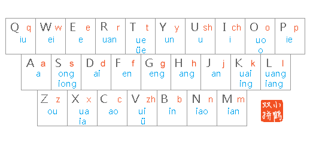
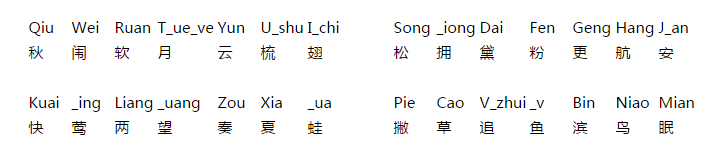

# 打字

## 五笔

## 双拼

* 每个汉字都只需要两个按键即可敲出，要实现两键出字，就需要用特殊的键位来映射那些长度大于1的韵母和声母，这样的一个映射表就是一个双拼方案
* 对其进行规范化，无论是声母还是韵母，都各自集合在一个按键上，即把声母中 zh、ch、sh 和 非单字母韵母（ong、iong、uang 等）进行重新编排，使每个声母或者韵母都对应一个按键。

### [小鹤双拼](https://flypy.com/pin.html) 作者何海峰 网名叫“散步的鹤”

* 双拼方案：主要是韵母键位的设计方案，单声母键位不变
	* 声母大多数是单个字母，除了三个特别的`zh=>v`，`sh=>u`，`ch=>i`，小鹤双拼和全拼一样
	* 
* 零声母方案：指全拼中无声的母韵母音节在双拼中的处理方案，以韵母首字母为零声母，即把韵母的首字母当作声母
	-   单字母韵母，零声母 + 韵母所在键，如： 啊＝aa 哦=oo 额=ee
	-   双字母韵母，零声母 + 韵母末字母，如： 爱＝ai 恩=en 欧=ou
	-   三字母韵母，零声母 + 韵母所在键，如： 昂＝ah
* 简单说：双字母音节保持全拼方式，一三字母音节为首字母加韵母所在键
* 学习过程：一小时记忆键位，一周习惯双拼节奏，一月恢复全拼时速度

## 全拼

* 每个字都需要声母和韵母组成，但声母和韵母所需要输入的字母个数是不一定的，从一个到三个不等，按键时就需要进行多次输入才能组成一个声母或韵母

## tool

* [学习网站](https://api.ihint.me/shuang/)
* 
* 