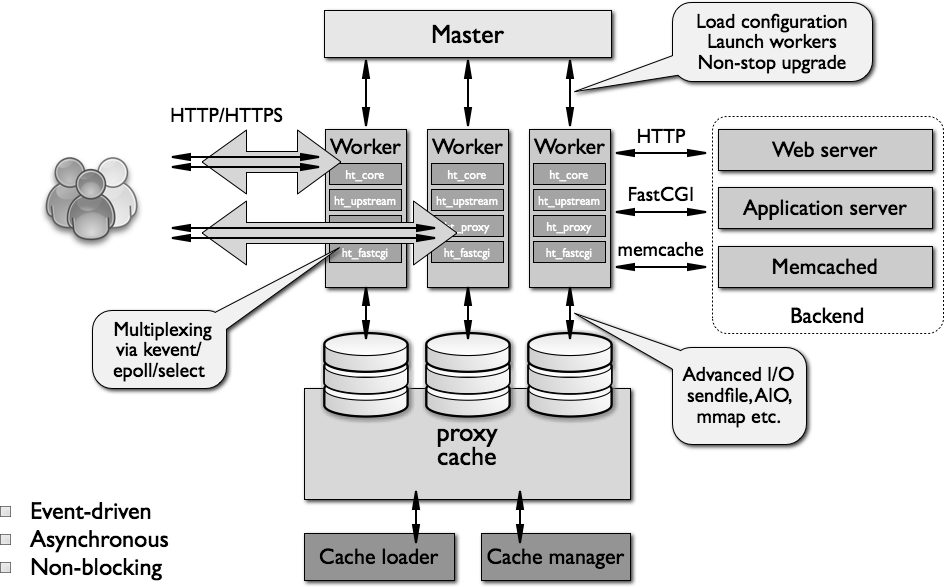
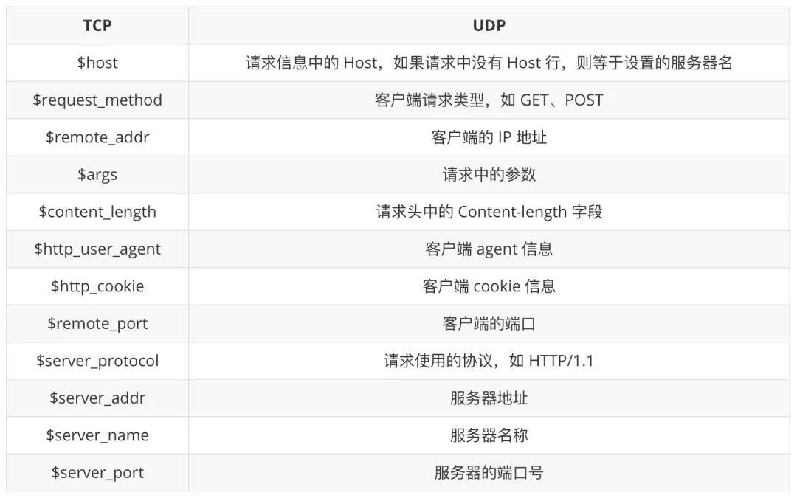

# [nginx](https://github.com/nginx/nginx)

* 2006年由俄罗斯人发布。全称为engine X，缩减合并称为[nginx](https://nginx.org/)
* 一个免费、开源、高性能、轻量级的 HTTP 和反向代理服务器
* 基于事件驱动（event-driven）非阻塞模式的 Web 服务器
* 与事件循环相比 fork 子进程消耗更多系统资源，基于事件的 HTTP 服务器完胜
* 解决基于进程模型产生的C10k问题，请求时即使无状态连接如web服务都无法达到并发响应量级一万现状
   
* Web 服务器，以 B/S（Browser/Server）方式提供服务
    - 静态资源服务
    - 支持 CGI 协议的动态语言，比如 Perl、PHP 等，但是不支持 Java。将处理过的内容通过 HTTP Server 分发
    - 虚拟主机（server）
    - keepalive
    - 访问日志（支持基于日志缓冲提高其性能）
    - urlrewirte
    - 路径别名
    - 基于IP及用户的访问控制
    - 支持速率限制及并发数限制
    - 能缓存打开的文件（元数据：文件的描述符等等信息）
* 动静分离：让动态程序（Java、PHP）去访问应用服务器，让缓存、图片、JS、CSS 等去访问 Nginx
    - 纯粹把静态文件独立成单独的域名，放在独立的服务器上，也是目前主流推崇的方案
    - 动态跟静态文件混合在一起发布，通过 Nginx 来分开
* 反向代理
    * pop3, smpt,imap4等邮件协议的反向代理，应用服务集群扩展，动态扩容
    * 缓存：是边缘节点，减少时间延迟
    * 负载均衡：容灾
* 支持过滤器，例如zip，SSI
* 支持SSL加密机制

## 特性

* 高并发 高性能
    - 内存消耗低：10000个keep-alive连接模式下的非活动连接仅消耗2.5M内存
    - 非阻塞、高并发连接：官方测试能够支撑5万并发连接，在实际生产环境中跑到2～3万并发连接数
    - 事件驱动：通信机制采用 epoll 模型，支持更大并发连接
        - 支持event-driven事件驱动模型, aio异步驱动机制, mmap内存映射
        - 新的epoll（Linux 2.6内核）和kqueue（freebsd）网络I/O模型
    - 节省带宽：支持 GZIP 压缩，可以添加浏览器本地缓存的 Header 头
* 高可靠性：基于master/worker模式，一个 master 进程，生成一个或多个 worker 进程
    - 功能：如果 Nginx 代理的后端的某台 Web 服务器宕机了，不会影响前端访问
    - 用于反向代理，宕机的概率微乎其微
* 热部署(平滑迁移)：不停机更新配置文件、更换日志、更新服务器程序版本
* 可扩展性好：高度模块化（非DSO机制）
* 跨平台：可以在大多数 Unix like OS编译运行，也有 Windows 移植版本
* 配置简单，容易上手
* 缺点
    - 仅能支持http、https 和 Email 协议，适用范围上小些
    - 对后端服务器健康检查，只支持通过端口来检测，不支持通过 url 来检测
    - 不支持 Session 的直接保持，但能通过 ip_hash 来解决
    - 增加、删除或更新模块，需要重新编译

## 版本

*  1.7.11
    - [多线程特性（multi-threading）](https://www.nginx.com/blog/thread-pools-boost-performance-9x/)实现线程池机制，大部分场景中可以避免使用阻塞，整体性能有了数倍提升.仅用在aio模型中对本地文件的操作上，出发点就是以非阻塞模式，来提高文件IO的效率和并发能力
* NGINX Plus 由 Web 服务器、内容缓存和负载均衡器组成。NGINX Web 服务器的商业版本
    - NGINX Unit 是 Igor Sysoev 设计的新型开源应用服务器，由核心 NGINX 软件开发团队实施。可运行 PHP、Python 和 Go 的新型开源应用服务器。Unit 是"完全动态的"，并允许以蓝绿部署的方式无缝重启新版本的应用程序，而无需重启任何进程。所有的 Unit 配置都通过使用 JSON 配置语法的内置 REST API 进行处理，并没有配置文件。在同一台服务器上可以支持多语言的不同版本混合运行
    - NGINX Controller 是 NGINX Plus 的中央集中式监控和管理平台。Controller 充当控制面板，并允许用户通过使用图形用户界面"在单一位置管理数百个 NGINX Plus 服务器"。该界面可以创建 NGINX Plus 服务器的新实例，并实现负载平衡、 URL 路由和 SSL 终端的中央集中配置。Controller 还具备监控功能，可观察应用程序的健壮性和性能。
    - NGINX Plus（Kubernetes）Ingress Controller 解决方案基于开源的 NGINX kubernetes-ingress 项目，经过测试、认证和支持，为 Red Hat OpenShift 容器平台提供负载平衡。该解决方案增加了对 NGINX Plus 中高级功能的支持，包括高级负载平衡算法、第7层路由、端到端认证、request/rate 限制以及内容缓存和 Web 服务器。
    - NGINX 还发布了 nginmesh，这是 NGINX 的开源预览版本，作为 Istio Service Mesh 平台中第7层负载平衡和代理的服务代理。它旨在作为挎斗容器（sidecar container）时，能提供与 Istio 集成的关键功能，并以"标准、可靠和安全的方式"促进服务之间的通信能力。此外，NGINX 将通过加入 Istio 网络特别兴趣小组，与 Istio 社区合作。
    - NGINX Web 应用程序防火墙（WAF）一款基于开源 ModSecurity 研发的商业软件，为针对七层的攻击提供保护，例如 SQL 注入或跨站脚本攻击，并根据如 IP 地址或者报头之类的规则阻止或放行， NGNX WAF 作为 NGINX Plus 的动态模块运行，部署在网络的边缘，以保护内部的 Web 服务和应用程序免受 DDoS 攻击和骇客入侵
* [Tengine](https://github.com/alibaba/tengine):A distribution of Nginx with some advanced features http://tengine.taobao.org/
* 基于 Nginx 和 Lua 的 Web 平台 [OpenResty](../../ops/openresty.md)



## 架构

* 由内核和一系列模块组成

### 内核

* 内核提供 Web 服务基本功能，如启用网络协议，创建运行环境，接收和分配客户端请求，处理模块之间的交互
    - Nginx（内核）本身做的工作实际很少，当接到一个 HTTP 请求时，通过查找配置文件将此次请求映射到一个 location block，而此 location 中所配置的各个指令则会启动不同的模块去完成工作，因此模块可以看做 Nginx 真正劳动工作者
    - 通常一个 location 中的指令会涉及一个 Handler 模块和多个 Filter 模块（当然，多个location可以复用同一个模块）
    - Handler 模块负责处理请求，完成响应内容的生成
    - Filter 模块对响应内容进行处理
- 功能分类
	+ Handlers（处理器模块）：直接处理请求，并进行输出内容和修改 headers 信息等操作。Handlers 处理器模块一般只能有一个
	+ Filters（过滤器模块）：主要对其他处理器模块输出的内容进行修改操作，最后由 Nginx 输出
	+ Proxies（代理类模块）： Nginx 的 HTTP Upstream 之类的模块，这些模块主要与后端一些服务比如FastCGI 等进行交互，实现服务代理和负载均衡等功能

### 模块 module

- 核心模块 core module：nginx 最基本最核心的服务，如进程管理、权限控制、日志记录；
	- HTTP 模块和 MAIL 模块
	- ngx_core
	- ngx_errlog
	- ngx_conf
	- ngx_events
	- ngx_event_core
	- ngx_epll
	- ngx_regex
- Standard HTTP  modules
	-  ngx_http
    -  ngx_http_core 配置端口，URI 分析，服务器相应错误处理，别名控制 (alias) 等
    -  ngx_http_log 自定义 access 日志
    -  ngx_http_upstream 定义一组服务器，可以接受来自 proxy, Fastcgi,Memcache 的重定向；主要用作负载均衡
    -  ngx_http_static
    -  ngx_http_autoindex 自动生成目录列表
    -  ngx_http_index 处理以/结尾的请求，如果没有找到 index 页，则看是否开启了 random_index；如开启，则用之，否则用 autoindex
    -  ngx_http_auth_basic 基于 http 的身份认证 (auth_basic)
    -  ngx_http_access 基于 IP 地址的访问控制 (deny,allow)
    -  ngx_http_limit_conn 限制来自客户端的连接的响应和处理速率
    -  ngx_http_limit_req 限制来自客户端的请求的响应和处理速率
    -  ngx_http_geo
    -  ngx_http_map 创建任意的键值对变量
    -  ngx_http_split_clients
    -  ngx_http_referer 过滤 HTTP 头中 Referer 为空的对象
    -  ngx_http_rewrite 通过正则表达式重定向请求
    -  ngx_http_proxy
    -  ngx_http_fastcgi 支持 fastcgi
    -  ngx_http_uwsgi
    -  ngx_http_scgi
    -  ngx_http_memcached
    -  ngx_http_empty_gif 从内存创建一个 1×1 的透明 gif 图片，可以快速调用
    -  ngx_http_browser 解析 http 请求头部的 User-Agent 值
    -  ngx_http_charset 指定网页编码
    -  ngx_http_upstream_ip_hash
    -  ngx_http_upstream_least_conn
    -  ngx_http_upstream_keepalive
    -  ngx_http_write_filter
    -  ngx_http_header_filter
    -  ngx_http_chunked_filter
    -  ngx_http_range_header
    -  ngx_http_gzip_filter
    -  ngx_http_postpone_filter
    -  ngx_http_ssi_filter
    -  ngx_http_charset_filter
    -  ngx_http_userid_filter
    -  ngx_http_headers_filter 设置 http 响应头
    -  ngx_http_copy_filter
    -  ngx_http_range_body_filter
    -  ngx_http_not_modified_filter
- Optional HTTP  modules 可选HTTP模块
	-  ngx_http_addition 在响应请求的页面开始或者结尾添加文本信息
    -  ngx_http_degradation 在低内存的情况下允许服务器返回 444 或者 204 错误
    -  ngx_http_perl
    -  ngx_http_flv 支持将 Flash 多媒体信息按照流文件传输，可以根据客户端指定的开始位置返回 Flash
    -  ngx_http_geoip 支持解析基于 GeoIP 数据库的客户端请求
    -  ngx_google_perftools
    -  ngx_http_gzip  gzip 压缩请求的响应
    -  ngx_http_gzip_static 搜索并使用预压缩的以.gz 为后缀的文件代替一般文件响应客户端请求
    -  ngx_http_image_filter 支持改变 png，jpeg，gif 图片的尺寸和旋转方向
    -  ngx_http_mp4 支持.mp4,.m4v,.m4a 等多媒体信息按照流文件传输，常与 ngx_http_flv 一起使用
    -  ngx_http_random_index 当收到 / 结尾的请求时，在指定目录下随机选择一个文件作为 index
    -  ngx_http_secure_link 支持对请求链接的有效性检查
    -  ngx_http_ssl 支持 https
    -  ngx_http_stub_status
    -  ngx_http_sub_module 使用指定的字符串替换响应中的信息
    -  ngx_http_dav 支持 HTTP 和 WebDAV 协议中的 PUT/DELETE/MKCOL/COPY/MOVE 方法
    -  ngx_http_xslt 将 XML 响应信息使用 XSLT 进行转换
* 邮件服务模块:
    -  ngx_mail_core
    -  ngx_mail_pop3
    -  ngx_mail_imap
    -  ngx_mail_smtp
    -  ngx_mail_auth_http
    -  ngx_mail_proxy
    -  ngx_mail_ssl
- 第三方模块 3rd party modules：HTTP Upstream Request Hash 模块、Notice 模块和 HTTP Access Key 模块及用户自己开发的模块
	-  echo-nginx-module 支持在 nginx 配置文件中使用
	-  echo/sleep/time/exec 等类 Shell 命令
	-  memc-nginx-module
	-  rds-json-nginx-module 使 nginx 支持 json 数据的处理
	-  lua-nginx-module
	* [nginx-http-flv-module](https://github.com/winshining/nginx-http-flv-module):Media streaming server based on nginx-rtmp-module, HTTP-FLV/RTMP/HLS/DASH supported.
	* [nginx-rtmp-module](https://github.com/arut/nginx-rtmp-module):NGINX-based Media Streaming Server http://nginx-rtmp.blogspot.com
	* [IP2Location](https://github.com/ip2location/ip2location-nginx)

### 进程模型

* 多进程模型,采用模块化的、基于事件驱动、异步、单线程且非阻塞,使用多路复用和事件通知
* Nginx 启动以后，会在系统中以 daemon 的方式在后台运行，包括一个 master 进程，n(n>=1) 个 worker 进程。所有进程都是单线程（即只有一个主线程），进程间通信主要使用共享内存方式
    - master进程:负责管理 worker 进程,充当整个进程组与用户的交互接口
        + 进行一系列初始化，包括但不限于：
            * 命令行参数解析
            * 时间初始化
            * 日志初始化
            * ssl初始化
            * 操作系统相关初始化
            * 一致性hash表初始化
            * 模块编号处理
        + 另外一个最重要初始化由ngx_init_cycle()函数完成，该函数围绕nginx中非常核心的一个全局数据结构`ngx_cycle_t`展开
            * 配置文件解析
            * 创建并监听socket
            * 初始化nginx各模块
        + main函数最后，根据是否启用多进程模型，分别进入多进程版本的ngx_master_process_cycle和单进程版本的ngx_single_process_cycle()
            * 接受外界信号:负责收集、分发请求,接收客户端连接信号后会将这个网络事件发送给某个 worker 进程，由该 worker 进程来接管后续的连接建立和请求处理。master 循环中的各项标志位就对应着各种信号，如：ngx_quit代表QUIT信号，表示优雅的关闭整个服务。
            * 向各个 worker 进程发送信。比如ngx_noaccept代表WINCH信号，表示所有子进程不再接受处理新的连接，由 master 向所有的子进程发送 QUIT 信号量。
            * 负责处理 Nginx 主服务启动、关闭与重载
            * 管理维护 Worker 进程(给Worker进程发信号) 运行状态，比如ngx_reap代表CHILD信号，表示有子进程意外结束，这时需要监控所有子进程的运行状态，主要由ngx_reap_children完成。
            * 当 woker 进程退出后（异常情况下），会自动重新启动新的 woker 进程。主要也是在ngx_reap_children
            * fork Worker进程：按照配置fork出N个Worker进程，一般说来配置推荐Worker进程数量和CPU核数保持一致即可
            * 监控Worker进程，当某个Worker异常挂了后，Master进程负责重新拉起一个
        + 实现重启服务、平滑升级、更换日志文件、配置文件实时生效等功能
        + 热重载-配置热更
            * 更新 nginx.conf 配置文件，向 master 发送 SIGHUP 信号或执行 nginx -s reload
            * master 进程使用新配置，启动新的 worker 进程
            * 使用旧配置的 worker 进程，不再接受新的连接请求，并在完成已存在的连接后退出
        + 热升级-程序热更
            * 将旧 Nginx 文件换成新 Nginx 文件（注意备份）
            * 向 master 进程发送 USR2 信号（平滑升级到新版本的 Nginx 程序）
            * master 进程修改 pid 文件号，加后缀.oldbin
            * master 进程用新 Nginx 文件启动新 master 进程，此时新老 master/worker 同时存在。
            * 向老 master 发送 WINCH 信号，关闭旧 worker 进程，观察新 worker 进程工作情况。若升级成功，则向老 master 进程发送 QUIT 信号，关闭老 master 进程；若升级失败，则需要回滚，向老 master 发送 HUP 信号（重读配置文件），向新 master 发送 QUIT 信号，关闭新 master 及 worker。
    - 多个worker进程:用来处理基本网络事件，每个 worker 请求相互独立且平等的竞争来自客户端的请求，共同竞争来处理来自客户端的请求
        + 每个 Worker 进程都由 Master 进程 fork 出来
        + 子进程启动后，进入`ngx_worker_process_cycle`，进程初始化，随后修改进程名称为："`worker process`"，通过`ngx_process_events_and_timers`方法实现，其中事件主要包括：网络事件、定时器事件。
        + 进入工作循环函数n`gx_process_events_and_timers`，在该函数中主要负责：
            * 竞争互斥锁，拿到锁的进程才能执行accept接受新的连接，以此在多进程之间解决惊群效应
            * 通过epoll异步IO模型处理网络IO事件，包括新的连接事件和已建立连接发生的读写事件
            * 处理定时器队列中到期的定时器事件，定时器通过红黑树的方式存储
        + worker 进程在处理网络事件时，依靠 epoll 模型，来管理并发连接，实现了事件驱动、异步、非阻塞等特性
            * 通常海量并发连接过程中，每一时刻（相对较短的一段时间），往往只需要处理一小部分有事件的连接即活跃连接。
            * 基于以上现象，epoll 通过将连接管理与活跃连接管理进行分离，实现了高效、稳定的网络 IO 处理能力。
            * epoll 利用红黑树高效的增删查效率来管理连接，利用一个双向链表来维护活跃连接
        + 具体的 HTTP 连接与请求处理工作由 worker 进程来完成
        + 一个请求完全由 Worker 进程来处理，只能在一个 worker 进程中被处理，且一个 worker 进程只有一个主线程，所以同时只能处理一个请求
        + 所有 Worker 进程的 listenfd 会在新连接到来时变得可读，为保证只有一个进程处理该连接，所有 Worker 进程在注册 listenfd 读事件前抢互斥锁accept_mutex，抢到互斥锁的那个进程注册 listenfd 读事件，在读事件里调用 accept 接受该连接。
        + 当一个 Worker 进程在 accept 这个连接之后，就开始读取、解析、处理请求，在产生数据后再返回给客户端，最后才断开连接
        + 每个worker基于时间驱动机制可以并行响应多个请求,底层实现的原理是事件驱动和多路 IO 复用,采取了 Reactor 模型（也就是 I/O 多路复用，NIO）
            * I/O 多路复用模型：最重要系统调用函数就是 Select（其他的还有 epoll 等）
            * 该方法能够同时监控多个文件描述符的可读可写情况（每一个网络连接其实都对应一个文件描述符），当其中的某些文件描述符可读或者可写时，Select 方法就会返回可读以及可写的文件描述符个数
            * Work 进程使用 I/O 多路复用模块同时监听多个 FD（文件描述符），当 Accept、Read、Write 和 Close 事件产生时，操作系统就会回调 FD 绑定的事件处理器。这时 Worker 进程去处理相应事件，而不是阻塞在某个请求连接上等待
        + accept 客户端请求,建立链接，从连接上读取请求报文数据并进行解析
        + http服务：遵循 HTTP 协议对起始行、报文首部及报文主体进行进行解析，并获取请求方法、请求 URL、请求参数、HTTP 协议版本等信息，然后将解析出来的请求数据保存到 Nginx 对应的数据结构 ngx_http_request_s 中
        + Nginx 能映射到对应的虚拟主机配置文件，主要依靠 Nginx 将从请求首部解析出来的 Host 字段值与所有虚拟主机配置文件中的 server_name 配置项做对比
        + 通过 `ngx_http_send_header` 方法构造 HTTP 响应的起始行、响应首部，并将响应头信息保存在 `ngx_http_request_s` 的 `headers_out` 数据结构中，然后通过 `ngx_http_header_filter` 方法按照 HTTP 规范将其序列化为字节流缓冲区，最后通过 `ngx_http_write_filter` 方法将响应头部发送出去
        + 惊群:worker 会监听相同端口,在 accept 建立连接时会发生争抢，带来著名的“惊群”问题。worker 核心处理逻辑ngx_process_events_and_timers
            * 将连接事件与读写事件进行分离。连接事件存放为ngx_posted_accept_events，读写事件存放为ngx_posted_events。
            * 设置ngx_accept_mutex锁，只有获得锁的进程，才可以处理连接事件。
    - 设置 Worker数量：Nginx 同 Redis 类似都采用了 IO 多路复用机制，每个 Worker 都是一个独立的进程，但每个进程里只有一个主线程，通过异步非阻塞的方式来处理请求
        + 为了减少进程切换（需要系统调用）的性能损耗，一般设置 Worker 进程数量和 CPU 数量一致
        + 每个 Worker 的线程可以把一个 CPU 的性能发挥到极致。所以 Worker 数和服务器的 CPU 数相等是最为适宜的。设少了会浪费 CPU，设多了会造成 CPU 频繁切换上下文带来的损耗
        + 连接数 worker_connection：表示每个 Worker 进程所能建立连接的最大值。
        + 一个 Nginx 能建立的最大连接数
            * 对于 HTTP 请求本地资源来说， 能够支持的最大并发数量是 `worker_connections*worker_processes`
            * 如果是支持 http1.1 的浏览器每次访问要占两个连接。所以普通的静态访问最大并发数是：`worker_connections*worker_processes /2`
            * 如果是 HTTP 作为反向代理来说，最大并发数量应该是 `worker_connections*worker_processes/4`。作为反向代理服务器，每个并发会建立与客户端的连接和与后端服务的连接，会占用两个连接
    - 负载均衡
        + worker 间的负载关键在于各自接入了多少连接，其中接入连接抢锁的前置条件是ngx_accept_disabled > 0，所以ngx_accept_disabled就是负载均衡机制实现的关键阈值。
        + 在 nginx 启动时，ngx_accept_disabled的值就是一个负数，其值为连接总数的 7/8。当该进程的连接数达到总连接数的 7/8 时，该进程就不会再处理新的连接了，同时每次调用'ngx_process_events_and_timers'时，将ngx_accept_disabled减 1，直到其值低于阈值时，才试图重新处理新的连接。因此，nginx 各 worker 子进程间的负载均衡仅在某个 worker 进程处理的连接数达到它最大处理总数的 7/8 时才会触发，其负载均衡并不是在任意条件都满足。
* 优点
    - 可以充分利用多核机器，增强并发处理能力。
    - 多 worker 间可以实现负载均衡。
    - Master 监控并统一管理 worker 行为。在 worker 异常后，可以主动拉起 worker 进程，从而提升了系统的可靠性。并且由 Master 进程控制服务运行中的程序升级、配置项修改等操作，从而增强了整体的动态可扩展与热更的能力。
    - 可以使用 nginx-s reload 热部署
    - 每个 Worker 是独立的进程，不需要加锁，省掉了锁带来的开销
    - 采用独立的进程，互相之间不会影响，一个进程退出后，其他进程还在工作，服务不会中断，Master 进程则很快启动新的 Worker 进程
* 缓存加载器进程 Cache Loader
    - 在Nginx服务启动一段时间后由主进程生成，在缓存元数据重建完成后就自动退出
* 缓存管理器进程 Cache Manager
    - 一般存在于主进程的整个生命周期，负责对缓存索引进行管理。通过缓存机制，可以提高对请求的响应效率，进一步降低网络压力
* 事件驱动：多进程（单线程）&多路 IO 复用模型，异步，非阻塞 epoll(Linux),kqueue（FreeBSD）, /dev/poll(Solaris)
* 消息通知：select,poll, rt signals
    - 支持sendfile,  sendfile64
    - 支持AIO，mmap
* 热升级：在不停止服务情况下更换 Nginx 的binary文件
    - 把旧的 Nginx binary 文件替换为新的，新编译的 nginx 文件所指定的相应的配置选项，必须保持和老的 Nginx 是一致的，否则的话没有办法复用 nginx.conf 文件
    - 向现有老的 Master (Old) 进程发生  USR2 信号，之后 Master (Old) 进程会将修改 pid 文件名，添加后缀 .oldbin
    - 使用新的 binary 文件启动新的 Master (New) 进程。会出现两个 Master 进程：Master(Old) 和 Master (New)，Master (New) 进程会自动启动新的 Worker 进程。这里新的 Master (New) 进程是怎么样启动的呢？它其实是老的 Master(Old) 进程的子进程，不过这个子进程是使用了新的 binary 文件带入来启动的
    - 向 Master(Old)  进程发送 QUIT 信号
    - 整个过程中，Master(Old)  进程是一直存活的，这是为了方便回滚
        + 向 Master(Old)  进程发送 HUP 信号，相当于执行了一次 reload，会启动新的 Worker 进程
        + 再向 Master (New) 进程发送 QUIT 信号
* HTTP请求预处理:当连接有数据产生时，工作线程读取socket中到来的数据，并根据HTTP协议格式进行解析，最终封装成ngx_request_t请求对象，提交处理
    - 请求处理的11个阶段:在nginx中各HTTP模块是以挂载的形式串接而成，以流水线工作模式进行HTTP请求的处理，nginx将一个HTTP请求的处理划分为11个阶段
* 为什么不采用多线程模型管理连接？
    - 无状态服务，无需共享进程内存
    - 采用独立的进程，可以让互相之间不会影响。一个进程异常崩溃，其他进程的服务不会中断，提升了架构的可靠性。
    - 进程之间不共享资源，不需要加锁，所以省掉了锁带来的开销。
* 为什么不采用多线程处理逻辑业务？
    - 进程数已经等于核心数，再新建线程处理任务，只会抢占现有进程，增加切换代价。
    - 作为接入层，基本上都是数据转发业务，网络 IO 任务的等待耗时部分，已经被处理为非阻塞/全异步/事件驱动模式，在没有更多 CPU 的情况下，再利用多线程处理，意义不大。并且如果进程中有阻塞的处理逻辑，应该由各个业务进行解决，比如 openResty 中利用了 Lua 协程，对阻塞业务进行了优化。


```
typedef enum {
    NGX_HTTP_POST_READ_PHASE = 0,
    NGX_HTTP_SERVER_REWRITE_PHASE,
    NGX_HTTP_FIND_CONFIG_PHASE,
    NGX_HTTP_REWRITE_PHASE,
    NGX_HTTP_POST_REWRITE_PHASE,
    NGX_HTTP_PREACCESS_PHASE,
    NGX_HTTP_ACCESS_PHASE,
    NGX_HTTP_POST_ACCESS_PHASE,
    NGX_HTTP_PRECONTENT_PHASE,
    NGX_HTTP_CONTENT_PHASE,
    NGX_HTTP_LOG_PHASE
} ngx_http_phases;
```

## 安装

- 配置
	- 编译过程中的查看默认安装的模块支持 `cat nginx-1.17.2/auto/options | grep YES`
* ubuntu
    - `/usr/share/doc/nginx-doc/examples/`
    - `/usr/share/nginx`
* Mac
    - 程序文件 /usr/local/Cellar/nginx
    - 配置文件 /usr/local/etc/nginx/nginx.conf   /usr/local/nginx/conf/nginx.conf
    - 日志与服务器文件 /usr/local/var/log/nginx/
    - Severs config:/usr/local/etc/nginx/servers/
    - Docroot is: /usr/local/Cellar/nginx/1.12.2_1/html /usr/local/var/www, 软件更新后版本号会发生变化，默认也会失效
* 组成
    - nginx 二进制可执行文件
    - nginx.conf 配置文件
    - accedd.log 访问日志
    - error.log 错误日志
* ss 命令可以查看系统中启动的端口信息，选项：
    - -a显示所有端口的信息
    - -n以数字格式显示端口号
    - -t显示TCP连接的端口
    - -u显示UDP连接的端口
    - -l显示服务正在监听的端口信息，如httpd启动后，会一直监听80端口
    - -p显示监听端口的服务名称是什么（也就是程序名称）
* 核心模块群
    - 每个模块有一个支持的命令解析列表，在初始化过程中，主进程将会遍历所有模块的命令列表，进行配置文件中的命令解析
    - ngx_http_proxy_module
    - ngx_http_core_module

```sh
brew info nginx
sudo chown root:wheel /usr/local/Cellar/nginx/1.12.2_1/bin/nginx
sudo chmod u+s /usr/local/Cellar/nginx/1.12.2_1/bin/nginx
brew services start nginx
brew edit nginx

# LuaJIT
wget http://luajit.org/download/LuaJIT-2.0.2.tar.gz
make install PREFIX=/usr/local/LuaJIT
export LUAJIT_LIB=/usr/local/LuaJIT/lib
export LUAJIT_INC=/usr/local/LuaJIT/include/luajit-2.0

wget https://github.com/simpl/ngx_devel_kit/archive/v0.3.0.tar.gz
wget https://github.com/openresty/lua-nginx-module/archive/v0.10.9rc7.tar.gz

wget ftp://ftp.csx.cam.ac.uk/pub/software/programming/pcre/pcre-8.40.tar.gz && tar -zxf pcre-8.40.tar.gz
wget http://zlib.net/zlib-1.2.11.tar.gz && tar -zxf zlib-1.2.11.tar.gz
wget http://www.openssl.org/source/openssl-1.1.1f.tar.gz && tar -zxf openssl-1.1.1f.tar.gz
wget http://nginx.org/download/nginx-1.17.6.tar.gz && tar -zxvf nginx-1.17.6.tar.gz

sudo apt install gcc libpcre3-dev zlib1g-dev libssl-dev libxml2-dev libxslt1-dev  libgd-dev google-perftools libgoogle-perftools-dev libperl-dev # the Google perftools module requires the Google perftools library

sudo apt install libgeoip-dev  # the GeoIP module requires the GeoIP library

# --with-ld-opt=-ltcmalloc   checking for --with-ld-opt="-ljemalloc" ... not found
nginx modules path: "/usr/share/nginx/modules"

./configure \
--user=www-data \
--group=www-data \
--prefix=/usr/share/nginx \
--sbin-path=/usr/sbin/nginx \
--conf-path=/etc/nginx/nginx.conf \
--pid-path=/run/nginx.pid \
--error-log-path=/var/log/nginx/error.log \
--http-log-path=/var/log/nginx/access.log \
--lock-path=/var/lock/nginx.lock \
--http-client-body-temp-path=/var/lib/nginx/body \
--http-fastcgi-temp-path=/var/lib/nginx/fastcgi \
--http-proxy-temp-path=/var/lib/nginx/proxy \
--http-scgi-temp-path=/var/lib/nginx/scgi \
--http-uwsgi-temp-path=/var/lib/nginx/uwsgi \
--with-compat \
--with-file-aio \
--with-threads \
--with-http_addition_module \
--with-pcre=../pcre-8.40 \
--with-zlib=../zlib-1.2.11 \
--with-openssl=../openssl-1.1.0f \
--with-openssl-opt=enable-ec_nistp_64_gcc_128 \
--with-openssl-opt=no-nextprotoneg \
--with-openssl-opt=no-weak-ssl-ciphers \
--with-openssl-opt=no-ssl3 \
--with-stream \
--with-stream_realip_module \
--with-stream_ssl_module \
--with-stream_ssl_preread_module \
--with-mail \
--with-mail_ssl_module \
--with-mail=dynamic \
--build=Ubuntu \
--with-pcre-jit \
--with-compat \
--with-file-aio \
--with-threads \
--with-http_addition_module \
--with-http_auth_request_module \
--with-http_dav_module \
--with-http_flv_module \
--with-http_gunzip_module \
--with-http_gzip_static_module \
--with-http_mp4_module \
--with-http_random_index_module \
--with-http_realip_module \
--with-http_slice_module \
--with-http_ssl_module \
--with-http_sub_module \
--with-http_stub_status_module \
--with-http_v2_module \
--with-http_secure_link_module \
--with-ipv6 \
--with-debug \
--with-file-aio \
--with-rtsig_module \
--with-http_xslt_module \
--with-http_degradation_module \
--with-http_image_filter_module \
--with-debug \
--with-http_geoip_module \
--with-google_perftools_module \
--with-cc-opt='-g -O2 -fPIE -fstack-protector-strong -Wformat -Werror=format-security -Wdate-time -D_FORTIFY_SOURCE=2 -g -pipe -Wall -Wp,-D_FORTIFY_SOURCE=2 -fexceptions -fstack-protector-strong --param=ssp-buffer-size=4 -grecord-gcc-switches -m64 -mtune=generic -fPIC' \
--with-ld-opt='-Wl,-z,relro -Wl,now -pie,-Bsymbolic-functions -fPIE -pie,-ltcmalloc' \
--add-module=/opt/download/ngx_devel_kit-0.3.0
--add-module=/opt/download/lua-nginx-module-0.10.9rc7
--add-module=/opt/src/nginx_module/echo-nginx-module
--add-module=/opt/src/nginx_module/nginx-http-concat/
--add-module=/opt/src/nginx_module/ngx_cache_purge/

make && sudo make install

echo "/usr/local/LuaJIT/lib" >> /etc/ld.so.conf
ldconfig

# /etc/systemd/system/nginx.service
sudo systemctl start nginx.service && sudo systemctl enable nginx.service

# /etc/ufw/applications.d/nginx
[Nginx HTTP]
title=Web Server (Nginx, HTTP)
description=Small, but very powerful and efficient web server
ports=80/tcp

[Nginx HTTPS]
title=Web Server (Nginx, HTTPS)
description=Small, but very powerful and efficient web server
ports=443/tcp

[Nginx Full]
title=Web Server (Nginx, HTTP + HTTPS)
description=Small, but very powerful and efficient web server
ports=80,443/tcp

sudo ufw app list

# 显示 Nginx 的版本
nginx -v
# 显示 Nginx 的版本，编译器版本和配置参数
nginx -V

sudo nginx # 启动命令
sudo ngixn -c /usr/local/etc/nginx/nginx.conf
sudo nginx -s reload|reopen|stop|quit # 重新配置后都需要进行重启操作
sudo nginx -t -c /usr/local/etc/nginx/nginx.conf

wget https://github.com/winshining/nginx-http-flv-module/archive/master.zip
unzip master.zip
./configure --add-module=../nginx-http-flv-module-master

sudo 2>&1 nginx -V | tr -- - '\n' | grep _module # View Compiled Nginx Modules

Upgrade Nginx on the Fly
Nginx allows admins to upgrade the binary and/or configuration file on the fly. This means your client requests will not be interrupted due to server upgrades. To do this, first, we need to locate the PID of the master Nginx process. We can do it using a simple command that we’ve already demonstrated.

cat /run/nginx.pid
# Your new Nginx binary should be ready by now. Spawn a new set of Nginx master/worker processes which use the new binary via the below command.

sudo kill -s USR2 `cat /run/nginx.pid` Now kill the worker processes used by the first master process using the following command.

sudo kill -s WINCH `cat /run/nginx.pid.oldbin`
sudo kill -s QUIT `cat /run/nginx.pid.oldbin` # Follow it by killing the old master process

ss  -anptu  |  grep nginx
```

```sh
cd /
wget nginx.org/download/nginx-1.17.2.tar.gz

tar -xzvf nginx-1.17.2.tar.gz
cd nginx-1.17.2

./configure

yum -y install pcre* #安装使nginx支持rewrite
yum -y install gcc-c++
yum -y install zlib*
yum -y install openssl openssl-devel

// 检查模块支持
./configure  --prefix=/usr/local/nginx  --with-http_ssl_module --with-http_v2_module --with-http_realip_module --with-http_addition_module --with-http_sub_module --with-http_dav_module --with-http_flv_module --with-http_mp4_module --with-http_gunzip_module --with-http_gzip_static_module --with-http_auth_request_module --with-http_random_index_module --with-http_secure_link_module --with-http_degradation_module --with-http_slice_module --with-http_stub_status_module --with-mail --with-mail_ssl_module --with-stream --with-stream_ssl_module --with-stream_realip_module --with-stream_ssl_preread_module --with-threads --user=www --group=www

make && make install
```

## 服务管理

* 开机启动
	* 利用 systemctl 命令 service  [`/lib/systemd/system/nginx.service`](./nginx_s.service)
	* 通过开机启动命令脚本 [`/etc/init.d/nginx`](./nginx)

```sh
cd /usr/local/nginx/sbin/
./nginx

netstat -ntpl
kill 进程PID


nginx -s reload  # 向主进程发送信号，重新加载配置文件，热重启
nginx -s reopen  # 重启 Nginx
nginx -s stop    # 快速关闭
nginx -s quit    # 等待工作进程处理完成后关闭
nginx -T         # 查看当前 Nginx 最终的配置
nginx -t -c <配置路径>  # 检查配置是否有问题，如果已经在配置目录，则不需要 -c

# vi /lib/systemd/system/nginx.service
systemctl daemon-reload


systemctl start nginx    # 启动 Nginx
systemctl stop nginx     # 停止 Nginx
systemctl restart nginx  # 重启 Nginx
systemctl reload nginx   # 重新加载 Nginx，用于修改配置后
systemctl enable nginx   # 设置开机启动 Nginx
systemctl disable nginx  # 关闭开机启动 Nginx
systemctl status nginx   # 查看 Nginx 运行状态

## vi /etc/init.d/nginx
chmod a+x /etc/init.d/nginx

# nginx 加入系统服务中
chkconfig --add nginx
# 把服务设置为开机启动： reboot 重启系统生效,用 systemctl 方法相同的命令
chkconfig nginx on

/usr/local/nginx/sbin/nginx -c /usr/local/nginx/conf/nginx.conf

# vi /etc/profile
export PATH=$PATH:/usr/local/nginx/sbin
source /etc/profile
```

## 配置

* 语法
    - 配置文件由指令和指令块构成
    - 每条指令以分号（;）结尾，指令和参数间以空格符分隔
    - 指令块以大括号{}将多条指令组织在一起
    - include 语句允许组合多个配置文件以提高可维护性
    - 使用 # 添加注释
    - 使用 $ 定义变量
    - 部分指令的参数支持正则表达式
* 主要配置
	* main:nginx 的全局配置，对全局生效。/etc/nginx/nginx.conf 
		* 配置运行Nginx服务器用户（组）:PHP7默认的用户和组是www-data
		- worker process:worker 进程个数
			+ master进程接收并分配请求给worker处理
			+ 简单一点可以设置为cpu核心数 `grep ^processor /proc/cpuinfo | wc -l` ，也是 auto 值
			+ 如果开启了ssl和gzip应该设置成与逻辑CPU数量一样甚至为2倍，可以减少I/O操作
		- `worker_cpu_affinity 0001 0010 0100 1000`:在高并发情况下，通过设置cpu粘性来降低由于多CPU核切换造成的寄存器等现场重建带来的性能损耗
		- worker_rlimit_nofile 10240 默认没有设置，可以限制为操作系统最大的限制65535
		- Nginx进程PID存放路径
		- 错误日志存放路径
		- 配置文件的引入
	* events:配置影响 nginx 服务器或与用户的网络连接。    
		* worker_connections:每个worker进程能并发处理（发起）的最大连接数（包含与客户端或后端被代理服务器间等所有连接数）
			+ 最大连接数 = worker_processes * worker_connections/4
			+ 不能超过 worker_rlimit_nofile
		- 设置网络连接的序列化
		- keepalive 是关于 upstream（上游） 服务器和 Nginx 连接有关的配置 - 当 Nginx 充当代理或负载均衡服务器角色时。表示在空闲状态 upstream 服务器在单个 worker 进程中支持的 keepalive 连接数
			+ 是否允许同时接收多个网络连接
			+ keepalive 连接数是能够有效减少延迟提升 web 页面加载速度的优化性能手段
			+ keepalive_requests 指令用于设置单个客户端能够在一个 keepalive 连接上处理的请求数量
			+ keepalive_timeout 设置空闲 keepalive 连接保持打开的时间
		- 事件驱动模型的选择
			+ Select、poll属于标准事件模型，如果当前系统不存在更有效的方法，nginx会选择select或poll
			+ 高效事件模型
				* Kqueue：使用于FreeBSD 4.1+, OpenBSD 2.9+, NetBSD 2.0 和 MacOS X.使用双处理器的MacOS X系统使用kqueue可能会造成内核崩溃。
				* Epoll：使用于Linux内核2.6版本及以后的系统。
				* /dev/poll：使用于Solaris 7 11/99+，HP/UX 11.22+ (eventport)，IRIX 6.5.15+ 和 Tru64 UNIX 5.1A+。
				* Eventport：使用于Solaris 10。 为了防止出现内核崩溃的问题， 有必要安装安全补丁
	* http：可以嵌套多个 server，配置代理，缓存，日志定义等绝大多数功能和第三方模块的配置。
		- sendfile on 开启高效文件传输模式，sendfile指令指定nginx是否调用sendfile函数来输出文件，减少用户空间到内核空间的上下文切换。对于普通应用设为 on，如果用来进行下载等应用磁盘IO重负载应用，可设置为off，以平衡磁盘与网络I/O处理速度，降低系统的负载
		- 当使用sendfile函数时，TCP_NOPUSH才起作用，因为在sendfile时，Nginx会要求发送某些信息来预先解释数据，这些信息其实就是报头内容，典型情况下报头很小，而且套接字上设置了TCP_NODELAY。有报头的包将被立即传输，在某些情况下（取决于内部的包计数器），因为这个包成功地被对方收到后需要请求对方确认。这样，大量数据的传输就会被推迟而且产生了不必要的网络流量交换。而通过设置TCP_NOPUSH=on，表示将所有HTTP的header一次性发出去
		- TCP_NODELAY只有在配置长连接时才起作用，因为长连接可能引起小包的阻塞，配置TCP_NODELAY可以避免该阻塞
		- Use the tcp_nopush directive together with the sendfile on;directive. This enables NGINX to send HTTP response headers in one packet right after the chunk of data has been obtained by sendfile().
		- 在 nginx 中，tcp_nopush 配置和 tcp_nodelay “互斥”。
		- 定义 MIMI-Type
		- keepalive_timeout 65: 长连接超时时间，单位是秒 长连接请求大量小文件的时候，可以减少重建连接的开销，但假如有大文件上传，65s内没上传完成会导致失败。如果设置时间过长，用户又多，长时间保持连接会占用大量资源。
		- send_timeout 用于指定响应客户端的超时时间。这个超时仅限于两个连接活动之间的时间，如果超过这个时间，客户端没有任何活动，Nginx将会关闭连接
		- 自定义服务日志
		- client_max_body_size 10m 允许客户端请求的最大单文件字节数。如果有上传较大文件，请设置它的限制值
		- client_body_buffer_size 128k  缓冲区代理缓冲用户端请求的最大字节数
		- 增大TCP的listen queue：sudo sysctl -w net.core.somaxconn=4096或者永久修改/etc/sysctl.conf：net.core.somaxconn = 4096，然后修改Nginx：`listen 80 backlog=4096;`
		- 单连接请求数上限
		- windows调用php-cgi启动服务
		- linux通过转交服务给php-fpm处理:配置www.conf服务转交TCP socket或Unix Socket
			+ Unix Sockets
				* Nginx is run as user/group www-data. PHP-FPM's unix socket therefore needs to be readable/writable by this user.
				* If we change the Unix socket owner to user/group ubuntu, Nginx will then return a bad gateway error, as it can no longer communicate to the socket file. We would have to change Nginx to run as user "ubuntu" as well, or set the socket file to allow "other" (non user nor group) to be read/written to, which is insecure.
			+ TCP Sockets
				* This makes PHP-FPM able to be listened to by remote servers
				* listen.allowed_clients = 127.0.0.1
		- http_proxy：nginx作为反向代理服务器的功能，包括缓存功能
			+ proxy_connect_timeout 60 nginx跟后端服务器连接超时时间(代理连接超时)
			+ proxy_read_timeout 60 连接成功后，与后端服务器两个成功的响应操作之间超时时间(代理接收超时)
			+ proxy_buffer_size 4k 设置代理服务器（nginx）从后端realserver读取并保存用户头信息的缓冲区大小，默认与proxy_buffers大小相同，其实可以将这个指令值设的小一点
			+ proxy_buffers 4 32k proxy_buffers缓冲区，nginx针对单个连接缓存来自后端realserver的响应，网页平均在32k以下的话，这样设置
			+ proxy_busy_buffers_size 64k 高负荷下缓冲大小（proxy_buffers*2）
			+ proxy_max_temp_file_size  当proxy_buffers放不下后端服务器的响应内容时，会将一部分保存到硬盘的临时文件中，这个值用来设置最大临时文件大小，默认1024M，它与proxy_cache没有关系。大于这个值，将从upstream服务器传回。设置为0禁用。
			+ proxy_temp_file_write_size 64k 当缓存被代理的服务器响应到临时文件时，这个选项限制每次写临时文件的大小。proxy_temp_path（可以在编译的时候）指定写到哪那个目录。
			+ proxy_pass，proxy_redirect见 location 部分。
		- http_gzip 
			- gzip on : 开启gzip压缩输出，减少网络传输
			+ gzip_min_length 1k ：设置允许压缩的页面最小字节数，页面字节数从header头得content-length中进行获取。默认值是20。建议设置成大于1k的字节数，小于1k可能会越压越大。
			+ gzip_buffers 4 16k ：设置系统获取几个单位的缓存用于存储gzip的压缩结果数据流。4 16k代表以16k为单位，安装原始数据大小以16k为单位的4倍申请内存。
			+ gzip_http_version 1.0 ：用于识别 http 协议的版本，早期的浏览器不支持 Gzip 压缩，用户就会看到乱码，所以为了支持前期版本加上了这个选项，如果你用了 Nginx 的反向代理并期望也启用 Gzip 压缩的话，由于末端通信是 http/1.0，故请设置为 1.0。
			+ gzip_comp_level 6 ：gzip压缩比，1压缩比最小处理速度最快，9压缩比最大但处理速度最慢(传输快但比较消耗cpu)
			+ gzip_types ：匹配mime类型进行压缩，无论是否指定,”text/html”类型总是会被压缩的。
			+ gzip_proxied any ：Nginx作为反向代理的时候启用，决定开启或者关闭后端服务器返回的结果是否压缩，匹配的前提是后端服务器必须要返回包含”Via”的 header头
			+ gzip_static：默认 off，该模块启用后，Nginx 首先检查是否存在请求静态文件的 gz 结尾的文件，如果有则直接返回该 .gz 文件内容
			+ gzip_vary on ：用于在响应消息头中添加 Vary：Accept-Encoding，使代理服务器根据请求头中的 Accept-Encoding 识别是否启用 gzip 压缩；例如，用Squid缓存经过Nginx压缩的数据。
			+ gzip_disable 指定哪些不需要 gzip 压缩的浏览器
	* server：配置虚拟主机的相关参数，一个 http 中可以有多个 server。
		- 基于名称的虚拟主机配置
		- 基于IP的虚拟主机配置
		- 配置网络监听
		- http_stream
			+ 通过一个简单的调度算法来实现客户端IP到后端服务器的负载均衡，upstream后接负载均衡器的名字，后端realserver以 host:port options; 方式组织在 {} 中。如果后端被代理的只有一台，也可以直接写在 proxy_pass
	* location：配置请求的路由，以及各种页面的处理情况。
		- location配置
		- 请求根目录配置
		- 更改location的URI
			+ proxy_pass http:/backend 请求转向backend定义的服务器列表，即反向代理，对应upstream负载均衡器。也可以proxy_pass http://ip:port。
		- 默认首页配置
	* upstream：配置后端服务器具体地址，负载均衡配置不可或缺的部分。
* 通用
    - autoindex on; 允许列出整个目录
    - autoindex_exact_size off; 默认为on，显示出文件的确切大小，单位是bytes。改为off后，显示出文件的大概大小，单位是kB或者MB或者GB
    - autoindex_localtime on; 默认为off，显示的文件时间为GMT时间。改为on后，显示的文件时间为文件的服务器时间
    - `add_header`并不享受Nginx的继承机制，意味着如果子context中有add_header，那么将覆盖所有的父context中的add_header配置。比如，在http中配置了3个add_header，然后在server中配置了1个add_header，那么server中的add_header会将http中的所有3个add_header给覆盖掉
*  /status
    - Active connections：当前活动的连接数量。
    - Accepts：已经接受客户端的连接总数量。
    - Handled：已经处理客户端的连接总数量。 （一般与accepts一致，除非服务器限制了连接数量）。
    - Requests：客户端发送的请求数量。
    - Reading：当前服务器正在读取客户端请求头的数量。
    - Writing：当前服务器正在写响应信息的数量。
    - Waiting：当前多少客户端在等待服务器的响应。
- 内置变量:内置全局变量，你可以在配置中随意使用
* 工具
    - [valentinxxx/nginxconfig.io](https://github.com/valentinxxx/nginxconfig.io):⚙️ NGiИX config generator generator on steroids 💉 https://nginxconfig.io
    - [NGINX Config](https://www.digitalocean.com/community/tools/nginx):The easiest way to configure a performant, secure,
    and stable NGINX server.



```
$args # 请求中的参数
$content_length # 请求 HEAD 中的 Content-length
$content_type # 请求 HEAD 中的 Content_type
$document_root # 当前请求中 root 的值
$host # 主机头
$http_user_agent # 客户端 agent
$http_cookie # 客户端 cookie
$limit_rate # 限制连接速率
$request_method # 客户端请求方式，GET/POST
$remote_addr # 客户端 IP
$remote_port # 客户端端口
$remote_user # 验证的用户名
$request_filename # 请求的文件绝对路径
$request_body_file  # 做反向代理时发给后端服务器的本地资源的名称
$scheme # http/http
$server_protocol # 协议，HTTP/1.0 OR HTTP/1.1
$server_addr # 服务器地址
$server_name # 服务器名称
$server_port # 服务器端口
$request_uri # 包含请求参数的 URI
$uri # 不带请求参数的 URI
$document_uri # 同 $uri

    $arg_PARAMETER #GET 请求中变量名 PARAMETER 参数的值
    $args #这个变量等于 GET 请求中的参数，例如，foo=123&bar=blahblah;这个变量可以被修改
    $binary_remote_addr #二进制码形式的客户端地址
    $body_bytes_sent #传送页面的字节数
    $content_length #请求头中的 Content-length 字段
    $content_type #请求头中的 Content-Type 字段
    $cookie_COOKIE #cookie COOKIE 的值
    $document_root #当前请求在 root 指令中指定的值
    $document_uri #与 $uri 相同
    $host #请求中的主机头(Host)字段，如果请求中的主机头不可用或者空，则为处理请求的 server 名称(处理请求的 server 的 server_name 指令的值)。值为小写，不包含端口
    $hostname #机器名使用 gethostname 系统调用的值
    $http_HEADER #HTTP 请求头中的内容，HEADER 为 HTTP 请求中的内容转为小写，-变为_(破折号变为下划线)，例如：$http_user_agent(Uaer-Agent 的值)
    $sent_http_HEADER #HTTP 响应头中的内容，HEADER 为 HTTP 响应中的内容转为小写，-变为_(破折号变为下划线)，例如：$sent_http_cache_control、$sent_http_content_type…
    $is_args #如果 $args 设置，值为"?"，否则为""
    $limit_rate #这个变量可以限制连接速率
    $nginx_version #当前运行的 nginx 版本号
    $query_string #与 $args 相同
    $remote_addr #客户端的 IP 地址
    $remote_port #客户端的端口
    $remote_port #已经经过 Auth Basic Module 验证的用户名
    $request_filename #当前连接请求的文件路径，由 root 或 alias 指令与 URI 请求生成
    $request_body #这个变量（0.7.58+）包含请求的主要信息。在使用 proxy_pass 或 fastcgi_pass 指令的 location 中比较有意义
    $request_body_file #客户端请求主体信息的临时文件名
    $request_completion #如果请求成功，设为"OK"；如果请求未完成或者不是一系列请求中最后一部分则设为空
    $request_method #这个变量是客户端请求的动作，通常为 GET 或 POST。包括 0.8.20 及之前的版本中，这个变量总为 main request 中的动作，如果当前请求是一个子请求，并不使用这个当前请求的动作
    $request_uri #这个变量等于包含一些客户端请求参数的原始 URI，它无法修改，请查看 $uri 更改或重写 URI
    $scheme #所用的协议，例如 http 或者是 https，例如 rewrite ^(.+)$$scheme://example.com$1 redirect
    $server_addr #服务器地址，在完成一次系统调用后可以确定这个值，如果要绕开系统调用，则必须在 listen 中指定地址并且使用 bind 参数
    $server_name #服务器名称
    $server_port #请求到达服务器的端口号
    $server_protocol #请求使用的协议，通常是 HTTP/1.0、HTTP/1.1 或 HTTP/2
    $uri #请求中的当前 URI(不带请求参数，参数位于 args ) ， 不 同 于 浏 览 器 传 递 的 args)，不同于浏览器传递的 args)，不同于浏览器传递的 request_uri 的值，它可以通过内部重定向，或者使用 index 指令进行修改。不包括协议和主机名，例如 /foo/bar.html

-f/!-f # 判断文件是否存在
-d/!-d # 判断目录是否存在
-e/!-e # 判断文件或目录是否存在
-x/!-x # 判断文件是否可以执行
```

### 本地文件操作

* sendfile 零拷贝，提高本地文件通过socket发送的效率
    - 从本地读取一个文件并通过socket发送出去步骤
        + 根据CPU的调度，从磁盘读取一定长度（chunk）的字节数据 copy到内核内存中
        + 将内核内存中的数据copy到进程工作区内存
        + 进程通过socket将数据copy到网络驱动器缓存， 并通过相应的传输协议发送出去
    - sendfile是linux系统级的调用，socket可以通过DMA（直接内存访问）方式直接访问文件数据，并通过传输协议发送，减少了2次数据copy（磁盘到内核，内核到工作区）
    - `sendfile_max_chunk`参数用于限定每次sendfile()调用发送的最大数据尺寸，如果不限制大小的话，将会独占整个worker进程，默认为“无限制”
    - 对于nginx而言，代理静态本地的静态文件资源（通常是小文件）将是非常高效的，建议对一些静态文件比如html、图片等，开启此参数
* aio:异步文件IO，nginx默认关闭此特性，它需要在高版本的linux平台上才支持（2.6.22+）
    - 在linux上，directio只能读取基于512字节边界对齐的blocks，文件结束的那些未对齐的block将使用阻塞模式读取
    - 如果文件在开头没有对齐，整个文件都将阻塞式读取。这里所谓的对齐，就是文件数据在内存页中的cache情况
    - 当aio和sendfile都开启时，将会对那些size大于directio设定值的文件使用aio机制：即当小于directio设定值的文件将直接使用sendfile（aio不参与）
    - 使用多线程异步模式读取较大的文件，以提高IO效率，但是事实上可能并没有任何提高。因为大文件的读取，并不能使用cache、而且本身也是耗时的，即使是多线程，对于request的等待时间也是无法预估的，特别是并发请求较高的时候。但是aio能够提高IO的并发能力，这个是确定的
    - 默认情况下，多线程模式是关闭的，我们需要通过--with-threads配置来开启，此特性尽在支持epoll、kqueue的平台上兼容。对于线程池的设置，我们可以通过thread_pool来声明，并在aio指令中指定
* directio:用于开启对O_DIRECT标记（BSD，linux）的使用，对应directio()这个系统调用
    - 针对大文件而设定的,通过directio可以指定限定的尺寸大小，对于超过此size的文件，将会使用directio（而不再使用sendfile）
    - 根据directio的设计初衷，它具备sendfile的基本原理，只是不使用内核cache，而是直接使用DMA，而且使用之后内存cache（页对齐部分）也将被释放
    - 常适用于大文件读取，而且通常读取频率很低。因为对于高频的读取，它并不能提高效率（因为它不会重用cache，而是每次都DMA）。由于存在性能权衡问题，此参数默认为off

```
thread_pool default_pool threads=16;##main上下文

location /video {
    sendfile on;
    sendfile_max_chunk 128k;
    directio 8m;
    aio threads=default_pool;
}
```

### server

* http 服务上支持若干虚拟主机，每个虚拟主机对应一个server配置项
* backlog 默认位 128，1024 这个值换成自己正常的 QPS
* 流程
    - First, the incoming URI will be normalized even before any of the location matching takes place. For example, First it will decode the “%XX” values in the URL.
    - It will also resolve the appropriate relative path components in the URL, if there are multiple slashes / in the URL, it will compress them into single slash etc. Only after this initial normalization of the URL, the location matching will come into play.
    - When there is no location modifier, it will just be treated as a prefix string to be matched in the URL.
    - Nginx will first check the matching locations that are defined using the prefix strings.
    - If the URL has multiple location prefix string match, then Nginx will use the longest matching prefix location.
    - After the prefix match, nginx will then check for the regular expression location match in the order in which they are defined in the nginx configuration file.
    - So, the order in which you define the regular expression match in your configuration file is important. The moment nginx matches a regular expression location configuration, it will not look any further. So, use your important critical regular expression location match at the top of your configuration.
    - If there is no regular expression matching location is found, then Nginx will use the previously matched prefix location configuration.
* location 匹配优先级:一次请求只能匹配一个location，一旦匹配成功后，便不再继续匹配其余
    - 先匹配普通字符串，然后再匹配正则表达式
        + 普通字符串匹配顺序是根据配置中字符长度从长到短，也就是说使用普通字符串配置的location顺序是无关紧要的
        + 正则表达式按照配置文件里的顺序测试。找到第一个比配的正则表达式将停止搜索
    - `=` 精确匹配并且终止搜索 match only the following EXACT URL
    - `~` 区分大小写的正则匹配；case sensitive regular expression match modifier
    - `~*` 不区分字符大小写正则表达式匹配
    - `^~` uri以指定字符或字符串开头，立即使用此 Location 处理请求，而不再使用 Location 块中的正则 URI 和请求字符串做匹配；this configuration will be used as the prefix match, but this will not perform any further regular expression match even if one is available.等同无标志符号，多了不会匹配后面对应规则
    - 不带任何修饰符，也表示前缀匹配，但是在正则匹配之后 location /uri
    - `/` 通用匹配，任何请求都会匹配到
    - 优先级：= > 完整路径 >^~ > ~* > ~ > /
    - 没有正则表达式的 Location 被作为最佳的匹配，独立于含有正则表达式的 Location 顺序
    - 在配置文件中按照查找顺序进行正则表达式匹配。在查找到第一个正则表达式匹配之后结束查找。由这个最佳的 Location 提供请求处理
* rewrite：使用正则匹配请求url，根据定义规则进行重写和改变，需`ngx_http_rewrite_module`模块来支持url重写功能，该模块是标准模块，默认已经安装
    - 正则表达式需要使用PCRE格式
        + 字符匹配
            * . : 匹配除换行符以外的任意字符
            * 匹配单个字符
                - [a-z] ： 匹配a-z小写字母的任意一个
                - [^]
        + 次数匹配：* +  ?  {m}  {m,} {m,n}
            * \d ：匹配数字
        + 位置锚定
            * ^
            * $ at the end means that the specified keyword should be at the end of the URL.
        + 或者：|  OR operator
        + 分组：(),后向引用, $1, $2, ...
        + ( ) – all the values inside this regular expression will be considered as keywords in the URL
    -  if(condition){...}
            * 用= ,!= 比较的一个变量和字符串，true/false
            * 使用~， ~*与正则表达式匹配的变量，如果这个正则表达式中包含右花括号}或者分号;则必须给整个正则表达式加引号
            * 使用-f ，!-f 检查一个文件是否存在
            * 使用-d, !-d 检查一个目录是否存在
            * 使用-e ，!-e 检查一个文件、目录、符号链接是否存在
            * 使用-x ， !-x 检查一个文件是否可执行
        + return code URL;完成对请求的处理，直接给客户端返回状态码，改指令后所有的nginx配置都是无效的
        + set variable value;定义一个变量并赋值，值可以是文本，变量或者文本变量混合体
        + uninitialized_variable_warn on | off 控制是否输出为初始化的变量到日志
        + rewrite regex replacement [flag]; 通过正则来改变url，可以同时存在一个或者多个指令
            * last 停止处理后续rewrite指令集，然后对当前重写的新URI在rewrite指令集上重新查找。
            * break 停止处理后续rewrite指令集，并不在重新查找,但是当前location内剩余非rewrite语句和location外的的非rewrite语句可以执行。
            * redirect 如果replacement不是以http:// 或https://开始，返回302临时重定向
            * permanent 返回301永久重定向
            * last和break标记的区别在于，last标记在本条rewrite规则执行完后，会对其所在的server { … } 标签重新发起请求，而break标记则在本条规则匹配完成后，停止匹配，不再做后续的匹配。另外有些时候必须使用last，比如在使用alias指令时，而 使用proxy_pass指令时则必须使用break。
            * rewrite 规则优先级要高于location，在nginx配置文件中，nginx会先用rewrite来处理url，最后再用处理后的url匹配location
* alias 更改location接收到的URI请求路径
    - root不做替换，而是直接将location添加到root的末尾
    - alias会做替换，即将location的值替换成root的值
* 命名匹配：使用@比绑定一个模式，类似变量替换的用法
* 缓存
    - 浏览器缓存，静态资源缓存用：`expires 7d;`
    - 代理层缓存
* location 匹配规则 语法规则：location [=|~|~*|^~] /uri/ { … }
    - location = /uri \= 表示精确匹配，只有完全匹配上才能生效
    - location ^~ /uri    ^~ 开头对 URL 路径进行前缀匹配，并且在正则之前。
    - location ~ pattern  开头表示区分大小写的正则匹配
    - location ~* pattern 开头表示不区分大小写的正则匹配
    - location /uri   不带任何修饰符，也表示前缀匹配，但是在正则匹配之后
    - location /  通用匹配，任何未匹配到其它 location 的请求都会匹配到，相当于 switch 中的 default
    - 前缀匹配时，Nginx 不对 url 做编码，因此请求为 /static/20%/aa，可以被规则 ^~ /static/ /aa 匹配到（注意是空格）
* 多个 location 配置的情况下匹配顺序为:
    - 首先精确匹配 =
    - 其次前缀匹配 ^~
    - 其次是按文件中顺序的正则匹配
    - 然后匹配不带任何修饰的前缀匹配
    - 最后是交给 / 通用匹配
    - 当有匹配成功时候，停止匹配，按当前匹配规则处理请求
    - 意：前缀匹配，如果有包含关系时，按最大匹配原则进行匹配。比如在前缀匹配：location /dir01 与 location /dir01/dir02，如有请求 http://localhost/dir01/dir02/file 将最终匹配到 location /dir01/dir02

```
listen 8080 default backlog=5000;

location = / {
   echo "规则 A";
}
location = /login {
   echo "规则 B";
}
location ^~ /static/ {
   echo "规则 C";
}
location ^~ /static/files {
    echo "规则 X";
}
location ~ \.(gif|jpg|png|js|css)$ {
   echo "规则 D";
}
location ~* \.png$ {
   echo "规则 E";
}
location /img {
    echo "规则 Y";
}
location / {
   echo "规则 F";
}

访问根目录 /，比如 http://localhost/ 将匹配 规则 A
访问 http://localhost/login 将匹配 规则 B，http://localhost/register 则匹配 规则 F
访问 http://localhost/static/a.html 将匹配 规则 C
访问 http://localhost/static/files/a.exe 将匹配 规则 X，虽然 规则 C 也能匹配到，但因为最大匹配原则，最终选中了 规则 X。可以测试下，去掉规则 X ，则当前 URL 会匹配上 规则 C。
访问 http://localhost/a.gif, http://localhost/b.jpg 将匹配 规则 D 和 规则 E ，但是 规则 D 顺序优先，规则 E 不起作用，而 http://localhost/static/c.png 则优先匹配到 规则 C
访问 http://localhost/a.PNG 则匹配 规则 E ，而不会匹配 规则 D ，因为 规则 E 不区分大小写。
访问 http://localhost/img/a.gif 会匹配上 规则 D, 虽然 规则 Y 也可以匹配上，但是因为正则匹配优先，而忽略了 规则 Y。
访问 http://localhost/img/a.tiff 会匹配上 规则 Y。
访问 http://localhost/category/id/1111 则最终匹配到规则 F ，因为以上规则都不匹配，这个时候应该是 Nginx 转发请求给后端应用服务器，比如 FastCGI（php），tomcat（jsp），Nginx 作为反向代理服务器存在。

#### 适配 PC 或移动设备
location / {
     root  /usr/local/app/pc; # pc 的 html 路径
        if ($http_user_agent ~* '(Android|webOS|iPhone|iPod|BlackBerry)') {
            root /usr/local/app/mobile; # mobile 的 html 路径
        }
        index index.html;
    }
	
#### 单页面项目 history 路由配置
server {
    listen       80;
    server_name  fe.sherlocked93.club;

    location / {
        root       /usr/local/app/dist;  # vue 打包后的文件夹
        index      index.html index.htm;
        try_files  $uri $uri/ /index.html @rewrites; # 默认目录下的 index.html，如果都不存在则重定向

        expires -1;                          # 首页一般没有强制缓存
        add_header Cache-Control no-cache;
    }

    location @rewrites { // 重定向设置
        rewrite ^(.+)$ /index.html break;
    }
}

vue-router 官网只有一句话 try_files $uri $uri/ /index.html
```

## 功能

### 连接 fastcgi

* TCP
    - 使用 TCP 端口连接 127.0.0.1:9000
* unix domain socket
    - 使同一台操作系统上的两个或多个进程进行数据通信。与管道相比，Unix domain sockets 既可以使用字节流和数据队列，而管道通信则只能通过字节流。
    - Unix domain sockets 的接口和 Internet socket 很像，但它不使用网络底层协议来通信。Unix domain socket 的功能是 POSIX 操作系统里的一种组件。
    - 使用系统文件地址连接套接字/dev/shm/php-cgi.sock 来作为自己的身份。可以被系统进程引用。所以两个进程可以同时打开一个 Unix domain sockets 来进行通信。不过这种通信方式是发生在系统内核里而不会在网络里传播

### 动静分离

* 一种是纯粹把静态文件独立成单独的域名，放在独立的服务器上，也是目前主流推崇的方案
* 一种方法就是动态跟静态文件混合在一起发布， 通过 nginx 配置来分开

```
# 所有静态请求都由nginx处理，存放目录为 html
location ~ \.(gif|jpg|jpeg|png|bmp|swf|css|js)$ {
    root    /usr/local/resource;
    expires     10h; # 设置过期时间为10小时
}

# 所有动态请求都转发给 tomcat 处理
location ~ \.(jsp|do)$ {
    proxy_pass  127.0.0.1:8888;
}
```

### 伪静态

用 rewrite 来实现，通过 Nginx 提供的变量或自己设置的变量，配合正则与标志位来进行 URL 重写。实现 URL 重写和重定向功能

* 标识位
    - last：本条规则匹配完成后，继续向下匹配新的 Location URI 规则，This flag will stop the processing of the rewrite directives in the current set, and will start at the new location that matches the changed URL.
    - break：本条规则匹配完成即终止，不再匹配后面的任何规则 rewrite This flag will stop the processing of the rewrite directives in the current set.
    - redirect：返回 302 临时重定向，浏览器地址会显示跳转新的 URL 地址 This flag will do a temporary redirection using 302 HTTP code. This is mainly used when the replacement string is not http, or https, or $scheme
    - permanent：返回 301 永久重定向。浏览器地址会显示跳转新的 URL 地址  This flag will do a permanent redirection using 301 HTTP code
* 利用客户访问的时间局部性原理，对客户已经访问过的内容在Nginx服务器本地建立副本，这样在一段时间内再次访问该数据，就不需要通过Ｎginx服务器再次向后端服务器发出请求，所以能够减少Ｎginx服务器与后端服务器之间的网络流量，减轻网络拥塞，同时还能减小数据传输延迟，提高用户访问速度。
* 当后端服务器宕机时，Nginx服务器上的副本资源还能够回应相关的用户请求
* 基于Proxy Store:只能缓存200状态下的响应数据，同时不支持动态链接请求。比如:getsource?id=1和getsource?id=2这两个请求，返回的是相同的资源。所以实际上，一般是采用Nginx搭配Squid服务器架构实现方案。
    - 404错误驱动：服务器能够捕捉404错误，进一步转向后端服务器请求相关数据，最后将后端请求到的数据传回客户端，并在服务器本地缓存
    - 资源不存在驱动:通过location块的location if条件判断直接驱动Nginx服务器和后端服务器的通信和Ｗeb缓存，而不对资源不存在产生404错误
* 基于memcached的缓存机制:memcached在内存中开辟一块空间，然后建立一个Ｈash表，将缓存数据通过键/值存储在Hash表中进行管理。memcached由服务端和客户端两个核心模块组成，服务端通过计算“键”的Hash值来确定键/值对在服务端所处的位置。当位置确定后，客户端就会向对应的服务端发送一个查询请求，让服务端查找并返回所需数据。

```
location / {
  try_files $uri $uri/ /index.php?q=$uri&$args;
}

location / {
  if ( $args ~ "mosConfig_[a-zA-Z_]{1,21}(=|\%3d)" ) {
    set $args "";
    rewrite ^.*$ http://$host/index.php last;
  return 403;}
  if ( $args ~ "base64_encode.*\(.*\)") {
    set $args "";
    rewrite ^.*$ http://$host/index.php last;
  return 403;}
  if ( $args ~ "(\<|%3C).*script.*(\>|%3E)") {
    set $args "";
    rewrite ^.*$ http://$host/index.php last;
  return 403;}
  if ( $args ~ "GLOBALS(=|\[|\%[0-9A-Z]{0,2})") {
   set $args "";
    rewrite ^.*$ http://$host/index.php last;
  return 403;}
  if ( $args ~ "_REQUEST(=|\[|\%[0-9A-Z]{0,2})") {
    set $args "";
    rewrite ^.*$ http://$host/index.php last;
  return 403;}
  if (!-e $request_filename) {
    rewrite (/|\.php|\.html|\.htm|\.feed|\.pdf|\.raw|/[^.]*)$ /index.php last;
    break;}
}

location / {
  rewrite ^/(space|network)\-(.+)\.html$ /$1.php?rewrite=$2 last;
  rewrite ^/(space|network)\.html$ /$1.php last;
  rewrite ^/([0-9]+)$ /space.php?uid=$1 last;
}

location /data/ {
    rewrite ^/linux/(.*)$ /linux.php?distro=$1 last;
    rewrite ^(/data/.*)/geek/(\w+)\.?.*$ $1/linux/$2.html break;
    return  403;
}

if ($scheme = "http") {
  rewrite ^ https://www.thegeekstuff.com$uri permanent;
}
if ($http_host = thegeekstuff.com) {
  rewrite  (.*)  https://www.thegeekstuff.com$1;
}
if ($http_user_agent = MSIE) {
    rewrite ^(.*)$ /pdf/$1 break;
}

location /{
    root /web/server/;
    #将404错误定向到/error_page目录下
    error_page 404 =200 /error_page$request_uri;
}

# 捕获404错误的重定向
location /error_page/{
    internal;
    alias /home/html;
    proxy_pass http://backend/;  #后端upstream地址或者源地址
    proxy_store on;   #指定Ｎginx将后端服务器返回的文件保存
    proxy_store_access user:rw group:rw all:r;
    #配置临时目录，目录需要和/web/server/在同一个硬盘分区内
    proxy_temp_path /web/server/tmp;
}

location /{
    root /web/server/;
    internal;
    alias /home/html;
    proxy_store on;   #指定Ｎginx将后端服务器返回的文件保存
    proxy_store_access user:rw group:rw all:r;
    #配置临时目录，目录需要和/web/server/在同一个硬盘分区内
    proxy_temp_path /web/server/tmp;

    #判断请求文件是否存在，不存在则执行代理，向后端服务器发出请求
    if( !-f $request_filename)
    {
    proxy_pass http://backend/;  #后端upstream地址或者源地址
    }
}

location / {
    　　root html/dist;
    　　index index.html index.htm;
    　　try_files $uri $uri/ /index.html;
}
// api/test 会转发，api/test/test 不会转发
location ~^/api/[^\/]+/[^\/]+ {
　　rewrite ^(/api)(.*)$ $2 break;
　　proxy_pass http://myServer;
　　proxy_set_header Host $host;
　　proxy_set_header X-Real-IP $remote_addr;
　　proxy_set_header X-Forwarded-For $proxy_add_x_forwarded_for;
}


location = /room/nginx/queryNewLiveNum.do{
    include conf.d/modules/ssdf.header;
    proxy_cache_methods： GET HEAD POST; #用来设置HTTP哪些方法会被缓存，直播间接口配置了GET、HEAD、POST；
    proxy_cache_valid:   200 5s; #用来设置对不同HTTP状态码的不同缓存时间。直播间接口配置了对于 返回值为200的状态码，缓存5秒；
    proxy_cache_min_uses: 3 #用来设置多少次访问后，应答值会被缓存，配置为3次；
    proxy_cache_key:      $scheme$host$uri?roomId=$arg_sinceId&liveType=$arg_livetype; #设置Web缓存的key 如果没有配置协议，所以无论用http访问，还是https访问，只要被缓存后，返回的内容都是一样的，而不会区分http或https。从而引起了跨域问题。
    proxy_cache:  qz_fa_cache        #用来设置哪个缓存区将被使用，并定义缓存区的名称
    proxy_pass http http://backend_qz_fa;
}

location ~ \.(htm|html)?$ {
    proxy_cache cache;
    roxy_cache_key:      $uri$is_args$args;
    add_header X-Cache $upstream_cache_status;
    proxy_cache_valid:   200 10m;
    proxy_cache_valid:   any 1m;
    proxy_pass http http://real_server;
    proxy_redirect off;
}

server {
    listen       80;
    server_name  static.bin;
    charset utf-8;    # 防止中文文件名乱码

    location /download {
        alias           /usr/share/nginx/static;  # 静态资源目录

        autoindex               on;    # 开启静态资源列目录，浏览目录权限
        autoindex_exact_size    off;   # on(默认)显示文件的确切大小，单位是byte；off显示文件大概大小，单位KB、MB、GB
        autoindex_localtime     off;   # off(默认)时显示的文件时间为GMT时间；on显示的文件时间为服务器时间
    }
}
```

### Cache

* `proxy_cache_path` 参数及对应配置说明如下：
    - 用于缓存的本地磁盘目录是 /path/to/cache/
    - levels 在 /path/to/cache/ 设置了一个两级层次结构的目录。将大量的文件放置在单个目录中会导致文件访问缓慢，所以针对大多数部署，我们推荐使用两级目录层次结构。如果 levels 参数没有配置，则 Nginx 会将所有的文件放到同一个目录中。
    - `keys_zone `设置一个共享内存区，该内存区用于存储缓存键和元数据，有些类似计时器的用途。将键的拷贝放入内存可以使 Nginx 在不检索磁盘的情况下快速决定一个请求是 HIT 还是 MISS，这样大大提高了检索速度。一个 1MB 的内存空间可以存储大约 8000 个 key，那么上面配置的 10MB 内存空间可以存储差不多 80000 个 key
    - max_size 设置了缓存的上限（在上面的例子中是 10G）。这是一个可选项；如果不指定具体值，那就是允许缓存不断增长，占用所有可用的磁盘空间。当缓存达到这个上限，处理器便调用 cache manager 来移除最近最少被使用的文件，这样把缓存的空间降低至这个限制之下。
    - inactive 指定了项目在不被访问的情况下能够在内存中保持的时间。在上面的例子中，如果一个文件在 60 分钟之内没有被请求，则缓存管理将会自动将其在内存中删除，不管该文件是否过期。该参数默认值为 10 分钟（10m）。注意，非活动内容有别于过期内容。Nginx 不会自动删除由缓存控制头部指定的过期内容（本例中 Cache-Control:max-age=120）。过期内容只有在 inactive 指定时间内没有被访问的情况下才会被删除。如果过期内容被访问了，那么 Nginx 就会将其从原服务器上刷新，并更新对应的 inactive 计时器。
    - Nginx 最初会将注定写入缓存的文件先放入一个临时存储区域，use_temp_path=off 命令指示 Nginx 将在缓存这些文件时将它们写入同一个目录下。我们强烈建议你将参数设置为 off 来避免在文件系统中不必要的数据拷贝
    - proxy_cache_revalidate 指示 Nginx 在刷新来自服务器的内容时使用 GET 请求。如果客户端的请求项已经被缓存过了，但是在缓存控制头部中定义为过期，那么 Nginx 就会在 GET 请求中包含 If-Modified-Since 字段，发送至服务器端。这项配置可以节约带宽，因为对于 Nginx 已经缓存过的文件，服务器只会在该文件请求头中 Last-Modified 记录的时间内被修改时才将全部文件一起发送。
    - proxy_cache_min_uses 该指令设置同一链接请求达到几次即被缓存，默认值为 1 。当缓存不断被填满时，这项设置便十分有用，因为这确保了只有那些被经常访问的内容会被缓存。
    - proxy_cache_use_stale 中的 updating 参数告知 Nginx 在客户端请求的项目的更新正在原服务器中下载时发送旧内容，而不是向服务器转发重复的请求。第一个请求陈旧文件的用户不得不等待文件在原服务器中更新完毕。陈旧的文件会返回给随后的请求直到更新后的文件被全部下载。
    - 当 proxy_cache_lock 被启用时，当多个客户端请求一个缓存中不存在的文件（或称之为一个 MISS），只有这些请求中的第一个被允许发送至服务器。其他请求在第一个请求得到满意结果之后在缓存中得到文件。如果不启用 proxy_cache_lock，则所有在缓存中找不到文件的请求都会直接与服务器通信

```
proxy_cache_path usr/local/cache levels=1:2 keys_zone=my_cache:10m;

server {
  listen       80;
  server_name  test.com;

  location / {
      proxy_cache my_cache;
      proxy_pass http://127.0.0.1:8888;
      proxy_set_header Host $host;
  }
}
```

### 代理

* 正向 vs 反向
	* 代理服务器处于内网还是外网
* 正向代理:位于客户端和原始服务器(origin server)之间的服务器，为了从原始服务器取得内容，客户端向代理发送一个请求并指定目标(原始服务器)，然后代理向原始服务器转交请求并将获得的内容返回给客户端。“代理”的是客户端
    - 只有客户端才能使用正向代理。当需要把你的服务器作为代理服务器的时候，可以用Nginx来实现正向代理.正向代理发生在 client 端，用户能感知到的且是用户主动发起的代理。
    - 客户端非常明确要访问的服务器地址；服务器只清楚请求来自哪个代理服务器，而不清楚来自哪个具体的客户端；正向代理模式屏蔽或者隐藏了真实客户端信息
    - vpn:将请求发送给代理服务器，代理服务器去访问国外的网站，然后将访问到的数据传递给我们
    - 不支持HTTPS
    - 代理可以记录用户访问记录（上网行为管理），对外隐藏用户信息
    - 静态代理：可以做缓存，加速访问资源
    - 对客户端访问授权，上网进行认证
    - proxy_pass
* 反向代理（Reverse Proxy）:以代理服务器来接受internet上的连接请求，然后将请求转发给**内部网络**上的服务器，并将从服务器上得到的结果返回给internet上请求连接的客户端。“代理”的是服务端
    - 典型用途：将防火墙后面的服务器提供给 Internet 用户访问，加强安全防护
    - 真实的服务器不能直接被外部网络访问，所以需要一台代理服务器，而代理服务器能被外部网络访问的同时又跟真实服务器在同一个网络环境，当然也可能是同一台服务器，端口不同而已。
    - 保护和隐藏原始资源服务器：保证内网的安全，通常将反向代理作为公网访问地址，Web 服务器是内网
    - 解决跨域问题
    - 加密和 SSL 加速
    - 通过控制缓存（代理缓存 proxy cache）缓存静态资源，加速 Web 请求
    - 实现负载均衡，通过反向代理服务器来优化网站的负载
    - 地址重定向：Nginx 的 Rewrite 主要的功能就是实现 URL 重写


```
#### 正向代理
server {
    resolver_timeout 5s; // 设超时时间
    location / {
        # 当客户端请求我的时候，我会把请求转发给它
        # $host 要访问的主机名 $request_uri 请求路径
        proxy_pass http://$host$request_uri;
    }
}


server {
        listen       80;
        server_name  127.0.0.1;
        
		# 用户访问 ip:8080/test 下的所有路径代理到 github
        location /test {
         proxy_pass   https://github.com;
        }
		
        location /helloworld {
            proxy_pass     http://127.0.0.1:8081; # 表明了所代理的服务器
            proxy_set_header Host $host:$server_port;
        }
}

# websocket的反向代理配置
server {
    listen 9000; # 监听9000端口
    server_name   websocket_server;

    # 允许跨域
    add_header Access-Control-Allow-Origin *;
    add_header Access-Control-Allow-Methods 'GET, POST, OPTIONS';
    add_header Access-Control-Allow-Headers 'DNT,X-Mx-ReqToken,Keep-Alive,User-Agent,X-Requested-With,If-Modified-Since,Cache-Control,Content-Type,Authorization';
    if ($request_method = 'OPTIONS') {
        return 204;
    }

    location / {
        #添加wensocket代理
        proxy_pass http://127.0.0.1:9093;  # websocket服务器。不用管 ws://
        proxy_http_version 1.1;
        proxy_set_header Upgrade $http_upgrade;
        proxy_set_header Connection "upgrade";
    }
}

# Nginx 反向代理 Https 实际的后端服务器直接 http 启动，证书配置在 Nginx 上。
server
    {
        listen 80;
        server_name domain.com;
        rewrite ^(.*)$ https://domain.com$1 permanent;
    }

server
    {
        listen 443 ssl http2;
        server_name domain.com ;

        ssl on;
        ssl_certificate path;
        ssl_certificate_key path;
        ssl_session_timeout 5m;
        ssl_protocols TLSv1 TLSv1.1 TLSv1.2;
        ssl_prefer_server_ciphers on;
        ssl_ciphers "YOUR";
        ssl_session_cache builtin:1000 shared:SSL:10m;
        ssl_dhparam path;
		
        location /
        {
            # 注意这里是http
            proxy_pass http://127.0.0.1:8081;
            proxy_set_header Host domain.com;
            proxy_set_header X-Forwarded-Proto https;
        }
    }
```

### 负载均衡 lb

* 链接限制
    - ulimit -a                        //查看所有属性值
    - ulimit -Hn 100000                //设置硬限制（临时规则）
* 分摊到多个操作单元上进行执行,共同完成工作任务，以反向代理的方式进行负载均衡的
* 策略
    - Round Robin（默认）:轮询(weight=1):每个请求按时间顺序逐一分配到不同的后端服务器，如果后端服务器down掉，能自动剔除。
    - weight 加权轮询:指定轮询几率，weight和访问比率成正比，用于后端服务器性能不均的情况。
    - Least Connections(least_conn): 跟踪和backend当前的活跃连接数目，最少的连接数目说明这个backend负载最轻，将请求分配给他，这种方式会考虑到配置中给每个upstream分配的weight权重信息；
    - Least Time(least_time): 请求会分配给响应最快和活跃连接数最少的backend
	+ fair(依赖于第三方 NGINX Plus）:按后端服务器的响应时间来分配请求，响应时间短的优先分配。
    - Generic Hash(hash): 以用户自定义资源(比如URL)的方式计算hash值完成分配，其可选consistent关键字支持一致性hash特性
        + url_hash（第三方插件）:按访问url的hash结果来分配请求，使每个url定向到同一个后端服务器，后端服务器为缓存服务器时比较有效。server语句中不能写入weight等其他的参数。在upstream中加入hash语句，hash_method是使用的hash算法。
    - ip_hash:每个请求按访问ip的hash结果分配，这样每个访客固定访问一个后端服务器，可以解决session不能跨服务器的问题。如果后端服务器down掉，要手工down掉。
        - 会出现session不落到同一台服务器上，设置只有一台服务器运行测试代码
+ 会话一致性:用户(浏览器)在和服务端交互的时候，通常会在本地保存一些信息，而整个过程叫做一个会话(Session)并用唯一的Session ID进行标识,最简单的情况是保证会话一致性——相同的会话每次请求都会被分配到同一个backend上去。通过sticky开启的
    * 在backend第一次response之后，会在其头部添加一个session cookie，即由负载均衡器向客户端植入 cookie，之后客户端接下来的请求都会带有这个cookie值，Nginx可以根据这个cookie判断需要转发给哪个backend了。 sticky cookie srv_id expires=1h domain=.example.com path=/;
    * Sticky Routes,也是在backend第一次response之后，会产生一个route信息，route信息通常会从cookie/URI信息中提取。sticky route $route_cookie $route_uri;
    * Learn:自动监测request和response中的session信息，而且通常需要回话一致性的请求、应答中都会带有session信息，这和第一种方式相比是不用增加cookie，而是动态学习已有的session。用到zone结构，在Nginx中zone都是共享内存，可以在多个worker process中共享数据用的。
+ 后台服务端的动态配置
    * 直接修改配置文件，然后按照之前的方式通过向master process发送信号重新加载配置
    * 采用Nginx的on-the-fly配置
        - `curl http://localhost/upstream_conf?upstream=backend`
        - `curl http://localhost/upstream_conf?upstream=backend\&id=1\&drain=1`
    * 健康监测:涉及到两个参数，max_fails=1 fail_timeout=10s;意味着只要Nginx向backend发送一个请求失败或者没有收到一个响应，就认为该backend在接下来的10s是不可用的状态
+ 基于DNS的负载均衡缺陷：DNS不会检查主机和IP地址的可访问性，所以分配给客户端的IP不确保是可用的(Google 404)；DNS的解析结果会在客户端、多个中间DNS服务器不断的缓存，所以backend的分配不会那么的理想。
    * backend group中的主机可以配置成域名的形式，如果在域名的后面添加resolve参数，那么Nginx会周期性的解析这个域名，当域名解析的结果发生变化的时候会自动生效而不用重启
* TCP/UDP流量的负载均衡
    - HTTP和HTTPS的负载均衡叫做七层负载均衡:均衡器可以根据HTTP/HTTPS协议的头部(User-Agent、Language等)、响应码甚至是响应内容做额外的规则，达到特定条件特定目的的backend转发的需求。
    - TCP和UDP协议的负载均衡叫做四层负载均衡:适用于LDAP/MySQL/RTMP和DNS/syslog/RADIUS各种应用场景。这类情况的负载均衡使用stream来配置，Nginx编译的时候需要支持–with-stream选项
    - 因为TCP、UDP的负载均衡都是针对通用程序的，所以之前HTTP协议支持的match条件(status、header、body)是没法使用的。TCP和UDP的程序可以根据特定的程序，采用send、expect的方式来进行动态健康检测。
* 其他特性
    - slow_start=30s：防止新添加/恢复的主机被突然增加的请求所压垮，通过这个参数可以让该主机的weight从0开始慢慢增加到设定值，让其负载有一个缓慢增加的过程。
    - max_conns=30：可以设置backend的最大连接数目，当超过这个数目的时候会被放到queue队列中，同时队列的大小和超时参数也可以设置，当队列中的请求数大于设定值，或者超过了timeout但是backend还不能处理请求，则客户端将会收到一个错误返回。通常来说这还是一个比较重要的参数，因为Nginx作为反向代理的时候，通常就是用于抗住并发量的，如果给backend过多的并发请求，很可能会占用后端过多的资源(比如线程、进程非事件驱动)，最终反而会影响backend的处理能力。
* client_body_in_file_only设置为On 可以讲client post过来的数据记录到文件中用来做debug
* client_body_temp_path设置记录文件的目录 可以设置最多3层目录

```
http{
    # 轮询（默认）
    upstream backend {
        server 192.168.1.10;
        server 192.168.1.11;
        keepalive 1024;
    }
	
    # weight
    upstream backend_weight {
        server 192.168.1.10 weight=1;
        server 192.168.1.11 weight=2;
    }
    # ip_hash 在需要使用负载均衡的server中增加 proxy_pass http://bakend/;
    upstream backend_ip_hash{
        ip_hash;
        server 192.168.1.10:8080;
        server 192.168.1.11:8080;
    }

    upstream backend{
        fair;
        server 192.168.1.10:8080;
        server 192.168.1.11:8080;
    }
	
	upstream backend_lecon {
    	least_conn;
        server 192.168.1.12:8887;
        server 192.168.1.13:8888;
    }
	
    upstream backend_url_hash {
     hash $request_uri;
     hash_method crc32;
     server 192.168.1.12:8887;
     server 192.168.1.13:8888;
    }
}

server {
    listen       81;
    server_name  localhost;
    client_max_body_size 1024M;

    location / {
        proxy_pass http://bakend;
        proxy_set_header Host $host:$server_port;
    }


    # url_hash
    upstream bakend{
        hash $request_uri;
        hash_method crc32;
        server 192.168.1.10:8080;
        server 192.168.1.11:8080;
    }
    upstream backend {
        server squid1:3128;
        server squid2:3128;
        hash $request_uri;
        hash_method crc32;
    }
    # down 表示单前的server暂时不参与负载
    # weight 权重,默认为1。 weight越大，负载的权重就越大。
    # max_fails 允许请求失败的次数默认为1。当超过最大次数时，返回proxy_next_upstream 模块定义的错误
    # fail_timeout max_fails次失败后，暂停的时间。
    # backup 备用服务器, 其它所有的非backup机器down或者忙的时候，请求backup机器。所以这台机器压力会最轻。
    # 当upstream中只有一个 server 时，max_fails 和 fail_timeout 参数可能不会起作用。weight\backup 不能和 ip_hash 关键字一起使用
    upstream tel_img_stream {
        #ip_hash;
        server 192.168.11.68:20201;
        server 192.168.11.69:20201 weight=100 down;
        server 192.168.11.70:20201 weight=100;
        server 192.168.11.71:20201 weight=100 backup;
        server 192.168.11.72:20201 weight=100 max_fails=3 fail_timeout=30s;
    }
}

sticky learn
   create=$upstream_cookie_examplecookie
   lookup=$cookie_examplecookie
   zone=client_sessions:1m
   timeout=1h;

match server_ok {
    status 200-399;
    header Content-Type = text/html;
    body !~ "maintenance mode";
}

server {
    location / {
        proxy_pass http://backend;
        health_check interval=10 fails=3 passes=2 match=server_ok;
    }
}

http {
    resolver 10.0.0.1 valid=300s ipv6=off;
    resolver_timeout 10s;
    server {
        location / {
            proxy_pass http://backend;
        }
    }

    upstream backend {
        zone backend 32k;
        least_conn;
        ...
        server backend1.example.com resolve;
        server backend2.example.com resolve;
    }
}

match http {
    send      "GET / HTTP/1.0\r\nHost: localhost\r\n\r\n";
    expect ~* "200 OK";
}
```

*  Smooth Weighted Round-Robin（SWRR）:有 3 台机器 A、B、C 权重分别为 5、1、1，其中数组 s 代表机器列表、n 代表机器数量，每个机器的 cw 初始化为 0、ew 初始化为机器权重、tw 代表本轮选择中所有机器的 ew 之和、best 表示本轮被选中的机器。简单的描述就是每次选择机器列表中 cw 值最大的机器，被选中机器的 cw 将会减去 tw，从而降低下次被选中的机会，简单的伪代码描述如下：

```c
best = NULL;
tw = 0;
for(i = random() % n; i != i || falg; i = (i + 1) % n) {
    flag = 0;
    s[i].cw += s[i].ew;
    tw += s[i].ew;
    if (best == NULL || s[i].cw > best->cw) {
        best = &s[i];
    }
}

best->cw -= tw;
return best;
```


### 故障转移和高可用

* Keepalived 软件起初是专为 LVS 负载均衡软件设计的，用来管理并监控 LVS 集群系统中各个服务节点的状态。后来又加入了可以实现高可用的 VRRP (Virtual Router Redundancy Protocol ，虚拟路由器冗余协议）功能
    - 故障切换转移通过 VRRP 来实现
        + 在 Keepalived服务正常工作时，主 Master 节点会不断地向备节点发送（多播的方式）心跳消息，用以告诉备 Backup 节点自己还活着。
        + 当主 Master 节点发生故障时，就无法发送心跳消息，备节点也就因此无法继续检测到来自主  Master 节点的心跳了，于是调用自身的接管程序，接管主 Master 节点的 IP 资源及服务。
        + 而当主 Master节点恢复时，备 Backup 节点又会释放主节点故障时自身接管的 IP 资源及服务，恢复到原来的备用角色。
	+ 配置文件中增加 `vrrp_script` 定义一个外围检测机制，并在 `vrrp_instance` 中通过定义 `track_script` 来追踪脚本执行过程，实现节点转移
	+ 复制一份到备份服务器，备份 nginx 的配置要将 state 后改为 BACKUP，priority 改为比主机小。设置完毕后各自 service keepalived start 启动，经过访问成功之后，可以把 Master 机的 keepalived 停掉，此时 Master 机就不再是主机了 service keepalived stop，看访问虚拟 IP 时是否能够自动切换到备机 ip addr。
	+ 再次启动 Master 的 keepalived，此时 vip 又变到了主机上。
* 模仿
    - 准备两台安装 Nginx 和 Keepaliver(yum install keepalived -y)的服务器.配置如下
    - 启动 Nginx 和 Keepalived（systemctl start keepalived.service）
    - 模拟 Nginx 故障（关闭主服务器 Nginx），验证，仍可以通过配置的虚拟 IP 访问
    - 启动 Nginx 和 Keepalived

```
yum install keepalived -y

global_defs{
   notification_email {
        cchroot@gmail.com
   }
   notification_email_from test@firewall.loc
   smtp_server 127.0.0.1
   smtp_connect_timeout 30 // 上面都是邮件配置
   router_id LVS_DEVEL     // 当前服务器名字，用 hostname 命令来查看
}
vrrp_script chk_maintainace { // 检测机制的脚本名称为chk_maintainace
    script "[[ -e/etc/keepalived/down ]] && exit 1 || exit 0" // 可以是脚本路径或脚本命令
    // script "/etc/keepalived/nginx_check.sh"    // 比如这样的脚本路径
    interval 2  // 每隔2秒检测一次
    weight -20  // 当脚本执行成立，那么把当前服务器优先级改为-20
}
vrrp_instanceVI_1 {   // 每一个vrrp_instance就是定义一个虚拟路由器
    state MASTER      // 主机为MASTER，备用机为BACKUP
    interface eth0    // 网卡名字，可以从ifconfig中查找
    virtual_router_id 51 // 虚拟路由的id号，一般小于255，主备机id需要一样
    priority 100      // 优先级，master的优先级比backup的大
    advert_int 1      // 默认心跳间隔
    authentication {  // 认证机制
        auth_type PASS
        auth_pass 1111   // 密码
    }
    virtual_ipaddress {  // 虚拟地址vip
       172.16.2.8
    }
}

# `/etc/keepalived/keepalived.conf`
#主机
#检测脚本
vrrp_script chk_http_port {
    script "/usr/local/src/check_nginx.sh" #心跳执行的脚本，检测nginx是否启动
    interval 2                          #（检测脚本执行的间隔，单位是秒）
    weight 2                            #权重
}
#vrrp 实例定义部分
vrrp_instance VI_1 {
    state MASTER            # 指定keepalived的角色，MASTER为主，BACKUP为备
    interface ens33         # 当前进行vrrp通讯的网络接口卡(当前centos的网卡) 用ifconfig查看你具体的网卡
    virtual_router_id 66    # 虚拟路由编号，主从要一直
    priority 100            # 优先级，数值越大，获取处理请求的优先级越高
    advert_int 1            # 检查间隔，默认为1s(vrrp组播周期秒数)
    #授权访问
    authentication {
        auth_type PASS #设置验证类型和密码，MASTER和BACKUP必须使用相同的密码才能正常通信
        auth_pass 1111
    }
    track_script {
        chk_http_port            #（调用检测脚本）
    }
    virtual_ipaddress {
        192.168.16.150            # 定义虚拟ip(VIP)，可多设，每行一个
    }
}

# 备机
#检测脚本
vrrp_script chk_http_port {
    script "/usr/local/src/check_nginx.sh" #心跳执行的脚本，检测nginx是否启动
    interval 2                          #（检测脚本执行的间隔）
    weight 2                            #权重
}
#vrrp 实例定义部分
vrrp_instance VI_1 {
    state BACKUP                        # 指定keepalived的角色，MASTER为主，BACKUP为备
    interface ens33                      # 当前进行vrrp通讯的网络接口卡(当前centos的网卡) 用ifconfig查看你具体的网卡
    virtual_router_id 66                # 虚拟路由编号，主从要一直
    priority 99                         # 优先级，数值越大，获取处理请求的优先级越高
    advert_int 1                        # 检查间隔，默认为1s(vrrp组播周期秒数)
    #授权访问
    authentication {
        auth_type PASS #设置验证类型和密码，MASTER和BACKUP必须使用相同的密码才能正常通信
        auth_pass 1111
    }
    track_script {
        chk_http_port                   #（调用检测脚本）
    }
    virtual_ipaddress {
        192.168.16.150                   # 定义虚拟ip(VIP)，可多设，每行一个
    }
}

#  检测脚本 `check_nginx.sh`
#!/bin/bash
#检测nginx是否启动了
A=`ps -C nginx --no-header |wc -l`
if [ $A -eq 0 ];then    #如果nginx没有启动就启动nginx
      systemctl start nginx                #重启nginx
      if [ `ps -C nginx --no-header |wc -l` -eq 0 ];then    #nginx重启失败，则停掉keepalived服务，进行VIP转移
              killall keepalived
      fi
fi

chmod 775 check_nginx.sh
```

### 限流

* 连接频率限制模块 ngx_http_limit_conn_module
    - 可以根据定义的键来限制每个键值的连接数，如同一个IP来源的连接数。并不是所有的连接都会被该模块计数，只有那些正在被处理的请求（这些请求的头信息已被完全读入）所在的连接才会被计数
    - limit_conn_zone 限制并发连接数
		- 共享内存空间被耗尽，服务器将会对后续所有的请求返回 503 (Service Temporarily Unavailable) 错误
	- 当多个 limit_conn_zone 指令被配置时，所有的连接数限制都会生效。
* 漏桶算法实现的请求限流模块 ngx_http_limit_req_module
    - limit_req_zone 限制请求数，定义在http块中，$binary_remote_addr 表示保存客户端IP地址的二进制形式 
    - Zone定义IP状态及URL访问频率的共享内存区域。zone=keyword标识区域的名字，以及冒号后面跟区域大小。16000个IP地址的状态信息约1MB，所以示例中区域可以存储160000个IP地址。
    - Rate定义最大请求速率。示例中速率不能超过每秒100个请求
    - burst排队大小，nodelay不限制单个请求间的时间

```
## 连接数限流
# http{}中加上如下配置实现限制 限制每个用户的并发连接数，取名one
limit_conn_zone $binary_remote_addr zone=one:10m; # 针对单个IP的并发限制
limit_conn_zone $server_name zone=perserver:10m; # 针对域名进行并发限制

#配置记录被限流后的日志级别，默认error级别
limit_conn_log_level error;
#配置被限流后返回的状态码，默认返回503
limit_conn_status 503;

# server{}里加上如下代码
#限制用户并发连接数为1
limit_conn one 1;
limit_conn perip 10; # 限制每个 ip 连接到服务器的数量
limit_conn perserver 2000; # 限制连接到服务器的总数

http{
    limit_conn_zone $binary_remote_addrzone=limit:10m; // 设置共享内存空间大
    server{
     location /{
            limit_conn addr 5; # 同一用户地址同一时间只允许有5个连接。
        }
    }
}

ab -n 5 -c 5 http://10.23.22.239/index.html

# 限制并发连接数
limit_req_zone $binary_remote_addr zone=creq:10 mrate=10r/s;
server{
    location /{
        limit_req zone=creq burst=5;
    }
}
## 限制平均每秒不超过一个请求，同时允许超过频率限制的请求数不多于 5 个。如果不希望超过的请求被延迟，可以用 nodelay 参数
limit_req zone=creq burst=5 nodelay;

## 请求数限制
# http{}中配置 区域名称为one，大小为10m，平均处理的请求频率不能超过每秒一次。
limit_req_zone $binary_remote_addr zone=one:10m rate=100r/s;
# 在server{}中配置 设置每个IP桶的数量为5
limit_req zone=one burst=5;

ab -n 10 -c 10 http://10.23.22.239/index.html
```

### [鉴权配置](https://docs.nginx.com/nginx/admin-guide/security-controls/configuring-http-basic-authentication/)

* http basic auth

```sh
htpasswd -cb your/path/to/api_project_accounts.db admin password_for_admin
htpasswd -b your/path/to/api_project_accounts.db liuxu 123456
htpasswd your/path/to/api_project_accounts.db xiaoming

server{
	location ~ ^/index.html {
       # 匹配 index.html 页面 除了 127.0.0.1 以外都可以访问
       deny 192.168.1.1;
       deny 192.168.1.2;
       allow all;
 	}
 
	location /dist {
    	deny  192.168.1.2;
    	allow 192.168.1.1/24;
    	allow 127.0.0.1;
    	deny  all;

    	auth_basic              "my api project login";
    	auth_basic_user_file    your/path/to/api_project_accounts.db;
	}
}

sticky learn
   create=$upstream_cookie_examplecookie
   lookup=$cookie_examplecookie
   zone=client_sessions:1m
   timeout=1h;
```

### 黑白名单

```
# 不限流白名单
geo $limit{
    122.16.11.0/24 0;
}

map $limit $limit_key{
    1 $binary_remote_addr;
    0 "";
}

limit_req_zone $limit_key zone=mylimt:10m rate=1r/s;

location / {
    limit_req zone=mylimit burst=1 nodelay;
    proxy_pass http://serveice3Cluster
}

# 黑名单
location / {
    deny 10.52.119.21;
    deny 10.52.119.0/24;
    allow 10.1.1.0/16;
    allow 1001:0db8::/32;
    deny all;
}
```


### 图片防盗链

* 防止其它网站利用外链访问我们的图片，有利于节省流量

```
server {
    listen       80;
    server_name  *.test;

    # 图片防盗链
    location ~* \.(gif|jpg|jpeg|png|bmp|swf)$ {
        valid_referers none blocked server_names ~\.google\. ~\.baidu\. *.qq.com;  # 只允许本机 IP 外链引用，将百度和谷歌也加入白名单有利于 SEO
        if ($invalid_referer){
            return 403;
        }
    }
```

### 禁止指定 user_agent

* 禁止指定的浏览器和爬虫框架访问：

```
# http_user_agent 为浏览器标识
# 禁止 user_agent 为baidu、360和sohu，~*表示不区分大小写匹配
if ($http_user_agent ~* 'baidu|360|sohu') {
    return 404;
}

# 禁止 Scrapy 等工具的抓取
if ($http_user_agent ~* (Scrapy|Curl|HttpClient)) {
    return 403;
```

### 请求过滤

```
# 非指定请求全返回 403
if ( $request_method !~ ^(GET|POST|HEAD)$ ) {
    return 403;
}

error_page 502 503 /50x.html;
location = /50x.html {
    root /usr/share/nginx/html;
}

**根据 URL 名称过滤**
if ($host = zy.com' ) {
     #其中 $1是取自regex部分()里的内容,匹配成功后跳转到的URL。
     rewrite ^/(.*)$  http://www.zy.com/$1  permanent；
}

location /test {
    // /test 全部重定向到首页
    rewrite  ^(.*)$ /index.html  redirect;
}
```

### 泛域名路径分离

* 配置一些二级或者三级域名，希望通过 nginx 自动指向对应目录
* test1.doc.test.club 自动指向 /usr/local/html/doc/test1 服务器地址；
* test2.doc.test.club 自动指向 /usr/local/html/doc/test2 服务器地址；

```
server {
    listen       80;
    server_name  ~^([\w-]+)\.doc\.test\.club$;

    root /usr/local/html/doc/$1;
}
```

### 泛域名转发

* 二级或者三级域名链接重写到我们希望的路径，让后端就可以根据路由解析不同的规则：
	*  test1.serv.test.club/api?name=a 自动转发到 127.0.0.1:8080/test1/api?name=a
    * test2.serv.test.club/api?name=a 自动转发到 127.0.0.1:8080/test2/api?name=a
    
```
server {
    listen       80;
    server_name ~^([\w-]+)\.serv\.test\.club$;

    location / {
        proxy_set_header        X-Real-IP $remote_addr;
        proxy_set_header        X-Forwarded-For $proxy_add_x_forwarded_for;
        proxy_set_header        Host $http_host;
        proxy_set_header        X-NginX-Proxy true;
        proxy_pass              http://127.0.0.1:8080/$1$request_uri;
    }
}
```

## 日志 log

* access_log 主要记录客户端访问 Nginx 的每一个请求，格式可以自定义 `log_format name string;`,得到用户地域来源、跳转来源、使用终端、某个 URL 访问量等相关信息。
    - `log_format`定义日志的格式，语法: `log_format name string;`
        + name 表示格式名称
        + string 表示定义的格式字符串
    - log_format 有一个默认无需设置的组合日志格式.`log_format` 配置必须放在 http 内，否则会出现警告
    - `access_log` 指定访问日志文件存放路径（包含日志文件名）、格式和缓存大小
* error_log 记录客户端访问 Nginx 出错时的日志，格式不支持自定义.语法: `error_log path [level]`; 其中 path 表示错误日志存放路径，level 表示错误日志等级，日志等级包括 debug、info、notice、warn、error、crit、alert、emerg，从左至右，日志详细程度逐级递减
* gnuplot:生成png
* [goaccess](https://github.com/allinurl/goaccess):GoAccess is a real-time web log analyzer and interactive viewer that runs in a terminal in *nix systems or through your browser. https://goaccess.io
* ngxtop 统计实时数据
    - `pip install ngxtop`
    - `ngxtop -c conf/nginx.conf -t 1` -c 指定配置文件，-t 刷新频率，单位为秒
* lua-nginx-module，nginx/tengine
* 直接安装openresty内嵌了lua，不需要重新编译nginx
* http 模块日志不生效

```sh
log_format myformat '$remote_addr  $status  $time_local';

log_format combined '$remote_addr - $remote_user  [$time_local]  '
                    ' "$request"  $status  $body_bytes_sent  '
                    ' "$http_referer"  "$http_user_agent" ';

access_log logs/access.log  myformat;


#error_log  logs/error.log;
#error_log  logs/error.log  notice;
#error_log  logs/error.log  info;

## log 检索
awk '{print $11}' access.log | sort | uniq -c | sort -rn # Processing log file group by HTTP Status Code
awk '($11 ~ /502/)' access.log | awk '{print $4, $9}' | sort | uniq -c | sort -rn # Getting All URL's in log file of specific Status Code, below example 502
awk '($11 ~ /502/)' access.log | awk '{print $9}' | sed '/^$/d' | sed 's/\?.*//g' | sort | uniq -c | sort -rn  #  To group by request_uri's excluding query string params below is the command
awk -F\" '{print $2}' access.log | awk '{print $2}' | sort | uniq -c | sort -r #  Most Requested URL
awk -F\" '($2 ~ "xyz"){print $2}' access.log | awk '{print $2}' | sort | uniq -c | sort -r # Most Requested URL containing xyz

# 获取pv数
cat /usr/local/nginx/logs/access.log | wc -l
# 获取ip数
cat /usr/local/nginx/logs/access.log | awk '{print $1}' | sort -k1 -r | uniq | wc -l
# 获取最耗时的请求时间、url、耗时，前10名, 可以修改后面的数字获取更多，不加则获取全部
cat /usr/local/class/logs/access.log | awk '{print $4,$7,$NF}' | awk -F '"' '{print $1,$2,$3}' | sort -k3 -rn | head -10
# 获取某一时刻的请求数量，可以把秒去掉得到分钟的数据，把分钟去掉得到小时的数据，以此类推
cat /usr/local/class/logs/access.log | grep 2017:13:28:55 | wc -l
# 获取每分钟的请求数量，输出成csv文件，然后用excel打开，可以生成柱状图
cat /usr/local/class/logs/access.log  | awk '{print substr($4,14,5)}' | uniq -c | awk '{print $2","$1}' > access.csv
cat /usr/local/nginx/logs/access.log | docker run --rm -i diyan/goaccess   --time-format='%H:%M:%S'   --date-format='%d/%b/%Y'   --log-format='%h %^[%d:%t %^] "%r" %s %b "%R" "%u"' > index.html

cp /var/log/nginx/access.log /var/log/nginx/test.log
cat /var/log/nginx/test.log
192.168.232.1 - - [14/Mar/2015:01:12:59 -0700] "GET / HTTP/1.1" 200 2230 "-" "Mozilla/5.0 (compatible; MSIE 9.0; Windows NT 6.1; WOW64; Trident/5.0)" "-"

cat /var/log/nginx/test.log | awk ‘{print $1,$4,$7}’ # $1是ip地址 ，$4是时间 , $7是被访问地址

create database test;
use test;
CREATE TABLE log (
    `id` int(11) unsigned NOT NULL AUTO_INCREMENT,
    `ip` varchar(15) NOT NULL DEFAULT '127.0.0.1' COMMENT '//客户端ip',
    `url` varchar(255) NOT NULL DEFAULT '' COMMENT '访问的url',
    `time` char(20) NOT NULL DEFAULT '' COMMENT '详细时间',
    `date` int(8) unsigned NOT NULL DEFAULT '0' COMMENT '年月日',
     PRIMARY KEY (`id`)
) ENGINE=InnoDB DEFAULT CHARSET=utf8;

chmod +x /root/shell/nginx_log_to_mysql.sh
crontab –e
# 凌晨0时15分执行
15 0 * * * /root/shell/nginx_log_to_mysql.sh &> /var/log/nginx_sh.log

sudo goaccess logs/access.log  -o html/report.html --real-time-html --time-format='%H:%M:%S' --date-format='%d/%b/%Y' --log-format=COMBINED

# 按日期查找时间段
sed -n "/30\/Aug\/2015:00:00:01/,/30\/Aug\/2015:23:59:59/"p access.log > time_access.log
# 查找 504 错误的页面和数量
awk '($9 ~ /504/)' time_access.log | awk '{print $7}' | sort | uniq -c | sort -rn > 504.log
# 查找访问最多的 20 个 IP 及访问次数
awk '{print $1}' time_access.log | sort | uniq -c | sort -n -k 1 -r | head -n 20 > top.log
```

## 优化

* 调整 worker_processes：Nginx 要生成的 Worker 数量，最佳实践是每个 CPU 运行 1 个工作进程
* 最大化 worker_connections
* 启用 Gzip 压缩：压缩文件大小，减少了客户端 HTTP 的传输带宽 提高了页面加载速度
* 为静态文件启用缓存
* 禁用 access_logs：访问日志记录，记录每个 Nginx 请求，消耗了大量 CPU 资源，从而降低了 Nginx 性能

## [Nginx+Lua](https://github.com/loveshell/ngx_lua_waf)

* 防火墙进行防护：
    - 拦截Cookie类型工具
    - 拦截异常post请求
    - 拦截CC洪水攻击
    - 拦截URL
    - 拦截arg（提交的参数）
* 配置
    - attacklog：记录攻击日志
    - logdir：日志目录设置
    - urldeny：url规则匹配
    - redirect；拦截后重定向
    - cookiematch：cookie匹配
    - postmatch：post请求的匹配
    - whitemodule：是否开启白名单
        + ipwhitelist：白名单列表
    - black_fileExt：禁止上传的文件后缀
    - ccdeny：防CC
        + ccrate：频率设置（默认1分钟同一个IP只能请求同一个地址100次）
    - html：拦截后的返回内容

```
# /etc/nginx/nginx.conf
lua_package_path "/etc/nginx/waf/?.lua";
lua_shared_dict limit 10m ;
init_by_lua_file /etc/nginx/waf/init.lua;
access_by_lua_file /etc/nginx/waf/waf.lua ;
```

## TLS

* The SSL key is kept secret on the server. It is used to encrypt content sent to clients.
* The SSL certificate is publicly shared with anyone requesting the content. It can be used to decrypt the content signed by the associated SSL key.
* create a strong Diffie-Hellman group, which is used in negotiating Perfect Forward Secrecy with clients.
* certbot-auto

```sh
codesudo openssl req -x509 -nodes -days 365 -newkey rsa:2048 -keyout /etc/ssl/private/nginx-selfsigned.key -out /etc/ssl/certs/nginx-selfsigned.crt

sudo openssl dhparam -out /etc/nginx/dhparam.pem 4096

# /etc/nginx/snippets/self-signed.conf
ssl_certificate /etc/ssl/certs/nginx-selfsigned.crt;
ssl_certificate_key /etc/ssl/private/nginx-selfsigned.key;

# /etc/nginx/snippets/ssl-params.conf
ssl_protocols TLSv1.2;
ssl_prefer_server_ciphers on;
ssl_dhparam /etc/nginx/dhparam.pem;
ssl_ciphers ECDHE-RSA-AES256-GCM-SHA512:DHE-RSA-AES256-GCM-SHA512:ECDHE-RSA-AES256-GCM-SHA384:DHE-RSA-AES256-GCM-SHA384:ECDHE-RSA-AES256-SHA384;
ssl_ecdh_curve secp384r1; # Requires nginx >= 1.1.0
ssl_session_timeout  10m;
ssl_session_cache shared:SSL:10m;
ssl_session_tickets off; # Requires nginx >= 1.5.9
ssl_stapling on; # Requires nginx >= 1.3.7
ssl_stapling_verify on; # Requires nginx => 1.3.7
resolver 8.8.8.8 8.8.4.4 valid=300s;
resolver_timeout 5s;
# Disable strict transport security for now. You can uncomment the following
# line if you understand the implications.
# add_header Strict-Transport-Security "max-age=63072000; includeSubDomains; preload";
add_header X-Frame-Options DENY;
add_header X-Content-Type-Options nosniff;
add_header X-XSS-Protection "1; mode=block";

# /etc/nginx/sites-available/example.com
server {
    listen 443 ssl;
    listen [::]:443 ssl;
    include snippets/self-signed.conf;
    include snippets/ssl-params.conf;

    server_name example.com www.example.com;

    root /var/www/example.com/html;
    index index.html index.htm index.nginx-debian.html;
}

server {
    listen      80;
    server_name test.com www.test.com;

    # 单域名重定向
    if ($host = 'www.sherlocked93.club'){
        return 301 https://www.sherlocked93.club$request_uri;
    }

    # 全局非 https 协议时重定向
    if ($scheme != 'https') {
        return 301 https://$server_name$request_uri;
    }

    # 或者全部重定向
    return 301 https://$server_name$request_uri;
}

## Certbot
sudo add-apt-repository ppa:certbot/certbot
sudo apt install python-certbot-nginx

sudo ufw allow 'Nginx Full'
sudo ufw delete allow 'Nginx HTTP'

sudo certbot --nginx --webroot -w /var/www/html/ -d example.com -d www.example.com
sudo crontab -e
30 5 * * 1 /usr/bin/certbot renew -a nginx --quiet
sudo certbot renew --dry-run

sudo ./certbot-auto certonly --standalone --email admin@abc.com -d test.com -d www.test.com
```

### acme

* 一款方便,强大的 Let's Encrypt 域名证书申请续签程序
* 验证方式
    - http 验证: 会验证是否拥有当前域名，最基本的方式在网站根目录创建一个文件 /.well-known/acme-challenge/，并通过域名在外部进行请求，如能请求到则认为拥有该网站的控制权
    - DNS 验证:通过使用域名服务商提供的 API 密钥,让acme.sh自动创建域名验证记录以申请域名证书,回生成一个txt的dns记录 _acme-challenge.domain，验证是否访问成功
        + 使用 DNS TXT 记录验证方式
* 证书生成有限制：每个注册域名的证书数量（每周 50 张）
* 支持多个域名签发一张多域名证书

```sh
# 官方dnsapi获取阿里云的API
export Ali_Key="LTAI4Fd8J9qs4fxxxxxxxxxx"
export Ali_Secret="Xp3Z7NDOW0CJcPLKoUwqxxxxxxxxxx"
# 腾讯云 dnspod.cn 管理控制台,右上角选择密钥管理,创建密钥并复制保存好生成的ID和Token
export DP_Id="124xxx"
export DP_Key="54ddaa41245837600ce713xxxxxxxxxx"
# Cloudflare  创建 new api token
export CF_Token="PfCA6tyLxxxxxxxx-sS6ANgqzuVexxxxxxx"
export CF_Account_ID="1fs48ec7e2063cb70hacc3xxxxxxxxxx"
# GoDaddy
export GD_Key="xxxxxtpTEP3_xxxxxx9dn3Tdwv8PZxxxxx"
export GD_Secret="xxxxxtmxxxxxZwuWrxxxxx"

wget -O -  https://get.acme.sh | sh
echo 'alias acme.sh=~/.acme.sh/acme.sh' >>/etc/profile
acme.sh --upgrade # 手動更新
acme.sh --upgrade --auto-upgrade # 啟用自動更新
acme.sh --upgrade --auto-upgrade 0 # 禁用自動更新

# ~/.acme.sh/account.conf

mkdir -p /usr/share/nginx/.well-known/acme-challenge
chown -R root:www-data /var/www/le_root

# /etc/nginx/snippets/letsencrypt-webroot
location ^~ /.well-known/acme-challenge/ {
    alias /usr/share/nginx/.well-known/acme-challenge;
}

# API 签发
acme.sh --issue --dns dns_dp -d bluebird89.online -d www.bluebird89.online --webroot /usr/share/nginx/www --nginx # dns_dp为 腾讯云DNSPod.cn 服务商, dns_ali为阿里云,dns_cf为CLoudflare
# _acme-challenge.bluebird89.online Not valid yet, let\'s wait 10 seconds and check next one.
acme.sh --issue -d example.com -d '*.example.com' --dns # 通配符证书
dig TXT _acme-challenge.example.com @9.9.9.9 +short
acme.sh --renew -d example.com -d '*.example.com' # 生效后给证书续

# 手动签发
acme.sh --debug --issue -d www.bluebird89.online -w /usr/share/nginx/www --nginx

mkdir -p /etc/nginx/ssl
mkdir -p /etc/nginx/ssl/www.bluebird89.online
# ln -s /root/.acme.sh/www.bluebird89.online /etc/nginx/ssl/ # 安装时 会清空生成的证书文件

# 自动部署 证书文件会被copy到相应的位置
acme.sh --installcert -d www.bluebird89.online \
--key-file  /etc/nginx/ssl//www.bluebird89.online/www.bluebird89.online.key  \
--fullchain-file /etc/nginx/ssl/www.bluebird89.online/fullchain.cer \
--reloadcmd     "service nginx force-reload"

# 生成 DHE 参数文件，迪菲-赫尔曼密钥交换，一种灰常强大的安全协议
openssl dhparam -out /etc/nginx/ssl/dhparam.pem 2048

# "ssl_stapling" ignored, issuer certificate not found for certificate
server {
    listen 80;
    server_name www.bluebird89.online;

    return 301 https://$server_name$request_uri;
}

server{
    listen 443 ssl http2;
    listen [::]:443 ssl http2;
    server_name www.bluebird89.online;
    server_name bluebird89.online;

    ssl_certificate /etc/nginx/ssl/www.bluebird89.online/www.bluebird89.online.cer;
    ssl_certificate_key /etc/nginx/ssl/www.bluebird89.online/www.bluebird89.online.key;

    ssl_dhparam /etc/nginx/ssl/dhparam.pem;
    ssl_protocols TLSv1 TLSv1.1 TLSv1.2;
    ssl_prefer_server_ciphers on;

    ssl_ciphers
    'ECDHE-RSA-AES128-GCM-SHA256:ECDHE-ECDSA-AES128-GCM-SHA256:ECDHE-RSA-AES256-GCM-SHA384:ECDHE-ECDSA-AES256-GCM-SHA384:DHE-RSA-AES128-GCM-SHA256:DHE-DSS-AES128-GCM-SHA256:kEDH+AESGCM:ECDHE-RSA-AES128-SHA256:ECDHE-ECDSA-AES128-SHA256:ECDHE-RSA-AES128-SHA:ECDHE-ECDSA-AES128-SHA:ECDHE-RSA-AES256-SHA384:ECDHE-ECDSA-AES256-SHA384:ECDHE-RSA-AES256-SHA:ECDHE-ECDSA-AES256-SHA:DHE-RSA-AES128-SHA256:DHE-RSA-AES128-SHA:DHE-DSS-AES128-SHA256:DHE-RSA-AES256-SHA256:DHE-DSS-AES256-SHA:DHE-RSA-AES256-SHA:AES128-GCM-SHA256:AES256-GCM-SHA384:AES128-SHA256:AES256-SHA256:AES128-SHA:AES256-SHA:AES:CAMELLIA:DES-CBC3-SHA:!aNULL:!eNULL:!EXPORT:!DES:!RC4:!MD5:!PSK:!aECDH:!EDH-DSS-DES-CBC3-SHA:!EDH-RSA-DES-CBC3-SHA:!KRB5-DES-CBC3-SHA';
    ssl_session_timeout 1d;
    ssl_session_cache builtin:1000 shared:SSL:10m;

# 如果需要开启 OSCP 功能，则需要加入
#   ssl_stapling               on;
#   ssl_stapling_verify        on;
# ssl_trusted_certificate /path/to/root_CA_cert_plus_intermediates;
#   resolver                   8.8.8.8 8.8.4.4 valid=300s;
#   resolver_timeout           10s;

# 如果 Nginx 配置了 SNI 即多个站点，多个证书，则需要用到如下配置，先生成文件 openssl rand 48 > /etc/nginx/ssl/session_ticket.key
#   ssl_session_ticket_key     /etc/nginx/ssl/session_ticket.key;
#   ssl_session_tickets        off;

# 开启 HSTS Preload 支持
    add_header Strict-Transport-Security "max-age=63072000; includeSubDomains; preload";
    add_header X-Frame-Options SAMEORIGIN;
    add_header X-Content-Type-Options nosniff;
    add_header X-XSS-Protection "1; mode=block";
    access_log /var/log/nginx/www_access.log;
    error_log /var/log/nginx/www_error.log;

    root /usr/share/nginx/www;
    index index.html index.htm index.php;

# 开启 PHP7.2-fpm 模式
#   location ~ \.php$ {
#     include snippets/fastcgi-php.conf;
#    fastcgi_pass unix:/run/php/php7.2-fpm.sock;
#  }

    include /etc/nginx/snippets/letsencrypt-webroot;
}

server {
  listen 80;  #如果硬性要求全部走https协议，这一行去除
  listen       443 ssl http2;    #如果硬性要求全部走https协议，这里去除ssl
  server_name chandao.test.com;
  access_log off;
  index index.html index.htm index.php;
  root /data/wwwroot/chandao;

  #ssl on;   #如果硬性要求全部走https协议，这里开启ssl on
  ssl_certificate   /usr/local/nginx/ssl_cert/test.com/chandao.test.com.cer;
  ssl_certificate_key  /usr/local/nginx/ssl_cert/test.com/chandao.test.com.key;

  #ssl性能调优
  #nginx 1.13.0支持了TLSv1.3,TLSv1.3相比之前的TLSv1.2、TLSv1.1等性能大幅提升
  ssl_protocols TLSv1 TLSv1.1 TLSv1.2;
  ssl_ciphers EECDH+CHACHA20:EECDH+AES128:RSA+AES128:EECDH+AES256:RSA+AES256:EECDH+3DES:RSA+3DES:!MD5;
  ssl_prefer_server_ciphers on;
  ssl_session_timeout 10m;
  #使用ssl_session_cache优化https下Nginx的性能
  ssl_session_cache builtin:1000 shared:SSL:10m;
  #OCSP Stapling 开启。OCSP是用于在线查询证书吊销情况的服务，使用OCSP Stapling能将证书有效状态的信息缓存到服务器，提高 TLS 握手速度
  ssl_stapling on;
  #OCSP Stapling 验证开启
  ssl_stapling_verify on;

  #error_page 404 /404.html;
  #error_page 502 /502.html;

  location ~ [^/]\.php(/|$) {
    #fastcgi_pass remote_php_ip:9000;
    fastcgi_pass unix:/dev/shm/php-cgi.sock;
    fastcgi_index index.php;
    include fastcgi.conf;
  }

  location ~ .*\.(gif|jpg|jpeg|png|bmp|swf|flv|mp4|ico)$ {
    expires 30d;
    access_log off;
  }
  location ~ .*\.(js|css)?$ {
    expires 7d;
    access_log off;
  }
  location ~ /\.ht {
    deny all;
  }
}

<VirtualHost *:80>
  ServerName example.com
  Redirect permanent / https://example.com/
</VirtualHost>

LoadModule headers_module modules/mod_headers.so

<VirtualHost *:443>

    SSLEngine on
    SSLCertificateFile      /etc/apache2/ssl/example.com.crt
    SSLCertificateKeyFile   /etc/apache2/ssl/example.com.key

    # Uncomment the following directive when using client certificate authentication
    #SSLCACertificateFile    /path/to/ca_certs_for_client_authentication

    # HSTS (mod_headers is required) (15768000 seconds = 6 months)
    Header always set Strict-Transport-Security "max-age=63072000; includeSubdomains;"
    Header always set X-Frame-Options SAMEORIGIN
    Header always set X-Content-Type-Options nosniff
    Header set X-XSS-Protection "1; mode=block"
</VirtualHost>

# intermediate configuration, tweak to your needs
SSLProtocol             all -SSLv3
SSLCipherSuite          ECDHE-ECDSA-CHACHA20-POLY1305:ECDHE-RSA-CHACHA20-POLY1305:ECDHE-ECDSA-AES128-GCM-SHA256:ECDHE-RSA-AES128-GCM-SHA256:ECDHE-ECDSA-AES256-GCM-SHA384:ECDHE-RSA-AES256-GCM-SHA384:DHE-RSA-AES128-GCM-SHA256:DHE-RSA-AES256-GCM-SHA384:ECDHE-ECDSA-AES128-SHA256:ECDHE-RSA-AES128-SHA256:ECDHE-ECDSA-AES128-SHA:ECDHE-RSA-AES256-SHA384:ECDHE-RSA-AES128-SHA:ECDHE-ECDSA-AES256-SHA384:ECDHE-ECDSA-AES256-SHA:ECDHE-RSA-AES256-SHA:DHE-RSA-AES128-SHA256:DHE-RSA-AES128-SHA:DHE-RSA-AES256-SHA256:DHE-RSA-AES256-SHA:ECDHE-ECDSA-DES-CBC3-SHA:ECDHE-RSA-DES-CBC3-SHA:EDH-RSA-DES-CBC3-SHA:AES128-GCM-SHA256:AES256-GCM-SHA384:AES128-SHA256:AES256-SHA256:AES128-SHA:AES256-SHA:DES-CBC3-SHA:!DSS
SSLHonorCipherOrder     on
SSLCompression          off
SSLSessionTickets       off

# OCSP Stapling, only in httpd 2.3.3 and later
# SSLUseStapling          on
# SSLStaplingResponderTimeout 5
# SSLStaplingReturnResponderErrors off
# SSLStaplingCache        shmcb:/var/run/ocsp(128000)

acme.sh --renew -d www.bluebird89.online --force --debug

acme.sh --remove -d www.bluebird89.online # 停止自動續期憑證
nginx -s reload
```

## HTTP/2

```sh
strings /usr/sbin/nginx | grep _module | grep -v configure| sort | grep ngx_http_v2_module

server {
        server_name example.com www.example.com;
        access_log  /var/log/nginx/example.com_access.log;
        error_log  /var/log/nginx/example.com_error.log;

        listen [::]:443 ssl ipv6only=on http2; # managed by Certbot
        listen 443 ssl http2; # managed by Certbot

        ssl_certificate /etc/letsencrypt/live/example.com/fullchain.pem; # managed by Certbot
        ssl_certificate_key /etc/letsencrypt/live/example.com/privkey.pem; # managed by Certbot
        include /etc/letsencrypt/options-ssl-nginx.conf; # managed by Certbot
        ssl_dhparam /etc/letsencrypt/ssl-dhparams.pem; # managed by Certbot
}
```

## docker

* www目录将映射为nginx容器配置的虚拟目录
* logs目录将映射为nginx容器的日志目录
* conf目录里的配置文件将映射为nginx容器的配置文件
* [nginx-proxy](https://github.com/nginx-proxy/nginx-proxy):Automated nginx proxy for Docker containers using docker-gen

```
mkdir -p ~/nginx/www ~/nginx/logs ~/nginx/conf

# 进入创建的nginx目录，创建Dockerfile
FROM debian:jessie

MAINTAINER NGINX Docker Maintainers "docker-maint@nginx.com"

ENV NGINX_VERSION 1.10.1-1~jessie

RUN apt-key adv --keyserver hkp://pgp.mit.edu:80 --recv-keys 573BFD6B3D8FBC641079A6ABABF5BD827BD9BF62 \
        && echo "deb http://nginx.org/packages/debian/ jessie nginx" >> /etc/apt/sources.list \
        && apt-get update \
        && apt-get install --no-install-recommends --no-install-suggests -y \
                                                ca-certificates \
                                                nginx=${NGINX_VERSION} \
                                                nginx-module-xslt \
                                                nginx-module-geoip \
                                                nginx-module-image-filter \
                                                nginx-module-perl \
                                                nginx-module-njs \
                                                gettext-base \
        && rm -rf /var/lib/apt/lists/*

# forward request and error logs to docker log collector
RUN ln -sf /dev/stdout /var/log/nginx/access.log \
        && ln -sf /dev/stderr /var/log/nginx/error.log

EXPOSE 80 443

CMD ["nginx", "-g", "daemon off;"]

COPY nginx.conf /etc/nginx/nginx.conf
COPY /some/content /usr/share/nginx/html

docker pull nginx
docker run -p 80:80 --name mynginx -v $PWD/www:/www -v $PWD/conf/nginx.conf:/etc/nginx/nginx.conf -v $PWD/logs:/wwwlogs  -d nginx
docker run -p 8081:80 -v /some/content:/usr/share/nginx/html:ro -d nginx
docker run --name nginx -d -p 80:80 -p 81:81 -v $PWD/html:/usr/share/nginx/html -v $PWD/conf:/etc/nginx/conf -v $PWD/logs:/var/log/nginx --restart=always nginx:1.14-alpine

docker build -t nginx .
docker images nginx
```

## Tips

* 设置变量
	* 变量名前面有一个 $ 符号
	* 当引用的变量名之后紧跟着变量名的构成字符时（比如后跟字母、数字以及下划线），我们就需要使用特别的记法来消除歧义

```
# 设置变量
set $name "chroot";

server {
  listen       80;
  server_name  test.com;

  location / {
     set $temp hello;
     return "$temp world";
  }
  
   location /test {
     set $temp "hello ";
     return "${temp}world";
  }
}

geo $dollar {
    default "$";
}
server {
    listen       80;
    server_name  test.com;

    location / {
        set $temp "hello ";
        return "${temp}world: $dollar";
    }
}
```

## 问题

```
FastCGI sent in stderr: “Primary script unknown”
fastcgi_param  SCRIPT_FILENAME  /scripts$fastcgi_script_name; 改为
fastcgi_param SCRIPT_FILENAME $document_root$fastcgi_script_name;
```

## 图书

* [nginx-book](https://github.com/taobao/nginx-book)
* [Nginx开发从入门到精通](http://tengine.taobao.org/book/index.html)

## 工具

* [ingress-nginx](https://github.com/kubernetes/ingress-nginx):NGINX Ingress Controller for Kubernetes https://kubernetes.github.io/ingress-nginx/
* [ngxtop](https://github.com/lebinh/ngxtop):Real-time metrics for nginx server
    - `pip install ngxtop`
    - `ngxtop [选项]（print | top | avg | sum） <var>`
    - `ngxtop top remote_addr`  `ngxtop -i'status> = 404'`
    - `ngxtop -l /path/access.log` `ngxtop -f common -l /path/access.l`
* [orange](https://github.com/sumory/orange):OpenResty/Nginx Gateway for API Monitoring and Management. http://orange.sumory.com

## 参考

* [Nginx documentation](http://nginx.org/en/docs/)
* [Nginx Web Server Best Security Practices](https://www.cyberciti.biz/tips/linux-unix-bsd-nginx-webserver-security.html)
* [chef-cookbooks/nginx](https://github.com/chef-cookbooks/nginx):Development repository for nginx cookbook https://supermarket.chef.io/cookbooks/nginx

* [采集Nginx日志的几种方式](https://mp.weixin.qq.com/s/W6iSPTiy3Ul0JU9Q8T8YSA)
* [《Nginx官方文档》使用nginx作为HTTP负载均衡](http://ifeve.com/nginx-http/)
* [xuexb/learn-nginx](https://github.com/xuexb/learn-nginx):学习nginx配置,包括:编译安装、反向代理、重定向、url重写、nginx缓存、跨域配置等
